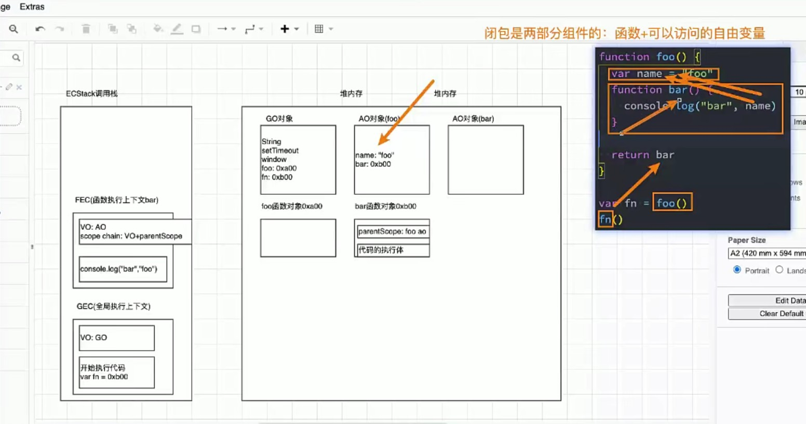

# 深入JavaScript运行原理

## 浏览器的工作原理


## 认识浏览器的内核

- 我们经常会说：不同的浏览器有不同的内核组成

  - Gecko：早期被Netscape和Mozilla Firefox浏览器浏览器使用；

  - Trident：微软开发，被IE4~IE11浏览器使用，但是Edge浏览器已经转向Blink； 

  - Webkit：苹果基于KHTML开发、开源的，用于Safari，Google Chrome之前也在使用；

  - Blink：是Webkit的一个分支，Google开发，目前应用于Google Chrome、Edge、Opera等；

  - 等等...

- 事实上，我们经常说的浏览器内核指的是浏览器的排版引擎： 
  - **排版引擎**（layout engine），也称为**浏览器引擎**（browser engine）、**页面渲染引擎**（rendering engine） 或**样版引擎**。


## 浏览器渲染过程


- 在这个执行过程中，HTML解析的时候遇到了JavaScript标签，应该怎么办呢？
  - 会停止解析HTML，而去加载和执行JavaScript代码；

- 那么，JavaScript代码由谁来执行呢？
  - **JavaScript引擎**


## 认识JavaScript引擎

- **为什么需要JavaScript引擎呢？**

  - 我们前面说过，高级的编程语言都是需要转成最终的机器指令来执行的；

  - 事实上我们编写的JavaScript无论你交给浏览器或者Node执行，最后都是需要被CPU执行的；

  - 但是CPU只认识自己的指令集，实际上是机器语言，才能被CPU所执行；

  - 所以我们需要JavaScript引擎帮助我们将JavaScript代码翻译成CPU指令来执行；

- **比较常见的JavaScript引擎有哪些呢？**

  - **SpiderMonkey**：第一款JavaScript引擎，由Brendan Eich开发（也就是JavaScript作者）；

  - **Chakra**：微软开发，用于IT浏览器； 

  - **JavaScriptCore**：WebKit中的JavaScript引擎，Apple公司开发；

  - **V8**：Google开发的强大JavaScript引擎，也帮助Chrome从众多浏览器中脱颖而出；

  - 等等…


## 浏览器内核和JS引擎的关系

- 这里我们先以WebKit为例，WebKit事实上由两部分组成的：

  - **WebCore：**负责HTML解析、布局、渲染等等相关的工作；

  - **JavaScriptCore：**解析、执行JavaScript代码； 

    

- 在小程序中编写的JavaScript代码就是被JSCore执行的；


- 另外一个强大的JavaScript引擎就是V8引擎。


## V8引擎的原理

- 我们来看一下官方对V8引擎的定义： 

  - V8是用C ++编写的Google开源高性能JavaScript和WebAssembly引擎，它用于Chrome和Node.js等。

  - 它实现ECMAScript和WebAssembly，并在Windows 7或更高版本，macOS 10.12+和使用x64，IA-32， ARM或MIPS处理器的Linux系统上运行。

  - V8可以独立运行，也可以嵌入到任何C ++应用程序中。


## V8引擎的架构

- V8引擎本身的源码**非常复杂**，大概有超过**100w行C++代码**，通过了解它的架构，我们可以知道它是如何对JavaScript执行的：

- Parse模块会将JavaScript代码转换成AST（抽象语法树）（进行词法分析、语法分析），这是因为解释器并不直接认识JavaScript代码；

  - 如果函数没有被调用，那么是不会被转换成AST的；

  - Parse的V8官方文档：https://v8.dev/blog/scanner

- Ignition是一个解释器，会将AST转换成ByteCode（字节码），通过字节码可以让不同系统的CPU都能运行。

  - 同时会收集TurboFan优化所需要的信息（比如函数参数的类型信息，有了类型才能进行真实的运算）；

  - 如果函数只调用一次，Ignition会执行解释执行ByteCode； 

  - Ignition的V8官方文档：https://v8.dev/blog/ignition-interpreter

- TurboFan是一个编译器，可以将字节码编译为CPU可以直接执行的机器码；（使得字节码不再都是通过字节码->汇编指令->机器码的方式进行转化，提升了性能）

  - 如果一个函数被多次调用，那么就会被标记为热点函数，那么就会经过TurboFan转换成优化的机器码，提高代码的执行性能； 

  - 但是，机器码实际上也会被还原为ByteCode，这是因为如果后续执行函数的过程中，类型发生了变化（比如sum函数原来执行的是number类型，后来执行变成了string类型），之前优化的机器码并不能正确的处理运算，就会逆向的转换成字节码；

  - TurboFan的V8官方文档：https://v8.dev/blog/turbofan-jit


## V8引擎的解析图


- **那么我们的JavaScript源码是如何被解析（Parse过程）的呢？**

- Blink将源码交给V8引擎，Stream获取到源码并且进行编码转换；

- Scanner会进行词法分析（lexical analysis），词法分析会将代码转换成tokens； 

- 接下来tokens会被转换成AST树，经过Parser和PreParser： 

  - Parser就是直接将tokens转成AST树架构；

  - PreParser称之为预解析，为什么需要预解析呢？

    - 这是因为并不是所有的JavaScript代码，在一开始时就会被执行。那么对所有的JavaScript代码进行解析，必然会影响网页的运行效率；

    - 所以V8引擎就实现了Lazy Parsing（延迟解析）的方案，它的作用是将不必要的函数进行预解析，也就是只解析暂时需要的内容，而对函数的全量解析是在函数被调用时才会进行；

    - 比如我们在一个函数outer内部定义了另外一个函数inner，那么inner函数就会进行预解析；

- 生成AST树后，会被Ignition转成字节码（bytecode），之后的过程就是代码的执行过程（后续会详细分析）。


## JavaScript 代码的执行过程

- 假如我们有下面一段代码，它在JavaScript中是如何被执行的呢？


- js引擎会在执行代码之前，会在堆内存中创建一个全局对象：Global Object（GO） 

  - 该对象 所有的作用域（scope）都可以访问； 

  - 里面会包含Date、Array、String、Number、setTimeout、setInterval等等；

  - 其中还有一个window属性指向自己；

  

- js引擎内部有一个**执行上下文栈（Execution Context Stack，简称ECS）**，它是用于执行**代码的调用栈**。 

- 那么现在它要执行谁呢？执行的是**全局的代码块**： 

  - 全局的代码块为了执行会构建一个 **Global Execution Context（GEC）**； 

  - GEC会 被放入到ECS中 执行；

- **GEC被放入到ECS中里面包含两部分内容：**

  - **第一部分：**在代码执行前，在parser转成AST的过程中，会将全局定义的变量、函数等加入到GlobalObject中，但是并不会赋值；若有函数，会为函数在对内存中建立对应的存储空间，其中包含父作用域与函数的执行体（代码块） ，然后给 GlobalObject 的函数变量赋值一个这个函数的地址。
    - 这个过程也称之为变量的作用域提升（hoisting） 

  - **第二部分：**在代码执行中，对变量赋值，或者执行其他的函数；

  

  


- 在执行的过程中**执行到一个函数时**，就会根据**函数体**创建一个**函数执行上下文（Functional Execution Context，简称FEC）**，并且压入到**EC Stack**中。 

- FEC中包含三部分内容：

  - 第一部分：在解析函数成为AST树结构时，会创建一个Activation Object（AO）：
    - AO中包含形参、arguments、函数定义和指向函数对象、定义的变量；

  - 第二部分：作用域链：由VO（在函数中就是AO对象）和父级VO（在函数编译时就确定了）组成，`查找时会一层层查找`； 

  - 第三部分：this绑定的值：这个我们后续会详细解析；


- 当函数执行结束后，FEC会出栈，并将 AO 也销毁。
- 同时，函数中若再有函数，根据编译原理，其会进行预编译，直到执行了 foo 函数（执行函数前AO对象创建），其才会真正被编译。之后执行 bar 函数时，为其创建 AO 对象。当发现其内部使用 name时，会依据作用域链查找name（此处window全局对象中有 name，测试时尽量使用别的变量）。


## 例题

```javascript
var message = "Hello Global";

function foo() {
  console.log(message);		// 会输出 Hello Global,因为函数的作用域是在定义的时候确定的
}

function bar() {
  var message = "Hello Bar";
  foo();
}

bar();	
```


​                                                                                          

## 变量环境和环境记录

- 其实我们上面的讲解都是基于早期ECMA的版本规范： 


- 在最新的ECMA的版本规范中，对于一些词汇进行了修改：


- 通过上面的变化我们可以知道，在最新的ECMA标准中，我们前面的变量对象VO已经有另外一个称呼了变量环境VE。


## 面试题

```javascript
var n = 100;

function foo() {
  n = 200;
}

foo();

console.log(n); // 200
```

```javascript
function foo() {
  console.log(n); //undefined
  var n = 200;
  console.log(n); // 200
}

var n = 100;
foo();
```

```javascript
var n = 100;

function foo1() {
  console.log(n); // 100
}

function foo2() {
  var n = 200;
  console.log(n); // 200
  foo1();
}

foo2();
console.log(n); // 100
```

```javascript
var a = 100;

function foo() {
  console.log(a);   // undefined
  return;
  var a = 100;
}

foo();
```

```javascript
function foo() {
  var a = b = 100;
}

foo();

console.log(a);   // 报错
console.log(b);   // 100
```


# JS的内存管理和闭包

## 认识内存管理

- 不管什么样的编程语言，在**代码的执行过程中都是需要给它分配内存**的，不同的是**某些编程语言**需要我们**自己手动的管理内存**，**某些编程语言**可以**自动帮助我们管理内存**： 

- 不管以什么样的方式来管理内存，**内存的管理都会有如下的生命周期**： 

  - 第一步：分配申请你需要的内存（申请）；

  - 第二步：使用分配的内存（存放一些东西，比如对象等）；

  - 第三步：不需要使用时，对其进行释放；

- **不同的编程语言对于第一步和第三步会有不同的实现：**

  - 手动管理内存：比如C、C++，包括早期的OC，都是需要手动来管理内存的申请和释放的（malloc和free函数）；

  - 自动管理内存：比如Java、JavaScript、Python、Swift、Dart等，它们有自动帮助我们管理内存；

- 我们可以知道JavaScript通常情况下是不需要手动来管理的。


## JS的内存管理

- 但是内存分配方式是一样的吗？

  - JS对于`基本数据类型内存的分配`会在执行时，直接在栈空间进行分配；

  - JS对于`复杂数据类型内存的分配`会在堆内存中开辟一块空间，并且将这块空间的指针返回值变量引用；


## JS的垃圾回收

- 因为**内存的大小是有限**的，所以当**内存不再需要的时候**，我们需要**对其进行释放**，以便腾出**更多的内存空间**。 

- 在**手动管理内存的语言**中，我们需要通过**一些方式自己来释放不再需要的内存，比如free函数**： 

  - 但是这种管理的方式其实非常的低效，影响我们编写逻辑的代码的效率； 

  - 并且这种方式对开发者的要求也很高，并且一不小心就会产生内存泄露； 

- 所以大部分**现代的编程语言都是有自己的垃圾回收机制**： 

  - 垃圾回收的英文是Garbage Collection，简称GC； 

  - 对于那些不再使用的对象，我们都称之为是垃圾，它需要被回收，以释放更多的内存空间；

  - 而我们的语言运行环境，比如Java的运行环境JVM，JavaScript的运行环境js引擎都会内存 **垃圾回收器**； 

  - 垃圾回收器我们也会简称为GC，所以在很多地方你看到GC其实指的是垃圾回收器；

- 但是这里又出现了另外一个很关键的问题：**GC怎么知道哪些对象是不再使用的呢？**
  - 这里就要用到GC的算法了


## 常见的GC算法 - 引用计数

- **引用计数：**

  - 当一个对象有一个引用指向它时，那么这个对象的引用就+1，当一个对象的引用为0时，这个对象就可以被销毁掉；

  - 这个算法有一个很大的弊端就是会产生循环引用，导致引用计数一直不会清空，最终造成内存泄漏；

  


##常见的GC算法 - 标记清除

- **标记清除：**
  - 这个算法是设置一个根对象（root object），垃圾回收器会定期从这个根开始，找所有从根开始有引用到的对象，对于哪些没有引用到的对象，就认为是不可用的对象；
  - 这个算法可以很好的解决循环引用的问题；


- JS引擎比较广泛的采用的就是标记清除算法，当然类似于V8引擎为了进行更好的优化，它在算法的实现细节上也会结合一些其他的算法。


## JS中函数是一等公民

- 在JavaScript中，函数是非常重要的，并且是一等公民： 

  - 那么就意味着函数的使用是非常灵活的；

  - 函数可以作为另外一个函数的参数，也可以作为另外一个函数的返回值来使用；

- 自己编写高阶函数

  - 高阶函数：把一个函数如果接收另外一个函数作为参数，或者该函数会返回另外一个函数作为返回值的函数，那么这个函数就称之为高阶函数

  ```javascript
  function calc(num1, num2, calcFn) {		// calc 为高阶函数
    console.log(calcFn(num1, num2));
  }
  
  function add(num1, num2) {
    return num1 + num2;
  }
  function sub(num1, num2) {
    return num1 - num2;
  }
  function mul(num1, num2) {
    return num1 * num2;
  }
  
  calc(m, n, add);
  ```

  ```javascript
  function makeAdder(count) {		// makeAdder 也为高阶函数
    return function add(num) {
      return count + num;
    };
  }
  
  var add5 = makeAdder(5);
  console.log(add5(6));
  console.log(add5(10));
  
  var add10 = makeAdder(10);
  var add100 = makeAdder(100);
  ```

- 使用内置的高阶函数

```javascript
// 1.filter：过滤
// [10,5,11,100,55]
var newNums = nums.filter(function (item, index, arr) {
  return item % 2 === 0; // 偶数
});

console.log(newNums);

// 2.map：映射
var newNums2 = nums.map(function (item) {
  return item * 10;
});
console.log(newNums2);

// 3.forEach：迭代
nums.forEach(function (item) {
  console.log(item);
});

// 4.find/findIndex
// es6-12
var item = nums.find(function (item) {
  return item === 11;
});
console.log(item);

var friends = [
  { name: "why", age: 18 },
  { name: "kobe", age: 40 },
  { name: "james", age: 35 },
  { name: "curry", age: 30 },
];

const findFriend = friends.find(function (item) {
  return item.name === "james";
});
console.log(findFriend);

var friendIndex = friends.findIndex(function (item) {
  return item.name === "james";
});
console.log(friendIndex);

// 5.reduce：累加
var total = nums.reduce(function (prevValue, item) {
  return prevValue + item;
}, 0); // 第二个参数不传默认为0
console.log(total);
```

## JS中闭包的定义

- 这里先来看一下闭包的定义，分成两个：在计算机科学中和在JavaScript中。

- 在计算机科学中对闭包的定义（维基百科）：

  - 闭包（英语：Closure），又称**词法闭包**（Lexical Closure）或**函数闭包**（function closures）；

  - 是在支持 **头等函数** 的编程语言中，实现词法绑定（上层作用域在词法解析的时候便已确定）的一种技术；

  - 闭包在实现上是一个结构体，它存储了一个函数和一个关联的环境（相当于一个符号查找表）；

  - 闭包跟函数最大的区别在于，当捕捉闭包的时候，它的 **自由变量** 会在捕捉时被确定，这样即使脱离了捕捉时的上下文，它也能照常运行；（比如下图中，即便bar函数是在 fn() 时才执行，但也能正常执行）

- 闭包的概念出现于60年代，最早实现闭包的程序是 Scheme，那么我们就可以理解为什么JavaScript中有闭包：
  
- 因为JavaScript中有大量的设计是来源于Scheme的；
  
- 我们再来看一下MDN对JavaScript闭包的解释：

  - 一个函数和对其周围状态（**lexical environment，词法环境**）的引用捆绑在一起（或者说函数被引用包围），这样的组合就是**闭包**（**closure**）；

  - 也就是说，闭包让你可以在一个内层函数中访问到其外层函数的作用域；

  - 在 JavaScript 中，每当创建一个函数，闭包就会在函数创建的同时被创建出来；

  下面demo函数与name 也可称作闭包：

  ```javascript
  var name = "why"
  function demo() {
    console.log(name)
  }
  ```

- 那么我的理解和总结：

  - 一个普通的函数function，如果它可以访问外层作用域的自由变量，那么这个函数就是一个闭包；

  - 从广义的角度来说：JavaScript中的函数都是闭包；

  - 从狭义的角度来说：JavaScript中一个函数，如果访问了外层作用于的变量，那么它是一个闭包；




## 闭包的访问过程

- 如果我们编写了如下的代码，它一定是形成了闭包的（add10 在堆内存中存储的函数对象中的 scope 指向了 makeAdder 的AO对象，这使得只要add10 不被销毁，makeAdder 的AO对象就会一直存在）：


- 那么函数继续执行呢？ 

  - 这个时候makeAdder函数执行完毕，正常情况下我们的AO对象会被释放；

  - 但是因为在0xb00的函数中有作用域引用指向了这个AO对象，所以它不会被释放掉；


## 闭包的内存泄漏

- 那么我们为什么经常会说闭包是有内存泄露的呢？ 

  - 在上面的案例中，如果后续我们不再使用add10函数了，那么该函数对象应该要被销毁掉，并且其引用着的父 作用域AO也应该被销毁掉；

  - 但是目前因为在全局作用域下add10变量对0xb00的函数对象有引用，而0xb00的作用域中AO（0x200）有引用，所以最终会造成这些内存都是无法被释放的；

  - 所以我们经常说的闭包会造成内存泄露，其实就是刚才的引用链中的所有对象都是无法释放的；

- 那么，怎么解决这个问题呢？ 

  - 因为当将add10设置为null时，就不再对函数对象0xb00有引用，那么对应的AO对象0x200也就不可达了；

  - 在GC的下一次检测中，它们就会被销毁掉；

  


## 内存泄漏测试


- 图中我们向 arrFns 中不断的添加数据，使得内存逐渐攀升。之后在 10s 后，我们将数据不断从数组中移除，但浏览器不会一个一个移除，而是会等待一段时间后统一移除，这就使得内存曲线在上升后，保持一段时间再突然下降。

## AO不使用的问题

- 我们来研究一个问题：AO对象不会被销毁时，是否里面的所有属性都不会被释放？

  - 下面这段代码中name属于闭包的父作用域里面的变量；

  - 我们知道形成闭包之后count一定不会被销毁掉，那么name是否会被销毁掉呢？ 

  - 这里我打上了断点，我们可以在浏览器上看看结果；

 


# JS函数中的 this 指向

## 为什么需要this?

- 在常见的编程语言中，几乎都有this这个关键字（Objective-C中使用的是self），但是JavaScript中的this和常见的面向对象语言中的this不太一样：

  - 常见面向对象的编程语言中，比如Java、C++、Swift、Dart等等一系列语言中，this通常只会出现在类的方法中。

  - 也就是你需要有一个类，类中的方法（特别是实例方法）中，this代表的是当前调用对象。

  - 但是JavaScript中的this更加灵活，无论是它出现的位置还是它代表的含义。

- 我们来看一下编写一个obj的对象，有this和没有this的区别


- 若后期对象名改变，若使用了this，我们不需要对代码体做任何修改，而若没使用this，我们就需要将代码体中的所有 obj 改为修改后的对象名。可见使用 this 可以更方便我们书写代码。


## this指向什么呢？

- 我们先说一个最简单的，this在全局作用于下指向什么？
  
- 这个问题非常容易回答，在浏览器中测试就是指向window。在node中为空对象->{}  （因为node中会将文件看做一个模块，加载模块并编译，然后将所有代码放到一个函数中，然后通过 apply({}) 执行这个函数）
  
- 但是，开发中很少直接在全局作用于下去使用this，通常都是在**函数中使用**。 

  - 所有的函数在被调用时，都会创建一个执行上下文：

  - 这个上下文中记录着函数的调用栈、AO对象等；

  - this也是其中的一条记录；

- 我们先来看一个让人困惑的问题：

  - 定义一个函数，我们采用三种不同的方式对它进行调用，它产生了三种不同的结果

  ```javascript
  // this指向什么, 跟函数所处的位置是没有关系的
  // 跟函数被调用的方式是有关系
  
  function foo() {
    console.log(this)
  }
  
  // 1.直接调用这个函数
  foo()		
  
  // 2.创建一个对象, 对象中的函数指向foo
  var obj = {
    name: 'why',
    foo: foo
  }
  
  obj.foo()		
  
  // 3.apply调用
  foo.apply("abc")
  ```

- 这个的案例可以给我们什么样的启示呢？

  - 1.函数在调用时，JavaScript会默认给this绑定一个值；

  - 2.this的绑定和定义的位置（编写的位置）没有关系；

  - 3.this的绑定和调用方式以及调用的位置有关系；

  - 4.this是在运行时被绑定的；

- 那么this到底是怎么样的绑定规则呢？

  - 绑定一：默认绑定；

  - 绑定二：隐式绑定；

  - 绑定三：显示绑定；

  - 绑定四：new绑定；


## 规则一：默认绑定

- 什么情况下使用默认绑定呢？独立函数调用。
  - 独立的函数调用我们可以理解成函数没有被绑定到某个对象上进行调用；

- 我们通过几个案例来看一下，常见的默认绑定

```javascript
// 默认绑定: 独立函数调用
// 1.案例一:
function foo() {
  console.log(this); // Window
}

foo();

// 2.案例二:
function foo1() {
  console.log(this); // Window
}

function foo2() {
  console.log(this); // Window
  foo1();
}

function foo3() {
  console.log(this); // Window
  foo2();
}

foo3();

// 3.案例三:
var obj = {
  name: "why",
  foo: function () {
    console.log(this);
  },
};

var bar = obj.foo;
bar(); // window

// 4.案例四:
function foo() {
  console.log(this);
}
var obj = {
  name: "why",
  foo: foo,
};

var bar = obj.foo;
bar(); // window

// 5.案例五:
function foo() {
  function bar() {
    console.log(this);
  }
  return bar;
}

var fn = foo();
fn(); // window

var obj = {
  name: "why",
  eating: fn,
};

obj.eating(); // 隐式绑定 {name: 'why', eating: ƒ}
```

## 规则二：隐式绑定

- 另外一种比较常见的调用方式是通过某个对象进行调用的：
  - 也就是它的调用位置中，是通过某个对象发起的函数调用。

- 我们通过几个案例来看一下，常见的默认绑定

```javascript
// 隐式绑定: object.fn()
// object对象会被js引擎绑定到fn函数中的this里面
// 1.案例一:
var obj = {
  name: "why",
  foo: foo,
};

obj.foo(); // obj对象

// 2.案例二:
var obj = {
  name: "why",
  eating: function () {
    console.log(this.name + "在吃东西");
  },
  running: function () {
    console.log(obj.name + "在跑步");
  },
};

obj.eating()
obj.running()

// var fn = obj.eating;
// fn();  // 默认绑定为Window，这种方式获取不到 this.name

// 3.案例三:
var obj1 = {
  name: "obj1",
  foo: function () {
    console.log(this); // obj2
  },
};

var obj2 = {
  name: "obj2",
  bar: obj1.foo,
};

obj2.bar();
```

## 规则三：显示绑定

- 隐式绑定有一个前提条件：

  - 必须在调用的对象内部有一个对函数的引用（比如一个属性）；

    ```javascript
    var obj = {
      name: "obj",
      foo: foo, // 若不想以这种添加属性的方式通过 obj.foo 使得 foo 中的this执行obj，便可使用 call 或 apply 函数。
    };
    ```

  - 如果没有这样的引用，在进行调用时，会报找不到该函数的错误；

  - 正是通过这个引用，间接的将this绑定到了这个对象上；

- 如果我们不希望在 **对象内部** 包含这个函数的引用，同时又希望在这个对象上进行强制调用，该怎么做呢？

  - JavaScript所有的函数都可以使用call和apply方法（这个和Prototype有关）。

    - 它们两个的区别这里不再展开；

    - 其实非常简单，第一个参数是相同的，后面的参数，apply为数组，call为参数列表；

  - 这两个函数的第一个参数都要求是一个对象，这个对象的作用是什么呢？就是给this准备的。

  - 在调用这个函数时，会将this绑定到这个传入的对象上。

- 因为上面的过程，我们明确的绑定了this指向的对象，所以称之为 **显示绑定**。


### call、apply、bind

- **通过call或者apply绑定this对象**

  - 显示绑定后，this就会明确的指向绑定的对象

  ```javascript
  // 1.foo直接调用和call/apply调用的不同在于this绑定的不同
  // foo直接调用指向的是全局对象(window)
  // foo()
  
  var obj = {
    name: "obj",
    // foo: foo, // 若不想以这种添加属性的方式通过 obj.foo 使得 foo 中的this执行obj，便可使用 call 或 apply 函数。
  };
  
  // call/apply是可以指定this的绑定对象
  // foo.call(obj)
  // foo.apply(obj)
  // foo.apply("aaaa")
  
  // 2.call和apply有什么区别?   call 从第二个常参数起，都是调用call那个函数的参数，
  // 而apply 只有两个参数，第二个参数为一个数组，数组中每一项对应调用apply 那个函数的参数。
  function sum(num1, num2, num3) {
    console.log(num1 + num2 + num3, this);
  }
  
  sum.call("call", 20, 30, 40);
  sum.apply("apply", [20, 30, 40]);
  
  // 3.call和apply在执行函数时,是可以明确的绑定this, 这个绑定规则称之为显示绑定
  ```

  

- **如果我们希望一个函数总是显示的绑定到一个对象上，便可以使用 bind。**

  ```javascript
  function foo() {
    console.log(this);
  }
  
  // foo.call("aaa")
  // foo.call("aaa")
  // foo.call("aaa")
  // foo.call("aaa")
  
  // bind 调用后返回一个新的函数，在堆内存中开辟一个新的空间
  var newFoo = foo.bind("aaa");
  
  newFoo();
  newFoo();
  newFoo();
  newFoo();
  newFoo();
  newFoo();
  ```

  - 可以看到，当我们要将一个函数的 this 始终绑定某一个值，可以使用bind，然后调用其生成的新的函数。这种调用方式明显比 call 来的方便。


## 规则四：new 绑定

- JavaScript中的函数可以当做一个类的构造函数来使用，也就是使用new关键字。

- 使用new关键字来调用函数是，会执行如下的操作：

  1. 创建一个全新的对象；

  2. 这个新对象会被执行prototype连接；

  3. 这个新对象会绑定到函数调用的this上（this的绑定在这个步骤完成）；

  4. 如果函数没有返回其他对象，表达式会返回这个新对象；

```javascript
// 我们通过一个new关键字调用一个函数时(构造器), 这个时候this是在调用这个构造器时创建出来的对象
// this = 创建出来的对象
// 这个绑定过程就是new 绑定

function Person(name, age) {
  this.name = name;
  this.age = age;
}

var p1 = new Person("why", 18);
console.log(p1.name, p1.age);

var p2 = new Person("kobe", 30);
console.log(p2.name, p2.age);

var obj = {
  foo: function () {
    console.log(this);
  },
};

new obj.foo();		// foo{}
```


## 内置函数的绑定思考

- 有些时候，我们会调用一些JavaScript的内置函数，或者一些第三方库中的内置函数。

  - 这些内置函数会要求我们传入另外一个函数；

  - 我们自己并不会显示的调用这些函数，而且JavaScript内部或者第三方库内部会帮助我们执行；

  - 这些函数中的this又是如何绑定的呢？

- **setTimeout、数组的forEach、div的点击**

```javascript
// 1.setTimeout
function hySetTimeout(fn, duration) {
  fn.call("abc");
}

hySetTimeout(function () {
  console.log(this); // window
}, 3000);

setTimeout(function () {
  console.log(this); // window
}, 2000);

// 2.监听点击
const boxDiv = document.querySelector(".box");
boxDiv.onclick = function () {
  console.log(this); // 元素对象
};

boxDiv.addEventListener("click", function () {
  console.log(this); // 元素对象
});
boxDiv.addEventListener("click", function () {
  console.log(this); // 元素对象
});
boxDiv.addEventListener("click", function () {
  console.log(this); // 元素对象
});

// 3.数组.forEach/map/filter/find
var names = ["abc", "cba", "nba"];
names.forEach(function (item) {
  console.log(item, this); // window
});
names.forEach(function (item) {
  console.log(item, this); // {"abc"}
}, "abc");
names.map(function (item) {
  console.log(item, this); // {"cba"}
}, "cba");
```


## 规则优先级

- 如果一个函数调用位置应用了多条规则，优先级谁更高呢？

- **1.默认规则的优先级最低**
  
- 毫无疑问，默认规则的优先级是最低的，因为存在其他规则时，就会通过其他规则的方式来绑定this
  
- **2.显示绑定优先级高于隐式绑定**

  - 代码测试

  ```javascript
  var obj = {
    name: "obj",
    foo: function () {
      console.log(this);
    },
  };
  
  // obj.foo()
  
  // 1.call/apply的显示绑定高于隐式绑定
  obj.foo.apply("abc"); // {"abc"}
  obj.foo.call("abc"); // {"abc"}
  
  // 2.bind的优先级高于隐式绑定
  var bar = obj.foo.bind("cba");
  bar(); // {"cba"}
  
  // 3.更明显的比较
  function foo() {
    console.log(this);
  }
  
  var obj = {
    name: "obj",
    foo: foo.bind("aaa"),
  };
  
  obj.foo(); // {"aaa"}
  
  ```

- **3.new绑定优先级高于隐式绑定**

  - 代码测试

  ```javascript
  var obj = {
    name: "obj",
    foo: function () {
      console.log(this); // foo{}
    },
  };
  
  // new的优先级高于隐式绑定
  var f = new obj.foo();
  ```

- **4.new绑定优先级高于bind**

  - new绑定和call、apply是不允许同时使用的，所以不存在谁的优先级更高

  - new绑定可以和bind一起使用，new绑定优先级更高
  - 代码测试

```javascript
// 结论: new关键字不能和apply/call一起来使用(因为apply、call会直接执行函数，new同样会执行函数)，因此此处只能比较其与 bind 的优先级

// new的优先级高于bind
function foo() {
  console.log(this);
}

var bar = foo.bind("aaa");

var obj = new bar(); // foo{} -> 可见 new绑定的优先级高于 bind（new 回去找原函数，并返回一个原函数的对象）
```

- 补充：如果 bind 和 call/apply一起使用，bind的优先级更高

```javascript
foo.bind("abc").call("def"); // {'abc'} -> 可见 bind的优先级高于call
foo.bind("abc").apply("def"); // {'abc'} -> 可见 bind的优先级高于apply
```


## this规则之外 – 忽略显示绑定

- 我们讲到的规则已经足以应付平时的开发，但是总有一些语法，超出了我们的规则之外。（神话故事和动漫中总是有类似这样的人物）

- 如果在显示绑定中，我们传入一个null或者undefined，那么这个显示绑定会被忽略，使用默认规则：

  ```javascript
  function foo() {
    console.log(this);
  }
  
  foo.apply("abc"); // {"abc"}
  foo.apply({}); // {}
  
  // apply/call/bind: 当传入null/undefined时, 自动将this绑定成全局对象
  foo.apply(null);		// window
  foo.apply(undefined);		// window
  
  var bar = foo.bind(null);		// window
  bar();
  ```


## this规则之外 - 间接函数引用

- 另外一种情况，创建一个函数的 间接引用，这种情况使用默认绑定规则。

  - 赋值(obj2.foo = obj1.foo)的结果是foo函数；

  - foo函数被直接调用，那么是默认绑定；


## 箭头函数 arrow function

- 箭头函数是ES6之后增加的一种编写函数的方法，并且它比函数表达式要更加简洁： 

  - 箭头函数不会绑定this、arguments属性； 

  - 箭头函数不能作为构造函数来使用（不能和new一起来使用，会抛出错误）；

- 箭头函数如何编写呢？

  - *(): 函数的参数* 

  - *{}: 函数的执行体*

  


- 箭头函数的编写优化

  - 优化一: 如果只有一个参数()可以省略 

  - 优化二: 如果函数执行体中只有一行代码, 那么可以省略大括号
    - 并且这行代码的返回值会作为整个函数的返回值

  - 优化三: 如果函数执行体只有返回一个对象, 那么需要给这个对象加上()

```javascript
// 1.编写箭头函数
// 1> (): 参数
// 2> =>: 箭头
// 3> {}: 函数的执行体
var foo = (num1, num2, num3) => {
  console.log(num1, num2, num3);
  var result = num1 + num2 + num3;
  console.log(result);
};

// 高阶函数在使用时, 也可以传入箭头函数
var nums = [10, 20, 45, 78];
nums.forEach((item, index, arr) => {});

// 箭头函数有一些常见的简写:
// 简写一: 如果参数只有一个, ()可以省略
nums.forEach(item => {
  console.log(item);
});

// 简写二: 如果函数执行体只有一行代码, 那么{}也可以省略
// 强调: 并且它会默认将这行代码的执行结果作为返回值
nums.forEach((item) => console.log(item));
var newNums = nums.filter((item) => item % 2 === 0);
console.log(newNums);

// filter/map/reduce
var result = nums
  .filter((item) => item % 2 === 0)
  .map((item) => item * 100)
  .reduce((preValue, item) => preValue + item);
console.log(result);

// 简写三: 如果一个箭头函数, 只有一行代码, 并且返回一个对象, 这个时候如何编写简写
// var bar = () => {
//   return { name: "why", age: 18 }
// }

// 注意：此处需要加 () ，否则会将 {} 中的内容看做函数执行体
var bar = () => ({ name: "why", age: 18 });
```


## this规则之外 - ES6箭头函数

- 箭头函数不使用this的四种标准规则（也就是不绑定this），而是根据外层作用域来决定this。

```javascript
var name = "why";

var foo = () => {
  console.log(this);
};

foo(); // window
var obj = { foo: foo };
obj.foo(); // window
foo.call("abc"); // window
```


- 我们来看一个模拟网络请求的案例：

  - 这里我使用setTimeout来模拟网络请求，请求到数据后如何可以存放到data中呢？

  - 我们需要拿到obj对象，设置data； 

  - 但是直接拿到的this是window，我们需要在外层定义：var _this = this

  - 在setTimeout的回调函数中使用_this就代表了obj对象

- 在ES6之前是我们最常用的方式，从ES6开始，我们会使用箭头函数：

  - 为什么在setTimeout的回调函数中可以直接使用this呢？

  - 因为箭头函数并不绑定this对象，那么this引用就会从上层作用于中找到对应的this

```javascript
var obj = {
  data: [],
  getData: function () {
    // 发送网络请求, 将结果放到上面data属性中
    // 由于 setTimeout 中的 this 是window，所以此处无法直接通过 this.data 获取到 data
    // 在箭头函数之前的解决方案
    // var _this = this
    // setTimeout(function() {
    //   var result = ["abc", "cba", "nba"]
    //   _this.data = result
    // }, 2000);
      
    // 箭头函数之后
    setTimeout(() => {
      var result = ["abc", "cba", "nba"];
      this.data = result;
    }, 2000);
  },
};

obj.getData();
```

- 思考：如果getData也是一个箭头函数，那么setTimeout中的回调函数中的this指向谁呢？
  - window，因为obj 是一个对象，没有上下文的概念，所以getData 会获取到 GO 中的 this。


## 面试题

```javascript
var name = "window";

var person = {
  name: "person",
  sayName: function () {
    console.log(this.name);
  }
};

function sayName() {
  var sss = person.sayName;
  sss(); // window: 独立函数调用
  person.sayName(); // person: 隐式调用
  (person.sayName)(); // person: 隐式调用
  (b = person.sayName)(); // window: 赋值表达式(独立函数调用)
}

sayName();
```

```javascript
var name = 'window'

var person1 = {
  name: 'person1',
  foo1: function () {
    console.log(this.name)
  },
  foo2: () => console.log(this.name),
  foo3: function () {
    return function () {
      console.log(this.name)
    }
  },
  foo4: function () {
    return () => {
      console.log(this.name)
    }
  }
}

var person2 = { name: 'person2' }

// person1.foo1(); // person1(隐式绑定)
// person1.foo1.call(person2); // person2(显示绑定优先级大于隐式绑定)

// person1.foo2(); // window(不绑定作用域,上层作用域是全局)
// person1.foo2.call(person2); // window

// person1.foo3()(); // window(独立函数调用)
// person1.foo3.call(person2)(); // window(独立函数调用)
// person1.foo3().call(person2); // person2(最终调用返回函数式, 使用的是显示绑定)

// person1.foo4()(); // person1(箭头函数不绑定this, 上层作用域this是person1)
// person1.foo4.call(person2)(); // person2(上层作用域被显示的绑定了一个person2)
// person1.foo4().call(person2); // person1(上层找到person1)
```

```javascript
var name = 'window'

function Person (name) {
  this.name = name
  this.foo1 = function () {
    console.log(this.name)
  },
  this.foo2 = () => console.log(this.name),
  this.foo3 = function () {
    return function () {
      console.log(this.name)
    }
  },
  this.foo4 = function () {
    return () => {
      console.log(this.name)
    }
  }
}

var person1 = new Person('person1')
var person2 = new Person('person2')

person1.foo1() // person1
person1.foo1.call(person2) // person2(显示高于隐式绑定)

person1.foo2() // person1 (上层作用域中的this是person1)
person1.foo2.call(person2) // person1 (上层作用域中的this是person1)

person1.foo3()() // window(独立函数调用)
person1.foo3.call(person2)() // window
person1.foo3().call(person2) // person2

person1.foo4()() // person1
person1.foo4.call(person2)() // person2
person1.foo4().call(person2) // person1
```

```javascript
var name = 'window'

function Person (name) {
  this.name = name
  this.obj = {
    name: 'obj',
    foo1: function () {
      return function () {
        console.log(this.name)
      }
    },
    foo2: function () {
      return () => {
        console.log(this.name)
      }
    }
  }
}

var person1 = new Person('person1')
var person2 = new Person('person2')

person1.obj.foo1()() // window
person1.obj.foo1.call(person2)() // window
person1.obj.foo1().call(person2) // person2

person1.obj.foo2()() // obj
person1.obj.foo2.call(person2)() // person2
person1.obj.foo2().call(person2) // obj
```

# JS函数式编程

##  实现call

```javascript
// 给所有的函数添加一个hycall的方法
Function.prototype.hycall = function(thisArg, ...args) {
  // 在这里可以去执行调用的那个函数(foo)
  // 问题: 得可以获取到是哪一个函数执行了hycall
  // 1.获取需要被执行的函数
  var fn = this

  // 2.对thisArg转成对象类型(防止它传入的是非对象类型)
  thisArg = (thisArg !== null && thisArg !== undefined) ? Object(thisArg): window

  // 3.调用需要被执行的函数
  thisArg.fn = fn
  var result = thisArg.fn(...args)
  delete thisArg.fn

  // 4.将最终的结果返回出去
  return result
}

function foo() {
  console.log("foo函数被执行", this);
}

function sum(num1, num2) {
  console.log("sum函数被执行", this, num1, num2);
  return num1 + num2;
}
foo.hycall(undefined);
var result = sum.hycall("abc", 20, 30);
console.log("hycall的调用:", result);
```


## 实现 apply

```javascript
Function.prototype.hyapply = function(thisArg, argArray) {
  // 1.获取到要执行的函数
  var fn = this

  // 2.处理绑定的thisArg
  thisArg = (thisArg !== null && thisArg !== undefined) ? Object(thisArg): window

  // 3.执行函数
  thisArg.fn = fn
  var result

  // 为了避免 argArray 没有值，所以需要进行判断：
  
  // if (!argArray) { // argArray是没有值(没有传参数)
  //   result = thisArg.fn()
  // } else { // 有传参数
  //   result = thisArg.fn(...argArray)
  // }

  // argArray = argArray ? argArray: []
  argArray = argArray || []
  result = thisArg.fn(...argArray)

  delete thisArg.fn

  // 4.返回结果
  return result
}
function sum(num1, num2) {
  console.log("sum被调用", this, num1, num2)
  return num1 + num2
}

function foo(num) {
  return num
}
// 自己实现的调用
var result = sum.hyapply("abc", [20, 30])
console.log(result)

var result2 = foo.hyapply("abc", [20])
console.log(result2)
```

## 实现bind

```javascript
Function.prototype.hybind = function(thisArg, ...argArray) {
  // 1.获取到真实需要调用的函数
  var fn = this

  // 2.绑定this
  thisArg = (thisArg !== null && thisArg !== undefined) ? Object(thisArg): window

  function proxyFn(...args) {
    // 3.将函数放到thisArg中进行调用
    thisArg.fn = fn
    // 特殊: 对两个传入的参数进行合并
    var finalArgs = [...argArray, ...args]
    var result = thisArg.fn(...finalArgs)
    delete thisArg.fn

    // 4.返回结果
    return result
  }

  return proxyFn 
}
function foo() {
  console.log("foo被执行", this)
  return 20
}

function sum(num1, num2, num3, num4) {
  console.log(num1, num2, num3, num4)
}
// 使用自己定义的bind
var bar = foo.hybind("abc")
var result = bar()
console.log(result)

var newSum = sum.hybind("abc", 10, 20)
var result = newSum(30, 40)
```

## 认识 arguments

- **arguments** 是一个 对应于 **传递给函数的参数** 的 **类数组(array-like)对象**。 

- array-like意味着它不是一个数组类型，而是一个对象类型：

  - 但是它却拥有数组的一些特性，比如说length，比如可以通过index索引来访问；

  - 但是它却没有数组的一些方法，比如forEach、map等；

```javascript
function foo(num1, num2, num3) {
  // 类数组对象中(长的像是一个数组, 本质上是一个对象): arguments（会放到AO中）
  // console.log(arguments)

  // 常见的对arguments的操作是三个
  // 1.获取参数的长度
  console.log(arguments.length);

  // 2.根据索引值获取某一个参数
  console.log(arguments[2]);
  console.log(arguments[3]);
  console.log(arguments[4]);

  // 3.callee获取当前arguments所在的函数
  console.log(arguments.callee);
  // arguments.callee()
}

foo(10, 20, 30, 40, 50);
```


## arguments 转 array

```javascript
function foo(num1, num2) {
  // arguments转成array类型
  // 1.自己遍历arguments中所有的元素
  var newArr = [];
  for (var i = 0; i < arguments.length; i++) {
    newArr.push(arguments[i] * 10);
  }
  console.log(newArr);
    
  // 2.Array.prototype.slice将arguments转成array
  // 之所以 slice 后面要跟call ，是因为 slice 中的需要使用到this，并要求 this 是一个可遍历的对象
  var newArr2 = Array.prototype.slice.call(arguments);
  console.log(newArr2);

  var newArr3 = [].slice.call(arguments);
  console.log(newArr3);

  // 3.ES6的语法
  var newArr4 = Array.from(arguments);
  console.log(newArr4);
  var newArr5 = [...arguments];
  console.log(newArr5);
}

foo(10, 20, 30, 40, 50);
```

- 补充，Array 中的 slice 实现

```javascript
// 额外补充的知识点: Array中的slice实现
Array.prototype.hyslice = function (start, end) {
  var arr = this;
  start = start || 0;
  end = end || arr.length;
  var newArray = [];
  for (var i = start; i < end; i++) {
    newArray.push(arr[i]);
  }
  return newArray;
};

var newArray = Array.prototype.hyslice.call(["aaaa", "bbb", "cccc"], 1, 3);
console.log(newArray);

var names = ["aaa", "bbb", "ccc", "ddd"];
names.slice(1, 3);
```

## 箭头函数中不绑定 arguments

- 箭头函数是不绑定arguments的，所以我们在箭头函数中使用arguments会去上层作用域查找：

```javascript
// 1.案例一:
var foo = () => {
  console.log(arguments);
};

foo(); // 在浏览器环境下会报错，因为 window 对象中没有 arguments。而在 node 环境下有值，因为 node 中会使用 call({},xxx)调用整个文件。其后面的 xxx 会作为 arguments。

// 2.案例二:
function foo() {
  var bar = () => {
    console.log(arguments);		[Arguments] { '0': 123 }
  };
  return bar;
}

var fn = foo(123);
fn();
```

- 在 es5之后，一般会使用 args 来代替arguments 来获取参数。同时其在箭头函数中仍然可以正常使用。

```javascript
var foo = (num1, num2, ...args) => {
  console.log(args);		// 30,40,50
};

foo(10, 20, 30, 40, 50);
```

## 理解JavaScript 纯函数

- **函数式编程**中有一个非常重要的概念叫**纯函数**，JavaScript符合**函数式编程的范式**，所以也**有纯函数的概念**； 

  - 在**react开发中纯函数是被多次提及**的；

  - 比如**react中组件就被要求像是一个纯函数**（为什么是像，因为还有class组件），**redux中有一个reducer的概念**，也是要求必须是一个纯函数；

  - 所以**掌握纯函数对于理解很多框架的设计**是非常有帮助的；

- **纯函数的维基百科定义：**

  - 在程序设计中，若一个函数符合以下条件，那么这个函数被称为纯函数：

  - 此函数在相同的输入值时，需产生相同的输出，下面的函数就不是纯函数。 

  ```javascript
  var name = "abc"
  function foo(){
      return name
  }
  foo(123)
  name = "why"
  foo(123)
  ```

  - 函数和输出和输入值以外的其他隐藏信息或状态无关，也和由I/O设备产生的外部输出无关。

  - 该函数不能有语义上可观察的函数副作用，诸如“触发事件”，使输出设备输出，或更改输出值以外物件的内容等，下面的函数就因为修改了name，所以不是纯函数：

  ```javascript
  var name = "abc"
  function foo(){
      name = "why"
  }
  ```

  

- **当然上面的定义会过于的晦涩，所以我简单总结一下：**

  - 确定的输入，一定会产生确定的输出； 

  - 函数在执行过程中，不能产生副作用；


## 副作用的理解

- **那么这里又有一个概念，叫做副作用**，什么又是**副作用**呢？

  - **副作用（side effect）**其实本身是医学的一个概念，比如我们经常说吃什么药本来是为了治病，可能会产生一些其他的副作用；

  - 在计算机科学中，也引用了副作用的概念，表示在执行一个函数时，除了返回函数值之外，还对调用函数产生了附加的影响，比如修改了全局变量，修改参数或者改变外部的存储； 

- **纯函数在执行的过程中就是不能产生这样的副作用：**
  - 副作用往往是产生bug的 “温床”。


## 纯函数案例

- **我们来看一个对数组操作的两个函数：**

  - slice：slice截取数组时不会对原数组进行任何操作,而是生成一个新的数组；

  - splice：splice截取数组, 会返回一个新的数组, 也会对原数组进行修改；

  - slice就是一个纯函数，不会修改传入的参数；而splice会修改参数，所以不是纯函数。

```javascript
var names = ["abc", "cba", "nba", "dna"];

// slice只要给它传入一个start/end, 那么对于同一个数组来说, 它会给我们返回确定的值
// slice函数本身它是不会修改原来的数组
// slice -> this
// slice函数本身就是一个纯函数
var newNames1 = names.slice(0, 3);
console.log(newNames1);
console.log(names);

// ["abc", "cba", "nba", "dna"]
// splice在执行时, 有修改掉调用的数组对象本身, 修改的这个操作就是产生的副作用
// splice不是一个纯函数
var newNames2 = names.splice(2);
console.log(newNames2);
console.log(names);
```

```javascript
// foo函数是否是一个纯函数? 是
// 1.相同的输入一定产生相同的输出
// 2.在执行的过程中不会产生任何的副作用
function foo(num1, num2) {
  return num1 * 2 + num2 * num2;
}

// bar不是一个纯函数, 因为它修改了外界的变量
var name = "abc";
function bar() {
  console.log("bar其他的代码执行");	// 即使没有下行的修改 name 的操作，但是此处进行了输出，从某种程度上而言其也并非纯函数。
  name = "cba";
}

bar();

console.log(name);

// baz也不是一个纯函数, 因为我们修改了传入的参数
function baz(info) {
  info.age = 100;
}

var obj = { name: "why", age: 18 };
baz(obj);
console.log(obj);

// test是否是一个纯函数? 是一个纯函数
function test(info) {
  return {
    ...info,
    age: 100,
  };
}

test(obj);
test(obj);
test(obj);
test(obj);

// add 不是一个纯函数，因为其依赖了外部的全局变量
let foo = 5;
function add(num) {
  return foo + num;
}

console.log(add(5));
foo = 10;
console.log(add(5));
```


## 纯函数的优势

- **为什么纯函数在函数式编程中非常重要呢？**

  - 因为你可以安心的编写和安心的使用； 

  - 你在**写的时候**保证了函数的纯度，只是单纯实现自己的业务逻辑即可，不需要关心传入的内容是如何获得的或者依赖其他的外部变量是否已经发生了修改；

  - 你在**用的时候**，你确定你的输入内容不会被任意篡改，并且自己确定的输入，一定会有确定的输出； 

- React中就要求我们无论是**函数还是class声明一个组件**，这个组件都必须**像纯函数一样**，**保护它们的props不被修改：**


