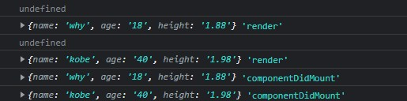
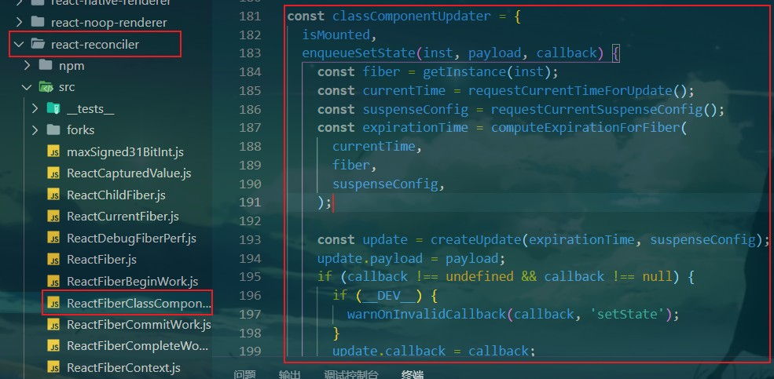

# 一、邂逅React开发和初体验

## React的起源

React是2013年，Facebook开源的JavaScript框架，那么当时为什么Facebook要推出这样一款框架呢？

这个源于一个需求，所产生的bug：


- 该功能上线之后，总是出现bug；
- 三个消息的数字在发生变化时，过多的操作很容易产生bug；

bug是否可以修复呢？当然可以修复，但是Facebook的工程师并不满足于此； 

- 他们开始思考为什么会产生这样的问题；

- 在传统的开发模式中，我们过多的去操作界面的细节；（前端、iOS、Android） 

- 并且需要掌握和使用大量DOM的API，当然我们可以通过jQuery来简化和适配一些API的使用；
-  另外关于数据（状态），往往会分散到各个地方，不方便管理和维护； 

他们就去思考，是否有一种新的模式来解决上面的问题：

1. 以组件的方式去划分一个个功能模块

2. 组件内以jsx来描述UI的样子，以state来存储组件内的状态 

3. 当应用的状态发生改变时，通过setState来修改状态，状态发生变化时，UI会自动发生更新


## React的特点 – 声明式编程

- 声明式编程是目前整个大前端开发的模式：Vue、React、Flutter、SwiftUI；

- 它允许我们只需要维护自己的状态，当状态改变时，React可以根据最新的状态去渲染我们的UI界面；


​		UI页面的开发依赖于状态，而状态通过f（render函数），最终构建出来界面（UI）。

​		若未来状态发生改变，其只需要通过某种方式改变state，之后重新执行f 函数，便会根据最新的状态重修构建UI，此时UI便会自动发生改变。在整个过程中是不需要操作dom的。


## React的特点 - 组件化开发

- 组件化开发页面是目前前端的流行趋势，我们会将复杂的界面拆分成一个个小的组件； 
- 如何合理的进行组件的划分和设计也是后面会讲到的一个重点；


## React的特点 – 多平台适配

- 2013年，React发布之初主要是开发Web页面；

- 2015年，Facebook推出了ReactNative，用于开发移动端跨平台；（虽然目前Flutter非常火爆，但是还是有很多公司在使用

  ReactNative）；

- 2017年，Facebook推出ReactVR，用于开发虚拟现实Web应用程序；（随着5G的普及，VR也会是一个火爆的应用场景）；


## React的一些优点

- React由Facebook来更新和维护，它是大量优秀程序员的思想结晶：

  - React的流行不仅仅局限于普通开发工程师对它的认可，大量流行的其他框架也是借鉴React的思想：

    - Vue.js框架设计之初，有很多的灵感来自Angular和React。

    - 包括Vue3很多新的特性，也是借鉴和学习了React

      - 比如React Hooks是开创性的新功能
      - Vue Function Based API学习了React Hooks的思想

    - Flutter的很多灵感都来自React，来自官网的一段话：

      

      - 事实上Flutter中的Widget – Element – RenderObject，对应的就是JSX – 虚拟DOM – 真实DOM

- HackerRank调查显示

  

## 一些插件的作用

Bookmarks：用于读源码时做标记

Bracket Pair Colorizer：用于代码片段标记


## 原生JS与React对比

实现需求： 点击“改变文本”按钮，使得文本内容发生改变。

**原生JS写法：**

```html
...

<body>
    <h2 class="title"></h2>
    <button class="btn">改变文本</button>

    <script type="text/javascript">
        // 命令式编程：每做一个操作，都是给计算机（浏览器）一步步命令           
        // 1.定义数据 
        let message = "Hello world"

        // 2.将数据显示在h2 元素中
        const titleEle = document.getElementsByClassName('title')[0]
        titleEle.innerHTML = message;

        // 3.点击按钮，界面的数据发生改变
        const btnEl = document.getElementsByClassName("btn")[0]
        btnEl.addEventListener('click', e => {
            message = "Hello React"
            titleEle.innerHTML = message
        })
    </script>
</body>

</html>
```


**接下来使用React 的写法，首先需要一些前提知识：**

- 开发React必须依赖三个库：
  - react：包含react所必须的核心代码
  - react-dom：react渲染在不同平台所需要的核心代码
  - babel：将jsx转换成React代码的工具 

- 第一次接触React会被它繁琐的依赖搞蒙，对于Vue来说，我们只是依赖一个vue.js文件即可，但是react居然要依赖三个库。
  - 其实呢，这三个库是各司其职的，目的就是让每一个库只单纯做自己的事情。 在React的0.14版本之前是没有react-dom这个概念的，所有功能都包含在react里。为什么要进行拆分呢？原因就是react-native。  react包中包含了react和react-native所共同拥有的核心代码。
  - react-dom针对web和native所完成的事情不同：
    - web端：react-dom会将jsx最终渲染成真实的DOM，显示在浏览器中 
    - native端：react-dom会将jsx最终渲染成原生的控件（比如Android中的Button，iOS中的UIButton）。


### 认识Babel

**babel是什么呢？**

- **Babel** ，又名 **Babel.js**。 

- 是目前前端使用非常广泛的编辑器、转移器。 

- 比如当下很多浏览器并不支持ES6的语法，但是确实ES6的语法非常的简洁和方便，我们**开发时**希望使用它。那么编写源码时我们就可以使用ES6来编写，之后通过Babel工具，将ES6转成大多数浏览器都支持的ES5的语法。


**React 和 Babel 的关系：**

- 默认情况下开发React其实可以不使用babel。
- 但是前提是我们自己使用 React.createElement 来编写源代码，它编写的代码非常的繁琐和可读性差。那么我们就可以直接编写jsx（JavaScript XML）的语法，并且让babel帮助我们转换成React.createElement。


### 引入React依赖

- 所以，我们在编写React代码时，这三个依赖都是必不可少的。

- 那么，如何添加这三个依赖： 
  - 方式一：直接CDN引入 
  - 方式二：下载后，添加本地依赖
  - 方式三：通过npm管理（后续脚手架再使用）

- 暂时我们直接通过CDN引入，来演练下面的示例程序：
  - 这里有一个crossorigin的属性，这个属性的目的是为了拿到跨域脚本的错误信息

```
<script src="https://unpkg.com/react@16/umd/react.development.js" crossorigin></script>

<script src="https://unpkg.com/react-dom@16/umd/react-dom.development.js" crossorigin></script>

<script src="https://unpkg.com/babel-standalone@6/babel.min.js"></script>
```

**最终写法：**

```html
<body>
    <div>Header</div>
    <div id="app">app</div>
    <div>Footer</div>

    <!-- 添加React 的依赖，此处的 crossorigin 的作用为：将远程 js 脚本的错误可以在本地显示出来 -->
    <script src="https://unpkg.com/react@16/umd/react.development.js" crossorigin></script>
    <script src="https://unpkg.com/react-dom@16/umd/react-dom.development.js" crossorigin></script>
    <script src="https://unpkg.com/babel-standalone@6/babel.min.js"></script>

    <script type="text/babel">

        // ReactDOM.render(渲染的内容，挂载的对象)      渲染的内容便为 jsx 代码，并且会将原有内容覆盖
        ReactDOM.render(<h2>Hello World</h2>, document.getElementById("app"))
    </script>
</body>
```


## 通过按钮修改数据

**错误写法：**

```jsx
<body>
    <div id="app">app</div>

    <!-- 添加React 的依赖 -->
    <script src="https://unpkg.com/react@16/umd/react.development.js" crossorigin></script>
    <script src="https://unpkg.com/react-dom@16/umd/react-dom.development.js" crossorigin></script>
    <script src="https://unpkg.com/babel-standalone@6/babel.min.js"></script>

    <!-- jsx特点：多个标签最外层（根）只能有一个标签 -->
    <script type="text/babel">
        let message = "Hello World";

        function btnClick() {
            message = 'Hello React';         // React 中，无法通过此种方式直接修改 message。因为当 message 的数据发生改变时，要想让页面也发生改变，必须重新渲染jsx（再次执行render）。
            console.log(message);
        }

        // ReactDOM.render(渲染的内容，挂载的对象)
        ReactDOM.render(
            <div>
                <h2>{message}</h2>
                <button onClick={btnClick}>改变文本</button>
            </div>
            ,
            document.getElementById("app"));
    </script>
</body>
```


**修改版：**（此种写法虽然可以实现效果，但不推荐）

```jsx
<body>
    <div id="app">app</div>

    <!-- 添加React 的依赖 -->
    <script src="https://unpkg.com/react@16/umd/react.development.js" crossorigin></script>
    <script src="https://unpkg.com/react-dom@16/umd/react-dom.development.js" crossorigin></script>
    <script src="https://unpkg.com/babel-standalone@6/babel.min.js"></script>

    <!-- jsx特点：多个标签最外层（根）只能有一个标签 -->
    <script type="text/babel">
        let message = "Hello World";

        function btnClick() {
            message = 'Hello React';         // React 中，无法通过此种方式直接修改 message。因为当 message 的数据发生改变时，要想让页面也发生改变，必须重新渲染jsx（再次执行render）。
            render();
        }

        // ReactDOM.render(渲染的内容，挂载的对象)
        function render() {
            ReactDOM.render(
                <div>
                    <h2>{message}</h2>
                    <button onClick={btnClick}>改变文本</button>
                </div>
                ,
                document.getElementById("app"));
        }

        render()
    </script>
</body>
```


## 组件化实现

```jsx
<body>
    <div id="app">app</div>

    <!-- 添加React 的依赖 -->
    <script src="https://unpkg.com/react@16/umd/react.development.js" crossorigin></script>
    <script src="https://unpkg.com/react-dom@16/umd/react-dom.development.js" crossorigin></script>
    <script src="https://unpkg.com/babel-standalone@6/babel.min.js"></script>

    <script type="text/babel">
        // 封装App组件
        // 渲染逻辑：ReactDOM渲染一个组件，而组件中实现了 render 函数，render 函数中返回了 h2。因此我们最终将 h2 渲染了出来
        class App extends React.Component {

            constructor() {
                super();        // es6中要求有 extends 且写了 constructor 时，必须要写一个 super

                // 原写法
                // this.message = 'Hello World'

                // 修改写法
                this.state = {
                    message: "Hello World"
                }
            }

            render() {
                // 此处return 后会加上一个小括号，表示后面的代码为一个整体
                return (
                    <div>
                        <h2>{this.state.message}</h2>
                        {/*此处的 onClick 必须大写*/}
                        <button onClick={this.btnClick.bind(this)}> 改变文本</button>
                    </div>
                )
            }

            btnClick() {
                // 原写法
                // this.message = "Hello React";        // 会报错，因为此处的 this 默认为 undefined，因为内部调用方式为 btnClick.apply(undefined)。解决方法：可以在上方通过 bind 来修改 this 执行
                // this.render();       // 此处调用 this.render() 不会使页面发生改变。 原因：再次执行render 只是将值重新返回给 ReactDOM，并没有再次执行 ReactDOM的 render 方法。 解决方法：将原先的 message 变为 this.state 的一个属性，并在要修改时，通过 this.setState 进行修改

                // 修改写法
                this.setState({
                    message: "Hello React"
                })
            }
        }

        // 渲染组件
        ReactDOM.render(<App />, document.getElementById('app'))
    </script>
</body>
```


# 二、案例练习-jsx 核心语法

## ES6的class

- 在ES6 之前，我们通过function 来定义类，但是这种模式一直被很多从其他编程语言（如Java、C++、OC等）转到 JavaScript 的人不适应
- 原因是，大多数面向对象的语言，都是使用class关键字来定义类的。


## JavaScript 中类的定义

**ES5中创建类**

```jsx
<script type="text/javascript">
        // ES5中如何定义类
        function Person(name, age) {
            this.name = name;       // 此处的 this 指向的是新创建的 Person() 对象，即 p 
            this.age = age;
        }

        Person.prototype.running = function () {
            console.log(this.name, this.age, "running")
        }

        // 为类传递参数
        var p = new Person("why", 10);
        console.log(p.name, p.age)
        p.running();       // 通过 p.running()  调用了 running，触发了隐式绑定，running 中的 this 被改为了 p
    </script>
```


**ES6中创建类**

```jsx
<script type="text/javascript">
    // ES6中通过 class 创建类
    class Person {
        // 构造方法(通过 new 创建字创建类的实例时，会自动调用这个方法。名字固定)
        constructor(name, age) {
            this.name = name;           // 此处的 this为js 自动绑定
            this.age = age
        }

        // 定义方法，下面定义方法的写法会将方法直接赋值给原型
        running() {
            console.log(this.name, this.age, "running")
        }
    }

	const p = new Person("why", 18);
	console.log(p.name, p.age)
	p.running();
</script>
```


**思考题：**

此时下面代码的 this 为什么？

```jsx
class Person {
    constructor(name, age) {
        this.name = name;          
        this.age = age
    }

    running() {
        console.log(this)
        console.log(this.name, this.age, "running")
    }
}

const p = new Person("why", 18);
const func = p.running;
func();
```

结果： undefined。

原因：此时既未给this 显式绑定，也未给其隐式绑定。

解决方法（显示绑定）：

一：

```jsx
var obj = {
	name:"kobe",
    age:40
}

func.call(obj);
```

二：

```jsx
// 重新给 func 赋值
var obj = {
    name:"kobe",
    age:40
}

func = func.bind(obj);
func();
```


## JavaScript 中类的继承

> 继承是面向对象三大特性的其中之一
>
> 面向对象的三大特性：封装\继承\多态

- 继承的优势
  - 1.减少重复的代码
  - 2.多态的前提（JS本身为鸭子（弱）类型）


**代码示例：**

```jsx
    <script type="text/javascript">
        class Person {
            constructor(name, age) {
                this.name = name;
                this.age = age;
            }

            running() {
                console.log("running")
            }
        }

        class Student extends Person {
            constructor(name, age, sno) {
                super(name, age);   // 相当于调用父类的构造方法
                this.sno = sno;
            }

            // 使用 extends 后，会继承 running 方法
        }

        const stu = new Student("why", 18, 110);
        console.log(stu.name, stu.age, stu.sno);
        stu.running();

        class Teacher extends Person {
            constructor(name, age, title) {     // 类中若有继承，其写了构造器，则必须调用 super，初始化父类中的属性
                super(name, age)
                this.title = title;
            }
        }

        const teacher = new Teacher("kobe", 40, "教练");
        console.log(teacher.name, teacher.age, teacher.title)
        teacher.running();
    </script>
```

## 案例练习 - 电影列表

**写法1：**

```jsx
<!-- 2.书写React 代码 -->
    <script type="text/babel">
        // 通过继承 React.Component，来创建一个类组件
        class App extends React.Component {
            constructor() {
                super();

                this.state = {
                    message: "Hello World",
                    movies: ["大话西游", "盗梦空间", "星际穿越", "流浪地球"]
                }
            }


            // 每个组件都必须实现的方法
            render() {
                const liArray = [];
                for (let movie of this.state.movies) {     // 用 of 遍历数组时可以获取到数组中每一个值，而若使用 in，会获取到数组中的下标值
                    liArray.push(<li>{movie}</li>)
                }
                return (
                    <div>
                        <h2>电影列表</h2>
                        <ul>
                            // jsx 中会将数组直接遍历
                            {liArray}
                        </ul>
                    </div>
                )
            }
        }
        ReactDOM.render(<App />, document.getElementById("app"));
    </script>
```

**map函数复习：**

```jsx
<script type="text/javascript">
        const names = ["abc", "cba", "nba", "mba"]

        // names.map(回调函数, 给前面的回调函数绑定this)
        /**
         * 回调函数有三个参数：
         *  参数一：执行时的对应元素
         *  参数二：对应的下标值
         *  参数三：完整的数组对象
        */
        const newNames = names.map((item, index, arr) => {   // 返回一个新的数组
            return item + "000"
        })

        console.log(newNames)
</script>
```

**写法2:**

```jsx
<!-- 2.书写React 代码 -->
    <script type="text/babel">
        // 通过继承 React.Component，来创建一个类组件
        class App extends React.Component {
            constructor() {
                super();

                this.state = {
                    message: "Hello World",
                    movies: ["大话西游", "盗梦空间", "星际穿越", "流浪地球"]
                }
            }


            // 每个组件都必须实现的方法
            render() {
                return (
                    <div>
                        <h2>电影列表</h2>
                        <ul>
                            {
								// 此处需要key，但占时不讨论
                                this.state.movies.map((item) => {
                                    return <li>{item}</li>
                                })
                            }
                        </ul>
                    </div>
                )
            }
        }
        ReactDOM.render(<App />, document.getElementById("app"));
    </script>
```


## 案例练习 - 计算器案例

```jsx
<script type="text/babel">
        // 通过继承 React.Component，来创建一个类组件
        class App extends React.Component {
            constructor(props) {
                super(props);
                this.state = {
                    counter: 0
                }
            }

            render() {
                return (
                    <div>
                        <h2>当前计数：{this.state.counter}</h2>
                        {/*此处调用的 increment、decrement 是 react 内部调用的，并没有正确为我们绑定一个that*/}
                        <button onClick={this.increment.bind(this)}>+1</button>
                        <button onClick={this.decrement.bind(this)}>-1</button>
                    </div >
                )
            }

            increment() {
                this.setState({     // 此处的 setState 为React.Component中定义的方法，此处依靠继承进行调用
                    counter: this.state.counter + 1
                })
            }

            decrement() {
                this.setState({
                    counter: this.state.counter - 1
                })
            }
        }
        ReactDOM.render(<App />, document.getElementById("app"));
    </script>
```


## 认识 JSX

以下代码中，直接将 h2 标签用于赋值，这便是一种 JSX 语法，jsx语法需要babel 先进行编译。

```jsx
    <script type="text/babel">
        const element = <h2>Hello World</h2>

        ReactDOM.render(element, document.getElementById("app"));
    </script>
```


- JSX是什么？
  - JSX是一种 JavaScript的语法扩展（eXtension），也在很多地方称之为JavaScript XML，因为看起来就是一段XML语法。
  - 它用于描述我们的UI页面，并且其完全可以和JavaScript 融合在一起使用。
  - 它不同于Vue中的模板语法，不需要专门学习模块语法中的一些指令（比如v-for、v-if、v-else、v-bind）
  - Vue中其实也有 jsx 语法，只是使用的比较少。


- 为什么React 要选择 jsx 呢？-> all in js

  - React 认为渲染逻辑本质上与其他UI逻辑存在内在耦合

    - 比如UI需要绑定事件（button、a原生等）

    - 比如UI中需要展示数据状态，在某些状态发生改变时，又需要改变UI；

  - 所以 React 认为他们之间是密不可分的，所以React没有将标记分离到不同的文件中，而是将它们组合到了一起，这就是组件。（Component）

    - 由于React可以将 html 定义为变量并随时使用，所以相较于 Vue ，更为灵活。

  - 在这里，我们只需要知道，JSX其实是嵌入到JavaScript中的一种结构语法；


- JSX的书写规范：
  - JSX的顶层只能有一个根元素，所以我们很多时候会在外层包裹一个div元素（或者使用后面学到的Fragment）；
  - 为了方便阅读，我们通常在jsx的外层包裹一个小括号() ，这样可以方便阅读，并且jsx可以换行书写；
  - JSX中的标签可以是单标签，也可以是双标签。
    - 注意：如果是单标签，必须以 /> 结尾


## JSX中的注释

> 一般render 函数中return 的值才叫做 jsx

```jsx
render() {
    return (
        <div>
        {/* 我是一段注释 */}
        Hello World
        </div>
    )
}
```


## JSX嵌入变量

- 情况一：当变量是Number、String、Array 类型时，可以直接显示

- 情况二：当变量是null、undefined、Boolean 类型时，内容为空

  - 如果希望可以显示null、undefined、Boolean，那么需要转为字符串。
  - 转换的方式有很多，比如 toString 方法(undefined与null没有此方法)、和空字符串拼接，String（变量）等方式；

  ```jsx
  // 通过继承 React.Component，来创建一个类组件
          class App extends React.Component {
              constructor(props) {
                  super(props);
  
                  this.state = {
                      // 1. 在 {} 中可以正常显示的内容
                      name: "why",    // String
                      age: 18,        // Number
                      name: ["abc", "cba", "abc"],     // Array
  
                      // 2. 在 {} 中不能显示（忽略）
                      test1: null,    // null
                      test2: undefined,       // undefined
                      test3: false,           // Boolean
                  }
              }
  
              render() {
                  return (
                      <div>
                          <h2>{this.state.name}</h2>
                          <h2>{this.state.age}</h2>
                          <h2>{this.state.name}</h2>
  
                          <h2>{this.state.test1}</h2>
                          <h2>{this.state.test2}</h2>
                          <h2>{this.state.test3}</h2>
                      
                          <h2>{String(this.state.test1)}</h2>
                          <h2>{String(this.state.test2)}</h2>
                          <h2>{this.state.test3.toString()}</h2>
                      </div>
                  )
              }
          }
          ReactDOM.render(<App />, document.getElementById("app"));
  ```

  - react之所以不显示，是为了在某些情况下能够隐藏元素，如：

  ```jsx
  <h2>{flag ? "你好啊" : null}</h2>
  <h2>{flag && "你好啊"}</h2>
  ```

  

- 情况三：对象类型不能作为子元素（not valid as a React child）

```jsx
class App extends React.Component {
    constructor(props) {
        super(props);

        this.state = {
            // 对象不能作为 jsx 的子类
            friend: {
                name: "kobe",
                age: 40
            }
        }
    }
    render() {
        return (
            <div>
            	{/* 这种写法会报错 */}
                <h2>{this.state.friend}</h2>
            </div>
        )
    }
```


## JSX嵌入表达式

```html
<script type="text/babel">
        // 通过继承 React.Component，来创建一个类组件
        class App extends React.Component {
            constructor() {
                super();

                this.state = {
                    firstName: "kobe",
                    lastName: "bryant",
                    isLogin: true
                }
            }

            getFullName() {
                return this.state.firstName + "" + this.state.lastName
            }

            render() {
                const { firstName, lastName } = this.state;
                return (
                    <div>
                        {/* 1.运算符表达式 */}
                        <h2>{firstName + " " + lastName}</h2>
                        <h2>{20 * 50}</h2>

                        {/* 2.三元表达式 */}
                        <h2>{isLogin ? "欢迎回来" : "请先登录"}</h2>

                        {/* 3.进行函数调用，此处不需要为其设置this指向，因为已经显式声明了this指向 */}
                        <h2>{this.getFullName()}</h2>
                    </div>
                )
            }
        }
        ReactDOM.render(<App />, document.getElementById("app"));
    </script>
```


# 三、jsx核心语法二

## jsx绑定属性

- 元素都会有的title属性
- img元素会有的src属性
- a元素会有的href属性
- 元素可能需要绑定的class
- 原生使用内联样式style

```jsx
<!-- 2.书写React 代码 -->
<script type="text/babel">

    // 对图片做格式化的函数
    function getSizeImage(imgUrl, size) {
        return imgUrl + `?param=${size}y${size}`
    }
    // 通过继承 React.Component，来创建一个类组件
    class App extends React.Component {
        constructor() {
            super();

            this.state = {
                title: "标题",
                imgUrl: "https://p1.music.126.net/4eg8tqFo_lerW8aju5nqFQ==/109951166243447604.jpg",
                link: "http://www.baidu.com",
                active: true
            }
        }

        render() {
            const { title, imgUrl, link, active } = this.state;
            return (
                <div>
                    {/* 1.绑定普通属性 */}
                    {/* title属性可以设置为鼠标在当前元素上hover时显示的内容 */}
                    <h2 title={title}>我是标题</h2>

                    
                    <a href={link} target="_blank">百度一下</a>


                    {/* 2.绑定class */}
                    {/* 注意此处类名需要写作 className,因为 class 为 js 的关键字 */}
                    <div className="box title">我是div元素</div>

                    {/* 同理，原先 label 的 for 属性也要改为 htmlFor */}
                    <label htmlFor=""></label>
                    {/* react中动态绑定类名 */}
                    <div className={"box title " + (active ? "active" : "")}>我也是div元素</div>


                    {/* 3.绑定style（以对象的形式绑定） */}
                    {/* 若直接传值，需要用 "" 来包裹，若没使用""，则会将其看做一个变量 */}
                    {/* 原本用连接符连接的属性要改为用驼峰的形式 */}
                    <div style={{ color: "red", fontSize: '50px' }}>我是div，绑定style属性</div>
                </div>
            )
        }
    }
    ReactDOM.render(<App />, document.getElementById("app"));
</script>
```


## React事件绑定

**事件绑定时的 this 指向问题：**

```jsx
<script type="text/babel">
        // 通过继承 React.Component，来创建一个类组件
        class App extends React.Component {
            constructor() {
                super();
            }

            render() {
                return (
                    <div>
                        {/* 注意此处的 onClick 需要使用大写 */}
                        <button onClick={this.btnClick}>按钮</button>
                    </div>
                )
            }

            // 不对btnClick 中的this做修改时，其调用是通过 React 内部执行 btnClick.call(undefined) 来执行的
            btnClick() {
                console.log(this);
            }
        }
        ReactDOM.render(<App />, document.getElementById("app"));
    </script>
```

**修改 this 指向的四个方法：**

**方法一：**在`render`函数绑定事件时修改（显式绑定）

```jsx
render() {
    return (
        <div>
        	{/* 注意此处的 onClick 需要使用大写 */}
        	<button onClick={this.btnClick.bind(this)}>按钮</button>
		</div>
	)
}
```

这种写法每次使用 btnClick  函数时都要执行 bind 函数。代码重复率过高。

**方法二：**在 `constructor` 中修改

```jsx
constructor() {
	...
    this.btnClick = this.btnClick.bind(this)
}
btnClick() {
    ...
}
```

**方法三：**定义函数时使用箭头函数（此种方案使得原本定义函数的写法变为了箭头函数赋值的写法，故不推荐）

```jsx
render() {
    return (
        <div>
            <button onClick={this.increment}>+1</button>
        </div>
    )
}

// 箭头函数的特点：箭头函数中永远不绑定 this，其会去寻找上层作用域的 this
// 此种赋值方法是 ES6中给对象增加属性的方式，称为：“class fields”(类的成员变量)
increment = () => {
    console.log(this.state.counter);
}
```

**class fields 语法**

```
class App extends React.Component {
    name = "why";       // 只要创建一个 App 对象，默认都会有 name 属性,效果与在 constructor 中写 this.name = "why" 类似
}
```


**方法四**：直接传入一个箭头函数，在箭头函数中调用要执行的函数（推荐）

```jsx
render() {
    return (
        <div>
        	{/* 此处箭头函数中的 this 为 render 的this,是可以正常使用的，通过其调用decrement，便会对this进行隐式绑定，把this绑定到decrement中，使得decrement中的this就是这个this */}
        	<button onClick={() => { this.decrement() }}>-1</button>
		</div>
	)
}
```


## React传递参数

**使用默认参数 event：**

```jsx
<script type="text/babel">
        // 通过继承 React.Component，来创建一个类组件
        class App extends React.Component {
            constructor() {
                super();
                this.btnClick = this.btnClick.bind(this);
            }

            render() {
                return (
                    <div>
                        <button onClick={this.btnClick}>按钮</button>
                    </div>
                )
            }

            // btnClick 默认会传入一个event对象=> onClick.call(undefined,event)，但要注意此时的event不是原生的事件对象，而是react内部合成的事件对象
            btnClick(event) {
                console.log("按钮发生了点击", event);
            }
        }
        ReactDOM.render(<App />, document.getElementById("app"));
    </script>
```


**传递其余参数：**

```jsx
class App extends React.Component {
    constructor() {
        super();

        this.state = {
            movies: ["大话西游", "海王", "流浪地球", "盗梦空间"]
        }
    }
    render() {
        return (
            <div>
                <ul>
                    {
                                // this.state.movies.map(回调函数,绑定this对象)
                        		// 注意此处代码格式写法
                                this.state.movies.map((item, index) => {
                                    return (
                                        <li className="item"
                                            onClick={(e) => { this.liClick(item, index, e) }}
                                            title="li">
                                            {item}
                                        </li>
                                    )
                                })

                    }
                </ul>
            </div>
        )
    }
    liClick(item, index, e) {
        console.log('li发生了点击', item, index, e);
    }
}
```


## React条件渲染

- 某些情况下，界面的内容会根据不同的情况显示不同的内容，或者决定是否渲染某部分内容
  - 在vue中，我们会通过指令来控制：比如v-if、v-show；
  - 在React中，所有的条件判断和普通的JavaScript代码一致；


- 常见的条件渲染方式

  - 方式一：条件判断语句
    - 适合逻辑较多的情况

  ```jsx
  <script type="text/babel">
      // 通过继承 React.Component，来创建一个类组件
      class App extends React.Component {
          constructor() {
              super();
  
              this.state = {
                  isLogin: false
              }
          }
  
          render() {
              // 1.通过if判断：适合逻辑代码非常多的情况
              let welcome = null;
              let btnText = null;
              if (this.state.isLogin) {
                  welcome = <h2>欢迎回来~</h2>
                  btnText = "退出";
              } else {
                  welcome = <h2>请先登录~</h2>
                  btnText = "登录";
              }
  
              return (
                  <div>
                      {welcome}
                      <button>{btnText}</button>
                  </div>
              )
          }
      }
      ReactDOM.render(<App />, document.getElementById("app"));
  </script>
  ```

  

  - 方式二：三元表达式

  ```jsx
  <button>{this.state.isLogin ? "退出" : "登录"}</button>
  ```

  

  - 方式三：逻辑与&&

  ```jsx
  <h2>{isLogin && "你好啊，XXC"}</h2>
  ```

  

- 通过按钮控制条件渲染

```jsx
<script type="text/babel">
        // 通过继承 React.Component，来创建一个类组件
        class App extends React.Component {
            constructor() {
                super();

                this.state = {
                    isLogin: false
                }
            }

            render() {
                const { isLogin } = this.state

                // 1.通过if判断：适合逻辑代码非常多的情况
                let welcome = null;
                let btnText = null;
                if (isLogin) {
                    welcome = <h2>欢迎回来~</h2>
                    btnText = "退出";
                } else {
                    welcome = <h2>请先登录~</h2>
                    btnText = "登录";
                }

                return (
                    <div>
                        {welcome}
                        <button onClick={e => this.loginClick()}>{isLogin ? "退出" : "登录"}</button>

                        <hr />

                        {/* 没登录时，不显示 */}
                        {/* 此种写法每次都要写null，比较冗余 */}
                        <h2>{isLogin ? "你好啊，XXC" : null}</h2>

                        {/* 相比之下，这种写法更好 */}
                        {/* 逻辑与：一个条件不成立，后面的条件都不会进行判断了，若isLogin为false，则整个表达式返回false，不会显示 */}
                        {/* 若 isLogin 为真，则会将后面的字符串作为整个表达式的结果返回 */}
						{/* 注意：此时h2依然存在，若想要h2也消失，可以改写为：{isLogin && <h2>你好啊，XXC</h2>} */}
                        <h2>{isLogin && "你好啊，XXC"}</h2>
                    </div>
                )
            }

            loginClick() {
                this.setState({
                    isLogin: !this.state.isLogin
                })
            }
        }
        ReactDOM.render(<App />, document.getElementById("app"));
    </script>
```


## React实现 v-show 的效果

```jsx
<script type="text/babel">
    // 通过继承 React.Component，来创建一个类组件
    class App extends React.Component {
        constructor() {
            super();

            this.state = {
                isLogin: true
            }
        }

        render() {
            const { isLogin } = this.state;
            const titleDisplayValue = isLogin ? "block" : "none";	// 此处虽然声明为const，但是其会在每次执行 setState 的时候重新执行 render 函数。每次都是一个新的常量，而不会修改值。
            return (
                <div>
                    <h2 style={{ display: titleDisplayValue }}>你好啊，XXC</h2>
                    <button onClick={e => this.loginClick()}>{isLogin ? "退出" : "登录"}</button>
                </div >
            )
        }

        loginClick() {
            this.setState({
                isLogin: !this.state.isLogin
            })
        }
    }
    ReactDOM.render(<App />, document.getElementById("app"));
</script>
```


## React列表渲染

- 真实开发中国我们会从服务器请求到大量的数据，数据会以列表的形式存储：
  - 比如歌曲、歌手、排行榜列表的数据等；


- 在 React 中并没有向Vue模板语法中的 v-for 指令，而是需要我们通过JavaScript代码的方式组织数据，转成 JSX：
  - 很多从Vue转型到React的人会认为Vue的方式更加的简洁明了；
  - 但是React 中的JSX正是因为和JavaScript无缝链接，使其可以更加的灵活；
  - 同时React 是真正可以提交我们编写代码能力的一种方式；


- 如何展示列表呢？

  - 在React中，展示列表最多的方式就是使用数组的 map高阶函数；

  

- 很多时候我们在展示一个数组中的数据之前，需要先对它进行一些处理： 
  - 比如过滤掉一些内容：filter函数
  - 比如截取数组中的一部分内容：slice函数


**filter函数的使用**

```jsx
// filter(回调函数,绑定this)  其中回调函数要求返回一个 布尔值 ，最终返回一个新的数组，返回为 true 的值会加入到数组，返回为 false 的值不会
const nums = [110, 123, 50, 32, 55, 10, 8, 333];
const newNums = nums.filter((item, index, arr) => {
    return item >= 50;
})
```


**列表渲染实例：**

```jsx
<script type="text/babel">
    // 通过继承 React.Component，来创建一个类组件
    class App extends React.Component {
        constructor() {
            super();

            this.state = {
                names: ["abc", "cba", "nba", "mba", "dna"],
                numbers: [110, 123, 50, 32, 55, 10, 8, 333]
            }
        }

        render() {
            return (
                <div>
                    <h2>名字列表</h2>
                    <ul>
                        {
                            this.state.names.map((item) => {
                                return <li>{item}</li>
                            })
                        }
                    </ul>

                    <h2>数字列表(大于等于50) -- 过滤</h2>
                    <ul>
                        {

                            this.state.numbers
                                .filter(item => item >= 50)
                                .map(item => <li>{item}</li>)
                        }
                    </ul>

                    <h2>数字列表(截取)</h2>
                    <ul>
                        {
                            /* slice的结尾数据不会取到 */
                            this.state.numbers.slice(0, 4).map(item => {
                                return <li>{item}</li>
                            })
                        }
                    </ul>
                </div>
            )

        }
    }
    ReactDOM.render(<App />, document.getElementById("app"));
</script>
```


# 四、jsx的本质-源码

## JSX的本质

- 实际上，jsx仅仅只是 `React.createElement(component,props,...children)` 函数的语法糖（一种复杂代码的简单写法，之后仍会转成复杂的写法）。

  - 所有的 jsx 最终都会转换成 `React.createElement` 的函数调用。

    ```jsx
    <script type="text/babel">
    
        const message1 = <h2>Hello React</h2>
    
        // message1 最终实际会转化为以下的形式： jsx -> babel -> React.createElement()
        // React.createElement(标签名，{标签属性}, 子属性)
        // 若使用此种写法，则不需要再使用 babel 来进行编译了。
        const message2 = React.createElement("h2", null, "Hello React");
    
        ReactDOM.render(message2, document.getElementById("app"));
    </script>
    ```

  - React.createElement 在源码的位置：

  


- createElement需要传递三个参数：

  - 参数一：type

    - 当前ReactElement的类型；
    - 如果是标签元素，那么就使用字符串表示 -> "div"；
    - 如果是组件元素，那么就直接使用组件的名词

  - 参数二：config

    - 所有jsx中的属性都在config中以对象的属性和值的形式存储

  - 参数三：children

    - 存放在标签中的内容，以children数组的方式进行存储；
    - 若有多个元素，React内会对它们进行处理
    - React 源码中处理多个 children 的写法：

    ```jsx
    const childrenLength = arguments.length - 2;    // 去除前面两个参数，查看剩余参数有多少
    if (childrenLength === 1) {   // 若只剩余一个参数，将 children 赋值给 props.children
        props.children = children;
    } else if (childrenLength > 1) {   // 若大于1，则根据剩余参数新建一个参数
        const childArray = Array(childrenLength);
        for (let i = 0; i < childrenLength; i++) {  // 将剩余的参数赋值给 childArray
            childArray[i] = arguments[i + 2];
        }
        if (__DEV__) {
            if (Object.freeze) {
                Object.freeze(childArray);
            }
        }
        props.children = childArray;    // 最后将数组赋值给 props.children,最终children中放的就是所有的子元素
    }
    ```

- Babel 官网查看

  - 我们知道默认jsx是通过 babel 帮我们进行语法转换的，所以我们之前写的 jsx 代码都需要依赖babel。
  - 可以在 babel 的官网中快速查看转换的过程： https://babeljs.io/repl/#?presets=react

下面一段代码经过babel转化后的形式：

```react
<div>
    <div className="header">
        <h1 title="标题">我是标题</h1>
    </div>
    <div className="content">
        <h2>我是页面的内容</h2>
        <button>按钮</button>
        <button>+1</button>
        <a href="http://www.baidu.com">百度一下</a>
    </div>
	<div className="footer">
    	<p>我是尾部的内容</p>
	</div>
</div>
```


```jsx
React.createElement(
  "div",
  null,
  React.createElement(
    "div",
    {
      className: "header"
    },
    React.createElement(
      "h1",
      {
        title: "\u6807\u9898"
      },
      "\u6211\u662F\u6807\u9898"
    )
  ),
  React.createElement(
    "div",
    {
      className: "content"
    },
    React.createElement(
      "h2",
      null,
      "\u6211\u662F\u9875\u9762\u7684\u5185\u5BB9"
    ),
    React.createElement("button", null, "\u6309\u94AE"),
    React.createElement("button", null, "+1"),
    React.createElement(
      "a",
      {
        href: "http://www.baidu.com"
      },
      "\u767E\u5EA6\u4E00\u4E0B"
    )
  ),
  React.createElement(
    "div",
    {
      className: "footer"
    },
    React.createElement(
      "p",
      null,
      "\u6211\u662F\u5C3E\u90E8\u7684\u5185\u5BB9"
    )
  )
);
```


## 虚拟DOM的创建过程

- 我们通过 `React.createElement`最终创建出来一个 ReactElement 对象：

  

- 这个ReactElement对象是什么作用呢？React为什么要创建它呢？

  - 原因是React利用ReactElement对象组成了一个JavaScript的对象树； 
  - JavaScript的对象树就是大名鼎鼎的虚拟DOM（Virtual DOM）；

  

  - ReactDOM.render() 方法最终将JavaScript 对象映射成真实 dom，并渲染到页面上。
  -  jsx->createElement函数->ReactRlement(对象树)->ReactDOM.render()->真实DOM
    - ReactNative 与其的差别在于 ReactDOM.render() -> 原生的控件（UIButton等）


## 为什么使用虚拟DOM

- 为什么要采用虚拟DOM，而不是直接修改真实的DOM呢？
  - 很难跟踪状态发生的改变：原有的开发模式，我们很难跟踪到状态发生的改变，不方便我们对应用程序进行调试；
  - 操作真实 DOM 性能较低：传统的开发模式会进行频繁的DOM操作，而这一做法的性能非常的低；


- DOM操作性能非常低：
  - 首先，document.createElement本身创建出来的就是一个非常复杂的对象；
  - 其次，DOM操作会引起浏览器的回流和重绘，所以在开发中应该避免频繁的DOM操作；


- 频繁操作DOM的问题

  当我们有一组数组：[0,1,2,3,4]，将它们通过ul 和 li 展示出来。之后又增加了5条数据：[0,1,2,3,4,5,6,7,8,9]

  

  - 方式一：重新遍历整个数组（不推荐）
  - 方式二：在ul后面追加另外5个li

  

  ​	那上面这段代码的性能怎么样呢？ 非常低效

  - 因为我们通过 document.createElement 创建元素，再通过 ul.appendChild(li) 渲染到DOM上，进行了多次DOM操作（添加了5次 li）；

  - 对于批量操作的，最好的办法不是一次次修改DOM，而是对批量的操作进行合并；（比如可以通过DocumentFragment进行合 

  并）；

  - 而我们正是可以通过 Virtual DOM来帮助我们解决上面的问题；


## 声明式编程

- 虚拟DOM帮助我们从命令式编程转到了声明式编程的模式

- **React官方的说法：**Virtual DOM 是一种编程理念。 
  - 在这个理念中，UI以一种理想化或者说虚拟化的方式保存在内存中，并且它是一个相对简单的JavaScript对象
  - 我们可以通过ReactDOM.render让 虚拟DOM 和 真实DOM同步起来（映射），这个过程叫做协调（Reconciliation）；

- 这种编程的方式赋予了React声明式的API： 
  - 你只需要告诉React希望让UI是什么状态；
  - React来确保DOM和这些状态是匹配的；当状态发生改变时，让其根据最新的状态再来描述 JavaScript 对象，再根据 javaScript对象与真实DOM的映射，使其协调到真实DOM中。
  -  你不需要直接进行DOM操作，就可以从手动更改DOM、属性操作、事件处理中解放出来；


## 阶段案例练习


### 案例的结构搭建

```html
<!DOCTYPE html>
<html lang="en">

<head>
    <meta charset="UTF-8">
    <meta http-equiv="X-UA-Compatible" content="IE=edge">
    <meta name="viewport" content="width=device-width, initial-scale=1.0">
    <title>Document</title>
    <style>
        table {
            border: 1px solid #eee;
            border-collapse: collapse;
        }

        th,
        td {
            border: 1px solid #eee;
            padding: 10px 16px;
            text-align: center;
        }

        th {
            background-color: #ccc;
        }
    </style>
</head>

<body>
    <div id="app"></div>
    <!-- 1.引入依赖 -->
    <script src="https://unpkg.com/react@16/umd/react.development.js" crossorigin></script>
    <script src="https://unpkg.com/react-dom@16/umd/react-dom.development.js" crossorigin></script>
    <script src="https://unpkg.com/babel-standalone@6/babel.min.js"></script>

    <!-- 2.书写React 代码 -->
    <script type="text/babel">
        // 通过继承 React.Component，来创建一个类组件
        class App extends React.Component {
            constructor() {
                super();
            }

            render() {
                return (
                    <div>
                        <table>
                            <thead>
                                <tr>
                                    <th></th>
                                    <th>书籍名称</th>
                                    <th>出版日期</th>
                                    <th>价格</th>
                                    <th>购买数量</th>
                                    <th>操作</th>
                                </tr>
                            </thead>
                            <tbody>
                                <tr>
                                    <td>1</td>
                                    <td>2</td>
                                    <td>3</td>
                                    <td>4</td>
                                    <td>5</td>
                                    <td>6</td>
                                </tr>
                            </tbody>
                        </table>
                    </div>
                )
            }
        }
        ReactDOM.render(<App />, document.getElementById("app"));
    </script>
</body>

</html>
```


### 书籍的内容填充

**format-utils.js**

```jsx
function formatPrice(price) {
    if (typeof price !== 'number') {
        price = Number(price) || 0;     // 为了避免 price 为类似 "aaa"的非数字，通过 Number 将将其转化后变为 NaN。如此写的话可以保证 0 作为默认值
    }

    return "¥" + price.toFixed(2);
}
```


```html
<!DOCTYPE html>
<html lang="en">

<head>
    <meta charset="UTF-8">
    <meta http-equiv="X-UA-Compatible" content="IE=edge">
    <meta name="viewport" content="width=device-width, initial-scale=1.0">
    <title>Document</title>
    <style>
        table {
            border: 1px solid #eee;
            border-collapse: collapse;
        }

        th,
        td {
            border: 1px solid #eee;
            padding: 10px 16px;
            text-align: center;
        }

        th {
            background-color: #ccc;
        }

        .count {
            margin: 0 5px;
        }
    </style>
</head>

<body>
    <div id="app"></div>
    <!-- 1.引入依赖 -->
    <script src="https://unpkg.com/react@16/umd/react.development.js" crossorigin></script>
    <script src="https://unpkg.com/react-dom@16/umd/react-dom.development.js" crossorigin></script>
    <script src="https://unpkg.com/babel-standalone@6/babel.min.js"></script>

    <script type="text/javascript" src="./format-utils.js"></script>

    <!-- 2.书写React 代码 -->
    <script type="text/babel">
        // 通过继承 React.Component，来创建一个类组件
        class App extends React.Component {
            constructor() {
                super();

                this.state = {
                    books: [
                        {
                            id: 1,
                            name: '《算法导论》',
                            date: '2006-9',
                            price: 85.00,
                            count: 1
                        },
                        {
                            id: 2,
                            name: '《UNIX编程艺术》',
                            date: '2006-2',
                            price: 59.00,
                            count: 1
                        },
                        {
                            id: 3,
                            name: '《编程珠玑》',
                            date: '2008-10',
                            price: 39.00,
                            count: 1
                        },
                        {
                            id: 4,
                            name: '《代码大全》',
                            date: '2006-3',
                            price: 128.00,
                            count: 1
                        },
                    ]
                }
            }

            render() {
                return (
                    <div>
                        <table>
                            <thead>
                                <tr>
                                    <th></th>
                                    <th>书籍名称</th>
                                    <th>出版日期</th>
                                    <th>价格</th>
                                    <th>购买数量</th>
                                    <th>操作</th>
                                </tr>
                            </thead>
                            <tbody>
                                {
                                    this.state.books.map((item, index) => {
                                        return (
                                            <tr>
                                                <td>{index + 1}</td>
                                                <td>{item.name}</td>
                                                <td>{item.date}</td>
                                                <td>{formatPrice(item.price)}</td>
                                                <td>
                                                    <button>-</button>
                                                    <span className="count">{item.count}</span>
                                                    <button>+</button>
                                                </td>
                                                <td><button>移除</button></td>
                                            </tr>
                                        )
                                    })
                                }
                            </tbody>
                        </table>
                    </div>
                )
            }
        }
        ReactDOM.render(<App />, document.getElementById("app"));
    </script>
</body>

</html>
```

### 书籍总价格显示

```html
<!DOCTYPE html>
<html lang="en">

<head>
    <meta charset="UTF-8">
    <meta http-equiv="X-UA-Compatible" content="IE=edge">
    <meta name="viewport" content="width=device-width, initial-scale=1.0">
    <title>Document</title>
    <style>
        table {
            border: 1px solid #eee;
            border-collapse: collapse;
        }

        th,
        td {
            border: 1px solid #eee;
            padding: 10px 16px;
            text-align: center;
        }

        th {
            background-color: #ccc;
        }

        .count {
            margin: 0 5px;
        }
    </style>
</head>

<body>
    <div id="app"></div>
    <!-- 1.引入依赖 -->
    <script src="https://unpkg.com/react@16/umd/react.development.js" crossorigin></script>
    <script src="https://unpkg.com/react-dom@16/umd/react-dom.development.js" crossorigin></script>
    <script src="https://unpkg.com/babel-standalone@6/babel.min.js"></script>

    <script type="text/javascript" src="./format-utils.js"></script>

    <!-- 2.书写React 代码 -->
    <script type="text/babel">
        // 通过继承 React.Component，来创建一个类组件
        class App extends React.Component {
            constructor() {
                super();

                this.state = {
                    books: [
                        {
                            id: 1,
                            name: '《算法导论》',
                            date: '2006-9',
                            price: 85.00,
                            count: 1
                        },
                        {
                            id: 2,
                            name: '《UNIX编程艺术》',
                            date: '2006-2',
                            price: 59.00,
                            count: 1
                        },
                        {
                            id: 3,
                            name: '《编程珠玑》',
                            date: '2008-10',
                            price: 39.00,
                            count: 1
                        },
                        {
                            id: 4,
                            name: '《代码大全》',
                            date: '2006-3',
                            price: 128.00,
                            count: 1
                        },
                    ]
                }
            }

            render() {
                return (
                    <div>
                        <table>
                            <thead>
                                <tr>
                                    <th></th>
                                    <th>书籍名称</th>
                                    <th>出版日期</th>
                                    <th>价格</th>
                                    <th>购买数量</th>
                                    <th>操作</th>
                                </tr>
                            </thead>
                            <tbody>
                                {
                                    this.state.books.map((item, index) => {
                                        return (
                                            <tr>
                                                <td>{index + 1}</td>
                                                <td>{item.name}</td>
                                                <td>{item.date}</td>
                                                <td>{formatPrice(item.price)}</td>
                                                <td>
                                                    <button>-</button>
                                                    <span className="count">{item.count}</span>
                                                    <button>+</button>
                                                </td>
                                                <td><button>移除</button></td>
                                            </tr>
                                        )
                                    })
                                }
                            </tbody>
                        </table>
                        <h2>总价格：{this.getTotalPrice()}</h2>
                    </div>
                )
            }

            getTotalPrice() {
                // 1.for循环的方式
                // let totalPrice = 0;
                // for (let item of this.state.books) {
                //     totalPrice += item.price + item.count;
                // }
                // return formatPrice(totalPrice);

                // 2.reduce(回调函数, 初始化值)
                // 回调函数的参数：
                // 参数一：上一次回调函数的结果（第一次没有上一次函数的回调结果，使用初始化值）
                // 参数二：item 参数三：index 参数四：arr
                const totalPrice = this.state.books.reduce((preValue, item) => {
                    return preValue + item.count * item.price;
                }, 0)
                return formatPrice(totalPrice);
            }
        }
        ReactDOM.render(<App />, document.getElementById("app"));
    </script>
</body>

</html>
```

###  移除某个书籍

```html
<!DOCTYPE html>
<html lang="en">

<head>
    <meta charset="UTF-8">
    <meta http-equiv="X-UA-Compatible" content="IE=edge">
    <meta name="viewport" content="width=device-width, initial-scale=1.0">
    <title>Document</title>
    <style>
        table {
            border: 1px solid #eee;
            border-collapse: collapse;
        }

        th,
        td {
            border: 1px solid #eee;
            padding: 10px 16px;
            text-align: center;
        }

        th {
            background-color: #ccc;
        }

        .count {
            margin: 0 5px;
        }
    </style>
</head>

<body>
    <div id="app"></div>
    <!-- 1.引入依赖 -->
    <script src="https://unpkg.com/react@16/umd/react.development.js" crossorigin></script>
    <script src="https://unpkg.com/react-dom@16/umd/react-dom.development.js" crossorigin></script>
    <script src="https://unpkg.com/babel-standalone@6/babel.min.js"></script>

    <script type="text/javascript" src="./format-utils.js"></script>

    <!-- 2.书写React 代码 -->
    <script type="text/babel">
        // 通过继承 React.Component，来创建一个类组件
        class App extends React.Component {
            constructor() {
                super();

                this.state = {
                    books: [
                        {
                            id: 1,
                            name: '《算法导论》',
                            date: '2006-9',
                            price: 85.00,
                            count: 1
                        },
                        {
                            id: 2,
                            name: '《UNIX编程艺术》',
                            date: '2006-2',
                            price: 59.00,
                            count: 1
                        },
                        {
                            id: 3,
                            name: '《编程珠玑》',
                            date: '2008-10',
                            price: 39.00,
                            count: 1
                        },
                        {
                            id: 4,
                            name: '《代码大全》',
                            date: '2006-3',
                            price: 128.00,
                            count: 1
                        },
                    ]
                }
            }

            render() {
                return this.state.books.length ? this.renderBooks() : this.renderEmptyTip()
            }

            removeBook(index) {
                // React中设计原则：state 中的数据的不可变性；(不要直接修改 state 中的相关数据)
                // 此处使用 filter返回了一个新的数据，则没有违背设计原则。而若使用 splice 则不行。
                this.setState({
                    books: this.state.books.filter((item, indey) => index != indey)
                })
            }

            getTotalPrice() {
                // 1.for循环的方式
                // let totalPrice = 0;
                // for (let item of this.state.books) {
                //     totalPrice += item.price + item.count;
                // }
                // return formatPrice(totalPrice);

                // 2.reduce(回调函数, 初始化值)
                // 回调函数的参数：
                // 参数一：上一次回调函数的结果（第一次没有上一次函数的回调结果，使用初始化值）
                // 参数二：item 参数三：index 参数四：arr
                const totalPrice = this.state.books.reduce((preValue, item) => {
                    return preValue + item.count * item.price;
                }, 0)
                return formatPrice(totalPrice);
            }

            renderEmptyTip() {
                return <h2>购物车为空~~</h2>
            }

            renderBooks() {
                return (
                    <div>
                        <table>
                            <thead>
                                <tr>
                                    <th></th>
                                    <th>书籍名称</th>
                                    <th>出版日期</th>
                                    <th>价格</th>
                                    <th>购买数量</th>
                                    <th>操作</th>
                                </tr>
                            </thead>
                            <tbody>
                                {
                                    this.state.books.map((item, index) => {
                                        return (
                                            <tr>
                                                <td>{index + 1}</td>
                                                <td>{item.name}</td>
                                                <td>{item.date}</td>
                                                <td>{formatPrice(item.price)}</td>
                                                <td>
                                                    <button>-</button>
                                                    <span className="count">{item.count}</span>
                                                    <button>+</button>
                                                </td>
                                                <td><button onClick={e => this.removeBook(index)}>移除</button></td>
                                            </tr>
                                        )
                                    })
                                }
                            </tbody>
                        </table>
                        <h2>总价格：{this.getTotalPrice()}</h2>
                    </div>
                )
            }
        }
        ReactDOM.render(<App />, document.getElementById("app"));
    </script>
</body>

</html>
```

### 书籍的数量改变

```html
<!DOCTYPE html>
<html lang="en">

<head>
    <meta charset="UTF-8">
    <meta http-equiv="X-UA-Compatible" content="IE=edge">
    <meta name="viewport" content="width=device-width, initial-scale=1.0">
    <title>Document</title>
    <style>
        table {
            border: 1px solid #eee;
            border-collapse: collapse;
        }

        th,
        td {
            border: 1px solid #eee;
            padding: 10px 16px;
            text-align: center;
        }

        th {
            background-color: #ccc;
        }

        .count {
            margin: 0 5px;
        }
    </style>
</head>

<body>
    <div id="app"></div>
    <!-- 1.引入依赖 -->
    <script src="https://unpkg.com/react@16/umd/react.development.js" crossorigin></script>
    <script src="https://unpkg.com/react-dom@16/umd/react-dom.development.js" crossorigin></script>
    <script src="https://unpkg.com/babel-standalone@6/babel.min.js"></script>

    <script type="text/javascript" src="./format-utils.js"></script>

    <!-- 2.书写React 代码 -->
    <script type="text/babel">
        // 通过继承 React.Component，来创建一个类组件
        class App extends React.Component {
            constructor() {
                super();

                this.state = {
                    books: [
                        {
                            id: 1,
                            name: '《算法导论》',
                            date: '2006-9',
                            price: 85.00,
                            count: 1
                        },
                        {
                            id: 2,
                            name: '《UNIX编程艺术》',
                            date: '2006-2',
                            price: 59.00,
                            count: 1
                        },
                        {
                            id: 3,
                            name: '《编程珠玑》',
                            date: '2008-10',
                            price: 39.00,
                            count: 1
                        },
                        {
                            id: 4,
                            name: '《代码大全》',
                            date: '2006-3',
                            price: 128.00,
                            count: 1
                        },
                    ]
                }
            }

            renderEmptyTip() {
                return <h2>购物车为空~~</h2>
            }

            renderBooks() {
                return (
                    <div>
                        <table>
                            <thead>
                                <tr>
                                    <th></th>
                                    <th>书籍名称</th>
                                    <th>出版日期</th>
                                    <th>价格</th>
                                    <th>购买数量</th>
                                    <th>操作</th>
                                </tr>
                            </thead>
                            <tbody>
                                {
                                    this.state.books.map((item, index) => {
                                        return (
                                            <tr>
                                                <td>{index + 1}</td>
                                                <td>{item.name}</td>
                                                <td>{item.date}</td>
                                                <td>{formatPrice(item.price)}</td>
                                                <td>
                                                    <button disabled={item.count <= 1} onClick={e => this.changeBookCount(index, -1)}>-</button>
                                                    <span className="count">{item.count}</span>
                                                    <button onClick={e => this.changeBookCount(index, 1)}>+</button>
                                                </td>
                                                <td><button onClick={e => this.removeBook(index)}>移除</button></td>
                                            </tr>
                                        )
                                    })
                                }
                            </tbody>
                        </table>
                        <h2>总价格：{this.getTotalPrice()}</h2>
                    </div>
                )
            }

            render() {
                return this.state.books.length ? this.renderBooks() : this.renderEmptyTip()
            }

            removeBook(index) {
                // React中设计原则：state 中的数据的不可变性；(不要直接修改 state 中的相关数据)
                // 此处使用 filter返回了一个新的数据，则没有违背设计原则。而若使用 splice 则不行。
                this.setState({
                    books: this.state.books.filter((item, indey) => index != indey)
                })
            }

            getTotalPrice() {
                // 1.for循环的方式
                // let totalPrice = 0;
                // for (let item of this.state.books) {
                //     totalPrice += item.price + item.count;
                // }
                // return formatPrice(totalPrice);

                // 2.reduce(回调函数, 初始化值)
                // 回调函数的参数：
                // 参数一：上一次回调函数的结果（第一次没有上一次函数的回调结果，使用初始化值）
                // 参数二：item 参数三：index 参数四：arr
                const totalPrice = this.state.books.reduce((preValue, item) => {
                    return preValue + item.count * item.price;
                }, 0)
                return formatPrice(totalPrice);
            }


            changeBookCount(index, count) {
                // this.state.books[index].count += 1;     // 此种写法违背了React 的设计原则，不要直接修改 state 中的相关数据
                // 此处使用创建一个新数组的方式，也可像 removeBook 中使用 filter 的方式
                const newBooks = [...this.state.books];
                newBooks[index].count += count;
                this.setState({
                    books: newBooks
                })
            }
        }
        ReactDOM.render(<App />, document.getElementById("app"));
    </script>
</body>

</html>
```


# 五、React脚手架的详细解析

## 前端工程的复杂化

- 如果我们只是开发几个小的demo程序，那么永远不需要考虑一些复杂的问题：
  - 比如目录结构如何组织划分；
  - 比如如何管理文件之间的相互依赖；
  - 比如如何管理第三方模块的依赖；
  - 比如项目发布前如何压缩、打包项目；
  - 等等...

- 现代的前端项目已经越来越复杂了：
  - 不会再是在HTML中引入几个css文件，引入几个编写的js文件或者第三方的js文件这么简单；
  - 比如css可能是使用less、sass等预处理器进行编写，我们需要将它们转成普通的css才能被浏览器解析；
  - 比如JavaScript代码不再只是编写在几个文件中，而是通过模块化的方式，被组成在**成百上千**个文件中，我们需要通过模块化的技术来管理它们之间的相互依赖；
  -  比如项目需要依赖很多的第三方库，如何更好的管理它们（比如管理它们的依赖、版本升级等）；

- 为了解决上面这些问题，我们需要再去学习一些工具：
  - 比如babel、webpack、gulp。配置它们转换规则、打包依赖、热更新等等一些的内容； 
  - **脚手架的出现，就是帮助我们解决这一系列问题的；**


## 脚手架是什么呢？

- 传统的脚手架指的是建筑学的一种结构：在搭建楼房、建筑物时，临时搭建出来的一个框架；

  

- 编程中提到的脚手架（Scaffold），其实是一种工具，帮我们可以快速生成项目的工程化结构；

  - 每个项目最终完成的效果不同，但是它们的基本工程化结构是相似的；
  - 既然相似，就没有必要每次都从零开始搭建，完全可以使用一些工具，帮助我们生产基本的工程化模板；
  - 不同的项目，在这个模板的基础之上进行项目开发或者进行一些配置的简单修改即可；
  - 这样也可以间接保证项目的基本结构一致性，方便后期的维护；

- 总结：**脚手架让项目从搭建到开发，再到部署，整个流程变得快速和便捷；**


## 前端脚手架

- 对于现在比较流行的三大框架都有属于自己的脚手架：
  - Vue的脚手架：vue-cli
  - Angular的脚手架：angular-cli
  - React的脚手架：create-react-app

- 它们的作用都是帮助我们生成一个通用的目录结构，并且已经将我们所需的工程环境配置好。 

- 使用这些脚手架需要依赖什么呢？
  - 目前这些脚手架都是使用node编写的，并且都是基于webpack的；
  - 所以我们必须在自己的电脑上安装node环境； 
  - 这里我们主要是学习React，所以我们还是以React的脚手架工具：create-react-app作为讲解；


## 包管理工具

- **什么是npm？**
  - 全称 Node Package Manager，即“node包管理器”；
  - 作用肯定是帮助我们管理一下依赖的工具包（比如react、react-dom、axios、babel、webpack等等）；
  - 作者开发的目的就是为了解决“模块管理很糟糕”的问题；

- **另外，还有一个大名鼎鼎的node包管理工具yarn：**

  - Yarn是由Facebook、Google、Exponent 和 Tilde 联合推出了一个新的 JS 包管理工具；

  - Yarn 是为了弥补 npm 的一些缺陷而出现的；

  - 早期的npm存在很多的缺陷，比如安装依赖速度很慢、版本依赖混乱等等一系列的问题；

  - 虽然从npm5版本开始，进行了很多的升级和改进，但是依然很多人喜欢使用yarn； 

  - React脚手架默认也是使用yarn；

    ```
    npm install -g cnpm --registry=https://registry.npm.taobao.org
    ```

- 在国内，某些情况使用npm和yarn可能无法正常安装一个库，这个时候我们可以选择使用cnpm

  ```
  npm install -g cnpm --registry=https://registry.npm.taobao.org
  ```

  

## Yarn 和 npm 命令对比


## 安装脚手架

最后一个需要安装的是创建React项目的脚手架：

```
npm install -g create-react-app
```

## 创建React项目

- 创建React项目的命令如下： 

  ```
  create-react-app 项目名称
  ```

  - 注意：项目名称不能包含大写字母
  - 另外还有更多创建项目的方式，可以参考GitHub的readme


- 创建完成后，进入对应的目录，就可以将项目跑起来：
  - cd 01-test-react
  - yarn start


## 目录结构分析


> 其中 yarn.lock 是为了避免在 package.json 中某些模块版本前有 "^" 时（如："react": "^17.0.2",），安装时会更新版本。所以在其中记录了真实安装的版本，以便出现版本混乱的问题。


**了解PWA**

- 整个目录结构都非常好理解，只是有一个PWA相关的概念： 
  - PWA全称Progressive Web App，即渐进式WEB应用；
  - 一个 PWA 应用首先是一个网页, 可以通过 Web 技术编写出一个网页应用；
  - 随后添加上 **App Manifest** 和 **Service Worker** 来实现 PWA 的安装和离线等功能； 
  - 这种Web存在的形式，我们也称之为是 Web App； 

- PWA解决了哪些问题呢？
  - 可以添加至主屏幕，点击主屏幕图标可以实现启动动画以及隐藏地址栏； 
  - 实现离线缓存功能，即使用户手机没有网络，依然可以使用一些离线功能； 
  - 实现了消息推送； 
  - 等等一系列类似于Native App相关的功能； 


## Webpack 是什么

- 我们说过React的脚手架是基于Webpack来配置的：
  - *webpack* 是一个现代 JavaScript 应用程序的*静态模块打包器(module bundler)*； 
  - 当 webpack 处理应用程序时，它会递归地构建一个*依赖关系图(dependency graph)*，其中包含应用程序需要的每个模块，然后将所有这些模块打包成一个或多个 *bundle*；


## 脚手架中的 webpack

- React脚手架将webpack相关的配置隐藏起来了（其实从Vue CLI3开始，也是进行了隐藏）；
- 如果希望看到webpack的配置信息，可以执行一个package.json文件中的一个脚本："eject": "react-scripts eject"， 这个操作是不可逆的，所以在执行过程中会给与我们提示；（执行操作前要保证 git 已经提交了）


## 删除文件结构

- 在开始编码前，我们可以将一些无用的文件删除
  - 将src下的所有文件都删除
  - 将public文件下出列favicon.ico和index.html之外的文件都删除掉


## 开始编写代码

- 在src目录下，创建一个index.js文件，因为这是webpack打包的入口。 
  - 在index.js中开始编写React代码： 我们会发现和之前写的代码是逻辑是一致的；
  - 只是在模块化开发中，我们需要手动的来导入React、ReactDOM，因为它们都是在我们安装的模块中；

```jsx
import React from 'react'
import ReactDOM from 'react-dom'
ReactDOM.render(<h2>Hello React</h2>, document.getElementById('root'));
```


- 如果觉得代码片段过长，我们可以将其抽离为一个组件

**App.js**

```jsx
import React from 'react'

export default class App extends React.Component {
    constructor() {
        super();
        this.state = {
            counter: 0
        }
    }

    render() {
        return (
            <div>
                <h2>当前计数:{this.state.counter}</h2>
                <button>+</button>
                <button>-</button>
            </div>
        )
    }
}
```

**index.js**

```jsx
// 脚手架的代码都是通过模块化的方式来导入的
import React from 'react'
import ReactDOM from 'react-dom'

import App from './App'

ReactDOM.render(<App />, document.getElementById('root'));
```


其中模块引入方式可以改写为如下形式：

```jsx
import React,{Component} from 'react'

export default class App extends Component {
    ...
}
```

> 需要注意：此处仍然需要引入 React，因为 JSX 中仍然需要 `React.createElement` 来创建虚拟DOM


# 六、React 组件化开发

## 分而治之的思想

- 人面对复杂问题的处理方式：
  - 任何一个人处理信息的逻辑能力都是有限的
  - 所以，当面对一个非常复杂的问题时，我们不太可能一次性搞定一大堆的内容。
  - 但是，我们人有一种天生的能力，就是将问题进行拆解。
  - 如果将一个复杂的问题，拆分成很多个可以处理的小问题，再将其放在整体当中，你会发现大的问题也会迎刃而解。


- 其实上面的思想就是分而治之的思想：
  - 分而治之是软件工程的重要思想，是复杂系统开发和维护的基石；
  - 而前端目前的模块化和组件化都是基于分而治之的思想；


## 什么是组件化开发呢？

- 组件化也是类似的思想：

  - 如果我们将一个页面中所有的处理逻辑全部放在一起，处理起来就会变得非常复杂，而且不利于后续的管理以及扩展。

  - 但如果，我们讲一个页面拆分成一个个小的功能块，每个功能块完成属于自己这部分独立的功能，那么之后整个页面的管理和维护就变得非常容易了。

- 我们需要通过组件化的思想来思考整个应用程序：

  - 我们将一个完整的页面分成很多个组件；
- 每个组件都用于实现页面的一个功能块；
  - 而每一个组件又可以进行细分；
- 而组件本身又可以在多个地方进行复用；


## React的组件化

- 组件化是React的核心思想，也是我们后续课程的重点，前面我们封装的App本身就是一个组件：
  - 组件化提供了一种抽象，让我们可以开发出一个个独立可复用的小组件来构造我们的应用。
  - 任何的应用都会被抽象成一颗组件树。


- 组件化思想的应用：
  - 有了组件化的思想，我们在之后的开发中就要充分的利用它。
  - 尽可能的将页面拆分成一个个小的、可复用的组件。
  - 这样让我们的代码更加方便组织和管理，并且扩展性也更强。


- React的组件相对于Vue更加的灵活和多样，按照不同的方式可以分成很多类组件：
  - 根据组件的定义方式，可以分为：函数组件(Functional Component )和类组件(Class Component)； 
  - 根据组件内部是否有状态需要维护，可以分成：无状态组件(Stateless Component )和有状态组件(Stateful Component)； 
  - 根据组件的不同职责，可以分成：展示型组件(Presentational Component)和容器型组件(Container Component)； 

- 这些概念有很多重叠，但是他们最主要是关注数据逻辑和UI展示的分离： 
  - 函数组件、无状态组件、展示型组件主要关注UI的展示； 
  - 类组件、有状态组件、容器型组件主要关注数据逻辑；

- 当然还有很多组件的其他概念：比如异步组件、高阶组件等，我们后续再学习。


## 类组件

- 类组件的定义有如下要求： 
  - 组件的名称是大写字符开头（无论类组件还是函数组件） （同时要注意，标签的名称不能大写，如 div 不能写成 DIV）
  - 类组件需要继承自 React.Component
  - 类组件必须实现render函数


- 在ES6之前，可以通过create-react-class 模块来定义类组件，但是目前官网建议我们使用ES6的class类定义。


- 使用class定义一个组件：
  - constructor是可选的，我们通常在constructor中初始化一些数据；
  - this.state中维护的就是我们组件内部的数据；
  - render() 方法是 class 组件中唯一必须实现的方法；

## 组件的定义方法

**类式组件：**

```jsx
import React, { Component } from 'react';

export default class App extends Component {
    constructor() {
        super();
        this.state = {
            message: "你好啊，JMZ"
        }
    }

    render() {
        return (
            <div>
                <span>我是App组件</span>
                {/* alt+shift+f : 對代碼進行格式化 */}
                <h2>{this.state.message }</h2>
            </div>
        )
    }
}
```

**函数式组件：**

```jsx
import React from 'react';		// 注意：函数式组件中不需要导入 Component
/**
 * 函数式组件的特点：
 * 1.没有 this 对象
 * 2.没有内部的状态
 * 3.没有生命周期，也会被更新并挂载，但是没有生命周期函数；
*/
export default function App(){
    // let counter = 0      // 此处虽然定义了 counter ，但不可用于 jsx 中，因为每次重新渲染组件时，counter又会变为 0。

    return (
        <div>
            <span>我是function组件：App组件</span>
            <h2>你好啊,王小波</h2>
        </div>
    )
}
```


## render 函数/函数式组件的返回值

- 当 render 被调用时，它会检查 this.props 和 this.state 的变化并返回以下类型之一：

  - React 元素：

    - 通常通过 JSX 创建。

    - 例如，`<div />` 会被 React 渲染为 DOM 节点，`<MyComponent />` 会被 React 渲染为自定义组件；
    - 无论是 `<div />` 还是 `<MyComponent />` 均为 React 元素

  - 数组或 fragments：使得 render 方法可以返回多个元素。

  ```jsx
  render() {
          return (
              [
                  <div>Hello World</div>,
                  <div>Hello React</div>
              ]
          )
      }
  ```

  > ES7 React/Redux/GraphQL/React-Native snippets 插件的代码块命令：
  >
  > rcc ： 创建类组件
  >
  > rfc ： 创建函数式组件

  - Portals：可以渲染子节点到不同的 DOM 子树中。

  - 字符串或数值类型：它们在 DOM 中会被渲染为文本节点
  - 布尔类型或 null：什么都不渲染


## 认识生命周期

- 很多的事物都有从创建到销毁的整个过程，这个过程称之为是**生命周期**； 

- React组件也有自己的生命周期，了解组件的生命周期可以让我们在最合适的地方完成自己想要的功能；
- 生命周期和生命周期函数的关系：
  - 生命周期是一个抽象的概念，在生命周期的整个过程，分成了很多个阶段；
  - 比如装载阶段（Mount），组件第一次在DOM树中被渲染的过程；
  - 比如更新过程（Update），组件状态发生变化，重新更新渲染的过程；
  - 比如卸载过程（Unmount），组件从DOM树中被移除的过程；

- React内部为了告诉我们当前处于哪些阶段，会对我们组件内部实现的某些函数进行回调，这些函数就是生命周期函数：
  - 比如实现componentDidMount函数：组件已经挂载到DOM上时，就会回调；
  - 比如实现componentDidUpdate函数：组件已经发生了更新时，就会回调；
  - 比如实现componentWillUnmount函数：组件即将被移除时，就会回调；
  - 我们可以在这些回调函数中编写自己的逻辑代码，来完成自己的需求功能；

- 我们谈React生命周期时，主要谈的是类的生命周期，因为函数式组件是没有生命周期函数的；（后面我们可以通过hooks来模拟一些生命周期的回调）


## 生命周期解析

- 我们先来学习一下最基础、最常用的生命周期函数：


- 生命周期大致可以分为三个阶段：Mounting（挂载阶段）、Updating（更新阶段）、Unmounting（卸载阶段）
- 在Mounting中，先执行构造方法，创建组件，再执行 render 方法，告诉 React 要渲染的内容，然后 React 将组件挂载到 DOM 树中。挂载结束后执行 componentDidMount。

- 若给组件传递了新的 props ，或执行了 setState() 或 forceUpdate()，便会重新调用 render() 方法，渲染新的内容，然后 React 更新DOM， 将更新后的组件挂载到 DOM 树中。挂载结束后执行 componentDidUpdate。
- 若把组件从 DOM 树中移除，React 便也将其从虚拟DOM 中移除，移除前会执行 componentWillUnmount。


```jsx
import React, { Component } from 'react'

export default class App extends Component {

    constructor() {
        super();

        console.log('执行了组件的constructor方法')
    }

    render() {
        console.log('执行了组件的render方法')

        return (
            <div>
                我是App组件
            </div>
        )
    }

    componentDidMount() {
        console.log('执行了组件的componentDidMount方法')
    }
}
```

**结果：**


```jsx
import React, { Component } from 'react'

export default class App extends Component {

    constructor() {
        super();
        this.state = {
            counter: 0
        }

        console.log('执行了组件的constructor方法')
    }

    render() {
        console.log('执行了组件的render方法')

        return (
            <div>
                我是App组件
                <h2>当前计数：{this.state.counter}</h2>
                <button onClick={e => this.increment()}>+1</button>
            </div>
        )
    }

    increment() {
        this.setState({
            counter: this.state.counter + 1
        })
    }

    componentDidMount() {
        console.log('执行了组件的componentDidMount方法')
    }

    componentDidUpdate(){
        console.log('执行了组件的componentDidUpdate方法')
    }
}
```

**点击按钮后，结果：**


```jsx
import React, { Component } from 'react'

class Cpn extends Component {
    render() {
        return <h2>我是Cpn组件</h2>
    }

    componentWillUnmount() {
        console.log("调用了Cpn的componentWillUnmount方法")
    }
}

export default class App extends Component {

    constructor() {
        super();
        this.state = {
            counter: 0,
            isShow: true
        }

        console.log('执行了组件的constructor方法')
    }

    render() {
        console.log('执行了组件的render方法')

        return (
            <div>
                我是App组件
                <h2>当前计数：{this.state.counter}</h2>
                <button onClick={e => this.increment()}>+1</button>
                <hr />
                {this.state.isShow && <Cpn />}
                <button onClick={e => this.changeCpnShow()}>切换</button>
            </div>
        )
    }

    increment() {
        this.setState({
            counter: this.state.counter + 1
        })
    }

    componentDidMount() {
        console.log('执行了组件的componentDidMount方法')
    }

    componentDidUpdate() {
        console.log('执行了组件的componentDidUpdate方法')
    }

    changeCpnShow(){
        this.setState({
            isShow:!this.state.isShow
        })
    }
}
```

**点击切换按钮后，结果：**


## 生命周期函数

- **Constructor**
  - 如果不初始化 state 或不进行方法绑定，则不需要为 React 组件实现构造函数。
  - constructor 中通常只做两件事情：
    - 通过给 this.state 赋值对象来初始化内部的 state；
    - 为事件绑定实例（this）；


- **componentDidMount**
  - componentDidMount() 会在组件挂载后（插入 DOM 树中）理解调用。
  - componentDidMount 中通常进行下列三中操作：
    - 依赖于 DOM 的操作可以在这里进行
    - 在此处发送网络请求
    - 在此处添加一些订阅（会在componentWillUnmount 取消订阅）


- **componentDidUpdate**
  - componentDidUpdate() 会在更新后会被立即调用，首次渲染不会执行此方法。 
  - 传递三个参数：prevProps、prevState、snapshot
  - 当组件更新后，可以在此处对 DOM 进行操作； 
  - 如果你对更新前后的 props 进行了比较，也可以选择在此处进行网络请求；（例如，当 props 未发生变化时，则不会执行网络请求）。


- **componentWillUnmount**
  - componentWillUnmount() 会在组件卸载及销毁之前直接调用。
    - 在此方法中执行必要的清理操作；
    - 例如，清除 timer，取消网络请求或清除在 componentDidMount() 中创建的订阅等。


## 不常用的生命周期


getDerivedStateFromProps的作用：若有一个 state 是依赖于外部传入的 props ，由于在组件更新时，不会重新执行 constructor 函数，则 state 不会发生变化，此时便可使用 getDerivedStateFromProps 来处理。


shouldComponentUpdate的作用：若每次发生了数据的改变都执行 render 函数来进行dom渲染的话，性能会降低，此时便可以通过 shouldComponentUpdate 来进行 SCU 优化。


getSnapshotBeforeUpdate的作用：获取到更新之前的数据并返回，之后可以在 componentDidUpdate 中通过snapshot拿到更新前的数据。


## 认识组件的嵌套

- 组件之间存在嵌套关系：

  - 在之前的案例中，我们只是创建了一个组件App； 

  - 如果我们一个应用程序将所有的逻辑都放在一个组件中，那么这个组件就会变成非常的臃肿和难以维护；

  - 所以组件化的核心思想应该是对组件进行拆分，拆分成一个个小的组件；

  - 再将这些组件组合嵌套在一起，最终形成我们的应用程序；


```jsx
import React, { Component } from 'react'

// Header
function Header() {
    return <h2>我是Header组件</h2>
}

// Main
function Main() {
    return (
        <div>
            <Banner />
            <ProductList />
        </div>
    )
}

// Banner
function Banner() {
    return <h3>我是Banner组件</h3>
}

// ProductList
function ProductList() {
    return (
        <ul>
            <li>商品列表1</li>
            <li>商品列表2</li>
            <li>商品列表3</li>
            <li>商品列表4</li>
            <li>商品列表5</li>
        </ul>
    )
}

// Footer
function Footer() {
    return <h2>我是Footer组件</h2>
}

export default class App extends Component {
    render() {
        return (
            <div>
                <Header />
                <Main></Main>
                <Footer></Footer>
            </div>
        )
    }
}
```

- 上面的嵌套逻辑如下，它们存在如下关系：
  - App组件是Header、Main、Footer组件的父组件；
  - Main组件是Banner、ProductList组件的父组件；


## 认识组件间的通信

- 在开发过程中，我们会经常遇到需要组件之间相互进行通信：
  - 比如App可能使用了多个Header，每个地方的Header展示的内容不同，那么我们就需要使用者传递给Header一些数据，让其进行展示； 
  - 又比如我们在Main中一次性请求了Banner数据和ProductList数据，那么就需要传递给他们来进行展示； 
  - 也可能是子组件中发生了事件，需要由父组件来完成某些操作，那就需要子组件向父组件传递事件；

- 总之，在一个React项目中，组件之间的通信是非常重要的环节； 

- 父组件在展示子组件时，可能会传递一些数据给子组件：
  - 父组件通过 **属性=值** 的形式来传递给子组件数据；
  - 子组件通过 props 参数获取父组件传递过来的数据；


### 父传子通信 - 类组件

```jsx
import React, { Component } from 'react'

class ChildCpn extends Component {

    constructor(props) {
        super();

        this.props = props;
    }

    render() {
        const { name, age, height } = this.props

        return (
            <h2>子组件展示数据：{name + " " + age + " " + height}</h2>
        );
    }
}

export default class App extends Component {
    render() {
        return (
            <div>
                <ChildCpn name="why" age="18" height="1.88" />
                <ChildCpn name="kobe" age="40" height="1.98" />
            </div>
        )
    }
}
```


从代码中，我们可以得知当我们要进行数据传递时，需要在 `constructor`中获取到 props ，并将其赋值给 this.props。而实际上，这一步并不需要。因为父类中已经保存了 props:


所以，可以将子类改写为：

```jsx
import React, { Component } from 'react'

class ChildCpn extends Component {
    render() {
        const { name, age, height } = this.props

        return (
            <h2>子组件展示数据：{name + " " + age + " " + height}</h2>
        );
    }
}
```


### 父传子通信 - 函数组件

```jsx
import React from 'react'

function ChildCpn(props) {
    const { name, age, height } = props;

    return (
        <h2>{name + age + height}</h2>
    )
}

export default function App() {
    return (
        <div>
            <ChildCpn name="why" age="18" height="1.88" />
            <ChildCpn name="kobe" age="40" height="1.98" />
        </div>
    )
}
```


## 参数验证 propTypes

- 对于传递给子组件的数据，有时候我们可能希望进行验证，特别是对于大型项目来说：
  - 当然，如果你项目中默认继承了Flow或者TypeScript，那么直接就可以进行类型验证；
  - 但是，即使我们没有使用Flow或者TypeScript，也可以通过 prop-types 库来进行参数验证；


- 原本其集成于React 库中，从 React v15.5 开始，React.PropTypes 已移入另一个包中：prop-types 库 。

  [验证示例](https://zh-hans.reactjs.org/docs/typechecking-with-proptypes.html)


```jsx
import React from 'react'

import PropTypes from 'prop-types';

function ChildCpn(props) {
    const { name, age, height } = props;
    const { names } = props;

    return (
        <div>
            <h2>{ age + height}</h2>
            <ul>
                {
                    names.map((item, index) => {
                        return (
                            <li>{item}</li>
                        )
                    })
                }
            </ul>
        </div>
    )
}

ChildCpn.propTypes = {
    name: PropTypes.string.isRequired,      
    age: PropTypes.number,
    height: PropTypes.number,
    names: PropTypes.array
}

export default function App() {
    return (
        <div>
            <ChildCpn name="why" age={18} height={1.88} names={[123, 456, 789]} />
            <ChildCpn name="kube" age={18} height={1.55} names={["cba", "bbb", "ddd"]} />
        </div>
    )
}
```


## 参数默认值 defaultProps

```jsx
import React from 'react'

import PropTypes from 'prop-types';

function ChildCpn(props) {
    const { name, age, height } = props;
    const { names } = props;

    return (
        <div>
            <h2>{ name + age + height}</h2>
            <ul>
                {
                    names.map((item, index) => {
                        return (
                            <li>{item}</li>
                        )
                    })
                }
            </ul>
        </div>
    )
}

ChildCpn.propTypes = {
    name: PropTypes.string.isRequired,      
    age: PropTypes.number,
    height: PropTypes.number,
    names: PropTypes.array
}

// 设置默认值后，即便在 propTypes 中设置了 isRequired ，也可以不用传参数，用默认值代替
ChildCpn.defaultProps = {
    name:"xxc",
    age:21,
    height:1.98,
    names:["zz","jj"]
}

export default function App() {
    return (
        <div>
            <ChildCpn />
            <ChildCpn name="kube" age={18} height={1.55} names={["cba", "bbb", "ddd"]} />
        </div>
    )
}
```

**结果：**


## 类组件中设置参数验证与参数默认值

一、通过 `类名.propTypes` 或 `类名.defaultProps` 进行设置

二、通过 static

```jsx
class ChildCpn2 extends Component{
    // es6 中的 class fields 写法
    static propTypes = {    // static 表示该属性是类属性

    }

    static defaultProps = {

    }
}

ChildCpn2.prototype = {

}

ChildCpn2.defaultProps = {

}
```


# 七、React 组件化开发（二）

## super() 未传递 props 的问题

- 当我们如下方代码一样，未在 `constructor`中给 super 函数传入 props 时，在 `constructor` 中输出 this.props ，会得到 undefined。
- 但若我们在 render 或 componentDidMount 中输出 this.props 时，会得到正确的值

```jsx
import React, { Component } from 'react'

class ChildCpn extends Component {

    constructor() {
        super();
        console.log(this.props)
    }

    componentDidMount() {
        console.log(this.props, "componentDidMount")
    }

    render() {
        const { name, age, height } = this.props
        console.log(this.props, "render")

        return (
            <h2>子组件展示数据：{name + " " + age + " " + height}</h2>
        );
    }
}

export default class App extends Component {
    render() {
        return (
            <div>
                <ChildCpn name="why" age="18" height="1.88" />
                <ChildCpn name="kobe" age="40" height="1.98" />
            </div>
        )
    }
}

```



- 原因是因为在源码中除了初始化时进行了 props 赋值，在挂载时也进行了一次赋值：


## 子传父通信-函数传递

```jsx
import React, { Component } from 'react'


class CounterButton extends Component{
    render(){
        const {increment} = this.props;

        return <button onClick={increment}>+1</button>
    }
}

export default class App extends Component {
    constructor(props) {
        super(props);

        this.state = {
            counter: 0
        }
    }

    render() {
        return (
            <div>
                <h2>当前计数：{this.state.counter}</h2>
                <button onClick={e => this.increment()}>+1</button>

				{/* 注意此处需要处理（处理方式参考之前的4种处理方法），不能直接像下方这种写法，否则子组件中调用increment时，会有 this 指向问题 */}
				{/* <CounterButton increment={this.increment}/> */}
                <CounterButton increment={e => this.increment()}/>
            </div>
        )
    }

    increment() {
        this.setState({
            counter: this.state.counter + 1
        })
    }
}
```


## 组件通信案例练习


**App.js**

```jsx
import React, { Component } from 'react'

import TabControl from './TabControl'

export default class App extends Component {
    constructor(props) {
        super(props);

        // 如果数据是固定死的，一般直接放到 this 中
        this.titles = ['新款', '精选', '流行']

        // 一般 this.state 中存放的都是可能会发生改变的数据
        this.state = {
            currentTitle: "新款",
        }
    }

    render() {
        const { currentTitle } = this.state

        return (
            <div>
                <TabControl changeItem={index => this.itemClick(index)} titles={this.titles} />
                <h2>{currentTitle}</h2>
            </div>
        )
    }

    itemClick(index) {
        const titles = this.titles
        this.setState({
            currentTitle: titles[index]
        })
    }
}
```

**style.css**

```css
.tab-control {
    display: flex;
    height: 44px;
    line-height: 44px;
}

.tab-item {
    flex: 1;
    text-align: center;
}

.tab-item span{
    padding:5px 8px;
}

.tab-item.active {
    color: red;
}

.tab-item.active span{
    border-bottom:3px solid red;
}
```

**index.js**

```jsx
import React from 'react';
import ReactDOM from 'react-dom';

import App from './04_组件通信案例/App'

// 此处导入 css 文件
import './04_组件通信案例/style.css'

ReactDOM.render(
    <App />,
  document.getElementById('root')
);
```

**TabControl.js**

```jsx
import React, { Component } from 'react'
import PropTypes from 'prop-types'

export default class TabControl extends Component {
    constructor(props) {
        super(props);

        this.state = {
            currentIndex: 0
        }
    }

    render() {
        const { titles } = this.props;
        const { currentIndex } = this.state;

        return (
            <div className="tab-control">
                {
                    titles.map((item, index) => {
                        return (
                            <div className={"tab-item " + (index === currentIndex ? 'active' : '')}
                                key={index}
                                onClick={() => { this.itemClick(index) }}>
                                <span>{item}</span>
                            </div>
                        )
                    })
                }
            </div>
        )
    }

    itemClick(index) {
        this.setState({
            currentIndex: index
        })

        const { changeItem } = this.props;
        changeItem(index);
    }
}

TabControl.propTypes = {
    titles: PropTypes.array.isRequired
}
```


## React 实现 slot

### 方法一：

**父组件：**

```jsx
export default class App extends Component {
    render() {
        return (
            <div>
                <NavBar>
                    <strong>123</strong>
                    <strong>456</strong>
                    <strong>789</strong>
                </NavBar>
            </div>
        )
    }
}
```

**子组件：**

```jsx
export default class NavBar extends Component {
    render() {
        // this.props.children

        return (
            <div className="nav-bar">
                <div className="nav-item nav-left">
                    {this.props.children[0]}
                </div>
                <div className="nav-item nav-center">
                    {this.props.children[1]}
                </div>
                <div className="nav-item nav-left">
                    {this.props.children[2]}
                </div>
            </div>
        )
    }
}
```

> 此种方法需要注意子组件中包含的内容的顺序，所以其更适合只有一个内容元素的情况。


### 方法二、

**App.js**

```jsx
export default class App extends Component {
    render() {
        return (
            <div>
                <NavBar2 leftSlot={<span>aaa</span>}
                    centerSlot={<strong>bbb</strong>}
                    // 如果 a 标签中不是一个正确的链接，eslint 会报错，此时可以用 "/#" 来模拟真实链接
                    rightSlot={<a href="/#">123456</a>}
                />
            </div>
        )
    }
}
```


**NavBar2.js**

```jsx
export default class NavBar2 extends Component {
    render() {
        const { leftSlot, centerSlot, rightSlot } = this.props
        return (
            <div className="nav-bar">
                <div className="nav-item nav-left">
                    {leftSlot}
                </div>
                <div className="nav-item nav-center">
                    {centerSlot}
                </div>
                <div className="nav-item nav-left">
                    {rightSlot}
                </div>
            </div>
        )
    }
}
```


## 通过 props 进行跨组件通信

```jsx
import React, { Component } from 'react'

function ProfileHeader(props) {
    return (
        <div>
            <h2>用户昵称：{props.nickname}</h2>
            <h2>用户等级：{props.level}</h2>
        </div>
    )
}

function Profile(props) {
    return (
        <div>
            {/* <ProfileHeader nickname={props.nickname} level={props.level} /> */}

            <ProfileHeader {...props}/>
            <ul>
                <li>设置1</li>
                <li>设置2</li>
                <li>设置3</li>
                <li>设置4</li>
            </ul>
        </div>
    )
}

export default class App extends Component {
    constructor(props) {
        super(props);

        this.state = {
            nickname: "xxc1",
            level: 99
        }
    }

    render() {

        return (
            <div>
                <Profile {...this.state} />
            </div>
        )
    }
}
```

> 缺陷：中间层用不到 props 中的数据，却要接收，还要传递

此处再扩展一个**属性展开**语法：


## Context 的应用场景

- 非父子组件数据的共享： 
  - 在开发中，比较常见的数据传递方式是通过props属性自上而下（由父到子）进行传递。 
  - 但是对于有一些场景：比如一些数据需要在多个组件中进行共享（地区偏好、UI主题、用户登录状态、用户信息等）。 
  - 如果我们在顶层的App中定义这些信息，之后一层层传递下去，那么对于一些中间层不需要数据的组件来说，是一种冗余的操作。 
- 但是，如果层级更多的话，一层层传递是非常麻烦，并且代码是非常冗余的：
  - React提供了一个API：Context； 
  - Context 提供了一种在组件之间共享此类值的方式，而不必显式地通过组件树的逐层传递 props； 
  - Context 设计目的是为了共享那些对于一个组件树而言是“全局”的数据，例如当前认证的用户、主题或首选语言；


## Context 相关 API

- **React.createContext**

  - 创建一个需要共享的Context对象：
  - 如果一个组件订阅了Context，那么这个组件会从离自身最近的那个匹配的 Provider 中读取到当前的context值； 
  - defaultValue是组件在顶层查找过程中没有找到对应的Provider，那么就使用默认值

  ```jsx
  const MyContext = React.createContext(defaultValue);
  ```


- **Context.Provider**

  - 每个 Context 对象都会返回一个 Provider React 组件，它允许消费组件订阅 context 的变化：

  - Provider 接收一个 value 属性，传递给消费组件；

  - 一个 Provider 可以和多个消费组件有对应关系；

  - 多个 Provider 也可以嵌套使用，里层的会覆盖外层的数据；

  - 当 Provider 的 value 值发生变化时，它内部的所有消费组件都会重新渲染；

  ```jsx
  <MyContext.Provider value={/* 某个值 */}>
  ```


- **Class.contextType**

  - 挂载在 class 上的 contextType 属性会被重新赋值为一个由 React.createContext() 创建的 Context 对象；
  - 这能让你使用 this.context 来消费最近 Context 上的那个值；
  - 你可以在任何生命周期中访问到它，包括 render 函数中。

  ```jsx
  MyClass.contextType = MyContext;
  ```

  

- **Context.Consumer**

  - 这个方法可以在 函数式组件 中完成订阅 context。 
  - 这里需要 函数作为子元素（function as child）这种做法； 
  - 这个函数接收当前的 context 值，返回一个 React 节点；

  ```html
  <MyContext.Consumer>
      {value => /* 基于 context 值进行渲染 */}
  </MyContext.Consumer>
  ```

  

## Context 使用 - 类组件

```jsx
import React, { Component } from 'react'

// 1.创建 Context 对象
const UserContext = React.createContext({
    nickname: "aaa",
    level: -1
})

class ProfileHeader extends Component {
    render() {
        console.log(this.context)
        return (
            <div>
                <h2>用户昵称：{this.context.nickname}</h2>
                <h2>用户等级：{this.context.level}</h2>
            </div>
        )
    }
}

// 3.为类组件的 contextType 进行赋值
ProfileHeader.contextType = UserContext;

function Profile(props) {
    return (
        <div>
            <ProfileHeader />
            <ul>
                <li>设置1</li>
                <li>设置2</li>
                <li>设置3</li>
                <li>设置4</li>
            </ul>
        </div>
    )
}

export default class App extends Component {
    constructor(props) {
        super(props);

        this.state = {
            nickname: "jmz",
            level: 99
        }
    }

    render() {

        return (
            <div>
                {/* 2.将 Profile 变为 UserContext.Provider 的子组件，并在 value 中写入要赋值的数据 */}
                <UserContext.Provider value={this.state}>
                    <Profile />
                </UserContext.Provider>
            </div>
        )
    }
}
```

**结果：**


若我们将 `Profile` 置于与 `UserContext.Provider` 同级，

```jsx
render() {
    return (
        <div>
            {/* 2.将 Profile 变为 UserContext.Provider 的子组件，并在 value 中写入要赋值的数据 */}
            <UserContext.Provider value={this.state}>
            </UserContext.Provider>
            <Profile />
        </div>
    )
}
```

可以看到如下结果：


原因：Profile 组件查找上层的组件，未找到对应的 Provider，那么其便会使用 `React.createContext` 的默认值。


## Context 使用 - 函数组件

```jsx
import React, { Component } from 'react'

// 1.创建 Context 对象
const UserContext = React.createContext({
    nickname: "aaa",
    level: -1
})

function ProfileHeader() {
    return (
        // 3.将返回结果用 UserContext.Consumer 包裹，并通过 value 来获取传递的值
        <UserContext.Consumer>
            {
                value => {
                    return (
                        <div>
                            <h2>用户昵称：{value.nickname}</h2>
                            <h2>用户等级：{value.level}</h2>
                        </div>
                    )
                }
            }
        </UserContext.Consumer>
    )
}

function Profile(props) {
    return (
        <div>
            <ProfileHeader />
            <ul>
                <li>设置1</li>
                <li>设置2</li>
                <li>设置3</li>
                <li>设置4</li>
            </ul>
        </div>
    )
}

export default class App extends Component {
    constructor(props) {
        super(props);

        this.state = {
            nickname: "jmz",
            level: 99
        }
    }

    render() {

        return (
            <div>
                {/* 2.将 Profile 变为 UserContext.Provider 的子组件，并在 value 中写入要赋值的数据 */}
                <UserContext.Provider value={this.state}>
                <Profile />
                </UserContext.Provider>
            </div>
        )
    }
}
```

## Context 使用 - 多个Context

```jsx
import React, { Component } from 'react'

// 1.创建 Context 对象
const UserContext = React.createContext({
    nickname: "aaa",
    level: -1
})

const ThemeContext = React.createContext({
    color: "black"
})

function ProfileHeader() {
    return (
        // 3.将返回结果用 UserContext.Consumer 包裹，并通过 value 来获取传递的值
        <UserContext.Consumer>
            {
                value => {
                    return (
                        <ThemeContext.Consumer>
                            {
                                theme => {
                                    return (
                                        <div>
                                            <h2 style={{ color: theme.color }}>用户昵称：{value.nickname}</h2>
                                            <h2>用户等级：{value.level}</h2>
                                            <h2>颜色：{theme.color}</h2>
                                        </div>
                                    )
                                }
                            }
                        </ThemeContext.Consumer>
                    )
                }
            }
        </UserContext.Consumer>
    )
}

function Profile(props) {
    return (
        <div>
            <ProfileHeader />
            <ul>
                <li>设置1</li>
                <li>设置2</li>
                <li>设置3</li>
                <li>设置4</li>
            </ul>
        </div>
    )
}

export default class App extends Component {
    constructor(props) {
        super(props);

        this.state = {
            nickname: "jmz",
            level: 99
        }
    }

    render() {

        return (
            <div>
                {/* 2.将 Profile 变为 UserContext.Provider 的子组件，并在 value 中写入要赋值的数据 */}
                <UserContext.Provider value={this.state}>
                    <ThemeContext.Provider value={{ color: "red" }}>
                        <Profile />
                    </ThemeContext.Provider>
                </UserContext.Provider>
            </div>
        )
    }
}
```

> 可以看到，当有多个 Context 嵌套时，代码会嵌套多层，比较难以维护。之后提出的 redux 便是为了解决这一问题。
>
> 同时需要注意，如果在类组件中要获取多个 Context 的值，可以采用函数式组件中 `return Context.Consumer`  的写法。不可以使用多个 ClassName.contextType = xxx 来进行赋值。因为此种写法会产生覆盖，并不能传给组件多个 context。


# 八、setState 详细解析和React性能优化


## 为什么要使用 setState

- 开发中我们并不能直接通过修改 state 的值来让界面发生更新：
  - 因为我们修改了state之后，希望React根据最新的State来重新渲染界面，但是这种方式的修改React并不知道数据发生了变化；
  - React并没有实现类似于Vue2中的Object.defineProperty或者Vue3中的Proxy的方式来监听数据的变化；
  - 我们必须通过setState来告知React数据已经发生了变化；


- 源码中 setState 的位置（setState方法是从Component中继承过来的）：


## setState异步更新

我们来看下面一段代码：

```jsx
import React, { Component } from 'react'

export default class App extends Component {
    constructor(props) {
        super(props);

        this.state = {
            message: "Hello World"
        }
    }

    render() {
        return (
            <div>
                <h2>当前计数：{this.state.message}</h2>
                <button onClick={e => this.changeText()}>改变文本</button>
            </div>
        )
    }

    changeText() {
        // setState 是异步更新的
        this.setState({
            message:"你好啊，xxc"
        })
        console.log(this.state.message)     // Hello World
    }
}
```

- 最终打印结果是Hello World;
- 可见 setState是异步的操作，我们并不能在执行完 setState 之后立马拿到最新的 state 的结果


- setState设计为异步呢？

  - setState设计为异步其实之前在GitHub上也有很多的讨论； 
  - React核心成员（Redux的作者）Dan Abramov也有对应的回复：https://github.com/facebook/react/issues/11527#issuecomment-360199710

  

- **对其回答做一个简单的总结：**

  - setState设计为异步，可以显著的提升性能；

    - 开发中有可能调用多次setState，如果每次调用 setState都进行一次更新，那么意味着render函数会被频繁调用，界面重新渲染，这样效率是很低的；

    - 最好的办法应该是获取到多个更新，之后进行批量更新； 

  - 如果同步更新了state，但是还没有执行render函数，那么state和props不能保持同步； 

    - state和props不能保持一致性，会在开发中产生很多的问题；
    - 如：（如果 setState 是同步的，那么其同步执行完后，render函数可能还没执行完，Home依赖的还是原来的数据（因为render并没有重新执行））

    ```jsx
    import React, { Component } from 'react'
    
    function Home(props){
        // Hello World
        return <h1>{props.message}</h1>
    }
    
    export default class App extends Component {
        constructor(props) {
            super(props);
    
            this.state = {
                message: "Hello World"
            }
        }
    
        render() {
            return (
                <div>
                    <h2>当前计数：{this.state.message}</h2>
                    <button onClick={e => this.changeText()}>改变文本</button>
                    <Home message={this.state.message}></Home>
                </div>
            )
        }
    
        changeText() {
            this.setState({
                message:"你好啊，xxc"
            })
        }
    }
    ```


## 如何获取异步回调的结果

方式一：setState的回调

- setState接受两个参数：第二个参数是一个回调函数，这个回调函数会在更新后会执行；

- 格式如下：setState(partialState, callback)

方式二：在生命周期函数 componentDidUpdate 中获取


```jsx
import React, { Component } from 'react'

function Home(props) {
    return <h1>{props.message}</h1>
}

export default class App extends Component {
    constructor(props) {
        super(props);

        this.state = {
            message: "Hello World"
        }
    }

    render() {
        return (
            <div>
                <h2>当前计数：{this.state.message}</h2>
                <button onClick={e => this.changeText()}>改变文本</button>
                <Home message={this.state.message}></Home>
            </div>
        )
    }

    // 方式二：在 componentDidUpdate 中获取
    componentDidUpdate(){
        console.log(this.state.message);    // 你好啊，xxc 
    }

    changeText() {
        // this.setState({
        //     message:"你好啊，xxc"
        // })
		// console.log(this.state.message)   //  Hello World
        
        // 方式一：获取异步更新后的数据
        // setState(更新的state，回调函数)，此处的回调是在 componentDidUpdate 执行完后才执行的。
        this.setState({
            message: "你好啊，xxc"
        }, () => {      // 这个回调函数类似于vue中的 nextTick
            console.log(this.state.message)     // 你好啊，xxc
        })
    }
}
```


## setState 一定是异步吗？

验证一：在 setTimeout 中的更新：

```jsx
changeText() {
    setTimeout(() => {
        this.setState({
            message: "你好啊，xxc"
        })
        console.log(this.state.message)     // 你好啊，xxc
    }, 0)
}
```


验证二：在原生DOM事件：

```jsx
componentDidMount() {
    document.getElementById("btn").addEventListener("click", () => {
        this.setState({
            message: "你好啊，xxc"
        })
        console.log(this.state.message)     // 你好啊，xxc
    })
}
```

可以看到，在以上两种情况下，setState 都是同步更新。


- 其实分成两种情况： 

  - 在组件生命周期或React合成事件中，setState是异步； （React之所以要做合成事件是为了适配React Native将代码运行在手机的情况，使得事件在不同平台有不同的变化）

  - 在setTimeout或者原生dom事件中，setState是同步； 


##  setState 源码分析


- 首先我们看到，在 Component 中有一个 updater




- 我们找到这个 updater，看到里面执行了 `requestCurrentTimeForUpdate`


- 这个函数中 获取了上下文，并根据不同的上下文返回不同的时间


- 然后将获取到的时间以及一些其它参数传给 `computeExpirationForFiber`，其中会根据一些判断条件返回 `sync(同步)` 或 `Batched(批处理)`


## 数据的合并

我们可能会有这样的一个疑惑，当我们使用 setState 时，会不会将其余数据覆盖，如：

```jsx
export default class App extends Component {
    constructor(props) {
        super(props);

        this.state = {
            message: "Hello World",
            name: "coderWhy"
        }
    }

    render() {
        return (
            <div>
                <h2>{this.state.message}</h2>
                <h2>{this.state.name}</h2>
                <button onClick={e => this.changeText()}>改变文本</button>
            </div>
        )
    }

    changeText() {
        this.setState({
            message: "你好啊，xxc"
        })
    }
}
```

上面的代码中，当我们通过 `this.setState` 修改了message数据后，会不会导致 name 属性被覆盖掉呢？

实际上不会，因为源码中是通过如下方式来处理数据的：

```jsx
return Object.assign({}, prevState, partialState);
```

及其会将数据通过 `Object.assign`来将 message 覆盖掉原先 state 中的 message，而不会影响 `name`：

```jsx
Object.assign({}, this.state, { message: "你好啊，xxc" })       // 本方法的作用相当于将后面两个对象的属性拷贝到前面的空对象中
```


## 多个State的合并

```jsx
import React, { Component } from 'react'

export default class App extends Component {
    constructor(props) {
        super(props);

        this.state = {
            counter: 0
        }
    }

    render() {
        return (
            <div>
                <h2>当前计数：{this.state.counter}</h2>
                <button onClick={e => this.increment()}>+1</button>
            </div>
        )
    }

    increment() {
        this.setState({
            counter: this.state.counter + 1
        });
        this.setState({
            counter: this.state.counter + 1
        });
        this.setState({
            counter: this.state.counter + 1
        });
    }
}
```

在上面代码中，当我们点击了一次按钮后，按理来说其应该执行三次 `setState`，使得 counter 的值变为 3，然而实际上其得到的结果为 1：


我们可以根据源码来查看其原因：


可以看到源码中通过 do...while 来执行了`getStateFromUpdate` 函数，而在 `getStateFromUpdate` 中，通过不断执行 `Object.assign({}, prevState, partialState);`，保持 `prevState`不变的情况对，对 state 进行合并。


而如果我们想要实现多次数据更新实现累加，可以采用如下传递函数的写法：

```jsx
increment() {
    // setState 合并时进行累加
    this.setState((prevState, props) => {
        return {
            counter: prevState.counter + 1
        }
    })
    this.setState((prevState, props) => {
        return {
            counter: prevState.counter + 1
        }
    })
    this.setState((prevState, props) => {
        return {
            counter: prevState.counter + 1
        }
    })
}
```

这种情况在源码中，会执行其中的函数，并将函数的返回值作为值进行合并（而不是像原先一样，将传递进来的值直接原封不动的赋值）：


之后，每次执行 do...while 时，`payload.call`中都会获取到 上一次函数执行结果合并后的`prevState`，作为下一个函数的参数进行执行。（而不是像之前一样，每次都直接返回一个 固定的 `partialState`合并后的结果）


## React 更新机制

- React的渲染流程：


- React的更新流程：


- React在props或state发生改变时，会调用React的render方法，会创建一颗不同的树。

- React需要基于这两颗不同的树之间的差别来判断如何有效的更新UI： 

  - 如果一棵树参考另外一棵树进行完全比较更新，那么即使是最先进的算法，该算法的复杂程度为 O(n^3 )，其中 n 是树中元素的数量； 

  - 如果在 React 中使用了该算法，那么展示 1000 个元素所需要执行的计算量将在十亿的量级范围； 

  - 这个开销太过昂贵了，React的更新性能会变得非常低效； 

- 于是，React对这个算法进行了优化，将其优化成了O(n)，如何优化的呢？

  - 同层节点之间相互比较，不会垮节点比较； 

  - 不同类型的节点，产生不同的树结构；(节点不同时，会将其所在的整个子树全部删除，用新的树进行替换)

  - 开发中，可以通过key来指定哪些节点在不同的渲染下保持稳定；

## 情况一：对比不同类型的元素

- 当节点为不同的元素，React会拆卸原有的树，并且建立起新的树：

  - 当一个元素从 `<a>` 变成 ``，从 `<Article>` 变成 `<Comment>`，或从 `<Button>` 变成 `<div>` 都会触发一个完整的重建流程；

  - 当卸载一棵树时，对应的DOM节点也会被销毁，组件实例将执行 componentWillUnmount() 方法； 

  - 当建立一棵新的树时，对应的 DOM 节点会被创建以及插入到 DOM 中，组件实例将执行 componentWillMount() 方法， 紧接着 componentDidMount() 方法； 

- 比如下面的代码更改： 

  ```html
  <div>
      <Counter />
  </div>
  
  <span>
  	<Counter />
  </span>
  ```

  - React 会销毁 Counter 组件并且重新装载一个新的组件，而不会对Counter进行复用；


## 情况二：对比同一类型的元素

- 当比对两个相同类型的 React 元素时，React 会保留 DOM 节点，仅对比及更新有改变的属性。

- 比如下面的代码更改： 

  - 通过比对这两个元素，React 知道只需要修改 DOM 元素上的 className 属性；

    ```html
    <div className="before" title="stuff"/>
    <div className="after" title="stuff"/>
    ```

- 比如下面的代码更改：

  - 当更新style属性时，React 仅更新有所变更的属性

  - 通过比对这两个元素，React 知道只需要修改 DOM 元素上的 color 样式，无需修改 fontWeight;

    ```html
    <div style={{color:"red",fontWeight:"bold"}} />
    <div style={{color:"green",fontWeight:"bold"}} />
    ```

-  如果是同类型的组件元素： 

  - 组件会保持不变，React会更新该组件的props，并且调用componentWillReceiveProps() 和 componentWillUpdate() 方 法； 

  - 下一步，调用组件中的 render() 方法，diff 算法将在之前的结果以及新的结果中进行递归比较；


## 情况三：对子节点进行递归

- 在默认条件下，当递归 DOM 节点的子元素时，React 会同时遍历两个子元素的列表；当产生差异时，生成一个mutation。 

  

- 我们来看一下在最后插入一条数据的情况： 

  - 前面两个比较是完全相同的，所以不会产生mutation； 

  - 最后一个比较，产生一个mutation，将其插入到新的DOM树中即可；


- 但是如果我们是在中间插入一条数据：
  - React会对每一个子元素产生一个mutation，而不是保 持 <li>星际穿越</li>和<li>盗梦空间</li>的不变；
  - 这种低效的比较方式会带来一定的性能问题；因此需要使用 `keys` 来对其进行优化。


## keys 优化

- 我们在前面遍历列表时，总是会提示一个警告，让我们加入一个key属性：

- 方式一：在最后位置插入数据
  - 这种情况，有无key意义并不大

- 方式二：在前面插入数据

  - 这种做法，在没有key的情况下，所有的li都需要进行修改； 

  - 当子元素(这里的li)拥有 key 时，React 使用 key 来匹配原有树上的子元素以及最新树上的子元素： 在下面这种场景下，key为111和222的元素仅仅进行位移，不需要进行任何的修改； 将key为333的元素插入到最前面的位置即可；

- key的注意事项： 

  - key应该是唯一的；

  - key不要使用随机数（随机数在下一次render时，会重新生成一个数字）； 

  - 使用index作为key，对性能是没有优化的；（此时若在最前方插入数据，新旧虚拟DOM中内容相同的节点的 key 却不同，导致仍然需要创建多个mutation）

## render 函数被调用

```jsx
import React, { Component } from 'react'

// Header
function Header() {
    console.log("Header被调用")
    return <h2>我是Header组件</h2>
}

// Main
class Main extends Component {
    render() {
        console.log("Main的render函数被调用")
        return (
            <div>
                <Banner />
                <ProductList />
            </div>
        )
    }
}

// Banner
class Banner extends Component {
    render() {
        console.log("Banner的render函数被调用")
        return <h3>我是Banner组件</h3>
    }
}

// ProductList
function ProductList() {
    console.log("ProductList被调用")
    return (
        <ul>
            <li>商品列表1</li>
            <li>商品列表2</li>
            <li>商品列表3</li>
            <li>商品列表4</li>
            <li>商品列表5</li>
        </ul>
    )
}

// Footer
function Footer() {
    console.log("Footer被调用")
    return <h2>我是Footer组件</h2>
}

export default class App extends Component {
    constructor(props) {
        super(props);

        this.state = {
            counter: 0
        }
    }

    render() {
        console.log("App的render函数被调用")
        return (
            <div>
                <h2>当前计数：{this.state.counter}</h2>
                <button onClick={(e) => this.increment()}>+1</button>
                <Header />
                <Main></Main>
                <Footer></Footer>
            </div>
        )
    }

    increment() { 
        this.setState({
            counter:this.state.counter + 1
        })
    }
}
```

点击前：


点击后：


- 在App中，我们增加了一个计数器的代码；
  - 当点击+1时，会重新调用App的render函数；
  - 而当App的render函数被调用时，所有的子组件的render函数都会被重新调用；

- 那么，我们可以思考一下，在以后的开发中，我们只要是修改了App中的数据，所有的组件都需要重新render，进行diff算 法，性能必然是很低的：

- 事实上，很多的组件没有必须要重新render； 它们调用render应该有一个前提，就是依赖的数据（state、 props）发生改变时，再调用自己的render方法； 

- 如何来控制render方法是否被调用呢？
  - 通过shouldComponentUpdate方法即可；


## shouldComponentUpdate

- React给我们提供了一个生命周期方法 shouldComponentUpdate（很多时候，我们简称为SCU），这个方法接受参数，并且需要有返回值。该方法中的this.state为修改前的值

- 该方法有两个参数：
  - 参数一：nextProps 修改之后，最新的props属性
  - 参数二：nextState 修改之后，最新的state属性

- 该方法返回值是一个boolean类型 
  - 返回值为true，那么就需要调用render方法； 
  - 返回值为false，那么久不需要调用render方法； 
  - 默认返回的是true，也就是只要state发生改变，就会调用render方法； 

```jsx
import React, { Component } from 'react'

export default class App extends Component {
    constructor(props) {
        super(props);

        this.state = {
            counter: 0,
            message: "Hello World"
        }
    }

    render() {
        console.log("App的render函数被调用")
        return (
            <div>
                <h2>当前计数：{this.state.counter}</h2>
                <button onClick={(e) => this.increment()}>+1</button>
                <button onClick={e => this.changeText()}>改变文本</button>
            </div>
        )
    }

    shouldComponentUpdate(nextProps, nextState) {
        if (this.state.counter !== nextState.counter) {     // 此处的 this.state.counter 为修改前的值，而 nextState.counter 为修改后的值
            return true;
        }
        return false;
    }

    increment() {
        this.setState({
            counter: this.state.counter + 1
        })
    }

    changeText() {
        this.setState({
            message: "你好啊，xxc"
        })
    }
}
```

- 上方代码中，只有点击了 “+1” 按钮后，修改了 counter 的值，才会触发 render 。而若点击 改变文本 按钮，则不会触发 render。


## PureComponent

- shouldComponentUpdate 的弊端：
  - shouldComponentUpdate中判断通过props或者state中的数据是否发生了改变，来决定shouldComponentUpdate返回true或者false；
  -  目的是为了尽可能的减少没必要的 render 执行；
  - 如果所有的类，我们都需要手动来实现 shouldComponentUpdate，那么会给我们开发者增加非常多的工作量。 

- 事实上React已经考虑到了这一点，所以React已经默认帮我们实现好了，如何实现呢？
  - 将class继承自PureComponent。


- shouldComponentUpdate 及 PureComponent 源码分析：
  - checkShouldComponentUpdate 通过返回值判断是否执行 render 函数
  - 其中 isPureReactComponent 为 true，则会判断 props 和 state 是否发生了变化，若变化，则返回true，重新刷新


- 我们再来看下面这段代码的运行结果

```jsx
import React, { PureComponent } from 'react'

// Header
function Header() {
    console.log("Header被调用")
    return <h2>我是Header组件</h2>
}

// Main
class Main extends PureComponent {
    render() {
        console.log("Main的render函数被调用")
        return (
            <div>
                <Banner />
                <ProductList />
            </div>
        )
    }
}

// Banner
class Banner extends PureComponent {
    render() {
        console.log("Banner的render函数被调用")
        return <h3>我是Banner组件</h3>
    }
}

// ProductList
function ProductList() {
    console.log("ProductList被调用")
    return (
        <ul>
            <li>商品列表1</li>
            <li>商品列表2</li>
            <li>商品列表3</li>
            <li>商品列表4</li>
            <li>商品列表5</li>
        </ul>
    )
}

// Footer
function Footer() {
    console.log("Footer被调用")
    return <h2>我是Footer组件</h2>
}

export default class App extends PureComponent {
    constructor(props) {
        super(props);

        this.state = {
            counter: 0
        }
    }

    render() {
        console.log("App的render函数被调用")
        return (
            <div>
                <h2>当前计数：{this.state.counter}</h2>
                <button onClick={(e) => this.increment()}>+1</button>
                <Header />
                <Main></Main>
                <Footer></Footer>
            </div>
        )
    }

    increment() { 
        this.setState({
            counter:this.state.counter + 1
        })
    }
}
```


​		可以看到，继承了 PureComponent 的 Banner、Main、App 组件，除了内部依赖的 state.counter 发生了改变的App组件重新执行了 render 函数，其余两个因为没有依赖 state、props，所以没有执行 render 函数。


> 开发时，应尽可能避免深层比较（很浪费性能），而用浅层比较来代替。


## memo 的使用

上一节中通过 `PureComponent` 来控制类组件的 render 函数执行，本节将使用 `memo` 来控制函数组件的 render 执行。

首先看相关源码：


​		可以看到，memo 中实际上也是执行了 `shallowEqual`。


**代码示例：**

```jsx
import React, { PureComponent, memo } from 'react'

// Header
const MemoHeader = memo(function Header() {
    console.log("Header被调用")
    return <h2>我是Header组件</h2>
})

// Main
class Main extends PureComponent {
    render() {
        console.log("Main的render函数被调用")
        return (
            <div>
                <Banner />
                <ProductList />
            </div>
        )
    }
}

// Banner
class Banner extends PureComponent {
    render() {
        console.log("Banner的render函数被调用")
        return <h3>我是Banner组件</h3>
    }
}

// ProductList
// 此处由于 Main 组件不会重新调用 render 方法，所以 ProductList 也不会，故不做考虑
// 当然为了避免将来其被无故调用，也可为其包裹 memo
function ProductList() {
    console.log("ProductList被调用")
    return (
        <ul>
            <li>商品列表1</li>
            <li>商品列表2</li>
            <li>商品列表3</li>
            <li>商品列表4</li>
            <li>商品列表5</li>
        </ul>
    )
}

// Footer
const MemoFooter = memo(function Footer() {
    console.log("Footer被调用")
    return <h2>我是Footer组件</h2>
})

export default class App extends PureComponent {
    constructor(props) {
        super(props);

        this.state = {
            counter: 0
        }
    }

    render() {
        console.log("App的render函数被调用")
        return (
            <div>
                <h2>当前计数：{this.state.counter}</h2>
                <button onClick={(e) => this.increment()}>+1</button>
                <MemoHeader />
                <Main></Main>
                <MemoFooter></MemoFooter>
            </div>
        )
    }

    increment() {
        this.setState({
            counter: this.state.counter + 1
        })
    }
}
```

**结果：**


# 九、知识补充和受控非受控组件

## setState 不可变的力量

```jsx
import React, { Component } from 'react'

export default class App extends Component {
    constructor(props) {
        super(props);

        this.state = {
            friends: [
                { name: "xxc", age: 20 },
                { name: "jmz", age: 25 },
                { name: "mrx", age: 30 },
            ]
        }
    }

    shouldComponentUpdate(newProps, newState) {
        if (newState.friends !== this.state.friends) {
            return true;
        }

        return false;
    }

    render() {
        return (
            <div>
                <h2>好友列表：</h2>
                <ul>
                    {
                        this.state.friends.map((item, index) => {
                            return (
                                <li key={item.name}>
                                    姓名：{item.name}
                                    年龄：{item.age}
                                    <button onClick={e => this.incrementAge(index)}>age+1</button>
                                </li>)
                        })
                    }
                </ul>
                <button onClick={e => this.insertData()}>添加数据</button>
            </div>
        )
    }

    insertData() {
        // 1. 在开发中不要这样来做，此种写法通过 push ，使得 this.state.friends 发生了改变，从而在 shouldComponentUpdate 中比较 newState.friends !== this.state.friends 时得到 false。
        // 之所以得到这样的比较结果是因为 newState.friends 与 this.state.friends 指向的内存空间相同。
        // this.setState({friends:this.state.friends}) 让 shouldComponentUpdate 中的 newState.friends 获取到了 this.state.friends 的地址
        // const newData = { name: "tom", age: 30 }
        // this.state.friends.push(newData);
        // this.setState({
        //     friends: this.state.friends
        // })

        // 2.推荐做法
        // 此种写法通过 newFriends 新建了一个内存空间，使得其通过 this.setState({friends:newFriends}) 传递给shouldComponentUpdate 中的 newState 的内存空间与 this.state.friends 的内存空间不同。
        const newFriends = [...this.state.friends];
        newFriends.push({ name: "tom", age: 30 });
        this.setState({
            friends: newFriends
        })

        // 实际上，若不写 scu 优化的话，上面两种写法都可以，但若有写，第一种写法就会出错。
        // 同样，若使用到了 PureComponent 或 memo 时，由于内部会进行浅层比较，所以也建议使用第二种写法。
    }
    
    incrementAge(index){
        // 不推荐写法
        // this.state.friends[index].age += 1
        // this.setState({
        //     friends:this.state.friends
        // })

        // 推荐写法
        const newFriends = [...this.state.friends];
        newFriends[index].age += 1
        this.setState({
            friends:newFriends
        })
    }
}

```


## 事件总线

- 前面通过Context主要实现的是数据的共享，但是在开发中如果有跨组件之间的事件传递，应该如何操作呢？
  - 在Vue中我们可以通过Vue的实例，快速实现一个事件总线（EventBus），来完成操作； 
  - 在React中，我们可以依赖一个使用较多的库 events 来完成对应的操作； 

- 我们可以通过npm或者yarn来安装events： 

  ```
  yarn add events
  ```

  

- events常用的API： 
  - 创建EventEmitter对象：eventBus对象；
  - 发出事件：eventBus.emit("事件名称", 参数列表); 
  - 监听事件：eventBus.addListener("事件名称", 监听函数)；        -->  一般在 componentDidMount 生命周期函数中调用
  - 移除事件：eventBus.removeListener("事件名称", 监听函数)；      --> 一般在 componentWillUnmount 生命周期函数中调用

- events案例演练

  ```jsx
  import React, { PureComponent } from 'react';
  
  import { EventEmitter } from 'events'
  
  // 事件总线： event bus
  const eventBus = new EventEmitter();
  
  class Home extends PureComponent {
  
      componentDidMount() {
          eventBus.addListener("sayHello", this.handleSayHelloListener);
      }
  
      componentWillUnmount() {
          // 此处 removeListener 中需要传入第二个参数（回调函数），否则会清除掉所有"sayHello"，而不是当前组件中绑定的sayHello
          eventBus.removeListener("sayHello", this.handleSayHelloListener);
      }
  
      handleSayHelloListener(num, message) {
          console.log(num, message);
      }
  
      render() {
          return (
              <div>
                  Home
              </div>
          )
      }
  }
  
  class Profile extends PureComponent {
      render() {
          return (
              <div>
                  Profile
                  <button onClick={e => this.emitEvent()}>点击了profile按钮</button>
              </div>
          )
      }
  
      emitEvent() {
          eventBus.emit("sayHello", "Hello Home", 123);
      }
  }
  
  export default class App extends PureComponent {
      render() {
          return (
              <div>
                  <Home />
                  <Profile />
              </div>
          )
      }
  }
  ```


## 如何使用 ref

- 在React的开发模式中，通常情况下不需要、也不建议直接操作DOM元素，但是某些特殊的情况，确实需要获取到DOM进行某些操作：
  - 管理焦点，文本选择或媒体播放；
  - 触发强制动画；
  - 集成第三方 DOM 库；（不建议）


- 如何创建refs来获取对应的DOM呢？目前有三种方式：

  - 方式一：传入字符串
    - 使用时通过 this.refs.传入的字符串格式获取对应的元素；

  - 方式二：传入一个对象

    - 对象是通过 React.createRef() 方式创建出来的；

    - 使用时获取到创建的对象中的一个current属性就是对应的元素；

  - 方式三：传入一个函数

    - 该函数会在DOM被挂载时进行回调，这个函数会传入一个 元素对象，我们可以自己保存；

    - 使用时，直接拿到之前保存的元素对象即可；


```jsx
import React, { PureComponent, createRef } from 'react'

export default class App extends PureComponent {

    constructor(props) {
        super(props);

        this.titleRef2 = createRef();

        this.titleRef3 = null;
    }

    render() {
        return (
            <div>
                {/* <h2 ref=字符串/对象(createRef创建)/函数>Hello World</h2> */}
                <h2 ref="titleRef1">Hello World</h2>


                {/* 目前React推荐的方式 */}
                <h3 ref={this.titleRef2}>Hello World</h3>


                <h4 ref={(arg) => this.titleRef3 = arg}>Hello World</h4>

                <button onClick={e => this.changeText()}>改变文本</button>
            </div>
        )
    }

    changeText() {
        // 1. 使用方式一：字符串(不推荐，后续的更新中会删掉)
        this.refs.titleRef1.innerHTML = "XXC"
        // 2. 使用方式二：对象的方式
        // console.log(this.titleRef2.current);
        this.titleRef2.current.innerHTML = "Hello JavaScript"
        // 3. 使用方式三：回调函数方式
        // console.log(this.titleRef3)
        this.titleRef3.innerHTML = "JMZ"
    }
}
```

## ref 的类型

- ref 的值根据节点的类型而有所不同：

  - 当 ref 属性用于 HTML 元素时，构造函数中使用 React.createRef() 创建的 ref 接收底层 DOM 元素作为其 current 属性；
  - 当 ref 属性用于自定义 class 组件时，ref 对象接收组件的挂载实例作为其 current 属性；

  - **你不能在函数组件上使用 ref 属性**，因为它们没有实例； 

- 这里我们演示一下ref引用一个class组件对象：

  ```jsx
  import React, { PureComponent, createRef } from 'react'
  
  class Counter extends PureComponent {
      constructor(props) {
          super(props);
  
          this.state = {
              counter: 0
          }
      }
  
      render() {
          return (
              <div>
                  <h2>当前计数：{this.state.counter}</h2>
                  <button onClick={e => this.increment()}>+1</button>
              </div>
          )
      }
  
      increment() {
          this.setState({
              counter: this.state.counter + 1
          })
      }
  }
  
  export default class App extends PureComponent {
      constructor(props) {
          super(props);
          this.counterRef = createRef();
      }
      
      render() {
          return (
              <div>
                  <Counter ref={this.counterRef} />
                  <button onClick={e => this.appBtnClick()}>App按钮</button>
              </div>
          )
      }
      
      appBtnClick() {
          this.counterRef.current.increment()
      }
  }
  ```

  - 此时若我们点击 “App按钮”，也可触发 class 组件中的事件。


- 函数式组件是没有实例的，所以无法通过ref获取他们的实例： 

  - 但是某些时候，我们可能想要获取函数式组件中的某个DOM元素； 

  - 这个时候我们可以通过 React.forwardRef ，后面我们也会学习 hooks 中如何使用ref；


## 认识受控组件

- 在React中，HTML表单的处理方式和普通的DOM元素不太一样：表单元素的值通常会保存在一些内部的state中。 


- 比如下面的HTML表单元素： 
  - 这个处理方式是DOM默认处理HTML表单的行为，在用户点击提交时会提交到某个服务器中，并且刷新页面；
  - 在React中，并没有禁止这个行为，它依然是有效的；
  - 但是通常情况下会使用JavaScript函数来方便的处理表单提交，同时还可以访问用户填写的表单数据；
  - 实现这种效果的标准方式是使用“受控组件”；

```html
<form action="xxx">
    <label>
    	名字：
        <input type="text" name="name" />
    </label>
    <input type="submit" value="提交" />
</form>
```


## 受控组件基本演练

- 在 HTML 中，表单元素（如`<input>` 、 `<textarea>` 和 `<select>`）之类的表单元素通常自己维护 state，并根据用户输入进行更新。 

- 而在 React 中，可变状态（mutable state）通常保存在组件的 state 属性中，并且只能通过使用 setState()来更新。 

  - 我们将两者结合起来，使React的state成为“唯一数据源”； 

  - 渲染表单的 React 组件还控制着用户输入过程中表单发生的操作； 

  - 被 React 以这种方式控制取值的表单输入元素就叫做“**受控组件**”；

- 由于在表单元素上设置了 value 属性，因此显示的值将始终为 this.state.value，这使得 React 的 state 成为唯一数据源。

```jsx
import React, { PureComponent } from 'react'

export default class App extends PureComponent {
    constructor(props) {
        super(props);

        this.state = {
            username: ""
        }
    }

    render() {
        return (
            <div>
                <form onSubmit={e => this.handleSubmit(e)}>
                    <label htmlFor="username">
                    	{/* 受控组件 */}
                        用户:<input type="text" id="username" onChange={e => this.handleChange(e)} value={this.state.username}/>
                    </label>
                    {/* 若未给 form 取消默认行为，点击此按钮后会发生提交行为 */}
                    <input type="submit" value="提交" />
                </form>
            </div>
        )
    }

    handleSubmit(event) {
        // 虽然 event 是合成事件，但是原生事件有的所有方法在合成事件中都是具备的。
        event.preventDefault();
    }

    handleChange(event) {
        // console.log(event.target.value)
        this.setState({
            username: event.target.value
        })
    }
}
```


- 受控组件 - select的使用

```jsx
import React, { PureComponent } from 'react'

export default class App extends PureComponent {
    constructor(props) {
        super(props);

        this.state = {
            fruit: "orange"
        }
    }

    render() {
        return (
            <div>
                <form onSubmit={e => this.handleSubmit(e)}>
                    <select name="fruits" onChange={e => this.handleChange(e)} value={this.state.fruit}>
                        <option value="apple">苹果</option>
                        <option value="banana">香蕉</option>
                        <option value="orange">橘子</option>
                    </select>
                    <input type="submit" value="提交" />
                </form>
            </div>
        )
    }

    handleSubmit(event) {
        // 虽然 event 是合成事件，但是原生事件有的所有方法在合成事件中都是具备的。
        event.preventDefault();
    }

    handleChange(event) {
        this.setState({
            fruit: event.target.value
        })
    }
}
```

- 受控组件多输入

```jsx
import React, { PureComponent } from 'react'

export default class App extends PureComponent {
    constructor(props) {
        super(props);

        this.state = {
            username: "",
            password: "",
            valid: ""
        }
    }

    render() {
        return (
            <div>
                <form onSubmit={e => this.handleSubmit(e)}>
                    <label htmlFor="username">
                        用户:<input type="text" id="username" name="username" onChange={e => this.handleChange(e)} value={this.state.username} />
                    </label>
                    <br />
                    <label htmlFor="password">
                        密码:<input type="text" id="password" name="password" onChange={e => this.handleChange(e)} value={this.state.password} />
                    </label>
                    <br />
                    <label htmlFor="valid">
                        验证:<input type="text" id="valid" name="valid" onChange={e => this.handleChange(e)} value={this.state.valid} />
                    </label>
                    <br />
                    <input type="submit" value="提交" />
                </form>
            </div>
        )
    }

    handleSubmit(event) {
        event.preventDefault();
        const { username, password, valid } = this.state;
        console.log(username, password, valid)
    }

    handleChange(event) {
        this.setState({
            // 计算属性名
            [event.target.name]: event.target.value
        })
    }
}
```

​		通过为每个受控组件添加 `name`属性，并绑定同一个事件回调函数，通过区分 name，来统一执行相关逻辑


## 非受控组件

- React推荐大多数情况下使用 受控组件 来处理表单数据：

  - 一个受控组件中，表单数据是由 React 组件来管理的；

  - 另一种替代方案是使用非受控组件，这时表单数据将交由 DOM 节点来处理；

- 如果要使用非受控组件中的数据，那么我们需要使用 ref 来从DOM节点中获取表单数据。

  - 我们来进行一个简单的演练： 

  - 使用ref来获取input元素； 

- 在非受控组件中通常使用defaultValue来设置默认值； 同样，`<input type="checkbox">` 和 `<input type="radio">` 支持 defaultChecked，`<select>` 和 `<textarea>` 支持 defaultValue。

```jsx
import React, { PureComponent, createRef } from 'react'

export default class App extends PureComponent {
    constructor(props) {
        super(props);

        this.userRef = createRef();
    }

    render() {
        return (
            <div>
                <form onSubmit={e => this.handleSubmit(e)}>
                    <label htmlFor="username">
                        用户:<input type="text" id="username" ref={this.userRef } />
                    </label>
                    <input type="submit" value="提交" />
                </form>
            </div>
        )
    }

    handleSubmit(event) {
        event.preventDefault();
        console.log(this.userRef.current.value)
    }
}
```


# 十、高阶组件与组件补充

## 认识高阶函数

- 什么是高阶组件呢？ 

- 相信很多同学都听说过，也用过 高阶函数，它们非常相似，所以我们可以先来回顾一下什么是 高阶函数。 

- 高阶函数的维基百科定义：至少满足以下条件之一：
  - 接受一个或多个函数作为输入； 
  - 输出一个函数；

- JavaScript中比较常见的filter、map、reduce都是高阶函数。

- 那么什么是高阶组件呢？
  - 高阶组件的英文是 **Higher-Order Components**，简称为 HOC； 
  - 官方的定义：**高阶组件是参数为组件，返回值为新组件的函数**； 

- 我们可以进行如下的解析： 
  - 首先， 高阶组件 本身不是一个组件，而是一个函数；
  - 其次，这个函数的参数是一个组件，返回值也是一个组件；


## 高阶组件的定义

- 高阶组件的调用过程类似于这样：

```jsx
const EnhancedComponent = higherOrderComponent(WrappedComponent);
```


- 高阶组件定义时的名称设置：
  - 在ES6中，类表达式中类名是可以省略的；
  - 组件的名称都可以通过 displayName 来修改

```jsx
import React, { PureComponent } from 'react'

class App extends PureComponent {
    render() {
        return (
            <div>
                App
            </div>
        )
    }
}

function enhanceComponent(WrappedComponent) {

    /* 
    // es6 类表达式(类似于函数表达式)
        const aaa = class {

        }
    */

    // 若使用类表达式的形式，省略掉类名，此时在 devtool 中其会显示父类的名称（PureComponent，此处实际操作显示 Anonymous）,否则显示其本身的类名
    // return class extends PureComponent {
    return class NewComponent extends PureComponent {
        render() {
            return <WrappedComponent />
        }
    }
}

const EnhanceComponent = enhanceComponent(App);

// 同时也可以通过设置 displayName 来显示指定组件名称
EnhanceComponent.displayName = "xxc"

export default EnhanceComponent;
```

- 对高阶组件传递 props 参数的问题
  - 要想在被高阶组件处理的普通组件中使用父组件传递来的 props 属性时，需要在高阶组件定义时，再进行一次传递

**index.js**

```jsx
import React from 'react';
import ReactDOM from 'react-dom';

import App from './11_高阶组件的使用/01_高阶组件的定义方式'

ReactDOM.render(
  <App name="why" />,
  document.getElementById('root')
);
```

**./11_高阶组件的使用/01_高阶组件的定义方式**

```jsx
import React, { PureComponent } from 'react'

class App extends PureComponent {
    render() {
        return (
            <div>
                App:{this.props.name}
            </div>
        )
    }
}

// 类式组件
function enhanceComponent(WrappedComponent) {
    class NewComponent extends PureComponent {
        render() {
            // 要传递属性给经过高阶组件处理过的组件时，需要在此处使用类似 ...this.props 功能的方法进行传递
            return <WrappedComponent {...props} />
        }
    }
    NewComponent.displayName = "Kobe";
    return NewComponent;
}

// 函数式组件
// function enhanceComponent(WrappedComponent) {
//     function NewComponent(props) {
//         return <WrappedComponent {...props} />
//     }
//     NewComponent.displayName = "Kobe";
//     return NewComponent;
// }

const EnhanceComponent = enhanceComponent(App);

export default EnhanceComponent;
```


- 高阶组件并不是React API的一部分，它是基于React的组合特性而形成的设计模式
- 高阶组件在一些 React 第三方库中非常常见：
  - 比如 redux 中的 connect;
  - 比如 react-router 中的 withRouter;

## 高阶组件应用-增强 props

- 下方代码实现了**不修改原有代码的情况下，添加新的props**

```jsx
import React, { PureComponent } from 'react'

// 定义高阶组件
function enhanceRegionProps(WrappedComponent) {
    return props => {
        return <WrappedComponent {...props} region="中国" />
    }
}

class Home extends PureComponent {
    render() {
        return <h2>Home:{`昵称:${this.props.nickname} 等级：${this.props.level} 区域：${this.props.region}`}</h2>
    }
}

class About extends PureComponent {
    render() {
        return <h2>About:{`昵称:${this.props.nickname} 等级：${this.props.level} 区域：${this.props.region}`}</h2>
    }
}

const EnhanceHome = enhanceRegionProps(Home);
const EnhanceAbout = enhanceRegionProps(About);

class App extends PureComponent {
    render() {
        return (
            <div>
                App
                <EnhanceHome nickname="coderwhy" level={90} />
                <EnhanceAbout nickname="kobe" level={99} />
            </div>
        )
    }
}

export default App;
```

- 使用 context 来增强 props

**默认写法：**

```jsx
import React, { PureComponent, createContext } from 'react'

// 创建 Context
const UserContext = createContext({
    nickname: "默认",
    level: -1,
    region: "china"
})

class Home extends PureComponent {
    render() {
        return <h2>Home:{`昵称:${this.props.nickname} 等级：${this.props.level} 区域：${this.props.region}`}</h2>
    }
}

class About extends PureComponent {
    render() {
        return (
            <UserContext.Consumer>
                {
                    user => {
                        return <h2>About:{`昵称:${user.nickname} 等级：${user.level} 区域：${user.region}`}</h2>
                    }
                }
            </UserContext.Consumer>
        )
    }
}

class App extends PureComponent {
    render() {
        return (
            <div>
                App
                <UserContext.Provider value={{ nickname: "why", level: 18, region: "USA" }}>
                    <Home />
                    <About />
                </UserContext.Provider>
            </div>
        )
    }
}

export default App;
```


## 高阶组件应用-渲染判断鉴权

- 在开发中，我们可能遇到这样的场景： 
  - 某些页面是必须用户登录成功才能进行进入； 
  - 如果用户没有登录成功，那么直接跳转到登录页面；

- 这个时候，我们就可以使用高阶组件来完成鉴权操作：

```jsx
import React, { PureComponent } from 'react'

class LoginPage extends PureComponent {
    render() {
        return <h2>LoginPage</h2>
    }
}

function withAuth(WrappedComponent) {
    const NewCpn =  props => {
        const { isLogin } = props;
        if (isLogin) {
            return <WrappedComponent {...props} />
        } else {
            return <LoginPage />
        }
    }
    NewCpn.displayName = "AuthCartPage"
    return NewCpn
}

// 购物车组件
class CartPage extends PureComponent {
    render() {
        return <h2>CartPage</h2>
    }
}

const AuthCartPage = withAuth(CartPage);

export default class App extends PureComponent {
    render() {
        return (
            <div>
                <AuthCartPage isLogin={false} />
            </div>
        )
    }
}
```


## 高阶组件应用–生命周期劫持

- 我们也可以利用高阶函数来劫持生命周期，在生命周期中完成自己的逻辑：

**改进前：**

```javascript
import React, { PureComponent } from 'react'

function withRenderTime(){
    return class extends PureComponent{
        
    }
}

class Home extends PureComponent {
    // 即将渲染获取一个时间 beginTime
    // 这个生命周期即将被废弃，不建议使用，若要使用，前面最好加上 UNSAFE_
    UNSAFE_componentWillMount(){
        this.beginTime = Date.now();
    }

    render() {
        return <h2>Home</h2>
    }

    // 渲染完成再获取一个时间 endTime
    componentDidMount(){
        this.endTime = Date.now();
        const interval = this.endTime - this.beginTime
        console.log(`Home渲染时间：${interval}`)
    }
}

class About extends PureComponent {
    render() {
        return (
            <h2>About</h2>
        )
    }
}

export default class App extends PureComponent {
    render() {
        return (
            <div>
                <Home />
                <About />
            </div>
        )
    }
}

```


**改进后：**

```jsx
import React, { PureComponent } from 'react'

function withRenderTime(WrappedComponent) {
    return class extends PureComponent {
        // 即将渲染获取一个时间 beginTime
        // 这个生命周期即将被废弃，不建议使用
        UNSAFE_componentWillMount() {
            this.beginTime = Date.now();
        }

        // 渲染完成再获取一个时间 endTime
        componentDidMount() {
            this.endTime = Date.now();
            const interval = this.endTime - this.beginTime
            // 所有类都有一个 name 属性，用以获取到类名
            console.log(`${WrappedComponent.name}渲染时间：${interval}`)
        }

        render(){
            return <WrappedComponent />
        }
    }
}

class Home extends PureComponent {
    render() {
        return <h2>Home</h2>
    }

}

class About extends PureComponent {
    render() {
        return (
            <h2>About</h2>
        )
    }
}

const TimeHome = withRenderTime(Home);
const TimeAbout = withRenderTime(About);

export default class App extends PureComponent {
    render() {
        return (
            <div>
                <TimeHome />
                <TimeAbout />
            </div>
        )
    }
}
```

<div class="danger">

> 注意：高阶组件中不建议使用反向继承，因为官网说 “我们强烈建议你不要创建自己的组件基类。 在 React 组件中，代码重用的主要方式是组合而不是继承。”

</div>


## 高阶函数的意义

- 我们会发现利用高阶组件可以针对某些React代码进行更加优雅的处理。 
  - 其实早期的React有提供组件之间的一种复用方式是mixin，目前已经不再建议使用：
  - Mixin 可能会相互依赖，相互耦合，不利于代码维护
  - 不同的Mixin中的方法可能会相互冲突
  - Mixin非常多时，组件是可以感知到的，甚至还要为其做相关处理，这样会给代码造成滚雪球式的复杂性


- 当然，高阶组件也有自己的一些缺陷： 
  - 高阶组件需要在原组件上进行包裹或者嵌套，如果大量使用高阶组件，将会产生非常多的嵌套，这让调试变得非常困难； 
  - 高阶组件可以劫持props，在不遵守约定的情况下也可能造成冲突；


- Hooks的出现，是开创性的，它解决了很多React之前的存在的问题
  - 比如this指向问题、比如高阶组件的嵌套复杂度问题等等；


## ref 的转发（forwardRef）

- 在前面我们学习ref时讲过，ref不能应用于函数式组件：
  
- 因为函数式组件没有实例，所以不能获取到对应的组件对象
  
- 但是，在开发中我们可能想要获取函数式组件中某个元素的DOM，这个时候我们应该如何操作呢？

  - 方式一：直接传入ref属性（错误的做法）

  ```jsx
  import React, { PureComponent, createRef } from 'react'
  
  class Home extends PureComponent {
      render() {
          return <h2>Home</h2>
      }
  }
  
  function Profile(props) {
  // 此种写法会报错，提示 ref 并不是 props 属性
      return <h2 ref={props.ref}>Profile</h2>
  }
  
  export default class App extends PureComponent {
      constructor(props) {
          super(props);
  
          this.titleRef = createRef();
          this.homeRef = createRef();
          this.profileRef = createRef();
      }
  
      render() {
          return (
              <div>
                  <h2 ref={this.titleRef}>Hello World</h2>
                  <Home ref={this.homeRef} />
  
                  {/* 此种写法会报错，提示函数式组件不可以传 ref */}
                  <Profile ref={this.profileRef} />
                  <button onClick={e => this.printRef()}>打印ref</button>
              </div>
          )
      }
  
      printRef() {
          console.log(this.titleRef.current);
          console.log(this.homeRef.current);
          console.log(this.profileRef.current);
      }
  }
  ```

  

  - 方式二：通过forwardRef高阶函数；

  ```jsx
  import React, { PureComponent, createRef, forwardRef } from 'react'
  
  class Home extends PureComponent {
      render() {
          return <h2>Home</h2>
      }
  }
  
  // 高阶组件
  const Profile = forwardRef(function (props, ref) {
      return <p ref={ref}>Profile</p>
  })
  
  export default class App extends PureComponent {
      constructor(props) {
          super(props);
  
          this.titleRef = createRef();
          this.homeRef = createRef();
          this.profileRef = createRef();
      }
  
      render() {
          return (
              <div>
                  <h2 ref={this.titleRef}>Hello World</h2>
                  <Home ref={this.homeRef} />
  
                  {/* 此种写法会报错，提示函数式组件不可以传 ref */}
                  <Profile ref={this.profileRef} />
                  <button onClick={e => this.printRef()}>打印ref</button>
              </div>
          )
      }
  
      printRef() {
          console.log(this.titleRef.current);
          console.log(this.homeRef.current);
          console.log(this.profileRef.current);
      }
  }
  ```


## Portals 的使用

- 某些情况下，我们希望渲染的内容独立于父组件，甚至是独立于当前挂载到的DOM元素中（默认都是挂载到id为root的DOM元素上的），此时便可使用到 Portals。

- Portal 提供了一种将子节点渲染到存在于父组件以外的 DOM 节点的优秀的方案： 

  - 第一个参数（child）是任何可渲染的 React 子元素，例如一个元素，字符串或 fragment； 

  - 第二个参数（container）是一个 DOM 元素； 

  ```jsx
  ReactDOM.createPortal(child,container)
  ```

  

- 通常来讲，当你从组件的 render 方法返回一个元素时，该元素将被挂载到 DOM 节点中离其最近的父节点：

- 然而，有时候将子元素插入到 DOM 节点中的不同位置也是有好处的：


- 使用实例：

**12_组件内容补充/02_portals的使用.js**

```jsx
import React, { PureComponent } from 'react'
import ReactDOM from 'react-dom'

class Modal extends PureComponent{
    render() {
        return ReactDOM.createPortal(
            this.props.children,
            document.getElementById("modal")
        )
    }
}

class Home extends PureComponent {
    render() {
        return (
            <div>
                <h2>Home</h2>
                <Modal>
                    <h2>Title</h2>
                </Modal>
            </div>
        )
    }
}

export default class App extends PureComponent {
    render() {
        return (
            <div>
                <Home />
            </div>
        )
    }
}
```

**index.html**

```jsx
<html lang="en">
  <head>
      ...
  </head>
  <body>
    <div id="root"></div>
    <!-- 此处新创建一个节点，用于放置Portals 中的元素 -->
    <div id="modal"></div>
  </body>
</html>
```

**css/index.css**

```css
#modal {
    position: fixed;
    left: 50%;
    top: 50%;
    transform: translate(-50%, -50%);
}
```

**index.js**

```javascript
import React from 'react';
import ReactDOM from 'react-dom';

import App from './12_组件内容补充/02_portals的使用'
import "./css/index.css"	// 引入 css

ReactDOM.render(
  <App name="why" />,
  document.getElementById('root')
);
```

**效果：**


# 十一、组件化补充和React中样式

## Fragment

- 在之前的开发中，我们总是在一个组件中返回内容时包裹一个div元素： 


- 我们又如何可以不渲染这样一个div应该如何操作呢？
  - 使用Fragment
  - Fragment 允许你将子列表分组，而无需向 DOM 添加额外节点；

- React还提供了Fragment的短语法： 

  - 它看起来像空标签 `<> </>`； 

  - 但是，如果我们需要在Fragment中添加key，那么就不能使用短语法

```jsx
import React, { PureComponent, Fragment } from 'react';

export default class Counter extends PureComponent {
    constructor(props) {
        super(props);

        this.state = {
            counter: 0,
            friends: [
                { name: "xxc", age: 18 },
                { name: "jmz", age: 19 },
                { name: "mrx", age: 20 },
            ]
        }
    }

    render() {
        return (
            // <Fragment>
            //     <h2>当前计数：{this.state.counter}</h2>
            //     <button onClick={e => this.increment()}>+1</button>
            // </Fragment>

            // Fragment短语法
            <>
                <h2>当前计数：{this.state.counter}</h2>
                <button onClick={e => this.increment()}>+1</button>
                <div>
                    {
                        this.state.friends.map((item, index) => {
                            {/* 短语法的写法，标签中不能添加任何的属性 */ }
                            return (
                                <Fragment key={item.name}>
                                    <div>{item.name}</div>
                                    <p>{item.age}</p>
                                    <hr />
                                </Fragment>
                            )
                        })
                    }
                </div>
            </>
        )
    }

    increment() {
        this.setState({
            counter: this.state.counter + 1
        })
    }
}
```


## StrictMode

- StrictMode 是一个用来突出显示应用程序中潜在问题的工具。 

  - 与 Fragment 一样，StrictMode 不会渲染任何可见的 UI； 

  - 它为其后代元素触发额外的检查和警告； 

  - 严格模式检查仅在开发模式下运行；*它们不会影响生产构建*； 

- 可以为应用程序的任何部分启用严格模式： 

  ```jsx
  <Header />
  <React.StrictMode>
  	<div>
  		<ComponentOne />
  		<ComponentTwo />
      </div>
  </React.StrictMode>
  <Footer />
  ```

  - 不会对 Header 和 Footer 组件运行严格模式检查； 

  - 但是，ComponentOne 和 ComponentTwo 以及它们的所有后代元素都将进行检查；

##  严格模式检查的是什么

1. 识别不安全的生命周期： 

```jsx
class Profile extends PureComponent {
    UNSAFE_componentWillMount3(){
        console.log("home componentWillProfile")
    }
    render() {
        return (
            <div>
                Profile
            </div>
        )
    }
}

export default class App extends PureComponent {
    render() {
        return (
            <div>
                <StrictMode>
                    <Home />
                </StrictMode>
            </div>
        )
    }
}
```


2. 使用过时的ref API 

- 字符串形式的 ref

```jsx
class Home extends PureComponent {
    render() {
        return (
            <div ref="title">
                Home
            </div>
        )
    }
}

export default class App extends PureComponent {
    render() {
        return (
            <div>
                <StrictMode>
                    <Home />
                </StrictMode>
            </div>
        )
    }
}
```


3. 使用废弃的findDOMNode方法 

- 在之前的React API中，可以通过findDOMNode来获取DOM，不过已经不推荐使用了，可以自行学习演练一下 


4. 检查意外的副作用 

```jsx
class Home extends PureComponent {
    constructor(props){
        super(props);
        console.log("home constructor")
    }
    render() {
        return (
            <div>
                Home
            </div>
        )
    }
}
export default class App extends PureComponent {
    render() {
        return (
            <div>
                <StrictMode>
                    <Home />
                </StrictMode>
            </div>
        )
    }
}
```


- 这个组件的constructor会被调用两次；

- 这是严格模式下故意进行的操作，让你来查看在这里写的一些逻辑代码被调用多次时，是否会产生一些副作用；

- 在生产环境中，是不会被调用两次的；


5. 检测过时的context API 

- 早期的Context是通过static属性声明Context对象属性，通过getChildContext返回Context对象等方式来使用Context的；

- 目前这种方式已经不推荐使用；


## 组件化天下的CSS

- 前面说过，整个前端已经是组件化的天下：
  - 而CSS的设计就不是为组件化而生的，所以在目前组件化的框架中都在需要一种合适的CSS解决方案。 

- 在组件化中选择合适的CSS解决方案应该符合以下条件：

  - 可以编写局部css：css具备自己的具备作用域，不会随意污染其他组件内的原生；

  - 可以编写动态的css：可以获取当前组件的一些状态，根据状态的变化生成不同的css样式；

  - 支持所有的css特性：伪类、动画、媒体查询等；

  - 编写起来简洁方便、最好符合一贯的css风格特点；

  - 等等...


## React中的 CSS

- 事实上，css一直是React的痛点，也是被很多开发者吐槽、诟病的一个点。

- 在这一点上，Vue做的要确实要好于React： 

  - Vue通过在.vue文件中编写 `<style><style>` 标签来编写自己的样式；
  - 通过是否添加 scoped 属性来决定编写的样式是全局有效还是局部有效；

  - 通过 lang 属性来设置你喜欢的 less、sass等预处理器；

  - 通过内联样式风格的方式来根据最新状态设置和改变css； 

  - 等等...

- Vue在CSS上虽然不能称之为完美，但是已经足够简洁、自然、方便了，至少统一的样式风格不会出现多个开发人员、多个项目采用不一样的样式风格。

  - 相比而言，React官方并没有给出在React中统一的样式风格：

  - 由此，从普通的css，到css modules，再到css in js，有几十种不同的解决方案，上百个不同的库；

  - 大家一致在寻找最好的或者说最适合自己的CSS方案，但是到目前为止也没有统一的方案；

## 内联样式

- 内联样式是官方推荐的一种css样式的写法： 
  - style 接受一个采用小驼峰命名属性的 JavaScript 对象，而不是 CSS 字符串； 
  - 并且可以引用state中的状态来设置相关的样式；

- 内联样式的优点: 

  1. 内联样式, 样式之间不会有冲突

  2. 可以动态获取当前state中的状态

- 内联样式的缺点：

  1. 写法上都需要使用驼峰标识 

  2. 某些样式没有提示

  3. 大量的样式, 代码混乱

  4. 某些样式无法编写(比如伪类/伪元素) 

- 所以官方依然是希望内联合适和普通的css来结合编写；

```jsx
import React, { PureComponent } from 'react'

export default class App extends PureComponent {
    constructor(props) {
        super(props);

        this.state = {
            color: "purple"
        }
    }

    render() {
        const pStyle = {
            color: this.state.color,
            textDecoration: "underline"
        }

        return (
            <div>
                <h2 style={{ fontSize: "50px", color: "red" }}>我是标题</h2>
                <p style={pStyle}>我是一段文字描述</p>
            </div>
        )
    }
}
```


## 普通的 css

- 普通的css我们通常会编写到一个单独的文件，之后再进行引入。 

- 这样的编写方式和普通的网页开发中编写方式是一致的：

  - 如果我们按照普通的网页标准去编写，那么也不会有太大的问题； 

  - 但是组件化开发中我们总是希望组件是一个独立的模块，即便是样式也只是在自己内部生效，不会相互影响； 

  - 但是普通的css都属于全局的css，样式之间会相互影响； 

- 这种编写方式最大的问题是样式之间会相互层叠掉；


## css modules

- css modules并不是React特有的解决方案，而是所有使用了类似于webpack配置的环境下都可以使用的。
  - 但是，如果在其他项目中使用，那么我们需要自己来进行配置，比如配置webpack.config.js中的modules: true等。

- React的脚手架已经内置了css modules的配置：

  - .css/.less/.scss 等样式文件都修改成 .module.css/.module.less/.module.scss 等；

  - 之后就可以引用并且进行使用了；

- css modules确实解决了局部作用域的问题，也是很多人喜欢在React中使用的一种方案。
  - 但是这种方案也有自己的缺陷： 
  - 引用的类名，不能使用连接符(.home-title)，在JavaScript中是不识别的；
  - 所有的className都必须使用{style.className} 的形式来编写；
  - 不方便动态来修改某些样式，依然需要使用内联样式的方式； 

- 如果你觉得上面的缺陷还算OK，那么你在开发中完全可以选择使用css modules来编写，并且也是在React中很受欢迎的一种方式。

**js代码：**

```jsx
/* app/index.js */
import React, { PureComponent } from 'react'

import appStyle from './style.module.css';

import Home from '../home';
import Profile from '../profile';

export default class App extends PureComponent {
    render() {
        return (
            <div id="app">
                App
                <div className={appStyle.title}>我是App的title</div>
                <Home />
                <Profile />
            </div>
        )
    }
}

/* home/index.js */
import React, { PureComponent } from 'react'

import homeStyle from './style.module.css'

export default class Home extends PureComponent {
    render() {
        return (
            <div className="home">
                <h2 className={homeStyle.title}>我是home的标题</h2>
                <div className={homeStyle.banner}>
                    <span>轮播图</span>
                </div>
            </div>
        )
    }
}

/* profile/index.js */
import React, { PureComponent } from 'react'

import profileStyle from './style.module.css'

export default class Profile extends PureComponent {
    render() {
        return (
            <div className="profile">
                <h2 className={profileStyle.title}>我是profile的标题</h2>
                <ul className="settings">
                    <li>设置列表1</li>
                    <li>设置列表2</li>
                    <li>设置列表3</li>
                </ul>
            </div>
        )
    }
}

```

**css代码：**

```css
/* app/style.module.css */
.title{
    color:blue;
}


/* home/style.module.css */
.title {
    font-size: 30px;
    color: red;
}

.banner{
    color:orange;
}


/* profile/style.module.css */
.title{
    color:green;
}
```

**结果：**


## 认识 CSS in JS

- 实际上，官方文档也有提到过CSS in JS这种方案：

  - “CSS-in-JS” 是指一种模式，其中 CSS 由 JavaScript 生成而不是在外部文件中定义； 

  - *注意此功能并不是 React 的一部分，而是由第三方库提供。* React 对样式如何定义并没有明确态度； 

- 在传统的前端开发中，我们通常会将结构（HTML）、样式（CSS）、逻辑（JavaScript）进行分离。 

  - 但是在前面的学习中，我们就提到过，React的思想中认为逻辑本身和UI是无法分离的，所以才会有了JSX的语法。 

  - 样式呢？样式也是属于UI的一部分； 

  - 事实上CSS-in-JS的模式就是一种将样式（CSS）也写入到JavaScript中的方式，并且可以方便的使用JavaScript的状态；

  - 所以React有被人称之为 All in JS； 

- 当然，这种开发的方式也受到了很多的批评： 

  - Stop using CSS in JavaScript for web development

  - https://hackernoon.com/stop-using-css-in-javascript-for-web-development-fa32fb873dcc

## 认识 styled-components

- 批评声音虽然有，但是很多优秀的CSS-in-JS的库依然非常强大、方便：

  - CSS-in-JS通过JavaScript来为CSS赋予一些能力，包括类似于CSS预处理器一样的样式嵌套、函数定义、逻辑复用等等，以及动态修改状态这种预处理器做不到的功能；

  - 所以，目前可以说CSS-in-JS是React编写CSS最为受欢迎的一种解决方案；

- 目前比较流行的CSS-in-JS的库有哪些呢？
  - styled-components
  - emotion
  - glamorous

- 目前可以说styled-components依然是社区最流行的CSS-in-JS库，所以我们以styled-components的讲解为主； 

  - 安装styled-components：

  ```
  yarn add styled-components
  ```


## **ES6标签模板字符串**

- ES6中增加了模板字符串的语法，这个对于很多人来说都会使用。但是模板字符串还有另外一种用法：标签模板字符串（Tagged Template Literals）。 

- 我们一起来看一个普通的JavaScript的函数： 

  - 正常情况下，我们都是通过 函数名() 方式来进行调用的，其实函数还有另外一种调用方式： 

  ```javascript
  function test(...args){
      console.log(args)
  }
  
  test`aaaa`;
  ```

  **结果：**

  

- 如果我们在调用的时候插入其他的变量： 

  ```javascript
  const name = "why";
  const age = 18;
  function test(...args){
      console.log(args)
  }
  test`my name is ${name}, age is ${age}`
  ```

  

  - 模板字符串被拆分了；

  - 第一个元素是数组，是被模块字符串拆分的字符串组合；

  - 后面的元素是一个个模块字符串传入的内容； 

- 在styled component中，就是通过这种方式来解析模块字符串，最终生成我们想要的样式的。


## styled-components的基本使用

- styled-components的本质是通过函数的调用，最终创建出一个组件：

  - 这个组件会被自动添加上一个不重复的class； 

  - styled-components会给该class添加相关的样式；

- 另外，它支持类似于CSS预处理器一样的样式嵌套：

  - 支持直接子代选择器或后代选择器，并且 直接编写样式；

  - 可以通过&符号获取当前元素； 

  - 直接伪类选择器、伪元素等；

```jsx
import React, { PureComponent } from 'react';

import styled from 'styled-components';

const HomeWrapper = styled.div`
    font-size: 50px;
    color:red;
    /* 此种写法可能会产生样式重叠，为了避免可以单独拆成一个组件 */
    .banner{
        background-color: blue;

        span{
            color:#fff;

            &.active{
                color:#f00;
            }

            &:hover{
                color:green;
            }

            &::after{
                content:"aaa"
            }
        }

        /* .active{
            color:#f00;
        } */
    }
`

const TitleWrapper = styled.h2`
    text-decoration:underline;
`

export default class Home extends PureComponent {
    render() {
        return (
            <HomeWrapper>
                <TitleWrapper>我是home的标题</TitleWrapper>
                <div className="banner">
                    <span>轮播图1</span>
                    <span className="active">轮播图2</span>
                    <span>轮播图3</span>
                    <span>轮播图4</span>
                </div>
            </HomeWrapper>
        )
    }
}
```

**效果：**


> 真实开发中会将 styled-components 相关代码拆成一个文件，并导入使用。

## props、attr 属性

- props可以穿透

- props可以被传递给styled组件

- 获取props需要通过${}传入一个插值函数，props会作为该函数的参数； 这种方式可以有效的解决动态样式的问题； 

- 同时可以通过添加attrs属性来为组件传值，传入的 props 属性和 attrs 中设置的属性合并，作为 ${} 的参数

```jsx
import React, { PureComponent } from 'react'
import styled from 'styled-components'

/**
 * 特点：
 *  1. props 穿透
 *  2. arrts 的使用
 *  3. 传入 state 作为 props 属性
*/

// const HYInput = styled.input`
//     background-color: lightblue;
// `
const HYInput = styled.input.attrs({
    placeholder: "xxc",
    bColor: "red"
})`
    background-color: lightblue;
    border-color:${props => props.color || props.bColor};
    color:${props => props.color};
`

export default class Profile extends PureComponent {
    constructor(props) {
        super(props);

        this.state = {
            color: "yellow"
        }
    }

    render() {
        return (
            <div>
                <HYInput type="password" />
                <HYInput color={this.state.color}></HYInput>
                <h2>我是profile的标题</h2>
                <ul>
                    <li>设置列表1</li>
                    <li>设置列表2</li>
                    <li>设置列表3</li>
                </ul>
            </div>
        )
    }
}
```

## styled-components 高级特性

1. 支持样式的继承

```jsx
import React, { PureComponent } from 'react'

import styled, { ThemeProvider } from 'styled-components'
const HYButton = styled.button`
    padding: 10px 20px;
    border-color: red;
    color:red;
`

// 除了 HYPrimaryButton 本身定义的样式外，其还会具有 HYButton 中的样式
const HYPrimaryButton = styled(HYButton)`
    color:#fff;
    background-color: green;
`

export default class App extends PureComponent {
    render() {
        return (
            <div>
                <HYButton>我是普通的按钮</HYButton>
                <HYPrimaryButton>我是主要的按钮</HYPrimaryButton>
            </div>
        )
    }
}
```

**结果：**


2. **styled设置主题**
   - 通过使用 ThemeProvider 的 theme 属性。首先在其中设置的样式参数，之后便可以在所有的子组件，当通过 styled-components 创建的组件时，可以通过 ${} 的参数来获取到 theme 属性中设置的样式参数。

**app/index.js**

```jsx
import React, { PureComponent } from 'react'

import styled, { ThemeProvider } from 'styled-components'
export default class App extends PureComponent {
    render() {
        return (
            <ThemeProvider theme={{themeColor:"yellow",fontSize:"30px"}}>
                <Profile />
            </ThemeProvider>
        )
    }
}
```

**profile/index.js**

```jsx
const HYInput = styled.input`
    color:${props=>props.theme.themeColor};
    font-size: ${props=>props.theme.fontSize};
`
```


# 十二.AntDesign 库的使用以及其他补充

## classnames 库的使用

1. 安装

```
yarn add classnames
```

2. 使用

```jsx
import React, { PureComponent } from 'react'

import classNames from 'classnames'

export default class App extends PureComponent {
    constructor(props) {
        super(props);

        this.state = {
            isActive: true
        }
    }

    render() {
        const { isActive } = this.state;
        const isBar = false
        const errClass = "error"
        const warnClass = null;
        const warnClass2 = undefined;

        return (
            <div>
                {/* 原生React 中添加class方法 */}
                <h2 className="foo bar active title">我是标题1</h2>
                <h2 className={"foo bar active title"}>我是标题1</h2>
                <h2 className={"title " + (isActive ? "active" : "")}>我是标题2</h2>
                <h2 className={["title", (isActive ? "active" : "")].join(" ")}>我是标题3</h2>

                {/* classnames库添加 class */}
                <h2 className={classNames("foo", "bar", "active", "title")}>我是标题4</h2>
                <h2 className={classNames({ "active": isActive, "bar": isBar }, "title")}>我是标题5</h2>

                {/* null、undefined、0 (boolean 值为false)不会被添加 */}
                <h2 className={classNames("foo", errClass, warnClass, warnClass2, { "active": isActive })}>我是标题6</h2>
                <h2 className={classNames(["active", "title"])}>我是标题7</h2>
                <h2 className={classNames(["active", "title", { "bar": isBar, "active": isActive }])}>我是标题8</h2>
            </div>
        )
    }
}

```

效果：


## AntDesign 的介绍

- AntDesign ，简称 antd 是基于 Ant Design 设计体系的 React UI 组件库，主要用于研发企业级中后台产品。
  - 中后台的产品 属于工具性产品，很多优秀的设计团队通过自身的探索和积累，形成了自己的设计体系。 

- AntDesign的特点：

  - 提炼自企业级中后台产品的交互语言和视觉风格。

  - 开箱即用的高质量 React 组件。

  - 使用 TypeScript 开发，提供完整的类型定义文件。

  - 全链路开发和设计工具体系。

  - 数十个国际化语言支持。

  - 深入每个细节的主题定制能力。

- 全链路开发和设计指的是什么？

  - 全链路这个词是16年左右阿里提出的；

  - 从业务战略—用户场景—设计目标—交互体验—用户流程—预期效率全方面进行分析和考虑；

  - 这个主要是产品经理会考虑的一个点；


## **AntDesign兼容性**

- AntDesign的兼容性：

  - 现代浏览器和 IE11（需要 polyfills）。 

  - 支持服务端渲染。 

  - Electron


- antd@2.0 之后不再支持 IE8，antd@4.0 之后不再支持 IE9/10。 

- 目前稳定的版本：v4.18.3


## AntDesign 的安装与使用

1.  使用 npm 或 yarn 安装

   ```
   npm install antd –save
   或
   yarn add antd
   ```

2. 需要在index.js中引入全局的Antd样式：

   ```
   import "antd/dist/antd.css";
   ```

3. 之后便在App.js中就可以使用一些组件了：

   ```jsx
   import React, { PureComponent } from 'react'
   import { Button, Space, DatePicker } from 'antd'
   
   import classNames from 'classnames'
   import { PoweroffOutlined } from '@ant-design/icons'
   
   import moment from 'moment'
   
   
   export default class App extends PureComponent {
       render() {
           const loadings = true;
           const dateFormat = 'YYYY-MM-DD';
           return (
               <>
                   <Space style={{ width: '100%' }}>
                       <Button type="primary" loading>
                           Loading
                       </Button>
                       <Button type="primary" size="small" loading>
                           Loading
                       </Button>
                       <Button type="primary" icon={<PoweroffOutlined />} loading />
                   </Space>
   
                   <Space style={{ width: '100%' }}>
                       <Button type="primary" loading={loadings[0]} onClick={() => this.enterLoading(0)}>
                           Click me!
                       </Button>
                       <Button
                           type="primary"
                           icon={<PoweroffOutlined />}
                           loading={loadings[1]}
                           onClick={() => this.enterLoading(1)}
                       >
                           Click me!
                       </Button>
                       <Button
                           type="primary"
                           icon={<PoweroffOutlined />}
                           loading={loadings[2]}
                           onClick={() => this.enterLoading(2)}
                       />
                   </Space>
                   <DatePicker defaultValue={moment('2015-06-06', dateFormat)} />
               </>
           )
       }
   }
   ```

4. 若在使用过程中，要求安装一些别的周边库，也需要先安装。


- **考虑一个问题：Antd是否会将一些没有用的代码（组件或者逻辑代码）引入，造成包很大呢？**

  antd 官网有提到：antd 的 JS 代码默认支持基于 ES modules 的 tree shaking，对于 js 部分，直接引入 import { Button } from 'antd' 就会有按需加载的效果。


## 认识 craco

- 上面的使用过程是无法对主题进行配置的，好像对主题等相关的高级特性进行配置，需要修改create-react-app 的默认配置。 

- 如何修改create-react-app 的默认配置呢？ 

  - 前面我们讲过，可以通过yarn run eject来暴露出来对应的配置信息进行修改； 

  - 但是对于webpack并不熟悉的人来说，直接修改 CRA 的配置是否会给你的项目带来负担，甚至会增加项目的隐患和不稳定 性呢？ 

  - 所以，在项目开发中是不建议大家直接去修改 CRA 的配置信息的；

- 那么如何来进行修改默认配置呢？社区目前有两个比较常见的方案： 

  - react-app-rewired + customize-cra；（这个是antd早期推荐的方案）

  - craco；（目前antd推荐的方案）


## 配置主题

- 按照 配置主题 的要求，自定义主题需要用到类似 less-loader 提供的 less 变量覆盖功能：
  - 我们可以引入 craco-less 来帮助加载 less 样式和修改变量；


- 安装 craco-less： 

  ```
  yarn add craco-less
  ```


- 修改craco.config.js中的plugins： 

  -  使用modifyVars可以在运行时修改LESS变量；

  ```javascript
  const CracoLessPlugin = require('craco-less');
  
  module.exports = {
      // 下面的配置将会与原来的 webpack 配置进行合并
      plugins: [
          {
              plugin: CracoLessPlugin,
              options: {
                  lessLoaderOptions: {
                      lessOptions: {
                          javascriptEnabled: true,
                          modifyVars: { '@primary-color': '#1DA57A' },
                      },
                  },
              },
          },
      ],
  }
  ```

  

- 引入antd的样式时，引入antd.less文件，而不是原来的 antd.css 文件： 

  ```jsx
  import 'antd/dist/antd.less';
  ```

  

- 修改后重启 yarn start，如果看到变为绿色主题就说明配置成功了。


## 配置别名

- 在项目开发中，某些组件或者文件的层级会较深，
  - 如果我们通过上层目录去引入就会出现这样的情况：../../../../components/button； 
  - 如果我们可以配置别名，就可以直接从根目录下面开始查找文件：@/components/button，甚至是：components/button； 

- 配置别名也需要修改webpack的配置，当然我们也可以借助于 craco 来完成：

**craco.config.js**

```javascript
const path = require("path")
const resolve = dir => path.resolve(__dirname,dir);
module.exports = {
    webpack:{
        alias:{
            "@":resolve("src"),
            "components":resolve("src/components")
        }
    }
}
```

- 之后在导入时就可以按照下面的方式来使用了：

```javascript
import HYCommentInput from '@/components/comment-input';
import HYCommentItem from 'components/comment-item';
```


## AntDesign案例

> 注意：引入 antd 的样式文件后，其会对body 作出一些默认的样式配置：
>
> 


实现效果：


**App.js**

```jsx
import React, { PureComponent } from 'react'

import CommentInput from './components/CommentInput';
import CommentItem from './components/CommentItem';

export default class App extends PureComponent {
    constructor(props) {
        super(props);

        this.state = {
            commentList: []
        }
    }

    render() {
        return (
            <div style={{ width: "500px", padding: "20px" }}>
                {
                    this.state.commentList.map((item, index) => {
                        {/* return <CommentItem key={item.id} comment={item} removeItem={this.removeComment.bind(this, index)} /> */ }
                        {/* （removeComment的参数是App组件本身传入，推荐使用下面的写法）或： */ }
                        return <CommentItem key={item.id} comment={item} removeItem={e => this.removeComment(index)} />
                    })
                }
                {/* <CommentInput submitComment={this.submitComment.bind(this)} /> */}
                {/* (submitComment的参数是从子组件中传入，推荐使用上面的写法)或： */}
                <CommentInput submitComment={info => this.submitComment(info)} />
            </div>
        )
    }
    submitComment(info) {
        this.setState({
            commentList: [...this.state.commentList, info]
        })
    }
    removeComment(index) {
        console.log(index)
        const newCommentList = [...this.state.commentList];
        newCommentList.splice(index, 1)
        this.setState({
            commentList: newCommentList
        })
    }
}

```

**CommentItem.js**

```jsx
import React, { PureComponent } from 'react'
import { Comment, Avatar, Tooltip } from "antd"

// import moment from 'moment'
import { DeleteOutlined } from "@ant-design/icons"

export default class CommentItem extends PureComponent {
    render() {
        const { nickname, avatar, content, datetime } = this.props.comment;

        return (
            <Comment
                author={<a>{nickname}</a>}
                avatar={<Avatar src={avatar} alt={nickname} />}
                content={
                    <p>
                        {content}
                    </p>
                }
                datetime={
                    <Tooltip title={datetime.format('YYYY-MM-DD HH:mm:ss')}>
                        <span>{datetime.fromNow('YYYY-MM-DD HH:mm:ss')}</span>
                    </Tooltip>
                }
                actions={[
                    <span onClick={e => this.removeItem()}><DeleteOutlined />删除评论</span>
                ]}
            />
        )
    }

    removeItem() { 
        this.props.removeItem();
    }
}

```

**CommentInput.js**

```jsx
import React, { PureComponent } from 'react'

import moment from 'moment';

import { Input, Button } from 'antd'

export default class CommentInput extends PureComponent {
    constructor(props) {
        super(props);

        this.state = {
            content: ""
        }
    }

    render() {
        return (
            <div>
                <Input.TextArea rows={4} cols={30} value={this.state.content} onChange={e => this.handleChange(e)}></Input.TextArea>
                <Button type="primary" onClick={e => this.addComment()}>添加评论</Button>
            </div>
        )
    }

    handleChange(event) {
        this.setState({
            content: event.target.value
        })
    }

    addComment() {
        const commentInfo = {
            id: moment().valueOf(),
            avatar: "https://cdn.jsdelivr.net/gh/xxc-yqxz/xxc-yqxz.github.io/images/avatar.jpg",
            nickname: "xxc",
            datetime: moment(),
            content: this.state.content
        }
        this.props.submitComment(commentInfo);

        this.setState({
            content: ""
        })
    }
}
```


# 十三、React 中 axios 使用和封装

## 前端中发送网络请求的方式

**目前前端中发送网络请求的方式有很多种：**

- 选择一: 传统的Ajax是基于XMLHttpRequest(XHR)

  - 为什么不用它呢? 

    - 非常好解释, 配置和调用方式等非常混乱. 

    - 编码起来看起来就非常蛋疼. 
    - 所以真实开发中很少直接使用, 而是使用jQuery-Ajax

- 选择二: 在前面的学习中, 我们经常会使用jQuery-Ajax

  - 相对于传统的Ajax非常好用. 

  - 为什么不选择它呢？

    - jQuery整个项目太大，单纯使用ajax却要引入整个JQuery非常的不合理（采取个性化打包的方案又不能享受CDN服务） 

    - 基于原生的XHR开发，XHR本身的架构不清晰，已经有了fetch的替代方案；

    - 尽管JQuery对我们前端的开发工作曾有着深远的影响，但是的确正在退出历史舞台；

- 选择三: Fetch API

  - 选择或者不选择它? 

    - Fetch是AJAX的替换方案，基于Promise设计，很好的进行了关注分离，有很大一批人喜欢使用fetch进行项目开发；
    - 但是Fetch的缺点也很明显，首先需要明确的是Fetch是一个 low-level（底层）的API，没有帮助你封装好各种各样的功能和实现；

    - 比如发送网络请求需要自己来配置Header的Content-Type，不会默认携带cookie等；
    - 比如错误处理相对麻烦（只有网络错误才会reject，HTTP状态码404或者500不会被标记为reject）；

    - 比如不支持取消一个请求，不能查看一个请求的进度等等；
    - MDN Fetch学习地址：https://developer.mozilla.org/zh-CN/docs/Web/API/Fetch_API/Using_Fetch

- 选择四: axios

  - axios是目前前端使用非常广泛的网络请求库，包括Vue作者也是推荐在vue中使用axios； 

  - 主要特点包括：在浏览器中发送 XMLHttpRequests 请求、在 node.js 中发送 http请求、支持 Promise API、拦截请求和响应、转换请求和响应数据等等；

  - axios: ajax i/o system.


## Axios 的基本使用

- 支持多种请求方式: 

  - axios(config)

  - axios.request(config)

  - axios.get(url[, config])

  - axios.delete(url[, config])

  - axios.head(url[, config])

  - axios.post(url[, data[, config]])

  - axios.put(url[, data[, config]])

  - axios.patch(url[, data[, config]])

- axios发送请求的方式：

  - 直接通过axios函数发送请求

  - 发送get请求

  - 发送post请求

  - 多个请求的合并 

  - 使用async、await发送请求

- axios函数、get、post请求等本质上都是request请求

  

- 使用实例

```jsx
import React, { PureComponent } from 'react'

import axios from 'axios'

export default class App extends PureComponent {
    constructor(props) {
        super(props);
        this.state = {
            propducts: []
        }
    }

    async componentDidMount() {
        // 1.axios 发送基本的网络请求
        // axios({
        //     url: "https://httpbin.org/get",
        //     params: {
        //         name: "why",
        //         age: 18
        //     }
        // }).then(res => {
        //     console.log(res)
        // }).catch(err => {
        //     console.error(err)
        // });

        // axios({
        //     url: "https://httpbin.org/post",
        //     data: {
        //         name: "kobe",
        //         age: 40
        //     },
        //     method: "POST"
        // }).then(res => {
        //     console.log(res)
        // }).catch(err => {
        //     console.error(err)
        // })

        // 2. axios.get() 与 axios.post() 形式发送
        axios.get("https://httpbin.org/get", {
            params: {
                name: "lilei",
                age: 30
            }
        }).then(console.log)

        axios.post("https://httpbin.org/post",{name:"lucy",age:28}).then(console.log)
        // 实际上，无论是 get、post、delete、path、put方法，最终执行的都是 request方法。


        // 3. 通过await async 发送
        try {
            const result = await axios.get("https://httpbin.org/get",{
            	params:{
                	name:"lilei",
                	age:30
            	}
        	});
        	console.log(result)
        } catch (err) {
            console.log(err)
        }
        
        // 4. axios.all （内部使用了Promise.all）
        const request1 = axios({
            url: "https://httpbin.org/get",
            params: { name: "why", age: 18 }
        })

        const request2 = axios({
            url: "https://httpbin.org/post",
            data: { name: "kobe", age: 40 },
            method:"post"
        })

        axios.all([request1, request2]).then(res => {
            // 等两个请求都有结果后，进行此处的回调
            // 得到的 res 为两个请求结果组成的数组，我们也可以通过数组的解构来拆分结果：res  ===>   [res1,res2]
            console.log(res)
        })
    }

    render() {
        return (
            <div>
                App
            </div>
        )
    }
}

```


## axios的配置信息

1. 请求配置选项

   - 下面是创建请求时可以用的配置选项：

     - 只有URL是必传的；

     - 如果没有指定method，请求将默认使用`get`请求；

   ```json
   {
      // `url` 是用于请求的服务器 URL
     url: '/user',
   
     // `method` 是创建请求时使用的方法
     method: 'get', // default
   
     // `baseURL` 将自动加在 `url` 前面，除非 `url` 是一个绝对 URL。
     // 它可以通过设置一个 `baseURL` 便于为 axios 实例的方法传递相对 URL
     baseURL: 'https://some-domain.com/api/',
   
     // `transformRequest` 允许在向服务器发送前，修改请求数据
     // 只能用在 'PUT', 'POST' 和 'PATCH' 这几个请求方法
     // 后面数组中的函数必须返回一个字符串，或 ArrayBuffer，或 Stream
     transformRequest: [function (data, headers) {
       // 对 data 进行任意转换处理
       return data;
     }],
   
     // `transformResponse` 在传递给 then/catch 前，允许修改响应数据
     transformResponse: [function (data) {
       // 对 data 进行任意转换处理
       return data;
     }],
   
     // `headers` 是即将被发送的自定义请求头
     headers: {'X-Requested-With': 'XMLHttpRequest'},
   
     // `params` 是即将与请求一起发送的 URL 参数
     // 必须是一个无格式对象(plain object)或 URLSearchParams 对象
     params: {
       ID: 12345
     },
   
      // `paramsSerializer` 是一个负责 `params` 序列化的函数
     // (e.g. https://www.npmjs.com/package/qs, http://api.jquery.com/jquery.param/)
     paramsSerializer: function(params) {
       return Qs.stringify(params, {arrayFormat: 'brackets'})
     },
   
     // `data` 是作为请求主体被发送的数据
     // 只适用于这些请求方法 'PUT', 'POST', 和 'PATCH'
     // 在没有设置 `transformRequest` 时，必须是以下类型之一：
     // - string, plain object, ArrayBuffer, ArrayBufferView, URLSearchParams
     // - 浏览器专属：FormData, File, Blob
     // - Node 专属：Stream
     data: {
       firstName: 'Fred'
     },
   
     // `timeout` 指定请求超时的毫秒数(0 表示无超时时间)
     // 如果请求话费了超过 `timeout` 的时间，请求将被中断
     timeout: 1000,
   
      // `withCredentials` 表示跨域请求时是否需要使用凭证
     withCredentials: false, // default
   
     // `adapter` 允许自定义处理请求，以使测试更轻松
     // 返回一个 promise 并应用一个有效的响应 (查阅 [response docs](#response-api)).
     adapter: function (config) {
       /* ... */
     },
   
    // `auth` 表示应该使用 HTTP 基础验证，并提供凭据
     // 这将设置一个 `Authorization` 头，覆写掉现有的任意使用 `headers` 设置的自定义 `Authorization`头
     auth: {
       username: 'janedoe',
       password: 's00pers3cret'
     },
   
      // `responseType` 表示服务器响应的数据类型，可以是 'arraybuffer', 'blob', 'document', 'json', 'text', 'stream'
     responseType: 'json', // default
   
     // `responseEncoding` indicates encoding to use for decoding responses
     // Note: Ignored for `responseType` of 'stream' or client-side requests
     responseEncoding: 'utf8', // default
   
      // `xsrfCookieName` 是用作 xsrf token 的值的cookie的名称
     xsrfCookieName: 'XSRF-TOKEN', // default
   
     // `xsrfHeaderName` is the name of the http header that carries the xsrf token value
     xsrfHeaderName: 'X-XSRF-TOKEN', // default
   
      // `onUploadProgress` 允许为上传处理进度事件
     onUploadProgress: function (progressEvent) {
       // Do whatever you want with the native progress event
     },
   
     // `onDownloadProgress` 允许为下载处理进度事件
     onDownloadProgress: function (progressEvent) {
       // 对原生进度事件的处理
     },
   
      // `maxContentLength` 定义允许的响应内容的最大尺寸
     maxContentLength: 2000,
   
     // `validateStatus` 定义对于给定的HTTP 响应状态码是 resolve 或 reject  promise 。如果 `validateStatus` 返回 `true` (或者设置为 `null` 或 `undefined`)，promise 将被 resolve; 否则，promise 将被 rejecte
     validateStatus: function (status) {
       return status >= 200 && status < 300; // default
     },
   
     // `maxRedirects` 定义在 node.js 中 follow 的最大重定向数目
     // 如果设置为0，将不会 follow 任何重定向
     maxRedirects: 5, // default
   
     // `socketPath` defines a UNIX Socket to be used in node.js.
     // e.g. '/var/run/docker.sock' to send requests to the docker daemon.
     // Only either `socketPath` or `proxy` can be specified.
     // If both are specified, `socketPath` is used.
     socketPath: null, // default
   
     // `httpAgent` 和 `httpsAgent` 分别在 node.js 中用于定义在执行 http 和 https 时使用的自定义代理。允许像这样配置选项：
     // `keepAlive` 默认没有启用
     httpAgent: new http.Agent({ keepAlive: true }),
     httpsAgent: new https.Agent({ keepAlive: true }),
   
     // 'proxy' 定义代理服务器的主机名称和端口
     // `auth` 表示 HTTP 基础验证应当用于连接代理，并提供凭据
     // 这将会设置一个 `Proxy-Authorization` 头，覆写掉已有的通过使用 `header` 设置的自定义 `Proxy-Authorization` 头。
     proxy: {
       host: '127.0.0.1',
       port: 9000,
       auth: {
         username: 'mikeymike',
         password: 'rapunz3l'
       }
     },
   
     // `cancelToken` 指定用于取消请求的 cancel token
     // （查看后面的 Cancellation 这节了解更多）
     cancelToken: new CancelToken(function (cancel) {
     })
   }
   ```

2. 响应结构信息

   ```json
   {
     // `data` 由服务器提供的响应
     data: {},
   
     // `status` 来自服务器响应的 HTTP 状态码
     status: 200,
   
     // `statusText` 来自服务器响应的 HTTP 状态信息
     statusText: 'OK',
   
     // `headers` 服务器响应的头
     headers: {},
   
      // `config` 是为请求提供的配置信息
     config: {},
    // 'request'
     // `request` is the request that generated this response
     // It is the last ClientRequest instance in node.js (in redirects)
     // and an XMLHttpRequest instance the browser
     request: {}
   }
   ```


3. 默认配置信息
   - 你可以指定将被用在各个请求的配置默认值：

**全局的axios默认配置：**

```javascript
axios.defaults.baseURL = 'https://api.example.com';
axios.defaults.headers.common['Authorization'] = AUTH_TOKEN;
axios.defaults.headers.post['Content-Type'] = 'application/x-www-form-urlencoded';
```

**自定义实例默认配置：**

```javascript
const instance = axios.create({
  baseURL: 'https://api.example.com'
});

// 一般较少在 create 中设置完配置信息后，还在此处配置
instance.defaults.headers.common['Authorization'] = AUTH_TOKEN;
```

- 配置信息的查找顺序如下：
  - 优先是请求的config参数配置；
  - 其次是实例的default中的配置；
  - 最后是创建实例时的配置；


## axios 拦截器

- axios库有一个非常好用的特性是可以添加拦截器： 

  - 请求拦截器：在发送请求时，请求被拦截； 

    - 发送网络请求时，在页面中添加一个loading组件作为动画； 
    - 某些网络请求要求用户必须登录，可以在请求中判断是否携带了token，没有携带token直接跳转到login页面；

    - 对某些请求参数进行序列化；

  - 响应拦截器：在响应结果中，结果被拦截； 

    - 响应拦截中可以对结果进行二次处理（比如服务器真正返回的数据其实是在response的data中）；

    - 对于错误信息进行判断，根据不同的状态进行不同的处理；

```javascript
axios.interceptors.request.use(config => {
    // 使用场景：
    // 1.发送网络请求时，在界面的中间位置显示 loading 的组件 

    // 2.某一些请求要求用户必须携带token，如果没有携带，那么直接跳转到登录页面（router）

    // 3.params/data 序列化的操作

    console.log("请求被拦截")
    // 此处记得 return 
    return config;
}, err => {

})

axios.interceptors.response.use(res => {
    return res.data;
}, err => {
    if (err && err.response) {
        switch (err.response.status) { 
            case 400:
                console.log("请求错误");
                break;
            case 401:
                console.log("未授权访问");
                break;
            default:
                console.log("其它错误")
        }
    }
    return err;
})
```


## axios 二次封装

- 为什么我们要对axios进行二次封装呢？

  - 默认情况下我们是可以直接使用axios来进行开发的；

  - 但是我们考虑一个问题，假如有100多处中都直接依赖axios，突然间有一天axios出现了重大bug，并且该库已经不再维护， 这个时候你如何处理呢？

  - 大多数情况下我们会寻找一个新的网络请求库或者自己进行二次封装；

- 封装过程：

**service/config.js**

```javascript
const devBaseURL = "https://httpbin.org";
const proBaseURL = "https://production.org";
export const BASE_URL = process.env.NODE_ENV === 'development' ? devBaseURL : proBaseURL;
export const TIMEOUT = 5000;
```

**service/request.js**

```javascript
import axios from 'axios';

import { BASE_URL, TIMEOUT } from './config';

const instance = axios.create({
    baseURL:BASE_URL,
    timeout:TIMEOUT
})

instance.interceptors.request.use(config => {
    console.log("请求被拦截")
    return config;
}, err => {

})

instance.interceptors.response.use(res => {
    return res.data;
}, err => {
    if (err && err.response) {
        switch (err.response.status) { 
            case 400:
                console.log("请求错误");
                break;
            case 401:
                console.log("未授权访问");
                break;
            default:
                console.log("其它错误")
        }
    }
    return err;
})

export default instance;
```

**使用：**

```javascript
...
import request from './service/request'
export default class App extends PureComponent {
    async componentDidMount() {
        request.get("https://httpbin.org/get", {
            params: {
                name: "why"
            }
        }).then(res => {
            console.log(res)
        }).catch(err => {
            console.log(err)
        })
    }
}
```

## react 过渡动画和纯函数使用


