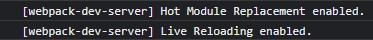
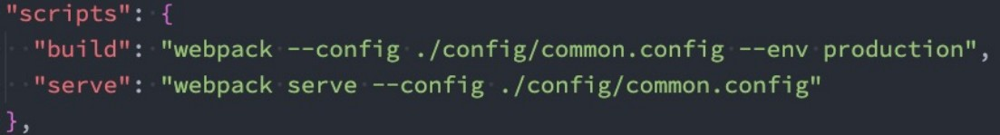
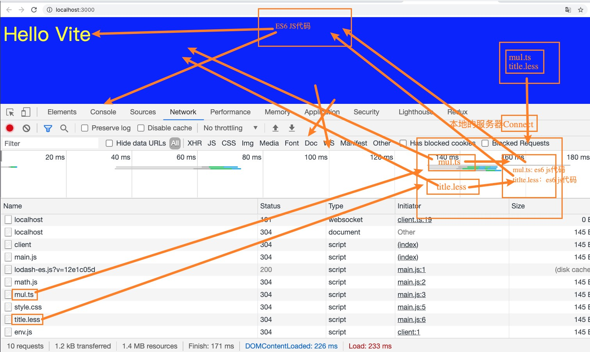

# 邂逅Vue3 和 Vue3 开发体验

## 认识 Vue

- Vue (读音 /vjuː/，类似于 **view**) 是一套用于构建用户界面的**渐进式框架**。 

  - 全称是Vue.js或者Vuejs； 

  - 什么是渐进式框架呢？表示我们可以在项目中一点点来引入和使用Vue，而不一定需要全部使用Vue来开发整个项目；

## 目前Vue 在前端处于什么地位？


## Vue3 带来的变化（源码）

- 源码通过monorepo的形式来管理源代码： 

  - Mono：单个 

  - Repo：repository仓库

  - 主要是将许多项目的代码存储在同一个repository中；

  - 这样做的目的是多个包本身相互独立，可以有自己的功能逻辑、单元测试等，同时又在同一个仓库下方便管理；

  - 而且模块划分的更加清晰，可维护性、可扩展性更强； 

- 源码使用TypeScript来进行重写： 

  - 在Vue2.x的时候，Vue使用Flow来进行类型检测； 

  - 在Vue3.x的时候，Vue的源码全部使用TypeScript来进行重构，并且Vue本身对TypeScript支持也更好了；


## Vue3 带来的变化（性能）

- 使用Proxy进行数据劫持

  - 在Vue2.x的时候，Vue2是使用Object.defineProperty来劫持数据的getter和setter方法的；

  - 这种方式一直存在一个缺陷就是当给对象添加或者删除属性时，是无法劫持和监听的；

  - 所以在Vue2.x的时候，不得不提供一些特殊的API，比如$set或$delete，事实上都是一些hack方法，也增加了开发者学习新的API的成本； 

  - 而在Vue3.x开始，Vue使用Proxy来实现数据的劫持，这个API的用法和相关的原理我也会在后续讲到；

- 删除了一些不必要的API： 

  - 移除了实例上的$on, $off 和 $once； 

  - 移除了一些特性：如filter、内联模板等；

- 包括编译方面的优化： 
  - 生成Block Tree、Slot编译优化、diff算法优化；


## Vue3 带来的变化（新的API）

- 由Options API 到 Composition API： 

  - 在Vue2.x的时候，我们会通过Options API来描述组件对象； 

  - Options API包括data、props、methods、computed、生命周期等等这些选项；

  - 存在比较大的问题是多个逻辑可能是在不同的地方：
    - 比如created中会使用某一个method来修改data的数据，代码的内聚性非常差； 

  - Composition API可以将 相关联的代码 放到同一处 进行处理，而不需要在多个Options之间寻找； 

- Hooks函数增加代码的复用性： 

  - 在Vue2.x的时候，我们通常通过mixins在多个组件之间共享逻辑； 

  - 但是有一个很大的缺陷就是 mixins也是由一大堆的Options组成的，并且多个mixins会存在命名冲突的问题；

  - 在Vue3.x中，我们可以通过Hook函数，来将一部分独立的逻辑抽取出去，并且它们还可以做到是响应式的；

  - 具体的好处，会在后续的课程中演练和讲解（包括原理）；


## 如何使用 Vue 呢？

- Vue的本质，就是一个 JavaScript 的库：
  - 刚开始我们不需要把它想象的非常复杂； 
  - 我们就把它理解成一个已经帮助我们封装好的库； 
  - 在项目中可以引入并且使用它即可。


- 那么安装和使用Vue这个 JavaScript 库有哪些方式呢？
  - 方式一：在页面中通过CDN的方式来引入；
  - 方式二：下载Vue的JavaScript文件，并且自己手动引入；
  - 方式三：通过npm包管理工具安装使用它（webpack再讲）；
  - 方式四：直接通过Vue CLI创建项目，并且使用它；


### 方式一：CDN引入

- 什么是CDN呢？CDN称之为内容分发网络（**C**ontent **D**elivery **N**etwork或**C**ontent **D**istribution **N**etwork，缩 写：**CDN**） 

  - 它是指通过**相互连接的网络系统**，利用**最靠近**每个用户的服务器（边缘节点），进行资源查找，查找不到再去父节点查找（多个边缘节点可能会共享一个父节点，直到找到**原站**）。若原站或父节点查询到资源，将其逐层向下下载（原站->父节点->边缘节点），最终将资源下载并保存到边缘节点，之后同一地区的其余用户便可直接从边缘节点下载资源； 

  - 更快、更可靠地将**音乐、图片、视频、应用程序及其他文件**发送给用户；

  - 来提供**高性能、可扩展性及低成本的**网络内容传递给用户；


- 常用的CDN服务器可以大致分为两种： 

  - 自己的CDN服务器：需要购买自己的CDN服务器，目前阿里、腾讯、亚马逊、Google等都可以购买CDN服务器； 

  - 开源的CDN服务器：国际上使用比较多的是unpkg、 JSDelivr、cdnjs；


- Vue 的 CND 引入

  ```
  <script src="https://unpkg.com/vue@next"></script>
  ```

- Hello Vue 案例实现：

  ```html
  <body>
      <div id="app"></div>
      <script src="https://unpkg.com/vue@next"></script>
      <script type="text/javascript" >
          const why = {
              template:'<h2>Hello World</h2>'
          }
          const app = Vue.createApp(why);
          app.mount("#app")
      </script>
  </body>
  ```


### 方式二：下载和引入

- 下载Vue的源码，可以直接打开CDN的链接： 

  - 打开链接，复制其中所有的代码； 

  - 创建一个新的文件，比如vue.js，将代码复制到其中；

- 通过script标签，引入刚才的文件：

  ```
  <script type="text/javascript" src="../js/vue.js"></script>
  ```

- 案例实现：

  ```html
  <body>
      <div id="app"></div>
      <script type="text/javascript" src="../js/vue.js"></script>
      <script type="text/javascript" >
          Vue.createApp({
              template:`<h2>你好啊，李银河</h2>`
          }).mount('#app');
      </script>
  </body>
  ```

## 计数器案例

- 如果我们希望实现一个计数器的案例： 

  - 点击+1，那么内容会显示数字+1； 

  - 点击-1，那么内容会显示数字-1； 

- 我们可以选择很多种方式来实现： 

- 在这里我们就对比原生和Vue的实现方式的不同。

### 计数器原生实现

```html
<!DOCTYPE html>
<html lang="en">

<head>
    <meta charset="UTF-8">
    <meta http-equiv="X-UA-Compatible" content="IE=edge">
    <meta name="viewport" content="width=device-width, initial-scale=1.0">
    <title>Document</title>
</head>

<body>
    <h2 class="counter">0</h2>
    <button class="increment">+1</button>
    <button class="decrement">-1</button>
    <script type="text/javascript">
        // 1. 获取所有的元素
        const counterEl = document.querySelector(".counter");
        const incrementEl = document.querySelector(".increment");
        const decrementEl = document.querySelector(".decrement");

        // 2.定义变量
        let counter = 100;
        counterEl.innerHTML = counter;

        // 3.监听按钮的点击
        incrementEl.addEventListener("click", () => { 
            counter += 1;
            counterEl.innerHTML = counter;
        })
        decrementEl.addEventListener("click", () => { 
            counter -= 1;
            counterEl.innerHTML = counter;
        })
    </script>
</body>

</html>
```

### 计数器Vue实现

```html
<!DOCTYPE html>
<html lang="en">

<head>
    <meta charset="UTF-8">
    <meta http-equiv="X-UA-Compatible" content="IE=edge">
    <meta name="viewport" content="width=device-width, initial-scale=1.0">
    <title>Document</title>
</head>

<body>
    <div id="app"></div>
    <script type="text/javascript" src="../js/vue.js"></script>
    <script type="text/javascript">
        Vue.createApp({
            template: `
                <div>
                    <h2>{{counter}}</h2>    
                    <button @click="increment">+1</button>
                    <button @click="decrement">-1</button>
                </div>
            `,
            data: function () {
                return {
                    counter: 100
                }
            },
            // 方法
            methods: {
                increment() {
                    console.log("点击了+1");
                    this.counter++;
                },
                decrement() {
                    console.log("点击了-1");
                    this.counter--;
                }
            }
        }).mount('#app');
    </script>
</body>

</html>
```

## 声明式和命令式

- 原生开发和Vue开发的模式和特点，我们会发现是完全不同的，这里其实涉及到**两种不同的编程范式**： 

- 命令式编程和声明式编程； 
  - 命令式编程关注的是 “how to do”，声明式编程关注的是 “what to do”，由框架(机器)完成 “how”的过程；

- **在原生的实现过程中，我们是如何操作的呢？**

  - 我们每完成一个操作，都需要通过JavaScript编写一条代码，来给浏览器一个指令；

  - 这样的编写代码的过程，我们称之为命令式编程； 

  - 在早期的原生JavaScript和jQuery开发的过程中，我们都是通过这种命令式的方式在编写代码的；

- **在Vue的实现过程中，我们是如何操作的呢？**

  - 我们会在createApp传入的对象中声明需要的内容，模板template、数据data、方法methods； 

  - 这样的编写代码的过程，我们称之为是声明式编程； 

  - 目前Vue、React、Angular的编程模式，我们称之为声明式编程；


## MVVM模型

- MVC和MVVM都是一种软件的体系结构

  - MVC是Model – View –Controller的简称，是在前期被使用非常框架的架构模式，比如iOS、前端；

  - MVVM是Model-View-ViewModel的简称，是目前非常流行的架构模式；

- 通常情况下，我们也经常称Vue是一个MVVM的框架。

  - Vue官方其实有说明，Vue虽然并没有完全遵守MVVM的模型，但是整个设计是受到它的启发的。

  


## template属性

- **template属性：**表示的是Vue需要帮助我们渲染的模板信息： 

  - 目前我们看到它里面有很多的HTML标签，这些标签会替换掉我们挂载到的元素（比如id为app的div）的innerHTML； 

  - 模板中有一些奇怪的语法，比如 `{{ }}`，比如 @click，这些都是模板特有的语法，我们会在后面讲到；

  - 但是这个模板的写法有点过于别扭了，并且IDE很有可能没有任何提示，阻碍我们编程的效率。

- Vue提供了两种方式：

  - 方式一：使用script标签，并且标记它的类型为 x-template；

  ```html
  <body>
      <div id="app"></div>
      <script type="x-template" id="xxc">
          <div>
              <h2>{{counter}}</h2>    
              <button @click="increment">+1</button>
              <button @click="decrement">-1</button>
          </div>
      </script>
  
      <script type="text/javascript" src="../js/vue.js"></script>
      <script type="text/javascript">
          Vue.createApp({
              template: '#xxc',
              data: function () {
                  return {
                      counter: 100
                  }
              },
              // 方法
              methods: {
                  increment() {
                      console.log("点击了+1");
                      this.counter++;
                  },
                  decrement() {
                      console.log("点击了-1");
                      this.counter--;
                  }
              }
          }).mount('#app');
      </script>
  </body>
  ```

  

  - 方式二：使用任意标签（通常使用template标签，因为不会被浏览器渲染。用其它标签的话会显示两次），设置id； 

    - template元素是一种用于保存客户端内容的机制，其内部的内容在加载页面时不会被呈现，但随后可以在运行时使用JavaScript实例化；

    ```html
    <body>
        <div id="app"></div>
        <template id="xxc">
            <div>
                <h2>{{counter}}</h2>    
                <button @click="increment">+1</button>
                <button @click="decrement">-1</button>
            </div>
        </template>
    
        <script type="text/javascript" src="../js/vue.js"></script>
        <script type="text/javascript">
            Vue.createApp({
                template: '#xxc',
                data: function () {
                    return {
                        counter: 100
                    }
                },
                // 方法
                methods: {
                    increment() {
                        console.log("点击了+1");
                        this.counter++;
                    },
                    decrement() {
                        console.log("点击了-1");
                        this.counter--;
                    }
                }
            }).mount('#app');
        </script>
    </body>
    ```

- 这个时候，在createApp的对象中，我们需要传入以 # 开头的template： 
  
  - 因为Vue官方文档中有说，如果字符串是以 # 开始，那么它将被用作 querySelector，并且使用匹配元素的 innerHTML 作为模板字符串；


## data属性

- **data属性**是传入一个函数，并且该函数需要返回一个对象： 

  - 在Vue2.x的时候，也可以传入一个对象（虽然官方推荐是一个函数）；

  - 在Vue3.x的时候，必须传入一个函数，否则就会直接在浏览器中报错； 

- data中返回的对象会被Vue的响应式系统劫持，之后对该对象的修改或者访问都会在劫持中被处理：

  - 所以我们在template中通过 {{counter}} 访问counter，可以从对象中获取到数据； 

  - 所以我们修改counter的值时，template中的 {{counter}}也会发生改变； 

- 具体这种响应式的原理，我们后面会有专门的篇幅来讲解。


## methods属性

- **methods属性**是一个对象，通常我们会在这个对象中定义很多的方法： 

  - 这些方法可以被绑定到 template 模板中；

  - 在该方法中，我们可以使用this关键字来直接访问到data中返回的对象的属性； 


`两个问题：`

1. 为什么methods中不能使用箭头函数（官方文档有给出解释）？

- 我们在methods中要使用data返回对象中的数据：

  - 那么这个this是必须有值的，并且应该可以通过this获取到data返回对象中的数据。 

- *那么我们这个this能不能是**window呢？**

  - 不可以是window，因为window中我们无法获取到data返回对象中的数据；

  - 但是如果我们使用箭头函数，那么这个this就会是window了；

- **为什么是window呢？**

  - 这里涉及到箭头函数使用this的查找规则，它会在自己的上层作用于中来查找this； 

  - 最终刚好找到的是script作用于中的this，所以就是window； 

- **this到底是如何查找和绑定的呢？**

  - https://mp.weixin.qq.com/s/hYm0JgBI25grNG_2sCRlTA； 

  

2. 不使用箭头函数的情况下，this到底指向的是什么？

- 事实上Vue的源码当中就是对methods中的所有函数进行了遍历，并且通过bind绑定了this：


## 其他属性

- 当然，这里还可以定义很多其他的属性，我们会在后续进行讲解：

  - 比如props、computed、watch、emits、setup等等；

  - 也包括很多的生命周期函数；


## Vue的源码

- 如果想要学习Vue的源码，比如看createApp的实现过程，应该怎么办呢？
- 第一步：在GitHub上搜索 vue-next，下载源代码； 
  
- 这里推荐通过 git clone 的方式下载； 
  
- 第二步：安装Vue源码项目相关的依赖； 
  
- 执行 yarn install
  
- 第三步：对项目执行打包操作

  - 执行yarn dev（执行前修改脚本）

  ```json
  "scripts":{
      "dev":"node scripts/dev.js --sourcemap"
      ...
  }
  ```


# Vue3基础语法（一）

## 模板语法

- **React的开发模式：**

  - React使用的jsx，所以对应的代码都是`编写的类似于js的一种语法`； 

  - 之后通过Babel将jsx编译成 React.createElement 函数调用；

- **Vue也支持jsx的开发模式（后续有时间也会讲到）：**

  - 但是大多数情况下，使用`基于HTML的模板语法`； 

  - 在模板中，允许开发者以声明式的方式将`DOM`和`底层组件实例的数据`绑定在一起；

  - 在底层的实现中，Vue将模板编译成虚拟DOM渲染函数，这个我会在后续给大家讲到；


## Mustche 双大括号语法

- 如果我们希望把数据显示到模板（template）中，使用最多的语法是 **“Mustache”语法 (双大括号)** 的文本插值。

- 并且我们前面提到过，data返回的对象是有添加到Vue的响应式系统中；
- 当data中的数据发生改变时，对应的内容也会发生更新。 
- 当然，Mustache中不仅仅可以是data中的属性，也可以是一个JavaScript的表达式。

- 使用示例：

```html
<!DOCTYPE html>
<html lang="en">

<head>
    <meta charset="UTF-8">
    <meta http-equiv="X-UA-Compatible" content="IE=edge">
    <meta name="viewport" content="width=device-width, initial-scale=1.0">
    <title>Document</title>
</head>

<body>
    <div id="app"></div>
    <template id="my-app">
        <!-- 1.mustache的基本使用 -->
        <h2>{{message}} - {{message}}</h2>
        <!-- 2.是一个表达式 -->
        <h2>{{counter * 10}}</h2>
        <h2>{{message.split(" ").reverse().join(" ")}}</h2>
        <!-- 3.也可以调用函数或使用计算属性 -->
        <h2>{{getReverseMessage()}}</h2>
        <!-- 4.三元运算符 -->
        <h2>{{isShow?"哈哈哈":""}}</h2>
        <button @click="toggle">切换</button>

        <!-- 错误用法 -->
        <!-- var name = "abc" -> 赋值语句 -->
        <!-- <h2>{{var name = "abc"}}</h2> -->
        <!-- <h2>{{ if(isShow){ return "哈哈哈" } }}</h2> -->
    </template>

    <script type="text/javascript" src="../js/vue.js"></script>
    <script type="text/javascript">
        const App = {
            template: "#my-app",
            data() {
                return {
                    message: "Hello World",
                    counter: 100,
                    isShow: true
                }
            },
            methods: {
                getReverseMessage() {
                    return this.message.split(' ').reverse().join(' ')
                },
                toggle() {
                    this.isShow = !this.isShow
                }
            }
        }

        Vue.createApp(App).mount('#app');
    </script>
</body>

</html>
```


## v-once 指令

- **v-once用于指定元素或者组件只渲染一次：**

  - 当数据发生变化时，`元素或者组件以及其所有的子元素`将视为`静态内容`并且跳过；

  - 该指令可以用于`性能优化`；

```html
<body>
    <div id="app"></div>
    <template id="my-app">
        <h2>{{counter}}</h2>
        <div v-once>
            <!-- 点击后，下方代码的内容不会发生修改 -->
            <h2>{{counter}}</h2>
            <h2>{{message}}</h2>
        </div>
        <button @click="increment">+1</button>
    </template>

    <script type="text/javascript" src="../js/vue.js"></script>
    <script type="text/javascript">
        const App = {
            template: "#my-app",
            data() {
                return {
                    counter: 100
                }
            },
            methods: {
                increment() {
                    this.counter++;
                }
            }
        }

        Vue.createApp(App).mount('#app');
    </script>
</body>
```

## v-text 指令

- 用于更新元素的 textContent：

```html
<body>
    <div id="app"></div>
    <template id="my-app">
        <h2 v-text="message"></h2>

        <!-- 等价于： -->
        <!-- <h2>{{message}}</h2> -->
    </template>

    <script type="text/javascript" src="../js/vue.js"></script>
    <script type="text/javascript">
        const App = {
            template: "#my-app",
            data() {
                return {
                    message: "Hello World"
                }
            }
        }

        Vue.createApp(App).mount('#app');
    </script>
</body>
```


## v-html 指令

- 默认情况下，如果我们展示的`内容本身是 html` 的，那么`vue并不会对其进行特殊的解析`。 
  - 如果我们希望这个内容`被Vue可以解析出来`，那么可以`使用 v-html` 来展示；

```html
<body>
    <div id="app"></div>
    <template id="my-app">
        <div>{{msg}}</div>
        <div v-html="msg"></div>
    </template>

    <script type="text/javascript" src="../js/vue.js"></script>
    <script type="text/javascript">
        const App = {
            template: "#my-app",
            data() {
                return {
                    msg: '<span style="color:red;background:blue;">哈哈哈</span>'
                }
            }
        }

        Vue.createApp(App).mount('#app');
    </script>
</body>
```

**结果：**


## v-pre 指令

- v-pre用于跳过元素和它的子元素的编译过程，显示原始的Mustache标签： 
  - 跳过不需要编译的节点，加快编译的速度； 

```html
<body>
    <div id="app"></div>
    <template id="my-app">
        <h2 v-pre>{{message}}</h2>
    </template>

    <script type="text/javascript" src="../js/vue.js"></script>
    <script type="text/javascript">
        const App = {
            template: "#my-app",
            data() {
                return {
                    message: "Hello World"
                }
            }
        }

        Vue.createApp(App).mount('#app');
    </script>
</body>
```

**结果：**


## v-cloak 指令

- 这个指令保持在元素上直到关联组件实例结束编译。
  - 和 CSS 规则如 [v-cloak] { display: none } 一起用时，这个指令可以隐藏未编译的 Mustache 标签直到组件实例准备完毕。

```html
<head>
    <style>
        [v-cloak] {
            display: none;
        }
    </style>
</head>

<body>
    <div id="app"></div>
    <template id="my-app">
        <div v-cloak>{{message}}</h2>
    </template>

    <script type="text/javascript" src="../js/vue.js"></script>
    <script type="text/javascript">
        const App = {
            template: "#my-app",
            data() {
                return {
                    message: "Hello World"
                }
            }
        }

        Vue.createApp(App).mount('#app');
    </script>
</body>
```

- `<div>` 不会显示，直到编译结束。


## v-bind 的绑定属性

- 前面讲的一系列指令，主要是将值插入到`模板内容`中。

- 但是，除了内容需要动态来决定外，某些`属性`我们也希望动态来绑定。 
  - 比如动态绑定a元素的href属性； 
  - 比如动态绑定img元素的src属性； 

- **绑定属性我们使用v-bind：** 

  - **缩写**：“：”

  - **预期**：any (with argument) | Object (without argument) 

  - **参数**：attrOrProp (optional) 

  - **修饰符**： 

    - .camel - 将 kebab-case attribute 名转换为 camelCase。 

    - **用法**：动态地绑定一个或多个 attribute，或一个组件 prop 到表达式。

```html
<body>
    <div id="app"></div>

    <!-- vue2 template模板中只能有一个根元素 -->
    <!-- vue3 是允许template中有多个根元素 -->
    <template id="my-app">
        <!-- 1、v-bind：指令 -->
        
        <a v-bind:href="link">百度一下</a>

        <!-- 2、v-bind 提供了一个语法糖： -->
        
    </template>

    <script type="text/javascript" src="../js/vue.js"></script>
    <script type="text/javascript">
        const App = {
            template: "#my-app",
            data() {
                return {
                    imgUrl: "https://cdn.jsdelivr.net/gh/xxc-yqxz/xxc-yqxz.github.io/images/avatar.jpg",
                    link:"https://www.baidu.com"
                }
            }
        }

        Vue.createApp(App).mount('#app');
    </script>
</body>
```


## 绑定 class 介绍

- 在开发中，有时候我们的元素class也是动态的，比如：

  - 当数据为某个状态时，字体显示红色。 

  - 当数据另一个状态时，字体显示黑色。 

- **绑定class有两种方式：**

  - 对象语法

  - 数组语法

### 对象语法

```html
<head>
    <style>
        .active {
            color: red
        }
    </style>
</head>
<body>
    <div id="app"></div>
    <template id="my-app">
        <div :class="className">呵呵呵呵</div>
        <!-- 对象语法：{'active': boolean} -->
        <div :class="{'active':isActive}">哈哈哈哈</div>
        <button @click="toggle">切换</button>

        <!-- 也可以有多个键值对 -->
        <!-- 此处的键，可以不加''，也可以加。不加时其不会受 data 中同名属性的影响 -->
        <div :class="{active:isActive,title:true}">呀呀呀呀</div>

        <!-- 默认的class和动态的class结合 -->
        <div class="abc cba" :class="{active:isActive,title:true}">呵呵呵呵</div>

        <!-- 将对象放到一个单独的属性中，此时classObj 中的值不能再是data中的其它值 -->
        <div class="abc cba" :class="classObj">呵呵呵呵</div>

        <!-- 将返回的对象放到一个methods/computed 方法中 -->
        <div class="abc cba" :class="getClassObj()">呵呵呵呵</div>
    </template>

    <script type="text/javascript" src="../js/vue.js"></script>
    <script type="text/javascript">
        const App = {
            template: "#my-app",
            data() {
                return {
                    className: "Hello World",
                    isActive: true,
                    title: "abc",
                    classObj: { active: true, title: true }
                }
            },
            methods: {
                toggle() {
                    this.isActive = !this.isActive
                },
                getClassObj(){
                    return { active: true, title: true }
                }
            }
        }

        Vue.createApp(App).mount('#app');
    </script>
</body>
```

### 数组语法

```html
<body>
    <div id="app"></div>
    <template id="my-app">
        <div :class="['abc',title]">哈哈哈</div>
        <div :class="['abc',title,isActive?'active':'']">哈哈哈</div>
        <div :class="['abc',title,{active:isActive}]">哈哈哈</div>
    </template>

    <script type="text/javascript" src="../js/vue.js"></script>
    <script type="text/javascript">
        const App = {
            template: "#my-app",
            data() {
                return {
                    message: "Hello World",
                    title: "cba",
                    isActive: true
                }
            }
        }

        Vue.createApp(App).mount('#app');
    </script>
</body>
```


## 绑定style介绍

- 我们可以利用`v-bind:style`来绑定一些`CSS内联样式`： 

  - 这是因为某些样式我们需要根据`数据`动态来决定；

  - 比如某段文字的`颜色，大小`等等； 

- CSS property 名可以用`驼峰式 (camelCase)` 或`短横线分隔 (kebab-case，记得用引号括起来)` 来命名； 

- **绑定class有两种方式：**

  - 对象语法

  - 数组语法

### 对象语法

```html
<body>
    <div id="app"></div>
    <template id="my-app">
        <!-- :style="{cssPropertyName:cssPropertyValue}" -->
        <!-- style的键可以用驼峰或'-'的形式，但若使用'-'，则必须使用 '' 包裹 -->
        <div :style="{color:finalColor,'font-size':'30px'}">哈哈哈哈</div>
        <div :style="{color:finalColor,fontSize:'30px'}">哈哈哈哈</div>
        <div :style="{color:finalColor,fontSize:finalFontSize+'px'}">哈哈哈哈</div>

        <!-- 绑定一个data中的属性值，并且是一个对象 -->
        <div :style="finalStyleObj">哈哈哈哈</div>
        <!-- 调用一个方法 -->
        <div :style="getFinalStyleObj()">哈哈哈哈</div>
    </template>

    <script type="text/javascript" src="../js/vue.js"></script>
    <script type="text/javascript">
        const App = {
            template: "#my-app",
            data() {
                return {
                    message: "Hello World",
                    finalColor: "red",
                    finalFontSize: 50,
                    finalStyleObj: {
                        fontSize: '50px',
                        fontWeight: 700,
                        backgroundColor: 'red'
                    }
                }
            },
            methods: {
                getFinalStyleObj(){
                    return {
                        fontSize: '50px',
                        fontWeight: 700,
                        backgroundColor: 'red'
                    }
                }
            }
        }

        Vue.createApp(App).mount('#app');
    </script>
</body>
```


## 动态绑定属性

- 在某些情况下，我们属性的名称可能也不是固定的：

  - 前端我们无论绑定src、href、class、style，属性名称都是固定的；

  - 如果属性名称不是固定的，我们可以使用 :[属性名]=“值” 的格式来定义； 

  - 这种绑定的方式，我们称之为动态绑定属性；

```html
<body>
    <div id="app"></div>
    <template id="my-app">
        <div :[name]='value'>哈哈哈</div>
    </template>

    <script type="text/javascript" src="../js/vue.js"></script>
    <script type="text/javascript">
        const App = {
            template: "#my-app",
            data() {
                return {
                    name: "abc",
                    value: "kobe"
                }
            }
        }

        Vue.createApp(App).mount('#app');
    </script>
</body>
```


## 绑定一个对象

- 如果我们希望将一个对象的所有属性，绑定到元素上的所有属性，应该怎么做呢？ 

  - 非常简单，我们可以直接使用 v-bind 绑定一个 对象； 

  - 案例：info对象会被拆解成div的各个属性

```html
<body>
    <div id="app"></div>
    <template id="my-app">
        <div v-bind="info">哈哈哈哈</div>
        <!--<div :="info">哈哈哈哈</div>-->
    </template>

    <script type="text/javascript" src="../js/vue.js"></script>
    <script type="text/javascript">
        const App = {
            template: "#my-app",
            data() {
                return {
                    info: {
                        name: "xxc",
                        age: 18,
                        height: 1.88
                    }
                }
            }
        }

        Vue.createApp(App).mount('#app');
    </script>
</body>
```


## v-on 绑定事件

- 前面我们绑定了元素的`内容和属性`，在前端开发中另外一个非常重要的特性就是`交互`。 

  - **在前端开发中，我们需要经常和用户进行各种各样的交互：**

  - 这个时候，我们就必须监听用户发生的事件，比如`点击、拖拽、键盘事件`等等

- 在Vue中如何监听事件呢？使用`v-on指令`。 


- 接下来我们来看一下v-on的用法：


### v-on的用法

- **v-on的使用：**

  - **缩写**：@ 

  - **预期**：Function | Inline Statement | Object

  - **参数**：event

  - **修饰符**： 

    - .stop - 调用 event.stopPropagation()。 

    - .prevent - 调用 event.preventDefault()。 

    - .capture - 添加事件侦听器时使用 capture 模式。

    - .self - 只当事件是从侦听器绑定的元素本身触发时才触发回调。

    - .{keyAlias} - 仅当事件是从特定键触发时才触发回调。

    - .once - 只触发一次回调。

    - .left - 只当点击鼠标左键时触发。

    - .right - 只当点击鼠标右键时触发。

    - .middle - 只当点击鼠标中键时触发。

    - .passive - { passive: true } 模式添加侦听器

  - **用法**：绑定事件监听

### v-on 的基本使用

```html
<head>
    <style>
        .area {
            width: 200px;
            height: 200px;
            background: red;
        }
    </style>
</head>
<body>
    <div id="app"></div>
    <template id="my-app">
        <!-- 完整写法：v-on:监听的事件="methods中的方法" -->
        <button v-on:click="btn1Click">按钮1</button>
        <div class="area" v-on:mousemove="mouseMove">div</div>

        <!-- 语法糖 -->
        <button @click="btn1Click">按钮1</button>

        <!-- 绑定一个表达式:inline statement -->
        <button @click="counter++">{{counter}}</button>

        <!-- 绑定一个对象 -->
        <div class="area" v-on="{click:btn1Click,mousemove:mouseMove}"></div>
        <div class="area" @="{click:btn1Click,mousemove:mouseMove}"></div>
    </template>

    <script type="text/javascript" src="../js/vue.js"></script>
    <script type="text/javascript">
        const App = {
            template: "#my-app",
            data() {
                return {
                    message: "Hello World",
                    counter: 100
                }
            },
            methods: {
                btn1Click() {
                    console.log('按钮1发生了点击')
                },
                mouseMove() {
                    console.log("鼠标移动")
                }
            }
        }

        Vue.createApp(App).mount('#app');
    </script>
</body>
```

### v-on参数传递

```html
<body>
    <div id="app"></div>
    <template id="my-app">
        <!-- 默认传入event对象，可以在方法中获取 -->
        <button @click="btnClick">按钮1</button>

        <!-- $event 可以获取到事件1发生时的事件对象 -->
        <button @click="btn2Click($event,'xxc')">按钮2</button>
    </template>

    <script type="text/javascript" src="../js/vue.js"></script>
    <script type="text/javascript">
        const App = {
            template: "#my-app",
            data() {
                return {
                    message: "Hello World"
                }
            },
            methods: {
                btnClick(event) {
                    console.log(event);
                },
                btn2Click(event, name) {
                    console.log(name, event);
                }
            }
        }

        Vue.createApp(App).mount('#app');
    </script>
</body>
```

### v-on的修饰符

- v-on支持修饰符，修饰符相当于对事件进行了一些特殊的处理： 

  - .stop - 调用 event.stopPropagation()。 

  - .prevent - 调用 event.preventDefault()。 

  - .capture - 添加事件侦听器时使用 capture 模式。

  - .self - 只当事件是从侦听器绑定的元素本身触发时才触发回调。

  - .{keyAlias} - 仅当事件是从特定键触发时才触发回调。

  - .once - 只触发一次回调。

  - .left - 只当点击鼠标左键时触发。

  - .right - 只当点击鼠标右键时触发。

  - .middle - 只当点击鼠标中键时触发。

  - .passive - { passive: true } 模式添加侦听器

```html
<body>
    <div id="app"></div>
    <template id="my-app">
        <div @click="divClick">
            <button @click.stop="btnClick">按钮</button>
        </div>
        <input type="text" @keyup.enter="enterKeyup">
    </template>

    <script type="text/javascript" src="../js/vue.js"></script>
    <script type="text/javascript">
        const App = {
            template: "#my-app",
            data() {
                return {
                    message: "Hello World"
                }
            },
            methods: {
                divClick() {
                    console.log("divClick");
                },
                btnClick() {
                    console.log('btnClick');
                },
                enterKeyup(event) {
                    console.log('enterKeyup', event.target.value)
                }
            }
        }

        Vue.createApp(App).mount('#app');
    </script>
</body>
```


# Vue3基础语法（二）

## 条件渲染

- 在某些情况下，我们需要根据当前的条件决定某些元素或组件是否渲染，这个时候我们就需要进行条件判断了。

- Vue提供了下面的指令来进行条件判断： 

  - v-if 

  - v-else

  - v-else-if 

  - v-show 


## v-if、v-else、v-else-if

- v-if、v-else、v-else-if用于根据条件来渲染某一块的内容： 

  - 这些内容只有在条件为true时，才会被渲染出来；

  - 这三个指令与JavaScript的条件语句if、else、else if类似；

- v-if的渲染原理： 

  - v-if是惰性的；

  - 当条件为false时，其判断的内容完全不会被渲染或者会被销毁掉； 

  - 当条件为true时，才会真正渲染条件块中的内容；

```html
<body>
    <div id="app"></div>
    <template id="my-app">
        <input type="text" v-model='score'>
        <h2 v-if="score > 90">优秀</h2>
        <h2 v-else-if="score > 60">良好</h2>
        <h2 v-else>不及格</h2>
    </template>

    <script type="text/javascript" src="../js/vue.js"></script>
    <script type="text/javascript">
        const App = {
            template: "#my-app",
            data() {
                return {
                    score: 90
                }
            }
        }

        Vue.createApp(App).mount('#app');
    </script>
</body>
```


## template元素

- 因为v-if是一个指令，所以必须将其添加到一个元素上：

  - 但是如果我们希望切换的是多个元素呢？ 

  - 此时我们渲染div，但是我们并不希望div这种元素被渲染；

  - 这个时候，我们可以选择使用template； 

- template元素可以当做不可见的包裹元素，并且在v-if上使用，但是最终template不会被渲染出来：
  - 有点类似于小程序中的block

```html
<body>
    <div id="app"></div>
    <template id="my-app">
        <template v-if="isShowHa">
            <h2>哈哈哈哈</h2>
            <h2>哈哈哈哈</h2>
            <h2>哈哈哈哈</h2>
        </template>

        <template v-else>
            <h2>呵呵呵呵</h2>
            <h2>呵呵呵呵</h2>
            <h2>呵呵呵呵</h2>
        </template>
    </template>

    <script type="text/javascript" src="../js/vue.js"></script>
    <script type="text/javascript">
        const App = {
            template: "#my-app",
            data() {
                return {
                    isShowHa: true
                }
            }
        }

        Vue.createApp(App).mount('#app');
    </script>
</body>
```

## v-show

- v-show和v-if的用法看起来是一致的，也是根据一个条件决定是否显示元素或者组件：

```html
<body>
    <div id="app"></div>
    <template id="my-app">
        <h2 v-show="isShow">哈哈哈哈</h2>
    </template>

    <script type="text/javascript" src="../js/vue.js"></script>
    <script type="text/javascript">
        const App = {
            template: "#my-app",
            data() {
                return {
                    isShow: false
                }
            }
        }

        Vue.createApp(App).mount('#app');
    </script>
</body>
```


## v-show 和 v-if 的区别

- 首先，在用法上的区别： 

  - v-show是不支持template； 

  - v-show不可以和v-else一起使用；

- 其次，本质的区别： 

  - v-show元素无论是否需要显示到浏览器上，它的DOM实际都是有渲染的，只是通过CSS的display属性来进行切换； 

  - v-if当条件为false时，其对应的原生压根不会被渲染到DOM中；

- 开发中如何进行选择呢？ 

  - 如果我们的原生需要在显示和隐藏之间频繁的切换，那么使用v-show； 

  - 如果不会频繁的发生切换，那么使用v-if；

```html
<body>
    <div id="app"></div>
    <template id="my-app">
        <h2 v-if="isShow">哈哈哈哈</h2>
        <h2 v-show="isShow">呵呵呵呵</h2>
    </template>

    <script type="text/javascript" src="../js/vue.js"></script>
    <script type="text/javascript">
        const App = {
            template: "#my-app",
            data() {
                return {
                    isShow: false
                }
            }
        }

        Vue.createApp(App).mount('#app');
    </script>
</body>
```


## 列表渲染 v-for

- 在真实开发中，我们往往会从服务器拿到一组数据，并且需要对其进行渲染。

  - 这个时候我们可以使用v-for来完成；

  - v-for类似于JavaScript的for循环，可以用于遍历一组数据；

- v-for的基本格式是 "item in 数组"： 

  - 数组通常是来自data或者prop，也可以是其他方式；

  - item是我们给每项元素起的一个别名，这个别名可以自定来定义；

- 我们知道，在遍历一个数组的时候会经常需要拿到数组的索引： 

  - 如果我们需要索引，可以使用格式： "(item, index) in 数组"； 

  - 注意上面的顺序：数组元素项item是在前面的，索引项index是在后面的；


- v-for也支持遍历对象，并且支持有一二三个参数：

  - 一个参数： "value in object"; 

  - 二个参数： "(value, key) in object"; 

  - 三个参数： "(value, key, index) in object"; 

- v-for同时也支持数字的遍历：
  - 每一个item都是一个数字；

```html
<body>
    <div id="app"></div>
    <template id="my-app">
        <h2>电影列表</h2>
        <ul>
            <!-- 遍历数组 -->
            <li v-for="(movie,index) in movies">{{index+1}}.{{movie}}</li>
        </ul>

        <h2>个人信息</h2>
        <ul>
            <!-- 遍历对象 -->
            <li v-for="(value,key,index) in info">{{index}}.{{value}}-{{key}}</li>
        </ul>

        <h2>遍历数字</h2>
        <ul>
            <li v-for="(num,index) in 10">{{num}}-{{index}}</li>
        </ul>
    </template>

    <script type="text/javascript" src="../js/vue.js"></script>
    <script type="text/javascript">
        const App = {
            template: "#my-app",
            data() {
                return {
                    movies: [
                        "星际穿越",
                        "盗梦空间",
                        "大话西游",
                        "教父",
                        "少年派"
                    ],
                    info: {
                        name: "xxc",
                        age: 18,
                        height: 1.88
                    }
                }
            }
        }

        Vue.createApp(App).mount('#app');
    </script>
</body>
```

## template元素

- 类似于v-if，你可以使用 template 元素来循环渲染一段包含多个元素的内容：
  - 我们使用template来对多个元素进行包裹，而不是使用div来完成；

```html
<body>
    <div id="app"></div>
    <template id="my-app">
        <ul>
            <!-- ul 中不建议使用 hr 或 div 等其余元素 -->
            <template v-for="(value,key) in info">
                <li>{{key}}</li>
                <li>{{value}}</li>
                <li style="border-bottom: 1px solid #000;list-style: none;"></li>
            </template>
        </ul>
    </template>

    <script type="text/javascript" src="../js/vue.js"></script>
    <script type="text/javascript">
        const App = {
            template: "#my-app",
            data() {
                return {
                    info: {
                        name: "why",
                        age: 18,
                        height: 1.88
                    }
                }
            }
        }

        Vue.createApp(App).mount('#app');
    </script>
</body>
```

## 数组更新检测

- Vue 将被侦听的数组的变更方法进行了包裹，所以它们也将会触发视图更新。这些被包裹过的方法包括： 

  - push()

  - pop()

  - shift()

  - unshift()

  - splice()

  - sort()

  - reverse()

- **替换数组的方法**
  - 上面的方法会直接修改原来的数组，但是某些方法不会替换原来的数组，而是会生成新的数组，比如 filter()、concat() 和 slice()。

```html
<body>
    <div id="app"></div>
    <template id="my-app">
        <h2>电影列表</h2>
        <ul>
            <li v-for="(movie,index) in movies">{{index+1}}.{{movie}}</li>
        </ul>
        <input type="text" v-model="newMovie">
        <button @click="addMovie">添加电影</button>
    </template>

    <script type="text/javascript" src="../js/vue.js"></script>
    <script type="text/javascript">
        const App = {
            template: "#my-app",
            data() {
                return {
                    newMovie: "",
                    movies: [
                        "星际穿越",
                        "盗梦空间",
                        "大话西游",
                        "教父",
                        "少年派"
                    ],
                }
            },
            methods: {
                addMovie() {
                    this.movies.push(this.newMovie);
                    this.newMovie = "";

                    // this.movies = this.movies.filter(item =>item.length > 2);
                }
            }
        }

        Vue.createApp(App).mount('#app');
    </script>
</body>
```

## v-for 中key的作用

- 在使用v-for进行列表渲染时，我们通常会给元素或者组件绑定一个**key属性**。 

- 这个key属性有什么作用呢？我们先来看一下官方的解释： 

  - key属性主要用在Vue的`虚拟DOM算法`，在`新旧nodes`对比时辨识`VNodes`； 

  - 如果`不使用key`，Vue会使用一种最大限度减少动态元素并且尽可能的尝试就地`修改/复用相同类型元素`的算法；

  - 而`使用key`时，它会基于key的变化`重新排列元素顺序`，并且会`移除/销毁key`不存在的元素；


### 认识VNode

- 我们先来解释一下VNode的概念： 

  - 因为目前我们还没有比较完整的学习组件的概念，所以目前我们先理解HTML元素创建出来的VNode； 

  - VNode的全称是Virtual Node，也就是虚拟节点；

  - 事实上，无论是组件还是元素，它们最终在Vue中表示出来的都是一个个VNode； 

  - VNode的本质是一个JavaScript的对象；

```jsx
<div class="title" style="font-size:30px;color:red;">
    哈哈哈
</div>
<!-- 转换为VNode: -->
const vnode = {
	type:"div",
	props:{
		class:"title",
        style:{
            "font-size":"30px",
            color:"red"
        },
	},
    children:"哈哈哈"
}
```


### 虚拟DOM

- 如果我们不只是一个简单的div，而是有一大堆的元素，那么它们应该会形成一个VNode Tree（及Virtual DOM，VDOM 由许许多多的 VNode 组成）：


> 若有组件的情况下，虚拟DOM和真实DOM则并非一一对应，此处暂不考虑组件的情况。


### 插入F的案例

```html
<body>
    <div id="app"></div>
    <template id="my-app">
        <ul>
            <li v-for="item in letters">{{item}}</li>
        </ul>
        <button @click="insertF">插入f元素</button>
    </template>

    <script type="text/javascript" src="../js/vue.js"></script>
    <script type="text/javascript">
        const App = {
            template: "#my-app",
            data() {
                return {
                    letters: ['a', 'b', 'c', 'd']
                }
            },
            methods: {
                insertF() {
                    this.letters.splice(2, 0, 'f')
                }
            }
        }

        Vue.createApp(App).mount('#app');
    </script>
</body>
```

- 我们可以确定的是，这次更新对于ul和button是不需要进行更新，需要更新的是我们li的列表：

  - 在Vue中，对于相同父元素的子元素节点并不会重新渲染整个列表；

  - 因为对于列表中 a、b、c、d它们都是没有变化的；

  - 在操作真实DOM的时候，我们只需要在中间插入一个f的li即可；

- 那么Vue中对于列表的更新究竟是如何操作的呢？

  - Vue事实上会对于有key和没有key会调用两个不同的方法；

  - 有key，那么就使用 patchKeyedChildren方法；

  - 没有key，那么就使用 patchUnkeyedChildren方法；


#### 源码中没有 key 的操作

- 源码中没有 key 的操作：

  

  - 其比较 a、b的Vnode相同，不做变化，比较 c、d时会修改其中内容为 f、c，最后新增一个内容为 d 的Vnode。

  

- 我们会发现上面的diff算法效率并不高： 

  - c和d来说它们事实上并不需要有任何的改动； 

  - 但是因为我们的c被f所使用了，所有后续所有的内容都要一次进行改动，并且最后进行新增；


#### 源码中有 key 的操作


- 有 key 的 diff 算法如下：

  - 第一步的操作是从头开始进行遍历、比较： 

    - a和b是一致的会继续进行比较； 

    - c和f因为key不一致，所以就会break跳出循环；

  

  - 第二步的操作是从尾部开始进行遍历、比较：

  

  - 第三步是如果旧节点遍历完毕，但是依然有新的节点，那么就新增节点：

  

  - 第四步是如果新的节点遍历完毕，但是依然有旧的节点，那么就移除旧节点：

  

  - 第五步是最特色的情况，中间还有很多未知的或者乱序的节点，通过建立map映射，查询是否有重复的节点，尽可能的重用节点：

  


- 所以我们可以发现，Vue在进行diff算法的时候，会尽量利用我们的key来进行优化操作： 

  - 在没有key的时候我们的效率是非常低效的；

  - 在进行插入或者重置顺序的时候，保持相同的key可以让diff算法更加的高效；


# Vue3 基础语法（三）

## 复杂data的处理方式

- 我们知道，在模板中可以直接通过**插值语法**显示一些**data中的数据**。 

- 但是在某些情况，我们可能需要对**数据进行一些转化后**再显示，或者需要**将多个数据结合起来**进行显示；

  - 比如我们需要对`多个data数据进行运算`、`三元运算符来决定结果`、`数据进行某种转化`后显示；

  - 在模板中使用`表达式`，可以非常方便的实现，但是设计它们的初衷是用于`简单的运算`； 

  - 在模板中放入太多的逻辑会让`模板过重和难以维护`； 

  - 并且如果多个地方都使用到，那么会有大量重复的代码；

- 我们有没有什么方法可以将逻辑抽离出去呢？

  - 可以，其中一种方式就是将逻辑抽取到一个`method`中，放到methods的options中；

  - 但是，这种做法有一个直观的弊端，就是所有的data使用过程都会变成了一个`方法的调用`； 

  - 另外一种方式就是使用计算属性`computed`；


## 认识计算属性 computed

- **什么是计算属性呢？**

  - 官方并没有给出直接的概念解释；

  - 而是说：对于任何包含响应式数据的复杂逻辑，你都应该使用**计算属性**； 

  - `计算属性`将被混入到组件实例中。所有 getter 和 setter 的 this 上下文自动地绑定为组件实例；

- 计算属性的用法：

  - **选项：**computed

  - **类型：**{ [key: string]: Function | { get: Function, set: Function } }


## 案例实现思路

- **我们来看三个案例：**

- 案例一：我们有两个变量：firstName和lastName，希望它们拼接之后在界面上显示；

- 案例二：我们有一个分数：score

  - 当score大于60的时候，在界面上显示及格；

  - 当score小于60的时候，在界面上显示不及格；

- 案例三：我们有一个变量message，记录一段文字：比如Hello World

  - 某些情况下我们是直接显示这段文字；

  - 某些情况下我们需要对这段文字进行反转；

- **我们可以有三种实现思路：**

  - 思路一：在模板语法中直接使用表达式；

  - 思路二：使用method对逻辑进行抽取；

  - 思路三：使用计算属性computed；


### 实现思路一：模板语法

- **思路一的实现：模板语法**

  - 缺点一：模板中存在大量的复杂逻辑，不便于维护（模板中表达式的初衷是用于简单的计算）；

  - 缺点二：当有多次一样的逻辑时，存在重复的代码；

  - 缺点三：多次使用的时候，很多运算也需要多次执行，没有缓存；

```html
<body>
    <div id="app"></div>
    <template id="my-app">
        <h2>{{firstName + " " + lastName}}</h2>
        <h2>{{score >= 60 ? '及格' : '不及格' }}</h2>
        <h2>{{message.split(" ").reverse().join(" ")}}</h2>
    </template>

    <script type="text/javascript" src="../js/vue.js"></script>
    <script type="text/javascript">
        const App = {
            template: "#my-app",
            data() {
                return {
                    firstName: "Kobe",
                    lastName: "Bryant",
                    score: 80,
                    message: "Hello World"
                }
            }
        }

        Vue.createApp(App).mount('#app');
    </script>
</body>
```

### 实现思路二：methods

- **思路二的实现：method实现**

  - 缺点一：我们事实上先显示的是一个结果，但是都变成了一种方法的调用；

  - 缺点二：多次使用方法的时候，没有缓存，也需要多次计算；

```html
<body>
    <div id="app"></div>
    <template id="my-app">
        <h2>{{getFullName()}}</h2>
        <h2>{{getResult()}}</h2>
        <h2>{{getReverseMessage()}}</h2>
    </template>

    <script type="text/javascript" src="../js/vue.js"></script>
    <script type="text/javascript">
        const App = {
            template: "#my-app",
            data() {
                return {
                    firstName: "Kobe",
                    lastName: "Bryant",
                    score: 80,
                    message: "Hello World"
                }
            },
            methods: {
                getFullName() {
                    return this.firstName + " " + this.lastName;
                },
                getResult() {
                    return this.score >= 60 ? "及格" : "不及格";
                },
                getReverseMessage() { 
                    return this.message.split(' ').reverse().join(' ')
                }
            }
        }

        Vue.createApp(App).mount('#app');
    </script>
</body>
```

### 实现思路三：computed实现

- **思路三的实现：computed实现**

  - 注意：计算属性看起来像是一个函数，但是我们在使用的时候不需要加()，这个后面讲setter和getter时会讲到；

  - 我们会发现无论是直观上，还是效果上计算属性都是更好的选择； 

  - 并且计算属性是有缓存的；

```html
<body>
    <div id="app"></div>
    <template id="my-app">
        <h2>{{fullname}}</h2>
        <h2>{{result}}</h2>
        <h2>{{reverseMessage}}</h2>
    </template>

    <script type="text/javascript" src="../js/vue.js"></script>
    <script type="text/javascript">
        const App = {
            template: "#my-app",
            data() {
                return {
                    firstName: "Kobe",
                    lastName: "Bryant",
                    score: 80,
                    message: "Hello World"
                }
            },
            computed: {
                // 定义了一个计算属性叫 fullname
                fullname() {
                    return this.firstName + " " + this.lastName;
                },
                result() {
                    return this.score >= 60
                },
                reverseMessage() { 
                    return this.message.split(" ").reverse().join(" ")
                }
            }
        }

        Vue.createApp(App).mount('#app');
    </script>
</body>
```

## 计算属性 vs methods

- 在上面的实现思路中，我们会发现计算属性和methods的实现看起来是差别是不大的，而且我们多次提到计算属性有缓存的。 

- 接下来我们来看一下同一个计算多次使用，计算属性和methods的差异：

```html
<body>
    <div id="app"></div>
    <template id="my-app">
        <button @click=changeFirstName>修改firstName</button>

        <h2>{{fullname}}</h2>
        <h2>{{fullname}}</h2>
        <h2>{{fullname}}</h2>
        <h2>{{getFullName()}}</h2>
        <h2>{{getFullName()}}</h2>
        <h2>{{getFullName()}}</h2>
    </template>

    <script type="text/javascript" src="../js/vue.js"></script>
    <script type="text/javascript">
        const App = {
            template: "#my-app",
            data() {
                return {
                    firstName: "Kobe",
                    lastName: "Bryant",
                    score: 80,
                    message: "Hello World"
                }
            },
            computed: {
                // 计算属性是有缓存的，当我们多次使用计算属性时，计算属性中的运算只会执行一次。
                // 计算属性会随着依赖的数据（firstName）的改变，而进行重新计算
                fullname() {
                    console.log("computed的fullName中的计算");
                    return this.firstName + " " + this.lastName;
                },
            },
            methods: {
                getFullName() {
                    console.log("methods的getFullName中的计算");
                    return this.firstName + " " + this.lastName;
                },
                changeFirstName() { 
                    this.firstName = "Coder"
                }
            }
        }

        Vue.createApp(App).mount('#app');
    </script>
</body>
```


## 计算属性的 setter 和 getter

- 计算属性在大多数情况下，只需要一个**getter方法**即可，所以我们会将计算属性直接**写成一个函数**。 

  - 但是，如果我们确实想**设置计算属性的值**呢？

  - 这个时候我们也可以给计算属性设置一个setter的方法；

  ```html
  <body>
      <div id="app"></div>
      <template id="my-app">
          <button @click=changeFullName>修改fullName</button>
          <h2>{{fullName}}</h2>
      </template>
  
      <script type="text/javascript" src="../js/vue.js"></script>
      <script type="text/javascript">
          const App = {
              template: "#my-app",
              data() {
                  return {
                      firstName: "Kobe",
                      lastName: "Bryant",
                      score: 80,
                      message: "Hello World"
                  }
              },
              computed: {
                  // fullName的getter 方法
                  // fullname: function () {
                  //     return this.firstName + " " + this.lastName;
                  // },
  
                  // fullName的getter和setter方法
                  fullName: {
                      get: function () {
                          return this.firstName + " " + this.lastName;
                      },
                      // 修改时调用此方法
                      set: function (newValue) { 
                          // console.log(newValue)
                          const names = newValue.split("-");
                          this.firstName = names[0];
                          this.lastName = names[1];
                      }
                  }
              },
              methods: {
                  changeFullName() {
                      this.fullName = "xxc-yqxz"
                  }
              }
          }
  
          Vue.createApp(App).mount('#app');
      </script>
  </body>
  ```

## 源码如何对 setter 和 getter 处理呢

- Vue内部是如何对我们传入的是一个getter，还是说是一个包含setter和getter的对象进行处理的呢？
  - 事实上非常的简单，Vue源码内部只是做了一个逻辑判断而已；


## 认识侦听器watch

- **什么是侦听器呢？**

  - 开发中我们在data返回的对象中定义了数据，这个数据通过`插值语法等方式绑定到template`中；

  - 当数据变化时，template会自动进行更新来显示最新的数据；

  - 但是在某些情况下，我们希望在`代码逻辑`中监听某个数据的变化，这个时候就需要用`侦听器watch`来完成了；

- 侦听器的用法如下：

  - **选项：**watch

  - **类型：**{ [key: string]: string | Function | Object | Array}


## 侦听器案例

- **举个例子：**

  - 比如现在我们希望用户在input中输入一个问题； 

  - 每当用户输入了最新的内容，我们就获取到最新的内容，并且使用该问题去服务器查询答案；

  - 那么，我们就需要实时的去获取最新的数据变化；

```html
<body>
    <div id="app"></div>
    <template id="my-app">
        您的问题：<input type="text" v-model="question">
        <!-- <button @click="queryAnswer">查找答案</button> -->
    </template>

    <script type="text/javascript" src="../js/vue.js"></script>
    <script type="text/javascript">
        const App = {
            template: "#my-app",
            data() {
                return {
                    // 侦听question的变化时，去进行一些逻辑的处理（JavaScript，网络请求）
                    question: "Hello World"
                }
            },
            watch: {
                // question侦听的是data中的属性的名称
                // newValue 变化后的新值
                // oldValue 变化前的旧值
                question(newValue, oldValue) {
                    console.log('新值：', newValue, "旧值：", oldValue)
                    this.queryAnswer();
                }
            },
            methods: {
                queryAnswer() {
                    console.log(`你的问题${this.question}的答案是哈哈哈哈`)
                }
            }
        }

        Vue.createApp(App).mount('#app');
    </script>
</body>
```

## 侦听器 watch 的配置选项

- 在默认情况下，**watch只是在侦听info的引用变化**，对于**内部属性的变化是不会做出响应**的：

  - 这个时候我们可以使用一个选项deep进行更深层的侦听； 

  - 注意前面我们说过watch里面侦听的属性对应的也可以是一个Object； 

- 还有**另外一个属性**，是**希望一开始的就会立即执行一次**： 

  - 这个时候我们使用immediate选项； 

  - 这个时候无论后面数据是否有变化，侦听的函数都会有限执行一次；

```html
<body>
    <div id="app"></div>
    <template id="my-app">
        <h2>{{info.name}}</h2>
        <button @click="changeInfo">改变info</button>
        <button @click="changeInfoName">改变info.name</button>
        <button @click="changeInfoNbaName">改变info.nba.name</button>
    </template>

    <script type="text/javascript" src="../js/vue.js"></script>
    <script type="text/javascript">
        const App = {
            template: "#my-app",
            data() {
                return {
                    info: { name: "why", age: 18, nba: { name: "aaa" } }
                }
            },
            watch: {
                // 默认情况下我们的侦听器只会监听我们所监听数据本身的改变
                // info(newInfo, oldInfo) {
                //     console.log("newValue:", newInfo, "oldValue:", oldInfo);
                // }

                // 深度侦听/立即执行（一定会执行一次）
                info: {
                    handler: function (newInfo, oldInfo) {
                        console.log("newValue:", newInfo, "oldValue:", oldInfo)
                    },
                    deep: true,     // 深度侦听
                    immediate:true // 立即执行，此时 oldValue 为undefined
                }
            },
            methods: {
                changeInfo() {
                    this.info = { name: "kobe" }
                },
                changeInfoName() {
                    this.info.name = "kobe";
                },
                changeInfoNbaName() { 
                    this.info.nba.name = "james"
                }
            }
        }

        Vue.createApp(App).mount('#app');
    </script>
</body>
```

## 侦听器watch的其它方式

1. 将原先侦听的回调函数变为一个 methods 中定义好的方法名：

```javascript
b:"someMethod";
```

2. 传入一个回调数组，它们会被逐一调用

```javascript
f:[
    "handle1",
    function handle2(val,oldVal){
        console.log("handle2 triggered");
    },
    {
        handler:function handle3(val,oldVal){
            console.log("handle3 triggered");
        },
    },
]
```

3. 另外一个是Vue3文档中没有提到的，但是Vue2文档中有提到的是侦听对象的属性：

```javascript
'info.name':function(newValue,oldValue){
    console.log(newValue,oldValue);
}
```

4. **还有另外一种方式就是使用 $watch 的API：** 

   - 我们可以在created的生命周期（后续会讲到）中，使用 this.$watchs 来侦听； 

     - 第一个参数是要侦听的源； 

     - 第二个参数是侦听的回调函数callback； 

     - 第三个参数是额外的其他选项，比如deep、immediate；

```javascript
created() {
    // 此种写法返回一个函数，执行这个函数可以取消监听
    const unwatch = this.$watch("info", (newInfo, oldInfo) => {
        console.log(newInfo, oldInfo)
    },{
        deep:true,
        immediate:true
    })
}
```


## 综合案例

- 现在我们来做一个相对综合一点的练习：**书籍购物车**


- 案例说明： 

  1. 在界面上以表格的形式，显示一些书籍的数据；

  2. 在底部显示书籍的总价格； 

  3. 点击+或者-可以增加或减少书籍数量（如果为1，那么不能继续-）；

  4. 点击移除按钮，可以将书籍移除（当所有的书籍移除完毕时，显示：购物车为空~）；

**index.html**

```html
<!DOCTYPE html>
<html lang="en">

<head>
    <meta charset="UTF-8">
    <meta http-equiv="X-UA-Compatible" content="IE=edge">
    <meta name="viewport" content="width=device-width, initial-scale=1.0">
    <title>Document</title>
    <link rel="stylesheet" href="./style.css">
</head>

<body>
    <div id="app"></div>
    <template id="my-app">
        <template v-if="books.length > 0">
            <table>
                <thead>
                    <th>序号</th>
                    <th>书籍名称</th>
                    <th>出版日期</th>
                    <th>价格</th>
                    <th>购买数量</th>
                    <th>操作</th>
                </thead>
                <tbody>
                    <tr v-for="(book,index) in books">
                        <td>{{index + 1}}</td>
                        <td>{{book.name}}</td>
                        <td>{{book.date}}</td>
                        <td>{{formatPrice(book.price)}}</td>
                        <td>
                            <button :disabled="book.count<=1?true:false" @click="decrement(index)">-</button>
                            {{book.count}}
                            <button @click="increment(index)">+</button>
                        </td>
                        <td>
                            <button @click='removeBook(index)'>移除</button>
                        </td>
                    </tr>
                </tbody>
            </table>
            <h2>总价格：{{totalPrice}}</h2>
        </template>
        <template v-else>
            <h2>购物车为空~</h2>
        </template>
    </template>

    <script type="text/javascript" src="../js/vue.js"></script>
    <script type="text/javascript" src="./index.js"></script>
</body>

</html>
```

**index.js**

```javascript
Vue.createApp({
    template: "#my-app",
    data() {
        return {
            books: [
                {
                    id: 1,
                    name: '《算法导论》',
                    date: '2006-9',
                    price: 85.00,
                    count: 1
                },
                {
                    id: 2,
                    name: '《UNIX编程艺术》',
                    date: '2006-2',
                    price: 59.00,
                    count: 1
                },
                {
                    id: 3,
                    name: '《编程珠玑》',
                    date: '2008-10',
                    price: 39.00,
                    count: 1
                },
                {
                    id: 4,
                    name: '《代码大全》',
                    date: '2006-3',
                    price: 128.00,
                    count: 1
                },
            ]
        }
    },
    methods: {
        increment(index) {
            // 通过索引值获取到对象
            this.books[index].count++
        },
        decrement(index) {
            this.books[index].count--
        },
        removeBook(index) {
            this.books.splice(index, 1)
        },
        formatPrice(price) {
            return "¥" + price;
        }
    },
    computed: {
        // vue2
        totalPrice() {
            let finalPrice = 0;
            for (let book of this.books) {
                finalPrice += book.count * book.price
            }
            return  finalPrice
        },
        // Vue3不支持过滤器了，推荐两种做法：使用计算属性/使用全局的方法
        // filterBooks() {
        //     return this.books.map(item => {
        //         const newItem = Object.assign({}, item);
        //         newItem.price = "¥" + item.price;
        //         return newItem;
        //     })
        // }
    }
}).mount('#app')
```

> 注意：当变更（不是替换）对象或数组并使用 deep 选项时，旧值将与新值相同，因为它们的引用指向同一个对象/数组。Vue 不会保留变更之前值的副本。


# Vue3组件化开发（一）

## 浅拷贝与深拷贝

```javascript
<body>
    <!-- 1.对象的引用赋值 -->
    <script type="text/javascript">
        // 对象是引用类型
        // const info = { name: "why", age: 18 };
        // const obj = info
        // info.name = "kobe"
        // console.log(obj.name);   // kobe
    </script>

    <!-- 2.对象的浅拷贝 -->
    <script type="text/javascript">
        // const info = { name: "why", age: 18, friend: { name: "kobe", height: 1.98 } }
        // const obj = Object.assign({}, info) // 创建一个新的对象，并将原本的对象中的信息拷贝一份赋值给新对象,若原对象中包含对象属性，拷贝来的是地址
        // info.friend.name = "james"
        // console.log(obj.friend.name)    // james
    </script>

    <!-- 3.对象的深拷贝 -->
    <script type="text/javascript">
        const info = { name: "why", age: 18, friend: {name:"kobe"} }
        const obj = JSON.parse(JSON.stringify(info));
        info.friend.name = "james";
        console.log(obj.friend.name)    // kobe
    </script>
</body>
```

> 除了以上方法之外，还可以使用 lodash 的 clone() 方法进行浅拷贝，使用 cloneDeep() 方法进行深拷贝


## v-model 的基本使用

- **表单提交**是开发中非常常见的功能，也是和用户交互的重要手段：

  - 比如用户在`登录、注册`时需要提交账号密码；

  - 比如用户在`检索、创建、更新`信息时，需要提交一些数据；

- 这些都要求我们可以在**代码逻辑中获取到用户提交的数据**，我们通常会使用**v-model指令**来完成：

  - `v-model`指令可以在表单 input、textarea以及select元素上创建`双向数据绑定`； 

  - 它会根据`控件类型`自动选取正确的方法来更新元素；

  - 尽管有些神奇，但 `v-model 本质上不过是语法糖`，它`负责监听用户的输入事件来更新数据`，并在某种极端场景下进行一些特殊处理；

```html
<body>
    <div id="app"></div>
    <template id="my-app">
        <!-- 1.v-bind value的绑定 2.监听input事件，更新message的值 -->
        <input type="text" :value="message" @input="inputChange">
        <input type="text" v-model="message">
        <h2>{{message}}</h2>
    </template>

    <script type="text/javascript" src="../js/vue.js"></script>
    <script type="text/javascript">
        const App = {
            template: "#my-app",
            data() {
                return {
                    message: "Hello World"
                }
            },
            methods: {
                inputChange(event) {
                    this.message = event.target.value;
                }
            }
        }

        Vue.createApp(App).mount('#app');
    </script>
</body>
```

## v-model 的原理

- 官方有说到，**v-model的原理**其实是背后有两个操作：

  - v-bind绑定value属性的值；

  - v-on绑定input事件监听到函数中，函数会获取最新的值赋值到绑定的属性中；


- 事实上的 v-model 更加复杂


## v-model 绑定其它表单

- **单个勾选框：**

  - v-model即为布尔值。

  - 此时input的value并不影响v-model的值。

- **多个复选框：**

  - 当是多个复选框时，因为可以选中多个，所以对应的data中属性是一个数组。

  - 当选中某一个时，就会将input的value添加到数组中。

- **和checkbox一样，select也分单选和多选两种情况。**

  - **单选：只能选中一个值**

    - v-model绑定的是一个值；

    - 当我们选中option中的一个时，会将它对应的value赋值到fruit中；

  - **多选：可以选中多个值**

    - v-model绑定的是一个数组；

    - 当选中多个值时，就会将选中的option对应的value添加到数组fruit中；

```html
<body>
    <div id="app"></div>
    <template id="my-app">
        <!-- 1.绑定 textarea -->
        <label for="intro">
            自我介绍
            <textarea name="intro" id="intro" cols="30" rows="10" v-model="intro"></textarea>
        </label>
        <h2>intro:{{intro}}</h2>

        <!-- 2.checkbox -->
        <!-- 2.1 单选框 -->
        <label for="agree">
            <input id="agree" type="checkbox" v-model="isAgree"> 同意协议
        </label>
        <h2>isAgree:{{isAgree}}</h2>

        <!-- 2.2 多选框 -->
        <span>你的爱好：</span>
        <label for="basketball">
            <!-- 多选框中需要跟上 value -->
            <input id="basketball" type="checkbox" v-model="hobbies" value="basketball"> 篮球
        </label>
        <label for="football">
            <input id="football" type="checkbox" v-model="hobbies" value="football"> 足球
        </label>
        <label for="tennis">
            <input id="tennis" type="checkbox" v-model="hobbies" value="tennis"> 网球
        </label>
        <h2>hobbies:{{hobbies}}</h2>

        <!-- 3.radio -->
        <span>你的性别：</span>
        <!-- 当 radio 的 v-model 绑定同一个属性时，两个按钮会互斥 -->
        <label for="male">
            <input id="male" type="radio" v-model="gender" value="male">男
        </label>
        <label for="female">
            <input id="female" type="radio" v-model="gender" value="female">女
        </label>

        <!-- 4.select -->
        <span>喜欢的水果：</span>
        <!-- 添加 muliple 可以设置为多选，设置 size 控制多选时显示的选项数 -->
        <select v-model="fruit" multiple size="1">
            <option value="apple">苹果</option>
            <option value="orange">橘子</option>
            <option value="banana">香蕉</option>
        </select>
        <h2>fruit:{{fruit}}</h2>
    </template>

    <script type="text/javascript" src="../js/vue.js"></script>
    <script type="text/javascript">
        const App = {
            template: "#my-app",
            data() {
                return {
                    intro: "Hello World",
                    isAgree: false,
                    hobbies: [],
                    gender: "",
                    fruit:"apple"
                }
            }
        }
        Vue.createApp(App).mount('#app');
    </script>
</body>
```


## v-model 的值绑定

- 目前我们在前面的案例中大部分的值都是在template中固定好的： 

  - 比如gender的两个输入框值male、female； 

  - 比如hobbies的三个输入框值basketball、football、tennis； 

- 在真实开发中，我们的`数据可能是来自服务器`的，那么我们就可以先将值`请求下来`，`绑定到data返回的对象`中，再`通过v-bind来进行值`的绑定，这个过程就是`值绑定`。 
  - 这里不再给出具体的做法，因为本质上还是v-bind的使用过程。


## v-model的修饰符

### lazy

-  **lazy修饰符是什么作用呢？**

  - 默认情况下，v-model在进行双向绑定时，绑定的是`input事件`，那么会在每次内容输入后就将最新的值和绑定的属性进行同步；

  - 如果我们在v-model后跟上lazy修饰符，那么会将绑定的事件切换为 `change 事件`，只有在提交时（比如回车）才会触发；

```html
<input type="text" v-model.lazy="message">
```

### number

- 我们先来看一下v-model绑定后的值是什么类型的：

  - message一旦发生赋值，就会变为string类型，即使在我们设置type为number也是string类型； 

  - 如果我们希望转换为数字类型，那么可以使用 .number 修饰符：

```html
<body>
    <div id="app"></div>
    <template id="my-app">
        <input type="text" v-model.number="message">
        <h2>{{message}}</h2>
        <button @click="showType">查看类型</button>
    </template>
    <script type="text/javascript" src="../js/vue.js"></script>
    <script type="text/javascript">
        const App = {
            template: "#my-app",
            data() {
                return {
                    message: 100
                }
            },
            methods: {
                showType() { 
                    console.log(this.message,typeof this.message);
                }
            }
        }
        Vue.createApp(App).mount('#app');
    </script>
</body>
```


- 另外，在我们进行逻辑判断时，如果是一个string类型，在可以转化的情况下会进行隐式转换的：
  - 下面的score在进行判断的过程中会进行隐式转化的；

```html
<script type="text/javascript">
    const score = "100";
    // 逻辑判断时，可以转化的情况下，会隐式的自动将一个字符串转化成一个number类型再来进行判断
    if (score > 90) { 
        console.log("优秀");
    }
</script>
```

### trim

-  如果要自动过滤用户输入的首尾空白字符，可以给v-model添加 trim 修饰符：

```html
<body>
    <div id="app"></div>
    <template id="my-app">
        <input type="text" v-model.trim="message">
        <button @click="showResult">查看结果</button>
    </template>
    <script type="text/javascript" src="../js/vue.js"></script>
    <script type="text/javascript">
        const App = {
            template: "#my-app",
            data() {
                return {
                    message: "Hello World"
                }
            },
            methods: {
                showResult() { 
                    console.log(this.message)
                }
            }
        }

        Vue.createApp(App).mount('#app');
    </script>
</body>
```


## 认识组件化开发

- **人面对复杂问题的处理方式：**

  - 任何一个人处理信息的逻辑能力都是有限的 

  - 所以，当面对一个非常复杂的问题时，我们不太可能一次性搞定一大堆的内容。 

  - 但是，我们人有一种天生的能力，就是将问题进行拆解。 

  - 如果将一个复杂的问题，拆分成很多个可以处理的小问题，再将其放在整体当中，你会发现大的问题也会迎刃而解。


- **组件化也是类似的思想：**

  - 如果我们将一个页面中所有的处理逻辑全部放在一起，处理起来就会变得非常复杂，而且不利于后续的管理以及扩展； 

  - 但如果，我们讲一个页面拆分成一个个小的功能块，每个功能块完成属于自己这部分独立的功能，那么之后整个页面 的管理和维护就变得非常容易了； 

  - 如果我们将一个个功能块拆分后，就可以像搭建积木一下来搭建我们的项目；

- **现在可以说整个的大前端开发都是组件化的天下**，无论从`三大框架`（Vue、React、Angular），还是跨平台方案的`Flutter`，甚至是`移动端`都在转向组件化开发，包括`小程序的开发`也是采用组件化开发的思想。 

- 所以，学习组件化最重要的是`它的思想`，每个框架或者平台可能实现方法不同，但是思想都是一样的。

- 我们需要通过组件化的思想来思考整个应用程序： 

  - 我们将一个`完整的页面`分成`很多个组件`； 
  - `每个组件`都用于`实现页面的一个功能块`； 

  - 而`每一个组件`又可以进行`细分`； 

  - 而`组件本身`又可以在`多个地方进行复用`；


## Vue 中的组件化

- **组件化是Vue、React、Angular的核心思想，也是我们后续课程的重点（包括以后实战项目）：**

  - 前面我们的createApp函数传入了一个`对象App`，这个对象其实本质上就是`一个组件`，也是我们应用程序的`根组件`； 

  - 组件化提供了一种抽象，让我们可以开发出`一个个独立可复用的小组件`来构造我们的应用；

  - 任何的应用都会被抽象成一颗`组件树`；


## 注册组件的方式

- 如果我们现在有一部分**内容（模板、逻辑等）**，我们希望将这部分内容抽取到一个**独立的组件**中去维护，这个时候**如何注册一个组件**呢？ 

- **注册组件分成两种：**

  - 全局组件：在任何其他的组件中都可以使用的组件；

  - 局部组件：只有在注册的组件中才能使用的组件；

### 注册全局组件

- 全局组件需要使用我们全局创建的app来注册组件； 

  - 通过component方法传入组件名称、组件对象即可注册一个全局组件了； 

  - 之后，我们可以在App组件的template中直接使用这个全局组件：

- **当然，我们组件本身也可以有自己的代码逻辑：** 
  - 比如自己的data、computed、methods等等

```html
<body>
    <div id="app"></div>
    <template id="my-app">
        <component-a></component-a>
        <component-b></component-b>
    </template>

    <template id="component-a">
        <h2>我是标题</h2>
        <p>我是内容，哈哈哈哈</p>
        <button @click="btnClick">按钮点击</button>
    </template>

    <template id="component-b">
        <div>
            <input type="text" v-model="message">
            <h2>{{message}}</h2>
        </div>
    </template>

    <script type="text/javascript" src="../js/vue.js"></script>
    <script type="text/javascript">
        const App = {
            template: "#my-app",
        }

        const app = Vue.createApp(App);

        // 使用app注册一个全局组件
        // 全局组件：意味着注册的这个组件可以在任何的组件模板中使用
        app.component("component-a", {
            template: "#component-a",
            data() {
                return {
                    title: "我是标题",
                    desc: "我是内容，哈哈哈哈哈"
                }
            },
            methods: {
                btnClick() {
                    console.log("按钮发生点击")
                }
            },
        })

        app.component("component-b", {
            template: "#component-b",
            data() {
                return {
                    message:"Hello World"
                }
            }
        })

        app.mount('#app');
    </script>
</body>
```

### 组件的名称

- 在通过app.component注册一个组件的时候，第一个参数是组件的名称，定义组件名的方式有两种： 

- **方式一：使用kebab-case（短横线分割符）** 
  - 当使用 kebab-case (短横线分隔命名) 定义一个组件时，你也必须在引用这个自定义元素时使用 kebab-case，例如 `<my-component-name>`； 

- **方式二：使用PascalCase（驼峰标识符）** 

  - 当使用 PascalCase (首字母大写命名) 定义一个组件时，你在引用这个自定义元素时两种命名法都可以使用。也就是说 `<my-component-name>` 和 `<MyComponentName>` 都是可接受的；

  - 需要注意：开发中一般不用这种写法，且这种写法直接在 dom 中使用时不可以被渲染

```html
<body>
    <div id="app"></div>
    <template id="my-app">
        <component-c></component-c>
        <!-- 开发中一般不用下面这种写法，且像下面这样直接在 dom 中使用时不可以被渲染 -->
        <ComponentC></ComponentC>
    </template>
    <template id="component-c">
        <h2>componentC</h2>
    </template>
    <script type="text/javascript" src="../js/vue.js"></script>
    <script type="text/javascript">
        const App = {
            template: "#my-app",
        }

        const app = Vue.createApp(App);
        app.component('ComponentC', {
            template:"#component-c"
        })
        app.mount('#app');
    </script>
</body>
```

### 注册局部组件

- 全局组件往往是在应用程序一开始就会**全局组件**完成，那么就意味着如果**某些组件我们并没有用到**，**也会一起被注册：**

  - 比如我们注册了`三个全局组件`：ComponentA、ComponentB、ComponentC； 

  - 在开发中我们只使用了`ComponentA、ComponentB`，如果`ComponentC没有用到`但是我们依然在全局进行了注册，那么就意味着`类似于webpack这种打包工具在打包我们的项目`时，我们依然会`对其进行打包`； 

  - 这样最终打包出的JavaScript包就会有`关于ComponentC的内容`，用户在下载对应的JavaScript时也会`增加包的大小`； 

- **所以在开发中我们通常使用组件的时候采用的都是局部注册：**

  - `局部注册`是在我们需要使用到的组件中，通过`components属性选项`来进行注册；

  - 比如之前的App组件中，我们有data、computed、methods等选项了，事实上还可以有一个`components选项`； 

  - 该components选项对应的是一个对象，对象中的键值对是 组件的名称: 组件对象；

```html
<body>
    <div id="app"></div>
    <template id="my-app">
        <h2>{{message}}</h2>
        <component-a></component-a>
    </template>

    <template id="component-a">
        <h2>我是组件A</h2>
        <p>我是内容，哈哈哈哈</p>
    </template>

    <script type="text/javascript" src="../js/vue.js"></script>
    <script type="text/javascript">
        const ComponentA = {
            template: "#component-a"
        }

        const App = {
            template: "#my-app",
            components: {
                // key:组件名称
                // value:组件对象
                ComponentA
            },
            data() {
                return {
                    message: "Hello World"
                }
            },
            
        }

        const app = Vue.createApp(App);
        // app.component("ComponentA", ComponentA)
        app.mount('#app')
    </script>
</body>
```


## Vue的开发模式

- 目前我们使用vue的过程都是**在html文件中**，通过`template编写自己的模板、脚本逻辑、样式`等。 

- **但是随着项目越来越复杂，我们会采用组件化的方式来进行开发：**

  - 这就意味着每个组件都会有自己的`模板、脚本逻辑、样式`等； 

  - 当然我们依然可以把它们`抽离到单独的js、css文件`中，但是`它们还是会分离开来`； 

  - 也包括我们的script是在`一个全局的作用域`下，很容易出现`命名冲突的问题`； 

  - 并且我们的代码为了适配一些浏览器，必须`使用ES5的语法`； 

  - 在我们编写代码完成之后，依然需要`通过工具对代码进行构建、代码`； 

- 所以在真实开发中，我们可以通过一个`后缀名为 .vue` 的`single-file components (单文件组件)` 来解决，并且可以使用webpack或者vite或者rollup等构建工具来对其进行处理。

## 单文件的特点

- **在这个组件中我们可以获得非常多的特性：**

  - 代码的高亮； 

  - ES6、CommonJS的模块化能力； 

  - 组件作用域的CSS； 

  - 可以使用预处理器来构建更加丰富的组件，比如TypeScript、Babel、Less、Sass等；


# Webpack（一）

## 认识 webpack

- **事实上随着前端的快速发展，目前前端的开发已经变的越来越复杂了：**

  - 比如开发过程中我们需要通过`模块化的方式`来开发；

  - 比如也会使用一些`高级的特性来加快我们的开发效率或者安全性`，比如通过ES6+、TypeScript开发脚本逻辑，通过sass、less等方式来编写css样式代码；

  - 比如开发过程中，我们还希望`实时的监听文件的变化`来并且`反映到浏览器上`，提高开发的效率；

  - 比如开发完成后我们还需要`将代码进行压缩`、`合并以及其他相关的优化`； 

  - 等等….

- 但是对于很多的**前端开发者**来说，并不需要思考这些问题，日常的开发中根本就没有面临这些问题：

  - 这是因为目前前端开发我们通常都会直接使用三大框架来开发：Vue、React、Angular； 

  - 但是事实上，这三大框架的创建过程我们都是借助于脚手架（CLI）的；

  - 事实上Vue-CLI、create-react-app、Angular-CLI都是基于webpack来帮助我们支持模块化、less、TypeScript、打包优化等的；


## Webpack到底是什么呢？

- **我们先来看一下官方的解释：**
  - *webpack是一个静态的模块化打包工具，为现代的JavaScript应用程序；**

- 我们来对上面的解释进行拆解：

  - 打包bundler：webpack可以将帮助我们进行打包，所以它是一个打包工具

  - 静态的static：这样表述的原因是我们最终可以将代码打包成最终的静态资源（部署到静态服务器）；

  - 模块化module：webpack默认支持各种模块化开发，ES Module、CommonJS、AMD等；

  - 现代的modern：我们前端说过，正是因为现代前端开发面临各种各样的问题，才催生了webpack的出现和发展；


## Vue项目加载的文件有哪些呢？

- **JavaScript的打包：**

  - 将ES6转换成ES5的语法；

  - TypeScript的处理，将其转换成JavaScript； 

- **Css的处理：**

  - CSS文件模块的加载、提取；

  - Less、Sass等预处理器的处理；

- **资源文件img、font：** 

  - 图片img文件的加载；

  - 字体font文件的加载；

- **HTML资源的处理：**
  - 打包HTML资源文件；

- **处理vue项目的SFC文件.vue文件；**


## Webpack 的安装

- webpack的安装目前分为两个：webpack、webpack-cli（用于命令行执行）

- **那么它们是什么关系呢？**

  - 执行webpack命令，会执行node_modules下的.bin目录下的webpack； 

  - webpack在执行时是依赖webpack-cli的，如果没有安装就会报错；

  - 而webpack-cli中代码执行时，才是真正利用webpack进行编译和打包的过程；

  - 所以在安装webpack时，我们需要同时安装webpack-cli（第三方的脚手架事实上是没有使用webpack-cli的，而是类似于自己的vue-service-cli的东西）


```
webpack 全局安装
npm install webpack webpack-cli –g
```

## Webpack 的默认打包

- 我们可以通过webpack进行打包，之后运行打包之后的代码

  - 在目录下直接执行 webpack 命令

  ```
  webpack --mode=production
  ```

- **生成一个dist文件夹，里面存放一个main.js的文件，就是我们打包之后的文件：**
  - 这个文件中的代码被压缩和丑化了；

  - 另外我们发现代码中依然存在ES6的语法，比如箭头函数、const等，这是因为默认情况下webpack并不清楚我们打包后的文件是否需要转成ES5之前的语法，后续我们需要通过babel来进行转换和设置；

- **我们发现是可以正常进行打包的，但是有一个问题，webpack是如何确定我们的入口的呢？**

  - 事实上，当我们运行webpack时，webpack会查找当前目录下的 src/index.js作为入口；

  - 所以，如果当前项目中没有存在src/index.js文件，那么会报错；

- **当然，我们也可以通过配置来指定入口和出口**

```
npx webpack --entry ./src/main.js --output-path ./build --mode=production
```

##  创建局部的 Webpack

- 前面我们直接执行webpack命令使用的是全局的webpack，如果希望使用局部的可以按照下面的步骤来操作。

  - 第一步：创建package.json文件，用于管理项目的信息、库依赖等

  ```
  npm init
  或
  npm init -y  // 表示默认全为 yes ，需要保证文件名不为中文
  ```

  - 第二步：安装局部的webpack

  ```
  npm install webpack webpack-cli -D
  ```

  - 第三步：使用局部的webpack

  ```
  npx webpack		// npx 可以优先在 node_modules 的.bin 目录下执行后面的命令
  ```

  - 第四步：在package.json中创建scripts脚本，执行脚本打包即可

  ```json
  "scripts":{
      "build":"webpack --mode=production"	// 脚本中执行，不用写npx，因为其会自动去 node_modules 的.bin 目录下执行后面的命令
  }
  ```

## Webpack 配置文件

- 在通常情况下，webpack需要打包的项目是非常复杂的，并且我们需要一系列的配置来满足要求，默认配置必然是不可以的。 

- 我们可以在根目录下创建一个webpack.config.js文件，来作为webpack的配置文件：

```javascript
const path = require('path')

module.exports = {
    entry: "./src/index.js",
    output: {
        path: path.resolve(__dirname, "./build"),     // 绝对路径
        filename: "bundle.js"	// 打包文件名
    }
}
```

继续执行webpack命令，依然可以正常打包。


## Webpack 依赖图

webpack到底是如何对我们的项目进行打包的呢？

- 事实上webpack在处理应用程序时，它会根据命令或者配置文件找到入口文件；

- 从入口开始，会生成一个 `依赖关系图`，这个`依赖关系图`会包含应用程序中所需的所有模块（比如.js文件、css文件、图片、字体等）；

- 然后遍历图结构，根据依赖关系图中的存在的模块，打包一个个模块（根据文件的不同使用不同的loader来解析）；


如：

- 当我创建一个 js/element.js。却不再任何文件中导入时，其内部代码不会在打包时被输出到打包生成文件中，而若将其在 入口文件中导入（即便element.js中没有导出操作），其便可被一起打包。


## 编写案例代码

- 我们创建一个element.js

  - 通过JavaScript创建了一个元素，并且希望给它设置一些样式；

  ```javascript
  import "../css/style.css"
  
  const divEl = document.createElement("div");
  
  divEl.className = "title";
  divEl.innerHTML = "你好啊,XXC";
  
  document.body.appendChild(divEl);
  ```

  **style.css**

  ```css
  .title {
      color: red;
      font-weight: 700;
      font-size: 30px;
  }
  ```

  - 继续编译命令npm run build，产生一个错误提示：

  


## css-loader 的使用

- 上面的错误信息告诉我们需要一个loader来加载这个css文件，但是**loader**是什么呢？

  - loader 可以用于对模块的源代码进行转换； 

  - 我们可以将css文件也看成是一个模块，我们是通过import来加载这个模块的；

  - 在加载这个模块时，webpack其实并不知道如何对其进行加载，我们必须制定对应的loader来完成这个功能； 

- 那么我们需要一个什么样的loader呢？

  - 对于加载css文件来说，我们需要一个可以读取css文件的loader； 

  - 这个loader最常用的是css-loader； 

- css-loader的安装：

```
npm install css-loader -D
```

## css-loader 的使用方案

- **如何使用这个loader来加载css文件呢？有三种方式：**

  - 内联方式；

  - CLI方式（webpack5中不再使用）；

  - 配置方式；

- **内联方式：**内联方式使用较少，因为不方便管理； 

  - 在引入的样式前加上使用的loader，并且使用!分割； 

  ```javascript
  import "css-loader!../css/style.css"
  ```

- loader配置方式

  - 配置方式表示的意思是在我们的webpack.config.js文件中写明配置信息：

    - module.rules中允许我们配置多个loader（因为我们也会继续使用其他的loader，来完成其他文件的加载）；

    - 这种方式可以更好的表示loader的配置，也方便后期的维护，同时也让你对各个Loader有一个全局的概览；

  - **module.rules的配置如下：**

  - rules属性对应的值是一个数组：**[Rule]**

  - 数组中存放的是一个个的Rule，Rule是一个对象，对象中可以设置多个属性：

    - test属性：用于对 resource（资源）进行匹配的，通常会设置成正则表达式；

    - use属性：对应的值时一个数组：**[UseEntry]** 

      - UseEntry是一个对象，可以通过对象的属性来设置一些其他属性

        - loader：必须有一个 loader属性，对应的值是一个字符串；

        - options：可选的属性，值是一个字符串或者对象，值会被传入到loader中；

        - query：目前已经使用options来替代；

      - **传递字符串（如：use: [ 'style-loader' ]）是 loader 属性的简写方式（如：use: [ { loader: 'style-loader'} ]）；**

    - loader属性： Rule.use: [ { loader } ] 的简写。

  ```javascript
  const path = require('path')
  
  module.exports = {
      entry: "./src/index.js",
      output: {
          path: path.resolve(__dirname, "./build"),     // 绝对路径
          filename: "bundle.js"
      },
      module: {
          rules:[
              {
                  test: /\.css$/, // 正则表达式
                  // 1.loader的写法（语法糖）
                  // loader:"css-loader"
  
                  // 2.完整的写法
                  use:[
                      // {loader:"css-loader"}
                      "css-loader"
                  ]
              }
          ]
      }
  }
  ```


## 认识 style-loader

- 我们已经可以通过css-loader来加载css文件了。
  
- 但是你会发现这个css在我们的代码中并没有生效（页面没有效果）。 
  
- 这是为什么呢？

  - 因为css-loader只是负责将.css文件进行解析，并不会将解析之后的css插入到页面中；

  - 如果我们希望再完成插入style的操作，那么我们还需要另外一个loader，就是style-loader； 

- 安装style-loader：

  ```
  npm install style-loader -D
  ```

## 配置 style-loader

- 那么我们应该如何使用style-loader： 

  - 在配置文件中，添加style-loader； 

  - 注意：因为loader的执行顺序是从右向左（或者说从下到上，或者说从后到前的），所以我们需要将style-loader写到css-loader的前面；

```javascript
const path = require('path')

module.exports = {
    entry: "./src/index.js",
    output: {
        path: path.resolve(__dirname, "./build"),     // 绝对路径
        filename: "bundle.js"
    },
    module: {
        rules:[
            {
                test: /\.css$/,
                use:[
                    // {loader:"css-loader"}
                    "style-loader",
                    "css-loader"
                ]
            }
        ]
    }
}
```


- 重新执行编译npm run build，可以发现打包后的css已经生效了：

  - 当前我们的css是通过页内样式的方式添加进来的；

  

  - 后续我们也会讲如何将css抽取到单独的文件中，并且进行压缩等操作；


## 如何处理 less 文件？

- 在我们开发中，我们可能会使用less、sass、stylus的预处理器来编写css样式，效率会更高。 

- 那么，如何可以让我们的环境支持这些预处理器呢？
  
- 首先我们需要确定，less、sass等编写的css需要通过工具转换成普通的css； 
  
- 比如我们编写如下的less样式：

  ```less
  @bgColor:blue;
  @textDecoration:underline;
  
  .title {
      background-color: @bgColor;
      text-decoration: @textDecoration;
  }
  ```


- 我们可以使用less工具来完成它的编译转换：

  ```
  npm install less 
  ```

  - 安装好后，执行如下命令：

  ```
  npx lessc ./src/css/title.less title.css	# npx lessc 编译文件名 生成文件名
  ```

  - 此时便可以看到使用 lessc 编译生成的 css 文件


- less-loader处理

  - 在项目中我们会编写大量的css，它们如何可以自动转换呢？

  - 这个时候我们就可以使用less-loader，来自动使用less工具转换less到css；

    1. 安装less-loader

    ```
    npm install less-loader -D	// 其会自动安装 less
    ```

    2. 配置webpack.config.js

    ```javascript
    module: {
        rules:[
            {
                test:/\.less$/,
                use:[
                    "style-loader",
                    "css-loader",
                    "less-loader"
                ]
            }
        ]
    }
    ```

    

    3. 之后执行npm run build，less就可以自动转换成css，并且页面也会生效了


## 认识PostCSS 工具

- 什么是PostCSS呢？

  - PostCSS是一个通过JavaScript来转换样式的工具；

  - 这个工具可以帮助我们进行一些CSS的转换和适配，比如自动添加浏览器前缀、css样式的重置； 

  - 但是实现这些功能，我们需要借助于PostCSS对应的插件；

- 如何使用PostCSS呢？主要就是两个步骤： 

  - 第一步：查找PostCSS在构建工具中的扩展，比如webpack中的postcss-loader； 

  - 第二步：选择可以添加你需要的PostCSS相关的插件；


## 命令行使用 postcss

- 我们能不能也直接在终端使用PostCSS呢？
  - 也是可以的，但是我们需要单独安装一个工具postcss-cli； 

- 我们可以安装一下它们：postcss、postcss-cli

```
npm install postcss postcss-cli -D
```

- 因为我们需要添加前缀，所以要安装autoprefixer： 

```
npm install autoprefixer -D
```

- 直接使用使用postcss工具，并且制定使用autoprefixer

```
npx postcss --use autoprefixer -o end.css ./src/css/style.css	// -o表示输出文件名
```

- 源文件：

```css
.title {
    user-select: none;
}
```

- 生成文件：

```css
.title {
    -webkit-user-select: none;
       -moz-user-select: none;
        -ms-user-select: none;
            user-select: none;
}
/*# sourceMappingURL=data:application/json;base64,eyJ2ZXJzaW9uIjozLCJzb3VyY2VzIjpbInRlc3QuY3NzIl0sIm5hbWVzIjpbXSwibWFwcGluZ3MiOiJBQUFBO0lBQ0kseUJBQWlCO09BQWpCLHNCQUFpQjtRQUFqQixxQkFBaUI7WUFBakIsaUJBQWlCO0FBQ3JCIiwiZmlsZSI6ImVuZC5jc3MiLCJzb3VyY2VzQ29udGVudCI6WyIudGl0bGUge1xyXG4gICAgdXNlci1zZWxlY3Q6IG5vbmU7XHJcbn0iXX0= */
```

## postcss-loader

- 真实开发中我们必然不会直接使用命令行工具来对css进行处理，而是可以借助于构建工具：
  - 在webpack中使用postcss就是使用postcss-loader来处理的；

- 我们来安装postcss-loader： 

```
npm install postcss-loader -D
```

- 我们修改加载css的loader：

  - 注意：因为postcss需要有对应的插件才会起效果，所以我们需要配置它的plugin；

  ```javascript
      module: {
          rules: [
              {
                  test: /\.css$/,
                  use: [
                      "style-loader",
                      "css-loader",
                      {
                          loader: "postcss-loader",
                          options: {
                              postcssOptions: {
                                  plugins:[
                                      require('autoprefixer')
                                  ]
                              }
                          }
                      }
                  ]
              },
          ]
      }
  ```


- 当然，我们也可以将这些配置信息放到一个单独的文件中进行管理： 

  在根目录下创建postcss.config.js

  ```javascript
  module.exports = {
      plugins:[
          require('autoprefixer')
      ]
  }
  ```

  此时，在 webpack.config.js 中便只需要如下配置即可：

  ```javascript
  {
      test: /\.css$/, 
      use: [
          "style-loader",
          "css-loader",
          "postcss-loader"
      ]
  },
  ```

  这样打包时，若看到 `webpack.config.js` 中没有 postcss-loader 的配置信息，webpack 会自动去 `postcss.config.js` 中查找配置信息。


## postcss-preset-env

- 事实上，在配置postcss-loader时，我们配置插件并不需要使用autoprefixer。 

- 我们可以使用另外一个插件：postcss-preset-env 

  - postcss-preset-env也是一个postcss的插件；

  - 它可以帮助我们将一些现代的CSS特性，转成大多数浏览器认识的CSS，并且会根据目标浏览器或者运行时环境 添加所需的polyfill； 

  - 也包括会自动帮助我们添加autoprefixer（所以相当于已经内置了autoprefixer）；

- 首先，我们需要安装postcss-preset-env： 

```
npm install postcss-preset-env -D
```

- 之后，我们直接修改掉之前的autoprefixer即可：

```javascript
module.exports = {
    plugins:[
        require('postcss-preset-env')
    ]
}
```

- 注意：我们在使用某些postcss插件时，也可以直接传入字符串

```javascript
module.exports = {
    plugins:[
        'postcss-preset-env',
    ]
}
```


# Webpack（二）

## file-loader

- 要处理jpg、png等格式的图片，我们也需要有对应的loader：**file-loader**

  - file-loader的作用就是帮助我们处理`import/require()方式`引入的一个文件资源，并且会将它放到我们输出的文件夹中；

  - 当然我们待会儿可以学习如何修改它的名字和所在文件夹；

- 安装file-loader： 

```
npm install file-loader -D
```

- 配置处理图片的Rule：

```javascript
    module: {
        rules: [
            {
                test:/\.(jpg|png|gif|svg)$/,
                use:{
                    loader:"file-loader",
                    options:{
                        esModule:false
                    }
                },
                type:"javascript/auto",
            }
        ]
    }
```

​		之后我们执行 `npm run build`便可成功将图片进行打包。

## 文件的命名规则

- 有时候我们处理后的`文件名称`按照一定的规则进行显示：

  - 比如保留原来的`文件名、扩展名`，同时为了防止重复，包含一个hash值等；

- 这个时候我们可以使用PlaceHolders来完成，webpack给我们提供了大量的PlaceHolders来显示不同的内容：

  - https://webpack.js.org/loaders/file-loader/#placeholders

  - 我们可以在文档中查阅自己需要的placeholder； 

- 我们这里介绍几个最常用的placeholder： 

  - **[ext]：** 处理文件的扩展名；

  - **[name]：**处理文件的名称；

  - **[hash]：**文件的内容，使用MD4的散列函数处理，生成的一个128位的hash值（32个十六进制）；

  - **[contentHash]：**在file-loader中和[hash]结果是一致的（在webpack的一些其他地方不一样，后面会讲到）；

  - **[hash:`<length>` ]：**截图hash的长度，默认32个字符太长了；

  - **[path]：**文件相对于webpack配置文件的路径；

```javascript
{
    test:/\.(jpg|png|gif|svg)$/,
    use:{
        loader:"file-loader",
        options:{
            // outputPath:"img",
            name:"img/[name]_[hash:6].[ext]",
            esModule:false
        }
    },
    type:"javascript/auto",
}
```

生成文件结果：


- 设置文件的存放路径

  - 我们可以通过 img/ 已经设置了文件夹，这个也是vue、react脚手架中常见的设置方式：

  - 其实按照这种设置方式就可以了；

  - 当然我们也可以通过outputPath来设置输出的文件夹；


## url-loader

- **url-loader和file-loader**的工作方式是相似的，但是可以将较小的文件，转成`base64的URI`。 
  
- 使用 base64的URI，可以减少网络请求的次数。
  
- 安装url-loader：

  ```
  npm install url-loader -D
  ```

- 进行配置

  ```javascript
  {
      test: /\.(jpg|png|gif|svg)$/,
      use: {
          loader: "url-loader",
          options: {
              name: "img/[name]_[hash:6].[ext]",
              esModule: false,
          }
      },
      type: "javascript/auto",
  }
  ```

- **显示结果是一样的，并且图片可以正常显示；**

  - 但是在dist文件夹中，我们会看不到图片文件：

  - 默认情况下url-loader会将所有的图片文件转成base64编码


- 但是开发中我们往往是小的图片需要转换，但是大的图片直接使用图片即可

  - 这是因为小的图片转换base64之后可以和页面一起被请求，减少不必要的请求过程； 

  - 而大的图片也进行转换，反而会影响页面的请求速度； 

- 那么，我们如何可以**限制哪些大小的图片转换和不转换**呢？

  - url-loader有一个options属性limit，可以用于设置转换的限制；

  ```javascript
  {
      test: /\.(jpg|png|gif|svg)$/,
      use: {
          loader: "url-loader",
          options: {
              name: "img/[name]_[hash:6].[ext]",
              limit: 100 * 1024,
              esModule: false,
          }
      },
      type: "javascript/auto",
  }
  ```

  - 配置完后，小于等于100kb的图片会被转为 base64，大于100kb的图片会被打包。


## 认识 asset module type

- **我们当前使用的webpack版本是webpack5：** 

  - 在webpack5之前，加载这些资源我们需要使用一些loader，比如raw-loader 、url-loader、file-loader； 

  - 在webpack5开始，我们可以直接使用`资源模块类型`（`asset module type`），来替代上面的这些loader； 

- **资源模块类型(asset module type)**，通过添加 4 种新的模块类型，来替换所有这些 loader： 

  - **asset/resource** 发送一个单独的文件并导出 URL。之前通过使用 file-loader 实现；

  - **asset/inline** 导出一个资源的 data URI。之前通过使用 url-loader 实现；

  - **asset/source** 导出资源的源代码。之前通过使用 raw-loader 实现；

  - **asset** 在导出一个 data URI 和发送一个单独的文件之间自动选择。之前通过使用 url-loader，并且配置资源体积限制实现；

```javascript
{
    test: /\.(jpe?g|png|gif|svg)$/,
    type: "asset",
    generator:{
        filename:"img/[name]_[hash:6][ext]"     // 此处"[ext]"前不需要加 .
    },
    parser: {
        dataUrlCondition: {
            maxSize: 100 * 1024
        }
    }
}
```

- 如何自定义文件的输出路径和文件名

  - 方式一：修改output，添加assetModuleFilename属性；

  ```javascript
  output: {
      path: path.resolve(__dirname, "./build"),     // 绝对路径
      filename: "bundle.js",
      assetModuleFilename: "img/[name]_[hash:6][ext]"
  },
  ```

  - 方式二：在Rule中，添加一个generator属性，并且设置filename；（参考上方示例代码）


## 加载字体文件

- 如果我们需要使用某些`特殊的字体或者字体图标`，那么我们会引入很多`字体相关的文件`，这些文件的处理也是一样的。

- 打包字体文件我们可以选择使用file-loader来处理，也可以选择直接使用webpack5的资源模块类型来处理；

```javascript
{
    test: /\.(eot|ttf|woff2?)$/,
    use: {
        loader: "file-loader",
        options: {
            name:"font/[name]_[hash:6].[ext]"
        }
    },
    type: "javascript/auto",
}
```

```javascript
{
    test: /\.(eot|ttf|woff2?)$/,
    type: "asset/resource",
    generator: {
        filename: "font/[name]_[hash:6][ext]"     // 此处"[ext]"前不需要加 .
    },
}
```


## 认识 Plugin

- **Webpack的另一个核心是Plugin，官方有这样一段对Plugin的描述：**
  - While loaders are used to transform certain types of modules, plugins can be leveraged to perform a wider range of tasks like bundle optimization, asset management and injection of environment variables. 

- 上面表达的含义翻译过来就是：

  - Loader是用于特定的模块类型进行转换；

  - Plugin可以用于执行更加广泛的任务，比如打包优化、资源管理、环境变量注入等；


## CleanWebpackPlugin

- 前面我们演示的过程中，每次修改了一些配置，重新打包时，都需要手动删除dist文件夹： 
  
- 我们可以借助于一个插件来帮助我们完成，这个插件就是CleanWebpackPlugin； 
  
- 首先，我们先安装这个插件：

  ```
  npm install clean-webpack-plugin -D
  ```

- 之后在插件中配置：

  ```javascript
  const { CleanWebpackPlugin } = require("clean-webpack-plugin")
  module.exports = {
      ...
      plugins: [
          new CleanWebpackPlugin()
      ]
  }
  ```


## HtmlWebpackPlugin

- 另外还有一个**不太规范**的地方：

  - 我们的HTML文件是编写在根目录下的，而最终打包的`dist文件夹中是没有index.html文件`的。

  - 在`进行项目部署`的时，必然也是需要`有对应的入口文件index.html`； 

  - 所以我们也需要对`index.html进行打包处理`； 

- 对HTML进行打包处理我们可以使用另外一个插件：**HtmlWebpackPlugin**；

```html
npm install html-webpack-plugin -D
```

```javascript
const HtmlWebpackPlugin = require("html-webpack-plugin")
module.exports = {
    plugins: [
        new HtmlWebpackPlugin()
    ]
}
```

`生成index.html分析：`

- 我们会发现，现在自动在dist文件夹中，生成了一个index.html的文件：

  ```html
  <!doctype html>
  <html>
  
  <head>
      <meta charset="utf-8">
      <title>Webpack App</title>
      <meta name="viewport" content="width=device-width,initial-scale=1">
      <script defer="defer" src="js/bundle.js"></script>
  </head>
  
  <body></body>
  
  </html>
  ```

  - 该文件中也自动添加了我们打包的bundle.js文件；

- 这个文件是如何生成的呢？

  - 默认情况下是根据ejs的一个模板来生成的；

  - 在html-webpack-plugin的源码中，有一个default_index.ejs模块；


- **如果我们想在自己的模块中加入一些比较特别的内容：**

  - 比如添加一个noscript标签，在用户的JavaScript被关闭时，给予响应的提示；

  - 比如在开发vue或者react项目时，我们需要一个可以挂载后续组件的根标签 `<div id="app"></div>`； 

- 这个我们需要一个属于自己的index.html模块：

  ```html
  <!DOCTYPE html>
  <html lang="">
    <head>
      <meta charset="utf-8">
      <meta http-equiv="X-UA-Compatible" content="IE=edge">
      <meta name="viewport" content="width=device-width,initial-scale=1.0">
      <link rel="icon" href="<%= BASE_URL %>favicon.ico">
      <title><%= htmlWebpackPlugin.options.title %></title>
    </head>
    <body>
      <noscript>
        <strong>We're sorry but <%= htmlWebpackPlugin.options.title %> doesn't work properly without JavaScript enabled. Please enable it to continue.</strong>
      </noscript>
      <div id="app"></div>
      <!-- built files will be auto injected -->
    </body>
  </html>
  ```

- 上面的代码中，会有一些类似这样的语法<% 变量 %>，这个是EJS模块填充数据的方式。

- 在配置HtmlWebpackPlugin时，我们可以添加如下配置：

  - **template：**指定我们要使用的模块所在的路径； 

  - **title：**在进行htmlWebpackPlugin.options.title读取时，就会读到该信息；

  ```javascript
  plugins: [
      new HtmlWebpackPlugin({
          template: "./public/index.html",
          title:"哈哈哈"
      }),
  ]
  ```

- 但是，这个时候编译还是会报错，因为在我们的模块中还使用到一个BASE_URL的常量： 

  

-  这是因为在编译template模块时，有一个BASE_URL： 

  `<link rel="icon" href="<%= BASE_URL %>favicon.ico">；`  

  - 但是我们并没有设置过这个常量值，所以会出现没有定义的错误； 

- 这个时候我们可以使用DefinePlugin插件；

  - DefinePlugin允许在编译时创建配置的全局常量，是一个webpack内置的插件（不需要单独安装）：

  ```javascript
  const { DefinePlugin } = require("webpack")
  module.exports = {
      plugins: [
          new DefinePlugin({
              BASE_URL: "'./'"        // 注意此处需要在 "" 内再将字符串用 '' 包裹，否则会被认作变量。
          })
      ]
  }
  ```

## CopyWebpackPlugin

- 在vue的打包过程中，如果我们将一些文件放到public的目录下，那么这个目录会被复制到dist文件夹中。
  - 这个复制的功能，我们可以使用CopyWebpackPlugin来完成；

- 安装CopyWebpackPlugin插件：

```
npm install copy-webpack-plugin -D
```

- **接下来配置CopyWebpackPlugin即可：**

  - 复制的规则在patterns中设置；

  - **from：**设置从哪一个源中开始复制；

  - **to：**复制到的位置，可以省略，会默认复制到打包的目录下；

  - **globOptions：**设置一些额外的选项，其中可以编写需要忽略的文件：
    - index.html：不需要复制，因为我们已经通过HtmlWebpackPlugin完成了index.html的生成；

```javascript
const copyWebpackPlugin = require("copy-webpack-plugin")
module.exports = {
    plugins: [
		new copyWebpackPlugin({
            patterns: [
                {
                    from: "public",
                    to: "./",   // to 会跟 output 中的 path 进行拼接
                    globOptions: {
                        ignore:[
                            "**/index.html"     // 匹配当前文件夹下所有的 index.html
                        ]
                    }
                }
            ]
        })
    ]
}
```

## Mode 配置

- Mode配置选项，可以告知webpack使用响应模式的内置优化： 

  - 默认值是production（什么都不设置的情况下）；

  - 可选值有：

    'none' | 'development' | 'production'； 

- 这几个选项有什么样的区别呢?

  


- 一般在开发时我们会将 mode 设置为 `development`，同时会设置 `devtool` 为 `source-map`，以便查找错误与调试代码。

  ```javascript
  module.exports = {
      // 设置模式
      // development  开发阶段，会设置 development
      // production 准备打包上线的时候，设置 production
      mode:"development",
      // 设置 source-map，建立js 映射文件，方便调试代码和错误
      devtool:"source-map",
      ...
  }
  ```

- 同时，配置 mode 的同时，其实相当于配置了许多选项：

  


# Webpack（三）

## 为什么需要babel？

- 事实上，在开发中我们很少直接去接触babel，但是**babel对于前端开发**来说，目前是**不可缺少的一部分**： 

  - 开发中，我们想要使用`ES6+的语法`，想要使用`TypeScript`，开发`React项目`，它们都是`离不开Babel的`； 

  - 所以，学习Babel对于我们理解代码从编写到线上的转变过程至关重要；

- **那么，Babel到底是什么呢？**

  - Babel是一个`工具链`，主要用于旧浏览器或者环境中将ECMAScript 2015+代码转换为向后兼容版本的JavaScript； 

  - 包括：语法转换、源代码转换等；

  

## Babel命令行使用

- babel本身可以作为**一个独立的工具**（和postcss一样），不和webpack等构建工具配置来单独使用。

- 如果我们希望在命令行尝试使用babel，需要安装如下库：

  - `@babel/core`：babel的核心代码，必须安装；

  - `@babel/cli`：可以让我们在命令行使用babel； 

```
npm install @babel/cli @babel/core -D
```

- 使用babel来处理我们的源代码

  - src：是源文件的目录；

  - --out-dir：指定要输出的文件夹dist；
  - --out-file：指定要输出的文件dist.js；

```
npx babel src --out-dir dist


npx babel src --out-file dist.js
```

## 插件的使用

- 默认的babel是不会对语法进行转换的，我们需要使用相应的插件来实现功能。比如我们需要转换箭头函数，那么我们就可以使用**箭头函数转换相关的插件**：

  ```
  npm install @babel/plugin-transform-arrow-functions -D
  ```

  ```
  npx babel src --out-dir dist --plugins=@babel/plugin-transform-arrow-functions
  ```

- 查看转换后的结果：我们会发现 const 并没有转成 var

  - 这是因为 plugin-transform-arrow-functions，并没有提供这样的功能；

  - 我们需要使用 plugin-transform-block-scoping 来完成这样的功能；

  ```
  npm install @babel/plugin-transform-block-scoping -D
  ```

  ```
  npx babel src --out-dir dist --plugins=@babel/plugin-transform-block-scoping
  ,@babel/plugin-transform-arrow-functions
  ```

  

## Babel的预设preset

- 但是如果要转换的内容过多，一个个设置是比较麻烦的，我们可以使用预设（preset）：

  - 后面我们再具体来讲预设代表的含义；

- 安装@babel/preset-env预设：

  ```
  npm install @babel/preset-env -D
  ```

- 执行如下命令：

  ```
  npx babel src --out-dir dist --presets=@babel/preset-env
  ```


## Babel 的底层原理

- babel是如何做到将我们的**一段代码（ES6、TypeScript、React）**转成**另外一段代码（ES5）**的呢？

  - 从一种`源代码（原生语言）`转换成`另一种源代码（目标语言）`，这是什么的工作呢？

  - 就是**`编译器`**，事实上我们可以将babel看成就是一个编译器。

  - Babel编译器的作用就是将我们的源代码，转换成浏览器可以直接识别的另外一段源代码； 

- **Babel也拥有编译器的工作流程：**

  - 解析阶段（Parsing） 

  - 转换阶段（Transformation） 

  - 生成阶段（Code Generation） 

- https://github.com/jamiebuilds/the-super-tiny-compiler


- Babel 的执行阶段


- 当然，这只是一个简化版的编译器工具流程，在每个阶段又会有自己具体的工作：


1. 首先将源代码进行`词法分析`，对源代码的东西进行提取，对代码进行分割，并将分割的内容放入数组。
2. 之后进行`语法分析`，判断关键字、标识符等...。语法分析完生成一个 AST树 。将所有的语法用`抽象语法树`的形式表示出来。
3. 之后遍历抽象语法树，通过`插件`将对应的语法进行转化，转化完成后生成新的抽象语法树。


## babel-loader

- 在实际开发中，我们通常会在构建工具中通过配置babel来对其进行使用的，比如在webpack中。

-  那么我们就需要去安装相关的依赖： 

  - 如果之前已经安装了@babel/core，那么这里不需要再次安装；

  ```
  npm install babel-loader @babel/core
  ```

- 我们可以设置一个规则，在加载js文件时，使用我们的babel。同时，我们必须指定使用的插件（需要提前安装）才会生效：

  ```javascript
  {
      test: /\.js$/,
      use: {
          loader: "babel-loader",
          options: {
              plugins: [
                  "@babel/plugin-transform-arrow-functions",
                  "@babel/plugin-transform-block-scoping"
              ]
          }
      }
  }
  ```

- 如果我们一个个去安装使用插件，那么需要手动来管理大量的babel插件，我们可以直接给webpack提供一个preset，webpack会根据我们的预设来加载对应的插件列表，并且将其传递给babel。 

- 比如常见的预设有三个：

  - env

  - react

  - TypeScript

- 安装preset-env：

- 

```
npm install @babel/preset-env
```

- 配置

```javascript
{
    test: /\.js$/,
    use: {
        loader: "babel-loader",
        options: {
            presets:[
                "@babel/preset-env"
            ]
        }
    }
}
```


## Babel 的配置文件

- 像之前一样，我们可以将babel的配置信息放到一个独立的文件中，babel给我们提供了两种配置文件的编写：

  - babel.config.json（或者.js，.cjs，.mjs）文件；

  - .babelrc.json（或者.babelrc，.js，.cjs，.mjs）文件；

- 它们两个有什么区别呢？目前很多的项目都采用了多包管理的方式（babel本身、element-plus、umi等）；
  - .babelrc.json：早期使用较多的配置方式，但是对于配置Monorepos项目是比较麻烦的；

  - babel.config.json（babel7）：可以直接作用于Monorepos项目的子包，更加推荐；

    ```json
    module.exports = {
        presets: [
            "@babel/preset-env"
        ]
    }
    ```

## Vue源码的打包

- 我们在入口文件中添加下面这段 vue 代码（前提先安装vue）：

```javascript
import { createApp } from 'vue';

// Vue代码
const app = createApp({
    template: `<h2>我是Vue渲染出来的</h2>`,
    data() {
        return {
            title:"Hello World"
        }
    }
})

app.mount("#app");
```

- 之后执行 npm run build 生成打包文件，并将打包生成的 index.html 在浏览器打开。

  - 可以看到界面上是没有效果的：并且我们查看运行的控制台，会发现如下的警告信息；

    

  - 原因是因为我们导入的 vue 是没有编译器的。

- 若我们将引入的 vue 改为：

```javascript
import { createApp } from 'vue/dist/vue.esm-bundler';
```

​		即可成功看到打包结果。

## Vue 打包后不同版本解析

- **vue(.runtime).global(.prod).js：** 

  - 通过浏览器中的 `<script src="...">` 直接使用；

  - 我们之前通过CDN引入和下载的Vue版本就是这个版本；

  - 会暴露一个全局的Vue来使用；

-  **vue(.runtime).esm-browser(.prod).js：** 
  - 用于通过原生 ES 模块导入使用 (在浏览器中通过 `<script type="module">` 来使用)。 

- **vue(.runtime).esm-bundler.js：** 

  - 用于 webpack，rollup 和 parcel 等构建工具；

  - 构建工具中默认是vue.runtime.esm-bundler.js； 

  - 如果我们需要解析模板template，那么需要手动指定vue.esm-bundler.js； 

- **vue.cjs(.prod).js：** 

  - 服务器端渲染使用；

  - 通过require()在Node.js中使用；

> 包含 runtime 代表包含编译模块，而包含 prod 代表进行了代码压缩


## 运行时 + 编译器 VS 仅运行时

- 在Vue的开发过程中我们有**三种方式**来编写DOM元素：

  - 方式一：`template模板`的方式（之前经常使用的方式）；

  - 方式二：`render函数`的方式，使用h函数来编写渲染的内容；

  - 方式三：通过`.vue文件`中的template来编写模板；

- **它们的模板分别是如何处理的呢？**

  - 方式二中的h函数可以直接返回一个**虚拟节点**，也就是**Vnode节点**； 

  - 方式一和方式三的template都需要有`特定的代码`来对其进行解析：

    - 方式三.vue文件中的template可以通过在`vue-loader`对其进行编译和处理；

    - 方式一中的template我们必须要`通过源码中一部分代码`来进行编译；

- 所以，Vue在让我们选择版本的时候分为 **运行时+编译器** vs **仅运行时**

  - `运行时+编译器`包含了对template模板的编译代码，更加完整，但是也更大一些；

  - `仅运行时`没有包含对template版本的编译代码，相对更小一些；

## Webpack对 .vue 文件的支持

- 新建 App.vue 并将其导入到入口文件

```html
<template>
    <h2>我是Vue渲染出来的</h2>
    <h2>{{ title }}</h2>
</template>

<script>
export default {
    data() {
        return {
            title: "Hello World"
        }
    },
    methods: {
        
    }
}
</script>

<style lang="scss" scoped>
</style>

```

```javascript
import { createApp } from 'vue/dist/vue.esm-bundler';
import App from './vue/App.vue'

const app = createApp(App);
app.mount("#app");
```

- 之后进行打包会报错：我们需要合适的Loader来处理文件。


- 这个时候我们需要使用vue-loader： 

```
npm install vue-loader@next -D
```

需要确保 vue 也是安装的最新版本：

```
npm install vue@next
```

在 `webpack.config.js` 中进行配置：

```javascript
module: {
    rules: [
        {
            test: /\.vue$/,
            loader: "vue-loader"
        }
    ]
},
```


- 打包依然会报错，因为我们需要配置对应的Vue插件：

```javascript
const { VueLoaderPlugin } = require("vue-loader/dist/index")
module.exports = {
    plugins: [
        new VueLoaderPlugin()
    ]
}
```

- 此时再重新打包即可支持App.vue的写法

- 同时此时由于 vue-loader 中的 `@vue/compiler-sfc`会对.vue文件中的 template 模板语法进行编译，所以我们只需要引入默认的 vue打包文件即可：

```javascript
import { createApp } from 'vue';
```


## 全局标识的配置

- 我们会发现控制台还有另外的一个警告： 


- 在GitHub上的文档中我们可以找到说明：

  

  - 这是两个特性的标识，一个是使用Vue的Options，一个是Production模式下是否支持devtools工具；
  - 虽然他们都有默认值，但是强烈建议我们手动对他们进行配置；

```javascript
const { DefinePlugin } = require("webpack")
module.exports = {
    plugins: [
        new DefinePlugin({
            __VUE_OPTIONS_API__: true,
            __VUE_PROD_DEVTOOLS__: false
        }),
    ]
}
```


# webpack服务器和VueCLI

## 为什么要搭建服务器？

- **目前我们开发的代码，为了运行需要有两个操作：**

  - 操作一：npm run build，编译相关的代码；

  - 操作二：通过live server或者直接通过浏览器，打开index.html代码，查看效果；

- 这个过程经常操作会影响我们的开发效率，我们希望可以做到，当**文件发生变化**时，可以**自动的完成 编译 和 展示**； 

- **为了完成自动编译，webpack提供了几种可选的方式：**

  - webpack watch mode； 

  - webpack-dev-server（常用）；

  - webpack-dev-middleware；


## Webpack watch

- webpack给我们提供了**watch模式**： 

  - 在该模式下，webpack依赖图中的所有文件，只要有一个`发生了更新`，那么代码将`被重新编译`； 

  - 我们`不需要手动`去运行 npm run build指令了；

- **如何开启watch呢？两种方式：**

  - 方式一：在导出的webpack.config.js配置中，添加 `watch: true`； 

  ```javascript
  module.exports = {
      watch: true,
  }
  ```

  

  - 方式二：在启动webpack的命令中，添加 `--watch的标识`； 

  ```json
    "scripts": {
      "build": "webpack",
      "watch":"webpack --watch"
    }
  ```

  --watch 选项的添加可以使得 webpack-cli 在打包时为其添加 `watch:true`这个选项。


## webpack-dev-server

- 上面的方式**可以监听到文件的变化**，但是事实上它本身是**没有自动刷新浏览器的功能**的：

  - 当然，目前我们可以在VSCode中使用live-server来完成这样的功能；

  - 但是，我们希望在不使用live-server的情况下，可以具备live reloading（实时重新加载）的功能；

- **安装webpack-dev-server**

  ```
  npm install webpack-dev-server -D
  ```

- 安装完后，我们可以通过 `package.json` 文件进行配置，之后运行"npm run serve"，webpack-cli 便会帮我们自动通过 webpack-dev-server 打开一个 服务器，并将打包生成的文件搭建到服务器上。

  - 执行这个命令时，不会写入到任何输出文件，而是会将资源打包到内存中，并最终使用 express 服务器访问内存中的资源。（可以提高效率）
  - 事实上webpack-dev-server使用了一个库叫memfs（memory-fs webpack自己写的）

```json
"scripts": {
  "serve": "webpack serve"
},
```

- **修改配置文件**，告知 dev server，从什么位置查找文件：

```javascript
const path = require('path')

module.exports = {
    devServer: {
        static: {
            directory: path.join(__dirname, 'public'),
        }
    }
}
```

​		配置完后，通过 dev-server 启动的服务中，寻找的相对路径文件前，都会默认添加 public。比如 若使用到“./favicon.ico” 会去寻找 “./public/favicon.ico”。使得 开启的服务器若在打包之后的文件夹中获取不到资源的话，能够从指定的文件夹下寻找。（会先去打包之后的文件夹中寻找）

（当然我们也可以通过 `copyWebpackPlugin`通过复制文件，实现查找到文件的效果）

​		在开发阶段如果不想随随便便的拷贝，便可通过设置 directory 。而生产阶段还是需要设置 copyWebpackPlugin。


## 认识模块热替换（HMR）

- **什么是HMR呢？**

  - HMR的全称是`Hot Module Replacement`，翻译为`模块热替换`； 

  - 模块热替换是指在 `应用程序运行过程中，替换、添加、删除模块，`而`无需重新刷新整个页面`； 

- **HMR通过如下几种方式，来提高开发的速度：**

  - 不重新加载整个页面，这样`可以保留某些应用程序的状态不丢失`； 

  - 只更新`需要变化的内容`，`节省开发的时间`； 

  - 修改了`css、js源代码`，会`立即在浏览器更新`，相当于直接在浏览器的devtools中直接修改样式；

- **如何使用HMR呢？**

  - 默认情况下，`webpack-dev-server已经支持HMR`，我们`只需要开启即可`； 

  - 在不开启HMR的情况下，当我们修改了源代码之后，整个页面会自动刷新，使用的是live reloading（刷新浏览器）；

## 开启HMR

- 修改 webpack 的配置

```javascript
module.exports = {
    target:"web",	// 最好添加，否则有时会报错
    devServer: {
        hot:true
    }
}
```

- **浏览器可以看到如下效果：**



- 但是你会发现，**当我们修改了某一个模块的代码时，依然是刷新的整个页面：**

  - 这是因为我们需要去指定哪些模块发生更新时，进行HMR；

  **index.js(入口文件)**

  ```javascript
  import './js/element'
  if (module.hot) {
      module.hot.accept("./js/element.js", () => { 
          console.log('element模块发生更新了')
      })
  }
  ```


## 框架的HMR

- **有一个问题：**在开发其他项目时，**我们是否需要经常手动去写入 module.hot.accpet相关的API呢**？ 

  - 比如开发Vue、React项目，我们修改了组件，希望进行热更新，这个时候应该如何去操作呢？

  - 事实上社区已经针对这些有很成熟的解决方案了；

  - 比如vue开发中，我们使用`vue-loader`，此loader支持vue组件的HMR，提供开箱即用的体验； 

  - 比如react开发中，有`React Hot Loader`，实时调整react组件（目前React官方已经弃用了，改成使用react-refresh）；


## HMR的原理

- **那么HMR的原理是什么呢？如何可以做到只更新一个模块中的内容呢？**

  - webpack-dev-server会创建两个服务：`提供静态资源的服务（express）`和`Socket服务（net.Socket）`； 

  - express server负责直接提供`静态资源的服务`（打包后的资源直接被浏览器请求和解析）；

- **HMR Socket Server，是一个socket的长连接：**

  - 长连接有一个最好的好处是建立连接后双方可以通信（服务器可以直接发送文件到客户端）；

  - 当服务器监听到对应的模块发生变化时，会生成两个文件.json（manifest文件）和.js文件（update chunk）； 

  - 通过长连接，可以直接将这两个文件主动发送给客户端（浏览器）；

  - 浏览器拿到两个新的文件后，通过HMR runtime机制，加载这两个文件，并且针对修改的模块进行更新；

- HMR的原理图


## host配置

- **host设置主机地址：**	

  - 默认值是localhost； 

  - 如果希望其他地方也可以访问，可以设置为 0.0.0.0；

-  **localhost 和 0.0.0.0 的区别：**

  - localhost：本质上是一个域名，通常情况下会被解析成127.0.0.1;

  - 127.0.0.1：回环地址(Loop Back Address)，表达的意思其实是我们主机自己发出去的包，直接被自己接收; 

    - 正常的数据库包经常 `应用层 - 传输层 - 网络层 - 数据链路层 - 物理层` ; 

    - 而回环地址，是在网络层直接就被获取到了，是不会经常数据链路层和物理层的; 

    - 比如我们监听 127.0.0.1时，在同一个网段下的主机中，通过ip地址是不能访问的; 

  - 0.0.0.0：监听IPV4上所有的地址，再根据端口找到不同的应用程序; 

    - 比如我们监听 0.0.0.0时，在同一个网段下的主机中，通过ip地址是可以访问的;

```javascript
module.exports = {
    devServer: {
        static: {
            directory: path.join(__dirname, 'public'),
        },
        hot: true,
        host: "0.0.0.0"
    }
}
```

## port、open、compress

- **port设置监听的端口，默认情况下是8080**

- **open是否打开浏览器：**

  - 默认值是false，设置为true会打开浏览器；

  - 也可以设置为类似于 Google Chrome等值； 

- **compress是否为静态文件开启gzip compression：** 
  - 默认值是false，可以设置为true；


## Proxy

- **proxy是我们开发中非常常用的一个配置选项，它的目的设置代理来解决跨域访问的问题：**

  - 比如我们的一个api请求是 http://localhost:8888，但是本地启动服务器的域名是 http://localhost:8000，这个时候发送网络请求就会出现跨域的问题； 

  - 那么我们可以`将请求先发送到一个代理服务器`，代理服务器和API服务器没有跨域的问题，就可以解决我们的跨域问题了；

- **我们可以进行如下的设置：**

  - **target：**表示的是代理到的目标地址，比如 /api-hy/moment会被代理到 http://localhost:8888/api-hy/moment； 

  - **pathRewrite：**默认情况下，我们的 /api-hy 也会被写入到URL中，如果希望删除，可以使用pathRewrite； 

  - **secure：**默认情况下不接收转发到https的服务器上，如果希望支持，可以设置为false； 

  - **changeOrigin：**它表示是否更新代理后请求的headers中host地址；设置为true表示其会变为服务器的地址，而不是 dev-server 的地址。


```javascript
devServer: {
    proxy: {
        "/api": {
            target: "http://localhost:8888",
            pathRewrite: {
                "^/api": ""
            },
            secure: false,
            changeOrigin: true
        }
    }
}
```


- 这个 changeOrigin官方说的非常模糊，通过查看源码我发现其实是要修改代理请求中的headers中的host属性： 

  - 因为我们真实的请求，其实是需要通过 http://localhost:8888来请求的；

  - 但是因为使用了代码，默认情况下它的值时 http://localhost:8000； 

  - 如果我们需要修改，那么可以将changeOrigin设置为true即可；


## resolve模块解析

- resolve用于设置模块如何被解析：

  - 在开发中我们会有各种各样的模块依赖，这些模块可能来自于自己编写的代码，也可能来自第三方库；

  - resolve可以帮助webpack从每个 require/import 语句中，找到需要引入到合适的模块代码；

  - webpack 使用 enhanced-resolve 来解析文件路径；

- **webpack能解析三种文件路径：**

- 绝对路径
  - 由于已经获得文件的绝对路径，因此不需要再做进一步解析。

- 相对路径

  - 在这种情况下，使用 import 或 require 的资源文件所处的目录，被认为是上下文目录；

  - 在 import/require 中给定的相对路径，会拼接此上下文路径，来生成模块的绝对路径；

- 模块路径

  - 在 resolve.modules中指定的所有目录检索模块；
    - 默认值是 ['node_modules']，所以默认会从node_modules中查找文件；

  - 我们可以通过设置别名的方式来替换初始模块路径，具体后面讲解alias的配置；


- 确认文件还是文件夹

- 如果是一个文件：

  - 如果文件具有扩展名，则直接打包文件；

  - 否则，将使用 resolve.extensions选项作为文件扩展名解析； 

- 如果是一个文件夹： 

  - 会在文件夹中根据 resolve.mainFiles配置选项中指定的文件顺序查找；

    - resolve.mainFiles的默认值是 ['index']； 

    - 再根据 resolve.extensions来解析扩展名；

 

- extensions是解析到文件时自动添加扩展名： 

  - 默认值是 ['.wasm', '.mjs', '.js', '.json']； 

  - 所以如果我们代码中想要添加加载 .vue 或者 jsx 或者 ts 等文件时，我们必须自己写上扩展名； 


- 另一个非常好用的功能是配置别名alias： 

  - 特别是当我们项目的目录结构比较深的时候，或者一个文件的路径可能需要 ../../../这种路径片段； 

  - 我们可以给某些常见的路径起一个别名；

  ```javascript
  resolve: {
      extensions: [".js", ".json", ".mjs", ".vue"],
      alias: {
          "@":path.resolve(__dirname,"./src"),
          "js": path.resolve(__dirname, "./src/js")
      }
  }
  ```


## 如何区分开发环境

- 目前我们所有的webpack配置信息都是放到一个配置文件中的：webpack.config.js

  - 当配置越来越多时，这个文件会变得越来越不容易维护； 

  - 并且某些配置是在开发环境需要使用的，某些配置是在生成环境需要使用的，当然某些配置是在开发和生成环境都会使用的；

  - 所以，我们最好对配置进行划分，方便我们维护和管理； 

- 那么，在启动时如何可以区分不同的配置呢？

  - 方式一：编写两个不同的配置文件，开发和生成时，分别加载不同的配置文件即可；

    - 这里我们创建三个文件：

      - config/webpack.comm.conf.js

      ```javascript
      const path = require('path')
      const HtmlWebpackPlugin = require("html-webpack-plugin")
      const { DefinePlugin } = require("webpack")
      const { VueLoaderPlugin } = require("vue-loader/dist/index")
      
      module.exports = {
          target: "web",
          entry: "./src/index.js",
          output: {
              path: path.resolve(__dirname, "../build"),     // 绝对路径
              filename: "js/bundle.js",
              assetModuleFilename: "img/[name]_[hash:6][ext]"
          },
          module: {
              rules: [
                  {
                      test: /\.css$/,
                      use: [
                          "style-loader",
                          "css-loader",
                          "postcss-loader"
                      ]
                  },
                  {
                      test: /\.less$/,
                      use: [
                          "style-loader",
                          "css-loader",
                          "less-loader"
                      ]
                  },
                  {
                      test: /\.(jpe?g|png|gif|svg)$/,
                      type: "asset",
                      parser: {
                          dataUrlCondition: {
                              maxSize: 10 * 1024
                          }
                      }
                  },
                  {
                      test: /\.(eot|ttf|woff2?)$/,
                      type: "asset/resource",
                      generator: {
                          filename: "font/[name]_[hash:6][ext]"     // 此处"[ext]"前不需要加 .
                      },
                  },
                  {
                      test: /\.js$/,
                      loader: "babel-loader"
                  },
                  {
                      test: /\.vue$/,
                      loader: "vue-loader"
                  }
              ]
          },
          plugins: [
              new HtmlWebpackPlugin({
                  template: "./public/index.html",    // 相对于根目录
                  title: "哈哈哈"
              }),
              new DefinePlugin({
                  BASE_URL: "'./'",        // 注意此处需要在 "" 内再将字符串用 '' 包裹，否则会被认作变量。
                  __VUE_OPTIONS_API__: true,
                  __VUE_PROD_DEVTOOLS__: false
              }),
              new VueLoaderPlugin()
          ],
          resolve: {
              extensions: [".js", ".json", ".mjs", ".vue"],
              alias: {
                  "@": path.resolve(__dirname, "../src"),
                  "js": path.resolve(__dirname, "../src/js")
              }
          }
      }
      ```

      - config/webpack.dev.conf.js

      ```javascript
      const { merge } = require('webpack-merge')
      const path = require('path')
      
      const commonConfig = require('./webpack.comm.config')
      
      module.exports = merge(commonConfig, {
          mode: "development",
          devtool: "source-map",
          devServer: {
              static: {
                  directory: path.join(__dirname, '../public'),
              },
              hot: true,
              open: true,
              compress: true,
              proxy: {
                  "/api": {
                      target: "http://localhost:8888",
                      pathRewrite: {
                          "^/api": ""
                      },
                      secure: false,
                      changeOrigin: true
                  }
              },
          },
      })
      ```

      - config/webpack.prod.conf.js

      ```javascript
      const { CleanWebpackPlugin } = require("clean-webpack-plugin")
      const copyWebpackPlugin = require("copy-webpack-plugin")
      const { merge } = require('webpack-merge')
      
      const commonConfig = require('./webpack.comm.config')
      module.exports = merge(commonConfig,{
          mode: "production",
          plugins:[
              new CleanWebpackPlugin(),
              new copyWebpackPlugin({
                  patterns: [
                      {
                          from: "./public",   // 其路径相对于根目录
                          globOptions: {
                              ignore: [
                                  "**/index.html"     // 匹配当前文件夹下所有的 index.html
                              ]
                          }
                      }
                  ]
              }),
          ]
      })
      ```

      

    - 之后通过 `webpack-merge` 插件来进行配置合并。

  - 方式二：使用相同的一个入口配置文件，通过设置参数来区分它们；




## 入口文件解析

- 我们之前编写入口文件的规则是这样的：

  ./src/index.js，但是如果我们的配置文件所在的位置变成了 config 目录，我们是否应该变成 ../src/index.js呢？

  - 如果我们这样编写，会发现是报错的，依然要写成 ./src/index.js； 

  - 这是因为入口文件其实是和另一个属性时有关的 context； 

- context的作用是用于解析入口（entry point）和加载器（loader）：

  - 官方说法：默认是当前路径（但是经过我测试，默认应该是webpack的启动目录） 

  - 另外推荐在配置中传入一个值；


# VueCLI 和 Vite

## Vue CLI 脚手架

- 什么是Vue脚手架？

  - 我们前面学习了如何通过webpack配置Vue的开发环境，但是在真实开发中我们不可能每一个项目从头来完成所有的webpack配置，这样显示开发的效率会大大的降低；

  - 所以在真实开发中，我们通常会使用脚手架来创建一个项目，Vue的项目我们使用的就是Vue的脚手架；

  - 脚手架其实是建筑工程中的一个概念，在我们软件工程中也会将一些帮助我们搭建项目的工具称之为脚手架；

- Vue的脚手架就是Vue CLI： 

  - CLI是Command-Line Interface, 翻译为命令行界面；

  - 我们可以通过CLI选择项目的配置和创建出我们的项目；

  - Vue CLI已经内置了webpack相关的配置，我们不需要从零来配置；

## Vue CLI 安装和使用

- 安装Vue CLI（目前最新的版本是v4.5.13） 

  - 我们是进行全局安装，这样在任何时候都可以通过vue的命令来创建项目；

    ```
    npm install @vue/cli -g
    ```

- 升级Vue CLI： 

  - 如果是比较旧的版本，可以通过下面的命令来升级

    ```
    npm update @vue/cli -g
    ```

- 通过Vue的命令来创建项目

  ```
  vue create 项目的名称
  ```

## vue create 项目创建过程


## 项目的目录结构


## Vue-cli 运行原理


## 认识Vite

- Webpack是目前整个前端使用最多的构建工具，但是除了webpack之后也有其他的一些构建工具：
  - 比如rollup、parcel、gulp、vite等等

- 什么是vite呢？ 官方的定位：下一代前端开发与构建工具；

- 如何定义下一代开发和构建工具呢？

  - 我们知道在实际开发中，我们编写的代码往往是不能被浏览器直接识别的，比如ES6、TypeScript、Vue文件等等；

  - 所以我们必须通过构建工具来对代码进行转换、编译，类似的工具有webpack、rollup、parcel； 

  - 但是随着项目越来越大，需要处理的JavaScript呈指数级增长，模块越来越多；

  - 构建工具需要很长的时间才能开启服务器，HMR也需要几秒钟才能在浏览器反应出来；

  - 所以也有这样的说法：天下苦webpack久矣； 

- Vite (法语意为 "快速的"，发音 /vit/) 是一种新型前端构建工具，能够显著提升前端开发体验。


## Vite的构造

- 它主要由两部分组成：

  - 一个开发服务器，它基于原生ES模块提供了丰富的内建功能，HMR的速度非常快速； 

  - 一套构建指令，它使用rollup打开我们的代码，并且它是预配置的，可以输出生成环境的优化过的静态资源； 

- 目前是否要大力学习vite？vite的未来是怎么样的？

  - 我个人非常看好vite的未来，也希望它可以有更好的发展； 

  - 但是，目前vite虽然已经更新到2.0，依然并不算非常的稳定，并且比较少大型项目（或框架）使用vite来进行构建；

  - vite的整个社区插件等支持也还不够完善； 

  - 包括vue脚手架本身，目前也还没有打算迁移到vite，而依然使用webpack（虽然后期一定是有这个打算的）；

  - 所以vite看起来非常的火热，在面试也可能会问到，但是实际项目中应用的还比较少；


## 浏览器原生支持模块化


- 如果我们不借助于其他工具，直接使用ES Module来开发有什么问题呢？

  ```javascript
  import _ from '../node_modules/lodash-es/lodash.default.js'
  import { sum } from './js/math.js'
  
  console.log("Hello World")
  console.log(sum(20, 30))
  
  console.log(_.join(["abc", "cba"], "-"));
  ```

  - 首先，我们会发现在使用loadash时，由于包之间的依赖，会加载上百个模块的js代码，对于浏览器发送请求是巨大的消耗； 

    

  - 其次，我们的代码中如果有TypeScript、less、vue等代码时，浏览器并不能直接识别；
  - 并且，使用 es module 开发，导入包文件需要手动指定路径导入，同时需要手动添加后缀名。

- 事实上，vite就帮助我们解决了上面的所有问题。（将代码转化为 esModule 代码，并不是转换成最终代码）


## Vite 的安装和使用

- 注意：Vite本身也是依赖Node的，所以也需要安装好Node环境
  
- 并且Vite要求Node版本是大于12版本的；
  
- 首先，我们安装一下vite工具：

  ```
  npm install vite -D
  
  npm install vite -g
  ```

- 通过vite来启动项目：

  ```
  npx vite
  ```

- 此时代码导入文件只需要以如下的形式即可：

  ```javascript
  import _ from 'lodash-es'
  import { sum } from './js/math'
  
  console.log("Hello World")
  console.log(sum(20, 30))
  
  console.log(_.join(["abc", "cba"], "-"));
  ```

  并且其请求的包只有如下这些：

  


## Vite 对 CSS的支持

- vite可以直接支持css的处理
  
- 直接导入css即可；
  
- vite可以直接支持css预处理器，比如less

  - 直接导入less； 

  - 之后安装less编译器；

  ```
  npm install less -D
  ```

  

- vite直接支持postcss的转换：

  - 只需要安装postcss，并且配置 postcss.config.js 的配置文件即可；

  ```
  npm install postcss postcss-preset-env -D
  ```

  ```javascript
  module.exports = {
      plugins:[
          require("postcss-preset-env")
      ]
  }
  ```


## Vite 对 TS 的支持

- vite对TypeScript是原生支持的，它会直接使用ESBuild来完成编译：
  - 只需要直接导入即可；

- 如果我们查看浏览器中的请求，会发现请求的依然是ts的代码：

  - 这是因为vite中的服务器Connect会对我们的请求进行转发；

  - 获取ts编译后的代码，给浏览器返回，浏览器可以直接进行解析； 

- 注意：在vite2中，已经不再使用Koa了，而是使用Connect（更容易转发）来搭建的服务器


- Vite 处理 ts、less 等文件，原理中是通过一台本地的服务器，将原先的代码进行编译，生成新的文件（无论ts还是less都变为由es6的js代码组成）。然后将用户请求的文件转发，将编译好的文件并返回。




## Vite 对 Vue 的支持

- vite对vue提供第一优先级支持： 

  - Vue 3 单文件组件支持：@vitejs/plugin-vue

  - Vue 3 JSX 支持：@vitejs/plugin-vue-jsx

  - Vue 2 支持：underfin/vite-plugin-vue2 

- 安装支持vue的插件：

```
npm install @vitejs/plugin-vue -D
```

- 在vite.config.js中配置插件：

```javascript
const vue = require('@vitejs/plugin-vue')

module.exports = {
    plugins:[
        vue()
    ]
}
```

## Vite 预打包

- 当我们第一次执行 npx vite 时，vite 会将项目依赖的包进行一次预打包，并将打包的文件放入到 node_modules/.vite 文件夹下：
  


- 之后再进行打包，便会直接加载预打包时放入 .vite 的文件，以此加快打包效率：

  

- 同时，若要打包的文件发生了变化（一般不会变化），vite也会重新对该文件进行再次的预打包操作。


## Vite 打包项目

- 我们可以直接通过vite build来完成对当前项目的打包工具：

  ```
  npx vite build
  ```

- 我们可以通过preview的方式，开启一个本地服务来预览打包后的效果：

  ```
  npx vite preview
  ```

- 同时，一般开发中，我们会使用 package.json 中的 scripts 来配置对应的指令：

```json
"scripts": {
    "serve": "vite",
    "build":"vite build",
    "preview":"vite preview"
},
```


## ESBuild 解析

Vite中用到了ESBuild

- ESBuild的特点： 

  - 超快的构建速度，并且不需要缓存； 

  - 支持ES6和CommonJS的模块化； 

  - 支持ES6的Tree Shaking； 

  - 支持Go、JavaScript的API； 

  - 支持TypeScript、JSX等语法编译；

  - 支持SourceMap； 

  - 支持代码压缩； 

  - 支持扩展其他插件；

- ESBuild的构建速度和其他构建工具速度对比：


- ESBuild为什么这么快呢？

  - 使用Go语言编写的，可以直接转换成机器代码，而无需经过字节码；

  - ESBuild可以充分利用CPU的多内核，尽可能让它们饱和运行；

  - ESBuild的所有内容都是从零开始编写的，而不是使用第三方，所以从一开始就可以考虑各种性能问题； 

  - 等等....

## Vite脚手架工具

- 在开发中，我们不可能所有的项目都使用vite从零去搭建，比如一个react项目、Vue项目；
  
- 这个时候vite还给我们提供了对应的脚手架工具；
  
- 所以Vite实际上是有两个工具的：

  - vite：相当于是一个构件工具，类似于webpack、rollup； 

  - @vitejs/create-app：类似vue-cli、create-react-app； 

- 如何使用脚手架工具呢？

  ```
  npm init @vitejs/app
  ```

- 上面的做法相当于省略了安装脚手架的过程(推荐)：

  ```
  npm install @vitejs/create-app -g
  
  create-app
  ```

  


