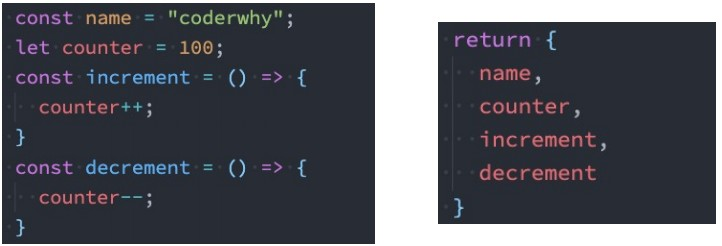
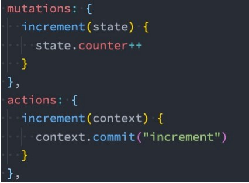

# Vue3 组件化开发（一）

## 认识组件的嵌套

- **前面我们是将所有的逻辑放到一个App.vue中：**

  - 在之前的案例中，我们只是`创建了一个组件App`； 

  - 如果我们一个应用程序`将所有的逻辑都放在一个组件`中，那么这个组件就会变成`非常的臃肿和难以维护`； 
  - 所以组件化的核心思想应该是`对组件进行拆分`，拆分成`一个个小的组件`； 

  - 再`将这些组件组合嵌套在一起`，最终形成`我们的应用程序`； 

## 组件的拆分

- 我们可以将对应的代码按照如下的方式进行拆分：


> VSCode 开发 .vue 文件的几个细节：
>
> 1. 最好在 vetur 的扩展设置中关闭自动导入
> 2. 导入文件时最好添加 .vue 后缀名，这样可点击直接跳转至目标文件，也可以在 template 中产生提示。

## Vue3 中样式溢出的bug

当我们像下方这样创建 App.vue ，为其设置一个h2的样式，并在其中使用 HelloWorld.vue ：

**App.vue**

```html
<template>
	<h2>App</h2>
	<hello-world></hello-world>
</template>

<script>
import HelloWorld from "./HelloWorld.vue";
export default {
	components: {
		HelloWorld,
	},
};
</script>

<style scoped>
h2 {
	color: red;
}
</style>
```

**HelloWorld.vue**

```html
<template>
  <h2>Hello World</h2>
</template>

<script>
export default {
  name: '',
}
</script>

<style scoped>

</style>
```

可以看到如下的效果：


按理说在 App.vue 中设置了 scoped 的样式不应该在 HelloWorld.vue 中生效。然而由于 vue-loader 会为所有的 根标签设置一个 `data-v-xxxxxxxx`，而此处由于 vue3 可以使用多个根标签，通过组件的属性会被赋予到 其内部的最外层标签，所以便出现了图中的情况。

要解决这一问题，可以在 HelloWorld.vue 最外层包裹一个 div。

## 组件的通信


- **上面的嵌套逻辑如下，它们存在如下关系：**

  - App组件是Header、Main、Footer组件的父组件； 

  - Main组件是Banner、ProductList组件的父组件； 

- 在开发过程中，我们会经常遇到需要**组件之间相互进行通信**： 

  - 比如`App可能使用了多个Header`，每个地方的`Header展示的内容不同`，那么我们就需要使用者`传递给Header一些数据`，让其进行展示；

  - 又比如我们在Main中一次性`请求了Banner数据和ProductList数据`，那么就需要`传递给它们`来进行展示；

  - 也可能是`子组件中发生了事件`，需要由父组件来完成某些操作，那就需要子组件向父组件传递事件； 

- 总之，在一个Vue项目中，组件之间的通信是非常重要的环节，所以接下来我们就具体学习一下组件之间是如何相互之间传递数据的；


## 父子组件之间通信的方式

- **父子组件之间如何进行通信呢？**

  - 父组件传递给子组件：通过props属性； 

  - 子组件传递给父组件：通过$emit触发事件；


## 父组件传递给子组件

- 在开发中很常见的就是**父子组件之间通信**，比如父组件有一些数据，需要子组件来进行展示：
  
- 这个时候我们可以通过props来完成组件之间的通信； 
  
- **什么是Props呢？**

  - Props是你可以在组件上注册一些自定义的attribute； 

  - 父组件给这些attribute赋值，子组件通过attribute的名称获取到对应的值； 

- **Props有两种常见的用法：**

  - 方式一：字符串数组，数组中的字符串就是attribute的名称；

  **App.vue**

  ```html
  <template>
  	<div>
  		<show-message title="哈哈哈" content="我是哈哈哈哈"></show-message>
  		<show-message title="呵呵呵" content="我是呵呵呵呵"></show-message>
  		<show-message :title="title" :content="content"></show-message>
  
          <show-message :title="message.title" :content="message.content"></show-message>
          <show-message v-bind="message"></show-message>
  	</div>
  </template>
  
  <script>
  import ShowMessage from "./ShowMessage.vue";
  export default {
  	components: {
  		ShowMessage,
  	},
  	data() {
  		return {
  			title: "嘻嘻嘻",
  			content: "我是嘻嘻嘻嘻",
  			message: {
                  title:"嘿嘿嘿",
                  content:"我是嘿嘿嘿嘿"
              },
  		};
  	},
  };
  </script>
  
  <style scoped>
  </style>
  ```

  **ShowMessage.vue**

  ```html
  <template>
  	<div>
          <h2>{{title}}</h2>
          <h2>{{content}}</h2>
      </div>
  </template>
  
  <script>
  export default {
  	props: ["title", "content"],
  };
  </script>
  
  <style scoped>
  </style>
  ```

  

  - 方式二：对象类型，对象类型我们可以在指定attribute名称的同时，指定它需要传递的类型、是否是必须的、默认值等等；

    - 数组用法中我们**只能说明传入的attribute的名称**，并**不能对其进行任何形式的限制**，接下来我们来看一下**对象的****写法**是如何让我们的props变得更加完善的。 

    - **当使用对象语法的时候，我们可以对传入的内容限制更多：**

      - 比如`指定传入的attribute的类型`； 

      - 比如`指定传入的attribute是否是必传的`； 

      - 比如`指定没有传入时，attribute的默认值`；

  ```html
  <script>
  export default {
  	props: {
  		title: String,
  		content: {
  			type: String,
  			required: true,     // 一般 required 和 default 二写一
  			default: "123",
  		},
  	},
  };
  </script>
  ```

  - **那么type的类型都可以是哪些呢？** 

    - String

    - Number

    - Boolean

    - Array

    - Object

    - Date

    - Function

    - Symbol

  - 对象类型的其他写法：
    - 注意对象或数组的默认值必须从一个工厂函数获取，否则可能会导致多个组件的值指向同一个对象

  

  - Prop的大小写命名

    - HTML 中的 attribute 名是大小写不敏感的，所以浏览器会把所有大写字符解释为小写字符； 
    - 这意味着当你使用 DOM 中的模板时，camelCase (驼峰命名法) 的 prop 名需要使用其等价的 kebab-case (短横线分隔命名) 命名；

    

## 非Prop 的Attribute

- **什么是非Prop的Attribute呢？**

  - 当我们`传递给一个组件某个属性`，但是`该属性并没有定义对应的props或者emits`时，就称之为 `非Prop的Attribute`； 

  - 常见的包括`class、style、id属性`等；

1. **Attribute继承**

- 当组件有单个根节点时，非Prop的Attribute将自动添加到根节点的Attribute中：

  


2. 如果我们**不希望组件的根元素继承attribute**，可以在子组件中设置 **inheritAttrs: false**： 

```html
<script>
export default {
    inheritAttrs:false,
};
</script>
```

- 禁用attribute继承的`常见情况`是`需要将attribute应用于根元素之外的其他元素`； 

- 我们可以通过 `$attrs来访问所有的 非props的attribute`，注意需要配合  **inheritAttrs: false** 使用；

  ```html
  <template>
  	<div>
  		<h2 :class="$attrs.class">{{ title }}</h2>
          
      	<!-- 绑定所有非Prop 的Attribute -->    
  		<h2 v-bind="$attrs">{{ content }}</h2>
  	</div>
  </template>
  ```

3. **多个根节点的attribute**

- `多个根节点的attribute如果没有显示的绑定`，那么会报警告，我们`必须手动的指定要绑定到哪一个属性`上：

  ```html
  <template>
  	<div>
          <mult-root-element id="aaa"></mult-root-element>
  	</div>
  </template>
  ```

  ```html
  <template>
    <h2 :id="$attrs.id">MultiRootElement</h2>
    <h2>MultiRootElement</h2>
    <h2>MultiRootElement</h2>
  </template>
  ```


##子组件传递给父组件

- **什么情况下子组件需要传递内容到父组件呢？**

  - 当`子组件有一些事件发生`的时候，比如在组件中发生了点击，父组件需要切换内容；

  - 子组件`有一些内容想要传递给父组件`的时候；

- **我们如何完成上面的操作呢？**

  - 首先，我们需要在子组件中定义好在某些情况下触发的事件名称； 

  - 其次，在父组件中以v-on的方式传入要监听的事件名称，并且绑定到对应的方法中；

  - 最后，在子组件中发生某个事件的时候，根据事件名称触发对应的事件；


- 自定义事件的时候，我们也可以传递一些参数给父组件： 


- 在vue3当中，我们可以对传递的参数进行验证：


- 代码示例

**App.vue**

```html
<template>
	<div>
		<h2>当前计数：{{ counter }}</h2>
		<counter-operation
			@add="addOne"
			@sub="subOne"
			@addN="addNNum"
		></counter-operation>
	</div>
</template>

<script>
import CounterOperation from "./CounterOperation";
export default {
	components: {
		CounterOperation,
	},
	data() {
		return {
			counter: 0,
		};
	},
	methods: {
		addOne() {
			this.counter++;
		},
		subOne() {
			this.counter--;
		},
		addNNum(num, name, age) {
			this.counter += num;
			console.log(name, age);
		},
	},
};
</script>

<style scoped>
</style>
```

**CounterOperation.vue**

```html
<template>
	<div>
		<button @click="increment">+1</button>
		<button @click="decrement">-1</button>

		<input type="text" v-model.number="num" />
		<button @click="incrementN">+n</button>
	</div>
</template>

<script>
export default {
	// emits: ["add", "sub", "addN"],
	// 对象写法的目的是为了进行参数的验证
	emits: {
		add: null, // null 表示不需要验证
		sub: null,
		addN: (num, name, age) => {
			console.log(num, name, age);
			if (num > 10) return true;
            return false;   // 返回 false 会报警告
		},
	},
	data() {
		return {
			num: 0,
		};
	},
	methods: {
		increment() {
			this.$emit("add");
		},
		decrement() {
			this.$emit("sub");
		},
		incrementN() {
			this.$emit("addN", this.num, "why", 18);
		},
	},
};
</script>

<style scoped>
</style>
```


## 组件间通信综合案例


`App.vue`

```html
<template>
	<div>
		<tab-control @titleClick="titleClick" :titles="titles"></tab-control>
		<h2>{{ contents[currentIndex] }}</h2>
	</div>
</template>

<script>
import TabControl from "@/05_商品页面的切换/TabControl";
export default {
	components: {
		TabControl,
	},
	data() {
		return {
			titles: ["衣服", "鞋子", "裤子"],
			contents: ["衣服页面", "鞋子页面", "裤子页面"],
			currentIndex: 0,
		};
	},
	methods: {
		titleClick(index) {
            this.currentIndex = index;
        },
	},
};
</script>

<style scoped>
</style>
```

`TabControl.vue`

```html
<template>
	<div class="tab-control">
		<div
			class="tab-control-item"
			:class="{ active: currentIndex === index }"
			v-for="(title, index) in titles"
			:key="title"
			@click="itemClick(index)"
		>
			<span>{{ title }}</span>
		</div>
	</div>
</template>

<script>
export default {
	emits: ["titleClick"],
	props: {
		titles: {
			type: Array,
			default() {
				return [];
			},
		},
	},
	data() {
		return {
			currentIndex: 0,
		};
	},
	methods: {
		itemClick(index) {
			this.currentIndex = index;
            this.$emit('titleClick',index)
		},
	},
};
</script>

<style scoped>
.tab-control {
	display: flex;
}

.tab-control-item {
	flex: 1;
	text-align: center;
}

.tab-control-item.active {
	color: red;
}

.tab-control-item.active span {
	border-bottom: 5px solid red;
	padding: 5px 10px;
}
</style>
```


# Vue3 组件化开发（二）

## 非父子组件的通信

- 在开发中，我们构建了组件树之后，除了**父子组件之间的通信**之外，还会有**非父子组件之间**的通信。

- **这里我们主要讲两种方式：**

  - Provide/Inject； 

  - Mitt全局事件总线；


## Provide和Inject


- Provide/Inject用于**非父子组件之间共享数据**（兄弟间不能用）： 

  - 比如有一些`深度嵌套的组件`，子组件想要获取父组件的部分内容； 

  - 在这种情况下，如果我们仍然`将props沿着组件链逐级传递`下去，就会非常的麻烦；

- 对于这种情况下，**我们可以使用 Provide 和 Inject ：** 

  - 无论层级结构有多深，父组件都可以作为其所有子组件的`依赖提供者`； 

  - 父组件有一个 `provide 选项`来提供数据；

  - 子组件有一个 `inject 选项`来开始使用这些数据；

- 实际上，你可以将依赖注入看作是“**long range props”**，除了：

  - 父组件不需要知道哪些子组件使用它 provide 的 property

  - 子组件不需要知道 inject 的 property 来自哪里


- 我们开发一个这样的结构：

  

  


思考一个问题：

- 如果Provide中提供的一些数据是**来自data**，那么我们可能会想要**通过this来获取**：

  ```html
  <script>
  export default {
  	provide: {
  		name: "why",
  		age: 18,
          length: this.names.length
  	},
  	data() {
  		return {
  			names: ["abc", "cba", "nba"],
  		};
  	},
  };
  </script>
  ```

- 那么此时的 this 指向哪里呢？ 会指向外层 的 script 标签的上下文，而此时其为undefined，所以这样写会报错。需要改为：

  ```javascript
  provide() {
      return {
          name: "why",
          age: 18,
          length: this.names.length,
      };
  },
  ```

  

## Provide 处理响应式数据

- 我们先来验证一个结果：**如果我们修改了this.names的内容，那么使用length的子组件会不会是响应式的？** 

- 我们会发现对应的子组件中是**没有反应的**： 
  
- 这是因为当我们修改了names之后，之前在provide中引入的 this.names.length 本身并不是响应式的；
  
- **那么怎么样可以让我们的数据变成响应式的呢？**

  - 非常的简单，我们可以使用响应式的一些API来完成这些功能，比如说computed函数； 

  - 当然，这个computed是vue3的新特性，在后面我会专门讲解，这里大家可以先直接使用一下；

- **注意：我们在使用length的时候需要获取其中的value**

  - 这是因为computed返回的是一个ref对象，需要取出其中的value来使用；

  

  ```html
  <script>
  import { computed } from "vue";
  export default {
  	provide() {
  		return {
  			name: "why",
  			age: 18,
  			length: computed(() => {
  				return this.names.length;
  			}),
  		};
  	},
  	},
  };
  </script>
  ```

  ```html
  <template>
  	<div>HomeContent:{{ name }}--{{ age }}--{{ length.value }}</div>
  </template>
  
  <script>
  export default {
  	inject: ["name", "age", "length"],
  };
  </script>
  ```


## 全局事件总线mitt库

- Vue3从实例中移除了 $on、$off 和 $once 方法，所以我们如果希望**继续使用全局事件总线，要通过第三方的库**： 

  - Vue3官方有推荐一些库，例如 mitt 或 tiny-emitter； 

  - 这里我们主要讲解一下mitt库的使用；

- 首先，我们需要先安装这个库：

  ```
  npm install mitt -d
  ```

- 之后，我们便可以封装一个工具类 utils/eventbus.js

```javascript
import mitt from 'mitt';

const emitter = mitt();

export default emitter;
```


- 在如下的结构中，我们期望在 About.vue 中触发事件，在 HomeComponent.vue中监听事件


- Mitt的事件取消

  - 在某些情况下我们可能希望取消掉之前注册的函数监听：

  


## 认识插槽Slot

- **在开发中，我们会经常封装一个个可复用的组件：**

  - 前面我们会`通过props传递`给组件一些数据，让组件来进行展示；

  - 但是为了让这个组件具备`更强的通用性`，我们`不能将组件中的内容限制为固定的div、span`等等这些元素；

  - 比如某种情况下我们使用组件，希望组件显示的是`一个按钮`，某种情况下我们使用组件希望显示的是`一张图片`； 

  - 我们应该让使用者可以决定`某一块区域到底存放什么内容和元素`； 

- **举个栗子：假如我们定制一个通用的导航组件 - NavBar**

  - 这个组件分成三块区域：左边-中间-右边，每块区域的内容是不固定；

  - 左边区域可能显示一个菜单图标，也可能显示一个返回按钮，可能什么都不显示；

  - 中间区域可能显示一个搜索框，也可能是一个列表，也可能是一个标题，等等；

  - 右边可能是一个文字，也可能是一个图标，也可能什么都不显示；

  


- **这个时候我们就可以来定义插槽slot：** 

  - 插槽的使用过程其实是`抽取共性、预留不同`； 

  - 我们会将共同的元素、内容依然在组件内进行封装；

  - 同时会将不同的元素使用slot作为占位，让外部决定到底显示什么样的元素；

  

- **如何使用slot呢？**

  - Vue中将 `<slot>` 元素作为承载分发内容的出口；

  - 在封装组件中，使用特殊的元素`<slot>` 就可以为封装组件开启一个插槽； 

  - 该插槽插入什么内容取决于父组件如何使用；


## 插槽的基本使用

- 我们一个组件MySlotCpn.vue：该组件中有一个插槽，我们可以在插槽中放入需要显示的内容；

```html
<template>
  <div>
      <h2>组件开始</h2>
      <slot></slot>
      <h2>组件结束</h2>
  </div>
</template>

<script>
export default {
}
</script>

<style scoped>

</style>
```

- 我们在App.vue中使用它们：我们可以插入普通的内容、html元素、组件元素，都可以是可以的；

```html
<template>
	<div>
        <my-slot-cpn>
            <button>我是按钮</button>
        </my-slot-cpn>
        <my-slot-cpn>
            123
        </my-slot-cpn>
        <my-slot-cpn>
            <my-button></my-button>
        </my-slot-cpn>
    </div>
</template>

<script>
import MySlotCpn from "@/08_插槽的基本使用/MySlotCpn";
import MyButton from '@/08_插槽的基本使用/MyButton'
export default {
	components: {
        MySlotCpn,
        MyButton
    },
};
</script>
```


## 具名插槽的使用

**多个插槽的效果：**

- 我们先测试一个知识点：如果一个组件中含有多个插槽，我们插入多个内容时是什么效果？
  - 我们会发现默认情况下每个插槽都会获取到我们插入的内容来显示；


- 事实上，我们希望达到的效果是插槽对应的显示，这个时候我们就可以使用 **具名插槽：**

  - 具名插槽顾名思义就是给插槽起一个名字，`<slot>` 元素有一个特殊的 attribute：name； 

  - 一个`不带 name 的slot`，会带有`隐含的名字 default`；


## 动态插槽名

- **什么是动态插槽名呢？**

  - 目前我们使用的插槽名称都是固定的；

  - 比如 v-slot:left、v-slot:center等等；

  - 我们可以通过 v-slot:[dynamicSlotName]方式动态绑定一个名称；


```html
<template>
	<div>
		<nav-bar :name="name">
			<template v-slot:[name]>
				<i>why内容</i>
			</template>
		</nav-bar>
	</div>
</template>
<script>
import NavBar from "@/09_具名插槽的使用/NavBar";
export default {
	components: {
		NavBar,
	},
	data() {
		return {
            name:"why"
        };
	},
};
</script>
```

```html
<template>
	<div class="nav-bar">
		<div class="addition">
			<slot :name="name"></slot>
		</div>
	</div>
</template>
<script>
export default {
    props:["name"]
};
</script>
```

## 具名插槽的缩写

- **具名插槽使用的时候缩写：**

  - 跟 v-on 和 v-bind 一样，v-slot 也有缩写； 

  - 即把参数之前的所有内容 (v-slot:) 替换为字符 #；

```html
<template>
	<div>
		<nav-bar :name="name">
			<template #left>
				<button>左边的按钮</button>
			</template>
			<template #center>
				<h2>我是标题</h2>
			</template>
			<template #right>
				<i>右边的元素</i>
			</template>
			<template #[name]>
				<i>why内容</i>
			</template>
		</nav-bar>
	</div>
</template>
```


## 渲染作用域

- **在Vue中有渲染作用域的概念：**

  - 父级模板里的所有内容都是在父级作用域中编译的；

  - 子模板里的所有内容都是在子作用域中编译的；

- 如何理解这句话呢？我们来看一个案例：

  - 在我们的案例中ChildCpn自然是可以让问自己作用域中的title内容的；

  - 但是在App中，是访问不了ChildCpn中的内容的，因为它们是跨作用域的访问；


## 认识作用域插槽

- 有时候我们希望插槽**可以访问到子组件中的内容**是非常重要的：

  - 当一个组件被用来渲染一个数组元素时，我们使用插槽，并且希望插槽中没有显示每项的内容； 

  - 这时Vue给我们提供了作用域插槽； 


- 使用作用域插槽，使得可以在父作用域中使用到子作用域的数据，并且可以在父组件中定义子组件的展示方式。

**App.vue**

```html
<template>
	<div>
        <show-names :names="name">
            <!-- v-slot后面跟着的名字是自定义的 -->
            <template v-slot="slotProps">
                <button>{{slotProps.item}}--{{slotProps.index}}</button>
            </template>
        </show-names>


        <show-names :names="name">
            <template v-slot="slotProps">
                <strong>{{slotProps.item}}--{{slotProps.index}}</strong>
            </template>
        </show-names>
	</div>
</template>

<script>
import ShowNames from '@/10_作用域插槽使用/ShowNames'
export default {
	components: {
        ShowNames
	},
	data() {
		return {
			name: ["why", "kobe", "james", "curry"],
		};
	},
};
</script>

<style scoped>
</style>

```

**ShowNames.vue**

```html
<template>
	<div>
        <template v-for="(item,index) in names" :key="item">
           <slot :item="item" :index="index"></slot>
        </template>
    </div>
</template>

<script>
export default {
	name: "",
	props: {
		names: {
			type: Array,
			default: () => [],
		},
	},
};
</script>

<style scoped>
</style>
```


- 如果我们的插槽是默认插槽default，那么在使用的时候 v-slot:default="slotProps"可以简写为v-slot="slotProps"： 


- 并且如果我们的插槽只有默认插槽时，组件的标签可以被当做插槽的模板来使用，这样，我们就可以将 v-slot 直接用在组件上：


- 但是，如果我们有默认插槽和具名插槽， 则像这样写就会报错：


​		只要出现多个插槽，请始终为所有的插槽使用完整的基于 `<template>` 的语法：


# Vue3 组件化开发（三）

## 切换组件案例

- **比如我们现在想要实现了一个功能：**

  - 点击一个tab-bar，切换不同的组件显示；

  

- 这个案例我们可以通过两种不同的实现思路来实现：

  - 方式一：通过v-if来判断，显示不同的组件；

  ```html
  <template>
  	<div>
  		<button
  			v-for="item in tabs"
  			:key="item"
  			@click="itemClick(item)"
  			:class="{ active: currentTab === item }"
  		>
  			{{ item }}
  		</button>
  
  		<template v-if="currentTab === 'home'"> 
              <home></home>
          </template>
  		<template v-else-if="currentTab === 'about'"> 
              <about></about>
          </template>
  		<template v-else> 
              <category></category>
          </template>
  	</div>
  </template>
  
  <script>
  import Home from "@/11_动态组件的使用/pages/Home";
  import About from "@/11_动态组件的使用/pages/About";
  import Category from "@/11_动态组件的使用/pages/Category";
  export default {
  	components: {
          Home,
          About,
          Category
      },
  	data() {
  		return {
  			tabs: ["home", "about", "category"],
  			currentTab: "home",
  		};
  	},
  	methods: {
  		itemClick(item) {
  			this.currentTab = item;
  		},
  	},
  };
  </script>
  
  <style scoped>
  .active {
  	color: red;
  }
  </style>
  ```

  - 方式二：动态组件的方式；

    - 动态组件是使用`component 组件`（特殊组件），通过一个`特殊的attribute is` 来实现：

    - **这个currentTab的值需要是什么内容呢？**

      - 可以是通过`component函数`（app.component）注册的组件；

      - 在一个`组件对象的components对象中注册的组件`；

    ```html
    <!-- 2.动态组件 -->
    <component :is="currentTab">
    </component>
    ```

    

    - **如果是动态组件我们可以给它们传值和监听事件吗？**
      - 也是一样的；
      - 只是我们需要将属性和监听事件放到component上来使用；

    ```html
    <component :is="currentTab" name="xxc" :age="18" @pageClick="pageClick">
    </component>
    ```


## 认识 keep-alive

- **我们先对之前的案例中About组件进行改造：**

  - 在其中增加了一个按钮，点击可以递增的功能；

    

- 比如我们将counter点到10，那么在切换到home再切换回来about时，**状态是否可以保持呢？**

  - 答案是否定的；

  - 这是因为默认情况下，我们在`切换组件后，about组件会被销毁掉`，再次回来时`会重新创建组件`； 

- 但是，在开发中某些情况我们希望继续保持组件的状态，而不是销毁掉，这个时候我们就可以**使用一个内置组件：** **keep-alive**。

```html
<keep-alive>
    <component :is="currentTab" name="xxc" :age="18" @pageClick="pageClick">
    </component>
</keep-alive>
```


## keep-alive 属性

- keep-alive 有一些属性

  - include - string | RegExp | Array。只有名称匹配的组件（根据主键的 name属性进行匹配）会被缓存；

  - exclude - string | RegExp | Array。任何名称匹配的组件都不会被缓存；

  - max - number | string。最多可以缓存多少组件实例，一旦达到这个数字，那么缓存组件中最近没有被访问的实例会被销毁；


- **include 和 exclude prop 允许组件有条件地缓存：**

  - 二者都可以用逗号分隔字符串、正则表达式或一个数组来表示；

  - 匹配首先检查组件自身的 name 选项；


## Webpack的代码分包

- **默认的打包过程：**

  - 默认情况下，在构建整个组件树的过程中，因为组件和组件之间是通过模块化直接依赖的，那么webpack在打包时就会将组件模块打包到一起（比如一个app.js文件中）；

  - 这个时候随着项目的不断庞大，app.js文件的内容过大，会造成首屏的渲染速度变慢； 

  

- **打包时，代码的分包：**

  - 所以，对于一些不需要立即使用的组件，我们可以单独对它们进行拆分，拆分成一些小的代码块chunk.js； （及下方的 0.js）

  - 这些chunk.js会在需要时从服务器加载下来，并且运行代码，显示对应的内容；

  

- **那么webpack中如何可以对代码进行分包呢？**

  - 我们需要在加载模块时使用 import函数 的形式进行导入，webpack 会将这种方式导入的包进行分包打包：

  ```javascript
  import("./12_异步组件的使用/utils/math").then((res) => { 
      console.log(res.sum(20,30))
  })
  ```

  - 打包结果：

  


## Vue中实现异步组件

- 如果我们的项目过大了，对于**某些组件**我们希望**通过异步的方式来进行加载**（目的是可以对其进行分包处理），那么Vue中给我们提供了一个函数：**defineAsyncComponent**。 

- **defineAsyncComponent接受两种类型的参数：**

  - 类型一：工厂函数，该工厂函数需要返回一个Promise对象；

  - 类型二：接受一个对象类型，对异步函数进行配置； 

-  **类型一工厂函数的写法：**

  ```javascript
  import { defineAsyncComponent } from "vue";
  const AsyncCategory = defineAsyncComponent(() => import("./AsyncCategory.vue"));
  
  export default {
  	components: {
  		AsyncCategory,
  	},
  };
  ```

- 类型二对象写法：

  ```javascript
  import { defineAsyncComponent } from "vue";
  import Loading from "./Loading.vue";
  const AsyncCategory = defineAsyncComponent({
  	loader: () => import("./AsyncCategory.vue"),
  	loadingComponent: Loading, // 加载过程中显示的组件
  	// errorComponent       // 加载失败时显示的组件
  	delay: 2000, // 表示在显示loadingComponent 组件之前，等待多长时间
      /**
       * err:错误信息
       * retry:函数，调用 retry 尝试重新加载
       * fail:函数，结束加载
       * attempts:记录尝试的次数
      */
  	onError: function (err,retry,fail,attempts) {    // 出错回调函数
  
      },
  });
  export default {
  	components: {
  		AsyncCategory,
  	},
  };
  ```
```
  


## 异步组件和 Suspense

- 注意：**目前（2021-06-08）Suspense显示的是一个实验性的特性，API随时可能会修改。** 

- **Suspense是一个内置的全局组件，该组件有两个插槽：**

  - default：如果default可以显示，那么显示default的内容； 

  - fallback：如果default无法显示，那么会显示fallback插槽的内容；

​```html
<template>
	<div>
		<suspense>
			<template #default>
				<async-category></async-category>
			</template>
			<template #fallback>
				<loading></loading>
			</template>
		</suspense>
	</div>
</template>
<script>
import Loading from "./Loading.vue";
const AsyncCategory = defineAsyncComponent(() => import("./AsyncCategory.vue"));
export default {
	components: {
		AsyncCategory,
		Loading
	},
};
</script>
```

> 配合异步组件使用，若异步组件还未加载，则使用 fallback 中的组件，等加载完后使用异步组件。


## $refs 的使用

- 某些情况下，我们在组件中想要**直接获取到元素对象或者子组件实例**： 

  - 在Vue开发中我们是`不推荐进行DOM操作`的；

  - 这个时候，我们可以`给元素或者组件绑定一个ref的attribute属性`； 

- **组件实例有一个$refs属性：**
  - 它一个对象Object，持有`注册过 ref attribute 的所有 DOM 元素和组件实例`。


## $parent 和 $root

- **我们可以通过$parent来访问父元素。**

-  HelloWorld.vue的实现：

  - 这里我们也可以通过$root来实现，因为App是我们的根组件；

  

- 注意：在Vue3中已经**移除了$children的属性**，所以不可以使用了。


`补充：`
		还有一个 $el 属性，使用它可以获取到组件的根元素：

​		如 this.$refs.navBar.$el ，便可以获取到：


## 认识生命周期

- **什么是生命周期呢？**
  - 每个组件都可能会经历从`创建、挂载、更新、卸载`等一系列的过程； 

  - 在这个过程中的`某一个阶段`，用于可能会想要`添加一些属于自己的代码逻辑`（比如组件创建完后就请求一些服务器数据）；

  - 但是我们`如何可以知道目前组件正在哪一个过程`呢？Vue给我们提供了`组件的生命周期函数`； 

- **生命周期函数：**

  - 生命周期函数是一些钩子函数，在某个时间会被Vue源码内部进行回调； 

  - 通过对生命周期函数的回调，我们可以知道目前组件正在经历什么阶段； 

  - 那么我们就可以在该生命周期中编写属于自己的逻辑代码了；


## 缓存组件的生命周期

- 对于缓存的组件来说，再次进入时，我们是**不会执行created或者mounted等生命周期函数**的：

  - 但是有时候我们确实希望监听到何时重新进入到了组件，何时离开了组件；

  - 这个时候我们可以使用activated 和 deactivated 这两个生命周期钩子函数来监听；

```javascript
activated() {
    console.log("about activated")
},
deactivated() {
    console.log("about deactivated")
},
```


## 组件的 v-model

- 前面我们在input中可以使用v-model来完成双向绑定：

  - 这个时候往往会非常方便，因为v-model默认帮助我们完成了两件事；

  - v-bind:value的数据绑定和@input的事件监听； 

- 如果我们现在**封装了一个组件**，其他地方在使用这个组件时，是否也可以**使用v-model来同时完成这两个功能**呢？
  
- 也是可以的，vue也支持在组件上使用v-model； 
  
- **当我们在组件上使用的时候，等价于如下的操作：**

  ```html
  <template>
  	<div>
  		<input type="text" v-model="message" />
  		<!-- 组件上使用v-model -->
  		<y-q-input v-model="message"></y-q-input>
          <!-- 等价于： -->
  		<y-q-input
  			:modelValue="message"
  			@update:model-value="message = $event"
  		></y-q-input>
  	</div>
  </template>
  <script>
  import YQInput from "@/15_组件的v-model/YQInput";
  export default {
  	components: {
  		YQInput,
  	},
  	data() {
  		return {
  			message: "Hello World",
  		};
  	},
  };
  </script>
  ```

  - 我们会发现和input元素不同的只是属性的名称和事件触发的名称而已；

- **那么，为了我们的MyInput组件可以正常的工作，这个组件内的 `<input>` 必须：**

  - 将其 value attribute 绑定到一个名叫 modelValue 的 prop 上；

  - 在其 input 事件被触发时，将新的值通过自定义的 update:modelValue 事件抛出；

- YQInput 中代码实现如下：

```html
<template>
	<div>
		<input type="text" :value="modelValue" @input="btnClick" />
	</div>
</template>
<script>
export default {
	props: {
		modelValue: String | Number,
	},
	emits: ["update:modelValue"],
	methods: {
		btnClick(event) {
			this.$emit("update:modelValue", event.target.value);
		},
	},
};
</script>
```


- computed 实现

  - 我们依然希望在组件内部按照双向绑定的做法去完成，应该如何操作呢？**我们可以使用计算属性的setter和getter**来完成。

  ```html
  <template>
  	<div>
  		<input v-model="value" />
  	</div>
  </template>
  <script>
  export default {
  	props: {
  		modelValue: String | Number,
  	},
  	emits: ["update:modelValue"],
  	computed: {
  		value: {
  			set(value) {
  				this.$emit("update:modelValue", value);
  			},
  			get() {
  				return this.modelValue;
  			},
  		},
  	},
  };
  </script>
  ```

- 注意：不可以像下方这样使用 props 进行数据绑定，因为其会修改 props ，这个很不推荐的

```html
<template>
	<div>
		<input type="text" v-model="modelValue">
	</div>
</template>
<script>
export default {
	props: {
		modelValue: String | Number,
	},
};
</script>
```


## 组件的v-model 绑定多个属性

- 我们现在通过v-model是直接绑定了一个属性，如果我们**希望绑定多个属性**呢？ 

  - 也就是我们希望在一个组件上使用多个v-model是否可以实现呢？

  - 我们知道，默认情况下的v-model其实是绑定了 modelValue 属性和 @update:modelValue的事件；

  - 如果我们希望绑定更多，可以给v-model传入一个参数，那么这个参数的名称就是我们绑定属性的名称； 

- 注意：这里我是绑定了两个属性的

  ```html
  <y-q-input2 v-model="message" v-model:title="title"></y-q-input2>
  ```

- **v-model:title相当于做了两件事：**

  - 绑定了title属性； 

  - 监听了 @update:title的事件；
  - YQInput2 代码实现：

  ```html
  <template>
  	<div>
  		<input v-model="value" />
  		<input v-model="cTitle" />
  	</div>
  </template>
  
  <script>
  export default {
  	props: {
  		modelValue: String | Number,
  		title: String,
  	},
  	emits: ["update:modelValue", "update:title"],
  	computed: {
  		value: {
  			set(value) {
  				this.$emit("update:modelValue", value);
  			},
  			get() {
  				return this.modelValue;
  			},
  		},
  		cTitle: {
  			set(title) {
  				this.$emit("update:title", title);
  			},
  			get() {
  				return this.title
  			},
  		},
  	},
  };
  </script>
  ```


## Vue3 过渡&动画实现

- 在开发中，我们想要给一个组件的**显示和消失添加某种过渡动画**，可以很好的**增加用户体验**： 

  - React框架本身并没有提供任何动画相关的API，所以在React中使用过渡动画我们需要使用一个第三方库react-transition-group； 

  - Vue中为我们提供一些内置组件和对应的API来完成动画，利用它们我们可以方便的实现过渡动画效果； 

- **我们来看一个案例：**

  - Hello World的显示和隐藏；

  - 通过下面的代码实现，是不会有任何动画效果的；

    ```html
    <template>
    	<div>
    		<button @click="isShow = !isShow">显示/隐藏</button>
    		<h2 v-if="isShow">Hello World</h2>
    	</div>
    </template>
    
    <script>
    export default {
    	data() {
    		return {
    			isShow: true,
    		};
    	},
    };
    </script>
    ```

    

    

- 没有动画的情况下，**整个内容的显示和隐藏会非常的生硬**： 
  
  - 如果我们希望给`单元素或者组件实现过渡动画`，可以`使用 transition 内置组件`来完成动画；


- Vue **提供了 transition 的封装组件**，在下列情形中，可以给任何元素和组件添加进入/离开过渡：

  - 条件渲染 (使用 v-if)条件展示 (使用 v-show)

  - 动态组件
  - 组件根节点

```html
<template>
	<div>
		<button @click="isShow = !isShow">显示/隐藏</button>
		<transition name="why">
			<h2 v-if="isShow">Hello World</h2>
		</transition>
	</div>
</template>

<script>
export default {
	data() {
		return {
			isShow: true,
		};
	},
};
</script>

<style scoped>
.why-enter-from,
.why-leave-to {
	opacity: 0;
}

/* 下面的class 可以省略，因为浏览器默认最终显示效果就为 opacity:1 */
/* .why-enter-to,
.why-leave-from {
	opacity: 1;
} */

.why-enter-active,
.why-leave-active {
    transition:opacity 2s ease;
}
</style>
```

## Transition 组件的原理

- **我们会发现，Vue自动给h2元素添加了动画，这是什么原因呢？**

-  **当插入或删除包含在 transition 组件中的元素时，Vue 将会做以下处理：**

  1. 自动嗅探目标元素是否应用了CSS过渡或者动画，如果有，那么在恰当的时机添加/删除 CSS类名； 

  2. 如果 transition 组件提供了JavaScript钩子函数，这些钩子函数将在恰当的时机被调用；

  3. 如果没有找到JavaScript钩子并且也没有检测到CSS过渡/动画，DOM插入、删除操作将会立即执行；


- **我们会发现上面提到了很多个class，事实上Vue就是帮助我们在这些class之间来回切换完成的动画：**
- v-enter-from：定义进入过渡的开始状态。在元素被插入之前生效，在元素被插入之后的下一帧移除。
- v-enter-active：定义进入过渡生效时的状态。在整个进入过渡的阶段中应用，在元素被插入之前生效，在过渡/动画完成之后移除。这个类可以被用来定义进入过渡的过程时间，延迟和曲线函数。
- v-enter-to：定义进入过渡的结束状态。在元素被插入之后下一帧生效 (与此同时 v-enter-from 被移除)，在过渡/动画完成之后移除。
- v-leave-from：定义离开过渡的开始状态。在离开过渡被触发时立刻生效，下一帧被移除。
- v-leave-active：定义离开过渡生效时的状态。在整个离开过渡的阶段中应用，在离开过渡被触发时立刻生效，在过渡/动画完成之后移除。这个类可以被用来定义离开过渡的过程时间，延迟和曲线函数。
- v-leave-to：离开过渡的结束状态。在离开过渡被触发之后下一帧生效 (与此同时 v-leave-from 被删除)，在过渡/动画完成之后移除。


- **class的name命名规则如下：**

  - 如果我们使用的是一个没有name的transition，那么所有的class是以 v- 作为默认前缀；

  - 如果我们添加了一个name属性，比如 `<transtion name="why">`，那么所有的class会以 why- 开头；


## 执行 animation 的帧动画

前面我们是**通过transition来实现的动画效果**，另外我们也**可以通过animation来实现**。

```html
<template>
	<div class="app">
		<div><button @click="isShow = !isShow">显示/隐藏</button></div>
		<transition name="why">
			<h2 class="title" v-if="isShow">Hello World</h2>
		</transition>
	</div>
</template>

<script>
export default {
	data() {
		return {
			isShow: true,
		};
	},
};
</script>

<style scoped>
.app{
    width: 200px;
    margin: 0 auto;
}
.title{
    /* 若h2为块级元素，动画会有一些差强人意 */
    display: inline-block;
}
.why-enter-active {
	animation: bounce 1s ease;
}
.why-leave-active {
    animation: bounce 1s ease reverse;
}

@keyframes bounce {
	0% {
		transform: scale(0);
	}
	50% {
		transform: scale(1.2);
	}
	100% {
		transform: scale(1);
	}
}
</style>

```


## 同时设置过渡和动画

- Vue为了**知道过渡的完成**，内部是**在监听 transitionend 或 animationend**，到底使用哪一个取决于元素应用的CSS规则： 
  - 如果我们只是使用了其中的一个，那么Vue能自动识别类型并设置监听； 

- **但是如果我们同时使用了过渡和动画呢？**

  - 并且在这个情况下可能某一个动画执行结束时，另外一个动画还没有结束； 

  - 在这种情况下，我们可以设置 type 属性为 animation 或者 transition 来明确的告知Vue监听的类型；

```html
<template>
	<div class="app">
		<div><button @click="isShow = !isShow">显示/隐藏</button></div>
		<transition name="why" type="animation">
			<h2 class="title" v-if="isShow">Hello World</h2>
		</transition>
	</div>
</template>

<script>
export default {
	data() {
		return {
			isShow: true,
		};
	},
};
</script>

<style scoped>
.app {
	width: 200px;
	margin: 0 auto;
}
.title {
	display: inline-block;
}

.why-enter-from,
.why-leave-to {
	opacity: 0;
}
.why-enter-active,
.why-leave-active{
    transition:opacity 2s ease;
}

.why-enter-active {
	animation: bounce 1s ease;
}
.why-leave-active {
	animation: bounce 1s ease reverse;
}

@keyframes bounce {
	0% {
		transform: scale(0);
	}
	50% {
		transform: scale(1.2);
	}
	100% {
		transform: scale(1);
	}
}
</style>
```

## 显示的指定动画时间

- 我们也可以显示的来**指定过渡的时间**，通过 **duration 属性**。 

- **duration可以设置两种类型的值：**

  - number类型：同时设置进入和离开的过渡时间；

  - object类型：分别设置进入和离开的过渡时间；


## 过渡的模式mode

- **我们来看当前的动画在两个元素之间切换的时候存在的问题：** 

- 我们会发现 Hello World 和 你好啊，XXC是**同时存在**的：

  

  - 这是因为默认情况下进入和离开动画是同时发生的；

  - 如果确实我们希望达到这个的效果，那么是没有问题； 

- 但是如果我们**不希望同时执行进入和离开动画**，那么我们需要设置transition的**过渡模式**： 

  - in-out: 新元素先进行过渡，完成之后当前元素过渡离开；

  - out-in: 当前元素先进行过渡，完成之后新元素过渡进入；

```html
<template>
	<div class="app">
		<div><button @click="isShow = !isShow">显示/隐藏</button></div>
		<transition name="why" mode="out-in">
			<h2 class="title" v-if="isShow">Hello World</h2>
			<h2 class="title" v-else>你好啊，XXC</h2>
		</transition>
	</div>
</template>
```


## 动态组件的切换

- 上面的示例同样适用于我们的**动态组件**：

```html
<template>
	<div class="app">
		<div><button @click="isShow = !isShow">显示/隐藏</button></div>
		<transition name="why" mode="out-in">
			<component :is="isShow ? 'home' : 'about'"></component>
		</transition>
	</div>
</template>

<script>
import Home from "@/01_动画的基本使用/pages/Home";
import About from "@/01_动画的基本使用/pages/About";
export default {
    components:{
        Home,
        About
    },
	data() {
		return {
			isShow: true,
		};
	},
};
</script>

<style scoped>
.app {
	width: 200px;
	margin: 0 auto;
}
.title {
	display: inline-block;
}

.why-enter-from,
.why-leave-to {
	opacity: 0;
}
.why-enter-active,
.why-leave-active {
	transition: opacity 1s ease;
}

.why-enter-active {
	animation: bounce 1s ease;
}
.why-leave-active {
	animation: bounce 1s ease reverse;
}

@keyframes bounce {
	0% {
		transform: scale(0);
	}
	50% {
		transform: scale(1.2);
	}
	100% {
		transform: scale(1);
	}
}
</style>
```

## appear 初次渲染

- 默认情况下，**首次渲染的时候是没有动画的**，如果我们**希望给他添加上去动画，那么就可以增加另外一个属性** **appear**：


## 认识animate.css

- 如果我们手动一个个来编写这些动画，那么效率是比较低的，所以在开发中我们可能会引用一些**第三方库的动画库，** **比如animate.css**。 

- **什么是animate.css呢？**

  - **Animate.css** is a library of ready-to-use, cross-browser animations for use in your web projects. Great for emphasis, home pages, sliders, and attention-guiding hints.

  - **Animate.css**是一个已经准备好的、跨平台的动画库为我们的web项目，对于强调、主页、滑动、注意力引导非常有用；

- **如何使用Animate库呢？**

  - 第一步：需要安装animate.css库；

    ```
    npm install animate.css --save
    ```

  - 第二步：导入animate.css库的样式（一般在入口文件导入）； 

    ```javascript
    import "animate.css"
    ```

    

  - 第三步：使用animation动画或者animate提供的类；

    - 用法一：直接使用animate库中定义的 keyframes 动画；

    ```html
    <template>
    	<div class="app">
    		<div><button @click="isShow = !isShow">显示/隐藏</button></div>
    		<transition name="why" :appear="true">
    			<h2 class="title" v-if="isShow">Hello World</h2>
    		</transition>
    	</div>
    </template>
    
    <script>
    export default {
    	data() {
    		return {
    			isShow: true,
    		};
    	},
    };
    </script>
    
    <style scoped>
    .title {
    	display: inline-block;
    }
    .why-enter-active {
    	animation: rotateIn 0.5s ease;
    }
    .why-leave-active {
    	animation: rotateIn 0.5s ease reverse;
    }
    </style>
    ```

    - 用法二：直接使用animate库提供给我们的类；

      - 首先来了解一下 `自定义过渡class`

        - **我们可以通过以下 attribute 来自定义过渡类名：**

          - enter-from-class

          - enter-active-class

          - enter-to-class

          - leave-from-class

          - leave-active-class

          - leave-to-class

        - 他们的优先级高于普通的类名，这对于 **Vue 的过渡系统和其他第三方 CSS 动画库**，如 Animate.css. 结合使用十分有用。

    ```html
    <template>
    	<div class="app">
    		<div><button @click="isShow = !isShow">显示/隐藏</button></div>
    		<!-- 注意：需要先写animate__animated，之后再写相应的动画类名 -->
    		<transition enter-active-class="animate__animated animate__rotateIn" leave-active-class="animate__animated animate__rotateOut">
    			<h2 class="title" v-if="isShow">Hello World</h2>
    		</transition>
    	</div>
    </template>
    ```

## 认识 gsap 库

- 某些情况下我们希望通过**JavaScript来实现一些动画的效果**，这个时候我们可以选择使用**gsap库**来完成。

- **什么是gsap呢？**

  - GSAP是The GreenSock Animation Platform（GreenSock动画平台）的缩写； 

  - 它可以通过JavaScript为CSS属性、SVG、Canvas等设置动画，并且是浏览器兼容的；

- **这个库应该如何使用呢？**

  - 第一步：需要安装gsap库；

  - 第二步：导入gsap库； 

  - 第三步：使用对应的api即可；

- **我们可以先安装一下gsap库：**

```
npm install gsap
```


## JavaScript 钩子

- 在使用动画之前，我们先来看一下**transition组件给我们提供的JavaScript钩子**，这些钩子可以帮助我们监听动画执行到什么阶段了。


- 当我们使用JavaScript来执行过渡动画时，需要**进行 done 回调**，否则它们将会被同步调用，过渡会立即完成。 

- 添加 **:css="false"**，也会让 Vue 会**跳过 CSS 的检测**，除了性能略高之外，这可以避免过渡过程中 CSS 规则的影响。


## gsap库的使用

```html
<template>
	<div class="app">
		<div><button @click="isShow = !isShow">显示/隐藏</button></div>
		<transition
			@enter="enter"
			@leave="leave"
			:css="false"
		>
			<h2 class="title" v-if="isShow">Hello World</h2>
		</transition>
	</div>
</template>

<script>
import gsap from "gsap";
export default {
	data() {
		return {
			isShow: true,
		};
	},
	methods: {
		enter(el, done) {
			console.log("enter");
			gsap.from(el, {
				scale: 0,
				x: 200,
				onComplete: done,
			});
		},
		leave(el, done) {
			gsap.to(el, {
				scale: 0,
				x: 200,
				onComplete: done,
			});
		},
	},
};
</script>

<style scoped>
.title {
	display: inline-block;
}
</style>
```


## gsap实现数字变化

```html
<template>
	<div class="app">
		<input type="number" step="100" v-model="counter" />
		<!-- <h2>当前计数：{{ showCounter }}</h2> -->
		<h2>当前计数：{{ showNumber.toFixed(0) }}</h2>
	</div>
</template>

<script>
import gsap from "gsap";
export default {
	data() {
		return {
			counter: 0,
			showNumber: 0,
		};
	},
	// computed: {
	// 	showCounter() {
	// 		return this.showNumber.toFixed(0);
	// 	},
	// },
	watch: {
		counter(newValue) {
            // 直接将 el 变为 this，便可使用其内部的 data 数据
			gsap.to(this, {
				duration: 1,
				showNumber: newValue,
			});
		},
	},
};
</script>

<style scoped>
</style>
```


## 认识列表的过渡

- 目前为止，过渡动画我们只要是**针对单个元素或者组件**的：

  - 要么是`单个节点`； 

  - 要么是`同一时间渲染多个节点中的一个`； 

- 那么如果希望渲染的是**一个列表**，并且**该列表中添加删除数据也希望有动画执行**呢？
  - 这个时候我们要使用 `<transition-group>` 组件来完成；

- **使用`<transition-group>` 有如下的特点：**

  - 默认情况下，它`不会渲染一个元素的包裹器`，但是你可以`指定一个元素并以 tag attribute 进行渲染`； 

  - `过渡模式（mode）不可用`，因为我们不再相互切换特有的元素；

  - 内部元素总是需`要提供唯一的 key attribute 值`； 

  - `CSS 过渡的类将会应用在内部的元素`中，而`不是这个组/容器本身`；


## 列表过渡的基本使用

- **我们来做一个案例：**

  - 案例是一列数字，可以继续添加或者删除数字； 

    

  - 在添加和删除数字的过程中，对添加的或者移除的数字添加动画；

```html
<template>
	<div>
		<button @click="addNum">添加数字</button>
		<button @click="removeNum">删除数字</button>

		<!-- 设置tag 后，会根据tag的属性创建一个标签代替原来 transition-group 的位置 -->
		<transition-group tag="p" name="why">
			<span v-for="item in numbers" :key="item" class="item">
				{{ item }}
			</span>
		</transition-group>
	</div>
</template>

<script>
export default {
	data() {
		return {
			numbers: [0, 1, 2, 3, 4, 5, 6, 7, 8, 9],
			numCounter: 10,
		};
	},
	methods: {
		addNum() {
			// this.numbers.push(this.numCounter++);
			this.numbers.splice(this.randomIndex(), 0, this.numCounter++);
		},
		removeNum() {
			this.numbers.splice(this.randomIndex(), 1);
		},
		randomIndex() {
			return Math.floor(Math.random() * this.numbers.length);
		},
	},
};
</script>

<style scoped>
.item {
	margin-right: 10px;
    /* 行内元素对于 transform 有一些限制，所以将其变为行内块元素 */
    display: inline-block;
}

.why-enter-from,
.why-leave-to {
	opacity: 0;
	transform: translateY(30px);
}

.why-enter-active,
.why-leave-active {
    transition:all 1s ease;
}
</style>
```

- 在上面的案例中**虽然新增的或者删除的节点是有动画**的，但是**对于那些其他需要移动的节点是没有动画**的：

  - 我们可以通过使用一个新增的 v-move 的class来完成动画；

  - 它会在元素改变位置的过程中应用；

  - 像之前的名字一样，我们可以通过name来自定义前缀；
  - 不过这虽然会让添加数字时的移动效果生效，但删除时由于原本的数字仍然占据着位置，会导致动画失效。所以我们仍然需要为其的 leave-active 添加 position:absolute，来让其原先占据的位置释放。

```html
<style scoped>
.why-leave-active {
	position: absolute;
}

.why-move {
	transition: transform 1s ease;
}
</style>
```


## 列表的交替过渡案例

- **我们来通过gsap的延迟delay属性，做一个交替消失的动画：**


```html
<template>
	<div>
		<input v-model="keyword" />
		<transition-group
			tag="ul"
			name="why"
			:css="false"
			@before-enter="beforeEnter"
			@enter="enter"
			@leave="leave"
		>
			<!-- 所有以data-开头的属性最终会放到 dataset 中 -->
			<li v-for="(item, index) in showNames" :key="item" :data-index="index">
				{{ item }}
			</li>
		</transition-group>
	</div>
</template>

<script>
import gsap from "gsap";
export default {
	data() {
		return {
			names: ["abc", "cba", "nba", "why", "lilei", "hmm", "kobe", "james"],
			keyword: "",
		};
	},
	computed: {
		showNames() {
			return this.names.filter((item) => {
				return item.indexOf(this.keyword) !== -1;
			});
		},
	},
	methods: {
		// beforeEnter 只有一个参数:变化元素el，可以通过设置其的style属性设置元素开始状态
		beforeEnter(el) {
			el.style.opacity = 0;
			el.style.height = 0;
		},
		enter(el, done) {
			gsap.to(el, {
				opacity: 1,
				height: "1.5em",
				delay: el.dataset.index * 0.1,
				onComplete: done,
			});
		},
		leave(el, done) {
			gsap.to(el, {
				opacity: 0,
				height: "0",
                delay: el.dataset.index * 0.1,
				onComplete: done,
			});
		},
	},
};
</script>
```


# Vue3 Composition API（一）

## 认识 Mixin

- 目前我们是使用组件化的方式在开发整个Vue的应用程序，但是**组件和组件之间有时候会存在相同的代码逻辑**，我们希望对**相同的代码逻辑进行抽取**。 

- 在Vue2和Vue3中都支持的一种方式就是**使用Mixin来完成**： 

  - Mixin提供了一种非常灵活的方式，来分发Vue组件中的可复用功能； 

  - 一个Mixin对象可以包含任何组件选项； 

  - 当组件使用Mixin对象时，所有Mixin对象的选项将被 混合 进入该组件本身的选项中；

 ## Mixin 的基本使用


## Mixin 的合并规则

- **如果Mixin对象中的选项和组件对象中的选项发生了冲突，那么Vue会如何操作呢？**
  - 这里分成不同的情况来进行处理；

- **情况一：如果是data函数的返回值对象**

  - 返回值对象默认情况下会进行合并； 

  - 如果data返回值对象的属性发生了冲突，那么`会保留组件自身的数据`； 

- **情况二：如何生命周期钩子函数**
  - 生命周期的钩子函数会被`合并到数组中`，`都会被调用`；

- **情况三：值为对象的选项，例如 methods、components 和 directives，将被合并为同一个对象。**

  - 比如都有methods选项，并且都定义了方法，那么它们`都会生效`； 

  - 但是`如果对象的key相同，那么会取组件对象的键值对`；


## 全局混入 Mixin

- 如果组件中的某些选项，是所有的组件都需要拥有的，那么这个时候我们可以使用`全局的mixin`：

  - 全局的Mixin可以使用 `应用app的方法 mixin` 来完成注册；

  - 一旦注册，那么`全局混入的选项将会影响每一个组件`；


## extends

- 另外一个类似于Mixin的方式是**通过extends属性**： 

  - 允许声明扩展另外一个组件，类似于Mixins； 

  

- extends 只会基础 export default 导出的对象，不会继承 template 模板中的内容。在开发中**extends用的非常少**，在Vue2中比较**推荐大家使用Mixin**，而在Vue3中**推荐使用Composition API**。


## Options API 的弊端

- 在Vue2中，我们**编写组件的方式是Options API**： 

  - Options API的一大特点就是在对应的属性中编写对应的功能模块； 

  - 比如data定义数据、methods中定义方法、computed中定义计算属性、watch中监听属性改变，也包括生命周期钩子； 

- **但是这种代码有一个很大的弊端：**

  - 当我们实现某一个功能时，这个功能对应的代码逻辑会被拆分到各个属性中；

  - 当我们组件变得更大、更复杂时，逻辑关注点的列表就会增长，那么同一个功能的逻辑就会被拆分的很分散； 

  - 尤其对于那些一开始没有编写这些组件的人来说，这个组件的代码是难以阅读和理解的（阅读组件的其他人）；

- **下面我们来看一个非常大的组件，其中的逻辑功能按照颜色进行了划分：**

  

  - 这种碎片化的代码使用理解和维护这个复杂的组件变得异常困难，并且隐藏了潜在的逻辑问题； 

  - 并且当我们处理单个逻辑关注点时，需要不断的跳到相应的代码块中；

- 如果我们能将同一个逻辑关注点相关的代码收集在一起会更好。 

- **这就是Composition API想要做的事情，以及可以帮助我们完成的事情。**

- 也有人把Vue CompositionAPI简称为**VCA**。


## 认识Composition API

- 那么既然知道Composition API想要帮助我们做什么事情，接下来看一下**到底是怎么做**呢？

  - 为了开始使用Composition API，我们需要有一个可以实际使用它（编写代码）的地方； 

  - 在Vue组件中，这个位置就是 setup 函数； 

- **setup其实就是组件的另外一个选项：**

  - 只不过这个选项强大到我们可以`用它来替代之前所编写的大部分其他选项`； 

  - 比如`methods、computed、watch、data、生命周期`等等；

## setup 函数的参数

- 我们先来研究一下setup函数的参数，它主要**有两个参数**： 

  - 第一个参数：props

  - 第二个参数：context

- props非常好理解，它其实就是**父组件传递过来的属性**会被**放到props对象**中，我们在**setup中如果需要使用**，那么就可以直接**通过props参数获取：**

  - 对于`定义props的类型`，我们还是`和之前的规则是一样的`，`在props选项中定义`； 

  - 并且`在template中`依然是可以`正常去使用props中的属性`，比如message； 

  - 如果我们在setup函数中想要使用props，那么`不可以通过 this 去获取`（后面我会讲到为什么）；

  - 因为props有直接`作为参数传递到setup函数`中，所以我们可以`直接通过参数`来使用即可；

- 另外一个参数是context，我们也称之为是一个**SetupContext**，它里面**包含三个属性**： 

  - `attrs`：所有的非prop的attribute； 

  - `slots`：父组件传递过来的插槽（这个在以渲染函数返回时会有作用，后面会讲到）；

  - `emit`：当我们组件内部需要发出事件时会用到emit（因为我们不能访问this，所以不可以通过 this.$emit发出事件）；

  ```html
  <script>
  export default {
  	// setup(props, context) {
  	setup(props, { attrs, slots, emit }) {
  		console.log(props.message);
  		console.log(attrs.id, attrs.class);
  		console.log(slots);
  		console.log(emit);
  	},
  };
  </script>
  ```

## setup 函数的返回值

- setup既然是一个函数，那么它也可以有**返回值**，**它的返回值用来做什么呢？**

  - setup的返回值可以在`模板template中被使用`； 

  - 也就是说我们可以`通过setup的返回值来替代data选项`； 

  ```html
  <template>
  	<div>
  		<h2>{{ title }}</h2>
  		<h2>当前计数：{{ counter }}</h2>
  	</div>
  </template>
  <script>
  export default {
  	setup(props, { attrs, slots, emit }) {
  		return {
  			title: "Hello Home",
  			counter: 100,
  		};
  	},
  };
  </script>
  ```

- 甚至是我们可以**返回一个执行函数**来**代替在methods中定义的方法**：

  

- 但是，如果我们将 counter 在 increment 或者 decrement进行操作时，**是否可以实现界面的响应式呢？**

  - 答案是不可以； 

  - 这是因为对于一个定义的变量来说，默认情况下，Vue并不会跟踪它的变化，来引起界面的响应式操作；

## setup 不可以使用 this

- **官方关于this有这样一段描述：**

  - 表达的含义是this并没有指向当前组件实例； 

  - 并且在setup被调用之前，data、computed、methods等都没有被解析； 

  - 所以无法在setup中获取this；


## Reactive API

- 如果想为在setup中定义的数据提供响应式的特性，那么我们可以**使用reactive的函数**： 

- **那么这是什么原因呢？为什么就可以变成响应式的呢？**

  - 这是因为当我们使用reactive函数处理我们的数据之后，数据再次被使用时就会进行依赖收集； 

  - 当数据发生改变时，所有收集到的依赖都会进行对应的响应式操作（比如更新界面）；

  - 事实上，我们编写的data选项，也是在内部交给了reactive函数将其编程响应式对象的；

```html
<script>
import { reactive } from "vue";
export default {
	props: {
		message: {
			type: String,
			required: true,
		},
	},
	setup() {
		const state = reactive({
			counter: 100,
		});
		// 局部函数
		const increment = () => {
			state.counter++;
		};

		return {
			state,
			increment,
		};
	},
};
</script>
```

## Ref API

- reactive API对**传入的类型是有限制的**，它要求我们必须传入的是**一个对象或者数组类型**： 

  - 如果我们传入一个基本数据类型（String、Number、Boolean）会报一个警告； 

  

- 这个时候Vue3给我们提供了**另外一个API：ref API**

  - ref 会返回一个可变的响应式对象，该对象作为一个 **响应式的引用** 维护着它内部的值，这就是ref名称的来源； 

  - 它内部的值是在ref的 value 属性中被维护的；

```html
<template>
	<div>
		<!-- 当我们在template模板中使用ref对象，它会自动进行解包，我们不需要写 .value -->
		<h2>当前计数：{{ counter }}</h2>
		<button @click="increment">+1</button>
	</div>
</template>
<script>
import { ref } from "vue";
export default {
	setup() {
		let counter = ref(100);
		// 局部函数
		const increment = () => {
			counter.value++;
			console.log(counter.value);
		};

		return {
			counter,
			increment,
		};
	},
};
</script>
```

- **这里有两个注意事项：**

  - 在模板中引入ref的值时，Vue会自动帮助我们进行解包操作，所以我们并不需要在模板中通过 ref.value 的方式来使用；

  - 但是在 setup 函数内部，它依然是一个 ref引用， 所以对其进行操作时，我们依然需要使用 ref.value的方式；


## Ref 解包

- **模板中的解包是深层的解包**，不管我们定义后的 ref 属性是放在了 一个普通对象 还是 reactive 属性中，在模板中使用时，它都会自动解包：

```html
<template>
  <div>
    <!-- 当我们在template模板中使用ref对象, 它会自动进行解包 -->
    <h2>当前计数: {{counter}}</h2>
     <!-- 当如果最外层包裹的是一个普通对象, 那么内容的ref可以解包 -->
    <h2>当前计数: {{info.counter}}</h2>
    <!-- 当如果最外层包裹的是一个reactive可响应式对象, 那么内容的ref可以解包 -->
    <h2>当前计数: {{reactiveInfo.counter}}</h2>
    <button @click="increment">+1</button>
  </div>
</template>

<script>
  import { ref, reactive } from 'vue';

  export default {
    props: {
      message: {
        type: String,
        required: true
      }
    },
    setup() {
      let counter = ref(100);

      const info = {
        counter
      }

      const reactiveInfo = reactive({
        counter
      })

      // 局部函数
      const increment = () => {
        counter.value++;
        console.log(counter.value);
      }

      return {
        counter,
        info,
        reactiveInfo,
        increment
      }
    }
  }
</script>
```


## 认识 readonly

- 我们通过**reactive或者ref可以获取到一个响应式的对象**，但是某些情况下，我们**传入给其他地方（组件）**的这个响应式对象希望**在另外一个地方（组件）被使用**，但是**不能被修改**，这个时候**如何防止这种情况的出现**呢？
  - Vue3为我们提供了`readonly的方法`； 
  - `readonly会返回原生对象的只读代理`（也就是它依然是一个Proxy，这是一个`proxy的set方法被劫持`，并且不能对其进行修改）；

- **在开发中常见的readonly方法会传入三个类型的参数：**

  - 类型一：普通对象； 

  - 类型二：reactive返回的对象； 

  - 类型三：ref的对象；

```html
<template>
	<div>
		<button @click="updateState">修改状态</button>
	</div>
</template>

<script setup>
import { ref, readonly, reactive } from "vue";

// 1.普通对象
const info1 = { name: "why" };
const readonlyInfo1 = readonly(info1);

// 2.响应式对象
const info2 = reactive({
	name: "why"
});
const readonlyInfo2 = readonly(info2)

// 3.响应式的对象ref
const info3 = ref("why");
const readonlyInfo3 = readonly(info3)

// 局部函数
// 修改时会发出警告
const updateState = () => {
    // readonlyInfo1.name = "coderwhy"
    // readonlyInfo2.name = "coderwhy"
	readonlyInfo3.value = "coderwhy";
};
</script>

<style scoped>
</style>
```

- 当执行上面的 updateState 时，控制台会报出如下的警告


- **那么这个readonly有什么用呢？**
  - 在我们传递给其他组件数据时，往往希望其他组件使用我们传递的内容，但是不允许它们修改时，就可以使用readonly了；


# Vue3 Composition API（二）

## Reactive判断的API

- **isProxy**
  - 检查对象`是否是由 reactive 或 readonly创建的 proxy`。 

- **isReactive**

  - 检查对象`是否是由 reactive创建的响应式代理`。

  - 如果`该代理是 readonly 建的`，但`包裹了由 reactive 创建的另一个代理`，它也会返回 true； 

- **isReadonly**
  - 检查对象是否是由 readonly 创建的只读代理。 

- **toRaw**
  - 返回 reactive 或 readonly 代理的原始对象（**不**建议保留对原始对象的持久引用。请谨慎使用）。

- **shallowReactive**
  - 创建一个响应式代理，它跟踪其自身 property 的响应性，但不执行嵌套对象的深层响应式转换 (深层还是原生对象)。 

- **shallowReadonly**
  - 创建一个 proxy，使其自身的 property 为只读，但不执行嵌套对象的深度只读转换（深层还是可读、可写的）。


## toRefs

- 如果我们使用**ES6的解构语法**，对**reactive返回的对象进行解构获取值**，那么之后无论是**修改结构后的变量**，还是**修改reactive返回的state对象**，**数据都不再是响应式**的：

  ```html
  <template>
  	<div>
  		<h2>{{ name }}--{{ age }}</h2>
  		<button @click="changeAge">修改age</button>
  	</div>
  </template>
  <script setup>
  import { reactive } from "vue";
      
  const info = reactive({ name: "why", age: 18 });
  let { age, name } = info;
      
  const changeAge = () => {
  	age++;
  };
  </script>
  ```

- 那么有没有办法**让我们解构出来的属性是响应式**的呢？

  - Vue为我们提供了一个toRefs的函数，可以将reactive返回的对象中的属性都转成ref； 

  - 那么我们再次进行结构出来的 name 和 age 本身都是 ref的； 

  ```html
  <template>
  	<div>
  		<h2>{{ name }}--{{ age }}</h2>
  		<button @click="changeAge">修改age</button>
  	</div>
  </template>
  
  <script setup>
  import { reactive, toRefs } from "vue";
  
  const info = reactive({ name: "why", age: 18 });
  // let { name, age } = info;    // 相当于 let name = "why"; let age = 18;
  
  let { name, age } = toRefs(info);   // 相当于 let name = ref("why"); let age = ref(18); 同时会与 info 中的数据建立链接
  
  const changeAge = () => {
    // 下面两种方式都会使得 age 发生响应式变化
    // age.value++;
    info.age++;
  };
  </script>
  
  <style scoped>
  </style>
  
  ```

- 这种做法相当于已经在state.name和ref.value之间建立了 链接，任何一个修改都会引起另外一个变化；


## toRef

- 如果我们只希望转换一个**reactive对象中的属性为ref**, 那么可以**使用toRef的方法**：

```html
<template>
	<div>
		<h2>{{ name }}--{{ age }}</h2>
		<button @click="changeAge">修改age</button>
	</div>
</template>

<script setup>
import { reactive,toRef } from "vue";
    
const info = reactive({ name: "why", age: 18 });
let { name } = info;
let age = toRef(info, "age");

const changeAge = () => {
	info.age++;
};
</script>
```


## ref其他的API

- **unref**

- 如果我们想要**获取一个ref引用中的value**，那么也可以**通过unref方法**： 

  - 如果参数是一个 ref，则返回内部值，否则返回参数本身； 

  - 这是 val = isRef(val) ? val.value : val 的语法糖函数；

- **isRef**
  - 判断值是否是一个ref对象。 

- **shallowRef**
  - 创建一个浅层的ref对象； 

- **triggerRef**
  - 手动触发和 shallowRef 相关联的副作用：

```html
<template>
	<div>
		<h2>{{ info }}</h2>
		<button @click="changeInfo">修改Info</button>
	</div>
</template>

<script setup>
import { shallowRef, triggerRef } from "vue";

const info = shallowRef({ name: "why" });

const changeInfo = () => {
	info.value.name = "james";
	// 上方由于 info 是使用 shallowRef 进行创建的，所以修改 name 无法触发响应式，但可以通过 triggerRef 进行对应的响应式更新
	triggerRef(info);
};
</script>
```


## customRef

- 创建一个**自定义的ref**，并**对其依赖项跟踪和更新触发**进行**显示控制**： 

  - 它需要一个工厂函数，该函数接受 track 和 trigger 函数作为参数；

  - 并且应该返回一个带有 get 和 set 的对象； 

- **这里我们使用一个的案例：**
  - 对双向绑定的属性进行debounce(节流)的操作；


## computed

- 在前面我们讲解过计算属性computed：当我们的某些属性是依赖其他状态时，我们可以使用计算属性来处理

  - 在前面的Options API中，我们是使用computed选项来完成的；

  - 在Composition API中，我们可以在 setup 函数中使用 computed 方法来编写一个计算属性；

- 如何使用computed呢？

  - 方式一：接收一个getter函数，并为 getter 函数返回的值，返回一个不变的 ref 对象；

  ```html
  <template>
  	<div>
  		<h2>{{ firstName }}--{{ lastName }}</h2>
  		<h2>{{ fullName }}</h2>
  		<button @click="changeName">修改firstName</button>
  	</div>
  </template>
  
  <script setup>
  import { ref, computed } from "vue";
  const firstName = ref("Kobe");
  const lastName = ref("Bryant");
  
  // 1.用法一：传入一个getter函数
  // computed的返回值是一个 ref 对象
  const fullName = computed(() => {
  	return firstName.value + lastName.value;
  });
  </script>
  
  <style scoped>
  </style>
  ```

  - 方式二：接收一个具有 get 和 set 的对象，返回一个可变的（可读写）ref 对象；

  ```html
  <template>
  	<div>
  		<h2>{{ firstName }}--{{ lastName }}</h2>
  		<h2>{{ fullName }}</h2>
  		<button @click="changeName">修改firstName</button>
  	</div>
  </template>
  
  <script setup>
  import { ref, computed } from "vue";
  const firstName = ref("Kobe");
  const lastName = ref("Bryant");
  
  // 2.用法二：传入一个对象，对象包含 getter/setter
  const fullName = computed({
  	get: () => firstName.value + " " + lastName.value,
  	set(newValue) {
          const names = newValue.split(" ");
          firstName.value = names[0];
          lastName.value = names[1];
      },
  });
  
  const changeName = () => {
  	fullName.value = "xxc yqxz";
  };
  </script>
  ```

## 侦听数据的变化

- 在前面的Options API中，我们可以通过watch选项来侦听data或者props的数据变化，当数据变化时执行某一些操作。

- 在Composition API中，我们可以使用watchEffect和watch来完成响应式数据的侦听；

  - watchEffect用于自动收集响应式数据的依赖；

  - watch需要手动指定侦听的数据源；


## watchEffect

- 当侦听到某些响应式数据变化时，我们希望执行某些操作，这个时候可以使用 watchEffect。 

- 我们来看一个案例：

  - 首先，watchEffect传入的函数会被立即执行一次，并且在执行的过程中会收集依赖；

  - 之后，只有收集的依赖发生变化时，watchEffect传入的函数才会再次执行；

```html
<template>
	<div>
		<h2>{{ name }}-{{ age }}</h2>
		<button @click="changeName">修改name</button>
		<button @click="changeAge">修改age</button>
	</div>
</template>

<script setup>
import { ref, watchEffect } from "vue";
const name = ref("why");
const age = ref(18);

const changeName = () => (name.value = "kobe");

const changeAge = () => age.value++;

watchEffect(() => {
    // 之后，当name的值发生了改变时，才会触发 watchEffect 函数。
	console.log("name:" + name.value);
});
</script>
```

## watchEffect 的停止侦听

- 如果在发生某些情况下，我们希望停止侦听，这个时候我们可以获取watchEffect的返回值函数，调用该函数即可。

- 比如在上面的案例中，我们age达到25的时候就停止侦听：

```html
<template>
	<div>
		<h2>{{ name }}-{{ age }}</h2>
		<button @click="changeName">修改name</button>
		<button @click="changeAge">修改age</button>
	</div>
</template>

<script setup>
import { ref, watchEffect } from "vue";
const name = ref("why");
const age = ref(18);

const changeName = () => (name.value = "kobe");

const stop = watchEffect(() => {
	console.log("name:" + name.value, "age" + age.value);
});

const changeAge = () => {
	age.value++;
	if (age.value > 25) {
		stop();
	}
};
</script>
```


## watchEffect 清除副作用

- 什么是清除副作用呢？

  - 比如在开发中我们需要在侦听函数中执行网络请求，但是在网络请求还没有达到的时候，我们停止了侦听器，或者侦听器侦听函数被再次执行了。

  - 那么上一次的网络请求应该被取消掉，这个时候我们就可以清除上一次的副作用；

- 在我们给watchEffect传入的函数被回调时，其实可以获取到一个参数：onInvalidate

  - 当**副作用即将重新执行** 或者 **侦听器被停止** 时会执行该函数传入的回调函数；

  - 我们可以在传入的回调函数中，执行一些清除工作；


## setup 中使用ref

- 在讲解 watchEffect执行时机之前，我们先补充一个知识：在setup中如何使用ref或者元素或者组件？ 

  - 其实非常简单，我们只需要定义一个ref对象，绑定到元素或者组件的ref属性上即可；

  ```html
  <template>
  	<div>
  		<h2 ref="title">哈哈哈</h2>
  	</div>
  </template>
  
  <script setup>
  import { ref, watchEffect } from "vue";
  
  const title = ref(null);
  </script>
  ```


## watchEffect 的执行时机

- 默认情况下，组件的更新会在副作用函数执行之前：

  - 如果我们希望在副作用函数中获取到元素，是否可行呢？

  


- 我们会发现打印结果打印了两次： 

  - 这是因为setup函数在执行时就会立即执行传入的副作用函数，这个时候DOM并没有挂载，所以打印为null； 

  - 而当DOM挂载时，会给title的ref对象赋值新的值，副作用函数会再次执行，打印出来对应的元素；

 

- 如果我们希望在第一次的时候就打印出来对应的元素呢？

  - 这个时候我们需要改变副作用函数的执行时机； 

  - 它的默认值是pre，它会在元素 挂载 或者 更新 之前执行；

  - 所以我们会先打印出来一个空的，当依赖的title发生改变时，就会再次执行一次，打印出元素； 

- 我们可以设置副作用函数的执行时机：

  ```html
  <template>
  	<div>
  		<h2 ref="title">哈哈哈</h2>
  	</div>
  </template>
  
  <script setup>
  import { ref, watchEffect } from "vue";
  
  const title = ref(null);
  
  watchEffect(() => {
  	console.log(title.value);
  },{
      flush:"post"        // 使用 post 会让监听在 dom 更新后执行
  });
  </script>
  ```

- flush 选项还接受 sync，这将强制效果始终同步触发。然而，这是低效的，应该很少需要


## Watch的使用

- watch的API完全等同于组件watch选项的Property： 

  - watch需要侦听特定的数据源，并在回调函数中执行副作用；

  - 默认情况下它是惰性的，只有当被侦听的源发生变化时才会执行回调； 

- 与watchEffect的比较，watch允许我们：

  - 懒执行副作用（第一次不会直接执行）；

  - 更具体的说明当哪些状态发生变化时，触发侦听器的执行；

  - 访问侦听状态变化前后的值；


- watch侦听函数的数据源有两种类型：

  - 一个getter函数：但是该getter函数必须引用可响应式的对象（比如reactive或者ref）；

  ```html
  <script setup>
  import { ref, reactive, watch } from "vue";
  
  const info = reactive({ name: "why", age: 18 });
  
  // 1.侦听watch时，传入一个getter函数
  watch(
  	() => info.name,
  	(newValue, oldValue) => {
  		console.log("newValue:", newValue, "oldValue:", oldValue);
  	}
  );
  </script>
  ```

  

  - 直接写入一个可响应式的对象，reactive或者ref（比较常用的是ref）；

  ```html
  <script setup>
  import { ref, reactive, watch } from "vue";
  
  const info = reactive({ name: "why", age: 18 });
  // 2.传入一个可响应对象：reactive对象/ref对象
  // 情况一：reactive 对象获取到的newValue 和 oldValue 本身都是 reactive 对象
  watch(
  	info,
  	(newValue, oldValue) => {
  		console.log("newValue:", newValue, "oldValue:", oldValue);
  	}
  );
  // 如果希望newValue 和 oldValue 是普通的对象
  watch(
  	()=>{
          return {...info}
      },
  	(newValue, oldValue) => {
  		console.log("newValue:", newValue, "oldValue:", oldValue);
  	}
  );
  
  // 情况二：ref 对象获取 newValue 和 oldValue 是value 值的本身
  const name = ref("why");
  watch(name, (newValue, oldValue) => {
  	console.log("newValue:", newValue, "oldValue:", oldValue);
  });
  </script>
  ```


- 侦听器还可以使用数组同时侦听多个源：

```html
<template>
	<div>
		<h2 ref="title">哈哈哈</h2>
		<button @click="changeData">修改数据</button>
	</div>
</template>

<script setup>
import { ref, reactive, watch } from "vue";

// 1.定义可响应式的对象
const info = reactive({ name: "why", age: 18 });
const name = ref("why");

// 2.侦听器watch
watch([() => ({ ...info }), name], ([newInfo, newName], [oldInfo, oldName]) => {
	console.log("newValue:", newInfo, newName, "oldValue:", oldInfo, oldName);
});

const changeData = () => {
	info.name = "123456";
};
</script>

<style scoped>
</style>
```


## Watch 的选项

- 如果我们希望侦听一个深层的侦听，那么依然需要设置 deep 为true： 
  - 也可以传入 immediate 立即执行；
  - 同时，若传入的是一个 reactive 对象，默认会做深度监听。

```html
<template>
	<div>
		<h2 ref="title">哈哈哈</h2>
		<button @click="changeData">修改数据</button>
	</div>
</template>

<script setup>
import { ref, reactive, watch } from "vue";

// 1.定义可响应式的对象
const info = reactive({
	name: "why",
	age: 18,
	friend: {
		name: "kobe",
	},
});

// 2.侦听器watch
// 若传入一个 reactive 对象，默认会做深度监听
// watch(info, (newInfo, oldInfo) => {
// 	console.log("newValue:", newInfo, "oldValue:", oldInfo);
// });

watch(
	() => ({ ...info }),
	(newInfo, oldInfo) => {
		console.log("newValue:", newInfo, "oldValue:", oldInfo);
	},
	{
		deep: true,     // 设置深度监听
		immediate: true,    // 设置立即执行
	}
);

const changeData = () => {
	info.friend.name = "123456";
};
</script>

<style scoped>
</style>

```


# Vue3 Composition API（三）

## 生命周期钩子

- 我们前面说过 setup 可以用来替代 data 、 methods 、 computed 、watch 等等这些选项，也可以替代 生命周期钩子。
- 那么setup中如何使用生命周期函数呢？
  - 可以使用直接导入的 onX 函数注册生命周期钩子；


```html
<template>
	<div>
		<button @click="increment">{{ counter }}</button>
	</div>
</template>

<script setup>
import { onMounted, onUpdated, onUnmounted, ref } from "vue";

const counter = ref(0);

const increment = () => counter.value++;

onMounted(() => {
	console.log("App Mounted1");
});

// 当有多个同名生命周期时，会全部执行。
// onMounted(() => {
// 	console.log("App Mounted2");
// });

onUnmounted(() => {
	console.log("App unMounted");
});

onUpdated(() => {
	console.log("App Updadated");
});
</script>

<style scoped>
</style>
```


## Provide、Inject 函数

- 事实上我们之前还学习过Provide和Inject，Composition API也可以替代之前的 Provide 和 Inject 的选项。

- 我们可以通过 provide来提供数据：

  - 可以通过 provide 方法来定义每个 Property； 

  - provide可以传入两个参数：

    - name：提供的属性名称；

    - value：提供的属性值；

- 在 后代组件 中可以通过 inject 来注入需要的属性和对应的值：

  - 可以通过 inject 来注入需要的内容；

  - inject可以传入两个参数：

    - 要 inject 的 property 的 name； 

    - 默认值；


- 为了增加 provide 值和 inject 值之间的响应性，我们可以在 provide 值时使用 ref 和 reactive。
- 如果我们需要修改可响应的数据，那么最好是在数据提供的位置来修改：
  - 我们可以将修改方法进行共享，在后代组件中进行调用；


## hooks案例练习

**hooks/index.js**

```javascript
import useCounter from "@/07_compositionAPI练习/hooks/useCounter";
import useTitle from "@/07_compositionAPI练习/hooks/useTitle";
import useScrollPosition from "@/07_compositionAPI练习/hooks/useScrollPosition";
import useMousePosition from "@/07_compositionAPI练习/hooks/useMousePosition";
import useLocalStorage from "@/07_compositionAPI练习/hooks/useLocalStorage";

export { 
    useCounter,
    useTitle,
    useScrollPosition,
    useMousePosition,
    useLocalStorage
}
```

**hooks/useCounter.js**

```javascript
import { ref, computed } from "vue";

export default function () {
    const counter = ref(0);
    const doubleCounter = computed(() => counter.value * 2);
    const increment = () => counter.value++;
    const decrement = () => counter.value--;

    return {
        counter,
        doubleCounter,
        increment,
        decrement
    }
}
```

**hooks/useLocalStorage.js**

```javascript
import { ref, watch } from 'vue'

export default function (key, value) {  // 一个参数：取值，两个参数：保存值
    const data = ref(value);

    if (value) {
        window.localStorage.setItem(key, JSON.stringify(value))
    } else {
        data.value = JSON.parse(window.localStorage.getItem(key))
    }

    watch(data, (newValue) => {
        window.localStorage.setItem(key, JSON.stringify(newValue))
    })

    return data;
}
```

**hooks/useMousePosition.js**

```javascript
import { ref } from "vue";

export default function () {
    const mouseX = ref(0);
    const mouseY = ref(0);

    document.addEventListener("mousemove", (e) => {
        mouseX.value = event.pageX;
        mouseY.value = event.pageY;
    });

    return {
        mouseX,
        mouseY
    }
}
```

**hooks/useScrollPosition.js**

```javascript
import { ref } from "vue";

export default function () {
    const scrollX = ref(0);
    const scrollY = ref(0);

    document.addEventListener("scroll", () => {
        scrollX.value = window.scrollX;
        scrollY.value = window.scrollY;
    });

    return {
        scrollX,
        scrollY
    }
}
```

**hooks/useTitle.js**

```javascript
import { ref, watch } from 'vue'

export default function (title = "默认的title") {
    const titleRef = ref(title);

    watch(titleRef, (newValue) => {
        document.title = newValue
    }, {
        immediate: true
    })

    return titleRef
}
```

在 **App.vue** 中使用以上 hooks:

```html
<template>
	<div>
		<h2>当前计数：{{ counter }}</h2>
		<h2>计数*2：{{ doubleCounter }}</h2>
		<button @click="increment">+1</button>
		<button @click="decrement">-1</button>
		<div>{{ data }}</div>
		<button @click="changeData">修改data</button>

		<p class="content"></p>
		<div class="scroll">
			<div class="scroll-x">scrollX:{{ scrollX }}</div>
			<div class="scroll-y">scrollY:{{ scrollY }}</div>
		</div>
		<div class="mouse">
			<div class="mouse-x">mouseX:{{ mouseX }}</div>
			<div class="mouse-y">mouseY:{{ mouseY }}</div>
		</div>
	</div>
</template>

<script setup>

import {
    useCounter,
    useTitle,
    useScrollPosition,
    useMousePosition,
    useLocalStorage
} from './hooks'
// counter
const { counter, doubleCounter, increment, decrement } = useCounter();

// title
const titleRef = useTitle("xxc");
setTimeout(() => {
	titleRef.value = "kobe";
}, 3000);

// 滚动位置
const { scrollX, scrollY } = useScrollPosition();

// 鼠标位置
const { mouseX, mouseY } = useMousePosition();

// localStorage
const data = useLocalStorage("info");
const changeData = () => (data.value = "哈哈哈");
</script>

<style scoped>
.content {
	width: 3000px;
	height: 5000px;
}

.scroll {
	position: fixed;
	right: 30px;
	bottom: 30px;
}

.mouse {
	position: fixed;
	right: 30px;
	bottom: 80px;
}
</style>
```

## setup 顶层编写方式

```html
<template>
	<div>
		<h2>当前计数：{{ counter }}</h2>
		<button @click="increment">+1</button>
		<hello-world message="哈哈哈" @increment="getCounter"></hello-world>
	</div>
</template>

<script setup>
import { ref } from "vue";
import HelloWorld from "./HelloWorld.vue";

const counter = ref(0);
const increment = () => counter.value++;

const getCounter = (payload) => {
    console.log(payload);
};
</script>

<style scoped>
</style>
```

```html
<template>
	<div>
		<h2>Hello World</h2>
		<h2>{{ message }}</h2>
		<button @click="emitEvent">发射事件</button>
	</div>
</template>

<script setup>
import { defineProps, defineEmits } from "vue";

const props = defineProps({
	message: {
		type: String,
	},
});

const emit = defineEmits(["increment"]);

const emitEvent = () => {
    emit('increment',"10000")
};
</script>

<style scoped>
</style>
```


## 认识 h 函数

- Vue推荐在绝大数情况下**使用模板**来创建你的HTML，然后一些特殊的场景，你真的需要**JavaScript的完全编程的**能力**，这个时候你可以使用 **渲染函数，它**比模板更接近编译器**； 

  - 前面我们讲解过VNode和VDOM的改变：

  - Vue在生成真实的DOM之前，会将我们的节点转换成VNode，而VNode组合在一起形成一颗树结构，就是虚拟DOM（VDOM）； 

  - 事实上，我们之前编写的 template 中的HTML 最终也是使用**渲染函数**（`render函数，内部会返回由h函数创建的VNode`）生成对应的VNode； 

    

  - 那么，如果你想充分的利用JavaScript的编程能力，我们可以自己来编写 createVNode 函数，生成对应的VNode； 

-  那么我们应该怎么来做呢？**使用 h()函数：**

  - h() 函数是一个用于创建 vnode 的一个函数； 

  - 其实更准确的命名是 createVNode() 函数，但是为了简便在Vue将之简化为 h() 函数；

## h() 函数如何使用呢？

- **h()函数 如何使用呢？它接受三个参数：**


- **注意事项：**

  - 如果没有props，那么通常可以将children作为第二个参数传入； 

  - 如果会产生歧义，可以将null作为第二个参数传入，将children作为第三个参数传入；


- **h函数可以在两个地方使用：**

  - render函数选项中；

  ```html
  <script>
  import { h } from "vue";
  export default {
  	render() {
  		return h("h2", { class: "title" },"哈哈哈哈");
  	},
  };
  </script>
  
  <style scoped>
  </style>
  ```

  - setup函数选项中（setup本身需要返回的是一个函数类型，函数再返回h函数创建的VNode）；

  ```html
  <script>
  import { h, ref } from "vue";
  export default {
  	setup() {
  		const counter = ref(0);
  		return () => {
  			return h("div", { class: "app" }, [
  				h("h2", null, `当前计数:${counter.value}`),
  				h("button", { onClick: () => counter.value++ }, "+1"),
  				h("button", { onClick: () => counter.value-- }, "-1"),
  			]);
  		};
  	},
  };
  </script>
  
  <style scoped>
  </style>
  ```


## 在 render 函数中使用作用域插槽

**App.vue**

```html
<script>
import { h } from "vue";
import HelloWorld from "@/01_render函数的使用/HelloWorld.vue";

export default {
	// 此时不需要再注册组件
	render() {
		return h(
			HelloWorld,
			{},
			{
				default: (props) => h("span", null, `app传到HelloWorld中的内容${props.name}`),
			}
		);
	},
};
</script>

<style scoped>
</style>
```

**HelloWorld.vue**

```html
<script>
import { h } from "vue";

export default {
	render() {
		return h("div", null, [
			h("h2", null, "Hello World"),
			this.$slots.default     
				? this.$slots.default({name:"xxc"})     // 可以通过执行default 时传递参数，然后在父组件的 props 中使用这个参数，来达到作用域插槽的功能。
				: h("span", null, "我是HelloWorld的插槽默认值"),
		]);
	},
};
</script>

<style scoped>
</style>
```


## jsx的使用

- 如果我们希望**在项目中使用jsx**，最新版本的cli支持直接使用。我们只需要在render 函数中返回 jsx 代码即可。

- 代码示例：

```html
<script>
import HelloWorld from "@/02_jsx的使用/HelloWorld";

export default {
	data() {
		return {
			counter: 0,
		};
	},
	render() {
		const increment = () => this.counter++;
		const decrement = () => this.counter--;

		return (
			<div>
				<h2>当前计数:{this.counter}</h2>
				<button onClick={increment}>+1</button>
				<button onClick={decrement}>-1</button>
    			{/* 使用组件： */}
				<HelloWorld>{{ default: (props) => <button>我是按钮</button> }}</HelloWorld>
			</div>
		);
	},
};
</script>

<style scoped>
</style>
```

```html
<script>
export default {
	render() {
		return (
			<div>
				<h2>HelloWorld</h2>
                {this.$slots.default?this.$slots.default():<span>哈哈哈</span>}
			</div>
		);
	},
};
</script>

<style scoped>
</style>
```

- 事实上 jsx 代码最终仍会通过 babel 转为 h 函数。


# Vue3 高级语法补充

## 自定义指令基本使用

- 在Vue的模板语法中我们学习过各种各样的指令：v-show、v-for、v-model等等，除了使用这些指令之外，**Vue也允许我们来自定义自己的指令。**

  - 注意：在Vue中，`代码的复用和抽象主要还是通过组件`； 

  - 通常在某些情况下，你需要`对DOM元素进行底层操作`，这个时候就会用到`自定义指令`； 

- **自定义指令分为两种：**

  - 自定义局部指令：组件中通过 directives 选项，只能在当前组件中使用；

  - 自定义全局指令：app的 directive 方法，可以在任意组件中被使用；

- **比如我们来做一个非常简单的案例：当某个元素挂载完成后可以自定获取焦点**

  - 实现方式一：如果我们使用默认的实现方式； （若多个页面都要用到，则不方便）

  ```html
  <template>
  	<div>
  		<input type="text" ref="input" />
  	</div>
  </template>
  
  <script>
  import { ref,onMounted } from "vue";
  export default {
  	setup() {
  		const input = ref(null);
  
          onMounted(() => {
              input.value.focus();
          })
  
  		return {
  			input
  		};
  	},
  };
  </script>
  ```

  

  - 实现方式二：自定义一个 v-focus 的局部指令； 

  ```html
  <template>
  	<div>
  		<input type="text" v-focus />
  	</div>
  </template>
  
  <script>
  export default {
  	directives: {
  		// 指令定义后，使用时需要在前面加 v-
          // 局部指令
  		focus: {
  			mounted(el, bindings, vnode, preVnode) {
  				console.log("focus mounted");
                  el.focus();
  			},
  		},
  	},
  };
  </script>
  ```

  

  - 实现方式三：自定义一个 v-focus 的全局指令；

  ```javascript
  import { createApp } from 'vue'
  import App from './03_自定义指令/App.vue'
  
  const app = createApp(App)
  
  app.directive("focus", {
      mounted(el, bindings, vnode, preVnode) {
          console.log("focus mounted");
          el.focus();
      },
  })
  
  app.mount("#app");
  ```


## 指令的生命周期

- **一个指令定义的对象，Vue提供了如下的几个钩子函数：**

- created：在绑定元素的 attribute 或事件监听器被应用之前调用；

- beforeMount：当指令第一次绑定到元素并且在挂载父组件之前调用；

- mounted：在绑定元素的父组件被挂载后调用；

- beforeUpdate：在更新包含组件的 VNode 之前调用；

- updated：在包含组件的 VNode **及其子组件的 VNode** 更新后调用；

- beforeUnmount：在卸载绑定元素的父组件之前调用；

- unmounted：当指令与元素解除绑定且父组件已卸载时，只调用一次；


- 以上所有的生命周期都可以传入四个参数：el, bingdings, vnode, preVnode

```html
<template>
	<div>
		<button v-if="counter < 2" v-xxc @click="increment">
			当前计数:{{ counter }}
		</button>
	</div>
</template>

<script>
import { ref } from "vue";
export default {
	directives: {
		// 指令定义后，使用时需要在前面加 v-
		// 局部指令
		xxc: {
			created(el, bingdings, vnode, preVnode) {
				console.log("xxc created", el, bingdings, vnode, preVnode);
			},
			beforeMount() {
				console.log("xxc beforeMount");
			},
			mounted() {
				console.log("xxc mounted");
			},
			beforeUpdate() {
				console.log("xxc beforeUpdate");
			},
			updated() {
				console.log("xxc updated");
			},
			beforeUnmount() {
				console.log("xxc beforeUnmount");
			},
			unmounted() {
				console.log("xxc unmounted");
			},
		},
	},
	setup() {
		const counter = ref(0);

		const increment = () => counter.value++;

		return {
			counter,
			increment,
		};
	},
};
</script>
```


## 自定义指令参数获取

- 如果我们指令需要**接受一些参数或者修饰符**应该如何操作呢？

  - info是参数的名称；

  - aaa-bbb是修饰符的名称；

  - 后面是传入的具体的值；

- 在我们的生命周期中，我们可以**通过 bindings 获取到对应的内容**：


```html
<template>
	<div>
		<button v-if="counter < 2" v-xxc:hhh.aaa.bbb="'123456'" @click="increment">
			当前计数:{{ counter }}
		</button>
	</div>
</template>

<script>
import { ref } from "vue";
export default {
	directives: {
		xxc: {
			created(el, bingdings, vnode, preVnode) {
				console.log(bingdings)
			},
		},
	},
	setup() {
		const counter = ref(0);

		const increment = () => counter.value++;

		return {
			counter,
			increment,
		};
	},
};
</script>
```

**输出结果：**


## 自定义指令练习

- **自定义指令案例：时间戳的显示需求：**

  - 在开发中，大多数情况下从服务器获取到的都是时间戳； 

  - 我们需要将时间戳转换成具体格式化的时间来展示；

  - 在Vue2中我们可以通过过滤器来完成；

  - 在Vue3中我们可以通过 计算属性（computed） 或者 自定义一个方法（methods） 来完成；

  - 其实我们还可以通过一个自定义的指令来完成；

- 我们来实现一个可以自动对**时间格式化的指令v-format-time**： 

  - 这里我封装了一个函数，在首页中我们只需要调用这个函数并且传入app即可；

  **format-time.js**

  ```javascript
  import dayjs from 'dayjs';
  
  export default function (app) {
     
      app.directive("format-time", {
          created(el, bindings) {
              bindings.formatString = "YYYY-MM-DD HH:mm:ss"
              if (bindings.value) {
                  bindings.formatString = bindings.value;
              }
          },
          mounted(el, bindings) {
              let timestamp = el.textContent;
              if (timestamp.length === 10) {
                  timestamp = timestamp * 1000
              }
              timestamp = parseInt(timestamp);
              el.textContent = dayjs(timestamp).format(bindings.formatString);
          }
      })
  }
```
  
**index.js**
  
  ```javascript
  import registerFormatTime from './format-time';
  
  export default function registerDirectives(app) { 
      registerFormatTime(app);
  }
```
  
**main.js（入口文件）**
  
  ```javascript
  import { createApp } from 'vue'
  import App from './03_自定义指令/App.vue'
  import registerDirectives from './directives/index'
  
  const app = createApp(App)
  
  registerDirectives(app)
  app.mount("#app");
  ```


## 认识Teleport

- 在组件化开发中，我们**封装一个组件A**，在**另外一个组件B中使用**： 

  - 那么组件A中template的元素，会被挂载到组件B中template的某个位置；

  - 最终我们的应用程序会形成**一颗DOM树结构**； 

- 但是某些情况下，我们希望**组件不是挂载在这个组件树上**的，可能是**移动到Vue app之外的其他位置**： 

  - 比如移动到body元素上，或者我们有其他的div#app之外的元素上；

  - 这个时候我们就可以通过teleport来完成； 

- **Teleport是什么呢？**

  - 它是一个Vue提供的内置组件，类似于react的Portals； 

  - teleport翻译过来是心灵传输、远距离运输的意思；

    - 它有两个属性：

      - to：指定将其中的内容移动到的目标元素，可以使用选择器；

      - disabled：是否禁用 teleport 的功能；

```html
<template>
	<div id="app">
		<teleport to="#why">
			<h2>当前计数</h2>
			<button>+1</button>
            <hello-world></hello-world>
		</teleport>
	</div>
</template>

<script>
import HelloWorld from "@/04_teleport内置组件/HelloWorld";
export default {
	components: {
        HelloWorld
    },
};
</script>
```


## 多个 teleport

- 如果我们将**多个teleport应用**到**同一个目标上（to的值相同）**，那么这些**目标会进行合并**：

```html
<template>
	<div id="app">
		<teleport to="#why">
			<h2>当前计数</h2>
			<button>+1</button>
            <hello-world></hello-world>
		</teleport>

        <!-- 当有to相同的teleport 时，会发生合并 -->
		<teleport to="#why">
            <span>呵呵呵呵呵</span>
		</teleport>
	</div>
</template>

<script>
import HelloWorld from "@/04_teleport内置组件/HelloWorld";
export default {
	components: {
        HelloWorld
    },
};
</script>
```


## 认识Vue插件

- 通常我们**向Vue全局添加一些功能**时，会采用**插件的模式，它有两种编写方式**： 

  - 对象类型：一个对象，但是必须包含一个 install 的函数，该函数会在安装插件时执行；

  - 函数类型：一个function，这个函数会在安装插件时自动执行； 

- 插件可以**完成的功能没有限制**，比如下面的几种都是可以的：

  - 添加全局方法或者 property，通过把它们添加到 config.globalProperties 上实现；

  - 添加全局资源：指令/过滤器/过渡等；

  - 通过全局 mixin 来添加一些组件选项； 

  - 一个库，提供自己的 API，同时提供上面提到的一个或多个功能；


- 插件的编写方式

  - 对象写法

  ```javascript
  export default {
      install(app) { 
          // 设置全局变量（一般以 $ 开头）
          app.config.globalProperties.$name = "coderwhy"
      }
  }
  ```

  - 函数写法

  ```javascript
  export default function (app) { 
      app.config.globalProperties.$name = "coderwhy"
  }
  ```

  - 注册插件

  ```javascript
  import { createApp } from 'vue'
  import App from './04_teleport内置组件/App.vue'
  // 1. 引入插件
  import pluginObject from './plugins/plugins_object'
  
  const app = createApp(App)
  
  // 2.使用 app.use 使用插件
  app.use(pluginObject);
  ....
  ```

  - 使用插件中定义的全局变量：

  ```html
  <script>
  import { getCurrentInstance } from "vue";
  export default {
  	mounted() {
  		console.log(this.$name);
  	},
  	setup() {
          const instance = getCurrentInstance();
          // 注意在 setup 中的使用方式。
          console.log(instance.appContext.config.globalProperties.$name)
      },
  };
  </script>
  ```

  

# VueRouter 路由使用

## 后端路由阶段

- **路由其实是网络工程中的一个术语：** 

  - 在架构一个网络时，非常重要的两个设备就是路由器和交换机。 

  - 当然，目前在我们生活中路由器也是越来越被大家所熟知，因为我们生活中都会用到路由器： 

  - 事实上，路由器主要维护的是一个映射表； （ip地址 - 真实电脑的mac地址）

  - 映射表会决定数据的流向；

- 路由的概念在软件工程中出现，最早是在后端路由中实现的，原因是web的发展主要经历了这样一些阶段：

  - 后端路由阶段；

  - 前后端分离阶段；

  - 单页面富应用（SPA）；


- 早期的网站开发整个HTML页面是由**服务器来渲染**的. 
  - 服务器直接生产渲染好对应的HTML页面, 返回给客户端进行展示. 

- 但是, 一个网站, **这么多页面服务器如何处理呢?** 

  - 一个页面有自己对应的网址, 也就是URL； 

  - URL会发送到服务器, 服务器会通过正则对该URL进行匹配, 并且最后交给一个Controller进行处理； 

  - Controller进行各种处理, 最终生成HTML或者数据, 返回给前端. 

- 上面的这种操作, 就是**后端路由**： 

  - 当我们页面中需要请求不同的**路径**内容时, 交给服务器来进行处理, 服务器渲染好整个页面, 并且将页面返回给客户端. 

  - 这种情况下渲染好的页面, 不需要单独加载任何的js和css, 可以直接交给浏览器展示, 这样也有利于SEO的优化. 

- **后端路由的缺点:** 

  - 一种情况是整个页面的模块由后端人员来编写和维护的；

  - 另一种情况是前端开发人员如果要开发页面, 需要通过PHP和Java等语言来编写页面代码； 

  - 而且通常情况下HTML代码和数据以及对应的逻辑会混在一起, 编写和维护都是非常糟糕的事情；


## 前后端分离阶段

- **前端渲染的理解：**

  - 每次请求涉及到的静态资源都会从**静态资源服务器获取**，这些资源**包括HTML+CSS+JS**，然后在前端对这些请求回来的资源进行渲染； 

  - 需要注意的是，客户端的每一次请求，都会从静态资源服务器请求文件； 

  - 同时可以看到，和之前的后端路由不同，这时后端只是负责提供API了；

- **前后端分离阶段：**

  - 随着Ajax的出现, 有了前后端分离的开发模式； 

  - 后端只提供API来返回数据，前端通过Ajax获取数据，并且可以通过JavaScript将数据渲染到页面中；

  - 这样做最大的优点就是前后端责任的清晰，后端专注于数据上，前端专注于交互和可视化上；

  - 并且当移动端(iOS/Android)出现后，后端不需要进行任何处理，依然使用之前的一套API即可；


## SPA 阶段

- 此阶段前端通过切换路由即可完成组件的切换
- 路由模式分为 history 与 hash 模式


## URL 的hash

- 前端路由是如何做到URL和内容进行映射呢？监听URL的改变。 

- **URL的hash**

  - URL的hash也就是锚点(#), 本质上是改变window.location的href属性； 

  - 我们可以通过直接赋值location.hash来改变href, 但是页面不发生刷新；

```html
<!DOCTYPE html>
<html lang="en">

<head>
    <meta charset="UTF-8">
    <meta http-equiv="X-UA-Compatible" content="IE=edge">
    <meta name="viewport" content="width=device-width, initial-scale=1.0">
    <title>Document</title>
</head>

<body>
    <div id="id">
        <a href="#/home">home</a>
        <a href="#/about">about</a>

        <div class="content">default</div>
    </div>

    <script type="text/javascript">
        const contentEl = document.querySelector('.content');
        window.addEventListener('hashchange', () => {
            switch (location.hash) { 
                case "#/home":
                    contentEl.innerHTML = "Home";
                    break;
                case "#/about":
                    contentEl.innerHTML = "About";
                    break;
                default:
                    contentEl.innerHTML = "default"
            }
        })
    </script>
</body>

</html>
```

- hash的优势就是兼容性更好，在老版IE中都可以运行，但是缺陷是有一个#，显得不像一个真实的路径。


## HTML5的History

- history接口是HTML5新增的, 它有l六种模式改变URL而不刷新页面：

  - replaceState：替换原来的路径； 

  - pushState：使用新的路径； 

  - popState：路径的回退； 

  - go：向前或向后改变路径； 

  - forward：向前改变路径； 

  - back：向后改变路径；

```html
<!DOCTYPE html>
<html lang="en">

<head>
    <meta charset="UTF-8">
    <meta http-equiv="X-UA-Compatible" content="IE=edge">
    <meta name="viewport" content="width=device-width, initial-scale=1.0">
    <title>Document</title>
</head>

<body>
    <div id="id">
        <a href="/home">home</a>
        <a href="/about">about</a>

        <div class="content">default</div>
    </div>

    <script type="text/javascript">
        const contentEl = document.querySelector('.content');

        const aEls = document.getElementsByTagName("a");
        
        const changeContent = function () {
            switch (location.pathname) {
                case "/home":
                    contentEl.innerHTML = "Home";
                    break;
                case "/about":
                    contentEl.innerHTML = "About";
                    break;
                default:
                    contentEl.innerHTML = "default";
            }
        }
        for (let aEl of aEls) {
            aEl.addEventListener("click", e => {
                e.preventDefault();

                const href = aEl.getAttribute("href");
                // history.pushState({}, "", href)
                history.pushState({}, "", href)

                changeContent();
            })
        }

        window.addEventListener("popstate", changeContent)

    </script>
</body>

</html>
```


## 认识 vue-router

- 目前前端流行的三大框架, 都有自己的路由实现: 

  - Angular的ngRouter

  - React的ReactRouter

  - Vue的vue-router

- Vue Router 是 Vue.js 的官方路由。它与 Vue.js 核心深度集成，让用 Vue.js 构建单页应用变得非常容易。 

  - 目前Vue路由最新的版本是4.x版本，我们上课会基于最新的版本讲解。 

- vue-router是基于路由和组件的

  - 路由用于设定访问路径, 将路径和组件映射起来. 

  - 在vue-router的单页面应用中, 页面的路径的改变就是组件的切换.


- 安装Vue Router:

  ```
  npm install vue-router@4
  ```


## 路由的使用步骤

- 使用vue-router的步骤: 

  - 第一步：创建路由组件的组件；

  - 第二步：配置路由映射: 组件和路径映射关系的routes数组； 

  - 第三步：通过createRouter创建路由对象，并且传入routes和history模式；

  - 第四步：使用路由: 通过`<router-link>` 和  `<router-view>`；

1. 创建

```javascript
import { createRouter, createWebHashHistory, createWebHistory } from 'vue-router'

import Home from '../pages/Home.vue'
import About from '../pages/About.vue'

// 配置映射关系
const routes = [
    {
        path: '/home',
        component: Home
    },
    {
        path: '/about',
        component: About
    }
]

// 创建一个路由对象
const router = createRouter({
    routes,
    history: createWebHashHistory()    
    // history: createWebHistory()

})

export default router
```

2. 挂载

```javascript
import { createApp } from 'vue'
import router from './router'
import App from './App.vue'

createApp(App).use(router).mount('#app')
```

3. 使用

```html
<template>
	<div id="app">
    	<router-link to="/home">首页</router-link>
    	<router-link to="/about">关于</router-link>
		<router-view></router-view>
	</div>
</template>

<script>
export default {
	name: "App",
	components: {},
};
</script>
```

## 路由的默认路径

- 我们这里还有一个不太好的实现: 

  - 默认情况下, 进入网站的首页, 我们希望<router-view>渲染首页的内容；

  - 但是我们的实现中, 默认没有显示首页组件, 必须让用户点击才可以；

- 如何可以让**路径**默认跳到到**首页**, 并且<router-view>渲染首页组件呢? 

- 我们在routes中又配置了一个映射：

  - path配置的是根路径: /

  - redirect是重定向, 也就是我们将根路径重定向到/home的路径下, 这样就可以得到我们想要的结果了

```javascript
import { createRouter, createWebHashHistory, createWebHistory } from 'vue-router'

import Home from '../pages/Home.vue'
import About from '../pages/About.vue'

// 配置映射关系
const routes = [
    {
        path: "/",
        // component: Home 
        redirect: '/home'
    },
    {
        path: '/home',
        component: Home
    },
    {
        path: '/about',
        component: About
    }
]

// 创建一个路由对象
const router = createRouter({
    routes,
    history: createWebHashHistory()
})

export default router
```


## router-link

- **router-link事实上有很多属性可以配置：**

- to属性： 
  
- 是一个字符串，或者是一个对象 
  
- replace属性： 

  - 设置 replace 属性的话，当点击时，会调用 router.replace()，而不是 router.push()； 

  ```html
  <div id="app">
      <router-link to="/home" replace>首页</router-link>
      <router-link to="/about" replace>关于</router-link>
      <router-view></router-view>
  </div>
  ```

- active-class属性： 

  - 设置激活a元素后应用的class，默认是router-link-active

  ```html
  <template>
  	<div id="app">
      <!-- active-class 不写默认为 router-link-active -->
  		<router-link to="/home" active-class="xxc-active">首页</router-link>
  		<router-link to="/about" active-class="xxc-active">关于</router-link>
  		<router-view></router-view>
  	</div>
  </template>
  
  <script>
  export default {
  	name: "App",
  	components: {},
  };
  </script>
  
  <style scoped>
  /* .router-link-active { */
  .xxc-active {
  	color: red;
  }
  </style>
  ```

  

- exact-active-class属性： 
  
  - 链接精准激活时，应用于渲染的 `<a>` 的 class，默认是router-link-exact-active； 


## 路由懒加载

- 当打包构建应用时，JavaScript 包会变得非常大，影响页面加载： 

  - 如果我们能把不同路由对应的组件分割成不同的代码块，然后当路由被访问的时候才加载对应组件，这样就会更加高效； 

  - 也可以提高首屏的渲染效率； 

- 其实这里还是我们前面讲到过的webpack的分包知识，而Vue Router默认就支持动态来导入组件：

  - 这是因为component可以传入一个组件，也可以接收一个函数，该函数 需要放回一个Promise； 

  - 而import函数就是返回一个Promise；


- 同时我们可以对打包文件进行命令：

```javascript
import { createRouter, createWebHashHistory, createWebHistory } from 'vue-router'

// 配置映射关系
const routes = [
    {
        path: "/",
        // component: Home 
        redirect: '/home'
    },
    {
        path: '/home',
        component: () =>import( /* webpackChunkName:"home-chunk" */ '../pages/About.vue')
    },
    {
        path: '/about',
        component: () => import( /* webpackChunkName:"about-chunk" */ '../pages/Home.vue')
    }
]

// 创建一个路由对象
const router = createRouter({
    routes,
    history: createWebHistory()
})

export default router
```

**打包效果：**


## 路由的其他属性

- name属性：路由记录独一无二的名称； 

- meta属性：自定义的数据

```javascript
import { createRouter, createWebHashHistory, createWebHistory } from 'vue-router'

// 配置映射关系
const routes = [
    ...
    {
        path: '/home',
        name: "home",   // 配置name后，将来也可以用name来进行跳转
        component: () => import( /* webpackChunkName:"home-chunk" */ '../pages/About.vue'),
        meta: {     // 
            name: "why",
            age: 18,
            height: 1.88
        }
    },
	...
]

// 创建一个路由对象
const router = createRouter({
    routes,
    history: createWebHistory()
})

export default router
```


## 动态路由基本匹配

- 很多时候我们需要将给定匹配模式的路由映射到同一个组件：

  - 例如，我们可能有一个 User 组件，它应该对所有用户进行渲染，但是用户的ID是不同的；

  - 在Vue Router中，我们可以在路径中使用一个动态字段来实现，我们称之为 路径参数；


- 在router-link中进行如下跳转：


- 那么在User中如何获取到对应的值呢？

  - 在template中，直接通过 $route.params获取值； 

  - 在created中，通过 this.$route.params获取值； 

  - 在setup中，我们要使用 vue-router库给我们提供的一个hook useRoute； 
    - 该Hook会返回一个Route对象，对象中保存着当前路由相关的值；

  ```html
  <template>
  	<div>
  		<h2>User:{{ $route.params.username }}--{{$route.params.id}}</h2>
  	</div>
  </template>
  
  <script>
  import { useRoute } from "vue-router";
  export default {
  	created() {
  		console.log(this.$route.params.username);
  	},
  
  	setup() {
  		const route = useRoute();
          console.log(route.params.username)
  	},
  };
  </script>
  
  <style scoped>
  </style>
  ```

- 匹配多个参数

  **router/index.js**

  ```javascript
  {
      path: "/user/:username/id/:id",
      component: () => import("../pages/User.vue")
  }
  ```

  **App.vue**

  ```html
  <router-link to="/user/xxc/id/111" active-class="xxc-active">用户</router-link>
  ```


## Not Found

- 对于哪些没有匹配到的路由，我们通常会匹配到固定的某个页面

  - 比如NotFound的错误页面中，这个时候我们可编写一个动态路由用于匹配所有的页面；

  ```javascript
  {
      path: "/:pathMatch(.*)",        // 此处为固定写法
      component: () => import("../pages/NotFound.vue")
  }
  ```

- 我们可以通过 $route.params.pathMatch获取到传入的参数：

  

- 这里还有另外一种写法： 

  - 注意：我在`/:pathMatch(.*)`后面又加了一个 *；

  ```javascript
  {
      path: "/:pathMatch(.*)*",        // 此处为固定写法
      component: () => import("../pages/NotFound.vue")
  }
  ```

  - 它们的区别在于解析参数的的时候，将参数以何种形式进行返回：

  


## 路由的嵌套

- 什么是路由的嵌套呢？

  - 目前我们匹配的Home、About、User等都属于底层路由，我们在它们之间可以来回进行切换；

  - 但是呢，我们Home页面本身，也可能会在多个组件之间来回切换：
    - 比如Home中包括Product、Message，它们可以在Home内部来回切换；

  - 这个时候我们就需要使用嵌套路由，在Home中也使用 router-view 来占位之后需要渲染的组件；

```javascript
{
    path: '/home',
    component: () => import( /* webpackChunkName:"home-chunk" */ '../pages/Home.vue'),
    children: [
        {
            path:"",
            redirect:"/home/message"    // redirect 的路径要写满
        },
        {
            path: "message",
            component: () => import("../pages/HomeMessage.vue")
        },
        {
            path: "shops",
            component: () => import("../pages/HomeShops.vue")
        }
    ]
},
```

**Home.vue**

```html
<template>
	<div>
        <h2>Home</h2>
        <ul>
            <li>home的内容1</li>
            <li>home的内容2</li>
            <li>home的内容3</li>
        </ul>

        <router-link to="/home/message">消息</router-link>
        <router-link to="/home/shops">商品</router-link>

        <router-view></router-view>
    </div>
</template>
```

## 编程式路由

- 有时候我们希望通过代码来完成页面的跳转，比如点击的是一个按钮：

  ```html
  <template>
  	<div id="app">
          ...
  		<button @click="jumpToAbout">关于</button>
  	</div>
  </template>
  <script>
  export default {
      ...
  	methods: {
  		jumpToAbout() {
  			this.$router.push("/about");
  		},
  	},
  };
  </script>
  ```

- 当然，我们也可以传入一个对象：

  ```javascript
  jumpToAbout() {
  	this.router.push({
  		path: "/about",
  		query: {
  			name: "why",
  			age: 18,
  		},
  	});
  },
  ```

- 如果是在setup中编写的代码，那么我们可以通过 useRouter 来获取：

  ```html
  <script>
  import { useRouter } from "vue-router";
  export default {
  	setup() {
  		const router = useRouter();
  		const jumpToAbout = () => {
  			router.push({
  				path: "/about",
  			});
  		};
  		return {
  			jumpToAbout,
  		};
  	},
  };
  </script>
  ```


## query 方式的参数

- 我们也可以通过query的方式来传递参数：

  ```javascript
  jumpToAbout() {
      this.router.push({
          path: "/about",
          query: {
              name: "why",
              age: 18,
          },
      });
  },
  ```

- 在界面中通过 $route.query 来获取参数：

  ```html
  <h2>About:{{ $route.query.name }}---{{$route.query.age}}</h2>
  ```


## replace

- 使用push的特点是压入一个新的页面，那么在用户点击返回时，上一个页面还可以回退，但是如果我们希望当前页面是一个替换操作，那么可以使用replace：


## 页面的前进后退

- router的go方法：

  

- router也有back： 
  
- 通过调用 history.back() 回溯历史。相当于 router.go(-1)； 
  
- router也有forward： 
  
  - 通过调用 history.forward() 在历史中前进。相当于 router.go(1)；


## router-link的 v-slot

- 在vue-router3.x的时候，router-link有一个tag属性，可以决定router-link到底渲染成什么元素：

  - 但是在vue-router4.x开始，该属性被移除了；

  - 而给我们提供了更加具有灵活性的v-slot的方式来定制渲染的内容；

- **v-slot如何使用呢？**

- 首先，我们需要使用custom表示我们整个元素要自定义
  
- 如果不写，那么自定义的内容会被包裹在一个 a 元素中，从而导致点击内容能产生跳转。而不写的话，我们仍可以用 navagate 来实现跳转功能。
  
- 其次，我们使用v-slot来作用域插槽来获取内部传给我们的值： 

  - href：解析后的 URL； 

  - route：解析后的规范化的route对象； 

  - navigate：触发导航的函数；

  - isActive：是否匹配的状态； 

  - isExactActive：是否是精准匹配的状态；

  ```html
  <!-- props.href 跳转的链接
  		     props.route 对象   
  		     props.navigate 导航函数   
  		     props.isActive 是否当前处于活跃的状态
  			 props.isExactActive 是否处于精确的活跃状态   -->
  <router-link to="/home" v-slot="props" custom>
      <nav-bar title="首页"></nav-bar>
      <button @click="props.navigate">{{ props.href }}</button>
      <p @click="props.navigate">哈哈哈</p>
      <span :class="{ active: props.isActive }">{{ props.isActive }}</span>
      <span :class="{ active: props.isExactActive }">{{ props.isExactActive }}</span>
  </router-link>
  ```


## router-view的 v-slot

- router-view也提供给我们一个插槽，可以用于 `<transition>` 和 `<keep-alive>` 组件来包裹你的路由组件：

  - Component：要渲染的组件；

  - route：解析出的标准化路由对象；

```html
<!-- 实现 router-view 中显示内容的缓存与动画 -->
<!-- props.Component及当前路由要渲染的组件，可以通过动态组件的 is来显示 -->
<template>
	<div id="app">
    <router-view v-slot="props">
        <transition name="why">
            <keep-alive>
                <component :is="props.Component"></component>
            </keep-alive>
        </transition>
    </router-view>
	</div>
</template>

<style scoped>
/* .router-link-active { */
.xxc-active {
	color: red;
}

.why-enter-from,
.why-leave-to {
	opacity: 0;
}

.why-enter-active,
.why-leave-active {
	transition: opacity 1s ease;
}

.why-leave-active {
	position: absolute;
}
</style>
```

## 动态添加路由

- 某些情况下我们可能需要动态的来添加路由：

  - 比如根据用户不同的权限，注册不同的路由；

  - ,这个时候我们可以使用一个方法 addRoute； 

- 如果我们是为route添加一个children路由，那么可以传入对应的name：

```javascript
import { createRouter, createWebHashHistory, createWebHistory } from 'vue-router'

// 配置映射关系
const routes = [
    {
        path: '/home',
        name: "home",
        component: () => import( /* webpackChunkName:"home-chunk" */ '../pages/Home.vue'),
        children: [
            {
                path: "",
                redirect: "/home/message"    // redirect 的路径要写满
            },
            {
                path: "message",
                component: () => import("../pages/HomeMessage.vue")
            },
            {
                path: "shops",
                component: () => import("../pages/HomeShops.vue")
            }
        ]
    },
    ...
]

// 创建一个路由对象
const router = createRouter({
    routes,
    history: createWebHistory()
})

// 动态添加路由
const categoryRoute = {
    path: "/category",
    component: () => import("../pages/Category.vue")
}

// 添加顶级路由对象
router.addRoute(categoryRoute);

// 添加二级路由对象
router.addRoute("home", {
    path: "moment",
    component: () =>import("../pages/HomeMoment.vue")
})

export default router
```


## 动态删除路由

- **删除路由有以下三种方式：**

  - 方式一：添加一个name相同的路由；（相当于替换）

  - 方式二：通过removeRoute方法，传入路由的名称； 

  - 方式三：通过addRoute方法的返回值回调；


- 路由的其他方法补充： 

  - router.hasRoute()：检查路由是否存在。

  - router.getRoutes()：获取一个包含所有路由记录的数组。


## 路由导航守卫

- vue-router 提供的导航守卫主要用来通过跳转或取消的方式守卫导航。

- **全局的前置守卫beforeEach是在导航触发时会被回调的：**

- 它有两个参数：（4.0不推荐再使用第三个参数next）

  - to：即将进入的路由Route对象；

  - from：即将离开的路由Route对象；

- 它有返回值：

  - false：取消当前导航；

  - 不返回或者undefined：进行默认导航；

  - 返回一个路由地址：

    - 可以是一个string类型的路径；

    - 可以是一个对象，对象中包含path、query、params等信息；

- 可选的第三个参数：next

  - 在Vue2中我们是通过next函数来决定如何进行跳转的；

  - 但是在Vue3中我们是通过返回值来控制的，不再推荐使用next函数，这是因为开发中很容易调用多次next；

  

- 比如我们完成一个功能，只有登录后才能看到其他页面：

**router/index.js**

```javascript
// to: Route对象，即将跳转到的Route对象
// from：Route对象，从哪一个路由对象导航过来的
/**
 * 返回值问题：
 *  1.false： 不进行导航
 *  2.undefined 或 不写返回值： 进行默认导航
 *  3.字符串：路径，跳转到对应的路径中。
 *  4.对象：类似于 router.push({path:"/login",query:...})
*/
router.beforeEach((to, from) => {
    if (to.path !== "/login") {
        const token = window.localStorage.getItem("token");
        if (!token) { 
            return '/login'
        }
    }
})
```

**Login.vue**

```javascript
const loginClick = () => {
    window.localStorage.setItem("token", "why");

    router.push({
        path: "/home",
    });
};
```


## 其他导航守卫

- Vue还提供了很多的其他守卫函数，目的都是在某一个时刻给予我们回调，让我们可以更好的控制程序的流程或者功能：
  - https://next.router.vuejs.org/zh/guide/advanced/navigation-guards.html

- 我们一起来看一下**完整的导航解析流程**： 

  - 导航被触发。

  - 在失活的组件里调用 beforeRouteLeave 守卫。

  - 调用全局的 beforeEach 守卫。

  - 在重用的组件里调用 beforeRouteUpdate 守卫(2.2+)。 

  - 在路由配置里调用 beforeEnter。 

  - 解析异步路由组件。

  - 在被激活的组件里调用 beforeRouteEnter。 

  - 调用全局的 beforeResolve 守卫(2.5+)。 

  - 导航被确认。

  - 调用全局的 afterEach 钩子。

  - 触发 DOM 更新。

  - 调用 beforeRouteEnter（内部拿不到this） 守卫中传给 next 的回调函数（会传入组件实例instance），创建好的组件实例会作为回调函数的参数传入。


# Vuex 的状态管理

- 在开发中，我们会的应用程序需要处理各种各样的数据，这些数据需要保存在我们应用程序中的某一个位置，对于这些数据的管理我们就称之为是 **状态管理**。 

- 在前面我们是如何管理自己的状态呢？

  - 在Vue开发中，我们使用组件化的开发方式；

  - 而在组件中我们定义data或者在setup中返回使用的数据，这些数据我们称之为state； 

  - 在模块template中我们可以使用这些数据，模块最终会被渲染成DOM，我们称之为View； 

  - 在模块中我们会产生一些行为事件，处理这些行为事件时，有可能会修改state，这些行为事件我们称之为actions；

  


- JavaScript开发的应用程序，已经变得越来越复杂了：

  - JavaScript需要管理的状态越来越多，越来越复杂；

  - 这些状态包括服务器返回的数据、缓存数据、用户操作产生的数据等等；

  - 也包括一些UI的状态，比如某些元素是否被选中，是否显示加载动效，当前分页；

- 当我们的应用遇到**多个组件共享状态**时，单向数据流的简洁性很容易被破坏：

  - 多个视图依赖于同一状态；

  - 来自不同视图的行为需要变更同一状态；

- 我们是否可以通过组件数据的传递来完成呢？

  - 对于一些简单的状态，确实可以通过props的传递或者Provide的方式来共享状态；

  - 但是对于复杂的状态管理来说，显然单纯通过传递和共享的方式是不足以解决问题的，比如兄弟组件如何共享数据呢？


- 管理不断变化的state本身是非常困难的：

  - 状态之间相互会存在依赖，一个状态的变化会引起另一个状态的变化，View页面也有可能会引起状态的变化；

  - 当应用程序复杂时，state在什么时候，因为什么原因而发生了变化，发生了怎么样的变化，会变得非常难以控制和追踪；

- 因此，我们是否可以考虑将组件的内部状态抽离出来，以一个全局单例的方式来管理呢？

  - 在这种模式下，我们的组件树构成了一个巨大的 “视图View”； 

  - 不管在树的哪个位置，任何组件都能获取状态或者触发行为；

  - 通过定义和隔离状态管理中的各个概念，并通过强制性的规则来维护视图和状态间的独立性，我们的代码边会变得更加结构化和易于维护、跟踪；

- 这就是Vuex背后的基本思想，它借鉴了Flux、Redux、Elm（纯函数语言，redux有借鉴它的思想）：

  


## Vuex的安装与使用

- 我们要使用vuex，首先第一步需要安装vuex： 

  - 我们这里使用的是vuex4.x，安装的时候需要添加 next 指定版本；

  ```
  npm install vuex@next
  ```

- 安装好后，我们便可进行使用

**store/index.js**

```javascript
import { createStore } from 'vuex';

const store = createStore({
    state() {
        return {
            counter: 100
        }
    },
    mutations: {
        increment(state) {
            state.counter++
        },
        decrement(state) { 
            state.counter--
        }
    }
});

export default store;
```

**main.js**

```javascript
import { createApp } from 'vue'
import App from './App.vue'
import store from './store'

createApp(App).use(store).mount('#app')
```


**App.vue**

```html
<template>
	<h2>{{ $store.state.counter }}</h2>
	<button @click="increment">+1</button>
	<button @click="decrement">-1</button>
</template>

<script>
export default {
	name: "App",
	components: {},
	data() {
		return {
		};
	},
	methods: {
		increment() {
      this.$store.commit('increment');
    },
    decrement(){
      this.$store.commit('decrement');
    }
	},
};
</script>

<style scoped>
</style>

```


- 每一个Vuex应用的核心就是store（仓库）：
  - store本质上是一个容器，它包含着你的应用中大部分的状态（state）；

- **Vuex和单纯的全局对象有什么区别呢？**

  - 第一：Vuex的状态存储是响应式的

  - 当Vue组件从store中读取状态的时候，若store中的状态发生变化，那么相应的组件也会被更新；

- 第二：你不能直接改变store中的状态

  - 改变store中的状态的唯一途径就显示**提交 (commit) mutation**； 

  - 这样使得我们可以方便的跟踪每一个状态的变化，从而让我们能够通过一些工具帮助我们更好的管理应用的状态；

- 使用步骤：

  - 创建Store对象；

  - 在app中通过插件安装；


## 单一状态树

- Vuex 使用**单一状态树**： 

  - 用一个对象就包含了全部的应用层级的状态；

  - 采用的是SSOT，Single Source of Truth，也可以翻译成单一数据源； 

  - 这也意味着，每个应用将仅仅包含一个 store 实例；

  - 单状态树和模块化并不冲突，后面我们会讲到module的概念； 

- 单一状态树的优势： 

  - 如果你的状态信息是保存到多个Store对象中的，那么之后的管理和维护等等都会变得特别困难；

  - 所以Vuex也使用了单一状态树来管理应用层级的全部状态；

  - 单一状态树能够让我们最直接的方式找到某个状态的片段，而且在之后的维护和调试过程中，也可以非常方便的管理和维护；


## 组件获取状态

- 在前面我们已经学习过如何在组件中获取状态了。

- 当然，如果觉得那种方式有点繁琐（表达式过长），我们可以使用计算属性：

  

- 但是，如果我们有很多个状态都需要获取话，可以使用mapState的辅助函数：

  - mapState的方式一：对象类型； 

  - mapState的方式二：数组类型； 

  - 也可以使用展开运算符和来原有的computed混合在一起；

  ```html
  <template>
  	<div>Home:{{ $store.state.counter }}</div>
  	<div>Home:{{ sCounter }}</div>
  	<div>Home:{{ sName }}</div>
  	<!-- <div>Home:{{ age }}</div>
  	<div>Home:{{ height }}</div> -->
  </template>
  
  <script>
  import { mapState } from "vuex";
  export default {
  	computed: {
  		// ...mapState(["counter", "name", "age", "height"]),
  		...mapState({
  			// 传入对象时，便可自定义名称
  			sCounter: (state) => state.counter,
  			sName: (state) => state.name,
  		}),
  	},
  };
  </script>
  ```

## 在setup中使用mapState

- 在setup中如果我们单个获取装是非常简单的：

  - 通过useStore拿到store后去获取某个状态即可；

  - 但是如果我们需要使用 mapState 的功能呢？

- 默认情况下，Vuex并没有提供非常方便的使用mapState的方式，这里我们进行了一个函数的封装： 

  **hooks/useState.js**

  ```javascript
  import { computed } from 'vue'
  import { mapState, useStore } from 'vuex'
  
  export function useState(mapper) {
      // 拿到store对象
      const store = useStore()
  
      // 获取到对应的对象的functions:{name:function,age:function}
      const storeStateFns = mapState(mapper);
  
      // 对数据进行转化
      const storeState = {};
      Object.keys(storeStateFns).forEach((fnKey) => {
          const fn = storeStateFns[fnKey].bind({ $store: store });
          storeState[fnKey] = computed(fn);
      });
  
      return storeState
  }
  ```

  **pages/Home.vue**

  ```html
  <template>
  	<div>Home:{{ $store.state.counter }}</div>
  	<hr />
  	<h2>{{ counter }}</h2>
  	<h2>{{ name }}</h2>
  	<h2>{{ age }}</h2>
  	<h2>{{ height }}</h2>
  	<h2>{{ sName }}</h2>
  	<h2>{{ sCounter }}</h2>
  	<hr />
  </template>
  
  <script>
  import { useState } from "../hooks/useState";
  export default {
  	setup() {
  		const storeState = useState(["counter", "name", "age", "height"]);
  		const storeState2 = useState({
  			sCounter: (state) => state.counter,
  			sName: (state) => state.name,
  		});
  		return {
  			...storeState,
  			...storeState2
  		};
  	},
  };
  </script>
  
  <style scoped>
  </style>
  ```

## getters 的基本使用

- 某些属性我们可能需要经过变化后来使用，这个时候可以使用getters：

**store/index.js**

```javascript
import { createStore } from 'vuex';

const store = createStore({
    state() {
        return {
            books: [
                { name: "深入Vuejs", price: 200, count: 3 },
                { name: "深入Webpack", price: 500, count: 5 },
                { name: "深入React", price: 400, count: 1 },
                { name: "深入Node", price: 300, count: 2 },
            ]
        }
    },
    getters: {
        totalPrice(state) {
            let totalPrice = 0;
            for (const book of state.books) {
                totalPrice += book.count * book.price
            }
            return totalPrice
        }
    }
});

export default store;
```

**pages/Home.vue**

```html
<template>
	<div>
		<hr />
		<h2>总价值:{{$store.getters.totalPrice}}</h2>
		<hr />
	</div>
</template>
```


## getters 的第二个参数

- getters可以接收第二个参数：


## getters 返回函数

- getters中的函数本身，可以返回一个函数，那么在使用的地方相当于可以调用这个函数：

```javascript
getters: {
    currentDiscount() {
        return 0.9
    },
    totalPriceCountGreaterN(state, getters) {
        return function (n) {
            let totalPrice = 0
            for (const book of state.books) {
                if (book.count > n) {
                    totalPrice += book.count * book.price
                }
            }
            return totalPrice * getters.currentDiscount
        }
    }
}
```

**使用：**

```html
<h2>总价值:{{$store.getters.totalPriceCountGreaterN(2)}}</h2>
```

- 一般用于为了接收参数的情况（因为getters本身不能接收参数）


## mapGetter 辅助函数

- 这里我们也可以使用mapGetters的辅助函数。

```html
<template>
	<div>
		<h2>{{ sNameInfo }}</h2>
		<h2>{{ sAgeInfo }}</h2>
		<h2>{{ sHeightInfo }}</h2>
		<hr />
	</div>
</template>

<script>
import { mapGetters } from "vuex";

export default {
	computed: {
		// ...mapGetters(["nameInfo", "ageInfo", "heightInfo"]),
		...mapGetters({
			sNameInfo: "nameInfo",
			sAgeInfo: "ageInfo",
			sHeightInfo: "heightInfo",
		}),
	},
};
</script>
```

- 在setup中使用

```html
<template>
	<div>
		<h2>总价值:{{ $store.getters.totalPrice }}</h2>
		<h2>总价值:{{ $store.getters.totalPriceCountGreaterN(2) }}</h2>
		<hr />
		<h2>{{ nameInfo }}</h2>
		<h2>{{ ageInfo }}</h2>
		<h2>{{ heightInfo }}</h2>
		<hr />
	</div>
</template>

<script>
// import { computed } from "vue";
// import { mapGetters, useStore } from "vuex";

import { useGetters } from "../hooks/useGetters";

export default {
	setup() {
		// const store = useStore();

		// const sNameInfo = computed(() => store.getters.nameInfo);

		const storeGetters = useGetters(["nameInfo", "ageInfo", "heightInfo"]);

		return {
			// sNameInfo,
			...storeGetters,
		};
	},
};
</script>
```

**hooks/useGetters.js**

```javascript
import { computed } from 'vue'
import { mapGetters, useStore } from 'vuex'

export function useGetters(mapper) {
    // 拿到store对象
    const store = useStore()

    // 获取到对应的对象的functions:{name:function,age:function}
    const storeGetterFns = mapGetters(mapper);

    // 对数据进行转化
    const storeGetter = {};
    Object.keys(storeGetterFns).forEach((fnKey) => {
        const fn = storeGetterFns[fnKey].bind({ $store: store });
        storeGetter[fnKey] = computed(fn);
    });

    return storeGetter
}
```


## map*** 函数统一封装

- 我们可以看到 useState 与 useGetters 的内容基本一样，那么我们就可以对其进行封装：

**hooks/index.js**

```javascript
import { useGetters } from './useGetters';
import { useState } from './useState';

export {
    useGetters,
    useState
}
```

**hooks/useMapper.js**

```javascript
import { computed } from 'vue'
import { mapMappers, useStore } from 'vuex'

export function useMapper(mapper, mapFn) {
    // 拿到store对象
    const store = useStore()

    // 获取到对应的对象的functions:{name:function,age:function}
    const storeMapperFns = mapFn(mapper);

    // 对数据进行转化
    const storeMapper = {};
    Object.keys(storeMapperFns).forEach((fnKey) => {
        const fn = storeMapperFns[fnKey].bind({ $store: store });
        storeMapper[fnKey] = computed(fn);
    });

    return storeMapper
}
```

**hooks/useGetters.js**

```javascript
import { mapGetters } from 'vuex'
import { useMapper } from './useMapper'

export function useGetters(mapper) {
    return useMapper(mapper, mapGetters)
}
```

**hooks.useState.js**

```javascript
import { mapState } from 'vuex'
import { useMapper } from './useMapper'

export function useState(mapper) {
    return useMapper(mapper, mapState)
}
```


## Mutation 基本使用

- 更改 Vuex 的 store 中的状态的唯一方法是提交 mutation：

```javascript
mutations: {
    increment(state) {
        state.counter++
    },
    decrement(state) {
        state.counter--
    },
},
```

```html
<button @click="$store.commit('increment')">+1</button>
<button @click="$store.commit('decrement')">-1</button>
```

## Mutation 提交数据

- 很多时候我们在提交mutation的时候，会携带一些数据，这个时候我们可以使用参数：

```javascript
mutations: {
    incrementN(state, payload) {
        state.counter += payload.n
    }
},
```

```html
<template>
	<div>
		<button @click="addTen">+10</button>
		<hr />
	</div>
</template>
<script>
export default {
	methods: {
		addTen() {
			this.$store.commit("incrementN", { n: 10, name: "why", age: 18 });
			// 另外一种提交风格
			this.$store.commit({
				type: "incrementN",		// 通过type指定要执行的commit 函数
				n: 10,
				name: "why",
				age:18
			});
		},
	},
};
</script>
```

## Mutation 常量数据

- 开发过程中为了保证Mutation 中命名的统一以及后续的维护，一般会将Mutation 的名词使用一个常量来定义：

**store/mutation-types.js**

```javascript
export const INCREMENT_N = 'increment_n'
```

**store/index.js**

```javascript
import { createStore } from 'vuex';
import { INCREMENT_N } from './mutation-types'

const store = createStore({
    ...
    mutations: {
        ...
        [INCREMENT_N](state, payload) {
            state.counter += payload.n
        }
    },
});
```

**使用：**

```html
<script>
import {INCREMENT_N} from '../store/mutation-types'
export default {
	methods: {
		addTen() {
			this.$store.commit(INCREMENT_N, { n: 10, name: "why", age: 18 });
        }
	},
};
</script>
```


## mapMutations 辅助函数

- 我们也可以借助于辅助函数，帮助我们快速映射到对应的方法中：

  ```html
  <template>
  	<div>
  		<button @click="increment">+1</button>
  		<button @click="add">+1</button>
  		<button @click="decrement">-1</button>
  		<button @click="increment_n({ n: 10 })">+10</button>
  		<hr />
  	</div>
  </template>
  <script>
  import { mapMutations } from "vuex";
  import { INCREMENT_N } from "../store/mutation-types";
  
  export default {
  	methods: {
          // 数组写法
  		...mapMutations(["increment", "decrement", INCREMENT_N]),
          // 对象写法
  		...mapMutations({
  			add: "increment",
  		}),
  	},
  };
  </script>
  ```

  

- 在setup中使用也是一样的：

  ```html
  <script>
  import { mapMutations } from "vuex";
  import { INCREMENT_N } from "../store/mutation-types";
  
  export default {
  	setup() {
  		const storeMutations = mapMutations([
  			"increment",
  			"decrement",
  			INCREMENT_N,
  		]);
  
  		return {
  			...storeMutations
  		};
  	},
  };
  </script>
  ```


## Mutation 注意事项

- 一条重要的原则就是要记住 **mutation 必须是同步函数**

  - 这是因为devtool工具会记录mutation的日记； 

  - 每一条mutation被记录，devtools都需要捕捉到前一状态和后一状态的快照； 

  - 但是在mutation中执行异步操作，就无法追踪到数据的变化；

  - 所以Vuex的重要原则中要求 mutation必须是同步函数；


## actions的基本使用

- Action类似于mutation，不同在于：

  - Action提交的是mutation，而不是直接变更状态；

  - Action可以包含任意异步操作； 

- 这里有一个非常重要的参数context： 

  - context是一个和store实例均有相同方法和属性的context对象； 

  - 所以我们可以从其中获取到commit方法来提交一个mutation，或者通过 context.state 和 context.getters 来获取 state 和 getters； 

  

- 但是为什么它不是store对象呢？这个等到我们讲Modules时再具体来说；


## actions传递参数

```javascript
// 使用
increment() {
	this.$store.dispatch("incrementAction", { count: 100 });
},
  
// 定义
actions: {
    incrementAction(context,payload) {
        console.log(payload)	//  { count: 100 }
    },
}
```


## actions 中发送请求

```javascript
const store = createStore({
    state() {
        return {
            banners: []
        }
    },
    mutations: {
        addBannerData(state, payload) {
            state.banners = payload
        }
    },
    actions: {
        getHomeMultidata(context) { 
            axios.get("https://v1.yurikoto.com/sentence").then((res) => {
			context.commit("addBannerData", res.data.content);
		});
        }
    }
});
```

**使用：**

```html
<script>
export default {
	mounted() {
		// this.$store.dispatch("getHomeMultidata")
        // 另外一种开发风格
        this.$store.dispatch({
            type: "getHomeMultidata",
        });
	},
};
</script>
```

## actions 中的context参数

context 包含6个参数：


- commit用于执行 mutations 中的函数
- dispatch用于执行 actions 中的其他函数
- getters用于获取getters 中的数据
- state 用于获取 state 中的数据
- rootGetters与rootState 若有分模块时进行使用，若没有分模块其与 getters 与 state 一样。


## actions 的辅助函数

- action也有对应的辅助函数：

  - 对象类型的写法； 

  ```html
  <script>
  import { mapActions } from "vuex";
  export default {
  	methods: {
  		...mapActions({
  			add: "incrementAction",
  			sub:"decrementAction"
  		}),
  	},
  };
  </script>
  ```

  

  - 数组类型的写法；

  ```html
  <script>
  import { mapActions } from "vuex";
  export default {
  	methods: {
  		...mapActions(["incrementAction", "decrementAction"]),
  	},
  };
  </script>
  ```


- 在 setup 中使用辅助函数：

  ```html
  <script>
  import { mapActions } from "vuex";
  export default {
  	setup() {
  		const actions = mapActions(["incrementActions", "decrementActions"]);
  		const actions2 = mapActions({
  			add: "incrementAction",
  			sub: "decrementAction",
  		});
  		return {
  			...actions,
  			...actions2,
  		};
  	},
  };
  </script>
  ```


## actions 的异步操作

- Action 通常是异步的，那么如何知道 action 什么时候结束呢？
  - 我们可以通过让action返回Promise，在Promise的then中来处理完成后的操作；

```javascript
actions: {
    getHomeMultidata(context) {
        return new Promise((resolve, reject) => {
            axios.get("https://v1.yurikoto.com/sentence").then((res) => {
                context.commit("addBannerData", res.data.content);
                resolve(res.data.content);
            }).catch(err => {
                reject(err);
            });
        })
    }
}
```

```html
<script>
import { onMounted } from "vue";
import { useStore } from "vuex";
export default {
	setup() {
		const store = useStore();
		onMounted(() => {
			const promise = store.dispatch("getHomeMultidata");
			promise
				.then((res) => {
					console.log(res, 111);
				})
				.catch((err) => {
					console.log(err);
				});
		});
	},
};
</script>
```


## module的基本使用

- 什么是Module？ 

  - 由于使用单一状态树，应用的所有状态会集中到一个比较大的对象，当应用变得非常复杂时，store 对象就有可能变得相当臃肿； 

  - 为了解决以上问题，Vuex 允许我们将 store 分割成**模块（module）**； 

  - 每个模块拥有自己的 state、mutation、action、getter、甚至是嵌套子模块；

  


```javascript
import { createStore } from 'vuex';
import homeModule from './modules/home'
import userModule from './modules/user'

const store = createStore({
    state() {
        return {
            rootCounter: 0
        }
    },
    mutations: {
        increment(state) {
            state.rootCounter++;
        }
    },
    modules: {
        home: homeModule,
        user: userModule
    }
});

export default store;
```

**使用：**

```html
<template>
	<div>
		<h2>{{ $store.state.rootCounter }}</h2>
		<h2>{{ $store.state.home.homeCounter }}</h2>
		<h2>{{ $store.state.user.userCounter }}</h2>
	</div>
</template>
```


## module 的命名空间

- 默认情况下，模块内部的action和mutation仍然是注册在**全局的命名空间**中的：

  - 这样使得多个模块能够对同一个 action 或 mutation 作出响应；

  - Getter 同样也默认注册在全局命名空间；

- 如果我们希望模块具有更高的封装度和复用性，可以添加 namespaced: true 的方式使其成为带命名空间的模块：

  - 当模块被注册后，它的所有 getter、action 及 mutation 都会自动根据模块注册的路径调整命名；

  ```javascript
  const homeModule = {
      namespaced: true,
      state() {
          return {
              homeCounter: 500
          }
      },
      getters: {
          // 这里会有四个参数，其中 rootState与 rootGetters 可以获取到 根模块 中的state与 getters
          doubleHomeCounter(state, getters, rootState, rootGetters) {
              return state.homeCounter * 2
          }
      },
      mutations: {
          increment(state) {
              state.homeCounter++
          }
      },
      actions: {
          incrementAction({ commit, dispatch, state, rootState, getters, rootGetters }) {
              commit("increment")
          }
      },
  }
  
  export default homeModule
  ```

  **使用：**

  ```html
  <template>
  	<div>
  		<h2>root:{{ $store.state.rootCounter }}</h2>
  		<h2>home:{{ $store.state.home.homeCounter }}</h2>
  		<h2>user:{{ $store.state.user.userCounter }}</h2>
  
  		<hr />
  		<h2>{{ $store.getters["home/doubleHomeCounter"] }}</h2>
  		<button @click="homeIncrement">home+1</button>
  		<button @click="homeIncrementAction">home+1</button>
  	</div>
  </template>
  
  <script>
  export default {
  	methods: {
  		homeIncrement() {
  			this.$store.commit("home/increment");
  		},
  		homeIncrementAction() {
  			this.$store.dispatch("home/incrementAction");
  		},
  	},
  	setup() {},
  };
  </script>
  ```

  - 如果我们希望在action中修改root中的state或触发root中的action，那么有如下的方式：

  ```javascript
  actions: {
      incrementAction({ commit, dispatch, state, rootState, getters, rootGetters }) {
          commit("increment")
          commit("increment", null, { root: true })
  
          // dispatch
          dispatch("incrementAction", null, { root: true })
      }
  },
  ```


## module 的辅助函数

- module辅助函数有三种使用方法： 

  - 方式一：通过完整的模块空间名称来查找； 

  ```html
  <template>
  	<div>
  		<hr />
  		<h2>{{ homeCounter }}</h2>
  		<h2>{{ doubleHomeCounter }}</h2>
  		<button @click="increment">home+1</button>
  		<button @click="incrementAction">home+1</button>
  		<hr />
  	</div>
  </template>
  <script>
  import {
  	mapState,
  	mapGetters,
  	mapMutations,
  	mapActions,
  } from "vuex";
  export default {
  	computed: {
  		...mapState({
  			homeCounter: (state) => state.home.homeCounter,
  		}),
  		...mapGetters({
  			doubleHomeCounter: "home/doubleHomeCounter",
  		}),
  	},
  	methods: {
  		...mapMutations({
  			increment: "home/increment",
  		}),
  		...mapActions({
  			incrementAction: "home/incrementAction",
  		}),
  	},
  };
  </script>
  ```

  

  - 方式二：第一个参数传入模块空间名称，后面写上要使用的属性；

  ```html
  <template>
  	<div>
  		<hr />
  		<h2>{{ homeCounter }}</h2>
  		<h2>{{ doubleHomeCounter }}</h2>
  		<button @click="increment">home+1</button>
  		<button @click="incrementAction">home+1</button>
  		<hr />
  	</div>
  </template>
  
  <script>
  import {
  	mapState,
  	mapGetters,
  	mapMutations,
  	mapActions,
  } from "vuex";
  export default {
  	computed: {
  		...mapState("home", ["homeCounter"]),
  		...mapGetters("home", ["doubleHomeCounter"]),
  	},
  	methods: {
  		...mapMutations("home", ["increment"]),
  		...mapActions("home", ["incrementAction"]),
  	},
  };
  </script>
  ```

  

  - 方式三：通过 createNamespacedHelpers 生成一个模块的辅助函数；

  ```html
  <template>
  	<div>
  		<hr />
  		<h2>{{ homeCounter }}</h2>
  		<h2>{{ doubleHomeCounter }}</h2>
  		<button @click="increment">home+1</button>
  		<button @click="incrementAction">home+1</button>
  		<hr />
  	</div>
  </template>
  
  <script>
  import {
  	createNamespacedHelpers,
  } from "vuex";
  
  const { mapState, mapGetters, mapMutations, mapActions } =
  	createNamespacedHelpers("home");
  
  export default {
  	computed: {
  		...mapState(["homeCounter"]),
  		...mapGetters(["doubleHomeCounter"]),
  	},
  	methods: {
  		...mapMutations(["increment"]),
  		...mapActions(["incrementAction"]),
  	},
  };
  </script>
  ```


- 辅助函数在 setup 中使用：

```html
<template>
	<div>
		<hr />
		<h2>{{ homeCounter }}</h2>
		<h2>{{ doubleHomeCounter }}</h2>
		<button @click="increment">home+1</button>
		<button @click="incrementAction">home+1</button>
		<hr />
	</div>
</template>

<script>
import {
	createNamespacedHelpers,
} from "vuex";

import { useGetters, useState } from "../hooks/index";

const { mapMutations, mapActions } =
	createNamespacedHelpers("home");

export default {
	setup() {
		const state = useState("home",["homeCounter"]);
		const getters = useGetters("home",["doubleHomeCounter"]);

		const mutations = mapMutations(["increment"]);
		const actions = mapActions(["incrementAction"]);

		return {
			...state,
			...getters,
			...mutations,
			...actions,
		};
	},
};
</script>
```

**hooks/useGetters.js**

```javascript
import { createNamespacedHelpers, mapGetters } from 'vuex'
import { useMapper } from './useMapper'

export function useGetters(moduleName, mapper) {
    let mapperFn = mapGetters
    if (typeof moduleName === 'string' && moduleName.length > 0) {
        mapperFn = createNamespacedHelpers(moduleName).mapGetters
    } else {
        mapper = moduleName
    }
    return useMapper(mapper, mapperFn)
}
```

**hooks/useState.js**

```javascript
import { createNamespacedHelpers, mapState } from 'vuex'
import { useMapper } from './useMapper'

export function useState(moduleName, mapper) {
    let mapperFn = mapState
    if (typeof moduleName === 'string' && moduleName.length > 0) {
        mapperFn = createNamespacedHelpers(moduleName).mapState
    } else {
        mapper = moduleName
    }
    return useMapper(mapper, mapperFn)
}
```


# Vue3其余知识补充

## nexttick

- 官方解释：将回调推迟到下一个 DOM 更新周期之后执行。在更改了一些数据以等待 DOM 更新后立即使用它。 

- 比如我们有下面的需求： 

  - 点击一个按钮，我们会修改在h2中显示的message； 

  - message被修改后，获取h2的高度； 

- 实现上面的案例我们有三种方式：

  - 方式一：在点击按钮后立即获取到h2的高度（错误的做法，获取到的是上一次的值）

  ```html
  <template>
  	<div>
  		<h2 class="title" ref="titleRef">{{ message }}</h2>
  		<button @click="addMessageContent">添加内容</button>
  	</div>
  </template>
  
  <script>
  import { ref
   } from "vue";
  export default {
  	setup() {
  		const message = ref("");
  		const titleRef = ref(null);
  		const counter = ref(0);
  
  		const addMessageContent = () => {
  			message.value += "哈哈哈哈";
  			console.log(titleRef.value.offsetHeight);
  		};
  
  		const increment = () => {
  			counter.value++;
  		};
  
  		return {
  			message,
  			titleRef,
  			addMessageContent,
  		};
  	},
  };
  </script>
  
  <style scoped>
  .title {
  	width: 120px;
  }
  </style>
  ```

  - 方式二：在updated生命周期函数中获取h2的高度（但是其他数据更新（如点击+1按钮让counter更新），也会执行该操作） 

  ```html
  <template>
  	<div>
  		<h2>{{ counter }}</h2>
  		<button @click="increment">+1</button>
  		<h2 class="title" ref="titleRef">{{ message }}</h2>
  		<button @click="addMessageContent">添加内容</button>
  	</div>
  </template>
  
  <script>
  import { ref, onUpdated, nextTick } from "vue";
  export default {
  	setup() {
  		const message = ref("");
  		const titleRef = ref(null);
  		const counter = ref(0);
  
  		const addMessageContent = () => {
  			message.value += "哈哈哈哈";
  		};
  
  		const increment = () => {
              counter.value++;
  		};
  
  		onUpdated(() => {
  			console.log(titleRef.value.offsetHeight);
          });
  
  		return {
  			message,
  			titleRef,
  			counter,
  			addMessageContent,
  			increment,
  		};
  	},
  };
  </script>
  
  <style scoped>
  .title {
  	width: 120px;
  }
  </style>
  ```

  

  - 方式三：使用nexttick函数；

  ```html
  <template>
  	<div>
  		<h2>{{ counter }}</h2>
  		<button @click="increment">+1</button>
  		<h2 class="title" ref="titleRef">{{ message }}</h2>
  		<button @click="addMessageContent">添加内容</button>
  	</div>
  </template>
  
  <script>
  import { ref, onUpdated, nextTick } from "vue";
  export default {
  	setup() {
  		const message = ref("");
  		const titleRef = ref(null);
  		const counter = ref(0);
  
  		const addMessageContent = () => {
  			message.value += "哈哈哈哈";
  
  			// 更新完dom 后再执行输出
  			nextTick(() => {
  				// nextTick 中要执行的函数会延迟到 dom 更新之后再执行。
  				console.log(titleRef.value.offsetHeight);
  			});
  		};
  
  		const increment = () => {
  			counter.value++;
  		};
  
  		return {
  			message,
  			titleRef,
  			counter,
  			addMessageContent,
  			increment,
  		};
  	},
  };
  </script>
  
  <style scoped>
  .title {
  	width: 120px;
  }
  </style>
  ```

  - nexttick是如何做到的呢？

    主要是通过 Promise.then，将 nexttick 加入到微任务末尾，使得其在 vue 内部中所有数据更新（也是微任务）完成后在进行执行。


## historyApiFallback

- historyApiFallback是开发中一个非常常见的属性，它主要的作用是解决SPA页面在路由跳转之后，进行页面刷新时，返回404的错误。 （上线后也可以在nginx中进行配置，如下图：）

  

- boolean值：默认是false
  - 如果设置为true，那么在刷新时，返回404错误时，会自动返回 index.html 的内容；

- object类型的值，可以配置rewrites属性：
  - 可以配置from来匹配路径，决定要跳转到哪一个页面；

- 事实上devServer中实现historyApiFallback功能是通过connect-history-api-fallback库的：
  - 可以查看[connect-history-api-fallback](https://github.com/bripkens/connect-history-api-fallback) 文档


- vue-cli默认相关配置：

  

- 手动配置

  **vue.config.js**

  ```javascript
  module.exports = {
      configureWebpack: {
          devServer: {
              historyApiFallback: true
          }
      }
  }
  ```

  


