> 为什么还要再次聊起ECMAScript ?

- 很多开发者并没有理解语言和平台之间的关系
- 对ES的理解和掌握程度都不尽相同
- 系统化的学习ECMAScript很有必要

## ECMAScript概述

> 通常被看作JavaScript的标准化规范，实际上JavaScript是ECMAScript的扩展语言。

- 浏览器环境下的JS：

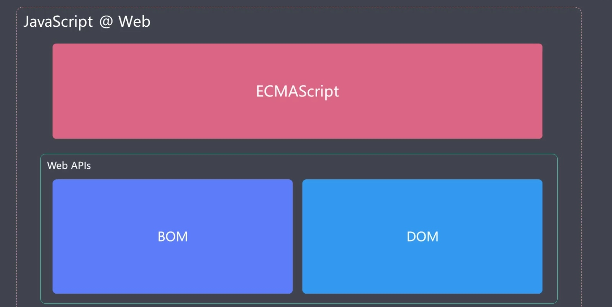

- Node环境下的JS：

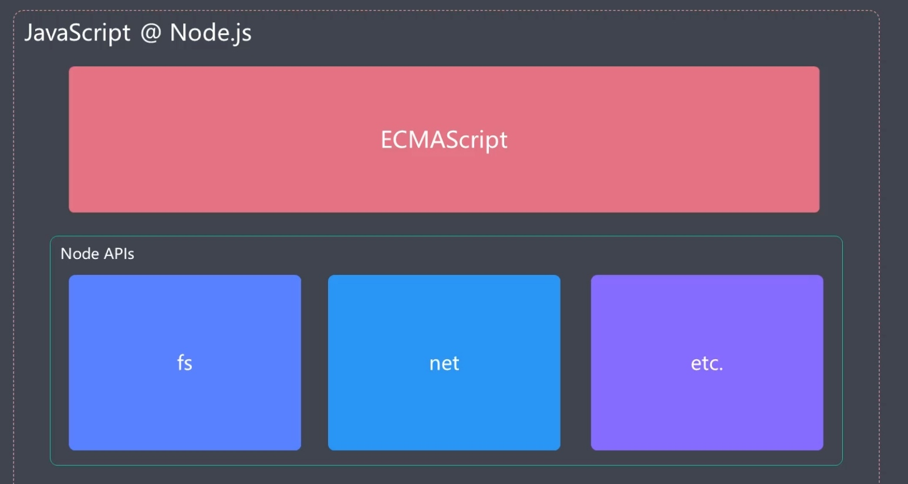

- JavaScript语言本身指的就是ECMAScript。

- ES2015 是在ES5发现后过了进6年才发行的一个版本，这段时间是Web发展的一段黄金时期，因此ES2015中包含了很多颠覆式的新功能。
- ES2015 之后的版本都是按照年份进行命名，很多人也把ES2015称之为ES6。

## ES2015 概述

- 最新ECMAScript标准的代表版本（相比于ES5.1的变化比较大，至此之后新版本的命名规则发生变化），此后开发者习惯用ES6泛指所有的新标准。

> 作用

- 解决原有语法上的一些问题或者不足
- 对原有语法进行增强
- 全新的对象、全新的方法、全新的功能
- 全新的数据类型和数据结构

## let 与块级作用域

> 作用域：某个成员能够起作用的范围

&emsp;&emsp;在ES2015前，ECMAScript只有全局作用域和函数作用域。ES2015中新增了块级作用域

> 块：用{}包裹起来的代码块

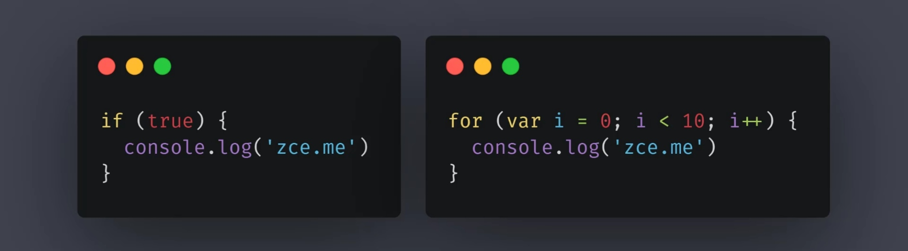

&emsp;&emsp;之前块是没有单独的作用域的，这就导致在块中定义的成员在外部也可以访问到。这很明显不安全。

```javascript
if (true) {
    var foo = "zce"
}
console.log(foo)	// zce
```

&emsp;&emsp;而使用let定义的变量，会在保存在块级作用域中，外部无法访问到。这很适用于for循环的计数器

```javascript
if (true) {
    let foo = "zce"
}
console.log(foo)	// 报错
```

### 场景一：

```javascript
for (var i = 0; i < 3; i++) {
    for (var i = 0; i < 3; i++) {
        console.log(i)
    }
    console.log('内层结束 i =' + i)		// 3
}
```

- 结果：

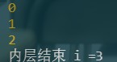

<div class="warning">

> 原因：内层循环一次之后，i变为3，并会覆盖外层的i，导致外层循环只会执行一次。而使用let时，就会正常执行9次输出：

</div>

```javascript
for (var i = 0; i < 3; i++) {
    for (let i = 0; i < 3; i++) {
        console.log(i)
    }
    console.log('内层结束 i =' + i)
}
```

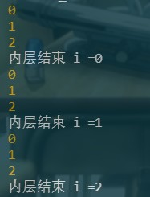

> 虽然let能够解决同名计数器覆盖的问题，但是仍然不建议使用同名的计数器。

### 场景二：

```javascript
var elements = [{}, {}, {}]
for (var i = 0; i < elements.length; i++) {
    elements[i].onclick = function () {
        console.log(i)
    }
}
elements[1].onclick()
```

> 此种情况下，无论elements[x].onclick()中x为何值，最终输出的i都是3。因为i作为全局作用域下的变量，在循环结束后便会变为3。我们可以使用闭包解决此问题：

````javascript
var elements = [{}, {}, {}]
for (var i = 0; i < elements.length; i++) {
    elements[i].onclick = (function (i) {
        return function () {
            console.log(i)
        }
    })(i)
}
elements[0].onclick()
````

> 实际上闭包也是借助函数作用域来摆脱全局作用域的影响。同时也可以使用let的块级作用域来解决问题

```javascript
var elements = [{}, {}, {}]
for (let i = 0; i < elements.length; i++) {
    elements[i].onclick = function () {
        console.log(i)
    }
}
elements[0].onclick()
```

### 场景三：

```javascript
for (let i = 0; i < 3; i++) {
    let i = 'foo'
    console.log(i)
}
```

- 结果：


> 此处产生了两个作用域：for循环条件的作用域，for代码块中的作用域。
>
> 相当于如下代码：

```javascript
let i = 0
if (i < 3) {
    let i = 'foo'
    console.log(i)
}

i++
if (i < 3) {
    let i = 'foo'
    console.log(i)
}

i++
if (i < 3) {
    let i = 'foo'
    console.log(i)
}

i++
```

### 场景四：

```javascript
console.log(foo)
var foo = 'xxc'	// undefined
```

> 用var定义的变量会声明提升。ES2015中的let取消了这个特性

```javascript
console.log(foo)
let foo = 'xxc'	// 报错
```

## const

> 用于定义一个只读的恒量/常量，在let基础上添加了一个只读特性（变量声明后不允许再被修改）

```javascript
// const name = 'xxc'
// name = 'jav'     // 报错

// const name
// name = 'xxc'    // 报错

const obj = {}
obj.name = 'xxc'    // 允许

obj = {}    // 指向新地址，报错
```

- const定义的值定义后必须立即初始化。
- const只是不允许修改地址指向，并不是不允许修改指向内容的值。

<div class="success">

> 推荐：不用var，主用const，配合let

</div>

## 数组的解构

```javascript
// 数组的解构

const arr = [100, 200, 300]

// 传统获取数组元素写法
// const foo = arr[0]
// const bar = arr[1]
// const baz = arr[2]
// console.log(foo, bar, baz)

// const [foo, bar, baz] = arr
// console.log(foo, bar, baz)

// const [, , baz] = arr
// console.log(baz)     // 300

// const [foo, ...rest] = arr
// console.log(rest)   // [ 200, 300 ]

// const [foo] = arr
// console.log(foo)   // 100

// const [foo, bar, baz, more] = arr
// console.log(more)   // undefined

const [foo, bar, baz, more = "default value"] = arr
console.log(more)   // default value
```

## 对象的解构

> 对象的解构需要根据属性名进行提取，而不是位置

```javascript
// 对象的解构

const obj = { name: 'zce', age: 18 }

// const { name } = obj
// console.log(name)   // zce
// 对象解构与数组解构一样也可以设置默认值，匹配不到的返回undefined。此处不做设置

const name = 'tom'
// const { name } = obj  // 此处会报错，可以使用重命名的方式来解决问题。
const { name: objName } = obj
// 还可以在重命名的同时设置默认值。
// const { name: objName ='jack'} = obj
console.log(objName)

// 此处可以将log方法解构出来，方便代码的编写
const { log } = console
log('foo')
log('bar')
log('xxc')
```

## 模板字符串字面量

```javascript
// 模板字符串
// 1.支持换行 2.支持通过插值表达式嵌入JS语句

// const str = 'hello es2015, this is a string'

const str = `hello es2015,this 
is a \`string\``
console.log(str)


const name = 'tom'
const msg = `hey,${name}---${1 + 2}---${Math.random()}`
console.log(msg)
```

## 模板字符串标签函数

```javascript
// 带标签的模板字符串

// const str = console.log`hello world`    // [ 'hello world' ]

const name = 'tom'
const gender = true

function myTagFunc(strings, name, gender) {
    console.log(strings)    // [ 'hey,', ' is a ', '.' ]    按表达式分割过后形成的数组
    console.log(name, gender)   // tom true
    // return '123'
    const sex = gender ? 'man' : 'woman'
    return strings[0] + name + strings[1] + sex + strings[2]
}

const result = myTagFunc`hey,${name} is a ${gender}.`
// console.log(result)     // 123
console.log(result)     // hey,tom is a man.

// 我们可以使用标签函数来进行模板字符串的加工，甚至可以使用这种特性来实现一个小型的模板引擎
```

## 字符串的扩展方法

> ECMAScript2015中为字符串添加了一些方法，比如：includes()、startWith()、endsWith()

```javascript
// 字符串的扩展方法

const message = 'Error：foo is not defined.'

console.log(
    // message.startsWith('Error'),    // true
    // message.endsWith('.'),  // true
    message.includes('foo')     // true
)
```

## 参数默认值

```javascript
// 函数参数的默认值

// 原本使用默认值的写法
// function foo(enable) {
//     // enable = enable || true        // 此种写法有误，因为当enable为false时也会使用默认值
//     enable = enable === undefined ? true : enable   // 应改为此种写法
//     console.log('foo invoked - enable：')
//     console.log(enable)
// }

// ECMA2015 写法
function foo(bar, enable = true) {   // 此种写法，只有当没有传递enable或enable为undefined时使用。同时要注意：若函数带有多个参数，那默认值形参必须写在最后。否则默认值将无法正常工作
    console.log('foo invoked - enable：')
    console.log(enable)
}

foo(true)
```

## 剩余参数

```javascript
// 剩余参数

// 之前的写法
// function foo() {
//     console.log(arguments)  // arguments为伪数组
// }

// ECMAScript2015中的写法
function foo(...args) {	// 注意:...args只能出现在数组的最后一位，而且只能使用1次。
    console.log(args)   // [1,2,3,4]
}

foo(1, 2, 3, 4)
```

## 展开数组

```javascript
// 展开数组参数

const arr = ['foo', 'bar', 'baz']

// 之前的写法：
// console.log(
//     arr[0],
//     arr[1],
//     arr[2]
// )

// console.log.apply(console, arr)  // foo bar baz

// ES2015中的写法
console.log(...arr)     // foo bar baz
```

## 箭头函数

```javascript
// 箭头函数

// 原始写法
// function inc(number) {
//     return number + 1
// }

// ES2015中的写法
// const inc = n => n + 1  // 函数体只有return时，可以省略函数体，将其变为要return的值
// const inc = n => {      // 若不省略，则需要我们手动return
//     return n + 1
// }

// console.log(inc(100))

// 使用箭头函数极大的简便了回调函数的编写
const arr = [1, 2, 3, 4, 5, 6, 7]
const newArr = arr.filter(item => item % 2)
console.log(newArr)
```

## 箭头函数与this

> 箭头函数不会改变this的指向

```javascript
// 箭头函数与this

// const person = {
//     name: 'tom',
//     sayHi: function () {
//         console.log(`hi,my name is ${this.name}`)
//     }
// }

// person.sayHi()  //  hi,my name is tom

const person = {
    name: 'tom',
    sayHi: () => {
        console.log(`hi,my name is ${this.name}`)
    },
    sayHiAsync: function () {
        setTimeout(() => {      // 此处的定时器回调函数如果写成普通函数，则其由于被放到全局对象上被调用，所以其内部是拿不到当前作用域中的this对象，他拿到的是全局对象
            // 而使用箭头函数，其内部的this就是sayHiAsync对应函数的this，即person
            console.log(this.name)
        }, 1000);
    }
}

// 此处的person处在全局上下文中，其内部的this为全局对象，所以sayHi由于是写成了箭头函数，其就会获取到全局对象。
person.sayHiAsync()  // hi,my name is undefined
```

## 对象字面量增强

> 包括对象函数属性的简写方式及计算属性名的推出

```javascript
// 对象字面量

const bar = '123'

const obj = {
    foo: 123,
    // bar: bar,
    bar,
    // method1: function () {
    //     console.log('method111')
    // },
    // 等价于：
    method1() {
        console.log('method111')
        console.log(this)   // 当前对象obj
    },
    // ES2015中的写法(计算属性名)
    [1 + 1]() {
        console.log(111)
    }
}

// 原始写法：
// obj[Math.random()] = 123

obj.method1()
```

## 对象扩展方法

> Object.assign：将多个源对象的属性复制到一个目标对象中。

```javascript
// Object.assign 方法

// const source1 = {
//     a: 123,
//     b: 123
// }

// const source2 = {
//     b: 789,
//     d: 789
// }

// const target = {
//     a: 456,
//     c: 456
// }

// // 用后面对象中的属性去覆盖第一个对象，assign方法的返回值就是第一个对象。
// const result = Object.assign(target, source1, source2)
// console.log(result)     // { a: 123, c: 456, b: 789, d: 789 }
// console.log(result === target)  // true

function func(obj) {
    // obj.name = 'func obj'
    // console.log(obj)     // 此种写法当obj改变时，外部的obj也会随之改变，因为它们指向同一个地址

    const funcObj = Object.assign({}, obj)  // 此种写法，首先将obj赋值给一个全新的对象，在用新对象改值，就不会影响obj了。
    funcObj.name = 'func obj'
    console.log(funcObj)    // { name: 'func obj' }
}
const obj = { name: 'gl' }
func(obj)
console.log(obj)    // { name: 'gl' }
```

> Object.is：用来判断两个值是否相等

```javascript
// Object is

console.log(
    // 0 == false // true，因为==会在比较前自动转换类型
    // 0 === false // false
    // +0 === -0   // true  +-0无法区分
    // NaN === NaN // false 注意此处NaN被认为是非数字，有无限种可能。
    // Object.is(+0, -0)   // false
    Object.is(NaN, NaN) // true
)
```

## Proxy代理对象

> ES5中的Object.defineProperty方法可以用于监视数据的读写，Vue3.0之前的版本就是使用其来实现数据响应，从而完成双向数据绑定。
>
> ES2015中产生了Proxy，其是专门为数据设置访问代理器的。

```javascript
// Proxy对象
const person = {
    name: 'xxc',
    age: 20
}

// 第一个参数为代理对象，第二个为代理的处理对象
const personProxy = new Proxy(person, {
    get(target, property) {
        console.log(target, property)   // { name: 'xxc', age: 20 } name
        return 100  // 此处返回的值为外部访问perProxy.xxx得到的属性
    },
    set() {

    }
})

console.log(personProxy.name)   // 100
```

> get基本写法：

```javascript
// Proxy对象
const person = {
    name: 'xxc',
    age: 20
}

// 第一个参数为代理对象，第二个为代理的处理对象
const personProxy = new Proxy(person, {
    get(target, property) {
        return property in target ? property : 'default'
    },
    set(target, property, value) {

    }
})

console.log(personProxy.name)     // name
console.log(personProxy.xxx)    //default
```

<div class="danger">

> js使用in和hasOwnProperty获取对象属性的区别：
> in判断的是对象的所有属性，包括对象实例及其原型的属性；
> 而hasOwnProperty则是判断对象实例的是否具有某个属性。

</div>


```javascript
// Proxy对象
const person = {
    name: 'xxc',
    age: 20
}

// 第一个参数为代理对象，第二个为代理的处理对象
const personProxy = new Proxy(person, {
    get(target, property) {
        return property in target ? property : 'default'
    },
    set(target, property, value) {
        console.log(target, property, value)    // { name: 'xxc', age: 20 } gender true
    }
})

personProxy.gender = true
```

> set基本写法：

```javascript
// Proxy对象
const person = {
    name: 'xxc',
    age: 20
}

// 第一个参数为代理对象，第二个为代理的处理对象
const personProxy = new Proxy(person, {
    get(target, property) {
        return property in target ? property : 'default'
    },
    set(target, property, value) {
        if (property === 'age') {
            if (!Number.isInteger(value)) {
                throw new TypeError(`${value} is not an int`)
            }
        }
        target[property] = value
    }
})

// personProxy.age = 'xxc' // 报错
personProxy.age = 100

personProxy.gender = true
```

## Proxy对比Object.defineProperty()

> defineProperty 只能监视属性的读写，Proxy能够监视到更多对象操作。

```javascript
// Proxy对比 Object.defineProperty()

const person = {
    name: 'xxc',
    age: 20
}

const personProxy = new Proxy(person, {
    // 当外部对象对当前代理对象进行delete操作时会自动执行
    deleteProperty(target, property) {
        console.log('delete', property)
        delete target[property]
    }
})

delete personProxy.age
console.log(person)
```

其余属性：

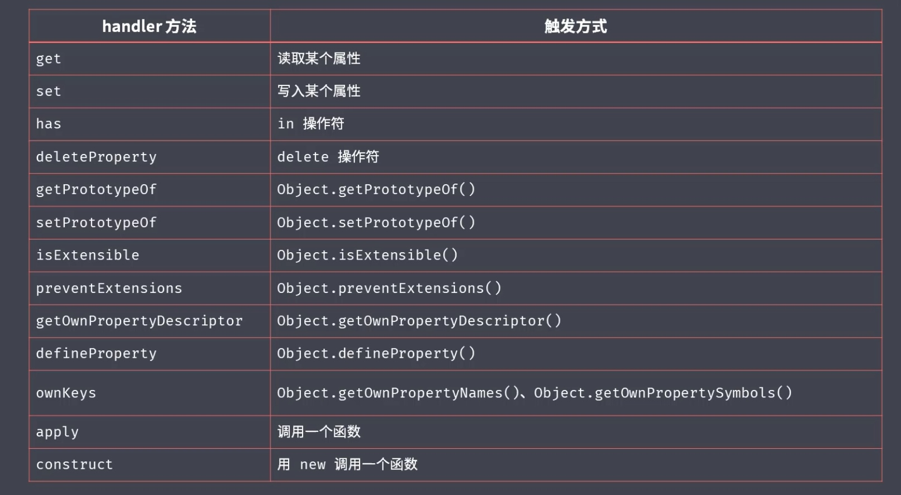

> Proxy更好的支持数组对象的监视。以往要根据Object.defineProperty监视数组，最常见的方式就是重写数组的操作方法。

```javascript
const list = []

const listProxy = new Proxy(list, {
    set(target, property, value) {
        console.log('set', property, value) /*
        set 0 100   表明了proxy内部会自动根据push操作推算其值所处的下标
        set length 1    同时还会自动输出这一行，表名添加属性后数组中自带的length属性也会发生修改。
        */
        target[property] = value
        return true     // 表示设置成功
    }
})

listProxy.push(100)
```

> Proxy是以非侵入的方式监管了对象的读写，一个已经定义好的对象，我们不需要对对象本身进行任何操作，就可以监测到其内部成员的读写。
>
> 而Object.defineProperty则需要我们以特定的方式，单独去定义对象当中需要被监视的属性。

```javascript
const person = {}

Object.defineProperty(person, 'name', {
    get() {
        console.log('name 被访问')
        return person._name
    },
    set(value) {
        console.log('name 被设置')
        person._name = value
    }
})
Object.defineProperty(person, 'age', {
    get() {
        console.log('age 被访问')
        return person._age
    },
    set(value) {
        console.log('age 被设置')
        person._age = value
    }
})

person.name = 'jack'

console.log(person.name)

// Proxy 方式更为合理
const person2 = {
    name: 'zce',
    age: 20
}

const personProxy = new Proxy(person2, {
    get(target, property) {
        console.log('get', property)
        return target[property]
    },
    set(target, property, value) {
        console.log('set', property, value)
        target[property] = value
    }
})

personProxy.name = 'jack'

console.log(personProxy.name)
```

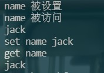

## Reflect

> Reflect 属于一个静态类，不能通过new去创建一个实例对象，只能通过Reflect.xxx()来使用其相关方法。与JS中的Math对象相同。
>
> Reflect内部封装了一系列对对象的底层操作，统一提供一套用于操作对象的API。
>
> Reflect成员方法就是Proxy处理对象的默认实现。

```javascript
// Reflect 对象

const obj = {
    foo: '123',
    bar: '456'
}

const proxy = new Proxy(obj, {
    // 当我们没有定义get方法时，Proxy内部会将参数以Reflect.xxx(此处xxx对应Proxy的配置方法，Reflect中的方法与其一一对应)的方式进行执行
    // 类似于以下写法
    get(target, property) {
        console.log('watch logic~~')

        return Reflect.get(target, property)
    }
})

console.log(proxy.foo)
```

```javascript
const obj = {
    name: 'xxc',
    age: 18
}

// 原始操作对象的写法，很明显，过于混乱
// console.log('name' in obj)
// console.log(delete obj['age'])
// console.log(Object.keys(obj))

// 使用Reflect方法
console.log(Reflect.has(obj, 'name'))
console.log(Reflect.deleteProperty(obj, 'age'))
console.log(Reflect.ownKeys(obj))
```

> ECMAScript标准中虽然允许使用原始操作对象的写法，但慢慢发展后原先的写法都将被废弃。

## Promise

> Promise提供了一种更优的异步编程解决方案，通过链式调用的方式解决了传统异步编程中回调函数嵌套过深的问题。

具体内容可以查看：

[JavaScipt异步编程](https://blogs.xxcijmz.top/blogs/a093bbe6/)

[手写Promise源码](https://blogs.xxcijmz.top/blogs/4548d372/)

## Class类

```javascript
// class 关键词

// // 原始写法：构造函数
// function Person(name) {
//     this.name = name
// }

// // 通过函数对象的prototype来实现共享成员
// Person.prototype.say = function () {
//     console.log(`hi,my name is ${this.name}`)
// }

// ES6 中类实现
class Person {
    constructor(name) {
        this.name = name
    }

    say() {
        console.log(`hi,my name is ${this.name}`)
    }
}

const p = new Person('tom')
p.say()
```

## 静态成员

> 以前我们添加静态方法是直接在构造函数对象上挂载对象。而ES6中新增添加静态成员的static关键词

```javascript
<!DOCTYPE html>
<html lang="en">

<head>
    <meta charset="UTF-8">
    <meta http-equiv="X-UA-Compatible" content="IE=edge">
    <meta name="viewport" content="width=device-width, initial-scale=1.0">
    <title>Document</title>
</head>

<body>
    <script type="text/javascript">
        // static 方法

        class Person {
            constructor(name) {
                this.name = name
            }

            say() {
                console.log(this)
                console.log(`hi,my name is ${this.name}`)
            }

            static create(name) {
                console.dir(this)
                // 静态方法内部的this不是实例对象，而是当前的Person
                return new Person(name)
            }
        }

        console.dir(Person)

        const tom = Person.create('tom')
        tom.say()
    </script>
</body>

</html>
```

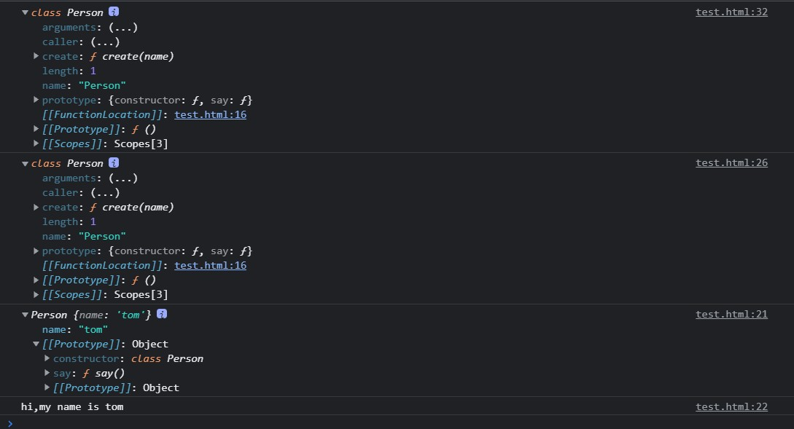

<div class="warning">

> 实例对象中：constructor中定义的属性会被挂载到实例对象自身，而构造类Person中定义的属性会被挂载到实例的隐式原型上

</div>

## 类的继承

> ES2015之前大多数情况都是使用原型的方式实现继承，[可参考](https://www.cnblogs.com/LuckyWinty/p/5824073.html)。而ES6之后新增了类的继承(extends)

```javascript
// extends继承

class Person {
    constructor(name) {
        this.name = name
    }
    say() {
        console.log(`hi,my name is ${this.name}`)
    }
}

class Student extends Person {
    constructor(name, number) {
        super(name)
        this.number = number
    }
    hello() {
        super.say()
        console.log(`my school number is ${this.number}`)
    }
}

const s = new Student('jack', '100')
s.hello()
```

## Set数据结构

> 与传统的数组很相似，但是Set内部的成员是不允许重复的

```javascript
// Set 数据结构

const s = new Set()

s.add(1).add(2).add(3).add(4).add(2)

// console.log(s)

// 可以使用forEach来遍历集合对象
// s.forEach(i => {
//     console.log(i)
// });

// 使用 fot of来遍历集合对象
// for (let i of s) {
//     console.log(i)
// }

// 通过.size来获取整个集合的长度
// console.log(s.size)  // 4

// 通过has方法判断集合中是否存在某个值
// console.log(s.has(100)) // false

// 通过delete方法删除集合当中的某个值
// console.log(s.delete(3))    // true

// 通过clear方法清空集合
// s.clear()
// console.log(s)

// 通过集合为数组去重
const arr = [1, 2, 3, 4, 1, 3]

// const result = Array.from(new Set(arr)) // Array.from可以将Set再次转换为数组
const result = [...new Set(arr)]    // 使用...将Set中的成员解构，再在外层包裹数组，可以达到同样效果

console.log(result)
```

## Map数据结构

> Map与对象很类似，本质都是键值对集合。但是对象的键只能是字符串类型，而map可以使用任意数据作为键。

```javascript
// Map数据结构

const obj = {}
obj[true] = 'val'
obj[123] = 'value'
obj[{ a: 1 }] = 'value'
// 可以发现obj中所有的键都被转换为了字符串形式（说明如果我们给对象的键类型不是字符串的话，内部会将其的toString返回值作为覆盖值）
console.log(Object.keys(obj))   //[ '123', 'true', '[object Object]' ]
console.log(obj['[object Object]'])     // value

// 使用map可以解决这个问题，可以看出map才是严格意义上的键值对集合，用来映射两个任意数据类型的对应关系
const m = new Map()
const tom = { name: 'tom' }

m.set(tom, 90)

console.log(m)  // Map(1) { { name: 'tom' } => 90 }

console.log(m.get(tom))     // 90

// 同时map也可以使用has()方法判断某个键是否存在，用delete方法去删除某个键，clear方法去清空所有的键值

// 使用forEach去遍历map方法
m.forEach((value, key) => {
    console.log(value, key) // 90 { name: 'tom' }
})
```

## Symbol

> 作用：表示一个独一无二的值

```javascript
// Symbol数据类型

// shared.js ====================================

const cache = {}

// a.js ===================================

cache['foo'] = Math.random()

// b.js ===================================

cache['foo'] = 123

// 现在我们大量使用第三方模块，而有些时候我们要扩展第三方模块，可是却不知道第三方模块是否存在某个键，此时便可能产生上方的冲突
console.log(cache)
```

> Symbol的用法

```javascript
// const s = Symbol()
// console.log(s)
// console.log(typeof s)

// console.log(
//     Symbol() === Symbol()       // false
// )

// console.log(Symbol('foo'))  // Symbol(foo)
// console.log(Symbol('bar'))  // Symbol(bar)
// console.log(Symbol('baz'))  // Symbol(baz)

// ES2015开始，对象可以直接使用Symbol 类型的值作为属性名。这也代表此后着对象的属性可以为String和Symbol

// const obj = {}
// obj[Symbol()] = '123'
// obj[Symbol()] = '456'
// console.log(obj)    // { [Symbol()]: '123', [Symbol()]: '456' }

// 在对象字面量中使用Symbol
// const obj = {
//     [Symbol()]: 123
// }
// console.log(obj)


// 用Symbol()来定义私有成员
// a.js========================================
const name = Symbol()

const person = {
    [name]: 'xxc',
    say() {
        console.log(this[name])
    }
}

// b.js========================================

// console.log(person[Symbol()])   // undefined
person.say() // xxc
```

<div class = "success">

> 可以看到，目前Symbol对象最主要的作用就是为对象添加独一无二的属性名。
>
> 截止到ECMAScript2019，ECMA定义了8中数据类型（7种基本数据类型+Object）：

</div>

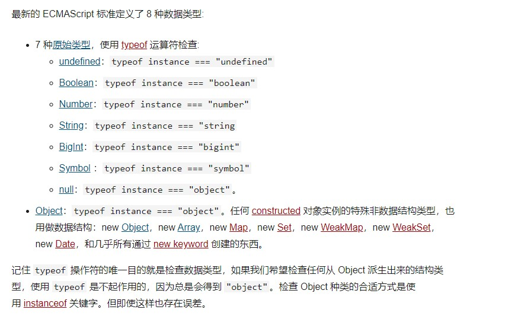

## Symbol补充

```javascript
// Symbol补充

// console.log(
//     // Symbol得到的值不会因为描述文本相同而相同。全部都是不同的！！
//     Symbol('foo') === Symbol('foo') // false
// )

// for静态方法可以接受一个字符作为参数，相同的字符串一定会返回相同的Symbol类型的值。
// 其内部维护了一个全局的注册表，为字符串和Symbol值提供了一一对应的关系
const s1 = Symbol.for('foo')
const s2 = Symbol.for('foo')
console.log(s1 === s2)  // true

console.log(
    // 由于其内部维护的是字符串和Symbol值对应的关系，所以若传入的不是字符串，也会转为字符串
    Symbol.for(true) === Symbol.for('true')     // true
)

// Symbol中提供了很多内置的Symbol常量，用于作为内部方法的标识，这些标识符可以让自定义对象去实现一些JS中内置的接口
// 如Symbol.iterable、Symbol.hasInstance

// const obj = {
// 使用Symbol.toStringTag自定义字符串toString标签
//     [Symbol.toStringTag]: 'XObject'
// }
// console.log(obj.toString())     // [object XObject]

const obj = {
    // 使用Symbol作为对象的属性名时，通过for in 循环、Object.keys、JSON.stringfy都无法获取到
    // 这使得使用Symbol作为属性名的属性很适合作为对象的私有属性
    [Symbol()]: 'symbol value',
    foo: 'normal value'
}

for (var key in obj) {  // foo
    console.log(key)
}
console.log(Object.keys(obj))   // [ 'foo' ]
console.log(JSON.stringify(obj))    // {"foo":"normal value"}

// 获取对象中Symbol类型的属性名的方法
console.log(Object.getOwnPropertySymbols(obj))  // [ Symbol() ]
```

## for...of循环

> for循环比较适合遍历普通数组，for...in比较适合遍历键值对。但都有一些局限性
>
> for...of将来将作为遍历所有数据结构的统一方式
>
> [区别看这里](https://www.cnblogs.com/zhilu/p/13856912.html)

```javascript
// for...of循环

const arr = [100, 200, 300, 400]

for (const item of arr) {
    console.log(item)   // 与for..in不同，for...of拿到的item即为数组中的元素，而不是索引值
}

for (const item of arr) {
    console.log(item)
    if (item > 100) {
        break   // 与forEach不同，for...of可以使用break、continue、return关键字随时终止循环
    }
}
// 以前为了终止遍历，使用的是数组实例的some()和every()方法
/* const arr = [1, 2, 3, 4, 5, 6, 7];
// some 返回true时终端遍历
arr.some(item => {
    console.log(item); // 1 2 3
    if (item == 3) {
        return true;
    }
});

// every 返回false时终端遍历,返回true继续遍历
arr.every(item => {
    console.log(item); // 1 2 3 4
    if (item == 4) {
        return false;
    } else {
        return true;
    }
}); */

// 除了数组可以使用for...of进行遍历，一些伪数组也可以使用for...of进行遍历。
// const s = new Set(['foo', 'bar'])
// for (const item of s) {  
//     console.log(item)
// }

const m = new Map()
m.set('foo', '123')
m.set('bar', '345')

for (const item of m) {
    console.log(item)
}
// [ 'foo', '123' ]
// [ 'bar', '345' ]

for (const [key, value] of m) {
    console.log(key, value)
}
// foo 123
// bar 345

// for...of不可直接遍历普通对象
const obj = { foo: 123, bar: 456 }

for (const item of obj) {   // 报错
    console.log(item)
}
```

## 可迭代接口Iterable

> ES 中能够表示有结构的数据类型越来越多，为了给各种各样的数据结构提供统一遍历方式，ES2015提供了Iterable接口。实现Iterable接口就是for...of的前提

- 下面三张图可以看出，数组、Set、Map的原型对象上都有Symbol.Iterable函数。

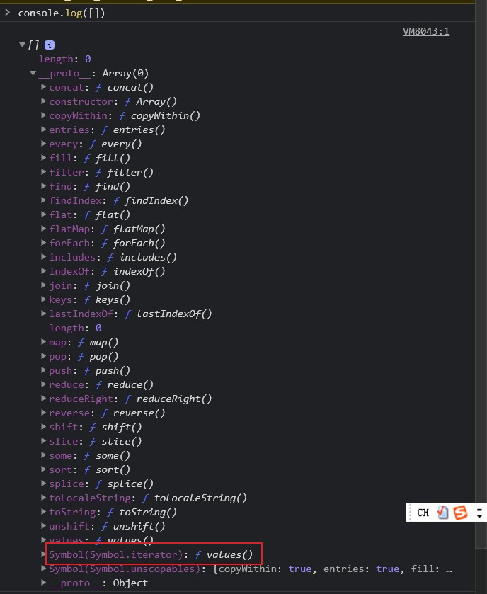


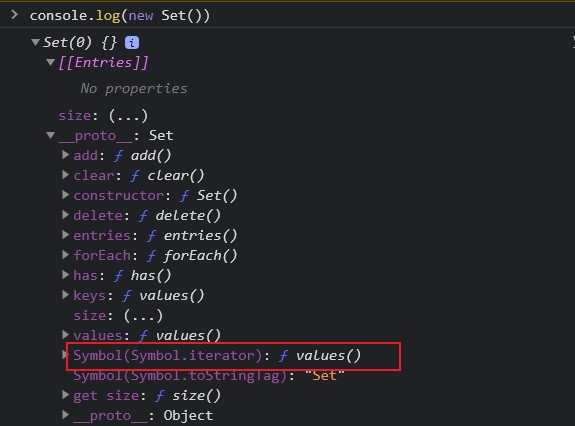

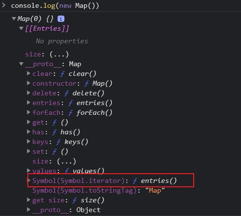

- 输出Symbol.iterator的执行结果（迭代器）可以发现其内部有一个next()方法

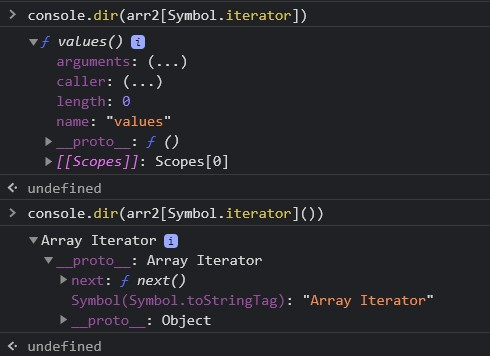

- 不断的执行next()方法便可遍历数组。这也是for...of的实现原理

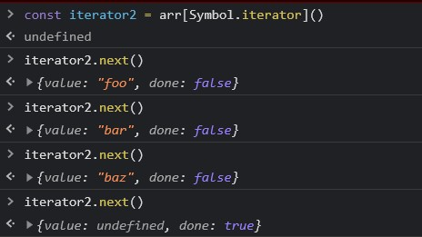

```javascript
// 迭代器(Iterator)

const set = new Set(['foo', 'bar', 'baz'])

// 此处set[Symbol.iterator]()返回一个含有next()方法的Array Iterator对象（迭代器）
const iterator = set[Symbol.iterator]()

console.log(iterator.next())    // { value: 'foo', done: false }
console.log(iterator.next())    // { value: 'bar', done: false }
console.log(iterator.next())    // { value: 'baz', done: false }
console.log(iterator.next())    // { value: undefined, done: true }
```

## 实现可迭代接口

```javascript
// 实现可迭代接口(Iterable)

// const obj = {
// 此处的Symbol.iterator、next、value、done都是固定的，不可改成别的写法
//     [Symbol.iterator]: function () {    // Symbol类型提供的常量iterator，此处使用计算属性名。返回一个实现迭代器接口的对象
//         return {
//             next: function () { // next()方法中返回迭代结果
//                 return {
//                     value: 'zce',
//                     done: true
//                 }
//             }
//         }
//     }
// }

const obj = {
    store: ['foo', 'bar', 'baz'],
    [Symbol.iterator]: function () {    // Symbol类型提供的常量iterator，此处使用计算属性名。返回一个实现迭代器接口的对象
        let index = 0
        const self = this
        return {
            next: function () { // next()方法中返回迭代结果
                const result = {
                    value: self.store[index],
                    done: index >= self.store.length
                }
                index++
                return result
            }
        }
    }
}


for (const item of obj) {
    console.log(item)
}
```

## 迭代器模式

> 一种设计模式

```javascript
// 迭代器设计模式 核心：对外提供统一遍历接口，让外部不用再去关注数据内部结构

// 场景：你我协同开发一个任务清单应用

// 我的代码 =================================
const todos = {
    life: ['吃饭', '睡觉', '打豆豆'],
    learn: ['语文', '数学', '外语'],
    work: ['喝茶'],
    // 定义each方法统一遍历接口
    each: function (callback) {
        const all = [].concat(this.life, this.learn, this.work)
        for (const item of all) {
            callback(item)
        }
    },
    // 定义iterator来实现外部可以使用for...of来统一遍历
    [Symbol.iterator]: function () {
        const all = [...this.life, ...this.learn, ...this.work]
        let index = 0
        return {
            next: function () {
                return {
                    value: all[index],
                    done: index++ >= all.length
                }
            }
        }
    }
    // 此处each只适用于当前，而iterator是语言层面实现了迭代器模式，可以适用于任合数据结构，只需要你通过代码实现iterator方法。
}


// 你的代码 =================================

// 下方遍历方式，耦合度高，需要关注todos的内部结构
// for (const item of todos.life) {
//     console.log(item)
// }
// for (const item of todos.learn) {
//     console.log(item)
// }
// for (const item of todos.work) {
//     console.log(item)
// }

todos.each(function (item) {
    console.log(item)
})

console.log('---------------------')

for (const item of todos) {
    console.log(item)
}
```

## 生成器Generator

> 作用：为了避免异步编程中回调嵌套过深的问题，提供更好的异步编程解决方案。

```javascript
// Generator 函数

function* foo() {
    console.log('xxc')
    return 100
}

const result = foo()
console.log(result)
```

- 结果：

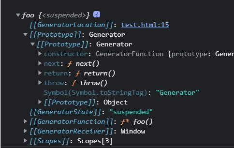

```javascript
// Generator 函数

function* foo() {
    console.log('xxc')
    return 100
}

const result = foo()
console.log(result.next())
```

- 结果：

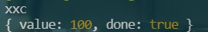

> 可以看出，生成器对象也实现了iterator接口协议。

```javascript

function* foo() {
    console.log('111')
    yield 100
    console.log('222')
    yield 200
    console.log('333')
    yield 300
}

// 生成器函数调用后会返回一个生成器对象，只有我们调用了这个对象的next()方法，这个函数才开始执行，当执行时遇到yield时，函数的执行就会暂停。且yield后面的值将会作为next()的返回值中的value。只有当返回的值中的done为true时，函数才执行完毕
const generator = foo()
console.log(generator.next())   // { value: 100, done: false }
console.log(generator.next())   // { value: 200, done: false }
console.log(generator.next())   // { value: 300, done: false }
console.log(generator.next())   // { value: undefined, done: true }
```

## 生成器应用

```javascript
// Genarator 应用

// 案例1：发号器

// function* createIdMaker() {
//     let id = 1
//     while (true) {
//         yield id++
//     }
// }

// const idMaker = createIdMaker()

// console.log(idMaker.next().value)
// console.log(idMaker.next().value)
// console.log(idMaker.next().value)
// console.log(idMaker.next().value)

// 案例2：使用 Generator 函数实现 iterator 方法

const todos = {
    life: ['吃饭', '睡觉', '打豆豆'],
    learn: ['语文', '数学', '外语'],
    work: ['喝茶'],
    // 此处function *(){} 返回的值满足了iterator中要求的包含next()方法，且调用next()方法可以得到value和done属性的条件。
    [Symbol.iterator]: function* () {
        const all = [...this.life, ...this.learn, ...this.work]
        for (const item of all) {
            yield item
        }
    }
}

for (const item of todos) {
    console.log(item)
}
```

## ES Modules

[请参照xxxxxx]()

##  ES2016

```javascript
// ECMAScript 2016

// Array.prototype.includes --------------------- 用于判断数组当中是否包含指定元素（返回布尔值）

const arr = ['foo', 1, NaN, false]

console.log(arr.indexOf('foo')) // 0 indexOf 返回元素在数组中的下标，没有找到返回-1
console.log(arr.indexOf(NaN))   // -1 indexOf 不能查找数组中的NaN

console.log(arr.includes('foo'))    // true 
console.log(arr.includes(NaN))    // true 


// 指数运算符   ---------------------
// 原始写法：
console.log(Math.pow(2, 10))

// ES2016中的指数运算符
console.log(2 ** 10)    // 1024
```

## ES2017

```javascript
// ECMAScript 2017

const obj = {
    foo: 'value1',
    bar: 'value2'
}

// Object.values    -------------------------------
// 与ES5的Object.keys方法非常类似，一个返回键，一个返回值
console.log(Object.values(obj)) // [ 'value1', 'value2' ]

// Object.entries  ----------------------------- 以数组的形式返回对象中所有的键值对
console.log(Object.entries(obj))    // [ [ 'foo', 'value1' ], [ 'bar', 'value2' ] ]

for (const [key, value] of Object.entries(obj)) {
    console.log(key, value)
}
// foo value1
// bar value2

// Map的构造函数可以直接转换[ [ 'foo', 'value1' ], [ 'bar', 'value2' ] ]这种格式的数组
console.log(new Map(Object.entries(obj)))   // Map(2) { 'foo' => 'value1', 'bar' => 'value2' }

// Object.getOwnPropertyDescriptors ------------------------------- 用于获取对象中属性的完整描述信息，用于配合ES5的getter与setter
// Object.getOwnPropertyDescriptors

const p1 = {
    firstName: 'Lei',
    lastName: 'Wang',
    get fullName() {
        return this.firstName + ' ' + this.lastName
    }
}

// const p2 = Object.assign({}, p1)
// p2.firstName = 'zce'
// // 可以看到，在使用Object.assign()进行赋值时，fullName被当成了普通属性进行了赋值
// console.log(p2)    // { firstName: 'zce', lastName: 'Wang', fullName: 'Lei Wang' }

const descriptors = Object.getOwnPropertyDescriptors(p1)
console.log(descriptors)
// 此处不用assign的原因是：assign复制对象会原封不动的复制，而此时的descriptors是对象的详细信息，如下：
/*
{
  firstName: {
    value: 'Lei',
    writable: true,
    enumerable: true,
    configurable: true
  },
  lastName: {
    value: 'Wang',
    writable: true,
    enumerable: true,
    configurable: true
  },
  fullName: {
    get: [Function: get fullName],
    set: undefined,
    enumerable: true,
    configurable: true
  }
}
*/
// 而使用defineProperties可以解决此问题
const p2 = Object.defineProperties({}, descriptors)
p2.firstName = 'zce'
console.log(p2.fullName)    // zce Wang


// String.prototype.padStart / String.prototype.padEnd-----------------------用给定的字符填充字符串的开始或结束位置，直到字符串达到指定长度
const books = {
    html: 5,
    css: 16,
    javascript: 128
}
for (const [name, count] of Object.entries(books)) {
    console.log(name, count)
}
/*
html 5
css 16
javascript 128
*/
for (const [name, count] of Object.entries(books)) {
    console.log(`${name.padEnd(16, '-')}|${count.toString().padStart(3, '0')}`)
}
/*
html------------|005
css-------------|016
javascript------|128
*/


// 在函数参数中添加尾逗号 -------
// function foo(
//     xxc,
//     jmz,
// ) {

// }

// 在结束位置添加','可以方便添加新属性，同时由于格式一致，调整起来也很容易
const arr = [
    100,
    200,
    300,
]

```

> 最重要的一点是：ES2017标准化了Async/Await。

- 补充阅读

[defineProperty与defineProperties的区别](https://blog.csdn.net/weixin_48027328/article/details/109658558?utm_medium=distribute.pc_relevant.none-task-blog-2%7Edefault%7ECTRLIST%7Edefault-2.no_search_link&depth_1-utm_source=distribute.pc_relevant.none-task-blog-2%7Edefault%7ECTRLIST%7Edefault-2.no_search_link)

[js中get和set的使用](https://www.cnblogs.com/xinggood/p/6601029.html)