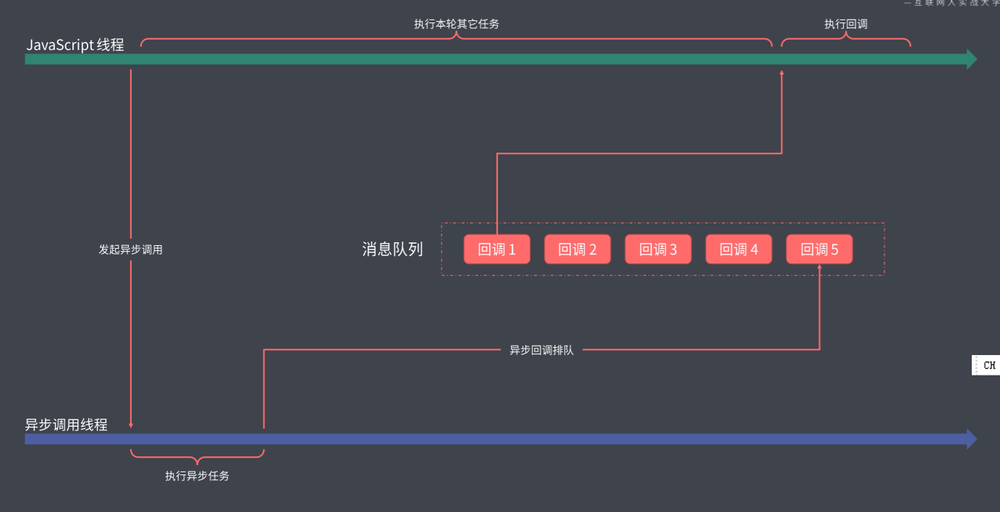
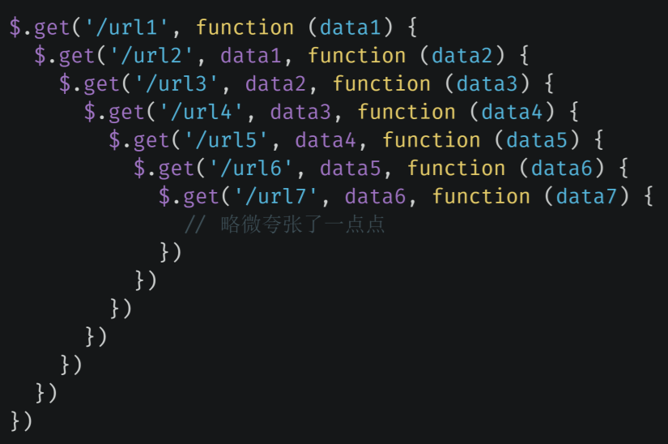
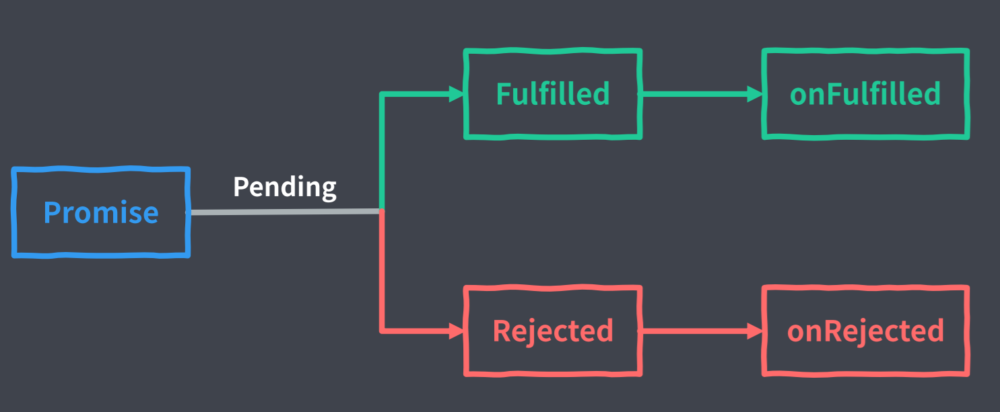
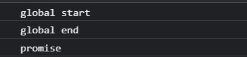
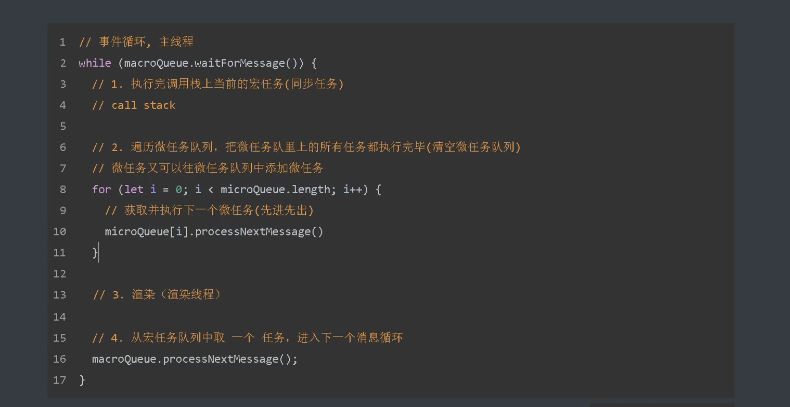

> JS采用单线程模式（执行代码的线程只有一个）工作的原因

与其最早的设计初衷有关，最早JS是运行在浏览器端的脚本语言，其目的是为了实现页面上的动态交互，而实现页面交互的核心是DOM操作，这决定了其必须使用单线程模型，否则会出现很复杂的线程同步问题。

但这种模式会导致当某一段代码执行时间较长时，其下方代码需等待其执行完方可执行。

为了解决这种问题，JS将任务的执行模式分成了两种：同步模式(Synchronous)和异步模式(Asynchronous)。


> 同步模式(Synchronous)
>
> 注意：同步指的是排队执行，而不是同时执行


> 异步模式(Asynchronous)
>
> 不会等待这个任务的结束才开始下一个任务，而是开启过后就立即往后执行下一个任务，后续逻辑一般会通过回调函数的方式定义。
>
> 如果没有异步模式，单线程的JavaScript语言就无法同时处理大量耗时任务。



- JavaScript是单线程的。而浏览器并不是单线程的，或者说通过JavaScript调用的某些内部API并不是单线程的。

<div class="danger">

> 同步和异步实际上是指运行环境提供的API是以同步还是异步模式的方式工作的

</div>


> 回调函数 - 所有异步编程方案的根基
>
> 回调函数可以理解为一件你想要做，但不能立刻做的事情。当时间到了可以做的时候，便会有人通知你去做。


## Promise概述

> 首先看一张回调地狱图：



- 为了避免回调地狱的问题，CommonJS社区提出了Promise的规范。后来在ES2015中被标准化，成为了语言规范



Promise相当于对外界做出的一个承诺，一开始承诺是一种待定的状态(Pending)，这个承诺有可能成功(Fulfilled)，有可能失败(Rejected)，若成功则会执行成功相对应的反应(onFulfilled)，若失败了则执行失败相对应的反应(onRejected)。注意：一旦明确了结果之后，则不可能再发生改变了。


## Promise基本用法

```javascript
// Promise 基本示例

const promise = new Promise(function (resolve, reject) {
    // 这里用于“兑现”承诺，由于承诺确定后便不能修改了，所以resolve和reject只能二选一，不能同时调用

    resolve(100) // 承诺达成，状态变为fulfilled

    // reject(new Error('promise rejected')) // 承诺失败,状态变为rejected
})

// .then方法的第一个参数为承诺达成后要执行的回调函数，第二个为承诺失败后要执行的回调函数
promise.then(function (value) {
    // 即便没有异步操作，then 方法中传入的回调仍然会被放入队列，等待下一轮执行
    console.log('resolved', value)
}, function (error) {
    console.log('rejected', error)
})

console.log('end')  // .then方法中的回调函数会被放到回调队列中，必须等到同步代码执行完后才会执行。
```

## Promise封装Ajax

```javascript
// Promise 方式的 AJAX
function ajax(url) {
    return new Promise(function (resolve, reject) {
        var xhr = new XMLHttpRequest()
        xhr.open('GET', url)
        xhr.responseType = "json"   // HTML5的新特性，设置后请求可以直接拿到一个JSON对象，而不是字符串
        xhr.onload = function () {  // 请求完成后，readyState为4时执行
            if (this.status === 200) {
                resolve(this.response)
                console.log(this)
            } else {
                reject(new Error(this.statusText))
                console.log(this)
            }
        }
        xhr.send()
    })
}

ajax('/api/users1.json').then(function (res) {
    console.log(res)
}, function (error) {
    console.log(error)
})
```


## Promise常见误区

```javascript
// Promise 常见误区
function ajax(url) {
    return new Promise(function (resolve, reject) {
        var xhr = new XMLHttpRequest()
        xhr.open('GET', url)
        xhr.responseType = "json"   // HTML5的新特性，设置后请求可以直接拿到一个JSON对象，而不是字符串
        xhr.onload = function () {  // 请求完成后，readyState为4时执行
            if (this.status === 200) {
                resolve(this.response)
                console.log(this)
            } else {
                reject(new Error(this.statusText))
                console.log(this)
            }
        }
        xhr.send()
    })
}

// 嵌套使用 Promise 是最常见的误区
ajax('/api/urls.json').then(function (urls) {
    ajax(urls.users).then(function (users) {
        ajax(urls.users).then(function (users) {
            ajax(urls.users).then(function (users) {
                ajax(urls.users).then(function (users) {

                })
            })
        })
    })
})
```

- 当我们使用Promise时，应该尽可能保证异步任务扁平化，而不是像上方代码这样嵌套使用。

## Promise 链式调用

```javascript
// Promise 链式调用

function ajax(url) {
    return new Promise(function (resolve, reject) {
        var xhr = new XMLHttpRequest()
        xhr.open('GET', url)
        xhr.responseType = "json"   // HTML5的新特性，设置后请求可以直接拿到一个JSON对象，而不是字符串
        xhr.onload = function () {  // 请求完成后，readyState为4时执行
            if (this.status === 200) {
                resolve(this.response)
            } else {
                reject(new Error(this.statusText))
            }
        }
        xhr.send()
    })
}
var promise = ajax('/api/users.json')

var promise2 = promise.then(    // .then方法会返回一个全新的promise对象
    function onFulfilled(value) {
        console.log('onFulfilled', value)
    },
    function onRejected(error) {
        console.log('onRejected', error)
    }
)

// 每一个then方法实际上都是在为上一个then返回的promise对象添加状态明确过后的回调
ajax('/api/users.json')
    .then(function (value) {
        console.log(111)
        return ajax('/api/users.json')  // 同时可以在.then中手动返回一个promise对象，则下一个then就变为了为这个手动添加的promise对象添加回调
    })
    .then(function (value) {
        console.log(222)
        console.log(value)	// json文件的内容
    })
    .then(function (value) {
        console.log(333)
        return 'foo'        // 若.then返回一个普通值，则这个普通值会作为下一个.then方法回调中的value值
    })
    .then(function (value) {
        console.log(value)  // foo
        console.log(444)
        // 若回调中没有返回任何值，则下一个.then方法回调中的value值为undefined
    })
    .then(function (value) {
        console.log(value)  // undefined    
        console.log(555)
    })
```

- Promise对象中的then方法会返回一个全新的Promise对象
- 后面的then方法就是在为上一个then返回的Promise注册回调
- 前面then方法回调函数的返回值会作为后面then方法回调的参数
- 如果回调中返回的是Promise，那么后面then方法的回调会等待它的结束

## Promise异常处理

```javascript
// Promise 异常处理

function ajax(url) {
    return new Promise(function (resolve, reject) {
        var xhr = new XMLHttpRequest()
        xhr.open('GET', url)
        xhr.responseType = "json"   // HTML5的新特性，设置后请求可以直接拿到一个JSON对象，而不是字符串
        xhr.onload = function () {  // 请求完成后，readyState为4时执行
            if (this.status === 200) {
                resolve(this.response)
            } else {
                reject(new Error(this.statusText))
            }
        }
        xhr.send()
    })
}

ajax('/api/users.json')
    .then(function onFulfilled(value) {
        console.log('onFulfilled', value)
        return ajax('/error-url')   // onRejected无法捕获此异常
    }, function onRejected(error) {     // onRejected执行条件：Promise对象抛出异常或失败(reject)
        console.log('onRejected', error)
    })

// 一般来说使用catch的形式更常见一些，其更适合链式调用
ajax('/api/users.json')
    .then(function onFulfilled(value) {
        console.log('onFulfilled', value)
        return ajax('/error-url')   // catch可以捕获到此异常
    })  // 此处的catch实际上是给前方的.then方法指定失败的回调，并不是直接给第一个Promise对象指定，只是因为链式调用的原因，第一个Promise中的异常会一直被往后传递
    // 而第一种onRejected的写法只能捕获其上方的Promise异常，不能捕获再前面的异常
    .catch(function onRejected(error) {     // onRejected执行条件：Promise对象抛出异常或失败(reject)
        console.log('onRejected', error)
    })
    // 此处的.catch相当于.then(undefined,function XXX(){})
```

## Promise静态方法

> Promise.resolve(value)

&emsp;&emsp;会直接返回一个状态为fulfilled，值为value的Promise对象。若value为promise对象，则会将这个promise原样返回。

> Promise.reject(value)

&emsp;&emsp;会直接返回一个状态为rejected，值为value的Promise对象。无论value为何值，都会作为Promise失败的原因。

```javascript
// 常用 Promise 静态方法

function ajax(url) {
    return new Promise(function (resolve, reject) {
        var xhr = new XMLHttpRequest()
        xhr.open('GET', url)
        xhr.responseType = "json"   // HTML5的新特性，设置后请求可以直接拿到一个JSON对象，而不是字符串
        xhr.onload = function () {  // 请求完成后，readyState为4时执行
            if (this.status === 200) {
                resolve(this.response)
            } else {
                reject(new Error(this.statusText))
            }
        }
        xhr.send()
    })
}

Promise.resolve('foo')
    .then(function (value) {
        console.log(value)  // foo
    })

// 上方写法等价于：
new Promise(function (resolve, reject) {
    resolve('foo')
}).then(function (value) {
    console.log(value)
})

var promise = ajax('/api/users.json')
var promise2 = Promise.resolve(promise)
console.log(promise === promise2)   // true

// resolve参数为包含then属性的对象时（仅供了解）
Promise.resolve({
    then: function (onFulfilled, onRejected) {
        onFulfilled('foo')  // 此处的onFulfilled相当与resolve()
    }
})
    .then(function (value) {
        console.log(value)  // foo
    })

Promise.reject(new Error('reject'))
    .catch(function (error) {
        console.log(error)
    })
```


## Promise并行执行

> Promise.all

```javascript
// Promise 并行执行

function ajax(url) {
    return new Promise(function (resolve, reject) {
        var xhr = new XMLHttpRequest()
        xhr.open('GET', url)
        xhr.responseType = "json"   // HTML5的新特性，设置后请求可以直接拿到一个JSON对象，而不是字符串
        xhr.onload = function () {  // 请求完成后，readyState为4时执行
            if (this.status === 200) {
                resolve(this.response)
            } else {
                reject(new Error(this.statusText))
            }
        }
        xhr.send()
    })
}

var promise = Promise.all([
    ajax('/api/users.json'),
    ajax('/api/posts.json')
])

// 因为此处的promise为一个Promise.all()的返回值，所以要保证all中所有的Promise任务都执行成功才会进入成功的回调
// 而一旦有一个Promise任务失败则进入catch回调
// promise.then(function (values) {
//     console.log(values)     // 此时返回的values为一个数组，里面包含每一个promise的执行结果
// }).catch(function (error) {
//     console.log(error)
// })

ajax('/api/urls.json')  // urls.json文件中包含多个url地址
    .then(value => {
        const urls = Object.values(value)
        const tasks = urls.map(url => ajax(url))
        return Promise.all(tasks)
    })
    .then(values => {
        console.log(values)
    })
```

> Promise.race()
>
> 与Promise.all()不同的是：Promise.all()会等待内部所有Promise执行结束后才执行回调。而Promise.race()只会等待第一个结束的任务。

```javascript
const request = ajax('/api/posts.json')
const timeout = new Promise((resolve, reject) => {
    setTimeout(() => reject(new Error('timeout')), 500)
})

// 此种写法将使得请求request成功执行后直接执行.then方法。而若网速慢，导致500毫秒后request还没有执行成功，则直接执行timeout，返回一个reject，执行.catch方法。
Promise.race([
    request,
    timeout
])
    .then(value => {
        console.log(value)
    })
    .catch(error => {
        console.log(error)
    })
```

## Promise执行时序

> 即便Promise中没有任何的异步操作，其内部的回调仍需要等待同步任务完成后再执行

```javascript
console.log('global start')

Promise.resolve()
    .then(() => {
        console.log('promise')
    })
console.log('global end')
```



> 宏任务与微任务
>
> 回调队列中的任务称之为：【宏任务】 
>
> 宏任务执行过程中可以临时加上一些额外需求，这些额外的需求（个人理解为下方的输出语句）可以选择作为一个新的宏任务进到队列中排队（setTimeout的回调），也可以作为当前任务的微任务，直接在当前任务结束过后立即执行。
>
> Promise的回调会作为微任务执行

```javascript
// 微任务

console.log('global start')

setTimeout(() => {
    console.log('setTimeout')
}, 0);

Promise.resolve()
    .then(() => {
        console.log('promise')
    })
console.log('global end')
```


- 微任务的提出是为了提高整体的响应能力。比如下面代码中，在微任务中修改DOM可以尽快看到修改结果。
- 目前绝大多数异步调用都是作为宏任务执行（script中的代码块、setTimeout()、setInterval()、注册事件），除了Promise&MutationObserver和node中的process.nextTick、queueMicrotask()是作为微任务执行。



> 注意点：
>
> 1.在执行宏任务时，若此时微任务队列有微任务存在，则会先将队列中的所有任务都执行完毕。同时，若执行期间有新的微任务产生，则会将新的微任务添加到队列末尾，此时添加的微任务也需要执行完毕才能进行下一步操作。
>
> 2.图中，若在宏任务中修改了dom元素，则需要等到下一个循环才能见到渲染效果，而微任务中修改dom元素的操作可立即见到。

## Generator异步方案

&emsp;&emsp;Promise的链式调用虽然避免了回调地狱的问题，但是仍未具有传统同步代码的可读性。因此除了Promise之外，可以采用ES2015提供的Genetator【生成器函数】。

> Generator回顾

```javascript
// 生成器函数回顾

function* foo() {   // 生成器函数需要在函数名前加“*”
    console.log('start')

    try {
        const res = yield 'foo'     // 生成器函数中可以使用yield函数来向外暴露属性，yield并不会让生成器函数执行完毕，而是让函数执行到yield这一行，并把yield后面的值返回出去
        console.log(res)    // bar
    } catch (e) {
        console.log(e)
    }
}

const generator = foo()     // 生成器函数不会直接调用，而是使用next()方法调用
const result = generator.next()
console.log(result)     // {value: 'foo', done: false}  生成器函数还会返回一个done属性来表示生成器是否执行完毕

const result2 = generator.next('bar')   // 生成器的next 方法中若传入值，会作为yield方法的返回值。此处执行完next后，生成器函数执行完毕
console.log(result2)    // {value: undefined, done: true}

// generator.throw(new Error('Generator Error'))   // 若调用生成器的throw方法，则会在生成器函数内部抛出异常，异常值为throw方法的参数。注意要在生成器函数未执行完时使用。
```

> Generator函数异步方案

```javascript
// Generator 配合 Promise 的异步方案

function ajax(url) {
    return new Promise(function (resolve, reject) {
        var xhr = new XMLHttpRequest()
        xhr.open('GET', url)
        xhr.responseType = "json"   // HTML5的新特性，设置后请求可以直接拿到一个JSON对象，而不是字符串
        xhr.onload = function () {  // 请求完成后，readyState为4时执行
            if (this.status === 200) {
                resolve(this.response)
            } else {
                reject(new Error(this.statusText))
            }
        }
        xhr.send()
    })
}

function* main() {
    const users = yield ajax('/api/users.json')
    console.log(users)

    const posts = yield ajax('/api/posts.json')
    console.log(posts)
}

const g = main()
const result = g.next()

result.value.then(data => {
    const result2 = g.next(data)    // 此处传入的data会作为main函数中的users,而result2 为ajax('/api/posts.json')返回的promise对象

    if (result2.done) true

    result2.value.then(data => {
        const result3 = g.next(data)

        if (result3.done) return

        result3.value.then(data => {
            g.next(data)
        })
    })
})
```

> 递归调用加函数封装版：

```javascript
function* main() {
    try {
        const users = yield ajax('/api/users.json')
        console.log(users)

        const posts = yield ajax('/api/posts.json')
        console.log(posts)
    } catch (error) {
        console.log(error)
    }
}
function co(generator) {
    const g = generator()

    function handleResult(result) {
        if (result.done) return Promise.resolve(result.value)// 生成器函数结束
        // 如果yield后面的值不是Promise对象，保证生成Promise对象
        if(!(result.value instanceof Promise)){
            result.value = Promise.resolve(result.value)
        }
        result.value.then(data => {
            handleResult(g.next(data))
        }, error => {
            g.throw(error)
        })
    }

    return handleResult(g.next())
}

co(main)
```

## Async/Await 语法糖

<div class="success">

> &emsp;&emsp;有了generator后，JS中的异步编程就已经与同步代码有类似的体验了，但是使用generator这种异步方案，我们还需要去编写一个执行器函数，会比较麻烦，所以在ECMAScript2017中新增了Async，其同样新增了扁平化的异步体验。

</div>

```javascript
async function main() {
    try {
        const users = await ajax('/api/users.json')
        console.log(users)

        const posts = await ajax('/api/posts.json')
        console.log(posts)

        const urls = await ajax('/api/urls.json')
        console.log(urls)
    } catch (e) {
        console.log(e)
    }
}

const promise = main()

promise.then(() => {
    console.log('all completed')
})
```

<div class="danger">

> 注意：await只能在async内部使用。

</div>

