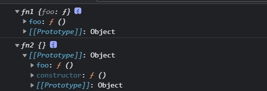

- 随着软件开发行业的不断发展，性能优化是不可避免的
- 哪些内容可以看做是性能优化？ 任何一种可以提高运行效率，降低运行开销的行为

# 第一部分

## JS内存管理

> 内存为什么需要管理？


从图中可以看出，该代码内存变化是持续升高的，这代表着内存泄漏。

如果我们编程时不够了解内存管理机制，就会导致我们会编写出一些不容易察觉到的内存问题性代码，带来一些意想不到的bug。


> 内存管理介绍

- 内存：由可读写单元组成，表示一片可操作空间
- 管理：人为的去操作一片空间的申请、使用和释放
- 内存管理：开发者主动申请空间、使用空间、释放空间
- 管理流程：申请 -- 使用 -- 释放

> JavaScript 中的内存管理

- 申请内存空间
- 使用内存空间
- 释放内存空间

```javascript
// memory management

// 申请空间
let obj = {}

// 使用
obj.name = 'lg'

// 释放，javaScript并没有直接释放的API
obj = null
```


## JS中的垃圾回收

- JavaScript中内存管理是自动的（没当我们去创建一个对象、数组、函数时，其都会自动的分配内存空间）
- 对象不再被引用时是垃圾（后续代码通过引用关系无法再找到某些对象时无法再找到某些对象）
- 对象不能从根上访问到时是垃圾（对象已经存在，但是代码中因为一些错误无法再找到对象）

- JavaScript会将垃圾自动回收

> JavaScript中的可达对象

- 可以访问到的对象就是可达对象（引用、作用域链）
- 可达的标准就是从**根出发**是否能够被找到
- JavaScript中的根就可以理解为是全局变量对象（全局执行上下文）

```javascript
// reference

// obj可以在根上被找到，所以obj是可达的
let obj = { name: 'xm' }    // xm的空间被obj对象引用了，所以对象空间中的数据也是可达的

let ali = obj   // xm的空间多了一次引用（引用数值变化）

obj = null  // xm对象仍然是可达对象，因为ali仍然引用xm对象空间
```


```javascript

function objGroup(obj1, obj2) {
    obj1.next = obj2
    obj2.prev = obj1

    return {
        o1: obj1,
        o2: obj2
    }
}

let obj = objGroup({ name: 'obj1' }, { name: 'obj2' })

console.log(obj)
```


<div class="info">

> 可以看到，由于obj在全局是可达的，而obj引用了obj1和obj2，obj1和obj2又相互引用，所以这些空间都是可达的。

</div>


<div class="info">

> 当我们删除了上方红色线的引用关系后，obj1就变为了不可达的了，此时其就会被当做垃圾回收掉。

</div>

<div class="success">

> 以上两张图说明，我们在编写代码时，会存在一些对象引用关系。我们可以从根进行查找，如果我们查找到对象的一些路径被破坏掉或被回收了，这样我们就没办法找到这些对象，此时它们就会被当做垃圾被垃圾回收机制回收掉。

</div>


## GC算法介绍

### JavaScript GC机制

概念定义：找出不再使用的变量，然后释放掉其占用的内存，但是这个过程不是实时的，因为其开销比较大，所以垃圾回收器会按照固定的时间间隔周期性的执行。

### GC定义与作用

- GC就是垃圾回收机制的简写
- GC可以找到内存中的垃圾、并释放和回收空间

> GC里的垃圾是什么？

- 程序中不再需要使用的对象

```javascript
function func(){
    name = 'lg'
    return `${name} is a coder`		// 此处的name在函数调用完后就不再需要使用它了，所以根据需求其应该被当做垃圾回收
}

func()
```


- 程序中不能再访问到的对象

```javascript
function func(){
    const name = 'lg'
    return `${name} is a coder`		// 此处的name函数调用完后，外部空间就不能再访问到它了，所以其也应该被当做垃圾回收。
}

func()
```


>  GC算法是什么？

- GC是一种机制，其内部的垃圾回收器可以完成具体的回收工作
- 工作的内容就是查找垃圾释放空间、回收空间
- 算法就是工作时查找和回收所遵循的规则

> 常见GC算法

- 引用计数
- 标记清除
- 标记整理
- 分代回收

> 什么时候触发GC？(看看就好)

&emsp;&emsp;垃圾回收周期性运行，如果分配的内存非常多，那么回收工作也会很艰巨，确定垃圾回收时间间隔就变成了一个值得思考的问题。IE6的垃圾回收是根据内存分配量运行的，当环境中存在256个变量、4096个对象、64K的字符串任意一种情况的时候就会触发垃圾回收器工作，看起来很科学，不用按一段时间就调用一次，有时候会没必要，这样按需调用不是很好嘛?但是如果环境中就是有这么多变量一直存在，现在脚本如此复杂，很正常，那么结果就是垃圾回收器一直在工作，这样浏览器就没法玩了。
&emsp;&emsp;微软在IE7中做了调整，触发条件不再是固定的，而是动态修改的，初始值和IE6相同，如果垃圾回收器回收的内存分配量低于程序占用内存的15%，说明大部分内存不可被回收，设的垃圾回收触发条件过于敏感，这时候把临界条件翻倍，如果回收的内存高于85%，说明大部分内存早就该清理了，这时候把触发条件置回。这样就使垃圾回收工作智能了很多。

> 一些要点

- JavaScript使用垃圾回收机制来自动管理内存，代码最终由JS引擎来完成执行，所以回收也由不同的平台决定
- GC回收内存，这句话中的内存一般指的是存放在堆空间的内存(引用类型存放位置)
- **代码执行时会不断的向执行栈当中加入不同的执行上下文**(函数调用)
- 某个执行上下文中的代码运行结束之后，原则上就会回收该上下文中所引用的堆内存空间(闭包例外)
- 当下执行JS的引擎不同，依据不同的算法又存在不同的回收时机，总体说，回收空间时就是GC工作时

### 引用计数算法

- 核心思想：在内部通过引用计数器，来维护引用数，判断当前引用数是否为0，来决定其是否为垃圾对象，当引用数为0时，CG开始工作，将其所在空间进行回收和释放再使用。
- 引用计数器：相对于其它GC算法，由于引用计数器的存在，使得引用计数在执行效率上与其它的技术算法存在差别。

- 某个对象的引用关系发生改变时，引用计数器会主动的修改当前对象的引用数值。
- 引用数值为0时立即回收。

```javascript
// 此处user1、user2、user3、nameList、num1、num2都是被挂载到winodw对象上，其引用计数肯定不是0

const user1 = { age: 11 }
const user2 = { age: 22 }
const user3 = { age: 33 }

const nameList = [user1.age, user2.age, user3.age]

function fn() {
    const num1 = 1
    const num2 = 2
}

fn()
```

```javascript
// reference count
// 此处user1、user2、user3、nameList都是被挂载到winodw对象上，其引用计数肯定不是0

const user1 = { age: 11 }
const user2 = { age: 22 }
const user3 = { age: 33 }

// 由于user1、user2、user3被nameList引用，所以即便执行一遍后，其引用计数仍不为0，不会被回收
const nameList = [user1.age, user2.age, user3.age]

function fn() {
    // 此处的num1、num2添加了const 修饰符，其在fn()调用后，引用计数变为0，GC会立即开始工作，将其作为垃圾回收
    const num1 = 1
    const num2 = 2
}

fn()
```

> 引用计数算法优点

- 发现垃圾时立即回收
- 最大限度减少程序暂停（避免内存栈满的情况发生）

> 引用计数算法缺点

- 无法回收循环引用的对象
- 时间开销大（其需要维护数值的变化、修改数值）

```javascript
function fn() {
    // 因为obj1和obj2为const常量，在函数调用完后全局引用链下找不到obj1和obj2，其的引用计数应该为0。但是其内部在互相引用，所以其引用计数并非为0
    // 此时引用计数算法就无法回收obj1和obj2
    const obj1 = {}
    const obj2 = {}

    obj1.name = obj2
    obj2.name = obj1

    return 'xxc'
}

fn()
```

> 引用计数是发现某参数引用为O就立即回收的话，是不是无需GC机制?或者说"“"发现为o"就是这个算法的Gc机制?

- 引用计数属于一种计算方法，整体来说属于GC工作流程中的一个环节
- GC是垃圾回收的简称，表示一件程序执行过程中要完成的事情
- 引用计数是完成这件事情的一种统计方法，用于统计哪些内容属于“垃圾"
- 引用计数发现某个变量引用数为0之后认定它是“垃圾”，GC机制开始工作，回收它占用的空间

### 标记清除算法

- 核心思想：将垃圾回收分为标记和清除两个阶段完成
- 标记阶段：遍历所有对象找标记活动对象（与可达对象类似）
- 清除阶段：遍历所有对象，清除没有标记对象，同时会清除标记阶段设置的标记，便于CG下次正常工作。
- 最终：回收相应的空间


<div class="success">

> &emsp;&emsp;从global中找到A、B、C三个可达对象，并通过递归的方式继续寻找可达对象（D、E），将它们做上标记。而a1和b1放在局部作用域中，查找不到，没有做标记，故其在清除阶段被清除，同时会将原先做的标记清除。
>
> ​		最终其会把回收的空间放到一个空闲列表中，方便程序后续去申请空间使用。

</div>

> 标记清除算法优点

- 可以解决对象循环引用的回收操作

> 标记清除算法缺点

- 会产生空间碎片化


任何空间都会有两个部分组成，一个用于存储该空间的源信息（大小、地址）【头】，还有一个专门用来存放数据【域】（回收时回收域中的值）。这就会导致因为回收的垃圾对象在地址上不连续，从而造成回收时它们分散在各个角落，若新的空间大于该域的空间，该空间就变得无法使用。

- 不能立即回收垃圾对象（遍历过程中即使发现对象是不可达的，也要等到最后才去清除。）

### 标记整理算法

- 标记整理可以看做是标记清除的增强
- 标记阶段的操作和标记清除一致
- 清除阶段会先执行整理，移动对象位置


> 标记整理优点

- 减少碎片化空间

> 标记整理缺点

- 不会立即回收垃圾对象


> 对于“标记整理"和“标记清除"算法，是否一次遍历即可标记所有可达对象?

- 一次看如何理解，因为这里可能需要递归查找
- 一次遍历不一定找到所有的可达对象
- 对象之间存在互相引用或者对象本身存在“子引用”


## V8

> V8是一款主流的JavaScript执行引擎，Chrome和Nodejs都是使用V8引擎高效执行JS代码。
>
> V8 采用的是即时编译，直接将源码转换为可以执行的机器码。
>
> V8 内存是设有上限的（64位1.5G，32位800M）。原因：1.V8本身是为浏览器制作的，现有内存对于网页应用来说是足够的。2.V8的垃圾回收机制决定了，再大的话其垃圾回收时间会超过用户的感知。


### V8垃圾回收策略

&emsp;&emsp;Js中数据分为基本数据和对象类型的数据，而基本数据是由程序语言自身进行控制的，所以回收主要指的是当前存活在堆区域的对象类型数据。

回收是离不开内存的，同时V8对内存做了上限，此种情况下，V8是如何对垃圾进行回收的？


- 采用**分代回收**的思想
- 内存分为新生代、老生代
- 针对不同对象（不同代）采用不同算法


> V8中常用GC算法

- 分代回收
- 空间复制
- 标记清除
- 标记整理
- 标记增量

### V8如何回收新生代对象


- V8内存空间一分为二
- 小空间用于存储新生代对象（32M|16M）
- 新生代指的是存活时间较短的对象（局部作用域中的对象）


新生代对象回收实现

- 回收过程采用复制算法 + 标记整理
- 首先将新生代内存区分为二个等大小空间
- 使用空间称为From，空闲空间称为To
- 活动对象存储于From空间，标记整理后将活动对象**拷贝**至To，清空From
- From与To交换空间完成释放


回收细节说明

- 拷贝过程中可能出现晋升（将新生代对象移动至老生代）。晋升条件：一轮GC还存活的新生代需要晋升，To空间的使用率超过25%（避免因为使用率过大将来与From交换时新内存无法存储）


### V8如何回收老生代对象

- 老生代对象存放在右侧老生代区域
- 老生代内存限制：64位操作系统1.4G，32位操作系统700M
- 老生代对象就是指存活时间较长的对象（全局对象下存在的变量、闭包存放的数据）


老生代对象回收实现

- 主要采用标记清除、标记整理、增量标记算法
- 首先使用标记清除完成垃圾空间的回收（主要使用标记清除，除非发生新生代存储要往老生代移动的情况，才会触发标记整理）
- 采用标记整理进行空间优化（当新生代存储要往老生代移动，而老生代空间不足以存储新生代移动的对象，此时就会触发标记整理）
- 采用增量标记进行效率优化


细节对比：

- 新生代区域垃圾回收使用空间换时间（每时每刻都有一个空闲空间存在，但新生代空间较小，故影响不大）
- 老生代区域垃圾回收不适合复制算法（空间大，数据多）


标记增量如何优化垃圾回收：


- 首先我们要知道：垃圾回收时会阻塞JS程序的执行。
- 标记增量的意思是，将原先一口气做完的垃圾回收改为，每次只遍历一层并标记（此处分为直接可达和间接可达，而我们先标记第一层的可达对象后就停止），让程序继续执行一会，再继续让GC机制做二步的标记操作。
- 等标记操作全部完成后，就正常的做垃圾回收操作，让程序暂停执行。
- 要注意，V8在内存达到1.5G时做非增量的垃圾回收也只花了不到1s，所以此种间断分割是合理的，将原先很长一段的垃圾回收时间拆分为了许多小段，对用户而言体验更好。
- 标记增量可以理解为基于标记整理、标记清除的基础之上做了改进。

> 老生代GC主要使用“标记清除"算法，那么什么时候进行内存整理？什么时候使用增量标记？

- 上面观点中已经认为增量标记是在"标记清除"和“标记整理""二个算法基础之上。
- 增量标记可以看做是V8引擎本身最终采用的一种优化后的GC算法，所以认为最终使用的都是增量标记
- 增量标记工作过程中需要用到的就是标记清除，增量标记主要是对于时间调度的制定

## Performance 工具

### 为什么使用Performance

- GC的目的是为了实现内存空间的良性循环
- 良性循环的基础的对内存的合理使用
- 但是ECMAScript并没有提供相应的操作内存空间的API，所以我们必须想办法时刻关注程序的内存变化
- 而Performance提供了多种监控方法，帮助我们对内存空间的监控操作。

### Performance使用步骤

1. 打开浏览器输入目标网址
2. 进入开发人员工具面板，选择性能
3. 开启录制功能，访问具体界面
4. 执行用户行为，一段时间后停止录制
5. 分析界面中记录的内存信息


### 内存问题的体现

- 页面出现延迟加载或经常性暂停（确保网络正常的前提）->频繁的垃圾回收出现，程序中有一些代码让内存瞬间爆掉

- 页面持续性出现糟糕的性能 -> 底层出现内存膨胀（当前页面为了达到最佳的使用速度申请的内存空间大小远超当前设备所能提供的内存空间大小）

- 页面的性能随时间延长越来越差 -> 内存泄漏

  [造成内存泄漏的原因](https://www.cnblogs.com/xxm980617/p/10885178.html)
  
  [实际开发中的内存泄漏问题](https://zhuanlan.zhihu.com/p/60538328)

### 监控内存的几种方式

> 界定内存问题的标准

- 内存泄漏：内存使用持续升高

- 内存膨胀：主要是由于设备问题，检查内存膨胀可以在多个设备上进行测试，若每个设备都有内存问题，就可以排除是内存膨胀的原因

- 频繁垃圾回收：通过内存变化图进行分析


> 监控内存的几种方式

- 浏览器任务管理器
- Timeline时序图记录
- **堆快照**查找分离DOM
- 判断是否存在频繁的垃圾回收（借助工具判断内存走势图）


#### 任务管理器监控内存

> 开启任务管理器快捷键：Shift + esc，可在任务管理器页面右键调用出JavaScript内存栏

任务管理器中可以查看到浏览器当前打开的所有页面及辅助工具的内存使用情况：


#### Timeline记录内存

> 很明显，任务管理器虽然可以判断当前脚本的内存是否存在问题，但是问题具体跟什么脚本有关，任务管理器就无法判断了。此时就需要Timeline记录内存的方式来判断当前内存问题跟哪些代码有关。

- 首先开启Performance录制，录制成功后出现下图，框中区域即为Timeline


<div class="base">

> 可以看到内存timeline有升有降，升代表请求内存，降代表GC垃圾回收。
>
> 同时，可以通过下图操作来定位问题代码块

</div>


<div class="info">

> 可以通过鼠标滚轮来进行timeline范围的扩大和缩小

</div>

#### 堆快照查找分离DOM

> 工作原理：找到JS堆，对其进行照片的留存，有了照片后，就可以看到里面的所有信息。
>
> 通过堆快照的功能，将分离DOM找出，并修改代码。

> 什么是分离DOM

- 界面元素存活在DOM树上
- 当DOM节点从DOM树上进行了脱离，而且在JS代码中没有人去引用DOM节点，其就变成了垃圾DOM
- 当DOM节点从DOM树上进行了脱离，而在JS代码中还在被引用，其就变成了分离DOM（界面上看不见，但内存中占据空间）


> 具体操作

1. 运行代码

```html
<!DOCTYPE html>
<html lang="en">

<head>
    <meta charset="UTF-8">
    <meta http-equiv="X-UA-Compatible" content="IE=edge">
    <meta name="viewport" content="width=device-width, initial-scale=1.0">
    <title>堆快照监控内存</title>
</head>

<body>
    <button id="btn">Add</button>

    <script type="text/javascript">
        var tmpEle

        function fn() {
            var ul = document.createElement('ul')
            for (var i = 0; i < 10; i++) {
                var li = document.createElement('li')
                ul.appendChild(li)
            }
            tmpEle = ul // 让ul被引用却不展现
        }

        document.getElementById('btn').addEventListener('click', fn)
    </script>
</body>

</html>
```

2. 打开浏览器控制台，选择内存 -> 堆快照 -> 拍摄快照


3. 在搜索栏中输入deta可以查看到快照中的分离dom。


4. 此后便可以修改代码，将分离dom代码去除。

#### 判断是否存在频繁GC

> 为什么需要确定频繁垃圾回收

- GC工作时应用程序是停止的
- 频繁且过长的GC会导致应用假死
- 用户使用中感知应用卡顿

> 如何确定频繁的垃圾回收

- Timeline中频繁的上升下降
- 任务管理器中数据频繁的增加减小

## 代码优化

### 代码优化介绍

> 如何精准测试JavaScript 性能

- 本质上就是采集大量的执行样本进行数学统计和分析
- 使用基本Benchmark.js的 https://jsperf.com/ 完成，目前该网站已停用。[此处建议改用jsbench](https://jsbench.me/)

###  慎用全局变量

> 为什么要慎用？

- 全局变量定义在全局执行上下文，是所有作用域链的顶端（按层级查找时，查找到全局变量会比较慢，降低了代码的执行效率）
- 全局执行上下文一直存在于上下文执行栈，直到程序退出才会消失（对GC工作不利）。
- 如果某个局部作用域出现了同名变量则会遮蔽或污染全局


<div class="success">

> 此处可以看到，当代码定义为局部变量时，单位时间内运行的次数是定义成全局变量的好几倍。

</div>


###  缓存全局变量

> 在程序执行中，将使用中无法避免的全局变量缓存到局部。


<div class="success">

> 此处可以看到，有设置缓存的情况会比没有设置缓存的情况要来的好一些。

</div>


### 通过原型新增方法

> 在原型对象上新增实例对象需要的方法




<div class="success">

> 可以看到，在原型对象上添加方法比直接在实例方法中添加方法的写法效率更高。

</div>

### 避开闭包陷阱

> 闭包特点

- 外部具有指向内部的引用
- 在“外”部作用域访问“内”部作用域的数据


> 关于闭包

- 闭包是一种强大的语法
- 闭包使用不当很容易出现内存泄漏
- 不要为了闭包而闭包

```html
<!DOCTYPE html>
<html lang="en">

<head>
    <meta charset="UTF-8">
    <meta http-equiv="X-UA-Compatible" content="IE=edge">
    <meta name="viewport" content="width=device-width, initial-scale=1.0">
    <title>闭包陷阱</title>
</head>

<body>
    <button id="btn">add</button>
    <script type="text/javascript">
        function foo() {
            // 下行代码中，此dom结点被el引用，除非el不再引用dom结点，否则该dom结点会一直存在
            var el = document.getElementById('btn')
            el.onclick = function () {  // 此处el的onclick事件触发后的回调函数与foo函数之间产生了跨作用域引用数据的情况，产生闭包
                console.log(el.id)
            }
            el=null	 // 通过此种方法解决闭包
        }
        foo()
    </script>
</body>

</html>
```

### 避免属性访问方法使用

- JS不需要属性的访问方法，所有属性都是外部可见的
- 使用属性访问方法只会增加一层重定义，对于当前的访问控制没有太多的意义


> 可以看到，属性访问方法的使用效率相比直接访问属性要差一些。

### For循环优化


> 可以看到，当我们把要遍历的数组结构的长度提前获取，可以节省一部分性能开销

### 采用最优循环方式


> 可以看到，在几种for循环中，forEach的性能最优，其次是普通的for循环，最后是for...in..

### 节点添加优化

> 对Web应用开发来说，DOM节点的操作是非常频繁的，而针对DOM的交互操作又是非常消耗性能的。
>
> 节点的添加操作必然会有回流和重绘，这两个操作对性能的消耗都是非常大的。


> 可以看到，当我们采用文档碎片的方式去添加节点，效率会比采用一般方式来的高。

### 克隆优化节点操作


> 可以看到，使用cloneNode的方式克隆节点比createElement产生新节点的效率高。

### 直接量替换Object操作

> 通过字面量的形式代替new的方式创建对象或数组


> 个人认为，虽然字面量的方式比第二种效率高，但我们可以在new的时候直接传参，效率最高。

# 第二部分

## 堆栈中代码执行流程


## 减少判断层级

- 原代码

```javascript
function doSomething(part, chapter) {
    const parts = ["ES2016", "工程化", "Vue", "React", "Node"]
    if (part) {
        if (parts.includes(part)) {
            console.log('属于当前课程')
            if (chapter > 5) {
                console.log('您需要提供 VIP 身份')
            }
        }
    } else {
        console.log('请确认模块信息')
    }
}

doSomething('ES2016', 6)
```

- 改善代码

```javascript
function doSomething(part, chapter) {
    const parts = ["ES2016", "工程化", "Vue", "React", "Node"]
    if (!part) {
        console.log('请确认模块信息')
        return
    }
    if (!parts.includes(part)) return
    console.log('属于当前课程')
    if (chapter > 5) {
        console.log('您需要提供 VIP 身份')
    }
}

doSomething('ES2016', 6)
```

- 性能比较


> 可以看到，当我们减少了判断的嵌套层级，性能能够提升很多。
>
> 此外 if-elseif-else这样的语句，如果elseif后面的值是固定的，此时改为switch-case，性能也能够得到提升。


## 减少作用域链查找层级

- 原代码

```javascript
var name = "xxc"

function foo() {
    name = 'xxc666' // 这里的name是属于全局的
    function baz() {
        var age = 38
        console.log(age)
        console.log(name)
    }
    baz()
}

foo()
```


- 改善代码

```javascript
var name = "xxc"

function foo() {
    var name = 'xxc666' // 这里的name是属于foo的
    function baz() {
        var age = 38
        console.log(age)
        console.log(name)
    }
    baz()
}

foo()
```


> 可以看到，因为改善写法减少了作用域链查找层级，使得其性能得到提升。但相比之下，其内存会占用更多，可是若其内部定义的数据没有被外部引用，当其执行完后就会出栈，所以其内存占用也只是暂时的。
>
> 总之选择空间还是时间，主要还是取决于产品特性。


## 减少数据读取次数

> JS中最常见的数据表示形式：
>
> 字面量、局部变量（存放于栈区，访问快）
>
> 数组元素、对象属性（需要靠引用关系找到其在堆中的位置，对象还要考虑查找原型链）
>
> 考虑到时间效率，我们应该尽可能减少对象成员的查找次数和属性的嵌套层级(嵌套深度)。
>
> 所以我们可以提前将对象属性缓存，方便后面的使用


##  字面量与构造式


> 当使用new的时候，相当于调用函数，做的事情会更多一些。而使用字面量时，相当于开辟了一个空间，我们只需要往里存数据。
>
> 下面再看看对基本数据类型而言，字面量与构造式的性能差别


> 可以看到两者相差一个数量级。


## 减少循环体活动

> 循环次数固定的情况下，循环体中的执行操作越多意味着执行效率越慢，反之效率越高
>
> 所以我们可以把循环过程中不变的数据抽离到循环体外部（类似数据缓存）


> 可以看到使用数据抽离的方式性能更快
>
> 接下来再将for循环与while循环进行性能对比


> 可以看到while比for要快，因为while循环中要做的事会比for少。

## 减少声明及语句数


> 在代码编译时，第一种写法语句多，要做词法分析、语法分析，然后再执行。而第二种写法只需要对ele做词法分析。这么看上面的代码消耗的时间会长一点。
>
> 所以针对那些不是每次都要用的数据，我们可以在使用的时候直接拿，而不需要对其做缓存。


> 第二种写法明显可以减少词法分析、语法分析的次数，所以其效率会更快。
>
> 但第二种写法不容易维护。

## 采用事件委托

```html
<body>
    <ul id="ul">
        <li>XXC</li>
        <li>18</li>
        <li>我为前端而活</li>
    </ul>
    <script type="text/javascript">
        var list = document.querySelectorAll('li')
        
        // 原始写法
        // function showTxt(ev) {
        //     console.log(ev.target.innerHTML)
        // }
        // for (let item of list) {
        //     item.onclick = showTxt
        // }

        // 事件委托
        var oUl = document.getElementById('ul')
        oUl.addEventListener('click', showTxt, true)
        function showTxt(ev) {
            var obj = ev.target
            if (obj.nodeName.toLowerCase() === 'li') {
                console.log(obj.innerHTML)
            }
        }
    </script>
</body>
```

> 事件委托的形式可以不用通过循环的方式给每个子元素添加事件，而是直接给父元素添加一次事件，明显会方便一些。
>
> 但事件委托要进行判断是否是子元素触发的事件。

## 组件化开发模式下的性能优化

[React组件性能优化](https://zhuanlan.zhihu.com/p/34632531)

[优化Vue组件的运行时性能](https://beyoursun.github.io/2018/10/21/Improve-Vue-Runtime-Performance/)