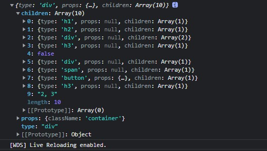

##  Virtual DOM 及 Diff 算法

### JSX 到底是什么

使用 React 就一定会写 JSX，JSX 到底是什么呢？它是一种 JavaScript 语法的扩展，React 使用它来描述用户界面长成什么样子。虽然它看起来非常像 HTML，但它确实是 JavaScript 。在 React 代码执行之前，Babel 会将 JSX 编译为 React API.

```react
<div className="container">
  <h3>Hello React</h3>
  <p>React is great </p>
</div>
```

以上 jsx 代码在执行前会被编译为以下代码，每一个节点都会被编译为React.createElement的调用：

```react
React.createElement(		// 第一个参数为 节点类型，第二个参数为 节点属性，第三个以后参数为 当前节点的子节点。
  "div",
  {
    className: "container"
  },
  React.createElement("h3", null, "Hello React"),
  React.createElement("p", null, "React is great")
);
```

从两种语法对比来看，JSX 语法的出现是为了让 React 开发人员编写用户界面代码更加轻松。

React.createElement 方法的作用是创建 Virtual DOM 对象（用 javascript 对象来描述 dom 对象信息的一种方式）。**React.createElement 的返回值就是 Virtual DOM。**

也就是说 我们写的 JSX 会先通过 React.createElement 转为 Virtual DOM 对象，然后 React 再将 Virtual DOM 对象转换为真实 DOM 对象，再将其显示到页面当中。我们才能在浏览器中见到相应页面。

[Babel REPL](https://babeljs.io/repl)

以下为 Babel REPL 编译前后 jsx 格式：


### DOM 操作问题

在现代 web 应用程序中使用 JavaScript 操作 DOM 是必不可少的，但遗憾的是它比其他大多数 JavaScript 操作要慢的多。

在没有Virtual DOM前，大多数 JavaScript 框架对于 DOM 的更新远远超过其必须进行的更新，从而使得这种缓慢操作变得更糟。

例如假设你有包含十项列表的页面，你仅仅更改了列表中的第一项，大多数 JavaScript 框架会重建整个列表，这比必要的工作要多十倍。

更新效率低下已经成为严重问题，为了解决这个问题，React 普及了一种叫做 Virtual DOM 的东西，Virtual DOM 出现的目的就是为了提高 JavaScript 操作 DOM 对象的效率。

### 什么是 Virtual DOM

在 React 中，每个 DOM 对象都有一个对应的 Virtual DOM 对象，它是 DOM 对象的 JavaScript 对象表现形式，其实就是使用 JavaScript 对象来描述 DOM 对象信息，比如 DOM 对象的类型是什么，它身上有哪些属性，它拥有哪些子元素。

可以把 Virtual DOM 对象理解为 DOM 对象的副本，但是它不能直接显示在屏幕上。

```react
<div className="container">
  <h3>Hello React</h3>
  <p>React is great </p>
</div>
```

```react
{
  type: "div",
  props: { className: "container" },
  children: [
    {
      type: "h3",
      props: null,
      children: [
        {
          type: "text",
          props: {
            textContent: "Hello React"
          }
        }
      ]
    },
    {
      type: "p",
      props: null,
      children: [
        {
          type: "text",
          props: {
            textContent: "React is great"
          }
        }
      ]
    }
  ]
}
```

### Virtual DOM 如何提升效率

精准找出发生变化的 DOM 对象，只更新发生变化的部分。

在 React 第一次创建 DOM 对象后，会为每个 DOM 对象创建其对应的 Virtual DOM 对象，在 DOM 对象发生更新之前，React 会先更新所有的 Virtual DOM 对象，然后 React 会将更新后的 Virtual DOM 和 更新前的 Virtual DOM 进行比较，从而找出发生变化的部分，React 会将发生变化的部分更新到真实的 DOM 对象中，React 仅更新必要更新的部分。

虽然在更新真实dom对象之前进行了更新 virtual dom 对象的操作以及对象对比的操作，但是 javascript 操作 javascript 的对象是很快的。

Virtual DOM 对象的更新和比较仅发生在内存中，不会在视图中渲染任何内容，所以这一部分的性能损耗成本是微不足道的。


```react
<div id="container">
	<p>Hello React</p>
</div>
```

```react
<div id="container">
	<p>Hello Angular</p>
</div>
```

```react
const before = {
  type: "div",
  props: { id: "container" },
  children: [
    {
      type: "p",
      props: null,
      children: [
        { type: "text", props: { textContent: "Hello React" } }
      ]
    }
  ]
}
```

```react
const after = {
  type: "div",
  props: { id: "container" },
  children: [
    {
      type: "p",
      props: null,
      children: [
        // react 经过层层比较，发现只有此处的textContent 发生了变化，所以只会将其更新到 真实dom 中
        { type: "text", props: { textContent: "Hello Angular" } }
      ]
    }
  ]
}
```

### 创建Virtual DOM 对象

实现创建 Virtual DOM 对象的方法之前，我们需要保证webpack 编译时使用我们所创建的方法，因此需要进行配置：


1. 在项目根目录中创建 **.babelrc**，写入配置：

```
{
    "presets":[
        "@babel/preset-env",
        [
            "@babel/preset-react",
            {
                "pragma":"TinyReact.createElement"	// 表示使用 TinyReact 中的 createElement 方法来编译jsx
            }
        ]
    ]
}
```

2. 创建 TinyReact/createElement.js，写入基本的 createElement 代码：

```react
export default function createElement(type, props, ...children) {
    return {
        type,
        props,
        children
    }
}
```

3. 在 TinyReact/index.js 中导入

```javascript
import createElement from './createElement'

export default {
    createElement
}
```

4. 在 index.js 中导入，并写入一段 jsx 语法，输出观察其编译后的格式：

```javascript
import TinyReact from './TinyReact'

const virtualDOM = (
    <div className="container">
        <h1>你好 Tiny React</h1>
        <h2>(编码必杀技)</h2>
        <div>
            嵌套1 <div>嵌套 1.1</div>
        </div>
        <h3>(观察: 这个将会被改变)</h3>
        {2 == 1 && <div>如果2和1相等渲染当前内容</div>}
        {2 == 2 && <div>2</div>}
        <span>这是一段内容</span>
        <button onClick={() => alert("你好")}>点击我</button>
        <h3>这个将会被删除</h3>
      2, 3
    </div>
)
console.log(virtualDOM)
```

结果如下：

