课程技术栈概览：

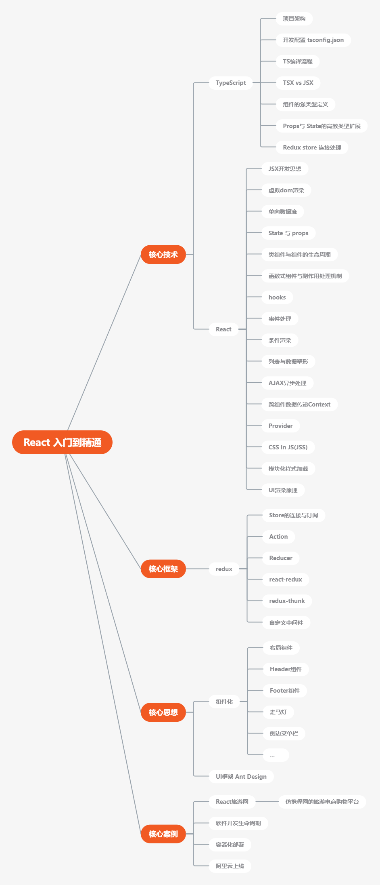


# 第二章

## 2-2 开始第一个React项目

1. npx 的含义：npx 是一个npm 的威力加强版，可以在不全局安装工具集的前题下，直接使用这些工具，在npm5.2+ 之后可以使用。在没有npx 之前，若要直接使用“create-reate-app”这个工具。必须得先通过 `npm install -g create-react-app`将工具全局安装到电脑中，然后再通过调用 `create-react-app`工具来创建react应用。而现在只需要使用npx ，输入 `npx create-react-app my-app`这一行命令，即可完成react 项目的创建。


## 2-4 使用create-react-app快速搭建React

1. package.json 中的"dependencies"存储了所有将会使用到的第三方组件，其中包含“react”、“react-dom”、"react-scripts"（create-react-app脚手架的核心部件，可以帮助我们自动构建、打包项目，同时自动加载类似babel的打包工具，可以将其理解为“webpack”傻瓜版）。

2. 在package.json的"scripts"属性中，可以看到四个命令：

   ```
   "scripts": {
       "start": "react-scripts start",		// 开启一个本地服务器，并将react项目托管到本地服务器中
       "build": "react-scripts build",		// 打包项目
       "test": "react-scripts test",		// 做单元测试
       "eject": "react-scripts eject"		// 弹出网站的配置文件，会对项目造成不可逆的结构性改变。执行命令前需要保证项目已提交git
     },
   ```

   这四个命令都是靠“react-scripts”进行调用的。

3. public 存放静态文件，而src存放项目源代码，其中包含了基于es6规则的react代码，其不能被浏览器直接执行。所以public与src中的代码都需要经过转化，转化为浏览器可以识别的，基于es5标准的代码。经过转化的代码，都会被打包放在一个新生成的build文件夹中。

4. jsx文件允许我们在javascript代码中使用类似html的写法来渲染页面，而且因为react的使用范围广，所以jsx代码可以直接写在js文件中，而不会报错。

   **src/App.js**

   ```javascript
   // 根据ES6 语法规则，我们可以通过import 语句将资源文件引入。在项目上线时，create-react-app 脚手架会通过调用底层打包工具webpack来读取每一个文件的import语句，通过分析每一个文件的文件依赖，来将所有的文件都打包、整合到一起。在打包过程中，还可对代码进行优化（代码压缩、资源整合等）。
   import logo from './logo.svg';
   import './App.css';
   
   function App() {
     // return 的这些代码即为jsx
     return (
       <div className="App">
         <header className="App-header">
           
           <p>
             Edit <code>src/App.js</code> and save to reload.
           </p>
           <a
             className="App-link"
             href="https://reactjs.org"
             target="_blank"
             rel="noopener noreferrer"
           >
             你好啊
           </a>
         </header>
       </div>
     );
   }
   
   export default App;
   ```

   上面的App函数在index.js 中进行了调用，以html元素的形式，插入到了 `root` 元素中。

   **src/index.js**

   ```javascript
   import React from 'react';
   import ReactDOM from 'react-dom';
   import App from './App';
   ...
   
   ReactDOM.render(
     <React.StrictMode>
       <App />
     </React.StrictMode>,
     document.getElementById('root')
   );
   ...
   ```

   `root`元素的位置在 `public/index.html` 中：

   ```html
   <body>
       <noscript>You need to enable JavaScript to run this app.</noscript>
       <div id="root"></div>
   </body>
   ```

   整个react项目都是从id为root 的div元素开始的，整个项目的html元素都会以javascript的方式动态插入生成，也就是 `Virtual DOM`。

   

#  第三章

## 3-3 React的前世今生

1. 在 jQuery 出现后的一段时间，网站变得越来越复杂，需求越来越多样化，这时jQuery所写的代码变得复杂，代码的维护成本也越来越高。于是人们开始考虑设计模式，到了2010年，第一代AngularJS带着MVC的设计理念横空出世，导致网站开发又出现了爆炸式发展。但是第一代AngularJS带着天生的缺陷，即：双向数据绑定。因为双向数据绑定，导致网站运行越来越缓慢，同时MVC架构也带来了页面状态管理混乱的问题。虽然因为以上问题其被历史抛弃了，但是它的设计思想保留了下来。及“组件化”。


2. 组件化旨在把网页拆成若干个独立的模块，使得组件可以被轻易复制和管理。于是随着组件化的思想，便诞生了 Angular(二代以上)、ReactJS、VueJS等一系列前端框架。同时也诞生了Flex、Redux、Mobx、Immutable、Observable(Rxjs)等一系列状态管理的思想。


3. React的设计理念

   - 单向数据流

     - 数据与界面绑定
     - 单向渲染
     - 就好像一个函数，同样的输入，同样的输出

   - 虚拟DOM

     - 类似Docker或VMware的Snapshot 快照技术（在JS和DOM之间增加了一个UI抽象层，如果真实的UI需要更新，React会对比这两个UI层的差距，最终以最小的代价更新原来的元素）

       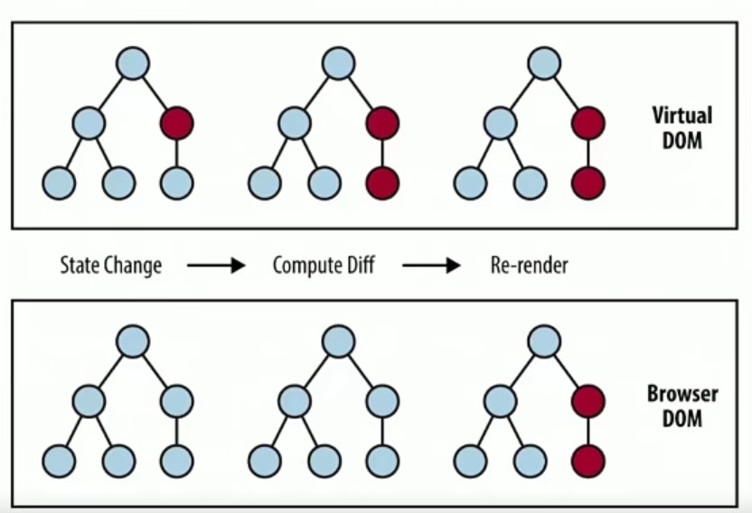

   - 组件化

     - 保持交互一致性
     - 保持视觉风格的统一
     - 便于程序员互相之间的协作


## 3-4 初识React函数式组件

1. 新建一个带有 typeScript 模板的react 项目：

```
npx create-react-app robot-gallery --template typescript

cd robot-gallery
code .   # 使用VSCode打开当前项目
```

2. 在TypeScript 的React 项目中，需要在tsconfig.json中添加如下配置，才可正常引入json文件：

```json
{
  "compilerOptions": {
    "moduleResolution": "node",		// 下一个条件的前提
    "resolveJsonModule": true,
  },
}
```

3. 搭建初始化结构

**components/Robot.tsx**

```react
import React from 'react'

// 这个接口的定义数据，实际上就是需要从父组件传递给当前组件的数据。组件间的数据传递，就是通过 props 来完成的
interface RobotProps{
    id:number,
    name:string,
    email:string
}

// FC = functional component 函数式组件
// 通过 ts 可以看到这个FC接口接收一个范型参数 P ，而这个 P 就是 props
// 范型类型是按需填写的，默认是一个空对象，当我们给函数加上类型以后，函数的参数 props 就不会报错了，而且也自动加载了 props 的类型
const Robot : React.FC<RobotProps> = ({id,name,email})=>{
    return (
    <li>
        
        <h2>{name}</h2>
        <p>{email}</p>
    </li>
    );
}

export default Robot;
```

**App.tsx**

```react
import React from 'react';
import './App.css';
import robots from './mockdata/robots.json'
import Robot from "./components/Robot"

// 此处的App 函数为一个函数式组件。其返回类型为 JSX元素 的函数。也就是说，只要其返回的值为一个合法的 JSX对象，其就是一个合法的React 组件
function App() {
  return (
    <ul>
      {robots.map(r=><Robot id={r.id} email={r.email} name={r.name}/>)}
    </ul>
  );
}

export default App;
```


## 3-5 JSX编程思维

1. React 中文件后缀该用 .js 还是 .jsx?

- JSX并不是标准的 js 语法
- 鼓励在 .js 文件里使用标准JS 语法；而React 语法用在 .jsx 文件中
- 不管是 jsx 文件还是原生的 js 文件，都没有办法在浏览器中直接运行。都需要通过 babel 转换为 es5 之下的代码。
- 使用 jsx 扩展名会更容易识别，更容易与其它代码区分。但是从兼容性来看，使用 js 文件扩展名会更加方便，可以统一处理，还不需要做额外的配置。
- 结论：使用 .jsx 或 .js 都可以
- 为了能在 react 中使用 typeScript，项目会统一使用 .tsx扩展名文件。


2. 为什么使用 JSX?

- React 并不强制使用 JSX，也可以使用原生 JavaScript，通过调用 React API，来完成 React 项目。

- React 认为视图的本质就是渲染逻辑与UI视图表现的内在统一
- React把HTML与渲染逻辑进行了耦合，形成了 JSX


3. JSX的特点

- 常规的HTML代码（h1、div、button等）都可以与JSX兼容
- 可以在 JSX 中嵌入表达式

```react
const name = 'Josh Perez';
const element = <h1>Hello,{name}</h1>
      
ReactDOM.render(
	element,
    document.getElementById('root')
);
```

```react
function formatName(user){
	return user.firstName + ' ' + user.lastName;
}

const user = {
	firstName:'Harper',
	lastName:'Perez'
};

const element = (
	<h1>
		Hello,{formatName(user)}!
	</h1>
);
```

- 使用 JSX 指定子元素

  - 假如一个标签里面没有内容，你可以使用 /> 来闭合标签，就像 XML 语法一样

  ```react
  const element = ;
  ```

  - 而 JSX 标签里也能够包含很多子元素

  ```react
  const element = (
  	<div>
          <h1>Hello!</h1>
          <h2>Good to see you here.</h2>
      </div>
  );
  ```

- JSX命名约定

  - 使用 camelCase（小驼峰）方式定义属性，例如：class 变为了className，而tabindex 则变为tabIndex

  ```react
  const element = <div className="element-style" tabIndex="0"></div>
  ```

  - jsx的自定义属性，以 data-开头

  ```react
  const element = <div data-customized={'自定义属性'}></div>;
  ```

  

- JSX本质为对象

  - JSX会被编译为 React.createElement() 对象，下面的左右两种写法效果一样

  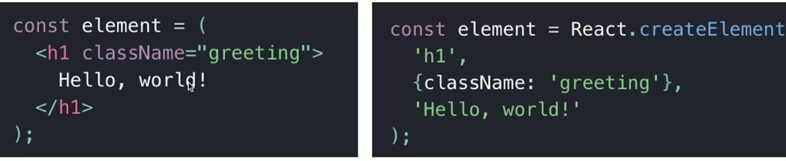

  - 最后输出的对象（这个对象被称作 React 元素）：

  ```react
  // 注意：这是简化过的结构
  const element = {
      type:'h1',
      props:{
          className:'greeting',
          children:'Hello,world!'
      }
  }
  ```

  

- 如何在 JSX 中防止注入攻击

  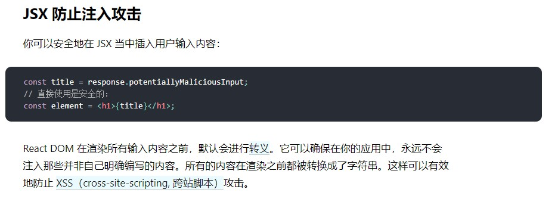

  - 如，当我们使用一个img标签攻击时，react 会将 img标签直接输出，而不会执行

    ```react
    import React from 'react';
    import './App.css';
    import robots from './mockdata/robots.json'
    import Robot from "./components/Robot"
    
    const html = ""
    
    function App() {
      return (
        <>
        <div>{html}</div>
        <ul>
          {robots.map(r=><Robot id={r.id} email={r.email} name={r.name}/>)}
        </ul>
        </>
      );
    }
    
    export default App;
    ```

    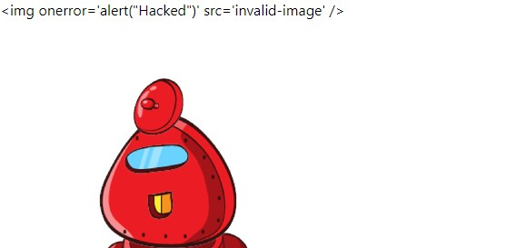

  - 但是仍可以通过函数的形式来进行攻击，如：

    ```react
    const jsHacked = "javascript:alert('Hacked!');"
    
    function App() {
      return (
        <>
        <a href={jsHacked}>My websit</a>
          ...
        </>
      );
    }
    ```

    

- TSX

  - 文件扩展名 .tsx
  - 在配置文件中 tsconfig.json 中启用 jsx 选项

  ```json
  {
    "compilerOptions": {
      "jsx": "react"
       // 共有5种选项：
       // preserve：生成的代码将会保留 jsx ，以供后续的转换以及操作(会输出带有jsx 扩展名的文件)
       // react：生成原生 js 文件，扩展名为 js
       // react-native：与preserve非常相似，其也保留了所有的 jsx 结构，但输出的文件名为js
       // react-jsx 与 react-jsxdev 为 react17以后引入的运行时配置，上层的接口与 preserve 类似。但是底层的代码转换发生了很大的变化。
    },
  }
  ```

  [react-jsx，react-jsxdev的官方说明](https://zh-hans.reactjs.org/blog/2020/09/22/introducing-the-new-jsx-transform.html)


## 3-6 配置React的CSS模组

1. 如何架构项目中的样式文件

   - 文件位置：css文件与component文件放在同一目录下

   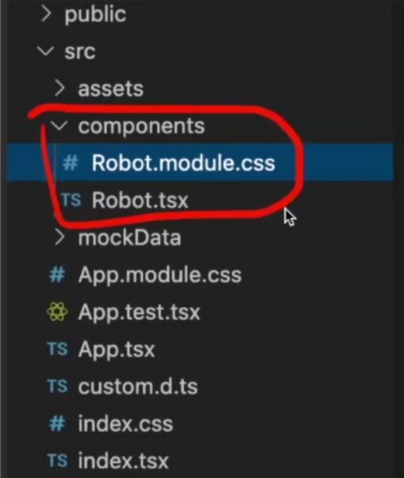

   - 命名规范： *.module.css

2. 全局css 文件配置

   - 在index.tsx中，我们可以看到其引入了 index.css，即从全局的角度引用了样式文件。

   ```react
   import './index.css';	
   ```

3. CSS module（模组化）

   - 每个jsx 或者 tsx 文件都会被视为一个独立存在的原件

   - 原件所包含的所有内容也同样都应该是独立存在的。若我们只是使用import 关键词来导入整个css 文件，将会直接引入整个文件，而不是按需加载。这样的处理极有可能对css 造成全局污染，或造成冲突，从而无法达到组件化的目的。

   - import './index.css'  ->  import style from './index.css'

   - 我们试着在 App.tsx 中以模块的形式来引入 css 文件，可以看到其产生了报错，因此我们需要给 css 文件加上类型的定义声明。

     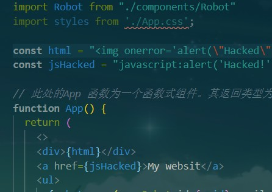

     - TS 的定义声明
       - *.d.ts
       - 只包含类型声明，不包含逻辑
       - 不会被编译、也不会被 webpack 打包
     - 新建 `custom.d.ts` 文件，为 css 文件添加定义声明（此时原先的css导入错误消失，之后我们便可通过访问对象的形式来获取样式）：

     ```typescript
     declare module "*.css" {        // 表示只要我们在 import 以css 为后缀的文件时，都会遵循以下的约定。这个约定的内容就是将会导出 key 所在的对象，而原始的类名和相应的值都会被转化为这个对象。
         const css: { [key: string]: string }
         export default css;
     }
     ```

     

   - 既然 css 需要作为模块被加载，css文件的命名也需要以module 为后缀，所以我们将原先的 `App.css` 其改为 `App.module.css`。这种命名规范是css模块化的命名规范，配合 typeScript 的话最好使用这种命名约定，否则可能会出现一些意外。

4. 为 App.tsx 添加样式：

**App.module.css**

```css
.app {
  text-align: center;
}

.appHeader {
  display: flex;
  flex-direction: row;
  align-items: center;
  justify-content: center;
  margin-top: 36px;
  margin-bottom: 24px;
}

.appLogo {
  height: 10vmin;
  pointer-events: none;
}

@media (prefers-reduced-motion: no-preference) {
  .appLogo {
    animation: App-logo-spin infinite 20s linear;
  }
}

.robotList {
	width: 85vw;
	display: grid;
	grid-template-columns: 1fr 1fr 1fr 1fr;
	grid-gap: 20px;
}

```


**App.tsx**

```react
import React from 'react';
import robots from './mockdata/robots.json'
import Robot from "./components/Robot"
import styles from './App.module.css';

function App() {
  return (
    <div className={styles.app}>
      <div className={styles.robotList}>
        {robots.map(r=><Robot id={r.id} email={r.email} name={r.name}/>)}
      </div>
    </div>
    );
}

export default App;
```

- 我们可以看到元素的 class 名称产生了变化。这是由import 模块生成了 javascript 对象，最后由javascript 对象动态注入的 css 样式。这便是 css in js（JSS）

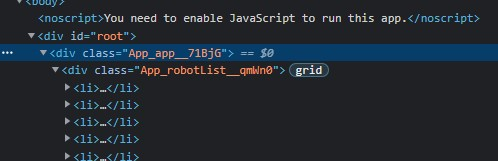

5. 小结

- 直接引入整个 css 文件（简单易用，但容易造成全局样式的污染、冲突）：

```javascript
import './index.css'
<div className='app' />
```

- JSS模块化引入组件（从本质上隔离了全局样式的污染，但是配置较为麻烦。同时由于class的名称是动态生成的，所以可能会对网站的调试产生一定的麻烦。但是从组件化的角度来看，使用第二种方式会更贴合react 组件独立的原则）

```javascript
import styles from './index.css'
<div className={styles.app}>
```


6. 配置css 对象提示功能

   1. 安装插件

   ```
   npm install typescript-plugin-css-modules --save-dev
   ```

   2. 在 tsconfig.json 中配置

   ```json
   {
     "compilerOptions": {
       ...
       "plugins": [
         {
         "name": "typescript-plugin-css-modules"
         }
       ]
     },
   }
   ```

   3. 在项目根目录中，新建 .vscode/setting.json，并写入如下配置（配置typescript 的 sdk）：

   ```json
   {
       "typescript.tsdk": "node_modules/typescript/lib",
       "typescript.enablePromptUseWorkspaceTsdk": true
   }
   ```

   ​		在弹出框中选择允许：

   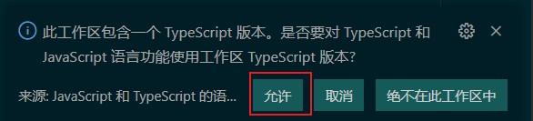

   4. 此时便可以看到css的对象提示

   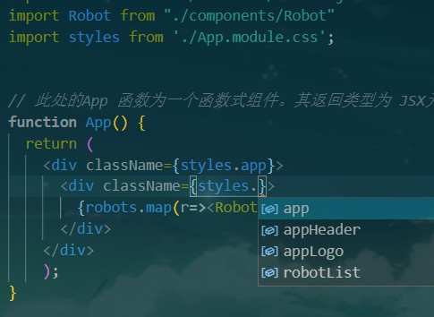


## 3-8 加载媒体与字体文件

1. create-react-app 在创建项目的初期，就已经在 webpack 中配置好了各种媒体资源的加载工具（各种媒体资源的 loader），如：

**App.tsx**

```react
import logo from './logo.svg'
```

​		虽然图片资源已经能够被加载了，但是从项目架构的角度，我们还需要对其进行一些优化。一般来说，网站的静态资源我们都会统一的保存在一个文件夹中，这样可以方便日后对齐进行统一管理。命名的约定一般使用单词“assets”

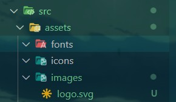

​		创建并移动好静态文件后，我们修改其的引入地址：

```react
import logo from './assets/images/logo.svg'
```

​		

为何引入 css 文件会报错，而引入 svg 文件不会报错？

​		这是因为 .svg 文件已经被react-scripts 定义好了

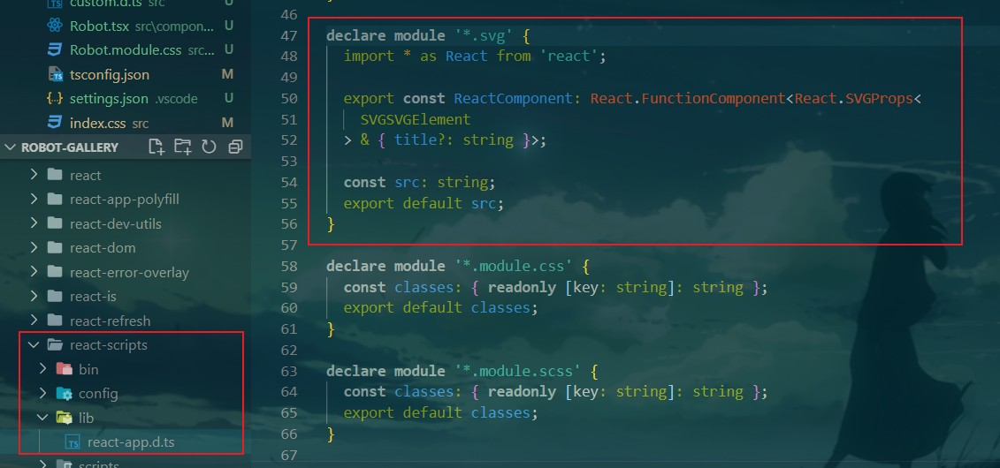


2. 配置字体文件

   1. 首先下载一个 ttf 结尾的字体文件。并将其复制到 `assets/fonts` 中：

   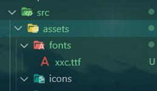

   2. 在 index.css 中引入字体文件

   ```css
   @font-face {
     font-family: 'xxc';
     src: local('xxc'),url(./assets/fonts/xxc.ttf);
   }
   ```

   3. 在 App.module.css 中使用字体文件

   ```css
   h1{
     font-family: 'xxc';
     font-size: 72px;
   }
   ```


## 3-9 创建class类组件

**components/ShoppingCart.jsx**

```react
import React from 'react';
import styles from './ShoppingCart.module.css'

// 描述数据的传递
interface Props {

}

// 表述组件自己的状态
interface State {
    isOpen: boolean
}

// 此处既可继承 PureComponent ，也可继承 Component,基础API与使用方式几乎相同，只是在组件生命周期的管理上略有不同。
class ShoppingCart extends React.Component<Props, State> {
    constructor(props: Props) {
        super(props);
        this.state = {
            isOpen: false,
        };
    }

    render() {
        return (
            <div className={styles.cartContainer}>
                <button className={styles.button} onClick={() => {
                    this.setState({ isOpen: !this.state.isOpen })
                }}>购物车2（件）</button>
                {/* 此处使用 inline-style */}
                <div className={styles.cartDropDown} style={{
                    display: this.state.isOpen ? "block" : "none"
                }}>
                    <ul>
                        <li>robot 1</li>
                        <li>robot 2</li>
                    </ul>
                </div>
            </div>
        );
    }
}

export default ShoppingCart;
```

使用组件：

**App.tsx**

```react
import ShoppingCart from './components/ShoppingCart'
...

function App() {
  return (
    <div className={styles.app}>
      <div className={styles.appHeader}>
        
        <h1>XXC的online购物平台</h1>
      </div>
      <ShoppingCart />
      <div className={styles.robotList}>
        {robots.map(r => <Robot id={r.id} email={r.email} name={r.name} />)}
      </div>
    </div >
  );
}
```


## 3-11 State vs Props

1. State 和 Props 的区别

- props 是组件对外的接口，而 state 是组件对内的接口
- props 用于组件间数据传递，而 state 用于组件内部的数据传递
- 组件便会根据 props 和 state 的数据变化来渲染 ui


2. state正确的打开方式

- state 是私有的，可以认为state是组件的“私有属性”

- 用 setState() 修改State

  - 直接修改 state，组件不会触发 render 函数，页面不会渲染

    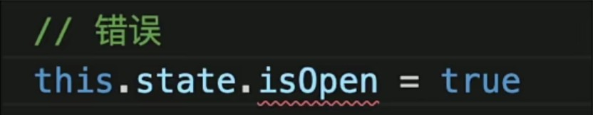

  - 正确的修改方式是使用 setState()，当我们调用 setState() 函数后，react 会更新组件的状态，并且会调用 render 函数重新渲染页面

    ```javascript
    onClick = {()=>{
        this.setState({ isOpen:!this.state.isOpen });
    }}
    ```

    

3. state 的初始化

- 构建函数 constructor 是唯一可以初始化state 的地方。一旦离开构建函数，则只可以通过 `setState` 来更改状态。

```javascript
// * 生命周期第一阶段：初始化
// 初始化组件 state
constructor(props){
    super(props);
    this.state = {
      robotGallery:[],
      count:0,
    };
}
```


4. State的更新是异步的

- 调用 setState 后，state 不会立刻改变，react 会优化执行时机，优化后会将多个 setState 状态更改合并为一次。因而setState是异步操作
- 所以我们不可以依赖当前的State，去计算下一个State。真正执行代码逻辑时，this.state 并不一定包含最新的变化。


5. Props

- 本质上，组件就是一个函数，而props 就是传入函数的参数，所以可以把 props 理解为从组件外部传入组件内部的数据。而因为 React 数据是单向流动的，所以props 也就是从父组件向子组件传递数据。
- 用法：

**父组件**

```react
<div className={styles.robotList}>
    {robots.map(r => <Robot id={r.id} email={r.email} name={r.name} />)}
</div>
```

**子组件**

```react
const Robot : React.FC<RobotProps> = ({id,name,email})=>{	// 接收props 参数并进行解构
    return (
    <div className={styles.cardContainer}>
        
        <h2>{name}</h2>
        <p>{email}</p>
    </div>
    );
}
```


- props 全都是只读的（Immutable）
  - 对象一旦创建就不可改变，只能通过销毁、重建来改变数据
  - 可通过判断内存地址是否一致，来确认对象是否有经过修改


## 3-12 React Event 事件处理

1. 虽然在 jsx 文件中，所有的事件都是基于 React 的，但是 React 只是将原生的 js 事件在原生的基础上再次进行了封装。这种处理方式使得 react 事件与传统事件的处理过程几乎没有区别。我们仍可以通过 e.nativeEvent 来访问原生的 html 事件。

2. 添加点击事件

**components/ShoppingCart.tsx**

```javascript
import React from 'react';
import styles from './ShoppingCart.module.css'
import { FiShoppingCart } from 'react-icons/fi';        // 需要先通过 npm install react-icons 安装这个模块

// 描述数据的传递
interface Props {

}

// 表述组件自己的状态
interface State {
    isOpen: boolean
}

// 此处既可继承 PureComponent ，也可继承 Component,基础API与使用方式几乎相同，只是在组件生命周期的管理上略有不同。
class ShoppingCart extends React.Component<Props, State> {
    constructor(props: Props) {
        super(props);
        this.state = {
            isOpen: false,
        };
        // this.handleClick = this.handleClick.bind(this)
    }

    // 在默认情况下，ts不支持 any 类型在参数中自动开启映射，我们需要显示的指明
    // 要开启 any 类型的映射，可以在 tsconfig.json 中进行 配置："noImplicitAny": false,
    handleClick = (e: React.MouseEvent<HTMLButtonElement, MouseEvent>) => {		// 此处的类型可以通过点击下方onClick来进行获取
        // 在 handleClick 函数中，this 指向的是 handleClick 函数本身，而不是 shoppingCart 类。因此我们可以使用箭头函数来保证 this 指向当前类
        // 也可以通过 在 constructor 中使用 bind 函数来改变 this 指向，不过推荐使用箭头函数


        // e 中的两个关键属性： target：用于描述事件发生的元素  currentTarget：用于描述事件处理绑定的元素
        // 如：当我们点击"购物车文字的 span"时，target 为“<span>购物车2（件）</span>”，而currentTarget 为 <button ...>...</button>
        if ((e.target as HTMLElement).nodeName === 'SPAN') {
            this.setState({ isOpen: !this.state.isOpen })
        }
    }

    render() {
        return (
            <div className={styles.cartContainer}>
                <button className={styles.button} onClick={this.handleClick}>
                    <FiShoppingCart />
                    <span>购物车2（件）</span>
                </button>
                {/* 此处使用 inline-style */}
                <div className={styles.cartDropDown} style={{
                    display: this.state.isOpen ? "block" : "none"
                }}>
                    <ul>
                        <li>robot 1</li>
                        <li>robot 2</li>
                    </ul>
                </div>
            </div>
        );
    }
}

export default ShoppingCart;
```

