## 创建基于 Serverless 的 Egg 项目 配置

要想配置 基于 Serverless 的 Egg 项目，得遵循以下步骤：

1. 选中要创建项目的文件夹 打开命令行，输入 **serverless**，并进行如下选择操作：

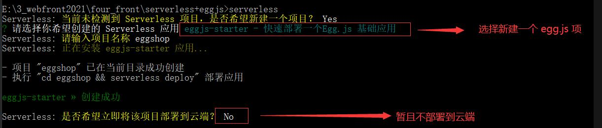

2. 用 VSCode 打开 serverless 新建的项目。在 **`serverless.yml`** 中 添加 上传排除项

```yaml
component: http
name: eggDemo
inputs:
  src:
    src: ./
    exclude:
      - .env
      - .git
      - node_modules
  faas:
    runtime: Nodejs12.16
    framework: egg
    name: '${name}'
  apigw:
    protocols:
      - http
      - https
app: eggshop
```

3. 上传项目（上传前可以先进行 `npm run dev` 调试，确保项目可允许）

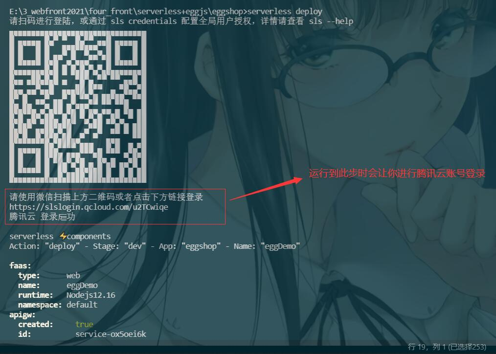

4. 打开腾讯云中上传成功项目，点击项目的云函数，在 函数代码中配置 自动安装依赖，并点击部署

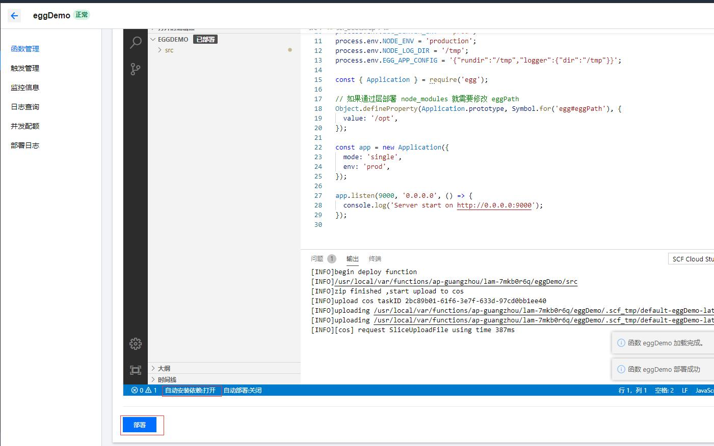

5. 在本地创建 **控制器** 及配置 **对应路由**

考虑到项目中所用控制器过多，此处将它们进行分组：

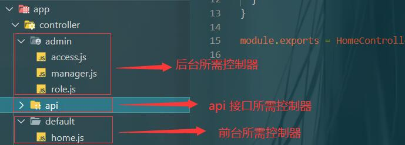

**`admin/access.js`**

```javascript
'use strict';

const Controller = require('egg').Controller;

class AccessController extends Controller {
    async index() {
        await this.ctx.render('admin/access/index', {})
    }
    async add() {
        await this.ctx.render('admin/access/index', {})
    }
    async edit() {
        this.ctx.body = "权限 修改"
    }
    async delete() {
        this.ctx.body = "权限 删除"
    }
}

module.exports = AccessController;
```

**`admin/manager.js`**

```javascript
'use strict';

const Controller = require('egg').Controller;

class ManagerController extends Controller {
    async index() {
        await this.ctx.render('admin/manager/index', {})
    }
    async add() {
        await this.ctx.render('admin/manager/add', {})
    }
    async edit() {
        this.ctx.body = "管理员 修改"
    }
    async delete() {
        this.ctx.body = "管理员 删除"
    }
}

module.exports = ManagerController;
```

**`admin/role.js`**

```javascript
'use strict';

const Controller = require('egg').Controller;

class RoleController extends Controller {
    async index() {
        await this.ctx.render('admin/role/index', {})
    }
    async add() {
        await this.ctx.render('admin/role/add', {})
    }
    async edit() {
        this.ctx.body = "角色 修改"
    }
    async delete() {
        this.ctx.body = "角色 删除"
    }
}

module.exports = RoleController;
```

**`default/home.js`**

```javascript
'use strict'

const Controller = require('egg').Controller

class HomeController extends Controller {
  async index() {
    const { ctx } = this

    await ctx.render('default/index.html', {
      msg: 'hi, egg'
    })
  }
}

module.exports = HomeController
```

在 router.js 中进行路由及 对应控制器 对应关系的编写：

**`router.js`**

```javascript
'use strict'

/**
 * @param {Egg.Application} app - egg application
 */
module.exports = (app) => {
  const {
    router,
    controller,
    config: { apiPrefix }
  } = app
  router.get('/', controller.default.home.index)

  router.get('/admin/manager', controller.admin.manager.index)
  router.get('/admin/manager/add', controller.admin.manager.add)
  router.get('/admin/manager/edit', controller.admin.manager.edit)
  router.get('/admin/manager/delete', controller.admin.manager.delete)

  router.get('/admin/role', controller.admin.role.index)
  router.get('/admin/role/add', controller.admin.role.add)
  router.get('/admin/role/edit', controller.admin.role.edit)
  router.get('/admin/role/delete', controller.admin.role.delete)

  router.get('/admin/access', controller.admin.access.index)
  router.get('/admin/access/add', controller.admin.access.add)
  router.get('/admin/access/edit', controller.admin.access.edit)
  router.get('/admin/access/delete', controller.admin.access.delete)
}
```

6. 安装 **`egg-view-ejs`** 模块，并进行配置。

`cnpm i egg-view-ejs --save`

**`config/plugin.js`**

```javascript
module.exports = {
    ...
  ejs: {
    enable: true,
    package: 'egg-view-ejs',
  }
}
```

**`config/config.default.js`**

```javascript
const userConfig = {
    view: {
        mapping: {
            '.html': 'ejs'
        }
    }
}
```

7. 创建 后台项目对应的 模板文件

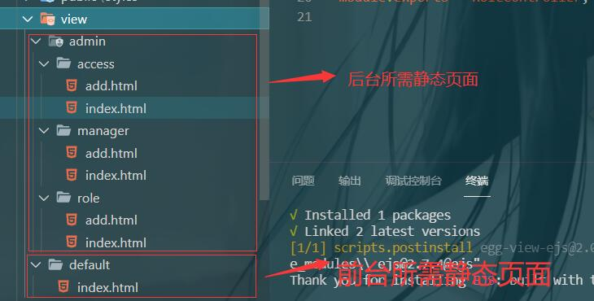

## Eggjs 后台管理系统静态页面渲染、配置 局部刷新架构

下面所使用的 前台页面及静态资源 事先准备好了


1. 首先将项目静态文件引入

在 public 文件中新建 admin 文件夹 与 default 文件夹，将静态文件移入到 admin 文件夹中：

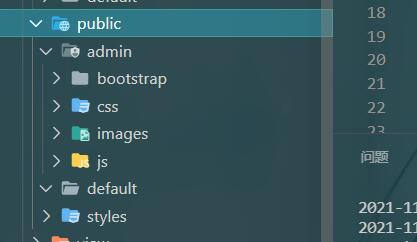

2. 将 login.html 移入到 view 根目录下，并修改 文件中静态文件引入路径，在所有路径前加入 `/public/admin`

**`login.html`**

```html
<!DOCTYPE HTML PUBLIC "-//W3C//DTD HTML 4.01 Transitional//EN" "http://www.w3.org/TR/html4/loose.dtd">
<html>

<head>
    <title>用户登录</title>

    <!-- 此处 public 前需要加 ‘/’ -->
    <link rel="stylesheet" href="/public/admin/css/login.css">
</head>

<body>
    <div class="container">
        <div id="login">
            <form action="/yuqing/admin.php?m=Public&amp;a=login" method="post" id="myform">
                <input type="hidden" name="ajaxlogin" id="ajaxlogin">
                <input type="hidden" name="ajaxcode" id="ajaxcode">
                <div class="l_title">后台管理系统</div>
                <dl>
                    <dd>管理员姓名：<input class="text" type="text" name="username" id="username"></dd>
                    <dd>管理员密码：<input class="text" type="password" name="password" id="password"></dd>
                    <dd>验　证　码：<input id="verify" type="text" name="verify">
                        
                    </dd>
                    <dd><input type="submit" class="submit" name="dosubmit" value=""></dd>
                </dl>
            </form>
        </div>
    </div>

</body>

</html>
```

3. 在 **`controller/admin/login.js`** 配置登录页面对应的控制器渲染：

```javascript
'use strict';

const Controller = require('egg').Controller;

class LoginController extends Controller {
    async index() {
        await this.ctx.render('admin/login', {})
    }
}

module.exports = LoginController;
```

4. 在 router.js 中配置对应路由

```javascript
router.get('/admin/login', controller.admin.login.index)
```

配置完 登录页面后，接着配置欢迎页。

5. 在 **`controller/admin/main.js`** 写入如下代码：

```javascript
'use strict';

const Controller = require('egg').Controller;

class MainController extends Controller {
    async index() {
        this.ctx.body = '后台管理中心'
    }
    async welcome() {
        this.ctx.body = '欢迎进入 egg serverless 后台管理中心'
    }
}

module.exports = MainController;
```

在 **`router.js`** 中配置对应路由

```javascript
router.get('/admin', controller.admin.main.index)

router.get('/admin/welcome', controller.admin.main.welcome)
```

配置完欢迎页后，接着配置 管理员列表及 增加管理员页面

6. 在 **`view/admin/manager/add.html`** 及 **`view/admin/manager/index.html`** 中粘贴如下代码，同时修改 静态资源文件路径

**`view/admin/manager/add.html`**

```html
<!DOCTYPE html>
<html lang="en">

<head>
    <meta charset="UTF-8">
    <title></title>
</head>

<body>
    <!--The content below is only a placeholder and can be replaced.-->

    <link rel="stylesheet" href="/public/admin/bootstrap/css/bootstrap.css">

    <link rel="stylesheet" href="/public/admin/css/basic.css">

    <script type="text/javascript" src="/public/admin/bootstrap/js/jquery-1.10.1.js"></script>

    <script type="text/javascript" src="/public/admin/js/base.js"></script>


    <nav class="navbar navbar-inverse" role="navigation">
        <div class="container-fluid">
            <div class="navbar-header">

                

            </div>
            <div class="collapse navbar-collapse" id="example-navbar-collapse">
                <ul class="nav navbar-nav navbar-right">
                    <li><a>欢迎您,admin</a>
                    </li>
                    <li><a href="#">安全退出</a>
                    </li>
                </ul>
            </div>
        </div>
    </nav>


    <div class="container-fluid">
        <div class="row">
            <div class="col-sm-2">
                <ul class="aside">

                    <li>
                        <h4>管理员管理</h4>

                        <ul>
                            <li class="list-group-item"> <a href="/"> 管理员列表</a></li>

                            <li class="list-group-item"> <a href="/add">增加管理员</a></li>
                        </ul>
                    </li>
                    <li>
                        <h4>分类管理</h4>
                        <ul>
                            <li class="list-group-item"> <a href="/"> 商品分类列表</a></li>

                            <li class="list-group-item"> <a href="/add">增加商品分类</a></li>
                        </ul>
                    </li>
                    <li>
                        <h4>商品管理</h4>

                        <ul>
                            <li class="list-group-item"> <a href="/"> 商品列表</a></li>

                            <li class="list-group-item"> <a href="/add">增加商品</a></li>
                        </ul>
                    </li>

                    <li>
                        <h4>轮播图管理</h4>

                        <ul>
                            <li class="list-group-item"> <a href="/">轮播图列表</a></li>

                            <li class="list-group-item"> <a href="/add">轮播图商品</a></li>
                        </ul>
                    </li>

                </ul>

            </div>
            <div class="col-sm-10">

                <div class="panel panel-default">
                    <div class="panel-heading">
                        增加商品
                    </div>
                    <div class="panel-body">
                        <div class="table-responsive input-form">
                            <form action="/doAdd" method="post">
                                <ul>
                                    <li> 商品名称: <input type="text" name="title" /></li>

                                    <li> 商品图片: <input type="file" name="pic" /></li>
                                    <li> 商品价格: <input type="text" name="price" /></li>
                                    <li> 商品邮费: <input type="text" name="fee" /></li>

                                    <li>
                                        商品描述:
                                        <textarea name="description" id="" cols="60" rows="8"></textarea>
                                    </li>

                                    <li>
                                        <br />
                                        <button type="submit" class="btn btn-default">提交</button>
                                    </li>

                                </ul>


                            </form>
                        </div>
                    </div>


                </div>

            </div>
        </div>
    </div>

</body>

</html>
```

**`view/admin/manager/index.html`**

```html
<!DOCTYPE html>
<html lang="en">

<head>
    <meta charset="UTF-8">
    <title></title>
</head>

<body>
    <!--The content below is only a placeholder and can be replaced.-->

    <link rel="stylesheet" href="/public/admin/bootstrap/css/bootstrap.css">

    <link rel="stylesheet" href="/public/admin/css/basic.css">

    <script type="text/javascript" src="/public/admin/bootstrap/js/jquery-1.10.1.js"></script>

    <script type="text/javascript" src="/public/admin/js/base.js"></script>


    <nav class="navbar navbar-inverse" role="navigation">
        <div class="container-fluid">
            <div class="navbar-header">
                
            </div>
            <div class="collapse navbar-collapse" id="example-navbar-collapse">
                <ul class="nav navbar-nav navbar-right">
                    <li><a>欢迎您,admin</a>
                    </li>
                    <li><a href="#">安全退出</a>
                    </li>
                </ul>
            </div>
        </div>
    </nav>


    <div class="container-fluid">
        <div class="row">
            <div class="col-sm-2">
                <ul class="aside">

                    <li>
                        <h4>管理员管理</h4>

                        <ul>
                            <li class="list-group-item"> <a href="/"> 管理员列表</a></li>

                            <li class="list-group-item"> <a href="/add">增加管理员</a></li>
                        </ul>
                    </li>
                    <li>
                        <h4>分类管理</h4>
                        <ul>
                            <li class="list-group-item"> <a href="/"> 商品分类列表</a></li>

                            <li class="list-group-item"> <a href="/add">增加商品分类</a></li>
                        </ul>
                    </li>
                    <li>
                        <h4>商品管理</h4>

                        <ul>
                            <li class="list-group-item"> <a href="/"> 商品列表</a></li>

                            <li class="list-group-item"> <a href="/add">增加商品</a></li>
                        </ul>
                    </li>

                    <li>
                        <h4>轮播图管理</h4>

                        <ul>
                            <li class="list-group-item"> <a href="/">轮播图列表</a></li>

                            <li class="list-group-item"> <a href="/add">轮播图商品</a></li>
                        </ul>
                    </li>

                </ul>


            </div>
            <div class="col-sm-10">

                <div class="panel panel-default">
                    <div class="panel-heading">
                        搜索
                    </div>
                    <div class="panel-body">
                        <form role="form" class="form-inline">
                            <div class="form-group">
                                <label for="name">名称</label>
                                <input type="text" class="form-control" id="name" placeholder="请输入名称">
                            </div>

                            <div class="form-group">
                                <button type="submit" class="btn btn-default">开始搜索</button>
                            </div>
                        </form>
                    </div>
                </div>
                <!--
                列表展示
            -->
                <div class="table-responsive">
                    <table class="table table-bordered">
                        <thead>
                            <tr class="th">
                                <th>编号</th>
                                <th>图标</th>
                                <th>名称</th>
                                <th>价格</th>
                                <th>邮费</th>

                                <th class="text-center">操作</th>
                            </tr>
                        </thead>
                        <tbody>

                            <tr>
                                <td>1</td>
                                <td>图标</td>
                                <td>背包1111111</td>
                                <td>20元</td>
                                <td>10元</td>

                                <td class="text-center">修改 删除</td>
                            </tr>
                            <tr>
                                <td>2</td>
                                <td>图标</td>
                                <td>thinpad笔记本电脑</td>
                                <td>20元</td>
                                <td>10元</td>

                                <td class="text-center">修改 删除</td>
                            </tr>
                            <tr>
                                <td>3</td>
                                <td>图标</td>
                                <td>iphone7</td>
                                <td>20元</td>
                                <td>10元</td>

                                <td class="text-center">修改 删除</td>
                            </tr>

                        </tbody>
                    </table>
                </div>

            </div>
        </div>
    </div>

</body>

</html>
```

 

7. 从以上两块我们可以看到，不同页面中有一些共同的部分，我们可以将其抽离出来，再用 ejs 语法引入，达到复用的效果。同时，为了实现 局部刷新 功能，我们可以 为 **`view/main/index.html`** 创建导航栏与侧边栏，然后在侧边栏的 右侧以一个 **iframe** 标签展示其它页面。要实现这一效果，我们得为 **页面头部部分** 创建两个 公共模块，一个用于 只引入文件（给iframe 中显示页面使用，以保证样式的引入），另一个引入文件的同时还要 渲染导航栏结构（给main/index.html 使用）。

新建 **`view/public/page_aside.html`** 、 **`view/public/page_header.html`**与 **`view/public/page_nav.html`**，作为公共模块文件：

**`view/public/page_aside.html`**

```html
<ul class="aside">

    <li>
        <h4>管理员管理</h4>

        <ul>
            <li class="list-group-item"> <a href="/admin/manager" target="rightMain"> 管理员列表</a></li>

            <li class="list-group-item"> <a href="/admin/manager/add" target="rightMain">增加管理员</a></li>
        </ul>
    </li>
    <li>
        <h4>角色管理</h4>
        <ul>
            <li class="list-group-item"> <a href="/admin/role" target="rightMain"> 角色列表</a></li>

            <li class="list-group-item"> <a href="/admin/role/add" target="rightMain">增加角色</a></li>
        </ul>
    </li>

</ul>
```

 **`view/public/page_header.html`**

```html
<!DOCTYPE html>
<html lang="en">

<head>
    <meta charset="UTF-8">
    <title>egg后台管理系统</title>
</head>

<body>
    <!--The content below is only a placeholder and can be replaced.-->

    <link rel="stylesheet" href="/public/admin/bootstrap/css/bootstrap.css">

    <link rel="stylesheet" href="/public/admin/css/basic.css">

    <script type="text/javascript" src="/public/admin/bootstrap/js/jquery-1.10.1.js"></script>

    <script type="text/javascript" src="/public/admin/js/base.js"></script>

    <nav class="navbar navbar-inverse" role="navigation">
        <div class="container-fluid">
            <div class="navbar-header">
                
            </div>
            <div class="collapse navbar-collapse" id="example-navbar-collapse">
                <ul class="nav navbar-nav navbar-right">
                    <li><a>欢迎您,admin</a>
                    </li>
                    <li><a href="#">安全退出</a>
                    </li>
                </ul>
            </div>
        </div>
    </nav>
```

**`view/public/page_nav.html`**

```html
<!DOCTYPE html>
<html lang="en">

<head>
    <meta charset="UTF-8">
    <title>egg后台管理系统</title>
</head>

<body>
    <!--The content below is only a placeholder and can be replaced.-->

    <link rel="stylesheet" href="/public/admin/bootstrap/css/bootstrap.css">

    <link rel="stylesheet" href="/public/admin/css/basic.css">

    <script type="text/javascript" src="/public/admin/bootstrap/js/jquery-1.10.1.js"></script>

    <script type="text/javascript" src="/public/admin/js/base.js"></script>
```

首先在 **`view/main/index.html`** 中引入 侧边栏及 导航 的公共模块，并为其定义一个iframe标签，用于展示其它页面：

```html
<% include ../public/page_header.html %>


    <div class="container-fluid">
        <div class="row">
            <div class="col-sm-2">
                <% include ../public/page_aside.html %>
            </div>
            <div class="col-sm-10">
                <iframe name="rightMain" src="/admin/welcome" frameborder="false" scrolling="auto" width="100%"
                    height="500"></iframe>
            </div>
        </div>
    </div>

    </body>

    </html>
```

然后在  **`view/admin/manager/add.html`** 及 **`view/admin/manager/index.html`**  中引入 **`view/public/page_nav.html`**，用于加载样式：

  **`view/admin/manager/add.html`** :

```html
<% include ../public/page_nav.html %>

    <div class="container-fluid">
        <div class="row">
            <div class="col-sm-12">

                <div class="panel panel-default">
                    <div class="panel-heading">
                        增加管理员
                    </div>
                    <div class="panel-body">
                        <div class="table-responsive input-form">
                            <form action="/doAdd" method="post">
                                <ul>
                                    <li> 商品名称: <input type="text" name="title" /></li>

                                    <li> 商品图片: <input type="file" name="pic" /></li>
                                    <li> 商品价格: <input type="text" name="price" /></li>
                                    <li> 商品邮费: <input type="text" name="fee" /></li>

                                    <li>
                                        商品描述:
                                        <textarea name="description" id="" cols="60" rows="8"></textarea>
                                    </li>

                                    <li>
                                        <br />
                                        <button type="submit" class="btn btn-default">提交</button>
                                    </li>

                                </ul>


                            </form>
                        </div>
                    </div>
                </div>
            </div>
        </div>
    </div>

    </body>

    </html>
```

**`view/admin/manager/index.html`** 

```html
<% include ../public/page_nav.html %>


    <div class="container-fluid">
        <div class="row">
            <div class="col-sm-12">

                <div class="panel panel-default">
                    <div class="panel-heading">
                        搜索管理员
                    </div>
                    <div class="panel-body">
                        <form role="form" class="form-inline">
                            <div class="form-group">
                                <label for="name">名称</label>
                                <input type="text" class="form-control" id="name" placeholder="请输入名称">
                            </div>

                            <div class="form-group">
                                <button type="submit" class="btn btn-default">开始搜索</button>
                            </div>
                        </form>
                    </div>
                </div>
                <!--
                列表展示
            -->
                <div class="table-responsive">
                    <table class="table table-bordered">
                        <thead>
                            <tr class="th">
                                <th>编号</th>
                                <th>图标</th>
                                <th>名称</th>
                                <th>价格</th>
                                <th>邮费</th>

                                <th class="text-center">操作</th>
                            </tr>
                        </thead>
                        <tbody>

                            <tr>
                                <td>1</td>
                                <td>图标</td>
                                <td>背包1111111</td>
                                <td>20元</td>
                                <td>10元</td>

                                <td class="text-center">修改 删除</td>
                            </tr>
                            <tr>
                                <td>2</td>
                                <td>图标</td>
                                <td>thinpad笔记本电脑</td>
                                <td>20元</td>
                                <td>10元</td>

                                <td class="text-center">修改 删除</td>
                            </tr>
                            <tr>
                                <td>3</td>
                                <td>图标</td>
                                <td>iphone7</td>
                                <td>20元</td>
                                <td>10元</td>

                                <td class="text-center">修改 删除</td>
                            </tr>

                        </tbody>
                    </table>
                </div>

            </div>
        </div>
    </div>

    </body>

    </html>
```

然后再用同样的方法创建 view/role/index.html 及 view/role/add.html 。


最后修改一下控制器 代码：

```javascript
// admin/main.js
'use strict';

const Controller = require('egg').Controller;

class MainController extends Controller {
    async index() {
        await this.ctx.render('admin/main/index', {})
    }
    async welcome() {
        await this.ctx.render('admin/main/welcome', {})
    }
}

module.exports = MainController;

// admin/manager.js
'use strict';

const Controller = require('egg').Controller;

class ManagerController extends Controller {
    async index() {
        await this.ctx.render('admin/manager/index', {})
    }
    async add() {
        await this.ctx.render('admin/manager/add', {})
    }
    ...
}

module.exports = ManagerController;


// admin/role.js
'use strict';

const Controller = require('egg').Controller;

class RoleController extends Controller {
    async index() {
        await this.ctx.render('admin/role/index', {})
    }
    async add() {
        await this.ctx.render('admin/role/add', {})
    }
    ...
}

module.exports = RoleController;
```

 最终代码修改完成后，使用 `serverless deploy` 进行提交。


## 基于 Serverless 的 Eggjs 后台管理系统配置 Session、通过 svg-captcha 生成验证码

### 配置 Session

注意：Serverless 中使用 session 需要注意 Serverless 容器的冷启动和热启动。冷启动相比热启动稍微要慢一些，因为冷启动的时候需要创建容器。当我们的程序**长时间没有人访问的时候运行我们程序的 Docker 容器会被销毁**。Docker 容器销毁后重新访问我们的程序的时候又会执行冷启动。Docker 容器的重启会导致 session 丢失。所以我们**在 Serverless 中使用 session 的时候要注意云厂商 Docker 容器默认销毁的时间**。腾讯云的 Serverless 云函数如果 30 分钟 内没有访问的话就会销毁容器。所以如果你的 **session 要保存 30 分钟以上的话就需要把 session 存储到 redis 或者数据库中**。

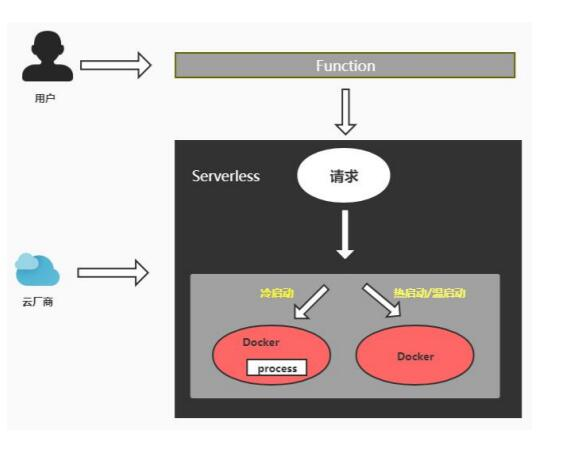

[配置session](https://eggjs.org/zh-cn/core/cookie-and-session.html)

**`config.default.js`**

```javascript
config.session = {
    key: 'SESSION_ID',
    maxAge: 30 * 60 * 1000,  // 如果过期时间比较长 建议保存在 redis 里面
    httpOnly: true,
    encrypt: true,
    renew: true  // 延长会话有效期
}
```

session使用：

```javascript
// 存储 session
this.ctx.session.username = { username: "xxc", age: 20 };

// 使用 session
this.ctx.body = this.ctx.session.username;
```

### 生成验证码

要生成验证码，需要使用到 **`svg-captcha`** 模块

[使用node.js的eggjs实现图形验证码功能](https://blog.csdn.net/weixin_42679187/article/details/106414972)

1. 安装模块

```
cnpm install svg-captcha --save 
```

2. 创建 **`service/tools.js`**，获取验证码及验证码文字：

```javascript
'use strict';

const Service = require('egg').Service;
const svgCaptcha = require('svg-captcha');

class ToolsService extends Service {
    async getCaptcha() {
        const captcha = svgCaptcha.create({
            size: 4,
            fontSize: 50,
            width: 100,
            height: 40,
            background: '#fff'
        })
        return captcha;
    }
}

module.exports = ToolsService;
```

3. 定义 生成验证码接口：

**`controller/admin/login.js`**

```javascript
const Controller = require('egg').Controller;
class LoginController extends Controller {
    
    ....
    async captcha() {
        let captcha = await this.service.tools.getCaptcha();
        // 保存二维码文字到 session 中
        this.ctx.session.code = captcha.text;
        this.ctx.response.type = 'image/svg+xml';
        // 返回 svg 图片
        this.ctx.body = captcha.data;
    }
}
module.exports = LoginController;
```

**`router.js`**

```javascript
router.get('/admin/login/captcha', controller.admin.login.captcha)
```

4. 在 **`login.html`** 中使用

```html
<!DOCTYPE HTML PUBLIC "-//W3C//DTD HTML 4.01 Transitional//EN" "http://www.w3.org/TR/html4/loose.dtd">
<html>

<head>
    <title>用户登录</title>

    <!-- 此处 public 前需要加 ‘/’ -->
    <link rel="stylesheet" href="/public/admin/css/login.css">
</head>

<body>
    <div class="container">
        <div id="login">
            <form action="#" method="post" id="myform">
                <input type="hidden" name="ajaxlogin" id="ajaxlogin">
                <input type="hidden" name="ajaxcode" id="ajaxcode">
                <div class="l_title">Serverless+Eggjs后台管理系统</div>
                <dl>
                    <dd>管理员姓名：<input class="text" type="text" name="username" id="username"></dd>
                    <dd>管理员密码：<input class="text" type="password" name="password" id="password"></dd>
                    <dd>验　证　码：<input id="verify" type="text" name="verify">
                        <!-- 将 src 设为接口地址，同时绑定 点击事件，注意此处要 将 this.src 改为末尾添加一个随机参数 -->
                        
                    </dd>
                    <dd><input type="submit" class="submit" name="dosubmit" value=""></dd>
                </dl>
            </form>
        </div>
    </div>

</body>

</html>
```

## 配置中间件进行权限验证

1. 创建文件 **`middleware/adminAuth.js`**，只有当具有 session.userinfo 和 session.userinfo.username 时或在白名单中，才可进行页面跳转。否则一律跳转到登录页。

```javascript
module.exports = (options, app) => {
    return async function (ctx, next) {
        // 定义 全局变量，存储 csrf
        ctx.state.csrf = ctx.csrf;
        const whitePath = [
            '/admin/login',
            '/admin/login/doLogin',
            '/admin/login/captcha'
        ]
        const pathname = ctx.request.url.split('?')[0]
        if (ctx.session.userinfo && ctx.session.userinfo.username) {
            await next();
        } else {
            if (whitePath.includes(pathname))
                await next();
            else {
                ctx.redirect('/admin/login')
            }
        }
    }
}
```

2. 在 **`config/plugin.js`** 进行中间件配置

```javascript
  config.middleware = ['adminAuth']

  // 只有 /admin 开头的 url 路径，才会使用本中间件
  config.adminAuth = {
    match: '/admin'
  }
```

3. 配置表单提交路径，并为其添加 值为 csrf 的隐藏域（避免CSRF 攻击）。

**`view/login.html`**

```html
<!DOCTYPE HTML PUBLIC "-//W3C//DTD HTML 4.01 Transitional//EN" "http://www.w3.org/TR/html4/loose.dtd">
<html>

<head>
    <title>用户登录</title>

    <!-- 此处 public 前需要加 ‘/’ -->
    <link rel="stylesheet" href="/public/admin/css/login.css">
</head>

<body>
    <div class="container">
        <div id="login">
            <form action="/admin/login/doLogin" method="post" id="myform">
                <input type="hidden" name="_csrf" value="<%= csrf %>">
                <input type="hidden" name="ajaxlogin" id="ajaxlogin">
                <input type="hidden" name="ajaxcode" id="ajaxcode">
                <div class="l_title">Serverless+Eggjs后台管理系统</div>
                <dl>
                    <dd>管理员姓名：<input class="text" type="text" name="username" id="username"></dd>
                    <dd>管理员密码：<input class="text" type="password" name="password" id="password"></dd>
                    <dd>验　证　码：<input id="verify" type="text" name="verify">
                        
                    </dd>
                    <dd><input type="submit" class="submit" name="dosubmit" value=""></dd>
                </dl>
            </form>
        </div>
    </div>

</body>

</html>
```

4. 定义控制器**`controller/admin/login.js`** 中的 **doLogin**，在其中为 session 赋值

```javascript
class LoginController extends Controller {
    ...
    async doLogin() {
        // 模拟数据
        this.ctx.session.userinfo = {
            username: 'xxc',
            age: 18
        }
        this.ctx.redirect('/admin')
    }
}

module.exports = LoginController;
```

5. 定义路由

**`router.js`**

```js
router.post('/admin/login/doLogin', controller.admin.login.doLogin)
```


## 权限判断、Md5加密、Mysql Sequelize 数据库配置

1. 安装 模块

```
cnpm i egg-sequelize mysql2 --save

cnpm i md5 --save
```

2. 进行 sequelize 配置

**`config/plugin.js`**

```javascript
module.exports = {
  sequelize: {
    enable: true,
    package: 'egg-sequelize'
  }
}
```

**`config/config.default.js`**

```javascript
  // 配置数据库
  config.sequelize = {
    dialect: 'mysql',
    host: 'localhost',
    port: 3306,
    username: 'root',
    password: 'admin123',
    database: 'eggshop'
  }
```

3. 在 **`service/tools.js`** 中定义 md5 加密方法

```javascript
const Service = require('egg').Service;
const md5 = require('md5')
class ToolsService extends Service {
    md5(msg) {
        return md5(msg)
    }
}
module.exports = ToolsService;
```

4. 在 **`model/admin.js`** 中定义sequelize数据模型

```javascript
'use strict';

module.exports = app => {
    const { STRING, INTEGER, DATE } = app.Sequelize;

    const Admin = app.model.define('admin', {
        id: { type: INTEGER, primaryKey: true, autoIncrement: true },
        username: STRING(255),      // varchar
        password: STRING(32),        // char
        mobile: STRING(32),      // char
        email: STRING(32),       // char
        status: INTEGER(1),         // tinyint
        roleId: INTEGER(11),        // int
        addTime: INTEGER(11),       // int
        isSuper: INTEGER(1),
        lastLogin: INTEGER(11)
    }, {
        timestamps: false,  // 自动增加创建时间
        tableName: 'admin'   // 设置表名称
    });

    return Admin;
};
```

5. 在 **`controller/admin/login.js`** 中实现登录逻辑

```javascript
async doLogin() {
        let { username, password, verify } = this.ctx.request.body
        password = this.ctx.service.tools.md5(password)
        // 1. 判断验证码是否正确
        if (verify === this.ctx.session.code) {
            // 查询出的这个 userinfo 中数据的值被封装到 userinfo.dataValues 属性中中，但是可以通过userinfo.username直接访问。
            let userinfo = await this.ctx.model.Admin.findAll({
                where: {
                    username: username,
                    password: password
                }
            });
            if (userinfo.length > 0) {
                // 2.判断用户密码是否合法
                this.ctx.session.userinfo = userinfo[0]
                // 3.执行登录
                this.ctx.redirect('/admin')
            } else {
                console.log("用户名或者密码错误")
                this.ctx.redirect('/admin/login')
            }
        } else {
            console.log('验证码错误');
            this.ctx.redirect('/admin/login');
        }
    }
```


## 创建基类 base.js，配置公共的成功失败页面

我们可以通过创建一个基类base.js，通过在基类中定义两个方法 error、success 来分别跳转到成功和失败页面，并让需要用到这两个方法的控制器 **继承** 这个基类。同时这两个方法还可以传入参数。来指定 显示内容 及 跳转地址。

**`base.js`**

```javascript
'use strict';

const Controller = require('egg').Controller;

class BaseController extends Controller {
    async success(msg, redirectUrl) {
        await this.ctx.render("admin/public/success", {
            msg,
            redirectUrl
        })
    }
    async error(msg, redirectUrl) {
        await this.ctx.render("admin/public/error", {
            msg,
            redirectUrl
        })
    }
}

module.exports = BaseController;
```

**`view/admin/public/error.html`**

```html
<%- include ../public/page_header.html %>

 <meta http-equiv="refresh" content="3;url=<%=redirectUrl%>"> 

 <div class="container" style="width: 480px;margin-top:100px;">
    <div class="row">          
            <div class="alert alert-danger">            	
            	<h2><%=msg%></h2>            	
            	<br />            		
            	<p>如果您不做出选择，将在 3秒后跳转到第一个链接地址。</p>
            </div>
    </div>
</div>

</body>
</html>
```

**`view/admin/public/success.html`**

```html
<%- include ../public/page_header.html %>

 <meta http-equiv="refresh" content="2;url=<%=redirectUrl%>"> 

 <div class="container" style="width: 480px;margin-top:100px;">
    <div class="row">                 
            <div class="alert alert-success">            	
                <h2><%=msg%></h2>   
            	
            	<br />
            		
            	<p>如果您不做出选择，将在 3秒后跳转到第一个链接地址。</p>            
            </div>       
    </div>
</div>

</body>
</html>
```

在 **`controller/admin/login.js`** 中使用这个基类：

```javascript
'use strict';

const BaseController = require('./base');

class LoginController extends BaseController {
	...
    async doLogin() {

        let { username, password, verify } = this.ctx.request.body
        password = this.ctx.service.tools.md5(password)
        // 判断验证码是否正确
        if (verify === this.ctx.session.code) {
            // 查询出的这个 userinfo 中数据的值被封装到 userinfo.dataValues 属性中中，但是可以通过userinfo.username直接访问。
            let userinfo = await this.ctx.model.Admin.findAll({
                where: {
                    username: username,
                    password: password
                }
            });
            if (userinfo.length > 0) {
                this.ctx.session.userinfo = userinfo[0]
                await this.success('登录成功', "/admin")
            } else {
                // 此处要加 await ，否则会产生 404 错误
                await this.error("用户名或密码错误", "/admin/login")
            }
        } else {
            // 此处要加 await ，否则会产生 404 错误
            await this.error("验证码错误", "/admin/login")
        }
    }
	...
}

module.exports = LoginController;
```

## 配置可以修改的后台地址及 实现退出登录功能

### 配置可以修改的后台地址

为了保证后台地址不被他人给 随意推断出来，我们应该保证后台地址可以随时修改，为了修改方便，我们便可以将 **后台地址** 配置到 config 选项中，然后在所有有用到地址的地方（router.js、控制器、模板、中间件）进行 引入使用。

**`config/config.js`**

```javascript
// 配置后台地址
config.adminPath = "admin111";

// 配置中间件
config.middleware = ['adminAuth'];

config.adminAuth = {
    match: `/${config.adminPath}`	// 中间件匹配路由改为 我们设置的后台地址
}
```

**`router.js`**

```javascript
'use strict'

/**
 * @param {Egg.Application} app - egg application
 */
module.exports = (app) => {
  const {
    router,
    controller,
    config
  } = app

  // 将所有用到的路由前缀改为 我们配置的路由地址
  router.get('/', controller.default.home.index)

  router.get(`/${config.adminPath}`, controller.admin.main.index)

  router.get(`/${config.adminPath}/welcome`, controller.admin.main.welcome)

  router.get(`/${config.adminPath}/login`, controller.admin.login.index)
  router.get(`/${config.adminPath}/login/captcha`, controller.admin.login.captcha)
  router.post(`/${config.adminPath}/login/doLogin`, controller.admin.login.doLogin)
  router.get(`/${config.adminPath}/login/loginOut`, controller.admin.login.loginOut)

  router.get(`/${config.adminPath}/manager`, controller.admin.manager.index)
  router.get(`/${config.adminPath}/manager/add`, controller.admin.manager.add)
  router.get(`/${config.adminPath}/manager/edit`, controller.admin.manager.edit)
  router.get(`/${config.adminPath}/manager/delete`, controller.admin.manager.delete)

  router.get(`/${config.adminPath}/role`, controller.admin.role.index)
  router.get(`/${config.adminPath}/role/add`, controller.admin.role.add)
  router.get(`/${config.adminPath}/role/edit`, controller.admin.role.edit)
  router.get(`/${config.adminPath}/role/delete`, controller.admin.role.delete)

  router.get(`/${config.adminPath}/access`, controller.admin.access.index)
  router.get(`/${config.adminPath}/access/add`, controller.admin.access.add)
  router.get(`/${config.adminPath}/access/edit`, controller.admin.access.edit)
  router.get(`/${config.adminPath}/access/delete`, controller.admin.access.delete)
}
```

中间件：

不仅要修改中间件中的路由地址前缀，还需要在中间件中进行 **全局变量** 的配置，以便 之后可以在 模板中进行使用。

**`middleware/adminAuth.js`**

```javascript
module.exports = (options, app) => {
    return async function (ctx, next) {
        ctx.state.csrf = ctx.csrf;
        ctx.state.adminPath = app.config.adminPath;     // 获取后台地址

        const whitePath = [
            `/${ctx.state.adminPath}/login`,
            `/${ctx.state.adminPath}/login/doLogin`,
            `/${ctx.state.adminPath}/login/captcha`
        ]
        const pathname = ctx.request.url.split('?')[0]
        if (ctx.session.userinfo && ctx.session.userinfo.username) {
            await next();
        } else {
            if (whitePath.includes(pathname)) {
                await next();
            }
            else {
                ctx.redirect(`/${ctx.state.adminPath}/login`)
            }
        }

        // await next();
    }
}
```

模板（由于修改处过多，只列出其中一处）：

```html
<!DOCTYPE HTML PUBLIC "-//W3C//DTD HTML 4.01 Transitional//EN" "http://www.w3.org/TR/html4/loose.dtd">
<html>

<head>
    <title>用户登录</title>

    <!-- 此处 public 前需要加 ‘/’ -->
    <link rel="stylesheet" href="/public/admin/css/login.css">
</head>

<body>
    <div class="container">
        <div id="login">
            <!-- 使用全局变量的方式在模板中进行 路由前缀的配置 -->
            <form action="/<%= adminPath %>/login/doLogin" method="post" id="myform">
                <input type="hidden" name="_csrf" value="<%= csrf %>">
                <input type="hidden" name="ajaxlogin" id="ajaxlogin">
                <input type="hidden" name="ajaxcode" id="ajaxcode">
                <div class="l_title">Serverless+Eggjs后台管理系统</div>
                <dl>
                    <dd>管理员姓名：<input class="text" type="text" name="username" id="username"></dd>
                    <dd>管理员密码：<input class="text" type="password" name="password" id="password"></dd>
                    <dd>验　证　码：<input id="verify" type="text" name="verify">
                        /login/captcha" title="看不清？点击刷新"
                            onclick="javascript:this.src='/<%= adminPath %>/login/captcha?mt='+Math.random()">
                    </dd>
                    <dd><input type="submit" class="submit" name="dosubmit" value=""></dd>
                </dl>
            </form>
        </div>
    </div>

</body>

</html>
```

控制器：

控制器中要想进行 config 的引用，可以通过 **this.config** 或 **this.app.config**。

**`controller/admin/login.js`**

```javascript
async doLogin() {

        let { username, password, verify } = this.ctx.request.body
        password = this.ctx.service.tools.md5(password)
        // 1. 判断验证码是否正确
        if (verify === this.ctx.session.code) {
            // 查询出的这个 userinfo 中数据的值被封装到 userinfo.dataValues 属性中中，但是可以通过userinfo.username直接访问。
            let userinfo = await this.ctx.model.Admin.findAll({
                where: {
                    username: username,
                    password: password
                }
            });
            if (userinfo.length > 0) {
                this.ctx.session.userinfo = userinfo[0]
                await this.success('登录成功', `/${this.config.adminPath}`)
            } else {
                // 此处要加 await ，否则会产生 404 错误
                await this.error("用户名或密码错误", `/${this.config.adminPath}/login`)
            }
        } else {
            // 此处要加 await ，否则会产生 404 错误
            await this.error("验证码错误", `/${this.config.adminPath}/login`)
        }
    }
```

### 实现退出登录功能

1. 首先在 **`controller/admin/login.js`** 中进行控制器的 定义

```javascript
async loginOut() {
    this.ctx.session.userinfo = null;
    await this.success("退出登录成功", `/${this.config.adminPath}/login`);
}
```

2. 路由的配置

**`router.js`**

```javascript
router.get(`/${config.adminPath}/login/loginOut`, controller.admin.login.loginOut)
```

3. 修改模板中的 退出按钮 地址

**`view/admin/public/page_header.html`**

```html
<nav class="navbar navbar-inverse" role="navigation">
    <div class="container-fluid">
        <div class="navbar-header">
            
        </div>
		<div class="collapse navbar-collapse" id="example-navbar-collapse">
    		<ul class="nav navbar-nav navbar-right">
        		<li>
            		<a>欢迎您,admin</a>
				</li>
				<li>
    				<a href="/<%= adminPath %>/login/loginOut">安全退出</a>
				</li>
			</ul>
		</div>
	</div>
</nav>
```

## Egg.js 后台管理系统权限管理 RBAC

> 关于 RBAC

RBAC 是基于角色的权限访问控制（Role-Based Access Control）。在 RBAC 中，权限与角色相关联，用户通过成为适当角色的成员而得到这些角色的权限。

> 用户 RBAC 权限管理树形图

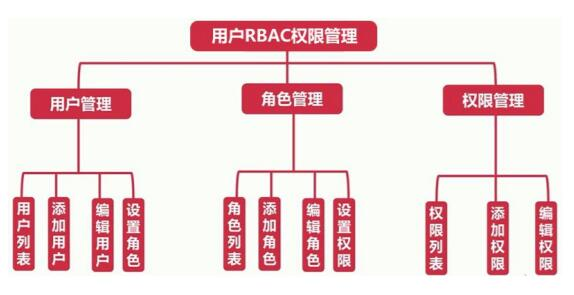

> RBAC 实现流程

1、实现角色的增加修改删除 

2、实现用户的增加修改删除，增加修改用户的时候需要选择角色 

3、实现权限的增加修改删除 （页面菜单） 

4、实现角色授权功能 

5、判断当前登录的用户是否有访问菜单的权限 

6、根据当前登录账户的角色信息动态显示左侧菜单


> 权限控制相关的数据库表

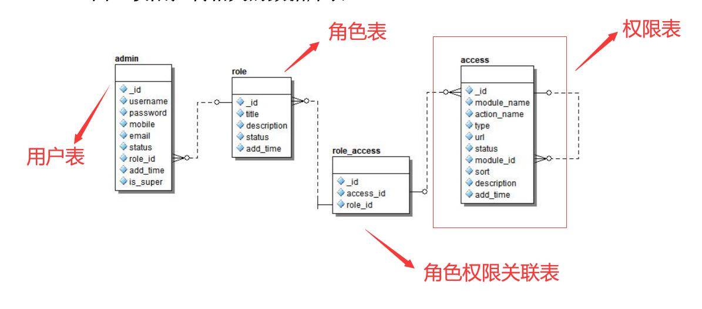


##  RBAC权限管理 - 角色列表、角色增加、角色修改、角色删除

在进行所有操作设计之前，要先创建一张 **`角色表`**，同时建立 **`sequelize`** 角色表模型。

数据库 role 表设计：

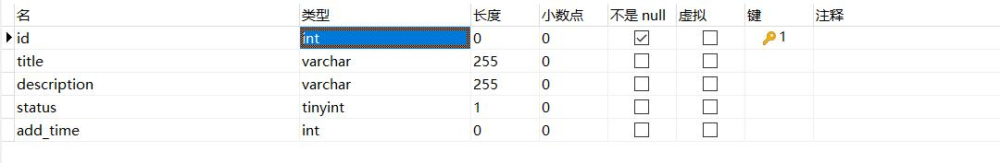

sequelize 角色模型设计：

**`model/role.js`**

```javascript
'use strict';

module.exports = app => {
    const { STRING, INTEGER, DATE } = app.Sequelize;

    const Role = app.model.define('role', {
        id: { type: INTEGER, primaryKey: true, autoIncrement: true },
        title: STRING(255),
        description: STRING(255),
        status: INTEGER(1),
        addTime: INTEGER(11),
    }, {
        timestamps: false,  // 自动增加创建时间
        tableName: 'role'   // 设置表名称
    });

    return Role;
};
```


### 角色增加

要实现角色增加，首先得修改 表单的提交地址

**`view/admin/role/add.html`**

```html
<% include ../public/page_nav.html %>

    <div class="container-fluid">
        <div class="row">
            <div class="col-sm-12">

                <div class="panel panel-default">
                    <div class="panel-heading">
                        增加角色
                    </div>
                    <div class="panel-body">
                        <div class="table-responsive input-form">
                            <!-- 此处要修改表单提交地址 -->
                            <form action="/<%= adminPath %>/role/doAdd" method="post">
                                <input type="hidden" name="_csrf" value="<%= csrf %>">
                                <ul>
                                    <li> 角色名称: <input type="text" name="title" /></li>
                                    <li>
                                        角色描述:
                                        <textarea name="description" id="" cols="60" rows="8"></textarea>
                                    </li>
                                    <li>
                                        <br />
                                        <button type="submit" class="btn btn-default">提交</button>
                                    </li>
                                </ul>
                            </form>
                        </div>
                    </div>
                </div>
            </div>
        </div>
    </div>

    </body>

    </html>
```

之后为设计表单的 提交路由：

1. 定义路由

**`router.js`**

```javascript
router.post(`/${config.adminPath}/role/doAdd`, controller.admin.role.doAdd)
```

2. 定义控制器

**`controller/admin/role.js`**

```javascript
async doAdd() {
    // 获取表单返回的数据
    // console.log(this.ctx.request.body)

    // this.ctx.body = "执行增加"
    let { title, description } = this.ctx.request.body;
    if (title != "") {
        await this.ctx.model.Role.create({
            title,
            status: 1,
            description,
            addTime: this.ctx.service.tools.getUnixTime()
        })
        await this.success("增加角色成功", `/${this.config.adminPath}/role`)
    } else {
        await this.error('角色名不能为空', `/${this.config.adminPath}/role/add`)
    }
}
```

此处考虑到 获取时间戳的方法会在多处用到，故将其定义为一个service方法：

**`service/tool.js`**

```javascript
getUnixTime() {
    let dObj = new Date();
    return dObj.getTime() / 1000;       // 13 位 和 10 位时间戳的 区别在于 。13位的精度是毫秒，而10位的精度是秒。
}
```

### 角色列表

1. 定义角色列表路由及控制器

**`router.js`**

```javascript
router.get(`/${config.adminPath}/role`, controller.admin.role.index)
```

**`controller/admin/role.js`**

```javascript
async index() {
    let result = await this.ctx.model.Role.findAll()
    console.log(result)
    await this.ctx.render('admin/role/index', {
        list: result
    })
}
```

2. 设计 角色列表 展示页面

**`view/admin/role.js`**

```html
<% include ../public/page_nav.html %>


    <div class="container-fluid">
        <div class="row">
            <div class="col-sm-12">
                <!--
                列表展示
            -->
                <div class="table-responsive">
                    <table class="table table-bordered">
                        <thead>
                            <tr class="th">
                                <th>角色名称</th>
                                <th>角色描述</th>
                                <th>增加时间</th>
                                <th class="text-center">操作</th>
                            </tr>
                        </thead>
                        <tbody>
                            <%for(var i=0;i<list.length;i++){%>
                                <tr>
                                    <td>
                                        <%= list[i].title %>
                                    </td>
                                    <td>
                                        <%= list[i].description%>
                                    </td>
                                    </td>
                                    <td>
                                        <!-- 此处增加时间数据库表中使用 _ 写法，但此处查出来的结果为驼峰式 -->
                                        <%= list[i].addTime%>
                                    </td>
                                    <td class="text-center">
                                        <a href="/<%= adminPath %>/role/edit?id=<%= list[i].id %>">编辑</a>

                                        <a href="/<%= adminPath %>/role/delete?id=<%= list[i].id %>">删除</a>
                                    </td>
                                </tr>
                                <%}%>
                        </tbody>
                    </table>
                </div>

            </div>
        </div>
    </div>

    </body>

    </html>
```

 

### 角色修改

首先要先设计修改界面：

注意：1.表单提交地址改为 doEdit，

​		   2.要 增加一个隐藏域，用于传递 修改数据的 id 给 doEdit 对应的控制器。

```html
<% include ../public/page_nav.html %>

    <div class="container-fluid">
        <div class="row">
            <div class="col-sm-12">

                <div class="panel panel-default">
                    <div class="panel-heading">
                        编辑角色
                    </div>
                    <div class="panel-body">
                        <div class="table-responsive input-form">
                            <!-- 此处要修改表单提交地址 -->
                            <form action="/<%= adminPath %>/role/doEdit" method="post">
                                <input type="hidden" name="_csrf" value="<%= csrf %>">
                                <input type="hidden" name="id" value="<%= list.id %>">
                                <ul>
                                    <li> 角色名称: <input type="text" name="title" value="<%= list.title %>" /></li>
                                    <li>
                                        角色描述:
                                        <textarea name="description" id="" cols="60" rows="8"
                                            style="vertical-align: top;"><%= list.description %></textarea>
                                    </li>

                                    <li>
                                        <br />
                                        <button type="submit" class="btn btn-default">提交</button>
                                    </li>

                                </ul>


                            </form>
                        </div>
                    </div>
                </div>
            </div>
        </div>
    </div>

    </body>

    </html>
```

之后设计 doEdit 对应的路由及控制器：

**`router.js`**

```javascript
router.post(`/${config.adminPath}/role/doEdit`, controller.admin.role.doEdit)
```

**`controller/admin/role.js`**

```javascript
// 渲染修改页面的路由
async edit() {
    // 此处加 try catch 是为了防止用户直接访问 本路由时传入非法的 id。下方 删除 同理。
    try {
        const id = this.ctx.request.query.id;
        const result = await this.ctx.model.Role.findAll({
            where: {
                id
            }
        });
        await this.ctx.render("admin/role/edit", {
            list: result[0]
        });
    } catch (error) {
        await this.error("非法请求", `/${this.config.adminPath}/role`)
    }
}

// 修改数据的路由
async doEdit() {
    const { title, description, id } = this.ctx.request.body;
    // 注意：若要通过 sequelize 进行数据修改，首先得 查询到数据 ，然后根据查询结果的 update 方法修改数据
    const role = await this.ctx.model.Role.findByPk(id);
    if (!role) {
        await this.error("非法请求", `/${this.config.adminPath}/role/edit?id=${id}`)
        return
    }
    const result = await role.update({ title, description, id })
    await this.success("修改数据成功", `/${this.config.adminPath}/role/edit`)
}
```

### 角色删除

删除角色 没有 对应的页面，我们只需要 为 对应的路由定义好控制器，当点击 角色列表时，即可触发路由对应的控制器触发修改

**`router.js`**

```javascript
router.get(`/${config.adminPath}/role/delete`, controller.admin.role.delete)
```

**`controller/admin/role.js`**

```javascript
async delete() {
    try {
        const id = this.ctx.request.query.id;
        const role = await this.ctx.model.Role.findByPk(id);
        if (!role) {
            await this.error("非法请求", `/${this.config.adminPath}/role`)
            return
        }
        const result = await role.destroy()
        await this.success("删除数据成功", `/${this.config.adminPath}/role`)
    } catch (error) {
        await this.error("非法请求", `/${this.config.adminPath}/role`)
    }
}
```

## 用户列表、用户增加、用户修改、用户删除 以及用户角色关联

 ### 用户列表

要想实现用户列表的展示，要先考虑到用户列表需要和角色列表进行关联，这样才能将每个用户的角色属性获取到。

1. 为 用户 模型添加关联：

**`model/admin.js`**

```javascript
'use strict';

module.exports = app => {
    const { STRING, INTEGER, DATE } = app.Sequelize;

    const Admin = app.model.define('admin', {
        id: { type: INTEGER, primaryKey: true, autoIncrement: true },
        username: STRING(255),      // varchar
        password: STRING(32),        // char
        mobile: STRING(32),      // char
        status: INTEGER(1),         // tinyint
        roleId: INTEGER(11),        // int
        addTime: INTEGER(11),       // int
        isSuper: INTEGER(1),
        lastLogin: INTEGER(11)
    }, {
        timestamps: false,  // 自动增加创建时间
        tableName: 'admin'   // 设置表名称
    });

    Admin.associate = function () { // 1 对 1
        app.model.Admin.belongsTo(app.model.Role, { foreignKey: 'roleId' });
    }

    return Admin;
};
```

2. 定义路由及 控制器：

**`router.js`**

```javascript
router.get(`/${config.adminPath}/manager`, controller.admin.manager.index)
```

**`controller/admin/manager.js`**

```javascript
async index() {
        let result = await this.ctx.model.Admin.findAll({
            include: { model: this.ctx.model.Role }
        });
        await this.ctx.render('admin/manager/index', {
            list: result
        })
    }
```

3. 渲染页面：

**`view/admin/manager/index.html`**

```html
<% include ../public/page_nav.html %>


    <div class="container-fluid">
        <div class="row">
            <div class="col-sm-12">
                <!--
                列表展示
            -->
                <div class="table-responsive">
                    <table class="table table-bordered">
                        <thead>
                            <tr class="th">
                                <th>角色名称</th>
                                <th>角色描述</th>
                                <th>增加时间</th>
                                <th class="text-center">操作</th>
                            </tr>
                        </thead>
                        <tbody>
                            <%for(var i=0;i<list.length;i++){%>
                                <tr>
                                    <td>
                                        <%= list[i].title %>
                                    </td>
                                    <td>
                                        <%= list[i].description%>
                                    </td>
                                    </td>
                                    <td>
                                        <!-- 此处增加时间数据库表中使用 _ 写法，但此处查出来的结果为驼峰式 -->
                                        <%= list[i].addTime%>
                                    </td>
                                    <td class="text-center">
                                        <a href="/<%= adminPath %>/role/edit?id=<%= list[i].id %>">编辑</a>

                                        <a href="/<%= adminPath %>/role/delete?id=<%= list[i].id %>">删除</a>
                                    </td>
                                </tr>
                                <%}%>
                        </tbody>
                    </table>
                </div>

            </div>
        </div>
    </div>

    </body>

    </html>
```

### 用户增加

首先为用户增加 设计 页面渲染路由 及 执行增加操作路由及控制器：

**`router.js`**

```javascript
router.get(`/${config.adminPath}/manager/add`, controller.admin.manager.add)
router.post(`/${config.adminPath}/manager/doAdd`, controller.admin.manager.doAdd)
```

**`controller/admin/manager.js`**

```javascript
async add() {
    let roleList = await this.ctx.model.Role.findAll();
    // 渲染时需要将 角色 列表传递给下拉框进行渲染
    await this.ctx.render('admin/manager/add', {
        roleList
    })
}

async doAdd() {
    // 1. 获取表单传递的数据
    let addResult = this.ctx.request.body;
    // 2.验证数据是否合法 
    if (addResult.username === "") {
        await this.error("管理员名称不能为空", `/${this.config.adminPath}/manager/add`);
        return;
    }
    if (addResult.password < "") {
        await this.error("管理员密碼不能小于6位", `/${this.config.adminPath}/manager/add`);
        return;
    }
    // 数据库表里面没有当前用户
    let adminResult = await this.ctx.model.Admin.findAll({
        where: {
            username: addResult.username
        }
    })
    // 3. 检查数据库表中是否有管理员，有的话不添加
    if (adminResult.length > 0) {
        await this.error("此管理员已经存在", `/${this.config.adminPath}/manager/add`)
    } else {
        addResult.password = this.ctx.service.tools.md5(addResult.password)
        await this.ctx.model.Admin.create({ ...addResult, addTime: this.ctx.service.tools.getUnixTime(), status: 1, isSuper: 0 })
        await this.success('增加管理员成功', `/${this.config.adminPath}/manager`)
    }
}
```

之后设计页面：

**`view/admin/manager/add.html`**

```html
<% include ../public/page_nav.html %>


    <div class="panel panel-default">
        <div class="panel-heading">
            增加管理员
        </div>
        <div class="panel-body">
            <div class="table-responsive input-form">
                <form action="/<%=adminPath%>/manager/doAdd" method="post">
                    <input type="hidden" name="_csrf" value="<%=csrf%>">
                    <ul>
                        <li> 管理员名称: <input type="text" name="username" /></li>
                        <li> 管理员密码: <input type="text" name="password" /></li>
                        <li> 管理员电话: <input type="text" name="mobile" /></li>
                        <li> 管理员邮箱: <input type="text" name="email" /></li>

                        <li> 管理员角色:
                            <select name="roleId" id="roleId">
                                <%for(var i=0;i<roleList.length;i++){%>
                                    <option value="<%=roleList[i].id%>">
                                        <%=roleList[i].title%>
                                    </option>
                                    <%}%>
                            </select>
                        </li>
                        <li>
                            <br />
                            <button type="submit" class="btn btn-default">提交</button>
                        </li>
                    </ul>
                </form>
            </div>
        </div>
    </div>
    </body>
    </html>
```

 

### 用户修改

首先配置用户修改的 路由 及控制器

**`router.js`**

```javascript
router.get(`/${config.adminPath}/manager/edit`, controller.admin.manager.edit)
router.post(`/${config.adminPath}/manager/doEdit`, controller.admin.manager.doEdit)
```

**`controller/admin/manager.js`**

```javascript
    async edit() {
        // 1. 获取当前编辑的管理员
        let id = this.ctx.request.query.id;
        let managerResult = await this.ctx.model.Admin.findAll({
            where: {
                id
            }
        })

        // 2. 获取所有的角色
        let roleList = await this.ctx.model.Role.findAll();

        await this.ctx.render('admin/manager/edit', {
            manager: managerResult[0],
            roleList
        })
    }

    async doEdit() {
        // 1. 获取表单传过来的数据
        let editResult = this.ctx.request.body;
        console.log(editResult)
        // 2.判断密码是否为空
        if (editResult.password !== "") {
            if (editResult.password.length < 6) {
                await this.error("管理员的密码不能小于 6 位", `/${this.config.adminPath}/manager/edit?id=${editResult.id}`)
                return;
            }
            editResult.password = this.ctx.service.tools.md5(editResult.password);
        } else {
            // 如果密码不为空，则删除掉表单中的 密码 属性后再进行修改
            delete editResult.password;
        }
        let managerResult = await this.ctx.model.Admin.findByPk(editResult.id);
        await managerResult.update(editResult)

        await this.success('管理员修改成功', `/${this.config.adminPath}/manager`)
    }
```

然后进行页面设计 及 数据渲染

**`view/admin/role/edit.html`**

```html
<% include ../public/page_nav.html %>

    <div class="container-fluid">
        <div class="row">
            <div class="col-sm-12">

                <div class="panel panel-default">
                    <div class="panel-heading">
                        编辑角色
                    </div>
                    <div class="panel-body">
                        <div class="table-responsive input-form">
                            <!-- 此处要修改表单提交地址 -->
                            <form action="/<%= adminPath %>/role/doEdit" method="post">
                                <input type="hidden" name="_csrf" value="<%= csrf %>">
                                <input type="hidden" name="id" value="<%= list.id %>">
                                <ul>
                                    <li> 角色名称: <input type="text" name="title" value="<%= list.title %>" /></li>
                                    <li>
                                        角色描述:
                                        <textarea name="description" id="" cols="60" rows="8"
                                            style="vertical-align: top;"><%= list.description %></textarea>
                                    </li>

                                    <li>
                                        <br />
                                        <button type="submit" class="btn btn-default">提交</button>
                                    </li>

                                </ul>


                            </form>
                        </div>
                    </div>
                </div>
            </div>
        </div>
    </div>

    </body>

    </html>
```

### 用户删除

删除只需要配置对应的 **路由** 及 **控制器** 即可。

**`controller/admin/manager.js`**

```javascript
async delete() {
    try {
        let id = this.ctx.request.query.id;
        let managerResult = await this.ctx.model.Admin.findByPk(id);
        if (!managerResult) {
            await this.error("非法请求", `/${this.config.adminPath}/manager`);
            return;
        }
        await managerResult.destroy();
        await this.success("删除数据成功", `/${this.config.adminPath}/manager`)
    } catch (error) {
        await this.error('非法请求', `/${this.config.adminPath}/manager`)
    }
}
```

## 权限的增删改查以及 Mysql 权限表和权限表自关联

首先进行 sequelize 模型设计 以及 mysql 表建立

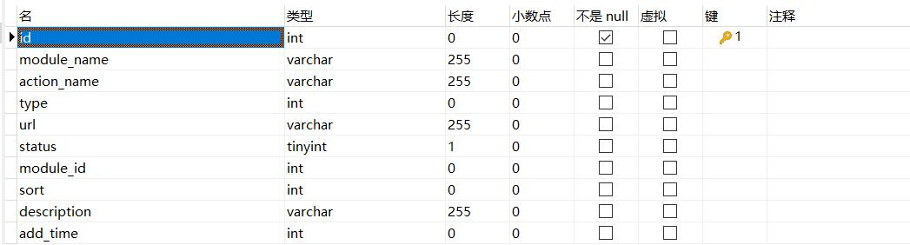

**`model/access.js`**

```javascript
'use strict';
module.exports = app => {
    const { STRING, INTEGER } = app.Sequelize;
    const Access = app.model.define('access', {
        id: { type: INTEGER, primaryKey: true, autoIncrement: true },
        moduleName: STRING(255),     // 模块名称
        type: INTEGER(1),        // 节点类型：1.表示模块 2.表示菜单 3.表示操作
        actionName: STRING(255),     // 操作名称
        url: STRING(255),        // 跳转地址
        moduleId: INTEGER(1),        // module_id 和 id 关联 moduleId = 0 表示模块
        sort: INTEGER(11),       // 排序
        description: STRING(255),        // 描述
        status: INTEGER(1),      // 状态
        addTime: INTEGER(11)         // 增加时间
    }, {
        timestamps: false,       // 自动增加创建时间
        tableName: 'access'      // 设置表名称
    });
    return Access
}
```

### 权限的增加

1. 路由 及 对应控制器的配置：

**`router.js`**

```javascript
router.get(`/${config.adminPath}/access/add`, controller.admin.access.add)
router.post(`/${config.adminPath}/access/doAdd`, controller.admin.access.doAdd)
```

**`controller/admin/access.js`**

```javascript
async add() {
    // 获取 moduleId = 0 的模块
    let accessList = await this.ctx.model.Access.findAll({
        where: {
            moduleId: 0
        }
    })
    await this.ctx.render("admin/access/add", {
        accessList
    })
}
async doAdd() {
    let addResult = this.ctx.request.body;
    if (addResult.moduleName === "") {
        await this.error("模块名称不能为空", `/${this.config.adminPath}/access/add`)
        return
    }

    await this.ctx.model.Access.create({
        ...addResult,
        status: 1,
        addTime: this.ctx.service.tools.getUnixTime()
    })
    await this.success("增加权限成功", `/${this.config.adminPath}/access`)
}
```

2. 页面的渲染：

```html
<%- include ../public/page_nav.html %>

    <div class="panel panel-default">
        <div class="panel-heading">
            增加权限
        </div>
        <div class="panel-body">
            <div class="table-responsive input-form">
                <form action="/<%=adminPath%>/access/doAdd" method="post">
                    <ul>
                        <input type="hidden" name="_csrf" value="<%=csrf%>">
                        <li>模块名称: <input type="text" name="moduleName" /></li>
                        <li>
                            节点类型:
                            <!-- 1、表示模块   2、表示菜单     3、操作 -->
                            <select name="type" id="type">
                                <option value="1">模块</option>
                                <option value="2">菜单</option>
                                <option value="3">操作</option>
                            </select>
                        </li>
                        <li> 操作名称: <input type="text" name="actionName" /></li>
                        <li> 操作地址: <input type="text" name="url" /></li>
                        <li> 所属模块:
                            <select name="moduleId" id="moduleId">
                                <option value="0">---顶级模块--</option>
                                <%for(var i=0;i<accessList.length;i++){%>
                                    <option value="<%=accessList[i].id%>">
                                        <%=accessList[i].moduleName%>
                                    </option>
                                    <%}%>
                            </select>
                        </li>
                        <li> 排　　序: <input type="text" name="sort" value="100" /></li>


                        <li> 描　　述 :
                            <textarea name="description" id="description" cols="60" rows="5"></textarea>
                        </li>
                        <li>
                            <br />
                            <button type="submit" class="btn btn-default">提交</button>
                        </li>

                    </ul>

                </form>
            </div>
        </div>
    </div>

    </body>

    </html>
```

### 权限表自关联展示

要想实现自关联，需要设计 权限模型，将其关联到自身：

**`model/access.js`**

```javascript
Access.associate = function () {        // 1 对 多
    app.model.Access.hasMany(app.model.Access, { foreignKey: "moduleId" });     // A.hasMany(B)，外键设置在 B 中，代表 A 的 主键与 B的外键关联。查找到的 关联属性会被命名为 accesses，为一个数组，每一项是一个对象，包含 Access 表的所有属性
}
```

接下来，查找时，需要 设置 include 自身：

**`router.js`**

```javascript
router.get(`/${config.adminPath}/access`, controller.admin.access.index)
```

**`controller/admin/access.js`**

```javascript
async index() {
    let result = await this.ctx.model.Access.findAll({
        where: {
            moduleId: 0
        },
        include: { model: this.ctx.model.Access }
    });
    await this.ctx.render("admin/access/index", {
        list: result
    })
}
```

最后进行渲染：

**`admin/access/index.html`**

```html
<% include ../public/page_nav.html %>

    <!--
        列表展示
    -->
    <div class="table-responsive">
        <table class="table table-bordered">
            <thead>
                <tr class="th">
                    <th>模块名称</th>
                    <th>节点类型</th>
                    <th>操作名称</th>
                    <th>操作地址</th>
                    <th>排序</th>
                    <th>描述</th>
                    <th class="text-center">操作</th>
                </tr>
            </thead>
            <tbody>
                <%for(var i=0;i<list.length;i++){%>
                    <tr>
                        <td>
                            <%=list[i].moduleName%>
                        </td>
                        <td>
                            <%if(list[i].type==1)else if(list[i].type==2)else%>
                        </td>
                        <td>
                            <%=list[i].actionName%>
                        </td>

                        <td>
                            <%=list[i].url%>
                        </td>
                        <td>
                            <%=list[i].sort%>
                        </td>

                        <td>
                            <%=list[i].description%>
                        </td>

                        <td class="text-center"><a href="/<%=adminPath%>/access/edit?id=<%=list[i].id%>">修改</a></td>
                    </tr>

                    <%for(var j=0;j<list[i].accesses.length;j++){%>
                        <tr>
                            <td>---<%=list[i].accesses[j].moduleName%>
                            </td>
                            <td>
                                <%if(list[i].accesses[j].type==1)else if(list[i].accesses[j].type==2)else%>
                            </td>
                            <td>
                                <%=list[i].accesses[j].actionName%>
                            </td>

                            <td>
                                <%=list[i].accesses[j].url%>
                            </td>
                            <td>
                                <%=list[i].accesses[j].sort%>
                            </td>

                            <td>
                                <%=list[i].accesses[j].description%>
                            </td>

                            <td class="text-center">
                                <a href="/<%=adminPath%>/access/edit?id=<%=list[i].accesses[j].id%>">修改</a>
                                <a href="/<%=adminPath%>/access/delete?id=<%=list[i].accesses[j].id%>">删除</a>
                            </td>
                        </tr>

                        <%}%>

                            <%}%>


            </tbody>
        </table>
    </div>


    </body>

    </html>
```

 ### 权限的修改

首先定义 路由 及对应 控制器：

**`router.js`**

```javascript
router.get(`/${config.adminPath}/access/edit`, controller.admin.access.edit)
router.post(`/${config.adminPath}/access/doEdit`, controller.admin.access.doEdit)
```

**`controller/admin/access.js`**

```javascript
async edit() {
        let id = this.ctx.request.query.id;

        // 根据 id 获取到要修改的数据
        let accessResult = await this.ctx.model.Access.findAll({
            where: {
                id
            }
        })
        // 获取顶级模块
        let accessList = await this.ctx.model.Access.findAll({
            where: {
                moduleId: 0
            }
        })

        await this.ctx.render('admin/access/edit', {
            access: accessResult[0],
            accessList
        })
    }

    async doEdit() {
        let editResult = this.ctx.request.body;
        if (editResult.moduleName === "") {
            await this.error("模块名称不能为空", `/${this.config.adminPath}/access/edit?id=${editResult.id}`)
            return;
        }
        let accessResult = await this.ctx.model.Access.findByPk(editResult.id);

        if (!accessResult) {
            await this.error("非法请求", `/${this.config.adminPath}/access/edit?id=${editResult.id}`)
            return;
        }

        await accessResult.update(editResult);
        await this.success("修改权限成功", `/${this.config.adminPath}/access`)
    }
```

之后进行页面渲染：

**`view/admin/access/edit.html`**

```html
<%- include ../public/page_nav.html %>

    <div class="panel panel-default">
        <div class="panel-heading">
            增加权限
        </div>
        <div class="panel-body">
            <div class="table-responsive input-form">
                <form action="/<%=adminPath%>/access/doEdit" method="post">
                    <ul>
                        <input type="hidden" name="_csrf" value="<%=csrf%>">
                        <input type="hidden" name="id" value="<%=access.id%>">
                        <li>模块名称: <input type="text" name="moduleName" value="<%= access.moduleName %>" /></li>
                        <li>

                            节点类型:
                            <!-- 1、表示模块   2、表示菜单     3、操作 -->
                            <select name=" type" id="type">
                                <!-- 此处需要根据 节点 类型配置选中节点 -->
                                <option value="1" <% if(access.type===1)%>>模块</option>
                                <option value="2" <% if(access.type===2)%>>菜单</option>
                                <option value="3" <% if(access.type===3)%>>操作</option>
                            </select>

                        </li>
                        <li> 操作名称: <input type="text" name="actionName" value="<%= access.actionName %>" /></li>
                        <li> 操作地址: <input type="text" name="url" value="<%= access.url %>" /></li>
                        <li> 所属模块:
                            <select name="moduleId" id="moduleId">
                                <option value="0">---顶级模块--</option>
                                <!-- 此处需要判断当前权限属于哪个模块 -->
                                <%for(var i=0;i<accessList.length;i++){%>
                                    <% if(access.moduleId===accessList[i].id){ %>
                                        <option value="<%=accessList[i].id%>" selected>
                                            <%=accessList[i].moduleName%>
                                        </option>
                                        <% }else{ %>
                                            <option value="<%=accessList[i].id%>">
                                                <%=accessList[i].moduleName%>
                                            </option>
                                            <% } %>
                                                <%}%>
                            </select>
                        </li>
                        <li> 排　　序: <input type="text" name="sort" value="100" value="<%= access.sort %>" /></li>


                        <li> 描　　述 :
                            <textarea name="description" id="description" cols="60"
                                rows="5"><%=access.description%></textarea>
                        </li>
                        <li>
                            <br />
                            <button type="submit" class="btn btn-default">提交</button>
                        </li>

                    </ul>

                </form>
            </div>
        </div>
    </div>

    </body>

    </html>
```

### 权限的删除

删除权限时需要注意：首先要区别权限是 模块 还是 菜单/操作。如果是 菜单/操作 ，可以直接删除；如果是 模块，需要保证 下面的 菜单/操作 全部删除后，才能删除。

**`controller/admin/access.js`**

```javascript
async delete() {
        let id = this.ctx.request.query.id;
        let accessResult = await this.ctx.model.Access.findByPk(id);
        if (!accessResult) {
            await this.error("非法请求", `/${this.config.adminPath}/access`);
            return;
        }
        if (accessResult.moduleId !== 0) {
            await accessResult.destroy();
            await this.success("删除成功", `/${this.config.adminPath}/access`)
        } else {
            // 判断当前模块下面有没有菜单或者操作
            let subAccessResult = await this.ctx.model.Access.findAll({
                where: {
                    moduleId: id
                }
            })
            if (subAccessResult.length > 0) {
                await this.error("当前模块下还有子模块，无法删除，请删除子模块后重新操作", `/${this.config.adminPath}/access`)
                return;
            } else {
                await accessResult.destroy();
                await this.success("删除成功", `/${this.config.adminPath}/access`)
            }
        }
    }
```

## 角色和权限关联、角色授权

### 角色和权限关联

本节 要实现，在 角色列表 栏中新增一个 授权链接，点击后跳转到授权页面。授权页面将显示 所有的 权限列表。

要实现此功能，首先新增 授权链接：

**`view/admin/role/index.html`**

```html
<td class="text-center">
	<a href="/<%= adminPath %>/role/auth?id=<%= list[i].id %>">授权</a>
	<a href="/<%= adminPath %>/role/edit?id=<%= list[i].id %>">编辑</a>
	<a href="/<%= adminPath %>/role/delete?id=<%= list[i].id %>">删除</a>
</td>
```

然后设计 路由 及对应的控制器：

**`router.js`**

```javascript
router.get(`/${config.adminPath}/role/auth`, controller.admin.role.auth)
```

**`controller/admin/role.js`**

```javascript
async auth() {
    let roleId = this.ctx.request.query.id;
    let authResult = await this.ctx.model.Access.findAll({
        where: {
            moduleId: 0
        },
        include: { model: this.ctx.model.Access }
    });
    await this.ctx.render('admin/role/auth', {
        authList: authResult,
        roleId 
    });
}
```

最后 设计页面 及 进行数据渲染：

**`view/admin/role/index.html`**

```html
<% include ../public/page_nav.html %>

    <div class="container-fluid">
        <div class="row">
            <div class="col-sm-12">

                <div class="panel panel-default">
                    <div class="panel-heading">
                        角色授权
                    </div>
                    <div class="panel-body">
                        <form action="/<%=adminPath%>/role/doAuth" method="post">
                            <input type="hidden" name="roleId" value="<%= roleId%>" />
                            <input type="hidden" name="_csrf" value="<%= csrf %>">
                            <table class="table table-bordered">
                                <%for(var i=0;i<authList.length;i++){%>
                                    <tr>
                                        <td align="right"
                                            style="background: #D8E2FA; padding-right: 10px; width: 150px;">
                                            <label>
                                                <!-- 此处的 value 要为 当前权限模块 id，同时值为一个 数组。保证最终的 数据集中在一个数组中 -->
                                                <input type="checkbox" class="module_cbo" value="<%= authList[i].id %>"
                                                    name="accessIds[]">&nbsp;&nbsp;
                                                <%= authList[i].moduleName %>
                                            </label>
                                        </td>
                                        <td>
                                            <%for(var j=0;j<authList[i].accesses.length;j++){%>
                                                &nbsp;&nbsp;
                                                <label>
                                                    <input type="checkbox" class="action_cbo"
                                                        value="<%= authList[i].accesses[j].id%>" name="accessIds[]">
                                                    &nbsp;&nbsp;<%= authList[i].accesses[j].actionName %>
                                                </label>&nbsp;&nbsp;
                                                <%}%>
                                        </td>
                                    </tr>
                                    <%}%>
                            </table>
                            <br />
                            <button type="submit" class="btn btn-default">提交</button>
                        </form>
                    </div>
                </div>
            </div>
        </div>
    </div>

    </body>

    </html>
```

 ### 角色授权

上面 渲染的视图中，我们已经为 授权页面 添加了 表单提交地址。所以此处，我们只需要 定义好路由 及 对应控制器，实现数据存储。

需要注意的是，为了避免 多次授权造成数据冗余，所以我们需要在 每次授权前，先删除掉 当前角色 对应的所有 授权项后，再进行授权。

**`router.js`**

```javascript
router.post(`/${config.adminPath}/role/doAuth`, controller.admin.role.doAuth)
```

**`controller/admin/role.js`**

```javascript
async doAuth() {
    const { roleId, accessIds } = this.ctx.request.body
    // 1. 删除当前角色对应的权限数据
    await this.ctx.model.RoleAccess.destroy({
        where: {
            roleId
        }
    })

    // 2. 把当前角色对应的权限增加到 数据库表 里面
    for (var i = 0; i < accessIds.length; i++) {
        await this.ctx.model.RoleAccess.create({
            roleId,
            accessId: accessIds[i]
        })
    }
    await this.success('授权成功', `/${this.config.adminPath}/role/auth?id=${roleId}`)
}
```

## 选中角色显示对应权限

要实现这个功能，主要是在 进行权限页面渲染前，对数据库传来的数据进行判断并修改（注意：数据库中查询得到的数据不可直接修改，需要通过 深复制后 再进行修改）。

主要步骤：

1. 获取全部的 权限
2. 查询当前角色拥有的权限（查询当前角色的权限 id） ，把查找到的 数据 放在数组中。
3. 循环遍历所有的 权限，判断 当前角色拥有的权限是否在 权限数组中。如果存在，则为其添加选中属性。

**`controller/admin/role.js`**

```javascript
async auth() {
        let roleId = this.ctx.request.query.id;
        // 1. 获取全部的 权限
        let authResult = await this.ctx.model.Access.findAll({
            where: {
                moduleId: 0
            },
            include: { model: this.ctx.model.Access }
        });

        // 注意：此处需要把不可改变的对象改为可以改变的对象
        authResult = JSON.parse(JSON.stringify(authResult))

        // 2. 查询当前角色拥有的权限（查询当前角色的权限 id） ，把查找到的 数据 放在数组中。
        let tempArr = [];
        let roleAuthResult = await this.ctx.model.RoleAccess.findAll({
            where: {
                roleId
            }
        });

        roleAuthResult.forEach((item, index) => {
            tempArr.push(item.accessId)
        })
        console.log(tempArr)
        // 3. 循环遍历所有的 权限，判断 当前角色拥有的权限是否在 权限数组中。如果存在，则为其添加选中属性。
        // 注意，此处的 authResult 是一个二维数组。不仅要遍历其本身，也要遍历其下的 子菜单及操作
        authResult.forEach((item, index) => {
            if (tempArr.includes(item.id)) {
                item.checked = true;
            }
            item.accesses.forEach((item2, index2) => {
                if (tempArr.includes(item2.id)) {
                    item2.checked = true;
                }
            })
        })


        await this.ctx.render('admin/role/auth', {
            authList: authResult,
            roleId
        });
    }
```

**`view/admin/role/auth.js`**

```html
<% include ../public/page_nav.html %>

    <div class="container-fluid">
        <div class="row">
            <div class="col-sm-12">

                <div class="panel panel-default">
                    <div class="panel-heading">
                        角色授权
                    </div>
                    <div class="panel-body">
                        <form action="/<%=adminPath%>/role/doAuth" method="post">
                            <input type="hidden" name="roleId" value="<%= roleId%>" />
                            <input type="hidden" name="_csrf" value="<%= csrf %>">
                            <table class="table table-bordered">
                                <%for(var i=0;i<authList.length;i++){%>
                                    <tr>
                                        <td align="right"
                                            style="background: #D8E2FA; padding-right: 10px; width: 150px;">
                                            <label>
                                                <!-- 此处的 value 要为 当前权限模块 id，同时值为一个 数组。保证最终的 数据集中在一个数组中 -->
                                                <input type="checkbox" class="module_cbo" value="<%= authList[i].id %>"
                                                    name="accessIds[]" <%if(authList[i].checked)%>>
                                                    &nbsp;&nbsp;
                                                    <%= authList[i].moduleName %>
                                            </label>
                                        </td>
                                        <td>
                                            <%for(var j=0;j<authList[i].accesses.length;j++){%>
                                                &nbsp;&nbsp;
                                                <label>
                                                    <input type="checkbox" class="action_cbo"
                                                        value="<%= authList[i].accesses[j].id%>" name="accessIds[]"
                                                        <%if(authList[i].accesses[j].checked)%>>
                                                        &nbsp;&nbsp;<%= authList[i].accesses[j].actionName %>
                                                </label>&nbsp;&nbsp;
                                                <%}%>
                                        </td>
                                    </tr>
                                    <%}%>
                            </table>
                            <br />
                            <button type="submit" class="btn btn-default">提交</button>
                        </form>
                    </div>
                </div>
            </div>
        </div>
    </div>

    </body>

    </html>
```

## 根据当前登录账户角色的权限动态显示左侧菜单

首先在 初始页面控制器 中，通过获取存储在 **session** 中的用户角色id，来去 **role_access** 表中查询到其对应的权限，然后查询到所有权限后进行比对。给 所有的权限 中用户 所拥有的权限 添加 checked 属性。同时还需要判断用户是否是 超级管理员，如果是，则可以拥有所有权限。

**`controller/admin/main.js`**

```javascript
async index() {

        // 1、获取当前登录用户的角色
        let roleId = this.ctx.session.userinfo.roleId;
        let isSuper = this.ctx.session.userinfo.isSuper;
        // 2、获取全部的权限
        let authResult = await this.ctx.model.Access.findAll({
            where: {
                moduleId: 0
            },
            include: { model: this.ctx.model.Access }
        });
        authResult = JSON.parse(JSON.stringify(authResult))

        // 3. 查询当前角色拥有的权限（查询当前角色的权限 id） ，把查找到的 数据 放在数组中。
        let tempArr = [];
        let roleAuthResult = await this.ctx.model.RoleAccess.findAll({
            where: {
                roleId
            }
        });

        roleAuthResult.forEach((item, index) => {
            tempArr.push(item.accessId)
        })
        // 4. 循环遍历所有的 权限，判断 当前角色拥有的权限是否在 权限数组中。如果存在，则为其添加选中属性。
        authResult.forEach((item, index) => {
            if (tempArr.includes(item.id)) {
                item.checked = true;
            }
            item.accesses.forEach((item2, index2) => {
                if (tempArr.includes(item2.id)) {
                    item2.checked = true;
                }
            })
        })

        await this.ctx.render('admin/main/index', {
            authList: authResult,
            isSuper
        })
    }
```

**`view/admin/public/page_aside.html`**

```html
<ul class="aside">

    <%if(isSuper===1){%>
        <%for(var i=0;i<authList.length;i++){%>
            <li>
                <h4>
                    <%= authList[i].moduleName%>
                </h4>

                <ul>
                    <%for(var j=0;j<authList[i].accesses.length;j++){%>
                        <% if(authList[i].accesses[j].type===2){ %>
                            <li class="list-group-item">
                                <a href="/<%= adminPath %>/<%= authList[i].accesses[j].url%>" target="rightMain">
                                    <%= authList[i].accesses[j].actionName%>
                                </a>
                            </li>
                            <%}%>
                                <%}%>
                </ul>
            </li>
            <%}%>
                <% } else { %>
                    <%for(var i=0;i<authList.length;i++){%>
                        <%if(authList[i].checked===true){%>
                            <li>
                                <h4>
                                    <%= authList[i].moduleName%>
                                </h4>

                                <ul>
                                    <%for(var j=0;j<authList[i].accesses.length;j++){%>
                                        <% if(authList[i].accesses[j].type===2 &&
                                            authList[i].accesses[j].checked===true){ %>
                                            <li class="list-group-item">
                                                <a href="/<%= adminPath %>/<%= authList[i].accesses[j].url%>"
                                                    target="rightMain">
                                                    <%= authList[i].accesses[j].actionName%>
                                                </a>
                                            </li>
                                            <%}%>
                                                <%}%>
                                </ul>
                            </li>
                            <%}%>
                                <%}%>
                                    <%}%>
</ul>
```

## 判断当前登录用户的权限、没有权限访问则拒绝

要想实现此功能，需要在 中间件 中进行配置。但考虑到中间件中逻辑 不可太复杂，故我们可以在 **service** 中进行定义，然后在 中间件 中引用。

步骤：

​      *1、获取当前用户的角色和 isSuper，如果 isSuper===1 或者当前访问地址在不需要区分权限的数组中的话 允许访问。*

​      *2、根据角色获取当前角色的权限列表*

​      *3、获取当前访问的 url 对应的权限 id*

​      *4、判断当前访问的 url 对应的权限 id 是否在 权限列表数组中。*

**`service/admin.js`**

```javascript
class AdminService extends Service {
    async checkAuth(NUM) {
        /* 
            1、获取当前用户的角色和 isSuper，如果 isSuper===1 或者当前访问地址在不需要区分权限的话 允许访问。
            2、根据角色获取当前角色的权限列表
            3、获取当前访问的 url 对应的权限 id
            4、判断当前访问的 url 对应的权限 id 是否在 权限列表数组中。
        */
        // 1. 获取当前用户的角色 和 isSuper
        let roleId = this.ctx.session.userinfo.roleId;
        let isSuper = this.ctx.session.userinfo.isSuper;
        let adminPath = this.config.adminPath;
        let pathname = this.ctx.request.url;    // 当前访问的地址
        pathname = pathname.split("?")[0];      // /admin/access/edit?id=12

        // 忽略权限判断的地址
        var ignoreUrl = this.config.ignoreUrl

        if (isSuper === 1 || ignoreUrl.includes(pathname)) {
            return true;
        }


        // 2、查询当前角色拥有的权限（查询当前角色的权限 id） ，把查找到的 数据 放在数组中。
        let roleAccessArr = [];
        let roleAuthResult = await this.ctx.model.RoleAccess.findAll({
            where: {
                roleId
            }
        });


        roleAuthResult.forEach((item, index) => {
            roleAccessArr.push(item.accessId)
        })

        // 3、获取当前访问的 url 对应的权限 id
        let accessUrl = pathname.replace(`/${adminPath}/`, "");
        let accessUrlResult = await this.ctx.model.Access.findAll({
            where: {
                url: accessUrl
            }
        })

        // 4、判断当前访问的 url 对应的权限 id 是否在 权限列表数组中。
        if (accessUrlResult.length > 0 && roleAccessArr.includes(accessUrlResult[0].id)) {
            return true;
        }
        return false;
    }
}
```

**`middleware/adminAuth.js`**

中间件中需要注意 service 调用的位置 --> 在确保已经登录后使用。

```javascript
module.exports = (options, app) => {
    return async function (ctx, next) {
        ctx.state.csrf = ctx.csrf;
        ctx.state.adminPath = app.config.adminPath;     // 获取后台地址

        const whitePath = [
            `/${ctx.state.adminPath}/login`,
            `/${ctx.state.adminPath}/login/doLogin`,
            `/${ctx.state.adminPath}/login/captcha`
        ]
        const pathname = ctx.request.url.split('?')[0]
        if (ctx.session.userinfo && ctx.session.userinfo.username) {
            const hasAuth = await ctx.service.admin.checkAuth();
            if (hasAuth) {
                await next();
            } else {
                ctx.body = "您没有权限访问该地址"
            }
        } else {
            if (whitePath.includes(pathname)) {
                await next();
            }
            else {
                ctx.redirect(`/${ctx.state.adminPath}/login`)
            }
        }

    }
}
```

**`config/config.default.js`**

```javascript
config.ignoreUrl = [`/${config.adminPath}`, `/${config.adminPath}/welcome`, `/${config.adminPath}/login/loginOut`]
```

## helper.js扩展格式化日期的方法、删除数据弹出确认提示、根据浏览器调整右侧区域高度

### helper.js扩展格式化日期的方法

1. 新建 **`extend/helper.js`**，定义格式化日期方法：

```javascript
const dayjs = require('dayjs')

module.exports = {
    formatTime(unix) {
        return dayjs.unix(unix).format('YYYY/MM/DD HH:mm')
    }
}
```

2. 在模板中使用方法：

**`view/admin/role/index.html`**

```html
<td>
	<%= helper.formatTime(list[i].addTime)%>
</td>
```

### 删除数据弹出确认提示

此功能是前端功能，故需要在 前端 js 文件中进行功能实现。

**`public/admin/js/base.js`**

每一个前端模板文件都引入了该 js文件。故可以直接在 其中 定义。

```javascript
$(function () {
	app.init();
})

var app = {
	init: function () {
        ...
		this.deleteConfirm();
	},
	...
	deleteConfirm: function () {
		$('.delete').click(function () {
			var flag = confirm("您确定要删除吗？");
			return flag;
		})
	},
}
```

然后在每一个删除的 a标签 中添加 **delete** 类：

```html
<a class="delete" href="/<%= adminPath %>/manager/delete?id=<%= list[i].id %>">删除</a>
```

### 根据浏览器调整右侧区域高度

此功能同样是前端功能，我们也在 **base.js** 中定义实现。

```javascript
$(function () {
	app.init();
})

var app = {
	init: function () {
		...
		this.resizeIframe();
	},
	...
	resizeIframe: function () {
		var height = document.documentElement.clientHeight;
		let rightMainDom = document.getElementById("rightMain") || $(window.parent.document).find('#rightMain')[0];
        // 需要确保是在 第一次 加载页面时使用。因为后续每加载一个 iframe 子页面都会调用这个方法。而同时由于其中获取不到 添加了 rightMain id的 iframe标签，所以我们可以依据此判断是否要 给 rightMainDom 赋值。
		if (document.getElementById("rightMain")) {
			rightMainDom.height = height - 100;
		}
		console.log(rightMainDom.height)
	}
}

$(window).resize(function () {
    // 需要确保是在为最外层界面添加了 此功能。
	if (document.getElementById("rightMain")) {
		app.resizeIframe();
	}
})
```

### 显示正确的登录用户名

需要在 中间件 确定完用户身份 准备跳转前将 用户名进行egg全局存储，然后在模板中使用。

## 无人点餐后台菜品分类的增删改查

菜品分类的增删改查 与 角色分类类型，故只需要 赋值角色分类的模板及 控制器代码，并稍加修改后。配置好路由，即可完成。

不同的一点在于 增加菜品分类的 入口并不在侧边栏中，而是在 菜品分类中 新增了一个按钮进行 点击跳转。

**`router.js`**

```javascript
  router.get(`/${config.adminPath}/productCate`, controller.admin.productCate.index)
  router.get(`/${config.adminPath}/productCate/add`, controller.admin.productCate.add)
  router.post(`/${config.adminPath}/productCate/doAdd`, controller.admin.productCate.doAdd)
  router.get(`/${config.adminPath}/productCate/edit`, controller.admin.productCate.edit)
  router.post(`/${config.adminPath}/productCate/doEdit`, controller.admin.productCate.doEdit)
  router.get(`/${config.adminPath}/productCate/delete`, controller.admin.productCate.delete)
```

**`controller/admin/productCate.js`**

```javascript
'use strict';

const BaseController = require('./base');

class ProductCateController extends BaseController {
    async index() {
        let result = await this.ctx.model.ProductCate.findAll()
        await this.ctx.render('admin/productCate/index', {
            list: result
        })
    }
    async add() {
        await this.ctx.render('admin/productCate/add', {})
    }

    async doAdd() {
        // this.ctx.body = "执行增加"
        let { title, description, status, sort } = this.ctx.request.body;
        if (title != "") {
            await this.ctx.model.ProductCate.create({
                title,
                status,
                sort,
                description,
                addTime: this.ctx.service.tools.getUnixTime()
            })
            await this.success("增加分类成功", `/${this.config.adminPath}/productCate`)
        } else {
            await this.error('分类名不能为空', `/${this.config.adminPath}/productCate/add`)
        }
    }

    async edit() {
        try {
            const id = this.ctx.request.query.id;
            const result = await this.ctx.model.ProductCate.findAll({
                where: {
                    id
                }
            });
            await this.ctx.render("admin/productCate/edit", {
                list: result[0]
            });
        } catch (error) {
            await this.error("非法请求", `/${this.config.adminPath}/role`)
        }
    }

    async doEdit() {
        const { title, description, id, status, sort } = this.ctx.request.body;
        const productCate = await this.ctx.model.ProductCate.findByPk(id);
        if (!productCate) {
            await this.error("非法请求", `/${this.config.adminPath}/productCate/edit?id=${id}`)
            return
        }
        const result = await productCate.update({ title, description, id, status, sort })
        await this.success("修改数据成功", `/${this.config.adminPath}/productCate`)
    }

    async delete() {
        try {
            const id = this.ctx.request.query.id;
            const productCate = await this.ctx.model.ProductCate.findByPk(id);
            if (!productCate) {
                await this.error("非法请求", `/${this.config.adminPath}/productCate`)
                return
            }
            const result = await productCate.destroy()
            await this.success("删除数据成功", `/${this.config.adminPath}/productCate`)
        } catch (error) {
            await this.error("非法请求", `/${this.config.adminPath}/productCate`)
        }
    }
}

module.exports = ProductCateController;
```


**`view/admin/productCate/index.html`**

```html
<% include ../public/page_nav.html %>


    <div class="container-fluid">
        <div class="row">
            <div class="col-sm-12">
                <!--
                列表展示
            -->
                <div class="panel panel-default">
                    <div class="panel-heading">
                        <a href="/<%= adminPath %>/productCate/add" class="btn btn-primary">增加分类</a>
                    </div>
                    <div class="table-responsive">
                        <table class="table table-bordered">
                            <thead>
                                <tr class="th">
                                    <th>分类名称</th>
                                    <th>分类描述</th>
                                    <th>增加时间</th>
                                    <th class="text-center">排序</th>
                                    <th class="text-center">状态</th>
                                    <th class="text-center">操作</th>
                                </tr>
                            </thead>
                            <tbody>
                                <%for(var i=0;i<list.length;i++){%>
                                    <tr>
                                        <td>
                                            <%= list[i].title %>
                                        </td>
                                        <td>
                                            <%= list[i].description%>
                                        </td>
                                        </td>
                                        <td>
                                            <%= helper.formatTime(list[i].addTime)%>
                                        </td>
                                        <td class="text-center">
                                            <%= list[i].sort%>
                                        </td>
                                        <td class="text-center">
                                            <% if(list[i].status===0){%>
                                                
                                                <% }else{ %>
                                                    
                                                    <% } %>
                                        </td>
                                        <td class="text-center">
                                            <a href="/<%= adminPath %>/productCate/edit?id=<%= list[i].id %>">编辑</a>

                                            <a class="delete"
                                                href="/<%= adminPath %>/productCate/delete?id=<%= list[i].id %>">删除</a>
                                        </td>
                                    </tr>
                                    <%}%>
                            </tbody>
                        </table>
                    </div>

                </div>
            </div>
        </div>
    </div>

    </body>

    </html>
```


**`view/admin/productCate/edit.html`**

```html
<% include ../public/page_nav.html %>

    <div class="container-fluid">
        <div class="row">
            <div class="col-sm-12">

                <div class="panel panel-default">
                    <div class="panel-heading">
                        编辑分类
                    </div>
                    <div class="panel-body">
                        <div class="table-responsive input-form">
                            <!-- 此处要修改表单提交地址 -->
                            <form action="/<%= adminPath %>/productCate/doEdit" method="post">
                                <input type="hidden" name="_csrf" value="<%= csrf %>">
                                <input type="hidden" name="id" value="<%= list.id %>">
                                <ul>
                                    <li> 分类名称: <input type="text" name="title" value="<%= list.title %>" /></li>
                                    <li>
                                        分类描述:
                                        <textarea name="description" id="" cols="60" rows="8"
                                            style="vertical-align: top;"><%= list.description %></textarea>
                                    </li>
                                    <li> 分类排序: <input type="text" name="sort" value="<%= list.sort %>" /></li>
                                    <li> 分类状态:
                                        <input type="radio" name="status" id="a" value="0"
                                            <%if(list.status===0)%> /> <label for="a">显示</label>
                                            <input type="radio" name="status" id="b" value="1"
                                                <%if(list.status===1)%>/> <label for="b">隐藏</label>
                                    </li>
                                    <li>
                                        <br />
                                        <button type="submit" class="btn btn-default">提交</button>
                                    </li>

                                </ul>


                            </form>
                        </div>
                    </div>
                </div>
            </div>
        </div>
    </div>

    </body>

    </html>
```


**`view/admin/productCate/add.html`**

```html
<% include ../public/page_nav.html %>

    <div class="container-fluid">
        <div class="row">
            <div class="col-sm-12">

                <div class="panel panel-default">
                    <div class="panel-heading">
                        增加分类
                    </div>
                    <div class="panel-body">
                        <div class="table-responsive input-form">
                            <!-- 此处要修改表单提交地址 -->
                            <form action="/<%= adminPath %>/productCate/doAdd" method="post">
                                <input type="hidden" name="_csrf" value="<%= csrf %>">
                                <ul>
                                    <li> 分类名称: <input type="text" name="title" /></li>
                                    <li>
                                        分类描述:
                                        <textarea name="description" id="" cols="60" rows="8"></textarea>
                                    </li>
                                    <li> 分类排序: <input type="text" name="sort" value="100" /></li>
                                    <li> 分类状态:
                                        <input type="radio" name="status" id="a" value="0" checked /> <label
                                            for="a">显示</label>
                                        <input type="radio" name="status" id="b" value="1" /> <label for="b">隐藏</label>
                                    </li>
                                    <li>
                                        <br />
                                        <button type="submit" class="btn btn-default">提交</button>
                                    </li>

                                </ul>


                            </form>
                        </div>
                    </div>
                </div>
            </div>
        </div>
    </div>

    </body>

    </html>
```

## eggjs 实现文件上传

eggjs 中有一个内置模块 multipart 可以实现文件上传功能。

### eggjs 实现单文件上传

本处以 file 形式进行上传

1. 在 **`config/config.default.js`** 中配置

```javascript
  // 配置文件上传的模式
  config.multipart = {
    mode: 'file',
  };
```

2. 定义一个 表单，将其 enctype 改为 multipart/form-data。并为其路径后添加 _csrf 参数

```html
<% include ../public/page_header.html %>
    <div class="panel panel-default">
        <div class="panel-heading">
            增加菜品
        </div>
        <div class="panel-body">
            <div class="table-responsive input-form">
                <!-- 此处需要在 地址 中传入 csrf，同时修改 表单的 enctype -->
                <form action="/<%=adminPath%>/product/doAdd?_csrf=<%=csrf%>" method="post"
                    enctype="multipart/form-data">
                    <ul>
                        <li> 菜品名称: <input type="text" name="title" /></li>
                        <li> 菜品图片1: <input type="file" name="picUrl"></li>
                        <li>
                            <br />
                            <button type="submit" class="btn btn-default">提交</button>
                        </li>

                    </ul>
                </form>
            </div>
        </div>
    </div>
    </body>
    </html>
```

3. 配置对应的 路由 及控制器，在控制器中读取到 上传的文件，并进行 文件转存 功能实现。

**`controller/admin/product.js`**

```javascript
'use strict';

const Controller = require('egg').Controller;

// mz 与 mz-modules 在 serverless 创建的 eggjs 中已经安装了。
const fs = require('mz/fs');
const path = require('path');
const pump = require('mz-modules/pump');

class ProductController extends Controller {
async doAdd() {
        const { ctx } = this;
        const body = ctx.request.body;
        // 文件信息
        const file = ctx.request.files[0];
    	if(file){
            // 文件会被上传至一个临时目录中，所以我们此处需要将 文件 转存到指定目录
            // 获取文件名称
            const filename = file.filename;
            // 定义保存文件的目录
            // 要存储到 upload ，前提是已经创建了这个文件夹
            const targetPath = path.join('app/public/upload', filename);

            // 读取文件
            const source = fs.createReadStream(file.filepath);
            // 创建写入流
            const target = fs.createWriteStream(targetPath);

            try { 
                await pump(source, target);
            } finally {
                await ctx.cleanupRequestFiles();
            }
        }
        ctx.body = {
            body: body,
            file: file
        }
    }
}

module.exports = ProductController;
```

**`router.js`**

```javascript
router.post(`/${config.adminPath}/product/doAdd`, controller.admin.product.doAdd)
```

### eggjs 上传多个文件

本处以 file 形式进行上传

1. 在 **`config/config.default.js`** 中配置

```javascript
  // 配置文件上传的模式
  config.multipart = {
    mode: 'file',
  };
```

2. 定义一个 表单，将其 enctype 改为 multipart/form-data。并为其路径后添加 _csrf 参数，并设计多文件上传。

```html
<% include ../public/page_header.html %>


    <div class="panel panel-default">
        <div class="panel-heading">
            增加菜品
        </div>
        <div class="panel-body">
            <div class="table-responsive input-form">
                <!-- 此处需要在 地址 中传入 csrf，同时修改 表单的 enctype -->
                <form action="/<%=adminPath%>/product/doAdd?_csrf=<%=csrf%>" method="post"
                    enctype="multipart/form-data">

                    <ul>
                        <li> 菜品名称: <input type="text" name="title" /></li>
                        <li> 菜品图片1: <input type="file" name="picUrl"></li>

                        <li> 菜品图片2: <input type="file" name="picImg"></li>

                        <li>
                            <br />
                            <button type="submit" class="btn btn-default">提交</button>
                        </li>

                    </ul>


                </form>
            </div>
        </div>


    </div>

    </body>

    </html>
```

3. 配置对应的 路由 及控制器，在控制器中读取到 上传的文件，并循环进行 文件转存 功能实现。

**`controller/admin/product.js`**

```javascript
'use strict';

const Controller = require('egg').Controller;

// mz 与 mz-modules 在 serverless 创建的 eggjs 中已经安装了。
const fs = require('mz/fs');
const path = require('path');
const pump = require('mz-modules/pump');

class ProductController extends Controller {
    async index() {
        this.ctx.body = "菜品首页 请访问 product/add 实现图片上传"
    }
    async add() {
        await this.ctx.render("admin/product/add")
    }
    async doAdd() {
        const { ctx } = this;
        const body = ctx.request.body;
        // 文件信息
        const files = ctx.request.files;

        try {
            files.forEach(async (file, index) => {
                // 文件会被上传至一个临时目录中，所以我们此处需要将 文件 转存到指定目录
                // 获取文件名称
                const filename = file.filename;
                // 定义保存文件的目录
                const targetPath = path.join('app/public/upload', filename);

                // 读取文件
                const source = fs.createReadStream(file.filepath);
                // 创建写入流
                const target = fs.createWriteStream(targetPath);
                await pump(source, target);


            })
        } finally {
            // 所有文件 转存完后，再销毁
            await ctx.cleanupRequestFiles();
        }


        ctx.body = {
            body: body,
            files: files
        }
    }
}

module.exports = ProductController;
```

**`router.js`**

```javascript
router.post(`/${config.adminPath}/product/doAdd`, controller.admin.product.doAdd)
```

### 封装按照日期存储图片的方法

主要使用到了两个模块：

dayjs ：用于获取当前日期

mz-modules/mkdirp：用于创建文件夹

1. 在 **`service/tool.js`** 中定义好对应的 **`getUploadFile`** 方法，返回一个具有 当前日期 / 当前时间戳.文件名后缀的字符串

```javascript
async getUploadFile(filename) {
    // 1. 获取当前日期 2021 11 05
    let day = dayjs().format('YYYYMMDD')
    // 2. 创建文件保存的路径
    let dir = path.join(this.config.uploadDir, day)
    await mkdirp(dir);  // 若目录不存在，则创建目录。若目录存在，则不进行任何操作。
    // 3. 生成文件名称 获取文件保存的目录
    let unix = this.getUnixTime();
    // 通过 path.extname(文件名) 可以获取到文件的后缀名
    let saveDir = path.join(dir, unix * 1000 + path.extname(filename))
    return saveDir
}
```

2. 在 **`controller/admin/product.js`** 中使用：

```javascript
async doAdd() {
        const { ctx } = this;
        const body = ctx.request.body;
        // 文件信息
        const files = ctx.request.files;

        try {
            files.forEach(async (file, index) => {
                // 文件会被上传至一个临时目录中，所以我们此处需要将 文件 转存到指定目录
                // 获取文件名称
                const filename = file.filename;
                // 定义保存文件的目录
                // 通过调用 getUploadFile 方法来获取到 一个完整的 文件路径
                const targetPath = await this.ctx.service.tools.getUploadFile(filename);
                // 读取文件
                const source = fs.createReadStream(file.filepath);
                // 创建写入流
                const target = fs.createWriteStream(targetPath);
                await pump(source, target);
            })
        } finally {
            // 所有文件 转存完后，再销毁
            await ctx.cleanupRequestFiles();
        }


        ctx.body = {
            body: body,
            files: files
        }
    }
```

## 对象存储 COS 中以及按照日期存储图片

### 实现将图片存储到对象存储 COS 中

狭义的 Serverless 是 FaaS 和 BaaS 组成。

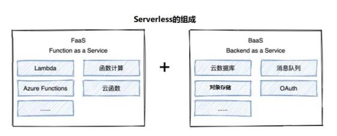

对象存储（Cloud Object Storage，COS）是一种存储海量文件的分布式存储服务，具有高扩展性、低成本、可靠安全等优点。通过控制台、API、SDK 和工具等多样化方式，用户可简 单、快速地接入 COS，进行多格式文件的上传、下载和管理，实现海量数据存储和管理

要想在 eggjs 中实现对象存储，使用之前需要确保 实现了 **配置multipart** 及为 **对应的模板表单** 设计成了**上传文件的格式**，然后再进行接下来的操作：

1. 首先，我们得安装对应的模块

```
cnpm i cos-nodejs-sdk-v5 --save
```

2. 然后在 **`service/tool.js`** 中定义相应的方法，cos.putObject 中的部分参数从 腾讯云 **存储桶概览** 中获取。

```javascript
const COS = require('cos-nodejs-sdk-v5');
class ToolsService extends Service {
    
   // getCosUploadFile 会被 controller 调用。由于 对象存储会自动帮我们创建目录，所以此处不需要使用 mkdirp模块
   async getCosUploadFile(filename) {
        // 1. 获取当前日期 2021 11 05
        let day = dayjs().format('YYYYMMDD')
        // 2. 生成文件名称 获取文件保存的目录
        let unix = this.getUnixTime();
        // 通过 path.extname(文件名) 可以获取到文件的后缀名
        // 此处不能使用 path.join，因为其会用 '\' 连接目录，而对象存储中 需要使用 '/'
        let saveDir = day + '/' + unix * 1000 + path.extname(filename)
        return saveDir
    }
    
    
    async uploadCos(filename, body) {
        let cos = new COS({
            // 此处的 SecretId 及 SecretKey 从腾讯云控制台中获取
            SecretId: 'AKID0qPr52nJaaJmzxe4D5g2B8pFOGrBDxSg',
            SecretKey: 'xxxx'
        });
        // 为了确保上传成功，需要把异步的cos.putObject改为同步，故此处返回一个 Promise。
        return new Promise((resolve, reject) => {
            cos.putObject({
                Bucket: 'eggshop-1308164762', /* 存储桶名称 */
                Region: 'ap-nanjing',    /* 地区名称 */
                Key: filename,              /* 上传文件名称 */
                StorageClass: 'STANDARD',
                Body: body, // 上传文件对象
                onProgress: function (progressData) {
                    console.log(JSON.stringify(progressData));
                }
            }, function (err, data) {
                if (!err) {
                    resolve(data)
                } else {
                    reject(err)
                }
            });
        })
    }
}
```

3. 在 **`controller/admin/product.js`** 中使用

```javascript
async doAdd() {
    const { ctx } = this;
    const body = ctx.request.body;
    // 文件信息
    const file = ctx.request.files[0];
    // 读取文件
    const source = fs.createReadStream(file.filepath);
    let filename = await this.service.tools.getCosUploadFile(file.filename)
    if (file) {
        // 异步
        // filename 为 日期名/事件戳文件名.文件名后缀 类型的字符串
        // source 为由 上传文件生成的写入流，将作为 上传的内容
        await this.ctx.service.tools.uploadCos(filename, source)
    }

    ctx.body = {
        body: body,
        files: file
    }
}
```

如此一来，便可以实现在本地将文件上传至 COS 对象存储。但要使得 部署到serverless 后也能实现对应功能，我们需要将服务器改为线上服务器，这就需要使用 **云数据库** 或 **云服务器配置数据库** ，本处使用第二种方式（由于没钱购买云数据库）：

1. 为云服务器配置mysql数据库并实现 端口暴露：

https://blog.csdn.net/qq_41154522/article/details/100528390

除了链接中所讲，我们还需要保证 对应服务器配置好了 mysql 端口对应的安全组（在对应云平台的控制台中国配置）

2. 本地连接上 远程mysql后，需要使用 Navicat 将本地数据库表的 SQL 文件 转储，然后
   1. 为远程mysql创建对应 数据库。
   2. 右键 数据库中的表，选择 运行SQL 文件，选择 转储的 SQL 文件，并进行运行。运行途中可能会产生一些高版本不适应低版本而带来的问题，可参考此文章解决： https://blog.csdn.net/sl1990129/article/details/103386597

3. 修改 **`config/config.default.js`** 中对应数据库配置

```javascript
// 配置数据库
config.sequelize = {
    dialect: 'mysql',
    host: '118.31.49.78',	// 服务器名
    port: 3306,			// mysql 端口
    username: 'root',		// mysql 用户名
    password: 'admin123',	// mysql 密码
    database: 'eggshop'		// 数据库名
}
```

4. 之后使用 **serverless deploy** ，便可以成功将项目部署到 serverless应用中心 中。

## 菜品详情调用富文本编辑器wysiwyg-editor

**`wysiwyg-editor`**：一个设计精美的基于 HTML5 的 WYSIWYG HTML 编辑器，它非常小但是非常强大。我们不仅 可以在 nodejs 中使用它，还可以在 vue 、 react 、angular 前端框架中使用，并还可以在 PHP, .NET, Java, and Python 等其他后端语言使用。

官方文档： https://froala.com/wysiwyg-editor/docs/options

### Nodejs 中使用 wysiwyg-editor

在需要使用到 wysiwyq-editor 的地方引入 样式文件及 js代码。并定义一个 textarea，为其指定一个 id。最后 使用 js 为其进行初始化即可。在初始化的过程中我们还可以为其 指定配置项来将富文本 设计成我们想要的样子。

```html
<% include ../public/page_nav.html %>
    <link href="/public/wysiwyg/css/froala_editor.pkgd.min.css" rel="stylesheet" type="text/css" />
    <script type="text/javascript" src="/public/wysiwyg/js/froala_editor.pkgd.min.js"></script>
    <script type="text/javascript" src="/public/wysiwyg/js/languages/zh_cn.js"></script>

    <div class="panel panel-default">
        <div class="panel-heading">
            增加菜品
        </div>
        <div class="panel-body">
            <div class="table-responsive input-form">
                <!-- 此处需要在 地址 中传入 csrf，同时修改 表单的 enctype -->
                <form action="/<%=adminPath%>/product/doAdd?_csrf=<%=csrf%>" method="post"
                    enctype="multipart/form-data">

                    <ul>
                        <li> <label class="col-sm-1">菜品名称: </label>
                            <div class="col-sm-11"><input type="text" name="title" /></div>
                        </li>
                        <li> <label class="col-sm-1">菜品图片: </label>
                            <div class="col-sm-11"><input type="file" name="picUrl"></div>
                        </li>

                        <li> <label class="col-sm-1">菜品详情: </label>
                            <div class="col-sm-11"><textarea name="content" id="content"></textarea></div>
                        </li>
                        <li>
                            <br />
                            <button type="submit" class="btn btn-default">提交</button>
                        </li>
                    </ul>
                </form>
            </div>
        </div>


    </div>
    <script>
        new FroalaEditor('#content', {
            height: 300,		// 定义富文本高度
            language: "zh_cn",	// 定义语言包（需要先引入）
            attribution: false,   // 去掉版权
            toolbarButtons: {	// 自定义导航栏
                'moreText': {
                    'buttons': ['bold', 'italic', 'underline', 'strikeThrough', 'subscript', 'superscript', 'fontFamily', 'fontSize', 'textColor', 'backgroundColor', 'inlineClass', 'inlineStyle', 'clearFormatting']
                },
                'moreParagraph': {
                    'buttons': ['alignLeft', 'alignCenter', 'formatOLSimple', 'alignRight', 'alignJustify', 'formatOL', 'formatUL', 'paragraphFormat', 'paragraphStyle', 'lineHeight', 'outdent', 'indent', 'quote']
                },
                'moreRich': {
                    'buttons': ['insertLink', 'insertImage', 'insertVideo', 'insertTable', 'emoticons', 'fontAwesome', 'specialCharacters', 'embedly', 'insertFile', 'insertHR']
                },
            }
        });
    </script>
    </body>

    </html>
```

## 在富文本编辑器中配置图片上传

wysiwyg 中有一个配置项可以设置 上传图片 所对应的POST 接口地址，我们可以对其进行配置：

```javascript
new FroalaEditor('#content', {
    // imageUploadURL: '/<%=adminPath%>/product/doUpload?_csrf=<%=csrf%>',     // 此处需要添加 csrf 字符串，或者在 config 中针对一些地址关闭 csrf 安全验证
    imageUploadURL: '/<%=adminPath%>/product/doUpload',     
});
```

同时，由于此处的图片上传也会触发 eggjs 中的 csrf 验证，所以我们需要对其进行 csrf 配置，可以在地址结尾进行配置，也可以在 **`config/config.default.js`** 中进行配置：

```javascript
// 配置 csrf
config.security = {
    csrf: {
        // 判断是否需要 ignore 的方法，请求上下文 context 作为第一个参数
        ignore: ctx => {
            if (ctx.request.url === `/${config.adminPath}/product/doUpload`) {
                return true;
            }
            return false;
        }
    }
}
```

设置完了 图片上传地址后，我们便可以为其 设计路由 及 对应控制器了：

**`router.js`**

```javascript
router.post(`/${config.adminPath}/product/doUpload`, controller.admin.product.doUpload)
```

**`controller/admin/product.js`**

```javascript
async doUpload() {
    const { ctx } = this;
    const body = ctx.request.body;
    // 文件信息
    const file = ctx.request.files[0];
    if (file) {
        // 读取文件
        const source = fs.createReadStream(file.filepath);
        // 此处 要将 filename 定义为 var ，若为 let 则其在块作用域中，外面无法访问。
        var filename = await this.service.tools.getCosUploadFile(file.filename)
        // 异步
        await this.ctx.service.tools.uploadCos(filename, source)
    }

    ctx.body = {
        link: this.config.cosUrl + "/" + filename
    }
}
```

## 后台菜品的增删改查

首先创建好对应的表 及 数据模型：

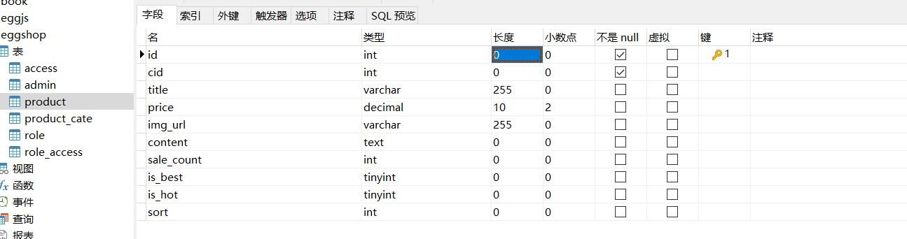

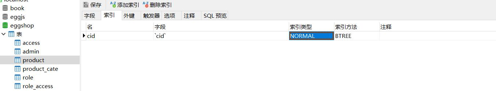

**`model/product.js`**

```javascript
'use strict'
module.exports = app => {
    const { STRING, INTEGER, TEXT, DECIMAL } = app.Sequelize;
    const Product = app.model.define('Product', {
        id: { type: INTEGER, primaryKey: true, autoIncrement: true },
        cid: INTEGER(11),
        title: STRING(255),
        price: DECIMAL(10, 2),
        imgUrl: STRING(255),
        content: TEXT,
        saleCount: INTEGER(11),
        isBest: INTEGER(1),
        isHot: INTEGER(1),
        status: INTEGER(1),
        sort: INTEGER(11),
        addTime: INTEGER(11),
    }, {
        timestamps: false, //自动增加创建时间 
        tableName: 'product' //设置表名称
    });
    Product.associate = function () { // 1 对 1 
        app.model.Product.belongsTo(app.model.ProductCate, { foreignKey: 'cid' });
    }
    return Product;
};
```

### 后台菜品的增加

实现增加的注意点：

1. 表单 格式需要改为 **`multipart/form-data`**，且要么在 提交地址添加 _csrf 参数，要么为表单添加一个 name 为 csrf 的隐藏域传递 _csrf 参数。
2. 由于表单中有图片，在 **后端控制器** 中，我们需要进行 cos 文件上传操作，并将 后半段文件路径 作为 imgUrl 存入数据库中。

**`view/admin/product/add.html`**

```html
<% include ../public/page_nav.html %>
    <link href="/public/wysiwyg/css/froala_editor.pkgd.min.css" rel="stylesheet" type="text/css" />
    <script type="text/javascript" src="/public/wysiwyg/js/froala_editor.pkgd.min.js"></script>
    <script type="text/javascript" src="/public/wysiwyg/js/languages/zh_cn.js"></script>

    <div class="panel panel-default">
        <div class="panel-heading">
            增加菜品
        </div>
        <div class="panel-body">
            <div class="table-responsive input-form">
                <form action="/<%=adminPath%>/product/doAdd?_csrf=<%=csrf%>" method="post"
                    enctype="multipart/form-data">
                    <ul>
                        <li class="col-sm-11">
                            <label class="col-sm-2">菜品分类:</label>
                            <div class="col-sm-10">
                                <select name="cid" id="cid">
                                    <%for(var i=0;i<cateList.length;i++){%>
                                        <option value="<%=cateList[i].id%>">
                                            <%=cateList[i].title%>
                                        </option>
                                        <%}%>
                                </select>
                            </div>
                        </li>

                        <li class="col-sm-11">
                            <label class="col-sm-2">菜品名称:</label>
                            <div class="col-sm-10">
                                <input type="text" name="title" />
                            </div>
                        </li>

                        <li class="col-sm-11">
                            <label class="col-sm-2">菜品图片:</label>
                            <div class="col-sm-10">
                                <input type="file" name="imgUrl">
                            </div>
                        </li>

                        <li class="col-sm-11">

                            <label class="col-sm-2">菜品价格:</label>
                            <div class="col-sm-10">
                                <input type="text" name="price" value="10" /> <i>单位：元</i>
                            </div>
                        </li>

                        <li class="col-sm-11">
                            <label class="col-sm-2">菜品排序:</label>
                            <div class="col-sm-10">
                                <input type="text" name="sort" value="100" />
                            </div>
                        </li>

                        <li class="col-sm-11">
                            <label class="col-sm-2"> 菜品状态:</label>
                            <div class="col-sm-10">
                                <input type="radio" name="status" checked value="1" id="a" /> <label for="a">显示</label>
                                &nbsp;&nbsp;
                                <input type="radio" name="status" value="0" id="b" /><label for="b">隐藏</label>
                            </div>
                        </li>

                        <li class="col-sm-11">
                            <label class="col-sm-2">加入推荐:</label>
                            <div class="col-sm-10">
                                <input type="checkbox" value="1" name="isBest" checked id="is_best"> <label
                                    for="is_best">精品</label> &nbsp;&nbsp;
                                <input type="checkbox" value="1" name="isHot" checked id="is_hot"> <label
                                    for="is_hot">热销</label>
                            </div>
                        </li>

                        <li class="col-sm-11">
                            <label class="col-sm-2">菜品详情:</label>
                            <div class="col-sm-10">
                                <textarea name="content" id="content" cols="30" rows="10"></textarea>
                            </div>
                        </li>

                        <li class="col-sm-11">
                            <br />
                            <button type="submit" class="btn btn-primary">提交</button>
                        </li>
                    </ul>


                </form>
            </div>
        </div>


    </div>
    <script>
        new FroalaEditor('#content', {
            height: 300,
            language: "zh_cn",
            attribution: false,   // 去掉版权
            toolbarButtons: {
                'moreText': {
                    'buttons': ['bold', 'italic', 'underline', 'strikeThrough', 'subscript', 'superscript', 'fontFamily', 'fontSize', 'textColor', 'backgroundColor', 'inlineClass', 'inlineStyle', 'clearFormatting']
                },
                'moreParagraph': {
                    'buttons': ['alignLeft', 'alignCenter', 'formatOLSimple', 'alignRight', 'alignJustify', 'formatOL', 'formatUL', 'paragraphFormat', 'paragraphStyle', 'lineHeight', 'outdent', 'indent', 'quote']
                },
                'moreRich': {
                    'buttons': ['insertLink', 'insertImage', 'insertVideo', 'insertTable', 'emoticons', 'fontAwesome', 'specialCharacters', 'embedly', 'insertFile', 'insertHR']
                },
            },
            // imageUploadURL: '/<%=adminPath%>/product/doUpload?_csrf=<%=csrf%>',     // 此处需要添加 csrf 字符串，或者在 config 中针对一些地址关闭 csrf 安全验证
            imageUploadURL: '/<%=adminPath%>/product/doUpload',     // 此处需要添加 csrf 字符串，或者在 config 中针对一些地址关闭 csrf 安全验证
        });
    </script>
    </body>

    </html>
```

**`controller/admin/product.js`**

```javascript
async doAdd() {
        const { ctx } = this;
        const body = ctx.request.body;
        // 文件信息
        const file = ctx.request.files[0];

        let title = body.title;

        if (title !== "") {
            if (file) {
                // 读取文件
                var source = fs.createReadStream(file.filepath);
                var filename = await this.service.tools.getCosUploadFile(file.filename)
                // 异步 改成 同步
                await this.ctx.service.tools.uploadCos(filename, source)
            }

            await this.ctx.model.Product.create({
                ...body,
                imgUrl: file ? filename : "",
                status: 1,
                addTime: this.ctx.service.tools.getUnixTime()
            })
            await this.success('增加菜品成功', `/${this.config.adminPath}/product`)
        } else {
            await this.error("菜品名称不能为空", `/${this.config.adminPath}/product/add`)
        }


    }
```

### 后台菜品的显示

需要注意的是：

1. 后台菜品中的分类需要与 分类 表进行关联查询（我们在定义模型时已经定义）
2. 菜品图片为 相对地址，我们需要在 中间件中 添加全局的路径变量。

**`middleware/adminAuth.js`**

```javascript
ctx.state.adminPath = app.config.adminPath;     // 获取后台地址
```


**`view/admin/product/index.html`**

```html
<% include ../public/page_nav.html %>

    <!--
        列表展示
    -->
    <div class="panel panel-default">
        <div class="panel-heading">
            <a href="/<%=adminPath%>/product/add" class="btn btn-primary">增加菜品</a>
        </div>
        <div class="table-responsive">
            <table class="table table-bordered">
                <thead>
                    <tr class="th">
                        <th>菜品名称</th>
                        <th>菜品分类</th>
                        <th>菜品图片</th>
                        <th>增加时间</th>
                        <th class="text-center">排序</th>
                        <th class="text-center">推荐</th>
                        <th class="text-center">热销</th>
                        <th class="text-center">状态</th>

                        <th class="text-center">操作</th>
                    </tr>
                </thead>
                <%for(var i=0;i<list.length;i++){%>
                    <tr>

                        <td>
                            <%=list[i].title%>
                        </td>
                        <td>
                            <%=list[i].ProductCate.title%>
                        </td>
                        <td>/<%=list[i].imgUrl%>" alt="" srcset=""></td>

                        <td>
                            <%=helper.formatTime(list[i].addTime)%>
                        </td>

                        <td class="text-center">
                            <%=list[i].sort%>
                        </td>

                        <td class="text-center">

                            <%if(list[i].isBest==1)else%>
                        </td>

                        <td class="text-center">

                            <%if(list[i].isHot==1)else%>
                        </td>

                        <td class="text-center">

                            <%if(list[i].status==1)else%>
                        </td>

                        <td class="text-center">

                            <a href="/<%=adminPath%>/product/edit?id=<%=list[i].id%>">编辑</a>　

                            <a class="delete" href="/<%=adminPath%>/product/delete?id=<%=list[i].id%>">删除</a>
                        </td>
                    </tr>
                    <%}%>


            </table>
        </div>

    </div>
    </body>

    </html>
```

**`controller/admin/product.js`**

```javascript
async index() {
    let result = await this.ctx.model.Product.findAll({
        include: { model: this.ctx.model.ProductCate }
    })

    await this.ctx.render("admin/product/index", {
        list: result
    })
}
```

### 后台菜品的修改

注意：

1. 修改时要判断 菜品 名称与价格 不能为空
2. 修改时，要分为用户有上传图片 与 用户没有上传图片 两种情况。

路由及对应控制器：

**`router.js`**

```javascript
  router.get(`/${config.adminPath}/product/edit`, controller.admin.product.edit)
  router.post(`/${config.adminPath}/product/doEdit`, controller.admin.product.doEdit)
```

**`controller/admin/product.js`**

```javascript
    async edit() {
        let id = this.ctx.request.query.id
        // 获取所有分类
        let cateResult = await this.ctx.model.ProductCate.findAll();

        // 获取修改的数据
        let productResult = await this.ctx.model.Product.findAll({
            where: {
                id
            }
        })

        await this.ctx.render('admin/product/edit', {
            cateList: cateResult,
            product: productResult[0]
        })
    }

    async doEdit() {
        const { ctx } = this;
        const body = ctx.request.body;
        const file = ctx.request.files[0];

        if (body.title === "") {
            await this.error("菜品名称不能为空", `/${this.config.adminPath}/product/edit?id=${body.id}`)
            return;
        }
        if (body.price === "") {
            await this.error("菜品价格不能为空", `/${this.config.adminPath}/product/edit?id=${body.id}`)
            return;
        }
        let productObj = await this.ctx.model.Product.findByPk(body.id);
        if (!productObj) {
            await this.error("非法请求", `/${this.config.adminPath}/product/edit?id=${body.id}`)
            return;
        }

        if (file) {
            var source = fs.createReadStream(file.filepath)
            var filename = this.ctx.service.tools.getCosUploadFile(file.filename)
            // 异步改为同步
            await this.ctx.service.tools.uploadCos(filename, source)
            await productObj.update({
                ...body,
                // 如果上传了文件，还需要修改 imgUrl
                imgUrl: filename
            })
        } else {
            await productObj.update(body);
        }
        await this.success("修改菜品成功", `/${this.config.adminPath}/product`)
    }
```


模板：

**`view/admin/product/edit.html`**

```html
<% include ../public/page_nav.html %>
    <link href="/public/wysiwyg/css/froala_editor.pkgd.min.css" rel="stylesheet" type="text/css" />
    <script type="text/javascript" src="/public/wysiwyg/js/froala_editor.pkgd.min.js"></script>
    <script type="text/javascript" src="/public/wysiwyg/js/languages/zh_cn.js"></script>

    <div class="panel panel-default">
        <div class="panel-heading">
            修改菜品
        </div>
        <div class="panel-body">
            <div class="table-responsive input-form">
                <form action="/<%=adminPath%>/product/doEdit?_csrf=<%=csrf%>" method="post"
                    enctype="multipart/form-data">
                    <input type="hidden" name="id" value="<%= product.id%>">
                    <ul>
                        <li class="col-sm-11">
                            <label class="col-sm-2">菜品分类:</label>
                            <div class="col-sm-10">
                                <select name="cid" id="cid">
                                    <%for(var i=0;i<cateList.length;i++){%>
                                        <option <%if(cateList[i].id===product.cid)%>
                                                value="<%=cateList[i].id%>">
                                                    <%=cateList[i].title%>
                                        </option>
                                        <%}%>
                                </select>
                            </div>
                        </li>

                        <li class="col-sm-11">
                            <label class="col-sm-2">菜品名称:</label>
                            <div class="col-sm-10">
                                <input type="text" name="title" value="<%= product.title %>" />
                            </div>
                        </li>

                        <li class="col-sm-11">
                            <label class="col-sm-2">菜品图片:</label>
                            <div class="col-sm-10">
                                <input type="file" name="imgUrl">
                                <br />
                                <br />
                                <%if(product.imgUrl!==""){%>
                                    /<%=product.imgUrl%>" alt="">
                                    <%}%>
                            </div>
                        </li>

                        <li class="col-sm-11">

                            <label class="col-sm-2">菜品价格:</label>
                            <div class="col-sm-10">
                                <input type="text" name="price" value="<%= product.price%>" /> <i>单位：元</i>
                            </div>
                        </li>

                        <li class="col-sm-11">
                            <label class="col-sm-2">菜品排序:</label>
                            <div class="col-sm-10">
                                <input type="text" name="sort" value="100" value="<%= product.sort%>" />
                            </div>
                        </li>

                        <li class="col-sm-11">
                            <label class="col-sm-2"> 菜品状态:</label>
                            <div class="col-sm-10">
                                <input type="radio" name="status" <%if(product.status===1)%> value="1"
                                    id="a"
                                    /> <label for="a">显示</label>
                                    &nbsp;&nbsp;
                                    <input type="radio" name="status" value="0" id="b"
                                        <%if(product.status===0)%> /><label for="b">隐藏</label>
                            </div>
                        </li>

                        <li class="col-sm-11">
                            <label class="col-sm-2">加入推荐:</label>
                            <div class="col-sm-10">
                                <input type="checkbox" value="1" name="isBest" <%if(product.isBest===1)%>
                                    id="is_best"> <label for="is_best">精品</label> &nbsp;&nbsp;
                                    <input type="checkbox" value="1" name="isHot" <%if(product.isHot===1)%>
                                        id="is_hot"> <label for="is_hot">热销</label>
                            </div>
                        </li>

                        <li class="col-sm-11">
                            <label class="col-sm-2">菜品详情:</label>
                            <div class="col-sm-10">
                                <textarea name="content" id="content" cols="30"
                                    rows="10"><%= product.content%></textarea>
                            </div>
                        </li>

                        <li class="col-sm-11">
                            <br />
                            <button type="submit" class="btn btn-primary">提交</button>
                        </li>
                    </ul>


                </form>
            </div>
        </div>


    </div>
    <script>
        new FroalaEditor('#content', {
            height: 300,
            language: "zh_cn",
            attribution: false,   // 去掉版权
            toolbarButtons: {
                'moreText': {
                    'buttons': ['bold', 'italic', 'underline', 'strikeThrough', 'subscript', 'superscript', 'fontFamily', 'fontSize', 'textColor', 'backgroundColor', 'inlineClass', 'inlineStyle', 'clearFormatting']
                },
                'moreParagraph': {
                    'buttons': ['alignLeft', 'alignCenter', 'formatOLSimple', 'alignRight', 'alignJustify', 'formatOL', 'formatUL', 'paragraphFormat', 'paragraphStyle', 'lineHeight', 'outdent', 'indent', 'quote']
                },
                'moreRich': {
                    'buttons': ['insertLink', 'insertImage', 'insertVideo', 'insertTable', 'emoticons', 'fontAwesome', 'specialCharacters', 'embedly', 'insertFile', 'insertHR']
                },
            },
            // imageUploadURL: '/<%=adminPath%>/product/doUpload?_csrf=<%=csrf%>',     // 此处需要添加 csrf 字符串，或者在 config 中针对一些地址关闭 csrf 安全验证
            imageUploadURL: '/<%=adminPath%>/product/doUpload',     // 此处需要添加 csrf 字符串，或者在 config 中针对一些地址关闭 csrf 安全验证
        });
    </script>
    </body>

    </html>
```


### 后台菜品的删除

注意：

1. 删除时要同时删除掉 COS 中存储的图片数据

首先在 **`service/tools.js`** 中定义好删除图片的异步方法：

```javascript
async deleteCos(filename) {
        let cos = new COS({
            SecretId: this.config.cosObject.SecretId,
            SecretKey: this.config.cosObject.SecretKey
        });
        return new Promise((resolve, reject) => {
            cos.deleteObject({
                Bucket: this.config.cosObject.Bucket,   /* 必须 */
                Region: this.config.cosObject.Region,
                Key: filename
            }, function (err, data) {
                if (!err) {
                    resolve(data)
                } else {
                    reject(err)
                }
            })
        })
    }
```

然后定义好对应的路由 及 控制器：

**`controller/admin/product.js`**

```javascript
async delete() {
        try {
            const id = this.ctx.request.query.id;
            const product = await this.ctx.model.Product.findByPk(id);
            if (!product) {
                await this.error("非法请求", `/${this.config.adminPath}/product`)
                return
            }
            // 删除对象存储中的图片
            await this.ctx.service.tools.deleteCos(product.imgUrl);
            const result = await product.destroy();
            await this.success("删除数据成功", `/${this.config.adminPath}/product`)
        } catch (error) {
            await this.error("非法请求", `/${this.config.adminPath}/product`)
        }
    }
```

**`router.js`**

```javascript
router.get(`/${config.adminPath}/product/delete`, controller.admin.product.delete)
```

## 封装公共方法通过Ajax 异步改变数据状态

主要思路：

1. 首先为 状态那一栏 添加一个指定的类，用于监视点击事件。然后为其添加四个自定义参数（请求路径头、数据对应id、数据所在模块、数据名称）。
2. 定义一个点击事件，当触发时，根据 请求路径头加 后台改变状态的接口发送 ajax 请求，请求需要带上 数据所在模块、数据对应id及 数据名称作为参数。
3. 后端接收到请求后，根据 数据所在模块、数据对应id 及 数据名称 去执行修改操作，并给前端传递一个 表示修改成功与否的参数。
4. 前端根据参数，来进行界面img 属性的修改。

前端：

**`view/admin/product/index.html`**

```html
<td class="text-center chStatus" data-adminPath="<%=adminPath%>" data-id="<%=list[i].id%>"
    data-model="Product" data-field="isBest">

    <%if(list[i].isBest==1)else%>
                </td>

            <td class="text-center chStatus" data-adminPath="<%=adminPath%>" data-id="<%=list[i].id%>"
                data-model="Product" data-field="isHot">

                <%if(list[i].isHot==1)else%>
                            </td>

                        <td class="text-center chStatus" data-adminPath="<%=adminPath%>" data-id="<%=list[i].id%>"
                            data-model="Product" data-field="status">

                            <%if(list[i].status==1)else%>
                                        </td>
```

**`public/admin/js/base.js`**

```javascript
$(function () {
	app.init();
})

var app = {
	init: function () {
		...
		this.changeStatus();
	},
    ...
	changeStatus() {
		$(".chStatus").click(function () {
			var adminPath = $(this).attr("data-adminPath");
			var id = $(this).attr("data-id");
			var model = $(this).attr("data-model");
			var field = $(this).attr("data-field");
			var el = $(this).find("img");
			$.get("/" + adminPath + "/changeStatus", { "id": id, "model": model, "field": field }, function (response) {
				if (response.success) {
					if (el.attr("src").indexOf("yes") != -1) {
						el.attr("src", "/public/admin/images/no.gif");
					} else {
						el.attr("src", "/public/admin/images/yes.gif");
					}

				}
			})
		})
	}
}
```

后端：

**`router.js`**

```javascript
router.get(`/${config.adminPath}/changeStatus`, controller.admin.main.changeStatus);
```

**`controller/admin/main.js`**

```javascript
async changeStatus() {
    let model = this.ctx.request.query.model; /*数据库表 Model  Product*/
    let field = this.ctx.request.query.field; /*更新的字段 如:status   is_best */
    let id = this.ctx.request.query.id; /*更新的 id*/

    let modelObj = await this.ctx.model[model].findByPk(id);
    let json = {};

    if (!modelObj) {
        this.ctx.body = { "success": false, "msg": "参数错误" };
        return;
    } else {
        if (modelObj[field] == 1) {
            json = {  /*es6 属性名表达式 注意作用域*/
                [field]: 0
            }
        } else {
            json = {
                [field]: 1
            }
        }
        // update 如果是通过 模型.update 调用的话，需要为其传入 where
        await modelObj.update(json);
        this.ctx.body = { "success": true, "msg": "更新数据成功" };
    }
}
```

## 实现分页及修改数据后返回原页

### 实现分页

本处实现分页主要依靠 jquery 插件：[jqPaginator](https://github.com/keenwon/jqPaginator)

前端：

引入 jqPaginator （引入它之前需要确保引入了bootstrap 的 css、js，及jquery）。定义一个 div 当做分页容器，然后在 js 中初始化。

如此一来，便实现了分页组件的渲染。而 初始化 时的参数：totalPages(总页数)、currentPage(当前页数)，需要靠 后端传入。同时为其绑定一个 **onPageChange** 事件，当事件发生 改变时（触发此事件的时机：页面初始化、点击分页按钮），确保其是通过点击分页按钮触发的事件之后，通过 **location.href**，传入页面参数，来实现页面跳转（需要后端配合）。

**`view/admin/product/index.html`**

```html
<% include ../public/page_nav.html %>
    <script type="text/javascript" src="/public/admin/js/jq-paginator.js"></script>
    ...
    <div id="pagination1" class="pagination" style="display: flex;justify-content: center;">

    </div>
    <script type="text/javascript">
        $('#pagination1').jqPaginator({
            totalPages: <%= totalPages %>,
            visiblePages: 10,
            currentPage: <%= page %>,
            onPageChange: function (num, type) {
                if (type === "change") {
                    location.href = "/<%= adminPath%>/product?page=" + num
                }
            }
        })
    </script>
    </body>

    </html>
```

后端：

**`controller/admin/product.js`**

```javascript
async index() {
        let page = this.ctx.request.query.page ? this.ctx.request.query.page : 1
        const pageSize = 2
        let result = await this.ctx.model.Product.findAll({
            include: { model: this.ctx.model.ProductCate },
            limit: pageSize,
            offset: (page - 1) * pageSize
        })

        let total = await this.ctx.model.Product.count()

        await this.ctx.render("admin/product/index", {
            list: result,
            totalPages: Math.ceil(total / pageSize),
            page
        })
    }
```

### 修改、删除数据后返回原页

要想实现此功能，主要是依靠 eggjs 中提供的 **request.headers['referer']**，来获取上一页的路径。

首先在中间件 **`middleware/adminAuth.js`** 中存储上一页路径到 全局变量：

```javascript
ctx.state.prevPage = ctx.request.headers['referer'];        // 获取上一页的地址
```

之后，在修改操作中，先将 **prevPage**通过全局变量的方式获取， 在 edit 页面渲染时传给一个 隐藏表单域，然后当点击提交时，触发 doEdit 控制器，通过 this.ctx.request.body.prevPage 获取。然后将其作为 修改成功后的跳转路径。（考虑到 doEdit 前还有一个 eidt 路径）

​	在删除操作中，可以直接通过全局变量的方式获取，然后传给删除成功的函数，作为删除成功后的跳转路径。

**`controller/admin/product.js`**

```javascript
	async edit() {
        ...

        await this.ctx.render('admin/product/edit', {
            cateList: cateResult,
            product: productResult[0],
            prevPage: this.ctx.state.prevPage
        })
    }

    async doEdit() {
        const { ctx } = this;
        const body = ctx.request.body;
        
        ...
        
        let prevPage = body.prevPage ? body.prevPage : `/${this.config.adminPath}/product`
        await this.success("修改菜品成功", prevPage);
    }

    async delete() {
        let prevPage = this.ctx.state.prevPage
        try {
            ...
            let prevPage = body.prevPage ? body.prevPage : `/${this.config.adminPath}/product`
            await this.success("删除数据成功", prevPage)
        } catch (error) {
            await this.error("非法请求", `/${this.config.adminPath}/product`)
        }
    }
```

**`view/admin/product/edit.html`**

```html
<input type="hidden" name="prevPage" value="<%= prevPage%>">
```

## 桌号的增删改查

桌号的增删改查与 其它模块类似，主要步骤

1. 配置好对应的 路由 及 控制器
2. 设计好对应的 页面
3. 通过 页面传递的 数据 对数据模型 进行增删改查 操作

**`controller/admin/table.js`**

```javascript
'use strict';

const BaseController = require('./base');

class TableController extends BaseController {
    async index() {
        let result = await this.ctx.model.Table.findAll()
        await this.ctx.render('admin/table/index', {
            list: result
        })
    }
    async add() {
        await this.ctx.render('admin/table/add', {})
    }

    async doAdd() {
        // 获取表单返回的数据
        let { tableNum, description, title, sort } = this.ctx.request.body;
        if (tableNum != "") {
            await this.ctx.model.Table.create({
                title,
                tableNum,
                status: 1,
                sort,
                addTime: this.ctx.service.tools.getUnixTime()
            })
            await this.success("增加桌号成功", `/${this.config.adminPath}/table`)
        } else {
            await this.error('桌号不能为空', `/${this.config.adminPath}/table/add`)
        }
    }

    async edit() {
        try {
            const id = this.ctx.request.query.id;
            const result = await this.ctx.model.Table.findAll({
                where: {
                    id
                }
            });
            await this.ctx.render("admin/table/edit", {
                list: result[0]
            });
        } catch (error) {
            await this.error("非法请求", `/${this.config.adminPath}/table`)
        }
    }

    async doEdit() {
        const { title, tableNum, sort, status, id } = this.ctx.request.body;
        if (tableNum === "") {
            await this.success("桌号不能为空", `/${this.config.adminPath}/table/edit?id=${id}`)
            return
        }
        const table = await this.ctx.model.Table.findByPk(id);
        if (!table) {
            await this.error("非法请求", `/${this.config.adminPath}/table/edit?id=${id}`)
            return
        }
        const result = await table.update({ title, tableNum, sort, status })
        await this.success("修改数据成功", `/${this.config.adminPath}/table`)
    }

    async delete() {
        try {
            const id = this.ctx.request.query.id;
            const table = await this.ctx.model.Table.findByPk(id);
            if (!table) {
                await this.error("非法请求", `/${this.config.adminPath}/table`)
                return
            }
            const result = await table.destroy()
            await this.success("删除数据成功", `/${this.config.adminPath}/table`)
        } catch (error) {
            await this.error("非法请求", `/${this.config.adminPath}/table`)
        }
    }
}

module.exports = TableController;

```

**`router.js`**

```javascript
router.get(`/${config.adminPath}/table`, controller.admin.table.index)
router.get(`/${config.adminPath}/table/add`, controller.admin.table.add)
router.post(`/${config.adminPath}/table/doAdd`, controller.admin.table.doAdd)
router.get(`/${config.adminPath}/table/edit`, controller.admin.table.edit)
router.post(`/${config.adminPath}/table/doEdit`, controller.admin.table.doEdit)
router.get(`/${config.adminPath}/table/delete`, controller.admin.table.delete)
```

**`view/admin/table/add.html`**

```html
<% include ../public/page_nav.html %>


    <div class="panel panel-default">
        <div class="panel-heading">
            增加桌号
        </div>
        <div class="panel-body">
            <div class="table-responsive input-form">
                <form action="/<%=adminPath%>/table/doAdd" method="post">
                    <input type="hidden" name="_csrf" value="<%=csrf%>" />
                    <ul>
                        <li>名称: <input type="text" name="title" /></li>

                        <li>
                            桌号:
                            <input type="text" name="tableNum" />
                        </li>
                        <li>
                            状态:
                            <input type="radio" name="status" checked value="1" id="a" /> <label for="a">显示</label>
                            &nbsp;&nbsp;
                            <input type="radio" name="status" value="0" id="b" /><label for="b">隐藏</label>
                        </li>

                        <li>
                            <br />
                            <button type="submit" class="btn btn-default">提交</button>
                        </li>

                    </ul>


                </form>
            </div>
        </div>


    </div>

    </body>

    </html>
```

**`view/admin/table/edit.html`**

```html
<% include ../public/page_nav.html %>


    <div class="panel panel-default">
        <div class="panel-heading">
            修改桌号
        </div>
        <div class="panel-body">
            <div class="table-responsive input-form">
                <form action="/<%=adminPath%>/table/doEdit" method="post">
                    <input type="hidden" name="_csrf" value="<%=csrf%>" />
                    <input type="hidden" name="id" value="<%=list.id%>" />
                    <ul>
                        <li>名称: <input type="text" name="title" value="<%=list.title%>" /></li>

                        <li>
                            桌号:
                            <input type="text" name="tableNum" value="<%=list.tableNum%>" />
                        </li>
                        <li>
                            状态:
                            <input type="radio" name="status" <%if(list.status==1)%> value="1" id="a"/>
                                <label for="a">显示</label> &nbsp;&nbsp;
                                <input type="radio" name="status" <%if(list.status==0)%> value="0"
                                    id="b"/><label for="b">隐藏</label>
                        </li>

                        <li>
                            <br />
                            <button type="submit" class="btn btn-default">提交</button>
                        </li>

                    </ul>


                </form>
            </div>
        </div>


    </div>

    </body>

    </html>
```

**`view/admin/table/index.html`**

```html
<% include ../public/page_nav.html %>

    <!--
        列表展示
    -->
    <div class="table-responsive">
        <div class="panel-heading">
            <a href="/<%=adminPath%>/table/add" class="btn btn-primary">增加桌子</a>
        </div>
        <table class="table table-bordered">
            <thead>
                <tr class="th">
                    <th>桌子名称</th>
                    <th>桌号</th>
                    <th class="text-center">状态</th>
                    <th class="text-center">操作</th>
                </tr>
            </thead>
            <tbody>
                <%for(var i=0;i<list.length;i++){%>
                    <tr>

                        <td>
                            <%=list[i].title%>
                        </td>
                        <td>
                            <%=list[i].tableNum%>
                        </td>

                        <td class="text-center chStatus" data-adminPath="<%=adminPath%>" data-id="<%=list[i].id%>"
                            data-model="Table" data-field="status">

                            <%if(list[i].status==1)else%>
                        </td>

                        <td class="text-center">

                            <a href="/<%=adminPath%>/table/edit?id=<%=list[i].id%>">编辑</a>　

                            <a class="delete" href="/<%=adminPath%>/table/delete?id=<%=list[i].id%>">删除</a>
                        </td>
                    </tr>
                    <%}%>
            </tbody>
        </table>
    </div>


    </body>

    </html>
```

## 使用 qr-image 及 canvas 绘制二维码图片

思路：1. 首先使用 **qr-image** 来生成二维码。然后将该二维码 上传至 对象存储中。

​		   2. 使用 canvas 将原先 准备好的图片 与存储在 对象存储中的图片进行合成，并将返回的 流 也存储到对象存储中。

​		   3. 最终将 对象存储 的图片地址 返回给 要渲染的页面。

**`router.js`**

```javascript
router.get(`/${config.adminPath}/table/showCode`, controller.admin.table.showCode)
```

**`controller/admin/table.js`**

```javascript
async showCode() {
    const id = this.ctx.request.query.id;
    const table = await this.ctx.model.Table.findByPk(id);
    const qrImage = await this.ctx.service.tools.getQrImage('https://xxcijmz.top');

    const cosObj = await this.ctx.service.tools.uploadCos('code_01.png', qrImage)
    const canvasStream = await this.ctx.service.tools.getCanvasImage(
        table.title,
        'app/public/admin/images/bg.jpg',
        "https://" + cosObj.Location
    )


    const cosCodeObj = await this.ctx.service.tools.uploadCos('code_img_01.png', canvasStream)
    await this.ctx.render('admin/table/code', {
        codeUrl: "https://" + cosCodeObj.Location
    })
}
```

**`service/tools.js`**

```javascript
var qr = require('qr-image');

const { createCanvas, Image } = require('canvas')

...
	async getQrImage(qrText) {
        return new Promise((resolve, reject) => {
            try {
                const qrImage = qr.image(qrText, { type: 'png' });
                resolve(qrImage)
            } catch (error) {
                reject(error)
            }
        })
    }

    async getCanvasImage(text, bgDir, codeDir) {
        return new Promise((resolve, reject) => {
            try {
                const canvas = createCanvas(1417, 1417)
                const ctx = canvas.getContext('2d');    // 生成画布
                //绘制背景图片
                const img1 = new Image();
                img1.onload = () => {
                    ctx.drawImage(img1, 0, 0);
                    //填充文字  注意字体
                    ctx.font = '70px "Microsoft YaHei" bold'
                    ctx.fillStyle = "#d9292c";
                    ctx.fillText(text, 20, 1380);
                    const img2 = new Image();
                    img2.onload = () => {
                        ctx.drawImage(img2, 490, 421, 418, 418);
                        canvas.createPNGStream().pipe(fs.createWriteStream("out.png"));
                        resolve(canvas.createPNGStream());
                    }
                    img2.onerror = err => {
                        reject(err);
                    }

                    img2.src = codeDir;
                }
                img1.onerror = err => {
                    reject(err)
                }
                //需要注意顺序
                img1.src = bgDir;
            } catch (error) {
                reject(false)
            }
        })
    }
```

## 使用 html5 Canvas 合成图片二维码

由于 serverless 中不支持 node-canvas，所以我们需要 将代码修改为 用原生的 html5 canvas 绘制二维码。写法与 node-canvas 类似。

**`controller/table.js`**

```javascript
async showCode() {
        const id = this.ctx.request.query.id;
        const table = await this.ctx.model.Table.findByPk(id);
        const qrImage = await this.ctx.service.tools.getQrImage('https://xxcijmz.top');

        const cosObj = await this.ctx.service.tools.uploadCos('code_01.png', qrImage)
h
        // const cosCodeObj = await this.ctx.service.tools.uploadCos('code_img_01.png', canvasStream)
        await this.ctx.render('admin/table/code', {
            // codeUrl: "https://" + cosCodeObj.Location
            title: table.title,
            bg: '/public/admin/images/bg.jpg',
            qrBg: "https://" + cosObj.Location
        })
    }
```

**`view/admin/table/code.html`**

```html
<!DOCTYPE html>
<html lang="en">

<head>
    <title>Document</title>
    <style>
        body {
            background-color: rgb(212, 211, 211);
        }

        .content {
            display: flex;
            align-items: center;
            justify-content: center;
        }

        #codeImg {
            width: 800px;
            height: 800px;
        }
    </style>
</head>

<body>
    <div class="content">
        <canvas id="codeImg" width="1417" height="1417"></canvas>
    </div>
    <script type="text/javascript">
        const canvas = document.querySelector('#codeImg')
        const ctx = canvas.getContext('2d');    // 生成画布
        //绘制背景图片
        const img1 = new Image();
        img1.onload = () => {
            ctx.drawImage(img1, 0, 0);
            //填充文字  注意字体
            ctx.font = '70px "Microsoft YaHei"'
            ctx.fillStyle = "#d9292c";
            ctx.fillText('<%= title %>', 20, 1380);
            const img2 = new Image();
            img2.onload = () => {
                ctx.drawImage(img2, 490, 421, 418, 418);
            }
            img2.onerror = err => {
                console.log(err)
            }

            img2.src = "<%= qrBg %>";
        }
        img1.onerror = err => {
            console.log(err)
        }
        //需要注意顺序
        img1.src = "<%= bg %>";
    </script>
</body>

</html>
```

## 无人点餐系统 系统设置模块

关于 系统设置模块的完成，大致步骤与其余模块类似，需要注意的是：

1. 由于 eggjs 自带的 **Multipart** 模块有字段限制，所以当系统设置模块数据过多时，我们需要手动去修改 multipart 模块的配置。
2. 系统设置只有一条数据，所以我们可以在 提交表单中 设置一个 id 固定为 1 的隐藏域，来让 控制器 查询 id为 1 的数据。

实现步骤：

1. 建立对应数据库表 及 数据模型

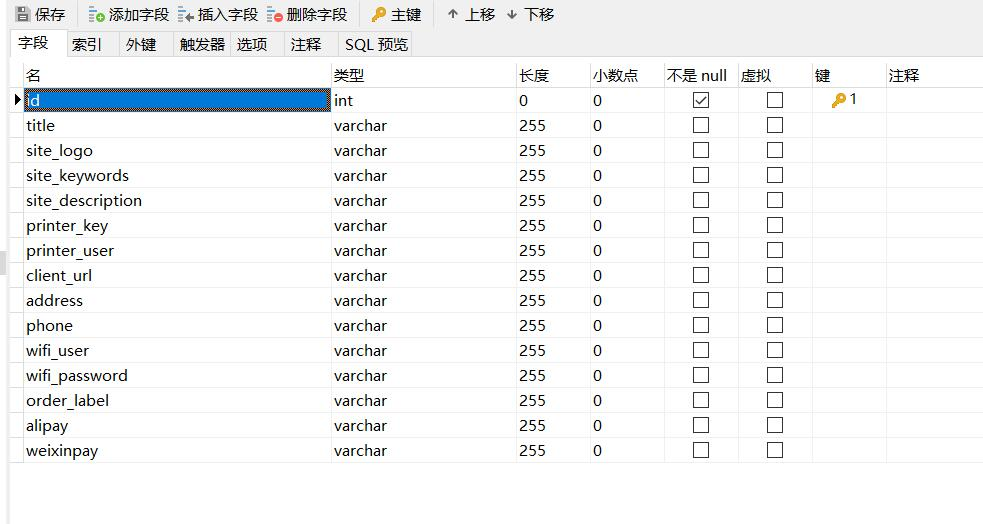

**`model/setting.js`**

```javascript
'use strict';
// Sequelize数据类型  http://bbs.itying.com/topic/60596c3b1bbeff13cc4cf0d6
module.exports = app => {
    const { STRING, INTEGER, DATE } = app.Sequelize;
    const Setting = app.model.define('setting', {
        id: { type: INTEGER, primaryKey: true, autoIncrement: true },
        title: STRING(255),
        siteLogo: STRING(255),
        siteKeywords: STRING(255),
        siteDescription: STRING(255),
        printerKey: STRING(255),
        printerUser: STRING(255),
        clientUrl: STRING(255),
        address: STRING(255),
        phone: STRING(255),
        wifiUser: STRING(255),
        wifiPassword: STRING(255),
        orderLabel: STRING(255),
        alipay: STRING(255),
        weixinpay: STRING(255)
    }, {
        timestamps: false, //自动增加创建时间 
        tableName: 'setting' //设置表名称
    });

    return Setting;
};
```

2. 配置 Multipart 的上传字段数

**`config/config.default.js`**

```javascript
// 配置文件上传的模式
config.multipart = {
    mode: 'file',
    fields: 20
};
```

3. 配置对应 路由 及控制器

**`router.js`**

```javascript
router.get(`/${config.adminPath}/setting`, controller.admin.setting.index)
router.post(`/${config.adminPath}/setting/doEdit`, controller.admin.setting.doEdit)
```

**`controller/admin/setting.js`**

```javascript
'use strict';

const BaseController = require('./base.js');
const fs = require('fs');
class SettingController extends BaseController {
    async index() {
        let result = await this.ctx.model.Setting.findAll();
        await this.ctx.render("admin/setting/index", {
            list: result[0]
        })

    }
    async doEdit() {
        const { ctx } = this;
        const body = ctx.request.body;
        const file = ctx.request.files[0];

        //获取要修改的数据
        let settingObj = await this.ctx.model.Setting.findByPk(body.id);
        if (!settingObj) {
            await this.error("非法请求", `/${this.config.adminPath}/setting`);
            return;
        }

        if (file) {
            var source = fs.createReadStream(file.filepath);
            var filename = await this.ctx.service.tools.getCosUploadFile(file.filename);
            //异步 改成 同步
            await this.ctx.service.tools.uploadCos(filename, source);
            await settingObj.update({
                ...body,
                siteLogo: filename,
            });
        } else {
            await settingObj.update(body);
        }
        await this.success("修改系统设置成功", `/${this.config.adminPath}/setting`);
    }
}

module.exports = SettingController;

```

4. 设计 模板页面

```html
<% include ../public/page_nav.html %>

    <div class="panel panel-default">
        <div class="panel-heading">
            系统设置
        </div>
        <div class="panel-body">
            <div class="table-responsive input-form">
                <form action="/<%=adminPath%>/setting/doEdit?_csrf=<%=csrf%>" method="post"
                    enctype="multipart/form-data">

                    <input type="hidden" name="id" value="1" />
                    <ul>
                        <li>
                            <label class="col-sm-2">网站标题:</label>

                            <div class="col-sm-10">
                                <input type="text" class="input" name="title" value="<%=list.title%>" />

                            </div>
                        </li>

                        <li style="height: 150px;"> <label class="col-sm-2">网站logo:</label>
                            <div class="col-sm-10">
                                <input type="file" name="siteLogo" />
                                <br />
                                /<%=list.siteLogo%>" />
                            </div>
                        </li>


                        <li> <label class="col-sm-2">小票打印机User:</label>

                            <div class="col-sm-10">
                                <input type="text" class="input" name="printerUser" value="<%=list.printerUser%>" />
                            </div>
                        </li>

                        <li>
                            <label class="col-sm-2">小票打印机Key:</label>

                            <div class="col-sm-10">
                                <input type="text" class="input" name="printerKey" value="<%=list.printerKey%>" />
                            </div>
                        </li>

                        <li>
                            <label class="col-sm-2">点餐系统域名:</label>

                            <div class="col-sm-10">
                                <input type="text" class="input" name="clientUrl" value="<%=list.clientUrl%>" />
                            </div>
                        </li>

                        <li>
                            <label class="col-sm-2">地址:</label>
                            <div class="col-sm-10">
                                <input type="text" class="input" name="address" value="<%=list.address%>" />
                            </div>
                        </li>
                        <li>
                            <label class="col-sm-2">电话:</label>
                            <div class="col-sm-10">
                                <input type="text" class="input" name="phone" value="<%=list.phone%>" />
                            </div>
                        </li>

                        <li>
                            <label class="col-sm-2">wifi用户名:</label>
                            <div class="col-sm-10">
                                <input type="text" class="input" name="wifiUser" value="<%=list.wifiUser%>" />
                            </div>
                        </li>

                        <li>
                            <label class="col-sm-2">wifi密码:</label>
                            <div class="col-sm-10">
                                <input type="text" class="input" name="wifiPassword" value="<%=list.wifiPassword%>" />
                            </div>
                        </li>

                        <li>
                            <label class="col-sm-2">口味信息:</label>
                            <div class="col-sm-10">
                                <input type="text" class="input" name="orderLabel" value="<%=list.orderLabel%>" />
                                <i>例如：少辣 不要葱 打包带走</i>
                            </div>
                        </li>

                        <li>
                            <label class="col-sm-2">支付宝支付设置:</label>
                            <div class="col-sm-10">
                                <input type="text" class="input" name="alipay" value="<%=list.alipay%>" />
                            </div>
                        </li>

                        <li>
                            <label class="col-sm-2">微信支付设置:</label>
                            <div class="col-sm-10">
                                <input type="text" class="input" name="weixinpay" value="<%=list.weixinpay%>" />
                            </div>
                        </li>
                        <li> <label class="col-sm-2">网站关键词:</label>
                            <div class="col-sm-10">
                                <input type="text" class="input" name="siteKeywords" value="<%=list.siteKeywords%>" />
                            </div>
                        </li>

                        <li> <label class="col-sm-2">网站描述:</label>
                            <div class="col-sm-10">
                                <textarea name="siteDescription"
                                    style="width:600px;"><%=list.siteDescription%></textarea>

                            </div>
                        </li>
                        <li>
                            <br />
                            <button type="submit" class="btn btn-default">提交</button>

                        </li>

                    </ul>

                </form>
            </div>
        </div>
    </div>
    </body>
    </html>
```

## 前后端分离 api 设计准备

思路：

1. 先将 router 进行划分为 admin 和 api 两个模块
2. 进行跨域插件配置。
3.  csrf 安全验证排除 api 接口。

### router 划分

新建 router 文件夹，并在其中创建 admin 及 api 两个文件，分别配置 admin 及 api 两种形式的路由：

**`router/admin.js`**

```javascript
module.exports = (app) => {
    const {
        router,
        controller,
        config
    } = app
    router.get('/', controller.default.home.index)

    router.get(`/${config.adminPath}`, controller.admin.main.index)

    router.get(`/${config.adminPath}/welcome`, controller.admin.main.welcome)
    router.get(`/${config.adminPath}/changeStatus`, controller.admin.main.changeStatus);

    router.get(`/${config.adminPath}/login`, controller.admin.login.index)
    router.get(`/${config.adminPath}/login/captcha`, controller.admin.login.captcha)
    router.post(`/${config.adminPath}/login/doLogin`, controller.admin.login.doLogin)
    router.get(`/${config.adminPath}/login/loginOut`, controller.admin.login.loginOut)

    router.get(`/${config.adminPath}/manager`, controller.admin.manager.index)
    router.get(`/${config.adminPath}/manager/add`, controller.admin.manager.add)
    router.post(`/${config.adminPath}/manager/doAdd`, controller.admin.manager.doAdd)
    router.get(`/${config.adminPath}/manager/edit`, controller.admin.manager.edit)
    router.post(`/${config.adminPath}/manager/doEdit`, controller.admin.manager.doEdit)
    router.get(`/${config.adminPath}/manager/delete`, controller.admin.manager.delete)

    router.get(`/${config.adminPath}/role`, controller.admin.role.index)
    router.get(`/${config.adminPath}/role/add`, controller.admin.role.add)
    router.post(`/${config.adminPath}/role/doAdd`, controller.admin.role.doAdd)
    router.get(`/${config.adminPath}/role/edit`, controller.admin.role.edit)
    router.post(`/${config.adminPath}/role/doEdit`, controller.admin.role.doEdit)
    router.get(`/${config.adminPath}/role/delete`, controller.admin.role.delete)
    router.get(`/${config.adminPath}/role/auth`, controller.admin.role.auth)
    router.post(`/${config.adminPath}/role/doAuth`, controller.admin.role.doAuth)

    router.get(`/${config.adminPath}/access`, controller.admin.access.index)
    router.get(`/${config.adminPath}/access/add`, controller.admin.access.add)
    router.post(`/${config.adminPath}/access/doAdd`, controller.admin.access.doAdd)
    router.get(`/${config.adminPath}/access/edit`, controller.admin.access.edit)
    router.post(`/${config.adminPath}/access/doEdit`, controller.admin.access.doEdit)
    router.get(`/${config.adminPath}/access/delete`, controller.admin.access.delete)

    router.get(`/${config.adminPath}/productCate`, controller.admin.productCate.index)
    router.get(`/${config.adminPath}/productCate/add`, controller.admin.productCate.add)
    router.post(`/${config.adminPath}/productCate/doAdd`, controller.admin.productCate.doAdd)
    router.get(`/${config.adminPath}/productCate/edit`, controller.admin.productCate.edit)
    router.post(`/${config.adminPath}/productCate/doEdit`, controller.admin.productCate.doEdit)
    router.get(`/${config.adminPath}/productCate/delete`, controller.admin.productCate.delete)

    router.get(`/${config.adminPath}/product`, controller.admin.product.index)
    router.get(`/${config.adminPath}/product/add`, controller.admin.product.add)
    router.post(`/${config.adminPath}/product/doAdd`, controller.admin.product.doAdd)
    router.post(`/${config.adminPath}/product/doUpload`, controller.admin.product.doUpload)
    router.get(`/${config.adminPath}/product/edit`, controller.admin.product.edit)
    router.post(`/${config.adminPath}/product/doEdit`, controller.admin.product.doEdit)
    router.get(`/${config.adminPath}/product/delete`, controller.admin.product.delete)

    router.get(`/${config.adminPath}/table`, controller.admin.table.index)
    router.get(`/${config.adminPath}/table/add`, controller.admin.table.add)
    router.post(`/${config.adminPath}/table/doAdd`, controller.admin.table.doAdd)
    router.get(`/${config.adminPath}/table/edit`, controller.admin.table.edit)
    router.post(`/${config.adminPath}/table/doEdit`, controller.admin.table.doEdit)
    router.get(`/${config.adminPath}/table/delete`, controller.admin.table.delete)
    router.get(`/${config.adminPath}/table/showCode`, controller.admin.table.showCode)

    router.get(`/${config.adminPath}/setting`, controller.admin.setting.index)
    router.post(`/${config.adminPath}/setting/doEdit`, controller.admin.setting.doEdit)
}
```

**`router/api.js`**

```javascript
module.exports = (app) => {
    const {
        router,
        controller,
        config
    } = app
    router.get('/api/v1', controller.api.v1.index)
    router.post('/api/v1/addCart', controller.api.v1.addCart)
}
```

最后在 **`router.js`** 中统一引入：

```javascript
'use strict'

/**
 * @param {Egg.Application} app - egg application
 */
module.exports = (app) => {
  const {
    router,
    controller,
    config
  } = app

  require('./router/admin')(app)
  require('./router/api')(app)
}
```


### 使用 egg-cors 解决跨域问题

1. 安装插件

```
cnpm i egg-cors --save
```

2. 在 **`config/plugin.js`** 中配置插件

```javascript
module.exports = {
    ...
  cors: {
    enable: true,
    package: 'egg-cors',
  }
}
```

3. 在 **`config/config.default.js`** 中进行插件选项配置

```javascript
config.security = {
    ...
	domainWhiteList: ['http://localhost:8080']
}
config.cors = {
    origin: '*',
    allowMethods: 'GET,PUT,POST,DELETE'   // 配置允许的请求方式
};
```

### 取消 前后端分离时接口 csrf 校验

由于前后端分离时，无法将 csrf 通过后端直接传给前端，所以此处需要将其中部分接口设置为不需要 csrf 校验：

**`config/config.default.js`**

```javascript
  // 配置 csrf
  config.security = {
    csrf: {
      // 判断是否需要 ignore 的方法，请求上下文 context 作为第一个参数
      ignore: ctx => {
        if (ctx.request.url === `/${config.adminPath}/product/doUpload` || ctx.request.url.indexOf('/api') !== -1) {
          return true;
        }
        return false;
      }
    },
      ...
  }
```

## 菜品列表，菜品详情 api 接口设计

本节主要注意点：

1. 查询 菜品列表时，需要 查 Product 表，并同时关联 ProductCate 表。
2. 查询到的数据需要进行 **排序处理**

步骤：

1. 在 ProductCate 模型中设置关联

**`model/productCate.js`**

```javascript
ProductCate.associate = function () {
    app.model.ProductCate.hasMany(app.model.Product, { foreignKey: 'cid' })
}
```

2. 设置对应 控制器 及路由

**`controller/api/v1.js`**

```javascript
'use strict';

const Controller = require('egg').Controller;

class V1Controller extends Controller {
    async productList() {
        const result = await this.ctx.model.ProductCate.findAll({
            include: {
                model: this.ctx.model.Product,
                attributes: ['id', 'cid', 'title', 'imgUrl', 'price', 'sort']
            },
            order: [
                ['sort', 'DESC'],
                [this.ctx.model.Product, 'sort', 'DESC']
            ]
        })

        this.ctx.body = {
            success: 1,
            result
        }
    }

    async productContent() {
        const id = this.ctx.request.query.id;
        const result = await this.ctx.model.Product.findByPk(id);

        if (result.length > 0) {
            this.ctx.body = {
                result,
                success: true
            }
        } else {
            this.ctx.body = {
                result: [],
                success: false
            }
        }
    }
}

module.exports = V1Controller;
```

**`router/api.js`**

```javascript
router.get('/api/v1/productList', controller.api.v1.productList)
router.get('/api/v1/productContent', controller.api.v1.productContent)
```

## 购物车相关接口设计

要实现相关接口前，首先得建立数据库表 及 对应模型

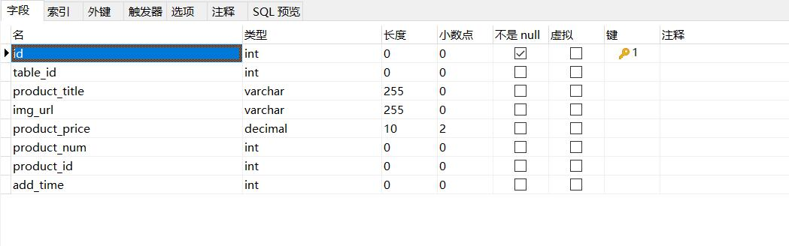

**`model/cart.js`**

```javascript
'use strict';

module.exports = app => {
    const { STRING, INTEGER, DECIMAL } = app.Sequelize;
    const Cart = app.model.define('cart', {
        id: { type: INTEGER, primaryKey: true, autoIncrement: true },
        tableId: INTEGER(11),
        productTitle: STRING(255),
        imgUrl: STRING(255),
        productPrice: DECIMAL(10, 2),
        productNum: INTEGER(11),
        productId: INTEGER(11),
        addTime: INTEGER(11)
    }, {
        timestamps: false, //自动增加创建时间 
        tableName: 'cart' //设置表名称
    });

    return Cart;
};
```

设置完后，便可设计 相关路由 及 控制器：

**`router\api.js`**

```javascript
router.get('/api/v1/cartList', controller.api.v1.carList)
router.post('/api/v1/addCart', controller.api.v1.addCart)
router.put('/api/v1/incCart', controller.api.v1.incCart)
router.put('/api/v1/decCart', controller.api.v1.decCart)
router.get('/api/v1/cartCount', controller.api.v1.cartCount)
```

**`controller/api/v1.js`**

```javascript
    async carList() {
        try {
            const tableId = this.ctx.request.query.tableId;
            const result = this.ctx.model.Cart.findAll({
                where: {
                    tableId
                }
            })
            this.ctx.body = { success: true, result }
        } catch (error) {
            this.ctx.body = { success: false, result: error }
        }
    }

    async addCart() {
        const { productId, tableId } = this.ctx.request.body

        const result = this.ctx.model.Cart.findAll({
            where: {
                productId,
                tableId
            }
        })

        if (result.length > 0) {
            this.ctx.model.Cart.update({
                productNum: result[0].productNum + 1
            }, {
                where: {
                    productId,
                    tableId
                }
            })
        } else {
            this.ctx.model.Cart.create({
                ...this.ctx.request.body,
                addTime: this.ctx.service.tools.getUnixTime()
            })
        }
        this.ctx.body = { "success": 'true', "msg": "增加数据成功" };
    }

    async incCart() {
        const { tableId, productId } = this.ctx.request.body
        try {
            const result = await this.ctx.model.Cart.findAll({
                where: {
                    tableId,
                    productId
                }
            })
            if (result.length > 0) {
                await this.ctx.model.Cart.update({
                    productNum: result[0].productNum + 1
                }, {
                    where: {
                        tableId,
                        productId
                    }
                })
                this.ctx.body = { success: true, msg: "更新成功" }
            } else {
                this.ctx.body = { success: false, msg: "更新失败" }
            }
        } catch (error) {
            this.ctx.body = { success: false, error }
        }
    }

    async decCart() {
        const { tableId, productId } = this.ctx.request.body
        try {
            const result = await this.ctx.model.Cart.findAll({
                where: {
                    tableId,
                    productId
                }
            })
            if (result.length > 0) {
                if (result[0].productNum !== 1) {
                    await this.ctx.model.Cart.update({
                        productNum: result[0].productNum - 1
                    }, {
                        where: {
                            tableId,
                            productId
                        }
                    })
                } else {
                    await this.ctx.model.Cart.destroy({
                        where: {
                            tableId,
                            productId
                        }
                    })
                }
                this.ctx.body = { success: true, msg: "更新成功" }
            } else {
                this.ctx.body = { success: false, msg: "更新失败" }
            }
        } catch (error) {
            this.ctx.body = { success: false, error }
        }
    }

    async cartCount() {
        const tableId = this.ctx.request.query.tableId
        try {
            const count = await this.ctx.model.Cart.sum('productNum', {
                where: {
                    tableId
                }
            })
            count = count?count:0
            this.ctx.body = { success: true, count }
        } catch (error) {
            this.ctx.body = { success: false, error }
        }
    }
```

## 获取口味列表 增加、修改用餐人数api

要想实现 增加、修改用餐人数的功能，需要 先建立相应的 数据表 及 模型：

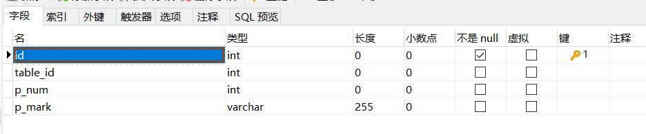

**`model/peopleInfo.js`**

```javascript
'use strict';
module.exports = app => {
    const { STRING, INTEGER, DATE } = app.Sequelize;

    const PeopleInfo = app.model.define('peopleInfo', {
        id: { type: INTEGER, primaryKey: true, autoIncrement: true },
        tableId: INTEGER(11),
        pNum: INTEGER(11),
        pMark: STRING(255)
    }, {
        timestamps: false, //自动增加创建时间 
        tableName: 'people_info' //设置表名称
    });
    return PeopleInfo;
};
```

然后设置 对应的路由 及 控制器：

**`router/api.js`**

```javascript
router.get('/api/v1/flavorList', controller.api.v1.flavorList);
router.post('/api/v1/addPeopleInfo', controller.api.v1.addPeopleInfo);
router.get('/api/v1/getPeopleInfo', controller.api.v1.getPeopleInfo);
```

**`controller/api/v1.js`**

```javascript
    // 获取口味列表
    async flavorList() {
        const flavor = await this.ctx.model.Setting.findAll({
            attributes: ['orderLabel']
        })

        while (flavor[0].orderLabel.indexOf('，') !== -1) {
            flavor[0].orderLabel = flavor[0].orderLabel.replace('，', ',')
        }

        this.ctx.body = flavor[0].orderLabel.split(',')
    }

    //增加修改用户用餐信息
    async addPeopleInfo() {
        const tableId = this.ctx.request.body.tableId;
        try {
            const result = await this.ctx.model.PeopleInfo.findAll({
                where: {
                    tableId
                }
            })
            if (result.length > 0) {
                await this.ctx.model.PeopleInfo.update({
                    pNum: result[0].pNum + 1
                })
                this.ctx.body = { "success": true, "msg": "更新成功" };
            } else {
                await this.ctx.model.PeopleInfo.create(this.ctx.request.body)
                this.ctx.body = { "success": true, "msg": "更新成功" };
            }
        } catch (error) {
            this.ctx.body = { "success": false, "msg": "更新失败" }
        }
    }

    // 获取用户用餐信息
    async getPeopleInfo() {
        try {
            const tableId = this.ctx.request.query.tableId
            const result = await this.ctx.model.PeopleInfo.findAll({
                tableId
            })
            if (result.length > 0) {
                this.ctx.body = { success: true, result: result[0] }
            } else {
                this.ctx.body = { success: false, result: [] }
            }
        } catch (error) {
            this.ctx.body = { success: false, result: [] }
        }
    }
```

## 增加订单及获取订单api

要实现订单相关功能，需要增加 订单及订单项表 两个表。其中 订单 与 订单项表 属于 1对多 的关系。

订单表：

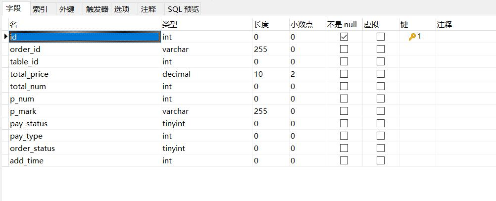

订单项表：

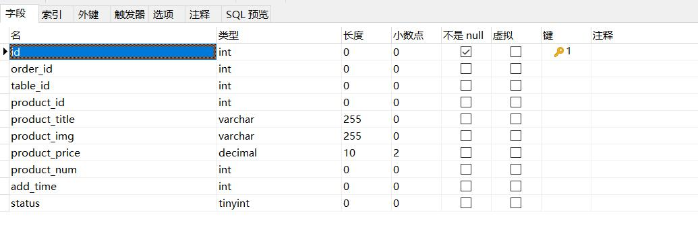

**`model/product.js`**

```javascript
'use strict'
module.exports = app => {
    const { STRING, INTEGER, TEXT, DECIMAL } = app.Sequelize;
    const Product = app.model.define('Product', {
        id: { type: INTEGER, primaryKey: true, autoIncrement: true },
        cid: INTEGER(11),
        title: STRING(255),
        price: DECIMAL(10, 2),
        imgUrl: STRING(255),
        content: TEXT,
        saleCount: INTEGER(11),
        isBest: INTEGER(1),
        isHot: INTEGER(1),
        status: INTEGER(1),
        sort: INTEGER(11),
        addTime: INTEGER(11),
    }, {
        timestamps: false, //自动增加创建时间 
        tableName: 'product' //设置表名称
    });
    Product.associate = function () { // 1 对 1 
        app.model.Product.belongsTo(app.model.ProductCate, { foreignKey: 'cid' });      // A.belongsTo(B)，外键定义在 A 中
    }
    return Product;
};
```

**`model/productCate.js`**

```javascript
'use strict';
module.exports = app => {
    const { STRING, INTEGER } = app.Sequelize;
    const ProductCate = app.model.define('ProductCate', {
        id: { type: INTEGER, primaryKey: true, autoIncrement: true },
        title: STRING(255),
        status: STRING(1),
        description: STRING(255),
        sort: INTEGER(11),
        addTime: INTEGER(11)
    }, {
        timestamps: false,   // 自动增加创建时间
        tableName: 'product_cate'    // 设置表名称
    });

    ProductCate.associate = function () {
        app.model.ProductCate.hasMany(app.model.Product, { foreignKey: 'cid' })
    }
    return ProductCate;
}
```

每次下单时，会传递对应的 订单项，我们不仅得为 订单表 增加新的项，同时还要为 订单项表 增加新的项。

同时还得注意：订单项可能存在已经下单后新增 订单项表 的情况，这时我们需要做的是 修改数据表 而不是 新增。

**`router/api.js`**

```javascript
router.post('/api/v1/addOrder', controller.api.v1.addOrder);
router.get('/api/v1/getOrder', controller.api.v1.getOrder);
```

**`controller/api/v1.js`**

```javascript
    /*
    增加订单接口：
        1、获取数据 并解析orderItem
        2、判断当前桌子下面是否有已下单并且未支付的订单，如果有的话更新订单，没有执行增加
    */
    async addOrder() {
        let body = this.ctx.request.body;

        let tableId = body.tableId;
        let pNum = body.pNum;    //用餐人数
        let pMark = body.pMark;  //备注口味信息
        let orderItems = body.orderItems;  //菜品信息
        let orderId = this.service.tools.getOrderId();   ///  //生成orderId
        let totalPrice = body.totalPrice;  //总价格
        let totalNum = body.totalNum;      //总数量        
        let payStatus = 0;   //0表示未支付  1表示已经支付
        let orderStatus = 0; //0表示已 下单并且未支付        1 表示已支付 已完结     2表示取消
        let addTime = this.service.tools.getUnixTime();  //增加日期

        const orderResult = await this.ctx.model.Order.findAll({
            where: {
                tableId,
                payStatus: 0,
                orderStatus: 0
            }
        })

        if (orderResult.length > 0) {  //合并订单
            await this.ctx.model.Order.update({
                totalPrice: Number(totalPrice) + Number(orderResult[0].totalPrice),
                totalNum: Number(totalNum) + Number(orderResult[0].totalNum),
            }, {
                where: {
                    tableId: tableId,
                    payStatus: 0,
                    orderStatus: 0
                }
            })

            for (let i = 0; i < orderItems.length; i++) {
                await this.ctx.model.OrderItems.create({
                    orderId: orderResult[0].id,
                    tableId: tableId,
                    productId: orderItems[i].productId,
                    productImg: orderItems[i].productImg,
                    productTitle: orderItems[i].productTitle,
                    productPrice: orderItems[i].productPrice,
                    productNum: orderItems[i].productNum,
                    status: 1    /*状态是1  表示已经下厨     状态是2表示退菜*/
                })
            }
        } else {  //增加订单
            //1、增加order表的数据
            let orderCreateResult = await this.ctx.model.Order.create({
                tableId,
                pNum,
                pMark,
                orderId,
                totalPrice,
                totalNum,
                payStatus,
                orderStatus,
                addTime
            })
            //2、增加order_item表的数据
            if (orderCreateResult) {
                for (let i = 0; i < orderItems.length; i++) {
                    await this.ctx.model.OrderItems.create({
                        orderId: orderCreateResult.id,
                        tableId: tableId,
                        productId: orderItems[i].productId,
                        productImg: orderItems[i].productImg,
                        productTitle: orderItems[i].productTitle,
                        productPrice: orderItems[i].productPrice,
                        productNum: orderItems[i].productNum,
                        status: 1    /*状态是1  表示已经下厨     状态是2表示退菜*/
                    })
                }
            }
        }
        this.ctx.body = { success: true, msg: "下单成功" }
    }

    async getOrder() {
        const tableId = this.ctx.request.query.tableId
        const orderResult = await this.ctx.model.Order.findAll({
            tableId
        })
        if (orderResult.length > 0) {
            this.ctx.body = { success: true, data: orderResult }
        } else {
            this.ctx.body = { success: false, data: [] }
        }
    }
```

## eggjs 中 配置 token

1. 安装 插件

```
cnpm i egg-jwt --save
```

2. 在 **`config/plugin.js`** 及 **`config/config.default.js`** 中进行配置

```javascript
module.exports = {
  ...
  jwt: {
    enable: true,
    package: "egg-jwt"
  }
}
```

```javascript
// 配置 jwt
config.jwt = {
    secret: "123456"
};
```

3. 在 登录路由对应的控制器 中生成 token 并返回

**`controller/api/v1.js`**

```javascript
async login() {
    const token = this.app.jwt.sign({ foo: 'bar' }, this.config.jwt.secret);
    this.ctx.body = {token};
}
```

4. 之后，当某些接口需要进行 jwt 验证时，我们便可以 在其 路由定义处，以类似中间件的形式进行配置

**`router/api.js`**

```javascript
module.exports = (app) => {
    const {
        router,
        controller,
        config,
        jwt
    } = app
    router.get('/api/v1', jwt, controller.api.v1.index)
    router.post('/api/v1/addCart', jwt, controller.api.v1.addCart)
    ...
}
```

5. 在Vue 中使用 token进行验证

```html
<script>
export default {
	data() {
		return {
			token: "",
		};
	},
    methods:{
        // POST 请求传递 token 请求头
		addCart() {
			var api = "http://localhost:7001/api/v1/addCart";
			this.Axios.post(
				api,
				{
					productTitle: "手撕包菜",
					tableId: 10,
					imgUrl: "www.itying.com",
					productPrice: 12,
					productNum: 1,
					productId: 12,
				},
				{
					headers: {
						Authorization: "Bearer " + this.token,
					},
				}
			)
				.then((response) => {
					console.log(response.data);
				})
				.catch((err) => {
					console.log(err);
				});
		},
		doLogin() {
			var api = "http://localhost:7001/api/v1/login";
			this.Axios.get(api)
				.then((response) => {
					console.log(response.data);
					this.token = response.data.token;
				})
				.catch((err) => {
					console.log(err);
				});
		},
        // GET 请求传递 token 请求头
		getIndex() {
			var api = "http://localhost:7001/api/v1";
			this.Axios.get(api, {
				headers: {
					Authorization: "Bearer " + this.token,
				},
			})
				.then((response) => {
					console.log(response.data);
				})
				.catch((err) => {
					console.log(err);
				});
		},
	},
};
</script>
```

