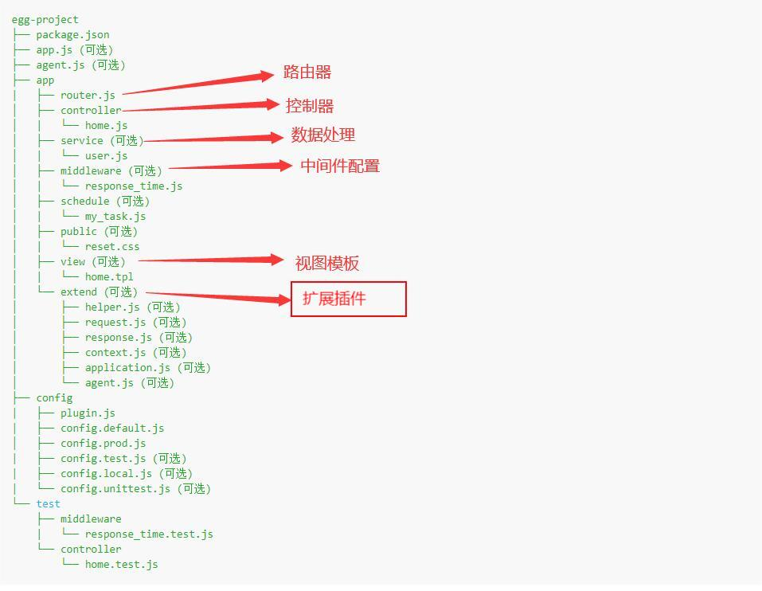
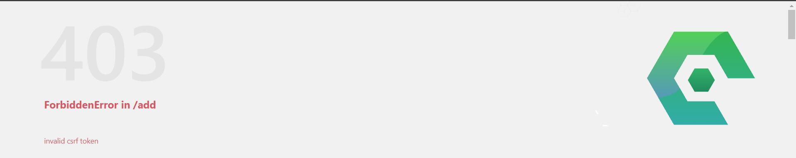

# Serverless 基础部分

## Serverless 架构介绍

​	**`Serverless`** 又名无服务器，所谓无服务器**并非**是说不需要依赖和依靠服务器等资源，而是开发者再也不用过多考虑服务器的问题，可以更专注在产品代码上，狭义的 **`Serverless`** 是 **`Fass`** 和 **`Bass`** 组成。

### 传统的高并发架构 与 Serverless 架构的区别

传统：首先要采购服务器，然后配置服务器，确认哪些服务器作为 **`Web`** 服务器，哪些作为 **`数据库`** 服务器。然后搭建对应的环境，配置负载均衡，配置主从数据库，配置静态服务器。最后还要部署服务器。后期还要 维护服务器。

Serverless：开发者不需要关注服务器相关的东西，不需要关注到底要买几台服务器，也不需要关心哪些 作为 Web 服务器，哪些作为数据库服务器，更不需要关心环境的搭建与部署。开发者只需要把代码上传到 Serverless 服务器中。其内部拥有 **日志服务**、**监控服务**、**高并发**等。


### 相关概念

Serverless 又名无服务器,所谓无服务器并非是说不需要依赖和依靠服务器等资源,而是 开发者再也不用过多考虑服务器的问题,可以更专注在产品代码上。

 Serverless 是一种软件系统架构的思想和方法，它不是软件框架、类库或者工具。它与 传统架构的不同之处在于，完全由第三方管理，由事件触发，存在于**`无状态`**（Stateless）、 **`暂存`**（可能只存在于一次调用的过程中）计算容器内。构建无服务器应用程序意味着开发者 可以专注在产品代码上，而无须管理和操作云端或本地的服务器或运行时（运行时通俗的讲 就是运行环境，比如 nodejs 环境，java 环境，php 环境）。

Serverless 真正做到了部署应用 无需涉及基础设施的建设，自动构建、部署和启动服务。 通俗的讲：**`Serverless 是构建和运行软件时不需要关心服务器的一种架构思想`**。老程序 员都用过虚拟主机，刚开始学 Serverless 你可以把它理解为虚拟主机的升级版本。

**`虚拟主机`**已经是快被淘汰掉的上一代产物了。云计算涌现出很多改变传统 IT 架构和运维方 式的新技术，比如虚拟机、容器、微服务，无论这些技术应用在哪些场景，降低成本、提升 效率是云服务永恒的主题。Serverless 的出现真正的解决了**`降低成本、提升效率`**的问题。它真正做到了弹性伸缩、高并发、按需收费、备份容灾、日志监控等。

### 传统模式和 ServerLess 模式下项目开发上线流程


### Serverless 和 ServerFul 架构的区别

- 传统的 ServerFul 架构模式

  ServerFul 架构就是 n 台 Server 通过 网络通信 的 方式 协作在一起，也可以说 ServerFul 架构是基于 Server 和 网络通信（分布式计算） 的 软件实现架构 ， Server 可以是 虚拟机、物理机 ，以及基于硬件实现的云服务器。

  

- Serverless 架构模式

  Serverless 的核心特点就是实现自动弹性伸缩和按量付费。


ServerLess 相比 ServerFul 有下面一些特点： 

- 资源分配： 在 Serverless 架构中，你不用关心应用运行的资源（比如服务配置、磁盘大 小）只提供一份代码就行。 
- 计费方式： 在 Serverless 架构中，计费方式按实际使用量计费（比如函数调用次数、运 行时长），不按传统的执行代码所需的资源计费（比如固定 CPU）。计费粒度也精确到了毫 秒级，而不是传统的小时级别。个别云厂商推出了每个月的免费额度，比如腾讯云提供了每 个月 40 万 GBs 的资源使用额度和 100 万次调用次数的免费额度。中小企业的网站访问量不 是特别大的话完全可以免费使用。 
- 弹性伸缩： Serverless 架构的弹性伸缩更自动化、更精确，可以快速根据业务并发扩容更多的实例，甚至允许缩容到零实例状态来实现零费用，对用户来说是完全无感知的。而传统 架构对服务器（虚拟机）进行扩容，虚拟机的启动速度也比较慢，需要几分钟甚至更久。


### Serverless 的能力

- 计算能力

  - 资源按需分配，无需申请资原 

  - Mwm：租户级别强镜离 Docker：进程级别隔离 Mwm+Docker 

  - 轻量级资源毫秒级启动 

  - 实时扩容，阶梯缩容 

  - 按需收费

- 系统运维能力

  - 性能保障

    - (1) 整个链路耗时毫秒级内,并支持 VPC 内网访问

  - 安全保障

    - (1) 资源对用户不可见,安全由腾讯云提供专业的保障
    - (2) 提供进程级和用户级安全隔离
    - (3) 访问控制管理

  - 自动性护缩容

    - (1) 根据 CPU 内容网络 IO 自动扩容底层资源
    - (2) 根据请求数自动扩缩容函数实例，业务高峰期扩容，满足业务高并发需求，业务低 峰期缩容，释放资源，降低成本

  - 自愈能力

    - (1) 每一次请求都是一个健康的实例

      ​		Serverless 中云函数被第一次调用会执行冷启动，Serverless 中云函数被多次连续调用会 执行热启动

      ​		冷启动是指你在服务器中新开辟一块空间供一个函数实例运行，这个过程有点像你把这 个函数放到虚拟机里去运行，每次运行前都要先启动虚拟机加载这个函数，以前冷启动非常 耗时，但是目前云厂商已经能做到毫秒级别的冷启动，这个过程我们也不需要关心，但是需 要注意的是使用 Seesion 的时候可能会导致 Session 丢失，所以我们的 Seesion 建议保存到数 据库。 

      ​		热启动则是说如果一个云函数被持续触发，那我就先不释放这个云函数实例，下次请求 仍然由之前已经创建了的云函数实例来运行，就好比我们打开虚拟机运行完这个函数之后没 有关闭虚拟机，而是让它待机，等待下一次被重新触发调用运行，这样做的好处就是省去了 给虚拟机「开机」的一个耗时环节，缺点是要一直维持这个虚拟机的激活状态，系统开销会 大一些。

- 业务运维能力

  - 工具建设：vscode 插件、WebIDE、Command Line、云 api、Sdk 
  - 版本管理、操作管理等 
  - 故障排查 
  - 监控报警


### 一个问题

> 阿里云 腾讯云 华为云我们为什么选择了腾讯云？

1、微信小程序的云开发就是基于腾讯云，选择腾讯云更方便和小程序对接 

2、腾讯云在 serverless 方面相比其他厂商支持更好一些 

3、腾讯云的技术在线客服非常棒 

4、腾讯云和 serverless 合作在腾讯云中集成了 serverless Framework 让我们可以 用我们喜欢的框架开发 serverless 应用。也可以让我们快速部署老项目。

5、价格更便宜

### 部署 Serverless 应用

> 主要介绍的是如何通过 Serverless Framework 提供的云函数 SCF 组件快速创建与部署一个云函数项目。
>
> Serverless Framework 会将项目快速部署到腾讯云 Serverless 平台，因此在部 署前，请确认您已经 注册腾讯云账号 并完成 实名认证。

1. 全局安装 serverless

   ```text
   npm install -g serverless
   serverless -v
   ```

2. 通过 serverless 命令创建项目


3. 此后我们便可以在 腾讯云的控制台中看到部署好的项目，并可在命令行中看到本项目的 url 地址：


## Serverless 组成及开发流程

### Serverless 组成

广义的 Serverless 更多是指一种技术理念：Serverless 是构建和运行软件时不需要关心服务器的一种架构思想。刚开始学 Serverless 你可以把它理解为虚拟主机的升级版本。 

狭义的 Serverless 是指现阶段主流的技术实现：狭义的 Serverless 是 FaaS 和 BaaS 组成

### 云函数

云函数可以在腾讯云控制台进行配置操作（前提是注册了腾讯云账号并实名认证了）。之前使用的 Serverless Framework 本质也是基于云函数的。


进入云函数页面后，首先我们可以看到当前账户的一些云函数信息：（函数数量、应用数量、本月调用数、本月资源使用量、本月出流量【表示访问外部网站资源的流量】等）。同时可以看到，腾讯云每月会为我们提供相应的免费资源使用量。


新建云函数前，首先要注意上方的 **`地域`** 及 **`命名管理空间`**。下方表格中只会展示对应 地域 及命名管理空间的 云函数。

同时，我们可以通过旁边的设置图标来新增命名空间。


当新建云函数时，可以选择模板创建（效果类似上节），含可以选择自定义创建，自定义创建时要选好对应的 **`运行环境`** 。


创建完后，我们便可根据的命名空间 及 地域来观察对应的  云函数。同时我们可以点击函数名，进入对应函数管理页面。


在函数管理 -> 函数配置 页面中，可以点击右上角的 编辑 来修改函数配置。


在函数管理 -> 函数代码 页面中，我们看到平台为我们初始化的代码。而当我们修改代码后，需要点击部署，对应的修改才能生效


同时我们在页面下方，将通过修改参数（此处的参数为 event ）的方式，然后点击测试，来查看函数运行的结果。


当配置好函数后，我们仍然无法通过 url 地址来看到函数执行结果，这就需要我们去创建触发器来实现。

在函数管理下方，点击触发管理 -> 创建触发器

注意：创建触发器时，要选中 触发方式为 API网关触发。同时关闭 **`集成响应`**（以确保云函数可以返回任意类型【不仅限于 JSON】的数据）


当新建完触发器后，此时触发器提供的访问路径为腾讯云提供的，而我们可以通过点击触发器的 **`API服务名`** 来自定义域名。


最后我们再来了解一下 **`层`** 的概念，层为 云函数 共用的一些模块，我们可以在其中新建层，通过本地上传 zip 包等方式，来上传一些函数需要的包。


新建完层后，可以在函数服务中点击层管理 -> 绑定，来为当前函数绑定层。


## Serverless Framework

### Serverless Framework 简介

Serverless Framework 是 Serverless 公司推出的一个开源的 Serverless 应用开发框架。 

Serverless Framework 是 由 Serverless Framework Plugin 和 Serverless Framework Components 组成 ：

Serverless Framework Plugin 实际上是一个函数的管理工具，使用这个工具，可以很轻 松的部署函数、删除函数、触发函数、查看函数信息、查看函数日志、回滚函数、查看函数 数据等。 

Serverless Framework Components 可以看作是一个组件集，这里面包括了很多的 Components，有基础的 Components，例如 cos、scf、apigateway 等，也有一些拓展的 Components，例如在 cos 上拓展出来的 website，可以直接部署静态网站等，还有一些框 架级的，例如 Koa，Express...

Serverless Framework 官网：https://www.serverless.com/ 

Serverless Framework 中文网站：https://www.serverless.com/cn 

Github 地址：https://github.com/serverless/serverless


### WebCli 中通过应用模板创建云函数

首先登录 腾讯云，在控制台打开 Serverless 应用中心。


进入 页面后，点击 新建应用 -> Web 应用，选好框架类型后，点击下一步，输入应用名、环境、地域后，点击完成。


等项目部署成功后，我们便可以看到对应的 应用详情，可以点击 **`url`** 查看运行结果，或者点击函数名称查看到其 Framework 生成的对应的云函数的配置页面。我们可以在代码管理中，新增一个 路由，并点击部署


部署成功后，我们便可以通过路径访问到对应路由


除了生成云函数之外，Framework 还会为我们生成 函数对应的触发器：


以上便是根据Webcli 创建云函数的方式，但我们可以发现，此种方式创建云函数后，我们如果想要修改代码，是比较麻烦的。下面将提出解决方案。

### VsCode中使用插件创建编写云函数

​		Tencent Serverless Toolkit for VS Code 是腾讯云 Serverless 产品的 VS Code（Visual Studio Code）IDE 的插件。该插件可以让您更好的在本地进行 Serverless 项目开发和代码调 试，并且轻松将项目部署到云端。

要使用这个插件，首先得安装


安装完成后，可以看到侧边栏多出了一个云端图标。点击创建一个腾讯云用户凭证。


其会要求我们输入 AppId 、SecretId及 SecretKey，我们可以在 插件文档中找到对应 值的 查找网址


等全部输入后，我们便可获取到云端函数，通过点击下载到本地，即可将云端函数下载到本地。


<div class="danger">


> 注意：
>
> 1.如果 Tencent Serverless Toolkit for VS Code 安装的是最新版，会导致 屏蔽暂不支持的web函数及镜像函数 。这时可以通过降低插件版本来解决问题。
>
> 2.如果有部署失败的情况发生，有可能是因为 serverless.yaml 中的handler为空。但即便添加了 handler ，提交成功后也无法 使用。

</div>

此后，每当我们修改了 代码，便可以通过 本地函数中的上传按钮，将最新的代码上传至云端。


需要注意的是：上传后的代码会自动部署，但是上传后的所有接口会显示：**`FunctionType不合法.`**，所以  **`不推荐此种用法`**  。

### Serverless Cli 创建编写应用

关于 安装及使用Serverless Cli 来创建应用可以参考 Serverless架构介绍 ->  部署 Serverless 应用一章

在用 Serverless Cli 创建完应用后，修改完应用后输入 `serverless deploy` 即可将应用重新部署到 云端。


本项目中主要使用此种写法来创建编写应用。（因为使用插件会有一些问题）

## Serverless 中 部署 express、koa、egg 项目、配置静态资源、安装项目依赖

### express

首先 使用 `serverless` 来创建 express 项目

创建完后，打开 项目根目录下的 **`app.js`** ，为其添加配置静态资源的 代码：

```javascript
app.use(express.static('static'))
```

其中 static 文件目录如下：


配置完后，便可以在 根目录下的 index.html 中使用：

```html
<head>
  <title>Serverless - Express.js</title>
  <link rel="stylesheet" href="/css/index.css">
</head>

<body>
  <h1 class="title">
    欢迎访问 Express.js 应用
    <br />
    <a href="https://cloud.tencent.com/product/sls" target="_blank" rel="noopener noreferrer">
      腾讯云 Serverless
    </a>
    为您提供服务
  </h1>
  
</body>
```

然后在 本地运行，可以 **成功** 看到运行结果。

之后将项目通过 **`serverless deploy`** 部署到云端。部署前可以在 项目根目录的 **`serverless.yml`** 文件中的 **exclude** 选项中添加 node_modules 选项，但同时要在云端 编译器 中点击开启 **`自动安装依赖`**


此后也可以成功看到运行结果（若图片无法加载成功，请在app.js 中配置 **`app.binaryTypes = ['*/*']`**，目前serverless 升级了，好像不用再配置了）。


接下来在 **`express`** 项目中使用 **`ejs`** 模板引擎

首先先进行安装：

**`cnpm i ejs --save`**

安裝完后，在项目中配置并使用 模板引擎

```javascript
const ejs = require('ejs')

// 表示将 ejs模板引擎 重命名为 html
app.engine('html',ejs.__express)
// 注册模板引擎
app.set('view engine','html')

app.get(`/`, (req, res) => {
  res.render('index', {
    title: '薛昕'
  })
})
```

此后我们便可以在 views 文件夹下的文件中使用模板引擎。

**`views/index.html`**

```html
<body>
  <h1 class="title">
    欢迎访问 Express.js 应用
    <br />
    <a href="https://cloud.tencent.com/product/sls" target="_blank" rel="noopener noreferrer">
      腾讯云 Serverless
    </a>
    为您提供服务
  </h1>
  <%=title %>
    
</body>
```

在本地运行后发现可以实现效果。

使用 **`serverless deploy`** 部署后发现，其在云端也可以生效（若有未生效的情况，请检查是否开启了 **`自动安装依赖`**）

### koa

首先使用 serverless 新建一个 koa 项目

新建成功后，为其新增一个接口进行测试：

**`app.js`**

```javascript
...
router.get('/news', async (ctx) => {
  ctx.body = {
    title: 'xxc'
  }
})
...
```


可以看到结果成功。之后为其配置静态目录

首先安装 **`koa-static`** 插件

**`cnpm i koa-static --save`**

然后配置 **`static`** 

**`app.js`**

```javascript
const static = require('koa-static')
app.use(static('static'))
```

配置完后，在 index.html 中使用：

```html
<head>
  <link rel="stylesheet" href="/css/index.css">
</head>
<body>
  <h2 class="title">
    欢迎访问 Koa.js 应用
    <br />
    <a href="https://cloud.tencent.com/product/sls" target="_blank" rel="noopener noreferrer">
      腾讯云 Serverless
    </a>
    为您提供服务
  </h2>
  
</body>
```

可以看到效果生效。

本地生效后，可以使用 **`serverless deploy`** 将项目部署到云端（不知道为啥，部署的项目没有对应的 API 网关，需要我们自动去创建  -> 发现原因是因为授权后未等部署完成后就退出了）。

可以看到云端中也可以生效。


然后关于在 koa 中安装使用项目依赖的方式，与express 类似，这里不做介绍。


### egg

egg 框架中默认已经配置好了静态资源，我们可以直接访问。

使用 serverless 安装好 egg 项目后，在控制台输入 **`npm run dev`**，即可运行。

同时修改代码后上传前要 通过 配置忽略掉 **`node_modules`**，并在云端开启自动安装依赖。

## Serverless 中部署 Vue、React、Angular 项目

### Vue

- Serverless 生成 Vue 项目时，当我们授权完后，会将 AppId、SecretId、SecretKey 保存到 .env 文件中。之前部署的 后端项目也会。

- Serverless 生成的 Vue 项目默认是 Vue2 项目。
- 若想部署 Vue3 项目，我们可以将Serverless 生成的 Vue 项目 中的文件除了 serverless.yml 之外全部删除，然后将 已经准备好的 Vue3 项目移动到 Serverless 生成的 Vue 项目中，进行依赖安装并运行。
- 确保可以运行后，在 **`serverless.yml`** 中确保 发布的 目录为 dist目录

```yaml
inputs:
  src:
    src: ./src
    hook: npm run build
    dist: ./dist
```

- 然后便可以用 **`serverless deploy`** 来发布当前 vue3 项目到云端。

- 需要注意的是，此处的 Vue 项目 代码会被上传到 对象云存储中，而不是 云函数中。
- 对象云存储的 名称在 **`serverless.yml`** 中设置：

```yaml
inputs:
  ...
  bucketName: my-vue-starter
  ...
```

- 同时 **`serverless.yml`** 中还可以设置是否开启 强制 https，开启后可能会导致一些请求出现错误。我们可以在文件中直接修改，或者在云平台中进行修改

```yaml
inputs:
  ...
  protocol: https
  ...
```


- 此时还会有一个问题：在一个页面中进行刷新操作后，会导致跳转至404页面，这是因为浏览器在刷新时，会向服务器发送请求，而这个请求服务器无对应的响应资源。就会导致跳转到默认的 404 页面。而要解决这个问题，我们需要设置 error 对应的 页面为 index.html

  

### React

React 的操作基本上与 Vue  一致，故此处不做讲解

### Angular

- 当我们使用 **`serverless`** 去新建项目时，可以看到其中没有 angular 项目，所以我们可以 通过选择 **`快速部署一个静态网站`** 后，在修改其的 **`serverless.yml`** 文件后。将已有的 angular 项目复制到项目目录中，来进行 **`serverless deploy`** 部署。
- 有一点需要注意的是：angular 中通过 npm run build 生成的目录中并不是直接包含打包文件。而是先包含了一个目录，这个目录中有打包文件。所以我们需要在 **`serverless.yml`** 的 input 的 dist 选项中进行修改。

## Serverless 中使用 Nodejs 操作 Mysql、 Mongodb 数据库、以及配置 VPC 私有网络

由于云数据库要钱，待补...

## Serverless BaaS 对象云存储 Cos 介绍、 Nodejs 操作 Cos、Express 在 Serverless 中实现图片上传到 Cos 中

### 对象云存储 Cos 介绍

狭义的 Serverless 是 FaaS 和 BaaS 组成


对象存储（Cloud Object Storage，COS）是一种存储海量文件的分布式存储服务，具有高扩展性、低成本、可靠安全等优点。通过控制台、API、SDK 和工具等多样化方式，用户可简 单、快速地接入 COS，进行多格式文件的上传、下载和管理，实现海量数据存储和管理。


### Nodejs 操作 COS

官方文档：https://cloud.tencent.com/document/product/436/8629

1. 首先安装 sdk 所需依赖：

```html
cnpm i cos-nodejs-sdk-v5 --save
```

2. 在云端 的 对象存储 -> 存储桶列表 -> 创建存储桶 ，新建一个存储桶，并记住存储桶的 **`桶名称`** 及 **`所属地域`**

注意：新建存储桶时需要选择 **`公有读私有写`**


2. 新建 app.js ，写入如下代码：

```javascript
const fs = require('fs')
var COS = require('cos-nodejs-sdk-v5');
var cos = new COS({
    // 此处的 SecretId 及 SecretKey 要从 云平台获取
    SecretId: 'AKID0qPr52nJaaJmzxe4D5g2B8pFOGrBDxSg',
    SecretKey: 'xxx'
});

cos.putObject({
    Bucket: 'cos110701-1308164762', /* 存储桶名称，必须 */
    Region: 'ap-guangzhou',    /* 区域名称 必须 */
    Key: 'xxc.jpg',              /* 上传至桶中的文件、目录名称  必须 */
    StorageClass: 'STANDARD',
    Body: fs.createReadStream('./2.jpg'), // 上传文件对象，此处为从硬盘读取，下面 express 中是从内存中读取
    onProgress: function (progressData) {	// 成功的回调
        console.log(JSON.stringify(progressData));
    }
}, function (err, data) {		// 失败的回调
    console.log(err || data);
});
```

4. 在控制台中输入 nodemon app.js，即可成功将本地图片存储到 云端的 对象存储中。

### Express 在 Serverless 中实现图片上传

1. 首先通过 Serverless 创建一个 Express 项目
2. 在 **`views/index.html`** 中配置如下表单结构

```html
<body>
  <form action="/toUpload" method="POST" enctype="multipart/form-data">
    用户名：<input type="text" name="username" />
    <br />
    <br />
    头像：<input type="file" name="filename" />
    <br />
    <br />
    <input type="submit" value="提交">
  </form>
</body>
```

[为什么上传文件要使用 multipart/form-data](https://www.jianshu.com/p/1484605c523a)

[HTML <form> 标签的 enctype 属性](https://www.w3school.com.cn/tags/att_form_enctype.asp)

通过设置一个表单，让其提交到 post 接口 toUpload ，并确保 **`enctype`** 属性为 **`multipart/form-data`**，因为此处要提交文件。

3. 在 **`app.js`** 中定义一个 toUpload 接口，并通过使用 **`multer`** 模块，来实现对从 **内存** 中文件流的读取

```javascript
const express = require('express')
const multer = require('multer');
const fs = require('fs')
var COS = require('cos-nodejs-sdk-v5');
const app = express()


// 配置上传
// 获取内存存储引擎
const storage = multer.memoryStorage();
// 将文件保存到内存存储引擎中 当使用内存存储引擎，文件信息将包含一个 buffer 字段，里面包含了整个文件数据。
const upload = multer({ storage: storage });

// 定义接口
// .single接受一个文件名（对应上方的 file 类型 input 标签的 name属性）。这个文件的信息保存在 req.file。
app.post('/toUpload', upload.single("filename"), (req, res) => {
  var cos = new COS({
    SecretId: 'AKID0qPr52nJaaJmzxe4D5g2B8pFOGrBDxSg',
    SecretKey: 'xxx'
  });
  cos.putObject({
    Bucket: 'cos110701-1308164762', /* 存储桶名称，必须 */
    Region: 'ap-guangzhou',    /* 区域名称 必须 */
    Key: 'jmz.jpg',              /* 上传至桶中的文件、目录名称  必须 */
    StorageClass: 'STANDARD',
    Body: req.file.buffer, // 上传文件对象
    onProgress: function (progressData) {
      console.log(JSON.stringify(progressData));
      res.send(req.body);
    }
  }, function (err, data) {
    console.log(err || data);
  });
})
```

[multer中文文档](https://www.cnblogs.com/wjlbk/p/12633320.html)

4. 代码设置完成后，使用 **`serverless deploy`** 即可将 项目部署，然后点击 主页表单的 提交按钮，便可将选中的 文件 提交到 Serverless 对象存储中。
5. 有时候可能 部署的项目 上传的文件无法展示。可以通过配置 **`serverless.yml`** 来进行解决。

```yaml
inputs:
  ...
  apigatewayConf:
    isBase64Encoded: true
```

## Serverless、Cos中配置域名访问以及serverless中配置https访问

要进行本节操作，首先得保证有一个已经备案的域名

### Serverless 应用配置域名访问

进入相关应用的 API网关 页面后，选中自定义域名，点击新建


然后选择 HTTP协议（若要使用 HTTPS 协议，需要先申请 SSL 证书），并添加如下路径映射，然后点击提交，便设置成功。（注意要在 域名解析中添加对应域名解析）


### 申请 SSL 证书

主页搜索 SSL证书


选择 自定义配置-> 域名型免费型


快速申请后，选择 DNS验证


在阿里云控制台创建对应 SSL DNS验证 的域名解析。然后等验证成功，即可使用 SSL 证书


申请完SSL证书之后，设置自定义域名时，即可 选择 HTTPS 协议，然后选择证书，之后便可以使用 HTTPS 协议访问。


### cos中配置域名访问


要在COS 中配置域名访问，需要 进入指定COS 的 自定义源站域名-> 添加域名 中添加。添加好后在 对应域名解析中新增域名解析即可访问。

# eggjs 基础部分

## eggjs 介绍

​		Egg.js 是阿里旗下的开源产品--->基于 Node.js 和 Koa研发 , 是一个 Nodejs 的企业级应用 开发框架。可以帮助开发者快速开发高质量的企业级项目。

​		Egg.js 基于 Es6、Es7、Koa 使得 Nodejs 具有更规范的开发模式、更低的学习成本、更优 雅的代码、更少的开发成本、更少的维护成本。它为企业级框架而生。

​		Express 和 Koa 是 Node.js 社区广泛使用的框架，简单且扩展性强，非常适合做个人项 目。但框架本身缺少约定，标准的 MVC 模型会有各种千奇百怪的写法。Egg.js 相比 Express Koa 更规范一些，Egg 按照约定进行开发、内置多进程管理、基于 Koa 开发，性能优异、 具有高度可扩展的插件机制、框架稳定、并提供基于 Egg 定制上层框架的能力。

官 网：https://eggjs.org

中文网站：https://eggjs.org/zh-cn/

Github 地址：https://github.com/eggjs/egg

## eggjs 快速入门、搭建环境、创建项目

> 一、环境准备 

操作系统：支持 macOS，Linux，Windows 

运行环境：Nodejs建议选择 LTS 版本，最低要求 8.x

> 二、安装 egg 脚手架以及使用 egg-init 创建项目

方法 1：使用脚手架

```
npm i egg-init -g
egg-init egg-example（项目名） --type=simple
cd egg-example
npm i

运行项目：
npm run dev
```

方法2：npm init 快速生成项目

```
mkdir egg-example && cd egg-example
npm init egg --type=simple

npm i

运行项目：
npm run dev
```


<div class="warning">


> 以上两种创建方式效果差不多。但个人偏向于第一种。

</div>

## eggjs 目录结构、路由器、控制器

一、eggjs 目录结构


二、路由器、控制器

所有的路由都在 **`app/router.js`** 中进行配置。

```javascript
'use strict';

/**
 * @param {Egg.Application} app - egg application
 */
module.exports = app => {
  const { router, controller } = app;
  router.get('/', controller.home.index);
  router.get('/admin', controller.admin.index);
};
```

配置路由前，需要创建好对应的 **`控制器`**，通过在 **app/controller**  文件夹中创建对应的文件，再在文件的 类中通过新建方法的方式，来为路由创建 控制器。


同时，eggjs对目录作出了明确的 **`规范`**:



三、VSCode 中插件配置

可以通过在 VSCode中安装 **`eggjs`** 插件来提高我们的开发效率


## eggjs 路由传参、模板引擎、静态资源

[eggjs路由的使用](https://eggjs.org/zh-cn/basics/router.html)

[eggjs控制器的使用](https://eggjs.org/zh-cn/basics/controller.html)

> 获取 get 传值

**`controller/news.js`**

```javascript
class NewsController extends Controller {
    async index() {
        // koa 中如何获取 get 传值  ctx.query

        // eggjs 中获取 get 传值  this.ctx.query
        console.log(this.ctx.query)

        this.ctx.body = "新闻首页"
    }
}
```

**`router.js`**

```javascript
module.exports = app => {
  const { router, controller } = app;
  router.get('/news', controller.news.index);
};
```

之后，我们便可以在 网页中通过在url后使用 ?xxx=xxx的方式为路由传值

> 获取动态路由传值

**`controller/news.js`**

```javascript
class NewsController extends Controller {
    async content() {
        // koa 中获取 动态路由传值  ctx.params

        // eggjs 中获取 动态路由传值
        console.log(this.ctx.params)

        this.ctx.body = "新闻内容"
    }
}
```

**`router.js`**

```javascript
module.exports = app => {
  const { router, controller } = app;
  router.get('/newscontent/:id', controller.news.content);
};
```

之后，我们便可以在 网页中通过在url后使用 /xxx 的方式为路由传值

> 使用模板引擎渲染页面

要使用 **模板引擎** 之前，首先得配置好模板引擎，本处以 **`ejs`** 为例

首先安装模板引擎

`npm install egg-view-ejs --save`

接着在 **`config/plugin.js`** 中进行配置：

```javascript
exports.ejs = {
  enable: true,
  package: 'egg-view-ejs',
};
```

然后在 **`config/config.default.js`** 中配置

```javascript
module.exports = appInfo => {
  // add your user config here
  const userConfig = {
    view: {
      mapping: {
        // 表示 .html 文件以 ejs 引擎来编译
        '.html': 'ejs',
      },
    }
  };
  return {
    ...userConfig,
  };
};
```

配置完后，使用步骤如下:

配置好对应的路由：

**`controller/news.js`**

```javascript
class NewsController extends Controller {
    async list() {
        let msg = "xxcijmz"
        let list = [
            1111,
            2222,
            3333,
        ]
        // 注意：ctx.render 是一个异步方法。
        await this.ctx.render('list', {
            msg,
            list
        })
    }
}
module.exports = NewsController;
```

**`router.js`**

```javascript
module.exports = app => {
  const { router, controller } = app;
  router.get('/list', controller.news.list);
};
```

在 app  中新建 **`view/list.html`** （与this.ctx.render对应），此时，这个html 文件会作为 访问 /list 时的请求结果响应，同时，内部可以使用 ejs 语法来显示 **`ctx.render`** 传递过去的参数：

```html
<!DOCTYPE html>
<html lang="en">

<head>
    <meta charset="UTF-8">
    <meta http-equiv="X-UA-Compatible" content="IE=edge">
    <meta name="viewport" content="width=device-width, initial-scale=1.0">
    <title>Document</title>
</head>

<body>
    <h2>
        我是列表页面
    </h2>
    <%= msg %>
        <% for( let i=0; i < list.length; i++ ) { %>
            <%= list[i] %>
                <% } %>

</body>

</html>
```

> 静态资源使用

eggjs 默认为我们提供了 可以直接访问 app中public文件夹下静态资源的功能：

```html
<html lang="en">
<head>
    <meta charset="UTF-8">
    <meta http-equiv="X-UA-Compatible" content="IE=edge">
    <meta name="viewport" content="width=device-width, initial-scale=1.0">
    <title>Document</title>
    <link rel="stylesheet" href="/public/css/basic.css">
</head>

<body>
    <h2 class="h2">
        我是列表页面
    </h2>
    
</body>

</html>
```

需要注意的是，访问路径要以 /public 开头。这点与 koa 不同。

## eggjs 服务(service) 调用、config 配置、及this内容

<div class="success">


> service 服务定义及调用

</div>


在 eggjs 中，为了符合 MVC 架构，所以规定 有关数据操作(model) 都写在 **`service`** 中，不要在 controller 中定义数据。这样既能符合 MVC架构 规范，又使得 service 中定义的数据可以在 **`多个controller、service`** 中同时调用。

**`app/service/news.js`**

```javascript
const Service = require('egg').Service;

class NewsService extends Service {
    async getNewsList() {
        // 注意获取新闻数据
        const list = ['1111', '2222', '3333']
        return list;
    }
}

module.exports = NewsService;
```

在 **service** 文件夹中定义的每一个 **方法** ，都可以通过 this.service.文件名.方法名 的方式在 **controller** 及 **`service`** 文件中使用。

**`app/controller/news.js`**

```javascript
const Controller = require('egg').Controller;

class NewsController extends Controller {
    async list() {
        let msg = "xxcijmz"
        let list = await this.service.news.getNewsList()
        // 注意：ctx.render 是一个异步方法。
        await this.ctx.render('list', {
            msg,
            list
        })
    }
}

module.exports = NewsController;
```

**`app/service/test.js`**

```javascript
const Service = require('egg').Service;

class TestService extends Service {
    async echo() {
        console.log(await this.service.news.getNewsList())
    }
}

module.exports = TestService;
```

需要注意的一点是：service 中的数据由于是定义在异步函数(async)中 ，所以获取时要使用 **await**。


**`服务的命名规则：`**

Service 文件必须放在 app/service 目录，可以支持多级目录，访问的时候可以通过目录名级联访问。

app/service/biz/user.js => ctx.service.biz.user	(建议)

app/service/sync_user.js => ctx.service.syncUser

app/service/HackerNews.js => ctx.service.hackerNews

<div class="success">


> config 配置变量，使其用于所有的 controller 及 service

</div>

我们可以在 **`app/config/config.default.js`** 中通过 config.xxx = xxx 的方式来为 config对象 上绑定属性，使其能够在 controller 和 service 中 通过 this.config.xxx 来获取属性。

**`app/config/config.default.js`**

```javascript
module.exports = appInfo => {
  const config = exports = {};
  ...
  config.test = 'xxciiii'
  ...
  return {
    ...config,
    ...userConfig,
  };
};
```

**`app/controller/news.js`**

```javascript
const Controller = require('egg').Controller;
class NewsController extends Controller {
    ...
    async list() {
       ...
        console.log(this.config.test)
       ...
    }
}

module.exports = NewsController;
```

<div class="success">


> eggjs 会为 Controller 及 Service 类中的 this 挂载一些方法

</div>

- `this.ctx`: 当前请求的上下文 [Context](https://eggjs.org/zh-cn/basics/extend.html#context) 对象的实例，通过它我们可以拿到框架封装好的处理当前请求的各种便捷属性和方法。
- `this.app`: 当前应用 [Application](https://eggjs.org/zh-cn/basics/extend.html#application) 对象的实例，通过它我们可以拿到框架提供的全局对象和方法。
- `this.service`：应用定义的 [Service](https://eggjs.org/zh-cn/basics/service.html)，通过它我们可以访问到其他业务层，等价于 `this.ctx.service` 。
- `this.config`：应用运行时的[配置项](https://eggjs.org/zh-cn/basics/config.html)。
- `this.logger`：logger 对象，上面有四个方法（`debug`，`info`，`warn`，`error`），分别代表打印四个不同级别的日志，使用方法和效果与 [context logger](https://eggjs.org/zh-cn/core/logger.html#context-logger) 中介绍的一样，但是通过这个 logger 对象记录的日志，在日志前面会加上打印该日志的文件路径，以便快速定位日志打印位置。

## eggjs 实现简单爬虫

首先在 **`router.js`** 及 **`controller/news.js`** 中注册好对应的路由及 处理函数：

**`router.js`**

```javascript
module.exports = app => {
  const { router, controller } = app;
  router.get('/', controller.home.index);
  router.get('/list', controller.news.getNewsList);
  router.get('/content', controller.news.getContent);
  router.get('/admin', controller.admin.index);
};
```

**`controller/news.js`**

```javascript
const Controller = require('egg').Controller;

class NewsController extends Controller {
    async getNewsList() {
        let newsList = await this.ctx.service.news.getNewsList()
        await this.ctx.render('index', {
            list: newsList
        })
    }
    async getContent() {
        let aid = this.ctx.query.aid;
        let content = await this.ctx.service.news.getContent(aid)
        await this.ctx.render('content', {
            content
        })
    }
}

module.exports = NewsController;
```

定义完成后，去 **`service/news.js`** 中请求数据（此处需要先在 config/config.default.js中配置一下共用 url 地址）:

**`config.default.js`**

```javascript
module.exports = appInfo => {
    ...
  config.api = 'http://www.phonegap100.com/appapi.php?'
    ...
};
```

**`service/news.js`**

```javascript
'use strict';

const Service = require('egg').Service;

class NewsService extends Service {
    async getNewsList() {
        const result = await this.ctx.curl(this.config.api + 'a=getPortalList&catid=20&page=1');
        // 将 16进制数据 转换为对象
        let list = JSON.parse(result.data)
        return list.result;
    }
    async getContent(aid) {
        const result = await this.ctx.curl(this.config.api + `a=getPortalArticle&aid=${aid * 1}`);
        let content = JSON.parse(result.data)
        return content.result
    }
}

module.exports = NewsService;

```

定义完 service 后，我们便可以在 **`view`** 中的模板页面中使用 在 controller 中 通过 service 获取的数据：

**`view/content.html`**

```html
<body>
    <ul>
        <% for( let i=0; i < list.length; i++ ) { %>
            <li>
                <a href="/content?aid=<%= list[i].aid %> ">
                    <%=list[i].title %>
                </a>
            </li>
            <% } %>
    </ul>
</body>
```

**`view/index.html`**

```html
<body>
    <%- content[0].content %>
</body>
```

## eggjs 框架扩展配置

### Application

`app` 对象指的是 Koa 的全局应用对象，全局只有一个，在应用启动时被创建。

**`访问方式`**

- `ctx.app`
- Controller，Middleware，Helper，Service 中都可以通过 `this.app` 访问到 Application 对象，例如 `this.app.config` 访问配置对象。

**`扩展方式`**

框架会把 `app/extend/application.js` 中定义的对象与 Koa Application 的 prototype 对象进行合并，在应用启动时会基于扩展后的 prototype 生成 `app` 对象。

**`方法扩展`**

例如，我们要增加一个 `app.foo()` 方法：

```javascript
// app/extend/application.js
module.exports = {
  foo(param) {
    // this 就是 app 对象，在其中可以调用 app 上的其他方法，或访问属性
  },
};
```

**`属性扩展`**

一般来说属性的计算只需要进行一次，那么一定要实现缓存，否则在多次访问属性时会计算多次，这样会降低应用性能。

推荐的方式是使用 Symbol + Getter 的模式。

例如，增加一个 `app.bar` 属性 Getter：

```javascript
// app/extend/application.js
const BAR = Symbol('Application#bar');

module.exports = {
  get bar() {
    // this 就是 app 对象，在其中可以调用 app 上的其他方法，或访问属性
    if (!this[BAR]) {
      // 实际情况肯定更复杂
      this[BAR] = this.config.xx + this.config.yy;
    }
    return this[BAR];
  },
};
```

**`外部使用`**

**`controller/home.js`**

```javascript
... 
async extendTest() {
	console.log(this.app.foo())
}
...
```


### Context

Context 指的是 Koa 的请求上下文，这是 **请求级别** 的对象，每次请求生成一个 Context 实例，通常我们也简写成 `ctx`。在所有的文档中，Context 和 `ctx` 都是指 Koa 的上下文对象。

**`访问方式`**

- middleware 中 `this` 就是 ctx，例如 `this.cookies.get('foo')`。
- controller 有两种写法，类的写法通过 `this.ctx`，方法的写法直接通过 `ctx` 入参。
- helper，service 中的 this 指向 helper，service 对象本身，使用 `this.ctx` 访问 context 对象，例如 `this.ctx.cookies.get('foo')`。

**`扩展方式`**

框架会把 `app/extend/context.js` 中定义的对象与 Koa Context 的 prototype 对象进行合并，在处理请求时会基于扩展后的 prototype 生成 ctx 对象。

**`方法扩展`**

例如，我们要增加一个 `ctx.foo()` 方法：

```javascript
// app/extend/context.js
module.exports = {
  foo(param) {
    // this 就是 ctx 对象，在其中可以调用 ctx 上的其他方法，或访问属性
  },
};
```

**`属性扩展`**

一般来说属性的计算在同一次请求中只需要进行一次，那么一定要实现缓存，否则在同一次请求中多次访问属性时会计算多次，这样会降低应用性能。

推荐的方式是使用 Symbol + Getter 的模式。

例如，增加一个 `ctx.bar` 属性 Getter：

```javascript
// app/extend/context.js
const BAR = Symbol('Context#bar');

module.exports = {
  get bar() {
    // this 就是 ctx 对象，在其中可以调用 ctx 上的其他方法，或访问属性
    if (!this[BAR]) {
      // 例如，从 header 中获取，实际情况肯定更复杂
      this[BAR] = this.get('x-bar');
    }
    return this[BAR];
  },
};
```


### Helper

Helper 函数用来提供一些实用的 工具函数。

它的作用在于我们可以将一些常用的动作抽离在 helper.js 里面成为一个独立的函数，这样可以用 JavaScript 来写复杂的逻辑，避免逻辑分散各处。另外还有一个好处是 Helper 这样一个简单的函数，可以让我们更容易编写测试用例。

框架内置了一些常用的 Helper 函数。我们也可以编写自定义的 Helper 函数。

**`访问方式`**

通过 `ctx.helper` 访问到 helper 对象。

**`扩展方式`**

框架会把 `app/extend/helper.js` 中定义的对象与内置 `helper` 的 prototype 对象进行合并，在处理请求时会基于扩展后的 prototype 生成 `helper` 对象。

例如，增加一个 `helper.foo()` 方法：

```javascript
// app/extend/helper.js
module.exports = {
  foo(param) {
    // this 是 helper 对象，在其中可以调用其他 helper 方法
    // this.ctx => context 对象
    // this.app => application 对象
  },
};
```

**`helper.js实现时间戳转换`**

**`extend/helper.js`**

```javascript
const dayjs = require('dayjs')
module.exports = {
    dateFormat(time) {
        return dayjs.unix(time).format('YYYY/MM/DD')
    }
}
```

**`view/index.html`**

```html
<body>
    <ul>
        <% for( let i=0; i < list.length; i++ ) { %>
            <li>
                <a href="/content?aid=<%= list[i].aid %> ">
                    <%=list[i].title %>
                </a>
                ---
                <%= helper.dateFormat(list[i].dateline) %>
            </li>
            <% } %>
    </ul>
</body>
```

### Request

Request 对象和 Koa 的 Request 对象相同，是 **请求级别** 的对象，它提供了大量请求相关的属性和方法供使用。

**`访问方式`**

```javascript
ctx.request
```

`ctx` 上的很多属性和方法都被代理到 `request` 对象上，对于这些属性和方法使用 `ctx` 和使用 `request` 去访问它们是等价的，例如 `ctx.url === ctx.request.url`。

Koa 内置的代理 `request` 的属性和方法列表：[Koa - Request aliases](http://koajs.com/#request-aliases)

**`扩展方式`**

框架会把 `app/extend/request.js` 中定义的对象与内置 `request` 的 prototype 对象进行合并，在处理请求时会基于扩展后的 prototype 生成 `request` 对象。

例如，增加一个 `request.foo` 属性 Getter：

```javascript
// app/extend/request.js
module.exports = {
  get foo() {
    return this.get('x-request-foo');
  },
};
```

### Response

Response 对象和 Koa 的 Response 对象相同，是 **请求级别** 的对象，它提供了大量响应相关的属性和方法供使用。

**`访问方式`**

```
ctx.response
```

ctx 上的很多属性和方法都被代理到 `response` 对象上，对于这些属性和方法使用 `ctx` 和使用 `response` 去访问它们是等价的，例如 `ctx.status = 404` 和 `ctx.response.status = 404` 是等价的。

Koa 内置的代理 `response` 的属性和方法列表：[Koa Response aliases](http://koajs.com/#response-aliases)

**`扩展方式`**

框架会把 `app/extend/response.js` 中定义的对象与内置 `response` 的 prototype 对象进行合并，在处理请求时会基于扩展后的 prototype 生成 `response` 对象。

例如，增加一个 `response.foo` 属性 setter：

```
// app/extend/response.js
module.exports = {
  set foo(value) {
    this.set('x-response-foo', value);
  },
};
```

就可以这样使用啦：`this.response.foo = 'bar';`

## eggjs 中间件配置

Egg 的中间件形式和 Koa 的中间件形式是一样的，都是基于[洋葱圈模型](https://eggjs.org/zh-cn/intro/egg-and-koa.html#midlleware)。每次我们编写一个中间件，就相当于在洋葱外面包了一层。

### 定义中间件

Egg 中规定 中间件的定义必须在 **`app/middleware`** 中进行

**`app/middleware/printdate.js`**

```javascript
// options: 中间件的配置项，框架会将 app.config[${middlewareName}] 传递进来。
// app: 当前应用 Application 的实例。

module.exports = function (options, app) {
    return async function (ctx, next) {
        console.log(new Date())

        await next();
    }
}
```

定义完中间件后，需要在 **`config/config.default.js`** 中配置，同时可以在其中为配置的中间件 **传递参数** 

```javascript
module.exports = appInfo => {
  const config = exports = {};
  ...
  // 配置中间件
  config.middleware = ['printdate'];
  // 为配置的中间件传递参数。
  config.printdate = {
    'aaa': '123456'
  }
  return {
    ...config,
    ...
  };
};
```

### 使用中间件进行域名禁用

1. 定义中间件

**`app/middleware/forbidip.js`**

```javascript
// 通过数据库获取数据的方式（此处以固定数据模拟）

// module.exports = function (options, app) {
//     return async function forbidId(ctx, next) {
//         const ip = '127.0.0.1'
//         if (ctx.request.ip === ip) {
//             ctx.status = 403
//             ctx.body = "您的 ip 已经被屏蔽"
//         } else {
//             await next()
//         }
//     }
// }

// 通过 options 传入参数的形式
module.exports = function (options, app) {
    return async function forbidIp(ctx, next) {
        let ids = options.forbidip
        if (ids.includes(ctx.request.ip)) {
            ctx.status = 403
            ctx.body = '你的 ip 已被禁止'
        } else {
            await next();
        }
    }
}
```

2. 配置中间件

**`config/config.default.js`**

```javascript
  config.middleware = [ 'forbidip'];			// 此处的名称要与 middleware 中 中间件 的文件名对应
  config.forbidip = {
    forbidip: [
      '127.0.0.1',
      '192.168.1.107'
    ]
  }
```

## eggjs Post 提交数据、Egg.js 安全机制 CSRF 的防范、以及配置模板全局变量

> 模拟eggjs 中通过 post 提交数据：

**`view/index.html`**

```html
<body>
    <form action="/add" method="POST">
        用户名：<input type="text" name="username">
        密码：<input type="password" name="password">
        <input type="submit" value="提交">
    </form>
</body>
```

**`app/router.js`**

```javascript
module.exports = app => {
  const { router, controller } = app;
    ...
  router.get('/add', controller.news.add);
  router.post('/add', controller.news.clgadd)
    ...
};
```

**`controller/news.js`**

```javascript
class NewsController extends Controller {
    async add() {
        await this.ctx.render('index',{})
    }

    async clgadd() {
        console.log(this.ctx.request.body)
    }
}
```

此种写法，当我们提交表单后，会显示如下错误页面：



原因是由于框架本身提供了 **`CSRF防御方案`**。

要解决这个问题。我们需要通过 this.ctx.csrf 为 模板传递一个 **`csrf`** 字符串，每当我们提交表单时，都要 **`带上这个字符串`**

**`view/index.html`**

方式一：

```html
<body>
    <form action="/add?_csrf=<%= csrf %> " method="POST">
        用户名：<input type="text" name="username">
        密码：<input type="password" name="password">
        <input type="submit" value="提交">
    </form>
</body>
```

方式二：

```html
<body>
    <form action="/add" method="POST">
        <input type="hidden" name="_csrf" value="<%=csrf%>">
        用户名：<input type="text" name="username">
        密码：<input type="password" name="password">
        <input type="submit" value="提交">
    </form>
</body>
```


**`controller/news.js`**

```javascript
async add() {
    // this.ctx.body = "你好"
    await this.ctx.render('index', {
        csrf: this.ctx.csrf
    })
}
```


虽然以上方式可以解决问题，但若我们要在 多处路由 中提交表格的话，那我们每次都要给模板传递数据，比较麻烦。

所以下面我们使用 **`配置模板全局变量`** （通过给 ctx.state 中添加的属性变为全局变量的特性）的方式来实现 相同效果：

首先定义一个 中间件，在其中定义全局变量

**`middleware/auth.js`**

```javascript
module.exports = function (options, app) {
    return async function auth(ctx, next) {
        ctx.state.csrf = ctx.csrf
        await next();
    }
}
```

然后在 **`config/config.default.js`** 中配置中间件：

```javascript
// 配置中间件
config.middleware = ['auth'];
```

如此一来，即便我们在 **controller** 中不传递 csrf，也可以在模板中直接使用 **`csrf变量`**

## egg.js 中 Cookie 的使用

### Cookie 简介

- cookie 是存储于访问者的计算机中的变量。可以让我们用同一个浏览器访问同一个域 名的时候共享数据。（cookie 不可跨域名）

- HTTP 是无状态协议。简单地说，当你浏览了一个页面，然后转到同一个网站的另一个页 面，服务器无法认识到这是同一个浏览器在访问同一个网站。每一次的访问，都是没有任何 关系的。
- cookie 的功能
  - 实现同一浏览器在统一域名下 ，不同页面间的数据共享
  - 实现数据的持久化（退出浏览器后数据会保存，默认情况下cookies 当浏览器关闭后销毁）


### eggjs 中 cookie 的设置和获取

主要通过 **`ctx.cookies.get 与 ctx.cookies.set`** 来设置和获取

**`app/controller/cookie.js`**

```javascript
class CookieController extends Controller {
    async user() {
        // 设置 cookie
        this.ctx.cookies.set('username', 'xxc')
        await this.ctx.render('user', {})
    }

    async detail() {
        // 获取 cookie
        const username = this.ctx.cookies.get('username')
        await this.ctx.render('detail', {
            username
        })
    }
}
```


### eggjs 中 cookie 的参数 options


**`推荐配置：`**

```javascript
async user() {
    this.ctx.cookies.set('username', 'xxc', {
        maxAge: 1000 * 3600 * 24,    // cookie 存储一天，设置 后，重新打开浏览器，cookie 还在
        httpOnly: true,
        signed: true,        // 对 cookie 进行签名，防止用户修改 cookie。
        encrypt: true       // 对 cookie 进行加密，如果对 cookie 加密，则获取的时候需要对 cookie 进行解密操作
    })
    ...
}

async detail() {
    const username = this.ctx.cookies.get('username', {
        encrypt: true       // cookie 解密
    })
    ...
}
```

### egg.js 中设置中文 Cookie

egg.js 默认不支持 中文Cookie，要想实现设置中文 Cookie，需要使用以下两种方式：

方式一：使用 **`Buffer`** 将中文转为 base64 字符串后再转回

```javascript
async user() {
    const cookieValue = new Buffer('语轻星子').toString('base64')
    this.ctx.cookies.set('username', cookieValue, {
        maxAge: 1000 * 3600 * 24,    
        httpOnly: true,
        signed: true,        
    })
    await this.ctx.render('user', {})
}

async detail() {
    const username = new Buffer(this.ctx.cookies.get('username'), 'base64').toString()
    await this.ctx.render('detail', {
        username
    })
}
```

方式二：添加 **`encrypt`** 属性

```javascript
async user() {
    this.ctx.cookies.set('username', '薛昕铖', {
        maxAge: 1000 * 3600 * 24,
        httpOnly: true,
        signed: true,
        encrypt: true
    })
    await this.ctx.render('user', {})
}

async detail() {
    const username = this.ctx.cookies.get('username', {
        encrypt: true
    })
    await this.ctx.render('detail', {
        username
    })
}
```

### 清除 Cookie

`this.ctx.cookies.set('name',null);`

```javascript
async loginOut() {
    this.ctx.cookies.set('username', null)

    this.ctx.redirect('/user')
}
```

## egg.js 中 Session 的使用

### Session 简介

session 是另一种记录客户状态的机制，不同的是 Cookie 保存在客户端浏览器中，而 session 保存在服务器上。

当浏览器访问服务器并发送第一次请求时，服务器端会创建一个 session 对象，生成一个类似于 key，value 的键值对， 然后将 key(cookie)返回到浏览器(客户)端，浏览器下次再 访问时，携带 key(cookie)，找到对应的 session(value)。

### eggjs 中 session 的设置和获取

**`设置 session`**

**`controller/home.js`**

```javascript
class HomeController extends Controller {
  async index() {
    //设置session
    this.ctx.session.username = '张三';

    this.ctx.session.userinfo = {
      name: '李四',
      age: 20
    }

    //设置session的过期时间   修改session的默认参数  不建议用这样的方式
    await this.ctx.render('home');
  }
}
```

**`获取 session`**

**`controller/news.js`**

```javascript
class NewsController extends Controller {
  async index() {  
    var username=this.ctx.session.username;
    var userinfo=this.ctx.session.userinfo;
    await this.ctx.render('news',{
      username:username
    });
  }
}
```

### egg.js 中 配置session 

**`session的默认配置：`**

```javascript
exports.session = {
	key: 'EGG_SESS',
	maxAge: 24 * 3600 * 1000, // 1 day
	httpOnly: true,
	encrypt: true
};
```

修改session 配置：

**`controller/home.js`**

```javascript
//设置session的过期时间   修改session的默认参数  不建议用这样的方式
this.ctx.session.maxAge=5000; 
```

在 **`config.default.js`** 中配置session：

```javascript
//配置session      session的配置和cookie基本是一样的，可以使用cookie里面的配置
config.session={
    key:'SESSION_ID',   //设置session cookie里面的key
    maxAge:30*1000*60,
    httpOnly:true,     
    encrypt:true,
    renew:true   //renew设置为true  那么每次刷新页面的时候 session都会被延期
}
```

## router.js 中使用中间件、框架默认中间件、Egg 中使用 Koa 中间件

### 全局中间件配置

1. 定义中间件

**`middleware/auth.js`**

```javascript
module.exports = function (options, app) {
    return async function auth(ctx, next) {

        console.log(options)
        // 实现中间件的功能
        console.log(new Date());
        await next();
    }
}
```

2. 在 **`config/config.default.js`** 中配置

```javascript
  // 配置中间件
  config.middleware = ['auth'];

  // 给中间件传参
  config.auth = {
    title: 'this is auth'
  }
```

之后启动项目，每访问一次路由，都会触发该中间件。


### router.js 中使用中间件

要想实现在 **`某些路由中单独使用中间件`**，便需要采用以下写法

1. 定义中间件，这一步不变

```javascript
module.exports = function (options, app) {
    return async function auth(ctx, next) {

        console.log(options)
        // 实现中间件的功能
        console.log(new Date());
        await next();
    }
}
```

2. 在 **`router.js`** 中获取中间件，并使用

```javascript
module.exports = app => {
  const { router, controller } = app;

  const auth = app.middleware.auth({ title: "this is router.js middleware" })
  router.get('/', auth, controller.home.index);
  ...
};
```

3. 此后，只有当访问 ‘/’ 时，才会调用中间件。


### 配置框架默认中间件

eggjs 中有一些框架已经集成了的中间件，我们可以直接在 **`config/config.default.js`** 中去进行配置：

```javascript
// 框架中间件 的 默认配置
config.bodyParser: {
    jsonLimit: '10mb',
},
```

### Egg 中使用 Koa 中间件（标准）

koa 中的 中间件，都可以在 egg.js 中使用。

1. 安装 

```html
cnpm install koa-jsonp --save
```

2. 新建中间件文件

**`middleware/jsonp.js`**

```javascript
module.exports = require('koa-jsonp');
```

3. 在 **`config/config.default.js`** 中配置：

```javascript
// 配置中间件
config.middleware = ['jsonp'];
```

4. 此后便可以正常使用。


接下来再试一试 **`koa-compress`** 的使用：

1. 安装

```javascript
cnpm install koa-compress --save
```

2. 新建中间件文件

**`middleware/compress.js`**

```javascript
// egg.js 中使用 koa-compress 开启压缩
module.exports = require('koa-compress')
```

3. 在 **`config/config.default.js`** 中配置：

```javascript
  // 配置中间件
  config.middleware = ['compress'];

  config.compress = {
    threshold: 1024
  }
```


### Egg 中使用 Koa 中间件（非标准）

定义时，将中间件以 **`高阶函数`** 的形式返回。

```javascript
const webpackMiddleware = require('some-koa-middleware');
module.exports = (options, app) => {
	return webpackMiddleware(options.compiler, options.others);
}
```

## 中间件的通用配置

无论是应用层加载的中间件还是框架自带中间件，都支持几个通用的配置项：

- enable：控制中间件是否开启。
- match：设置只有符合某些规则的请求才会经过这个中间件。
- ignore：设置符合某些规则的请求不经过这个中间件。

### enable

如果我们的应用并不需要默认的 bodyParser 中间件来进行请求体的解析，此时我们可以通过配置 enable 为 false 来关闭它

**`config/config.default.js`**

```javascript
config.bodyParser: {
    enable: false,
},
```

### match 和 ignore

match 和 ignore 支持的参数都一样，只是作用完全相反，match 和 ignore **`不允许同时配置`**。

如果我们想让 gzip 只针对 `/static` 前缀开头的 url 请求开启，我们可以配置 match 选项

**`config/config.default.js`**

```javascript
config.gzip: {
    match: '/static',
},
```

match 和 ignore 支持多种类型的配置方式

1. 字符串：当参数为字符串类型时，配置的是一个 url 的路径前缀，所有以配置的字符串作为前缀的 url 都会匹配上。 当然，你也可以直接使用字符串数组。
2. 正则：当参数为正则时，直接匹配满足正则验证的 url 的路径。
3. 函数：当参数为一个函数时，会将请求上下文传递给这个函数，最终取函数返回的结果（true/false）来判断是否匹配。

```javascript
module.exports = {
  gzip: {
    match(ctx) {
      // 只有 ios 设备才开启
      const reg = /iphone|ipad|ipod/i;
      return reg.test(ctx.get('user-agent'));
    },
  },
};
```

> 通过 match 和 ignore ，可以使得 中间件区分路由使用变得更方便，不需要再在 router.js 中加载中间件并给每个路由配置。

## 使用中间件实现权限校验

本节通过 为特定路由添加中间件校验，来实现 模拟后台权限校验的功能。

1. 首先，新建 **控制器**，注意本处对控制器进行了 **分组操作**，以便后期维护


2. 在 **`router.js`** 中，建立 **`路由`**，并为每个路由匹配对应的 **`控制器`**

```javascript
module.exports = app => {
  const { router, controller } = app;

  // 后台 
  router.get('/admin/user',  controller.admin.user.index);

  router.get('/admin/article',  controller.admin.article.index);
  router.get('/admin/article/add',  controller.admin.article.add);
  router.get('/admin/article/edit',  controller.admin.article.edit);

  router.get('/admin/product',  controller.admin.product.index);
  router.get('/admin/product/add',  controller.admin.product.add);
  router.get('/admin/product/edit',  controller.admin.product.edit);

  // api 接口
  router.get('/api/user', controller.api.user.index);
  router.get('/api/product', controller.api.product.index);

  // 前台首页
  router.get('/', controller.home.index);
};
```

3. 定义 中间件，此处先不要在 **`config.default.js`** 中配置中间件

**`middleware/admin_auth.js`**

```javascript
module.exports = (option, app) => {
    return async function auth(ctx, nect) {
        // 如果 session 存在表示已经登录 继续访问，如果 session 不存在
        if (ctx.session && ctx.session.userinfo) {
            await next()
        } else {
            if (ctx.request.url == '/') {
                await next();
            } else {
                ctx.redirect('/');
            }
        }
    }
}
```

4. 在 **`router.js`** 中，为所有的 **后台路由** 配置中间件：

注意：此处中间件的名称要以驼峰式命名（不可以以 **`xxx_xxx`** 的形式命名）

```javascript
module.exports = app => {
  const { router, controller } = app;


  const auth = app.middleware.adminAuth();

  // 后台 
  router.get('/admin/user', auth, controller.admin.user.index);

  router.get('/admin/article', auth, controller.admin.article.index);
  router.get('/admin/article/add', auth, controller.admin.article.add);
  router.get('/admin/article/edit', auth, controller.admin.article.edit);

  router.get('/admin/product', auth, controller.admin.product.index);
  router.get('/admin/product/add', auth, controller.admin.product.add);
  router.get('/admin/product/edit', auth, controller.admin.product.edit);

  // api 接口
  router.get('/api/user', controller.api.user.index);
  router.get('/api/product', controller.api.product.index);

  // 前台首页
  router.get('/', controller.home.index);
};

```

5. 此后，当我们访问 /admin 开头的路由时，就会触发权限验证。


6. 除了上面这种方法，我们还可以在 **`config.default.js`** 中进行配置：

```javascript
  // 注意此处的 名称 也要以 驼峰形式 命名。
  config.middleware = ['adminAuth'];

  // 对后台管理的页面进行通用配置
  config.adminAuth = {
    match: '/admin'
  }
```

这样配置后，就不需要在 **`router.js`** 中再以上面那种较为复杂的形式配置了。

## 路由的几种写法、路由重定向、路由分组（路由映射）

### 路由的几种写法

[官方文档](https://eggjs.org/zh-cn/basics/router.html)

1. 普通写法 router.verb(路由地址，控制器)
2. 包含中间件写法：router.verb(路由地址，中间件....，控制器)
3. 为路由起名：router.verb(路由名称，路由地址，控制器)
4. 起名同时使用中间件：router.verb(路由名称，路由地址，中间件...，控制器)

```javascript
var adminAuth = app.middleware.adminAuth({ title: 'this is router.js  middleware' })

// 1
router.get( '/admin/article', controller.admin.article.index);
// 2
router.get('/admin/article', adminAuth, controller.admin.article.index);
// 3
router.get('admin_article', '/admin/article',controller.admin.article.index);
// 4
router.get('admin_article', '/admin/article', adminAuth, controller.admin.article.index);
```

### 路由的重定向

#### 外部重定向

**`controller/admin/product.js`**

```javascript
class ProductController extends Controller {
    async index() {
        // this.ctx.body = "后台商品管理列表"
        this.ctx.status = 301;      // 把重定向改为301(永久重定向)
        this.ctx.redirect('/admin/product/add')     // 默认是一个临时重定向 302
    }
    ...
}
```


#### 内部重定向

有利于 seo 优化

**`router.js`**

```javascript
// router.get('/admin/product', controller.admin.product.index);	// 这行代码不用写
router.redirect('/admin/product', '/admin/product/add', 302);
router.get('/admin/product/add', controller.admin.product.add);
```

### 路由分组

当路由很多的时候，将 路由 抽离

1. 在 app 中新建 **routers** 文件夹，并在其中新建 index.js 、admin.js、api.js 文件
2. 在不同的文件写入对应的路由，最终在 **`router.js`** 中导入

**`routers/index.js`**

```javascript
'use strict';

/**
 * @param {Egg.Application} app - egg application
 */
module.exports = app => {
    const { router, controller } = app;
    // 前台首页
    router.get('/', controller.home.index);
};
```

**`routers/admin.js`**

```javascript
'use strict';

/**
 * @param {Egg.Application} app - egg application
 */
module.exports = app => {
    const { router, controller } = app;

    let adminAuth = app.middleware.adminAuth()

    // 后台 
    router.get('/admin/user', controller.admin.user.index);

    router.get('admin_article', '/admin/article', adminAuth, controller.admin.article.index);
    router.get('/admin/article/add', controller.admin.article.add);
    router.get('/admin/article/edit', controller.admin.article.edit);

    // router.get('/admin/product', controller.admin.product.index);

    router.get('/admin/product/add', controller.admin.product.add);
    router.get('/admin/product/edit', controller.admin.product.edit);
};
```

**`routers/api.js`**

```javascript
'use strict';

/**
 * @param {Egg.Application} app - egg application
 */
module.exports = app => {
    const { router, controller } = app;

    // api 接口
    router.get('/api/user', controller.api.user.index);
    router.get('/api/product', controller.api.product.index);
};
```

**`router.js`**

```javascript
'use strict';

/**
 * @param {Egg.Application} app - egg application
 */
module.exports = app => {
  require('./routers/admin')(app);
  require('./routers/api')(app);
  require('./routers/index')(app);
};
```

## 控制器基类BaseController、控制器兼容写法

我们要实现一个功能：编写登录注册页面，当注册成功时，先跳转到 **注册成功页面**，并在 3秒后跳转到登录页，当 登录成功后，先跳转到 **登录成功页面**，3秒后跳转到 登录前页面。 考虑到可能会有很多 路由要用到对应的 跳转到到成功页面的功能，此时我们便可以在 **`控制器基类BaseController`** 中 定义对应的方法。然后让控制器继承这个基类，便可调用里面的方法。

**`core/base.js`**

```javascript
'use strict';
const Controller = require('egg').Controller;

// 此处继承 Controller 类，之后继承本类的类，也可以使用 Controller 中的方法
class BaseController extends Controller {
  async getUserInfo() {
    return {
      name: '张三',
      age: 20
    }
  }

  async success(redirectUrl) {
    await this.ctx.render('public/success', {
      redirectUrl: redirectUrl || '/'
    });

  }
  async error(redirectUrl) {
    await this.ctx.render('public/error', {
      redirectUrl: redirectUrl || '/'
    });
  }
}

module.exports = BaseController;
```

**`controller/user.js`**

```javascript
const BaseController = require('../core/base.js');

// 此处继承 BaseController 类，而不是 Controller。
class UserController extends BaseController {
  // 登录表单 提交路由对应控制器
  async doLogin() {
    console.log(this.ctx.request.body);
    //注意 await
    await this.success('/login');
  }
    
  // 注册表单 提交路由对应控制器
  async doRegister() {
    console.log(this.ctx.request.body);
    await this.error('/register');
  }
  ...
}
```


**控制器兼容写法（不推荐使用，只是为了兼容）**：

```javascript
'use strict';
const Controller = require('egg').Controller;

class HomeController extends Controller {
    // 传入 ctx 参数（类似于 koa）
	async index(ctx) {
        // 直接通过 ctx. 调用方法，而不是 this.ctx.
		await ctx.render('home');
	}
}
module.exports = HomeController;
```

## egg.js 定时任务

[官方文档](https://eggjs.org/zh-cn/basics/schedule.html)

所有的定时任务都统一存放在 `app/schedule` 目录下，每一个文件都是一个独立的定时任务，可以配置定时任务的属性和要执行的方法。

一个简单的例子，我们定义一个更新远程数据到内存缓存的定时任务，就可以在 `app/schedule` 目录下创建一个 `update_cache.js` 文件

```javascript
const Subscription = require('egg').Subscription;

class UpdateCache extends Subscription {
  // 通过 schedule 属性来设置定时任务的执行间隔等配置
  static get schedule() {
    return {
      interval: '1m', // 1 分钟间隔
      type: 'all', // 指定所有的 worker 都需要执行
      // disable:true     // 设置为 true 时，该定时任务不会被启动。
    };
  }

  // subscribe 是真正定时任务执行时被运行的函数
  async subscribe() {
      
    // 在定时任务中调用服务里的方法
    // var result=await ctx.service.news.getNewsList()
    // console.log(result)  
    
    const res = await this.ctx.curl('http://www.api.com/cache', {
      dataType: 'json',
    });
    this.ctx.app.cache = res.data;
  }
}

// 注意，要将模块暴露出去！！！
module.exports = UpdateCache;
```

还可以简写为

```javascript
module.exports = {
  schedule: {
    interval: '1m', // 1 分钟间隔
    type: 'all', // 指定所有的 worker 都需要执行
  },
  async task(ctx) {
    const res = await ctx.curl('http://www.api.com/cache', {
      dataType: 'json',
    });
    ctx.app.cache = res.data;
  },
};
```

这个定时任务会在每一个 Worker 进程上每 1 分钟执行一次，将远程数据请求回来挂载到 `app.cache` 上。

## 定时任务结合 egg.curl 及 cheerio 模块实现网站监控

```javascript
//cheerio模块的使用

/*
 1、安装cnpm i cheerio --save

 2、引入cheerio模块  
 
 3、加载要解析的内容
    const $ = cheerio.load('<h2 class="title">Hello world</h2>')

 4、用法 
    $('title').html()   获取了要匹配的标题的内容

 5、获取的汉字是乱码 
    const $ = cheerio.load('<h2 class="title">Hello world</h2>',{decodeEntities: false})

*/

var cheerio = require('cheerio');
module.exports = (app) => {
    return {
        schedule: {
            interval: '5s', // 1 分钟间隔
            type: 'all'
        },

        async task(ctx) {
            //1、抓取网站内容
            var url = "https://news.baidu.com/";
            var result = await ctx.service.spider.requestUrl(url);
            var htmlData = result.data.toString();  // 通过 toString() 将 16进制流 转为 html代码
            // console.log(htmlData);

            //2、解析数据
            //检测网站是否被篡改     检测网站是否挂掉
            const $ = cheerio.load(htmlData, { decodeEntities: false });
            var title = $('title').html()
            if (title != '百度新闻——海量中文资讯平台') {
                console.log('网站挂掉了 或者被修改了');
            } else {
                console.log('正常')
            }
            //获取到了hotnews下面所有的a标签的内容
            $('.hotnews a').each(function () {
                console.log($(this).html());
            })
        }
    }
}
```

## mysql安装 及 Navicat 使用

### Mysql 安装

[mysql安装教程](https://blog.csdn.net/theLostLamb/article/details/78797643?ops_request_misc=%257B%2522request%255Fid%2522%253A%2522163652254716780265415311%2522%252C%2522scm%2522%253A%252220140713.130102334..%2522%257D&request_id=163652254716780265415311&biz_id=0&utm_medium=distribute.pc_search_result.none-task-blog-2~all~sobaiduend~default-1-78797643.pc_search_result_control_group&utm_term=mysql+%E5%AE%89%E8%A3%85&spm=1018.2226.3001.4187)

除了文章里说的，我们还可以将 bin 目录配置到环境变量中，以便可以在 任何目录下通过 **命令行工具** 都可以启动 mysql


### Navicat 使用

打开 Navicat 后，点击 连接 -> mysql 后，输入连接名（localhost），密码。然后连接即可。


右键点击 localhost 后，选择新建数据库，然后 像下图一样配置，便可新建数据库


导出数据库表（以便他人使用）：


## mysql数据库表的增、删、改、查

**`数据库连接`**

1. `mysql -u root -p`
2. 输入数据库密码

-----

**`显示当前存在数据库`**

`show databases;`

-----

**`选中数据库`**（数据库选中后才能进行下面的操作）

`use 数据库名;`

-----

**`查看当前数据库存在哪些表`**

`show tables;`

-----

**`查看一张表的所有内容`**

`select * from 表名;`

-----

**`查看一张表，并为其添加查询条件`**

`select * from 表名 where 查询条件;`

-----

**`查看一张表的数据总数`**

`select count(1) from 表名;`

-----

**`查看一张表，限制查询数`**

`select * from 表名 limit 查询数量;`

-----

**`查看一张表，限制查询数同时跳过某些数据`**

`select * from 表名 limit 跳过数量,查询数量;`

-----

**`查看一张表，并将查询结果按条件排序`**

`select * from 表名 order by 属性名1 asc/desc, 属性名2 asc/desc;`

-----

**`查看表的属性配置`**

`describe 表名;`

-----

**`创建数据库：`**

`create database 数据库名;`

-----

**`创建表:`**

```sql
create table users(
  username varchar(20),
  sex int(1),
  status int(1)
);
```

-----

**`给表中插入数据:`**

`insert into 表名(属性名1,属性名2,属性名3...) values (数据1,数据2,数据3...);`

-----

**`给表中插入多条数据:`**

`insert into 表名(属性名1,属性名2,属性名3...) values (数据1,数据2,数据3...),(数据1,数据2,数据3...);`

-----

**`修改表中数据:`**

`update 表名 set 属性名1=数据1,属性名2=数据2 where 修改所在行要满足的条件;`

-----

**`删除表中指定数据:`**

`delete from 表名 where 条件;`

-----

**`删除表：`**

`drop table 表名;`

-----

**`删除数据库:`**

`drop database 数据库名;`

## mysql 字段常用数据类型

**整数型**：TINYINT，SMALLINT，INT，BIGINT 

**浮点型**：FLOAT，DOUBLE，DECIMAL(M,D) 

**字符型**：CHAR，VARCHAR 

**备注型**：TINYTEXT，TEXT，LONGTEXT

**日期型**：DATETIME，DATE，TIMESTAMP（了解）

> 整数型


TINYINT 最大长度 4 

SMALLINT 最大长度 6 

MEDIUMINT 最大长度 8 

int 最大长度是 11 位：如果在建表时不指定字段 int 类型的长度时，系统则默认生成长度为 11 的字段。11 也是 int 类型的最大长度，其中第一位表示符号+或者-，后面十位表示数字 。

BIGINT 最大长度 20

注意：int(M) 在 integer 数据类型中，M 表示最大显示宽度。在 int(M) 中，M 的值跟 int(M) 所占多少存储空间并无任何关系。和数字位数也无关系 int(3)、int(4)、int(8) 在磁盘上都是 占用 4 btyes 的存储空间。

 int(11)，tinyint(1)，bigint(20)，后面的数字，不代表占用空间容量。而代表最小显示位数。 这个东西基本没有意义，除非你对字段指定 zerofill。 所以我们在设计 mysql 数据库时，建表时，mysql 会自动分配长度：int(11)、tinyint(4)、 smallint(6)、mediumint(9)、bigint(20)。 

所以，就用这些默认的显示长度就可以了。不用再去自己填长度，比如搞个 int(10)、tinyint(1) 之类的，基本没用。而且导致表的字段类型多样化。

> 浮点型

| 类型    | 字节 | 最小值                    | 最大值                    |
| ------- | ---- | ------------------------- | ------------------------- |
| FLOAT   | 4    | +-1.175494351E-38         | +-3.402823466E+38         |
| DOUBLE  | 8    | +-2.2250738585072014E-308 | +-1.7976931348623157E+308 |
| DECIMAL | 可变 | 它的取值范围可变。        |                           |
|         |      |                           |                           |

> 字符串型


varchar 使用额外的 1-2 字节内来存储值长度，列长度<=255 使用 1 字节保存，其它情况使用 2 字节保存。例如 varchar(10)会占用 11 字节存储空间，varchar(500)会占用 502 字节存 储空间。

varchar 会根据数据的长度 动态 分配存储需求，而 char 会固定存储需求。

 **varchar 最大长度可以是多少？**

 根据字符集，字符类型若为 gbk，每个汉字占用 2 个字节，最大长度不能超过 65535/2 =32766； 字符类型若为 utf8，每个汉字最多占用 3 个字节，最大长度不能超过 65535/3 =21845，若超过这个限制，则会自动将 varchar 类型转为 mediumtext 或 longtext,

> 备注型


> 日期型

| 列类型    | 值                    |
| --------- | --------------------- |
| DATETIME  | '0000-00-00 00:00:00' |
| DATE      | '0000-00-00'          |
| TIMESTAMP | 00000000000000        |
| TIME      | '00:00:00'            |
| YEAR      | 0000                  |
|           |                       |

实际项目中我们存储日期用的都是 int 类型的时间戳。


## mysql 查询语句详解

### WHERE 表达式的常用运算符


**`查找 email 属性不为空的数据：`**（注意：此处的空为一开始创建数据时未赋值导致的空，并非后面修改为空）

`select * from class where email is not null;`

-----

**`查找 email 属性为空的数据：`**

`select * from class where email is null;`

-----

**`查找 email 属性为空 或 email 值为空的数据:`**

` select * from class where email is null or email="";`

-----

**`查找成绩大于等于 70 小于等于 90 的数据:`**

`select * from class where score>=70 and score<=90;`

`select * from class where score between 70 and 90;`

-----

**`查找成绩不在 70 和 90 之间的数据:`**

`select * from class where score<70 or score>90;`

`select * from class where score not between 70 and 90;`

-----

**`查找 score 为 89 和 98 的数据:`**

`select * from class where score in (89,98);`

-----

**`查找 score 不是 89 和 98 的数据:`**

**`select * from class where score not in (89,98);`**

-----

**`模糊查询 - 查询 email 中包含 qq字段 的:`**

`select * from class where email like "%qq%";`

-----

**`模糊查询 - 查询 email 中以 ja 开头的:`**

`select * from class where email like "ja%";`

-----

**`模糊查询 - 查询 email 中以 163.com 结尾的:`**

`select * from class where email like "%163.com";`

-----

**`模糊查询 - 查询 email 中不是以 163.com 结尾的:`**

`select * from class where email not like "%163.com";`

-----

### Mysql 分组函数


**`统计班级的平均分:`**

`select avg(score) from class;`

-----

**`统计班级一共多少人:`**

`select count(1) from class;`

-----

**`找出这个班成绩最高的学生的信息:`**

`select * from class where score in (select max(score) from class); `

-----

**`找出这个班成绩最低的学生的信息:`**

`select * from class where score in (select min(score) from class); `

-----

**`统计这个班的总分:`**

`select sum(score) from class;`

### Mysql 别名

通过 属性名 as 别名 为查询到的属性起别名。

```sql
select name as a from class;
select min(score) as minscore from class;
```

## mysql 表的三种关系及查询进阶

表与表之间一般存在三种关系：一对一、一对多、多对多。

### 一对一

查找一个文章并显示文章分类（文章表对于文章分类表来说是一对一的）


`select article.id as id,article.title as title,article_cate.title as cate from article,article_cate Where article.cate_id=article_cate.id`

`select article.id as id,article.title as title,article_cate.title as cate from article INNER JOIN article_cate ON article_cate.id=article.cate_id`

### 一对多

查看国际分类下的所有文章（文章分类表对于文章表来说是一对多的）

`select * from article where cate_id=2`

### 多对多

一个学生可以选修多门课程，一门课程也可以被多个学生选修。此时需要一个表将学生表与课程表进行 **关联**。


**`查询张三(id为1)选修了哪些课程`**

```sql
-- 普通查询
select * from lesson where id in (select lesson_id from lesson_student where student_id=1)
-- 笛卡尔积查询
select lesson.id as id,lesson.`name` as `name` from lesson,lesson_student where lesson_student.lesson_id=lesson.id and lesson_student.student_id=1;
-- 内关联查询
select lesson.id as id,lesson.`name` as `name` from lesson INNER JOIN lesson_student ON lesson_student.lesson_id=lesson.id and lesson_student.student_id=1;
```

**`查询哪些人修改了 java(id为2)`**

```sql
select * from student where id in(select student_id from lesson_student where lesson_id=2)


select student.id as id,student.number as number,student.`name` as `name` from student,lesson_student where lesson_student.lesson_id=2 and lesson_student.student_id=student.id;


select student.id as id,student.number as number,student.`name` as `name` from student inner join lesson_student on lesson_student.lesson_id=2 and lesson_student.student_id=student.id;
```


### Mysql 笛卡尔积连接、内连接、左外连接、右外连接

查询数据的时候能不用连接语句尽量不要使用，笛卡尔积连接查询速度最慢，项目中用的比 较多的是内连接。

**笛卡尔积连接：**

```sql
SELECT * FROM student,lesson_student where student.id=lesson_student.student_id AND
lesson_student.lesson_id=2
```

**内连接：**

```sql
SELECT * FROM student INNER JOIN lesson_student ON student.id=lesson_student.student_id
AND lesson_student.lesson_id=2
```

**左外连接：**

左外连接会将 左边表全部输出，右边表没关联值为空，有关联则有值

```sql
SELECT * FROM student LEFT JOIN lesson_student ON student.id=lesson_student.student_id AND
lesson_student.lesson_id=2
```

**右外连接：**

右外连接会将 右边表全部输出，左边表没关联值为空，有关联则有值

```sql
SELECT * FROM student RIGHT JOIN lesson_student ON student.id=lesson_student.student_id
AND lesson_student.lesson_id=2
```


## mysql 表的索引

MySQL 索引的建立对于 MySQL 的高效运行是很重要的，索引可以大大提高 MySQL 的检索速度。 如果没有索引，执行查询时候必须从第一条记录开始，扫描整个表的记录，直到符合要求的记录。如果有了索引，mysql 无需扫描任何记录即可顺序找到目标记录的位置。简单说来， 索引就是提高查 找数据速度，数据量越多，效果越明显。

Mysql 中常见的索引类型有**普通索引**、**唯一索引**、全文索引、空间索引

**`快速创建数据：`**

```sql
INSERT INTO users (`username`) SELECT username from users
```

**`创建普通索引：`**

```sql
CREATE INDEX indexName ON mytable(username);
CREATE INDEX 索引名 ON 表名(属性名);
```

```sql
create index index_name on class(name);
create index index_username on users(username);
```

**`查看索引:`**

```sql
show index from table_name
show index from 表名
```

```sql
show index from class;
show index from nav;
```

**`删除索引:`**

```sql
drop index index_name on table_name;
drop index 索引名 on 表名;
```

```sql
drop index index_username on users;
```

**`创建唯一索引（主键是一种唯一索引）:`**

```sql
create unique index index_name on class(name);
```

**`索引的另一种创建和删除的方式:`**

```sql
alter table class add index index_name(name);
alter table 表名 add index 索引名(属性名);
alter table users add index index_username(username);


alter table class add unique index_name(name);
alter table class drop index index_name;
```

**`查看影响行数:`**

```sql
desc 数据库语句;
desc SELECT * from users where username="wangwu123"
```

**`用可视化工具创建索引：`**


**1、索引可以让我们的查询速度变的非常快**

**2、索引也会导致增加、修改数据的时候要比以前稍微慢一点，因为增加修改数据还要维护索引。**

## mysql 事务与锁定

### mysql 事务

事务处理可以用来维护数据库的完整性，保证成批的 SQL 语句要么全部执行，要么全部不执行。


### mysql 锁

Mysql 中的锁有**`表级锁`**和**`行级锁`**，这里主要给讲最常用的表级锁。

1. 添加读锁 可以并发读，但是不能并发写（都可以读取，但是都不能写），读锁期间，没释放锁之前不能进行写操作。 

使用场景：读取结果集的最新版本，同时防止其他事务产生更新该结果集 主要用在需要数据依存关系时确认某行记录是否存在，并确保没有人对这个记录进行 UPDATE 或者 DELETE 操作

```sql
lock table user read;
lock table 表名 rea;

unlock tables;
```

2. 添加写锁 只有锁表的用户可以进行读写操作（锁表用户可以读和写，其它用户不能读也不能写），其他用户不行 （并发下对商品库存的操作）

```sql
lock table user write;
lock table 表名 write;

unlock tables;
```

## egg.js中使用egg-mysql操作mysql数据库

1. 安装模块：

```
cnpm i egg-mysql --save
```

2. 配置模块：

**`config/plugin.js`**

```javascript
module.exports = {
  ...
  mysql: {
    enable: true,
    package: 'egg-mysql',
  }
};
```

**`config/config.default.js`**

```javascript
  const userConfig = {
      ...
    mysql: {
      // database configuration
      client: {
        // host
        host: 'localhost',
        // port
        port: '3306',
        // username
        user: 'root',
        // password
        password: 'admin123',
        // database
        database: 'school',
      },
      // load into app, default is open
      app: true,
      // load into agent, default is close
      agent: false,
    }
  };
```

3. 使用模块：

**`controller/user.js`**

```javascript
class UserController extends Controller {
    async index() {

        // 1、获取用户表的数据
        // get 一次只能查询一条数据
        /* var result = await this.app.mysql.get('user', { "id": 3 }); */

        // 2. 获取全部数据 指定条件
        /* const result = await this.app.mysql.select('user', {
            // where: { "id": 3 },
            // limit: 2,
            orders: [['id', 'desc']]
        }) */

        // 3.增加数据 
        /* const result = await this.app.mysql.insert('user', { username: 'xxc', balance: '123' }) */

        // 4.修改数据（根据主键修改）

        /* var userInfo = {
            id: 4,
            username: '小六子'
        }
        // id 为 4 的数据的 username 会变为 ‘小六子’
        var result = await this.app.mysql.update('user', userInfo) */

        // 5. 修改数据（执行 sql 语句修改数据，可能会修改多行数据）
        // var result = await this.app.mysql.query('update user set username=? where balance=?', ['李四', 100])

        // 6. 删除数据
        /* const result = await this.app.mysql.delete('user', {
            username: 'xxc'
        }) */

        // 7.通过 sql 语句查询数据
        /* var myId = 3;
        var result = await this.app.mysql.query('select * from user where id=?', [myId]); */

        // 8.mysql 事务 数据库事务（Data Transaction）,是指作为单个逻辑工作单元执行的一系列操作，要么完全地执行，要么完全地不执行。
        /**
         * 两人转账的操作，A给B转账 10 元
         *      1. 需要更新 user 表，让A用户的 money -10        A总共有5元  （执行失败）异常
         *      2. 需要更新 user 表，让B用户的 money +10        （执行成功）
         * 
         * 事务：
         *      如果失败执行回滚操作（如果有一个失败），如果成功执行提交操作（真正的增加到数据库里面）
         */

        const conn = await this.app.mysql.beginTransaction();

        try {
            // await conn.insert(table,row1);
            // await coon.update(table,row2);

            // 增加数据操作
            await conn.insert('user', { username: '哈哈哈哈', 'balance': '123456' });

            window.xxx();       // 方法不存在

            // 修改数据操作
            await conn.query('update user set username=? where id=?', ['jmz', 3])

            await conn.commit();
        } catch (error) {
            await conn.rollback();
            throw error;
        }

        this.ctx.body = 111;
    }
}
```

## egg.js 中使用 Sequelize ORM 框架 操作 数据库 - 增删改查

前面的章节中，我们介绍了如何在框架中通过 egg-mysql 插件来访问数据库。而在一些较 为复杂的应用中，我们可能会需要一个 ORM 框架来帮助我们管理数据层的代码。而在 Node.js 社区中，sequelize 是一个广泛使用的 ORM 框架，它支持 MySQL、SQLite 和 MSSQL 、PostgreSQL 等多个数据源。下面我们主要给大家讲讲 sequelize 结合 MySQL 的使 用。


1. 安装 模块：

```
cnpm i egg-sequelize mysql2 --save
```

2. 配置模块：

**`config/plugin.js`**

```javascript
module.exports = {
  // 配置插件使用
  sequelize: {
    enable: true,
    package: 'egg-sequelize',
  }
};
```

**`config/config.default.js`**

```javascript
  const userConfig = {
    // 配置数据库连接
    sequelize: {
      dialect: 'mysql',
      host: '127.0.0.1',
      port: 3306,
      database: 'eggjs',
      username: "root",
      password: "admin123"
    }
  };
```

3. 新建数据库及表：


4. 新建 **`model/user.js`**

```javascript
'use strict';

// 定义数据库模型
module.exports = app => {
    const { STRING, INTEGER, DATE } = app.Sequelize;

    const User = app.model.define('user', {		// 此处命名为 user，则数据库中表名应为 users。
        id: { type: INTEGER, primaryKey: true, autoIncrement: true },
        username: STRING(255),
        age: INTEGER,
        sex: STRING(30),
        created_at: DATE,
        updated_at: DATE,
    });

    return User;
};
```

5. 在控制器中使用 模型：

**`controller/home.js`**

```javascript
class HomeController extends Controller {

  // 查询数据
  async index() {
    const { ctx } = this;

    // const userList = await ctx.model.User.findAll();

    // 查询指定字段
    // const userList = await ctx.model.User.findAll({ attributes: ['id', 'username'] })

    // 查询条件
    // const userList = await ctx.model.User.findAll({ attributes: ['id', 'username'], where: { id: 2 } })
    // const userList = await ctx.model.User.findAll({ attributes: ['id', 'username'], where: { username: '张三' } })


    // 限制查询数据
    // limit 表示限制几条数据，offset 表示跳过几条数据。
    const userList = await ctx.model.User.findAll({ limit: 10, offset: 0, order: [["id", "desc"]] })

    ctx.body = userList;
  }

  // 增加数据
  async create() {
    const { ctx } = this;
    const user = await ctx.model.User.create({ username: 'jmz', age: 25, sex: "男" });
    ctx.body = user
  }

  // 根据主键查找数据
  async find() {
    const { ctx } = this;
    const user = await ctx.model.User.findByPk(9);
    ctx.body = user;
  }

  // 修改数据
  async update() {
    const { ctx } = this;
    const user = await ctx.model.User.findByPk(9);

    user.update({ "username": "王麻子", "sex": "女" })

    ctx.body = "修改成功";
  }

  // 删除数据
  async destroy() {
    const user = await this.ctx.model.User.findByPk(9);

    if (user) {
      user.destroy();
      this.ctx.body = "删除成功"
    } else {
      this.ctx.state = 404;
      return;
    }
  }
}
```

## Egg中使用Sequelize ORM框架操作Mysql-进行关联查询

### 1 对 1 (hasOne 和 belongsTo)

**`model/article_cate.js`**

```javascript
'use strict';

module.exports = app => {
  const { STRING, INTEGER, DATE } = app.Sequelize;

  const ArticleCate = app.model.define('article_cate', {
    id: { type: INTEGER, primaryKey: true, autoIncrement: true },
    title: STRING(255),
    state: INTEGER
  }, {
    timestamps: false,  //关闭时间戳
    tableName: 'article_cate'    //配置表名称 
  });

  ArticleCate.associate = function () {
    // 1对1
    app.model.ArticleCate.hasOne(app.model.Article, { foreignKey: 'cateId' });
  }

  return ArticleCate;
};
```

**`model/article.js`**

```javascript
'use strict';

module.exports = app => {
  const { STRING, INTEGER, DATE } = app.Sequelize;

  const Article = app.model.define('article', {
    id: { type: INTEGER, primaryKey: true, autoIncrement: true },
    title: STRING(255),
    description: INTEGER,
    cateId: STRING(30),    // 下划线属性此处要写成驼峰形式
    state: DATE
  }, {
    timestamps: false,
    tableName: 'article'
  });


  Article.associate = function () {
    // 1对1
    app.model.Article.belongsTo(app.model.ArticleCate, { foreignKey: 'cateId' });
  }

  return Article;
};
```

**`controller/article.js`**

```javascript
class ArticleController extends Controller {
  async index() {
    // 查询 1 对 1
    const { ctx } = this;
    let result = await ctx.model.ArticleCate.findAll({
      include: {
        model: ctx.model.Article
      }
    });

    ctx.body = result;
  }
    ...
}
```


```javascript
class ArticleController extends Controller {

  //查询数据 1对1
  async index() {
    const { ctx } = this;

    let result = await ctx.model.Article.findAll({
      include: {
        model: ctx.model.ArticleCate
      }
    });
}
```


### 1 对 多 (hasMany 和 belongsTo)

**`model/article.js`**

```javascript
module.exports = app => {
  const { STRING, INTEGER, DATE } = app.Sequelize;

  const Article = app.model.define('article', {
    id: { type: INTEGER, primaryKey: true, autoIncrement: true },
    title: STRING(255),
    description: INTEGER,
    cateId: STRING(30),    // 下划线属性此处要写成驼峰形式
    state: DATE
  }, {
    timestamps: false,
    tableName: 'article'
  });

  Article.associate = function () {
    app.model.Article.belongsTo(app.model.ArticleCate, { foreignKey: 'cateId' });
  }

  return Article;
};
```

**`model/article_cate.js`**

```javascript
module.exports = app => {
  const { STRING, INTEGER, DATE } = app.Sequelize;

  const ArticleCate = app.model.define('article_cate', {
    id: { type: INTEGER, primaryKey: true, autoIncrement: true },
    title: STRING(255),
    state: INTEGER
  }, {
    timestamps: false,  //关闭时间戳
    tableName: 'article_cate'    //配置表名称 
  });

  ArticleCate.associate = function () {
    //1对多
    app.model.ArticleCate.hasMany(app.model.Article, { foreignKey: 'cateId' });
  }

  return ArticleCate;
};
```

**`controller/article.js`**

```javascript
class ArticleController extends Controller {
  async index() {
    // 查询 1 对 多
    const { ctx } = this;
    let result = await ctx.model.ArticleCate.findAll({
      include: {
        model: ctx.model.Article
      }
    });

    ctx.body = result;
  }
    ...
}
```


### 多对多 （belongsToMany)

**`model/lesson_student.js`**

```javascript

module.exports = app => {
    const { INTEGER } = app.Sequelize;
 
    const LessonStudent = app.model.define('lesson_student', {
        lessonId: {
            type: INTEGER,
            primaryKey: true
        },
        studentId: {
            type: INTEGER,
            primaryKey: true
        }
    },{
        timestamps: false,
        tableName: 'lesson_student'    
      });
 
    return LessonStudent;
}
```

**`model/lesson.js`**

```javascript

module.exports = app => {
    const { INTEGER, STRING } = app.Sequelize;

    const Lesson = app.model.define('lesson', {
        id: {
            type: INTEGER,
            primaryKey: true,
            autoIncrement: true
        },
        name: {
            type: STRING,
            allowNull: false
        }
    }, {
        timestamps: false,
        tableName: 'lesson'
    });


    Lesson.associate = function () {
        //一门课程可以被多个学生选修
        app.model.Lesson.belongsToMany(app.model.Student, {
            through: app.model.LessonStudent,   // 此处要用大写
            foreignKey: 'lessonId',//注意写法 
            otherKey: 'studentId'
        });
    }

    return Lesson;
}
```

**`model/student.js`**

```javascript

module.exports = app => {
    const { STRING, INTEGER } = app.Sequelize;

    const Student = app.model.define('student', {
        id: {
            type: INTEGER,
            autoIncrement: true,
            primaryKey: true
        },
        name: {
            type: STRING,
        },
        number: {
            type: STRING,
            allowNull: false,
        },
        password: {
            type: STRING(32),
            allowNull: false
        }
    }, {
        timestamps: false,
        tableName: 'student'
    });

    Student.associate = function () {
        //一个学生可以选修多门课程 
        app.model.Student.belongsToMany(app.model.Lesson, {
            through: app.model.LessonStudent,       // 通过学生选课表管理
            foreignKey: 'studentId',//注意写法（下划线改为驼峰）
            otherKey: 'lessonId'
        });
    }

    return Student;
}
```

**`controller/article.js`**

```javascript
  //查询数据  多对多
  async showAll() {
    const { ctx } = this;

    //课程有哪些学生选修
    // let result = await ctx.model.Lesson.findAll({
    //   include: {
    //     model: ctx.model.Student
    //   }
    // });


    //每个学生选修了哪些课程
    let result = await ctx.model.Student.findAll({
      include: {
        model: ctx.model.Lesson
      }
    });
    ctx.body = result;
  }

}
```

