## 语言类型简述

> TypeScript 解决了JavaScript类型系统的问题，大大提高代码的可靠程度

- 强类型与弱类型（类型安全）

强类型：在语言层面限制函数的实参类型必须与形参类型相同

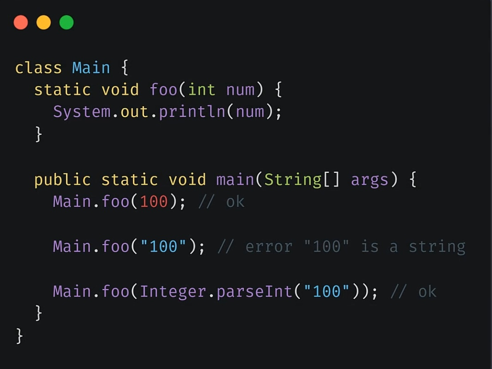

弱类型：语言层面不会限制实参的类型

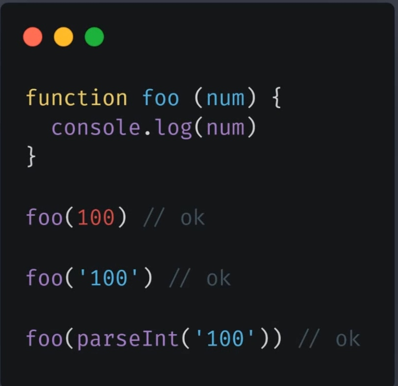

> 由于这种强弱类型之分根本不是某一个权威机构的定义，但是整体上认为：强类型有更强的类型约束，而弱类型中几乎没有什么约束。
>
> 也可以认为：强类型语言中不允许任意的隐式类型转换，而弱类型允许任意的数据隐式类型转换

<div class="danger">


> 此处的类型转换是指在语言的语法层面的限制，若传入不同类型的值则在编译阶段就会报错，而不会等到运行阶段。
>
> 且要注意：变量类型允许随时改变的特点，不是强弱类型的差异。如Python就是一门强类型的语言。

</div>

- 静态类型与动态类型（类型检查）

静态类型语言：一个变量声明时它的类型就是明确的。声明过后，它的类型就不允许再修改。

动态类型语言：运行阶段才能够明确变量的类型，而且变量的类型随时可以改变。

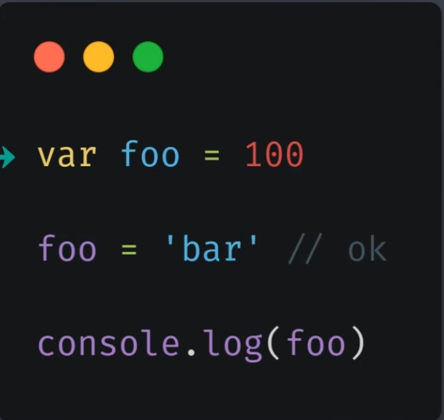

在动态类型语言中，变量是没有类型的，而变量中存放的值是有类型的。如JS。

- JS类型系统特征

> 弱类型且动态类型，虽然灵活却丢失了类型系统的可靠性。

为何JS不设计成强类型且静态类型的语言？

1. 早期的JS应用简单
2. JS没有编译环节，而静态语言需要在编译阶段做类型检查，所以JS设计成静态语言没有意义。

<div class="warning">

> 在大规模应用的背景下，原先JS的优势变成了短板

</div>


- JS弱类型产生的问题

1. JS中的代码由于没有编译阶段，所以若产生错误，要一直等到代码运行到错误的地方才会抛出异常。若测试中没有测试到错误行，则这个隐患便会一直留在代码当中。而若是强类型语言，则其会在编译时就报错，不用等到运行时。

```javascript
// JS 弱类型产生的问题
const obj = {}

// obj.foo()

setTimeout(() => {
    obj.foo()
}, 1000);
```

2. 当函数要求传入的值与实际调用函数传入的值类型不同时，会导致函数失去原有的功能·。而若在强类型语言中，这种写法会在语法层面报错。

```javascript
function sum(a, b) {
    return a + b
}

console.log(sum(100, 100))  // 200
console.log(sum(100, '100'))    // 100100
```

3. 由于JS中只允许使用字符串或Symbol类型的数据作为键，则当我们传入非字符串时会被转为字符串。这就导致了我们定义时用非字符串，调用时用字符串的情况发生。而若用强类型语言，定义时用非字符串就会在语法上报错。

```javascript
const obj = {}

obj[true] = 100
console.log(obj['true'])
```

<div class="warning">

> 我们当然可以做约定来保证传入的数据类型，但项目不断扩大时就容易产生隐患，只要强制要求了才能实现保障。

</div>

- 强类型的优势

  - 错误更早暴露

  - 代码更智能，编码更准确。(弱类型由于编译器无法判断是什么类型的数据，所以无法直接智能提示其内部成员)

  - 重构更牢靠（当定义了一个方法被多处地方使用后，想要修改方法名，弱类型语言无法轻易修改，因为使用到的地方无法报错提示。而强类型语言在重新编译时就会立刻报出错误）

    ```javascript
    const util = {
        aaa: () => {
            console.log('util func')
        }
    }
    ```

  - 减少不必要的类型判断

    ```javascript
    function sum(a, b) {
        if (typeof a !== 'number' || typeof b !== 'number') {
            throw new TypeError('arguments must be a number')
        }
        return a + b
    }
    ```

    

## Flow

> JavaScript 的类型检查器，使用类型注解的方式来限制数据类型。function sum(a:number,b:number){...}
>
> 在生产环境中，可以使用Babel等工具去掉此类型注解。
>
> 且Flow并不需要我们给每个变量都加类型注解，我们可以根据自己的需要添加。

- 快速上手

1. 安装

```javascript
yarn add flow-bin --dev
```

​	安装完后，可在bin目录下看到一个flow的可执行文件

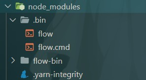

2. 关闭VSCode中的JS验证，若为关闭flow语法会在JS文件中报错

   

   

3. 编写代码（注意代码开头要写   // @flow）

   ```javascript
   // @flow
   
   function sum(a: number, b: number) {
       return a + b
   }
   
   sum(100, 100)
   sum(100, '100')
   ```

   

4. 输入如下命名

   ```javascript
   yarn flow init	// 生成flow配置文件
   yarn flow	// flow启动后台服务，监视文件
   ```

   

5. 查看编译结果

   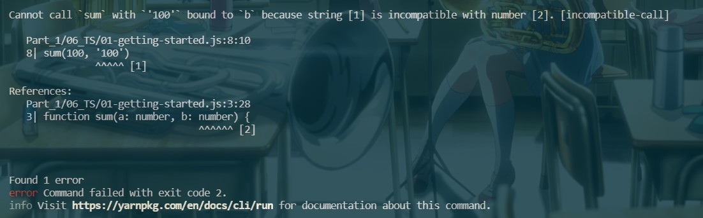

6. 停止flow服务

   ```javascript
   yarn flow stop
   ```

   

- Flow编译移除注解

> flow的类型注解并不是js语法，node环境下直接运行时会出错，所以我们需要自动移除掉类型注解

1. 使用flow-remove-types

   1. 安装

      ```javascript
      yarn add flow-remove-types --dev
      ```

   2. 运行命名

      ```javascript
      yarn flow-remove-types .\Part_1\06_TS -d dist
      ```

   3. 在根目录下会出现dist目录，里面有转换后的代码

      

2. 使用babel

   1. 安装

      ```javascript
      yarn add @babel/core @babel/cli @babel/preset-flow --dev
      ```

   2. 在根目录中新建.babelrc文件，并修改

      ```javascript
      {
          "presets": [
              "@babel/preset-flow"
          ]
      }
      ```

   3. 运行命令

      ```javascript
      yarn babel .\Part_1\06_TS -d dist
      ```

   4. 在根目录下会出现dist目录，里面有转换后的代码

      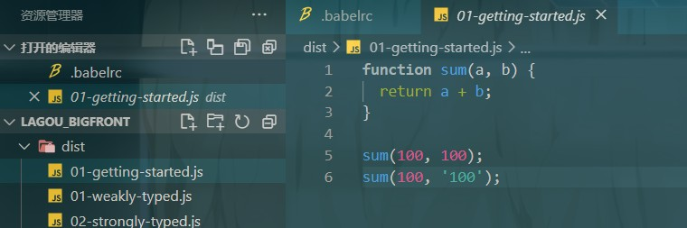

- Flow开发工具插件

  1. 首先在VSCode中安装此插件

  

  2. 安装完后，便可以看到VSCode的状态栏显示插件运行状态，同时可以在代码中提示错误

     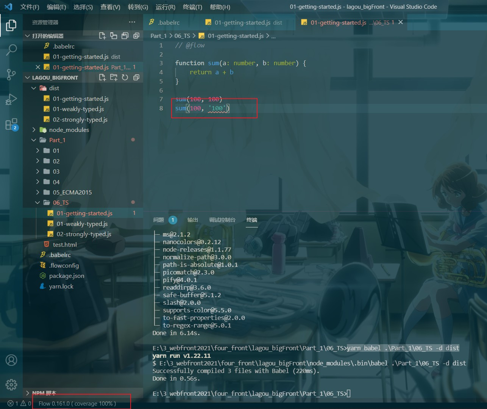

<div class="warning">

> 修改完代码需要保存过后插件才能显示语法问题。

</div>

- flow类型推断

```javascript
/**
 * 类型推断
 *
 *  @flow
 */

function square(n) {
    return n * n
}

square('100')
```

> 此时我们没有做n的类型注解，但是flow仍然可以做类型推断（因为字符串类型是不可以做乘法的）

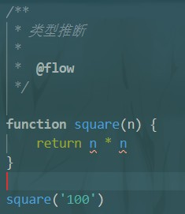

- flow类型注解

> 虽然flow可以做类型推断，但是做类型注解可以帮助我们更好的理解代码。因此尽可能做类型注解

```javascript
/**
 * 类型注解
 *
 * @flow
 */

function square(n: number) {
    return n * n
}

// 标准变量的值类型
let num: number = 123

// 标记函数的返回值类型
function foo(): number {
    return 123
}

// 函数没有返回值时标记为void
function foo2(): void {

}
```

- 原始类型

```javascript
/**
 * 原始类型
 *
 * @flow
 */

const a: string = 'foobar'

// number 类型可以存放数字或NaN或Infinity(无穷大)
const b1: number = 100
const b: number = NaN
const b2: number = Infinity

// boolean 类型可以存放 false或true
const c: boolean = false // true

// null类型只能存放null本身
const d: null = null

// 要标记变量为undefined，则将其标记为void
const e: void = undefined

// symbol类型只能存放Symbol类型
const f: symbol = Symbol()
```

- 数组类型

```javascript
/**
 * 数组类型
 *
 * @flow
 */

// 方式一：Array<number> 表示全部由数字组成的数组
const arr1: Array<number> = [1, 2, 3]

// 方式二：number[]  表示全部由数字组成的数组
const arr2: number[] = [1, 2, 3]

// 方式三：[string, number]  表示数组只能存放两位元素，且第一位为字符串，第二位为数字（元组）
const foo: [string, number] = ['foo', 100]
```

- 对象类型

```javascript
/**
 * 对象类型
 *
 * @flow
 */

// { foo: string, bar: number } 表示当前对象必须有foo(string类型)、bar(number类型两个成员)，此外还可以添加别的成员(注意与TS区分，TS中不可以)
const obj1: { foo: string, bar: number } = { foo: 'string', bar: 100, xxc: 100 }

// { foo?: string, bar: number } 表示当前对象中的foo属性可有可无
const obj2: { foo?: string, bar: number } = { bar: 100 }

// { [string]: string } 表示对象可以添加任意个数的键，但是键和值的类型都必须是字符串
const obj3: { [string]: string } = {}
obj3.key1 = 'value1'
// obj3.key2 = 100  // 报错
```

- 函数类型

```javascript
/**
 * 函数类型
 *
 * @flow
 */

// : (string, number) => void 表示回调函数的参数必须是一个string和一个number ，且没有返回值
function foo(callback: (string, number) => void) {
    callback('string', 100)	// 此处的callback作为参数，在foo函数中进行调用。
}

foo(function (str, n) {

})
```

- 特殊类型

```javascript
/**
 * 特殊类型
 *
 * @flow
 */

// :'foo' 表示 a 只能存放 'foo',此种写法一般不单独使用。而是配合'|'使用
const a: 'foo' = 'foo'

// : 'success' | 'warning' | 'danger' 表示只能存放三种值的其中之一
const type: 'success' | 'warning' | 'danger' = 'success'

// : string | number 表示只能存放类型为string或number的值
const b: string | number = 'string'

type StringOrNumber = string | number
const b1: StringOrNumber = 'string'

// ===========================================
// : ?number  表示可以接受number或null或undefined（maybe类型）
const gender: ?number = null
```

- Mixed & Any

```javascript
/**
 * Mixed Any
 *
 * @flow
 */

// mixed 表示可以为任意类型的数据
function passMixed(value: mixed) {
    // value.substr(1)  // 报错
    // const result = value * value // 报错
    if (typeof value === 'string') {
        value.substr(1)
    }
    if (typeof value === 'number') {
        const result = value * value
    }
}

passMixed('string')

passMixed(100)

// ==================================
// any 也表示可以为任意类型的数据
// 但any表示的是弱类型数据，而mixed表示强类型数据。尽量不要使用any类型，any的产生是为了兼容老代码
function passAny(value: any) {
    value.substr(1)

    const result = value * value
}
passAny('string')

passAny(100)
```

[更多类型点我查看](https://www.saltycrane.com/cheat-sheets/flow-type/latest/)

- 运行环境API类型限制

```javascript
/**
 * 运行环境 API
 *
 * @flow
 */

// : HTMLElement | null  表示只能为HTML元素或null
const element: HTMLElement | null = document.getElementById('app')
```

[更多类型点我查看](https://github.com/facebook/flow/tree/main/lib)

## TypeScript

> JavaScript的超集(superset)
>
> TS中的类型系统与Flow类似
>
> 此外TS能够将ES6+的新特性转化，使得可以在一些老平台中运行，实现babel的功能。
>
> 任何一种JavaScript运行环境都支持
>
> 相比flow，功能更为强大，生态也更健全、更完善
>
> TypeScript ---- 前端领域中的第二语言

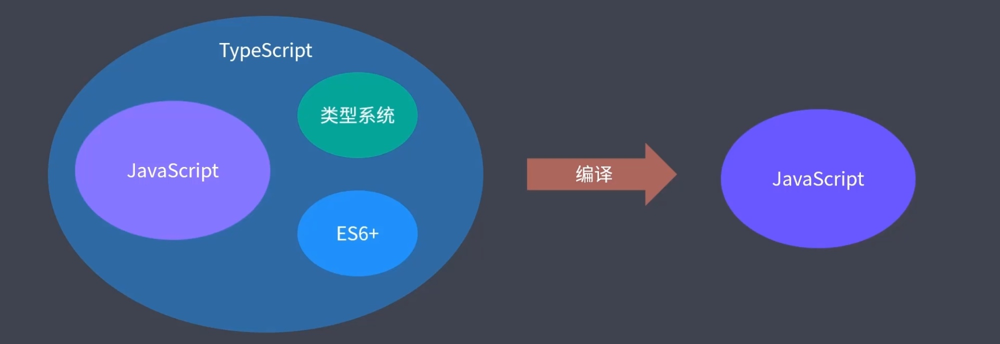

<div class="warning">

> 缺点一：本身多了很多概念。但是其属于【渐进式】，我们完全可以使用JS语法先写，等TS语法掌握后再使用TS语法书写。
>
> 缺点二：项目初期，TS会增加一些成本。


</div>

### 快速上手

1. 初始化项目

```javascript
yarn init --yes
```

2. 安装依赖包

```javascript
yarn add typescript --dev
```

3. 新建文件 01-getting-started.ts，并写入如下代码

```javascript
// 可以完全按照 JavaScript 标准语法编写代码

const hello = name => {
    console.log(`Hello,${name}`)
}

hello('TypeScript')
```

4. 执行如下命令

```javascript
yarn tsc 01-getting-started.ts
```

此后便可以在项目文件目录中见到生成的同名 js 文件

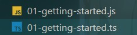

同时可以看到ts文件中代码都被转化为了ECMAScript3标准的代码

```javascript
// 可以完全按照 JavaScript 标准语法编写代码
var hello = function (name) {
    console.log("Hello," + name);
};
hello('TypeScript');
```

5. 对ts文件进行类型限制书写（VSCode默认支持TS类型检查，不用等到编译就可以看到错误提示）

```javascript
// 可以完全按照 JavaScript 标准语法编写代码

const hello = (name: string) => {
    console.log(`Hello,${name}`)
}

hello('100')
```


### 配置文件

生成配置文件命令：

```javascript
yarn tsc --init
```

执行完后，会在根目录生成tsconfig.json文件

```json
{
  "compilerOptions": {
    "target": "es2015",       // 编译后的js文件所采用的ECMAScript标准
    "module":"commonjs",		// 输出的代码会采用什么样的方式进行模块化
    "sourceMap":true,		// 开启源代码映射，这样就可以使用sourceMap文件调试ts源代码了
    "outDir":"dist",			// 编译结果输出到的文件夹
    "rootDir":"src",				// 源代码所在的文件夹
    "strict":true,			// 开启所有严格检查选项，严格模式下规定要对每个成员规定一个明确的类型（不能隐式推断为any）
    "strictNullChecks": true, /* 变量不能为空 */
  }
}

```

<div class="danger">

> 注意：使用命令编译单个ts文件时，配置文件是不会生效的，只有使用yarn tsc时才会生效。且使用yarn tsc前须确保文件移动到了rootDir中。

</div>

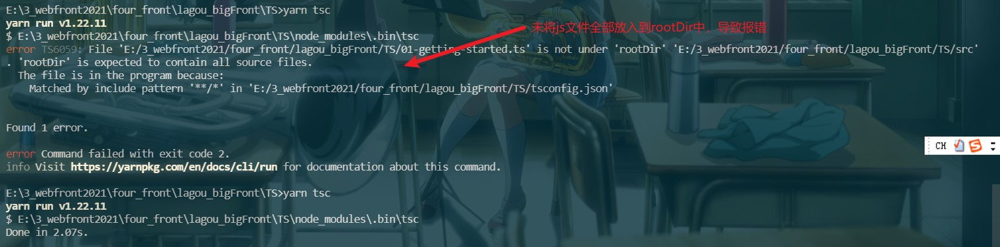

### TS原始类型

```javascript
/**
 * 原始数据类型
 */

const a: string = "foobar"

const b: number = 100    // NaN Infinity

const c: boolean = true   // false

// 与flow不同，ts中上面三种类型声明的值可以为undefined 或 null（tsconfig.json中"strict":false且没有开启"strictNullChecks": true,的情况下）
// const d: string = null

// void类型声明严格模式下（tsconfig.json中"strict":true）只能为undefined，否则可以为null或undefined
const e: void = undefined

const f: null = null

const g: undefined = undefined

// 此处要将symbol类型声明的值直接赋值Symbol()需要将tsconfig.json中的"target"改为"es2015",
const h: symbol = Symbol()
```


### TS标准库声明

> 标准库就是内置对象所对应的声明

```javascript
// 此处要将symbol类型声明的值直接赋值Symbol()需要将tsconfig.json中的"target"改为"es2015",
// 因为如果target为es5，ts会引用es5的标准库，其中并没有Symbol()类型。而es2015中有。
const h: symbol = Symbol()

// Promise也同理
Promise
```

> 修改引用标准库的方法

1. 修改tsconfig.js中的target属性。
2. 在tsconfig.js中新增lib选项

```javascript
{
  "compilerOptions": {
    ......
    "lib": [
      "ES2015"
    ],
    ......
  }
}
```

<div class="danger">

> 若lib只像上方这样写，会导致ts原先导入的一些DOM库被覆盖掉了，此时使用console.log()等DOM操作就会报错。所以需要修改为如下写法

```javascript
"lib": [
    "ES2015",
    "DOM"	/* DOM库中包含了DOM和BOM */
],
```

</div>

### TS中文错误消息

1. 控制台错误消息改为中文

进行yarn tsc时添加如下配置项，即可提示中文的错误消息

```typescript
yarn tsc --locale zh-CN
```

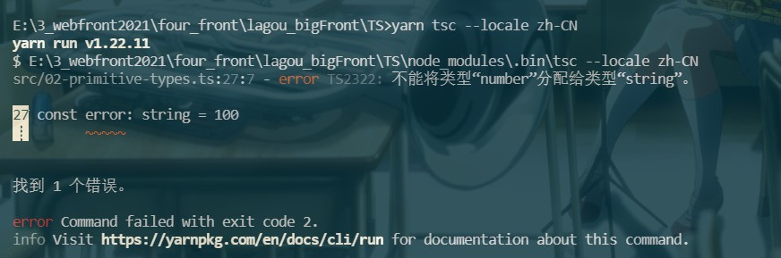

2. 编辑器错误消息改为中文

   进入首选项->设置中进行修改

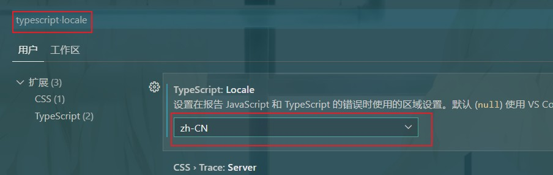

​		修改完后可看到如下效果：

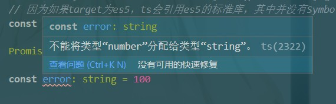

### 作用域问题

> 在ts文件中，若定义了一个在其它ts文件中已经定义过的变量名，会报错。
>
> 因为ts文件中定义的变量是放在全局作用域中的，所以TS去编译时就会出现变量已声明的问题。


解决方法：

1. 使用立即执行函数

```javascript
(function () {
    const a = 123
})
```

2. 使用esModule中的export，因为使用了export后该文件就被视为了一个模块，而模块是拥有专门的模块作用域的。

```javascript
const a = 123

export { }
```

### Object类型

> TS中的Object类型不是单纯指对象类型，而是指所有的非原始类型（对象、数组、函数）

```typescript
// Object 类型

export { }  // 确保跟其它示例没有成员冲突

// object的类型声明可以使用函数、对象、数组
const foo: object = function () { } // [] // {}

// {} 的类型声明表示只能使用对象，且赋值类型与声明类型需完全一致，不多不少
const obj: { foo: number, bar: string } = { foo: 123, bar: 'string' }
```

### 数组类型

```typescript
// 数组类型

// : Array<number>  表示一个纯数字组成的数组
const arr1: Array<number> = [1, 2, 3]

// : number[] 表示一个纯数字组成的数组
const arr2: number[] = [1, 2, 3]

// ------------------------------------
// 基本使用
function sum(...args: number[]) {
    // 如果是JS，此处需要加类型判断语句，判断每个值是否都为数字，而TS中只需要加number[]
    return args.reduce(function (prev, current) {
        return prev + current
    }, 0)
}
```


### 元组类型

> 元组，元组就是固定长度和类型的数组        语法：[类型,类型,类型]

```javascript
// 元组（Tuple）

export { }   // 确保其它示例没有成员冲突

// : [number, string] 表名只能传一个数字和一个字符
const tuple: [number, string] = [
    18, 'zce'
]

// const age = tuple[0]
// const name = tuple[1]

const [age, name] = tuple

// ----------------
const obj = Object.entries({
    foo: 123
})  // obj也是一个元组
console.log(obj)

// 个人认为：只要是固定长度和类型的数组，就是元组
```

### 枚举类型

```typescript
// 枚举（Enum）
// 可以给一组数值起上一个更好理解的名字
// 一个枚举中只会存在固定的值，不会存在超出范围的数值

export { }   // 确保其它示例没有成员冲突

// 原始写法：使用对象来实现枚举的功能
// const PostStatus = {
//     Draft: 0,
//     Unpublished: 1,
//     Published: 2
// }

// 使用枚举（注意枚举中要使用等号）
// enum PostStatus {
//     Draft = 0,
//     Unpublished = 1,
//     Published = 2
// }

// 枚举中若不指定值，默认会从0开始累加
// 如果给第一个值赋了初始值，后面的值就会在器基础之上进行累加 6->7->8
// enum PostStatus {
//     Draft = 6,
//     Unpublished,
//     Published
// }

// 枚举的值也可以是字符串，但由于字符串无法自增长，所以需要给每个成员都初始化值。
enum PostStatus {
    Draft = 'aaa',
    Unpublished = 'bbb',
    Published = 'ccc'
}

// 使用方式枚举与对象一样。XXX.xxx
const post = {
    title: 'Hello TypeScript',
    content: 'xxxxxxxxxxxxxxxxxxxxxxxxxxxx',
    status: PostStatus.Draft  //1 //0
}
```

<div class = "warning">

> 注意：枚举的值会编译为一个双向的键值对对象，这样枚举类型的数据，我们既可以通过键来获取值，也可以通过值来获取键。
>
> 这样我们就可以通过索引器的方式来获取枚举对象的名称：PostStatus[6] => Draft。
>
> 如果我们确定不会通过索引器的方式来获取枚举对象的名称，那么我们就可以使用常量枚举。

</div>

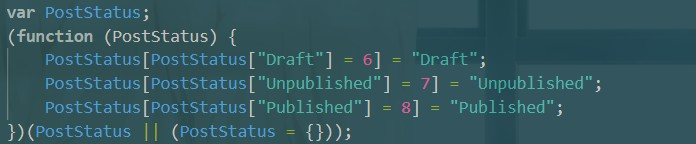

> 常量枚举：
>
> **const** enum PostStatus{}
>
> 使用常量枚举后，编译后的文件将不存在枚举的编译结果，而使用枚举值的地方会变为一个具体数值

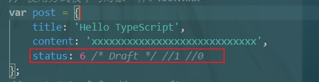


### 函数类型

> 函数类型约束主要是对函数的输入输出进行类型限制（分为函数声明与函数表达式）

```javascript
// 函数类型

export { }   // 确保跟其它示例没有成员冲突

// 函数声明的类型约束

/*
function func1(a: number, b: number): string {
    return 'func1'
}

func1(100, 200)

// 要保证形参与实参完全一致
// func1(100)  // 报错

// func1(100, 200, 300)    // 报错 */

// =================================================
/* 
// ? 表示可选参数，调用时可传可不传
// 也可以使用es6的默认参数来实现可选参数的效果
// 注意：无论可选参数还是默认参数都得放在参数列表最后
// function func1(a: number, b: number = 200): string {
function func1(a: number, b?: number): string {
    return 'func1'
}

func1(100, 200)

func1(100) 
*/

// =================================================
/* 
// 可以使用es6的...rest来表示接收任意数量参数
function func1(a: number, b: number = 10, ...rest: number[]): string {
    return 'func1'
} 
*/


// 函数表达式的类型约束
const func2 = function (a: number, b: number): string {
    return 'func2'
}

const func3: (a: number, b: number) => string = function (a, b) {
    return 'func3'
}
```


### 任意类型(any)

```typescript
// 任意类型（弱类型）

export { }   // 确保跟其它示例没有成员冲突

function stringify(value: any) {
    return JSON.stringify(value)    // 本身JSON.stringify可以接收任意类型的参数，所以此处value应为任意类型的参数
}

stringify('string')

stringify(100)

stringify(true)

let foo: any = 'string'

foo = 100

// any类型是动态类型，语法上不会报错，轻易不使用
```

### 隐式类型推断

```typescript
// 隐式类型推断

export { }   // 确保跟其它示例没有成员冲突

let age = 18    // 会被ts推断为Number类型

// age = '123' // 报错，因为age已经推断为了Number类型

let foo     // 会被ts推断为any类型

foo = 100

foo = 'string'      // 不会报错，因为foo定义时确定为any类型，不会因为上面的赋值为100而改变

// 建议为每个变量添加明确的类型
```

### 类型断言

> 在某些特殊的情况下，ts无法推断出一些变量的具体类型，导致我们无法使用变量

```typescript
// 类型断言

export { }   // 确保跟其它示例没有成员冲突

// 假定这个 nums 来自一个明确的接口
const nums = [100, 120, 110, 112]

const res = nums.find(i => i > 9)   // ts此处会推断res 为Number或undefined，因为它觉得有可能找不到

const square = res * res    // 使用报错
```


```typescript
const num1 = res as number  // 使用as 做类型断言

const num2 = <number>res    // 使用<> 做类型断言，此种写法会与jsx中的标签尝试冲突
```

<div class="warning">

> 注意：类型断言并非类型转换，因为类型转换是在代码运行时的一个概念，而类型断言是代码编译过程中的一个概念，编译完成后也就不存在了。

</div>

### 接口（Interfaces）

> 接口用来约束对象的结构，一个对象去实现一个接口，那么它必须要拥有接口所约束的所有成员。
>
> 接口代码编译后会消失

```typescript
// 接口

export { }   // 确保跟其它示例没有成员冲突

interface Post {
    title: string       // 此处代码末尾可加分号也可不加
    content: string
}

function printPost(post: Post) {
    console.log(post.title)
    console.log(post.content)
}

printPost({
    title: 'xxc',
    content: 'jmz'
})
```


### 接口扩展

```typescript
// 可选成员、只读成员、动态成员

export { }   // 确保跟其它示例没有成员冲突

interface Post {
    title: string       // 此处代码末尾可加分号也可不加
    content: string
    subtitle?: string       // ? 表示subtitle为可选成员，实际就是表示subtitle为string|undefined
    readonly summary: string     // readonly表示summary为只读成员，初始化后就不可再修改了
}

const hello: Post = {
    title: 'xxc',
    content: 'jmz',
    summary: 'mrx'
}

// hello.summary = 'xxc'    // 报错

// ========================================
interface Cache {
    [key: string]: string   // key不是固定名称，设置完后表示Cache中的值为动态成员，只要满足键值都为string类型即可
}

const cache: Cache = {}

cache.xxc = '123'
cache.xxc1 = '123'
```


### 类

> 描述一类具体对象的抽象成员
>
> ES6以前，JS都是通过函数+原型模拟实现的类。ES6开始JS中有了专门的class。
>
> TS增强了class的相关语法

```typescript
// 类（Class）

export { }  // 确保跟其它示例没有成员冲突

class Person {
    name: string	// 此处也可以直接赋初值
    age: number
    constructor(name: string, age: number) {
        this.name = name    // 直接如此赋值会报错，ts中要求需要先在类中定义
        this.age = age
    }

    sayHi(msg: string): void {
        console.log(`I am ${this.name},${this.age}`)
    }
}
```

<div class="warning">

> ts中要求要先定义属性，才可在构造函数中进行赋值操作。

</div>


### 类的访问修饰符

```typescript
// 类的访问修饰符

export { }  // 确保跟其它示例没有成员冲突

class Person {
    public name: string     // public 默认的类成员标识符
    private age: number     // private 表示该属性只能在类的内部进行访问
    protected gender: boolean   // protected 表示该属性只能在类的内部或子类中访问
    constructor(name: string, age: number) {
        this.name = name
        this.age = age
    }

    sayHi(msg: string): void {
        console.log(`I am ${this.name},${msg}`)
        console.log(this.age, this.gender)
    }
}

class Student extends Person {
    private constructor(name: string, age: number) {    // 若构造函数被设置为了private，则该类无法被实例化或继承。只能在类的内部去创建实例
        super(name, age)
        console.log(this.gender)
    }
    static create(name: string, age: number) {
        return new Student(name, age)
    }
}

const tom = new Person('tom', 18)
console.log(tom.name)
// console.log(tom.age)    // 报错
// console.log(tom.gender)     // 报错

// const jack = new Student('xxc', 18)    // 报错
Student.create('xxc', 18)
```


### 类的只读属性

```typescript
// 类的只读属性

export { }  // 确保跟其它示例没有成员冲突

class Person {
    public name: string
    private age: number
    protected readonly gender: boolean = false     // 定义为readonly只读属性后，只能在声明时或构造函数中进行初始化，不能在声明后再在构造函数中修改值

    constructor(name: string, age: number) {
        this.name = name
        this.age = age
    }

    sayHi(msg: string): void {
        console.log(`I am ${this.name},${msg}`)
        console.log(this.age, this.gender)
    }
}

const tom = new Person('tom', 18)
console.log(tom.name)
```


### 类与接口

```typescript
// 类与接口

export { } // 确保跟其它示例没有成员冲突

interface Eat {
    eat(food: string): void
}

interface Run {
    run(distance: number): void
}

class Person implements Eat, Run {  // 通过implements定义了要实现哪些接口后，如果类中没有实现接口中的方法就会报错
    // 此处的food仍然要写string类型约束。
    eat(food: string): void {
        console.log(`优雅的进餐: ${food}`)
    }
    run(distance: number) {
        console.log(`直立行走: ${distance}`)
    }
}

class Animal implements Eat, Run {
    eat(food: string): void {
        console.log(`呼噜呼噜的吃: ${food}`)
    }

    run(distance: number) {
        console.log(`爬行: ${distance}`)
    }
}
```


<div class="warning">

> 注意：接口最好细化，去约束一个能力，然后让一个类同时去实现多个接口

</div>


### 抽象类

```typescript
// 抽线类

export { } // 确保跟其它示例没有成员冲突

// 抽象类与接口类似，用来约束子类中必须要有某些成员，但是抽象类可以包含具体实现，而接口不包含
// 一般比较大的类目都推荐用抽象类
abstract class Animal {     // abstract 表示其为抽象类，且限制了该类只能用来继承不能通过new来创建实例
    eat(food: string): void {
        console.log(`呼噜呼噜的吃: ${food}`)
    }

    abstract run(distance: number): void    // 在方法前加 abstract 表示该方法为抽象方法，不需要方法体
}

class Dog extends Animal {
    run(distance: number): void {
        console.log('四脚爬行', distance)
    }
}

const d = new Dog()
d.eat('嗯西马')
d.run(100)
```

### 泛型

> 定义函数、接口、类时没有指定具体的类型，而是使用的时候再去指定具体类型。这种做法可以极大程度的复用我们的代码。


```typescript
// 泛型

export { } // 确保跟其它示例没有成员冲突

function createNumberArray(length: number, value: number): number[] {
    // 使用泛型的方式指明Array中的值全为number类型
    const arr = Array<number>(length).fill(value)   // es6的fill方法可以填充数组元素的值
    return arr
}

function createStringArray(length: number, value: string): string[] {
    const arr = Array<string>(length).fill(value)
    return arr
}

function createArray<T>(length: number, value: T): T[] {    // 将泛型参数定义为T，然后将函数中不明确的类型参数都定义为T
    const arr = Array<T>(length).fill(value)
    return arr
}

// const res = createNumberArray(3, 100)
// res => [100, 100, 100]

const res = createArray<string>(3, 'foo')
```


### 类型声明

> 一个成员在定义的时候因为种种原因没有声明一个明确的类型，那么我们在使用的时候就可以为其做一些类型声明。
>
> 产生的原因：为了考虑兼容一些普通的js模块

```type
// 类型声明

import { camelCase } from 'lodash'

declare function camelCase(input: string): string

const res = camelCase('hello typed')

export { } // 确保跟其它示例没有成员冲突
```

<div class="success">

> 一般的js库都有专门的类型声明模块，可以在提示的修复操作中看到。
>
> 同时，部分模块其内部就有类型声明文件，不用再专门安装类型声明模块。

</div>

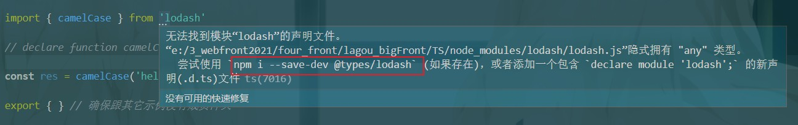


### 在Vue项目中配置TypeScript

> 两种情况:

- 全新项目:使用Vue CLI脚手架工具创建Vue 项目
- 已有项目:添加Vue官方配置的TypeScript适配插件


> 关于编辑器

&emsp;&emsp;要使用TypeScript开发Vue应用程序，我们强烈建议您使用Visual Studio Code，它为TypeScript提供了极好的“开箱即用"支持。如果你正在使用单文件组件(SFC)，可以安装提供SFC支持以及其他更多实用功能的Vetur插件。
&emsp;&emsp;WebStorm同样为TypeScript和Vue提供了“开箱即用"的支持。


> 全新项目

```javascript
vue create vue-with-ts
```

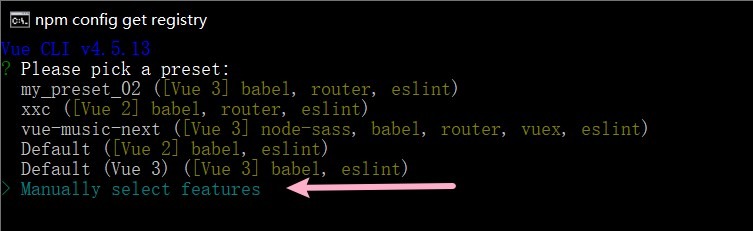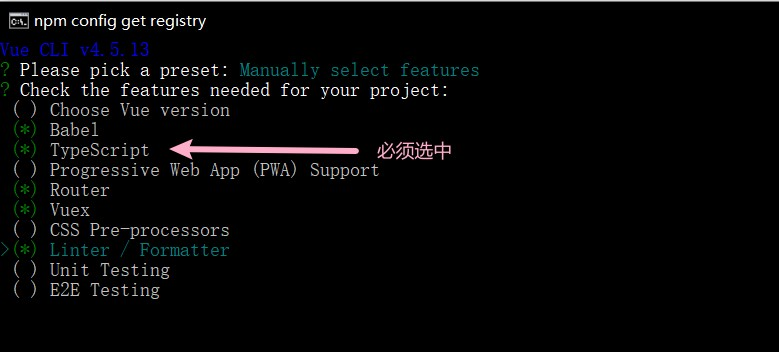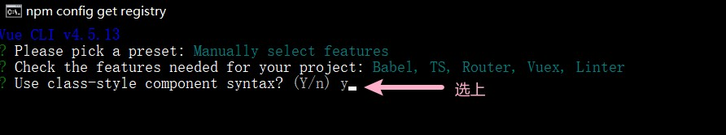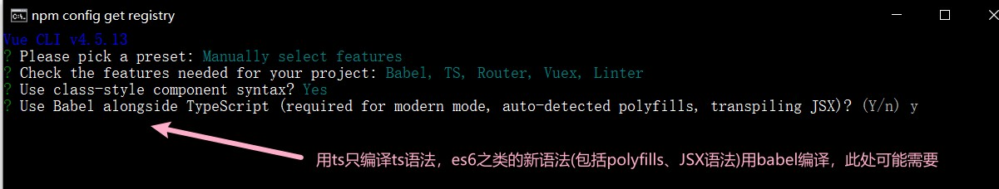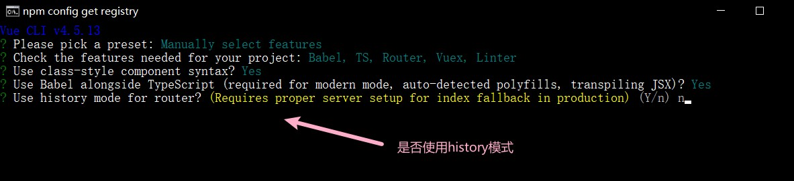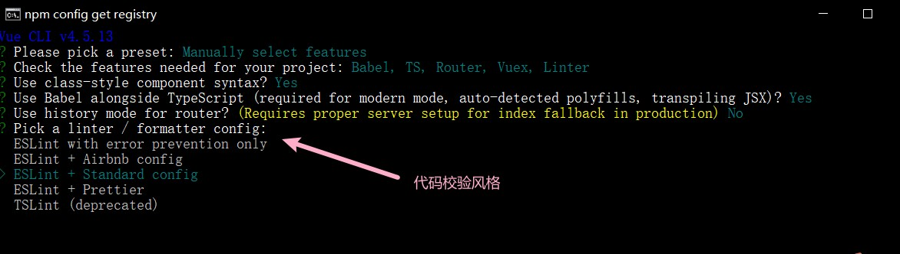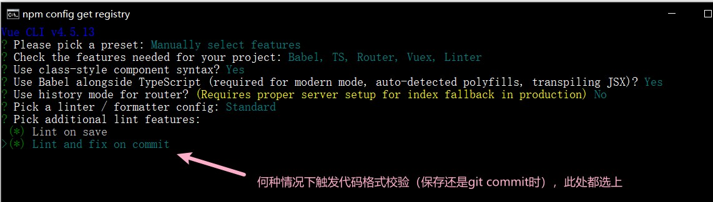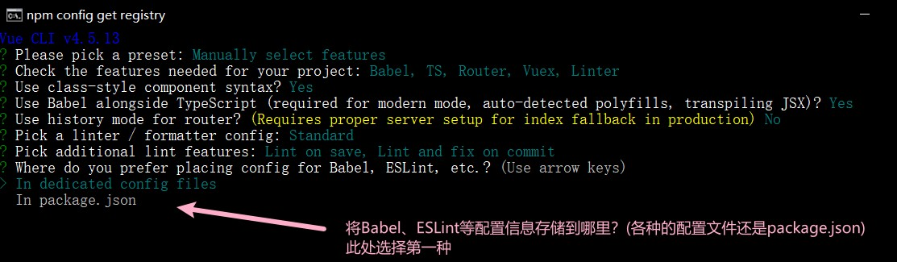

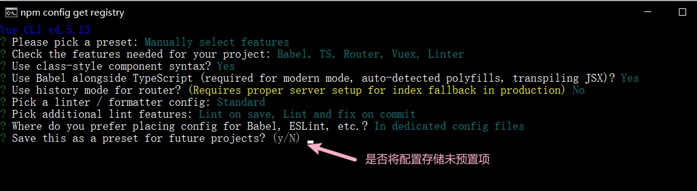

之后开始自动创建项目，然后cd vue-with-ts  +  npm run dev即可启动项目，最终看到如下页面

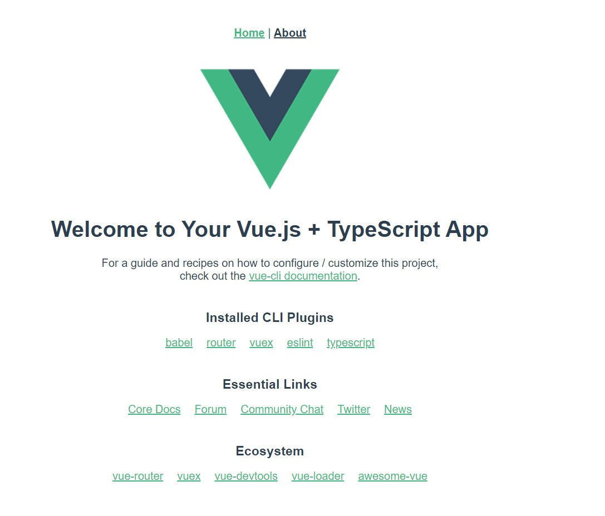

#### 项目结构说明

> 在package.json中的一些ts依赖包

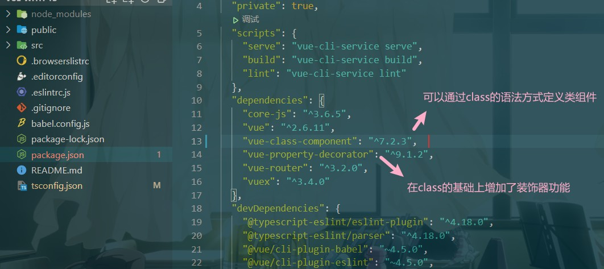

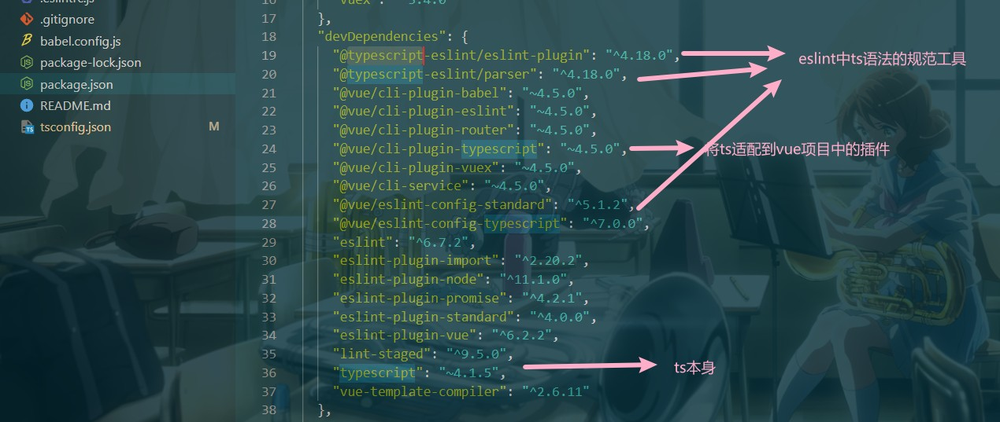

> 可以看到项目中的所有js文件都变为了ts文件

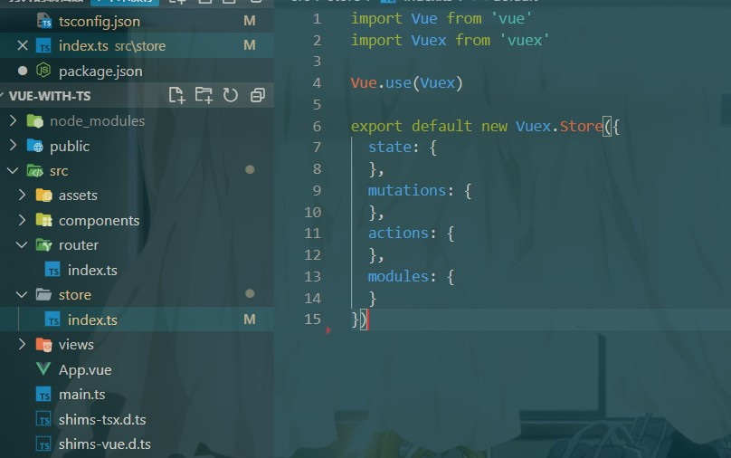

> shims-vue.d.ts、shims-tsx.d.ts文件作用？

&emsp;&emsp; ts文件默认不支持引入.vue、.tsx结尾的文件，这两个文件用于使得ts能够支持这两类文件的引入。


#### 定义组件的方式

> 使用Options APIs

- 组件仍然可以使用以前的方式定义(导出组件选项对象，或者使用Vue.extend())
- 但是当我们导出的是一个普通的对象，此时TypeScript无法推断出对应的类型
- 至于VScode可以推断出类型成员的原因是因为我们使用了Vue插件
- 这个插件明确知道我们这里导出的是一个Vue对象
- 所以我们必须使用vue.extend()方法确保TypeScript 能够有正常的类型推断

```javascript
// 使用ts写法，此时这个对象是extend方法的参数，具有类型验证效果
<script lang="ts">
import Vue from "vue";
export default Vue.extend({
	data() {
		return {
			count: 0,
		};
	},

	methods: {
		increment() {
			// this.count++;
			this.count.substr();	// ts语法检查不通过，会报错
		},
	},
});
</script>

// 普通定义方式
<script>
export default {
	data() {
		return {
			count: 0,
		};
	},

	methods: {
		increment() {
			this.count++;
			this.count.substr();	// 数字中并没有这个方法，所以这种调用方式就会报错
		},
	},
};
</script>
```

> 使用Class APIs

参考：

- https://class-component.vuejs.org/

&emsp;&emsp;在TypeScript下，Vue的组件可以使用一个继承自Vue类型的子类表示，这种类型需要使用Component装饰器去修饰

&emsp;&emsp;装饰器函数接收的参数就是以前的组件选项对象（data、props、methods之类）

```javascript
<script lang="ts">
import Vue from "vue";
import Component from "vue-class-component";

// 此种写法达成效果与传统写法一样，只是vue-class-component在内部做了一些处理。
@Component({
    props:{
        size:String
    }
})
export default class App extends Vue {
    private count:number = 1
	private text:string = 'Click me'

	get content(){
        return `${this.text} ${this.count}`
    }

	increment() {
		this.count++;
		// this.count.abc();	// 提示出错
	}
}
</script>
```

> 使用Class APIS + [vue-property-decorator](https://github.com/kaorun343/vue-property-decorator)

```javascript
import {Vue, Component, Prop} from 'vue-property-decorator'

@Component
export default class Button extends Vue{
    private count:number = 1
	private text:string = 'Click me'
	@Prop() readonly size?:string
    
    get content(){
        return `${this.text} ${this.count}`
    }

	increment(){
        this.count++
    }

	mounted(){
        console.log('button is mounted')
    }
}
```

这种方式继续放大了class这种组件定义方法。


#### 关于Decorator装饰器语法

参考文档：

- https://es6.ruanyifeng.com/#docs/decorator

Decorator 提案经过了大幅修改，目前还没有定案，不知道语法会不会再变。所以建议了解即可，不建议在生产环境使用。

所以不建议使用Class APIS。而是使用Options APIS中的export default Vue.extend({ ... })。

#### 实例

- api/index.ts

```typescript
import axios from 'axios'

export interface Post {
    id: string
    author_id: string
    title: string
    content: string
}

export const getPosts = (): Promise<Post[]> => {
    // axios返回的是Promise
    return axios({
        url: 'https://cnodejs.org/api/v1/topics',
        method: 'GET'
    }).then(res => {
        return res.data.data
    })
}
```

- App.vue

  - OptionsAPI

    ```html
    <script lang="ts">
    import Vue from "vue";
    import { getPosts, Post } from "@/api/index";
    
    export default Vue.extend({
    	data(): {
    		posts: Post[];
    		count:number;
    	} {
    		return {
    			posts: [],
    			count:0
    		};
    	},
    	async created() {
    		const posts = await getPosts();
    		this.posts = posts;
    	},
    	methods:{
    		increment(){}
    	}
    });
    </script>
    ```

    

  - ClassAPI

    ```javascript
    <script lang="ts">
    import Vue from "vue";
    import Component from "vue-class-component";
    import { getPosts, Post } from "@/api/index";
    
    // 此种写法达成效果与传统写法一样，只是vue-class-component在内部做了一些处理。
    @Component
    export default class App extends Vue {
    	count = 0;
    	posts: Post[] = [];
    
    	increment() {
    		this.count++;
    		// this.count.abc();	// 提示出错
    	}
    
    	async created() {
    		const posts = await getPosts();
    		this.posts = posts;
    	}
    }
    </script>
    ```

    

​		