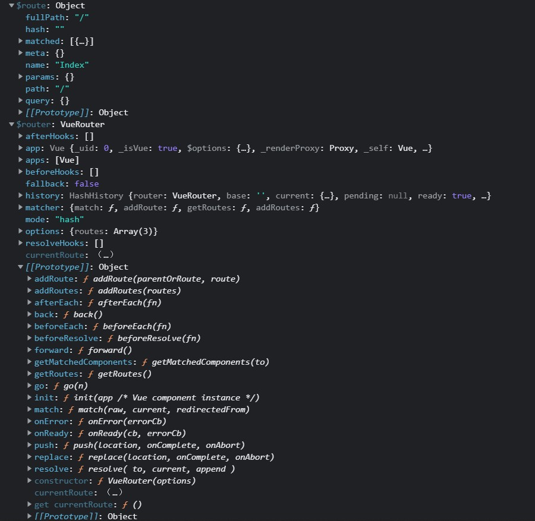
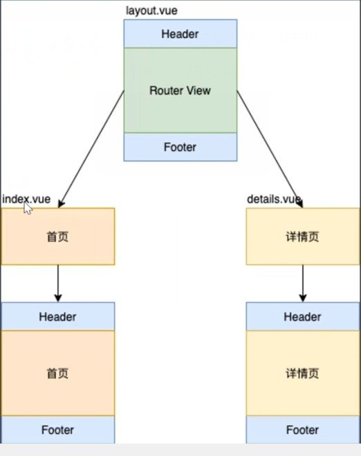
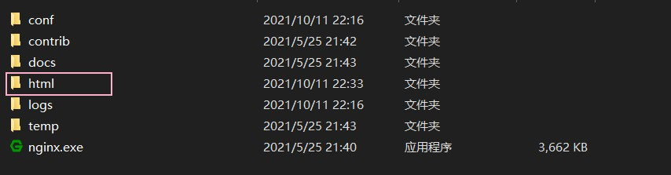
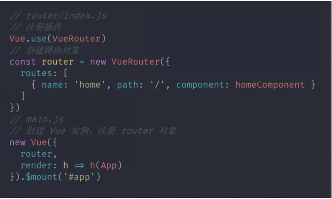
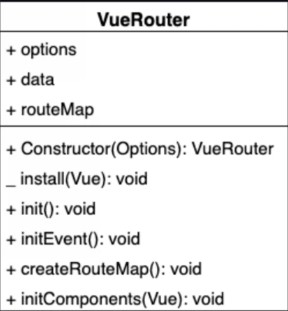
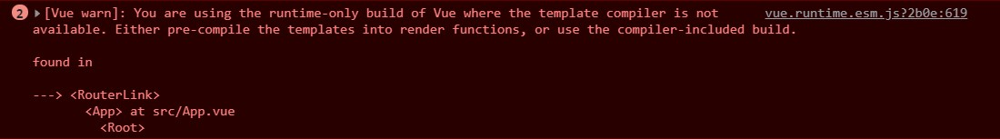

## Vue Router基础回顾

### 使用步骤

1. 建立router/index.js文件，写入如下代码

```javascript
import Vue from 'vue'
import VueRouter from 'vue-router'
import Index from '../views/Index.vue'
// 1. 注册路由插件
Vue.use(VueRouter)

// 路由规则
const routes = [
  {
    path: '/',
    name: 'Index',
    component: Index
  },
  {
    path: '/blog',
    name: 'Blog',
    component: () => import( '../views/Blog.vue')
  },
  {
    path: '/photo',
    name: 'Photo',
    component: () => import('../views/Photo.vue')
  }
]
// 2. 创建 router 对象
const router = new VueRouter({
  routes
})

export default router

```

2. 在main.js中引入文件，并注册router对象

```javascript
import Vue from 'vue'
import App from './App.vue'
import router from './router'

Vue.config.productionTip = false

new Vue({
  // 3. 注册 router 对象
  router,
  render: h => h(App)
}).$mount('#app')

```

3. 在App.vue中使用

```html
<template>
  <div id="app">
    <div>
      
    </div>
    <div id="nav">
      <!-- 5. 创建链接 -->
      <router-link to="/">Index</router-link> |
      <router-link to="/blog">Blog</router-link> |
      <router-link to="/photo">Photo</router-link>
    </div>
    <!-- 4. 创建路由组建的占位 -->
    <router-view/>
  </div>
</template>
```


> 当我们在创建Vue实例时，并给其配置router选项，它会给vue实例添加$route和$router两个属性，$route中存储了当前路由的数据（路由规则），$router为VueRouter的实例（路由对象），其内部存储了一些路由相关的方法，有的时候无法获取$route，而通过$router的currentRoute属性，我们也可以获取当前路由的规则。




### 动态路由

> 如下方所示，通过给路由添加一个 :id来占位，使得其能够传入一个动态的数据

```javascript
import Vue from 'vue'
import VueRouter from 'vue-router'
import Index from '../views/Index.vue'

Vue.use(VueRouter)

const routes = [
  {
    path: '/',
    name: 'Index',
    // 此处首页加载组件时直接将组件加载进来  
    component: Index
  },
  {
    path: '/detail/:id',
    name: 'Detail',
    // 开启 props，会把 URL 中的参数传递给组件
    // 在组件中通过 props 来接收 URL 参数
    props: true,
    // 详情页中加载组件使用路由懒加载，只有用户访问当前路由才加载当前组件，不访问则不加载。
    component: () => import(/* webpackChunkName: "detail" */ '../views/Detail.vue')
  }
]

const router = new VueRouter({
  routes
})

export default router
```

使用：

```html
<template>
  <div>
    <!-- 方式1： 通过当前路由规则，获取数据，此种方式强依赖于路由，我们在使用这个组件时，必须有路由传递参数 -->
    通过当前路由规则获取：{{ $route.params.id }}

    <br>
    <!-- 方式2：路由规则中开启 props 传参，这种方式更好，不再依赖于路由的规则，只要有给本组件传递id参数就可使用本组件 -->
    通过开启 props 获取：{{ id }}
  </div>
</template>

<script>
export default {
  name: 'Detail',
  props: ['id']
}
</script>

<style>

</style>
```

### 嵌套路由

> 当多个路由组件都有相同的内容，我们可以将这些相同的内容提取到一个公共的组件当中。



代码实现：

- App.vue

```html
<template>
  <div id="app">
    <div id="nav">
      <router-view></router-view>
    </div>
  </div>
</template>
```

- components/Layout.vue

```html
<template>
  <div>
    <div>
      
    </div>
    <div>
      <router-view></router-view>
    </div>
    <div>
      Footer
    </div>
  </div>
</template>

<script>
export default {
  name: 'layout'
}
</script>

<style scoped>
</style>
```

- views/Detail.vue

```html
<template>
  <div>
    通过当前路由规则获取：{{ $route.params.id }}

    <br>
    通过开启 props 获取：{{ id }}
  </div>
</template>

<script>
export default {
  name: 'Detail',
  props: ['id']
}
</script>

<style>

</style>

```

- views/Index.vue

```html
<template>
  <div>
    这里是首页 <br>
    <router-link to="login">登录</router-link> |

    <router-link to="detail/5">详情</router-link>
  </div>
</template>

<script>
export default {
  name: 'Index'
}
</script>

<style>

</style>
```

- views/Login.vue

```html
<template>
  <div>
    这是登录页面
    <br>
    <router-link to="/">首页</router-link>
  </div>
</template>

<script>
export default {
  name: 'Login'
}
</script>

<style scoped>
</style>
```

- router/index.js

```javascript
import Vue from 'vue'
import VueRouter from 'vue-router'
// 加载组件
import Layout from '@/components/Layout.vue'
import Index from '@/views/Index.vue'
import Login from '@/views/Login.vue'

Vue.use(VueRouter)

const routes = [
  {
    name: 'login',
    path: '/login',
    component: Login
  },
  // 嵌套路由
  {
    path: '/',
    component: Layout,
    children: [
      {
        name: 'index',
        path: '', // 此处空字符串，相当于相对路径，会先加载Layout，再加载Index，然后合并
        // path:'/'  也可以写成绝对路径
        component: Index
      },
      {
        name: 'detail',
        path: 'detail/:id',
        // path:'/detail/:id'  也可以写成绝对路径
        props: true,
        component: () => import('@/views/Detail.vue')
      }
    ]
  }
]

const router = new VueRouter({
  routes
})

export default router
```

> 当程序运行时，根据路由匹配规则，会先加载Layout组件再加载Index组件，而为了达成这个效果，Layout组件中需要写一个router-view，同时App组件中也得写一个。而/login由于不需要加载相同的头和尾，所以其内部不需要嵌套路由，故也不需要再写router-view。

### 编程式导航

- views/Detail.vue

```html
<template>
	<div>
		路由参数：{{ id }}

		<button @click="go">go(-2)</button>
	</div>
</template>

<script>
export default {
	name: "Detail",
	props: ["id"],
	methods: {
		go() {
			// go表示跳转到历史中的某一个，为负数表示后退
			this.$router.go(-2);
		},
	},
};
</script>

<style>
</style>

```

- views/Index.vue

```html
<template>
	<div class="home">
		<div id="nav">
			<router-link to="/">Index</router-link>
		</div>
		<button @click="replace">replace</button>

		<button @click="goDetail">Detail</button>
	</div>
</template>

<script>
export default {
	name: "Index",
	methods: {
		replace() {
			// replace方法不会记录历史，会把当前页面的历史覆盖
			this.$router.replace("/login");
		},
		goDetail() {
			this.$router.push({ name: "Detail", params: { id: 1 } });
		},
	},
};
</script>

```

- views/Login.vue

```html
<template>
	<div>
		用户名：<input type="text" /><br />
		密&nbsp;&nbsp;码：<input type="password" /><br />

		<button @click="push">push</button>
	</div>
</template>

<script>
export default {
	name: "Login",
	methods: {
		push() {
			// $router.push可以传字符串，表示路由绝对路径，也可以传对象，对象中包含name参数，表示路由名称
			this.$router.push("/");
			// this.$router.push({ name: 'Home' })
		},
	},
};
</script>

<style>
</style>

```

- views/App.vue

```html
<template>
  <div id="app">

    <router-view/>
  </div>
</template>

```

- router/index.js

```js
import Vue from 'vue'
import VueRouter from 'vue-router'
import Index from '../views/Index.vue'

Vue.use(VueRouter)

const routes = [
  {
    path: '/',
    name: 'Index',
    component: Index
  },
  {
    path: '/login',
    name: 'Login',
    // route level code-splitting
    // this generates a separate chunk (about.[hash].js) for this route
    // which is lazy-loaded when the route is visited.
    component: () => import(/* webpackChunkName: "about" */ '../views/Login.vue')
  },
  {
    path: '/detail/:id',
    name: 'Detail',
    props: true,
    component: () => import(/* webpackChunkName: "detail" */ '../views/Detail.vue')
  }
]

const router = new VueRouter({
  routes
})

export default router

```


### Hash和History模式区别

> 不管那种模式，都是客户端路由的实现方式，当路径发生变化时，不会向服务器发送请求，而是由js监视路径的变化，根据不同的地址渲染不同的内容，如果需要服务器数据的话，会通过发送ajax请求的方式实现。

> 表现形式的区别

- Hash模式
  - https://music.163.com/#/playlist?id=3102961863
- History模式
  - https://music.163.com/playlist/3102961863

> 原理的区别

- Hash模式是基于描点，以及onhashchange事件
- History模式是基于HTML5中的History API
  - history.pushState() IE10 以后才支持（history.push导致路径变化会向服务器发送请求，history.pushState不会向服务器发送请求，只会改变浏览器的地址）
  - history.replaceState()


### History模式的使用

- History需要服务器的支持
- 单页应用中，服务端不存在http://www.testurl.com/login 这样的地址，会返回找不到该页面。（正常访问不会有问题，但是当我们刷新浏览器时，浏览器器会发送请求给服务器，导致报错404）
- 在服务端应该除了静态资源外都返回单页应用的index.html

- Vue-cli自带的服务器已经解决了history模式的问题，所以我们需要将项目打包到Node或nginx下才能看到问题

Nodejs下修改：

```javascript
const path = require('path')
// 导入处理 history 模式的模块
const history = require('connect-history-api-fallback')
// 导入 express
const express = require('express')

const app = express()
// 注册处理 history 模式的中间件
app.use(history())
// 处理静态资源的中间件，网站根目录 ../web
app.use(express.static(path.join(__dirname, '../web')))

// 开启服务器，端口是 3000
app.listen(3000, () => {
  console.log('服务器开启，端口：3000')
})
```

Nginx下修改：

> 启动nignx：start nginx
>
> 重启：nginx -s reload
>
> 停止：nginx -s stop

首先我们将nignx启动，之后将打包好的文件移入到



```sh
location / {
	root   html;
	index  index.html index.htm;
	try_files $uri $uri/ /index.html; # try_files的意思是试着去访问文件，$uri表示当前请求的路径对应的文件，如果没找到继续找$uri/以及 /index.html
}
```

## Vue Router实现原理

Hash模式：

- URL中 # 后面的内容作为路径地址
- 监听hashchange事件
- 根据当前路由地址找到对应组件重新渲染

History模式：

- 通过history.pushState() 方法改变地址栏（不会发请求）
- 监听popstate事件（记录改变后的地址）
- 根据当前路由地址找到对应组件重新渲染

### Vue Router模拟实现

回顾核心代码：



> Vue.use() 可以传入函数或者对象，如果传入函数，Vue.use()内部会直接调用这个函数，如果传入对象的话，Vue.use()内部会调用这个对象的install方法。VueRouter是一个类，其内部我们应该实现一个静态的install方法。

类图：



> 属性
>
> options用来记录构造函数中传入的对象
>
> routeMap用来记录路由地址和组件的对应关系
>
> data是一个对象，其内部有一个属性current，用来记录当前路由地址，其应该是一个响应式对象。
>
> 方法（+表示对外公开的方法，_表示静态的方法）
>
> Constructor初始化属性
>
> init调用initEvent、createRouteMap、initComponents
>
> initEvent用来注册popstate事件，用来监听浏览器历史的变化
>
> createRouteMap用来初始化routemap属性，把构造函数中传入的路由规则转化为键值对的形式存储到routemap中。键：路由地址   	值：对应组件
>
> initComponents用来创建routerLink和routerView这两个组件。

### install 

```javascript
let _Vue = null

export default class VueRouter {
    static install(Vue) {
        // 1.判断当前插件是否已经安装
        if (VueRouter.install.installed) {
            return
        }
        VueRouter.install.installed = true
        // 2.把Vue构造函数记录到全局变量,以便之后在其它实例方法中创建组件（router-view、router-link可以调用Vue.Component方法）
        _Vue = Vue
        // 3.把创建Vue实例时传入的router对象注入到Vue实例上
        // 混入
        _Vue.mixin({
            beforeCreate() {
                // 如果是组件就不执行，如果是Vue实例的话就执行
                if (this.$options.router) {
                    _Vue.prototype.$router = this.$options.router
                }
            },
        })
    }
}
```

[Vue.use详解](https://www.cnblogs.com/blueball/p/12504661.html)

[this.$options含义](https://www.cnblogs.com/luguankun/p/10856911.html)

### 构造函数

```javascript
let _Vue = null

export default class VueRouter {
    // 在使用Vue.use方法时会调用此方法（VueRouter.install()），并将Vue作为参数传入
    static install(Vue) {
        // 1.判断当前插件是否已经安装
        if (VueRouter.install.installed) {
            return
        }
        VueRouter.install.installed = true
        // 2.把Vue构造函数记录到全局变量,以便之后在其它实例方法中创建组件（router-view、router-link可以调用Vue.Component方法）
        _Vue = Vue
        // 3.把创建Vue实例时传入的router对象注入到Vue实例上
        // 混入
        _Vue.mixin({
            beforeCreate() {
                // 如果是组件就不执行，如果是Vue实例的话就执行
                if (this.$options.router) {
                    _Vue.prototype.$router = this.$options.router
                }
            },
        })
    }
    constructor(options) {
        this.options = options
        this.routeMap = {}
        this.data = _Vue.observable({
            current: '/'    // current用于存储当前的路由地址，默认为'/'
        })
    }
}
```

[Vue.observable的使用](https://segmentfault.com/a/1190000019292569)

### createRouteMap

> 作用：把构造函数中传来的routes转化为键值对的形式存储到routeMap中。

```javascript
let _Vue = null

export default class VueRouter {
    // 在使用Vue.use方法时会调用此方法（VueRouter.install()），并将Vue作为参数传入
    static install(Vue) {
        // 1.判断当前插件是否已经安装
        if (VueRouter.install.installed) {
            return
        }
        VueRouter.install.installed = true
        // 2.把Vue构造函数记录到全局变量,以便之后在其它实例方法中创建组件（router-view、router-link可以调用Vue.Component方法）
        _Vue = Vue
        // 3.把创建Vue实例时传入的router对象注入到Vue实例上
        // 混入
        _Vue.mixin({
            beforeCreate() {
                // 如果是组件就不执行，如果是Vue实例的话就执行
                if (this.$options.router) {
                    _Vue.prototype.$router = this.$options.router
                }
            },
        })
    }
    constructor(options) {
        this.options = options
        this.routeMap = {}
        this.data = _Vue.observable({
            current: '/'    // current用于存储当前的路由地址，默认为'/'
        })
    }
    createRouteMap() {
        // 遍历所有的路由规则，把路由规则解析成键值对的形式 存储到routeMap中
        this.options.routes.forEach(route => {
            this.routeMap[route.path] = route.component
        })
    }
}
```

### initComponent

> 创建两个组件router-link及router-view

```javascript
let _Vue = null

export default class VueRouter {
    // 在使用Vue.use方法时会调用此方法（VueRouter.install()），并将Vue作为参数传入
    static install(Vue) {
        // 1.判断当前插件是否已经安装
        if (VueRouter.install.installed) {
            return
        }
        VueRouter.install.installed = true
        // 2.把Vue构造函数记录到全局变量,以便之后在其它实例方法中创建组件（router-view、router-link可以调用Vue.Component方法）
        _Vue = Vue
        // 3.把创建Vue实例时传入的router对象注入到Vue实例上
        // 混入
        _Vue.mixin({
            beforeCreate() {
                // 如果是组件就不执行，如果是Vue实例的话就执行
                if (this.$options.router) {
                    _Vue.prototype.$router = this.$options.router
                    this.$options.router.init()
                }
            },
        })
    }
    constructor(options) {
        this.options = options
        this.routeMap = {}
        this.data = _Vue.observable({
            current: '/'    // current用于存储当前的路由地址，默认为'/'
        })
    }

    // init方法用于调用函数
    init() {
        this.createRouteMap()
        this.initComponents(_Vue)
        this.initEvent()
    }

    createRouteMap() {
        // 遍历所有的路由规则，把路由规则解析成键值对的形式 存储到routeMap中
        this.options.routes.forEach(route => {
            this.routeMap[route.path] = route.component
        })
    }
    initComponents(Vue) {
        Vue.component('router-link', {
            props: {
                to: String
            },
            // template: '<a :href="to"><slot></slot></a>'
            render(h) { // h函数用来创建虚拟dom，在render函数中调用h函数，并将结果返回
                return h('a', {
                    attrs: {
                        href: this.to
                    },
                    on: {   // 注册事件
                        click: this.clickHandler
                    },
                }, [this.$slots.default])      // h函数参数：标签选择器，属性，标签内容
            },
            methods: {
                clickHandler(e) {
                    history.pushState({}, '', this.to)  // 调用pushState可以改变浏览器的地址栏
                    this.$router.data.current = this.to     // data是响应式数据，当其改变后会重新加载对应的组件，并重新渲染
                    e.preventDefault();
                }
            }
        })

        const self = this
        Vue.component('router-view', {
            render(h) {
                // render方法中的this不是VueRouter的实例
                const component = self.routeMap[self.data.current]
                return h(component)
            }
        })
    }
    // 此处是在js中写template模板，由于vue-cli引入的是非完整版的Vue，所以会报错。除非在vue.config.js中写相关配置，使得vue-cli引入完整版vue，或者将template写法改为render写法
    // 在使用单文件组件的时候，在写template模板的时候不会报错，因为在打包时把单文件的template编译为了render函数（预编译）
    // 此处能够实现当地址栏改变时，渲染的组件也改变的原因：current为一个Vue.observable创造出的响应对象，当其改变时会导致使用到其的self.routeMap[self.data.current]也发生改变，从而使得componnet改变，h重新渲染。
}
```

#### 非完整版Vue

> Vue-cli中引入的是运行时版的Vue
>
> Vue的构建版本：
>
> - 运行时版：不支持template模板，需要打包的时候提前编译
> - 完整版：包含运行时和编译器，体积比运行时大10k左右，程序运行的时候把模板转换成render函数

引入非完整版Vue带来的问题：

```javascript
initComponents(Vue) {
        Vue.component('router-link', {
            props: {
                to: String
            },
            template: '<a :href="to"><slot></slot></a>',
        })
```

当我们在Vue.component中使用template的方式定义组件时，会报如下错误



修改方法：

1. 修改vue.config.js文件

```javascript
module.exports = {
    runtimeCompiler: true   // 使用带编译器（完整版本）的Vue
}
```

2. 将template写法改写为render写法

```javascript
initComponents(Vue) {
    Vue.component('router-link', {
        props: {
            to: String
        },
        render(h) { // h函数用来创建虚拟dom，在render函数中调用h函数，并将结果返回
            return h('a', {
                attrs: {
                    href: this.to
                }
            }, [this.$slots.default])      // h函数参数：标签选择器，属性，标签内容
        },
    })
```

### initEvent

> 通过添加initEvent方法，使得浏览器能够通过后退前进来获取页面记录并重新加载组件

```javascript
let _Vue = null

export default class VueRouter {
    // 在使用Vue.use方法时会调用此方法（VueRouter.install()），并将Vue作为参数传入
    static install(Vue) {
        // 1.判断当前插件是否已经安装
        if (VueRouter.install.installed) {
            return
        }
        VueRouter.install.installed = true
        // 2.把Vue构造函数记录到全局变量,以便之后在其它实例方法中创建组件（router-view、router-link可以调用Vue.Component方法）
        _Vue = Vue
        // 3.把创建Vue实例时传入的router对象注入到Vue实例上
        // 混入
        _Vue.mixin({
            beforeCreate() {
                // 如果是组件就不执行，如果是Vue实例的话就执行
                if (this.$options.router) {
                    _Vue.prototype.$router = this.$options.router
                    this.$options.router.init()
                }
            },
        })
    }
    constructor(options) {
        this.options = options
        this.routeMap = {}
        this.data = _Vue.observable({
            current: '/'    // current用于存储当前的路由地址，默认为'/'
        })
    }

    // init方法用于调用函数
    init() {
        this.createRouteMap()
        this.initComponents(_Vue)
        this.initEvent()
    }

    createRouteMap() {
        // 遍历所有的路由规则，把路由规则解析成键值对的形式 存储到routeMap中
        this.options.routes.forEach(route => {
            this.routeMap[route.path] = route.component
        })
    }
    initComponents(Vue) {
        Vue.component('router-link', {
            props: {
                to: String
            },
            // template: '<a :href="to"><slot></slot></a>'
            render(h) { // h函数用来创建虚拟dom，在render函数中调用h函数，并将结果返回
                return h('a', {
                    attrs: {
                        href: this.to
                    },
                    on: {   // 注册事件
                        click: this.clickHandler
                    },
                }, [this.$slots.default])      // h函数参数：标签选择器，属性，标签内容
            },
            methods: {
                clickHandler(e) {
                    history.pushState({}, '', this.to)  // 调用pushState可以改变浏览器的地址栏
                    this.$router.data.current = this.to     // data是响应式数据，当其改变后会重新加载对应的组件，并重新渲染（因为router-view中的render方法调用了current，而响应式数据一旦改变，就会通知使用到其的函数，并作出相应改变）
                    e.preventDefault();
                }
            }
        })

        const self = this
        Vue.component('router-view', {
            render(h) {
                // render方法中的this不是VueRouter的实例
                const component = self.routeMap[self.data.current]
                return h(component)
            }
        })
    }
    // 在使用单文件组件的时候，在写template模板的时候不会报错，因为在打包时把单文件的template编译为了render函数（预编译）

    initEvent() {
        window.addEventListener('popstate', () => { // popstate是当历史发生变化的时候触发的
            this.data.current = window.location.pathname    // 把当其地址栏的路径部分存储到this.data.current中，从而使得组件得到重新加载。
        })
    }
}
```

[popState作用详情](https://developer.mozilla.org/zh-CN/docs/Web/API/Window/popstate_event)

[pushState作用详情](https://developer.mozilla.org/zh-CN/docs/Web/API/History/pushState)

[响应式数据](https://zhuanlan.zhihu.com/p/150336629)

