> 此处分析的为Vue2.6的源码

## 准备工作

### 源码目录结构

```javascript
src
├─compiler 编译相关(把模板转换为render函数)
├─core Vue 核心库
	|—— components (定义了vue中自带的keep-alive组件)
	|—— global-api (定义了一些全局的api)
	|—— instance (创建Vue实例，里面包含Vue的构造函数、生命周期等函数)
	|—— observer (Vue中响应式机制实现的位置)
	|—— util (公共成员)
	|—— vdom (虚拟dom，重写了snabbdom，增加了组件的机制)
├─platforms 平台相关代码
	|—— web (web平台下的相关代码，包含打包入口文件)
	|—— weex (weex平台下相关代码)
├─server SSR，服务端渲染
├─sfc .vue 文件编译为 js 对象
└─shared 公共的代码
```

### 了解Flow

[Flow笔记地址](https://blogs.xxcijmz.top/blogs/d660c3e3/)

### 调试设置

- 打包工具 Rollup

  - Vue.js 源码的打包工具使用的是 Rollup，比 Webpack 轻量
  - Webpack 把所有文件当做模块，Rollup只处理 js 文件。更适合在Vue.js这样的库中使用(React打包也是使用它)
  - Rollup 打包不会生成冗余的代码

- 步骤

  - 安装依赖

    ```javascript
    npm i
    ```

  - 设置soucemap(soucemap相当于代码地图，会记录源码和打包之后代码的对应关系，方便调试（代码出错会告诉我们是源码中哪个位置出现的错误）)

    在package.json文件中的dev脚本中添加参数 --sourcemap

    ```javascript
    "dev":"rollup -w -c scripts/config.js --sourcemap --environment TARGET:web-full-dev"
    ```

    [此处会出现rollup打包无法识别省略.js文件的情况，点击可以查看解决方案](https://www.cnblogs.com/waihoyu/p/9141370.html)

  - 执行dev
  
  - npm run dev 执行打包，用的是 rollup， -w 表示监听文件的变化，文件变化自动重新打包。 -c设置配置文件 。:web-full-dev用于设置环境变量。
    - 结果：
  
    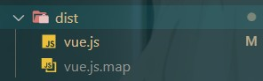
    
    ​		> 当使用npm run build时会生成所有类型的vue。
  
  - 打开examples/grid/index.html，启动Live-server进行调试（注意：直接在浏览器打开文件sources是没有内容的，需要使用服务器打开），此处有scr目录是因为我们使用了--soucemap生成.js.map文件，里面包含了我们所依赖的模块。

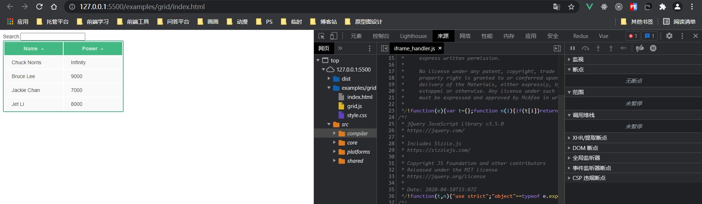

<div class="danger">

> 在npm run build中，由于vue源码没有设置生成sourcemap的选项，所以打包时不会生成.js.map文件。而我们使用npm run dev时，会生成的打包文件中，有.js.map文件，同时生成的vue.js的最后一行会有
> //# sourceMappingURL=vue.js.map
> 这行代码，表示soucemap的文件路径。
> 需要注意的是，有时可能会由于先执行了dev，再执行build导致此行代码消失，此时，即使有.js.map文件，浏览器调试时也不会有src文件生成。

</div>


### Vue的不同构建版本

当使用 npm run build 去打包文件时，dist目录下会生成如下各种类型的vue：

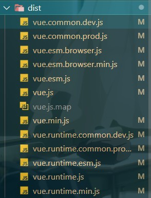

- [官方文档-对不同构建版本的解释](https://cn.vuejs.org/v2/guide/installation.html#%E5%AF%B9%E4%B8%8D%E5%90%8C%E6%9E%84%E5%BB%BA%E7%89%88%E6%9C%AC%E7%9A%84%E8%A7%A3%E9%87%8A)

|                          | UMD                | CommonJS              | ES Module          |
| ------------------------ | ------------------ | --------------------- | ------------------ |
| Full                     | vue.js             | vue.common.js         | vue.esm.js         |
| Runtime-only             | vue.runtime.js     | vue.runtime.common.js | vue.runtime.esm.js |
| Full(production)         | vue.min.js         |                       |                    |
| Runtime-only(production) | vue.runtime.min.js |                       |                    |

- 术语
  - 完整版：同时包含编译器和运行时的版本。 
  - 编译器：用来将模板字符串编译成为 JavaScript 渲染函数的代码，体积大、效率低。 
  - 运行时：用来创建 Vue 实例、渲染并处理虚拟 DOM 等的代码，体积小、效率高。基本上就是除去编译器的代码。 
  - UMD：UMD 版本**通用的模块版本**，支持多种模块方式。 vue.js 默认文件就是运行时 + 编译器的 UMD 版本 
  - CommonJS(cjs)：CommonJS 版本用来配合老的打包工具比如 Browserify 或 webpack 1。 
  - **ES Module**：从 2.6 开始 Vue 会提供两个 ES Modules (ESM) 构建文件，为现代打包工具提供的 版本。 
    - ESM 格式被设计为可以被静态分析，所以打包工具可以利用这一点来进行“tree-shaking”并 将用不到的代码排除出最终的包。
    -  [ES6 模块与 CommonJS 模块的差异](https://es6.ruanyifeng.com/#docs/module-loader#ES6-%E6%A8%A1%E5%9D%97%E4%B8%8E-CommonJS-%E6%A8%A1%E5%9D%97%E7%9A%84%E5%B7%AE%E5%BC%82)

我们运行时使用的是vue.runtime.esm.js。


- 演示区别

```html
<!DOCTYPE html>
<html lang="en">

<head>
  <meta charset="UTF-8">
  <meta name="viewport" content="width=device-width, initial-scale=1.0">
  <title>Runtime+Compiler</title>
</head>

<body>
  <div id="app">
    Hello World
  </div>

  <script src="../../dist/vue.js"></script>
  <script>
    // compiler
    // 需要编译器，把 template 转换成 render 函数
    const vm = new Vue({
      el: '#app',
      template: '<h1>{{ msg }}</h1>',
      data: {
        msg: 'Hello Vue'
      }
    })
  </script>
</body>

</html>
```

此时可以成功运行并展示


当将导入的文件改为vue.runtime.js时，会出现如下错误：

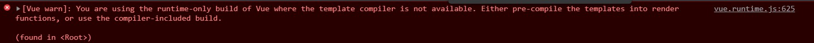

提示使用的是运行时版本，不包含模板编译器。建议要么使用render函数，要么使用包含模板编译器的版本。

将template改为render：

```javascript
const vm = new Vue({
      el: '#app',
      // template: '<h1>{{ msg }}</h1>',
      render(h) {
        return h('h1', this.msg)
      },
      data: {
        msg: 'Hello Vue'
      }
    })
```

此时可以成功运行并展示


如果同时写入render与template，此时会正常渲染，且不会报错

```javascript
// 如果同时设置template和render此时会渲染什么？
    const vm = new Vue({
      el: '#app',
      template: '<h1>Hello Template</h1>',
      render(h) {
        return h('h1', 'Hello Render')
      }
    })
```

- VueCli中的引入Vue文件类型查看

  - 在一个Vue-cli项目中使用vue inspect >output.js 将webpack配置导出成一个js文件
  - 在其中可以看到导入的vue文件类型为vue.runtime.esm.js

  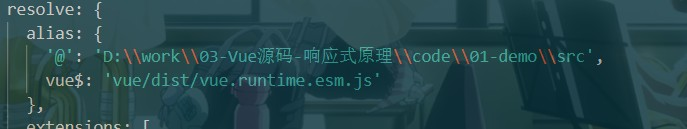

<div class="warning">

> 注意，Vue中的单文件组件在运行时也是不需要编译器的，因为在打包的时候会把其转换为js对象，并把其中的模板转换为render函数。

</div>

## 寻找入口文件

1. 首先我们可以通过npm run dev 时的dev命令找寻到文件scripts/config.js

```javascript
"dev": "rollup -w -c scripts/config.js --sourcemap --environment TARGET:web-full-dev",
```

2. 接下来我们可以在config.js中找寻到如下代码

```javascript
// 判断环境变量是否有 TARGET
// 如果有的话，使用 genConfig() 生成 rollup 配置文件
if (process.env.TARGET) {
  module.exports = genConfig(process.env.TARGET)
} else {
  exports.getBuild = genConfig
  exports.getAllBuilds = () => Object.keys(builds).map(genConfig)
}
```

3. 其内部调用了getConfig方法，我们找寻到getConfig，可以看到里面有：

```javascript
function genConfig(name) {
  const opts = builds[name]
  const config = {
    input: opts.entry,
    external: opts.external,
    plugins: [
      flow(),
      alias(Object.assign({}, aliases, opts.alias))
    ].concat(opts.plugins || []),
    output: {
      file: opts.dest,
      format: opts.format,
      banner: opts.banner,
      name: opts.moduleName || 'Vue'
    },
    onwarn: (msg, warn) => {
      if (!/Circular/.test(msg)) {
        warn(msg)
      }
    }
  }
```

首先通过builds对象并传入了process.env.TARGET（及dev命令中配置的环境），来获取builds对象中当前环境对应的配置值。及如下：

```javascript
config.js

const builds = {
'web-full-dev': {
    entry: resolve('web/entry-runtime-with-compiler.js'),
    dest: resolve('dist/vue.js'),
    format: 'umd',
    env: 'development',
    alias: { he: './entity-decoder' },
    banner
  },
}
```

接着我们去找寻resolve方法以及其中调用的alias

```javascript
config.js

const aliases = require('./alias')
const resolve = p => {
  const base = p.split('/')[0]
  if (aliases[base]) {
    return path.resolve(aliases[base], p.slice(base.length + 1))
  } else {
    return path.resolve(__dirname, '../', p)
  }
}
```

```javascript
alias.js

const path = require('path')
const resolve = p => path.resolve(__dirname, '../', p)		// 此处的__dirname指的是当前文件所在的目录，即：src/scripts
															// src/scripts/alias.js->src/scripts
															// 然后通过../来将其变为src/，最后添加上p，及当前文件类型所在的目录，最终在config.js中通过resolve方法来将这个目录与最初builds中传来的去除根目录的路径（文件名）拼接。返回一个根目录下的完整路径(绝对路径)
module.exports = {
  vue: resolve('src/platforms/web/entry-runtime-with-compiler'),
  compiler: resolve('src/compiler'),
  core: resolve('src/core'),
  shared: resolve('src/shared'),
  web: resolve('src/platforms/web'),
  weex: resolve('src/platforms/weex'),
  server: resolve('src/server'),
  sfc: resolve('src/sfc')
}
```

这样，我们可以通过在config.js的resolve方法的aliases传入一个键来获取到对应的经过封装后的alias.js中的resolve函数，并通过路劲拼接返回一个

完整路径。

这时我们再看config.js中的信息：

```javascript
function genConfig(name) {
  const opts = builds[name]
  const config = {
    input: opts.entry,
    external: opts.external,
    plugins: [
      flow(),
      alias(Object.assign({}, aliases, opts.alias))
    ].concat(opts.plugins || []),
    output: {
      file: opts.dest,
      format: opts.format,
      banner: opts.banner,
      name: opts.moduleName || 'Vue'
    },
    onwarn: (msg, warn) => {
      if (!/Circular/.test(msg)) {
        warn(msg)
      }
    }
  }
```

可以看到其会把builds中的'web-full-dev'传来的路径属性作为配置项最终在第2步中导出。


## 从入口开始

从上一小节我们可以得知，入口文件的路径为：src/platform/web/entry-runtime-with-compiler.js

我们从一个问题开始入手，如下代码最终在界面如何显示？

```javascript
const vm = new Vue({
      el: '#app',
      // template: '<h1>{{ msg }}</h1>',
      render(h) {
        return h('h1', this.msg)
      },
      data: {
        msg: 'Hello Vue'
      }
    })
```


```javascript
entry-runtime-with-compiler.js

Vue.prototype.$mount = function (
  el?: string | Element,
  hydrating?: boolean
): Component {
  el = el && query(el)		// query方法用于将字符串形式的el转变为真实dom，且若不存在el，会创建一个div并返回

  if (el === document.body || el === document.documentElement) {  // 如果el是body或者documentElement，会警告el不能挂载到body或html上，只能挂载到普通元素上
    process.env.NODE_ENV !== 'production' && warn(
      `Do not mount Vue to <html> or <body> - mount to normal elements instead.`
    )
    return this
  }

  const options = this.$options
  // 如果options中没有写render函数，把template转换成render函数
  if (!options.render) {
    let template = options.template
    if (template) {		// 如果template存在，则判断template的类型(可能是#开头的一个选择器或者具体的模板字符串)
        ......
    } else if (el) {		// 如果template不存在，说明其具有el属性(将template写在了html中)，则获取el对应的template模板字符串
      template = getOuterHTML(el)	
    }
    if (template) {
      // 此处进行正式编译
    }
  }

  // 调用mount方法，渲染dom。
  return mount.call(this, el, hydrating)	// 将编译后的template挂载到页面中
}
    
function getOuterHTML(el: Element): string {
  if (el.outerHTML) {			// 如果el有outerHTML,则直接返回
    return el.outerHTML
  } else {		// 否则的话其有可能是文本节点，则我们可以新建一个div，并将文本节点添加后返回。
    const container = document.createElement('div')
    container.appendChild(el.cloneNode(true))
    return container.innerHTML
  }
}
```

由此可以看出，当optiones中没有render属性时，其才会使用template进行编译。

接下来我们来通过调试来查看$mount是在何时被调用的

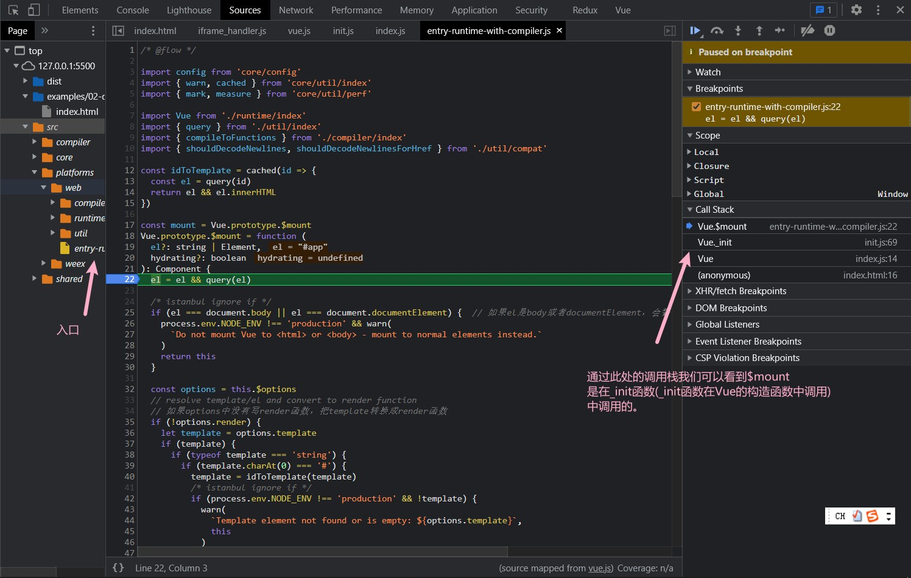

## Vue初始化过程

首先我们可以从入口文件中看到其引入了外部的Vue函数

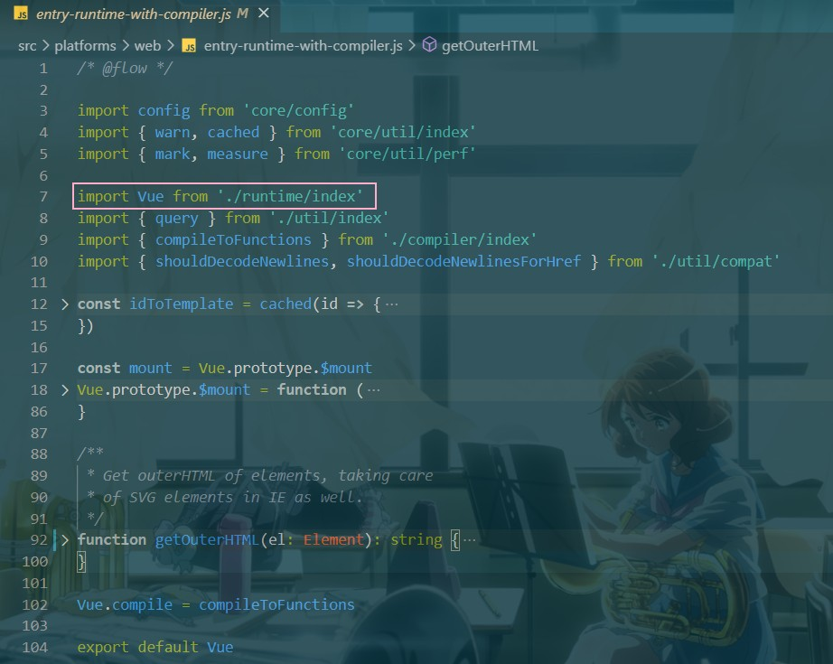

进入/runtime/index.js

```javascript
/* @flow */

import Vue from 'core/index'
import config from 'core/config'
import { extend, noop } from 'shared/util'
import { mountComponent } from 'core/instance/lifecycle'
import { devtools, inBrowser } from 'core/util/index'

import {
  query,
  mustUseProp,
  isReservedTag,
  isReservedAttr,
  getTagNamespace,
  isUnknownElement
} from 'web/util/index'

import { patch } from './patch'
import platformDirectives from './directives/index'
import platformComponents from './components/index'

// 此处设置了一些和平台相关的方法，用于Vue内部使用
Vue.config.mustUseProp = mustUseProp
Vue.config.isReservedTag = isReservedTag
Vue.config.isReservedAttr = isReservedAttr
Vue.config.getTagNamespace = getTagNamespace
Vue.config.isUnknownElement = isUnknownElement

// 通过extend方法注册了一些与平台相关的指令和组件。extend的方法的作用是将后面的属性添加到前面的属性中。此处的指令和组件是web平台特有的
extend(Vue.options.directives, platformDirectives)
extend(Vue.options.components, platformComponents)  // 此处我们可以得知我们在项目中全局注册的指令和组件会存储在Vue.options.directives及***.***.components中

// 在Vue的原型上挂载patch函数(将虚拟dom转为真实dom)
Vue.prototype.__patch__ = inBrowser ? patch : noop  // 判断当前是否为浏览器环境，是的话返回patch，不是的话返回一个noop(空函数)
// inBrowser中通过typeof window进行判断，若有值，说明其是在浏览器环境下。

// 此处定义$mount（及entry-runtime-with-compiler中暂存于mount的函数），用于渲染dom。
Vue.prototype.$mount = function (
  el?: string | Element,
  hydrating?: boolean
): Component {
  el = el && inBrowser ? query(el) : undefined		// 此处需要再次获取el（虽然在入口文件中已经获取过了），为了避免运行的Vue是不带编译器版本的（运行时版本）
  return mountComponent(this, el, hydrating)
}

......

export default Vue
```

此文件中的所有代码都是与平台相关的，注册了一些平台的指令、patch、$mount。

并可以看到其内部并没有Vue的构造函数，而是从core/index中导入了Vue。

```javascript
core/index.js

import Vue from './instance/index'
import { initGlobalAPI } from './global-api/index'
import { isServerRendering } from 'core/util/env'
import { FunctionalRenderContext } from 'core/vdom/create-functional-component'

initGlobalAPI(Vue)		// 给Vue的构造函数增加一些静态方法

// 通过Object.defineProperty给Vue添加一些与SSR相关的成员
Object.defineProperty(Vue.prototype, '$isServer', {		
  get: isServerRendering
})

Object.defineProperty(Vue.prototype, '$ssrContext', {
  get () {
    /* istanbul ignore next */
    return this.$vnode && this.$vnode.ssrContext
  }
})

// expose FunctionalRenderContext for ssr runtime helper installation
Object.defineProperty(Vue, 'FunctionalRenderContext', {
  value: FunctionalRenderContext
})

Vue.version = '__VERSION__'		// 定义了vue的版本

export default Vue
```

```javascript
global-api/index.js

/* @flow */

import config from '../config'
import { initUse } from './use'
import { initMixin } from './mixin'
import { initExtend } from './extend'
import { initAssetRegisters } from './assets'
import { set, del } from '../observer/index'
import { ASSET_TYPES } from 'shared/constants'
import builtInComponents from '../components/index'
import { observe } from 'core/observer/index'

import {
  warn,
  extend,
  nextTick,
  mergeOptions,
  defineReactive
} from '../util/index'

export function initGlobalAPI(Vue: GlobalAPI) {
  // config
  const configDef = {}
  configDef.get = () => config
  if (process.env.NODE_ENV !== 'production') {
    configDef.set = () => {
      warn(
        'Do not replace the Vue.config object, set individual fields instead.'
      )
    }
  }
  Object.defineProperty(Vue, 'config', configDef)   // 定义了Vue.config（静态成员）

  // 给Vue.util添加了一些方法，这些工具方法不视作全局API的一部分，除非你已经意识到使用风险，否则不要去依赖他们
  Vue.util = {
    warn,
    extend,
    mergeOptions,
    defineReactive
  }

  // 静态方法 set/delete/nextTick
  Vue.set = set
  Vue.delete = del
  Vue.nextTick = nextTick

  // 定义observable方法，作用：将一个对象变为响应式数据，其内部调用了defineReactive
  Vue.observable = <T>(obj: T): T => {
    observe(obj)
    return obj
  }

  // 初始化 Vue.options对象，并给其扩展
  // components/directives/filters</T>
  Vue.options = Object.create(null)
  ASSET_TYPES.forEach(type => {
    Vue.options[type + 's'] = Object.create(null)
  })

  Vue.options._base = Vue

  // 设置 keep-alive组件
  extend(Vue.options.components, builtInComponents)

  // 注册 Vue.use() 用来注册插件
  initUse(Vue)
  // 注册Vue.mixin() 实现混入
  initMixin(Vue)
  // 注册 Vue.extend() 基于传入的options返回一个组件的构造函数
  initExtend(Vue)
  // 注册 Vue.directive()、Vue.component()、Vue.filter()
  initAssetRegisters(Vue)
}
```

在core/index.js依然没有Vue的构造函数，我们接着看instance/index

```javascript
instance/index.js

import { initMixin } from './init'
import { stateMixin } from './state'
import { renderMixin } from './render'
import { eventsMixin } from './events'
import { lifecycleMixin } from './lifecycle'
import { warn } from '../util/index'

function Vue (options) {
  if (process.env.NODE_ENV !== 'production' &&		// 判断是否是生产环境，同时判断this是否是Vue实例(确保是通过new Vue来调用此函数，而不是通过普通函数调用)
    !(this instanceof Vue)
  ) {
    warn('Vue is a constructor and should be called with the `new` keyword')
  }
  // 调用_init() 方法，并传入options  
  this._init(options)
}

// 注册 vm 的 _init() 方法，初始化 vm
initMixin(Vue)
// 注册 vm 的 $data/$props/$set/$delete/$watch
stateMixin(Vue)
// 初始化事件相关方法
// $on/$once/$off/$emit
eventsMixin(Vue)
// 初始化生命周期相关的混入方法
// _update/$forceUpdate/$destroy
lifecycleMixin(Vue)
// 混入 render
// $nextTick/_render
renderMixin(Vue)

export default Vue

```

<div class="warning">

> 此处之所以使用构造函数来定义Vue，是为了方便后面调用函数来为Vue的原型中添加属性。

</div>

> 总结

四个导出Vue的模块

- src/platforms/web/entry-runtime-with-compiler.js 
  - web 平台相关的入口 
  - 重写了平台相关的 $mount() 方法 ，让$mount()内部可以去编译template为render函数
  - 注册了 Vue.compile() 方法(使得我们可以直接调用这个方法将template转为render函数)，传递一个 HTML 字符串返回 render函数 
- src/platforms/web/runtime/index.js 
  - web 平台相关 
  - 注册和平台相关的全局指令：v-model、v-show 
  - 注册和平台相关的全局组件： v-transition、v-transition-group 
  - 全局方法： 
    - __patch__：把虚拟 DOM 转换成真实 DOM 
    - $mount：挂载方法 
- src/core/index.js 
  - 与平台无关 
  - 设置了 Vue 的静态方法，initGlobalAPI(Vue) 
- src/core/instance/index.js 
  - 与平台无关 
  - 定义了构造函数，调用了 this._init(options) 方法 
  - 给 Vue 中混入了常用的实例成员

## Vue初始化-静态成员

```javascript
global-api/index.js

/* @flow */

import config from '../config'
import { initUse } from './use'
import { initMixin } from './mixin'
import { initExtend } from './extend'
import { initAssetRegisters } from './assets'
import { set, del } from '../observer/index'
import { ASSET_TYPES } from 'shared/constants'
import builtInComponents from '../components/index'
/* 
components/index.js
import KeepAlive from './keep-alive'

export default {
  KeepAlive
}
*/
import { observe } from 'core/observer/index'

import {
  warn,
  extend,
  nextTick,
  mergeOptions,
  defineReactive
} from '../util/index'

export function initGlobalAPI(Vue: GlobalAPI) {
  // config
  const configDef = {}
  configDef.get = () => config
  if (process.env.NODE_ENV !== 'production') {
    configDef.set = () => {   // 此处设置为了使得无法在开发环境下修改Vue.config属性
      warn(
        'Do not replace the Vue.config object, set individual fields instead.'
      )
    }
  }
  Object.defineProperty(Vue, 'config', configDef)   // 定义了Vue.config（静态成员）

  // 给Vue.util添加了一些方法，这些工具方法不视作全局API的一部分，除非你已经意识到使用风险，否则不要去依赖他们
  Vue.util = {
    warn,
    extend,
    mergeOptions,
    defineReactive
  }

  // 静态方法 set/delete/nextTick
  Vue.set = set
  Vue.delete = del
  Vue.nextTick = nextTick

  // 定义observable方法，作用：将一个对象变为响应式数据，其内部调用了defineReactive
  Vue.observable = <>(obj: T): T => {
    observe(obj)
    return obj
  }

  // 初始化 Vue.options对象，并给其扩展，存储在Vue.options中的对象为全局成员
  // components/directives/filters
  Vue.options = Object.create(null)   // 此处通过Object.create创建对象，并将其原型设置为null。
  ASSET_TYPES.forEach(type => {      // 给Vue.options中添加属性。
      /* 
      export const ASSET_TYPES = [
        'component',    // 这三个属性用于存储全局的组件、指令、过滤器
        'directive',
        'filter'
      ]
      */
      Vue.options[type + 's'] = Object.create(null)
    })

  Vue.options._base = Vue     // 给options添加一个_base，用于记录当前的Vue构造函数。

  // 设置 keep-alive组件
  extend(Vue.options.components, builtInComponents)

  // 注册 Vue.use() 用来注册插件
  initUse(Vue)
  // 注册Vue.mixin() 实现混入
  initMixin(Vue)
  // 注册 Vue.extend() 基于传入的options返回一个组件的构造函数
  initExtend(Vue)
  // 注册 Vue.directive()、Vue.component()、Vue.filter()
  initAssetRegisters(Vue)   // 最终这三个方法既可以在Vue.options中，也可以在Vue中获取。
}
```

```javascript
global-api/use.js

/* @flow */

import { toArray } from '../util/index'

export function initUse(Vue: GlobalAPI) {
  // Vue.use(VueRouter, options)
  Vue.use = function (plugin: Function | Object) {		// 此处plugin代表插件，此外可能还会传入一些配置项
    const installedPlugins = (this._installedPlugins || (this._installedPlugins = []))  // 此处的this是Vue构造函数。
    if (installedPlugins.indexOf(plugin) > -1) {		// 判断插件数组中是否已经有值，若有则直接结束
      return this
    }

    // additional parameters
    // 把数组中的第一个元素(plugin)去除
    const args = toArray(arguments, 1)
    // 把this(Vue)插入第一个元素的位置
    args.unshift(this)
    if (typeof plugin.install === 'function') {		// 如果传的插件是对象，且内部有install方法，直接调用install方法，并传入args。

      plugin.install.apply(plugin, args)  // plugin.install(args[0], args[1]),此处使用apply是为了传args参数，并没有起到改变this指向的作用（原先this就为plugin）	。使得install的参数变为(vue，someoptions)

    } else if (typeof plugin === 'function') {	// 如果传的插件是函数，，直接调用函数，并传入args。
      plugin.apply(null, args)
    }
    installedPlugins.push(plugin)		// 保存已安装的插件
    return this   // 返回Vue构造函数
  }
}
```

```javascript
global-api/mixin.js

/* @flow */

import { mergeOptions } from '../util/index'

export function initMixin(Vue: GlobalAPI) {
  Vue.mixin = function (mixin: Object) {
    this.options = mergeOptions(this.options, mixin)    // 把mixin中的所有选项拷贝到this.options(Vue.options)
    return this
  }
}
```

```javascript
global-api/extend.js

/* @flow */

import { ASSET_TYPES } from 'shared/constants'
import { defineComputed, proxy } from '../instance/state'
import { extend, mergeOptions, validateComponentName } from '../util/index'

export function initExtend(Vue: GlobalAPI) {

    
    ......


  Vue.extend = function (extendOptions: Object): Function {
    extendOptions = extendOptions || {}
    // 此处的this为Vue构造函数
    const Super = this
    
    ......

    const name = extendOptions.name || Super.options.name
    if (process.env.NODE_ENV !== 'production' && name) {
      // 如果是开发环境验证组件的名称
      validateComponentName(name)
    }

    const Sub = function VueComponent(options) {
      // 调用 _init() 初始化
      this._init(options)
    }
    // 原型继承自Vue
    Sub.prototype = Object.create(Super.prototype)
    Sub.prototype.constructor = Sub
    
    ......
    
    
    // 合并options
    Sub.options = mergeOptions(
      Super.options,
      extendOptions
    )
    Sub['super'] = Super

    if (Sub.options.props) {
      initProps(Sub)
    }
    if (Sub.options.computed) {
      initComputed(Sub)
    }

    // 将Super中的成员拷贝到VueComponent的构造函数中
    Sub.extend = Super.extend
    Sub.mixin = Super.mixin
    Sub.use = Super.use

    // 注册'component',  'directive',  'filter'方法。
    ASSET_TYPES.forEach(function (type) {
      Sub[type] = Super[type]
    })
    // 保存组件构造函数
    if (name) {
      Sub.options.components[name] = Sub
    }

    // 设置一些而外的配置项
    Sub.superOptions = Super.options
    Sub.extendOptions = extendOptions
    Sub.sealedOptions = extend({}, Sub.options)

    ......
    return Sub
  }
}

......

```

```javascript
global-api/assets.js

/* @flow */

import { ASSET_TYPES } from 'shared/constants'
import { isPlainObject, validateComponentName } from '../util/index'

export function initAssetRegisters(Vue: GlobalAPI) {
  // 遍历 ASSET_TYPES 数组，为Vue定义相关方法
  // ASSET_TYPES 包括了 directive、component、filter
  ASSET_TYPES.forEach(type => {
    Vue[type] = function (
      id: string,
      definition: Function | Object
    ): Function | Object | void {
      if (!definition) {    // 如果没有传第二个参数，则直接从this.options中获取相应的数据
        return this.options[type + 's'][id]
      } else {
        /* istanbul ignore if */
        if (process.env.NODE_ENV !== 'production' && type === 'component') {
          validateComponentName(id)
        }
        // 如果是组件，判断组件传过来的对象（第二个参数）是否是原始的对象(isPlainObject)
        if (type === 'component' && isPlainObject(definition)) {
          /* 
          isPlainObject:
          const _toString = Object.prototype.toString
          _toString.call(obj) === '[object Object]'
          */
          definition.name = definition.name || id   // 为对象设置名字，有第二个对象参数中有name则用name,没有则用第一个参数
          // 把组件配置转换为组件的构造函数
          definition = this.options._base.extend(definition)    // 此处的_base就是Vue构造函数，调用Vue.extend，把一个普通对象变为VueComponent构造函数
        }
        if (type === 'directive' && typeof definition === 'function') {
          definition = { bind: definition, update: definition } // 如果传函数，则将函数赋给bind和update
        }
        // 全局注册，存储资源并赋值
        this.options[type + 's'][id] = definition   // 若component传来的值为函数或directive传来的值为对象，则直接赋值
        return definition
      }
    }
  })
}
```


## Vue初始化-实例成员

```javascript
instance/index.js

import { initMixin } from './init'
import { stateMixin } from './state'
import { renderMixin } from './render'
import { eventsMixin } from './events'
import { lifecycleMixin } from './lifecycle'
import { warn } from '../util/index'

function Vue(options) {
  if (process.env.NODE_ENV !== 'production' &&		// 判断是否是生产环境，同时判断this是否是Vue实例(确保是通过new Vue来调用此函数，而不是通过普通函数调用)
    !(this instanceof Vue)
  ) {
    warn('Vue is a constructor and should be called with the `new` keyword')
  }
  // 调用_init() 方法，并传入options  
  this._init(options)
}

// 以下方法都是给Vue实例(Vue.prototype)上增加了相关的成员

// 注册 vm 的 _init() 方法，初始化 vm
initMixin(Vue)
// 注册 vm 的 $data/$props/$set/$delete/$watch
stateMixin(Vue)
// 初始化事件相关方法
// $on/$once/$off/$emit
eventsMixin(Vue)
// 初始化生命周期相关的混入方法
// _update/$forceUpdate/$destroy
lifecycleMixin(Vue)
// 混入 render
// $nextTick/_render
renderMixin(Vue)

export default Vue
```

```javascript
instance/state.js

......
export function stateMixin(Vue: Class<Component>) {
  const dataDef = {}
  dataDef.get = function () { return this._data }
  const propsDef = {}
  propsDef.get = function () { return this._props }
  if (process.env.NODE_ENV !== 'production') {    // 如果是开发环境，警告不允许直接给$data和$props赋值。
    dataDef.set = function () {
      warn(
        'Avoid replacing instance root $data. ' +
        'Use nested data properties instead.',
        this
      )
    }
    propsDef.set = function () {
      warn(`$props is readonly.`, this)
    }
  }
  // 为Vue原型添加$data和$props两个属性。
  Object.defineProperty(Vue.prototype, '$data', dataDef)
  Object.defineProperty(Vue.prototype, '$props', propsDef)

  // 为Vue原型添加$set和$delete
  Vue.prototype.$set = set
  Vue.prototype.$delete = del

  // 添加$watch方法
  Vue.prototype.$watch = function (
    expOrFn: string | Function,
    cb: any,
    options?: Object
  ): Function {
    ......
  }
}
```

```javascript
instance/events.js
......
export function eventsMixin(Vue: Class<Component>) {
  ......
  Vue.prototype.$on = function (event: string | Array<string>, fn: Function): Component {
    const vm: Component = this
    // 首先判断参数是否是数组
    if (Array.isArray(event)) {
      for (let i = 0, l = event.length; i < l; i++) {
        vm.$on(event[i], fn)    // 给多个事件注册同一个事件处理函数
      }
    } else {
      (vm._events[event] || (vm._events[event] = [])).push(fn)    // 取出对象名，并将数组push到对应对象的数组
      ......
    }
    return vm
  }

  Vue.prototype.$once = function (event: string, fn: Function): Component {
    ......
  }

  Vue.prototype.$off = function (event?: string | Array<string>, fn?: Function): Component {
    ......
  }

  Vue.prototype.$emit = function (event: string): Component {
	......
  }
}
```

```javascript
instance/livecycle.js
......
export function lifecycleMixin(Vue: Class<Component>) {
  Vue.prototype._update = function (vnode: VNode, hydrating?: boolean) {
    const vm: Component = this
    const prevEl = vm.$el
    const prevVnode = vm._vnode
    const restoreActiveInstance = setActiveInstance(vm)
    vm._vnode = vnode
    // 调用patch方法，将虚拟dom转为真实dom。
    // 此处做了一层判断，判断是否是首次渲染，并传入不同参数。
    if (!prevVnode) {
      // initial render
      vm.$el = vm.__patch__(vm.$el, vnode, hydrating, false /* removeOnly */)
    } else {
      // updates
      vm.$el = vm.__patch__(prevVnode, vnode)
    }
   ......
  }
}
```

```javascript
instance/render.js
...... 
Vue.prototype._render = function (): VNode {  // _render中调用了vm.$options中定义的render函数
    const vm: Component = this
    const { render, _parentVnode } = vm.$options

    ......
    
    let vnode
    try {
      vnode = render.call(vm._renderProxy, vm.$createElement)   // 此处的vm.$createElement 即为h函数
    } catch (e) {
      ......
    } finally {
      ......
    }

...... 
```

```javascript
instance/init.js
......
export function initMixin(Vue: Class<Component>) {
  // 给 Vue 实例增加 _init() 方法
  // 合并 options / 初始化操作
  Vue.prototype._init = function (options?: Object) {
    const vm: Component = this    // 此处的this为当前Vue的实例(Vue.prototype)
    vm._uid = uid++

    // 开发环境下的性能检测
    let startTag, endTag
    /* istanbul ignore if */
    if (process.env.NODE_ENV !== 'production' && config.performance && mark) {
      startTag = `vue-perf-start:${vm._uid}`
      endTag = `vue-perf-end:${vm._uid}`
      mark(startTag)
    }

    // 如果是 Vue 实例不需要被 observe
    vm._isVue = true
    // 合并options,把用户传入的options与Vue构造函数中的options合并。
    if (options && options._isComponent) {
      initInternalComponent(vm, options)
    } else {
      vm.$options = mergeOptions(
        resolveConstructorOptions(vm.constructor),
        options || {},
        vm
      )
    }
    /* 如果是开发环境，则调用initProxy方法，否则直接将vm赋值给renderProxy */
    if (process.env.NODE_ENV !== 'production') {
      initProxy(vm)
    } else {
      vm._renderProxy = vm
    }
    // expose real self
    vm._self = vm
    // vm 的生命周期相关变量初始化
    // $children/$parent/$root/$refs
    initLifecycle(vm)
    // vm 的事件监听初始化，父组件绑定在当前组件上的事件
    initEvents(vm)
    // vm 的编译render初始化
    // $slot/$scopedSlots/_c/$createElement/$attrs/$listeners
    initRender(vm)
    // beforeCreate 生命周期的回调
    callHook(vm, 'beforeCreate')    // callHook用于触发生命周期中的钩子函数
    // 把 inject 的成员注入到 vm 上，通过initProvide中设置的_provided属性来判断是否注入
    initInjections(vm)
    // 初始化 vm 的 _props/methods/_data/computed/watch
    initState(vm)
    // 初始化 provide
    initProvide(vm)
    // created 生命钩子的回调
    callHook(vm, 'created')

    /* istanbul ignore if */
    if (process.env.NODE_ENV !== 'production' && config.performance && mark) {
      vm._name = formatComponentName(vm, false)
      mark(endTag)
      measure(`vue ${vm._name} init`, startTag, endTag)
    }

    // 调用 $mount() 挂载整个页面，此处的$mount为我们在entry-runtime-with-compiler.js中定义的$mount。
    if (vm.$options.el) {
      vm.$mount(vm.$options.el)
    }
  }
}
```

### init函数中的initState

```javascript
export function initState(vm: Component) {
  vm._watchers = []
  const opts = vm.$options    // 获取Vue实例中的$options

  // 如果$options有props、methods、data、computed、watch，则进行相应的初始化操作
  if (opts.props) initProps(vm, opts.props) // initProps把props中的成员变为响应式，并且注册到Vue实例中。
  if (opts.methods) initMethods(vm, opts.methods) // 把options中的methods注入到vue实例。
  if (opts.data) {  // 当options中有data选项时，调用initData。
    initData(vm)
  } else {    // 没有data的话给vm创建一个_data，并赋值为{}，同时使用observe将其转为响应式对象。
    observe(vm._data = {}, true)
  }
  if (opts.computed) initComputed(vm, opts.computed)
  if (opts.watch && opts.watch !== nativeWatch) {
    initWatch(vm, opts.watch)
  }
}

function initProps(vm: Component, propsOptions: Object) {
  const propsData = vm.$options.propsData || {}
  const props = vm._props = {}    // 给Vue实例定义一个_props对象，并存储到props中
  const keys = vm.$options._propKeys = []
  const isRoot = !vm.$parent
  // root instance props should be converted
  if (!isRoot) {
    toggleObserving(false)
  }
  for (const key in propsOptions) {   // 遍历propsOptions(传入的opts.props)中的所有属性，并通过defineReactive注入到props这个对象(及vm._props)中。
    keys.push(key)
    const value = validateProp(key, propsOptions, propsData, vm)

    if (process.env.NODE_ENV !== 'production') {  // 在开发模式下直接赋值会进行警告
      const hyphenatedKey = hyphenate(key)
      if (isReservedAttribute(hyphenatedKey) ||
        config.isReservedAttr(hyphenatedKey)) {
        warn(
          `"${hyphenatedKey}" is a reserved attribute and cannot be used as component prop.`,
          vm
        )
      }
      defineReactive(props, key, value, () => {
        if (!isRoot && !isUpdatingChildComponent) {
          warn(
            `Avoid mutating a prop directly since the value will be ` +
            `overwritten whenever the parent component re-renders. ` +
            `Instead, use a data or computed property based on the prop's ` +
            `value. Prop being mutated: "${key}"`,
            vm
          )
        }
      })
    } else {
      defineReactive(props, key, value)   // 如果是生产环境则直接通过defineReactive将props中的属性转为get/set
    }
    // 判断props中的属性是否在Vue实例中存在，如果不存在，则通过proxy函数进行代理
    if (!(key in vm)) {
      proxy(vm, `_props`, key)
    }
  }
  toggleObserving(true)
}

function initData(vm: Component) {
  let data = vm.$options.data
  data = vm._data = typeof data === 'function'    // 判断data是否为function，若是则进行调用，否则直接赋值，若没传则赋值为{}
    ? getData(data, vm)
    : data || {}
  if (!isPlainObject(data)) {
    data = {}
    process.env.NODE_ENV !== 'production' && warn(
      'data functions should return an object:\n' +
      'https://vuejs.org/v2/guide/components.html#data-Must-Be-a-Function',
      vm
    )
  }
  // 获取· data 中的所有属性
  const keys = Object.keys(data)
  // 获取props / methods
  const props = vm.$options.props
  const methods = vm.$options.methods
  let i = keys.length
  // 判断 data 上的成员是否和 props/methods 重名（因为它们都有注入到Vue实例中）
  while (i--) {
    const key = keys[i]
    if (process.env.NODE_ENV !== 'production') {
      if (methods && hasOwn(methods, key)) {
        warn(
          `Method "${key}" has already been defined as a data property.`,
          vm
        )
      }
    }
    if (props && hasOwn(props, key)) {
      process.env.NODE_ENV !== 'production' && warn(
        `The data property "${key}" is already declared as a prop. ` +
        `Use prop default value instead.`,
        vm
      )
    } else if (!isReserved(key)) {    // 判断当前属性是否以$获_开头，若是则不会将其注入到Vue实例中
      proxy(vm, `_data`, key)   // 把当前的data属性注入到Vue实例中
    }
  }
  // 响应式处理
  observe(data, true /* asRootData */)
}

function initMethods(vm: Component, methods: Object) {
  const props = vm.$options.props
  for (const key in methods) {
    if (process.env.NODE_ENV !== 'production') {
      if (typeof methods[key] !== 'function') {   // 判断methods中的值是否为function，若不是则警告
        warn(
          `Method "${key}" has type "${typeof methods[key]}" in the component definition. ` +
          `Did you reference the function correctly?`,
          vm
        )
      }
      if (props && hasOwn(props, key)) {      // 判断methods中的值是否在props中存在，若存在则警告（因为methods和props的值最终都会代理到Vue实例中）
        warn(
          `Method "${key}" has already been defined as a prop.`,
          vm
        )
      }
      if ((key in vm) && isReserved(key)) {   // 如果methods中的值以及在vm中存在或其是以下划线或$开头，则警告
        warn(
          `Method "${key}" conflicts with an existing Vue instance method. ` +
          `Avoid defining component methods that start with _ or $.`
        )
      }
    }
    vm[key] = typeof methods[key] !== 'function' ? noop : bind(methods[key], vm)    // 把methods中的值注入到Vue实例中,并判断其是否为function，不是返回noop，是返回一个经过bind改变了this值向的函数
  }
}
```


proxy方法：

```javascript
export function proxy(target: Object, sourceKey: string, key: string) {
  sharedPropertyDefinition.get = function proxyGetter() {
    return this[sourceKey][key]
  }
  sharedPropertyDefinition.set = function proxySetter(val) {
    this[sourceKey][key] = val
  }
  Object.defineProperty(target, key, sharedPropertyDefinition)
}
```

## 首次渲染过程

当我们调用像下方代码中调用 new Vue创建对象时：

```javascript
const vm = new Vue({
      el: '#app',
      data: {
        msg: 'Hello Vue'
      }
    })
```

首先其会进入core/instance/index.js中，执行构造函数

```javascript
function Vue(options) {
  if (process.env.NODE_ENV !== 'production' &&		// 判断是否是生产环境，同时判断this是否是Vue实例(确保是通过new Vue来调用此函数，而不是通过普通函数调用)
    !(this instanceof Vue)
  ) {
    warn('Vue is a constructor and should be called with the `new` keyword')
  }
  // 调用_init() 方法，并传入options  
  this._init(options)
}
```

在构造函数中会调用_init方法，然后便进入了instance/init.js中的\_init方法：

```javascript
Vue.prototype._init = function (options?: Object) {
	......
    if (vm.$options.el) {
      vm.$mount(vm.$options.el)
    }
  }
```

可以看到在\_init方法的最后其会调用$mount方法，此处的$mount为入口文件中定义的方法：

```javascript
const mount = Vue.prototype.$mount
Vue.prototype.$mount = function (
  el?: string | Element,
  hydrating?: boolean
): Component {
  el = el && query(el)

  /* istanbul ignore if */
  if (el === document.body || el === document.documentElement) {  // 如果el是body或者documentElement，会警告el不能挂载到body或html上，只能挂载到普通元素上
    process.env.NODE_ENV !== 'production' && warn(
      `Do not mount Vue to <html> or <body> - mount to normal elements instead.`
    )
    return this
  }

  const options = this.$options
  // resolve template/el and convert to render function
  // 如果options中没有写render函数，把template转换成render函数
  if (!options.render) {
    let template = options.template
    ......
  }

  // 调用mount方法，渲染dom。
  return mount.call(this, el, hydrating)
}
```

$mount中最后会调用mount方法，并通过call改变this指向，此处的mount方法在plantforms/web/runtime/index.js中定义：

```javascript
// 此处定义$mount（及entry-runtime-with-compiler中暂存于mount的函数），用于渲染dom。
Vue.prototype.$mount = function (
  el?: string | Element,
  hydrating?: boolean
): Component {
  el = el && inBrowser ? query(el) : undefined		// 此处需要再次获取el（虽然在入口文件中已经获取过了），为了避免运行的Vue是不带编译器版本的（运行时版本）
  return mountComponent(this, el, hydrating)
}
```

可以看到其中调用了mountComponent方法，此方法在core/instance/lifecycle.js中定义：

```javascript
export function mountComponent(
  vm: Component,
  el: ?Element,
  hydrating?: boolean
): Component {
  vm.$el = el
  if (!vm.$options.render) {    // 判断是否有render函数
    vm.$options.render = createEmptyVNode
    if (process.env.NODE_ENV !== 'production') {
      if ((vm.$options.template && vm.$options.template.charAt(0) !== '#') ||
        vm.$options.el || el) {   // 如果没有render函数，且在开发环境中，且传入了template模板，会发出警告提示当前使用的是运行时版本，编译器无效
        warn(
          'You are using the runtime-only build of Vue where the template ' +
          'compiler is not available. Either pre-compile the templates into ' +
          'render functions, or use the compiler-included build.',
          vm
        )
      } else {
        warn(
          'Failed to mount component: template or render function not defined.',
          vm
        )
      }
    }
  }
  callHook(vm, 'beforeMount')   // 通过callHook触发beforeMount生命周期钩子函数。

  let updateComponent   // 定义更新组件函数

  if (process.env.NODE_ENV !== 'production' && config.performance && mark) {    // 如果是开发环境且启用了性能监测，则进行性能监测
    updateComponent = () => {
      const name = vm._name
      const id = vm._uid
      const startTag = `vue-perf-start:${id}`
      const endTag = `vue-perf-end:${id}`

      mark(startTag)
      const vnode = vm._render()
      mark(endTag)
      measure(`vue ${name} render`, startTag, endTag)

      mark(startTag)
      vm._update(vnode, hydrating)
      mark(endTag)
      measure(`vue ${name} patch`, startTag, endTag)
    }
  } else {
    // 此处只是定义，并没有执行，执行是在Watcher中执行的
    updateComponent = () => {   // 否则通过_render来获取虚拟dom，并把虚拟dom传给_update，_update可以将虚拟dom转为真实dom，并更新到页面上
      vm._update(vm._render(), hydrating)
    }
  }

  // 创建Watcher对象，并把updateComponent传入。
  new Watcher(vm, updateComponent, noop, {
    before() {
      if (vm._isMounted && !vm._isDestroyed) {
        callHook(vm, 'beforeUpdate')
      }
    }
  }, true)
  hydrating = false


  if (vm.$vnode == null) {
    vm._isMounted = true
    callHook(vm, 'mounted')   // 触发mounted生命周期钩子函数
  }
  return vm
}
```

我们可以知道是通过watcher来调用updateComponent，从而使得虚拟dom得以转化为真实dom并挂载，此处的Watcher是在core/observer/watcher.js中定义的（observer中的代码都是与响应式相关的）：

```javascript
export default class Watcher { 
......
/* Vue中的Watcher有三种：渲染时的Watcher、计算属性的Watcher、监听器的Watcher */
  constructor(
    vm: Component,
    expOrFn: string | Function,
    cb: Function,
    options?: ?Object,      // 此处options中包含before生命周期钩子函数
    isRenderWatcher?: boolean   // 用来判断是否是渲染Watcher
  ) {
   ......
    // options
    if (options) {
      ......
      this.lazy = !!options.lazy    // lazy是用于判断是否要延迟更新视图，此处是首次渲染不需要，一般用于计算属性的Watcher（数据变化才更新视图）
      ......
    } else {
      ......
    }
    ......

    if (typeof expOrFn === 'function') {     // 如果传入的expOrFn是function，则直接赋值给getter
      this.getter = expOrFn
    } else {
      ......
    }
    this.value = this.lazy    // 判断this.lazy，若不延迟（及this.lazy为undefined），则立即调用this.get()
      ? undefined
      : this.get()
  }

  get() {
    pushTarget(this)    // 把当前的Watcher对象存入的栈中。保存父组件，使得组件嵌套时先渲染内部组件
    let value
    const vm = this.vm
    try {
      value = this.getter.call(vm, vm)    // 调用getter(此处即为updateComponent)，并把this执行Vue的实例。
    } catch (e) {
      ......
    } finally {
      ......
    }
    return value
  }
     ......
}
```

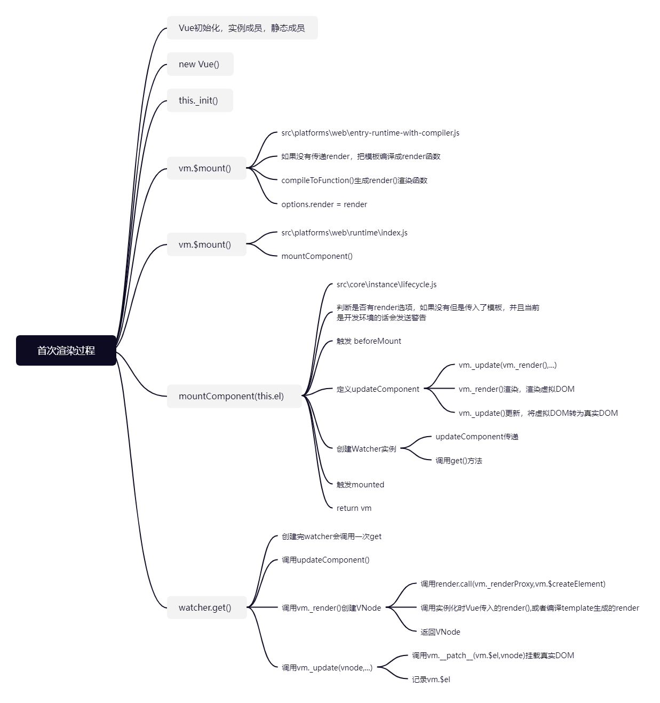

## 数据响应式原理

```javascript
function initData(vm: Component) {
  let data = vm.$options.data
  data = vm._data = typeof data === 'function'    // 判断data是否为function，若是则进行调用，否则直接赋值，若没传则赋值为{}
    ? getData(data, vm)
    : data || {}
  ......
  // 响应式处理
  observe(data, true /* asRootData */)
}
```

我们可以看到，在initData中，调用了observe进行数据响应式处理。

### observe

```javascript
// 如果当前value已经有了observe对象，则把其返回。否则新建一个observe对象并返回。
export function observe(value: any, asRootData: ?boolean): Observer | void {
  // 若value不是对象或是VNode实例，则说明其不用做响应式处理，直接返回
  if (!isObject(value) || value instanceof VNode) {
    return
  }
  let ob: Observer | void
  // 如果 value 有 __ob__ （observer对象） 属性，将其赋值给ob
  if (hasOwn(value, '__ob__') && value.__ob__ instanceof Observer) {
    ob = value.__ob__
  } else if (
    // 判断当前对象是否可以进行响应式处理。
    shouldObserve &&
    !isServerRendering() &&
    (Array.isArray(value) || isPlainObject(value)) && // 判断其是否是数组或纯粹的js对象。
    Object.isExtensible(value) &&
    !value._isVue   // 判断其是否是Vue实例，是的话就不需要
  ) {
    // 创建一个 Observer 对象
    ob = new Observer(value)
  }
  if (asRootData && ob) {   // 如果传递的是根数据(options.data)，将ob.vmCount++。
    ob.vmCount++
  }
  return ob   // 返回ob
}
```

### Observer类

```javascript
// Observer类的作用：为数组或对象做响应式处理
export class Observer {
  // 规则对象
  value: any;
  // 依赖对象
  dep: Dep;
  // 实例计数器
  vmCount: number;

  constructor(value: any) {
    this.value = value
    this.dep = new Dep()
    // 初始化实例的 vmCount 为0
    this.vmCount = 0
    // 将实例挂载到观察对象的__ob__属性
    def(value, '__ob__', this)
    // 数组的响应式处理
    if (Array.isArray(value)) {
      if (hasProto) {
        protoAugment(value, arrayMethods)
      } else {
        copyAugment(value, arrayMethods, arrayKeys)
      }
      // 为数组中的每一个对象创建一个 observer 实例
      this.observeArray(value)
    } else {
      // 遍历对象中的每一个属性，转换为 setter/getter
      this.walk(value)
    }
  }

  walk(obj: Object) {
    // 获取观察对象的每一个属性
    const keys = Object.keys(obj)
    // 遍历每一个属性，设置为响应式数据
    for (let i = 0; i < keys.length; i++) {
      defineReactive(obj, keys[i])
    }
  }

  observeArray(items: Array<any>) {
    for (let i = 0, l = items.length; i < l; i++) {
      observe(items[i])
    }
  }
}
```

```javascript
export function def(obj: Object, key: string, val: any, enumerable?: boolean) {
  Object.defineProperty(obj, key, {
    value: val,
    enumerable: !!enumerable,  // 设置属性是否是可枚举的，此处为false，因为__ob__不需要遍历设置getter和setter
    writable: true,
    configurable: true
  })
}
```

### defineReactive

```javascript
// 为一个对象定义一个响应式的属性
export function defineReactive(
  obj: Object,
  key: string,
  val: any,
  customSetter?: ?Function,
  shallow?: boolean   // shallow为true表示只监听对象的第一层属性，为false表示要深度监听。
) {
  const dep = new Dep()   // 为当前的属性设置依赖（收集当前属性的所有watcher）

  // getOwnPropertyDescriptor用于获取 obj 的属性描述符对象
  const property = Object.getOwnPropertyDescriptor(obj, key)
  if (property && property.configurable === false) {  // 如果属性描述符可以获取到且configurable为false(不可配置、不可通过delete删除、不可通过Object.defineProperty重新定义)
    return    // 直接返回
  }

  // 获取属性描述符的get与set，因为用户可能已经为该属性配置了（后面会进行重写，为其添加依赖收集与派发更新的功能）
  const getter = property && property.get
  const setter = property && property.set
  if ((!getter || setter) && arguments.length === 2) {    // 如果传入的参数只有两个且没有getter或有setter
    val = obj[key]  // 获取val。
  }

  // 判断是否递归观察子对象，并将子对象属性都转换成 getter/setter ，返回子观察对象
  let childOb = !shallow && observe(val)  // 若shallow为false(表示不是浅层监听)，则调用observe去继续监听当前对象
  Object.defineProperty(obj, key, {
    enumerable: true,   // 设置属性为可枚举和可配置的
    configurable: true,
    get: function reactiveGetter() {
      // 如果预定义的 getter 存在则 value 等于 getter 调用的返回值
      // 否则直接赋值
      const value = getter ? getter.call(obj) : val
      // 如果存在当前依赖目标，即 watcher 对象，则建立依赖
      if (Dep.target) {
        dep.depend()
        // 如果子观察目标存在（是对象），建立子对象的依赖关系
        if (childOb) {
          childOb.dep.depend()
          // 如果属性是数组，则特殊处理收集数组中对象值的依赖
          if (Array.isArray(value)) {
            dependArray(value)
          }
        }
      }
      // 返回属性值
      return value
    },
    set: function reactiveSetter(newVal) {
      // 如果预定义的getter存在则 value 等于getter调用的返回值
      // 否则直接赋予属性值
      const value = getter ? getter.call(obj) : val
      // 如果新值等于旧值或者新值旧值为NaN则不执行
      if (newVal === value || (newVal !== newVal && value !== value)) {
        return
      }
      /* eslint-enable no-self-compare */
      if (process.env.NODE_ENV !== 'production' && customSetter) {
        customSetter()
      }
      // 如果没有 setter 直接返回
      if (getter && !setter) return
      // 如果预定义setter存在则调用，否则直接更新新值
      if (setter) {
        setter.call(obj, newVal)
      } else {
        val = newVal
      }
      // 如果新值是对象，观察子对象并返回子的observer对象
      childOb = !shallow && observe(newVal)
      // 派发更新（发布更改通知）
      dep.notify()
    }
  })
}
```

### 依赖收集

我们在defineReactive中可以看到如下代码：

```javascript
 // 如果存在当前依赖目标，即 watcher 对象，则建立依赖
if (Dep.target) {
    dep.depend()	// 用于依赖收集，将当前的watcher对象添加到dep的subs数组中。
    // 如果子观察目标存在，建立子对象的依赖关系
    if (childOb) {
        childOb.dep.depend()	// childOb是通过observer创建的，其内部有dep属性(与defineReactive中的dep是不一样的，defineReactive中的dep是用于收集每一个属性的依赖)。而此处是用于给子对象收集依赖。因为子对象中添加成员或删除成员时，也需要发送通知。
        // 如果属性是数组，则特殊处理收集数组对象依赖
        if (Array.isArray(value)) {
            dependArray(value)
        }
    }
}
```

而创造Watcher对象的代码在instance/lifecycle.js中：

```javascript
// 创建Watcher对象，并把updateComponent传入。
  new Watcher(vm, updateComponent, noop, {
    before() {
      if (vm._isMounted && !vm._isDestroyed) {
        callHook(vm, 'beforeUpdate')
      }
    }
  }, true)
```

通过Watcher的构造函数我们可以看到其调用了get()函数，同时get函数会调用pushTarget方法，来为Dep.Object赋值

```javascript
/* Vue中的Watcher有三种：渲染时的Watcher、计算属性的Watcher、监听器的Watcher */
  constructor(
    vm: Component,
    expOrFn: string | Function,
    cb: Function,
    options?: ?Object,      // 此处options中包含before生命周期钩子函数
    isRenderWatcher?: boolean   // 用来判断是否是渲染Watcher
  ) {
    this.vm = vm
    if (isRenderWatcher) {
      vm._watcher = this
    }
    vm._watchers.push(this)		// 把当前的watcher对象存储到Vue实例的_watchers数组中

    ......
    this.value = this.lazy    // 判断this.lazy，若不延迟（及this.lazy为undefined），则立即调用this.get()
      ? undefined
      : this.get()
  }

  get() {
   	pushTarget(this)    // 把当前的Watcher对象存入的栈中。保存父组件，使得组件嵌套时先渲染内部组件
    let value
    const vm = this.vm
    try {
      value = this.getter.call(vm, vm)    // 调用getter，并把this执行Vue的实例。
    } catch (e) {
      if (this.user) {
        handleError(e, vm, `getter for watcher "${this.expression}"`)
      } else {
        throw e
      }
    } finally {
      // "touch" every property so they are all tracked as
      // dependencies for deep watching
      if (this.deep) {
        traverse(value)
      }
      popTarget()
      this.cleanupDeps()
    }
    return value
  }
```

```javascript
// Dep.target 用来存放目前正在使用的watcher
// 全局唯一，并且一次也只能有一个watcher被使用
Dep.target = null
const targetStack = []

export function pushTarget(target: ?Watcher) {
  targetStack.push(target)		// 每一个组件对应一个Watcher对象（每一个组件都有一个mountComponent，在mountComponent中创建了Watcher对象），如果组件有嵌套的话，需要先渲染子组件，所以父组件对应的Watcher对象应该被存储起来。
  Dep.target = target		// 给当前的Dep.target赋值，值为当前传入的Watcher对象。
}

export function popTarget() {
  // 出栈操作
  targetStack.pop()
  Dep.target = targetStack[targetStack.length - 1]
}
```

当知道了Dep.target的来处后，我们再来看dep.depend：

```javascript
dep.js

// 将观察对象和watcher建立依赖,将dep添加到watcher的newDeps中，将watcher添加dep的subs中。
depend() {
    if (Dep.target) {
        // 如果 target 存在，把 dep 对象添加到watcher的依赖中
        Dep.target.addDep(this)
    }
}

// 添加新的订阅者 watcher对象
addSub(sub: Watcher) {
    this.subs.push(sub)
}
```


```javascript
watcher.js

addDep(dep: Dep) {
    const id = dep.id
    if (!this.newDepIds.has(id)) {	// 判断newDepIds中是否已经有了id（dep是否已经添加过）
      this.newDepIds.add(id)	// 如果没有将当前id和dep对象存储到Watcher类对应的集合中
      this.newDeps.push(dep)
      if (!this.depIds.has(id)) {
        dep.addSub(this)	// 最后将watcher对象添加到dep的subs集合中
      }
    }
  }
```

> 此处与之前模拟的不同之处在于，在watcher对象中也添加了dep。（为了处理一个小细节，此处不再深入）

> 总结：
>
> 首先在Watcher的get()方法中给Dep.target赋值，Watcher的get()在我们每次访问属性（首次渲染执行h函数时、数据变化）的时候都会被执行，如果Dep.target存在，调用depend方法，将watcher对象添加到dep对象的subs数组中。


### 数组的响应式处理

我们在Observer类的构造函数中，可以看到如下代码：

```javascript
// Observer类的作用：为数组或对象做响应式处理
export class Observer {
  // 规则对象（被观察的对象）
  value: any;
  // 依赖对象
  dep: Dep;
  // 实例计数器
  vmCount: number;

  constructor(value: any) {
    this.value = value
    this.dep = new Dep()
    // 初始化实例的 vmCount 为0
    this.vmCount = 0
    // 将实例挂载到观察对象的__ob__属性
    def(value, '__ob__', this)
    // 数组的响应式处理
    if (Array.isArray(value)) {
      if (hasProto) {   // hasProto用于判断当前浏览器是否支持原型(__proto__)属性
        protoAugment(value, arrayMethods)
      } else {
        copyAugment(value, arrayMethods, arrayKeys)
      }
      // 为数组中的每一个对象创建一个 observer 实例
      this.observeArray(value)
    } else {
      ......
    }
  }

	......

  observeArray(items: Array<any>) {	
    for (let i = 0, l = items.length; i < l; i++) {
      observe(items[i])
    }
        
	/*
	  // 若value不是对象或是VNode实例，则说明其不用做响应式处理，直接返回
      if (!isObject(value) || value instanceof VNode) {
        return
      }
      
      observe中有如上代码，说明observe(items[i])只能将数组中是对象的值进行响应式处理。所以若直接修改数组值：items[1]=100，并不会导致页面更新。
      为何不给数组中的元素都添加响应式？
      因为数组中的元素可能非常的多，如果我们都给其添加响应式，可能会导致性能的问题。
	*/
  }
}
```

其中protoAugment代码如下，作用是将当前数组的原型属性（\_\_proto\_\_等于我们传递过来的arrayMethods）改为arrayMethods（修改后的数组原型）：

```javascript
function protoAugment(target, src: Object) {
  target.__proto__ = src
}
```

arrayMethods的代码如下，其中重写了会修改数组本身的数组方法：

```javascript
import { def } from '../util/index'

const arrayProto = Array.prototype

// 使用数组的原型创建一个新的对象，让其原型指向arrayProto
export const arrayMethods = Object.create(arrayProto)

// 修改数组元素的方法(这些方法都会修改原数组)
// 当数组中的元素发生变化时，我们应该调用dep.notify()去发送通知，通知watcher数据发生变化，要重新更新视图。
// 但数组原生的这些方法不知道dep的存在，更不会调用dep的notify方法。
const methodsToPatch = [
  'push',
  'pop',
  'shift',
  'unshift',
  'splice',
  'sort',
  'reverse'
]

methodsToPatch.forEach(function (method) {  // 遍历methodsToPatch中所有的数组名
  // cache original method
  // 保存数组原方法啊
  const original = arrayProto[method]
  // 调用 def(Object.defineProperty()) 重新定义修改数组的方法，通过在arrayMethods中新增一些修改后的数组方法，来使得其在原型链调用时先于数组原型调用。
  def(arrayMethods, method, function mutator(...args) {
    // 执行数组的原始方法
    const result = original.apply(this, args)
    // 获取数组对象的 ob 对象（当前实例）
    const ob = this.__ob__
    let inserted  // inserted用于存储数组中新增的元素
    switch (method) {
      case 'push':    // 如果是push或unshift，直接将方法传入的参数赋值给inserted。
      case 'unshift':
        inserted = args
        break
      case 'splice':
        inserted = args.slice(2)  // 如果是splice方法，splice的第三个参数为新增的元素，我们就需要把其存储到inserted中。
        break
    }
    // 对插入的新元素，重新遍历数组元素设置为响应式数据
    if (inserted) ob.observeArray(inserted)
    ob.dep.notify()   // 调用了修改数组的方法，调用数组的ob对象发送通知。
    return result
  })
})
```

再来看copyAugment，首先看其中的arrayKeys，它的作用是获取arrayMethods中的所有我们重写过的方法名：

```javascript
const arrayKeys = Object.getOwnPropertyNames(arrayMethods)
```

[Object.keys与Object.getOwnPropertyNames的区别](https://blog.csdn.net/Wayne8016/article/details/103011579?spm=1001.2101.3001.6650.3&utm_medium=distribute.pc_relevant.none-task-blog-2%7Edefault%7ECTRLIST%7Edefault-3.no_search_link&depth_1-utm_source=distribute.pc_relevant.none-task-blog-2%7Edefault%7ECTRLIST%7Edefault-3.no_search_link)


而copyAugment的作用是直接把我们重写过的数组方法名添加到target中（而不是添加到其原型上，添加上去的方法与length地位相同）

```javascript
function copyAugment(target: Object, src: Object, keys: Array<string>) {
  for (let i = 0, l = keys.length; i < l; i++) {
    const key = keys[i]
    def(target, key, src[key])
  }
}
```

数组练习：

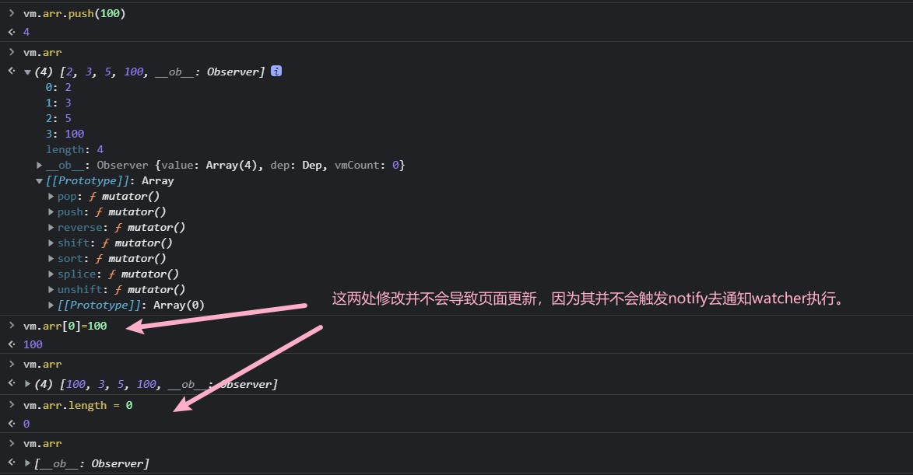

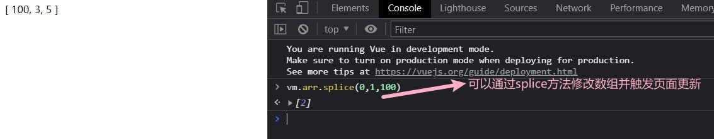

###  Watcher类

- Watcher类分为三种：Computed Watcher、用户Watcher（侦听器）、渲染Watcher
- 渲染Watcher的创建时机
  - /src/core/instance/lifecycle.js

```javascript
export function mountComponent(
  vm: Component,
  el: ?Element,
  hydrating?: boolean
): Component {
  ......
  let updateComponent   // 定义更新组件函数

  if (process.env.NODE_ENV !== 'production' && config.performance && mark) {    // 如果是开发环境且启用了性能监测，则进行性能监测
    ......
  } else {
    // 此处只是定义，并没有执行，执行是在Watcher中执行的
    updateComponent = () => {   // 否则通过_render来获取虚拟dom，并把虚拟dom传给_update，_update可以将虚拟dom转为真实dom，并更新到页面上
      vm._update(vm._render(), hydrating) // update中调用了patch函数，对比两个虚拟dom的差异，并把差异更新到真实dom
    }
  }

  // 创建Watcher对象，并把updateComponent传入。
  new Watcher(vm, updateComponent, noop, {	// noop为空函数，什么都不会执行（用于用户Watcher与计算属性Watcher）
    before() {
      if (vm._isMounted && !vm._isDestroyed) {
        callHook(vm, 'beforeUpdate')
      }
    }
  }, true	// true用于标识当前的Watcher未渲染Watcher)
  hydrating = false

  if (vm.$vnode == null) {
    vm._isMounted = true
    callHook(vm, 'mounted')   // 触发mounted生命周期钩子函数
  }
  return vm
}
```

```javascript
export default class Watcher {
  vm: Component;
  expression: string;
  cb: Function;
  id: number;
  deep: boolean;
  user: boolean;
  lazy: boolean;
  sync: boolean;
  dirty: boolean;
  active: boolean;
  deps: Array<Dep>;
  newDeps: Array<Dep>;
  depIds: SimpleSet;
  newDepIds: SimpleSet;
  before: ?Function;
  getter: Function;
  value: any;

  /* Vue中的Watcher有三种：渲染时的Watcher、计算属性的Watcher、监听器的Watcher */
  constructor(
    vm: Component,
    expOrFn: string | Function,
    cb: Function,
    options?: ?Object,      // 此处options中包含before生命周期钩子函数
    isRenderWatcher?: boolean   // 用来判断是否是渲染Watcher
  ) {
    this.vm = vm  // 存储实例对象
    if (isRenderWatcher) {  // 如果是渲染Watcher，把当前的watcher记录到Vue实例的_watcher中
      vm._watcher = this
    }
    vm._watchers.push(this)   // 把所有的watcher添加到Vue实例的_watchers数组中。

    if (options) {
      // 下面四个选项若为渲染watcher，则不传，默认为false
      this.deep = !!options.deep
      this.user = !!options.user
      this.lazy = !!options.lazy    // lazy是用于判断是否要延迟更新视图，此处是首次渲染不需要，一般用于计算属性的Watcher（数据变化才更新视图）
      this.sync = !!options.sync
      // 将传入的before保存
      this.before = options.before
    } else {
      this.deep = this.user = this.lazy = this.sync = false
    }
    this.cb = cb
    this.id = ++uid // id用于唯一标识watcher
    this.active = true  // 标识当前的watcher是否是活动的watcher。
    this.dirty = this.lazy // for lazy watchers

    // 下面四个值用于记录与watcher相关的dep对象
    this.deps = []
    this.newDeps = []
    this.depIds = new Set()
    this.newDepIds = new Set()
    this.expression = process.env.NODE_ENV !== 'production'
      ? expOrFn.toString()
      : ''

    if (typeof expOrFn === 'function') {     // 如果传入的expOrFn是function，则直接赋值给getter
      this.getter = expOrFn
    } else {
      // expOrFn是字符串的时候，例如 watch：{'person.name'：function...}
      // parsePath('person.name')返回一个函数获取 person.name 的值
      this.getter = parsePath(expOrFn)
      if (!this.getter) {
        this.getter = noop
        process.env.NODE_ENV !== 'production' && warn(
          `Failed watching path: "${expOrFn}" ` +
          'Watcher only accepts simple dot-delimited paths. ' +
          'For full control, use a function instead.',
          vm
        )
      }
    }
    this.value = this.lazy    // 判断this.lazy，若不延迟（及this.lazy为undefined），则立即调用this.get()
      ? undefined
      : this.get()
  }

  get() {
    pushTarget(this)    // 把当前的Watcher对象存入的栈中。保存父组件，使得组件嵌套时先渲染内部组件
    let value
    const vm = this.vm
    try {
      value = this.getter.call(vm, vm)    // 调用getter，若是渲染watcher，此处的getter就为updateComponent，并把this执行Vue的实例。
    } catch (e) {
      if (this.user) {
        handleError(e, vm, `getter for watcher "${this.expression}"`)
      } else {
        throw e
      }
    } finally {
      if (this.deep) {    // 此处的deep用于深度监听（监听的是对象的话会监听其内部的子属性）
        traverse(value)
      }
      popTarget() // 将当前的watcher从栈中弹出。
      this.cleanupDeps()    // 把当前的watcher从dep的subs数组中移除，并把watcher中记录的dep也移除
    }
    return value
  }
	......
}
```

当我们数据更新时，会调用dep对象的notify方法：

```javascript
notify() {
    // 通过slice()方法对subs数组进行克隆,保证后续遍历所有的watcher对象时新增的watcher对象不会执行。
    const subs = this.subs.slice()
    if (process.env.NODE_ENV !== 'production' && !config.async) {
      // 对克隆的数组进行根据id从小到大排序，保证watcher的执行顺序是正确的
      subs.sort((a, b) => a.id - b.id)
    }
    // 调用每个订阅者的update方法实现更新
    for (let i = 0, l = subs.length; i < l; i++) {
      subs[i].update()
    }
  }
```

接着我们再来看update中进行了什么操作：

```javascript
update() {
    // 当是渲染watcher时，lazy和sync都是false，所以会执行queueWatcher函数
    if (this.lazy) {
      this.dirty = true
    } else if (this.sync) {
      this.run()
    } else {
      queueWatcher(this)
    }
  }
```

update中执行了queueWatcher方法：

```javascript
export function queueWatcher(watcher: Watcher) {   // 接收当前要处理的watcher对象
  const id = watcher.id   // 获取watcher中的id
  if (has[id] == null) {    // 通过has[id]来获取has对象对应watcher的id的值，此处判断watcher还未被处理
    has[id] = true    // 把has[id]标记为true,标识该watcher对象已经被处理掉了
    if (!flushing) {    // flushing表示正在刷新，它的值为true表示queue队列正在被处理
      queue.push(watcher)   // 如果当前队列没有被处理，则把watcher直接放到队列末尾
    } else {
      let i = queue.length - 1    // 获取队列长度
      while (i > index && queue[i].id > watcher.id) { // index表示当前队列处理的位置，若i>index，说明队列还未处理完。判断队列中值的id是否大于watcher的id，若不大于，则该位置就是我们要插入的位置
        i--
      }
      queue.splice(i + 1, 0, watcher)   // 把要处理的watcher对象放入到队列中。
    }
    // 判断当前队列是否被执行
    if (!waiting) {   // 为false说明当前队列没有被执行
      waiting = true    // 将状态变为正在执行

      if (process.env.NODE_ENV !== 'production' && !config.async) {   // 如果是开发环境
        flushSchedulerQueue()   // 直接调用flushSchedulerQueue
        return
      }
      nextTick(flushSchedulerQueue)   // 如果是生产环境，则将该函数赋值给nextTick，让nextTick中调用该函数。
      // flushSchedulerQueue会执行队列中所有的watcher，并执行watcher的run方法。
    }
  }
}
```

queueWatcher中执行了flushSchedulerQueue方法：

```javascript
function flushSchedulerQueue() {
  currentFlushTimestamp = getNow()
  flushing = true   // 把flushing变为true，表明正在处理watcher队列
  let watcher, id

  // 对queue中的watcher按其id进行从小到大排列（为了保证：1.组件更新的顺序是从父组件到子组件，2.组件的用户watcher(在initState中创建的)在渲染watcher(在mountComponent中创建，initState是在其执行执行的)之前执行，3.如果一个组件在它的父组件执行前被销毁了，这个watcher应该被跳过）
  queue.sort((a, b) => a.id - b.id)

  // 不要去缓存length，因为在queue遍历过程中，很有可能会往其内部添加新的watcher。
  for (index = 0; index < queue.length; index++) {
    watcher = queue[index]  // 取得watcher
    if (watcher.before) {   // 判断watcher是否有before函数（只有渲染watcher才有）
      watcher.before()    // 调用before，触发钩子函数beforeUpdate()。
    }
    id = watcher.id   // 找到watcher的id，并且把其在has中的对应值设为null，表示watcher已经被处理过了。当数据变化时，保证下一次添加的watcher还能正常运行
    has[id] = null
    watcher.run()   // 调用watcher的run方法
    ......
  }

  // 备份两个队列
  const activatedQueue = activatedChildren.slice()
  const updatedQueue = queue.slice()

  resetSchedulerState()   // 重置任务队列的状态，把index与queue、activatedChildren的length置为0。has置为空对象，waiting和flushing置为false

  // 触发两个生命周期钩子函数
  callActivatedHooks(activatedQueue)	
  callUpdatedHooks(updatedQueue)

  ......
}
```

最后我们再来看一下run方法的作用：

```javascript
run() {
    if (this.active) {    // 判断this.active，查看当前的watcher对象是否是存活的状态，在Watcher的构造函数中设为了true
      const value = this.get()    // 调用get方法（若是渲染Watcher，则执行updateComponent）,渲染watcher的get没有返回值，value为undefined
      if (    // 如果是其它类型的watcher(不是渲染watcher)
        value !== this.value ||
        isObject(value) ||
        this.deep
      ) {
        const oldValue = this.value   // 获取旧值
        this.value = value  // 记录新值
        if (this.user) {    // 如果是用户watcher，调用cb，此处使用invokeWithErrorHandling为cb包裹一层try/catch
          const info = `callback for watcher "${this.expression}"`
          invokeWithErrorHandling(this.cb, this.vm, [value, oldValue], this.vm, info)
        } else {
          this.cb.call(this.vm, value, oldValue)    // 如果不是用户watcher，则直接调用
        }
      }
    }
  }
```

### 总结

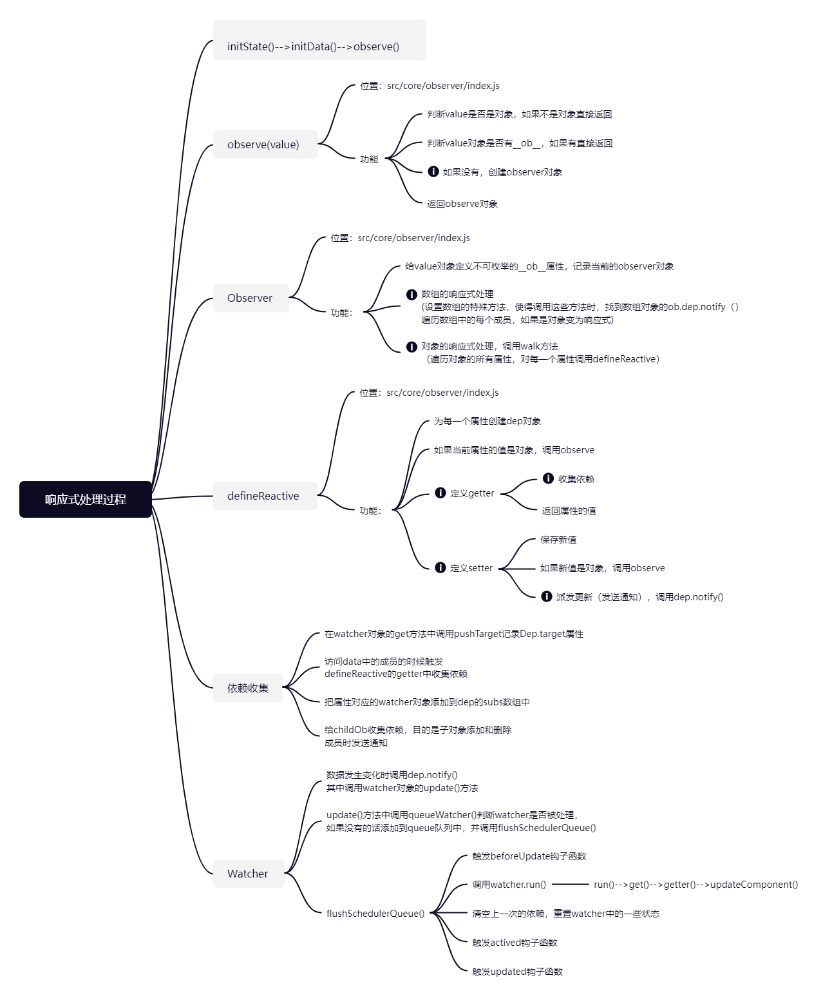

## $set源码

### 如何动态添加一个响应式数据

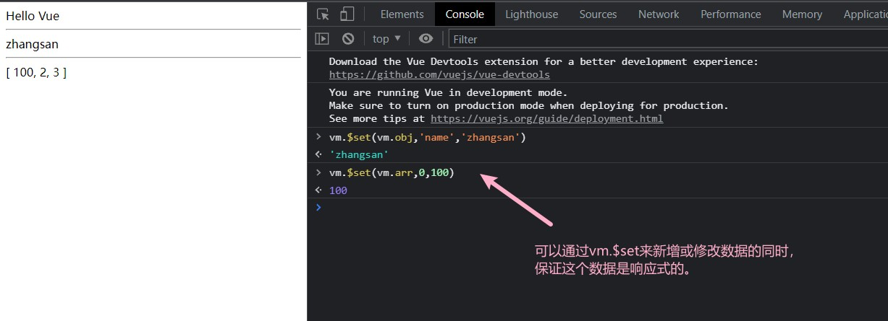

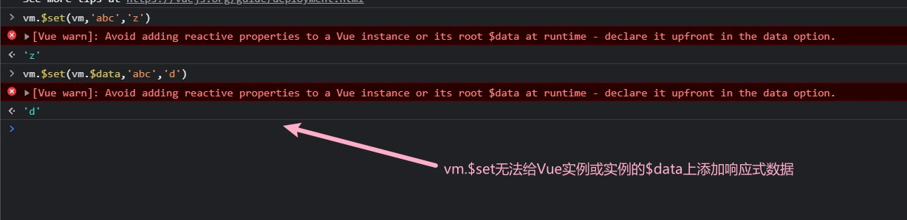

### set源码

- Vue.set()

  - global-api/index.js

  ```javascript
    // 静态方法 set/delete/nextTick
    Vue.set = set
    Vue.delete = del
    Vue.nextTick = nextTick
  ```

  

- vm.$set()

  - instance/index.js

    ```javascript
    // 注册 vm 的 $data/$props/$set/$delete/$watch
    stateMixin(Vue)
    ```

  - instance/state.js

    ```javascript
    export function stateMixin(Vue: Class<Component>) {
    // 为Vue原型添加$set和$delete
      Vue.prototype.$set = set
    }
    ```

    

> 可以看到，这两个方法都是依靠set方法赋值的。

observer/index.js

```javascript
export function set(target: Array<any> | Object, key: any, val: any): any {
  if (process.env.NODE_ENV !== 'production' &&
    (isUndef(target) || isPrimitive(target))    // 判断传入的对象是否是undefined或原始值，如果是，发出警告
  ) {
    warn(`Cannot set reactive property on undefined, null, or primitive value: ${(target: any)}`)
  }

  // 判断target是否是数组且key是一个合法索引
  if (Array.isArray(target) && isValidArrayIndex(key)) {
    target.length = Math.max(target.length, key)  // 比较key和数组的length属性，并把较大的值付给数组的length属性
    // 通过 splice 对key位置的元素进行替换
    // splice 在 array.js 进行了响应化的处理
    target.splice(key, 1, val)
    return val  // 返回修改后的元素
  }

  // 如果 key 在对象中已经存在直接赋值并返回
  if (key in target && !(key in Object.prototype)) {
    target[key] = val
    return val
  }

  // 获取 target 中的 observer 对象
  const ob = (target: any).__ob__
  // 如果 target 是 vue 实例或者 $data($data的ob.vmCount为1) 直接返回
  if (target._isVue || (ob && ob.vmCount)) {
    process.env.NODE_ENV !== 'production' && warn(
      'Avoid adding reactive properties to a Vue instance or its root $data ' +
      'at runtime - declare it upfront in the data option.'
    )
    return val
  }
  // 如果 ob 不存在，target 不是响应式对象，直接赋值
  if (!ob) {
    target[key] = val
    return val
  }

  // 把 key 设置为响应式属性
  defineReactive(ob.value, key, val)

  // 发送通知
  ob.dep.notify()	// 此处我们给子对象(childOb)也添加了收集依赖，所以可以这么写
  return val
}
```

## $delete源码

- 功能

  删除对象的属性，如果对象是响应式的，确保删除能够触发更新视图，这个方法主要用于避开Vue不能检测到属性被删除的限制，但是你应该很少会使用它。

  <div class="warning">

  > 注意：目标对象不能是一个Vue 实例或Vue实例 的根数据对象

  </div>

- 实例

```javascript
vm.$delete(vm.obj,'msg')
```

- 定义位置

1. Vue.delete()

   - global-api/index.js

   ```javascript
     Vue.delete = del
   ```

   

2. vm.$delete()

   - instance/index.js

   ```javascript
     Vue.prototype.$delete = del
   ```

del函数：

observer/index.js

```javascript
export function del(target: Array<any> | Object, key: any) {
  if (process.env.NODE_ENV !== 'production' &&
    (isUndef(target) || isPrimitive(target)) // 判断传入的对象是否是undefined或原始值，如果是，发出警告
  ) {
    warn(`Cannot delete reactive property on undefined, null, or primitive value: ${(target: any)}`)
  }

  // 判断target是否是数组且key是一个合法索引
  if (Array.isArray(target) && isValidArrayIndex(key)) {
    // 如果是数组通过splice删除
    // splice 做过响应式处理
    target.splice(key, 1)   // 第二个参数1，表示删除1个元素
    return
  }

  // 获取 target 的 ob 对象
  const ob = (target: any).__ob__
  // target 如果是 Vue 实例或者 $data 对象，直接返回
  if (target._isVue || (ob && ob.vmCount)) {
    process.env.NODE_ENV !== 'production' && warn(
      'Avoid deleting properties on a Vue instance or its root $data ' +
      '- just set it to null.'
    )
    return
  }

  // 如果target 对象没有 key 属性直接返回
  if (!hasOwn(target, key)) {
    return
  }

  // 删除属性
  delete target[key]
  if (!ob) {
    return
  }
  // 通过 ob 发送通知
  ob.dep.notify()
}
```

## $watch源码

vm.$watch( expOrFn, callback, [options] )

- 功能

  观察 Vue 实例变化的一个表达式或计算属性函数。回调函数得到的参数为新值和旧值。表达式只 接受监督的键路径。对于更复杂的表达式，用一个函数取代。

- 参数
  - expOrFn：要监视的 $data 中的属性，可以是表达式或函数
  - callback：数据变化后执行的函数
    - 函数：回调函数
    - 对象：具有 handler 属性(字符串或者函数)，如果该属性为字符串则 methods 中相应 的定义
  - options：可选的选项
    - deep：布尔类型，深度监听
    - immediate：布尔类型，是否立即执行一次回调函数
- 实例

```javascript
const vm = new Vue({
    el: '#app',
    data: {
        a: '1',
        b: '2',
        msg: 'Hello Vue',
        user: {
            firstName: '诸葛',
            lastName: '亮'
        }
    }
})
// expOrFn 是表达式
vm.$watch('msg', function (newVal, oldVal) {
    console.log(newVal, oldVal)
})
vm.$watch('user.firstName', function (newVal, oldVal) {
    console.log(newVal)
})
// expOrFn 是函数
vm.$watch(function () {
    return this.a + this.b
}, function (newVal, oldVal) {
    console.log(newVal)
})
// deep 是 true，消耗性能
vm.$watch('user', function (newVal, oldVal) {
    // 此时的 newVal 是 user 对象
    console.log(newVal === vm.user)
}, {
    deep: true
})
// immediate 是 true
vm.$watch('msg', function (newVal, oldVal) {
    console.log(newVal)
}, {
    immediate: true
})
```

```html
<!DOCTYPE html>
<html lang="en">

<head>
  <meta charset="UTF-8">
  <meta name="viewport" content="width=device-width, initial-scale=1.0">
  <title>watcher</title>
</head>

<body>
  <div id="app">
    {{ user.fullName }}
  </div>

  <script src="../../dist/vue.js"></script>
  <script>
    const vm = new Vue({
      el: '#app',
      data: {
        user: {
          firstName: '诸葛',
          lastName: '亮',
          fullName: ''
        }
      }
    })

    vm.$watch('user',
      function (newValue, oldValue) {
        this.user.fullName = newValue.firstName + ' ' + newValue.lastName
      }, {
      immediate: true,    // 设置完此项后，可以在一加载页面就执行一次监听（而不用等到数据改变）
      deep: true    // 设置完此项后，可以深度监听（当user.firstName改变时，也可以监听到）
    }
    )
  </script>
</body>

</html>
```

### 三种类型的Watcher对象

- $watch没有静态方法($set、$delete有)，因为$watch方法中要使用 Vue 的实例
- Watcher 分三种：计算属性 Watcher、用户 Watcher (侦听器)（由$watch创建）、渲染 Watcher 
  - 创建顺序：计算属性 Watcher、用户 Watcher (侦听器)、渲染 Watcher
  - 执行顺序：由于执行前会将watcher以id进行排序后再执行，所以执行顺序也是先计算属性再用户watcher，最后渲染watcher。
- vm.$watch() 
  - src\core\instance\state.js

### watch源码解析

我们先从侦听器的创建开始看起：

```javascript
export function initState(vm: Component) {
  vm._watchers = []
  const opts = vm.$options    // 获取Vue实例中的$options

  // 如果$options有props、methods、data、computed、watch，则进行相应的初始化操作
  if (opts.props) initProps(vm, opts.props) // initProps把props中的成员变为响应式，并且注册到Vue实例中。
  if (opts.methods) initMethods(vm, opts.methods) // 把options中的methods注入到vue实例。
  if (opts.data) {  // 当options中有data选项时，调用initData。
    initData(vm)
  } else {    // 没有data的话给vm创建一个_data，并赋值为{}，同时使用observe将其转为响应式对象。
    observe(vm._data = {}, true)
  }
  if (opts.computed) initComputed(vm, opts.computed)
  if (opts.watch && opts.watch !== nativeWatch) {	// 获取watch对象
    initWatch(vm, opts.watch)
  }
}
```

在initState中调用了initWatch来创建监听器

```javascript
function initWatch(vm: Component, watch: Object) {
  for (const key in watch) {    // 遍历watch对象，找到watch对象的所有属性，并获取它的值
    const handler = watch[key]
    if (Array.isArray(handler)) {   // 如果是数组，遍历它并通过createWatcher进行后续处理
      for (let i = 0; i < handler.length; i++) {
        createWatcher(vm, key, handler[i])
      }
    } else {
      createWatcher(vm, key, handler)   // 如果不是数组，直接调用createWatcher进行后续处理
    }
  }
}
```

```javascript
function createWatcher(
  vm: Component,
  expOrFn: string | Function,
  handler: any,
  options?: Object
) {
  if (isPlainObject(handler)) {   // 判断属性对应的值是否是原生对象
    options = handler     // 如果是对象，则直接将其存储到options中，同时把handler取出
    handler = handler.handler
  }
  if (typeof handler === 'string') {    // 如果是字符串，会去vue实例中找这个字符串对应的函数
    handler = vm[handler]
  }
  return vm.$watch(expOrFn, handler, options)
}
```

$watch：

```javascript
// 添加$watch方法
  Vue.prototype.$watch = function (
    expOrFn: string | Function,
    cb: any,
    options?: Object
  ): Function {
    // 获取 Vue 实例 this
    const vm: Component = this
    if (isPlainObject(cb)) {	// 此处做重复的判断(createWatcher中已经判断过)，是因为$watch可以直接使用
      // 判断如果 cb 是对象执行 createWatcher
      return createWatcher(vm, expOrFn, cb, options)
    }
    options = options || {}
    // 标记为用户watcher
    options.user = true
    // 创建用户 watcher对象
    const watcher = new Watcher(vm, expOrFn, cb, options)	// expOrFn为要监听的属性，cb为回调函数，当属性变化时，执行回调函数
    // 判断 immediate 如果为true
    if (options.immediate) {
      // 立即执行一次 cb 回调，并且把当前值传入
      const info = `callback for immediate watcher "${watcher.expression}"`
      pushTarget()
      invokeWithErrorHandling(cb, vm, [watcher.value], vm, info)
      popTarget()
    }
    // 返回取消监听的方法
    return function unwatchFn() {
      watcher.teardown()
    }
  }
```

关于options.user的作用，我们可以在run方法中看到：

```javascript
run() {
    if (this.active) {    // 判断this.active，查看当前的watcher对象是否是存活的状态，在Watcher的构造函数中设为了true
      const value = this.get()    // 调用get方法（若是渲染Watcher，则执行updateComponent）,渲染watcher的get没有返回值，value为undefined
      if (    // 如果是其它类型的watcher(不是渲染watcher)
        value !== this.value ||
        isObject(value) ||
        this.deep
      ) {
       	......
        if (this.user) {    // 如果是用户watcher，调用cb，此处使用invokeWithErrorHandling为cb包裹一层try/catch
          const info = `callback for watcher "${this.expression}"`
          invokeWithErrorHandling(this.cb, this.vm, [value, oldValue], this.vm, info)
        } else {
          this.cb.call(this.vm, value, oldValue)    // 如果不是用户watcher，则直接调用
        }
      }
    }
  }
```

最后我们再来看一下Watcher构造函数中lazy的作用：

```javascript
const computedWatcherOptions = { lazy: true }
function initComputed(vm: Component, computed: Object) {
......

    if (!isSSR) {
      // create internal watcher for the computed property.
      watchers[key] = new Watcher(
        vm,
        getter || noop,
        noop,
        computedWatcherOptions
      )
    }
......
}
```

在计算属性中创建watcher时，通过computedWatcherOptions将lazy标记为了true，使得get()不会立即调用。因为计算属性对应的方法是在模板中调用的，所以其是在render时调用计算属性的function。

```javascript
this.value = this.lazy    // 判断this.lazy，若不延迟（及this.lazy为undefined），则立即调用this.get()
      ? undefined
      : this.get()
```

> 个人理解：在$watch中创建Watcher对象时，会将通过其的get方法将当前Watcher变为Dep.target。然后我们在get函数中调用this.getter.call()（此时的getter经过处理变为了一个可以获取data中对应键的值的函数）时，其内部会去访问我们当前监视属性的对应的data中的值，从而触发defineReactive中getter的依赖收集。把当前的watcher对象收集到当前值的subs属性中。当后面我们改变相关值的时候，便会触发$watch的回调(notify->update->queueWatcher->flushSchedulerQueue->run->cb)。


## 计算属性Watcher

首先我们来看initComputed

```javascript
function initComputed(vm: Component, computed: Object) {
  const watchers = vm._computedWatchers = Object.create(null)   // _computedWatchers中存储了计算属性的key和对应的watcher
  const isSSR = isServerRendering()   // 判断当前的环境是否是服务端渲染的环境

  // 遍历用户定义的计算属性 computed：{a:function(){} , b:{get:..., set:...}}
  for (const key in computed) {
    const userDef = computed[key]   // 获取计算属性的值
    const getter = typeof userDef === 'function' ? userDef : userDef.get    // 判断值是否是function，如果是直接返回，如果不是，拿到其get方法
    if (process.env.NODE_ENV !== 'production' && getter == null) {    // 如果没有，发出警告
      warn(
        `Getter is missing for computed property "${key}".`,
        vm
      )
    }

    if (!isSSR) {
      // 如果不是服务端渲染环境，创建计算属性对应的 Watcher 对象，并将其保存到我们所创建的watchers对象中。
      watchers[key] = new Watcher(
        vm,
        getter || noop,
        noop,
        computedWatcherOptions    // computedWatcherOptions标记了lazy:true。使得创建完watcher后不立即执行watcher的get方法。
      )
    }

    // 如果 vm 上没有当前计算属性的名字，则在vm上定义该计算属性，否则如果是开发环境发送警告
    if (!(key in vm)) {
      defineComputed(vm, key, userDef)
    } else if (process.env.NODE_ENV !== 'production') {
      if (key in vm.$data) {
        warn(`The computed property "${key}" is already defined in data.`, vm)
      } else if (vm.$options.props && key in vm.$options.props) {
        warn(`The computed property "${key}" is already defined as a prop.`, vm)
      } else if (vm.$options.methods && key in vm.$options.methods) {
        warn(`The computed property "${key}" is already defined as a method.`, vm)
      }
    }
  }
}
```

其内部创建了计算属性Watcher，并判断当前计算属性是否在vm上，如果不在，则进行defineComputed绑定：

```javascript
export function defineComputed(   // 此函数的作用是把计算属性添加到vue的实例上
  target: any,
  key: string,
  userDef: Object | Function
) {
  const shouldCache = !isServerRendering()    // 判断是否是服务端渲染的环境
  // sharedPropertyDefinition 的作用是给Object.defineProperty的最后一项配置get、set
  if (typeof userDef === 'function') {  // 如果计算属性传的值是function时
    sharedPropertyDefinition.get = shouldCache
      ? createComputedGetter(key)
      : createGetterInvoker(userDef)
    sharedPropertyDefinition.set = noop   // 把set赋为空函数
  } else {    // 否则代表传来的是一个对象
    sharedPropertyDefinition.get = userDef.get
      ? shouldCache && userDef.cache !== false
        ? createComputedGetter(key)
        : createGetterInvoker(userDef.get)
      : noop
    sharedPropertyDefinition.set = userDef.set || noop  // 把set赋值给sharedPropertyDefinition.set
  }
  if (process.env.NODE_ENV !== 'production' &&
    sharedPropertyDefinition.set === noop) {
    sharedPropertyDefinition.set = function () {
      warn(
        `Computed property "${key}" was assigned to but it has no setter.`,
        this
      )
    }
  }
  // 给 vm 对象上定义该计算属性
  Object.defineProperty(target, key, sharedPropertyDefinition)
}
```

这个函数给计算属性设置相应的get和set后，最终在vm上定义该计算属性，而其中通过了 createComputedGetter(key) 来获取get：

```javascript
function createComputedGetter(key) {
  return function computedGetter() {
    // 获取该计算属性对应的 watcher 对象
    const watcher = this._computedWatchers && this._computedWatchers[key]
    if (watcher) {
      // 这个位置起到缓存的作用
      // 第一次访问计算属性的时候 dirty 为true 执行evaluate获取计算属性的值，并把dirty设置为false
      // 在此访问计算属性，dirty的值如果依然为false，不执行 evaluate，直接返回 watcher.value
      // 当数据改变之后会调用 watcher 的update方法，把 dirty 改变为 true，如果 dirty 为 true才会重新计算
      if (watcher.dirty) {	// 此处dirty的初始值即为lazy的值
        watcher.evaluate()
      }
      if (Dep.target) {   // 收集依赖相关
        watcher.depend()
      }
      return watcher.value
    }
  }
}
```

这个函数内部做了计算属性相关的缓存操作，并最终返回一个可以获取watcher.value（在watcher类中：this.value = this.lazy     ? undefined   : this.get() ，而其中的get()会调用计算属性的get，并将获取到的值返回）。同时我们可以看到其内部使用了evaluate来进行缓存：

```javascript
update() {
    // 当是渲染watcher时，lazy和sync都是false，所以会执行queueWatcher函数
    // 当时计算属性 Watcher时，lazy为true，执行update时会将dirty变为true。
    if (this.lazy) {
      this.dirty = true
    } else if (this.sync) {
      this.run()
    } else {
      queueWatcher(this)
    }
  }

evaluate() {
    this.value = this.get()
    this.dirty = false	// 将dirty设为true，使得之后createComputedGetter中会直接返回watcher.value
  }
```

> 问题：如何在data属性改变时使得使用到这个data的计算属性也发生变化？或者说如何给data添加计算属性Watcher？
>
> 个人理解：当我们将计算属性使用到模板中时，其会触发计算属性的getter方法，而第一次调用时，会触发evaluate方法，evaluate中又会触发get方法，其内部将当前计算属性的Watcher设置为了Dep.target。而此时，如果计算属性中使用到了相关的data属性（在我们自定义的get函数中使用，这个自定义的get函数会在watcher的get方法中通过this.getter.call进行调用），就会触发data的getter，从而将当前的计算属性Watcher添加到data的subs数组中。

## 异步更新队列 - nextTick()

- Vue更新DOM 是异步执行的，批量的
  - 在下次 DOM 更新循环结束之后执行延迟回调，在修改数据之后立即使用这个方法，获取更新后的DOM。
  - vm.$nextTick(function(){ /* 操作DOM */ })  /  Vue.nextTick(function(){})

- 定义位置

  - src\core\instance\render.js

  ```javascript
  Vue.prototype.$nextTick = function (fn: Function) {
  	return nextTick(fn, this)
  }
  ```

  - src\core\global-api\index.js

  ```javascript
  Vue.nextTick = nextTick
  ```

```javascript
const callbacks = []
let pending = false
let timerFunc

function flushCallbacks() {
  pending = false // 把pending标记为false，表示已经处理结束了
  const copies = callbacks.slice(0)   // 把callbacks数组备份
  callbacks.length = 0    // 把callbacks数组情况
  for (let i = 0; i < copies.length; i++) {   // 遍历备份的回调函数数组，并调用
    copies[i]()
  }
}

if (typeof Promise !== 'undefined' && isNative(Promise)) {
  const p = Promise.resolve()
  timerFunc = () => {	// timerFunc优先使用Promise(微任务形式)来处理flushCallbacks
    /*
    	nextTick的作用：获取dom上最新的数据。
    	而当微任务执行的时候，dom元素还未渲染到界面上。
    	当nextTick中的回调函数执行之前，数据已经被改变了，会通知watcher去渲染视图。但watcher中首先会去更改dom树，而dom要等到当前事件循环结束之后，才会更新到页面上。而nextTick中使用微任务时，会从dom树中直接获取数据。
    */
    p.then(flushCallbacks)	// 通过Promise调用flushCallbacks
    if (isIOS) setTimeout(noop)		// 如果使用ios,不会使用promise，而是降级使用setTimeout
  }
  isUsingMicroTask = true		// 标记当前nextTick使用微任务
} else if (!isIE && typeof MutationObserver !== 'undefined' && (		// 判断不是IE,且支持MutationObserver(监听dom对象的改变，若改变执行回调函数，这个回调函数也是微任务)
  isNative(MutationObserver) ||
  MutationObserver.toString() === '[object MutationObserverConstructor]'
)) {
  let counter = 1
  const observer = new MutationObserver(flushCallbacks)
  const textNode = document.createTextNode(String(counter))
  observer.observe(textNode, {
    characterData: true
  })
  timerFunc = () => {
    counter = (counter + 1) % 2
    textNode.data = String(counter)
  }
  isUsingMicroTask = true	// 标记当前nextTick使用微任务
} else if (typeof setImmediate !== 'undefined' && isNative(setImmediate)) {		// 如果浏览器不支持promise和MutationObserver,则降级使用setImmediate（类似于定时器，但只能在IE和Node中使用，但是其性能会比setImmediate好，setImmediate会立即执行，而setTimeout即便设置时间为0，也会等4ms再执行）
  timerFunc = () => {
    setImmediate(flushCallbacks)
  }
} else {
  timerFunc = () => {
    setTimeout(flushCallbacks, 0)
  }
}

export function nextTick(cb?: Function, ctx?: Object) {  // cd:回调函数 ctx:上下文，一般为Vue实例
  let _resolve
  // 把 cb 加上异常处理存入 callbacks数组中
  callbacks.push(() => {
    if (cb) {
      try {
        // 调用cb()
        cb.call(ctx)
      } catch (e) {
        handleError(e, ctx, 'nextTick')
      }
    } else if (_resolve) {		// 如果不存在回调函数，则调用_resolve，此处的resolve为promise的传递的resolve
      _resolve(ctx)
    }
  })
  if (!pending) {   // 判断队列是否正在被处理
    pending = true    // 如果没有的话，标记队列正在被处理
    timerFunc()   // 调用
  }
  // $flow-disable-line
  if (!cb && typeof Promise !== 'undefined') {
    // 返回 promise 对象
    return new Promise(resolve => {
      _resolve = resolve
    })
  }
}
```

> 在Watcher的 queueWatcher中同样也是执行nextTick()来进行调用(实现异步更新视图)。

## 了解：slot 的实现

- 父组件编译后的 render

  ```js
  ƒ anonymous(
  ) {
  with(this){
    return _c('div',{attrs:{"id":"app"}},[_c('router-link',{attrs:{"to":"/abc"}},[_v("hello")])],1)}	// _c及h函数，用于创建VNode，[]里面为子组件。_v用于创建文本节点
  }
  ```

- 子组件(router-link)编译后的 render

  ```js
  ƒ anonymous(
  ) {
  with(this){
    /* <a :href="\'#\' + to"><slot name="default">abc</slot></a> */
    return _c('a',{attrs:{"href":'#' + to}},[_t("default",[_v("abc")])],2)}	// _t用于创建插槽
    // 我们要思考的是，router-link中到底是渲染 abc，还是渲染 hello
  }
  ```

- 初始化 $slots

  - render-helpers/resolve-slots.js --> _t --> resolveSlots

    ```js
    /* _t("default",[_v("abc")]) */
    export function renderSlot (
      name: string,
      fallback: ?Array<VNode>,
      props: ?Object,
      bindObject: ?Object
    ): ?Array<VNode> {
      const scopedSlotFn = this.$scopedSlots[name]
      let nodes
      if (scopedSlotFn) { // scoped slot
        ……
      } else {
        nodes = this.$slots[name] || fallback	// 如果$slots有值（此处的$slots就是[_v("hello")]），则取出它的值，没值的话把fallback返回。
      }
    
      const target = props && props.slot
      if (target) {
        return this.$createElement('template', { slot: target }, nodes)
      } else {
        return nodes
      }
    }
    ```
  
- init.js ---> initInternalComponent 中存储 opts._renderChildren（  slot 的内容 )
  
- render.js --->  initRender()中执行如下代码，把slot的内容和slot的名字存储到vm.$slots中
  
    ```js
    vm.$slots = resolveSlots(options._renderChildren, renderContext)	
    ```

