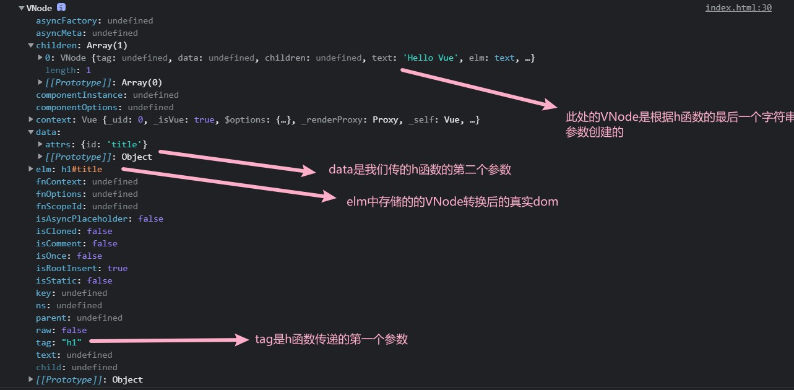
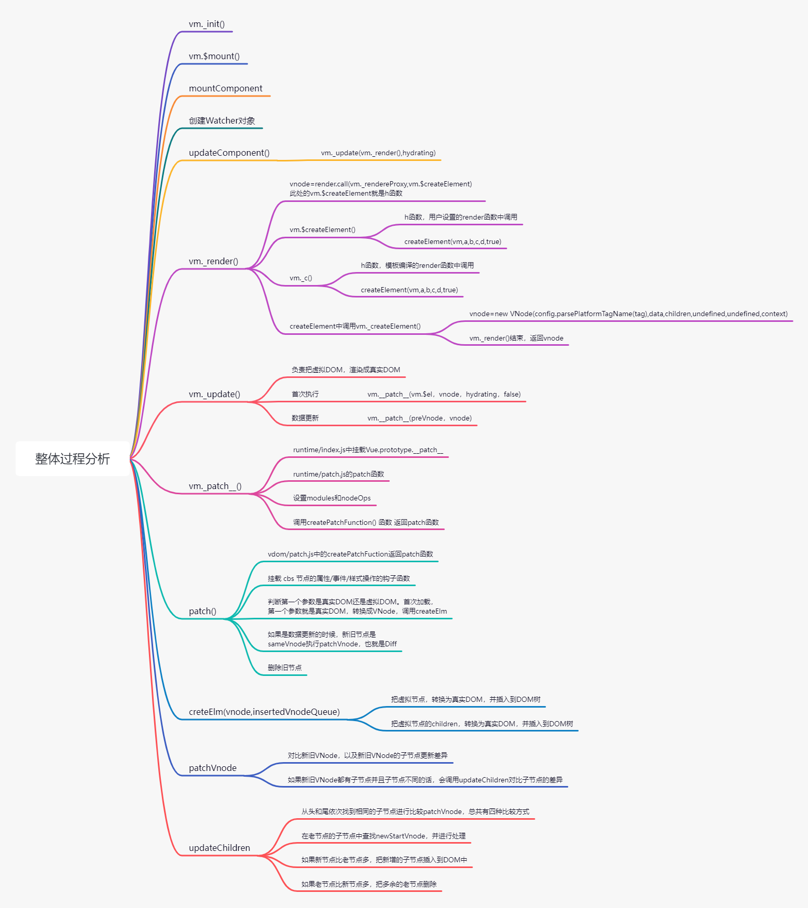

## 虚拟DOM

- 虚拟 DOM(Virtual DOM) 是使用 JavaScript 对象来描述 DOM，虚拟 DOM 的本质就是 JavaScript 对象，使用 JavaScript 对象来描述 DOM 的结构。应用的各种状态变化首先作用于虚拟 DOM，最终映射到DOM。
- Vue.js 中的虚拟 DOM 借鉴了 Snabbdom，并添加了一些 Vue.js 中的特性，例如：指令和组件机制。

### 为什么要使用虚拟DOM

- 使用虚拟 DOM，可以避免用户直接操作 DOM，开发过程只需要关注业务代码的实现，不需要关注如何操作 DOM，从而提高开发效率

- 作为一个中间层可以跨平台
- 虚拟DOM不一定可以提高性能
  - 首次渲染的时候会增加开销（因为会创建一些额外的JS对象）
  - 复杂视图情况下提升渲染性能

## 代码演示

```html
<!DOCTYPE html>
<html lang="en">

<head>
  <meta charset="UTF-8">
  <meta name="viewport" content="width=device-width, initial-scale=1.0">
  <title>virtualdom</title>
</head>

<body>
  <div id="app">
  </div>

  <script src="../../dist/vue.js"></script>
  <script>
    const vm = new Vue({
      el: '#app',
      render(h) {
        // h(tag, data, children)
        // return h('h1', this.msg)
        // return h('h1', { domProps: { innerHTML: this.msg } })
        // return h('h1', { attrs: { id: 'title' } }, this.msg)
        const vnode = h(
          'h1',
          {
            attrs: { id: 'title' }
          },
          this.msg
        )
        console.log(vnode)
        return vnode
      },
      data: {
        msg: 'Hello Vue'
      }
    })
  </script>
</body>

</html>
```



> h函数在源码中实际上就是 vm.$createElement(tag,data,children,normalizeChildren)
>
> - tag：标签名称或者组件对象
> - data：描述tag，可以设置DOM的属性或者标签的属性
> - children：tag中的文本内容或者子节点

> h函数的返回对象是一个VNode对象
>
> - VNode的核心属性
>   - tag：标签名称或者组件对象
>   - data：描述tag，可以设置DOM的属性或者标签的属性
>   - children：tag中的文本内容或者子节点
>   - text
>   - elm：记录转化后的真实dom
>   - key：用来复用当前元素

## 整体过程分析




## createElement

首先我们可以在instance/lifecycle.js中找到updateComponent方法的定义：

```javascript
// 此处只是定义，并没有执行，执行是在Watcher中执行的
updateComponent = () => {   // 通过_render来获取虚拟dom，并把虚拟dom传给_update，_update可以将虚拟dom转为真实dom，并更新到页面上
    vm._update(vm._render(), hydrating) // update中调用了patch函数，对比两个虚拟dom的差异，并把差异更新到真实dom
}
```

接着我们去找到_render方法的定义位置instance/render.js：

```javascript
// 对手写 render 函数进行渲染的方法（手动传入render函数时调用的）
vm.$createElement = (a, b, c, d) => createElement(vm, a, b, c, d, true)

Vue.prototype._render = function (): VNode {  // _render中调用了vm.$options中定义的render函数
    const vm: Component = this
    const { render, _parentVnode } = vm.$options    // 从vm.$options中获取了render，及用户传递的render函数或模板编译的render

    ......

    vm.$vnode = _parentVnode
    let vnode
    try {
      ......
      // 此处的vm._renderProxy就是Vue实例,可以看到此处调用了render函数，并改变了this指向同时传入了vm.$createElement。
      vnode = render.call(vm._renderProxy, vm.$createElement)   // 此处的vm.$createElement 即为h函数
    } catch (e) {
      ......
    } finally {
      currentRenderingInstance = null
    }
    ......
    return vnode
  }
```

可以看到render函数中传递了vm.$createElement，而vm.$createElement是一个高阶函数，内部返回了一个createElement函数：

```javascript
export function createElement(
  context: Component,
  tag: any,
  data: any,
  children: any,
  normalizationType: any,
  alwaysNormalize: boolean
): VNode | Array<VNode> {   // 最终返回VNode（由_createElement创建），此处函数内部只是处理参数
  if (Array.isArray(data) || isPrimitive(data)) { // 判断data是数组或原始值（代表此时的data是children，而没传data值）
    normalizationType = children    // 把normalizationType赋值给children
    children = data   // 把data赋值给children
    data = undefined    // 把data设置为undefined
  }
  if (isTrue(alwaysNormalize)) {
    normalizationType = ALWAYS_NORMALIZE    // 如果是调用用户传入的render函数，将normalizationType标记为2
  }
  return _createElement(context, tag, data, children, normalizationType)	// 根据传入的参数，创建VNode，并返回。
}
```

createElement中使用了_createElement创建VNode：

```typescript
export function _createElement(
  context: Component,
  tag?: string | Class<Component> | Function | Object,
  data?: VNodeData,
  children?: any,
  normalizationType?: number
): VNode | Array<VNode> {
  if (isDef(data) && isDef((data: any).__ob__)) {   // 如果data存在且data为一个响应式的是数据，发出警告并返回一个空的VNode节点
    process.env.NODE_ENV !== 'production' && warn(
      `Avoid using observed data object as vnode data: ${JSON.stringify(data)}\n` +
      'Always create fresh vnode data objects in each render!',
      context
	)
    return createEmptyVNode()
  }

  // <component v-bind:is="currentTabComponent"></component>
  // is的作用，与component组件（由Vue提供的动态组件）配合使用，is属性的值是一个组件，将来渲染时会将is属性的组件渲染到component的位置
  if (isDef(data) && isDef(data.is)) {    // 如果data属性存在且内部有is属性，将data.is赋值给tag
    tag = data.is
  }
  if (!tag) {   // 如果tag是false，代表is属性为false，会返回一个空节点
    return createEmptyVNode()
  }
  // 判断data中是否有key，如果有且key为非原始值，发出警告：key应该是string或number类型的值
  if (process.env.NODE_ENV !== 'production' &&
    isDef(data) && isDef(data.key) && !isPrimitive(data.key)
  ) {
    if (!__WEEX__ || !('@binding' in data.key)) {
      warn(
        'Avoid using non-primitive value as key, ' +
        'use string/number value instead.',
        context
      )
    }
  }

  // 下面代码用于处理作用域插槽
  if (Array.isArray(children) &&
    typeof children[0] === 'function'
  ) {
    data = data || {}
    data.scopedSlots = { default: children[0] }
    children.length = 0
  }


  if (normalizationType === ALWAYS_NORMALIZE) {   // 如果是用户手写的render
    // 返回一维数组，处理用户手写的 render
    children = normalizeChildren(children)
  } else if (normalizationType === SIMPLE_NORMALIZE) {
    // 把二维数组，转换成一维数组
    children = simpleNormalizeChildren(children)
  }
  let vnode, ns
  if (typeof tag === 'string') {    // 判断tag是否是字符串
    let Ctor
    ns = (context.$vnode && context.$vnode.ns) || config.getTagNamespace(tag)
    // 是否是html的保留标签
    if (config.isReservedTag(tag)) {
      // platform built-in elements
      if (process.env.NODE_ENV !== 'production' && isDef(data) && isDef(data.nativeOn) && data.tag !== 'component') {
        warn(
          `The .native modifier for v-on is only valid on components but it was used on <${tag}>.`,
          context
        )
      }
      vnode = new VNode(
        config.parsePlatformTagName(tag), data, children,
        undefined, undefined, context   // 此处的context为vue实例
      )
      // 是字符串且data或data.pre存在且可以从实例选项中获取到tag名称对应的组件的情况下
    } else if ((!data || !data.pre) && isDef(Ctor = resolveAsset(context.$options, 'components', tag))) { // 查找自定义组件构造函数的声明
      vnode = createComponent(Ctor, data, context, children, tag)   // 根据 Ctor 创建组件的 VNode
    } else {
      // 如果tag不是保留标签，说明tag是一个自定义标签，则根据其创建VNode对象
      vnode = new VNode(
        tag, data, children,
        undefined, undefined, context
      )
    }
  } else {
    // 如果tag不是字符串，说明其是一个组件，则根据createComponent创建对应的VNode
    vnode = createComponent(tag, data, context, children)
  }
  if (Array.isArray(vnode)) {   // 判断vnode是否是数组，若是则直接返回
    return vnode
  } else if (isDef(vnode)) {    // 若vnode已经初始化好了
    if (isDef(ns)) applyNS(vnode, ns)   // 处理命名空间
    if (isDef(data)) registerDeepBindings(data)
    return vnode    // 返回vnode
  } else {
    return createEmptyVNode()   // 以上所有条件都不满足，说明vnode未被创建，返回空的Vnode
  }
}
```

其中使用了如下几个方法：

```javascript
export const createEmptyVNode = (text: string = '') => {
  const node = new VNode()
  node.text = text
  node.isComment = true   // 标识当前vnode对象是一个注释节点
  return node
}

export function simpleNormalizeChildren(children: any) {
  for (let i = 0; i < children.length; i++) {
    if (Array.isArray(children[i])) {   // 遍历数组，将数组拍平，变为一维数组
      return Array.prototype.concat.apply([], children)
    }
  }
  return children   // 最终返回拼接好的children(一维数组)
}

export function normalizeChildren(children: any): ?Array<VNode> {    // 如果是用户传入的render函数，children可能是字符串或数组
  return isPrimitive(children)    // 判断children是否是原始值 
    ? [createTextVNode(children)]   // 是的话将children转为文本节点，并用数组包裹，保证children都为数组形式
    : Array.isArray(children)     // 如果是数组的话
      ? normalizeArrayChildren(children)    // 通过递归的方式将一个可能的多维数组转为一维数组
      : undefined
}
```

## update

> 主要是判断是否有preVnode(以判断此时是首次渲染还是数据更新)，根据判断结果为\_\_patch\_\_传入不同的参数

```javascript
  Vue.prototype._update = function (vnode: VNode, hydrating?: boolean) {
    const vm: Component = this
    const prevEl = vm.$el
    const prevVnode = vm._vnode   // 此处的preVnode为之前处理过的vnode对象
    const restoreActiveInstance = setActiveInstance(vm)
    vm._vnode = vnode     // 将vnode记录到vm._vnode中，为下次渲染做准备
    // 调用patch方法，将虚拟dom转为真实dom。
    // 此处做了一层判断，判断是否是首次渲染，并传入不同参数。
    if (!prevVnode) {   // 若不存在preVnode，说明是首次渲染
      // __patch__中会把vm.$el转化为虚拟dom，然后跟vnode相比较，并把比较的结果更新到真实的dom并返回
      vm.$el = vm.__patch__(vm.$el, vnode, hydrating, false /* removeOnly */)   // 第一个参数传递真实dom，第二个参数为vnode
    } else {
      // 若prevnode有值，此时将比较prevVnode与vnode的差异，并且把差异更新到真实dom，并把真实dom返回
      vm.$el = vm.__patch__(prevVnode, vnode)
    }
  }
```

## patch

- src/platforms/web/runtime/index.js

```javascript
// 在Vue的原型上挂载patch函数(将虚拟dom转为真实dom)
// 将patch函数挂载到Vue原型的__patch__中，使得所有实例都可以访问到
Vue.prototype.__patch__ = inBrowser ? patch : noop  // 判断当前是否为浏览器环境，是的话返回patch，不是的话返回一个noop(空函数)
// inBrowser中通过typeof window进行判断，若有值，说明其是在浏览器环境下。
```

- src/platforms/web/runtime/patch.js

```javascript
// platformModules为一些与平台相关模块，用于设置样式、类、属性等（与Snabbdom中模块基本相同，不过多了一个transtion用来处理过渡动画）
// baseModules为一些和平台无关的模块（用来处理指令和ref）
const modules = platformModules.concat(baseModules)

// nodeOps为一些重新封装后的操作dom的api
export const patch: Function = createPatchFunction({ nodeOps, modules })
```

- src/core/vdom/patch.js

```javascript
export function createPatchFunction(backend) {  // 此函数的作用类似于snabbdom中的init
  let i, j
  const cbs = {}

  // modules 节点的属性/事件/样式的操作
  // nodeOps 节点操作
  const { modules, nodeOps } = backend

  /* const hooks = ['create', 'activate', 'update', 'remove', 'destroy'] */
  for (i = 0; i < hooks.length; ++i) {
    // 遍历hooks数组，将其作为cbs的属性，然后遍历模块，判断模块中是否有相关的钩子函数
    // 如果有，将其取出，放到cbs对应的属性中(cbs是一个二维数组)
    cbs[hooks[i]] = []
    for (j = 0; j < modules.length; ++j) {
      if (isDef(modules[j][hooks[i]])) {
        // cbs['update'] = [updateAttrs，updateClass，update...]
        cbs[hooks[i]].push(modules[j][hooks[i]])
      }
    }

	......
      
  // 函数柯里化，让一个函数返回一个函数
  return function patch(oldVnode, vnode, hydrating, removeOnly) {
    ......
  }
  }
```

找到patch函数定义的位置之后，我们再来看patch函数的执行过程

```javascript
function patch(oldVnode, vnode, hydrating, removeOnly) {
    // 新的 VNode 不存在
    if (isUndef(vnode)) {
      // 老的 VNode 存在，执行 oldVnode 的 Destroy 钩子函数
      if (isDef(oldVnode)) invokeDestroyHook(oldVnode)
      return
    }

    let isInitialPatch = false
    const insertedVnodeQueue = []   // 用于存储新插入的vnode节点，为了将来把这些vnode节点对应的dom节点挂载到dom树后，触发insert钩子函数

    // 老的 VNode 不存在
    if (isUndef(oldVnode)) {
      // 当我们调用组件的$mount确没有传递参数时，会产生此种情况
      isInitialPatch = true   // 标记为ture，表示当前vnode与其对应的dom元素都创建好了，但是仅仅存储在内存中，没有挂载到dom树中
      // 创建新的 VNode
      createElm(vnode, insertedVnodeQueue)    // 此处没有传递parentEle，最终不会挂载到dom树中。
    } else {
      // 新的和老的 VNode 都存在，更新
      const isRealElement = isDef(oldVnode.nodeType)  // 如果nodeType存在，说明其是真实dom元素，代表此次是首次渲染
      // 判断参数1是否是真实 DOM，如果不是，且oldVnode与vnode是相同节点
      if (!isRealElement && sameVnode(oldVnode, vnode)) {
        // 更新操作，diff算法
        patchVnode(oldVnode, vnode, insertedVnodeQueue, null, null, removeOnly)
      } else {
        // 新旧节点不同或就节点是真实DOM  
          
        // 第一个参数是真实DOM，创建 VNode，说明是首次渲染
        if (isRealElement) {
          // 下面两个判断，判断与SSR相关的东西
          if (oldVnode.nodeType === 1 && oldVnode.hasAttribute(SSR_ATTR)) {
            ......
          }
          if (isTrue(hydrating)) {
            ......
            }
          }


          /* 
            function emptyNodeAt(elm) {
                return new VNode(nodeOps.tagName(elm).toLowerCase(), {}, [], undefined, elm)
            }
          */
          oldVnode = emptyNodeAt(oldVnode)  // emptyNodeAt 返回一个VNode
        }

        // 获取oldVnode的 elm，并去找其父元素 
        const oldElm = oldVnode.elm
        const parentElm = nodeOps.parentNode(oldElm)

        // createElm的核心作用是把VNode转化为真实dom后挂载到parentElm中。
        createElm(
          vnode,
          insertedVnodeQueue,   // 传入insertedVnodeQueue用于把具有用户自定义的insert钩子函数的Vnode记录到其中
          // 如果执行的是transition，并且执行的是leaving（从界面上消失）的时候，此时是把parentElement设置成了null。
          // 而若parentElement设置为了null，是不会把新创建的dom元素挂载到dom树上的。
          oldElm._leaveCb ? null : parentElm,
          nodeOps.nextSibling(oldElm)   // 此处指明插入到哪个元素之前。
        )

        // 此处用于处理父节点占位符问题，与核心逻辑无关
        if (isDef(vnode.parent)) {
          ......
        }

        // 判断parentElm（从oldVnode中获取）是否存在，如果其存在
        if (isDef(parentElm)) {
          removeVnodes([oldVnode], 0, 0)  // 将oldVnode从界面上移出，内部还会触发相应的钩子函数
        } else if (isDef(oldVnode.tag)) {   // 如果parentElm不存在，说明oldVnode并不在dom树上存在，再判断其是否有tag属性
          invokeDestroyHook(oldVnode) // 有的话触发destory钩子函数
        }
      }
    }

    // 此处传入isInitialPatch，这个参数的作用是用于标识当前的vnode对应的钩子函数并没有挂载到dom树上。
    // 若为挂载到dom树上，此时是不会触发insertedVnodeQueue中vnode的insert钩子函数的。
    invokeInsertHook(vnode, insertedVnodeQueue, isInitialPatch)   // 触发insertedVnodeQueue队列所有vnode的insert钩子函数。
    return vnode.elm    // 把新的vnode的dom返回，记录到Vue实例的$el中。
  }
```

内部用到了removeVnodes与invokeInsertHook：

```javascript
function removeVnodes(vnodes, startIdx, endIdx) {
    for (; startIdx <= endIdx; ++startIdx) {    // 根据索引遍历vnodes
        const ch = vnodes[startIdx]
        if (isDef(ch)) {    // 判断vnode是否存在
            if (isDef(ch.tag)) {    // 如果vnode有tag属性，说明其是一个tag标签
                removeAndInvokeRemoveHook(ch)   // 将tag标签从dom上移出并触发remove钩子函数
                invokeDestroyHook(ch)   // 触发destroy钩子函数
            } else { // 不存在tag标签，说明其是一个文本节点
                removeNode(ch.elm)    // 将文本节点从dom树上移除
            }
        }
    }
}
```

```javascript
function invokeInsertHook(vnode, queue, initial) {
    if (isTrue(initial) && isDef(vnode.parent)) {
        vnode.parent.data.pendingInsert = queue   // 如果initial为true，说明elm未挂载到dom树上，则把队列赋值到pendingInsert中。等将来真正挂载后在执行
    } else {
        // 否则的话就遍历queue，并触发内部的insert钩子函数。
        for (let i = 0; i < queue.length; ++i) {
            queue[i].data.hook.insert(queue[i])
        }
    }
}
```

## createElm

> 作用：把VNode转化为真实dom，然后挂载到dom树上。

在patch函数中调用了createElm：

```javascript
// createElm的核心作用是把VNode转化为真实dom后挂载到parentElm中。
createElm(
    vnode,    // createElm中会把此VNode转化为真实dom 后挂载到dom树上。
    insertedVnodeQueue,   // 传入insertedVnodeQueue用于把Vnode记录到其中
    // 如果执行的是transition，并且执行的是leaving（从界面上消失）的时候，此时是把parentElement设置成了null。
    // 而若parentElement设置为了null，是不会把新创建的dom元素挂载到dom树上的。
    oldElm._leaveCb ? null : parentElm,   // 将来将vnode转化为真实dom后会append到parentElm中
    nodeOps.nextSibling(oldElm)   // 此处指明插入到哪个元素之前。
)
```

我们来看createElm的定义：

```javascript
function createElm(
    vnode,
    insertedVnodeQueue,
    parentElm,
    refElm,
    nested,
    ownerArray,
    index
  ) {
    if (isDef(vnode.elm) && isDef(ownerArray)) {    // 判断vnode中是否有elm属性，有的话表示其曾经渲染过。同时判断其是否有子节点
      vnode = ownerArray[index] = cloneVNode(vnode)   // 把vnode克隆一份，cloneVNode会同时克隆VNode与其内部的子节点（避免一些潜在的错误）
    }
	......
    if (createComponent(vnode, insertedVnodeQueue, parentElm, refElm)) {    // 处理组件的情况
      return
    }

    const data = vnode.data   // 获取vnode的data、children、tag
    const children = vnode.children
    const tag = vnode.tag
    if (isDef(tag)) {   // 判断vnode是否有tag属性，有的话当前的tag就是标签名称(因为tag是组件名称的情况上方已处理过)。
      if (process.env.NODE_ENV !== 'production') {    // 判断是否是开发环境
        if (data && data.pre) {
          creatingElmInVPre++
        }
        if (isUnknownElement(vnode, creatingElmInVPre)) {   // 判断标签是否是一个未知2的标签（html中不存在的标签），发出警告
          warn(   // tag是一个自定义标签，你是否正确注册了对应的组件？
            'Unknown custom element: <' + tag + '> - did you ' +
            'register the component correctly? For recursive components, ' +
            'make sure to provide the "name" option.',
            vnode.context
          )
        }
      }

      vnode.elm = vnode.ns    // 判断vnode是否有ns属性（命名空间）
        ? nodeOps.createElementNS(vnode.ns, tag)  // 有的话调用createElementNS
        : nodeOps.createElement(tag, vnode)     // 没有的话调用createElement
      // 最终将创建好的dom元素存储到vnode.elm中

      setScope(vnode)   // setScopr中会为vnode所对应的dom元素设置样式的作用域（scopeId）

      if (__WEEX__) {
        // 判断当前的环境是否是WEEX环境，并做出相应操作
        ......
      } else {
        createChildren(vnode, children, insertedVnodeQueue)     // 把vnode中所有的子元素转变为dom对象
        if (isDef(data)) {    // 如果vnode中的data有值（钩子函数在data中定义）
          invokeCreateHooks(vnode, insertedVnodeQueue)    // 调用create钩子函数，并记录具有用户定义的insert钩子函数的vnode
        }
        insert(parentElm, vnode.elm, refElm)    // 把vnode创建好的dom对象插入到parentElm中
      }

      ......
    } else if (isTrue(vnode.isComment)) {   // 判断vnode是否是注释节点
      vnode.elm = nodeOps.createComment(vnode.text)   // 调用createComment创建一个注释dom节点并存储到vnode.elm中
      insert(parentElm, vnode.elm, refElm)    // 将vnode.elm插入到树
    } else {    // 判断vnode是文本节点
      vnode.elm = nodeOps.createTextNode(vnode.text)    // 调用createTextNode创建一个文本dom节点并存储到vnode.elm中
      insert(parentElm, vnode.elm, refElm)    // 最后执行insert插入到dom树
    }
  }
```

其内部调用了createChildren、invokeCreateHooks：

```javascript
function createChildren(vnode, children, insertedVnodeQueue) {
    if (Array.isArray(children)) {    // 判断children是否是数组
        if (process.env.NODE_ENV !== 'production') {    // 在开发环境下
            checkDuplicateKeys(children)    // 判断children中所有的子元素是否有相同的key，若有相同的key，发出警告
        }
        for (let i = 0; i < children.length; ++i) {   // 遍历children，找到vnode，并把vnode转化为真实dom，挂载到dom树上。
            createElm(children[i], insertedVnodeQueue, vnode.elm, null, true, children, i)
        }
    } else if (isPrimitive(vnode.text)) {   // 如果不是数组，而是原始值
        // 通过String函数将其转为字符串后，调用createTextNode创建一个dom元素（文本节点），挂载到vnode.elm上。
        nodeOps.appendChild(vnode.elm, nodeOps.createTextNode(String(vnode.text)))
    }
}
```

```javascript
function invokeCreateHooks(vnode, insertedVnodeQueue) {
    // 调用 VNode 的create钩子函数（此处是模块中的钩子函数）
    for (let i = 0; i < cbs.create.length; ++i) {
        cbs.create[i](emptyNode, vnode)
    }
    i = vnode.data.hook
    // 调用 组件的钩子函数（此处是我们自定义的钩子函数）
    if (isDef(i)) {
        if (isDef(i.create)) i.create(emptyNode, vnode)   // 调用create钩子函数。
        if (isDef(i.insert)) insertedVnodeQueue.push(vnode)   // 将insert钩子函数存储到insertedVnodeQueue中。
    }
}
```

## patchVnode

> 作用：对比新旧VNode，找到它们的差异，更新到真实dom。

可以看到，在patch函数中，使用了patchVnode：

```javascript
// 判断参数1是否是真实 DOM，如果不是，且oldVnode与vnode是相同节点
if (!isRealElement && sameVnode(oldVnode, vnode)) {
    // 更新操作，diff算法
    patchVnode(oldVnode, vnode, insertedVnodeQueue, null, null, removeOnly)
}else{
    首次渲染操作
}
```

我们来看patchVnode的具体实现：

```javascript
  function patchVnode(
    oldVnode,
    vnode,
    insertedVnodeQueue,
    ownerArray,
    index,
    removeOnly
  ) {
    if (oldVnode === vnode) {		// 如果新老节点相同，直接返回
      return
    }

    .....

    const elm = vnode.elm = oldVnode.elm

    ......

    let i
    const data = vnode.data    // 获取vnode中的data
    // 获取data中的hook（用户传递的构造函数），判断其中是否有prepatch，如果有则执行。
    if (isDef(data) && isDef(i = data.hook) && isDef(i = i.prepatch)) {
      i(oldVnode, vnode)
    }

    // 获取新旧节点的子节点
    const oldCh = oldVnode.children
    const ch = vnode.children

    // 调用update钩子函数
    if (isDef(data) && isPatchable(vnode)) {
      // 调用cbs的update钩子函数，操作节点的属性、样式、事件....
      for (i = 0; i < cbs.update.length; ++i) cbs.update[i](oldVnode, vnode)

      // 调用用户自定义的update钩子函数
      if (isDef(i = data.hook) && isDef(i = i.update)) i(oldVnode, vnode)
    }

    // 如果新节点没有text属性
    if (isUndef(vnode.text)) {
      if (isDef(oldCh) && isDef(ch)) {
        // 新老节点都有子节点，且不相等
        // 调用updateChildren
        if (oldCh !== ch) updateChildren(elm, oldCh, ch, insertedVnodeQueue, removeOnly)
      } else if (isDef(ch)) {
        // 新的有子节点，老的没有子节点
        if (process.env.NODE_ENV !== 'production') {
          checkDuplicateKeys(ch)    // 检查新节点的子节点中是否有重复的key，如果有的话发出警告
        }
        if (isDef(oldVnode.text)) nodeOps.setTextContent(elm, '')   // 判断oldVnode中是否有text属性，有的话将其置为空
        addVnodes(elm, null, ch, 0, ch.length - 1, insertedVnodeQueue)    // 把新节点下的子节点转为dom节点并添加到当前节点的dom节点下
      } else if (isDef(oldCh)) {    // 如果老节点中有子节点，新节点中没有子节点
        removeVnodes(oldCh, 0, oldCh.length - 1)    // 调用removeVnodes中的节点删除，并且触发remove和destory钩子函数
      } else if (isDef(oldVnode.text)) {    // 如果新老节点都没有子节点，判断老节点是否有text属性
        nodeOps.setTextContent(elm, '')   // 有的话将text属性清空
      }
    } else if (oldVnode.text !== vnode.text) {    // 如果新节点中有text属性，且与oldVnode中的text不相等
      // 调用setTextContent，把新的vnode的text属性赋值给dom节点的文本
      nodeOps.setTextContent(elm, vnode.text)
    }
    if (isDef(data)) {    // 触发用户传入的postpatch钩子函数，并执行
      if (isDef(i = data.hook) && isDef(i = i.postpatch)) i(oldVnode, vnode)
    }
  }
```

其中调用了addVnodes和removeVnodes：

```javascript
function addVnodes(parentElm, refElm, vnodes, startIdx, endIdx, insertedVnodeQueue) {
    for (; startIdx <= endIdx; ++startIdx) {
        createElm(vnodes[startIdx], insertedVnodeQueue, parentElm, refElm, false, vnodes, startIdx)
    }
}
```


```javascript
function removeVnodes(vnodes, startIdx, endIdx) {
    for (; startIdx <= endIdx; ++startIdx) {    // 根据索引遍历vnodes
        const ch = vnodes[startIdx]
        if (isDef(ch)) {    // 判断vnode是否存在
            if (isDef(ch.tag)) {    // 如果vnode有tag属性，说明其是一个tag标签
                removeAndInvokeRemoveHook(ch)   // 将tag标签从dom上移出并触发remove钩子函数
                invokeDestroyHook(ch)   // 触发destroy钩子函数
            } else { // 不存在tag标签，说明其是一个文本节点
                removeNode(ch.elm)    // 将文本节点从dom树上移除
            }
        }
    }
}
```

## updateChildren

> 在patchVNode中，当新老节点都有子节点，且新老节点为sameVnode，并且子节点不相同时，会调用updateChildren

```javascript
  function updateChildren(parentElm, oldCh, newCh, insertedVnodeQueue, removeOnly) {
    let oldStartIdx = 0   // 老节点子节点数组开始索引
    let newStartIdx = 0   // 新节点子节点数组开始索引
    let oldEndIdx = oldCh.length - 1    // 老节点子节点数组结束索引
    let oldStartVnode = oldCh[0]    // 老节点子节点数组开始节点
    let oldEndVnode = oldCh[oldEndIdx]    // 老节点子节点数组结束节点
    let newEndIdx = newCh.length - 1    // 新节点子节点数组结束索引
    let newStartVnode = newCh[0]    // 新节点子节点数组开始节点
    let newEndVnode = newCh[newEndIdx]  // 新节点子节点数组结束节点
    let oldKeyToIdx, idxInOld, vnodeToMove, refElm

    const canMove = !removeOnly

    if (process.env.NODE_ENV !== 'production') {
      checkDuplicateKeys(newCh)		// 先比较key是否相同，若相同发出警告。
    }

    // diff 算法
    // 当新节点和旧节点都没有遍历完成
    while (oldStartIdx <= oldEndIdx && newStartIdx <= newEndIdx) {
      if (isUndef(oldStartVnode)) {   // 判断老的开始节点是否有值，没有的话将开始节点的下一个节点作为开始节点
        oldStartVnode = oldCh[++oldStartIdx]
      } else if (isUndef(oldEndVnode)) {    // 判断老的结束节点时是否有值，没有的话将结束节点的上一个节点作为结束节点
        oldEndVnode = oldCh[--oldEndIdx]
      }

      // 比较新旧开始节点和结束节点是否相同 
      else if (sameVnode(oldStartVnode, newStartVnode)) {
        // 相同的话继续通过patchVnode比较它们的子节点
        patchVnode(oldStartVnode, newStartVnode, insertedVnodeQueue, newCh, newStartIdx)
        oldStartVnode = oldCh[++oldStartIdx]
        newStartVnode = newCh[++newStartIdx]
      } else if (sameVnode(oldEndVnode, newEndVnode)) {
        patchVnode(oldEndVnode, newEndVnode, insertedVnodeQueue, newCh, newEndIdx)
        oldEndVnode = oldCh[--oldEndIdx]
        newEndVnode = newCh[--newEndIdx]
      }

      // 若前两种情况都不满足，可能是对列表做了翻转之类的操作
      // 继续比较老的开始节点和新的结束节点以及老的结束节点和新的开始节点
      else if (sameVnode(oldStartVnode, newEndVnode)) {
        // 当相同时，调用patchVnode比较它们的子节点
        patchVnode(oldStartVnode, newEndVnode, insertedVnodeQueue, newCh, newEndIdx)
        // 并将老的开始节点移动到老的结束节点之后
        canMove && nodeOps.insertBefore(parentElm, oldStartVnode.elm, nodeOps.nextSibling(oldEndVnode.elm))
        oldStartVnode = oldCh[++oldStartIdx]
        newEndVnode = newCh[--newEndIdx]
      } else if (sameVnode(oldEndVnode, newStartVnode)) {
        patchVnode(oldEndVnode, newStartVnode, insertedVnodeQueue, newCh, newStartIdx)
        canMove && nodeOps.insertBefore(parentElm, oldEndVnode.elm, oldStartVnode.elm)
        oldEndVnode = oldCh[--oldEndIdx]
        newStartVnode = newCh[++newStartIdx]
      }

      // 若以上四种情况都不满足
      // 把新的开始节点 依次和老节点进行比较
      else {
        if (isUndef(oldKeyToIdx)) oldKeyToIdx = createKeyToOldIdx(oldCh, oldStartIdx, oldEndIdx)  // 使用createKeyToOldIdx创建一个老节点的key与index一一对应的对象
        idxInOld = isDef(newStartVnode.key)   // 如果新的开始节点存在key，则去oldKeyToIdx中查询是否有对应key值的老节点
          ? oldKeyToIdx[newStartVnode.key]
          : findIdxInOld(newStartVnode, oldCh, oldStartIdx, oldEndIdx)  // 如果新的开始节点没有key,去老节点数组中依次遍历找到相同老节点对应的索引
        if (isUndef(idxInOld)) { // 若没有找到老节点对应的索引，说明这个一个全新的节点
          createElm(newStartVnode, insertedVnodeQueue, parentElm, oldStartVnode.elm, false, newCh, newStartIdx) // 调用createElm去创建新开始节点对应的dom对象并插入到老的开始节点对应的dom元素之前
        } else {    // 如果找到老节点对应的索引，把老节点取出并存储到vnodeToMove中。
          vnodeToMove = oldCh[idxInOld]
          if (sameVnode(vnodeToMove, newStartVnode)) {    // 如果新老节点是someVnode的话
            patchVnode(vnodeToMove, newStartVnode, insertedVnodeQueue, newCh, newStartIdx)    // 调用patchVnode比较它们的子节点
            oldCh[idxInOld] = undefined   // 将原本的老节点数组中老节点对应的位置清除，使得其不再参与下次循环比较
            canMove && nodeOps.insertBefore(parentElm, vnodeToMove.elm, oldStartVnode.elm)    // 使用insertBefore将这个老节点移动到老的开始节点之前
          } else {
            // 如果key相同，但是是不同的元素，创建新元素
            createElm(newStartVnode, insertedVnodeQueue, parentElm, oldStartVnode.elm, false, newCh, newStartIdx)
          }
        }
        newStartVnode = newCh[++newStartIdx]
      }
    }

    // 当结束时 oldStartIdx > oldEndIdx，旧节点遍历完，但是新节点还没有
    if (oldStartIdx > oldEndIdx) {
      // 说明新节点比老节点多，把剩下的新节点插入到老的节点后面。
      refElm = isUndef(newCh[newEndIdx + 1]) ? null : newCh[newEndIdx + 1].elm
      addVnodes(parentElm, refElm, newCh, newStartIdx, newEndIdx, insertedVnodeQueue)
    } else if (newStartIdx > newEndIdx) {
      // 当结束时 newStart > newEndIdx，新节点遍历完，但是旧节点还没有。把旧节点剩余的节点批量删除。
      removeVnodes(oldCh, oldStartIdx, oldEndIdx)
    }
  }
```

## key的作用

观察如下代码：

```html
<!DOCTYPE html>
<html lang="en">
<head>
  <meta charset="UTF-8">
  <meta name="viewport" content="width=device-width, initial-scale=1.0">
  <title>key</title>
</head>
<body>
  <div id="app">
    <button @click="handler">按钮</button>
    <ul>
      <li v-for="value in arr" :key="value">{{value}}</li>
    </ul>
  </div>
  <script src="../../dist/vue.js"></script>
  <script>
    const vm = new Vue({
      el: '#app',
      data: {
        arr: ['a', 'b', 'c', 'd']
      },
      methods: {
        handler () {
          this.arr.splice(1, 0, 'x')
          // this.arr = ['a', 'x', 'b', 'c', 'd']
        }
      }
    })
  </script>
</body>
</html>
```

<div class="success">

> 当不设置key时，新节点为a,x,b,c,d  ， 老节点为 a,b,c,d。由于没有设置key，导致判断时会判断前四个新旧节点都相同，进而在patchVnode比较后三个节点的text值不同，并会执行nodeOps.setTextContent(elm, vnode.text)更改新旧节点的值。然后发现老节点遍历完，把新节点的最有一个节点插入到老节点开始节点之前，总共执行了4次dom操作。
>
> 而若设置key，新节点为a,x,b,c,d  ， 老节点为 a,b,c,d。先比较新旧第一个节点相同，然后比较新旧第二个节点不同，进而比较新旧结束的第一个节点，发现相同，接下来两次比较同理，这四次循环不进行任何dom操作。最终发现老节点遍历完后，把剩余的新节点插入到老的开始节点之前。总共执行了1次dom操作。

</div>

