## 标准化大厂编程规范解决方案之ESLint + Git Hooks 

### 为什么需要编程规范？

**工欲善其事，必先利其器** 

对于一些大型的企业级项目而言，通常情况下我们都是需要一个团队来进行开发的。而又因为团队人员对技术理解上的参差不齐，所以就会导致出现一种情况，那就是《**一个项目无法具备统一的编程规范，导致项目的代码像多个不同材质的补丁拼接起来一样**》

设想一下，下面的这段代码有一个团队进行开发，因为没有具备统一的代码标准，所以生成了下面的代码：

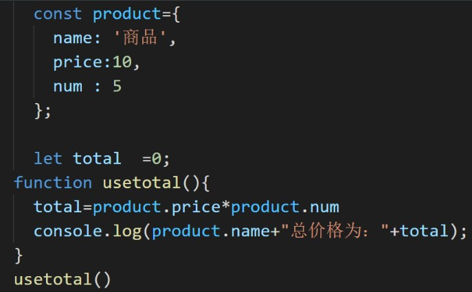

这段代码可以正常运行没有问题，但是整体的代码结构却非常的难看。

> 有的地方有空格进行分割，有的地方却没有
>
> 有的地方是单引号，有的地方却是双引号
>
> 有的地方有分号，有的地方没有分号
>
> ....

这样的项目虽然可以正常运行，但是如果把它放到大厂的项目中，确实 **不及格** 的，它会被认为是 **不可维护、不可扩展的代码内容**

那么所谓的大厂标准的代码结构应该是什么样子的呢？

我们把上面的代码进行一下修正，做一个对比：

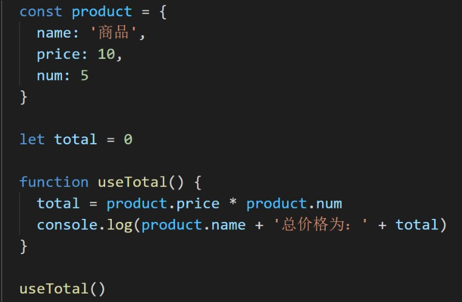

修改之后的代码具备了统一的规范之后，是不是看起来就舒服多了！

本章节中将讲解，如何自动化的对代码进行规范，其中主要包括：

1. 编码规范
2. git 规范

### 使用 vue-cli 创建项目

因为我们需要使用最新的模板，所以请保证你的 `vue-cli` 的版本在 `4.5.13` 以上，你可以通过以下的方式来查看你的 `vue-cli` 版本：

```
vue -V
------
@vue/cli 4.5.13 // 输出版本号
```

如果你需要升级版本，那么可以通过以下指令进行升级：

```
npm update -g @vue/cli
```

具体的方式也可以点击 [这里](https://cli.vuejs.org/zh/guide/installation.html) 进行参考。

升级之后，即可通过以下方式创建最新的 `vue3` 项目，终端输入 `vue create 项目名称` ，即可进入 **模板选择**

```js
// 利用 vue-cli 创建项目
vue create imooc-admin
// 进入模板选择
Vue CLI v4.5.13
? Please pick a preset:
  Default ([Vue 2] babel, eslint)
  Default (Vue 3) ([Vue 3] babel, eslint) 
> Manually select features  // 选择手动配置
// ----------------------------------------------------------
? Check the features needed for your project: 
 (*) Choose Vue version // 选择 vue 版本
 (*) Babel // 使用 babel
 ( ) TypeScript // 不使用 ts
 ( ) Progressive Web App (PWA) Support // 不使用 PWA
 (*) Router // 添加 vue-router
 (*) Vuex // 添加 vuex
>(*) CSS Pre-processors // 使用 css 预处理器
 (*) Linter / Formatter // 代码格式化
 ( ) Unit Testing // 不配置测试
 ( ) E2E Testing  // // 不配置测试
// ----------------------------------------------------------
 Choose a version of Vue.js that you want to start the project with 
  2.x
> 3.x // 选择 vue 3.0 版本
// ----------------------------------------------------------
 Use history mode for router? (Requires proper server setup for index fallback in production) (Y/n) n // 不使用 history模式 的路由
// ----------------------------------------------------------
 ? Pick a CSS pre-processor (PostCSS, Autoprefixer and CSS Modules are supported by default): 
> Sass/SCSS (with dart-sass) // 使用基于 dart-sass 的 scss 预处理器
  Sass/SCSS (with node-sass) 
  Less
  Stylus
// ----------------------------------------------------------
? Pick a linter / formatter config: 
  ESLint with error prevention only 
  ESLint + Airbnb config
> ESLint + Standard config // 使用 ESLint 标准代码格式化方案
  ESLint + Prettier 
// ----------------------------------------------------------
? Pick additional lint features: 
 (*) Lint on save //  
>(*) Lint and fix on commit  // 保存时 && 提交时，都进行 lint
// ----------------------------------------------------------
? Where do you prefer placing config for Babel, ESLint, etc.? (Use arrow keys)
> In dedicated config files // 单独的配置文件
  In package.json
// ----------------------------------------------------------
 Save this as a preset for future projects? (y/N) n // 不存储预设
```

等待片刻之后，你的项目就会生成成功。

生成之后，可以通过以下两个指令来运行你的项目：

```
cd 项目目录
npm run serve
```

执行成功之后，项目即可运行！

###  升级最新的 vue 版本以支持 script setup 语法

因为使用 `@vue/cli-v4.5.13` 版本创建的项目中，`vue` 的版本为 `v 3.0.0` 。

但是我们的项目需要使用最新的 `script setup 语法`，该语法在 `v 3.0.0` 版本中是不支持的，所以我们需要升级 `vue` 版本。

大家可以通过以下指令进行升级：

执行：

```js
npm i vue@3.2.8 vue-router@4.0.11 vuex@4.0.2
```

升级之后，查看 `package.json` 得到的版本应为：

```json
"vue": "^3.2.8",
"vue-router": "^4.0.11",
"vuex": "^4.0.2"
```

### 代码检测工具 ESLint

在我们去创建项目的时候，脚手架工具已经帮助我们安装了 `ESLint` 代码检测工具。

首先 `ESLint` 是 `2013年6月` 创建的一个开源项目，它的目标非常简单，只有一个，那就是 **提供一个插件化的 `javascript` 代码检测工具** ，说白了就是做 **代码格式检测使用的**

在咱们当前的项目中，包含一个 `.eslintrc.js` 文件，这个文件就是 `eslint` 的配置文件。

随着大家对代码格式的规范性越来越重视，`eslint` 也逐渐被更多的人所接收，同时也有很多大厂在原有的 `eslint` 规则基础之上进行了一些延伸。

我们在创建项目时，就进行过这样的选择：

```js
? Pick a linter / formatter config: 
  ESLint with error prevention only // 仅包含错误的 ESLint
  ESLint + Airbnb config // Airbnb 的 ESLint 延伸规则
  ESLint + Standard config // 标准的 ESLint 规则
```

我们当前选择了 **标准的 ESLint 规则** ，那么接下来我们就在该规则之下，看一看 `ESLint` 它的一些配置都有什么？

打开项目中的 `.eslintrc.js` 文件

```js
// ESLint 配置文件遵循 commonJS 的导出规则，所导出的对象就是 ESLint 的配置对象
// 文档：https://eslint.bootcss.com/docs/user-guide/configuring
module.exports = {
  // 表示当前目录即为根目录，ESLint 规则将被限制到该目录下
  root: true,
  // env 表示启用 ESLint 检测的环境
  env: {
    // 在 node 环境下启动 ESLint 检测
    node: true
  },
  // ESLint 中基础配置需要继承的配置
  extends: ["plugin:vue/vue3-essential", "@vue/standard"],
  // 解析器
  parserOptions: {
    parser: "babel-eslint"
  },
  // 需要修改的启用规则及其各自的错误级别
  /**
   * 错误级别分为三种：
   * "off" 或 0 - 关闭规则
   * "warn" 或 1 - 开启规则，使用警告级别的错误：warn (不会导致程序退出)
   * "error" 或 2 - 开启规则，使用错误级别的错误：error (当被触发的时候，程序会退出)
   */
  rules: {
    "no-console": process.env.NODE_ENV === "production" ? "warn" : "off",
    "no-debugger": process.env.NODE_ENV === "production" ? "warn" : "off"
  }
};

```

那么到这里咱们已经大致的了解了`.eslintrc.js` 文件，基于 `ESLint` 如果我们出现不符合规范的代码格式时，那么就会得到一个对应的错误。

比如：

> 我们可以把 `Home.vue` 中的 `name` 属性值，由单引号改为双引号

此时，只要我们一保存代码，那么就会得到一个对应的错误

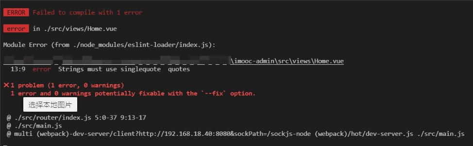

这个错误表示： 

1. 此时我们触发了一个 《错误级别的错误》 
2. 触发该错误的位置是 在 `Home.vue` 的第 13 行 第九列 中
3. 错误描述为：字符串必须使用单引号
4. 错误规则为：`quotes`

那么想要解决这个错误，通常情况下我们有两种方式：

1. 按照 `ESLint` 的要求修改代码
2. 修改 `ESLint` 的验证规则

**按照 `ESLint` 的要求修改代码：**

>  在 `Home.vue` 的第 13 行中把双引号改为单引号

**修改 `ESLint` 的验证规则：**

1. 在 `.eslintrc.js` 文件中，新增一条验证规则

   ```json
   "quotes": "error" // 默认
   "quotes": "warn" // 修改为警告
   "quotes": "off" // 修改不校验
   ```

### 代码格式化工具 Prettier

点击 [这里](https://www.prettier.cn/) 进入 `prettier` 中文官网

**`prettier` 是什么？**

1. 一个代码格式化工具
2. 开箱即用
3. 可以直接集成到 `VSCode` 之中
4. 在保存时，让代码直接符合 `ESLint` 标准（需要通过一些简单配置）

### ESLint 与 Prettier 配合解决代码格式问题

1. 在 `VSCode` 中安装 `prettier` 插件（搜索 `prettier`），这个插件可以帮助我们在配置 `prettier` 的时候获得提示
   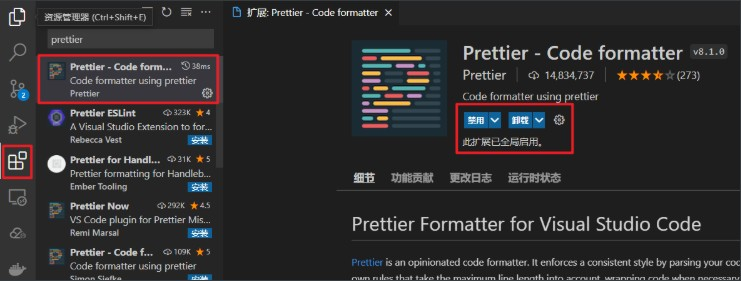

2. 在项目中新建 `.prettierrc` 文件，该文件为 `perttier` 默认配置文件

3. 在该文件中写入如下配置：

   ```json
   {
     // 不尾随分号
     "semi": false,
     // 使用单引号
     "singleQuote": true,
     // 多行逗号分割的语法中，最后一行不加逗号
     "trailingComma": "none"
   }
   ```

4. 打开 `VSCode` 《设置面板》
   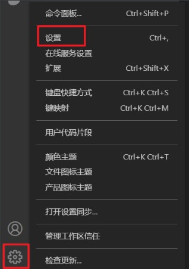

5. 在设置中，搜索 `save` ，勾选 `Format On Save`
   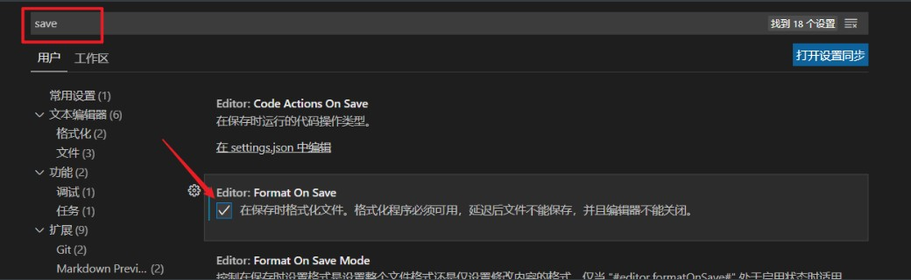

至此，你即可在 **`VSCode` 保存时，自动格式化代码！**

**但是！** 只做到这样还不够！还有以下3个问题：

> 1. VSCode 而言，默认一个 tab 等于 4 个空格，而 ESLint 希望一个 tab 为两个空格，此时我们就需要在设置中的 Tab Size 配置 空格数
>
> 2. 如果大家的 VSCode 安装了多个代码格式化工具的话，需要在文件中右键选择格式化工具
>
> 3. ESLint 和 prettier 之间的冲突问题：

我们尝试在 `Home.vue` 中写入一个 `created` 方法，写入完成之后，打开我们的控制台我们会发现，此时代码抛出了一个 `ESLint` 的错误

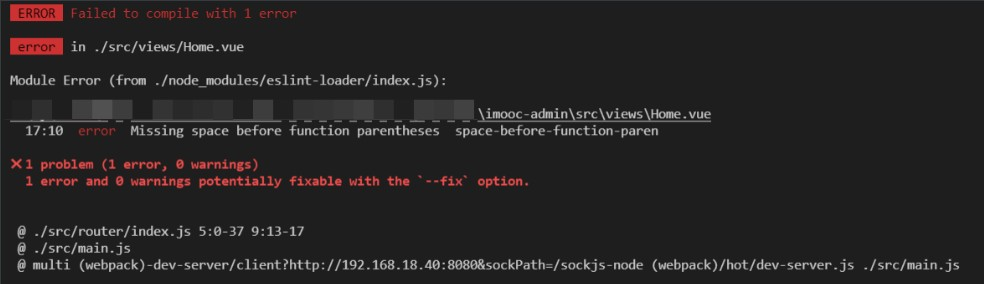

这个错误的意思是说：**`created` 这个方法名和后面的小括号之间，应该有一个空格！**

但是当我们加入了这个空格之后，只要一保存代码，就会发现 `prettier` 会自动帮助我们去除掉这个空格。

那么此时的这个问题就是 `prettier` 和 `ESLint` 的冲突问题。

针对于这个问题我们想要解决也非常简单：

1. 打开 `.eslintrc.js` 配置文件

2. 在 `rules` 规则下，新增一条规则

   ```json
   'space-before-function-paren': 'off'
   ```

3. 该规则表示关闭《方法名后增加空格》的规则

4. 重启项目

至此我们整个的 `perttier` 和 `ESLint` 的配合使用就算是全部完成了。

在之后我们写代码的过程中，只需要保存代码，那么 `perttier` 就会帮助我们自动格式化代码，使其符合 `ESLint` 的校验规则。而无需我们手动进行更改了。

### 约定式提交规范

在前面我们通过 `prettier + ESLint` 解决了代码格式的问题，但是我们之前也说过 **编程规范** 指的可不仅仅只是 **代码格式规范** 。

除了 **代码格式规范** 之外，还有另外一个很重要的规范就是 **`git` 提交规范！**

在现在的项目开发中，通常情况下，我们都会通过 `git` 来管理项目。只要通过 `git` 来管理项目，那么就必然会遇到使用 `git` 提交代码的场景

当我们执行 `git commit -m "描述信息"` 的时候，我们知道此时必须添加一个描述信息。但是中华文化博大精深，不同的人去填写描述信息的时候，都会根据自己的理解来进行描述。

而很多人的描述 “天马行空” ，这样就会导致别人在看你的提交记录时，看不懂你说的什么意思？不知道你当前的这次提交到底做了什么事情？会不会存在潜在的风险？

比如说，我们来看这几条提交记录：

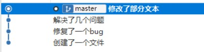

你能够想象得到它们经历了什么吗？

所以 **`git` 提交规范** 势在必行。

对于 **`git` 提交规范** 来说，不同的团队可能会有不同的标准，此处就以目前使用较多的 [Angular团队规范](https://github.com/angular/angular.js/blob/master/DEVELOPERS.md#-git-commit-guidelines) 延伸出的 [Conventional Commits specification（约定式提交）](https://www.conventionalcommits.org/zh-hans/v1.0.0/) 为例，来为大家详解  **`git` 提交规范**

约定式提交规范要求如下：

```js
<type>[optional scope]: <description>

[optional body]

[optional footer(s)]

--------  翻译 -------------
    
<类型>[可选 范围]: <描述>

[可选 正文]

[可选 脚注]
```

其中 `<type>` 类型，必须是一个可选的值，比如：

1. 新功能：`feat`
2. 修复：`fix`
3. 文档变更：`docs`
4. ....

也就是说，如果要按照 **约定式提交规范** 来去做的化，那么你的一次提交描述应该式这个样子的：

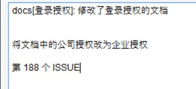

很明显，这种写法会很麻烦，所以接下来将使用 **Commitizen** 助你规范化提交代码

### Commitizen助你规范化提交代码

在上一小节我们讲述了 [约定式提交规范](https://www.conventionalcommits.org/zh-hans/v1.0.0/) ，我们知道如果严格安装 **约定式提交规范**， 来手动进行代码提交的话，那么是一件非常痛苦的事情，但是 **git 提交规范的处理** 又势在必行，那么怎么办呢？

你遇到的问题，也是其他人所遇到的！

经过了很多人的冥思苦想，就出现了一种叫做 **git 提交规范化工具** 的东西，而我们要学习的 `commitizen` 就是其中的佼佼者！

`commitizen` 仓库名为 [cz-cli](https://github.com/commitizen/cz-cli) ，它提供了一个 `git cz` 的指令用于代替 `git commit`，简单一句话介绍它：

> 当你使用 `commitizen` 进行代码提交（git commit）时，`commitizen` 会提交你在提交时填写所有必需的提交字段！

1. 全局安装`Commitizen`

   ```js
   npm install -g commitizen@4.2.4
   ```

2. 安装并配置 `cz-customizable` 插件

   1. 使用 `npm` 下载 `cz-customizable`

      ```node
      npm i cz-customizable@6.3.0 --save-dev
      ```

   2. 添加以下配置到 `package.json ` 中

      ```json
      ...
        "config": {
          "commitizen": {
            "path": "node_modules/cz-customizable"
          }
        }
      ```

3. 项目根目录下创建 `.cz-config.js` 自定义提示文件

   ```js
   module.exports = {
     // 可选类型
     types: [
       { value: 'feat', name: 'feat:     新功能' },
       { value: 'fix', name: 'fix:      修复' },
       { value: 'docs', name: 'docs:     文档变更' },
       { value: 'style', name: 'style:    代码格式(不影响代码运行的变动)' },
       {
         value: 'refactor',
         name: 'refactor: 重构(既不是增加feature，也不是修复bug)'
       },
       { value: 'perf', name: 'perf:     性能优化' },
       { value: 'test', name: 'test:     增加测试' },
       { value: 'chore', name: 'chore:    构建过程或辅助工具的变动' },
       { value: 'revert', name: 'revert:   回退' },
       { value: 'build', name: 'build:    打包' }
     ],
     // 消息步骤
     messages: {
       type: '请选择提交类型:',
       customScope: '请输入修改范围(可选):',
       subject: '请简要描述提交(必填):',
       body: '请输入详细描述(可选):',
       footer: '请输入要关闭的issue(可选):',
       confirmCommit: '确认使用以上信息提交？(y/n/e/h)'
     },
     // 跳过问题
     skipQuestions: ['body', 'footer'],
     // subject文字长度默认是72
     subjectLimit: 72
   }
   ```

4. 使用 `git cz` 代替 `git commit`
   使用 `git cz` 代替 `git commit`，即可看到提示内容

那么到这里我们就已经可以使用`git cz` 来代替了 `git commit` 实现了规范化的提交诉求了，但是当前依然存在着一个问题，那就是我们必须要通过 `git cz` 指令才可以完成规范化提交！

可是有可能我们会忘记使用 **`git cz`** 进行提交操作。那么如何避免这种情况发生呢？此时就需要用到 **git hook**

### 什么是 Git Hooks

上一小节中我们使用了 `git cz` 来代替了 `git commit` 实现了规范化的提交诉求，但是依然存在着有人会忘记使用的问题。

那么这一小节我们就来看一下这样的问题，我们应该如何去进行解决。

先来明确一下我们最终要实现的效果：

> 我们希望：
>
> 当《提交描述信息》不符合 [约定式提交规范](https://www.conventionalcommits.org/zh-hans/v1.0.0/) 的时候，阻止当前的提交，并抛出对应的错误提示

而要实现这个目的，我们就需要先来了解一个概念，叫做 `Git hooks（git 钩子 || git 回调方法）` 

也就是：**`git` 在执行某个事件之前或之后进行一些其他额外的操作**

而我们所期望的 **阻止不合规的提交消息**，那么就需要使用到 `hooks` 的钩子函数。

下面是我整理出来的所有的 `hooks` ，大家可以进行一下参考，其中加粗的是常用到的 `hooks`：

| Git Hook              | 调用时机                                                     | 说明                                                         |
| :-------------------- | ------------------------------------------------------------ | ------------------------------------------------------------ |
| pre-applypatch        | `git am`执行前                                               |                                                              |
| applypatch-msg        | `git am`执行前                                               |                                                              |
| post-applypatch       | `git am`执行后                                               | 不影响`git am`的结果                                         |
| **pre-commit**        | `git commit`执行前                                           | 可以用`git commit --no-verify`绕过                           |
| **commit-msg**        | `git commit`执行前                                           | 可以用`git commit --no-verify`绕过                           |
| post-commit           | `git commit`执行后                                           | 不影响`git commit`的结果                                     |
| pre-merge-commit      | `git merge`执行前                                            | 可以用`git merge --no-verify`绕过。                          |
| prepare-commit-msg    | `git commit`执行后，编辑器打开之前                           |                                                              |
| pre-rebase            | `git rebase`执行前                                           |                                                              |
| post-checkout         | `git checkout`或`git switch`执行后                           | 如果不使用`--no-checkout`参数，则在`git clone`之后也会执行。 |
| post-merge            | `git commit`执行后                                           | 在执行`git pull`时也会被调用                                 |
| pre-push              | `git push`执行前                                             |                                                              |
| pre-receive           | `git-receive-pack`执行前                                     |                                                              |
| update                |                                                              |                                                              |
| post-receive          | `git-receive-pack`执行后                                     | 不影响`git-receive-pack`的结果                               |
| post-update           | 当 `git-receive-pack`对 `git push` 作出反应并更新仓库中的引用时 |                                                              |
| push-to-checkout      | 当``git-receive-pack`对`git push`做出反应并更新仓库中的引用时，以及当推送试图更新当前被签出的分支且`receive.denyCurrentBranch`配置被设置为`updateInstead`时 |                                                              |
| pre-auto-gc           | `git gc --auto`执行前                                        |                                                              |
| post-rewrite          | 执行`git commit --amend`或`git rebase`时                     |                                                              |
| sendemail-validate    | `git send-email`执行前                                       |                                                              |
| fsmonitor-watchman    | 配置`core.fsmonitor`被设置为`.git/hooks/fsmonitor-watchman`或`.git/hooks/fsmonitor-watchmanv2`时 |                                                              |
| p4-pre-submit         | `git-p4 submit`执行前                                        | 可以用`git-p4 submit --no-verify`绕过                        |
| p4-prepare-changelist | `git-p4 submit`执行后，编辑器启动前                          | 可以用`git-p4 submit --no-verify`绕过                        |
| p4-changelist         | `git-p4 submit`执行并编辑完`changelist message`后            | 可以用`git-p4 submit --no-verify`绕过                        |
| p4-post-changelist    | `git-p4 submit`执行后                                        |                                                              |
| post-index-change     | 索引被写入到`read-cache.c do_write_locked_index`后           |                                                              |

PS：详细的 `HOOKS介绍` 可点击[这里](https://git-scm.com/docs/githooks)查看

整体的 `hooks` 非常多，当时我们其中用的比较多的其实只有两个：

| Git Hook       | 调用时机                                                     | 说明                               |
| :------------- | ------------------------------------------------------------ | ---------------------------------- |
| **pre-commit** | `git commit`执行前<br />它不接受任何参数，并且在获取提交日志消息并进行提交之前被调用。脚本`git commit`以非零状态退出会导致命令在创建提交之前中止。 | 可以用`git commit --no-verify`绕过 |
| **commit-msg** | `git commit`执行前<br />可用于将消息规范化为某种项目标准格式。<br />还可用于在检查消息文件后拒绝提交。 | 可以用`git commit --no-verify`绕过 |

简单来说这两个钩子：

1. `commit-msg`：可以用来规范化标准格式，并且可以按需指定是否要拒绝本次提交
2. `pre-commit`：会在提交前被调用，并且可以按需指定是否要拒绝本次提交

而我们接下来要做的关键，就在这两个钩子上面。

### 使用 husky + commitlint 检查提交描述是否符合规范要求

在上一小节中，我们了解了 `git hooks` 的概念，那么接下来我们就使用 `git hooks` 来去校验我们的提交信息。

要完成这么个目标，那么我们需要使用两个工具：

1. [commitlint](https://github.com/conventional-changelog/commitlint)：用于检查提交信息

2. [husky](https://github.com/typicode/husky)：是`git hooks`工具

注意：**`npm` 需要在 7.x 以上版本！！！！！**

那么下面我们分别来去安装一下这两个工具：

#### commitlint

1. 安装依赖：

   ```
   npm install --save-dev @commitlint/config-conventional@12.1.4 @commitlint/cli@12.1.4
   ```

2. 创建 `commitlint.config.js` 文件

   ```
   echo "module.exports = {extends: ['@commitlint/config-conventional']}" > commitlint.config.js
   ```

3. 打开 `commitlint.config.js` ， 增加配置项（ [config-conventional 默认配置点击可查看](https://github.com/conventional-changelog/commitlint/blob/master/@commitlint/config-conventional/index.js) ）：

   ```js
   module.exports = {
     // 继承的规则
     extends: ['@commitlint/config-conventional'],
     // 定义规则类型
     rules: {
       // type 类型定义，表示 git 提交的 type 必须在以下类型范围内
       'type-enum': [
         2,
         'always',
         [
           'feat', // 新功能 feature
           'fix', // 修复 bug
           'docs', // 文档注释
           'style', // 代码格式(不影响代码运行的变动)
           'refactor', // 重构(既不增加新功能，也不是修复bug)
           'perf', // 性能优化
           'test', // 增加测试
           'chore', // 构建过程或辅助工具的变动
           'revert', // 回退
           'build' // 打包
         ]
       ],
       // subject 大小写不做校验
       'subject-case': [0]
     }
   }
   
   ```

**注意：确保保存为 `UTF-8` 的编码格式**，否则可能会出现以下错误：

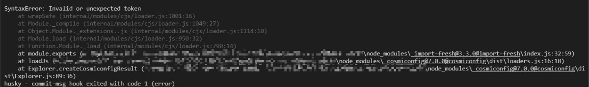

接下来我们来安装 `husky`

#### husky

1. 安装依赖：

   ```
   npm install husky@7.0.1 --save-dev
   ```

2. 启动 `hooks` ， 生成 `.husky` 文件夹

   ```
   npx husky install
   ```

   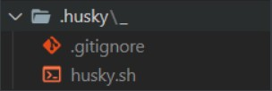

3. 在 `package.json` 中生成 `prepare` 指令（ **需要 npm > 7.0 版本** ）

   ```
   npm set-script prepare "husky install"
   ```

   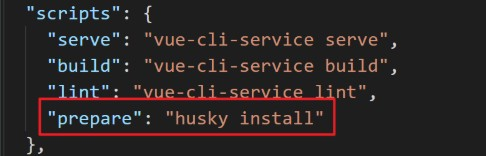

4. 执行 `prepare` 指令

   ```
   npm run prepare
   ```

5. 执行成功，提示
   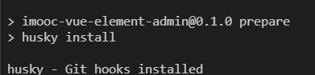

6. 添加 `commitlint` 的 `hook` 到 `husky`中，并指令在 `commit-msg` 的 `hooks` 下执行 `npx --no-install commitlint --edit "$1"` 指令

   ```
   npx husky add .husky/commit-msg "npx --no-install commitlint --edit '$1'"
   ```

   <div class="warning">

   > 此处需要注意，当我们把命令最后的 cmd 语句用单引号包裹时，虽然能生成 commit-msg 文件，但是由于 '$1' 是用 单引号包裹，所以会报错，我们需要在 commit-msg 中将其改为 双引号。

   </div>

   

7. 此时的 `.husky` 的文件结构
   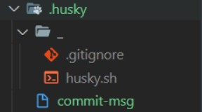

至此， 不符合规范的 commit 将不再可提交：

```
PS F:\xxxxxxxxxxxxxxxxxxxxx\imooc-admin> git commit -m "测试"
⧗   input: 测试
✖   subject may not be empty [subject-empty]
✖   type may not be empty [type-empty]

✖   found 2 problems, 0 warnings
ⓘ   Get help: https://github.com/conventional-changelog/commitlint/#what-is-commitlint

husky - commit-msg hook exited with code 1 (error)
```


那么至此，我们就已经可以处理好了 **强制规范化的提交要求**，到现在 **不符合规范的提交信息，将不可在被提交！**

那么到这里我们的 **规范化目标** 就完成了吗？

当然没有！

现在我们还缺少一个 **规范化的处理** ，那就是 **代码格式提交规范处理！**

### 通过 pre-commit 检测提交时代码规范

在 **`ESLint` 与 `Prettier` 配合解决代码格式问题** 的章节中，我们讲解了如何处理 **本地！代码格式问题。**

但是这样的一个格式处理问题，他只能够在本地进行处理，并且我们还需要 **手动在  `VSCode` 中配置自动保存** 才可以。那么这样就会存在一个问题，要是有人忘记配置这个东西了怎么办呢？他把代码写的乱七八糟的直接就提交了怎么办呢？

所以我们就需要有一种方式来规避这种风险。

那么想要完成这么一个操作就需要使用 `husky` 配合 `eslint` 才可以实现。

我们期望通过 **`husky` 监测 `pre-commit` 钩子，在该钩子下执行 `npx eslint --ext .js,.vue src`** 指令来去进行相关检测：

1. 执行 `npx husky add .husky/pre-commit   "npx eslint --ext .js,.vue src"` 添加 `commit` 时的 `hook` （`npx eslint --ext .js,.vue src` 会在执行到该 hook 时运行）

2. 该操作会生成对应文件 `pre-commit`：
   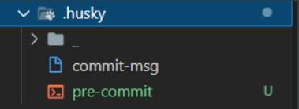

3. 关闭 `VSCode` 的自动保存操作

4. 修改一处代码，使其不符合 `ESLint` 校验规则

5. 执行 **提交操作** 会发现，抛出一系列的错误，代码无法提交

   ```
   PS F:\xxxxxxxxxxxxxxxxxxx\imooc-admin> git commit -m 'test'
   
   F:\xxxxxxxxxxxxxxxx\imooc-admin\src\views\Home.vue
     13:9  error  Strings must use singlequote  quotes
   
   ✖ 1 problem (1 error, 0 warnings)
     1 error and 0 warnings potentially fixable with the `--fix` option.
   
   husky - pre-commit hook exited with code 1 (error)
   ```

   

6. 想要提交代码，必须处理完成所有的错误信息

### lint-staged 自动修复格式错误

在上一章中我们通过 `pre-commit` 处理了 **检测代码的提交规范问题，当我们进行代码提交时，会检测所有的代码格式规范** 。

但是这样会存在两个问题：

1. 我们只修改了个别的文件，没有必要检测所有的文件代码格式
2. 它只能给我们提示出对应的错误，我们还需要手动的进行代码修改

那么这一小节，我们就需要处理这两个问题

那么想要处理这两个问题，就需要使用另外一个插件 [lint-staged](https://github.com/okonet/lint-staged) ！

[lint-staged](https://github.com/okonet/lint-staged) 可以让你当前的代码检查 **只检查本次修改更新的代码，并在出现错误的时候，自动修复并且推送**

[lint-staged](https://github.com/okonet/lint-staged) 无需单独安装，我们生成项目时，`vue-cli` 已经帮助我们安装过了，所以我们直接使用就可以了

1. 修改 `package.json` 配置

   ```js
   "lint-staged": {
       "src/**/*.{js,vue}": [
         "eslint --fix",
         "git add"
       ]
     }
   ```

2. 如上配置，每次它只会在你本地 `commit` 之前，校验你提交的内容是否符合你本地配置的 `eslint`规则(这个见文档 [ESLint](https://panjiachen.github.io/vue-element-admin-site/zh/guide/advanced/eslint.html) )，校验会出现两种结果：

   1. 如果符合规则：则会提交成功。
   2. 如果不符合规则：它会自动执行 `eslint --fix` 尝试帮你自动修复，如果修复成功则会帮你把修复好的代码提交，如果失败，则会提示你错误，让你修好这个错误之后才能允许你提交代码。

3. 修改 `.husky/pre-commit` 文件

   ```js
   #!/bin/sh
   . "$(dirname "$0")/_/husky.sh"
   
   npx lint-staged
   ```

4. 再次执行提交代码

5. 发现 **暂存区中** 不符合 `ESlint` 的内容，被自动修复

### 关于 `vetur` 检测 `template` 的单一根元素的问题

在 `vue2` 中，`template` 只允许存在一个根元素，但是这种情况在 `vue3` 里发生了一些变化。

在 `Vue3` 中开始支持 `template` 存在多个根元素了。但是因为 `VSCode` 中的一些插件没有及时更新，所以当你在 `template` 中写入多个根元素时，有可能会出现以下的错误：

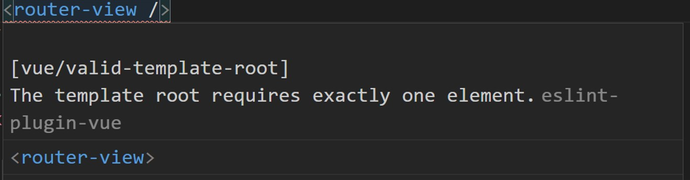

出现这个问题的原因主要是： `vetur` 这个 `vsCode` 插件依然按照 `vue2` 的单一根元素逻辑进行检测，所以会出现提示错误的问题。

但是大家要注意，虽然这样不太好看，但是 **该问题并不影响代码运行！**

如果你实在觉得这样太丑的话，那么可以通过以下方案来 **取消 `vetur` 对 `template` 的检测：** 

1. 在 `VSCode`  的设置中，搜索 `vetur`，找到如下设置，取消勾选

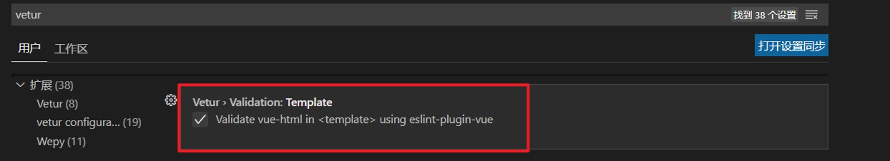

2. 重启 `VSCode`

按以上两种方式执行之后，你的多根元素就不会出现不好看的错误了。


## 项目架构之搭建登录架构解决方案与实现

### vue3 项目结构解析

想要进行项目的开发，那么首先我们需要先去了解一下 `vue3` 项目的初始结构

在这里我们把它和 `vue2` 的项目进行对比来去说明

1. `main.js`
   1. 通过 **按需导入**的 `createApp` 方法来来构建 `vue` 实例
   2. 通过 `vue实例.use` 方法来挂载插件（`router`、`vuex`）
   3. 没有了 `Vue` 构造方法，无法再挂载原型
2. `App.vue`
   1. 组件内部结构无变化，依然是
      1. `tempalte`
      2. `script`
      3. `style`
   2. `<template>` 标签中支持多个根标签
3. `store/index.js`
   1. 通过 **按需导入**的 `createStore` 方法来来构建 `store` 实例
   2. 无需再通过 `Vue.use(Vuex)` 的形式进行挂载
4. `router/index.js`
   1. 通过 **按需导入**的 `createRouter` 方法来构建 `router` 实例
   2. 通过 **按需导入**的 `createWebHashHistory` 方法来创建 **`hash` 模式对象**，进行路由模式指定
   3. 无需再通过 `Vue.use(VueRouter)` 的形式进行挂载
   4. `routes` 路由表的定义无差别

综上所述，在 `vue3` 的初始化项目中，与 `vue2` 对比的最大差异其实就是两点：

1. `vue3` 使用 **按需导入的形式** 进行初始化操作
2. `<template>` 标签中支持多个根标签

### 初始化项目结构

`@vue/cli` 在帮助我们创建项目的同时，也生成了很多无用的代码，那么这一小节我们需要去除掉这些无用的代码。

去除的方式如下所示：

1. `App.vue` 初始化代码如下：

   ```vue
   <template>
     <router-view />
   </template>
   
   <style lang="scss"></style>
   ```

2. 删除 `views` 文件夹下的所有 `.vue` 文件

3. 删除 `components` 文件夹下的所有 `.vue` 文件

4. `router/index.js` 中初始化代码如下：

   ```js
   import { createRouter, createWebHashHistory } from 'vue-router'
   
   const routes = []
   
   const router = createRouter({
     history: createWebHashHistory(),
     routes
   })
   
   export default router
   
   ```

5. 浏览器中重新访问你的应用，得到如下页面即可：

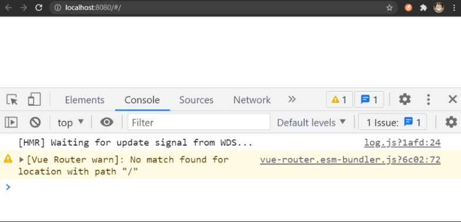

### vue3 新特性介绍

1. `composition API`
2. 使用了 `Proxy` 代替 `Object.defineProperty()` 实现响应式
3. 全新的全家桶
4. 全新的 `TS` 支持
5. `vite`

#### Composition API：组合式 API

想要了解 **组合式 API**，那么首先我们需要先了解 `options API`，也就是 `vue2` 中的开发形式。

`vue2` 中的开发形式被称为 `options API`，`options API` 存在

- 方便
- 易学
- 清晰

等一些特点，但是也存在着一些问题。

而其中最主要的一个问题就是：**当你的组件变得越来越复杂时，组件的可读性会变得越来越差。**

不知道大家有没有遇到过一种情况，那就是：**你在完成一个组件代码时，总是需要不停的上下滚动滚轮，来查看 `data` 、`methods`、`computed` 之间的配合使用，就像下面一样**


在这个动图中我们定义的两个数据 `optionsData` 和 `selectOption`，然后我们在多个方法中都使用到了它们，但是大家可以发现，我们在使用或查看的过程中，得一直不停的翻动页面！

因为我们的整体组件代码结构是这样的：

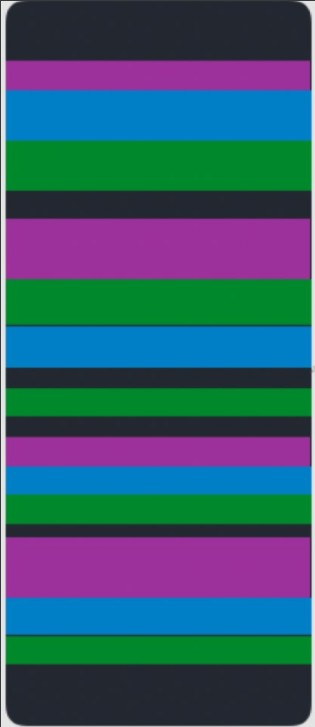

**定义数据与使用数据被分割在组件的各个位置，导致我们需要不断地翻滚页面来查看具体的业务逻辑！**

并且这种现象随着组件越来越复杂，这种情况会变得越来越严重！

而这个就是 `options API` 所存在的问题：**当你的组件变得越来越复杂时，组件的可读性会变得越来越差。**

而 `Composition API` 所期望解决的就是这么一个问题

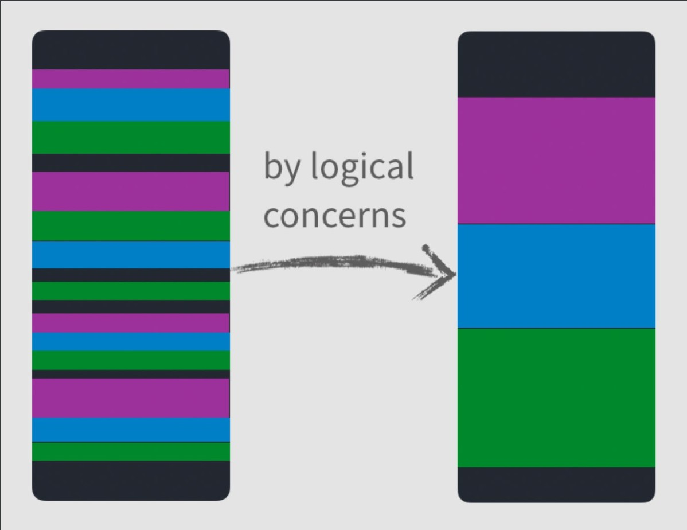

**把定义数据与使用数据的逻辑放在一起进行处理，以达到更加易读，更加方便扩展的目的！**

那么具体怎么去做的，会在后面的小节中通过最新的 `RFC -> script setup` 语法解读。 

#### 使用了 `Proxy` 代替 `Object.defineProperty()` 实现响应式

在 [vue 2 的文档中](https://cn.vuejs.org/v2/guide/reactivity.html#%E6%A3%80%E6%B5%8B%E5%8F%98%E5%8C%96%E7%9A%84%E6%B3%A8%E6%84%8F%E4%BA%8B%E9%A1%B9) 有这么一段话：

> 由于 JavaScript 的限制，Vue **不能检测**数组和对象的变化。

这里所谓的 **`JavaScript` 的限制**，所指的就是 [Object.defineProperty()](https://developer.mozilla.org/zh-CN/docs/Web/JavaScript/Reference/Global_Objects/Object/defineProperty) 的限制。

因为 [Object.defineProperty()](https://developer.mozilla.org/zh-CN/docs/Web/JavaScript/Reference/Global_Objects/Object/defineProperty) 是通过：**为对象属性指定描述符** 的方式来监听 **对象中某个属性的 `get` 和 `set`**。

所以在以下两种情况下，新的属性是 **非响应式的**：

1. [对于对象](https://cn.vuejs.org/v2/guide/reactivity.html#对于对象)：

   ```js
   var vm = new Vue({
     data:{
       a:1
     }
   })
   
   // `vm.a` 是响应式的
   
   vm.b = 2
   // `vm.b` 是非响应式的
   ```

   

2. [对于数组](https://cn.vuejs.org/v2/guide/reactivity.html#对于数组)：

   ```js
   var vm = new Vue({
     data: {
       items: ['a', 'b', 'c']
     }
   })
   vm.items[1] = 'x' // 不是响应性的
   vm.items.length = 2 // 不是响应性的
   ```

这也是为什么会存在 [Vue.set](https://cn.vuejs.org/v2/api/#Vue-set) 这个 `API` 的原因。

但是，这样的一种情况其实一直都是不合理的，因为这只是无意义的增加了复杂度而已，但是一直以来因为  [Object.defineProperty()](https://developer.mozilla.org/zh-CN/docs/Web/JavaScript/Reference/Global_Objects/Object/defineProperty) 这个 `API` 本身的限制，所以一直无法处理。

直到 [Proxy](https://developer.mozilla.org/zh-CN/docs/Web/JavaScript/Reference/Global_Objects/Proxy) 被广泛支持，这种情况才发生了变化。

[Proxy](https://developer.mozilla.org/zh-CN/docs/Web/JavaScript/Reference/Global_Objects/Proxy) 用于：**为对象创建一个代理，从而实现基本操作的拦截。** 那么这样就从根本上解决了 [Object.defineProperty()](https://developer.mozilla.org/zh-CN/docs/Web/JavaScript/Reference/Global_Objects/Object/defineProperty) 所面临的那么两个问题。这也是为什么 `vue3` 中不再有 `Vue.set` 方法的原因。

关于 `proxy` 的详细介绍，可以查看这一篇博客 [Vue 3 深入响应式原理 - 聊一聊响应式构建的那些经历](https://www.imooc.com/article/320582)

#### 全新的全家桶

`vue` 被称为是 **渐进式框架**，就是因为，对于 `vue` 而言，它不仅仅只有 `vue.js` 这一个核心库，还有其他的比如 [vue-router](https://next.router.vuejs.org/zh/)，[vuex](https://next.vuex.vuejs.org/zh/index.html) 等一些周边库。这些周边库和 `vue.js` 一起共同组成了 `vue` 。

所以说当 `vue3` 发布之后，`vue-router`、`vuex` 等全家桶也迎来了一波更新。

#### 全新的 `TS` 支持

`vue 3` 使用 `TypeScript` 进行了重构，其目的是 **为了防止随着应用的增长，而产生的许多潜在的运行时静态类型的错误** 。同时这也意味着以后在 `vue` 中使用 `TypeScript` 不再需要其他的任何工具。

但是有一点需要提醒注意，虽然 `vue` 对 `TypeScript` 进行全面支持，这并不代表我们应该在任何情况下都**无条件**的使用 `TypeScript`（后面我们简称 `TypeScript` 为 `TS`）。

`TS` 的优势主要在于 **静态类型检查和环境声明**，但同时它也会为你的项目增加复杂度。如果你的项目需要使用到以上两点，那么我推荐你使用 `TS` 。否则只是增加了无谓的复杂度而已。

**决定我们应该使用哪种技术的唯一条件，就是我们的目标。** 我们需要做的是在可以 **完成目标** 的基础上，寻找最简单的实现方案。

所以，基于以上原因，项目中并**没有**使用 `TS` 进行项目的开发。

#### vite

最后就是一个新的打包工具 [vite](https://cn.vitejs.dev/)，[vite](https://cn.vitejs.dev/) 严格来说不能算是 `vue3` 的内容，只不过它跟随 `vue3` 进行了发布所以我们这里就把它算到了新特性里面。

[vite](https://cn.vitejs.dev/) 的作用其实和 [webpack](https://webpack.docschina.org/) 是一样的，都是一个 **前端构建工具**。它区别于 `webpack` 的地方在于它完全使用了 `ES Module` 的特性，可以无需预先打包，而是采用实时编译的方式。这样让它具备了远高于 `webpack` 的启动速度和热更新速度。

但是 **成也萧何，败也萧何** 因为 `vite` 完全依赖 `ES Module` 就导致了 它无法直接对 `commonJS` 的模块化方式进行支持，必须得采用 [依赖预构建](https://cn.vitejs.dev/guide/dep-pre-bundling.html) 的形式。

目前 `vite` 还不够稳定到足够支持商用，所以如果大家只是想要尝鲜，那么没有问题。如果大家希望创建一个商用的大型项目，那么个人还是推荐更加成熟的 `webpack` 方案。

而我们当前的项目旨在构建一个 **后台前端解决方案系统**，所以我们这里依然选择了 `webpack` ，而不是 `vite`。

### 全新的提案语法：script setup  

如果大家使用过 早期的 `composition API` ，那么应该会对 `setup 函数` 感触颇深，它的语法是反人类的。

所以在  `vue3` 正式发布 40天 之后， 也就是 `2020年10月28日` （`vue3` 正式发布日期为 `2020年9月18日`）提出了新的 [script  setup](https://github.com/vuejs/rfcs/blob/master/active-rfcs/0040-script-setup.md) 提案，该提案的目的只有一个：**那就是让大家可以更爽的使用 `composition API` 语法**！

该提案在 `2021年8月9日` 正式定稿，并伴随着最新的 `vue3` 版本进行了发布，这也是为什么前面我们需要升级到最新的 `vue` 版本的原因。

下面两张截图为对比 `原setup函数`  与   `script setup`：

1. `原 setup`函数
   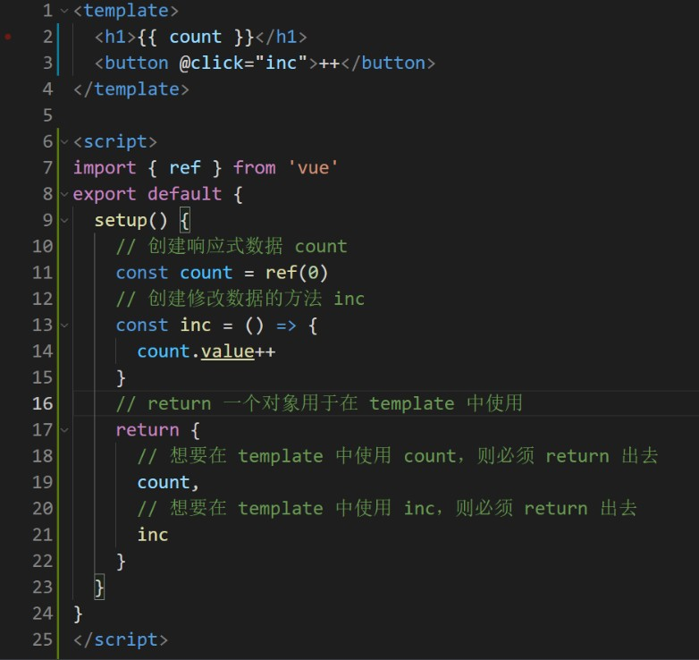
2. `script setup`
   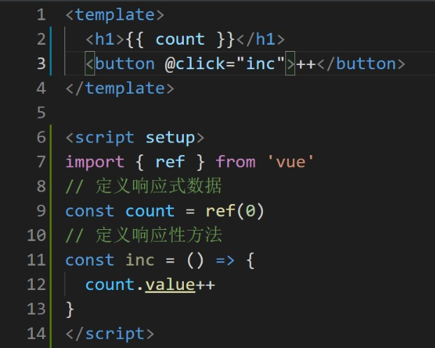

从截图中可以看出 `script setup` 语法更加符合我们开发者书写 `JS` 代码的习惯，它让我们书写 `vue` 就像再写普通的 `js` 一样。

所以以后的 `composition API` 将是 `script setup` 语法的时代，`原setup函数` 将会逐渐退出历史舞台。

而我们的项目也将会全部使用最新的 `script setup` 语法。

### 导入 element-plus 

在开发我们的项目之前，我们需要先去导入 `element-ui` 的 `vue3` 支持版本，也就是 [element-plus](http://element-plus.org/#/zh-CN)

`element-plus` 提供了快捷导入的方式，即：[vue-cli-plugin-element-plus](https://github.com/element-plus/vue-cli-plugin-element-plus)，大家可以通过以下方式来快捷导入 `element-plus` （注意：此种方式会自动修改 `App.vue` 文件）：

1. 在通过 `vue-cli` 创建的项目中，执行 

   ```
   vue add element-plus
   ```

2. 选择全局导入
   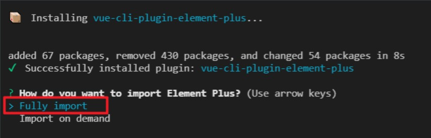

3. 暂不生成覆盖变量的 `scss` 文件
   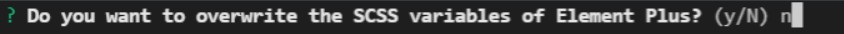

4. 选择简体中文即可
   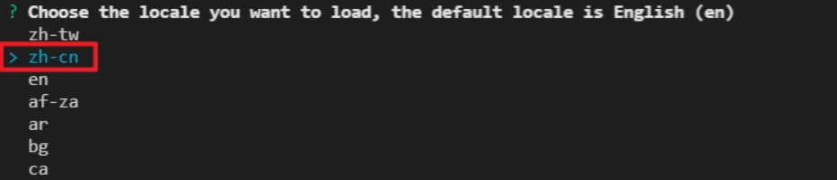

5. 出现该提示表示安装完成
   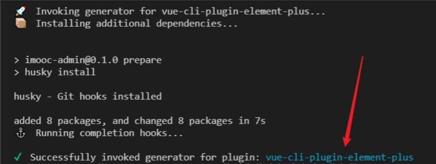

6. 此时运行项目，则会得到如下错误
   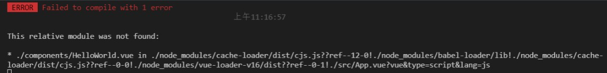

7. 出现该错误的原因是因为 [vue-cli-plugin-element-plus](https://github.com/element-plus/vue-cli-plugin-element-plus) 默认修改了 `APP.vue` 文件，导入了 `HelloWorld`

8. 所以我们需要到 `APP.vue` 中，初始化如下代码：

   ```vue
   <template>
     <router-view />
   </template>
   
   <script>
   export default {
     name: 'App'
   }
   </script>
   
   <style></style>
   ```


### 构建登录页面 UI 结构

1. 在 `views` 中 `login` 文件夹，创建 `index.vue` 文件
   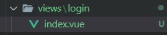

2. 在 `router/index.js` 中增加以下路由配置

   ```js
   /**
    * 公开路由表
    */
   const publicRoutes = [
     {
       path: '/login',
       component: () => import('@/views/login/index')
     }
   ]
   
   const router = createRouter({
     history: createWebHashHistory(),
     routes: publicRoutes
   })
   ```

3. 在 `login/index.vue` 中，生成基本页面结构

   ```vue
   <template>
     <div class=""></div>
   </template>
   
   <script setup>
   import {} from 'vue'
   </script>
   
   <style lang="scss" scoped></style>
   ```

4. 创建登录页面基本结构

   ```vue
   <template>
     <div class="login-container">
       <el-form class="login-form" >
         <div class="title-container">
           <h3 class="title">用户登录</h3>
         </div>
   
         <el-form-item prop="username">
           <span class="svg-container">
             <el-icon>
               <avatar />
             </el-icon>
           </span>
           <el-input
             placeholder="username"
             name="username"
             type="text"
           />
         </el-form-item>
   
         <el-form-item prop="password">
           <span class="svg-container">
             <el-icon>
               <avatar />
             </el-icon>
           </span>
           <el-input
             placeholder="password"
             name="password"
           />
           <span class="show-pwd">
             <el-icon>
               <avatar />
             </el-icon>
           </span>
         </el-form-item>
   
         <el-button type="primary" style="width: 100%; margin-bottom: 30px"
           >登录</el-button
         >
       </el-form>
     </div>
   </template>
   
   <script setup>
   // 导入组件之后无需注册可直接使用
   import { Avatar } from '@element-plus/icons'
   import {} from 'vue'
   </script>
   ```

   

### 美化登录页面样式

1. 创建全局的 `style` 

   1. 在 `src` 下创建 `styles/index.scss` 文件，并写入以下内容：

      ```scss
      html,
      body {
        height: 100%;
        margin: 0;
        padding: 0;
        -moz-osx-font-smoothing: grayscale;
        -webkit-font-smoothing: antialiased;
        text-rendering: optimizeLegibility;
        font-family: Helvetica Neue, Helvetica, PingFang SC, Hiragino Sans GB,
          Microsoft YaHei, Arial, sans-serif;
      }
      
      #app {
        height: 100%;
      }
      
      *,
      *:before,
      *:after {
        box-sizing: inherit;
        margin: 0;
        padding: 0;
      }
      
      a:focus,
      a:active {
        outline: none;
      }
      
      a,
      a:focus,
      a:hover {
        cursor: pointer;
        color: inherit;
        text-decoration: none;
      }
      
      div:focus {
        outline: none;
      }
      
      .clearfix {
        &:after {
          visibility: hidden;
          display: block;
          font-size: 0;
          content: ' ';
          clear: both;
          height: 0;
        }
      }
      
      ```

   2. 在 `main.js` 中导入全局样式

      ```js
      ...
      // 导入全局样式
      import './styles/index.scss'
      ...
      ```

      

   3. 在 `views/login/index.vue` 中写入以下样式

      ```vue
      <style lang="scss" scoped>
      $bg: #2d3a4b;
      $dark_gray: #889aa4;
      $light_gray: #eee;
      $cursor: #fff;
      
      .login-container {
        min-height: 100%;
        width: 100%;
        background-color: $bg;
        overflow: hidden;
      
        .login-form {
          position: relative;
          width: 520px;
          max-width: 100%;
          padding: 160px 35px 0;
          margin: 0 auto;
          overflow: hidden;
      
          ::v-deep .el-form-item {
            border: 1px solid rgba(255, 255, 255, 0.1);
            background: rgba(0, 0, 0, 0.1);
            border-radius: 5px;
            color: #454545;
          }
      
          ::v-deep .el-input {
            display: inline-block;
            height: 47px;
            width: 85%;
      
            input {
              background: transparent;
              border: 0px;
              -webkit-appearance: none;
              border-radius: 0px;
              padding: 12px 5px 12px 15px;
              color: $light_gray;
              height: 47px;
              caret-color: $cursor;
            }
          }
        }
      
      
        .svg-container {
          padding: 6px 5px 6px 15px;
          color: $dark_gray;
          vertical-align: middle;
          display: inline-block;
        }
      
        .title-container {
          position: relative;
      
          .title {
            font-size: 26px;
            color: $light_gray;
            margin: 0px auto 40px auto;
            text-align: center;
            font-weight: bold;
          }
        }
      
        .show-pwd {
          position: absolute;
          right: 10px;
          top: 7px;
          font-size: 16px;
          color: $dark_gray;
          cursor: pointer;
          user-select: none;
        }
      }
      </style>
      ```


### Icon 图标处理方案：SvgIcon

在上一小节中我们完成了登陆页面的基本样式 。但是现在在登录页面中，还存在着最后一个样式问题，那就是 `icon` 图标。

在我们的项目中所使用的 `icon` 图标，一共分为两类：

1. `element-plus` 的图标
2. 自定义的 `svg` 图标

这也是通常情况下企业级项目开发时，所遇到的一种常见情况。

对于 `element-plus` 的图标我们可以直接通过 `el-icon` 来进行显示，但是自定义图标的话，我们暂时还缺少显示的方式，所以说我们需要一个自定义的组件，来显示我们自定义的 `svg` 图标。

那么这种自定义组件处理 **自定义 `svg` 图标的形式**，就是我们在面临这种问题时的通用解决方案。

那么对于这个组件的话，它就需要拥有两种能力：

1. 显示外部 `svg` 图标
2. 显示项目内的 `svg` 图标

基于以上概念，我们可以创建出以下对应代码：

创建 `components/SvgIcon/index.vue`：

```vue
<template>
  <div
    v-if="isExternal"
    :style="styleExternalIcon"
    class="svg-external-icon svg-icon"
    :class="className"
  />
  <svg v-else class="svg-icon" :class="className" aria-hidden="true">
    <use :xlink:href="iconName" />
  </svg>
</template>

<script setup>
import { isExternal as external } from '@/utils/validate'
import { defineProps, computed } from 'vue'
const props = defineProps({
  // icon 图标
  icon: {
    type: String,
    required: true
  },
  // 图标类名
  className: {
    type: String,
    default: ''
  }
})

/**
 * 判断是否为外部图标
 */
const isExternal = computed(() => external(props.icon))
/**
 * 外部图标样式
 */
const styleExternalIcon = computed(() => ({
  mask: `url(${props.icon}) no-repeat 50% 50%`,
  '-webkit-mask': `url(${props.icon}) no-repeat 50% 50%`
}))
/**
 * 项目内图标
 */
const iconName = computed(() => `#icon-${props.icon}`)
</script>

<style scoped>
.svg-icon {
  width: 1em;
  height: 1em;
  vertical-align: -0.15em;
  fill: currentColor;
  overflow: hidden;
}

.svg-external-icon {
  background-color: currentColor;
  mask-size: cover !important;
  display: inline-block;
}
</style>

```

创建 `utils/validate.js`：

```js
/**
 * 判断是否为外部资源
 */
export function isExternal(path) {
  return /^(https?:|mailto:|tel:)/.test(path)
}

```

在 `views/login/index.vue` 中使用 **外部 `svg` （`https://res.lgdsunday.club/user.svg`）：**

```html
<span class="svg-container">
	<svg-icon icon="https://res.lgdsunday.club/user.svg"></svg-icon>
</span>

<script>
import SvgIcon from '@/components/SvgIcon/index.vue'	// 不用注册，便可使用
</script>
```

外部图标可正常展示。

### 处理内部 svg 图标显示

在上一章中，我们创建了 `SvgIcon` 组件用于显示 **非 Element-ui** 的图标。但是目前我们只处理了 **外部 `svg` 的图标展示**，内部的图标还无法展示。

所以这一小节，我们就需要处理 **内部的 `svg` 图标展示。**

1. 首先导入所有的本地 `svg` 图标，导入到 `src -> icons -> svg` 处

2. 在 `icons` 下创建 `index.js` 文件，该文件中需要完成两件事情：

   1. 导入所有的 `svg` 图标
   2. 完成 `SvgIcon` 的全局注册

3. 得出以下代码：

   ``` js
   import SvgIcon from '@/components/SvgIcon'
   
   // https://webpack.docschina.org/guides/dependency-management/#requirecontext
   // 通过 require.context() 函数来创建自己的 context
   const svgRequire = require.context('./svg', false, /\.svg$/)
   // 此时返回一个 require 的函数，可以接受一个 request 的参数，用于 require 的导入。
   // 该函数提供了三个属性，可以通过 require.keys() 获取到所有的 svg 图标
   // 遍历图标，把图标作为 request 传入到 require 导入函数中，完成本地 svg 图标的导入
   svgRequire.keys().forEach(svgIcon => svgRequire(svgIcon))
   
   export default app => {
     app.component('svg-icon', SvgIcon)
   }
   
   ```

4. 在 `main.js` 中引入该文件

   ```js
   ...
   // 导入 svgIcon
   import installIcons from '@/icons'
   ...
   installIcons(app)	// 传入 app，使得全局组件得以注册
   ...
   
   ```

5. 删除 `views/login` 下 局部导入 `SvgIcon` 的代码

6. 在 `login/index.vue` 中使用 `SvgIcon` 引入本地 `svg`

   ```html
   // 用户名   
   <svg-icon icon="user" />
   // 密码
   <svg-icon icon="password" />
   // 眼睛
   <svg-icon icon="eye" />
   ```

7. 此时 **处理内容 `svg` 图标的代码** 已经完成

8. 但此时 svg 图标仍然无法显示，因为 webpack 还未安装配置处理 svg 的loader

### 使用 svg-sprite-loader 处理 svg 图标

[svg-sprite-loader](https://www.npmjs.com/package/svg-sprite-loader) 是 `webpack` 中专门用来处理 `svg` 图标的一个 `loader` ，在上一节中我们的图标之所有没有展示，就是因为我们缺少该 `loader`。

那么想要使用该 `loader` 我们需要做两件事情：

1. 下载该 `laoder`，执行：`npm i --save-dev svg-sprite-loader@6.0.9`

2. 创建 `vue.config.js` 文件，新增如下配置：

   ```js
   const path = require('path')
   function resolve(dir) {
     return path.join(__dirname, dir)
   }
   // https://cli.vuejs.org/zh/guide/webpack.html#%E7%AE%80%E5%8D%95%E7%9A%84%E9%85%8D%E7%BD%AE%E6%96%B9%E5%BC%8F
   module.exports = {
     chainWebpack(config) {
       // 设置 svg-sprite-loader
       config.module
           .rule('svg')
           .exclude
             .add(resolve('src/icons'))
             .end() // 删除默认 svg 配置（保证 src/icons 目录下的文件不受原 svg 配置影响）
       config.module
         .rule('icons')
         .test(/\.svg$/)
         .include
           .add(resolve('src/icons')) //添加 src/icons 目录下的文件，使其受 svg-aprite-loader 影响
         	.end()
         .use('svg-sprite-loader')
         .loader('svg-sprite-loader')
         .options({
           symbolId: 'icon-[name]'
         })
         .end()
     }
   }
   
   ```

处理完以上配置之后，重新启动项目，图标即可显示！


### Vue3.2 响应式优化对应用层的改变

在处理好了 `SvgIcon` 图标之后，接下来我们就需要处理登陆页面的逻辑问题了。不过在处理这个逻辑之前，我们需要先来明确一点 `vue3` 新的更新内容。

如果大家之前有过了解 `Vue3` 代码的话，那么会知道 `Vue3` 中声明响应式数据的方式有两种：

1. [ref](https://v3.cn.vuejs.org/api/refs-api.html#ref)
2. [reactive](https://v3.cn.vuejs.org/api/basic-reactivity.html#reactive)

对于这两种使用方式而言，它们在应用层上并没有明确的界限，也就是说我们可能很难仅通过官网的介绍来判断我应该在什么情况下使用什么。

但是这种情况在现在已经不存在了。

2020年10月29日，社区大佬 [basvanmeurs](https://github.com/basvanmeurs) 提出了一个新的 [PR](https://github.com/vuejs/vue-next/pull/2345)，大概的意思是说：他重构了响应式的部分内容，大大增加了性能。

详细的介绍如下：

> - Big runtime performance improvement for ref, computed, watch and watchEffect (30%-80% depending on the amount of dependencies)
> - Memory usage decreased by about 30% when creating ref, computed, watch and watchEffect
> - Creation time performance improvement, most notably for watchers and watchEffects
>
> ----------------------
>
> ref、calculated、watch 和 watchEffect 的运行时性能大幅提升（30%-80% 取决于依赖项的数量）
> 创建 ref、calculated、watch 和 watchEffect 时内存使用量减少了约 30%
> 创建时间性能改进，最显著的是 watchers 和 watchEffects

这是一个非常强大的变化，同时又因为这个变化过于庞大，所以一直等待到 `2021年8月5日` 伴随着  [vue 3.2发布](https://blog.vuejs.org/posts/vue-3.2.html)，尤大才合并对应的代码，并在这次变化中对该性能改进进行了如下的介绍：

> - [More efficient ref implementation (~260% faster read / ~50% faster write)](https://github.com/vuejs/vue-next/pull/3995)
> - [~40% faster dependency tracking](https://github.com/vuejs/vue-next/pull/4017)
> - [~17% less memory usage](https://github.com/vuejs/vue-next/pull/4001)
>
> ---------
>
> 更高效的 ref 实现（约 260% 的读取速度/约 50% 的写入速度）
> 依赖项跟踪速度提高约 40%
> 内存使用量减少约 17%

毫无疑问，这绝对是一个伟大的变化。

那么针对于这个变化，在应用层中最大的体现就是 `ref` 这个 `API` ，性能得到了大幅度的提升。

所以说，拥抱新的变化吧！

在之后能使用 `ref` 的地方就使用 `ref` 吧。毕竟现在它的性能得到了大幅的提升！

### 完善登录表单校验

表单校验是表单使用的一个通用能力，在 `element-plus` 中想要为表单进行表单校验那么我们需要关注以下三点：

1. 为 `el-form` 绑定 `model` 属性
2. 为 `el-form` 绑定 `rules` 属性
3. 为 `el-form-item` 绑定 `prop` 属性

保证以上三点即可为 `el-from` 添加表单校验功能。

因为这一块是比较简单的功能，只要有过 `element-ui` 使用经验的同学，应该对这里都不陌生，所以这里就不对这块内容进行过多赘述了。对这里不是很了解的同学可以参考下 [element-plus 中 from 表单部分](https://element-plus.org/#/zh-CN/component/form)

以下为对应的代码实现：

**views/login**

```vue
<template>
  <div class="login-container">
    <el-form class="login-form" :model="loginForm" :rules="loginRules">
      ...
      <el-form-item prop="username">
        ...
        <el-input
         ...
          v-model="loginForm.username"
        />
      </el-form-item>

      <el-form-item prop="password">
        ...
        <el-input
          ...
          v-model="loginForm.password"
        />
        ...
      </el-form-item>
		...
    </el-form>
  </div>
</template>

<script setup>
import { ref } from 'vue'
import { validatePassword } from './rules'

// 数据源
const loginForm = ref({
  username: 'super-admin',
  password: '123456'
})
// 验证规则
const loginRules = ref({
  username: [
    {
      required: true,
      trigger: 'blur',
      message: '用户名为必填项'
    }
  ],
  password: [
    {
      required: true,
      trigger: 'blur',
      validator: validatePassword()
    }
  ]
})
</script>

```

**views/login/rules.js**

```js
export const validatePassword = () => {
  return (rule, value, callback) => {
    if (value.length < 6) {
      callback(new Error('密码不能少于6位'))
    } else {
      callback()
    }
  }
}
```

### 密码框状态通用处理

对于密码框存在两种状态：

1. 密文状态
2. 明文状态

点击 **眼睛** 可以进行切换。

该功能实现为通用的处理方案，只需要动态修改 `input` 的 `type` 类型即可，其中：

1.  `password` 为密文显示
2.  `text` 为明文显示

根据以上理论，即可得出以下代码：

```vue
<template>
  <div class="login-container">
    <el-form class="login-form" :model="loginForm" :rules="loginRules">
      ...
        <el-input
          ...
          :type="passwordType"
        />
        <span class="show-pwd">
          <svg-icon
            :icon="passwordType === 'password' ? 'eye' : 'eye-open'"
            @click="onChangePwdType"
          />
        </span>
      ...
    </el-form>
  </div>
</template>

<script setup>
import { ref } from 'vue'
...

// 处理密码框文本显示状态
const passwordType = ref('password')
const onChangePwdType = () => {
  if (passwordType.value === 'password') {
    passwordType.value = 'text'
  } else {
    passwordType.value = 'password'
  }
}
</script>

```

### 通用后台登录方案解析

处理完了表单的基本操作之后，接下来就是登录操作的实现了。

对于登录操作在后台项目中是一个通用的解决方案，具体可以分为以下几点：

1. 封装 `axios` 模块
2. 封装 接口请求 模块
3. 封装登录请求动作
4. 保存服务端返回的 `token`
5. 登录鉴权

### 配置环境变量封装 axios 模块

首先我们先去完成第一步：封装 `axios` 模块。

在当前这个场景下，我们希望封装出来的 `axios` 模块，至少需要具备一种能力，那就是：**根据当前模式的不同，设定不同的 `BaseUrl`** ，因为通常情况下企业级项目在 **开发状态** 和 **生产状态** 下它的 `baseUrl` 是不同的。

对于 `@vue/cli` 来说，它具备三种不同的模式：

1. `development`
2. `test`
3. `production`

具体可以点击 [这里](https://cli.vuejs.org/zh/guide/mode-and-env.html#%E6%A8%A1%E5%BC%8F) 进行参考。

根据我们前面所提到的 **开发状态和生产状态** 那么此时我们的 `axios` 必须要满足：**在 开发 || 生产 状态下，可以设定不同 `BaseUrl` 的能力**

那么想要解决这个问题，就必须要使用到 `@vue/cli` 所提供的 [环境变量](https://cli.vuejs.org/zh/guide/mode-and-env.html#%E6%A8%A1%E5%BC%8F) 来去进行实现。

我们可以在项目中创建两个文件：

1. `.env.development`
2. `.env.production`

它们分别对应 **开发状态** 和 **生产状态**。

我们可以在上面两个文件中分别写入以下代码：

**`.env.development`**：

```
# 标志
ENV = 'development'

# base api
VUE_APP_BASE_API = '/api'
```

**`.env.production`：**

```
# 标志
ENV = 'production'

# base api
VUE_APP_BASE_API = '/prod-api'
```

有了这两个文件之后，我们就可以创建对应的 `axios` 模块

创建 `utils/request.js` ，写入如下代码：

```js
import axios from 'axios'

const service = axios.create({
  baseURL: process.env.VUE_APP_BASE_API,
  timeout: 5000
})

export default service
```

### 封装请求动作

有了 `axios` 模块之后，接下来我们就可以

1. 封装接口请求模块
2. 封装登录请求动作

**封装接口请求模块：**

创建 `api` 文件夹，创建 `sys.js`：

```js
import request from '@/utils/request'

/**
 * 登录
 */
export const login = data => {
  return request({
    url: '/sys/login',
    method: 'POST',
    data
  })
}
```

**封装登录请求动作：**

该动作我们期望把它封装到 `vuex` 的 `action` 中

在 `store` 下创建 `modules` 文件夹，创建 `user.js` 模块，用于处理所有和 **用户相关** 的内容（此处需要使用第三方包 `md5` ）：

```js
import { login } from '@/api/sys'
import md5 from 'md5'
export default {
  namespaced: true,
  state: () => ({}),
  mutations: {},
  actions: {
    login(context, userInfo) {
      const { username, password } = userInfo
      return new Promise((resolve, reject) => {
        login({
          username,
          password: md5(password)
        })
          .then(data => {
            resolve()
          })
          .catch(err => {
            reject(err)
          })
      })
    }
  }
}
```

在 `store/index` 中完成注册：

```js
import { createStore } from 'vuex'
import user from './modules/user.js'
export default createStore({
  modules: {
    user
  }
})
```


### 登录触发动作

在 `login` 中，触发定义的 `action`

```vue
<template>
	<el-button
        type="primary"
        style="width: 100%; margin-bottom: 30px"
        :loading="loading"
        @click="handleLogin"
        >登录</el-button
      >
</template>
<script setup>
import { ref } from 'vue'
import { validatePassword } from './rules'
import { useStore } from 'vuex'
...

// 登录动作处理
const loading = ref(false)
const loginFromRef = ref(null)
const store = useStore()
const handleLogin = () => {
  loginFromRef.value.validate(valid => {
    if (!valid) return

    loading.value = true
    store
      .dispatch('user/login', loginForm.value)
      .then(() => {
        loading.value = false
        // TODO: 登录后操作
      })
      .catch(err => {
        console.log(err)
        loading.value = false
      })
  })
}
</script>
```

触发之后会得到以下错误：

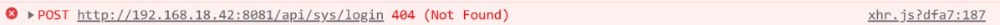

该错误表示，我们当前请求的接口不存在。

出现这个问题的原因，是因为我们在前面配置环境变量时指定了 **开发环境下**，请求的 `BaseUrl` 为 `/api` ，所以我们真实发出的请求为：`/api/sys/login` 。

这样的一个请求会被自动键入到当前前端所在的服务中，所以我们最终就得到了 `http://192.168.18.42:8081/api/sys/login` 这样的一个请求路径。

而想要处理这个问题，那么可以通过指定 [webpack DevServer 代理](https://webpack.docschina.org/configuration/dev-server/) 的形式，代理当前的 `url` 请求。

而指定这个代理非常简单，是一种近乎固定的配置方案。

在 `vue.config.js` 中，加入以下代码：

```js
module.exports = {
  devServer: {
    // 配置反向代理
    proxy: {
      // 当地址中有/api的时候会触发代理机制
      '/api': {
        // 要代理的服务器地址  这里不用写 api
        target: 'https://api.imooc-admin.lgdsunday.club/',
        changeOrigin: true // 是否跨域
      }
    }
  },
  ...
}

```

重新启动服务，再次进行请求，即可得到返回数据

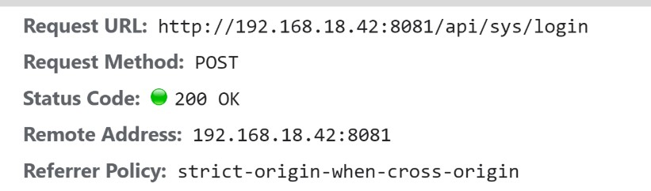

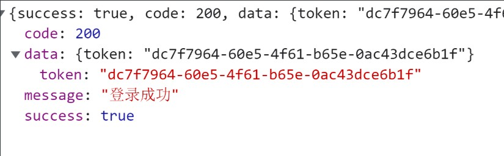

### 本地缓存处理方案

通常情况下，在获取到 `token` 之后，我们会把 `token` 进行缓存，而缓存的方式将会分为两种：

1. 本地缓存：`LocalStorage` 
2. 全局状态管理：`Vuex`

保存在 `LocalStorage` 是为了方便实现 **自动登录功能**

保存在 `vuex` 中是为了后面在其他位置进行使用

那么下面我们就分别来实现对应的缓存方案：

**LocalStorage：**

1. 创建 `utils/storage.js` 文件，封装四个对应方法：

   ```js
   /**
    * 存储数据
    */
   export const setItem = (key, value) => {
     // 将数组、对象类型的数据转化为 JSON 字符串进行存储
     if (typeof value === 'object') {
       value = JSON.stringify(value)
     }
     window.localStorage.setItem(key, value)
   }
   
   /**
    * 获取数据
    */
   export const getItem = key => {
     const data = window.localStorage.getItem(key)
     try {
       return JSON.parse(data)
     } catch (err) {
       return data
     }
   }
   
   /**
    * 删除数据
    */
   export const removeItem = key => {
     window.localStorage.removeItem(key)
   }
   
   /**
    * 删除所有数据
    */
   export const removeAllItem = key => {
     window.localStorage.clear()
   }
   ```

2. 在 `vuex` 的 `user` 模块下，处理 `token` 的保存

   ```js
   import { login } from '@/api/sys'
   import md5 from 'md5'
   import { setItem, getItem } from '@/utils/storage'
   import { TOKEN } from '@/constant'
   export default {
     namespaced: true,
     state: () => ({
       token: getItem(TOKEN) || ''
     }),
     mutations: {
       setToken(state, token) {
         state.token = token
         setItem(TOKEN, token)
       }
     },
     actions: {
       login(context, userInfo) {
         ...
             .then(data => {
               this.commit('user/setToken', data.data.data.token)
               resolve()
             })
             ...
         })
       }
     }
   }
   
   ```

3. 处理保存的过程中，需要创建 `constant` 常量目录 `constant/index.js`

   ```js
   export const TOKEN = 'token'
   ```

此时，当点击登陆时，即可把 `token` 保存至 `vuex` 与  `localStorage` 中

### 响应数据的统一处理

在上一小节中，我们保存了服务端返回的 `token` 。但是有一个地方比较难受，那就是在 `vuex 的 user 模块` 中，我们获取数据端的 `token` 数据，通过 `data.data.data.token` 的形式进行获取。

一路的 `data.` 确实让人比较难受，如果有过 `axios` 拦截器处理经验的同学应该知道，对于这种问题，我们可以通过 [axios 响应拦截器](http://axios-js.com/zh-cn/docs/index.html#%E6%8B%A6%E6%88%AA%E5%99%A8) 进行处理。

在 `utils/request.js` 中实现以下代码：

```js
import axios from 'axios'
import { ElMessage } from 'element-plus'

...
// 响应拦截器
service.interceptors.response.use(
  response => {
    const { success, message, data } = response.data
    //   要根据success的成功与否决定下面的操作
    if (success) {
      return data
    } else {
      // 业务错误
      ElMessage.error(message) // 提示错误消息
      return Promise.reject(new Error(message))
    }
  },
  error => {
    // TODO: 将来处理 token 超时问题
    ElMessage.error(error.message) // 提示错误信息
    return Promise.reject(error)
  }
)

export default service

```

此时，对于 `vuex 中的 user 模块` 就可以进行以下修改了：

```js
this.commit('user/setToken', data.token)
```

### 登录后操作

那么截止到此时，我们距离登录操作还差最后一个功能就是 **登录鉴权** 。

只不过在进行 **登录鉴权** 之前我们得先去创建一个登录后的页面，也就是我们所说的登录后操作。

1. 创建 `layout/index.vue` ，写入以下代码：

   ```vue
   <template>
     <div class="">Layout 页面</div>
   </template>
   
   <script setup>
   import {} from 'vue'
   </script>
   
   <style lang="scss" scoped></style>
   
   ```

2. 在 `router/index` 中，指定对应路由表：

   ```js
   const publicRoutes = [
    ...
     {
       path: '/',
       component: () => import('@/layout/index')
     }
   ]
   ```

3. 在登录成功后，完成跳转

   ```js
   // 登录后操作
   router.push('/')
   ```


### 登录鉴权解决方案

在处理了登陆后操作之后，接下来我们就来看一下最后的一个功能，也就是 **登录鉴权**

首先我们先去对 **登录鉴权** 进行一个定义，什么是  **登录鉴权** 呢？

> 当用户未登陆时，不允许进入除 `login` 之外的其他页面。
>
> 用户登录后，`token` 未过期之前，不允许进入 `login` 页面

而想要实现这个功能，那么最好的方式就是通过 [路由守卫](https://router.vuejs.org/zh/guide/advanced/navigation-guards.html#%E5%85%A8%E5%B1%80%E5%89%8D%E7%BD%AE%E5%AE%88%E5%8D%AB) 来进行实现。

那么明确好了 **登录鉴权** 的概念之后，接下来就可以去实现一下

在 `main.js` 平级，创建 `permission.js` 文件

```js
import router from './router'
import store from './store'

// 白名单
const whiteList = ['/login']
/**
 * 路由前置守卫
 */
router.beforeEach(async (to, from, next) => {
  // 存在 token ，进入主页
  // if (store.state.user.token) {
  // 快捷访问
  if (store.getters.token) {
    if (to.path === '/login') {
      next('/')
    } else {
      next()
    }
  } else {
    // 没有token的情况下，可以进入白名单
    if (whiteList.indexOf(to.path) > -1) {
      next()
    } else {
      next('/login')
    }
  }
})

```

在此处我们使用到了 `vuex 中的 getters` ，此时的 `getters` 被当作 **快捷访问** 的形式进行访问

所以我们需要声明对应的模块，创建 `store/getters`

```js
const getters = {
  token: state => state.user.token
}
export default getters

```

在 `store/index` 中进行导入：

```js
import getters from './getters'
export default createStore({
  getters,
  ...
})

```

在 `main.js` 中进行导入：

```javascript
import './permission.js'
```

## 项目架构之搭建 Layout 架构

### 创建基于 Layout 的基础架构

在本小节我们需要创建基于 `Layout` 的基本架构布局，所以说会涉及到大量的 `CSS` 内容，这些 `CSS` 大部分都是比较基础的可复用的 `CSS` 样式。

那么明确好了之后，我们再来看一下我们 `Layout` 的基本布局结构：

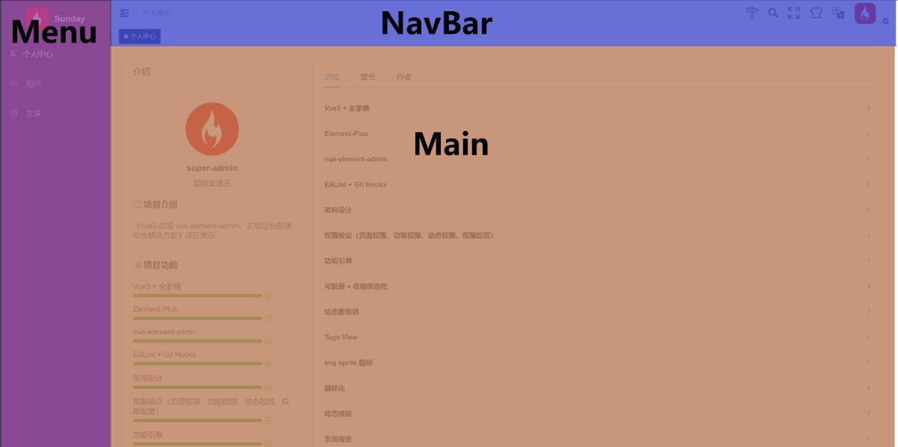

我们知道，当登录完成之后，那么我们会进入到 `Layout` 页面，这个 `Layout` 页面组件位于 `Layout/index.vue` 中，所以说想要实现这样的结构，那么我们就需要到对应的 `layout` 组件中进行。

1. 整个页面分为三部分，所以我们需要先去创建对应的三个组件：

   1. `layout/components/Sidebar/index.vue`
   2. `layout/components/Navbar.vue`
   3. `layout/components/AppMain.vue`

2. 然后在 `layout/index.vue` 中引入这三个组件

   ```vue
   <script setup>
       import Navbar from './components/Navbar'
       import Sidebar from './components/Sidebar'
       import AppMain from './components/AppMain'
   </script>
   ```

3. 完成对应的布局结构

   ```vue
   <template>
     <div class="app-wrapper">
       <!-- 左侧 menu -->
       <sidebar
         id="guide-sidebar"
         class="sidebar-container"
       />
       <div class="main-container">
         <div class="fixed-header">
           <!-- 顶部的 navbar -->
           <navbar />
         </div>
         <!-- 内容区 -->
         <app-main />
       </div>
     </div>
   </template>
   ```

4. 在 `styles` 中创建如下 `css` 文件：

   1. `variables.scss` ： 定义常量
   2. `mixin.scss` ：定义通用的 `css`
   3. `sidebar.scss`：处理 `menu` 菜单的样式

5. 为 `variables.scss` ，定义如下常量并进行导出（ `:export` 可见 [scss 与 js 共享变量](https://www.bluematador.com/blog/how-to-share-variables-between-js-and-sass)）：

   ```scss
   // sidebar
   $menuText: #bfcbd9;
   $menuActiveText: #ffffff;
   $subMenuActiveText: #f4f4f5;
   
   $menuBg: #304156;
   $menuHover: #263445;
   
   $subMenuBg: #1f2d3d;
   $subMenuHover: #001528;
   
   $sideBarWidth: 210px;
   
   // https://www.bluematador.com/blog/how-to-share-variables-between-js-and-sass
   // JS 与 scss 共享变量，在 scss 中通过 :export 进行导出，在 js 中可通过 ESM 进行导入
   :export {
     menuText: $menuText;
     menuActiveText: $menuActiveText;
     subMenuActiveText: $subMenuActiveText;
     menuBg: $menuBg;
     menuHover: $menuHover;
     subMenuBg: $subMenuBg;
     subMenuHover: $subMenuHover;
     sideBarWidth: $sideBarWidth;
   }
   
   ```

6. 为 `mixin.scss` 定义如下样式：

   ```scss
   @mixin clearfix {
     &:after {
       content: '';
       display: table;
       clear: both;
     }
   }
   
   @mixin scrollBar {
     &::-webkit-scrollbar-track-piece {
       background: #d3dce6;
     }
   
     &::-webkit-scrollbar {
       width: 6px;
     }
   
     &::-webkit-scrollbar-thumb {
       background: #99a9bf;
       border-radius: 20px;
     }
   }
   
   @mixin relative {
     position: relative;
     width: 100%;
     height: 100%;
   }
   
   ```

7. 为 `sidebar.scss` 定义如下样式：

   ```scss
   #app {
     .main-container {
       min-height: 100%;
       transition: margin-left 0.28s;
       margin-left: $sideBarWidth;
       position: relative;
     }
   
     .sidebar-container {
       transition: width 0.28s;
       width: $sideBarWidth !important;
       height: 100%;
       position: fixed;
       top: 0;
       bottom: 0;
       left: 0;
       z-index: 1001;
       overflow: hidden;
   
       // 重置 element-plus 的css
       .horizontal-collapse-transition {
         transition: 0s width ease-in-out, 0s padding-left ease-in-out,
           0s padding-right ease-in-out;
       }
   
       .scrollbar-wrapper {
         overflow-x: hidden !important;
       }
   
       .el-scrollbar__bar.is-vertical {
         right: 0px;
       }
   
       .el-scrollbar {
         height: 100%;
       }
   
       &.has-logo {
         .el-scrollbar {
           height: calc(100% - 50px);
         }
       }
   
       .is-horizontal {
         display: none;
       }
   
       a {
         display: inline-block;
         width: 100%;
         overflow: hidden;
       }
   
       .svg-icon {
         margin-right: 16px;
       }
   
       .sub-el-icon {
         margin-right: 12px;
         margin-left: -2px;
       }
   
       .el-menu {
         border: none;
         height: 100%;
         width: 100% !important;
       }
   
       .is-active > .el-submenu__title {
         color: $subMenuActiveText !important;
       }
   
       & .nest-menu .el-submenu > .el-submenu__title,
       & .el-submenu .el-menu-item {
         min-width: $sideBarWidth !important;
       }
     }
   
     .hideSidebar {
       .sidebar-container {
         width: 54px !important;
       }
   
       .main-container {
         margin-left: 54px;
       }
   
       .submenu-title-noDropdown {
         padding: 0 !important;
         position: relative;
   
         .el-tooltip {
           padding: 0 !important;
   
           .svg-icon {
             margin-left: 20px;
           }
   
           .sub-el-icon {
             margin-left: 19px;
           }
         }
       }
   
       .el-submenu {
         overflow: hidden;
   
         & > .el-submenu__title {
           padding: 0 !important;
   
           .svg-icon {
             margin-left: 20px;
           }
   
           .sub-el-icon {
             margin-left: 19px;
           }
   
           .el-submenu__icon-arrow {
             display: none;
           }
         }
       }
   
       .el-menu--collapse {
         .el-submenu {
           & > .el-submenu__title {
             & > span {
               height: 0;
               width: 0;
               overflow: hidden;
               visibility: hidden;
               display: inline-block;
             }
           }
         }
       }
     }
   
     .el-menu--collapse .el-menu .el-submenu {
       min-width: $sideBarWidth !important;
     }
   
     .withoutAnimation {
       .main-container,
       .sidebar-container {
         transition: none;
       }
     }
   }
   
   .el-menu--vertical {
     & > .el-menu {
       .svg-icon {
         margin-right: 16px;
       }
       .sub-el-icon {
         margin-right: 12px;
         margin-left: -2px;
       }
     }
   
     // 菜单项过长时
     > .el-menu--popup {
       max-height: 100vh;
       overflow-y: auto;
   
       &::-webkit-scrollbar-track-piece {
         background: #d3dce6;
       }
   
       &::-webkit-scrollbar {
         width: 6px;
       }
   
       &::-webkit-scrollbar-thumb {
         background: #99a9bf;
         border-radius: 20px;
       }
     }
   }
   
   ```

8. 在 `index.scss` 中按照顺序导入以上样式文件

   ```scss
   @import './variables.scss';
   @import './mixin.scss';
   @import './sidebar.scss';
   ```

9. 在 `layout/index.vue` 中写入如下样式

   ```vue
   <style lang="scss" scoped>
   @import '~@/styles/mixin.scss';
   @import '~@/styles/variables.scss';
   
   .app-wrapper {
     @include clearfix;
     position: relative;
     height: 100%;
     width: 100%;
   }
   
   .fixed-header {
     position: fixed;
     top: 0;
     right: 0;
     z-index: 9;
     width: calc(100% - #{$sideBarWidth});
   }
   </style>
   ```

10. 因为将来要实现 **主题更换**，所以为 `sidebar` 赋值动态的背景颜色

    ```vue
    <template>
    ...
        <!-- 左侧 menu -->
        <sidebar
          class="sidebar-container"
          :style="{ backgroundColor: variables.menuBg }"
        />
    ...
    </template>
    
    <script setup>
    import variables from '@/styles/variables.scss'
    </script>
    ```

11. 为 `Navbar`、`Sidebar`、`AppMain` 组件进行初始化代码

    ```vue
    <template>
      <div class="">{组件名}</div>
    </template>
    
    <script setup>
    import {} from 'vue'
    </script>
    
    <style lang="scss" scoped></style>
    
    ```

12. 至此查看效果为
    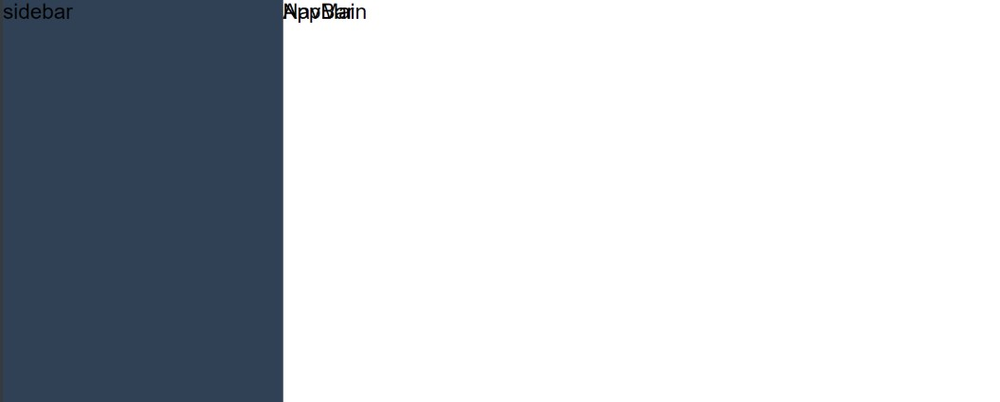

13. 可见 `Navbar` 与 `AppMain` 重叠

14. 为 `AppMain` 进行样式处理

    ```vue
    <template>
      <div class="app-main">AppMain</div>
    </template>
    
    <script setup>
    import {} from 'vue'
    </script>
    
    <style lang="scss" scoped>
    .app-main {
      min-height: calc(100vh - 50px);
      width: 100%;
      position: relative;
      overflow: hidden;
      padding: 61px 20px 20px 20px;
      box-sizing: border-box;
    }
    </style>
    
    ```

15. 查看效果
    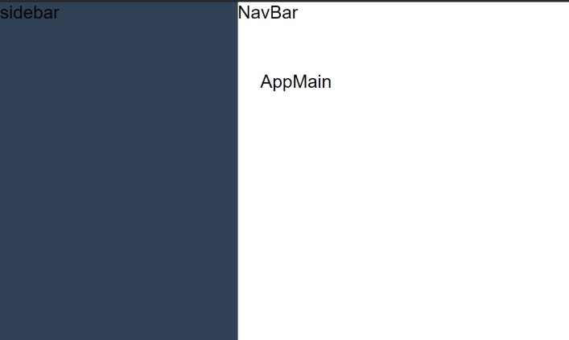

### 获取用户基本信息

处理完了基本的 `Layout` 架构之后，接下来我们实现一下 `navbar` 中的 **头像菜单** 功能
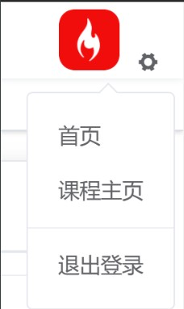

这样的一个功能主要分为三个部分：

1. 获取并展示用户信息
2. `element-plus` 中的 `dropdown` 组件使用
3. 退出登录的方案实现

那么接下来我们就去实现第一部分的功能 **获取并展示用户信息**

**获取并展示用户信息** 我们把它分为三部分进行实现：

1. 定义接口请求方法
2. 定义调用接口的动作
3. 在权限拦截时触发动作

那么接下来我们就根据这三个步骤，分别来进行实现：

**定义接口请求方法：**

在 `api/sys.js` 中定义如下方法：

```js
/**
 * 获取用户信息
 */
export const getUserInfo = () => {
  return request({
    url: '/sys/profile'
  })
}
```

因为获取用户信息需要对应的 `token` ，所以我们可以利用 `axios` 的 **请求拦截器** 对 `token` 进行统一注入，在 `utils/request.js` 中写入如下代码：

```js
import store from '@/store'
// 请求拦截器
service.interceptors.request.use(
  config => {
    // 在这个位置需要统一的去注入token
    if (store.getters.token) {
      // 如果token存在 注入token
      config.headers.Authorization = `Bearer ${store.getters.token}`
    }
    return config // 必须返回配置
  },
  error => {
    return Promise.reject(error)
  }
)
```

**定义调用接口的动作：**

在 `store/modules/user` 中写入以下代码：

```js
import { login, getUserInfo } from '@/api/sys'
...
export default {
  namespaced: true,
  state: () => ({
    ...
    userInfo: {}
  }),
  mutations: {
    ...
    setUserInfo(state, userInfo) {
      state.userInfo = userInfo
    }
  },
  actions: {
    ...
    async getUserInfo(context) {
      const res = await getUserInfo()
      this.commit('user/setUserInfo', res)
      return res
    }
  }
}

```

**在权限拦截时触发动作：**

在 `permission.js` 中写入以下代码：

```js
import store from '@/store' 
if (to.path === '/login') {
      ...
    } else {
      // 判断用户资料是否获取
      // 若不存在用户信息，则需要获取用户信息
      if (!store.getters.hasUserInfo) {
        // 触发获取用户信息的 action
        await store.dispatch('user/getUserInfo')
      }
      next()
    }
  }

```

在 `store/getters.js` 中写入判断用户信息代码：

```js
const getters = {
  ...
  userInfo: state => state.user.userInfo,
  /**
   * @returns true 表示已存在用户信息
   */
  hasUserInfo: state => {
    return JSON.stringify(state.user.userInfo) !== '{}'
  }
}
...

```

**注意：出现 `401` 错误表示登录超时：**

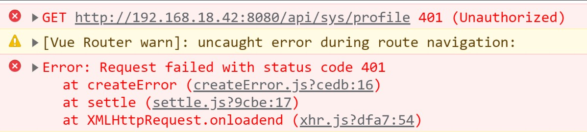

如遇到此错误，可 **手动到控制到 `Application` 中，删除 `LocalStorage` 中的 `token`**

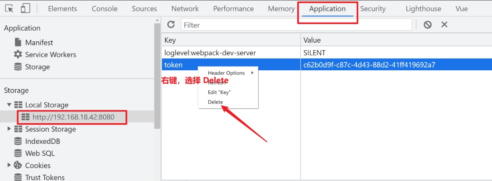

删除后，重新刷新页面，重新进行登录操作（该问题如何解决，会在后续进行讲解）

至此，即可获取用户信息数据


###  渲染用户头像菜单

到现在我们已经拿到了 **用户数据，并且在 `getters` 中做了对应的快捷访问** ，那么接下来我们就可以根据数据渲染出 **用户头像内容**

渲染用户头像，我们将使用到 `element-plus` 的两个组件：

1. `avatar`
2. `Dropdown`

在 `layout/components/Navbar.vue` 中实现以下代码：

```vue
<template>
  <div class="navbar">
    <div class="right-menu">
      <el-dropdown>
        <div class="avatar-wrapper">
          <el-avatar
            shape="square"
            :src="$store.getters.userInfo.avatar"
            :size="40"
          ></el-avatar>
          <i class="el-icon-s-tools"></i>
        </div>
        <template #dropdown>
          <el-dropdown-menu>
            <router-link to="/">
              <el-dropdown-item>首页</el-dropdown-item>
            </router-link>
            <a href="" target="_blank">
              <el-dropdown-item>课程主页</el-dropdown-item>
            </a>
            <el-dropdown-item divided>退出登录</el-dropdown-item>
          </el-dropdown-menu>
        </template>
      </el-dropdown>
    </div>
  </div>
</template>

<script setup>
import {} from 'vue'
</script>

<style lang="scss" scoped>
.navbar {
  height: 50px;
  box-shadow: 0 1px 4px rgba(0, 21, 41, 0.08);
  .right-menu {
    float: right;
    padding-right: 16px;

    .avatar-wrapper {
      margin-top: 5px;
      .el-avatar {
        cursor: pointer;
        margin-right: 12px;
      }
    }
  }
}
</style>

```

那么至此，用户头像和对应的下拉菜单就已经实现完成了，那么下一小节我们就可以在此基础上实现对应的 **退出登录** 功能

### 退出登录方案实现

**退出登录** 一直是一个通用的前端实现方案，对于退出登录而言，它的触发时机一般有两种：

1. 用户**主动**退出
2. 用户**被动**退出

其中：

1. 主动退出指：用户点击登录按钮之后退出
2. 被动退出指：`token` 过期或被  其他人”顶下来“ 时退出

那么无论是什么退出方式，在用户退出时，所需要执行的操作都是固定的：

1. 清理掉当前用户缓存数据
2. 清理掉权限相关配置
3. 返回到登录页

那么明确好了对应的方案之后，接下来咱们就先来实现 **用户主动退出的对应策略**

在 `store/modules/user.js` 中，添加对应 `action`

```js
import router from '@/router'
import { ...,clearItem } from '@/utils/storage'
actions: {
    loginout(context) {
        this.commit('user/setToken', '')
        this.commit('user/setUserInfo', {})
        clearItem()
        router.push('/login')
    }
}
```

为退出登录按钮添加点击事件，触发 `logout` 的 `action`

```js
import { useStore } from 'vuex'

const store = useStore()
const logout = () => {
  store.dispatch('user/logout')
}
```

那么至此，我们就完成了 **用户主动退出** 对应的实现。

### 用户被动退出方案解析

在上一节我们实现了 **用户主动退出** 场景，同时也提到 **用户被动退出** 的场景主要有两个：

1. `token` 失效
2. 单点登录：其他人登录该账号被 “顶下来”

那么这两种场景下，在前端对应的处理方案一共也分为两种，共分为 **主动处理** 、**被动处理** 两种 ：

1. 主动处理：主要应对 `token` 失效
2. 被动处理：同时应对 `token` 失效 与 **单点登录**

那么这两种方案基本上就覆盖了用户被动退出时的主要业务场景了

### 用户被动退出解决方案之主动处理

想要搞明白 **主动处理** 方案，那么首先我们得先去搞明白对应的 **背景** 以及 **业务逻辑** 。

那么首先我们先明确一下对应的 **背景：**

> 我们知道 `token` 表示了一个用户的身份令牌，对 服务端 而言，它是只认令牌不认人的。所以说一旦其他人获取到了你的 `token` ，那么就可以伪装成你，来获取对应的敏感数据。
>
> 所以为了保证用户的信息安全，那么对于 `token` 而言就被制定了很多的安全策略，比如：
>
> 1. 动态 `token`（可变 `token`）
> 2. 刷新 `token`
> 3. 时效 `token`
> 4. ...
>
> 这些方案各有利弊，没有绝对的完美的策略。

而我们此时所选择的方案就是 **时效 `token`**

对于 `token` 本身是拥有时效的，这个大家都知道。但是通常情况下，这个时效都是在服务端进行处理。而此时我们要在 **服务端处理 `token` 时效的同时，在前端主动介入 `token` 时效的处理中**。 从而保证用户信息的更加安全性。

那么对应到我们代码中的实现方案为：

1. 在用户登陆时，记录当前 **登录时间**
2. 制定一个 **失效时长**
3. 在接口调用时，根据 **当前时间** 对比 **登录时间** ，看是否超过了 **时效时长**
   1. 如果未超过，则正常进行后续操作
   2. 如果超过，则进行 **退出登录** 操作

那么明确好了对应的方案之后，接下来我们就去实现对应代码

创建 `utils/auth.js` 文件，并写入以下代码：

```js
import { TIME_STAMP, TOKEN_TIMEOUT_VALUE } from '@/constant'
import { setItem, getItem } from '@/utils/storage'
/**
 * 获取时间戳
 */
export function getTimeStamp() {
  return getItem(TIME_STAMP)
}
/**
 * 设置时间戳
 */
export function setTimeStamp() {
  setItem(TIME_STAMP, Date.now())
}
/**
 * 是否超时
 */
export function isCheckTimeout() {
  // 当前时间戳
  var currentTime = Date.now()
  // 缓存时间戳
  var timeStamp = getTimeStamp()
  return currentTime - timeStamp > TOKEN_TIMEOUT_VALUE
}
```

在 `constant` 中声明对应常量：

```js
// token 时间戳
export const TIME_STAMP = 'timeStamp'
// 超时时长(毫秒) 两小时
export const TOKEN_TIMEOUT_VALUE = 2 * 3600 * 1000
```

在用户登录成功之后去设置时间，到 `store/user.js` 的 `login` 中：

```js
import { setTimeStamp } from '@/utils/auth'

login(context, userInfo) {
      ...
      return new Promise((resolve, reject) => {
        ...
          .then(data => {
            ...
            // 保存登录时间
            setTimeStamp()
            resolve()
          })
      })
    },
```

 在 `utils/request` 对应的请求拦截器中进行 **主动介入**

```js
import { isCheckTimeout } from '@/utils/auth'

if (store.getters.token) {
      if (isCheckTimeout()) {
        // 登出操作
        store.dispatch('user/logout')
        return Promise.reject(new Error('token 失效'))
      }
      ...
    }
```

那么至此我们就完成了 **主动处理** 对应的业务逻辑

### 用户被动退出解决方案之被动处理

上一节我们处理了 **用户被动退出时的主动处理** ，那么在这一小节我们去处理 **用户被动退出时的被动处理** 。

还是和上一小节一样，我们还是先明确背景，然后再来明确业务逻辑。

**背景：**

首先我们需要先明确 **被动处理** 需要应对两种业务场景：

1. `token` 过期
2. 单点登录

然后我们一个一个来去看，首先是 `token` 过期

> 我们知道对于 `token` 而言，本身就是具备时效的，这个是在服务端生成 `token` 时就已经确定的。
>
> 而此时我们所谓的 `token` 过期指的就是：
>
> **服务端生成的 `token` 超过 服务端指定时效** 的过程

而对于 单点登录 而言，指的是： 

> 当用户 A 登录之后，`token` 过期之前。
>
> 用户 A 的账号在其他的设备中进行了二次登录，导致第一次登录的 A 账号被 “顶下来” 的过程。
>
> 即：**同一账户仅可以在一个设备中保持在线状态**

那么明确好了对应的背景之后，接下来我们来看对应的业务处理场景：

从背景中我们知道，以上的两种情况，都是在 **服务端进行判断的**，而对于前端而言其实是 **服务端通知前端的一个过程。**

所以说对于其业务处理，将遵循以下逻辑：

1. 服务端返回数据时，会通过特定的状态码通知前端
2. 当前端接收到特定状态码时，表示遇到了特定状态：**`token` 时效** 或 **单点登录**
3. 此时进行 **退出登录** 处理

那么明确好了业务之后，接下来我们来实现对应代码：

在 `utils/request` 的响应拦截器中，增加以下逻辑：

```js
// 响应拦截器
service.interceptors.response.use(
  response => {
    ...
  },
  error => {
    // 处理 token 超时问题
    if (
      error.response &&
      error.response.data &&
      error.response.data.code === 401
    ) {
      // token超时
      store.dispatch('user/logout')
    }
    ElMessage.error(error.message) // 提示错误信息
    return Promise.reject(error)
  }
)
```

那么至此，我们就已经完成了 **整个用户退出** 方案。

### 创建页面组件，使用临时 menu 菜单

处理完了 **退出登录** 之后，接下来我们来处理 **动态`menu`菜单**。

只不过为了方便大家理解，这里我们先不去直接处理动态菜单，我们先生成一个临时的 `menu` 菜单。

创建 `layout/Sidebar/SidebarMenu` 文件

```vue
<template>
  <!-- 一级 menu 菜单 -->
  <el-menu
    :uniqueOpened="true"
    default-active="2"
    background-color="#545c64"
    text-color="#fff"
    active-text-color="#ffd04b"
  >
    <!-- 子集 menu 菜单 -->
    <el-submenu index="1">
      <template #title>
        <i class="el-icon-location"></i>
        <span>导航一</span>
      </template>
      <el-menu-item index="1-1">选项1</el-menu-item>
      <el-menu-item index="1-2">选项2</el-menu-item>
    </el-submenu>
    <!-- 具体菜单项 -->
    <el-menu-item index="4">
      <i class="el-icon-setting"></i>
      <template #title>导航四</template>
    </el-menu-item>
  </el-menu>
</template>
```

在 `layout/Sidebar/index` 中导入该组件

```vue
<template>
  <div class="">
    <h1>占位</h1>
    <el-scrollbar>
      <sidebar-menu></sidebar-menu>
    </el-scrollbar>
  </div>
</template>

<script setup>
import SidebarMenu from './SidebarMenu'
import {} from 'vue'
</script>
```

那么至此我们生成了一个临时的 `menu` 菜单，从这个临时的 `menu` 菜单出可以看到，`el-menu` 其实分成了三个部分：

1. `el-menu`：整个 `menu` 菜单
2. `el-submenu`：子集 `menu` 菜单
3. `el-menu-item`：具体菜单项

那么明确好了这些内容之后，接下来我们就可以来去分析一下 **动态 `menu` 菜单如何生成了**

### 动态menu菜单处理方案解析

上一小节我们处理了 **静态 `menu`**，那么接下来我们来去处理 **动态 `menu` 菜单**

其实 **动态`menu`菜单** 其实主要是和 **动态路由表**  配合来去实现 **用户权限** 的。

但是 **用户权限处理** 需要等到后面的章节中才可以接触到，因为咱们想要处理 **用户权限** 还需要先去处理很多的业务场景，所以在这里我们就先只处理 **动态`menu`菜单** 这一个概念。

那么 **动态`menu`菜单** 指的到底是什么意思呢？

所谓 **动态`menu`菜单** 指的是：

> 根据路由表的配置，自动生成对应的 `menu` 菜单。
>
> 当路由表发生变化时，`menu` 菜单自动发生变化

那么明确了 **动态`menu`菜单** 的含义之后，接下来咱们就需要来明确以下 **动态`menu`菜单** 的实现方案：

1. 定义 **路由表** 对应 **`menu` 菜单规则**
2. 根据规则制定 **路由表**
3. 根据规则，依据 **路由表** ，生成 **`menu` 菜单**

那么根据我们的实现方案可以发现，实现 **动态`menu`菜单** 最核心的关键点其实就在步骤一，也就是 

> 定义 **路由表** 对应 **`menu` 菜单规则**

那么下面我们就来看一下，这个规则如何制定：

1. 对于单个路由规则而言（循环）：
   1. 如果`meta && meta.title && meta.icon` ：则显示在 `menu` 菜单中，其中 `title` 为显示的内容，`icon` 为显示的图标
      1. 如果存在 `children` ：则以 `el-sub-menu（子菜单）` 展示
      2. 否则：则以 `el-menu-item（菜单项）` 展示
   2. 否则：不显示在 `menu` 菜单中

那么明确好了对应的规则之后，接下来我们就可以来去看一下如何进行实现啦

### 业务落地：生成项目页面组件

明确了对应的方案之后，那么下面咱们就来实现对应的代码逻辑。

根据我们的分析，想要完成动态的 `menu`，那么我们需要按照以下的步骤来去实现：

1. 创建页面组件
2. 生成路由表
3. 解析路由表
4. 生成 `menu` 菜单

那么明确好了步骤之后，接下来我们就先来实现第一步

**创建页面组件**

在 `views` 文件夹下，创建如下页面：

1. 创建文章：`article-create`
2. 文章详情：`article-detail`
3. 文章排名：`article-ranking`
4. 错误页面：`error-page`
   1. `404`
   2. `401`
5. 导入：`import`
6. 权限列表：`permission-list`
7. 个人中心：`profile`
8. 角色列表：`role-list`
9. 用户信息：`user-info`
10. 用户管理：`user-manage`

### 业务落地：创建结构路由表

想要实现结构路由表，那么我们需要先知道最终我们要实现的结构是什么样子的，大家来看下面的截图：

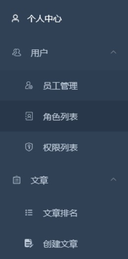

这是我们最终要实现的 `menu` 截图

根据此截图，我们可以知道两点内容：

1. 我们创建的页面并没有全部进行展示

   1. 根据该方案
      
   2. 即不显示页面 **不满足** 该条件 `meta && meta.title && meta.icon`

2. `menu` 菜单将具备父子级的结构

   1. 按照此结构规划数据，则数据应为

      ```json
      [
          {
              "title": "个人中心",
              "path": ""
          },
          {
              "title": "用户",
              "children": [
                  {
                      "title": "员工管理",
                      "path": ""
                  },
                  {
                      "title": "角色列表",
                      "path": ""
                  },
                  {
                      "title": "权限列表",
                      "path": ""
                  }
              ]
          },
          {
              "title": "文章",
              "children": [
                  {
                      "title": "文章排名",
                      "path": ""
                  },
                  {
                      "title": "创建文章",
                      "path": ""
                  }
              ]
          }
      ]
      ```

又因为将来我们需要进行 **用户权限处理**，所以此时我们需要先对路由表进行一个划分：

1. 私有路由表 `privateRoutes` ：权限路由

  2. 公有路由表 `publicRoutes`：无权限路由

根据以上理论，生成以下路由表结构：

```js
/**
 * 私有路由表
 */
const privateRoutes = [
  {
    path: '/user',
    component: layout,
    redirect: '/user/manage',
    meta: {
      title: 'user',
      icon: 'personnel'
    },
    children: [
      {
        path: '/user/manage',
        component: () => import('@/views/user-manage/index'),
        meta: {
          title: 'userManage',
          icon: 'personnel-manage'
        }
      },
      {
        path: '/user/role',
        component: () => import('@/views/role-list/index'),
        meta: {
          title: 'roleList',
          icon: 'role'
        }
      },
      {
        path: '/user/permission',
        component: () => import('@/views/permission-list/index'),
        meta: {
          title: 'permissionList',
          icon: 'permission'
        }
      },
      {
        path: '/user/info/:id',
        name: 'userInfo',
        component: () => import('@/views/user-info/index'),
        meta: {
          title: 'userInfo'
        }
      },
      {
        path: '/user/import',
        name: 'import',
        component: () => import('@/views/import/index'),
        meta: {
          title: 'excelImport'
        }
      }
    ]
  },
  {
    path: '/article',
    component: layout,
    redirect: '/article/ranking',
    meta: {
      title: 'article',
      icon: 'article'
    },
    children: [
      {
        path: '/article/ranking',
        component: () => import('@/views/article-ranking/index'),
        meta: {
          title: 'articleRanking',
          icon: 'article-ranking'
        }
      },
      {
        path: '/article/:id',
        component: () => import('@/views/article-detail/index'),
        meta: {
          title: 'articleDetail'
        }
      },
      {
        path: '/article/create',
        component: () => import('@/views/article-create/index'),
        meta: {
          title: 'articleCreate',
          icon: 'article-create'
        }
      },
      {
        path: '/article/editor/:id',
        component: () => import('@/views/article-create/index'),
        meta: {
          title: 'articleEditor'
        }
      }
    ]
  }
]

/**
 * 公开路由表
 */
const publicRoutes = [
  {
    path: '/login',
    component: () => import('@/views/login/index')
  },
  {
    path: '/',
    // 注意：带有路径“/”的记录中的组件“默认”是一个不返回 Promise 的函数
    component: layout,
    redirect: '/profile',
    children: [
      {
        path: '/profile',
        name: 'profile',
        component: () => import('@/views/profile/index'),
        meta: {
          title: 'profile',
          icon: 'el-icon-user'
        }
      },
      {
        path: '/404',
        name: '404',
        component: () => import('@/views/error-page/404')
      },
      {
        path: '/401',
        name: '401',
        component: () => import('@/views/error-page/401')
      }
    ]
  }
]

const router = createRouter({
  history: createWebHashHistory(),
  routes: [...publicRoutes, ...privateRoutes]
})
```

最后不要忘记在 `layout/appMain` 下设置路由出口

```vue
<template>
  <div class="app-main">
    <router-view></router-view>
  </div>
</template>
```

### 业务落地：解析路由表，获取结构化数据

本小节的目标只有一点，那就是获取到之前明确的结构化数据：

```json
[
    {
        "title": "个人中心",
        "path": ""
    },
    {
        "title": "用户",
        "children": [
            {
                "title": "员工管理",
                "path": ""
            },
            {
                "title": "角色列表",
                "path": ""
            },
            {
                "title": "权限列表",
                "path": ""
            }
        ]
    },
    {
        "title": "文章",
        "children": [
            {
                "title": "文章排名",
                "path": ""
            },
            {
                "title": "创建文章",
                "path": ""
            }
        ]
    }
]
```

那么想要完成本小节的目标，我们就需要先来看一下，现在的路由表结构是什么样子的。

想要获取路由表数据，那么有两种方式：

1. [router.options.routes](https://next.router.vuejs.org/zh/api/#routes)：初始路由列表（[新增的路由](https://next.router.vuejs.org/zh/api/#addroute) 无法获取到）
2. [router.getRoutes()](https://next.router.vuejs.org/zh/api/#getroutes)：获取所有 [路由记录](https://next.router.vuejs.org/zh/api/#routerecord) 的完整列表

所以，我们此时使用 [router.getRoutes()](https://next.router.vuejs.org/zh/api/#getroutes) 

在 `layout/components/Sidebar/SidebarMenu` 下写入以下代码：

```vue
<script setup>
import { useRouter } from 'vue-router'

const router = useRouter()
console.log(router.getRoutes())
</script>
```

得到返回的数据：

```json
[
    {
        "path":"/user/info/:id",
        "name":"userInfo",
        "meta":{
            "title":"userInfo"
        },
        "children":[

        ]
    },
    {
        "path":"/article/editor/:id",
        "meta":{
            "title":"articleEditor"
        },
        "children":[

        ]
    },
    {
        "path":"/user/manage",
        "meta":{
            "title":"userManage",
            "icon":"personnel-manage"
        },
        "children":[

        ]
    },
    {
        "path":"/user/role",
        "meta":{
            "title":"roleList",
            "icon":"role"
        },
        "children":[

        ]
    },
    {
        "path":"/user/permission",
        "meta":{
            "title":"permissionList",
            "icon":"permission"
        },
        "children":[

        ]
    },
    {
        "path":"/user/import",
        "name":"import",
        "meta":{
            "title":"excelImport"
        },
        "children":[

        ]
    },
    {
        "path":"/article/ranking",
        "meta":{
            "title":"articleRanking",
            "icon":"article-ranking"
        },
        "children":[

        ]
    },
    {
        "path":"/article/create",
        "meta":{
            "title":"articleCreate",
            "icon":"article-create"
        },
        "children":[

        ]
    },
    {
        "path":"/article/:id",
        "meta":{
            "title":"articleDetail"
        },
        "children":[

        ]
    },
    {
        "path":"/login",
        "meta":{

        },
        "children":[

        ]
    },
    {
        "path":"/profile",
        "name":"profile",
        "meta":{
            "title":"profile",
            "icon":"el-icon-user"
        },
        "children":[

        ]
    },
    {
        "path":"/404",
        "name":"404",
        "meta":{

        },
        "children":[

        ]
    },
    {
        "path":"/401",
        "name":"401",
        "meta":{

        },
        "children":[

        ]
    },
    {
        "path":"/",
        "redirect":"/profile",
        "meta":{

        },
        "children":[
            {
                "path":"/profile",
                "name":"profile",
                "meta":{
                    "title":"profile",
                    "icon":"el-icon-user"
                }
            },
            {
                "path":"/404",
                "name":"404"
            },
            {
                "path":"/401",
                "name":"401"
            }
        ]
    },
    {
        "path":"/user",
        "redirect":"/user/manage",
        "meta":{
            "title":"user",
            "icon":"personnel"
        },
        "children":[
            {
                "path":"/user/manage",
                "meta":{
                    "title":"userManage",
                    "icon":"personnel-manage"
                }
            },
            {
                "path":"/user/role",
                "meta":{
                    "title":"roleList",
                    "icon":"role"
                }
            },
            {
                "path":"/user/permission",
                "meta":{
                    "title":"permissionList",
                    "icon":"permission"
                }
            },
            {
                "path":"/user/info/:id",
                "name":"userInfo",
                "meta":{
                    "title":"userInfo"
                }
            },
            {
                "path":"/user/import",
                "name":"import",
                "meta":{
                    "title":"excelImport"
                }
            }
        ]
    },
    {
        "path":"/article",
        "redirect":"/article/ranking",
        "meta":{
            "title":"article",
            "icon":"article"
        },
        "children":[
            {
                "path":"/article/ranking",
                "meta":{
                    "title":"articleRanking",
                    "icon":"article-ranking"
                }
            },
            {
                "path":"/article/:id",
                "meta":{
                    "title":"articleDetail"
                }
            },
            {
                "path":"/article/create",
                "meta":{
                    "title":"articleCreate",
                    "icon":"article-create"
                }
            },
            {
                "path":"/article/editor/:id",
                "meta":{
                    "title":"articleEditor"
                }
            }
        ]
    }
]
```

从返回的数据来看，它与我们想要的数据结构相去甚远。

出现这个问题的原因，是因为它返回的是一个 **完整的路由表**

这个路由表距离我们想要的存在两个问题：

1. 存在重复的路由数据
2. 不满足该条件 `meta && meta.title && meta.icon` 的数据不应该存在

那么接下来我们就应该来处理这两个问题

创建 `utils/route` 文件，创建两个方法分别处理对应的两个问题：

1. `filterRouters`
2. `generateMenus`

写入以下代码：

```js
import path from 'path'

/**
 * 返回所有子路由
 */
const getChildrenRoutes = routes => {
  const result = []
  routes.forEach(route => {
    if (route.children && route.children.length > 0) {
      result.push(...route.children)
    }
  })
  return result
}
/**
 * 处理脱离层级的路由：某个一级路由为其他子路由，则剔除该一级路由，保留路由层级
 * @param {*} routes router.getRoutes()
 */
export const filterRouters = routes => {
  const childrenRoutes = getChildrenRoutes(routes)
  return routes.filter(route => {
    return !childrenRoutes.find(childrenRoute => {
      return childrenRoute.path === route.path
    })
  })
}

/**
 * 判断数据是否为空值
 */
function isNull(data) {
  if (!data) return true
  if (JSON.stringify(data) === '{}') return true
  if (JSON.stringify(data) === '[]') return true
  return false
}
/**
 * 根据 routes 数据，返回对应 menu 规则数组
 */
export function generateMenus(routes, basePath = '') {
  const result = []
  // 遍历路由表
  routes.forEach(item => {
    // 不存在 children && 不存在 meta 直接 return
    if (isNull(item.meta) && isNull(item.children)) return
    // 存在 children 不存在 meta，进入迭代
    if (isNull(item.meta) && !isNull(item.children)) {
      result.push(...generateMenus(item.children,item.path))
      return
    }
    // 存在 meta 与 children 或 不存在 children 存在 meta
    // 合并 path 作为跳转路径
    const routePath = path.resolve(basePath, item.path)
    // 路由分离之后，存在同名父路由的情况，需要单独处理(比如如下情况：)
    /*
    
    {
      path: '/hi',
      component: common,
      meta:{
            "title":"user",
            "icon":"personnel"
      },
      children: [
        {path: ''},
        {path: 'hi2', name: 'hi2', component: Hi2},
        {path: 'hi3', component: Hi3}
      ]
    }
    
    */
    let route = result.find(item => item.path === routePath)
    if (!route) {
      route = {
        ...item,
        path: routePath,
        children: []
      }

      // icon 与 title 必须全部存在
      if (route.meta.icon && route.meta.title) {
        // meta 存在生成 route 对象，放入 arr
        result.push(route)
      }else{
          return
      }
    }

    // 存在 children 进入迭代到children
    if (item.children) {
      route.children.push(...generateMenus(item.children, route.path))
    }
  })
  return result
}

```

在 `SidebarMenu` 中调用该方法

```vue
<script setup>
import { computed } from 'vue'
import { useRouter } from 'vue-router'
import { filterRouters, generateMenus } from '@/utils/route'

const router = useRouter()
const routes = computed(() => {
  const filterRoutes = filterRouters(router.getRoutes())
  return generateMenus(filterRoutes)
})
console.log(JSON.stringify(routes.value))
</script>
```

得到该数据结构

```json
[
    {
        "path":"/profile",
        "name":"profile",
        "meta":{
            "title":"profile",
            "icon":"el-icon-user"
        },
    },
    {
        "path":"/user",
        "redirect":"/user/manage",
        "meta":{
            "title":"user",
            "icon":"personnel"
        },
        "props":{
            "default":false
        },
        "children":[
            {
                "path":"/user/manage",
                "name":"userManage",
                "meta":{
                    "title":"userManage",
                    "icon":"personnel-manage"
                },
                "children":[

                ]
            },
            {
                "path":"/user/role",
                "name":"userRole",
                "meta":{
                    "title":"roleList",
                    "icon":"role"
                },
                "children":[

                ]
            },
            {
                "path":"/user/permission",
                "name":"userPermission",
                "meta":{
                    "title":"permissionList",
                    "icon":"permission"
                },
                "children":[

                ]
            }
        ],
    },
    {
        "path":"/article",
        "redirect":"/article/ranking",
        "meta":{
            "title":"article",
            "icon":"article"
        },
        "props":{
            "default":false
        },
        "children":[
            {
                "path":"/article/ranking",
                "name":"articleRanking",
                "meta":{
                    "title":"articleRanking",
                    "icon":"article-ranking"
                },
                "children":[

                ]
            },
            {
                "path":"/article/create",
                "name":"articleCreate",
                "meta":{
                    "title":"articleCreate",
                    "icon":"article-create"
                },
                "children":[

                ]
            }
        ],
    }
]
```

### 业务落地：生成动态 menu 菜单

有了数据结构之后，最后的步骤就水到渠成了

整个 `menu` 菜单，我们将分成三个组件来进行处理

1. `SidebarMenu`：处理数据，作为最顶层 `menu` 载体
2. `SidebarItem`：根据数据处理 **当前项为 `el-submenu` || `el-menu-item`** 
3. `MenuItem`：处理 `el-menu-item` 样式

那么下面我们一个个来处理

首先是 `SidebarMenu` 

```vue
<template>
  <!-- 一级 menu 菜单 -->
  <el-menu
    ...
  >
    <sidebar-item
      v-for="item in routes"
      :key="item.path"
      :route="item"
    ></sidebar-item>
  </el-menu>
</template>

```


创建 `SidebarItem` 组件，用来根据数据处理 **当前项为 `el-submenu` || `el-menu-item`** 

```vue
<template>
  <!-- 支持渲染多级 menu 菜单 -->
  <el-submenu v-if="route.children.length > 0" :index="route.path">
    <template #title>
      <menu-item :title="route.meta.title" :icon="route.meta.icon"></menu-item>
    </template>
    <!-- 循环渲染 -->
    <sidebar-item
      v-for="item in route.children"
      :key="item.path"
      :route="item"
    ></sidebar-item>
  </el-submenu>
  <!-- 渲染 item 项 -->
  <el-menu-item v-else :index="route.path">
    <menu-item :title="route.meta.title" :icon="route.meta.icon"></menu-item>
  </el-menu-item>
</template>

<script setup>
import MenuItem from './MenuItem'
import { defineProps } from 'vue'
// 定义 props
defineProps({
  route: {
    type: Object,
    required: true
  }
})
</script>
```

创建 `MenuItem` 用来处理 `el-menu-item` 样式

```vue
<template>
  <i v-if="icon.includes('el-icon')" class="sub-el-icon" :class="icon"></i>
  <svg-icon v-else :icon="icon"></svg-icon>
  <span>{{ title }}</span>
</template>

<script setup>
import { defineProps } from 'vue'
defineProps({
  title: {
    type: String,
    required: true
  },
  icon: {
    type: String,
    required: true
  }
})
</script>

<style lang="scss" scoped>
</style>
```

至此，整个的 `menu` 菜单结构就已经完成了

但是此时我们的 `menu` 菜单还存在三个小的问题：

1. 样式问题
2. 路由跳转问题
3. 默认激活项

### 业务落地：修复最后残余问题

目前 `menu` 菜单存在三个问题

1. 样式问题
2. 路由跳转问题
3. 默认激活项

**样式问题：**

首先处理样式，因为后面我们需要处理 **主题替换** ，所以此处我们不能把样式写死

在 `store/getters` 中创建一个新的 **快捷访问**

```js
import variables from '@/styles/variables.scss'
const getters = {
  ...
  cssVar: state => variables
}
export default getters
```

在 `SidebarMenu` 中写入如下样式

```html
<el-menu
    :background-color="$store.getters.cssVar.menuBg"
    :text-color="$store.getters.cssVar.menuText"
    :active-text-color="$store.getters.cssVar.menuActiveText"
    :unique-opened="true"
  >
```

**路由跳转问题：**

为 `el-menu` 指定 `router`

```html
 <el-menu
    ...
    router
  >
```


**默认激活项：**

根据当前 `url` 进行判断即可

```vue
  <el-menu
    :default-active="activeMenu"
    ...
  >

<script setup>
...

// 计算高亮 menu 的方法
const route = useRoute()
const activeMenu = computed(() => {
  const { path } = route
  return path
})
</script>

```

至此整个 **动态`menu`完成**

### 动画逻辑，左侧菜单伸缩功能实现

下面我们来实现一个标准化功能 **左侧菜单伸缩** ，对于这个功能核心的点在于动画处理

样式的改变总是由数据进行驱动，所以首先我们去创建对应的数据

创建 `store/app` 模块，写入如下代码

```js
export default {
  namespaced: true,
  state: () => ({
    sidebarOpened: true
  }),
  mutations: {
    triggerSidebarOpened(state) {
      state.sidebarOpened = !state.sidebarOpened
    }
  },
  actions: {}
}

```

在 `store/index` 中进行导入

```js
...
import app from './modules/app'
export default createStore({
  getters,
  modules: {
    ...
    app
  }
})
```

在 `store/getters` 中创建快捷访问

```js
sidebarOpened: state => state.app.sidebarOpened
```

创建 `components/hamburger` 组件，用来控制数据

```vue
<template>
  <div class="hamburger-container" @click="toggleClick">
    <svg-icon class="hamburger" :icon="icon"></svg-icon>
  </div>
</template>

<script setup>
import { computed } from 'vue'
import { useStore } from 'vuex'

const store = useStore()
const toggleClick = () => {
  store.commit('app/triggerSidebarOpened')
}

const icon = computed(() =>
  store.getters.sidebarOpened ? 'hamburger-opened' : 'hamburger-closed'
)
</script>

<style lang="scss" scoped>
.hamburger-container {
  padding: 0 16px;
  .hamburger {
    display: inline-block;
    vertical-align: middle;
    width: 20px;
    height: 20px;
  }
}
</style>
```

在 `navbar` 中使用该组件

```vue
<template>
  <div class="navbar">
    <hamburger class="hamburger-container" />
    ...
  </div>
</template>

<script setup>
import Hamburger from '@/components/Hamburger'
...
</script>

<style lang="scss" scoped>
.navbar {
  ...

  .hamburger-container {
    line-height: 46px;
    height: 100%;
    float: left;
    cursor: pointer;
    // hover 动画
    transition: background 0.5s;

    &:hover {
      background: rgba(0, 0, 0, 0.1);
    }
  }

 ...
}
</style>

```

在 `SidebarMenu` 中，控制 `el-menu` 的 [collapse](https://element-plus.org/#/zh-CN/component/menu) 属性

```vue
<el-menu
    :collapse="!$store.getters.sidebarOpened"
    ...
```

在 `layout/index` 中指定 **整个侧边栏的宽度和缩放动画**

```vue
<template>
  <div
    class="app-wrapper"
    :class="[$store.getters.sidebarOpened ? 'openSidebar' : 'hideSidebar']"
  >
    <!-- 此处hideSidebar 的样式在 sidebar.scss 中定义了: 
	.hideSidebar {
    	.sidebar-container {
     		 width: 54px !important;
    	}
	}
	我们只需要处理一下fixed-header 的宽度即可
	-->
     
    <sidebar
      class="sidebar-container"
      :style="{ backgroundColor: variables.menuBg }"
    />
    <div class="main-container">
      <div class="fixed-header">
        <navbar />
      </div>
      <appmain />
    </div>
  </div>
</template>
```

在 `layout/index` 中 处理 `navbar` 的宽度

```vue
<style lang="scss" scoped>
...

.fixed-header {
  position: fixed;
  top: 0;
  right: 0;
  z-index: 9;
  width: calc(100% - #{$sideBarWidth});
  transition: width 0.28s;
}

.hideSidebar .fixed-header {
  width: calc(100% - #{$hideSideBarWidth});
}
</style>
```

在 `styles/variables.scss` 中指定 `hideSideBarWidth`

```scss
$hideSideBarWidth: 54px;
```

### SidebarHeader 处理

整个左侧的 `menu` 菜单，到现在咱们还剩下最后一个 `header` 没有进行处理

在 `sidebar/index` 中写入如下代码

```vue
<template>
  <div class="">
    <div class="logo-container">
      <el-avatar
        size="44"
        shape="square"
        src="https://m.imooc.com/static/wap/static/common/img/logo-small@2x.png"
      />
      <h1 class="logo-title" v-if="$store.getters.sidebarOpened">
       imooc-admin
      </h1>
    </div>
    ...
  </div>
</template>

<style lang="scss" scoped>
.logo-container {
  height: 44px;
  padding: 10px 0 22px 0;
  display: flex;
  align-items: center;
  justify-content: center;
  .logo-title {
    margin-left: 10px;
    color: #fff;
    font-weight: 600;
    line-height: 50px;
    font-size: 16px;
    white-space: nowrap;
  }
}
</style>

```

创建 `styles/element.scss` 文件，统一处理 `el-avatar` 的背景问题

```scss
.el-avatar {
  --el-avatar-background-color: none;
}
```

在 `styles/index.scss` 中导入

```scss
...
@import './element.scss';
```

统一处理下动画时长的问题，在 `styles/variables.scss` 中，加入以下变量

```scss
$sideBarDuration: 0.28s;
```

为 `styles/sidebar.scss` 修改时长

```scss
  .main-container {
    transition: margin-left #{$sideBarDuration};
   ...
  }

  .sidebar-container {
    transition: width #{$sideBarDuration};
  	...
  }
```

为 `layout/index` 修改样式

```scss
.fixed-header {
  ...
  transition: width #{$sideBarDuration};
}
```

 

### 全新 vue 能力：组件状态驱动的动态 CSS 值

在 [vue 3.2](https://blog.vuejs.org/posts/vue-3.2.html) 最新更新中，除了之前我们介绍的 **响应式变化** 之外，还有另外一个很重要的更新，那就是 **组件状态驱动的动态 `CSS` 值** ，对应的文档也已经公布，大家可以 [点击这里](https://v3.vuejs.org/api/sfc-style.html#state-driven-dynamic-css) 查看

那么下面我们就使用下最新的特性，来为 `logo-container` 指定下高度：

```vue
<template>
 ...
 <el-avatar
 	:size="logoHeight"
 ...

</template>

<script setup>
...
const logoHeight = 44
</script>

<style lang="scss" scoped>
.logo-container {
  height: v-bind(logoHeight) + 'px';
...
}
</style>

```

### 动态面包屑方案分析

到目前位置，本章中还剩下最后一个功能就是 **面包屑导航**，分为：

1. 静态面包屑
2. 动态面包屑

**静态面包屑：**

指的是：**在每个页面中写死对应的面包屑菜单**，缺点也很明显：

1. 每个页面都得写一遍
2. 页面路径结构变化了，得手动更改

简单来说就是 **不好维护，不好扩展** 。

**动态面包屑：**

**根据当前的 `url` 自动生成面包屑导航菜单**

无论之后路径发生了什么变化，**动态面包屑** 都会正确的进行计算

那么在后面的实现过程中，我们将会分成三大步来实现

1. 创建、渲染基本的面包屑组件
2. 计算面包屑结构数据
3. 根据数据渲染动态面包屑内容

### 业务落地：渲染基本的面包屑组件

完成第一步，先去创建并渲染出基本的 [面包屑](https://element-plus.org/#/zh-CN/component/breadcrumb) 组件

创建 `components/Breadcrumb/index`，并写入如下代码：

```vue
<template>
  <el-breadcrumb class="breadcrumb" separator="/">
    <el-breadcrumb-item :to="{ path: '/' }">首页</el-breadcrumb-item>
    <el-breadcrumb-item><a href="/">活动管理</a></el-breadcrumb-item>
    <el-breadcrumb-item>活动列表</el-breadcrumb-item>
    <!-- 面包屑的最后一项 -->
    <el-breadcrumb-item>
      <span class="no-redirect">活动详情</span>
    </el-breadcrumb-item>
  </el-breadcrumb>
</template>

<script setup>
import {} from 'vue'
</script>

<style lang="scss" scoped>
.breadcrumb {
  display: inline-block;
  font-size: 14px;
  line-height: 50px;
  margin-left: 8px;

  ::v-deep .no-redirect {
    color: #97a8be;
    cursor: text;
  }
}
</style>

```

在 `layout/components/Navbar` 组件下导入

```vue
<template>
  <div class="navbar">
    <hamburger class="hamburger-container" />
    <breadcrumb class="breadcrumb-container" />
	...
  </div>
</template>

<script setup>
import Breadcrumb from '@/components/Breadcrumb'
...
</script>

<style lang="scss" scoped>
.navbar {
 ...

  .breadcrumb-container {
    float: left;
  }
   ...
}
</style>

```

### 业务落地：动态计算面包屑结构数据

现在我们是完成了一个静态的 面包屑，接下来咱们就需要依托这个静态的菜单来完成动态的。

对于现在的静态面包屑来说，他分成了两个组件：

1. `el-breadcrumb`：包裹性质的容器
2. `el-breadcrumb-item`：每个单独项

如果我们想要完成动态的，那么就需要 **依据动态数据，渲染 `el-breadcrumb-item` **

所以说接下来我们需要做的事情就很简单了

1. 动态数据
2. 渲染 `el-breadcrumb-item`

那么这一小节咱们先来看 **动态数据如何制作**

我们希望可以制作出一个 **数组**，数组中每个 `item` 都表示一个 **路由信息**：

创建一个方法，用来生成数组数据，在这里我们要使用到 [route.match](https://next.router.vuejs.org/zh/api/#matched) 属性来：**获取与给定路由地址匹配的[标准化的路由记录](https://next.router.vuejs.org/zh/api/#routerecord)数组**

```vue
<script setup>
import { ref, watch } from 'vue'
import { useRoute } from 'vue-router'

const route = useRoute()
// 生成数组数据
const breadcrumbData = ref([])
const getBreadcrumbData = () => {
  breadcrumbData.value = route.matched.filter(
    item => item.meta && item.meta.title
  )
  console.log(breadcrumbData.value)
}
// 监听路由变化时触发
watch(
  route,
  () => {
    getBreadcrumbData()
  },
  {
    immediate: true
  }
)
</script>
```

### 业务落地：依据动态数据，渲染面包屑

有了数据之后，根据数据来去渲染面包屑就比较简单了。

```vue
<template>
  <el-breadcrumb class="breadcrumb" separator="/">
    <transition-group name="breadcrumb">
      <el-breadcrumb-item
        v-for="(item, index) in breadcrumbData"
        :key="item.path"
      >
        <!-- 不可点击项 -->
        <span v-if="index === breadcrumbData.length - 1" class="no-redirect">{{
          item.meta.title
        }}</span>
        <!-- 可点击项 -->
        <a v-else class="redirect" @click.prevent="onLinkClick(item)">{{
          item.meta.title
        }}</a>
      </el-breadcrumb-item>
    </transition-group>
  </el-breadcrumb>
</template>

<script setup>
import { ref, watch } from 'vue'
import { useRoute, useRouter } from 'vue-router'
import { useStore } from 'vuex'

const route = useRoute()
const router = useRouter()
// 生成数组数据
const breadcrumbData = ref([])
const getBreadcrumbData = () => {
  breadcrumbData.value = route.matched.filter(
    (item) => item.meta && item.meta.title
  )
}
// 监听路由变化时触发
watch(
  route,
  () => {
    getBreadcrumbData()
  },
  {
    immediate: true
  }
)
// 处理点击事件
const onLinkClick = (item) => {
  router.push(item.path)
}

// 将来需要进行主题替换，所以这里获取下动态样式
const store = useStore()
// eslint-disable-next-line
const linkHoverColor = ref(store.getters.cssVar.menuBg)
</script>

<style lang="scss" scoped>
.breadcrumb {
  display: inline-block;
  font-size: 14px;
  line-height: 50px;
  margin-left: 8px;

  ::v-deep .no-redirect {
    color: #97a8be;
    cursor: text;
  }
  ::v-deep .redirect {
    color: #666;
    font-weight: 600;
  }

  ::v-deep .redirect:hover {
    // 将来需要进行主题替换，所以这里不去写死样式
    color: v-bind(linkHoverColor);
  }
}
</style>

```

### vue3 动画处理

vue3对 [动画](https://v3.cn.vuejs.org/guide/transitions-overview.html#%E5%9F%BA%E4%BA%8E-class-%E7%9A%84%E5%8A%A8%E7%94%BB%E5%92%8C%E8%BF%87%E6%B8%A1) 进行了一些修改（[vue 动画迁移文档](https://v3.cn.vuejs.org/guide/migration/transition.html#%E6%A6%82%E8%A7%88)）

主要的修改其实只有两个：

1. 过渡类名 `v-enter` 修改为 `v-enter-from`
2. 过渡类名 `v-leave` 修改为 `v-leave-from`

那么依据修改之后的动画，我们来为面包屑增加一些动画样式：

1. 在 `Breadcrumb/index` 中增加 `transition-group`

   ```vue
   <template>
     <el-breadcrumb class="breadcrumb" separator="/">
       <transition-group name="breadcrumb">
         ...
       </transition-group>
     </el-breadcrumb>
   </template>
   ```

2. 新建 `styles/transition` 样式文件

   ```scss
   .breadcrumb-enter-active,
   .breadcrumb-leave-active {
     transition: all 0.5s;
   }
   .breadcrumb-enter-from {
     opacity: 0;
     transform: translateX(20px);
   }
   
   .breadcrumb-leave-to {
     // 在 leave-to 中添加 opacity 与 position，可以保证一旦切换页面（元素消失）时，该元素就消失且不占空间
     // 而加 transform 可以保证切换页面时该元素直接向x移动20px
     // 最终达到当切换页面时，新元素从从20px的位置进入，而老元素消失在20px的位置，同时由于老元素设置了 absolute，不会占据位置，保证了新旧元素位置相同
     opacity: 0;
     position: absolute;
     transform: translateX(20px);
   }
   
   ```

3. 在 `styles/index` 中导入(也可以直接在 `Breadcrumb/index` 中导入，只是一般不用这种导入方式，除非组件中的scss 用到了其中其中的一些变量或注入之类的才会专门在组件中导入，否则编译无法通过)

   ```scss
   @import './transition.scss';
   ```


## 后台项目前端综合解决方案之通用功能开发

### 国际化实现原理

先来看一个需求：

> 我们有一个变量 `msg` ，但是这个 `msg` 有且只能有两个值：
>
> 1. hello world
> 2. 你好世界
>
> 要求：根据需要切换 `msg` 的值

这样的一个需求就是 国际化 的需求，那么我们可以通过以下代码来实现这个需求

```js
<script>
  // 1. 定义 msg 值的数据源
  const messages = {
    en: {
      msg: 'hello world'
    },
    zh: {
      msg: '你好世界'
    }
  }
  // 2. 定义切换变量
  let locale = 'en'
  // 3. 定义赋值函数
  function t(key) {
    return messages[locale][key]
  }
  // 4. 为 msg 赋值 
  let msg = t('msg')
  console.log(msg);
  // 修改 locale， 重新执行 t 方法，获取不同语言环境下的值

</script>
```

 总结：

1. 通过一个变量来 **控制** 语言环境
2. 所有语言环境下的数据源要 **预先** 定义好
3. 通过一个方法来获取 **当前语言** 下 **指定属性** 的值
4. 该值即为国际化下展示值

### 基于 vue-i18n V9  的国际化实现方案分析

在 `vue` 的项目中，我们不需要手写这么复杂的一些基础代码，可以直接使用 [vue-i18n](https://vue-i18n.intlify.dev/) 进行实现（注意：**`vue3` 下需要使用 `V 9.x` 的 `i18n`**）

[vue-i18n](https://vue-i18n.intlify.dev/guide/) 的使用可以分为四个部分：

1. 创建 `messages` 数据源
2. 创建 `locale` 语言变量
3. 初始化 `i18n` 实例
4. 注册 `i18n` 实例

那么接下来我们就去实现一下：

1. 安装 `vue-i18n`

   ```
   npm install vue-i18n@next
   ```

   

2. 创建 `i18n/index.js` 文件

3. 创建 `messages` 数据源

   ```js
   const messages = {
     en: {
       msg: {
         test: 'hello world'
       }
     },
     zh: {
       msg: {
         test: '你好世界'
       }
     }
   }
   ```

4. 创建 `locale` 语言变量

   ```js
   const locale = 'en'
   ```

5. 初始化 `i18n` 实例

   ```js
   import { createI18n } from 'vue-i18n'
   
   const i18n = createI18n({
     // 使用 Composition API 模式，则需要将其设置为false
     legacy: false,
     // 全局注入 $t 函数
     globalInjection: true,
     locale,
     messages
   })
   ```

6. 把 `i18n` 注册到 `vue` 实例

   ```js
   export default i18n
   ```

7. 在 `main.js` 中导入

   ```js
   // i18n （PS：导入放到 APP.vue 导入之前，因为后面我们会在 app.vue 中使用国际化内容）
   import i18n from '@/i18n'
   ...
   app.use(i18n)
   ```

8. 在 `layout/components/Sidebar/index.vue` 中使用 `i18n`

   ```html
   <h1 class="logo-title" v-if="$store.getters.sidebarOpened">
       {{ $t('msg.test') }}
   </h1>
   ```

9. 修改 `locale` 的值，即可改变展示的内容

截止到现在我们已经实现了 `i18n` 的最基础用法，那么解下来我们就可以在项目中使用 `i18n` 完成国际化。

项目中完成国际化分成以下几步进行:

1. 封装 `langSelect` 组件用于修改 `locale`
2. 导入 `el-locale` 语言包
3. 创建自定义语言包

### 方案落地：封装  langSelect  组件

1. 定义 `store/modules/app.js`

   ```js
   import { LANG } from '@/constant'
   import { getItem, setItem } from '@/utils/storage'
   export default {
     namespaced: true,
     state: () => ({
       ...
       language: getItem(LANG) || 'zh'
     }),
     mutations: {
       ...
       /**
        * 设置国际化
        */
       setLanguage(state, lang) {
         setItem(LANG, lang)
         state.language = lang
       }
     },
     actions: {}
   }
   
   ```

   

2. 在 `constant` 中定义常量

   ```js
   // 国际化
   export const LANG = 'language'
   ```

   

3. 创建 `components/LangSelect/index` 

   ```vue
   <template>
     <el-dropdown
       trigger="click"
       class="international"
       @command="handleSetLanguage"
     >
       <div>
         <el-tooltip content="国际化" :effect="effect">
           <svg-icon icon="language" />
         </el-tooltip>
       </div>
       <template #dropdown>
         <el-dropdown-menu>
           <el-dropdown-item :disabled="language === 'zh'" command="zh">
             中文
           </el-dropdown-item>
           <el-dropdown-item :disabled="language === 'en'" command="en">
             English
           </el-dropdown-item>
         </el-dropdown-menu>
       </template>
     </el-dropdown>
   </template>
   
   <script setup>
   import { useI18n } from 'vue-i18n'
   import { defineProps, computed } from 'vue'
   import { useStore } from 'vuex'
   import { ElMessage } from 'element-plus'
   
   defineProps({
     effect: {
       type: String,
       default: 'dark',
       validator: function(value) {
         // 这个值必须匹配下列字符串中的一个
         return ['dark', 'light'].indexOf(value) !== -1
       }
     }
   })
   
   const store = useStore()
   const language = computed(() => store.getters.language)
   
   // 切换语言的方法
   const i18n = useI18n()
   const handleSetLanguage = lang => {
     i18n.locale.value = lang
     store.commit('app/setLanguage', lang)
     ElMessage.success('更新成功')
   }
   </script>
   ```

4. 在 `navbar` 中导入 `LangSelect`

   ```vue
   <template>
     <div class="navbar">
       ...
       <div class="right-menu">
         <lang-select class="right-menu-item hover-effect" />
         <!-- 头像 -->
         ...
       </div>
     </div>
   </template>
   
   <script setup>
   import LangSelect from '@/components/LangSelect'
   ...
   </script>
   
   <style lang="scss" scoped>
   .navbar {
     ...
   
     .right-menu {
       ...
   
       ::v-deep .right-menu-item {
         display: inline-block;
         padding: 0 18px 0 0;
         font-size: 24px;
         color: #5a5e66;
         vertical-align: text-bottom;
   
         &.hover-effect {
           cursor: pointer;
         }
       }
   
       ...
   }
   </style>
   
   ```

   

### 方案落地：element-plus 国际化处理

截止到目前，我们的国际化内容已经基本功能已经处理完成了。接下来需要处理的就是对应的语言包，有了语言包就可以实现整个项目中的所有国际化处理了。

那么对于语言包来说，我们整个项目中会分成两部分：

1. `element-plus` 语言包：用来处理 `element` 组件的国际化功能
2. 自定义语言包：用来处理 **非**`element` 组件的国际化功能

那么首先我们先来处理 `element-plus` 语言包：

**按照正常的逻辑，我们是可以通过 `element-ui` 配合 `vue-i18n`来实现国际化功能的，但是目前的 `element-plus` 尚未提供配合  `vue-i18n` 实现国际化的方式！ **

所以说，我们暂时只能先去做临时处理，等到 `element-plus` 支持 `vue-i18n` 功能之后，我们再进行对接实现

那么临时处理我们怎么去做呢？


1. 升级 `element-plus` 到最新版本

   ```
   npm i element-plus
   ```

   目前课程中使用的最新版本为：`^1.1.0-beta.15`，不要用 `1.2` 的，会出现无法使用 `font-icon` 的情况

2. 升级版本之后，左侧 `menu` 菜单无法正常显示，这是因为 `element-plus` 修改了 `el-submenu` 的组件名称

3. 运行时会提示 index.css 查找不到，此时可以在 **`plugin/element.js`** 中使用第 6 步的方式导入 index.css

4. 到 `layout/components/Sidebar/SidebarItem` 中，修改 `el-submenu` 为 `el-sub-menu`

5. 接下来实现国际化

6. 在 `plugins/element` 中导入 `element` 的中文、英文语言包：

```js
import zhCn from 'element-plus/es/locale/lang/zh-cn'
import en from 'element-plus/lib/locale/lang/en'
```

6. 注册 `element` 时，根据当前语言选择使用哪种语言包

   ```js
   import ElementPlus from 'element-plus'
   import 'element-plus/dist/index.css'
   import zhCn from 'element-plus/es/locale/lang/zh-cn'
   import en from 'element-plus/lib/locale/lang/en'
   import store from '@/store'
   
   export default (app) => {
     app.use(ElementPlus, {
       locale: store.getters.language === 'en' ? en : zhCn
     })
   }
   ```


### 方案落地：自定义语言包国际化处理

处理完 `element` 的国际化内容之后，接下来我们来处理 **自定义语言包**。

自定义语言包我们使用了 `commonJS` 导出了一个对象，这个对象就是所有的 **自定义语言对象** 

> 大家可以在 **资料/lang** 中获取到所有的语言包

1. 复制 `lang` 文件夹到 `i18n` 中

2. 在 `lang/index` 中，导入语言包

   ```js
   import mZhLocale from './lang/zh'
   import mEnLocale from './lang/en'
   ```

3. 在 `messages` 中注册到语言包

   ```js
   const messages = {
     en: {
       msg: {
         ...mEnLocale
       }
     },
     zh: {
       msg: {
         ...mZhLocale
       }
     }
   }
   ```

   

### 方案落地：处理项目国际化内容

在处理好了国际化的语言包之后，接下来我们就可以应用国际化功能到我们的项目中

对于我们目前的项目而言，需要进行国际化处理的地方主要分为：

1. 登录页面
2. `navbar` 区域
3. `sidebar` 区域
4. 面包屑区域

那么这一小节，我们先来处理前两个

**登录页面：**

`login/index.vue`

```vue
<template>
  <div class="login-container">
    ...
      <div class="title-container">
        <h3 class="title">{{ $t('msg.login.title') }}</h3>
          <lang-select class="lang-select" effect="light"></lang-select>
      </div>

      ...

      <el-button
        type="primary"
        style="width: 100%; margin-bottom: 30px"
        :loading="loading"
        @click="handleLogin"
        >{{ $t('msg.login.loginBtn') }}</el-button
      >
      
      <div class="tips" v-html="$t('msg.login.desc')"></div>
    </el-form>
  </div>
</template>

<script setup>
import { useI18n } from 'vue-i18n'
...
// 验证规则
const i18n = useI18n()
const loginRules = ref({
  username: [
    {
      ...
      message: i18n.t('msg.login.usernameRule')
    }
  ],
  ...
})
...
</script>


```

`login/rules.js`

```js
import i18n from '@/i18n'
export const validatePassword = () => {
  return (rule, value, callback) => {
    if (value.length < 6) {
      callback(new Error(i18n.global.t('msg.login.passwordRule')))
    } else {
      callback()
    }
  }
}

```

 **`navbar` 区域**

`layout/components/navbar.vue`

```vue
<template>
  <div class="navbar">
    ...
        <template #dropdown>
          <el-dropdown-menu class="user-dropdown">
            <router-link to="/">
              <el-dropdown-item> {{ $t('msg.navBar.home') }} </el-dropdown-item>
            </router-link>
            <a target="_blank" href="">
              <el-dropdown-item>{{ $t('msg.navBar.course') }}</el-dropdown-item>
            </a>
            <el-dropdown-item divided @click="logout">
              {{ $t('msg.navBar.logout') }}
            </el-dropdown-item>
          </el-dropdown-menu>
        </template>
      </el-dropdown>
    </div>
  </div>
</template>
```

`components/LangSelect/index.vue`

```vue
<el-tooltip :content="$t('msg.navBar.lang')" :effect="effect">
       ...
    
    
const handleSetLanguage = lang => {
  ...
  ElMessage.success(i18n.t('msg.toast.switchLangSuccess'))
}
```

### 方案落地：sidebar 与 面包屑 区域的国际化处理

**sidebar 区域**

目前对于 `sidebar` 而言，显示的文本是我们在定义路由表时的 `title`

```html
<span>{{ title }}</span>
```

我们可以 **把 `title` 作为语言包内容的 `key` 进行处理**

创建 `utils/i18n` 工具模块，用于 **将 `title` 转化为国际化内容**

```js
import i18n from '@/i18n'
export function generateTitle(title) {
  return i18n.global.t('msg.route.' + title)
}

```

在 `layout/components/Sidebar/MenuItem.vue` 中导入该方法：

```vue
<template>
  ...
  <span>{{ generateTitle(title) }}</span>
</template>

<script setup>
import { generateTitle } from '@/utils/i18n'
...
</script>

```

最后修改下 `sidebarHeader` 的内容

```php+HTML
<h1 class="logo-title" v-if="$store.getters.sidebarOpened">
	imooc-admin
</h1>
```


**面包屑区域：**

在 `components/Breadcrumb/index`

```vue
<template>
...
    <!-- 不可点击项 -->
    <span v-if="index === breadcrumbData.length - 1" class="no-redirect">{{
        generateTitle(item.meta.title)
        }}</span>
    <!-- 可点击项 -->
    <a v-else class="redirect" @click.prevent="onLinkClick(item)">{{
        generateTitle(item.meta.title)
        }}</a>
...
</template>

<script setup>
import { generateTitle } from '@/utils/i18n'
...
</script>

```

### 方案落地：国际化缓存处理

我们希望在 **刷新页面后，当前的国际化选择可以被保留**，所以想要实现这个功能，那么就需要进行 **国际化的缓存处理**

此处的缓存，我们依然通过两个方面进行：

1. `vuex` 缓存
2. `LocalStorage` 缓存

只不过这里的缓存，我们已经在处理 **`langSelect` 组件时** 处理完成了，所以此时我们只需要使用缓存下来的数据即可。

在 `i18n/index` 中，创建 `getLanguage` 方法：

```js
import store from '@/store'
/**
 * 返回当前 lang
 */
function getLanguage() {
  return store && store.getters && store.getters.language
}
```

修改 `createI18n` 的 `locale` 为 `getLanguage()` 

```js
const i18n = createI18n({
  ...
  locale: getLanguage()
})
```

### 动态换肤原理分析

接下来我们来处理 **动态换肤** 功能

关于 **动态换肤** 我们之前已经提到过了，在 `layout/components/SidebarMenu.vue` 中，我们实现 `el-menu` 的背景色时，说过 **此处将来会实现换肤功能，所以我们不能直接写死，而需要通过一个动态的值进行指定**

```html
 <el-menu
    :default-active="activeMenu"
    :collapse="!$store.getters.sidebarOpened"
    :background-color="$store.getters.cssVar.menuBg"
    :text-color="$store.getters.cssVar.menuText"
    :active-text-color="$store.getters.cssVar.menuActiveText"
    :unique-opened="true"
    router
  >
```

那么换句话而言，想要实现 **动态换肤** 的一个前置条件就是：**色值不可以写死！**

那么为什么会有这个前置条件呢？动态换肤又是如何去进行实现的呢？这一小节我们来看一下这个问题。

首先我们先来说一下动态换肤的实现方式。

在 `scss` 中，我们可以通过 `$变量名:变量值` 的方式定义 `css 变量` ，然后通过该 `css` 来去指定某一块 `DOM` 对应的颜色。

那么大家可以想一下，如果我此时改变了该 `css` 变量的值，那么对应的 `DOM` 颜色是不是也会同步发生变化。

当大量的 `DOM` 都依赖这个 `css 变量` 设置颜色时，我们是不是只需要改变这个 `css 变量` ，那么所有 `DOM` 的颜色是不是都会发生变化，所谓的 **动态换肤** 是不是就可以实现了！

这个就是 **动态换肤** 的实现原理

而在我们的项目中想要实现动态换肤，需要同时处理两个方面的内容：

1. `element-plus` 主题
2. 非 `element-plus` 主题

那么下面我们就分别来去处理这两块主题对应的内容


### 动态换肤实现方案分析

明确好了原理之后，接下来我们就来理一下咱们的实现思路。

从原理中我们可以得到以下两个关键信息：

1. 动态换肤的关键是修改 `css 变量` 的值
2. 换肤需要同时兼顾
   1. `element-plus` 
   2. 非 `element-plus` 

那么根据以上关键信息，我们就可以得出对应的实现方案

1. 创建一个组件 `ThemeSelect` 用来处理修改之后的 `css 变量` 的值
2. 根据新值修改 `element-plus`  主题色
3. 根据新值修改非 `element-plus`  主题色


### 方案落地：创建  ThemeSelect 组件

查看完成之后的项目我们可以发现，`ThemeSelect` 组件将由两部分组成：

1. `navbar` 中的展示图标
2. 选择颜色的弹出层

那么本小节我们就先来处理第一个 **`navbar` 中的展示图标**

创建 `components/ThemeSelect/index` 组件

```js
<template>
  <!-- 主题图标  
  v-bind：https://v3.cn.vuejs.org/api/instance-properties.html#attrs -->
  <el-dropdown
    v-bind="$attrs"
    trigger="click"
    class="theme"
    @command="handleSetTheme"
  >
    <div>
      <el-tooltip :content="$t('msg.navBar.themeChange')">
        <svg-icon icon="change-theme" />
      </el-tooltip>
    </div>
    <template #dropdown>
      <el-dropdown-menu>
        <el-dropdown-item command="color">
          {{ $t('msg.theme.themeColorChange') }}
        </el-dropdown-item>
      </el-dropdown-menu>
    </template>
  </el-dropdown>
  <!-- 展示弹出层 -->
  <div></div>
</template>

<script setup>
const handleSetTheme = command => {}
</script>

<style lang="scss" scoped></style>
```

在 `layout/components/navbar` 中进行引用

```vue
<div class="right-menu">
      <theme-picker class="right-menu-item hover-effect"></theme-picker>
      
import ThemePicker from '@/components/ThemeSelect/index'
```

### 方案落地：创建  SelectColor 组件

在有了 `ThemeSelect ` 之后，接下来我们来去处理颜色选择的组件 `SelectColor`，在这里我们会用到 `element` 中的 `el-color-picker` 组件

对于 `SelectColor` 的处理，我们需要分成两步进行：

1. 完成 `SelectColor` 弹窗展示的双向数据绑定
2. 把选中的色值进行本地缓存

那么下面咱们先来看第一步：**完成 `SelectColor` 弹窗展示的双向数据绑定**

创建 `components/ThemePicker/components/SelectColor.vue` 

```vue
<template>
  <el-dialog title="提示" :model-value="modelValue" @close="closed" width="22%">
    <div class="center">
      <p class="title">{{ $t('msg.theme.themeColorChange') }}</p>
      <el-color-picker
        v-model="mColor"
        :predefine="predefineColors"
      ></el-color-picker>
    </div>
    <template #footer>
      <span class="dialog-footer">
        <el-button @click="closed">{{ $t('msg.universal.cancel') }}</el-button>
        <el-button type="primary" @click="comfirm">{{
          $t('msg.universal.confirm')
        }}</el-button>
      </span>
    </template>
  </el-dialog>
</template>

<script setup>
import { defineProps, defineEmits, ref } from 'vue'
defineProps({
  modelValue: {
    type: Boolean,
    required: true
  }
})
const emits = defineEmits(['update:modelValue'])

// 预定义色值
const predefineColors = [
  '#ff4500',
  '#ff8c00',
  '#ffd700',
  '#90ee90',
  '#00ced1',
  '#1e90ff',
  '#c71585',
  'rgba(255, 69, 0, 0.68)',
  'rgb(255, 120, 0)',
  'hsv(51, 100, 98)',
  'hsva(120, 40, 94, 0.5)',
  'hsl(181, 100%, 37%)',
  'hsla(209, 100%, 56%, 0.73)',
  '#c7158577'
]
// 默认色值
const mColor = ref('#00ff00')

/**
 * 关闭
 */
const closed = () => {
  emits('update:modelValue', false)
}
/**
 * 确定
 * 1. 修改主题色
 * 2. 保存最新的主题色
 * 3. 关闭 dialog
 */
const comfirm = async () => {
  // 3. 关闭 dialog
  closed()
}
</script>

<style lang="scss" scoped>
.center {
  text-align: center;
  .title {
    margin-bottom: 12px;
  }
}
</style>

```


在 `ThemePicker/index` 中使用该组件

```vue
<template>
  ...
  <!-- 展示弹出层 -->
  <div>
    <select-color v-model="selectColorVisible"></select-color>
  </div>
</template>

<script setup>
import SelectColor from './components/SelectColor.vue'
import { ref } from 'vue'

const selectColorVisible = ref(false)
const handleSetTheme = command => {
  selectColorVisible.value = true
}
</script>

```

 完成双向数据绑定之后，我们来处理第二步：**把选中的色值进行本地缓存**

缓存的方式分为两种：

1. `vuex`
2. 本地存储

在 `constants/index` 下新建常量值

```js
// 主题色保存的 key
export const MAIN_COLOR = 'mainColor'
// 默认色值
export const DEFAULT_COLOR = '#409eff'
```

创建 `store/modules/theme` 模块，用来处理 **主题色** 相关内容

```js
import { getItem, setItem } from '@/utils/storage'
import { MAIN_COLOR, DEFAULT_COLOR } from '@/constant'
export default {
  namespaced: true,
  state: () => ({
    mainColor: getItem(MAIN_COLOR) || DEFAULT_COLOR
  }),
  mutations: {
    /**
     * 设置主题色
     */
    setMainColor(state, newColor) {
      state.mainColor = newColor
      setItem(MAIN_COLOR, newColor)
    }
  }
}
```

在 `store/getters` 下指定快捷访问

```js
mainColor: state => state.theme.mainColor
```

在 `store/index` 中导入 `theme`

```js
...
import theme from './modules/theme.js'

export default createStore({
  getters,
  modules: {
    ...
    theme
  }
})
```

在 `selectColor` 中，设置初始色值 和  缓存色值

```vue
...

<script setup>
import { defineProps, defineEmits, ref } from 'vue'
import { useStore } from 'vuex'
...
const store = useStore()
// 默认色值
const mColor = ref(store.getters.mainColor)
...
/**
 * 确定
 * 1. 修改主题色
 * 2. 保存最新的主题色
 * 3. 关闭 dialog
 */
const comfirm = async () => {
  // 2. 保存最新的主题色
  store.commit('theme/setMainColor', mColor.value)
  // 3. 关闭 dialog
  closed()
}
</script>


```

### 方案落地：处理 element-plus 主题变更原理与步骤分析

对于 `element-plus` 的主题变更，相对比较复杂，所以说整个过程我们会分为三部分：

1. 实现原理
2. 实现步骤
3. 实现过程

**实现原理：**

在之前我们分析主题变更的实现原理时，我们说过，核心的原理是：**通过修改 `scss` 变量 ** 的形式修改主题色完成主题变更

但是对于 `element-plus` 而言，我们怎么去修改这样的主题色呢？

其实整体的原理非常简单，分为三步：

1. 获取当前 `element-plus` 的所有样式
2. 找到我们想要替换的样式部分，通过正则完成替换
3. 把替换后的样式写入到 `style` 标签中，利用样式优先级的特性，替代固有样式

**实现步骤：**

那么明确了原理之后，我们的实现步骤也就呼之欲出了，对应原理总体可分为四步：

1. 获取当前 `element-plus` 的所有样式
2. 定义我们要替换之后的样式
3. 在原样式中，利用正则替换新样式
4. 把替换后的样式写入到 `style` 标签中

### 方案落地：处理 element-plus 主题变更

创建 `utils/theme` 工具类，写入两个方法

```js
/**
 * 写入新样式到 style
 * @param {*} elNewStyle  element-plus 的新样式
 * @param {*} isNewStyleTag 是否生成新的 style 标签
 */
export const writeNewStyle = elNewStyle => {
  
}

/**
 * 根据主色值，生成最新的样式表
 */
export const generateNewStyle =  primaryColor => {
 
}
```

那么接下来我们先实现第一个方法 `generateNewStyle`，在实现的过程中，我们需要安装两个工具类：

1. [rgb-hex](https://www.npmjs.com/package/rgb-hex)：转换RGB(A)颜色为十六进制
2. [css-color-function](https://www.npmjs.com/package/css-color-function)：在CSS中提取出的颜色函数的解析器和转换器

然后还需要写入一个 **颜色转化计算器  `formula.json`**

创建 `constants/formula.json` （https://gist.github.com/benfrain/7545629）

```json
{
  "shade-1": "color(primary shade(10%))",
  "light-1": "color(primary tint(10%))",
  "light-2": "color(primary tint(20%))",
  "light-3": "color(primary tint(30%))",
  "light-4": "color(primary tint(40%))",
  "light-5": "color(primary tint(50%))",
  "light-6": "color(primary tint(60%))",
  "light-7": "color(primary tint(70%))",
  "light-8": "color(primary tint(80%))",
  "light-9": "color(primary tint(90%))",
  "subMenuHover": "color(primary tint(70%))",
  "subMenuBg": "color(primary tint(80%))",
  "menuHover": "color(primary tint(90%))",
  "menuBg": "color(primary)"
}
```

准备就绪后，我们来实现 `generateNewStyle` 方法：

```js
import color from 'css-color-function'
import rgbHex from 'rgb-hex'
import formula from '@/constant/formula.json'
import axios from 'axios'

/**
 * 根据主色值，生成最新的样式表
 */
export const generateNewStyle = async primaryColor => {
  const colors = generateColors(primaryColor)
  let cssText = await getOriginalStyle()

  // 遍历生成的样式表，在 CSS 的原样式中进行全局替换
  Object.keys(colors).forEach(key => {
    cssText = cssText.replace(
      new RegExp('(:|\\s+)' + key, 'g'),
      '$1' + colors[key]
    )
  })

  return cssText
}

/**
 * 根据主色生成色值表
 */
export const generateColors = primary => {
  if (!primary) return
  const colors = {
    primary
  }
  Object.keys(formula).forEach(key => {
    const value = formula[key].replace(/primary/g, primary)
    colors[key] = '#' + rgbHex(color.convert(value))
  })
  return colors
}

/**
 * 获取当前 element-plus 的默认样式表
 */
const getOriginalStyle = async () => {
  const version = require('element-plus/package.json').version
  const url = `https://unpkg.com/element-plus@${version}/dist/index.css`
  const { data } = await axios(url)
  // 把获取到的数据筛选为原样式模板
  return getStyleTemplate(data)
}

/**
 * 返回 style 的 template
 */
const getStyleTemplate = data => {
  // element-plus 默认色值
  const colorMap = {
    '#3a8ee6': 'shade-1',
    '#409eff': 'primary',
    '#53a8ff': 'light-1',
    '#66b1ff': 'light-2',
    '#79bbff': 'light-3',
    '#8cc5ff': 'light-4',
    '#a0cfff': 'light-5',
    '#b3d8ff': 'light-6',
    '#c6e2ff': 'light-7',
    '#d9ecff': 'light-8',
    '#ecf5ff': 'light-9'
  }
  // 根据默认色值为要替换的色值打上标记
  Object.keys(colorMap).forEach(key => {
    const value = colorMap[key]
    data = data.replace(new RegExp(key, 'ig'), value)
  })
  return data
}

```


接下来处理 `writeNewStyle` 方法：

```js
/**
 * 写入新样式到 style
 * @param {*} elNewStyle  element-plus 的新样式
 * @param {*} isNewStyleTag 是否生成新的 style 标签
 */
export const writeNewStyle = elNewStyle => {
  const style = document.createElement('style')
  style.innerText = elNewStyle
  document.head.appendChild(style)
}
```

最后在 `SelectColor.vue` 中导入这两个方法：

```vue
...

<script setup>
...
import { generateNewStyle, writeNewStyle } from '@/utils/theme'
...
/**
 * 确定
 * 1. 修改主题色
 * 2. 保存最新的主题色
 * 3. 关闭 dialog
 */

const comfirm = async () => {
  // 1.1 获取主题色
  const newStyleText = await generateNewStyle(mColor.value)
  // 1.2 写入最新主题色
  writeNewStyle(newStyleText)
  // 2. 保存最新的主题色
  store.commit('theme/setMainColor', mColor.value)
  // 3. 关闭 dialog
  closed()
}
</script>

```

一些处理完成之后，我们可以在 `profile` 中通过一些代码进行测试：

```html
<el-row>
      <el-button>Default</el-button>
      <el-button type="primary">Primary</el-button>
      <el-button type="success">Success</el-button>
      <el-button type="info">Info</el-button>
      <el-button type="warning">Warning</el-button>
      <el-button type="danger">Danger</el-button>
    </el-row>
```


### 方案落地：element-plus 新主题的立即生效

到目前我们已经完成了 `element-plus` 的主题变更，但是当前的主题变更还有一个小问题，那就是：**在刷新页面后，新主题会失效**

那么出现这个问题的原因，非常简单：**因为没有写入新的 `style`**

所以我们只需要在 **应用加载后，写入 `style` 即可**

那么写入的时机，我们可以放入到 `app.vue` 中

```vue
<script setup>
import { useStore } from 'vuex'
import { generateNewStyle, writeNewStyle } from '@/utils/theme'

const store = useStore()
generateNewStyle(store.getters.mainColor).then(newStyleText => {
  writeNewStyle(newStyleText)
})
</script>

```


### 方案落地：自定义主题变更

自定义主题变更相对来说比较简单，因为 **自己的代码更加可控**。

目前在我们的代码中，需要进行 **自定义主题变更** 为  **`menu` 菜单背景色**

而目前指定 `menu` 菜单背景色的位置在 `layout/components/sidebar/SidebarMenu.vue` 中

```js
  <el-menu
    :default-active="activeMenu"
    :collapse="!$store.getters.sidebarOpened"
    :background-color="$store.getters.cssVar.menuBg"
    :text-color="$store.getters.cssVar.menuText"
    :active-text-color="$store.getters.cssVar.menuActiveText"
    :unique-opened="true"
    router
  >
```

此处的 背景色是通过 `getters` 进行指定的，该 `cssVar` 的 `getters` 为：

```js
cssVar: state => variables,
```

所以，我们想要修改 **自定义主题** ，只需要从这里入手即可。

**根据当前保存的 `mainColor` 覆盖原有的默认色值**

```js
import variables from '@/styles/variables.scss'
import { MAIN_COLOR } from '@/constant'
import { getItem } from '@/utils/storage'
import { generateColors } from '@/utils/theme'

const getters = {
  ...
  cssVar: state => {
    return {
      ...variables,
      ...generateColors(getItem(MAIN_COLOR))	// 此处 generateColors 的值会覆盖 variables 中的值
    }
  },
  ...
}
export default getters

```

但是我们这样设定之后，整个自定义主题变更，还存在两个问题：

1. `menuBg` 背景颜色没有变化
   

这个问题是因为咱们的 `sidebar` 的背景色未被替换，所以我们可以在 `layout/index` 中设置 `sidebar` 的 `backgroundColor`

```html
<sidebar
      id="guide-sidebar"
      class="sidebar-container"
      :style="{ backgroundColor: $store.getters.cssVar.menuBg }"
    />
```


2. 主题色替换之后，需要刷新页面才可响应

这个是因为 `getters` 中没有监听到 **依赖值的响应变化**，所以我们希望修改依赖值

在 `store/modules/theme` 中

```js
...
import variables from '@/styles/variables.scss'
export default {
  namespaced: true,
  state: () => ({
    ...
    variables
  }),
  mutations: {
    /**
     * 设置主题色
     */
    setMainColor(state, newColor) {
      state.mainColor = newColor
      state.variables.menuBg = newColor
      setItem(MAIN_COLOR, newColor)
    }
  }
}

```

在 `getters` 中

```js
....

const getters = {
 ...
  cssVar: state => {
    return {
      ...state.theme.variables,
      ...generateColors(getItem(MAIN_COLOR))
    }
  },
  ...
}
export default getters

```

### 自定义主题方案总结

那么到这里整个自定义主题我们就处理完成了。

对于 **自定义主题而言**，核心的原理其实就是 **修改`scss`变量来进行实现主题色变化** 

明确好了原理之后，对后续实现的步骤就具体情况具体分析了。

1. 对于 `element-plus`：因为 `element-plus` 是第三方的包，所以它 **不是完全可控** 的，那么对于这种最简单直白的方案，就是直接拿到它编译后的 `css` 进行色值替换，利用 `style` **内部样式表** 优先级高于 **外部样式表** 的特性，来进行主题替换
2. 对于自定义主题：因为自定义主题是 **完全可控** 的，所以我们实现起来就轻松很多，只需要修改对应的 `scss`变量即可