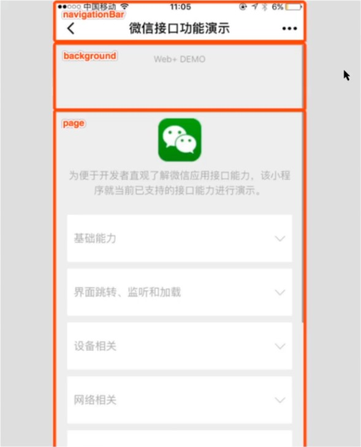
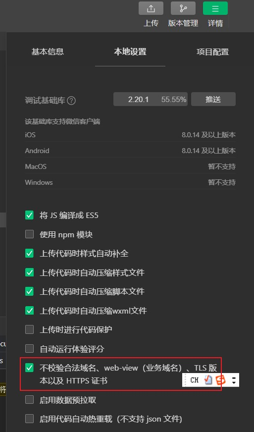

##  小程序相关

### 小程序的基本组成结构

- 小程序的页面由什么组成?

  pages文件夹下存储了小程序的所有页面，同时每一个页面都会以文件夹的形式存在，文件夹由四个文件组成。

  - .js 			  页面的脚本文件，存放页面的数据、生命周期等

  - .json         当前页面的配置文件，用于配置当前页面的外观

  - .wxml       当前页面的模板结构

  - .wxss        当前页面的页面样式表

    

- 其它文件/文件夹的作用？

  utils文件夹是一个工具类文件夹，用于存储一些工具类文件等。

  app.js：小程序的项目逻辑文件，用来注册小程序实例，绑定生命周期回调函数、错误监听和页面不存在监听函数等。

  app.json：小程序公共配置文件，决定页面的路径、窗口表现、设置网络超时时间、设置多tab

  app.wxss：小程序公共样式表

  

- project.config.json 文件的作用是什么?

  是项目配置文件，用来记录我们对小程序开发工具所做的个性化配置

  - setting 中保存了 编译相关的配置

  - projectname 中保存的是 项目名称

  - appid 中保存的是 小程序的账号 ID

    

- sitemap.json 文件的作用是什么？

  配置小程序及其页面是否允许被微信索引

  - rules中保存了索引规则列表的配置
  - rules规则中，action表示页面能否被索引(allow，disallow)，page表示生效的页面

### wxml VS html

> 什么是WXML？

&emsp;&emsp;WXML（WeiXin Markup Language）是框架设计的一套标签语言（组件），用来构建小程序页面的结构，其作用类似于网页开发中的 HTML


> WXML 和 HTML 的区别

- 标签名称不同

  - HTML（div，span，img，a）
  - WXML（view，text，image，navigator）

  

- 属性节点不同

  - \<a href="#">超链接\</a>
  - \<navigator url="/pages/home/home">跳转到home页\</navigator>

  

- 提供了动态渲染数据的模板语法

  - 数据绑定
  - 条件渲染
  - 列表渲染


<div class="warning">

> 是否可以在wxml中写入一个\<div>标签？

</div>

&emsp;&emsp;可以写入div 标签，但是 不要使用。 因为在wxml中所有 div 标签都会被解析为类 view 标签效果

### wxss VS css

> 什么是 WXSS

- WXSS （WeiXin Style Sheets）是一套样式语言，用于描述WXML 的组件样式
- 类似于网页开发中的css
- WXSS 具有 CSS 大部分的特性
- WXSS中新增了此处单位 - **rpx**，一个 rpx 为页面宽度的 1 / 750
- 提供了全局的样式和局部样式
  - 全局样式：写入到 **根目录的** wxss 中的样式
  - 局部样式：写入到 **页面的** wxss 中的样式
  - 当全局样式与局部样式互斥是，优先使用局部样式。

> WXSS 支持哪些 CSS 选择器？

1.  .class （推荐使用） 和 # id
2. element
3. 并集选择器(，) 和 后代选择器(空格)
4. ::after 和 ::before 等伪类选择器


### json文件

小程序中，额外多出一个 .json 的配置文件，.json文件主要分为两个：

1. 项目根目录下的 .json 文件

   用于修改项目的基本配置

   - window
     - navigationBar***
     - backgroundTextStyle

2. 页面文件夹下的 .json文件

   用于修改当前页面的基本配置（出现冲突以其为准）


### 小程序的内置组件

1. [view](https://developers.weixin.qq.com/miniprogram/dev/component/view.html)

2. [scroll-view](https://developers.weixin.qq.com/miniprogram/dev/component/scroll-view.html) 可以理解为：添加了overflow:scroll 属性的 div。

   ​					需要给其指定一个固定的宽度和高度，当scroll-view中的内容超出了这个宽高，就可以进行滚动

   ​					竖向滚动：

   ​							1.scroll-view 拥有固定的高度

   ​							2.scroll-view 内容的高度超出本身的高度

   ​							3.给scroll-view 添加了scroll-y的属性

   ​					横向滚动：

   ​							1.scroll-view 拥有固定的宽度

   ​							2.scroll-view 内容的高度超出本身的宽度

   ​							3.给scroll-view 添加了scroll-x的属性

   ```html
   <scroll-view class="test-scroll-view" scroll-y>
       <view class="scroll-view-child scroll-view-child-01">a</view>
       <view class="scroll-view-child scroll-view-child-02">b</view>
       <view class="scroll-view-child scroll-view-child-03">c</view>
   </scroll-view>
   ```

   ```css
   .test-scroll-view{
     width: 150px;
     height: 150px;
     background-color: blue;
   }
   
   .scroll-view-child{
     width: 200px;
     height: 200px;
   }
   
   .scroll-view-child-01{
     background-color: blueviolet;
   }
   
   .scroll-view-child-02{
     background-color: brown;
   }
   .scroll-view-child-03{
     background-color: aqua;
   }
   ```

   

3. [text && rich-text](https://developers.weixin.qq.com/miniprogram/dev/component/text.html)

   text可以参照html中的span标签，用于展示文本的一个组件

   view VS test  -->  div VS span

   rich-text可以通过nodes属性来显示富文本（html标签或字符串）。

4. [swiper && swiper-item](https://developers.weixin.qq.com/miniprogram/dev/component/swiper.html)

   swiper内部只能放置swiper-item组件，否则会导致错误

5. [button](https://developers.weixin.qq.com/miniprogram/dev/component/button.html)

   button中的opten-type属性表示了微信的开放能力

6. [image](https://developers.weixin.qq.com/miniprogram/dev/component/image.html)

   ```html
   <image src="https://img-baofun.zhhainiao.com/pcwallpaper_ugc/static/9896fa4067416113666207b7b5a74f08.JPG?x-oss-process=image%2fresize%2cm_lfit%2cw_3840%2ch_2160"></image>
   ```

   可以通过设置mode属性来控制图片缩放效果


### 小程序成员管理

成员角色：

- 管理员
- 项目成员
- 体验成员

/1.jpg)

### 小程序发布流程

- 本地 -- 开发版本
- 上传 -- 开发版本  / 体验版本（默认）
- 上传 -- 审核版本
- 上传 -- 线上版本

/2.jpg)

/3.jpg)

/4.jpg)

/5.jpg)

/6.jpg)

同时，还可以通过提交审核按钮，将小程序变为审核版本（要确保小程序基本信息填写完成），审核通过后，小程序将变为线上版本。

### 小程序的数据驱动原则

> 什么是数据驱动？

- 当数据发生变化时，视图理应发生变化


> 小程序中如何完成数据绑定？

- 在data中定义数据
- 在wxml中通过双大括号`{{}}`使用数据

- 之后当数据通过一些事件回调发生了变化后，视图会跟着重新渲染


```javascript
index.js


// 获取应用实例
const app = getApp()

Page({
  // 定义数据
  data:{
    product:{
      price:10,
      num:5
    }
  }
})
```

```html
index.wxml

<view>
  <!-- 在 wxml 中如果要访问数据（data定义），必须要使用 {{}} -->
  <!-- {{}} 语法中可以放置【任意的、单一的 JavaScript 表达式】 -->
  <view>
    商品的单价：{{product.price}}
  </view>
  <view>
    商品的数量：{{product.num}}
  </view>
  <view>
    商品的总价格：{{product.price * product.num}}
  </view>
</view>
```


### 小程序的常用事件

[小程序的常用事件](https://developers.weixin.qq.com/miniprogram/dev/framework/view/wxml/event.html)

> 如何为按钮添加点击事件？

- bindtap || bind:tap

> 如何修改 data 中数据的值？

- 通过 this.setData({})  定义新的值
- 通过 this.data 访问具体的值

```html
index.wxml

<view>
  <view>
    商品的单价：{{product.price}}
  </view>
  <view>
    商品的数量：{{product.num}}
  </view>
  <view>
    商品的总价格：{{product.price * product.num}}
  </view>

  <!-- 
    1. 创建一个按钮
    2. 监听按钮的点击事件
    3. 当用户点击时，让product.num + 1
   -->
  <!-- 
    小程序中点击事件不是click，而是tap
    监听tap事件，需要用到 bind
      1. bindtap(推荐)
      2. bind:tap
   -->
  <button type="primary" bindtap="onAddNum">num +1 </button>
</view>
```

```javascript
index.js


// 获取应用实例
const app = getApp()

Page({
  // 定义数据
  data:{
    product:{
      price:10,
      num:5
    }
  },
  /**
   * num + 1 的对应事件
   * 注意此处事件定义的位置与data平级
   */
  onAddNum () {
    // 修改 data 的数据：setData
    // 访问 data 的数据：this.data
    this.setData({
      // key代表：修改的数据
      // val代表：当前 key 的最新值
      'product.num': this.data.product.num + 1
    })
  }
})
```

### 小程序中事件传参


> 如何为点击事件传递参数？

- 通过属性绑定（data-xx） 把需要传递的参数绑定到DOM中。
- 在对应的回调函数中，通过 e.target.dataset 进行访问。

```html
index.wxml

<view>
  <!-- 在 wxml 中如果要访问数据（data定义），必须要使用 {{}} -->
  <!-- {{}} 语法中可以放置【任意的、单一的 JavaScript 表达式】 -->
  <view>
    商品的单价：{{product.price}}
  </view>
  <view>
    商品的数量：{{product.num}}
  </view>
  <view>
    商品的总价格：{{product.price * product.num}}
  </view>

  <!-- 我们希望 onAddNum 接收参数，每次点击 num 时，增加传入的参数的数量 -->
  <!-- 
    为 点击事件 传递参数：
      1. event 对象: 形参
        1.1 通过 e.target.dataset 访问 传递的参数
      2. data- 属性: 实参
        2.1 小程序中 不能直接为回调方法传递实参
        2.2 而是需要通过属性绑定的形式，把需要传递的参数绑定到当前 DOM 元素的 data-xx 属性下
   -->
  <button type="primary" bindtap="onAddNum" data-step="5">num +N </button>
</view>
```

```javascript
index.js


// 获取应用实例
const app = getApp()

Page({
  // 定义数据
  data:{
    product:{
      price:10,
      num:5
    }
  },
  onAddNum (e) {
    // 拿到传递的参数
    const step = parseInt(e.target.dataset.step)
    // 修改 data 的数据：setData
    // 访问 data 的数据：this.data
    this.setData({
      // key代表：修改的数据
      // val代表：当前 key 的最新值
      'product.num': this.data.product.num + step
    })
  }
})
```

### 实现【双向数据绑定】

> 什么叫做双向数据绑定？

- 当视图发生变化时，数据跟随发生变化
- 当数据发生变化时，视图跟随发生变化

> 小程序中如何实现双向数据绑定？

- 通过value 为input 视图绑定数据
- 通过监听 bindinput 获取视图变化，在回调中修改数据


```html
index.wxml

<view>
  <!-- 在 wxml 中如果要访问数据（data定义），必须要使用 {{}} -->
  <!-- {{}} 语法中可以放置【任意的、单一的 JavaScript 表达式】 -->
  <view>
    商品的单价：{{product.price}}
  </view>
  <view>
    商品的数量：{{product.num}}
  </view>
  <view>
    商品的总价格：{{product.price * product.num}}
  </view>

  <!-- 
    创建一个数字输入框，输入框于【商品数量】完成【双向数据绑定】
    即：
      1.输入框内容（视图）发生变化时，商品的数量（数据）同步跟随发生变化
      2.商品数量（数据）发生变化时，输入框内容（视图）同步跟随发生变化
   -->
   <!-- 
     把一个复杂的功能拆解成多个简单的步骤
     1. 创建一个【数字输入框】
     2. 设置【商品数量为输入框的初始值】
     3. 监听用户的输入行为
     4. 获取用户的输入信息
     5. 赋值给【商品数量】
    -->
    <view>
      商品的数量：
    <!-- 1. 创建一个数字输入框 -->
    <!-- 2. 设置【商品数量为输入框的初始值】  -->
    <!-- 3. 监听用户的输入行为 -->
    <input class="num-input" bindinput="onInput" type="number" value="{{ product.num }}"/>
    </view>
</view>
```

```javascript
index.js

// 获取应用实例
const app = getApp()

Page({
  // 定义数据
  data:{
    product:{
      price:10,
      num:5
    }
  },
  /***
   * 输入框输入的对应事件
   */
  onInput(e){
    // 4. 获取用户输入的值
    const val = parseInt(e.detail.value)
    // 5. 赋值给【商品数量】
    this.setData({
      'product.num':val
    })
  }
})
```


### 条件渲染

> v-if 与 hidden的区别是什么？

1. wx:if 条件满足则渲染，否则不渲染

2. 当hidden 条件满足 则隐藏，否则不隐藏

> 如何区分两者的使用场景？

​     一般来说，wx:if 有更高的切换消耗，而 hidden 有更高的初始渲染消耗。

​     因此，如果业务需要平缓切换的情境下，用hidden更好。

​     如果在运行时条件不大可能改变，用wx:if 更好。

```html
index.wxml

<!-- 
    根据花费不同，得到不同的回应：
    1.如果【总价格 <= 100】：hello 帅哥
    2.如果【总价格 > 100 && 总价格 < 1000】: 哇哦 有钱人哦
    3.如果【总价格 >= 1000】：土豪，你好
-->
<!-- 
    条件渲染：
    1. wx:if ... wx:elif ... wx:else
    2. hidden（针对当前业务，使用hidden更好）
-->
<!--  1. wx:if ... wx:elif ... wx:else：判断结果 true 则进行渲染，否则不进行渲染 -->
<view>
    回答：
    <text wx:if="{{product.price * product.num <= 100}}">hello 帅哥</text>
    <text wx:elif="{{product.price * product.num > 100 && product.price * product.num < 1000}}">哇哦 有钱人哦</text>
    <text wx:else>土豪，你好</text>
</view>

<!-- 2. hidden：结果为 true 则【隐藏】，否则【不隐藏】 -->
<view>
    售货员小姐姐对你发出一声惊呼：
    <text hidden="{{!(product.price * product.num <= 100)}}">hello 帅哥</text>
    <text hidden="{{!(product.price * product.num > 100 && product.price * product.num < 1000)}}">哇哦 有钱人哦</text>
    <text hidden="{{product.price * product.num < 1000}}">土豪，你好</text>
</view>
```

### 列表渲染

> 使用 wx:for时，当前项的【下标变量名】和【当前项变量名】默认分别是什么？

- 默认下标变量名为：index
- 默认当前项变量名为：item

> block组件是否会被渲染？

- block只是一个包裹性质的容器，并不会被渲染

```html
index.html

<!-- 
    列表渲染：wx:for
    wx:for="{{要循环的列表}}"
    默认的当前项和下标名称：
    item、index
-->
<view class="product-box">
    <!-- block 组件：包裹性值的容器，不会进行渲染 -->
    <!-- 
        wx:for 它必须要配合 wx:key 进行使用，wx:key 可以提高 for 循环 的性能。 
        对应的 key 值必须是一个不可以重复的值
        注意：使用 index 作为 wx:key 的表达式是不需要使用 {{}}
    -->
    <block wx:for="{{ products }}" wx:key="index">
        <view class="product-item">
            <text>索引：{{index}}</text>--
            <text>商品名：{{ item.name }}</text>--
            <text>价格：{{ item.price }}</text>
        </view>
    </block>
</view>
```

```javascript
index.js

const app = getApp()

Page({
  // 定义数据
  data:{
    products:[
      {
        name:'苹果',
        price:3.2
      },
      {
        name:'面包',
        price:5
      },
      {
        name:'可乐',
        price:5
      }
    ]
  }
})
```


### 配置文件解读

[app.json配置文件](https://developers.weixin.qq.com/miniprogram/dev/reference/configuration/app.html)

- pages		string[]    	必填		页面路径列表

  当我们新建了Pages时，就会在pages项中自动添加相关属性。或者当我们手动添加属性时，就会自动新建Pages。

- window     Object          非必填        全局的默认窗口表现

  用于设置小程序的状态栏、导航条、标题、窗口背景色。

  

- tabbar       Object          非必填        底部tab栏的表现

  ```json
  app.json
  
  {
    "pages": [
      "pages/index/index",
      "pages/list/list",
      "pages/logs/logs",
      "pages/test-01/test-01"
    ],
    "window": {
      "backgroundTextStyle": "light",
      "navigationBarBackgroundColor": "#fff",
      "navigationBarTitleText": "Weixin",
      "navigationBarTextStyle": "black",
      "backgroundColor": "#00ff00",		// backgroundColor需要配合enablePullDownRefresh才可以得到体现
      "enablePullDownRefresh": true
    },
    "tabBar": {
      "selectedColor": "#efabcc",
      "list": [{
        "pagePath": "pages/index/index",
        "text":"首页",
        "iconPath": "/images/home-unselect.png",
        "selectedIconPath": "/images/home-selected.png"
      },{
        "pagePath": "pages/list/list",
        "text":"列表",
        "iconPath": "/images/list-unselect.png",
        "selectedIconPath": "/images/list-select.png"
      }]
    },
    "style": "v2",
    "sitemapLocation": "sitemap.json"
  }
  ```

  ```json
  index.json	
  
  // 当页面配置文件与全局配置文件冲突时，以全局配置文件为主。
  {
    "usingComponents": {},
    "navigationBarBackgroundColor": "#000",
    "navigationBarTextStyle": "white"
  }
  ```


### 数据请求

> 小程序中的数据请求有什么限制？以及如何解决这种限制

* 限制：

  1. 只能请求 HTTPS 类型的接口

  2. 必须把接口的域名添加到信任列表中

 * 解决方案：

   1. 生产环境（兼容开发环境）：把接口类型变为https，同时把接口的域名添加到信任列表中

   2. 开发环境：勾选【不校验合法域名】

   /8.jpg)

   

> 小程序中的数据请求会存在跨域问题吗？为什么？

&emsp;&emsp;跨域问题主要针对浏览器而言，而小程序宿主环境为【微信小程序客户端】，所以小程序中不存在【跨域问题】

> 小程序的数据请求可以叫做\`ajax\`请求吗？为什么？

&emsp;&emsp;ajax依赖于 XMLHttpRequest 对象，而小程序宿主环境为【微信小程序客户端】，所以小程序中的【网络请求】不是 ajax 请求。

```html
index.wxml

<view>首页</view>

<!-- 当点击按钮时，发起 get 请求 -->
<button type="primary" bindtap="onGetClick">发起 get 请求</button>

<!-- 当点击按钮时，发起 post 请求 -->
<button type="primary" bindtap="onPostClick">发起 post 请求</button>
```

```javascript
index.js

// 获取应用实例
const app = getApp()

/**
 
 */
Page({
  /**
   * get 请求
   */
  onGetClick(){
    wx.request({
      url:'https://api.imooc-blog.lgdsunday.club/api/test/getList',
      method:'GET',
      success:(res)=>{
        console.log(res);
      }
    })
  },

  onPostClick(){
    wx.request({
      url:'https://api.imooc-blog.lgdsunday.club/api/test/postData',
      method:'POST',
      data:{
        msg:"祝我看到京吹3"
      },
      success:(res)=>{
        console.log(res)
      }
    })
  }
})
```

### 使用promise解决异步编程

> promise 是如何解决回调地狱的问题呢？

- 通过 .then 的方式进行链式调用

> promise 的状态分为几种，分别是什么？

- 待定（pending）：初始状态，既没有被兑现，也没有被拒绝。
- 已兑现（fulfilled）：意味着操作成功完成。
- 已拒绝（rejected）：表示操作失败。

> 如何让promise 变成 已兑现 的状态，如何接收已兑现的结果

- 通过 resolve 可以把Promise的状态，从pending变为 fulfilled。
- 通过 promise.then方法传递的第一个回调函数的第一个参数接收 fulfilled 的结果。

```javascript
A、B、C、D 函数返回一个Promise对象,并且在对象内部实现了相关逻辑

A()
	.then(res=>{
    console.log(res);
    return B()
	}
	.then(res=>{
    console.log(res);
    return C()
	}
	.then(res=>{
    console.log(res);
    return D()
	}
	.then(res=>{
    console.log(res);
	}
```

> async和await 的作用是什么？

- async + await 必须配合 promise 使用，同时async 和 await 必须一起使用
- async + await 可以简化 promise 的异步操作，把 promise 的异步操作变成【同步的写法】
- async：标记一个函数，把一个函数标记为【异步函数】
- await：需要在【异步函数】中使用，标记当前的操作为【异步操作】

> 使用await 的注意事项是什么？

- await 必须在被 async 标记的函数中使用

```javascript
async function test(){
    const resA = await A();		// 此处的 resA 相当于 上方代码的 A
    console.log(resA);
    const resB = await B();
    console.log(resB);
    const resC = await C();
    console.log(resC);
    const resD = await D();
    console.log(resD);
}

test()
```


> 如何使 wx.request 配合 async + await 使用

- 使用 promise 封装 wx.request 请求
- 使用 async 和 await 简化 promise 操作

```javascript
  /**
   * async + await
   * 目标：使用 async + await 完成需求。
   */
  /**
   * 1.因为小程序中的 wx.request 方法不支持 promise 化，所以使用promise 封装 wx.request请求
   */
  async onAsyncClick(){
    const resA = await this.pA();
    console.log(resA.data.data.msg)
    const resB = await this.pB();
    console.log(resB.data.data.msg)
    const resC = await this.pC();
    console.log(resC.data.data.msg)
    const resD = await this.pD();
    console.log(resD.data.data.msg)
  },
  pA(){
    return new Promise((resolve,reject)=>{
      console.log('执行A接口的逻辑')
      wx.request({
        url:'https://api.imooc-blog.lgdsunday.club/api/test/A',
        success:(res)=>{
          resolve(res)
        },
        fail:(err)=>{
          reject(err)
        }
      })
    })
  },
  pB(){
    return new Promise((resolve,reject)=>{
      console.log('执行B接口的逻辑')
      wx.request({
        url:'https://api.imooc-blog.lgdsunday.club/api/test/B',
        success:(res)=>{
          resolve(res)
        },
        fail:(err)=>{
          reject(err)
        }
      })
    })
  },
  pC(){
    return new Promise((resolve,reject)=>{
      console.log('执行C接口的逻辑')
      wx.request({
        url:'https://api.imooc-blog.lgdsunday.club/api/test/C',
        success:(res)=>{
          resolve(res)
        },
        fail:(err)=>{
          reject(err)
        }
      })
    })
  },
  pD(){
    return new Promise((resolve,reject)=>{
      console.log('执行D接口的逻辑')
      wx.request({
        url:'https://api.imooc-blog.lgdsunday.club/api/test/D',
        success:(res)=>{
          resolve(res)
        },
        fail:(err)=>{
          reject(err)
        }
      })
    })
  }
```

### 小程序页面的生命周期

> 什么是生命周期？什么是生命周期函数？

- 生命周期：一件事物由 创建 到 销毁 的全过程
- 生命周期函数：生命周期中的关键时刻

> onReady 的调用时机是什么？

- 页面初次渲染完成后
- 一般在这里 获取服务端数据


```html
list.wxml

<scroll-view scroll-y class="list-box">
  <block wx:for="{{listData.list}}" wx:key="index">
    <view class="list-item">{{index}}--{{item.title}}</view>
  </block>
</scroll-view>
```

```javascript
list.js

Page({

  /**
   * 页面的初始数据
   */
  data: {
    listData:[]
  },

  /**
   * 生命周期函数--监听页面加载
   */
  onLoad: function (options) {
    console.log('onLoad')
  },

  /**
   * 生命周期函数--监听页面初次渲染完成
   */
  onReady: async function () {
    console.log('onReady')
    // 请求服务端获取数据
    // 页面出现之后，可以获取接口数据，并进行渲染
     const data = await this.getList()
     this.setData({
       'listData':data
     })
  },

  /**
   * 生命周期函数--监听页面显示
   */
  onShow: function () {
    console.log('onShow')
  },

  /**
   * 生命周期函数--监听页面隐藏
   */
  onHide: function () {
    console.log('onHide')
  },

  /**
   * 生命周期函数--监听页面卸载
   */
  onUnload: function () {
    console.log('onUnload')
  },

  /**
   * 请求数据的方法
   */
  getList(){
    return new Promise((resolve,reject)=>{
      wx.request({
        url:'https://api.imooc-blog.lgdsunday.club/api/test/getList',
        success:(res)=>{
          resolve(res.data.data)
        }
      })
    })
  }
})
```

### PullToRefresh 下拉刷新与上拉加载

<div class="success">

> 分页：当列表数据过多时，一次性加载所有的数据会导致请求过慢，所以前端就会分页来加载数据。
>
> 如果我们想要在当前项目中实现【分页请求】，就需要借助【下拉刷新于上拉加载】的功能，也就是pullToRefresh

</div>


> 如何开启下拉刷新？

- 在页面的json文件中通过 enablePullDownRefresh 开启

> 在 onPullDownRefresh 中，一般进行什么操作？

- 重置页面
- 重置数据源
- 关闭下拉动画

> 在 onReachButton 中，一般进行什么操作？

- 判断数据是否已经加载完成
- 自增页数
- 累加数据


整个【分页加载分为两个部分】

1. 上拉加载
2. 下拉刷新

**上拉加载：**

```html
list.wxml

<scroll-view scroll-y class="list-box">
  <block wx:for="{{listData}}" wx:key="index">
    <view class="list-item">{{index}}--{{item.title}}</view>
  </block>
  <!-- 底线 -->
  <view wx:if="{{total===listData.length}}" class="bottom">--- 我也是有底线的 ---</view>
</scroll-view>
```

```javascript
list.js

Page({

  /**
   * 页面的初始数据
   */
  data: {
    page:1,
    size:10,
    total:-1,
    listData:[]
  },

  /**
   * 生命周期函数--监听页面初次渲染完成
   */
  onReady: async function () {
    console.log('onReady')
    // 请求服务端获取数据
    // 页面出现之后，可以获取接口数据，并进行渲染
     const data = await this.getList()
     this.setData({
       'listData':data.list,
       total:data.total
     })
  },

  /**
   * 页面上拉触底事件的处理函数
   */
  onReachBottom: async function () {
    // 当已经没有新数据之后，不再发起请求 
    if (this.data.total === this.data.listData.length) return
    console.log('onReachBottom')
    // 1.修改page
    this.setData({
      page:this.data.page+1,
    })
    // 2.获取最新数据
    const data = await this.getList()
    // 3.新获取到的数据补充到现有数据的后面
    this.setData({
      listData:[...this.data.listData,...data.list]
    })
  },


  /**
   * 请求数据的方法
   */
  getList(){
    return new Promise((resolve,reject)=>{
      wx.request({
        url:'https://api.imooc-blog.lgdsunday.club/api/test/getList',
        data:{
          page:this.data.page,
          size:this.data.size
        },
        success:(res)=>{
          resolve(res.data.data)
        }
      })
    })
  }
})
```

**下拉刷新：**

想要在【小程序】中实现【下拉刷新】不同于上拉加载，需要首先开启【下拉刷新】：

```json
list.json

{
  "usingComponents": {},
  "backgroundColor": "#ccc",
  "enablePullDownRefresh": true
}
```

```javascript
list.js

Page({

  /**
   * 页面的初始数据
   */
  data: {
    page:1,
    size:10,
    total:-1,
    listData:[]
  },


  /**
   * 生命周期函数--监听页面初次渲染完成
   */
  onReady: async function () {
    console.log('onReady')
    // 请求服务端获取数据
    // 页面出现之后，可以获取接口数据，并进行渲染
     const data = await this.getList()
     this.setData({
       'listData':data.list,
       total:data.total
     })
  },

  /**
   * 页面相关事件处理函数--监听用户下拉动作
   */
  onPullDownRefresh: async function () {
    // 1. 重置页数
    this.setData({
      page:1
    })
    // 2. 获取最新的数据
    const data = await this.getList()
    // 3. 使用新数据覆盖就数据
    this.setData({
      listData:data.list
    })
    // 4. 关闭下拉刷新的动作（在真机中，下拉刷新的动作是不会自动关闭的）
    wx.stopPullDownRefresh()
  },

  /**
   * 请求数据的方法
   */
  getList(){
    return new Promise((resolve,reject)=>{
      wx.request({
        url:'https://api.imooc-blog.lgdsunday.club/api/test/getList',
        data:{
          page:this.data.page,
          size:this.data.size
        },
        success:(res)=>{
          resolve(res.data.data)
        }
      })
    })
  }
})
```

### 小程序的页面跳转

> 页面跳转的方式有几种？

小程序的页面跳转分为两种方式：

1. 声明式导航

   1. 跳转到tabbar 页面
   2. 跳转到 非 tabbar页面
   3. 后退页面

   ```html
   list.wxml
   
   <!-- 声明式导航：跳转到 tabbar 页面 -->
   <navigator open-type="switchTab" url="/pages/index/index">声明式导航，跳转到 tabbar页面</navigator>
   
   <scroll-view scroll-y class="list-box">
     <block wx:for="{{listData}}" wx:key="index">
       <view class="list-item">
       <!-- 声明式导航，navigator -->
       <!-- 声明式导航，跳转到 非 tabbar页面 -->
       <!-- url 的表达式必须以 / 开头 -->
       <navigator url="/pages/detail/detail">{{index}}--{{item.title}}</navigator>
       </view>
     </block>
     <!-- 底线 -->
     <view wx:if="{{total===listData.length}}" class="bottom">--- 我也是有底线的 ---</view>
   </scroll-view>
   ```

   ```html
   detail.wxml
   
   <!--pages/detail/detail.wxml-->
   <text>pages/detail/detail.wxml</text>
   
   <!-- 声明式导航：后退页面 -->
   <navigator open-type="navigateBack">声明式导航：后退页面</navigator>
   ```

   

2. 编程式导航

   1. 跳转到tabbar 页面
   2. 跳转到 非 tabbar页面
   3. 后退页面

   小程序中提供了三个API，用来帮助我们进行 **编程式导航**

   1. wx:switchTab：跳转到 tabBar 页面，并关闭其他所有非 tabBar 页面

      ```html
      <!-- 编程式导航：跳转到tabbar页面 -->
      <button type="primary" bindtap="onSwitchToHome">编程式导航：跳转到tabbar页面</button>
      
      onSwitchToHome(){
          wx.switchTab({
            url: '/pages/index/index',
          })
        }
      ```

      

   2. wx:navigateTo：保留当前页面，跳转到应用内的某个页面。但是不能跳到 tabbar 页面

      ```html
      <!-- 编程式导航：跳转到 非 tabbar 页面 -->
      <button type="primary" bindtap="onNavigateToDetail">编程式导航：跳转到 非 tabbar 页面</button>
      
      
      onNavigateToDetail(){
          wx.navigateTo({
          	url: '/pages/detail/detail',
          })
      }
      ```

   3. wx:navigateBack：关闭当前页面，返回上一页面或多级页面

      ```html
      <!-- 编程式导航：后退页面 -->
      <navigator open-type="navigateBack" bindtap="onNavigateBack">编程式导航：后退页面</navigator>
      
      onNavigateBack(){
          wx.navigateBack({
          	delta:1 // 表示页面后退的层级
          })
      }
      ```

      

> 跳转到tabbar 页面和 非tabbar 页面的方式分别是什么？

- 声明式导航

  - 跳转到tabbar页面：

    ```html
    <navigator open-type="switchTab" url="/pages/index/index" />
    ```

  - 跳转到非tabbar页面：

    ```html
    <navigator open-type="navigate"(默认值，可以不指定) url="/pages/detail/detail" />
    ```

- 编程式导航

  - 跳转到tabbar页面：

    wx.switchTab({url:'xx'})

  - 跳转到非tabbar页面：

    wx.navigateTo({url:'xx'})

> 如何进行导航传参？

【小程序】的导航传参遵循：get请求的标准

- 以 ? 分割 url 和 参数
- 以 = 连接参数的 key 和 value
- 以 & 来拼接参数

```html
list.wxml

<scroll-view scroll-y class="list-box">
  <block wx:for="{{listData}}" wx:key="index">
    <view class="list-item">

    <!-- 导航传参 -->
    <navigator url="/pages/detail/detail?index={{index}}&title={{item.title}}">{{index}}--{{item.title}}</navigator>
        
    </view>
  </block>
  <!-- 底线 -->
  <view wx:if="{{total===listData.length}}" class="bottom">--- 我也是有底线的 ---</view>
</scroll-view>
```

```javascript
detail.js

Page({

  /**
   * 页面的初始数据
   */
  data: {
    index:'',
    title:''
  },

  /**
   * 生命周期函数--监听页面加载
   */
  onLoad: function (options) {	// 在onLoad中接收导航传参的参数。
    console.log(options);
    this.setData({
      index:options.index,
      title:options.title
    })
  },
})
```

```html
detail.wxml

<!-- 传递过来的参数 -->
<view>{{index}} --- {{title}}</view>
```

<div class="base">

> 编程式导航同理

</div>

### 小程序中的组件

> 组件应该被放入到哪个文件夹中？

在根目录的components中

> 如何在页面中使用自定义组件？

1. 在页面的.json文件中，通过 usingComponents 进行注册
2. 在 wxml文件中，以注册的 key 为标签名进行使用


1. 创建组件

   1. 创建 components 文件夹
   2. 创建 tabs 和 list 文件夹
   3. 右键 新建 Component

   /10.jpg)

   /11.jpg)

2. 使用组件

   1. 找到页面的 .json 文件
   2. 在 usingComponents 文件夹下 **注册组件**
      1.  key 为当前组件在该页面中的标签名
      2. value 为组件的代码路径
   3. 在页面的 wxml 文件中，以注册的 key 为标签名，使用组件

/12.jpg)

### 组件的生命周期

> 组件的生命周期 和 方法 分别应该被放入到哪个节点下？

&emsp;&emsp;**组件**的生命周期应该被定义在 lifetimes 中，而方法必须要放入 methods 中

> 组件的生命周期有哪些？

1. created：组件实例刚刚被创建好。**此时还不能调用** setData（注意与 vue 中的created进行区分）
2. attached：组件完全初始化完毕、进入页面节点树后。**绝大多数初始化工作可以在这个时机进行**
3. detached：在组件离开页面节点树后

> 获取数据的操作应该在哪个函数中进行？

&emsp;&emsp;attached

```html
tabs.wxml

<scroll-view scroll-x class="tabs-box" >
  <view wx:for="{{listData}}" wx:key="index" class="tab {{active === index? 'active':''}}">
    {{item.label}}
  </view>
</scroll-view>
```

```css
tabs.wxss

/* components/tabs/tabs.wxss */
.tabs-box{
  width: 750rpx;
  white-space: nowrap;
  border-bottom: 1px solid #ccc;
}

.tab{
  display: inline-block;
  padding: 12px 22px;
}

.active{
  color:#f94d2a
}
```

```javascript
tabs.js

// components/tabs/tabs.js
Component({
  /**
   * 组件的属性列表
   */
  properties: {

  },

  /**
   * 组件的初始数据
   */
  data: {
    // tabs 数据
    listData:[],
    // 标记当前选中的 index
    active: -1
  },

  /**
   * 组件的方法列表
   * 组件中的方法必须定义到 methods 选项中
   */
  methods: {
    /**
     * 获取数据的方法
     */
    loadTabsData(){
      wx.request({
        url:'https://api.imooc-blog.lgdsunday.club/api/hot/tabs',
        success:(res)=>{
          console.log(res);
          this.setData({
            listData:res.data.data.list,
            active:0
          })
        }
      })
    }
  },
  /**
   * 生命周期函数列表
   */
  lifetimes:{
    /**
     * 组件完全初始化完毕、进入页面节点树后
     */
    attached(){
      this.loadTabsData()
    }
  }
})
```

[scroll-view不支持flex布局的问题](https://blog.csdn.net/qq_41687724/article/details/113520856?spm=1001.2101.3001.6650.5&utm_medium=distribute.pc_relevant.none-task-blog-2%7Edefault%7EBlogCommendFromBaidu%7Edefault-5.no_search_link&depth_1-utm_source=distribute.pc_relevant.none-task-blog-2%7Edefault%7EBlogCommendFromBaidu%7Edefault-5.no_search_link)

### 数据监听器

> 小程序中通过哪个选项来声明数据监听器？

- observers

> 数据监听器的使用场景是什么？

- 监听数据变化，在数据变化后进行一些操作

```html
tabs.wxml

<scroll-view scroll-x class="tabs-box" >
  <view wx:for="{{listData}}" wx:key="index" class="tab {{active === index? 'active':''}}" bindtap="onItemClick" data-index="{{ index }}">
    {{item.label}}
  </view>
</scroll-view>
```

```javascript
tabs.js

Component({
  /**
   * 组件的属性列表
   */
  properties: {

  },

  /**
   * 组件的初始数据
   */
  data: {
    // tabs 数据
    listData:[],
    // 标记当前选中的 index
    active: -1
  },

  /**
   * 组件的方法列表
   * 组件中的方法必须定义到 methods 选项中
   */
  methods: {
    /**
     * 获取数据的方法
     */
    loadTabsData(){
      wx.request({
        url:'https://api.imooc-blog.lgdsunday.club/api/hot/tabs',
        success:(res)=>{
          console.log(res);
          this.setData({
            listData:res.data.data.list,
            active:0
          })
        }
      })
    },
    /**
     * 1.监听用户选中项的变化
     * item点击事件
     */
    onItemClick(e){
      // 1.1 ：获取用户选中的下标
      const {index} = e.target.dataset;
      // 1.2 ：修改选中项
      this.setData({
        active:index
      })
    }
  },
  /**
   * 生命周期函数列表
   */
  lifetimes:{
    /**
     * 组件完全初始化完毕、进入页面节点树后
     */
    attached(){
      this.loadTabsData()
    }
  },
  // 监听用户选中的 tab，根据用户选中的 tabs 来切换底部 list 的数据
  // 步骤：(本节实现前两步)
  // 1. 监听用户选中项的变化
  // 2. 获取用户选中的数据 id
  // 3. 把 id 传递给 list 组件
  // 4. list 组件根据接收到的 id 获取对应的数据

  /**
   * 1.3 监听active 的变化
   * 通过数据监听器：observers
   */
  observers:{
    // key：要监听的数据
    // value：数据变化时，调用的函数
    active:function(val){ // val：变化之后的值
      // 2. 获取用户选中的数据 
      const {label} = this.data.listData[val]
      console.log(label)
    }
  }
})
```

### 组件之间的关系与通讯

> 组件之间数据传递的关系可以分为哪几种？

1. 父向子传递数据
2. 子向父传递数据
3. 兄弟之间传递数据

> 不同关系之间的传递数据方式？

1. 父子关系：

   1. 父向子传参：

      ```javascript
      // 子组件：通过 properties 声明要从父组件中接收的数据
      /**
      * 组件的属性列表
      */
      properties: {
          tabId:String
      },
          
      // 父组件：通过自定义属性的形式传递数据，以子组件中定义的 key 为属性名，以要传递的数据为属性值
      <list tabId = "{{tabSelectId}}">
      ```

   2. 子向父传参：

      ```javascript
      // 子组件：通过 triggerEvent 方法发送一个通知，通知父组件接收数据。
      // 方法的第一个参数为：通知名
      // 方法的第二个参数为：要传递的数据
      this.triggerEvent('change', {
          id
      })
      
      // 父组件：通过 bind 监听子组件中发送的通知
      // bind 后的内容为 子组件发送的通知名，表达式为接收到该通知时所触发的方法
      <tabs bind:change="onTabChange"></tabs>
      // 方法被触发后可以通过 e.detail 的形式获取子组件传递过来的数据对象
      onTabChange (e) {
          const {id} = e.detail;
          this.setData({
              tabSelectId: id
          })
      }
      ```

2. 兄弟关系

   1. 兄弟组件之间传参：**兄弟关系 === 没有关系**。 兄弟组件只是为了方便称呼的一个叫法而已。

   2. 所以想要完成兄弟组件之间的传参，就需要：**为它们建立关系。**

      而建立关系说白了就是为了找到一个：**和这两个组件都认识的 ”中间人“ 。** 

      这个中间人一般为：**统一的父组件。**

      而最后：兄弟组件之间想要传递数据，就需要利用 ”中间人进行传递“，也就是：

      【兄弟 A 组件】传递数据给 父组件（中间人）

      父组件（中间人）再把数据传递给 【兄弟 B 组件】

子组件：

Tab：

```html
<scroll-view scroll-x class="tabs-box" >
  <view wx:for="{{listData}}" wx:key="index" class="tab {{active === index? 'active':''}}" bindtap="onItemClick" data-index="{{ index }}">
    {{item.label}}
  </view>
</scroll-view>
```

```javascript
// components/tabs/tabs.js
Component({
  /**
   * 组件的初始数据
   */
  data: {
    // tabs 数据
    listData:[],
    // 标记当前选中的 index
    active: -1
  },

  /**
   * 组件的方法列表
   * 组件中的方法必须定义到 methods 选项中
   */
  methods: {
    /**
     * 获取数据的方法
     */
    loadTabsData(){
      wx.request({
        url:'https://api.imooc-blog.lgdsunday.club/api/hot/tabs',
        success:(res)=>{
          console.log(res);
          this.setData({
            listData:res.data.data.list,
            active:0
          })
        }
      })
    },
    /**
     * 1.监听用户选中项的变化
     * item点击事件
     */
    onItemClick(e){
      // 1.1 ：获取用户选中的下标
      const {index} = e.target.dataset;
      // 1.2 ：修改选中项
      this.setData({
        active:index
      })
    }
  },
  /**
   * 生命周期函数列表
   */
  lifetimes:{
    /**
     * 组件完全初始化完毕、进入页面节点树后
     */
    attached(){
      this.loadTabsData()
    }
  },
  // 监听用户选中的 tab，根据用户选中的 tabs 来切换底部 list 的数据
  // 步骤：
  // 1. 监听用户选中项的变化
  // 2. 获取用户选中的数据 id
  // 3. 把 id 传递给 list 组件
  // 4. list 组件根据接收到的 id 获取对应的数据

  /**
   * 1.3 监听active 的变化
   * 通过数据监听器：observers
   */
  observers:{
    // key：要监听的数据
    // value：数据变化时，调用的函数
    active:function(val){ // val：变化之后的值
      // 2. 获取用户选中的数据 
      const {id} = this.data.listData[val]
      // 3. 把 id 传递给 list 组件
      this.triggerEvent('change',{
        id
      })
    }
  }
})
```

```css
/* components/tabs/tabs.wxss */
.tabs-box{
  width: 750rpx;
  white-space: nowrap;
  border-bottom: 1px solid #ccc;
  /* 想要让 tab 固定到顶部 */
  position: sticky;
  top: 0;
  z-index:9;
  background: #fff;
}

.tab{
  display: inline-block;
  padding: 12px 22px;
}

.active{
  color:#f94d2a
}
```


List：

```javascript
// components/list/list.js
Component({
  /**
   * 组件的属性列表
   */
  properties: {
    tabId:String
  },

  /**
   * 组件的初始数据
   */
  data: {
    listData:[]
  },

  /**
   * 组件的方法列表
   */
  methods: {
    /**
     * 数据请求的方法
     */
    loadListData(){
      wx.request({
        url:'https://api.imooc-blog.lgdsunday.club/api/hot/list',
        data:{
          type:this.data.tabId  // 通过 this.data 访问 properties 中的数据
        },
        success:(res)=>{
          console.log(res.data.data)
          this.setData({
            listData:res.data.data.list
          })
        }
      })
    }
  },
  /**
   * 数据监听器
   */
  observers:{
    tabId:function(val){
      if(!val) return;    // 第一次会传一个' '，因为tabId的初始值为空
      // 4. list 组件根据接收到的 id 获取对应的数据
      // console.log(`list组件中接收到的id:${val}`)
      this.loadListData()
    }
  }
})
```

```html
<scroll-view scroll-y>
  <view wx:for="{{listData}}" wx:key="index" class="list-item">
    {{item.title}}
  </view>
</scroll-view>
```

父组件：

```javascript
// index.js
// 获取应用实例
const app = getApp()

Page({
  data:{
    tabSelectId:''
  },
  /**
   * 监听子组件的 change 事件回调
   */
  onTabChange(e){
    const {id} = e.detail;
    console.log(`父组件中接收到的 ID：${id}`)
    this.setData({
      tabSelectId:id
    })
  }
})
```

```html
<view>
<!-- 监听子组件的 change 事件 -->
  <tabs bind:change="onTabChange"></tabs>
  <list tabId="{{tabSelectId}}"></list>
</view>
```


### 组件的插槽

> 什么时候需要使用插槽？

- 由父组件来指定子组件中某一部分展示的内容和样式时

> 小程序中如何定义多个插槽？

- 指定 options 的 multipleSolts 为 true

定义单一插槽：

在组件中使用 slot 组件定义插槽。表示占据了这一块空间，等待父组件填充。

```html
list.wxml

<!-- 单一插槽 -->
<slot></slot>
```

```html
index.wxml

<list tabId="{{tabSelectId}}">
    <view>这是我在 index 页面中放入的 view</view>
</list>
```


定义多个插槽：

小程序默认只能定义一个插槽，如果要定义多个插槽那么需要：在组件中指定 options 选项的 multipleSlots 选项为 true

然后通过 slot 的 name 属性为插槽命名。例如：\<slot name="header">\</slot>

```javascript
list.js

// components/list/list.js
Component({
  options:{
    // 在当前组件中开启了多个插槽
    multipleSlots:true
  }
})
```

```html
list.wxml

<slot name="header"></slot>
<scroll-view scroll-y>
  <view wx:for="{{listData}}" wx:key="index" class="list-item">
    {{item.title}}
  </view>
</scroll-view>
<slot name="footer"></slot>
```

```html
index.wxml

<view>
<!-- 监听子组件的 change 事件 -->
  <tabs bind:change="onTabChange"></tabs>
  <list tabId="{{tabSelectId}}">
    <view slot="header">我是列表的头部</view>
    <view slot="footer">我是列表的尾部</view>
  </list>
</view>
```


## Uniapp相关

### 安装配置 Hbuilder

#### 下载并安装开发工具

1. uniapp 同样提供了一个专门的开发工具 HBuilder X，[可以点击](https://www.dcloud.io/hbuilderx.html)

2. 点击 `DOWNLOAD` 
3. 选择 `App 开发版本`
    /13.jpg)
4. `windows` 版本下载完成之后会得到一个 `zip` 的压缩包文件，解压完成即可使用
5. `macos` 版本下来完成会得到一个 `dmg` 的安装包，直接安装即可

#### 安装依赖

有些时候，项目开发前需要一些依赖

 /14.jpg)

/15.jpg)

#### 创建项目

/16.jpg)

#### 项目目录介绍

```javascript
├─pages			    // 页面存放文件夹，等同于 微信小程序中的 pages
│  └─index			// 默认生成的页面
├─static			// 静态资源存放文件夹
└─uni_modules		// uni-app组件目录
│  └─uni-xxx		// uni-app 所提供的业务组件，等同于 微信小程序中的组件
├─App.vue			// 应用配置文件，用来配置全局样式、生命周期函数等，等同于 微信小程序中的app.js
└─main.js			// 项目入口文件
├─mainfest.json		 // 配置应用名称、appid、logo、版本等打包信息，
└─pages.json		// 配置页面路径、窗口样式、tabBar 等页面类信息，等同于 微信小程序中的app.json
└─uni.scss			// uni-app内置的常用样式变量
```

### 运行项目

#### 运行到微信小程序

1. 配置【微信开发工具】路径

   /17.jpg)

2. 设置【微信开发工具路径】

   /18.jpg)

3. **切记：** 一定要在 `HBuilder X` 中双击打开你项目中的某一个文件（比如：`App.vue`）

   /19.jpg)

4. 运行到微信小程序

   /20.jpg)

5. 底部会提示编译

   /21.jpg)

6. 编译成功，微信小程序自动启动

   /22.jpg)

#### 运行到浏览器

1. **切记：** 一定要在 `HBuilder X` 中双击打开你项目中的某一个文件（比如：`App.vue`）

/19.jpg)

2. 无需配置，直接运行

/20.jpg)

3. 编译完成，浏览器自动打开，运行成功

### 使用 VSCode开发 uniapp

虽说 `HBuilder X` 开发体验还算不错，但是有时候金窝银窝不如自己的狗窝，当我们习惯了 `VSCode` 之后，有时候不太愿意换开发工具。

那么怎么使用 `VSCode` 来开发 `uniapp` 呢？ 其实是有办法的。

1. 使用 `HBuilder X` 运行项目（运行方式，参考上一小节）
2. 使用 `VSCode` 打开项目
3. 在 `VSCode` 中安装插件：
   1. [uni-helper](https://marketplace.visualstudio.com/items?itemName=ModyQyW.vscode-uni-helper) - 让开发者在 VSCode 中开发 uni-* 的体验尽可能好。
   2. [uni-app-snippets](https://marketplace.visualstudio.com/items?itemName=ModyQyW.vscode-uni-app-snippets) - 支持 uni-app 基本能力的代码片段，包括组件和 API
   3. [uni-app-schemas](https://marketplace.visualstudio.com/items?itemName=ModyQyW.vscode-uni-app-schemas) - 支持 uni-app `pages.json` 和 `manifest.json` 简单的格式校验
   4. [uni-ui-snippets](https://marketplace.visualstudio.com/items?itemName=ModyQyW.vscode-uni-ui-snippets) - 支持 uni-ui 组件代码片段
4. 在 `VSCode` 中修改代码，运行结果自动发生变化

### 配置与创建 tabbar

#### 项目初始化

1. 删除 `pages` 下的 `index` 文件夹
2. 在 `pages` 文件夹处，右键 -> 选择新建页面
3. 确认新建页面的信息
   /24.jpg)
4. 点击创建按钮完成新建。
5. 循环以上顺序，依次完成 `hot`、`hot-video`、`my` 三个页面的创建

#### 配置package.json

1. 删除 `index` 路径

2. 新建 `tabbar` 节点

3. 复制 **资源** 文件夹下 `tab-icons` 文件夹到 `static` 文件夹中

4. 最终代码如下：

   ```js
     "tabBar": {
       "selectedColor": "#f94d2a",
       "list": [
         {
           "pagePath": "pages/hot/hot",
           "text": "热榜",
           "iconPath": "static/tab-icons/hot.png",
           "selectedIconPath": "static/tab-icons/hot-active.png"
         },
         {
           "pagePath": "pages/hot-video/hot-video",
           "text": "热播",
           "iconPath": "static/tab-icons/hot-video.png",
           "selectedIconPath": "static/tab-icons/hot-video-active.png"
         },
         {
           "pagePath": "pages/my/my",
           "text": "我的",
           "iconPath": "static/tab-icons/my.png",
           "selectedIconPath": "static/tab-icons/my-active.png"
         }
       ]
     }
   ```

5. 如果修改完成之后，依然得到了以下错误，那么可以在 `HBuilder X` 中重新运行项目到微信开发者工具解决
   /25.jpg)

### 警告与错误处理

#### 解决 【sitemap索引情况提示】的警告问题

/26.jpg)

微信小程序默认开启了索引功能，但是因为我们没有配置索引策略，导致出现了这么一个警告的问题。具体情况可以参考：https://developers.weixin.qq.com/miniprogram/dev/framework/sitemap.html

而如果想要解决这个警告也非常简单，因为一般情况项目不需要被微信索引，所以我们只需要 **关闭** 默认索引功能即可！

1. 双击打开 manifest.json

2. 点击源码视图

3. 下翻找到 `mp-weixin` 配置节点

4. 在 `settings` 下新增 `"checkSiteMap" : false`

   /27.jpg)

#### 解决 ` Cannot read property 'forceUpdate' of undefined` 的错误

这个错误的原因非常简单，是因为我们没有为项目配置 `appID` 的原因，所以只需要完成 `APPID` 配置即可。

1. 双击打开 `manifest.json`
2. 找到【微信小程序配置】
3. 在此处添加 `APPID` 即可

/28.jpg)

### 项目页面分析

/29.jpg)

### 认识.Vue文件结构与logo图片展示

#### .vue 文件结构

1. `template`：定义当前页面的结构。相当于 `wxml` 
2. `script`：定义当前页面的逻辑。相当于 `js`
3. `style`：定义当前页面的样式。相当于 `wxss`
   1. 为 `style` 标签增加 `scoped` 属性：表示当前样式只在当前页面生效

#### logo图片展示

```html
<template>
  <view class="hot-container">
    <!-- logo -->
    <image class="logo" mode="aspectFit" src="@/static/images/logo.png" />
  </view>
</template>
```

```css
<style lang="scss" scoped>
.hot-container {
  background-color: $uni-bg-color;		/*此处的$uni-bg-color 在根目录的 uni.scss中定义了，所以可以直接使*/
  .logo {
    width: 100%;
    height: 80px;
  }
}
</style>
```


### 创建搜索框组件

1. 创建components 文件夹
2. 右键新建组件

/30.jpg).

3. 明确当前my-search组件功能

       *1.具备输入框的样式*
        
       *2.不可输入*
        
       *3.placeholder 内容可以在父组件定义*

4. 具体实现

   **`my-search.vue`**

   ```vue
   <template>
   	<!-- 
   		1.具备输入框的样式
   		2.不可输入
   		3.placeholder 内容可以在父组件定义
   	 -->
   	<view class="my-search-container">
   		<!-- 收缩按钮 -->
   		<view class="my-search-box">
   			<!-- 搜索图标 -->
   			<image src="@/static/images/search.png" class="icon" />
   			<!-- placeholder -->
   			<text class="placeholder">{{ placeholderText }}</text>
   		</view>
   	</view>
   </template>
   
   <script>
   export default {
   	name: "my-search",
   	// properties
   	props: {
   		placeholderText: {
   			type: String,
   			default: "搜索",
   		},
   	},
   	data() {
   		return {};
   	},
   };
   </script>
   
   <style lang="scss" scoped>
   .my-search-container {
   	display: flex;
   	align-items: center;
   	.my-search-box {
   		height: 36px;
   		width: 100%;
   		background-color: $uni-bg-color;
   		border-radius: 15px;
   		border: 1px solid $uni-bg-color-border;
   		display: flex;
   		align-items: center;
   		padding: 0 $uni-spacing-row-base;
   
   		.icon {
   			width: $uni-img-size-sm;
   			height: $uni-img-size-sm;
   		}
   
   		.placeholder {
   			font-size: $uni-font-size-sm;
   			margin-left: $uni-spacing-row-sm;
   			color: $uni-text-color-placeholder;
   		}
   	}
   }
   </style>
   ```

   **`hot-vue`**

   ```vue
   <template>
   	<view class="hot-container">
   		<!-- 可直接使用组件，无需注册 -->
   		<view class="search-box">
            	   
   			<my-search placeholderText="uni-app 自定义组件"></my-search>
   		</view>
   	</view>
   </template>
   
   <script>
   export default {
   	data() {
   		return {};
   	},
   };
   </script>
   
   <style lang="scss" scoped>
   .hot-container {
   	...
   	.search-box {
   		padding: 0 16px;
   		margin-bottom: $uni-spacing-col-base;
   	}
   }
   </style>
   
   ```


### tabs组件 - 创建并分析 `my-tabs` 组件

1. 创建 `my-tabs` 组件

2. 分析 `my-tabs` 组件的能力 -> 希望创建一个通用的 `my-tabs` 组件，可以满足各个应用中的需求

   1. 可在父组件中定制 `my-tabs` 样式

   2. 可在父组件中设置展示数据

   3. 可在父组件中设置默认的激活项

   4. 由此分析，定义处以下代码：

      ```vue
      <template>
      	<view> </view>
      </template>
      
      <script>
      export default {
      	name: "my-tabs",
      	props: {
      		// 1. 可以在父组件中定制样式
      		// 配置对象
      		config: {
      			type: Object,
      			// default	如果是复杂数据类型，那么需要指定 value 为一个函数，通过返回值的形式执行默认值
      			default: () => {
      				return {};
      			},
      		},
      		// 2.可以在父组件中指定数据
      		tabData: {
      			type: Array,
      			default: () => {
      				return [];
      			},
      		},
      		// 3.可以在父组件中选中项
      		defaultIndex: {
      			type: Number,
      			default: 0,
      		},
      	},
      	data() {
      		return {};
      	},
      };
      </script>
      
      <style lang="scss">
      </style>
      
      ```

   

### tabs组件- 封装网络请求

1. 创建 `utils` 文件夹

2. 创建request.js文件，封装请求对象

   ```javascript
   // 封装请求对象
   const BASE_URL = `https://api.imooc-blog.lgdsunday.club/api`
   
   /**
    * 
    * @param {*} param0 { url,data,method }
    * @returns Promise
    */
   function request({ url, data, method }) {
       return new Promise((resolve, reject) => {
           // 通过 uni.request 发起网络请求
           uni.request({
               url: BASE_URL + url,
               data: {},
               method,
               success: ({ data, statusCode, header }) => {
                   if (data.success) {
                       // 请求成功
                       resolve(data);
                   } else {
                       // 请求失败
                       // 给用户一个提示
                       uni.showToast({
                           title: data.message,
                           icon: 'none',
                           mask: true,
                           duration: 3000
                       });
                       reject(data.message);
                   }
               },
               fail: (error) => {
                   reject(error)
               }
           })
       })
   }
   
   export default request
   ```

3. 创建api文件夹，在 api 文件夹中新建 `hot.js`，在其中封装hot请求相关方法

```javascript
import request from '../utils/request'

/**
    热搜文章类型
 */
export function getHotTabs() {
    return request({
        url: '/hot/tabs'
    })
}
```

4. 在`hot.vue`中 使用封装方法

```vue
...
<script>
import { getHotTabs } from "api/hot";
export default {
	data() {
		return {};
	},
	/**
	 * created：组件实例配置完成，但 DOM 未渲染，我们可以在此处进行网络请求，配置响应式数据
	 */
	created() {
		this.loadHotTabs();
	},
	/**
	 * uniapp中所有的方法必须被定义到 methods 中
	 */
	methods: {
		async loadHotTabs() {
			const res = await getHotTabs();
			console.log(res);
		},
	},
};
</script>
...
```

### tabs组件- 进行基本的数据展示

1. 在 `hot.vue`中使用

   ```vue
   <template>
   	<view class="hot-container">
   		<image class="logo" src="@/static/images/logo.png" mode="aspectFit" />
   		<view class="search-box">
   			<my-search placeholderText="uni-app 自定义组件"></my-search>
   		</view>
   		<!-- tabs -->
   		<!-- uniapp 中进行 父向子传递数据 ， 遵循vue 中 v-bind 指令 -> :tabData="" === bind:tabData = "{{tabData}}"-->
   		<my-tabs :tabData="tabData"></my-tabs>
   	</view>
   </template>
   
   <script>
   import { getHotTabs } from "api/hot";
   export default {
   	data() {
   		return {
   			tabData: [],
   		};
   	},
   	created() {
   		this.loadHotTabs();
   	},
   	methods: {
   		async loadHotTabs() {
   			const { data: res } = await getHotTabs();
   			console.log(res);
   			this.tabData = res.list;
   		},
   	},
   };
   </script>
   ...
   
   ```

   

2. 在 `my-tabs.vue`中使用

   ```vue
   <template>
   	<view class="tab-container">
   		<view class="tab-box">
   			<scroll-view scroll-x class="scroll-view" scroll-with-animation>
   				<view class="scroll-content">
   					<!-- 
   						小程序：wx:for = "{{arr}}" default 变量名 item，下标 index
   						uniapp：遵循 vue 的 v-for 指令
   						v-for="(item,index) in arr" :key="index"
   					 -->
   					<block v-for="(item, index) in tabData" :key="index">
   						<view>{{ item.label || item }}</view>
   					</block>
   				</view>
   			</scroll-view>
   		</view>
   	</view>
   </template>
   
   <script>
   export default {
   	name: "my-tabs",
   	props: {
   		config: {
   			type: Object,
   			default: () => {
   				return {};
   			},
   		},
   		tabData: {
   			type: Array,
   			default: () => {
   				return [];
   			},
   		},
   		defaultIndex: {
   			type: Number,
   			default: 0,
   		},
   	},
   	data() {
   		return {};
   	},
   };
   </script>
   
   <style lang="scss">
   </style>
   ```


### tabs组件- 美化样式

```vue
<template>
	<view class="tab-container">
		<view class="tab-box">
			<scroll-view scroll-x class="scroll-view" scroll-with-animation>
				<view class="scroll-content">
					<view class="tab-item-box">
						<block v-for="(item, index) in tabData" :key="index">
							<view class="tab-item">{{ item.label || item }}</view>
						</block>
					</view>
				</view>
			</scroll-view>
		</view>
	</view>
</template>

...

<style lang="scss" scoped>
.tab-container {
	font-size: $uni-font-size-base;
	height: 45px;
	line-height: 45px;
	background-color: $uni-bg-color;
	.tab-box {
		width: 100%;
		height: 45px;
		display: flex;
		position: relative;
		.scroll-view {
			white-space: nowrap;
			width: 100%;
			height: 100%;
			box-sizing: border-box;
			.scroll-content {
				width: 100%;
				height: 100%;
				position: relative;
				.tab-item-box {
					height: 100%;
					.tab-item {
						height: 100%;
						display: inline-block;
						text-align: center;
						padding: 0 15px;
						position: relative;
						color: $uni-text-color;
					}
				}
			}
		}
	}
}
</style>

```

### tabs组件- 设置激活项

1. 因为根据 **子组件不可以直接修改父组件传递过来的数据** 特性，所以可以通过定义一个 `data-> activeIndex` 来跟随 `defaultIndex` 的变化

```javascript
data() {
		return {
			// 当前激活项的 index(由于不可以在子组件中修改父组件传递的值，所以我们定义一个值来接收父组件的值，并通过修改这个值来实现效果切换)
			activeIndex: -1,
		};
	},
	watch: {
		// 监听激活项目的变化
		defaultIndex: {
			// 当 defaultIndex 发生变化时，回调的方法
			handler(val) {
				this.activeIndex = val;
			},
			// immediate: 当前的handler 回调将会在侦听开始之后立即被调用
			immediate: true,
		},
	},
```

2. 找到 `tab-item` 的 `view` ，判断 `active` 的状态。并添加点击事件，修改 `activeIndex` 的值

```html
<view
      class="tab-item"
      :class="{ 'tab-item-active': index === activeIndex }"
      @click="onTabClick(index)"
      >{{ item.label || item }}
</view>
```

```javascript
methods: {
    /**
	* tabItem 的点击事件
	*/
    onTabClick(index) {
        this.defaultIndex = index;
        // 发送一个通知，表示激活项发送变化了
        this.$emit("tabClick", index);
    },
},
```

```scss
.tab-item {
    height: 100%;
    display: inline-block;
    text-align: center;
    padding: 0 15px;
    position: relative;
    color: $uni-text-color;

    &-active {
        color: $uni-text-color-hot;
    }
}
```

### tabs组件- 定义滑块

```html
<!-- 滑块 -->
<view
      class="underline"
      :style="{
              transform: 'translateX(' + slider.left + 'px)',
              }"
      >
</view>
```

```javascript
data() {
    return {
        // 滑块
        slider: {
            // 滑块距离左侧的距离
            left: 0,
        },
    };
},
```

```scss
.underline {
    height: 2px;
    width: 24px;
    background-color: $uni-text-color-hot;
    border-radius: 3px;
    transition: 0.5s;
    position: absolute;
    bottom: 0;
}
```

### tabs 组件-实现滑块的滚动效果 -01

1. 确定滚动的时机
2. 计算滚动的距离

**确定滚动的时机**

1.  监听激活项目的变化
2.  tab 的点击事件处理

```javascript
/**
* 根据当前的 activeIndex， 计算 滑块的滚动位置
*/
tabToIndex() {
    // 获取到当前的 activeIndex
    const index = this.activeIndex;
    // TODO:计算滑块的滚动 === this.slider.left
    // 配置 滚动条的 left
    this.slider = {
        // TODO: left 怎么定义呢？
        // tabItem 的宽度、tabItem的 left、 slider 的width
        // left = tabItem.left + (tabItem.width - silder.width) / 2;
        left: 0,
    };
},
```

### tabs组件- 实现滑块的滚动效果 -02

1. 确定滚动的时机
2. 计算滚动的距离
   1. 维护一个单独的数据对象 `tabList`
   2. 在 `tabList`  的 `item` 中为一个 `_slider` 属性
   3. 该属性保存了 【当前 `item` 下 的滑块位置】
      1. 计算公式：`滑块左侧位置 = item.left + (item.width - slider.width) / 2`

```vue
<template>
	<view class="tab-container">
		<view class="tab-box">
			<scroll-view scroll-x class="scroll-view" scroll-with-animation>
				<view class="scroll-content">
					<view class="tab-item-box">
						<block v-for="(item, index) in tabData" :key="index">
							<view
								:id="'_tab_' + index"
								class="tab-item"
								:class="{ 'tab-item-active': index === activeIndex }"
								@click="onTabClick(index)"
								>{{ item.label || item }}</view
							>
						</block>
					</view>
					<!-- 滑块 -->
					<view
						class="underline"
						:style="{
							transform: 'translateX(' + slider.left + 'px)',
							width: defaultConfig.underLineWidth + 'px',
							height: defaultConfig.underLineHeight + 'px',
							backgroundColor: defaultConfig.underLineColor,
						}"
					></view>
				</view>
			</scroll-view>
		</view>
	</view>
</template>

<script>
export default {
	name: "my-tabs",
	props: {
		config: {
			type: Object,
			default: () => {
				return {};
			},
		},
		tabData: {
			type: Array,
			default: () => {
				return [];
			},
		},
		defaultIndex: {
			type: Number,
			default: 0,
		},
	},
	data() {
		return {
			// 组件内部维护的数据对象，为每个 item 单独维护一个 slider 的滑块对象
			tabList: [],
			// 当前激活项的 index(由于不可以在子组件中修改父组件传递的值，所以我们定义一个值来接收父组件的值，并通过修改这个值来实现效果切换)
			activeIndex: -1,
			// 滑块
			// 想要实现滑块的滚动：
			// 1. 确定滚动的时机 -> 点击 tab 时
			// 2. 计算滑块滚动的距离
			slider: {
				// 滑块距离左侧的距离
				left: 0,
			},
			// 默认配置
			defaultConfig: {
				// 下划线的宽度
				underLineWidth: 24,
				// 下划线的高度
				underLineHeight: 2,
				// 下划线的颜色
				underLineColor: "#f94d2a",
			},
		};
	},
	methods: {
		/**
		 * 更新tab的宽度
		 */
		updateTabWidth() {
			// 获取tabItem 的宽度、tabItem 的left，为 tabList 中的每个 item 维护一个 slider 对象
			let data = this.tabList;
			if (data.length === 0) return;
			// uniapp 中 拿到渲染之后的 dom
			// 获取 dom 的固定写法
			const query = uni.createSelectorQuery().in(this);
			// 循环数据源
			data.forEach((item, index) => {
				// 获取 dom 的 固定写法
				query
					.select("#_tab_" + index)
					.boundingClientRect((res) => {
						// res 就是这时拿到的 dom
						// 为数据对象的每个 item 都维护一个 _slider 对象
						item._slider = {
							// left = tabItem.left + (tabItem.width - silder.width) / 2;
							left:
								res.left + (res.width - this.defaultConfig.underLineWidth) / 2,
						};
						// 运算完成之后，计算一次【滑块的位置】
						if (data.length - 1 === index) {
							this.tabToIndex();
						}
					})
					.exec();
			});
		},
		/**
		 * tabItem 的点击事件
		 */
		onTabClick(index) {
			this.activeIndex = index;
			this.tabToIndex();
			// 发送一个通知，表示激活项发送变化了
			this.$emit("tabClick", index);
		},
		/**
		 * 根据当前的 activeIndex， 计算 滑块的滚动位置
		 */
		tabToIndex() {
			// 获取到当前的 activeIndex
			const index = this.activeIndex;
			// TODO:计算滑块的滚动 === this.slider.left
			// 配置 滚动条的 left
			this.slider = {
				// TODO: left 怎么定义呢？
				// tabItem 的宽度、tabItem的 left、 slider 的width
				// left = tabItem.left + (tabItem.width - silder.width) / 2;
				left: this.tabList[index]._slider.left,
			};
		},
	},
	watch: {
		tabData: {
			// 当tabData 发生变化时，回调的方法
			handler(val) {
				this.tabList = val;
				// tabList 数据就已经和 tabData 同步了
				// 维护 tabList 中的每个 item，为 DOM 渲染完成之后
				// this.$nextTick()		uniapp 虽然支持，但是 this.$nextTick() 存在兼容性问题
				setTimeout(() => {
					// 计算 item 的slider
					this.updateTabWidth();
				}, 0);
			},
			immediate: true,
		},
         // 监听激活项目的变化
		defaultIndex: {
			// 当 defaultIndex 发生变化时，回调的方法
			handler(val) {
				this.activeIndex = val;
			},
			// immediate: 当前的handler 回调将会在侦听开始之后立即被调用
			immediate: true,
		},
	},
};
</script>
...
```

### tabs组件- scrollView 的点击位移

当【选中项】变化时，希望scrollView 也进行对应的位移。

1. 为scroll-view添加 scroll-left 属性

```html
<scroll-view
             :scroll-left="scrollLeft"
             scroll-x
             class="scroll-view"
             scroll-with-animation
>
```

2. 在tabToIndex 中计算scrollLeft 的值：

```javascript
tabToIndex() {
    ...
    // 控制scrollView 进行横向的滚动
    this.scrollLeft = this.activeIndex * this.defaultConfig.underLineWidth;
},
```

### tabs组件- 增加可配置项

1. 为tab-item添加一些可以被外部传入的config所影响的样式

```html
<view
      :id="'_tab_' + index"
      class="tab-item"
      :class="{ 'tab-item-active': index === activeIndex }"
      @click="onTabClick(index)"
      :style="{
              color:
              activeIndex === index
              ? defaultConfig.activeTextColor
              : defaultConfig.textColor,
              }"
      >{{ item.label || item }}</view
    >
```

2. 监听config，并将config与defaultConfig合并，并将合并后的值赋于defaultConfig。

```javascript
props: {
		config: {
			type: Object,
			default: () => {
				return {};
			},
		},
	},
data() {
		return {
			defaultConfig: {
				// 默认的字体颜色
				textColor: "#333333",
				// 高亮的字体颜色
				activeTextColor: "#f94d2a",
				// 下划线的宽度
				underLineWidth: 24,
				// 下划线的高度
				underLineHeight: 2,
				// 下划线的颜色
				underLineColor: "#f94d2a",
			},
		};
	},
watch: {
		config: {
			// 当 config 发生变化时，回调的方法
			handler(val) {
				this.defaultConfig = Object.assign(this.defaultConfig, val);
				console.log(this.defaultConfig);
			},
			immediate: true,
		},
	},
```

### List组件- 分析List的基本结构

      *1. 使用 mock 数据（假数据），构建 List 的基本结构*
    
      *2. 美化样式*
    
      *3. 根据 tab 的切换，获取真实数据*
    
      *4. 渲染真实数据*
    
      *5. 让 list 具备左右切换的能力*
    
      *6. 完成 list 与 tabs 联动的能力*

### List 组件- 使用 mock 数据，构建List的基本结构

1. 创建 hot-list-item以及 hot-ranking 组件
2. 编写组件结构

**`hot-list-item`**

```vue
<template>
	<view class="item-container">
		<view class="item-box">
			<!-- 左侧 -->
			<view class="item-box-left">
				<!-- 排名 -->
				<hot-ranking></hot-ranking>
			</view>
			<!-- 右侧 -->
			<view class="item-box-right">
				<!-- 标题 -->
				<view class="item-title">标题</view>
				<!-- 简介 -->
				<view class="item-desc">简介</view>
				<view class="item-bottom-box">
					<!-- 作者 -->
					<text class="item-author">作者</text>
					<!-- 热度 -->
					<view class="hot-box">
						<!-- 小图标 -->
						<image src="@/static/images/hot-icon.png" mode="scaleToFill" />
						<text class="hot-text">1000 热度</text>
					</view>
				</view>
			</view>
		</view>
	</view>
</template>
```

**`hot-ranking`**

```vue
<template>
	<view class="ranking-container">
		<image class="ranking-bg" src="@/static/images/ranking-1.png" />
		<text class="ranking-text">1</text>
	</view>
</template>
```

3. 在 hot 页面中使用

```vue
<view>
    <hot-list-item v-for="(item, index) in 50" :key="index"> </hot-list-item>
</view>
```

### List组件- 美化 item 样式

**`hot-list-item.vue`**

```vue
<template>
	<view class="item-container">
		<view class="item-box">
			<!-- 左侧 -->
			<view class="item-box-left">
				<!-- 排名 -->
				<hot-ranking></hot-ranking>
			</view>
			<!-- 右侧 -->
			<view class="item-box-right">
				<!-- 标题 -->
				<view class="item-title">标题</view>
				<!-- 简介 -->
				<view class="item-desc">简介</view>
				<view class="item-bottom-box">
					<!-- 作者 -->
					<text class="item-author">作者</text>
					<!-- 热度 -->
					<view class="hot-box">
						<!-- 小图标 -->
						<image
							class="hot-icon"
							src="@/static/images/hot-icon.png"
							mode="scaleToFill"
						/>
						<text class="hot-text">1000 热度</text>
					</view>
				</view>
			</view>
		</view>
	</view>
</template>

<script>
export default {
	name: "hot-list-item",
	data() {
		return {};
	},
};
</script>

<style lang="scss" scoped>
.item-container {
	padding-bottom: $uni-font-size-lg;
	.item-box {
		display: flex;
		margin: 0 $uni-spacing-row-base;
		padding: $uni-spacing-col-lg $uni-spacing-row-base;
		background-color: $uni-bg-color;
		border-radius: $uni-spacing-col-lg;
		box-shadow: 2px 2px 5px 1px rgba(143, 143, 143, 0.1);
		.item-box-left {
			margin-right: $uni-spacing-row-sm;
		}
		.item-box-right {
			width: 100%;	/* 此处设置为100% 后，就会占据剩余宽度 */
			.item.title {
				font-size: $uni-font-size-lg;
				font-weight: bold;
				color: $uni-text-color-title;
			}
			.item-desc {
				padding-top: $uni-spacing-col-sm;
				font-size: $uni-font-size-base;
				color: $uni-text-color;
			}
			.item-bottom-box {
				margin-top: $uni-spacing-row-sm;
				display: flex;
				justify-content: space-between;
				align-items: center;
				.item-author {
					font-size: $uni-font-size-sm;
					color: $uni-text-color-placeholder;
				}
				.hot-box {
					.hot-icon {
						width: $uni-img-size-sm;
						height: $uni-img-size-sm;
                          vertical-align: top;		/* 原本icon要和文字基线对齐，其本身高度加基线距离底部的高度就会导致父容器被其撑开，而设置vertical-align后，就不需要对齐了，则其高度就为父容器高度 */
					}
					.hot-text {
						margin-left: $uni-spacing-row-sm;
						font-size: $uni-font-size-sm;
						color: $uni-text-color-hot;
					}
				}
			}
		}
	}
}
</style>
```

**`hot-ranking.vue`**

```vue
<template>
	<view class="ranking-container">
		<image class="ranking-bg" src="@/static/images/ranking-1.png" />
		<text class="ranking-text">1</text>
	</view>
</template>

<script>
export default {
	name: "hot-ranking",
	data() {
		return {};
	},
};
</script>

<style lang="scss" scoped>
.ranking-container {
	position: relative;
	text-align: center;
	width: 18px;		/* 此处设置了宽度后，同时兄弟容器(item-box-right)设置了宽度为100%，则兄弟容器会占据父容器剩余宽度 */
	height: 20px;
	.ranking-bg {
		width: 100%;		/* 使图片占满整个container */
		height: 100%;
	}
	.ranking-text {
		position: absolute;		/* 通过设置绝对定位，将文字居于图片正中间 */
		left: 50%;
		top: 50%;
		transform: translate(-55%, -55%);
		font-size: $uni-font-size-sm;
		font-weight: bold;
		color: $uni-text-color;
	}
}
</style>
```

### List 组件 - 根据 tab 的切换，获取真实数据

**`api/hot.js`**

```javascript
/**
 * 热搜文章列表
 */
export function getHotListFromTabType(type) {
    return request({
        url: '/hot/list',
        data: {
            type
        }
    })
}
```

**`hot.vue`**

```vue
<template>
	<view class="hot-container">
		<image class="logo" src="@/static/images/logo.png" mode="aspectFit" />
		<view class="search-box">
			<my-search placeholderText="uni-app 自定义组件"></my-search>
		</view>
		<my-tabs
			:tabData="tabData"
			:config="{
				textColor: 'skyblue',
				activeTextColor: 'green',
			}"
			:defaultIndex="currentIndex"
			@tabClick="onTabClick"
		></my-tabs>

		<!-- list视图 -->
		<!-- 
			1. 使用 mock 数据（假数据），构建 List 的基本结构
			2. 美化样式
			3. 根据 tab 的切换，获取真实数据
			4. 渲染真实数据
			5. 让 list 具备左右切换的能力
			6. 完成 list 与 tabs 联动的能力
		 -->
		<view>
			<!-- 加载动画 -->
			<uni-load-more status="loading" v-if="isLoading" />
			<block v-else>
				<hot-list-item v-for="(item, index) in 50" :key="index">
				</hot-list-item>
			</block>
		</view>
	</view>
</template>

<script>
import { getHotTabs, getHotListFromTabType } from "api/hot";
export default {
	data() {
		return {
			// tab 数据源
			tabData: [],
			// 激活项
			currentIndex: 0,
			// list列表数据加载 loading
			isLoading: true,
			// 以 index 为 key，以 对应的 list 为 value
			listData: {},
		};
	},
	created() {
		this.loadHotTabs();
	},
	methods: {
		/**
		 * 获取 热搜文章类型
		 */
		async loadHotTabs() {
			const { data: res } = await getHotTabs();
			this.tabData = res.list;
			// 因为，我们获取 list 数据时，需要 tab 中对应的 id
			this.loadHotListFromTab();
		},
		/**
		 * 获取 List 列表数据
		 */
		async loadHotListFromTab() {
			// 1. 如果没有获取到数据
			if (!this.listData[this.currentIndex]) {
				// 1 没有获取到数据
				// 1.1 展示loading
				this.isLoading = true;
				// 1.2 调用接口获取数据
				const id = this.tabData[this.currentIndex].id;
				const { data: res } = await getHotListFromTabType(id);
				// 1.3 把数据保存到本地
				this.listData[this.currentIndex] = res.list;
				// 1.4 隐藏 Loading
				this.isLoading = false;
			}
		},
		/**
		 * tab 点击事件
		 */
		onTabClick(index) {
			this.currentIndex = index;
			this.loadHotListFromTab();
		},
	},
};
</script>

```

### List 组件 - 渲染真实数据

**`hot.vue`**

```html
<view>
    <!-- 加载动画 -->
    <uni-load-more status="loading" v-if="isLoading" />
    <block v-else>
        <hot-list-item
                       v-for="(item, index) in listData[currentIndex]"
                       :key="index"
                       :data="item"
                       :ranking="index + 1"
                       >
        </hot-list-item>
    </block>
</view>
```

**`hot-list-item.vue`**

```vue
<template>
	<view class="item-container">
		<view class="item-box">
			<!-- 左侧 -->
			<view class="item-box-left">
				<!-- 排名 -->
				<hot-ranking :ranking="ranking"></hot-ranking>
			</view>
			<!-- 右侧 -->
			<view class="item-box-right">
				<!-- 标题 -->
				<view class="item-title line-clamp-2">{{ data.title }}</view>
				<!-- 简介 -->
				<view class="item-desc line-clamp-2">{{ data.desc }}</view>
				<view class="item-bottom-box">
					<!-- 作者 -->
					<text class="item-author">{{ data.nickname }}</text>
					<!-- 热度 -->
					<view class="hot-box">
						<!-- 小图标 -->
						<image
							class="hot-icon"
							src="@/static/images/hot-icon.png"
							mode="scaleToFill"
						/>
						<text class="hot-text">{{ data.views }} 热度</text>
					</view>
				</view>
			</view>
		</view>
	</view>
</template>

<script>
export default {
	name: "hot-list-item",
	data() {
		return {};
	},
	props: {
		// item 的数据
		data: {
			type: Object,
			require: true,
		},
		// 排名
		ranking: {
			type: Number,
			require: true,
		},
	},
};
</script>

...
```

**`hot-ranking.vue`**

```vue
<template>
	<view class="ranking-container">
		<image class="ranking-bg" :src="getRankingBg" />
		<text class="ranking-text" :class="{ 'text-white': ranking <= 3 }">{{
			ranking
		}}</text>
	</view>
</template>

<script>
export default {
	name: "hot-ranking",
	data() {
		return {};
	},
	props: {
		ranking: {
			type: Number,
			required: true,
		},
	},
	/**
	 * 当依赖值发生变化时，计算属性就会重新计算
	 */
	computed: {
		// 每个计算属性都必须要有一个 返回值
		getRankingBg() {
			if (this.ranking <= 3) {
				return require(`@/static/images/ranking-${this.ranking}.png`);
			}
			return require(`@/static/images/ranking-other.png`);
		},
	},
};
</script>

<style lang="scss" scoped>
.ranking-container {
	...
	.text-white {
		color: white;
	}
}
</style>
```

**`styles/global.scss`**

```scss
/**
    定义公共样式的地方
*/

// 最多展示两行
.line-clamp-2 {
    overflow: hidden ;
    display: -webkit-box ;
    -webkit-line-clamp: 2 ;
    -webkit-box-orient: vertical ;
    word-break: break-all ;
}
```

**`main.js`**

```javascript
import Vue from 'vue'
import App from './App'
// 引入公共样式
import './styles/global.scss'

Vue.config.productionTip = false

App.mpType = 'app'

const app = new Vue({
    ...App
})
app.$mount()
```

### List 组件 - 通过 swiper 改造List

**`hot.vue`**

```html
<!-- current 表示当前展示哪个 swiperItem，加上后，当我们通过点击改变了currentIndex，可以使得swiper自动切换到对应的swiperItem -->
<swiper class="swiper" :current="currentIndex">
    <!-- swiperItem 的数量，需要由 tabData 进行决定 -->
    <swiper-item
                 class="swiper-item"
                 v-for="(tabItem, tabIndex) in tabData"
                 :key="tabIndex"
                 >
        <view>
            <!-- 加载动画 -->
            <uni-load-more status="loading" v-if="isLoading" />
            <!-- 列表 -->
            <block v-else>
                <!-- 列表循环数据的索引值由currentIndex 改为 tabIndex -->
                <hot-list-item
                               v-for="(item, index) in listData[tabIndex]"
                               :key="index"
                               :data="item"
                               :ranking="index + 1"
                               >
                </hot-list-item>
            </block>
        </view>
    </swiper-item>
</swiper>
```

**当前的问题：**

1. 列表高度展示错误
2. 切换 `tab` 时的 `list` 的卡顿问题

### List 组件 - 解决列表高度展示错误的问题

**原因：**

没有给 `swiper` 指定高度。

**解决方案：**

指定高度即可。

```vue
<template>
	<view class="hot-container">
		<image class="logo" src="@/static/images/logo.png" mode="aspectFit" />
		<view class="search-box">
			<my-search placeholderText="uni-app 自定义组件"></my-search>
		</view>
		<my-tabs
			:tabData="tabData"
			:config="{
				textColor: 'skyblue',
				activeTextColor: 'green',
			}"
			:defaultIndex="currentIndex"
			@tabClick="onTabClick"
		></my-tabs>
		<swiper
			class="swiper"
			:current="currentIndex"
			:style="{ height: currentSwiperHeight + 'px' }"
		>
			<swiper-item
				class="swiper-item"
				v-for="(tabItem, tabIndex) in tabData"
				:key="tabIndex"
			>
				<view>
					<uni-load-more status="loading" v-if="isLoading" />
					<block v-else>
						<hot-list-item
							:class="'hot-list-item-' + tabIndex"
							v-for="(item, index) in listData[tabIndex]"
							:key="index"
							:data="item"
							:ranking="index + 1"
						>
						</hot-list-item>
					</block>
				</view>
			</swiper-item>
		</swiper>
	</view>
</template>

<script>
import { getHotTabs, getHotListFromTabType } from "api/hot";
// script：定义当前页面的逻辑 -> js
export default {
	data() {
		return {
			// tab 数据源
			tabData: [],
			// 激活项
			currentIndex: 0,
			// list列表数据加载 loading
			isLoading: true,
			// 以 index 为 key，以 对应的 list 为 value
			listData: {},
			// 当前 swiper 的高度
			currentSwiperHeight: 0,
			// 缓存高度的计算结果。 以 index 为 key，以 对应的 高度 为 value
			swiperHeightData: {},
		};
	},
	/**
	 * created：组件实例配置完成，但 DOM 未渲染，我们可以在此处进行网络请求，配置响应式数据
	 */
	created() {
		this.loadHotTabs();
	},
	/**
	 * uniapp中所有的方法必须被定义到 methods 中
	 */
	methods: {
		/**
		 * 获取 热搜文章类型
		 */
		async loadHotTabs() {
			const { data: res } = await getHotTabs();
			this.tabData = res.list;
			// 因为，我们获取 list 数据时，需要 tab 中对应的 id
			this.loadHotListFromTab();
		},
		/**
		 * 获取 List 列表数据
		 */
		async loadHotListFromTab() {
			if (!this.listData[this.currentIndex]) {
				this.isLoading = true;
				const id = this.tabData[this.currentIndex].id;
				const { data: res } = await getHotListFromTabType(id);
				this.listData[this.currentIndex] = res.list;
				this.isLoading = false;
				setTimeout(async () => {
					// 获取到当前 swiper 的高
					this.currentSwiperHeight = await this.getCurrentSwiperHeight();
					this.swiperHeightData[this.currentIndex] = this.currentSwiperHeight;
				}, 0);
			}
		},
		onTabClick(index) {
			this.currentIndex = index;
			this.loadHotListFromTab();
		},
		/**
			计算当前 swiper 高度
		 */
		getCurrentSwiperHeight() {
			return new Promise((resolve, reject) => {	// 此处因为要靠getCurrentSwiperHeight的返回值进行下一步操作，所以得为其添加Promise
				// 累加和
				let sum = 0;
				// 1. 拿到所有的 item -> 异步
				const query = uni.createSelectorQuery().in(this);
				query
					.selectAll(`.hot-list-item-${this.currentIndex}`)
					.boundingClientRect((res) => {
						res.forEach((item) => {
							// 2. 拿到所有 item 的高度
							// 3. 把所有的高度累加
							sum += item.height;
						});
						resolve(sum);
					})
					.exec();
			});
		},
	},
};
</script>

```

### List 组件 - 解决 切换 `tab` 时的 `list` 的卡顿问题

**原因：**

动画未执行完成，`DOM` 未渲染完成，即获取数据，执行了新的渲染逻辑。

**解决方案：**

等待 动画执行完成， `DOM` 渲染完成。之后再获取数据，渲染列表。

```vue
<swiper
        class="swiper"
        :current="currentIndex"
        :style="{ height: currentSwiperHeight + 'px' }"
        @animationfinish="onSwiperEnd"
        >
    <swiper-item
                 class="swiper-item"
                 v-for="(tabItem, tabIndex) in tabData"
                 :key="tabIndex"
                 >
        <view>
            <uni-load-more status="loading" v-if="isLoading" />
            <block v-else>
                <hot-list-item
                               :class="'hot-list-item-' + tabIndex"
                               v-for="(item, index) in listData[tabIndex]"
                               :key="index"
                               :data="item"
                               :ranking="index + 1"
                               >
                </hot-list-item>
            </block>
        </view>
    </swiper-item>
</swiper>
```

```javascript
/**
		 * 获取 List 列表数据
		 */
            async loadHotListFromTab() {
                // 1 没有获取到数据
                // 1.1 展示loading
                this.isLoading = true;
                // 1.2 调用接口获取数据
                const id = this.tabData[this.currentIndex].id;
                const { data: res } = await getHotListFromTabType(id);
                // 1.3 把数据保存到本地
                this.listData[this.currentIndex] = res.list;
                // 1.4 隐藏 Loading
                this.isLoading = false;
                // 渲染完成之后，计算高度
                // this.$nextTick() 存在一定的兼容性问题，此处使用setTimeout()
                setTimeout(async () => {
                    // 获取到当前 swiper 的高
                    this.currentSwiperHeight = await this.getCurrentSwiperHeight();
                    this.swiperHeightData[this.currentIndex] = this.currentSwiperHeight;
                }, 0);
            },
/**
		 * swiper 动画完成
		 */
            onSwiperEnd() {
                // 判断缓存是否存在，不存在再去获取数据
                if (!this.listData[this.currentIndex]) {
                    this.loadHotListFromTab();
                    return;
                }
                // 未 return，则证明存在数据缓存，存在数据缓存，则同时存在 height 的缓存数据
                this.currentSwiperHeight = this.swiperHeightData[this.currentIndex];
            },
```

### List 组件 - `swiper` 和 `tabs` 联动

**目前状态：**

`tabs` 切换时，`swiper` 可以联动。

`swiper` 切换时，`tabs` 无法联动。

**解决：**

让`swiper` 切换时，`tabs` 进行联动。

```vue
<template>
	<swiper
      class="swiper"
      :current="currentIndex"
      :style="{ height: currentSwiperHeight + 'px' }"
      @animationfinish="onSwiperEnd"
      @change="onSwiperChange"
    >
</template>
<script>
    export default {
    	methods: {
            // 监听 swiper 的切换事件
            onSwiperChange(e) {
              this.currentIndex = e.detail.current;
            },
        }
    }
</script>
```

### List 组件 - tabs 中滑块跟随滚动

```vue
<script>
watch:{
// 监听激活项目的变化
    defaultIndex: {
        // 当 defaultIndex 发生变化时，回调的方法
        handler(val) {
            this.activeIndex = val;
            if (this.tabList.length === 0) return;
            // 重新计算 滑块位置
            this.tabToIndex();
        },
            // immediate: 当前的handler 回调将会在侦听开始之后立即被调用
            immediate: true,
    },
}
</script>
```

### 完成 `tabs` 的吸顶效果

```vue
<template>
<view class="tab-sticky">
    <my-tabs
             :tabData="tabData"
             :config="{
                      textColor: 'skyblue',
                      activeTextColor: 'green',
                      }"
             :defaultIndex="currentIndex"
             @tabClick="onTabClick"
             ></my-tabs>
    </view>
</template>

<style lang="scss" scoped>
	.tab-sticky {
		position: sticky;
		z-index: 99;
		top: 0;
	}
</style>
```

### 控制列表滚动位置

```vue
<script>
export default {
	data() {
        function(){
            return{
			// 当前的滚动距离
			currentPageScrollTop: 0,
            }
		};
	},
    onPageScroll({ scrollTop }) {
        // console.log(scrollTop);
        this.currentPageScrollTop = scrollTop;
    },
	methods: {
        onSwiperChange(e) {
            // console.log(e);
            if (this.currentPageScrollTop > 130) {
                // 控制列表的滚动位置
                uni.pageScrollTo({ scrollTop: 130 });
            }
            this.currentIndex = e.detail.current;
        },
},
</script>
```


### List 组件 - 处理热度的显示

通过 `filters 过滤器` 进行处理：创建 `filters` 文件夹，创建 `index.js` 文件： 

**filters/index.js**

```js
/**
 * 将字符转化为以千为单位的字符
 * @param {*} val 待转换字符
 * @returns
 */
export function hotNumber(val) {
  const num = parseInt(val);
  if (num < 1000) return val;

  // 将 val 转为字符串
  val = val + '';
  // 获取以 千 为单位的值
  return val.substring(0, val.length - 3) + 'k';
}

```

**main.js**

```js
import * as filters from './filters';

// 注册过滤器
Object.keys(filters).forEach((key) => {
  Vue.filter(key, filters[key]);
});
```

**hot-list-item.vue**

```html
 <text class="hot-text">{{ data.views | hotNumber }} 热度</text>
```

[slice与subString的区别](https://blog.csdn.net/qq_26679989/article/details/112319782?ops_request_misc=%257B%2522request%255Fid%2522%253A%2522163547570416780271560774%2522%252C%2522scm%2522%253A%252220140713.130102334..%2522%257D&request_id=163547570416780271560774&biz_id=0&utm_medium=distribute.pc_search_result.none-task-blog-2~all~first_rank_ecpm_v1~rank_v31_ecpm-1-112319782.pc_search_result_hbase_insert&utm_term=slice%E4%B8%8EsubString&spm=1018.2226.3001.4187)

### 文章搜索 - 分析文章搜索页面

1. 【慕课热搜】
   1. 展示 8 个热搜内容
2. 【搜索历史】
   1. 按照【从后向前】的顺序，展示搜索历史
   2. 点击【小垃圾筒】可删除历史记录
3. 【搜索结果】
   1. 不输入内容直接回车，按照当前的 `placeholder` 索引
   2. 输入内容，按照当前内容索引
   3. `item` 的展示分为三类
      1. 无图片展示
      2. 单个图片展示 
      3. 三个图片展示
   4. item 中关键字高亮
   5. 点击 【叉号】返回【搜索历史】
   6. 点击【取消】返回【慕课热搜】

### 文章搜索 - 使用分包，创建 `search-blog` 页面

#### 概念

1. 什么是[分包](https://developers.weixin.qq.com/miniprogram/dev/framework/subpackages.html)

   [分包](https://developers.weixin.qq.com/miniprogram/dev/framework/subpackages.html)指：将小程序划分成不同的子包，在构建时打包成不同的分包，用户在使用时按需进行加载

   

2. 分包的好处

   - 可以优化小程序首次启动的下载时间
   - 在多团队共同开发时可以更好的解耦协作

**微信小程序** 提供了分包的能力，而 `uniapp` 也对其进行了支持。

#### 实现分包

1. 打开 pages.json ，新建 subPackages 节点

```json
"subPackages": []
```

2. 根目录下新建 **`subpkg`** 文件夹，内部新建 pages文件夹，在pages文件夹中新建uniapp页面 search-blog 。
3. 节点中每个对象为一个分包，其中
   1.  `root`：分包包名
   2.  `name`：分包别名
   3.  `pages`：分包下的页面
       1. `path`：分包下的页面路径
       2. `style`：页面的样式

```json
"subPackages": [
        {
            "root": "subpkg",
            "name": "sub-1",
            "pages": [
                {
                    "path": "pages/search-blog/search-blog",
                    "style": {
                        "navigationBarTitleText": "文章搜索"
                    }
                }
            ]
        }
    ]
```

### 文章搜索 - 完成跳转，渲染搜索框

**`hot.vue`**

```vue
<template>
	<view class="search-box" @click="onToSearch">
		<my-search placeholderText="uni-app 自定义组件"></my-search>
	</view>
</template>
<script>
methods: {
	onToSearch() {
		uni.navigateTo({ url: "/subpkg/pages/search-blog/search-blog" });
	},
},
</script>
```

**`search-blog.vue`**

```vue
<template>
	<div class="search-blog-container">
		<!-- search 模块 -->
		<view class="search-bar-box">
			<my-search></my-search>
		</view>
	</div>
</template>
<style lang="scss" scoped>
.search-blog-container {
	.search-bar-box {
		background-color: $uni-bg-color;
		padding: $uni-spacing-row-sm;
		position: sticky;
		top: 0px;
	}
}
</style>
```

### 文章搜索 - 为  `my-search` 组件赋予搜索的能力

**`my-search.vue`**

```vue
<template>
	<view class="my-search-container">
		<!-- 搜索输入框 -->
		<uni-search-bar
			v-if="isShowInput"
			class="my-search-bar"
			:radius="100"
			:bgColor="config.backgroundColor"
			:placeholder="placeholderText"
			:value="value"
			@confirm="onSearch"
			@focus="onFocus"
			@blur="onBlur"
			@clear="onClear"
			@cancel="onCancel"
			@input="onInput"
		>
			<uni-icons slot="clearIcon" type="clear" color="#999" />
		</uni-search-bar>

		<!-- 搜索按钮 -->
		<view class="my-search-box" v-else>
			<!-- 搜索图标 -->
			<image src="@/static/images/search.png" class="icon" />
			<!-- placeholder -->
			<text class="placeholder">{{ placeholderText }}</text>
		</view>
	</view>
</template>

<script>
export default {
	name: "my-search",
	// properties
	props: {
		// 输入的内容
		// search-bar 不可以使用 v-model，因为直接使用 v-model会修改父组件传递过来的数据
		value: {
			type: String,
		},
		// 是否显示输入框
		isShowInput: {
			type: Boolean,
			default: false,
		},
		// 配置对象
		config: {
			type: Object,
			default: () => ({
				height: 36,
				backgroundColor: "#fff",
				icon: "/static/images/search.png",
				textColor: "#454545",
				border: "1px solid #c9c9c9",
			}),
		},
		placeholderText: {
			type: String,
			default: "搜索",
		},
	},
	data() {
		return {};
	},
	methods: {
		/**
		 * 点击搜索按钮触发
		 */
		onSearch() {
			// console.log("onSearch");
			this.$emit("search", this.value);
		},
		/**
		 * 输入框获取焦点触发
		 */
		onFocus() {
			// console.log("onFocus");
			this.$emit("focus", this.value);
		},
		/**
		 * 输入框失去焦点触发
		 */
		onBlur() {
			// console.log("onBlur");
			this.$emit("blur", this.value);
		},
		/**
		 * 点击输入框中清空按钮
		 */
		onClear() {
			// console.log("onClear");
			this.$emit("clear", this.value);
		},
		/**
		 * 点击取消按钮
		 */
		onCancel() {
			// console.log("onCancel");
			this.$emit("focus", this.value);
		},
		/**
		 * value 改变时触发
		 */
		onInput(val) {
			console.log("onInput" + val);
			// 通知父组件
			this.$emit("input", val);
		},
	},
};
</script>
```

**`search-blog.vue`**

```vue
<template>
	<div class="search-blog-container">
		<!-- search 模块 -->
		<view class="search-bar-box">
			<!-- v-model是 vue 中完成双向数据绑定的子类，如果说想要应用到组件的绑定中，那么需要遵守以下规则：
              1.子组件中接收到的值 必须以 value 命名
              2.子组件中想要修改 value 时，必须要 发送一个叫做 input 的事件
              满足以上两点，父组件可以通过 v-model 指令把值直接传递给 value 这个 props
             -->
			<my-search
				:isShowInput="true"
				:placeholderText="defaultText"
				v-model="searchVal"
				:config="{
					backgroundColor: '#f1f0f3',
				}"
				@search="onSearchConfirm"
				@focus="onSearchFocus"
				@blur="onSearchBlur"
				@clear="onSearchClear"
				@cancel="onSearchCancel"
			></my-search>
		</view>
	</div>
</template>

<script>
export default {
	components: {},
	data: () => ({
		// 输入框中的内容
		searchVal: "",
		// 输入框的 placeholder
		defaultText: "默认的 placeHolder",
	}),
	methods: {
		/**
		 * 搜索内容
		 */
		onSearchConfirm(val) {
			console.log("搜索内容" + this.searchVal);
		},
		/**
		 * 获取焦点
		 */
		onSearchFocus(val) {
			console.log("获取焦点");
		},
		/**
		 * 失去焦点
		 */
		onSearchBlur() {
			console.log("失去焦点");
		},
		/**
		 *清空内容
		 */
		onSearchClear() {
			console.log("清空内容");
		},
		/**
		 * 取消按钮
		 */
		onSearchCancel() {
			console.log("取消按钮");
		},
	},
};
</script>

<style lang="scss" scoped>
.search-blog-container {
	.search-bar-box {
		background-color: $uni-bg-color;
		padding: $uni-spacing-row-sm;
		position: sticky;
		top: 0px;
	}
}
</style>
```

因为 uni-search-bar 组件没有提供 文本居左的属性，所以想要让文本居左显示，需要修改 `uni-search-bar` 的源代码：

```scss
.uni-searchbar__box {
  // 处理初始 searchbar 位置
  justify-content: start;
}
```

[Vue 自定义组件v-model父子组件传值双向绑定](https://www.cnblogs.com/wjw1014/p/13931241.html)

### 文章搜索 - 显示推荐搜索

**`api/search.js`**

```javascript
import request from '../utils/request'

/**
 * 获取默认搜索内容
 */
export function getDefaultText() {
    return request({
        url: '/search/default-text'
    })
}
```

**`search-blog.vue`**

```vue
<script>
import { getDefaultText } from "api/search";
export default {
created() {
		this.loadDefaultText();
	},
methods: {
	async loadDefaultText() {
			const { data: res } = await getDefaultText();
			this.defaultText = res.defaultText;
		},
	},
	};
}
</script>
```

### 文章搜索 - 创建三个业务组件

1. 使用HBuilderX 创建三个组件：search-history search-hot-list search-result

2. 在 **`search-blog.vue中使用`**

```vue
<template>
	<div class="search-blog-container">
			<!-- 热搜列表 -->
			<view class="search-hot-list-box">
				<search-hot-list></search-hot-list>
			</view>
			<!-- 搜索历史 -->
			<view class="search-history-box">
				<search-history></search-history>
			</view>
			<!-- 搜索结果 -->
			<view class="search-result-list">
				<search-result-list></search-result-list>
			</view>
		</view>
	</div>
</template>
```

### 文章搜索 - 控制业务组件的展示效果

```vue
<template>
	<div class="search-blog-container">
		<view class="search-bar-box">
			<my-search
				:isShowInput="true"
				:placeholderText="defaultText"
				v-model="searchVal"
				:config="{
					backgroundColor: '#f1f0f3',
				}"
				@search="onSearchConfirm"
				@focus="onSearchFocus"
				@blur="onSearchBlur"
				@clear="onSearchClear"
				@cancel="onSearchCancel"
			></my-search>
			<!-- 热搜列表 -->
			<!-- HTML中，只可以访问 data 中定义的数据（不能访问常量，故下方在 data中又定义了同名常量） -->
			<view class="search-hot-list-box" v-if="showType === HOT_LIST">
				<search-hot-list></search-hot-list>
			</view>
			<!-- 搜索历史 -->
			<view class="search-history-box" v-else-if="showType === SEARCH_HISTORY">
				<search-history></search-history>
			</view>
			<!-- 搜索结果 -->
			<view class="search-result-list" v-else>
				<search-result-list></search-result-list>
			</view>
		</view>
	</div>
</template>
<script>
// 热搜列表
const HOT_LIST = "0";
// 搜索历史
const SEARCH_HISTORY = "1";
// 搜索结果
const SEARCH_RESULT = "2";
export default {
	data: () => ({
		// 输入框中的内容
		searchVal: "",
		// 输入框的 placeholder
		defaultText: "默认的 placeHolder",
		HOT_LIST,
		SEARCH_HISTORY,
		SEARCH_RESULT,
		// 默认情况下 || 点击了输入框的取消按钮时，会显示【热搜列表】
		// 当 searchBar 获取焦点时 || 点击输入框清空按钮时，显示【搜索历史】
		// 用户点击热搜列表的 item || 用户点击搜索历史 item || 用户按下搜索键，显示【搜索结果】
		showType: HOT_LIST,
	}),
methods: {
    ...
		/**
		 * 搜索内容
		 */
		onSearchConfirm(val) {
			// 假如 val 不存在，那么使用【推荐的搜索文本】
			this.searchVal = val ? val : this.defaultText;
			// 当用户进行输入时，如果包含输入的内容
			if (this.searchVal) {
				this.showType = SEARCH_RESULT;
			}
		},
		/**
		 * 获取焦点
		 */
		onSearchFocus(val) {
			this.showType = SEARCH_HISTORY;
		},
		/**
		 * 失去焦点
		 */
		onSearchBlur() {},
		/**
		 *清空内容
		 */
		onSearchClear() {
			this.showType = SEARCH_HISTORY;
		},
		/**
		 * 取消按钮
		 */
		onSearchCancel() {
			this.showType = HOT_LIST;
		},
	},
};
</script>
```

### 热搜列表 - 数据获取

**`api/search.js`**

```javascript
/**
 * 热搜搜索列表
 */
export function getSearchHotList() {
    return request({
        url: '/search/hot-list'
    })
}
```

**`search-hot-list.vue`**

```vue
<script>
import { getSearchHotList } from "api/search";
export default {
	name: "search-hot-list",
	data: () => ({
		hotList: [],
	}),
	created() {
		this.loadSearchHotList();
	},
	methods: {
		/**
		 * 获取热搜列表数据
		 */
		async loadSearchHotList() {
			const { data: res } = await getSearchHotList();
			this.hotList = res.list;
		},
	},
};
</script>
```

### 热搜列表 - 数据展示

**`search-blog.vue`**

```vue
<!-- 热搜列表 -->
<!-- HTML中，只可以访问 data 中定义的数据（不能访问常量，故下方在 data中又定义了同名常量） -->
<view class="search-hot-list-box card" v-if="showType === HOT_LIST">
    <search-hot-list></search-hot-list>
</view>
```

**`global.scss`**

```scss
// 卡片视图
.card{
    border: 1px solid #f9f9f9;
    border-radius: 5px;
    margin: 12px;
    padding: 12px;
    box-shadow: 2px 2px 5px 1px rgba(143, 143, 143, 0.1);
}
```

**`search-hot-list.vue`**

```vue
<template>
	<view class="search-hot-list-container">
		<!-- 标题 -->
		<view class="search-hot-title">慕课热搜 - 全网技术一网打尽</view>
		<!-- 列表 -->
		<block v-for="(item, index) in hotList" :key="index">
			<view class="search-hot-item">
				<!-- 序号 -->
				<hot-ranking :ranking="index + 1"></hot-ranking>
				<!-- 文本 -->
				<text class="title line-clamp">{{ item.label }}</text>
				<!-- 图标 -->
				<image
					class="search-hot-icon"
					src="/static/images/hot-icon.png"
					v-if="index <= 2"
				/>
			</view>
		</block>
	</view>
</template>

<script>
import { getSearchHotList } from "api/search";
export default {
	name: "search-hot-list",
	data: () => ({
		hotList: [],
	}),
	created() {
		this.loadSearchHotList();
	},
	methods: {
		/**
		 * 获取热搜列表数据
		 */
		async loadSearchHotList() {
			const { data: res } = await getSearchHotList();
			this.hotList = res.list;
		},
	},
};
</script>

<style lang="scss" scoped>
.search-hot-list-container {
	.search-hot-title {
		font-weight: bold;
		font-size: $uni-font-size-base;
		color: $uni-text-color-hot;
		padding: 0 $uni-spacing-row-lg $uni-spacing-row-lg $uni-spacing-row-lg;
		margin: 0 -12px $uni-spacing-row-lg -12px; /* 此处给左右margin设为负值，使其将父元素的padding值抵消，达到宽度占满父元素的效果 */
		box-shadow: 2px 2px 5px 1px rgba(143, 143, 143, 0.1);
	}
	.search-hot-item {
		display: flex;
		align-items: center;
		padding: $uni-spacing-col-lg 0;
		.title {
			color: $uni-text-color;
			font-size: $uni-font-size-base;
			margin: 0 $uni-spacing-row-base;
		}
		.search-hot-icon {
			width: 14px;
			height: 14px;
		}
	}
}
</style>
```

### 热搜列表 - 热搜点击处理

**`search-hot-list.vue`**

```vue
<template>
	<block v-for="(item, index) in hotList" :key="index">
			<view class="search-hot-item" @click="onItemClick(item)">
				<!-- 序号 -->
				<hot-ranking :ranking="index + 1"></hot-ranking>
				<!-- 文本 -->
				<text class="title line-clamp">{{ item.label }}</text>
				<!-- 图标 -->
				<image
					class="search-hot-icon"
					src="/static/images/hot-icon.png"
					v-if="index <= 2"
				/>
			</view>
		</block>
</template>
<script>
export default {
	methods: {
		/**
		 * item 的点击事件
		 */
		onItemClick(item) {
			this.$emit("onSearch", item.label);
		},
	},
};
</script>
```

**`search-blog.vue`**

```vue
<template>
	<view class="search-hot-list-box card" v-if="showType === HOT_LIST">
		<search-hot-list @onSearch="onSearchConfirm"></search-hot-list>
	</view>
</template>
<script>
export default {
	methods: {
		/**
		 * 搜索内容
		 */
		onSearchConfirm(val) {
			// 假如 val 不存在，那么使用【推荐的搜索文本】
			this.searchVal = val ? val : this.defaultText;
			// 当用户进行输入时，如果包含输入的内容
			if (this.searchVal) {
				this.showType = SEARCH_RESULT;
			}
		},
	},
};
</script>
```

### 搜索历史 - 渲染基本结构

**`search-history.vue`**

```vue
<template>
	<view class="search-history-container">
		<!-- title -->
		<view class="search-history-title-box">
			<view class="search-history-title">搜索历史</view>
			<view v-if="!isShowClear">
				<uni-icons type="trash" @click="isShowClear = true" />
			</view>
			<view v-else>
				<text class="txt">全部删除</text>
				<text class="txt" @click="isShowClear = false">完成</text>
			</view>
		</view>
		<!-- 内容 -->
		<view class="search-history-box">
			<block v-for="(item, index) in searchData" :key="index">
				<view class="search-history-item">
					<text class="history-txt line-clamp">{{ item }}</text>
					<uni-icons type="clear" v-show="isShowClear === true" />
				</view>
			</block>
		</view>
	</view>
</template>

<script>
export default {
	name: "search-history",
	data() {
		return {
			isShowClear: true,
			// mock数据
			searchData: ["xxc", "uniapp", "vue", "前端"],
		};
	},
};
</script>

<style lang="scss">
</style>
```

**`global.scss`**

```scss
// 单行文本 -- 避免因文本过长而溢出
.line-clamp{
    overflow: hidden;
    text-overflow: ellipsis;
    white-space: nowrap;
}
```

### 搜索历史 - 美化基本样式

```vue
<template>
	<view class="search-history-container">
		<!-- title -->
		<view class="search-history-title-box">
			<view class="search-history-title">搜索历史</view>
			<view v-if="!isShowClear">
				<uni-icons type="trash" @click="isShowClear = true" />
			</view>
			<view v-else>
				<text class="txt">全部删除</text>
				<text class="txt" @click="isShowClear = false">完成</text>
			</view>
		</view>
		<!-- 内容 -->
		<view class="search-history-box">
			<block v-for="(item, index) in searchData" :key="index">
				<view class="search-history-item">
					<text class="history-txt line-clamp">{{ item }}</text>
					<uni-icons type="clear" v-show="isShowClear === true" />
				</view>
			</block>
		</view>
	</view>
</template>
<style lang="scss" scoped>
.search-history-container {
	padding: $uni-spacing-row-lg $uni-spacing-col-lg;
	.search-history-title-box {
		display: flex;
		justify-content: space-between;
		.search-history-title {
			font-size: $uni-font-size-sm;
			color: $uni-text-color;
			padding: $uni-spacing-col-sm $uni-spacing-row-sm;
		}
		.txt {
			color: $uni-text-color-grey;
			font-size: $uni-font-size-sm;
			padding: $uni-spacing-col-sm $uni-spacing-row-sm;
		}
	}
	.search-history-box {
		margin-top: $uni-spacing-row-lg;
		.search-history-item {
			width: 50%;
			box-sizing: border-box;
			display: inline-block;
			padding: $uni-spacing-col-base $uni-spacing-col-base;
			position: relative;
			.history-txt {
				width: 85%;
				display: inline-block;
				color: $uni-text-color;
				font-size: $uni-font-size-base;
			}
		}
		.search-history-item:nth-child(odd):before {
			content: "";
			// width: 1px;
			// height: 10px;
			height: 10px;
			border-right: 1px solid #999;
			// background-color: #999;
			position: absolute;
			top: 50%;
			transform: translateY(-50%);
			right: 0;
		}
	}
}
</style>
```

### 搜索历史 - 保存历史数据到 `searchData`

**search-history.vue**

当 `onSearchConfirm` 被回调时，将赋值之后的 `this.searchVal` 保存到 `searchData` 中。

所以我们需要对代码进行一些修改，把 `searchData` 从 `search-history` 中转移到 `search-blog` 中

**`search-blog.vue`**

```vue
<template>
	<my-search
           :isShowInput="true"
           :placeholderText="defaultText"
           v-model="searchVal"
           :config="{
                    backgroundColor: '#f1f0f3',
                    }"
           @search="onSearchConfirm"
           @focus="onSearchFocus"
           @blur="onSearchBlur"
           @clear="onSearchClear"
           @cancel="onSearchCancel"
     ></my-search>
	<!-- 搜索历史 -->
	<view class="search-history-box" v-else-if="showType === SEARCH_HISTORY">
    	<search-history :searchData="searchData"></search-history>
    </view>
</template>
<script>
export default {
    methods: {
        /**
		 * 搜索内容
		 */
		onSearchConfirm(val) {
			// 假如 val 不存在，那么使用【推荐的搜索文本】
			this.searchVal = val ? val : this.defaultText;
			// 当用户进行输入时，如果包含输入的内容
			if (this.searchVal) {
				this.showType = SEARCH_RESULT;
				this.saveSearchData();
			}
		},
    	saveSearchData() {
                // 搜索历史数据的基本业务逻辑：
                // 1.如果当前的搜索内容已存在，则原有的搜索内容需要被展示到搜索历史的头部，而不是新增一条搜索内容
                // 1.1 把已存在的搜索内容，删除
                // 1.2 把新的搜索内容，添加到头部
                // 2.如果当前的搜索内容不存在，则新的搜索内容会被展示在搜索历史的头部
                // 2.1 把新的搜索1内容，添加到头部
                const index = this.searchData.findIndex(
                    (item) => item === this.searchVal
                );
                if (index !== -1) {
                    // 当前的 搜索数据存在
                    this.searchData.splice(index, 1);
                }
                // 1.2 把新的搜索内容，添加到头部
                this.searchData.unshift(this.searchVal);
            },
    },
};
</script>
```

### 搜索历史 -  处理 `searchData` 的删除操作

删除分为两种：

1. 删除指定数据
2. 删除全部数据

**`search-blog.vue`**

```vue
<template>
			<!-- 搜索历史 -->
			<view class="search-history-box" v-else-if="showType === SEARCH_HISTORY">
				<search-history
					:searchData="searchData"
					@removeAllSearchData="onRemoveAllSearchData"
					@removeSearchData="onRemoveSearchData"
					@onSearch="onSearchConfirm"
				></search-history>
			</view>
</template>
<script>
export default {
	methods: {
		/**
		 * 删除搜索历史数据
		 */
		onRemoveAllSearchData() {
			this.searchData = [];
		},
		onRemoveSearchData(index) {
			console.log(index);
			this.searchData.splice(index, 1);
		},
	},
};
</script>
```

**`search-history.vue`**

```vue
<template>
	<view class="search-history-container">
		<!-- title -->
		<view class="search-history-title-box">
			<view class="search-history-title">搜索历史</view>
			<view v-if="!isShowClear">
				<uni-icons type="trash" @click="isShowClear = true" />
			</view>
			<view v-else>
				<text class="txt" @click="onClearAll">全部删除</text>
				<text class="txt" @click="isShowClear = false">完成</text>
			</view>
		</view>
		<!-- 内容 -->
		<view class="search-history-box">
			<block v-for="(item, index) in searchData" :key="index">
				<view
					class="search-history-item"
					@click="onHistoryItemClick(item, index)"
				>
					<text class="history-txt line-clamp">{{ item }}</text>
					<uni-icons type="clear" v-show="isShowClear === true" />
				</view>
			</block>
		</view>
	</view>
</template>
<script>
export default {
	methods: {
		/**
		 * 全部删除
		 */
		onClearAll() {
			uni.showModal({
				title: "提示",
				content: "删除搜索历史数据?",
				showCancel: true,
				// 成功的回调
				success: ({ confirm, cancel }) => {
					// 用户点击了确定
					if (confirm) {
						// 删除 searchData
						this.$emit("removeAllSearchData");
						// 返回状态
						this.isShowClear = false;
					}
				},
			});
		},
		/**
		 * item 的点击事件
		 */
		onHistoryItemClick(item, index) {
			// 1.当前处于删除状态下，点击删除 item
			if (this.isShowClear) {
				// 传递删除事件，index 表示删除数据的下标
				this.$emit("removeSearchData", index);
			} else {
				// 2. 当前不处于 删除状态下，进行搜索处理
				this.$emit("onSearch", item);
			}
		},
	},
};
</script>
```

### 状态管理 - 全局状态管理工具

在上一节中，我们遇到了一个问题：**`search-blog` 和 `search-history`、`searchData` 和 组件** 之间 **强耦合** 。

如果想要解决这个问题，那么我们需要使用到一个叫做：**全局状态管理工具** 的东西。

**“单向数据流” 理念示意图**

/31.jpg)

- **state**，驱动应用的数据源；
- **view**，以声明方式将 **state** 映射到视图；
- **actions**，响应在 **view** 上的用户输入导致的状态变化。

但是，当我们的应用遇到**多个组件共享状态（数据）**时，单向数据流的简洁性很容易被破坏（回忆 `search-blog` 和 `search-history` 的代码）：

- 多个视图依赖于同一状态（数据）。
- 来自不同视图的行为需要变更同一状态（数据）。

所以我们不得不通过 **父子组件传递数据** 的方式，来频繁的修改状态（数据）。但是这种方式是 **非常脆弱，通常会导致无法维护的代码。**

-----

**什么是全局状态管理模式**

所以我们就需要就想到了一种方案，我们把：

 **把多个组件之间共用的数据抽离出来，通过一个 单例模式 进行管理**，而这种管理的方式就叫做【全局状态管理模式】。

具备 【全局状态管理模式】 的库，就是 【全局状态管理工具】

而在 `vue` 中存在一个专门的 【全局状态管理工具】，叫做 `vuex`。

因为 `uniapp` 追随 `vue` 和 `微信小程序` 的语法，所以我们可以在 `uniapp` 中使用 `vuex` 来进行 【全局状态管理】，并且这是一个 **非常被推荐** 的选择。

### 状态管理 - 在项目中导入 vuex

**创建 `store` **

```js
// 1. 导入 Vue 和 Vuex
import Vue from 'vue';
// uniapp 已默认安装，不需要重新下载
import Vuex from 'vuex';

// 2. 安装 Vuex 插件
Vue.use(Vuex);
// 3. 创建 store 实例
const store = new Vuex.Store({});
export default store;

```

**在 main.js 中注册 vuex 插件**

```js

// 导入 vuex 实例
import store from './store';
...

const app = new Vue({
  ...App,
  store // 挂载实例对象
});
app.$mount();
```

### 状态管理 - 测试 vuex 是否导入成功

**创建 `store/modules/search.js` **

```js
export default {
  // 独立命名空间
  namespaced: true,
  // 通过 state 声明数据
  state: () => {
    return {
      msg: 'hello vuex'
    };
  }
};

```

**在 `index.js`  中注入模块**

```js
...
// 导入 search.js 暴露的对象
import search from './modules/search';

// 2. 安装 Vuex 插件
Vue.use(Vuex);
// 3. 创建 store 实例
const store = new Vuex.Store({
  modules: {
    search
  }
});
export default store;

```

**search-history 中使用 模块中的数据**

```vue
<template>
  <view class="search-history-container">
    <!-- 3. 使用导入的 vuex 模块中的数据 -->
    <div>{{ msg }}</div>
    ...
  </view>
</template>

<script>
// 1. 导入 mapState 函数
import { mapState } from 'vuex';
...
export default {
 ...
  computed: {
    // 2. 在 computed 中，通过 mapState 函数，注册 state 中的数据，导入之后的数据可直接使用（就像使用 data 中的数据一样）
    // mapState(模块名, ['字段名','字段名','字段名'])
    ...mapState('search', ['msg'])
  }
};
</script>
```

### 状态管理 - 构建 search 模块

```javascript
export default {
    // 独立命名空间
    namespaced: true,
    // 通过 state 声明数据
    state: () => {
        return {
            // 搜索历史的数据
            searchData: []
        }
    },
    // 更改 state 中数据的唯一方式是：提交一个 mutations
    mutations: {
        /**
         * 添加数据
         * state: mutation 中必然存在的参数，表示当前模块的 state
         */
        addSearchData(state, val) {
            if (!val) return;
            const index = state.searchData.findIndex(
                (item) => item === val
            );
            if (index !== -1) {
                state.searchData.splice(index, 1);
            }
            state.searchData.unshift(val);
        },
        /**
         * 删除指定数据
         */
        removeSearchData(state, index) {
            state.searchData.splice(index, 1);
        }
        /**
         * 删除搜索数据
         */
        removeAllSearchData(state) {
            state.searchData = [];
        }
    }
}
```

### 状态管理 - 使用 search 模块完成搜索历史管理

**`search-history.vue`**

```vue
<template>
	<view class="search-history-container">
		<!-- 内容 -->
		<view class="search-history-box">
			<block v-for="(item, index) in searchData" :key="index">
				<view
					class="search-history-item"
					@click="onHistoryItemClick(item, index)"
				>
					<text class="history-txt line-clamp">{{ item }}</text>
					<uni-icons type="clear" v-show="isShowClear === true" />
				</view>
			</block>
		</view>
	</view>
</template>
<script>
// 1. 导入 mapState 函数
// 2. 导入 mapMutations 函数，处理 mutation 的问题
import { mapState, mapMutations } from "vuex";
export default {
    ...
	methods: {
		// 利用mapMutations 函数，可以直接把 vuex 中的 mutation 合并到当前组件的 methods 中，合并进来之后，使用 mutation 就像使用 methods 中的方法一样。
		...mapMutations("search", ["removeSearchData", "removeAllSearchData"]),
		/**
		 * 全部删除
		 */
		onClearAll() {
			uni.showModal({
				title: "提示",
				content: "删除搜索历史数据?",
				showCancel: true,
				// 成功的回调
				success: ({ confirm, cancel }) => {
					// 用户点击了确定
					if (confirm) {
						// 删除 searchData
						this.removeAllSearchData();
						// 返回状态
						this.isShowClear = false;
					}
				},
			});
		},
		/**
		 * item 的点击事件
		 */
		onHistoryItemClick(item, index) {
			// 1.当前处于删除状态下，点击删除 item
			if (this.isShowClear) {
				// 传递删除事件，index 表示删除数据的下标
				this.removeSearchData(index);
			} else {
				// 2. 当前不处于 删除状态下，进行搜索处理
				this.$emit("onSearch", item);
			}
		},
	},
	computed: {
		// 2. 在computed中，通过 mapState 函数，注册 state 中的数据，导入之后的数据可以直接使用（就像使用 data 中的数据一样）
		// mapState(模块名称，['字段名'])
		...mapState("search", ["searchData"]),
	},
};
</script>
```

**`search-blog.vue`**

```vue
<template>
	<div class="search-blog-container">
		<!-- search 模块 -->
		<view class="search-bar-box">
            ...
			<!-- 搜索历史 -->
			<view class="search-history-box" v-else-if="showType === SEARCH_HISTORY">
				<search-history @onSearch="onSearchConfirm"></search-history>
			</view>
            ...
		</view>
	</div>
</template>
<script>
import { mapMutations } from "vuex";
export default {
    ...
	methods: {
		...mapMutations("search", ["addSearchData"]),
		},
		/**
		 * 搜索内容
		 */
		onSearchConfirm(val) {
			// 假如 val 不存在，那么使用【推荐的搜索文本】
			this.searchVal = val ? val : this.defaultText;
			// 当用户进行输入时，如果包含输入的内容
			if (this.searchVal) {
				this.showType = SEARCH_RESULT;
				this.addSearchData(this.searchVal);
			}
		},
	},
    ...
};
```

### 状态管理 - 数据持久化

```javascript
const STORAGE_KEY = "search-list"
// 数据持久化
// 1. 数据的保存
// 2. 数据的读取
export default {
    // 独立命名空间
    namespaced: true,
    // 通过 state 声明数据
    state: () => {
        return {
            // 搜索历史的数据
            searchData: uni.getStorageSync(STORAGE_KEY) || []
        }
    },
    // 更改 state 中数据的唯一方式是：提交一个 mutations
    mutations: {
        /**
         * 保存数据到 storage
         */
        saveToStorage(state) {
            // 把数据保存到本地存储
            uni.setStorage({
                key: STORAGE_KEY,
                data: state.searchData
            });
        },
        /**
         * 添加数据
         * state: mutation 中必然存在的参数，表示当前模块的 state
         */
        addSearchData(state, val) {
            if (!val) return;
            const index = state.searchData.findIndex(
                (item) => item === val
            );
            if (index !== -1) {
                state.searchData.splice(index, 1);
            }
            state.searchData.unshift(val);
            // 在 vuex 的模块中，通过 this.commit 函数调用 mutation
            // this.commit 函数接收一个字符串为当前 mutation 的路径 this.commit('模块名/mutation名')
            this.commit('search/saveToStorage')
        },
        /**
         * 删除指定数据
         */
        removeSearchData(state, index) {
            state.searchData.splice(index, 1);
            this.commit('search/saveToStorage')
        },
        /**
         * 删除搜索数据
         */
        removeAllSearchData(state) {
            state.searchData = [];
            this.commit('search/saveToStorage')
        }
    }
}
```

### 搜索结果 - 获取搜索结果数据

**`api/search.js`**

```javascript
/**
 * 搜索结果
 */
export function getSearchResult(data) {
    return request({
        url: '/search',
        data
    })
}
```

**`search-result-list.vue`**

```vue
<template>
	<view> 搜索结果 </view>
</template>

<script>
import { getSearchResult } from "api/search";
export default {
	name: "search-result-list",
	props: {
		queryStr: {
			type: String,
			required: true,
		},
	},
	data() {
		return {
			// 页数
			page: 1,
			resultList: [],
		};
	},
	created() {
		this.loadSearchResult();
	},
	methods: {
		/**
		 * 获取搜索数据
		 */
		async loadSearchResult() {
			const { data: res } = await getSearchResult({
				q: this.queryStr,
				p: this.page,
			});
			this.resultList = res.list;
		},
	},
};
</script>

<style lang="scss">
</style>
```

**`search-blog.vue`**

```vue
<!-- 搜索结果 -->
<view class="search-result-list" v-else>
    <search-result-list :queryStr="searchVal"></search-result-list>
</view>
```

### 搜索结果 - 渲染搜索结果数据

创建三个组件，应该应对三种展示情况：

1. `search-result-item-theme-1`：无图片样式
2. `search-result-item-theme-2`：一张图片样式
3. `search-result-item-theme-3`：三张图片样式

`search-result-item-theme-1.vue`

```vue
<template>
	<view class="search-result-item-box">
		<!-- 标题 -->
		<rich-text :nodes="data.title" class="item-title line-clamp-2"></rich-text>
		<!-- 内容 -->
		<rich-text
			:nodes="data.description"
			class="item-desc line-clamp-2"
		></rich-text>
		<!-- 底部 -->
		<view class="item-desc-bottom">
			<!-- 作者 -->
			<view class="item-author">{{ data.author }}</view>
			<!-- 发布时间 -->
			<view class="item-update-time">
				<uni-icons class="read-num-icon" type="compose" color="#999" />
				<text>{{ data.updateTime }}</text>
			</view>
		</view>
	</view>
</template>

<script>
export default {
	name: "search-result-item-theme-1",
	props: {
		data: {
			type: Object,
			required: true,
		},
	},
	data() {
		return {};
	},
};
</script>

<style lang="scss" scoped>
.search-result-item-box {
	margin-bottom: $uni-spacing-col-big;
	// 标题
	.item-title {
		font-size: $uni-font-size-base;
		font-weight: bold;
		color: $uni-text-color-title;
	}
	// 描述文本
	.item-desc {
		margin-top: $uni-spacing-col-base;
		font-size: $uni-font-size-base;
		color: $uni-color-subtitle;
	}
	.item-desc-bottom {
		margin-top: $uni-spacing-col-base;
		display: flex;
		color: $uni-text-color-grey;
		font-size: $uni-font-size-sm;
		.item-author {
			margin-right: $uni-spacing-row-lg;
		}
		.item-update-time {
			.item-update-time-icon {
				color: $uni-text-color-grey;
				margin-right: $uni-spacing-row-sm;
			}
		}
	}
}
</style>
```

`search-result-item-theme-2.vue`

```vue
<template>
	<view class="search-result-item-box">
		<!-- 标题 -->
		<rich-text :nodes="data.title" class="item-title line-clamp-2"></rich-text>
		<view class="item-info-box">
			<view class="item-desc-box">
				<rich-text
					:nodes="data.description"
					class="item-desc line-clamp-2"
				></rich-text>
				<view class="item-desc-bottom">
					<view class="item-author">{{ data.nickname }}</view>
					<view class="item-read-num">
						<uni-icons class="read-num-icon" color="#999999" type="compose" />
						<text>{{ data.updateTime }}</text>
					</view>
				</view>
			</view>
			<image class="item-img" :src="data.pic_list[0]" />
		</view>
	</view>
</template>

<script>
export default {
	props: {
		data: {
			type: Object,
			required: true,
		},
	},
	data: () => ({}),
};
</script>

<style lang="scss" scoped>
.search-result-item-box {
	margin-bottom: $uni-spacing-col-big;
	// 标题
	.item-title {
		font-size: $uni-font-size-base;
		font-weight: bold;
		color: $uni-text-color-title;
	}

	.item-info-box {
		display: flex;
		margin-top: $uni-spacing-col-base;
		.item-desc-box {
			width: 65%;
			font-size: $uni-font-size-base;
			color: $uni-color-subtitle;
			// 底部作者 + 阅读量
			.item-desc-bottom {
				margin-top: $uni-spacing-col-base;
				display: flex;
				color: $uni-text-color-grey;
				font-size: $uni-font-size-sm;
				.item-author {
					margin-right: $uni-spacing-row-lg;
				}
				.item-read-num {
					.read-num-icon {
						color: $uni-text-color-grey;
						margin-right: $uni-spacing-row-sm;
					}
				}
			}
		}

		.item-img {
			width: 33%;
			height: 70px;
		}
	}
}
</style>
```

`search-result-item-theme-3.vue`

```vue
<template>
	<view class="search-result-item-box">
		<!-- 标题 -->
		<rich-text :nodes="data.title" class="item-title line-clamp-2"></rich-text>
		<!-- 内容区 - 样式 3 -->
		<view class="item-info-img-box">
			<image
				v-for="item in data.pic_list"
				:key="item"
				class="item-img"
				:src="item"
			/>
		</view>
		<!-- 底部 -->
		<view class="item-desc-bottom">
			<view class="item-author">{{ data.nickname }}</view>
			<view class="item-read-num">
				<uni-icons class="read-num-icon" color="#999999" type="compose" />
				<text>{{ data.updateTime }}</text>
			</view>
		</view>
	</view>
</template>

<script>
export default {
	props: {
		data: {
			type: Object,
			required: true,
		},
	},
	data: () => ({}),
	created() {
		if (this.data.pic_list.length > 3) {
			this.data.pic_list = this.data.pic_list.splice(0, 2);
		}
	},
};
</script>

<style lang="scss" scoped>
.search-result-item-box {
	margin-bottom: $uni-spacing-col-big;
	// 标题
	.item-title {
		font-size: $uni-font-size-base;
		font-weight: bold;
		color: $uni-text-color-title;
	}

	.item-info-img-box {
		display: flex;
		// 图片
		.item-img {
			width: 33%;
			height: 70px;
			box-sizing: border-box;
		}
		.item-img:nth-child(1n + 1) {
			margin-right: $uni-spacing-row-sm;
		}
	}

	// 底部作者 + 阅读量
	.item-desc-bottom {
		margin-top: $uni-spacing-col-base;
		display: flex;
		color: $uni-text-color-grey;
		font-size: $uni-font-size-sm;
		.item-author {
			margin-right: $uni-spacing-row-lg;
		}
		.item-read-num {
			.read-num-icon {
				color: $uni-text-color-grey;
				margin-right: $uni-spacing-row-sm;
			}
		}
	}
}
</style>
```

**`search-result=list.vue`**

```vue
<template>
	<view class="search-result-list-container">
		<!-- 循环渲染 -->
		<block v-for="(item, index) in resultList" :key="index">
			<view class="search-result-item-box">
				<search-result-item-theme-1
					v-if="!item.pic_list || item.pic_list.length === 0"
					:data="item"
				/>
				<search-result-item-theme-2
					v-else-if="item.pic_list.length === 1"
					:data="item"
				/>
				<search-result-item-theme-3 v-else :data="item" />
			</view>
		</block>
	</view>
</template>
<style lang="scss" scoped>
.search-result-list-container {
	padding: $uni-spacing-col-lg $uni-spacing-row-lg;
	.search-result-item-box {
		margin-bottom: 15px;
	}
}
</style>
```

### 搜索结果 - 处理相对时间

相对时间可以借助 [dayjs](https://day.js.org/zh-CN/) 进行处理。想要在 `uniapp` 中使用  [dayjs](https://day.js.org/zh-CN/) ，那么需要导入 `npm` 工具（以下内指令需要在项目路径的终端下进行）：

1. 需要在电脑中安装 `node` 环境，[node 安装地址](https://nodejs.org/en/)，推荐下载 `LTS` 版本
  
2. 通过 `npm init -y` 初始化 `npm` 包管理工具
  
3. 通过 `npm install dayjs@1.10.4 --save-dev` 安装，安装完成，项目中会多出 `node_modules` 文件夹
  
4. 打开 `filters/index.js`，添加如下代码(之前已经将该文件定义的所有filters注册到了vue中)：

   ```js
   // 1. 导入 dayjs
   import dayjs from 'dayjs'
   // 2. dayjs 默认语言是英文，我们需要把语言配置成中文，导入 中文语言包
   import 'dayjs/locale/zh-cn'
   // 3. 导入 relativeTime 模块
   import rTime from 'dayjs/plugin/relativeTime'
   
   // 4. 加载中文语言包到 dayjs 中
   dayjs.locale('zh-cn')
   // 5. 加载相对时间模块
   dayjs.extend(rTime)
   
   // 6. 定义过滤器，把当前时间处理为相应时间
   export function relativeTime(val) {
       // 返回 dayjs 处理之后的相对时间
       // to() 表示相对时间
       // to() 接受一个参数，这个参数为 当前时间
       console.log(`dayjs(val):${dayjs(val)}`)
       console.log(`dayjs().to(dayjs(val)):${dayjs().to(dayjs(val))}`)
       return dayjs().to(dayjs(val));
   }
   ```

5. 分别在 `search-result-item-theme-1`、`search-result-item-theme-2`、search-result-item-theme-3 中使用过滤器 
  
  ```html
  <text>{{ data.updateTime | relativeTime }}</text>
  ```
  
  

### 搜索结果 - 高亮搜索结果关键字

在 `title` 字段下，搜索关键字都通过 `em` 标签进行了标记，所以所谓的 **搜索关键字高亮** 就是 **对 `em` 标签添加高亮样式**

**`search-result-list.vue`**

```vue
<script>
import { getSearchResult } from "api/search";
export default {
    ...
methods: {
		/**
		 * 获取搜索数据
		 */
		async loadSearchResult() {
			const { data: res } = await getSearchResult({
				q: this.queryStr,
				p: this.page,
			});

			res.list.forEach((item) => {
				item.title = item.title.replace(
					/<em>/g,
					"<em style='color:#f94d2a;margin:0 2px'>"
				);
				item.description = item.description.replace(
					/<em>/g,
					"<em style='color:#f94d2a;margin:0 2px'>"
				);
			});

			this.resultList = res.list;
		},
	},
};
</script>
```


<div class="danger">

> 注意：richtext 通过nodes属性解析 em 标签时，并不会将 em标签变为真正的 em 标签渲染到 dom 树中。所以无法使用标签名选择器指定 em 标签的样式。

</div>

### 搜索结果 - 介绍并使用 mescroll-uni 组件

[mescroll-uni ](http://www.mescroll.com/uni.html) 是一个专门为 `uni app` 准备的 `pullToRefresh` 组件。可以帮助 `uniapp` 实现 **下拉刷新、上拉加载的功能**。

1. 在 [插件市场](https://ext.dcloud.net.cn/plugin?id=343) 点击 **使用 HBuilderX 导入插件**

2. 导入成功，`uni-modules` 文件夹下会多出 `mescroll-ui` 文件夹
  
3. `mescroll-uni` 的实现借助了 **微信小程序** 中的 [onPullDownRefresh](https://developers.weixin.qq.com/miniprogram/dev/reference/api/Page.html#onPullDownRefresh) 和 [onReachBottom](https://developers.weixin.qq.com/miniprogram/dev/reference/api/Page.html#onReachBottom) 这两个 **页面** 事件。因为 **微信小程序组件中没有这两个事件**，所以 `mescroll-uni` 在 **页面** 和 **组件** 中的使用方式 **不同**

4. 我们现在先来看 `mescroll-uni` 在 **组件** 中的使用

5. `mescroll-uni` 在 **组件** 中使用分为两大块：

   1. 组件中

   ```vue
   <template>
   	<view class="search-result-list-container">
   		<!-- 1. 通过 mescroll-body 包裹列表，指定 ref 为 mescrollRef，监听 @init、@down、@up 事件 -->
   		<!-- 循环渲染 -->
   		<mescroll-body
   			ref="mescrollRef"
   			@init="mescrollInit"
   			@down="downCallback"
   			@up="upCallback"
   		>
   			<block v-for="(item, index) in resultList" :key="index">
   				<view class="search-result-item-box">
   					<search-result-item-theme-1
   						v-if="!item.pic_list || item.pic_list.length === 0"
   						:data="item"
   					/>
   					<search-result-item-theme-2
   						v-else-if="item.pic_list.length === 1"
   						:data="item"
   					/>
   					<search-result-item-theme-3 v-else :data="item" />
   				</view>
   			</block>
   		</mescroll-body>
   	</view>
   </template>
   <script>
   // 2. 导入对应的 mixins
   import MescrollMixin from "@/uni_modules/mescroll-uni/components/mescroll-uni/mescroll-mixins.js";
   export default {
       ...
   	name: "search-result-list",
   	// 3. 注册 mixins
   	mixins: [MescrollMixin],
   	methods: {
   		/**
   		 * 获取搜索数据
   		 */
   		async loadSearchResult() {
   			const { data: res } = await getSearchResult({
   				q: this.queryStr,
   				p: this.page,
   			});
   
   			res.list.forEach((item) => {
   				item.title = item.title.replace(
   					/<em>/g,
   					"<em style='color:#f94d2a;margin:0 2px'>"
   				);
   				item.description = item.description.replace(
   					/<em>/g,
   					"<em style='color:#f94d2a;margin:0 2px'>"
   				);
   			});
   
   			this.resultList = res.list;
   		},
   		// 4.实现三个回调的方法
   		/**
   		 *	首次加载
   		 */
   		mescrollInit() {
   			console.log("首次加载");
   		},
   		/**
   		 * 下拉刷新的回调
   		 */
   		downCallback() {
   			console.log("下拉刷新的回调");
   		},
   		/**
   		 * 上拉加载的回调
   		 */
   		upCallback() {
   			console.log("上拉加载的回调");
   		},
   	},
       ...
   };
   </script>
   ```

   2. 组件所在的页面

   ```vue
   <template>
   	<div class="search-blog-container">
   		<!-- search 模块 -->
   		<view class="search-bar-box">
               ...
   			<!-- 搜索结果 -->
   			<view class="search-result-list" v-else>
   				<!-- 1. 给 mescroll-body 的组件添加专门的ref :ref="mescrollItem" (mescrollItem) 是固定的不可以变化-->
   				<search-result-list
   					ref="mescrollItem"
   					:queryStr="searchVal"
   				></search-result-list>
   			</view>
   		</view>
   	</div>
   </template>
   <script>
   // 2. 引入 mescroll-comp.js
   import MescrollCompMixin from "@/uni_modules/mescroll-uni/components/mescroll-uni/mixins/mescroll-comp.js";
   export default {
       ...
   	// 3. 注册 mixins
   	mixins: [ MescrollCompMixin ],
   </script>
   ```

   

### 搜索结果 - 实现下拉刷新上拉加载功能

```vue
<script>
export default {
	data() {
              // 数据源
              resultList: [],
              // 页数
              page: 1,
              // 实例
              mescroll: null,
              // 处理渲染，会回调 down和up 方法，为了避免该问题，定义 init 变量，表示当前是否为首次请求
              isInit: true
		};
	},
    // created() {
  	//   不需要主动调用
  	//  this.loadSearchResult();
  	// },
	// 页面渲染完成之后回调，想要获取组件实例，需要在该回调中进行
	mounted() {
		this.mescroll = this.$refs.mescrollRef.mescroll;
	},
	methods: {
        ...
		// 4.实现三个回调的方法
		/**
		 *	首次加载
		 */
		async mescrollInit() {
			// 此处使用 await 来保证数据加载完后 再 修改 isInit
			await this.loadSearchResult();
			// isInit 变为 false
			this.isInit = false;
			// 首次加载完成，关闭 上拉加载更多的动画(其会自动开启)
			// endSuccess 表示当前数据加载完成，动画关闭
			this.mescroll.endSuccess();
		},
		/**
		 * 下拉刷新的回调
		 */
		async downCallback() {
			// debugger;
			if (this.isInit) return;
			this.page = 1;
			await this.loadSearchResult();
			this.mescroll.endSuccess();
		},
		/**
		 * 上拉加载的回调
		 */
		async upCallback() {
			console.log(111);
			// debugger;
			if (this.isInit) return;
			this.page += 1;
			await this.loadSearchResult();
			this.mescroll.endSuccess();
		},
	},
};
```

### 搜索结果 - 处理空数据场景

1. **创建空数据组件**`empty-data`

```vue
<template>
	<view class="empty-data-container">
		<image src="/static/images/empty-data.png" class="img" />
		<view class="txt">暂无数据</view>
	</view>
</template>

<script>
export default {
	name: "empty-data",
	data() {
		return {};
	},
};
</script>

<style lang="scss">
.empty-data-container {
	display: flex;
	flex-direction: column;
	align-items: center;
	padding-top: 35%;

	.img {
		width: 64px;
		height: 64px;
	}
	.txt {
		margin-top: $uni-spacing-col-sm;
		color: $uni-text-color-grey;
		font-size: $uni-font-size-base;
	}
}
</style>
```

2. 在搜索结果为空时，进行渲染

```vue
<template>
	<view class="search-result-list-container">
		<empty-data v-if="isEmpty"></empty-data>
		<mescroll-body
			v-else
			ref="mescrollRef"
			@init="mescrollInit"
			@down="downCallback"
			@up="upCallback"
		>
            ...
		</mescroll-body>
	</view>
</template>
<script>
export default {
	data() {
		return {
            ...
			isEmpty: false,
		};
	},
	methods: {
        ...
		async loadSearchResult() {
        	...
			if (this.resultList.length === 0) {
				this.isEmpty = true;
			}
		},
	},
        ...
};
</script>
```

### 文章搜索 - 数据量限制

**`store/modules/search.js`**

```javascript
// 最大的缓存数量
const HISTORY_MAX = 8
export default {
    ...
    mutations: {
        ...
        addSearchData(state, val) {
            if (!val) return;
            const index = state.searchData.findIndex(
                (item) => item === val
            );
            if (index !== -1) {
                state.searchData.splice(index, 1);
            }

            state.searchData.unshift(val);

            // 处理缓存数量，如果 searchData 中的数据量超过了 HISTORY_MAX , 那么就把最后面的数据进行删除
            if (state.searchData.length > HISTORY_MAX) {
                state.searchData.splice(HISTORY_MAX, state.searchData.length - HISTORY_MAX)
            }

            // 在 vuex 的模块中，通过 this.commit 函数调用 mutation
            // this.commit 函数接收一个字符串为当前 mutation 的路径 this.commit('模块名/mutation名')
            this.commit('search/saveToStorage')
        },
    }
}
```