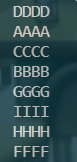
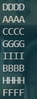
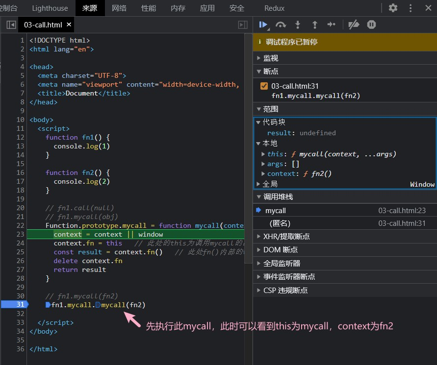
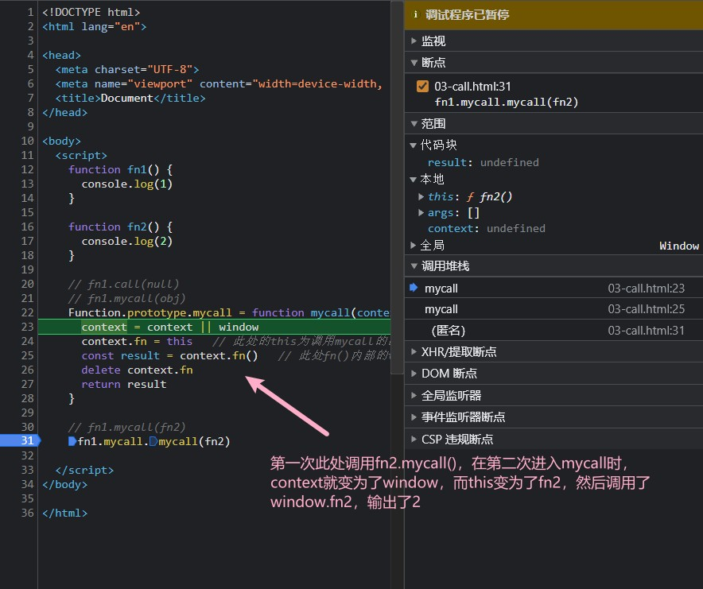

### 1.await

```javascript
async function t2() {
    let a = await new Promise((resolve) => { });
    console.log(a)
}
t2()
```

- 结果：什么都没输出

<div class="success">

> 由于await 后的值实际上就是一个yield的结果，在底层会进行如下操作：(new Promise((resolve) => { })).then(value => generator.next(value))。而此时由于Promise((resolve)=>{})返回的是一个pending状态的promise。所以它不会执行.then方法，也就是说不会执行generator.next(value)。
>
> 故相当于执行器generator只执行了一半就断开了。

</div>

### 2.宏任务微任务1

```javascript
async function async1() {
    console.log('AAAA');
    async2();
    console.log('BBBB');
}
async function async2() {
    console.log('CCCC');
}

console.log('DDDD');
setTimeout(() => {
    console.log('FFFF')
}, 0);
async1();
new Promise(function (resolve) {
    console.log('GGGG')
    resolve();
}).then(function () {
    console.log('HHHH');
});
console.log('IIII')
```

- 结果：



<div class="success">

> 记住：只有await语句下面的语句(底层也是通过.then进行包裹)和.then中包裹的语句才是微任务。

</div>

### 3.宏任务微任务2

```javascript
async function async1() {
    console.log('AAAA');
    await async2();
    console.log('BBBB');
}
async function async2() {
    console.log('CCCC');
}

console.log('DDDD');
setTimeout(() => {
    console.log('FFFF')
}, 0);
async1();
new Promise(function (resolve) {
    console.log('GGGG')
    resolve();
}).then(function () {
    console.log('HHHH');
});
console.log('IIII')
```

- 结果：



### 4.Call函数相关

```javascript
function fn1 () {
  console.log(1)
}

function fn2 () {
  console.log(2)
}

// fn1.call(fn2)   // 1
// fn1.call.call(fn2)	 // 2

Function.prototype.mycall = function (context, ...args) {
  context = context || window
  // 记录当前调用 mycall 的函数
  context.fn = this
  // 谁调用 fn，函数内部的this就指向谁
  const result = context.fn(...args)
  delete context.fn
  return result
}


fn1.mycall(fn2)
fn1.mycall.mycall(fn2)
// ----------------------执行过程------------------------------
// fn1.mycall.mycall(fn2)，执行过程 
Function.prototype.mycall = function (context, ...args) {
  // context ---> fn2
  context = context || window
  // context.fn ---> this ----> mycall
  // fn2.mycall
  context.fn = this
  // 暂停，等待执行 fn2.mycall(没有参数)
  const result = context.fn(...args)
  delete context.fn
  return result
}

// 调用 fn2.mycall(没传参数)
Function.prototype.mycall = function (context, ...args) {
  // context ---> Window
  context = context || window
  // context.fn ---> this ---> fn2
  // Window.fn2
  context.fn = this
  // Window.fn2(没有参数)
  const result = context.fn(...args)
  delete context.fn
  return result
}
```



