# Why Webpack

随着现代前端开发复杂度的不断提升，现在 web 开发出现了如下一系列 “问题：

- 采用 模块化开发 ，而不同浏览器对模块化的支持是不一样的，而且模块化本身又存在多种实现规范。
- 在编码过程中为了开发效率会使用 新特性（ES6+、TS、Sass、Less）提高效率保持安全性，而浏览器不能直接处理。
- 同时我们希望能够实时监听开发过程，使用热更新。
- 项目在编码完成之后/部署之前 需要将项目结果打包压缩优化。


--->  所以我们需要一个工具帮助我们实现以上功能，让我们可以用自己喜欢的编码方式随心所欲的开发，而结果又能在浏览器端运行展示，因此就有了 Webpack。


# Webpack 功能

- 打包：将不同类型资源按模块处理进行打包
- 静态：打包后最终产出静态资源
- 模块：webpack 支持不同规范的模块化开发


首先我们来用 ES6 modules 语法来进行模块化拆分，并在 index.html 导入

**js/utils.js**

```javascript
const sum = (m, n) => {
    return m + n
}

const square = (m) => {
    return m * m
}

export { sum, square }
```

**index.js**

```javascript
import { sum, square } from './js/utils.js'

console.log(sum(10, 20))
console.log(square(10))
```

**index.html**

```html
<!DOCTYPE html>
<html lang="en">
<head>
    <meta charset="UTF-8">
    <meta http-equiv="X-UA-Compatible" content="IE=edge">
    <meta name="viewport" content="width=device-width, initial-scale=1.0">
    <title>上手 webpack</title>
</head>
<body>
    <script type="module" src="./src/index.js"></script>
</body>
</html>
```

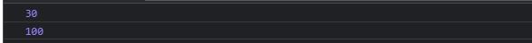

可以看到再浏览器中可以正常显示。

然后我们再多定义一个是用 commonjs规范导出文件的 js 文件，并在 index.js 中导入

**js/api.js**

```javascript
const getInfo = () => {
    return {
        name: 'zce',
        age: 40
    }
}

module.exports = getInfo
```

**index.js**

```javascript
import { sum, square } from './js/utils.js'
const getInfo = require('./js/api.js')

console.log(sum(10, 20))
console.log(square(10))
console.log(getInfo())
```

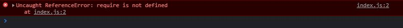

此时可以看到浏览器报错，报错原因是因为浏览器无法识别 commonjs 语法，为了解决这一问题，我们便可以使用 webpack 来打包文件。

在命令行输入 **webpack**，然后 webpack 默认便会去识别 当前根目录下的src/index.js 文件，并处理其内部要导入的文件，将它们一起打包到 根目录下的 dist/main.js 中。

然后我们再在 html 中引入 dist/main.js，便会发现可以成功运行代码。

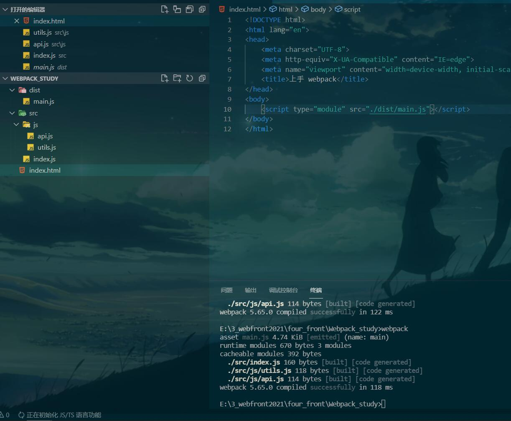

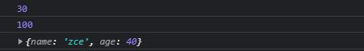

由此可见，使用 webpack 可以支持不同规范的模块化开发


# Webpack 配置文件

## 局部安装 webpack

首先我们需要知道，如果我们使用全局的 webpack，那么在项目共享给同事时，可能会出现双方电脑的 webpack 版本不同，从而导致一些问题。所以我们需要使用局部的 webpack。

当我们安装了 局部的 webpack 之后，便可以在命令行 使用 `npx webpack` 执行 webpack 打包命令，其会去寻找 node_modules 中 .bin 目录下的 webpack。 

## 命令行添加配置项

由于 webpack 会默认寻找 src/index.js 来作为打包入口，我们可以在打包时指定 --entry 来配置 入口文件。

`npx webpack --entry ./src/main.js`

同时我们还可以配置将文件打包到指定目录下

`npx webpack --entry ./src/main.js --output-path ./build`


很明显，如果使用如上的方式来配置webpack，会比较麻烦，此时我们可以通过在 package.json 中的 scripts 配置栏中通过配置短命令的形式来简化配置：

```json
"scripts": {
    "test": "echo \"Error: no test specified\" && exit 1",
    "build":"webpack --entry ./src/main.js --output-path ./build"	// 此处需要把 npx 去掉
  },
```

然后我们使用 **npm run build** 即可达到相同效果。


## 配置文件使用

以上的方式还可以简化为配置文件的方式，我们可以直接在项目根目录下新建一个 **webpack.config.js** 文件，在其中写入相应配置，然后在 package.json 中只需要将 命令改为 webpack ，其就会默认使用我们的配置文件中的配置项去打包文件：

**webpack.config.js**

```javascript
const path = require('path')

module.exports = {
    entry: './src/main.js',    // 此处可以使用相对路径
    output: {
        filename: 'build.js',       // 输出文件名称
        path: path.resolve(__dirname, 'dist')  // 此处不可以使用相对路径
    }
}
```

**package.json**

```json
"scripts": {
    "test": "echo \"Error: no test specified\" && exit 1",
    "build":"webpack"		// 不指定配置文件，默认使用 webpack.config.js 
    // "build":"webpack --config webpack.xxc.js""		--> 手动指定使用哪个配合文件
},
```


## webpack 依赖图

每当一个文件依赖另一个文件时，webpack 都会将文件视为直接存在 *依赖关系*。这使得 webpack 可以获取非代码资源，如 images 或 web 字体等。并会把它们作为 *依赖* 提供给应用程序。

当 webpack 处理应用程序时，它会根据命令行参数中或配置文件中定义的模块列表开始处理。 从 入口（默认为 src/index.js）开始，webpack 会递归的构建一个 *依赖关系图*，这个依赖图包含着应用程序中所需的每个模块，然后将所有模块打包为少量的 *bundle* —— 通常只有一个 —— 可由浏览器加载。

因此，如果要将某一个 js 文件打包后可以在浏览器中加载，就需要在 入口文件 中进行引入。

## Loader 使用

### css-loader

首先我们新建一个 login.js，在其中设置一个 为页面添加html 的逻辑，然后在 index.js 中导入这个 login.js

**login.js**

```javascript
function login() {
    const oH2 = document.createElement('h2')
    oH2.innerHTML = "语轻星子"
    oH2.className = 'title'
    return oH2
}

document.body.appendChild(login())
```

**index.js**

```javascript
import './js/login'
```

然后打包后，在 index.html 中引入打包生成的文件，打开 index.html 

```html
<!DOCTYPE html>
<html lang="en">
<head>
    <meta charset="UTF-8">
    <meta http-equiv="X-UA-Compatible" content="IE=edge">
    <meta name="viewport" content="width=device-width, initial-scale=1.0">
    <title>CSS loader</title>
</head>
<body>
    <script type="module" src="./dist/main.js"></script>
</body>
</html>
```

可以看到 login.js 中的逻辑成功渲染：


然后我们再新建一个 login.css 文件，将其在 login.js 中导入（这样入口文件 index.js 就会去寻找 login.js ，然后 login.js 再去寻找 login.css 文件）:

```css
.title{
    color:red;
}
```

然后再执行打包，会发现出现错误：

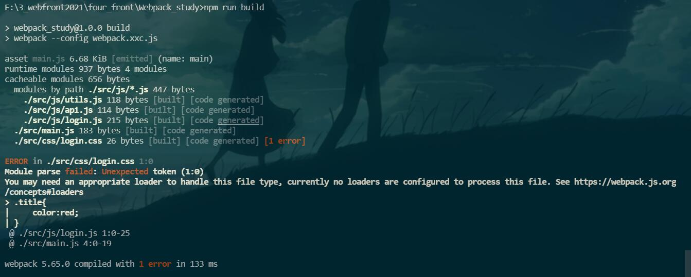

提示没有使用对应的loader 来处理相应的代码，这也体现了默认情况下 webpack 无法去处理 css 文件，所以我们需要loader 来转换 css 代码。

loader 本身是一个模块，里面是一些 js 代码，用于转换代码。

接下来去配置 `css-loader`:

首先安装 `cnpm i css-loader -D`

然后我们先使用行内形式的 loader：

**js/login.js**

```javascript

import 'css-loader!../css/login.css'

function login() {
    const oH2 = document.createElement('h2')
    oH2.innerHTML = "语轻星子"
    oH2.className = 'title'
    return oH2
}

document.body.appendChild(login())
```

此时再使用 **npm run build** 去进行 webpack 编译，可以看到编译成功，但是却无法使样式成功生效。原因是 `css-loader` 的主要功能是用于解析 css 文件为 可识别的文件，而并没有办法解析样式。因此还需要另外的 loader。

同时行内形式的 loader 只对当前导入的文件生效，若再导入一个 css 文件，需要再配置。


行内形式配置完后，我们再试一试 在配置文件中配置loader。

要在配置文件中配置 loader，我们需要在 module-> rules 先中进行配置，module 是一个对象，rules 是一个数组，里面可以配置多个对象。

```javascript
const path = require('path')

module.exports = {
    entry: './src/index.js',    // 此处可以使用相对路径
    output: {
        filename: 'main.js',       // 输出文件名称
        path: path.resolve(__dirname, 'dist')  // 此处不可以使用相对路径
    },
    module: {
        rules: [
            {
                test: /\.css$/, // 一般就是一个正则表达式，用于匹配我们需要处理的文件类型
                use: [       // use 为一个数组，内部可以进行多个 loader 的配置
                    {
                        loader: 'css-loader',
                        // options:[]                // options 为 loader 需要的而外参数，可选
                    }
                ]
            }
        ]
    }
}
```

**module简写形式：**

适用于单个Loader

```javascript
module: {
        rules: [
            {
                test: /\.css$/,
                loader: 'css-loader'
            }
        ]
    }
```

适用于多个Loader

```javascript
module: {
    rules: [
        {
            test: /\.css$/,
            use: ['css-loader']
        }
    ]
}
```

### style-loader

为了能够将样式在页面中得到展示，我们还需要配置 `style-loader`

要使用 loader，首先进行安装 `cnpm i style-loader -D`

然后在 webpack 配置文件中进行配置：

```javascript
const path = require('path')

module.exports = {
    entry: './src/index.js',    // 此处可以使用相对路径
    output: {
        filename: 'main.js',       // 输出文件名称
        path: path.resolve(__dirname, 'dist')  // 此处不可以使用相对路径
    },
    module: {
        rules: [
            {
                test: /\.css$/,
                use: ['css-loader', 'style-loader']
            }
        ]
    }
}
```

此时再运行 `npm run build`，会报出如下错误：

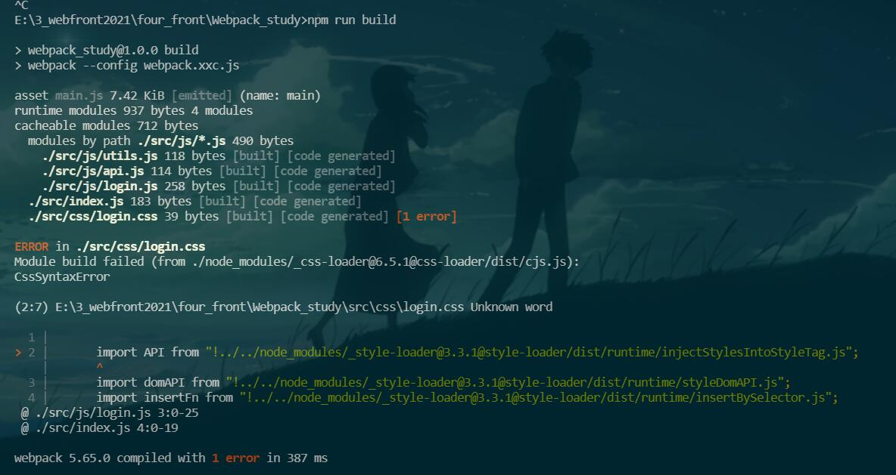

出现这个错误的原因是因为 rules 中的 loader 执行顺序为 从右往左(或从下往上)执行，而我们需要先将 css 文件使用 css-loader 解析，然后再用 style-loader 进行样式解析。

所以我们需要将其改为：

```javascript
const path = require('path')

module.exports = {
    entry: './src/index.js',    // 此处可以使用相对路径
    output: {
        filename: 'main.js',       // 输出文件名称
        path: path.resolve(__dirname, 'dist')  // 此处不可以使用相对路径
    },
    module: {
        rules: [
            {
                test: /\.css$/,
                use: ['style-loader', 'css-loader']
            }
        ]
    }
}
```

此时，再运行 `npm run build`，便可成功编译，看到具体的样式


### less-loader

要使用 less-loader ，需要先安装 less，因为 less-loader 内部使用到了 less。

```
cnpm i less less-loader -D
```

然后我们新建一个 login.less 文件，并在 login.js 中导入：

**login.less**

```less
@bgColor:seagreen;
@fontSize:100px;

.title{
    background-color: @bgColor;
    font-size: @fontSize;
}
```

**login.js**

```javascript
import '../css/login.css'
import '../css/login.less'

function login() {
    const oH2 = document.createElement('h2')
    oH2.innerHTML = "语轻星子"
    oH2.className = 'title'
    return oH2
}

document.body.appendChild(login())
```

引入后，我们便可以去 配置文件中进行 less 文件的 loader 配置：

```javascript
const path = require('path')

module.exports = {
    entry: './src/index.js',    // 此处可以使用相对路径
    output: {
        filename: 'main.js',       // 输出文件名称
        path: path.resolve(__dirname, 'dist')  // 此处不可以使用相对路径
    },
    module: {
        rules: [
            {
                test: /\.css$/,
                use: ['style-loader', 'css-loader']
            },
            {
                test: /\.less$/,
                use: ['style-loader', 'css-loader', 'less-loader']
            }
        ]
    }
}
```

less 文件要解析并生效，需要先使用 less-loader 将 less 转为 css，再使用 css-loader 将 css 转为可解析文件，最后使用 style-loader 进行样式解析。要注意 loader 的配置顺序。

## browserslitrc 工作流程

由于现在前端开发都是 **工程化** 开发，那么我们就要面临 处理 **兼容性** （js 新语法、css 新特性）的问题。

为了实现兼容，我们可以使用 babel、postCss 等工具来实现。

而要**知道为了兼容哪些平台**，我们就需要 **browserslitrc** 。


可以通过 [此处](https://caniuse.com/usage-table) 查看主流浏览器平台。

知道 主流浏览器平台后，我们便可以通过 browserslitrc 来通过配置相应项来筛选出相应平台，然后自动作出兼容。

我们可以先进行安装

```
cnpm i --save-dev browserslist
```

然后便可以通过

```
npx browserslist
```

来查看当前项目兼容哪些平台。平常我们使用 vue-cli 或 create-react-app 时，其内部已经为我们配置了browserslist 选项。


此后我们可以通过手动配置，来实现配置项目兼容平台：

1. 在 package.json 中配置

```javascript
{
  ...
  "browserslist": [
    ">1%",
    "last 2 version",
    "not dead"
  ]
}
```

2. 新建 .browserslistrc文件，写入

```
>1%
last 2 version
not dead
```

## postcss 工作流程

为了实现 css 的兼容性处理，首先需要通过 browserslist 来筛选出要兼容的平台，之后再通过 postcss 进行兼容产出。

postcss 可以认为是一个通过 javascript 来进行样式转换的工具。

要使用 postcss ，首先进行安装

```
cnpm i postcss -D
cnpm i postcss-cli -D  // 为了在命令行进行操作
cnpm i autoprefixer -D	// 用于样式加兼容前缀
```

然后新建一个 test.css 文件，用于转换

**test.css**

```css
.example {
    display: grid;
    transition: all .5s;
    user-select: none;
    background: linear-gradient(to bottom, white, black);
}
```

然后我们便可以通过在 命令行中输入 

`npx postcss --use autoprefixer -o ret.css ./src/css/test.css`

执行后，便会在根目录下 生成一个 ret.css，里面的代码会根据我们在根目录中配置的 .browserlistrc 的兼容范围 来做css代码兼容性处理：

**ret.css**

```css
.example {
    display: grid;
    -webkit-transition: all .5s;
    -o-transition: all .5s;
    -moz-transition: all .5s;
    transition: all .5s;
    -webkit-user-select: none;
       -moz-user-select: none;
        -ms-user-select: none;
            user-select: none;
    background: -webkit-gradient(linear, left top, left bottom, from(white), to(black));
    background: -webkit-linear-gradient(top, white, black);
    background: -moz-linear-gradient(top, white, black);
    background: linear-gradient(to bottom, white, black);
}
```

**.browserlistrc**

```
>0.01%
last 2 version
not dead
```

## postcss-loader 使用

首先进行安装：

```
cnpm i postcss-loader -D
```

然后在 login.css 中写入要兼容处理的 css代码：

```css
.title {
    color:red;
    transition: all .5s;
    user-select: none;
    background: linear-gradient(to bottom, white, black);
}
```

并在 login.js 中引入

```javascript
import '../css/login.less'
```

然后我们便可以在 webpack.config.js 中进行 css 文件的 loader 配置，要注意，postcss-loader 需要在 css-loader 之前运行，因为需要postcss-loader 将 css 代码做兼容后，再让 css-loader 做解析。

```javascript
const path = require('path')

module.exports = {
    entry: './src/index.js',    // 此处可以使用相对路径
    output: {
        filename: 'main.js',       // 输出文件名称
        path: path.resolve(__dirname, 'dist')  // 此处不可以使用相对路径
    },
    module: {
        rules: [
            {
                test: /\.css$/,
                use: ['style-loader', 'css-loader', 'postcss-loader']
            },
            ...
        ]
    }
}
```

而此时，如果我们使用 webpack 打包后，可以看到 css 代码并未进行兼容处理。所以我们还需要进行 loader 配置，通过配置使其使用 autoprefixer 来进行兼容处理（需要确保项目中安装过 autoprefixer）：

```javascript
module: {
        rules: [
            {
                test: /\.css$/,
                use: [
                    'style-loader',
                    'css-loader',
                    {
                        loader: "postcss-loader",
                        options: {
                            postcssOptions: {
                                plugins: [
                                    require('autoprefixer')
                                ]
                            }
                        }
                    }
                ]
            },
            {
                test: /\.less$/,
                use: ['style-loader', 'css-loader', 'less-loader']
            }
        ]
    }
```

此时在打包 运行后，便可以看到 经过兼容后的代码：

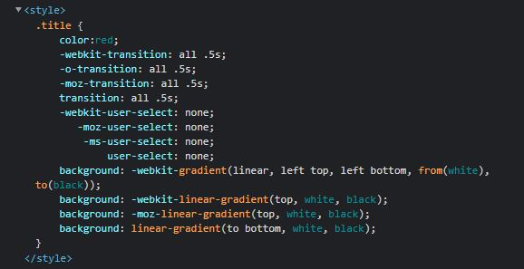

接下来我们再考虑一种场景，我们将 login.css 中的 color改为 \#12345678，预想中我们希望其被兼容生成 rgba 形式的颜色。而此时当我们打包时，可以看到其未被兼容。

```css
.title {
    color:#12345678;
    transition: all .5s;
    user-select: none;
    background: linear-gradient(to bottom, white, black);
}
```

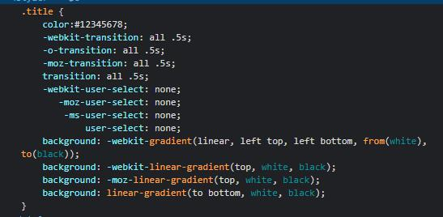

原因很简单，因为之前我们所配置的 autoprefixer 并没有 转换颜色为 rgba 的功能。此时我们就需要一个插件集合 `postcss-preset-env`，其内部不但集成了 autoprefixer，还有一些其它的 css 兼容工具，相当于一个插件的集合。

首先安装：

```
cnpm i postcss-preset-env -D
```

然后在 webpack 配置文件中配置：

```javascript
    module: {
        rules: [
            {
                test: /\.css$/,
                use: [
                    'style-loader',
                    'css-loader',
                    {
                        loader: "postcss-loader",
                        options: {
                            postcssOptions: {
                                plugins: [
                                    'postcss-preset-env'        // 此处可以使用字符串
                                ]
                            }
                        }
                    }
                ]
            },
            ...
        ]
    }
```

然后再打包便可以看到 css 被做了兼容处理：

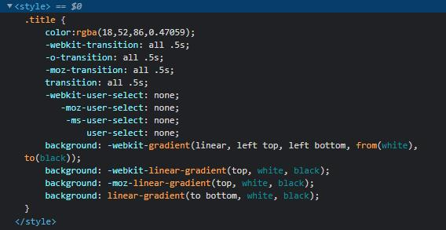

同时，我们可以为 .less 结尾的文件也配置 对应的 loader：

```javascript
const path = require('path')

module.exports = {
    entry: './src/index.js',    // 此处可以使用相对路径
    output: {
        filename: 'main.js',       // 输出文件名称
        path: path.resolve(__dirname, 'dist')  // 此处不可以使用相对路径
    },
    module: {
        rules: [
            {
                test: /\.css$/,
                use: [
                    'style-loader',
                    'css-loader',
                    {
                        loader: "postcss-loader",
                        options: {
                            postcssOptions: {
                                plugins: [
                                    'postcss-preset-env'        // 此处可以使用字符串
                                ]
                            }
                        }
                    }
                ]
            },
            {
                test: /\.less$/,
                use: [
                    'style-loader',
                    'css-loader', {
                        loader: "postcss-loader",
                        options: {
                            postcssOptions: {
                                plugins: [
                                    'postcss-preset-env'        // 此处可以使用字符串
                                ]
                            }
                        }
                    },
                    'less-loader'
                ]
            }
        ]
    }
}
```

但很明显的是，这种写法造成了代码的冗余。为了简便写法，我们可以新建一个 `postcss.config.js` 文件，然后在其中写入 postcss 的配置规则：

**postcss.config.js**

```javascript
module.exports = {
    plugins: [
        require('postcss-preset-env')
    ]
}
```

然后在 webpack 配置文件中，我们就不需要再进行 postcss-loader 的配置了：

```javascript
const path = require('path')

module.exports = {
    entry: './src/index.js',    // 此处可以使用相对路径
    output: {
        filename: 'main.js',       // 输出文件名称
        path: path.resolve(__dirname, 'dist')  // 此处不可以使用相对路径
    },
    module: {
        rules: [
            {
                test: /\.css$/,
                use: [
                    'style-loader',
                    'css-loader',
                    "postcss-loader",
                ]
            },
            {
                test: /\.less$/,
                use: [
                    'style-loader',
                    'css-loader',
                    "postcss-loader",
                    'less-loader'
                ]
            }
        ]
    }
}
```

## importLoaders 属性

我们来看以下场景：

将 login.css 中的部分代码移到 test.css 中，然后再将 test.css 在 login.css 中导入：

**login.css**

```css
@import './test.css';
.title {
    color:#12345678;
}
```

**test.css**

```css
.title {
    transition: all .5s;
    user-select: none;
}
```

然后 运行，会发现导入进来的 test.css 中的代码并未进行兼容性处理：

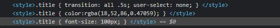

我们可以根据配置的 loader ，来分析其原因：

```javascript
{
    test: /\.css$/,
        use: [
            'style-loader',
            'css-loader',
            "postcss-loader",
        ]
},
```

1. 首先 login.css @import 语句导入了 test.css
2. 然后 打包时发现 login.css 为 .css 结尾文件，匹配到之后首先 postcss-loader 进行工作
3. 基于当前代码，postcss-loader 拿到了 login.css 当中的代码之后，分析只有 color 需要做兼容性处理。
4. 然后就将 只处理过color 的 代码 交了给 css-loader
5. 此时的 css-loader 处理了 @import media url...，这个时候它加载了 test.css 文件，但是这是 postcss-loader 不会再回头去处理 test.css 中的代码，导致其中的代码未被处理。


为了解决这个问题，我们就需要 importLoaders 属性：

```javascript
module: {
    rules: [
        {
            test: /\.css$/,
            use: [
                'style-loader',
                {
                    loader: 'css-loader',
                    options: {
                        importLoaders: 1    // importLoaders 表示当引入了css文件时，需要前进几个loader处理
                    }
                },
                "postcss-loader",
            ]
        },
        {
            test: /\.less$/,
            use: [
                'style-loader',
                'css-loader',
                "postcss-loader",
                'less-loader'
            ]
        }
    ]
}
```

此时再打包，便可以发现导入的文件的兼容问题得到了解决：

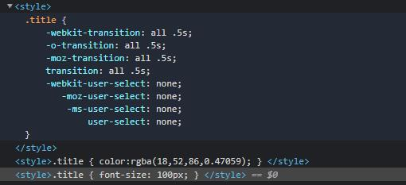

## file-loader 处理图片

如果要使用 file-loader 来处理图片，需要注意以下几点：

1. 要配置 output 的 publicPath 属性
2. 在 require 导入文件时，要加 .default，否则会显示 `[object Module]`

**使用：**

首先安装插件：

```
cnpm i file-loader -D
```

然后建立一个 image.js，在其中引入图片，并将图片显示到页面中：

```javascript
function packImg() {
    // 01 创建一个容器元素
    const oEle = document.createElement('div')

    // 02 创建 img 标签，设置 src 属性
    const oImg = document.createElement('img')
    oImg.src = require('../img/01.png').default	// 注意：此处要加 .default
    oImg.style.width = '500px'
    oEle.appendChild(oImg)

    return oEle
}

document.body.appendChild(packImg())
```

在 index.js 中引入 image.js：

```javascript
import './js/image'
```

在 webpack 配置文件中配置：

```javascript
const path = require('path')

module.exports = {
    entry: './src/index.js',    
    output: {
        publicPath: '/dist/',		// 此处要添加 publicPath
        filename: 'main.js',       
        path: path.resolve(__dirname, 'dist')  
    },
    module: {
        rules: [
			...
            {
                test: /\.(png|svg|gif|jpg?g)$/,
                use: ['file-loader']
            }
        ]
    }
}
```

此时运行打包命令后，便可以成功看到图片显示:


为了不在 require() 导入文件时还要在其后面写 .default，我们可以进行如下配置：

```javascript
{
    test: /\.(png|svg|gif|jpg?g)$/,
        use: [
            {
                loader: 'file-loader',
                options: {
                    esModule: false  // 不转为 esModule
                }
            }
        ]
}
```

或者可以使用 esmodule 规范来引入图片：

```javascript
import oImgSrc from '../img/01.png'

function packImg() {
    // 01 创建一个容器元素
    const oEle = document.createElement('div')

    // 02 创建 img 标签，设置 src 属性
    const oImg = document.createElement('img')

    oImg.width = 500
    oImg.src = oImgSrc
    oEle.appendChild(oImg)

    return oEle
}

document.body.appendChild(packImg())
```


处理完 Img 标签的展示，我们再来处理 background-img。首先在 image.js 中定义一个具有 background-image 属性的标签并将其渲染到页面中：

**img.css**

```css
.bgBox{
    width: 240px;
    height: 310px;
    border: 1px solid #000;
    background-image: url('../img/02.jpg');
}
```

**image.js**

```javascript
import oImgSrc from '../img/01.png'
import '../css/img.css'

function packImg() {
    // 01 创建一个容器元素
    const oEle = document.createElement('div')
    
    // 02 创建 img 标签，设置 src 属性
    ...
    
    // 03 设置背景图片
    const oBgImg = document.createElement('div')
    oBgImg.className = 'bgBox'
    oEle.appendChild(oBgImg)

    return oEle
}
document.body.appendChild(packImg())
```

此时直接打包，会发现 webpack 会生成的dist 目录下会有两个 有关 背景图片的文件，其中一个是 真实的 背景图片，一个是 一个导入当前背景图片的 二进制图片文件。


而页面中 background-image中展示的图片是 后者，这就会导致加载失败：

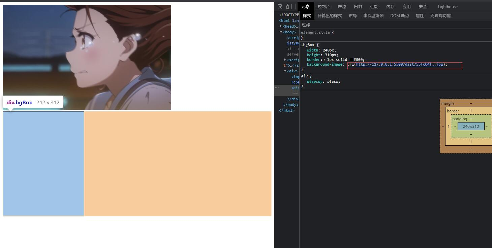

出现这一问题的原因是由于 当我们使用 `css-loader` 去处理 background-image 这个属性时，它会将图片的 url 替换为 require 语法，而上面提到过，require 语法在编译后会导出一个 esmodule。所以我们可以在 css-loader 中进行配置：

```javascript
{
    test: /\.css$/,
        use: [
            'style-loader',
            {
                loader: 'css-loader',
                options: {
                    importLoaders: 1,    // importLoaders 表示当引入了css文件时，需要前进几个loader处理
                    esModule:false
                }
            },
            "postcss-loader",
        ]
},
```

此时再次打包，便可以正常加载。


## 设置图片输出名称与输出路径

打包时，有时候我们会希望 文件的名称是可以配置的，同时也会希望文件被打包到特定目录下，而不是全部集中在 dist 目录下，这样，我们就可以自己来配置。

首先来看几个配置项：

 ** [ext]:扩展名*

 ** [name]:文件名*

 ** [hash]:文件内容 + md4 生成 hash*

 ** [contentHash]:在 webpack 中与 hash 一样*

 ** [hash:<length>]:配置 hash 长度*

 **[path]:配置文件路径*

我们可以依据这些配置项，来在 loader 中进行配置：

```javascript
const path = require('path')

module.exports = {
    entry: './src/index.js',    // 此处可以使用相对路径
    output: {
        publicPath: '/dist/',
        filename: 'main.js',       // 输出文件名称
        path: path.resolve(__dirname, 'dist')  // 此处不可以使用相对路径
    },
    module: {
        rules: [
            ...
            {
                test: /\.(png|svg|gif|jpg?g)$/,
                use: [
                    {
                        loader: 'file-loader',
                        options: {
                            name: 'img/[name].[hash:6].[ext]',	//也可以直接在 name 中指定输出在哪个文件夹下
                            // outputPath: 'img'	// 指定输出文件在哪个文件夹下
                        }
                    }
                ]
            }
        ]
    }
}
```

此时再进行打包，便可以看到如下结果：

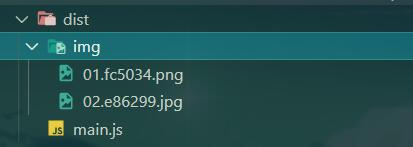

## url-loader 处理图片

要使用，需要先进行安装：

```
cnpm i url-loader -D
```

然后在 webpack 配置文件中进行配置，我们将原先处理图片文件的 loader 换为 `url-loader`：

```javascript
{
    test: /\.(png|svg|gif|jpg?g)$/,
        use: [
            {
                loader: 'url-loader',
                options: {
                    name: 'img/[name].[hash:6].[ext]',
                    // outputPath: 'img'
                }
            }
        ]
}
```

此时在进行打包，可以看到打包只生成了一个 `main.js` 文件，而没有生成对应的图片文件：


这是因为使用 `url-loader` ，会将图片转为 base64 的形式进行插入，这样就不用再打包 图片文件。

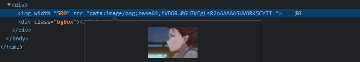

这样的好处是可以减少图片的请求次数，但如果图片过大，base64 的字面量也会变大，这样如果在 main.js 中做请求，会导致首屏加载时的数据量变大。

同时，我们可以在 url-loader 内部调用 file-loader，通过 limit 属性，设置一个阈值，当操作这个阈值时，就会调用 file-loader 来打包图片，而不转为 base64。

```javascript
{
    test: /\.(png|svg|gif|jpg?g)$/,
        use: [
            {
                loader: 'url-loader',
                options: {
                    name: 'img/[name].[hash:6].[ext]',
                    limit: 50 * 1024    // 25kb
                    // outputPath: 'img'
                }
            }
        ]
}
```

## asset 处理图片

在 webpack 5 以前，要处理图片，需要使用 file-loader、url-loader。而在 webpack 5 之后，就可以使用 `asset module type` 来处理图片

asset 分很多模块，对应不同的loader，大体如下：

 ** 01 asset/resource --> file-loader*

 ** 02 asset/inline --> url-loader*

 ** 03 asset/source --> raw-loader*

 ** 04 asset(内部可设置阈值)*

接下来我们来使用它：

首先尝试 asset/resource，我们在 webpack 配置文件中，通过 type 设置：

```javascript
const path = require('path')

module.exports = {
    entry: './src/index.js',    // 此处可以使用相对路径
    output: {
        publicPath: '/dist/',
        filename: 'main.js',       // 输出文件名称
        path: path.resolve(__dirname, 'dist')  // 此处不可以使用相对路径
    },
    module: {
        rules: [
            ...
            {
                test: /\.(png|svg|gif|jpg?g)$/,
                type: 'asset/resource'
            }
        ]
    }
}
```

然后执行 `npm run build`，便可以生成打包文件：

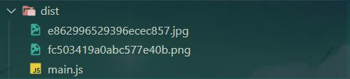

我们可以看到其效果类似于 `file-loader`。

同时我们也可以通过 asset 实现设置图片输出名称与输出路径的功能，实现方式是在 output中添加 assetModuleFilename 选项：

```javascript
const path = require('path')

module.exports = {
    entry: './src/index.js',    // 此处可以使用相对路径
    output: {
        ...
        assetModuleFilename: 'img/[name].[hash:4][ext]'	// 注意末尾处不要加.
    },
    module: {
        ...
}
```

此后在执行 `npm run build` 的话，便可以看到文件名称及输出路径发生了改变：

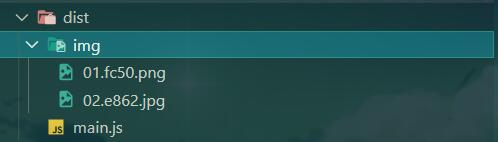

但是这样配置会有一个问题，因为这相当于全局配置，当我们接下来若还要打包字体文件等，也会被打包到 img 文件夹下，所以我们需要将其改为局部配置：

```javascript
const path = require('path')

module.exports = {
    entry: './src/index.js', 
    output: {
        publicPath: '/dist/',
        filename: 'main.js',  
        path: path.resolve(__dirname, 'dist'),
        // assetModuleFilename: 'img/[name].[hash:4][ext]'
    },
    module: {
        rules: [
            ...
            {
                test: /\.(png|svg|gif|jpg?g)$/,
                type: 'asset/resource',
                generator: {
                    filename: "img/[name].[hash:4][ext]"
                }
            }
        ]
    }
}
```

接着我们来配置 asset/inline，将原先的 type 进行修改，并删除掉 generator:

```javascript
{
    test: /\.(png|svg|gif|jpg?g)$/,
    type: 'asset/inline'
}
```

然后再打包，可以发现只生成了 `main.js` 文件，并且里面所有的图片都转换为了 base64 编码格式，效果类似于 url-loader。

接下来我们来实现设置阈值的功能，此时我们需要将 type 设置为 asset，并为其添加一个 parser 属性，来通过 其中的 dataUrlCondition 来设置 阈值

```javascript
{
     test: /\.(png|svg|gif|jpg?g)$/,
     type: 'asset',
     generator: {
           filename: "img/[name].[hash:4][ext]"
     },
     parser: {
           dataUrlCondition: {
           	maxSize: 50 * 1024
           }
     }
}
```

## asset 处理图标字体

首先创建一个 font 文件夹，在其中放置字体文件。

然后新建 font.js，在其中实现 页面元素的添加，并在 index.js 中引入它：

**font.js**

```javascript
import '../font/iconfont.css'

function packFont() {
    const oEle = document.createElement('div')

    const oSpan = document.createElement('span')
    oSpan.className = 'iconfont icon-up up-icon'
    oEle.appendChild(oSpan)

    return oEle
}

document.body.appendChild(packFont())
```

**index.js**

```javascript
import './js/font'
```

此时进行打包，会提示

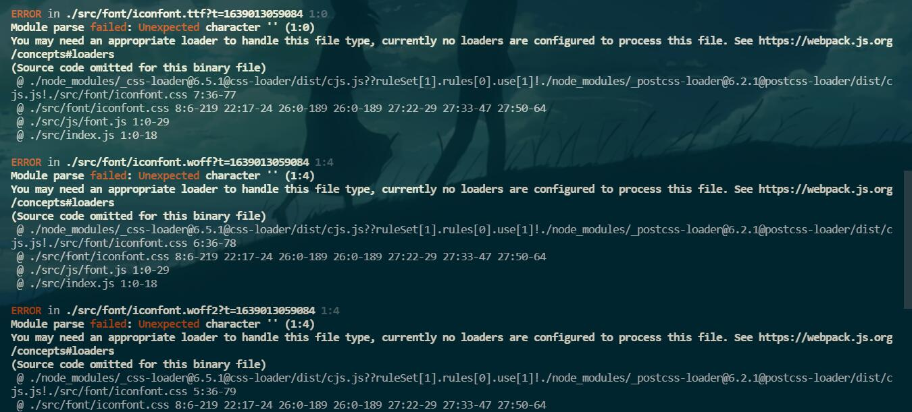

所以我们需要为字体文件：.ttf、.woff、.woff2 配置对应的 loader。

在 webpack5 中，我们仍然可以用 asset/resource 来 处理字体文件：

```javascript
module: {
        rules: [
            ...
            {
                test: /\.(ttf|woff2?)$/,
                type: 'asset/resource',
                generator: {
                    filename: 'font/[name].[hash:3][ext]'
                }
            }
        ]
    }
```

此时，再打包，便可以成功展示字体图标：


# Webpack 插件的使用

如果我们要在修改文件时，自动的将原本的dist 目录删除，然后生成新的 dist 目录，里面包含我们所修改的最新的内容，这就需要用到插件。再或者，我们需要在生成的 dist 目录中同时也包含index.html，而不是每次都需要用 src 中的 index.html 来引入 js 文件以查看效果，这也需要插件。

loader 是用于对特定的模块类型进行转换，将非 js 模块所能识别的内容转换为 js 模块能识别的内容。工作的时机是我们要识别文件内容的时候。

plugin 可以做更多的事情，工作时机可以贯穿 webpack 打包的整个生命周期。

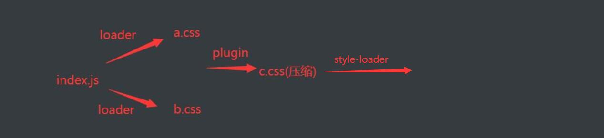

接下来我们来尝试使用一个插件 `clean-webpack-plugin`：
首先进行安装：

```
cnpm i clean-webpack-plugin -D
```

接着我们需要明确一下，每一个插件实际上是一个 类，具有构造函数和 apply() 方法：

```javascript
class MyPlugin{
    constructor(){},
    apply()
}
```

接着我们来使用 安装的插件，主要有两步：

1. 导入插件
2. 在 plugins 选项中使用 new 关键字创建一个插件的实例：

```javascript
const { CleanWebpackPlugin } = require('clean-webpack-plugin')

module.exports = {
    plugins: [
        new CleanWebpackPlugin()
    ]
}
```

接下来我们在打包时，便可以看到原有的dist文件夹被删除后，再创建新的文件夹。

## html-webpack-plugin

通过 **html-webpack-plugin**，我们可以动态的生成 html 文件。

首先进行安装：

```
cnpm i html-webpack-plugin --save
```

然后此时，我们可以将根目录下的 `index.html` 直接删除，因为 插件会帮我们自动生成，同时引入相关 js 文件。

接下来我们来配置插件：

```javascript
const HtmlWebpackPlugin = require('html-webpack-plugin')

module.exports = {
    ...
    plugins: [
        new HtmlWebpackPlugin()
    ]
}
```

配置完后，当我们使用 `npm run build` 时，便可以看到打包的目录中生产了一个 html 文件。并引入了我们打包产出的 js 文件：
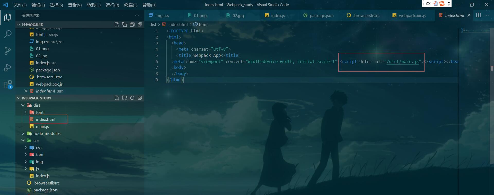

此外，我们还可以通过为这个插件设置参数的形式，来修改其生成的 html 文件：

```javascript
plugins: [
    new HtmlWebpackPlugin({
        title: 'html-webpack-plugin'	// 为生成的 html 文件设置 title
    })
]
```

此时再打包，便可以看到文件的 `<title></title>` 标签被修改。

此外，我们也可以自定义生成 html 的模板文件

首先我们在项目根目录下创建一个 public/index.html，写入自定义的模板，内部可以使用 ejs 语法，来控制动态属性：

```html
<!DOCTYPE html>
<html lang="en">
<head>
    <meta charset="UTF-8">
    <meta http-equiv="X-UA-Compatible" content="IE=edge">
    <meta name="viewport" content="width=device-width, initial-scale=1.0">
    <title><%= htmlWebpackPlugin.options.title %></title>
</head>
<body>
    <div id="app">测试html-webpack-plugin</div>
</body>
</html>
```

然后修改配置，通过添加 template 选项，来让其使用我们自定义的 html 做为打包的模板：

```javascript
plugins: [
    new HtmlWebpackPlugin({
        title: 'html-webpack-plugin',
        template: "./public/index.html"
    })
]
```

之后再进行打包时，便会生成依靠我们自定义的模板文件所生成的 html 文件。

然后我们试着像 vue 中一样，为 public/index.html 添加一个 常量 `<%= BASE_URL %>`，这时再打包，就会出现如下问题，原因是因为我们并未对常量进行配置

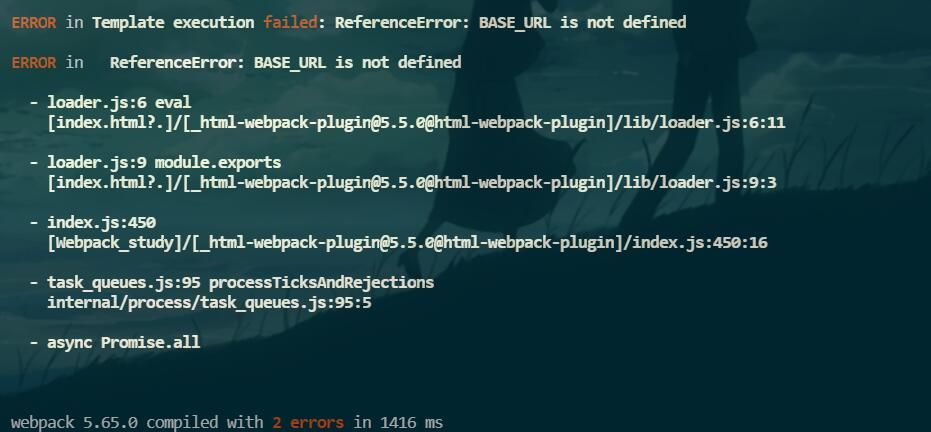

要进行常量配置，我们需要用到 webpack 中的一个内置插件 `DefinePlugin`

```javascript
const { DefinePlugin } = require('webpack')
...

module.exports = {
    ...
    plugins: [
        new DefinePlugin({
            BASE_URL: './'
        })
    ]
}
```

此时再进行打包，会发现其报出了一个语法错误：


出现这个错误的原因是因为，若我们使用 `'./'` 的形式赋值，将来其会被认作 `./` 直接赋值，这就会导致语法错误，所以我们需要将其修改为 `"./"`。

```javascript
plugins: [
    ...
    new DefinePlugin({
        BASE_URL: '"./"'
    })
]
```

此时再进行打包，便可以成功看到打包成功。


## copy-webpack-plugin

使用 `copy-webpack-plugin`，可以将我们的一些 文件夹（比如public） 打包到生成的 dist 目录下。

要使用，首先进行安装：

```
cnpm i copy-webpack-plugin -D
```

接着，进行配置：

```javascript
const CopyWebpackPlugin = require('copy-webpack-plugin')
module.exports = {
    ...
    plugins: [
        ...
        new CopyWebpackPlugin({
            patterns: [
                {
                    from: 'public',     // from 表示要 copy 的文件夹
                    // to:''       // to可以省略，这样的话会去找 output 下的 path
                }
            ]
        })
    ]
}
```

然后直接打包的话，会出现如下问题：

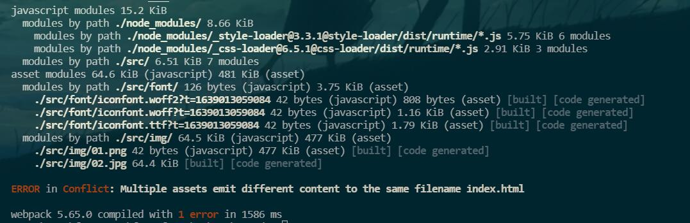

出现这个问题的原因是因为我们之前在 `html-webpack-plugin` 中声明了要使用 public 下的 index.html，而此处再用 from 来引入public 下的所有文件，此时导致重复，就会报错。

所以我们需要进行 `index.html` 的排除：

```javascript
plugins: [
    new CopyWebpackPlugin({
        patterns: [
            {
                from: 'public',     // from 表示要 copy 的文件夹
                globOptions: {
                    ignore: ['**/index.html']	// 注意此处要加 '**/'
                }
            }
        ]
    })
]
```

此时再进行打包，便可以看到 public 下的文件都被移到了 dist 下：

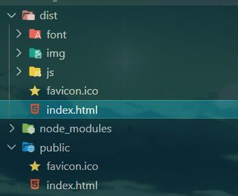

# babel 使用

为了处理 js 兼容的问题，我们引入了 babel。

首先我们来看平时打包生成的代码：

在 index.js 中写入 es6+ 的语法：

```javascript
const title = '前端'
const foo = () => {
    console.log(title)
}
```

然后打包，可以看到 webpack 是直接将代码原样打包：

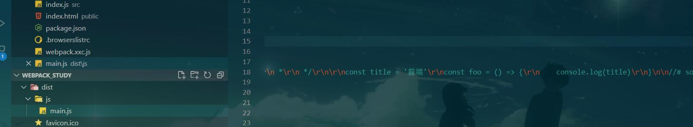

这样浏览器可能会无法识别，所以我们需要使用babel。

首先进行安装：

```
cnpm i @babel/core -D	// 用于处理兼容
cnpm i @babel/cli -D	// 用于命令行终端使用 babel
```

然后在命令行中使用：

```
npx babel src --out-dir build
```

可以看到成功生成了 build 文件，但是并没有生成兼容性代码：

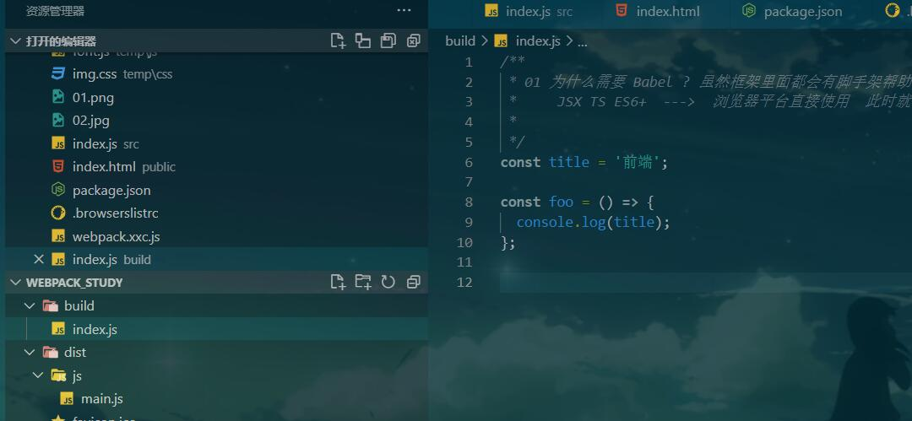

这是因为我们并未安装 生成兼容性代码的工具包：

```
cnpm i @babel/plugin-transform-arrow-functions -D
```

安装好后，我们再运行命令：

```
npx babel src --out-dir build --plugins=@babel/plugin-transform-arrow-functions
```

此时，便可以看到生成了兼容性处理过后的代码：

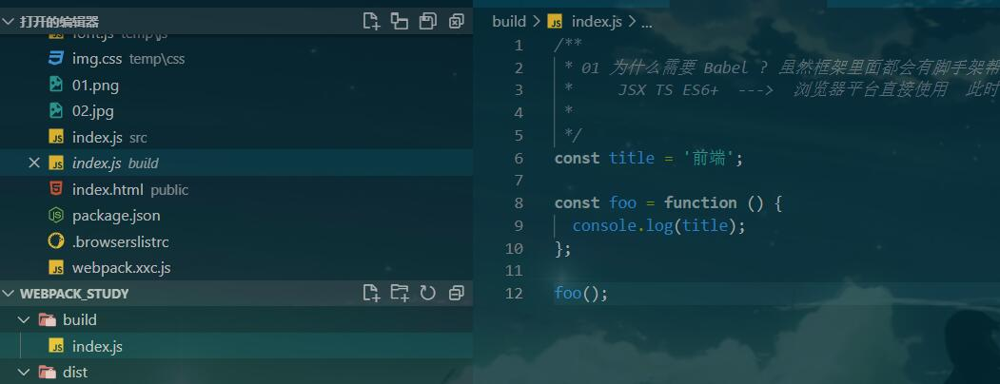

但 const 还未转成 var，所以我们还可以再安装对应的插件：

```
cnpm i @babel/plugin-transform-block-scoping -D
```

安装好后，再运行命令：

```
npx babel src --out-dir build --plugins=@babel/plugin-transform-arrow-functions,@babel/plugin-transform-block-scoping
```

此时，便可以看到 const 也被转为了 var:

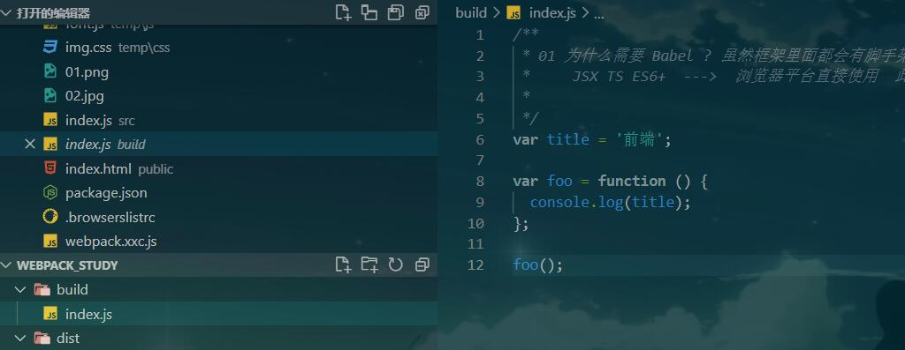

虽然我们成功实现了转换，但很明显，这样每转换一个条件就要安装一个插件的方式过于麻烦，所以我们可以使用 其提供的一个预设 `@babel/preset-env`，这是一个集合，里面涵盖了大部分的 es6+ 语法转换插件

首先安装：

```
cnpm i @babel/preset-env --save
```

安装好后，运行命令：

```
npx babel src --out-dir build --presets=@babel/preset-env
```

此时可以看到打包结果中的所有 es6+ 语法都被转换了：

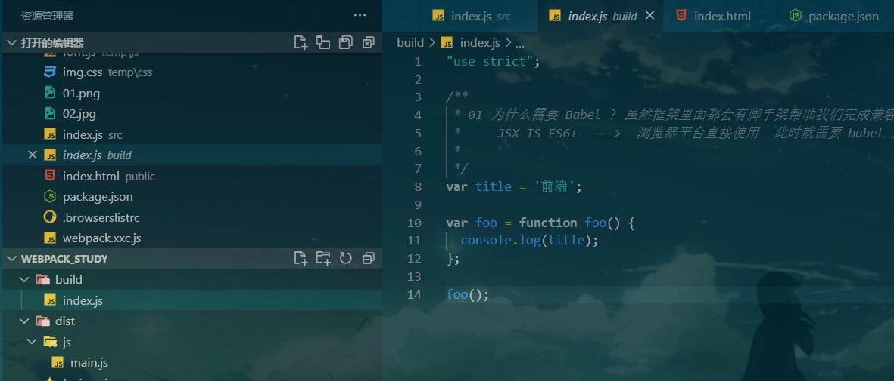

# babel-loader 使用

首先进行安装：

```
cnpm i babel-loader -D
```

然后进行配置：

```javascript
module.exports = {
    ...
    module: {
        rules: [
            ...
            {
                test: /\.js$/,
                use: [
                    {
                        loader: 'babel-loader',
                        options: {		// 没进行配置的话，单靠 babel-loader，没有任何效果
                            plugins: [
                                '@babel/plugin-transform-arrow-functions',
                                '@babel/plugin-transform-block-scoping'
                            ]
                        }
                    }
                ]
            }
        ]
    },
}
```

此时再运行：

```
npm run build
```

便可以看到转换后的效果：

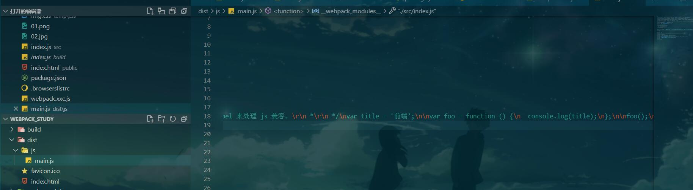

同时，我们也可以在配置中使用 `@babel/preset-env`这个预设：

```javascript
{
    test: /\.js$/,
        use: [
            {
                loader: 'babel-loader',
                options: {
                    presets: ['@babel/preset-env']
                }
            }
        ]
}
```

打包后可以看到同样的效果。

此时我们需要考虑的是，一个语法是否转换取决于什么呢？这就需要用到 `.browserslistrc`。当打包 js 文件时，也会根据  `.browserslistrc` 中设置的条件去进行兼容性处理。

比如说，如果我们将 .browserslistrc 改为：

```
chrome 91
```

此时再去打包，便会发现没有改变。因为 chrome 91 支持箭头函数和 const 。除了可以在 `.browserslistrc` 中配置，我们也可以在 options 中进行配置：

```javascript
{
    test: /\.js$/,
        use: [
            {
                loader: 'babel-loader',
                options: {
                    presets: [
                        [
                            '@babel/preset-env', {
                            	targets: 'chrome 91'
                        	}
                        ]
                    ]
                }
            }
        ]
}
```

此时我们把 .browserslistrc 还原后再打包，会发现没有改变，这说明 如果同时存在 options 配置和 .browserslistrc，会依据 options 中的配置进行打包。

这里还是推荐使用 .browserslistrc 来进行总体配置，比较便于维护。

同时，babel-loader 也可以先 postcss 一样单独提取出一个配置文件：

```
babel-loader 相关的配置文件
babel.config.js(json cjs mjs)		--> babel7 之后
babelrc.json(js cjs mjs .babelrc)	--> babel7 之前
```

我们新建 `babel.config.js`：

```javascript
module.exports = {
    presets: [
        '@babel/preset-env'
    ]
}
```

配置完后，我们在 webpack 配置中就可以简写：

```javascript
module: {
    rules: [
        {
            test: /\.js$/,
            use: [
                {
                    loader: 'babel-loader'
                }
            ]
        }
    ]
},
```

然后再打包，可以看到同样的效果。

# polyfill 配置

webpack5 之前，polyfill 在默认情况下已经被加入了，但也因此我们打包产出的内容会比较大。

webpack5 中基于优化打包速度的考虑，默认情况下 polyfill 被移出掉了，如果我们需要使用，就需要自己安装配置。


polyfill是什么：用于填充一些 babel-loader 无法转换的语法（Promise、Symbol、Generator）


要使用，先进行安装(注意要安装为生产依赖)：

```
cnpm i @babel/polyfill --save
```

可以看到，安装过程中提示了两个警告：

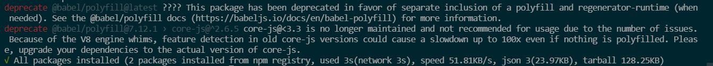

提醒我们可以直接使用 core-js（用于填充） 和 regenerator-runtime（用于转换） 两个包代替 @babel/polyfill。

这样我们就不需要使用 `@babel/polyfill`了，我们首先将其卸载

```
cnpm uninstall @babel/polyfill --save
```

卸载成功后，进行 上面两个模块的安装(后面不写安装方式默认为生产依赖)：

```
cnpm i core-js regenerator-runtime --save
```

然后在 `babel.config.js` 中配置：

```javascript
module.exports = {
    presets: [
        ['@babel/preset-env',
            {
                // false(默认值)：不对当前的 JS 处理做 polyfill 的填充
                // usage：根据我们所使用到的语法动态填充
                // entry：表示依据我们所要兼容的浏览器进行依赖填充，不管源代码中是否使用，但需要我们手动映入两个核心包
                useBuiltIns: 'usage',
            }
        ]
    ]
}
```

此时若我们打包，会报错，原因是因为 上面的配置是在 corejs2.x 的版本适用的，而我们所使用的是 3.x 的版本，所以我们需要在配置时指定版本：

```javascript
module.exports = {
    presets: [
        ['@babel/preset-env',
            {
                // false(默认值)：不对当前的 JS 处理做 polyfill 的填充
                // usage：根据我们所使用到的语法动态填充
                // entry：表示依据我们所要兼容的浏览器进行依赖填充，不管源代码中是否使用，但需要我们手动映入两个核心包
                useBuiltIns: 'usage',
                corejs: 3
            }
        ]
    ]
}
```

此时再打包，生成的结果中可以看到 其为我们填充了 Promise：

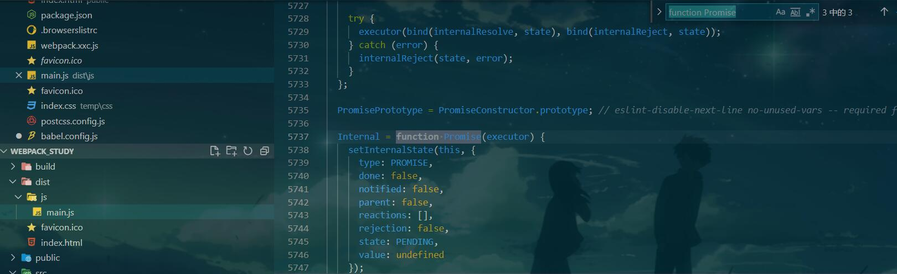

最后我们试着将 `useBuiltIns` 改为 entry，然后进行打包，此时需要在入口文件手动引入两个打包所需要的包：

**babel.config.js**

```javascript
module.exports = {
    presets: [
        ['@babel/preset-env',
            {
                useBuiltIns: 'entry',
            }
        ]
    ]
}
```


**src/index.js**

```javascript
import "core-js/stable"
import "regenerator-runtime/runtime"

const title = '前端'
const foo = () => {
    console.log(title)
}

const p1 = new Promise((resolve, reject) => {
    console.log(111)
})
console.log(p1)

foo();
```

此时再打包，可以看到打包结果明显变大。

最后需要注意的是，一些 node_modules 中的包我们在下载时可以内部已经用 ployfill 填充了相关的包，那我们在打包时如果打包了它们，就会导致一些问题。所以我们需要在 webpack 配置文件中设置排除 node_modules 下的包：

```javascript
{
    test: /\.js$/,
        exclude: /node_modules/,
            use: [
                {
                    loader: 'babel-loader'
                }
            ]
}
```

# webpack-dev-server使用

通过使用 `webpack-dev-server` ，可以帮助我们在修改后自动打包。然后配合 live-server 将打包后的数据显示出来。


首先如果要实现自动打包的功能，我们可以配置 `scripts` 中 build 命令后添加 `--watch`：

```javascript
  "scripts": {
    "build": "webpack --config webpack.xxc.js --watch"
  },
```

此时我们再进行打包，便可以看到命令行中不会立刻结束命名，而是处于一个运行状态，之后每当我们修改文件时，都会重新打包，这样的话，配合dev-server，我们就可以实现将修改后的结果立即显示的效果，而不用再次打包。

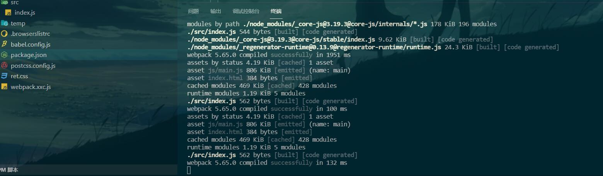

除了在 package.json的 scripts 中设置之外，我们还可以在 webpack 配置文件中进行配置：

```javascript
module.exports = {
    watch: true,
}
```

配置完后再运行，可以看到同样的效果。


这种方式（watch+live server）虽然能够实现实时打包以查看结果的效果，但相比于 webpack-dev-server，前者会将所有源代码都重新编译、每次编译成功后都需要进行文件读写、不能实现局部刷新。

要使用 webpack-dev-server ，需要先进行安装：

```
cnpm i webpack-dev-server --save-dev
```

然后在package.json 中进行配置：

```
"scripts": {
	"test": "echo \"Error: no test specified\" && exit 1",
	"build": "webpack --config webpack.xxc.js",
	"serve": "webpack serve --config webpack.xxc.js"
},
```

之后我们在命令行中使用

```
npm run serve
```

webpack-dev-server 便会为我们开启一个服务器，并为我们打开对应的 index.html 页面。（此处我一开始无法成功实现效果，原因是在之前配置 file-loader 时在output中配置了public-path，只需要删除，然后使用 asset 代替 public-path 即可）；

# webpack-dev-middleware

`webpack-dev-middleware` 是一个封装器(wrapper)，它可以把 webpack 处理过的文件发送到一个 server。`webpack-dev-server` 在内部使用了它，然而它也可以作为一个单独的 package 来使用，以便根据需求进行更多自定义设置。

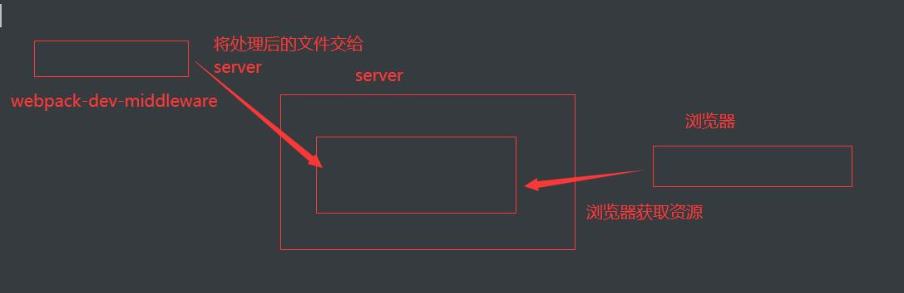

要使用 `webpack-dev-middleware`，首先得配置服务器(此处使用express)以及安装 `webpack-dev-middleware`：

```
cnpm i express --save
cnpm i webpack-dev-middleware --save
```

然后我们使用 express 创建一个服务，并在内部使用 webpack-dev-middleware 来为 服务添加资源：

```javascript
const express = require('express')
const webpackDevMiddleware = require('webpack-dev-middleware')
const webpack = require('webpack')

const app = express()

// 获取配置文件
const config = require('./webpack.xxc.js')
const compiler = webpack(config)

app.use(webpackDevMiddleware(compiler))

app.listen(3000, () => {
    console.log('服务运行成功')
})
```

然后启动服务，此时便可以用 3000 端口来访问 我们使用 webpack打包生成的文件：

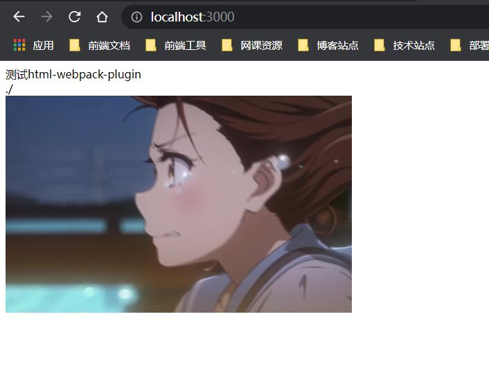

# HMR 功能使用

HMR -> hot module replacement（模块热替换）

首先得在 webpack 配置文件中配置对应的 热替换选项：

```javascript
module.exports = {
    ...
    target: 'web',	// 由于使用了 .browserlistrc,所以要配置此项
    devServer: {
        hot: true
    }
}
```

然后新建一个 title.js ，在index.js 中导入，并配置相关的热更新选项：

`title.js`

```javascript
module.exports = '前端开发'

console.log('title.js 模块 332222')
```

**index.js**

```javascript
import './title'
console.log('HMR 111 222 333')

if (module.hot) {
    module.hot.accept(['./title.js'], () => {
        console.log('title.js 模块更新了')
    })
}
```

此时若我们修改 title.js ，不会触发页面的重新渲染，而是会出现局部热更新：

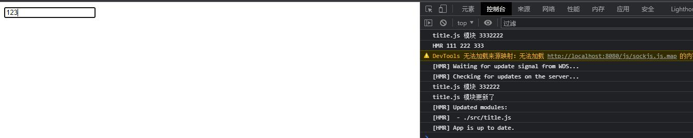

如上图中，我们可以看到，我们在更新前输入框所显示的内容，并没有因为我们 模块的更新而消失。


# React 组件支持热更新

首先安装对应的 babel 处理react语法 的包以及 react、react-dom：

```
cnpm i @babel/preset-env@7.15.0 @babel/preset-react@7.14.5 --save-dev
cnpm i react react-dom --save
```

然后新建 `App.jsx` ，写入 react 相关语法：

```js
import React, { Component } from 'react'

class App extends Component {
    constructor(props) {
        super(props)
        this.state = {
            title: '前端'
        }
    }
    render() {
        return (
            <div>
                <h2>{this.state.title}</h2>
            </div>
        )
    }
}

export default App
```

然后在 index.js 中引入并渲染：

```javascript
import './title'
import React from 'react'
import ReactDom from 'react-dom'
import App from './App.jsx'

...

ReactDom.render(<App />, document.getElementById('app'))
```

此时若直接打包 webpack 将无法识别 jsx 语法，所以我们需要配置相关文件：

`webpack.config.js`

```javascript
module: {
    rules: [
        ...
        {
            test: /\.jsx?$/,
            use: ['babel-loader']
        }
    ]
},
```

`babel.config.js`

```javascript
module.exports = {
    presets: [
        ['@babel/preset-env'],
        ['@babel/preset-react'],
    ]
}
```

此时使用 `npm run serve`，即可在浏览器端看到渲染结果


此时，如果我们修改了 `App.jsx` 中的内容，会看到整个页面都更新了，也就是**不具备热更新的效果**。

在 webpack5.0 之前，会使用 react-hot-loader，但是 5.0 之后，需要使用下面两个插件：

```
cnpm install -D @pmmmwh/react-refresh-webpack-plugin react-refresh
```

安装好后，在 `webpack.config.js` 中进行配置：

```javascript
module.exports = {
    plugins: [
        ...
        new ReactRefreshWebpackPlugin()
    ],
    devServer: {
        hot: true
    }
}
```

然后在 babel.config.js 中再添加配置：

```javascript
module.exports = {
    ...
    plugins: [
        ['react-refresh/babel']
    ]
}
```

此时，重新打包，便可以看到修改 react 代码时会发生热更新。

# Vue 组件支持热更新

要实现 Vue 组件的热更新，只需要安装 vue-loader，其内部默认支持热更新。首先我们来实现 14 版本的vue-loader完成热更新。

首先安装插件：

```
cnpm i vue --save
cnpm i vue-template-compiler --save-dev  // 用于编译vue文件
cnpm i vue-loader@14 -D
```

然后编写 App.vue 文件，并在 index.js 中导入：

```html
<template>
	<div class="example">{{ msg }}</div>
</template>

<script>
export default {
	data() {
		return {
			msg: "Hello world!",
		};
	},
};
</script>

<style>
.example {
	color: green;
}
</style>
```

```javascript
import Vue from 'vue'
import App from './App.vue'

new Vue({
    render: h => h(App)
}).$mount('#app')
```

然后在 `webpack.xxc.js` 中进行配置：

```javascript
module: {
    rules: [
        {
            test: /\.vue$/,
            use: ['vue-loader']
        }
    ]
},
```

此时运行 `npm run serve`打包，既可以编译 vue 文件，同时也能实现热更新。


接着我们再尝试使用 `vue-loader 15 版本`（不建议使用 16，因为其是针对vue3的）。

首先安装：

```
cnpm i vue-loader@15 --save-dev
```

然后打包会看到如下报错：

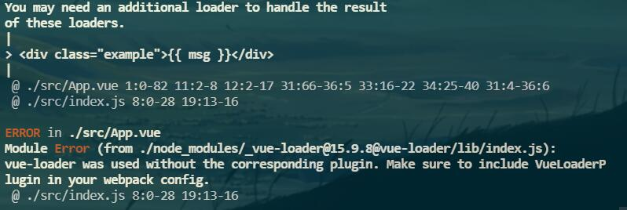

这是因为 15 版本需要我们手动引入 vue-loader-plugin(vue-loader自带)：

`webpack.config.js`

```javascript
const VueLoaderPlugin = require('vue-loader/lib/plugin')
module.exports = {
    ...
    plugins: [
        ...
        new VueLoaderPlugin()
    ],
}
```

此时再打包，便可以看到成功的结果。

# output中的 path和 publicPath

output 中的 path 的作用是告知 webpack 要将打包后的内容输出到哪。publicPath 的默认值为 空字符串，用于告知 index.html 内部的引用路径（域名 + publicPath + filename）（若publicPath 为空字符串，浏览器会默认将其内容变为 '/'）。

```javascript
    output: {
        filename: 'js/main.js',       // 输出文件名称
        path: path.resolve(__dirname, 'dist'),  // 此处不可以使用相对路径
        publicPath:''
    },
```

`index.html`

```html
<script defer src="js/main.js"></script>
```

上方index.html 中引入 路径就会变为： 

`http://localhost:8080/js/main.js`

然后我们将 publicPath 改为 '/'，再进行 npm run serve，此时仍然可以正常运行。

但若我们执行 npm run build 将项目打包后，再使用 live server 打开项目，会看到报错：

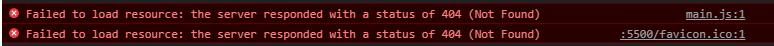

为解决这个错误，我们可以将 publicPath 改为 ‘./’，此时便可以成功运行。原因是 项目被打包到 dist 目录下后，若使用 '/'，会去项目根目录下找寻资源，引用路径会变为

`127.0.0.1:5500/js/main.js`。


而用'./'，则会去当前目录下寻找，即：

`127.0.0.1:5500/dist/js/main.js`，这样才能找的到。

但同时又无法在 `npm run serve` 时实现效果，而是显示**文件夹目录**，原因是因为原先打包是指向到 dist 文件夹(内存中生成)中的，可是配置 publicPath 后，指向的文件夹往上走了一层（因为此时publicPath指的是进行生成的静态文件所在的位置，若为'./'，会指向根目录，而用'/'，会指向 dist 文件夹。可以理解为其本来就是指向 dist，然后'./'导致其变成了指向**项目根目录**，而'/'让其指向了**本身**）。同时又因为打包结果此时在内存中，我们就无法在显示的 **文件夹目录** 中看到 dist。

<div class="danger">

> 当使用webpack命令进行打包上生产时，它确实是在静态资源路径前面加上publicPath的值。 但是当我们使用webpack-dev-server 进行开发时，它却不是在静态文件的路径上加publicPath的值，相反，它指的是webpack-dev-server 在进行打包时生成的静态文件所在的位置。也就是说publicPath的使用是分环境的。

</div>


# devServer 中的 publicPath

publicPath: 指定本地服务所在的目录。

contentBase: 我们打包之后的资源如果说依赖其它未被打包的资源，此时就告知去哪找。

watchContentBase: 监视未被打包的文件发生改变时，也执行热更新


首先我们给 devServer配置 publicPath：

**webpack.config.js**

```javascript
devServer: {
        hot: true,
        publicPath: '/lg',
}
```

配置好后，执行 `npm run serve`，若在 `localhost:8080` 访问 会无法呈现页面，原因是 devServer 中的 publicPath 会指定打包文件产出路径，若在 `localhost:8080/lg` 访问则可以成功访问。

但此时由于 **output** 中的 `publicPath` 为 ‘/’，导致 加载 main.js 时，会去 `http://localhost:8080/js/main.js` 中查找，就会导致查找不到（因为打包文件产出路径已被改变 ）。

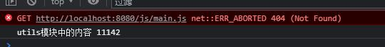

所以我们还需要将 **output** 中的 `publicPath` 改为与 **devServer** 中的 publicPath 相同，页面才可以成功运行。


然后我们再考虑一种情况，当我们直接在 **public/index.html** 中引入 js 文件，而不是使用 index.js 导入。此时若使用相对路径导入：

```html
<script type="text/javascript" src="./utils.js"></script>
```

会导致其去寻找 根目录下的 utils.js，此时就会出错（因为其回去找根路径localhost:8080）：


我们可以将其改为绝对路径，但同时也可以通过配置 **contentBase** 告知该去何处寻找 引入的 js 文件：

```javascript
devServer: {
        hot: true,
        publicPath: '/lg',
        contentBase: path.resolve(__dirname, 'public'),
        watchContentBase: true
    }
```

同时也可以开启 watchContentBase，来实现当这些 js 文件（index.html中直接引入）修改后实现热更新功能。

# devServer 常用配置

hot: true,   // 开启局部热更新

hotOnly: true, // 确保不会在出错被修改后刷新整个页面，而是只更新出错的地方

port: 4000, // 设置服务器打开端口

open: true, // 编译完后自动打开浏览器

compress: true,   // 默认值为 false,设置为 true 后会开启 gzip 压缩，可以在响应头的Content-Encoding 中看到。

historyApiFallback: true  // 当发现404 时将页面替换为 index.html

## hot

hot 的作用可以 参照 HMR 功能使用章节

## hotOnly

若我们打包的文件，某一处出错，会在浏览器报出如下错误：

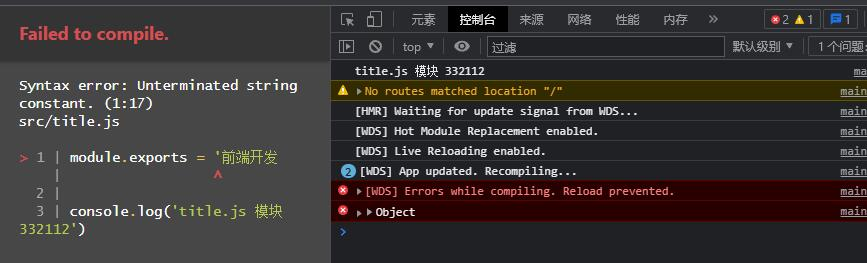

此时如果修改了错误再保存，webpack 会刷新整个页面：

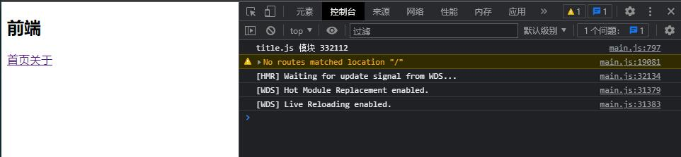

为了实现只刷新错误的地方，我们可以添加 `hotOnly:true`。

## compress

添加 compress 前：

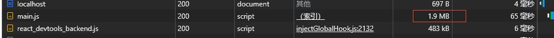

添加 compress 后：

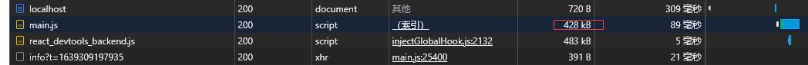

## historyApiFallback

首先编写一个 JSX 页面：

**App.jsx**

```javascript
import React, { Component } from 'react'
import { BrowserRouter, Routes, Link, Route } from 'react-router-dom'
import Home from './components/Home.jsx'
import About from './components/About.jsx'

class App extends Component {
    constructor(props) {
        super(props)
        this.state = {
            title: '前端'
        }
    }
    render() {
        return (
            <div>
                <h2>{this.state.title}</h2>
                <BrowserRouter>
                    <Link to="/home">首页</Link>
                    <Link to="/about">关于</Link>

                    <Routes>
                        <Route path="/home" element={<Home />} />
                        <Route path="/about" element={<About />} />
                    </Routes>
                </BrowserRouter>
            </div>
        )
    }
}

export default App
```

其中引入的两个组件：

**Home.jsx**

```javascript
import React from 'react'

function Home() {
    return <div>Home</div>
}

export default Home
```

**About.jsx**

```javascript
import React from 'react'

function About() {
    return <div>About</div>
}

export default About
```

当我们点击了页面上的某一个链接，显示对应组件的同时，会导致路由也发生变化，此时若我们使用 F5 刷新页面，就会出现如下 404 的情况：

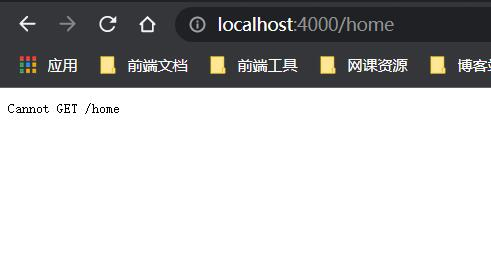

此时我们可以设置 `historyApiFallback:true`，就会在 404 的时候去加载 index.html 页面，就可以避免这种情况发生。


# proxy 代理设置

为了解决跨域的问题，我们就需要设置代理。

首先安装 axios，用于发送 ajax 请求：

```
cnpm i axios --save
```

然后在 index.js 中发送请求(此处本地使用  express 写了一个8000端口的接口作为测试)：

```javascript
import axios from 'axios'

...
axios.get('http://localhost:8000/list').then((res) => {
    console.log(res.data)
})
```

然后执行 `npm run serve`，会看到浏览器显示跨域问题：

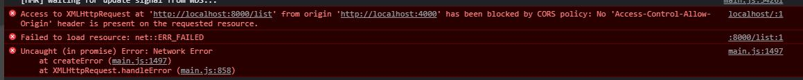

要解决跨域问题，我们首先需要修改 webpack 配置文件，在devServer的 proxy 进行代理配置 ：

```javascript
module.exports = {
    ...
    devServer: {
        hot: true,      
        hotOnly: true,  
        port: 4000, 
        open: true, 
       	compress: true,      
        historyApiFallback: true,    // 当发现404 时将页面替换为 index.html
        proxy: {
            // 当前axios请求地址 -> /api/list
            // 在webpack服务器下会被默认变为 -> http://localhost:4000/api/list
            // 通过以下代理配置将请求发送到 -> http://localhost:8000/list
            '/api': {
                target: 'http://localhost:8000',
                pathRewrite: { "^/api": "" },   //表示重写路径，将 http://localhost:8000/api/list -> http://localhost:8000/list。
                changeOrigin: true // 默认为false，代表请求头中的host为浏览器发送过来的host，此处为 localhost:4000，而若改为true，则请求头中的host 会改为 target的值。
            }
        }
    }
}
```

然后在使用 axios 发送请求的时候，将请求发送到当前 webpack 服务器地址，此处若省略ip地址和端口，会默认使用 webpack 服务器地址：

```javascript
axios.get('/api/list').then((res) => {
    console.log(res.data)
})
```

# resolve 模块解析规则

[解析（resolve）](https://webpack.docschina.org/configuration/resolve/)

我们试着将 引入 jsx 的语句省略掉文件后缀，会出现如下错误：

```javascript
import Home from '@/components/Home'
```

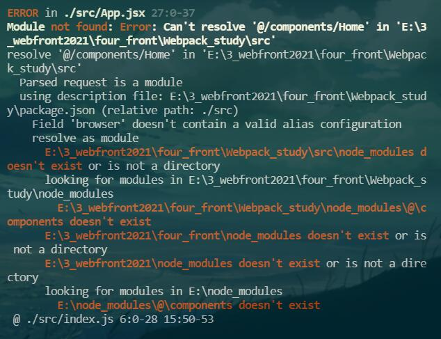

这说明这种写法使webpack无法找到 Home.jsx，因为其有自己的一套查找规则。


Webpack 使用时，一般文件引入分为三类路径：

1. 相对路径
2. 绝对路径
3. 直接写模块名称

如果写绝对路径，其会直接根据路径查找文件，找不到就报错。如果写相对路径，会安装文件的上下文关系查找文件。如果给模块名称，则会去 `node_modules` （在 resolve.modules 中进行配置）中查找对应模块。


当路径确定后，会继续看其后面是一个文件还是文件夹，如果是一个文件，则去看齐后面的文件名，如果是一个明显的文件名，则会去直接找到后打包。如果没有明确指定文件名，则会去 resolve.extensions 中进行文件后缀名补充，默认值为 `['.js', '.json', '.wasm']`。

如果判断其后面是一个文件夹，会去找 resolve.mainFiles 选项，默认值为 `['index']`，然后在里面进行补充操作。补完 index 后，再根据 resolve.extensions 中进行文件后缀名补充。


我们可以在 webpack 配置文件中，进行 resolve 配置，此处配置其最常用的两个属性 extensions 和 alias：

```javascript
module.exports = {
 ...
 resolve: {
        extensions: ['.js', '.json', '.ts', '.jsx', '.vue'],    // 配置时需要将默认值 '.js'、'.json' 添加，否则会报错
        alias: {    // 用于配置导入文件时路径的简化写法
            '@': path.resolve(__dirname, 'src')
        }
    },
}
```

配置完后，我们导入 jsx 文件时就可以省略后缀，同时可以使用简化方式进行导入：

```javascript
import Home from '@/components/Home'
import About from '@/components/About'
```


# source-map 作用

因为浏览器加载的是编译过后的代码，不利于我们去做调试，所以我们可以使用 source-map 将编译后的代码与原来的代码去做一一对应的关系（**映射**），在调试的时候就可以定位到源代码中的信息。

启动前提：在浏览器设置中开启 source-map 功能：

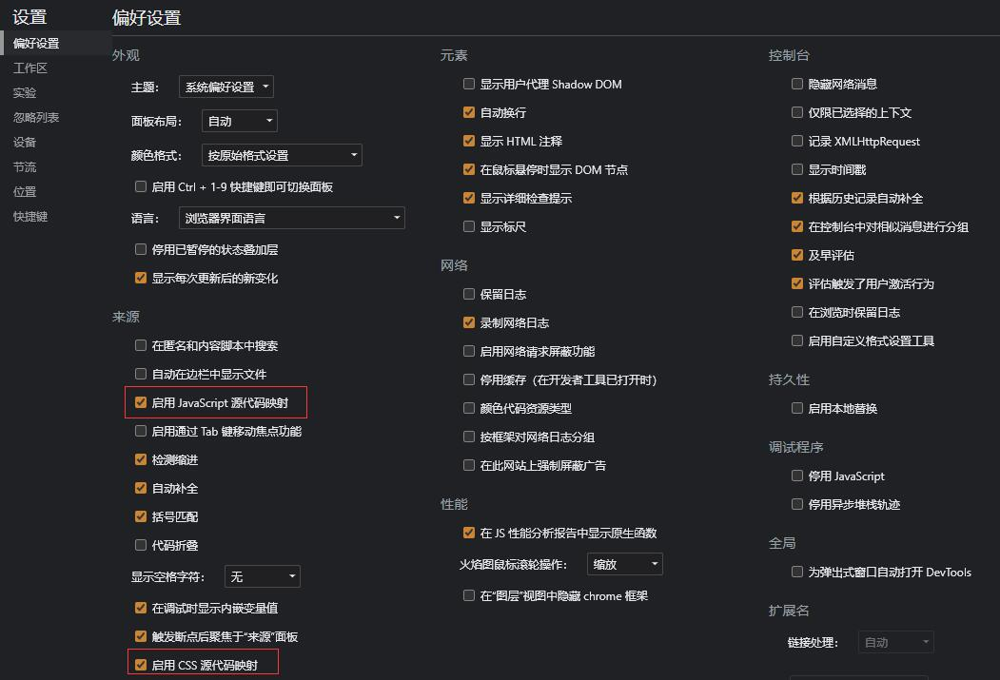

首先我们来看 `webpack.config.js` 中的 mode选项：

mode 的默认值为 production(本机上为 development，目前不知缘故)，这代表着会将打包后的代码进行如下的 压缩，所有代码都会被集中到一行：

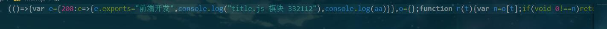

此外，若将 mode 设为 development，则代表着同时开启了 devtool:'eval'。

此时打包形成的代码会有很多 eval ：

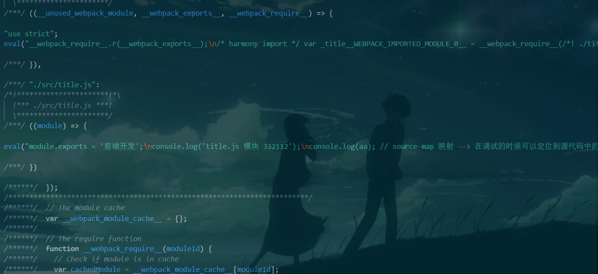


然后，在这种配置下，我们尝试将一个代码改错，然后执行 `npm run serve`，此时可以看到控制台提示的是错误代码所在的位置是在打包后文件中所在的位置。

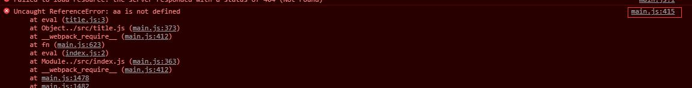

此时我们可以将 devtool 改为 source-map:

```javascript
module.exports = {
    mode: 'development',
    devtool: 'source-map',
    ...
}
```

此时再进行打包，会看到打包会同时生成一个 xxx.map.js 文件：

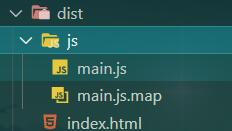

而在 main.js 代码末尾，会有这么一段代码，代表main.js 对应 main.js.map  文件。同时可以看到 main.js 中的代码会更易阅读。

```javascript
//# sourceMappingURL=main.js.map
```


此时通过 live server 打开 index.html，可以看到浏览器提示代码错误地址为 原文件所在位置。

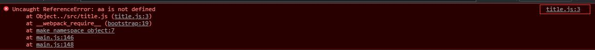

# devtool 详细说明

## eval

当我们设置了 mode 为 development 时，devtool 就被设为了 eval。 eval 打包生成的文件中会通过 `sourceURL` 的形式定位到源代码的位置：

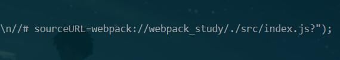

这时我们通过 live-server 打开打包生成的 index.html ，可以看到其可以提示错误在原代码中的位置：

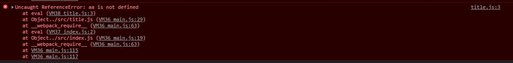

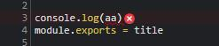

同时其既会告诉我们错误的行，也会告诉我们错误的列。


而我们若通过 `npm run serve` 的方式打开文件，会发现其提示的是错误在打包文件中的位置：

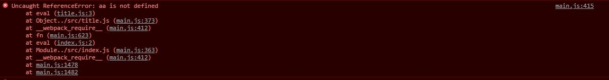

## souce-map

然后我们将 devtool 改为 'source-map'（这也是 vue 脚手架开发阶段给出的配置方式）。

执行 `npm run build` 后，除了 main.js 外，还生成了一个 .map.js 文件


这里面的 main.js 中，通过 `sourceMappingURL=main.js.map` 的方式，浏览器就可以通过 main.js 找到 main.js.map 文件，然后通过其，将main.js中的代码与源代码映射起来，也就能够调试源代码了。

然后我们通过 live-server 的方式运行 html 文件，可以看到：

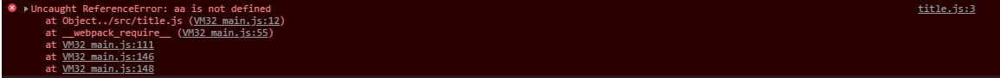

其提示错误是在源代码中。

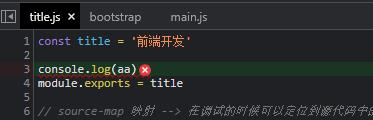

不过其只会告诉我们错误代码所在的行，不会告诉在那一列。（这是因为我们未在 module 中设置 babel-loader）。

**若我们通过 `npm run dev` 的方式，也不能直接显示错误代码所在源文件的位置**

## eval-source-map

这种方式进行打包，不会生成 .map.js 文件，但是会在 main.js 中包含对应的 sourcemap 信息（在 eval 中，以base64的方式）。

## inline-source-map

这种方式进行打包，也不会生成 .map.js 文件，但是会在 main.js 中包含对应的 sourcemap 信息（在 末尾 sourceMappingURL 中，以base64的方式）。


这两种方式可以减少一次浏览器对 .map.js 文件的请求。

## cheap-source-map

在module.rules 中有 babel-loader 的情况下，使用 souce-map 既能提供错误的行信息，也能提供错误的列信息(与 eval 一样，但eval不需要 babel-loader)，而 cheap-source-map 即便有 babel-loader，也只会提供错误的行信息，同时会删除文件空行，并将一些关键字替换（如将 const 转为 var）。

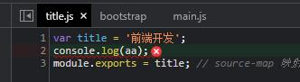

配置babel-loader：

```javascript
module: {
    rules: [
        {
            test: /\.js$/,
            exclude: /node_modules/,
            use: [
                {
                    loader: 'babel-loader'
                }
            ]
        },
    ]
},
```

## cheap-module-source-map

与cheap-source-map 类似，不同点在于其不会删除文件空行，也不会将关键字替换。

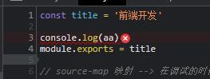

## hidden-source-map

打包后会生成 .map.js 文件，不过 main.js 中不会有 `sourceMappingURL=main.js.map` ，同时在 live-server 运行 html 文件时，错误位置不会指向源代码。

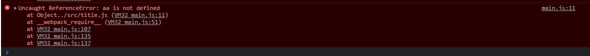

一般用于生产环境占时用不到 map.js 文件，而要用时直接在 main.js 中添加 `sourceMappingURL=main.js.map` 的情况。

## nosources-source-map

会生成 .map.js 文件，同时会提示错误位置在源代码中的位置，但是点击后的源代码只有错误提示，没有具体代码：

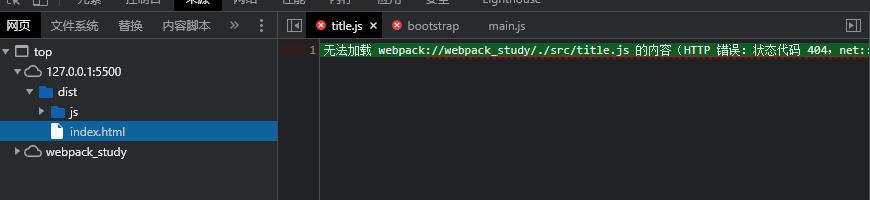


## 总结

一般发布阶段，基于对源代码的保护不会提供 source-map。

若是开发阶段，借鉴：vue中直接使用 source-map，而react 中使用 cheap-module-source-map。

若是测试阶段，为了很快定位到错误位置，也可以使用 source-map 或 cheap-module-source-map。


# ts-loader 编译 TS

首先我们尝试使用 tsc命令 来编译 ts

我们先全局安装 ts：

```
npm i typescript -g
```

然后便可以使用 `tsc --init` 命令在项目根目录下初始化一个 `tsconfig.json` 文件。

然后我们在 src 中新建一个 `index.ts` 文件：

```typescript
const title: string = '前端开发'

const foo = (msg: string) => {
    console.log(msg)
}
foo(title)
```

接着在命令行中，使用 `tsc ./src/index.ts` 便可编译 index.ts 文件生成 index.js 文件。


然后我们来使用 ts-loader 编译 ts 文件：

首先安装 ts-loader 及 typescript(ts-loader 底层依赖它)：

```
cnpm i ts-loader typescript -D
```

然后在 module.rule 中新增 ts 相关 rule，并将 entry 改为 index.ts:

`webpack.config.js`

```javascript
module.exports = {
    entry: './src/index.ts',    // 此处可以使用相对路径
    module: {
        rules: [
            {
                test: /\.ts$/,
                use: [
                    'ts-loader'
                ]
            }
        ]
    },
    ...
}
```

然后我们执行 `npm run build`，便可将 ts 转为 js 后打包。不过如果此时 ts 中写了一些 es6+ 语法，是无法将其做出兼容的。


# babel-loader 编译 TS

我们尝试在 index.ts 中写入如下代码：

```javascript
const title: string = '前端开发'

const foo = (msg: string) => {
    console.log(msg)
}

const p1 = new Promise((resolve, reject) => {

})

foo(title)
```

然后执行 `npm run build`，可以看到编译后的代码并未进行 polyfill 代码填充。

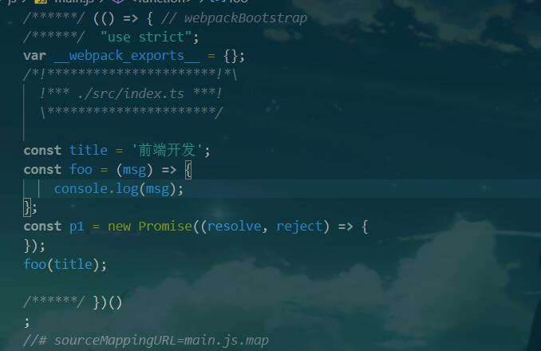

为了实现代码填充效果，我们需要安装 `@babel/preset-typescript`(前提是已经安装了 babel-loader 和 @babel/preset-env)。

```
cnpm i @babel/preset-typescript -D
```

然后在 webpack 配置文件中进行 ts文件 的 rule 配置，将原先的 ts-loader 改为 babel-loader:

```javascript
module: {
    rules: [
        {
            test: /\.ts$/,
            use: [
                'babel-loader'
            ]
        }
    ]
},
```

再在 `babel.config.js` 中进行 polyfill 填充配置：

```javascript
module.exports = {
    presets: [
        ['@babel/preset-env', {
            useBuiltIns: 'usage',
            corejs: 3
        }],
        ['@babel/preset-typescript'],
    ]
}
```

此后再使用 `npm run build` ，即可以实现 ployfill 填充。


<div class="danger">

> 需要注意：使用 babel-loader 编译 ts 时，若出现语法错误，在编译时不会提示，只有运行时才会提示。而使用 ts-loader 会直接在编译时进行提示。
> 为了解决这个问题，我们可以在使用 babel-loader 编译 ts 时，首先使用 tsc 命令进行语法检查（同时配置不生成 js 文件），然后在进行编译：

</div>

**package.json**

```json
"scripts": {
    "build": "npm run ck && webpack --config webpack.xxc.js",
    "ck":"tsc --noEmit"
},
```

# 加载 vue 文件

首先我们创建一个 `App.vue` 文件：

```html
<template>
	<div>
		<h2 class="title">{{ title }}</h2>
	</div>
</template>

<script>
export default {
	name: "",
	data() {
		return {
			title: "前端",
		};
	},
};
</script>

<style lang="less" scoped>
.title {
	color: red;
}
</style>
```

然后在 index.js 中导入，并挂载：

```javascript
import Vue from 'vue'
import App from './App.vue'

new Vue({
    render: h => h(App)
}).$mount('#app')
```

接着为了加载 Vue 文件，我们需要安装如下插件：

```
cnpm i vue vue-loader vue-template-compiler --save-dev
```

然后在 `webpack.config.js` 中配置，此时既要配置 .less 文件，也要配置 .vue 文件：

```javascript
const VueLoaderPlugin = require('vue-loader/lib/plugin')
module.exports = {
    module: {
        rules: [
            ...
            {
                test: /\.less$/,
                use: [
                    'style-loader',
                    {
                        loader: "css-loader",
                        options: {
                            importLoaders: 2
                        }
                    },
                    "postcss-loader",
                    'less-loader'
                ]
            },
            {
                test: /\.vue$/,
                use: ['vue-loader']
            }
        ]
    },
    plugins: [
        new VueLoaderPlugin()
    ],
}
```

然后运行 `npm run build` 便可正常打包。

关于 vue-loader ，可以参考 **Vue 组件支持热更新** 章节


# 区分打包环境

目前我们的 webpack 配置文件只有一个，而 配置文件中的一些配置项明显是需要区别打包环境的，比如 mode。所以我们就需要根据环境进行分别打包。

那我们就要考虑一个问题：`如何获取到当前打包环境呢？`

首先我们创建三个文件：

config/webpack.common.js

config/webpack.dev.js

config/webpack.prod.js

然后修改 `package.json` 中的打包命令，使其打包时的配置文件都指向 `webpack.common.js`，并通过 `--env 环境名称` 的形式进行环境参数的传递：

```json
  "scripts": {
    "build2": "webpack --config ./config/webpack.common.js --env production",
    "serve2": "webpack serve --config ./config/webpack.common.js --env development",
  },
```

然后我们便可以在 `webpack.common.js` 中获取到 env 参数，以此来区别当前打包环境：

```javascript
module.exports = (env) => {
    console.log(env, '<-------')
    return {
		// 配置信息
    }
}
```

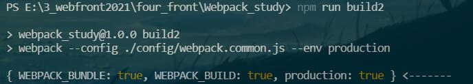

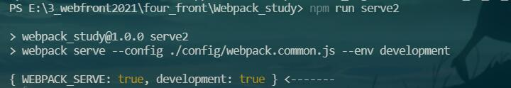

# 合并生产环境配置

我们先将原先项目根目录下的 `webpack.config.js` 中的配置提取出来，并去除掉一些只在开发或生产环境的配置：

`webpack.common.js`

```javascript
const path = require('path')
const HtmlWebpackPlugin = require('html-webpack-plugin')

module.exports = (env) => {
    const isProduction = env.production
    return {
        entry: './src/index.js',    // 此处使用相对路径，即便将 配置文件移到 config 目录下，也不会报错
        resolve: {
            extensions: ['.js', '.json', '.ts', '.jsx', '.vue'],    // 配置时需要将默认值 '.js'、'.json' 添加，否则会报错
            alias: {    // 用于配置导入文件时路径的简化写法
                '@': path.resolve(__dirname, './src')
            }
        },
        output: {
            filename: 'js/main.js',       // 输出文件名称
            path: path.resolve(__dirname, './dist'),  // 此处不可以使用相对路径
        },
        module: {
            rules: [
                {
                    test: /\.css$/,
                    use: [
                        'style-loader',
                        {
                            loader: 'css-loader',
                            options: {
                                importLoaders: 1,    // importLoaders 表示当引入了css文件时，需要前进几个loader处理
                                esModule: false
                            }
                        },
                        "postcss-loader",
                    ]
                },
                {
                    test: /\.less$/,
                    use: [
                        'style-loader',
                        {
                            loader: "css-loader",
                            options: {
                                importLoaders: 2
                            }
                        },
                        "postcss-loader",
                        'less-loader'
                    ]
                },
                {
                    test: /\.(png|svg|gif|jpg?g)$/,
                    type: 'asset',
                    generator: {
                        filename: "img/[name].[hash:4][ext]"
                    },
                    parser: {
                        dataUrlCondition: {
                            maxSize: 50 * 1024
                        }
                    }
                },
                {
                    test: /\.(ttf|woff2?)$/,
                    type: 'asset/resource',
                    generator: {
                        filename: 'font/[name].[hash:3][ext]'
                    }
                },
                {
                    test: /\.js$/,
                    exclude: /node_modules/,
                    use: [
                        {
                            loader: 'babel-loader'
                        }
                    ]
                },
                {
                    test: /\.ts$/,
                    use: [
                        'babel-loader'
                    ]
                },
                {
                    test: /\.jsx?$/,
                    use: ['babel-loader']
                },
                {
                    test: /\.vue$/,
                    use: ['vue-loader']
                }
            ]
        },
        plugins: [
            new HtmlWebpackPlugin({
                title: 'copy-webpack-plugin',
                template: "./public/index.html"
            })
        ],

    }
}
```

此时再使用 `npm run build` 进行打包，会提示如下的路径错误信息，同时 dist 目录被打包到了 `config` 目录之下：

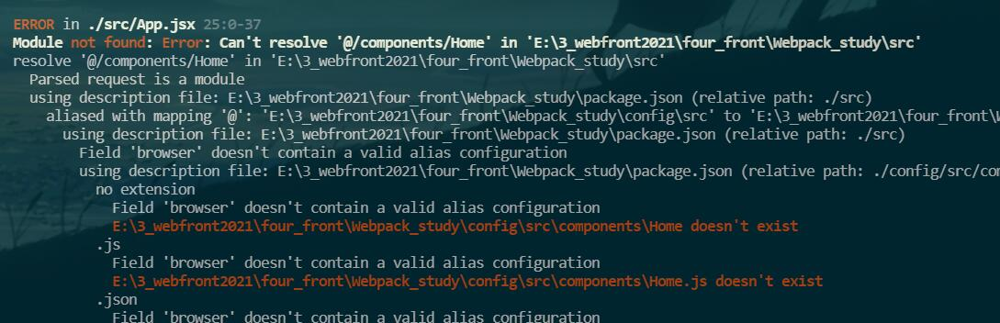

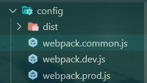

原因是因为resolve 中我们配置 alias和 path 时使用 `__dirname`，而此时 `__dirname` 指的是 config 目录，故而产生了以上问题

```javascript
resolve: {
    extensions: ['.js', '.json', '.ts', '.jsx', '.vue'],    // 配置时需要将默认值 '.js'、'.json' 添加，否则会报错
	alias: {    // 用于配置导入文件时路径的简化写法
		'@': path.resolve(__dirname, './src')
	}
},
output: {
    filename: 'js/main.js',       // 输出文件名称
    path: path.resolve(__dirname, './dist'),  // 此处不可以使用相对路径
},
```

同时我们需要考虑，为何 entry 也是使用 `./src`，却可以正常获取到入口文件呢？

```javascript
entry: './src/index.js',
```

这是因为 entry 虽然是相对，但是是相对于 `context` （一个配置文件中的属性）来执行的，而 `context` 的值是依据打包命名中指定的路径的：

`package.json`

```json
    "build2": "webpack --config ./config/webpack.common.js --env production",
    "serve2": "webpack serve --config ./config/webpack.common.js --env development",
```

根据打包命令，打包时找的是 ./config 下的文件，所以 context 的值就是项目根目录。所以 entry 便也会去项目根进行查询。


然后我们再来考虑，我们当然可以将 resolve、output 中的路径改为如下形式：

```javascript
resolve: {
    extensions: ['.js', '.json', '.ts', '.jsx', '.vue'],    // 配置时需要将默认值 '.js'、'.json' 添加，否则会报错
	alias: {    // 用于配置导入文件时路径的简化写法
		'@': path.resolve(__dirname, '../src')
	}
},
output: {
    filename: 'js/main.js',       // 输出文件名称
    path: path.resolve(__dirname, '../dist'),  // 此处不可以使用相对路径
},
```

但是这样，之后每个使用路径的地方，我们都需要考虑路径相对于 config目录 的位置，为了简便，我们可以在 config 下新建一个 `path.js` 文件，处理好路径并返回：

```javascript
const path = require('path')

const appDir = process.cwd()    // 返回 Node.js 进程的当前工作目录

const resolveApp = (relativePath) => {
    return path.resolve(appDir, relativePath)
}

module.exports = resolveApp
```

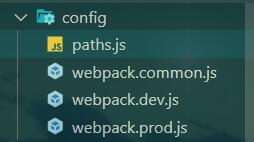

然后在 `webpack.common.js` 中导入调用

```javascript
const resolveApp = require('./paths')
...
module.exports = (env) => {
    return {
        resolve: {
            extensions: ['.js', '.json', '.ts', '.jsx', '.vue'],    // 配置时需要将默认值 '.js'、'.json' 添加，否则会报错
            alias: {    // 用于配置导入文件时路径的简化写法
                '@': resolveApp('./src')
            }
        },
        output: {
            filename: 'js/main.js',       // 输出文件名称
            path: resolveApp('./dist'),  // 此处不可以使用相对路径
        },
        ...
    }
}
```


解决了路径的问题之后，我们便可以进行配置文件的配置合成=并了，要将不同的配置文件合并，需要先安装 `webpack-merge` 包：

```
cnpm i webpack-merge -D
```

然后在 `webpack.prod.js` 和 `webpack.dev.js` 中进行分别配置：

`webpack.prod.js`

```javascript
const { CleanWebpackPlugin } = require('clean-webpack-plugin')
const CopyWebpackPlugin = require('copy-webpack-plugin')

module.exports = {
    mode: 'production',
    // devtool: false,      // 如果mode 是 production ，devtool 默认不会产生 source-map，所以不需要设置
    plugins: [
        new CleanWebpackPlugin(),
        new CopyWebpackPlugin({
            patterns: [
                {
                    from: 'public',     // from 表示要 copy 的文件夹
                    globOptions: {
                        ignore: ['**/index.html']
                    }
                }
            ]
        }),
    ],
}
```

`webpack.dev.js`

```javascript
const path = require('path')
const ReactRefreshWebpackPlugin = require('@pmmmwh/react-refresh-webpack-plugin')

module.exports = {
    mode: 'development',
    devtool: 'source-map',
    plugins: [
        new ReactRefreshWebpackPlugin(),
    ],
    target: 'web',
    devServer: {
        hot: true,      // 开启局部热更新
        hotOnly: true,  // 确保不会在出错被修改后刷新整个页面，而是只更新出错的地方
        port: 4000, // 设置服务器打开端口
        open: true, // 编译完后自动打开浏览器
        compress: true,      // 默认值为 false,设置为 true 后会开启 gzip 压缩，可以在响应头的Content-Encoding 中看到。
        historyApiFallback: true,    // 当发现404 时将页面替换为 index.html
        proxy: {
            '/api': {
                target: 'http://localhost:8000',
                pathRewrite: { "^/api": "" },   //表示重写路径，将 http://localhost:8000/api/list -> http://localhost:8000/list。
                changeOrigin: true // 默认为false，代表请求头中的host为浏览器发送过来的host，此处为 localhost:4000，而若改为true，则请求头中的host 会改为 target的值。
            }
        }
    }
}
```

然后在 `webpack.common.js` 中进行导入，并根据打包环境判断要合并哪个文件：

```javascript
const resolveApp = require('./paths')
const HtmlWebpackPlugin = require('html-webpack-plugin')
const { merge } = require('webpack-merge')

// 导入其它的配置
const prodConfig = require('./webpack.prod')
const devConfig = require('./webpack.dev')

// 定义对象保存 base 配置信息
const commonConfig = {
    entry: './src/index.js',    // 此处使用相对路径，即便将 配置文件移到 config 目录下，也不会报错
    resolve: {
        extensions: ['.js', '.json', '.ts', '.jsx', '.vue'],    // 配置时需要将默认值 '.js'、'.json' 添加，否则会报错
        alias: {    // 用于配置导入文件时路径的简化写法
            '@': resolveApp('./src')
        }
    },
    output: {
        filename: 'js/main.js',       // 输出文件名称
        path: resolveApp('./dist'),  // 此处不可以使用相对路径
    },
    module: {
        rules: [
            {
                test: /\.css$/,
                use: [
                    'style-loader',
                    {
                        loader: 'css-loader',
                        options: {
                            importLoaders: 1,    // importLoaders 表示当引入了css文件时，需要前进几个loader处理
                            esModule: false
                        }
                    },
                    "postcss-loader",
                ]
            },
            {
                test: /\.less$/,
                use: [
                    'style-loader',
                    {
                        loader: "css-loader",
                        options: {
                            importLoaders: 2
                        }
                    },
                    "postcss-loader",
                    'less-loader'
                ]
            },
            {
                test: /\.(png|svg|gif|jpg?g)$/,
                type: 'asset',
                generator: {
                    filename: "img/[name].[hash:4][ext]"
                },
                parser: {
                    dataUrlCondition: {
                        maxSize: 50 * 1024
                    }
                }
            },
            {
                test: /\.(ttf|woff2?)$/,
                type: 'asset/resource',
                generator: {
                    filename: 'font/[name].[hash:3][ext]'
                }
            },
            {
                test: /\.js$/,
                exclude: /node_modules/,
                use: [
                    {
                        loader: 'babel-loader'
                    }
                ]
            },
            {
                test: /\.ts$/,
                use: [
                    'babel-loader'
                ]
            },
            {
                test: /\.jsx?$/,
                use: ['babel-loader']
            },
            {
                test: /\.vue$/,
                use: ['vue-loader']
            }
        ]
    },
    plugins: [
        new HtmlWebpackPlugin({
            title: 'copy-webpack-plugin',
            template: "./public/index.html"
        })
    ],

}

module.exports = (env) => {
    const isProduction = env.production

    // 依据当前的打包模式来合并配置
    const config = isProduction ? prodConfig : devConfig

    const mergeConfig = merge(commonConfig, config)
    return mergeConfig
}
```

一切配置完后，我们在使用打包命令时 webpack.common.js 便会根据传入的环境参数的不同执行不同的 配置。