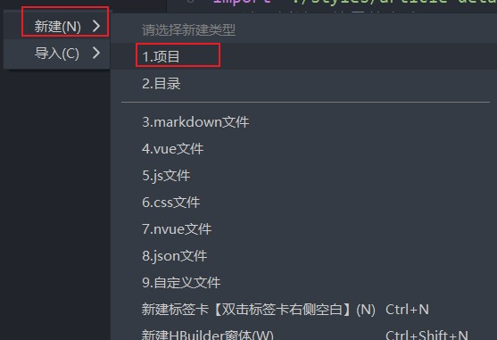
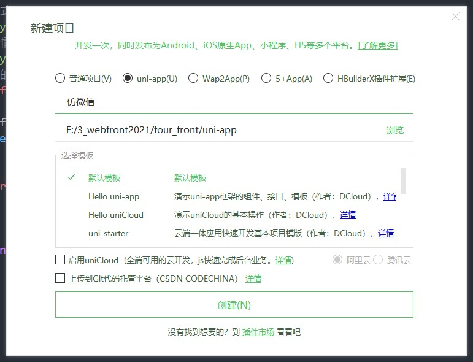
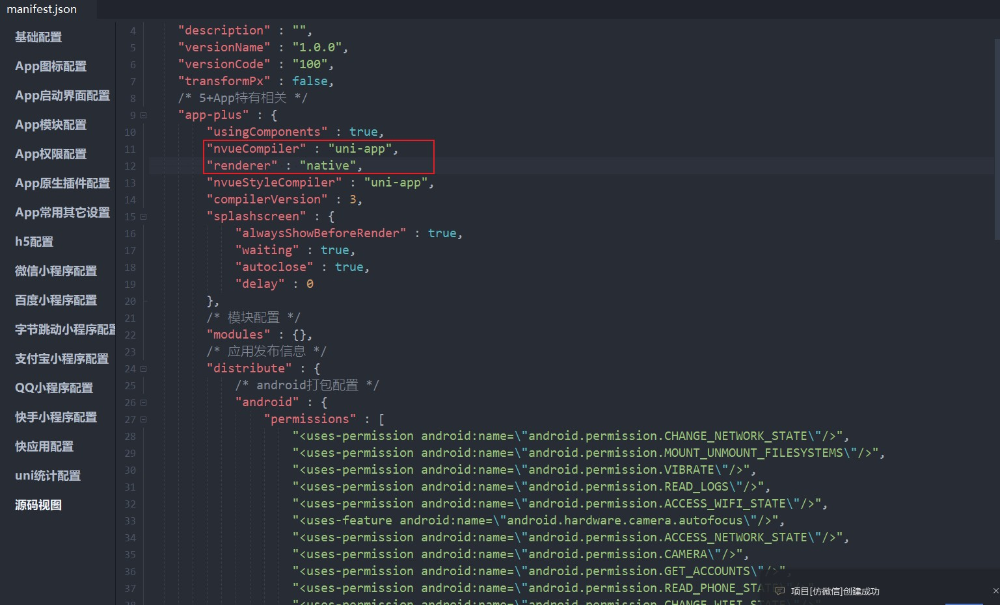
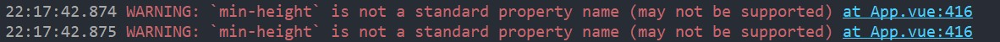
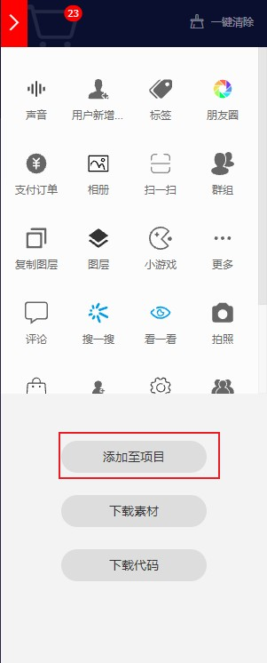
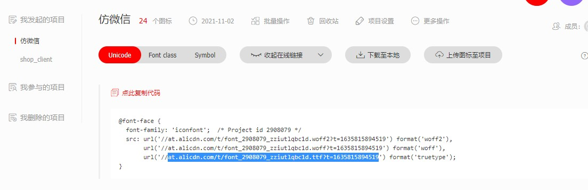
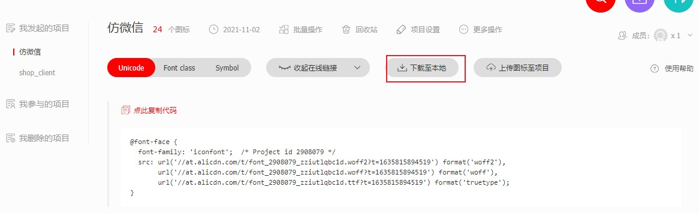
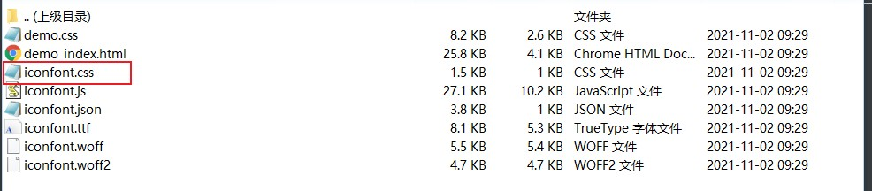
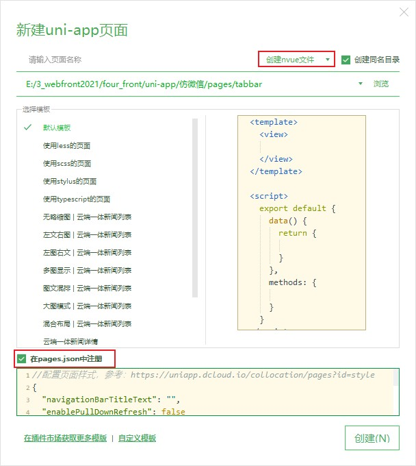
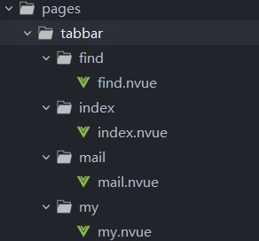

## 项目和开启原生渲染

1. 安装项目所需插件
2. 新建项目





3. 配置 manifest.json，修改 编译模式及 渲染模式



4. 将项目目录下的 `pages/index/index.vue` 改为 `pages/index/index.nvue`

[nvue介绍](https://uniapp.dcloud.io/nvue-outline)

[nvue不同编译模式介绍](https://ask.dcloud.net.cn/article/36074)

## 安卓真机调试配置

1. 手机与电脑通过数据线相连，且选择 USB 用于 传输文件
2. 手机开启了开发者模式（设置->关于手机->多次点击版本信息），且启动了USB调试（其他设置->开发者选项->USB调试）。

不同手机可能操作不同。

3. 启动运行命令，过程中会要求手机安装相关软件。安装完后，且 控制台 编译完成后，即可在 **软件** 中查看到实时效果。

## 引入全局样式(一)

在项目中新建 styles/free.css` ，并导入如下代码，其中为一些自定义的样式：

```css
/* 图标 */
.iconfont{
	font-family:iconfont;
}
.view,.text{
	font-size:28rpx; 
	line-height:1.8; 
	color:#0E151D;
}
/* 宽度 */
.w-100{ width: 750rpx; }

.row {
  margin-right: -20rpx;
  margin-left: -20rpx;
  /* #ifndef APP-PLUS-NVUE */
  display: flex;
  /* #endif */
  flex-wrap: wrap;
  flex-direction: row;
}

.col-1,
.col-2,
.col-3,
.col-4,
.col-5,
.col-6,
.col-7,
.col-8,
.col-9,
.col-10,
.col-11,
.col-12{
  position: relative;
  padding-right: 20rpx;
  padding-left: 20rpx;
}
.col-12 { width: 750rpx;}
.col-11 { width: 687.5rpx; }
.col-10 { width: 625rpx; }
.col-9 { width: 562.5rpx; }
.col-8 { width: 500rpx; }
.col-7 { width: 437.5rpx; }
.col-6 { width: 375rpx; }
.col-5 { width: 312.5rpx;}
.col-4 {width: 250rpx;}
.col-3 {width: 187.5rpx;}
.col-2 {width: 125rpx;}
.col-1 {width: 62.5rpx;}

.col-offset-12 { margin-left: 750rpx;}
.col-offset-11 { margin-left: 687.5rpx; }
.col-offset-10 { margin-left: 625rpx; }
.col-offset-9 { margin-left: 562.5rpx; }
.col-offset-8 { margin-left: 500rpx; }
.col-offset-7 { margin-left: 437.5rpx; }
.col-offset-6 { margin-left: 375rpx; }
.col-offset-5 { margin-left: 312.5rpx;}
.col-offset-4 {margin-left: 250rpx;}
.col-offset-3 {margin-left: 187.5rpx;}
.col-offset-2 {margin-left: 125rpx;}
.col-offset-1 {margin-left: 62.5rpx;}
.col-offset-0 {margin-left: 0;}

/* flex 布局 */
.flex{
	/* #ifndef APP-PLUS-NVUE */
	display:flex;
	/* #endif */
	flex-direction:row;
}
.flex-row{ flex-direction:row!important; }
.flex-column{ flex-direction:column!important; }
.flex-row-reverse{ flex-direction:row-reverse!important; }
.flex-column-reverse{ flex-direction:column-reverse!important; }
.flex-wrap{ flex-wrap:wrap;}
.flex-nowrap{ flex-wrap:nowrap;}
.justify-start{justify-content:flex-start;}
.justify-end{justify-content:flex-end;}
.justify-between{justify-content:space-between;}
.justify-center{justify-content:center;}
.align-center{ align-items: center; }
.align-stretch{ align-items: stretch; }
.align-start{ align-items: flex-start; }
.align-end{ align-items: flex-end; }
/* #ifndef APP-PLUS-NVUE */
.content-start {align-content: flex-start;}
.content-end {align-content: flex-end;}
.content-center {align-content: center;}
.content-between {align-content: space-between;}
.content-around {align-content: space-around;}
.content-stretch {align-content: stretch;}
/* #endif */
.flex-1{ flex: 1; }
.flex-2{ flex: 2; }
.flex-3{ flex: 3; }
.flex-4{ flex: 4; }
.flex-5{ flex: 5; }
/* #ifndef APP-PLUS-NVUE */
.flex-shrink{ flex-shrink: 0; }
/* #endif */

.container {
  padding-right: 20rpx;
  padding-left: 20rpx;
}
/*  -- 内外边距 -- */
.m-0 { margin: 0; }
/* #ifndef APP-PLUS-NVUE */
.m-auto{ margin: auto; }
/* #endif */
.m-1 { margin: 10rpx; }
.m-2 { margin: 20rpx; }
.m-3 { margin: 30rpx; }
.m-4 { margin: 40rpx; }
.m-5 { margin: 50rpx; }
.mt-0 { margin-top: 0; }
/* #ifndef APP-PLUS-NVUE */
.mt-auto { margin-top: auto; }
/* #endif */
.mt-1 { margin-top: 10rpx; }
.mt-2 { margin-top: 20rpx; }
.mt-3 { margin-top: 30rpx; }
.mt-4 { margin-top: 40rpx; }
.mt-5 { margin-top: 50rpx; }
.mb-0 { margin-bottom: 0; }
/* #ifndef APP-PLUS-NVUE */
.mb-auto { margin-bottom: auto; }
/* #endif */
.mb-1 { margin-bottom: 10rpx; }
.mb-2 { margin-bottom: 20rpx; }
.mb-3 { margin-bottom: 30rpx; }
.mb-4 { margin-bottom: 40rpx; }
.mb-5 { margin-bottom: 50rpx; }
.ml-0 { margin-left: 0; }
/* #ifndef APP-PLUS-NVUE */
.ml-auto { margin-left: auto; }
/* #endif */
.ml-1 { margin-left: 10rpx; }
.ml-2 { margin-left: 20rpx; }
.ml-3 { margin-left: 30rpx; }
.ml-4 { margin-left: 40rpx; }
.ml-5 { margin-left: 50rpx; }
.mr-0 { margin-right: 0; }
/* #ifndef APP-PLUS-NVUE */
.mr-auto { margin-right: auto; }
/* #endif */
.mr-1 { margin-right: 10rpx; }
.mr-2 { margin-right: 20rpx; }
.mr-3 { margin-right: 30rpx; }
.mr-4 { margin-right: 40rpx; }
.mr-5 { margin-right: 50rpx; }
.my-0 { margin-top: 0; margin-bottom: 0; }
/* #ifndef APP-PLUS-NVUE */
.my-auto { margin-top: auto; margin-bottom: auto; }
/* #endif */
.my-1 { margin-top: 10rpx; margin-bottom: 10rpx; }
.my-2 { margin-top: 20rpx; margin-bottom: 20rpx; }
.my-3 { margin-top: 30rpx; margin-bottom: 30rpx; }
.my-4 { margin-top: 40rpx; margin-bottom: 40rpx; }
.my-5 { margin-top: 50rpx; margin-bottom: 50rpx; }
.mx-0 { margin-left: 0; margin-right: 0; }
/* #ifndef APP-PLUS-NVUE */
.mx-auto { margin-left: auto; margin-right: auto; }
/* #endif */
.mx-1 { margin-left: 10rpx; margin-right: 10rpx;}
.mx-2 { margin-left: 20rpx; margin-right: 20rpx;}
.mx-3 { margin-left: 30rpx; margin-right: 30rpx;}
.mx-4 { margin-left: 40rpx; margin-right: 40rpx;}
.mx-5 { margin-left: 50rpx; margin-right: 50rpx;}

.p-0 { padding: 0; }
.p { padding: 5rpx; }
.p-1 { padding: 10rpx; }
.p-2 { padding: 20rpx; }
.p-3 { padding: 30rpx; }
.p-4 { padding: 40rpx; }
.p-5 { padding: 50rpx; }
.pt-0 { padding-top: 0; }
.pt { padding-top: 5rpx; }
.pt-1 { padding-top: 10rpx; }
.pt-2 { padding-top: 20rpx; }
.pt-3 { padding-top: 30rpx; }
.pt-4 { padding-top: 40rpx; }
.pt-5 { padding-top: 50rpx; }
.pb-0 { padding-bottom: 0; }
.pb-1 { padding-bottom: 10rpx; }
.pb { padding-bottom: 5rpx; }
.pb-2 { padding-bottom: 20rpx; }
.pb-3 { padding-bottom: 30rpx; }
.pb-4 { padding-bottom: 40rpx; }
.pb-5 { padding-bottom: 50rpx; }
.pl-0 { padding-left: 0; }
.pl { padding-left: 5rpx; }
.pl-1 { padding-left: 10rpx; }
.pl-2 { padding-left: 20rpx; }
.pl-3 { padding-left: 30rpx; }
.pl-4 { padding-left: 40rpx; }
.pl-5 { padding-left: 50rpx; }
.pr-0 { padding-right: 0; }
.pr { padding-right: 5rpx; }
.pr-1 { padding-right: 10rpx; }
.pr-2 { padding-right: 20rpx; }
.pr-3 { padding-right: 30rpx; }
.pr-4 { padding-right: 40rpx; }
.pr-5 { padding-right: 50rpx; }
.py-0 { padding-top: 0; padding-bottom: 0; }
.py { padding-top: 5rpx; padding-bottom: 5rpx; }
.py-1 { padding-top: 10rpx; padding-bottom: 10rpx; }
.py-2 { padding-top: 20rpx; padding-bottom: 20rpx; }
.py-3 { padding-top: 30rpx; padding-bottom: 30rpx; }
.py-4 { padding-top: 40rpx; padding-bottom: 40rpx; }
.py-5 { padding-top: 50rpx; padding-bottom: 50rpx; }
.px-0 { padding-left: 0; padding-right: 0; }
.px-1 { padding-left: 10rpx; padding-right: 10rpx;}
.px { padding-left: 5rpx; padding-right: 5rpx;}
.px-2 { padding-left: 20rpx; padding-right: 20rpx;}
.px-3 { padding-left: 30rpx; padding-right: 30rpx;}
.px-4 { padding-left: 40rpx; padding-right: 40rpx;}
.px-5 { padding-left: 50rpx; padding-right: 50rpx;}
/* 文字大小 */
.font-small { font-size: 20upx;}
.font-sm { font-size: 25upx;}
.font { font-size: 30upx;}
.font-md { font-size: 35upx;}
.font-lg { font-size: 40upx;}
.h1{font-size:80upx; line-height:1.8;}
.h2{font-size:60upx; line-height:1.8;}
.h3{font-size:45upx; line-height:1.8;}
.h4{font-size:32upx; line-height:1.8;}
.h5{font-size:30upx; line-height:1.8;}
.h6{font-size:28upx; line-height:1.8;}
/* 文字缩进 */
/* #ifndef APP-PLUS-NVUE */
.text-indent{text-indent:2;}
/* #endif */
/* 文字划线 */
.text-through{text-decoration:line-through;}
/* 文字对齐 */
.text-left { text-align: left;}
.text-right { text-align: right;}
.text-center { text-align: center;}
/* 文字换行溢出处理 */
.text-ellipsis {
	/* #ifndef APP-PLUS-NVUE */
	overflow: hidden;text-overflow: ellipsis;white-space: nowrap;
	/* #endif */
	/* #ifdef APP-PLUS-NVUE */
	lines: 1;
	/* #endif */
}
/* 文字粗细和斜体 */
.font-weight-light {font-weight: 300;}      /*细*/
.font-weight-lighter {font-weight: 100;}/*更细*/
.font-weight-normal { font-weight: 400;}    /*正常*/
.font-weight-bold { font-weight: 700;}      /*粗*/
.font-weight-bolder { font-weight: bold;} /*更粗*/
.font-italic { font-style: italic;} /*斜体*/
/* 文字颜色 */
.text-white {color: #ffffff;}
.text-primary {color: #007bff;}
.text-hover-primary { color: #0056b3;}
.text-secondary {color: #6c757d;}
.text-hover-secondary { color: #494f54;}
.text-success {color: #28a745;}
.text-hover-success{color: #19692c;}
.text-info { color: #17a2b8;}
.text-hover-info {color: #0f6674;}
.text-warning {color: #ffc107;}
.text-hover-warning { color: #ba8b00;}
.text-danger { color: #dc3545;}
.text-hover-danger { color: #a71d2a;}
.text-light { color: #f8f9fa;}
.text-hover-light { color: #cbd3da;}
.text-dark { color: #343a40;}
.text-hover-dark{ color: #121416;}
.text-body { color: #212529;}
.text-muted { color: #6c757d;}
.text-light-muted { color: #A9A5A0;}
.text-light-black { color: rgba(0, 0, 0, 0.5);}
.text-light-white { color: rgba(255, 255, 255, 0.5);}

/* 背景颜色 */
.bg-primary { background-color: #007bff;}
.bg-hover-primary:hover{ background-color: #0062cc;}
.bg-secondary { background-color: #6c757d;}
.bg-hover-secondary:hover{ background-color: #545b62;}
.bg-success { background-color: #28a745;}
.bg-hover-success { background-color: #1e7e34;}
.bg-info { background-color: #17a2b8;}
.bg-hover-info { background-color: #117a8b;}
.bg-warning { background-color: #ffc107;}
.bg-hover-warning { background-color: #d39e00;}
.bg-danger { background-color: #dc3545;}
.bg-hover-danger{ background-color: #bd2130;}
.bg-light { background-color: #f8f9fa;}
.bg-hover-light{ background-color: #dae0e5;}
.bg-dark { background-color: #343a40;}
.bg-hover-dark { background-color: #1d2124;}
.bg-white { background-color: #ffffff;}
.bg-transparent { background-color: transparent;}
/* 边框 */
.border { border-width: 1rpx;border-style: solid;border-color: #dee2e6;}
.border-top {
  border-top-width: 1rpx;
  border-top-style: solid;
  border-top-color: #dee2e6;
}
.border-right {
  border-right-width: 1rpx;
  border-right-style: solid;
  border-right-color: #dee2e6;
}
.border-bottom {
  border-bottom-width: 1rpx;
  border-bottom-style: solid;
  border-bottom-color: #dee2e6;
}
.border-left {
  border-left-width: 1rpx;
  border-left-style: solid;
  border-left-color: #dee2e6;
}
.border-0 { border-width: 0!important;}
.border-top-0 { border-top-width: 0!important;}
.border-right-0 {border-right-width: 0!important;}
.border-bottom-0 {border-bottom-width: 0!important;}
.border-left-0 {border-left-width: 0!important;}
.border-primary { border-color: #007bff;}
.border-secondary {border-color: #6c757d;}
.border-light-secondary {border-color: #E9E8E5;}
.border-success {border-color: #28a745;}
.border-info {border-color: #17a2b8;}
.border-warning {border-color: #ffc107;}
.border-danger {border-color: #dc3545;}
.border-light {border-color: #f8f9fa;}
.border-dark {border-color: #343a40;}
.border-white {border-color: #FFFFFF;}
/* 圆角 */
.rounded { border-radius: 8rpx;}
.rounded-top {
  border-top-left-radius: 8rpx;
  border-top-right-radius: 8rpx;
}
.rounded-right {
  border-top-right-radius: 8rpx;
  border-bottom-right-radius: 8rpx;
}
.rounded-bottom {
  border-bottom-right-radius: 8rpx;
  border-bottom-left-radius: 8rpx;
}
.rounded-left {
  border-top-left-radius: 8rpx;
  border-bottom-left-radius: 8rpx;
 }
.rounded-circle { border-radius: 100rpx;}
.rounded-0 { border-radius: 0;}
/* 显示 */
/* #ifndef APP-PLUS-NVUE */
.d-none{ display: none; }
.d-inline-block{ display: inline-block; }
.d-block{ display: block; }
/* #endif */
/* 内容溢出 */
.overflow-hidden { overflow: hidden;}
/* 定位 */
.position-relative { position: relative;}
.position-absolute { position: absolute;}
.position-fixed { position: fixed;}
/* 定位 - 固定顶部 */
.fixed-top {
  position: fixed;
  top: 0;
  right: 0;
  left: 0;
  z-index: 1030;
}
/* 定位 - 固定底部 */
.fixed-bottom {
  position: fixed;
  right: 0;
  bottom: 0;
  left: 0;
  z-index: 1030;
}
.top-0 { top: 0; }
.left-0 { left: 0; }
.right-0 { right: 0; }
.bottom-0 { bottom: 0; }

/* 阴影 */
/* #ifndef APP-PLUS-NVUE */
.shadow { box-shadow: 0 2upx 12upx rgba(0, 0, 0, 0.15);}
.shadow-lg { box-shadow: 0upx 40upx 100upx 0upx rgba(0, 0, 0, 0.175);}
.shadow-none { box-shadow: none !important;}
/* #endif */
```

在 `App.vue` 中引入该样式文件：

```vue
...
<style>
/*每个页面公共css */
@import "./styles/free.css";
</style
```

此后即可使用该样式文件中定义的类名：

```vue
<template>
	<view class="content">
		<view class="flex">
			<view class="flex-1 border rounded-circle" style="height: 200rpx"
				>123</view
			>
			<view class="flex-1 border" style="height: 200rpx">456</view>
		</view>
	</view>
</template>
```

## 引入全局样式(二)

新建 **`styles/common.css`** ，用于创建全局共用样式

我们试着在此处写一些样式，注意此处的样式属性因尽可能的具体：

```css
/* 1.页面背景色 */
.page{
    background-color: #0056B3;
    min-height:100%;
}
```

可以看到报错：



原因是因为 nvue 中不支持对应的 min-height 属性。所以我们要为其做一些**`条件编译`**：

```css
/* 1.页面背景色 */
.page{
    background-color: #EDEDED;
    /* #ifndef APP-NVUE */
    min-height: 100%;
    height:auto;
    /* #endif */
    /* #ifdef APP-NVUE */
    /* 此处 flex:1 可以生效的原因是因为：nvue编译为H5、小程序时，会自动把页面默认布局设为flex、方向为垂直。当然开发者手动设置后会覆盖默认设置。*/
    flex: 1;
    /* #endif */
}

/* 2.主背景色（原谅绿） */
.main-bg-color{
    background-color: #08C060;
    
}
/* 3.主文字色（原谅绿） */
.main-text-color{
    color:#08C060;
}
```


## 引入自定义图标库

1. 在 **`iconfont`** 中选择合适的图标后，添加至项目




2. 点击生成链接，并赋值 对应的 **`ttf`** 文件链接




3. 在 `App.vue` 文件中导入对应的图标库

```html
<script>
export default {
	onLaunch: function () {
		// 加载公共图标库
		/* #ifdef APP-NVUE */
		const domModule = weex.requireModule("dom");
		domModule.addRule("fontFace", {
			fontFamily: "iconfont",
			src: "url('https://at.alicdn.com/t/font_2908079_zziutlqbc1d.ttf?t=1635815894519')",
		});
		/* #endif */
	},
};
</script>
```

4. 配置完后，便可在 `index.nvue` 中正常使用

```html
<template>
	<view class="content page">
		<view class="flex">
			<!-- 注意：图标必须写在 text 组件中 -->
			<text class="iconfont" style="font-size: 200rpx">&#xe63d;</text>
		</view>
	</view>
</template>
```

<div class="danger">

> nvue 中不能在 style 中引入字体文件，nvue 中字体图标的使用参考：[加载自定义字体](https://uniapp.dcloud.io/nvue-api?id=addrule) 。

</div>


## 图标兼容小程序端

当我们将项目运行到小程序端时，可以看到之前配置的图标失效了。

为了兼容小程序端，首先我们需要将字体图标库下载至本地，并将其中的 **`iconfont.css`** 文件复制。





之后，我们在项目中新建 styles/free-icon.css 文件，并在 App.vue 中导入。将复制的 css 粘贴到 free-icon 中，并将其删减至如下。同时修改其中的 tff 文件路径为在线链接：

**`free-icon.css`**

```css
@font-face {
    font-family: "iconfont"; /* Project id 2908079 */
    src: url('https://at.alicdn.com/t/font_2908079_zziutlqbc1d.ttf?t=1635815894519') format('truetype');
  }
  
  .iconfont {
    font-family: "iconfont" !important;
    font-size: 16px;
    font-style: normal;
    -webkit-font-smoothing: antialiased;
    -moz-osx-font-smoothing: grayscale;
  }
```

**`App.vue`**

```html
<style>
...
/* #ifndef APP-NVUE */
@import "./styles/free-icon.css"; /* #endif */
</style>
```

## 配置 tabbar 底部导航栏

1. 在 **`iconfont`** 中下载对应的双色图片
2. 在项目中新建 **`static/tabbar`** 文件夹，将图片移至其中

3. 在 pages/tabbar 中新建 mail、find、my 三个页面，并将 index 页面移入其中





4. 修改 **`pages.json`** 文件，为其新增 tabBar 选项：

```json
{
	"pages": [ //pages数组中第一项表示应用启动页，参考：https://uniapp.dcloud.io/collocation/pages
		{
			"path": "pages/tabbar/index/index",
			"style": {
				"navigationBarTitleText": "uni-app"
			}
		},
		{
			"path": "pages/tabbar/mail/mail",
			"style": {
				"navigationBarTitleText": "uni-app"
			}
		},
		{
			"path": "pages/tabbar/find/find",
			"style": {
				"navigationBarTitleText": "uni-app"
			}
		},
		{
			"path": "pages/tabbar/my/my",
			"style": {
				"navigationBarTitleText": "uni-app"
			}
		}
	],
	...
	"tabBar": {
		"borderStyle": "black",		// tabBar 上边框颜色
		"backgroundColor": "#F7F7F7",
		"color": "#000000",		// 字体默认颜色
		"selectedColor": "#08C261",	// 字体选中颜色
		"list": [
			{
				"iconPath": "static/tabbar/index.png",
				"selectedIconPath": "static/tabbar/index-select.png",
				"text": "首页",
				"pagePath": "pages/tabbar/index/index"
			},
			{
				"iconPath": "static/tabbar/mail.png",
				"selectedIconPath": "static/tabbar/mail-select.png",
				"text": "通讯录",
				"pagePath": "pages/tabbar/mail/mail"
			},
			{
				"iconPath": "static/tabbar/find.png",
				"selectedIconPath": "static/tabbar/find-select.png",
				"text": "发现",
				"pagePath": "pages/tabbar/find/find"
			},
			{
				"iconPath": "static/tabbar/my.png",
				"selectedIconPath": "static/tabbar/my-select.png",
				"text": "我的",
				"pagePath": "pages/tabbar/my/my"
			}
		]
	}
}
```

## 配置 globalStyle

修改 **`pages.json`** 中的 globalStyle 选项：

```json
"globalStyle": {
		"navigationBarTextStyle": "black",
		"navigationBarTitleText": "我的微信",
		"navigationBarBackgroundColor": "#F8F8F8",
		"backgroundColor": "#F8F8F8",
		"app-plus": {
			"titleNView": false,	// 关闭 顶部导航栏（只在 nvue中生效）
			"scrollIndicator": "none"	// 关闭滚动条
		}
	},
```

## 头部导航组件开发

**`index.nvue`**

```html
<template>
	<view>
		<!-- 导航栏 -->
		<view class="bg-light">
			<!-- 状态栏 -->
			<!-- 此处的 statusBarHeight 是动态获取的，所以应该用 'px' 作为单位 -->
			<view :style="'height:'+statusBarHeight+'px'"></view>
			<!-- 导航 -->
			<view class="w-100 flex align-center justify-between border" style="height: 90rpx"> 
				<!-- 右边区域 -->
				<view class="flex align-center">
					<text class="ml-3 font-md">我的微信(10)</text>
				</view>
				<!-- 左边区域 -->
				<view class="flex align-center">
					<view class="flex align-center justify-center" style="height: 90rpx;width: 90rpx;">
						<!-- nvue 中text 不可以绑定事件，此处通过 view来绑定事件，通过 text 来显示图标 -->
						<text class="iconfont">&#xe62f;</text>
					</view>
					<view class="flex align-center justify-center" style="height: 90rpx;width: 90rpx;">
						<text class="iconfont">&#xe657;</text>
					</view>
				</view>
			</view>
		</view>
	</view>
</template>

<script>
export default {
	data() {
		return {
			statusBarHeight:0
		};
	},
	onLoad() {
		// #ifdef APP-NVUE
		// 只有NVUE 端才有 状态栏
		this.statusBarHeight = plus.navigator.getStatusbarHeight()
		// #endif
	},
};
</script>
```

[nvue页面获取状态栏高度](https://uniapp.dcloud.io/frame?id=css%e5%8f%98%e9%87%8f)

[uniapp使用plus注意事项](https://uniapp.dcloud.io/use-html5plus)

[plus.navigator.getStatusbarHeight](https://www.html5plus.org/doc/zh_cn/navigator.html#plus.navigator.getStatusbarHeight)

## 图标按钮组件封装

新建 **`components/free-ui/free-icon-button.vue`** 组件：

```html
<template>
	<view
		class="flex align-center justify-center"
		hover-class="bg-hover-light"
		@click="$emit('click')"
		style="height: 90rpx; width: 90rpx"
	>
		<!-- nvue 中text 不可以绑定事件，此处通过 view来绑定事件，通过 text 来显示图标 -->
		<!-- 此处的图标需要传入\u + unicode 码才可以使用，具体原因未知 -->
		<text class="iconfont font-md">{{icon}}</text>
	</view>
</template>

<script>
	export default{
		name:'free-icon-button',
		props:{
			icon:{
				type:String,
				required:true
			}
		},
	}
</script>

<style>
</style>
```

在 **`pages/tabbar/index.nvue`** 中使用：

```html
 <template>
	<view>
		<!-- 导航栏 -->
		<view class="bg-light">
			...
			<view
				class="w-100 flex align-center justify-between border"
				style="height: 90rpx"
			>
				...
				<!-- 左边区域 -->
				<view class="flex align-center">
					<freeIconButton :icon="'\ue62f'" @click></freeIconButton>
					<freeIconButton :icon="'\ue657'"></freeIconButton>
				</view>
			</view>
		</view>
	</view>
</template>
<script>
import freeIconButton from '@/components/free-ui/free-icon-button.vue'
export default {
	components:{
		freeIconButton
	},
};
</script>
```

## 封装头部导航组件（一）

新建 **`components/free-ui/free-nav-bar.vue`** 文件，将原先 **`index.nvue`** 中的 有关导航栏的代码剪切到其中，需要注意uniapp组件中没有 onLoad 等生命周期方法，只有基本的 vue生命周期函数：

```html
<template>
    <view>
			<!-- 导航栏 -->
			<view class="bg-light">
				<!-- 状态栏 -->
				<!-- 此处的 statusBarHeight 是动态获取的，所以应该用 'px' 作为单位 -->
				<view :style="'height:' + statusBarHeight + 'px'"></view>
				<!-- 导航 -->
				<view
					class="w-100 flex align-center justify-between bg-nav"
					style="height: 90rpx"
				>
					<!-- 右边区域 -->
					<view class="flex align-center">
						<text v-if="title" class="ml-3 font-md">{{title}}</text>
					</view>
					<!-- 左边区域 -->
					<view class="flex align-center">
						<freeIconButton :icon="'\ue62f'" @click></freeIconButton>
						<freeIconButton :icon="'\ue657'"></freeIconButton>
					</view>
				</view>
			</view>
		</view>
</template>

<script>
    import freeIconButton from './free-icon-button.vue'
    export default {
			components:{
				freeIconButton
			},
			props:{
				title:{
					type:String,
					default:''
				}
			},
			data(){
				return {
					statusBarHeight:0
				}
			},
			mounted(){
				// #ifdef APP-NVUE
				// 只有NVUE 端才可以通过如下方式获取状态栏
				this.statusBarHeight = plus.navigator.getStatusbarHeight();
				// #endif
			}
    }
</script>
```

在 **`index.nvue`** 中使用

```html
 <template>
	<view>
		<!-- 导航栏 -->
		<fooNavBar title="我的微信(10)"></fooNavBar>
	</view>
</template>
<script>
import fooNavBar from '@/components/free-ui/free-nav-bar.vue'
export default {
    ...
	components:{
		fooNavBar
	},
};
</script>
```

## 封装头部导航组件（二）

在原先添加的导航组件的基础上，添加 **`固定定位`** 并 为其设置 **`不遮挡下方标签`** 的效果，同时设置props 参数，来决定是否开启固定定位：

 **`components/free-ui/free-nav-bar.vue`** 

```html
<template>
	<view >
		<!-- 导航栏 -->
		<view class="bg-light" :class="fixed?'fixed-top':''">
			<!-- 状态栏 -->
			<!-- 此处的 statusBarHeight 是动态获取的，所以应该用 'px' 作为单位 -->
			<view :style="'height:' + statusBarHeight + 'px'"></view>
			<!-- 导航 -->
			<view
				class="w-100 flex align-center justify-between bg-nav"
				style="height: 90rpx"
			>
				<!-- 右边区域 -->
				<view class="flex align-center">
					<text v-if="title" class="ml-3 font-md">{{title}}</text>
				</view>
				<!-- 左边区域 -->
				<view class="flex align-center">
					<freeIconButton :icon="'\ue62f'" @click></freeIconButton>
					<freeIconButton :icon="'\ue657'"></freeIconButton>
				</view>
			</view>
		</view>
		<!-- 占位 -->
		<!-- 原先的布局使用了 fixed布局，导致其脱离的标准文档流，所以在其同位置下设置一个跟导航栏高度一样的 view 组件。 -->
		<!-- 就可以使使用这个组件的地方的下方 标签元素 不会被本组件遮挡 -->
		<view v-if="fixed" id="test" :style="fixedStyle"></view>
	</view>
</template>

<script>
    import freeIconButton from './free-icon-button.vue'
    export default {
			components:{
				freeIconButton
			},
			props:{
				title:{
					type:String,
					default:''
				},
				fixed:{
					type:Boolean,
					default:true
				}
			},
			data(){
				return {
					statusBarHeight:0,
					navBarHeight:0
				}
			},
			mounted(){
				// #ifdef APP-NVUE
				// 只有NVUE 端才可以通过如下方式获取状态栏
				this.statusBarHeight = plus.navigator.getStatusbarHeight();
				// #endif
				this.navBarHeight = this.statusBarHeight + uni.upx2px(90)
			},
			computed:{
				fixedStyle(){
					return `height:${this.navBarHeight}px`
				}
			}
    }
</script>
```


## 开发聊天列表组件(一)

创建聊天列表组件的 静态结构

**`pages/tabbar/index/index.nvue`**

```html
 <template>
	<view>
		<!-- 导航栏 -->
		<fooNavBar title="我的微信(10)"></fooNavBar>
		
		<block v-for="(item,index) in list" :key="index">
			<!-- 列表 -->
			<view class="flex align-center">
				<!-- 左侧 -->
					<view class="flex align-center justify-center" style="width: 145rpx;">
						<image :src="item.avatar" style="height: 90rpx;width: 90rpx;" class="rounded"></image>
					</view>
				<!-- 右侧 -->
				<view class="border-bottom flex-1 py-1 pr-3">
					<!-- 上方 -->
					<view class="flex justify-between mb-1 pt-2">
						<!-- 昵称 -->
						<view class="">
							<text class="font-md">{{item.nickName}}</text>
						</view>
						<view>
							<text class="font-sm text-light-muted">{{item.update_time}}</text>
						</view>
					</view>
					<!-- 下方 -->
					<view class="pb-1">
						<text class="font-sm text-light-muted text-ellipsis">{{item.content}}</text>
					</view>
				</view>
			</view>
		</block>
	</view>
</template>

<script>
import fooNavBar from '@/components/free-ui/free-nav-bar.vue'
export default {
	data() {
		return {
			list:[
				{
					avatar:"/static/images/demo/demo.jpg",
					nickName:"xxc",
					update_time:1567695767,
					content:"哈哈哈哈哈"
				}
                ...
			]
		};
	},
    ...
};
</script>
```

## 开发聊天列表组件（二）

创建一个 时间的过滤器，并使用到聊天列表组件的 update_time 中

新建 **`fliters/index.js`** ，定义 getToTime 过滤器（此处用到了dayjs 模块，需要先进行安装）：

```javascript
import dayjs from 'dayjs'
import rTime from 'dayjs/plugin/relativeTime'
import calendar from 'dayjs/plugin/calendar'
import 'dayjs/locale/zh-cn'

dayjs.locale('zh-cn')
dayjs.extend(rTime)
dayjs.extend(calendar)


export function getToTime(val){
	return dayjs.unix(val).calendar(null,{
  sameDay: '[今天] HH:mm ', 
  lastDay: '[昨天]', 
  lastWeek: 'MM[月]DD[日]',
  sameElse: 'MM[月]DD[日]' 
})
}
```

在 **`pages/tabbar/index/index.nvue`** 中使用：

```html
<template>
     ...
	<text class="font-sm text-light-muted">{{item.update_time | getToTime}}</text>
    ...
</template>
<script>
import {getToTime} from '@/filters/index.js'
export default {
...
	filters:{
		getToTime
	},
</script>
```

<div class="danger">

> 注意：在 nvue 中，过滤器只能在 nvue 文件中单独导入使用。不可以在 全局注册使用。

</div>

## 封装头像组件

头像将来会在 多处 用到，所以有必要封装为一个组件。

新建 **`components/my-ui/my-avatar.vue`** ：

```html
<template>
    <image :src="src" :style="computeStyle" class="type"></image>
</template>

<script>
    export default {
			props:{
				size:{
					type:String|Number,
					default:90
				},
				src:{
					type:String,
					default:""
				},
				// 设置 image 是否为圆角
				type:{
					type:String,
					default:"rounded"
				}
			},
			computed:{
				computeStyle(){
					return `height: ${this.size}rpx;width: ${this.size}rpx;`
				}
			}
    }
</script>
```

在 **`index.nvue`** 中使用：

```html
<template>
    ...
	<myAvatar :src="item.avatar" size="92"></myAvatar>
    ...
</template>
<script>
...
import myAvatar from '@/components/my-ui/my-avatar.vue'
export default {
    ...
	components:{
        ...
		myAvatar
	},
};
</script>
```

## badge 组件开发

```html
 <template>
	<view>
		<!-- 导航栏 -->
		<myNavBar title="我的微信(10)"></myNavBar>
		
		<block v-for="(item,index) in list" :key="index">
			<!-- 列表 -->
			<!-- 此处使用 align-stretch是为了使其内部的元素在侧轴拉伸，占满整个list 的高度 -->
			<!-- 以便下面使用 position 定位，能够更好的确定距离 -->
			<view class="flex align-stretch">
				<!-- 左侧 -->
					<view class="flex align-center justify-center position-relative" style="width: 145rpx;">
						<myAvatar :src="item.avatar" size="92"></myAvatar>
						<text class="bg-danger text-white rounded-circle font-sm position-absolute" style="padding-left: 8rpx;padding-right: 8rpx;padding-top: 1rpx;padding-bottom: 1rpx;right: 15rpx;top: 5rpx;">1</text>
					</view>
				<!-- 右侧 -->
				...
			</view>
		</block>
	</view>
</template>
```

<div class="warning">

> 注意：此处的 myAvatar 和 text 的顺序不可以替换，否则 text 会一直压在图片下方。即使设置了 z-index 也无效。原因是因为 原生 渲染 是从上往下渲染的。这一点与 vue 中不同，需要注意。

</div>

## 封装 badge 组件

新建 **`components/my-ui/my-badge.vue`** ：

```html
<template>
    <text v-if="num" class="my-badge bg-danger text-white rounded-circle font-sm" :class="badgeClass" :style="badgeStyle">{{num}}</text>
</template>

<script>
    export default {
			props:{
				badgeClass:{
					type:String,
					default:''
				},
				badgeStyle:{
					type:String,
					default:''
				},
				num:{
					type:Number|String,
					default:''
				}
			}
    }
</script>

<style scoped>
.my-badge{
	padding-left: 8rpx;
	padding-right: 8rpx;
	padding-top: 1rpx;
	padding-bottom: 1rpx;
}
</style>
```

在 **`index.nvue`** 中进行使用：

```html
 <template>
	<view>
        ...
			<view class="flex align-stretch">
				<!-- 左侧 -->
					<view class="flex align-center justify-center position-relative" style="width: 145rpx;">
						<myAvatar :src="item.avatar" size="92"></myAvatar>
						<myBadge num="1" badgeClass="position-absolute" badgeStyle="top:15rpx;right:15rpx;"></myBadge>
					</view>
				</view>
			</view>
	</view>
</template>
<script>
    ...
import myBadge from '@/components/my-ui/my-badge.vue'
export default {
    ...
	components:{
        ...
		myBadge
	},
};
</script>
```

## 封装聊天列表组件

新建 **`components/my-ui/my-chat-list.vue`**

```html
<template>
	<!-- 列表 -->
    <!-- 为了使得 长按样式生效，此处需要在最外层用一个 view 包裹，但实际上此时hover在 APP 端也无法生效 -->
	<view hover-class="bg-light">
		<!-- 此处使用 align-stretch是为了使其内部的元素在侧轴拉伸，占满整个list 的高度 -->
		<!-- 以便下面使用 position 定位，能够更好的确定距离 -->
		<!-- 此处需要将 view 改为 div，否则 longpress 事件无法获取到坐标 -->
		<div class="flex align-stretch" @click="onClick" @longpress="onLongPress">
			<!-- 左侧 -->
			<view
				class="flex align-center justify-center position-relative"
				style="width: 145rpx"
			>
				<myAvatar :src="chatData.avatar" size="92"></myAvatar>
				<myBadge
					:num="chatData.noReadNum"
					badgeClass="position-absolute"
					badgeStyle="top:15rpx;right:15rpx;"
				></myBadge>
			</view>
			<!-- 右侧 -->
			<view class="border-bottom flex-1 py-1 pr-3">
				<!-- 上方 -->
				<view class="flex justify-between mb-1 pt-2">
					<!-- 昵称 -->
					<view class="">
						<text class="font-md">{{ chatData.nickName }}</text>
					</view>
					<view>
						<text class="font-sm text-light-muted">{{
							chatData.update_time | getToTime
						}}</text>
					</view>
				</view>
				<!-- 下方 -->
				<view class="pb-1">
					<text class="font-sm text-light-muted text-ellipsis">{{
						chatData.content
					}}</text>
				</view>
			</view>
		</div>
	</view>
</template>

<script>
import myAvatar from "@/components/my-ui/my-avatar.vue";
import myBadge from "@/components/my-ui/my-badge.vue";
import { getToTime } from "@/filters/index.js";
export default {
	props: {
		chatData: {
			type: Object,
			required: true,
		},
		index: {
			type:Number | String,
			required: true,
		},
	},
	components: {
		myAvatar,
		myBadge,
	},
	filters: {
		getToTime,
	},
	methods: {
		/**
		 * 点击事件
		 */
		onClick() {
			this.$emit('click')
		},
		/**
		 * 长按事件
		 */
		onLongPress(e) {
			console.log(e);
		},
	},
};
</script>
```

在 **`index.nvue`** 中进行使用：

```html
 <template>
     ...
	<view>
		<block v-for="(item,index) in list" :key="index">
			<my-chat-list :chatData="item" :index="index"></my-chat-list>
		</block>
	</view>
</template>
<script>
import myChatList from '@/components/my-ui/my-chat-list.vue'
...
export default {
    ...
	components:{
		myNavBar,
		myChatList
	},
};
</script>
```

## 封装全局 Mixin

新建 **`mixins/index.js`** ，通过这个文件来定义一些全局的 mixin，供其它组件或页面使用：

```javascript
import {getToTime} from '@/filters'

export default {
	filters:{
		getToTime
	}
}
```

在 **`components/my-ui/my-chat-list.vue`** 中进行使用：

```html
<script>
import Mixins from '@/mixins/index.js'
// 将原先的filters 导入删除
...
export default {
    ...
	mixins:[Mixins],
};
</script>
```

## 控制导航栏显示内容

导航栏中的标题内容有可能是包含 `未读消息数` 的，也有可能是不包含的，此时就需要我们去手动控制：

**`my-nav-bar.vue`**

```html
<template>
	<view >
        <!-- 右边区域 -->
        <view class="flex align-center">
            <text v-if="title" class="ml-3 font-md">{{computeTitle}}</text>
        </view>
	</view>
</template>
<script>
    export default {
        props:{
            title:{
                type:String,
                default:''
            },
            noReadNum:{
                type:Number,
                default:0
            }
        },
        computed:{
            computeTitle(){
			// 判断是否有传入 noReadNum ，有传入拼接，没传入则只显示 title
                return this.noReadNum?this.title+'('+this.noReadNum+')':this.title
            }
        },
    }
</script>
```

在 **index.nvue** 中使用:

```html
<myNavBar title="我的微信" noReadNum="1" @loadSearchPopup="showPopup"></myNavBar>
```


## 开发弹出层组件（一）

```html
<!-- 弹出层 -->
<view class="z-index:9999;overflow:hidden;">
    <!-- 蒙版 -->
    <view class="position-fixed top-0 left-0 right-0 bottom-0" style="background-color: rgba(0,0,0,.5);"></view>
    <!-- 弹出层内容 -->
    
    
    <!-- 此处设置了 right:0，left:0 后，可以使得整个 div 的宽度占满整个屏幕，子元素就不用再设置宽度了 -->
    <!-- 实现了从底部弹出的效果 -->
    <!-- <div class="position-fixed right-0 left-0 bottom-0 bg-white"> -->
    <!-- <view style="height: 300rpx;"> -->
    
    
    <!-- 也可以通过设置父元素具体定位偏移量，子元素设置宽高来使得弹出层具体定位到页面某处 -->
    <div class="position-fixed bg-white" style="left: 30rpx;top: 30rpx;">
        <view style="height: 30rpx;width: 20rpx;">
        </view>
    </div>
</view>
```


## 开发弹出层组件（二）

为了控制弹出层的显示与关闭，我们需要给其定义 一个 **`status`** 变量，同时定义两个用于回调的方法，来切换 显示与关闭状态。

```html
<template>
    <!-- 弹出层 -->
    <div class="z-index:9999;overflow:hidden;" v-if="status">
    	<!-- 蒙版 -->
    	<div class="position-fixed top-0 left-0 right-0 bottom-0" style="background-color: rgba(0,0,0,.5);" @click="hide"></div>
    	<!-- 弹出层内容 -->
    		<div class="position-fixed bg-white" style="left: 30rpx;top: 30rpx;">
    			<slot></slot>
    		</view>
    	</div>
    </div>
</template>
<script>
    export default {
			data(){
				return{
					status:false
				}
			},
			methods:{
				show(){
					this.status = true
				},
				hide(){
					this.status = false
				}
			}
    }
</script>
```

我们可以知道，在点击蒙版的时候将弹出层关闭，那么在什么时候显示弹出层呢？ 这里，我们以点击导航栏的 搜索按钮为触发条件。

首先我们需要在导航栏的图标组件处定义对应的方法：

**`my-nav-bar.vue`**

```html
<template>
	<view >
        ...
        <myIconButton :icon="'\ue62f'" @click="loadSearchPopup"></myIconButton>
	</view>
</template>
<script>
    export default {
        ...
        methods:{
            ...
            loadSearchPopup(){
                this.$emit('loadSearchPopup')
            }
        },
    }
</script>
```

而此处的 myIconButton 是一个组件，我们当然可以在 @click后添加.native 直接触发点击事件，但由于 nvue 中不支持这种写法。所以我们需要给 myIconButton 组件 定义对应的 **`$emit`** 来触发对应的 click 事件

**`my-icon-button.vue`**

```html
<template>
	<view
		class="flex align-center justify-center"
		hover-class="bg-hover-light"
		@click="$emit('click')"
		style="height: 90rpx; width: 90rpx"
	>
		<text class="iconfont font-md">{{icon}}</text>
	</view>
</template>
```

最后，由于 item.nvue 中使用到了**`my-nav-bar`** ，我们就需要在其中接收事件，同时定义事件的回调函数，在其中通过 $refs 的方式获取弹出层组件。来调用其中的 **`show`** 方法 

```html
 <template>
	<view>
		<!-- 导航栏 -->
		<myNavBar title="我的微信" noReadNum="1" @loadSearchPopup="showPopup"></myNavBar>
        ...
		<!-- 弹出层 -->
		<myPopup ref="popUp">
			<view style="height: 300rpx;width: 400rpx;">
			</view>
		</myPopup>
	</view>
</template>
<script>
export default {
    ...
	methods: {
        ...
		showPopup(){
			this.$refs.popUp.show();
		}

	},
};
</script>
```

## 开发弹出层组件（三）

有时我们需要 弹出层的蒙版颜色透明 、弹出层的蒙版消失（已达到弹出框不会一点击就消失的效果）、弹出框固定到底部的效果。本节我们就通过定义几个变量来达成这些效果：

**`my-popup.vue`**

```html
<template>
    <!-- 弹出层 -->
    <div class="z-index:9999;overflow:hidden;" v-if="status">
    	<!-- 蒙版 -->
    	<div v-if="isShowmask" class="position-fixed top-0 left-0 right-0 bottom-0" :style="computeMaskColor" @click="hide"></div>
    	<!-- 弹出层内容 -->
        <div class="position-fixed bg-white" :class="computePopClass">
            <slot></slot>
        </div>
    </div>
</template>
<script>
    export default {
        props:{
            // 是否开启蒙版颜色
            maskColor:{
                type:Boolean,
                default:false
            },
            // 是否开启蒙版
            isShowmask:{
                type:Boolean,
                default:true
            },
            // 弹出层是否处于底部
            fixedBottom:{
                type:Boolean,
                default:false
            }
        },
        ...
        computed:{
            computeMaskColor(){
                return `background-color: rgba(0,0,0,`+(this.maskColor ?.5 : 0)+`);`
            },
            computePopClass(){
                return this.fixedBottom?'left-0 right-0 bottom-0':''
            }
        }
    }
</script>
```

在 **`index.nvue`** 中传入对应的props 属性：

```html
<!-- 弹出层 -->
<myPopup ref="popUp" :maskColor="false" :isShowmask="true" :fixedBottom="true">
    <view style="height: 300rpx;width: 400rpx;">
    </view>
</myPopup>
```

## 开发弹出层组件（四）

本节为弹出层组件指定两个 x，y 属性，用于记录弹出层的弹出位置。通过父组件中调用 show 方法时传入来为其赋值。

注意：当使用弹出层组件，并为其x，y赋值的话，就 **`不能`** 够为其传递 **`fixedBottom`** 为 true。否则会导致效果冲突。

**`my-popup.vue`**

```html
<template>
    <!-- 弹出层 -->
    <div class="z-index:9999;overflow:hidden;" v-if="status">
        ...
    	<!-- 弹出层内容 -->
    		<div class="position-fixed bg-white" :class="computePopClass" :style="computeBodyStyle">
    			<slot></slot>
    	</div>
    </div>
</template>
<script>
    export default {
			data(){
				return{
					status:false,
					x:-1,
					y:-1
				}
			},
			methods:{
				show(x = -1,y = -1){
					this.x = x
					this.y = y
					this.status = true
				},
				...
			},
			computed:{
                ...
				computePopClass(){
					// 如果不是 固定在底部的情况，则为其加圆角和 边框
					return this.fixedBottom?'left-0 right-0 bottom-0':'rounded border'
				},
				computeBodyStyle(){
					// 如果调用 this.show 传入了 x、y ,则说明其并非是 固定在底部的。此时不可以传 fixedBottom
					let left = this.x > -1 ? `left:${this.x}px;`:''
					let top = this.y > -1 ? `top:${this.y}px;` : ''
					return left + top
				}
			}
    }
</script>
```

**`index.nvue`**

```html
 <template>
	<view>
		<!-- 导航栏 -->
		<myNavBar title="我的微信" noReadNum="1" @loadSearchPopup="showPopup"></myNavBar>
        ...
		<!-- 弹出层 -->
		<myPopup ref="popUp" :maskColor="true" :isShowmask="true">
			<view style="height: 400rpx;width: 300rpx;">
			</view>
		</myPopup>
	</view>
</template>
<script>
export default {
    ...
	methods: {
        ...
		showPopup(){
			this.$refs.popUp.show(100,100);
		}
	},
};
</script>
```

## 开发弹出层组件（五）

本节课来实现 根据 **聊天列表** 长按位置弹出 **`弹出层`** 的效果。

注意：小程序端 与 App 端 获取长按位置 的方式不同，故需要使用条件编译

**`my-chat-list.vue`**

```html
<template>
	<view hover-class="bg-light">
		<div class="flex align-stretch" @click="onClick" @longpress="onLongPress">
            ...
		</div>
	</view>
</template>
<script>
export default {
    ...
	methods: {
        ...
		/**
		 * 长按事件
		 */
		onLongPress(e) {
			let x = 0;
			let y = 0;
			// #ifdef APP-NVUE
			if(Array.isArray(e.changedTouches)&&e.changedTouches.length>0){
				x = e.changedTouches[0].screenX
				y = e.changedTouches[0].screenY
			}
			// #endif
			// #ifdef MP
			x = e.detail.x
			y = e.detail.y
			// #endif
			this.$emit('loadLongPress',x,y)
		},
	},
};
</script>
```

**`index.nvue`**

```html
 <template>
		<block v-for="(item,index) in list" :key="index">
			<my-chat-list :chatData="item" :index="index" @loadLongPress="showLongPress"></my-chat-list>
		</block>
	</view>
</template>
<script>
export default {
    ...
	methods: {
        ...
		showLongPress(x,y){
			this.$refs.popUp.show(x,y);
		}
	},
};
</script>
```

## 开发弹出层组件（六）

本节实现设置一个最大宽高让 **`弹出层`** 无法超出页面显示

**`my-chat-list.vue`**

```html
<script>
export default {
	props: {
        ...
		popWidth:{
			type:Number|String,
			required:true
		},
		popHeight:{
			type:Number|String,
			required:true
		}
	},
	data() {
		return {
            ...
			maxWidth: 0,
			maxHeight: 0,
		};
	},
	mounted() {
		// 在 mounted 中为 maxWidth 和 maxHeight 赋值
		const res = uni.getSystemInfoSync();
        // 注意 此处的windowWidth、windowHeight 为 px
        // 而调用 show 方法时传入的 ，传入的 screenX、screenY 也是 px
		this.maxWidth = res.windowWidth - uni.upx2px(this.popWidth)
		this.maxHeight = res.windowHeight - uni.upx2px(this.popHeight)
	},
	methods: {
        ...
		show(x = -1, y = -1) {
			this.x = x > this.maxWidth ? this.maxWidth:x;
			this.y = y > this.maxHeight ? this.maxHeight:y;
			this.status = true;
		},
	},
};
</script>
```

**`index.nvue`**

使用弹出层的地方需要传入 弹出框 的宽高属性

```html
 <template>
	<view>
        ...
		<!-- 弹出层 -->
		<myPopup ref="popUp" :isShowmask="true" :popHeight="400" :popWidth="300">
			<view style="height: 400rpx;width: 300rpx;">
			</view>
		</myPopup>
	</view>
</template>
```

## 开发弹出层组件（七）

本节实现 弹出层 的内容样式实现及高度自适应，同时为弹出层的每项实现 点击事件区分的功能：

**`index.nvue`**

```html
 <template>
	<view>
        ...
		<!-- 弹出层 -->
		<myPopup ref="popUp" :isShowmask="true" :popHeight="computeMenuHeight" :popWidth="200">
			<view class="flex flex-column" style="width: 200rpx;" :style="computeMenuStyle">
				<!-- 此处加 flex-1 ，使得子元素可以均分父元素的的空间(主轴空间，侧轴默认铺满) -->
				<view class="flex-1 flex align-center" hover-class="bg-light" v-for="(item,index) in menus" :key="index" @click="clickEvent(item.event)">
					<text class="font-md pl-2">{{item.name}}</text>
				</view>
			</view>
		</myPopup>
	</view>
</template>
<script>
export default {
	data() {
		return {
			menus:[
				{
					name:'取消置顶',
					event:'setTop'
				},
				{
					name:'删除该聊天',
					event:'delChat'
				}
			],
            ...
		};
	},
    ...
	computed:{
		// 动态获取菜单的高度
		computeMenuHeight(){
			let H = 100
			return this.menus.length * H
		},
		// 获取菜单的样式
		computeMenuStyle(){
			return `height:${this.computeMenuHeight}rpx`
		},
		// 分发菜单事件
		clickEvent(event){
			switch(event){
				case "setTop":
					break;
				case "delChat":
					break;
			}
		}
	}
};
</script>
```

## 开发弹出层组件（八）

本节为弹出层组件添加 动画效果

注意：只有在 nvue 端可以生效

**`my-popup.vue`**

```html
<template>
	<!-- 弹出层 -->
	<div class="z-index:9999;overflow:hidden;" v-if="status">
		<div
			ref="popup"
			class="position-fixed bg-white popup-animate"
			:class="computePopClass"
			:style="computeBodyStyle"
		>
			<slot></slot>
		</div>
	</div>
</template>
<script>
// #ifdef APP-NVUE
const animation = weex.requireModule('animation')
// #endif
export default {
    ...
	methods: {
		show(x = -1, y = -1) {
			this.x = x > this.maxWidth ? this.maxWidth:x;
			this.y = y > this.maxHeight ? this.maxHeight:y;
			this.status = true;
			// #ifdef APP-NVUE
			// 此处要加 $nextTick，确保在 dom 树渲染完成后（及弹出框显示之后），再为其添加animation 动画
             // 否则弹出框未显示就添加，将添加失败
			this.$nextTick(function(){
				animation.transition(this.$refs.popup, {
				    styles: {
				        transform:'scale(1,1)',
								transformOrigin:'left top',
				        opacity:1
				    },
				    duration: 300, //ms
				    timingFunction: 'ease',
				    }, function () {
				        console.log('成功')
				    })
			})
			// #endif
		},
		hide() {
			// #ifdef APP-NVUE
			this.$nextTick(function(){
				animation.transition(this.$refs.popup, {
				    styles: {
				        transform:'scale(0,0)',
								transformOrigin:'left top',
				        opacity:0
				    },
				    duration: 300, //ms
				    timingFunction: 'ease',
                    // 此处要用箭头函数，否则内部的 this 为 null。
                    // 在回调函数中添加 this.status ，确保动画执行完后再消失，否则动画可能会失效。
				    }, () =>{
				        this.status = false
				    })
			})
			// #endif
			// #ifndef APP-NVUE
			this.status = false
			// #endif
		},
	},
</script>
<style scoped>
.popup-animate{
	/* #ifdef APP-NVUE */
	transform: scale(0,0);
	opacity: 0;
	/* #endif */
}
</style>
```

## 开发导航扩展菜单（一）

本节开发 导航扩展菜单的 背景色传递，内容结构

**`free-nav-bar.vue`**

```html
<template>
	<view >
        ...
        <!-- 左边区域 -->
        <view class="flex align-center">
            <myIconButton :icon="'\ue657'" @click="loadExtendPopup"></myIconButton>
        </view>
        ...
		<!-- 扩展菜单 -->
        <!-- 此处设置固定宽高 -->
		<myPopup ref="myExtend" :isShowmask="true" :popHeight="525" :popWidth="320" popBgColor="bg-dark">
			<view class="flex flex-column" style="width: 320rpx;height: 525rpx;">
				<!-- 此处加 flex-1 ，使得子元素可以均分父元素的的空间 -->
				<view class="flex-1 flex align-center" hover-class="bg-hover-light" v-for="(item,index) in myExtends" :key="index" @click="clickEvent(item.event)">
					<text class="iconfont pl-2 pr-2 text-white">{{item.icon}}</text>
					<text class="font-md  text-white">{{item.name}}</text>
				</view>
			</view>
		</myPopup>
	</view>
</template>
<script>
import myPopup from './my-popup.vue'
export default {
    components:{
        ...
        myPopup
    },
    data(){
        return {
            ...
            myExtends:[
                {
                    name:'发起群聊',
                    event:'setTop',
                    icon:'\ue633'
                },
                {
                    name:'添加好友',
                    event:'delChat',
                    icon:'\ue65d'
                },
                {
                    name:'扫一扫',
                    event:'delChat',
                    icon:'\ue672'
                },
                {
                    name:'收付款',
                    event:'delChat',
                    icon:'\ue63d'
                },
                {
                    name:'帮助与反馈',
                    event:'delChat',
                    icon:'\ue67b'
                },
            ],
        }
    },
    methods:{
        ...
        loadExtendPopup(){
        	// 此处传递固定位置
        	// 注意此处需要传递 转换后的 px。
            this.$refs.myExtend.show(uni.upx2px(415),uni.upx2px(150))
        }
    },
    }
</script>
```

**`my-popup.vue`**

```html
<template>
	<div class="z-index:9999;overflow:hidden;" v-if="status">
        ...
		<!-- 弹出层内容 -->
		<div
			ref="popup"
			class="position-fixed popup-animate z-index"
			:class="computePopClass"
			:style="computeBodyStyle"
		>
			<slot></slot>
		</div>
	</div>
</template>
<script>
export default {
    ...
	props: {
        ...
		// 蒙版颜色
		popBgColor:{
			type:String,
			default:'bg-white'
		}
	},
	methods: {
        ...
		show(x = -1, y = -1) {
			this.x = x > this.maxWidth ? this.maxWidth:x;
			this.y = y > this.maxHeight ? this.maxHeight:y;
			this.status = true;
		},
	},
	computed: {
		computePopClass() {
			// 如果不是 固定在底部的情况，则为其加圆角和 边框
			return this.fixedBottom ? `left-0 right-0 bottom-0 ${this.popBgColor}` : `rounded border ${this.popBgColor}`;
		},
		computeBodyStyle() {
			// 如果调用 this.show 传入了 x、y ,则说明其并非是 固定在底部的。
			let left = this.x > -1 ? `left:${this.x}px;` : "";
			let top = this.y > -1 ? `top:${this.y}px;` : "";
			return left + top;
		},
        ...
	},
};
</script>
```

## 开发导航扩展菜单（二）

本节课实现动态控制导航扩展菜单 **`动画起始位置`**的效果：

**`my-popup.vue`**

```html
<script>
// #ifdef APP-NVUE
const animation = weex.requireModule('animation')
// #endif
export default {
    ...
	props: {
        ...
		// 弹出框动画起点
		transformOrigin:{
			type:String,
			default:'left top'
		}
	},
	methods: {
		show(x = -1, y = -1) {
			this.x = x > this.maxWidth ? this.maxWidth:x;
			this.y = y > this.maxHeight ? this.maxHeight:y;
			this.status = true;
			// #ifdef APP-NVUE
			// 此处要加 $nextTick，确保在 dom 树渲染完成后，再为其添加animation 动画
			this.$nextTick(function(){
				animation.transition(this.$refs.popup, {
				    styles: {
				        transform:'scale(1,1)',
								transformOrigin:this.transformOrigin,
				        opacity:1
				    },
				    duration: 300, //ms
				    timingFunction: 'ease',
				    }, function () {
				        console.log('成功')
				    })
			})
			// #endif
		},
		hide() {
			// #ifdef APP-NVUE
			this.$nextTick(function(){
				animation.transition(this.$refs.popup, {
				    styles: {
				        transform:'scale(0,0)',
								transformOrigin:this.transformOrigin,
				        opacity:0
				    },
				    duration: 300, //ms
				    timingFunction: 'ease',
				    }, () =>{
				        this.status = false
				    })
			})
			// #endif
			// #ifndef APP-NVUE
			this.status = false
			// #endif
		},
	},
};
</script>
```

**`my-nav-bar.vue`**

```html
<template>
	<view >
        ...
		<!-- 扩展菜单 -->
		<myPopup ref="myExtend" :isShowmask="true" :popHeight="525" :popWidth="320" popBgColor="bg-dark" transformOrigin="right top">
		</myPopup>
	</view>
</template>
```

## 删除当前会话

要删除某个会话，首先得确定会话的 **`索引`**，这个我们可以根据 **`my-chat-list`** 的 **loadLongPress** 事件，将父元素传递给其的 **`index`** 作为参数返回给父元素，然后父元素根据 这个索引去对应会话数组中删除指定 数据，同时要判断弹出层点击事件传入的事件名，来触发不同的事件（此处只讨论 **delChat** 事件）。删除完后注意要关闭 弹出层。

**`my-chat-list.vue`**

```html
<template>
	<!-- 列表 -->
	<view hover-class="bg-hover-light">
        ...
		<!-- 此处需要将 view 改为 div，否则 longpress 事件无法获取到坐标 -->
		<div class="flex align-stretch" @click="onClick" @longpress="onLongPress">
		</div>
	</view>
</template>
<script>
export default {
    ...
	props: {
        ...
		index: {
			type: Number | String,
			required: true,
		},
	},
	methods: {
        ...
		onLongPress(e) {
			this.$emit('loadLongPress',{x,y,index:this.index})
		},
	},
};
</script>
```

**`index.nvue`**

```html
 <template>
	<view>
        ...
		<block v-for="(item,index) in list" :key="index">
			<my-chat-list :chatData="item" :index="index" @loadLongPress="showLongPress"></my-chat-list>
		</block>
        <!-- 弹出层 -->
		<myPopup ref="popUp" :popHeight="computeMenuHeight" :popWidth="200">
			<view class="flex flex-column" style="width: 200rpx;" :style="computeMenuStyle">
				<!-- 此处加 flex-1 ，使得子元素可以均分父元素的的空间 -->
				<view class="flex-1 flex align-center" hover-class="bg-hover-light" v-for="(item,index) in menus" :key="index" @click="clickEvent(item.event)">
					<text class="font-md pl-2">{{item.name}}</text>
				</view>
			</view>
		</myPopup>
	</view>
</template>
<script>
export default {
    ...
	data() {
		return {
            ...
			propIndex:-1,
		};
	},
	methods: {
        ...
		// 分发菜单事件
		clickEvent(event){
			switch(event){
				case "setTop":
					break;
				case "delChat":	// 删除当前绘画
					this.delChat()
					break;
			}
			this.$refs.popUp.hide()
		},
		// 删除当前会话
		delChat(){
			this.list.splice(this.propIndex,1)
		}
	},
</script>
```


## 置顶、取消置顶当前会话

关于 置顶 ，首先会想到 通过移动会话数组的方式来进行。但是这样的话，当我们取消置顶后，置顶的会话就无法再回到原先的 位置了。

所以我们需要换个思路，给每个 会话数据 添加一个 **`istop`** 属性来判断是否需要指定，然后 渲染时，进行两次 v-for 循环渲染（确保置顶会话在未指定会话之前）。同时要修改 长按弹出框的内容，让其根据 是否指定来显示 不同的 文本内容。

-----

**`index.nvue`**

```html
 <template>
	<view>
        ...
		<!-- 置顶列表 -->
		<block v-for="(item,index) in list" :key="index">
			<my-chat-list v-if="item.istop" :chatData="item" :index="index" @loadLongPress="showLongPress"></my-chat-list>
		</block>
		<!-- 非置顶列表 -->
		<block v-for="(item,index) in list" :key="index">
			<my-chat-list v-if="!item.istop" :chatData="item" :index="index" @loadLongPress="showLongPress"></my-chat-list>
		</block>
        ...
	</view>
</template>
<script>
export default {
	data() {
		return {
			menus:[
				{
					name:'取消置顶',
					event:'setTop'
				},
				{
					name:'删除该聊天',
					event:'delChat'
				}
			],
			list:[
				{
					avatar:"/static/images/demo/demo.jpg",
					nickName:"xxc",
					update_time:1567695767,
					content:"哈哈哈哈哈",
					noReadNum:1,
					istop:true
				},
				{
					avatar:"/static/images/demo/demo.jpg",
					nickName:"xxc123",
					update_time:"14:00",
					content:"哈哈哈哈哈",
					istop:true
				},
				{
					avatar:"/static/images/demo/demo.jpg",
					nickName:"xxc",
					update_time:1635860156,
					content:"哈哈哈哈哈",
					noReadNum:3,
					istop:true
				},
				{
					avatar:"/static/images/demo/demo.jpg",
					nickName:"xxc",
					update_time:"14:00",
					content:"哈哈哈哈哈",
					noReadNum:4,
					istop:false
				},
			]
		};
	},
	methods: {
		showLongPress({x,y,index}){
			this.propIndex = index
			// 此处需要在长按事件触发时就 修改 menus 的值
			let item = this.list[this.propIndex]
			if(item.istop){
				this.menus[0].name = '取消置顶'
			}else{
				this.menus[0].name = '设为置顶'
			}
			this.$refs.popUp.show(x,y);
		},
		// 分发菜单事件
		clickEvent(event){
			switch(event){
				case "setTop":
					this.setTop()
					break;
				case "delChat":	// 删除当前绘画
					this.delChat()
					break;
			}
			this.$refs.popUp.hide()
		},
		setTop(){
			let item = this.list[this.propIndex]
			item.istop = !item.istop
		},
	},
};
</script>
```

**`my-chat-list.vue`**

```html
<template>
	<view :class="chatData.istop?'bg-hover-light':'bg-white'" hover-class="bg-hover-light">
        ...
	</view>
</template>
```

## 通讯录列表组件开发

**`mail.nvue`**

```html
<template>
	<view>
		<!-- 导航栏 -->
		<myNavBar title="通讯录"></myNavBar>
		
		<!-- 通讯录列表 -->
		<view class="flex bg-white align-stretch">
			<view class="flex align-center justify-center px-3 py-2">
				<image src="../../../static/images/mail/group.png" style="width: 75rpx;height: 75rpx;"></image>
			</view>
			<view class="flex align-center flex-1 border-bottom">
				<text class="font-md text-dark">服务</text>
			</view>
		</view>
	</view>
</template>

<script>
	import myNavBar from '@/components/my-ui/my-nav-bar.vue'
	export default {
		data() {
			return {
				
			}
		},
		components:{
			myNavBar
		}
	}
</script>
```

## 弹出框展示时会话框保持选中状态

此处原先想使用 全局事件总线，但发现无法生效。

后来发现 uniapp 中有专门的 api 可实现类似效果： **`uni.$on`** **`uni.$emit`**

首先在 **`my-chat-list.vue`** 中定义对应的 属性来控制，同时 注册事件：

注意：注册事件时要带上 index，确保每个 my-chat-list 注册的事件都不同，同时 触发事件时也是这样。要达到这个效果，需要它们的共同的父组件为其传递 propIndex。

```html
<template>
	<view :class="( isHover || chatData.istop)?'bg-hover-light':'bg-white'">
	</view>
</template>
<script>
export default {
	data(){
		return{
			isHover:false
		}
	},
	props: {
        ...
		index: {
			type: Number | String,
			required: true,
		},
	},
	mounted() {
		uni.$on(`changeHover${this.index}`,()=>{
			this.isHover = false     
		})
	},
	beforeDestroy(){
		uni.$off('changeHover')
	},
	methods: {
		/**
		 * 长按事件
		 */
		onLongPress(e) {
			let x = 0;
			let y = 0;
			// #ifdef APP-NVUE
			if(Array.isArray(e.changedTouches)&&e.changedTouches.length>0){
				x = e.changedTouches[0].screenX
				y = e.changedTouches[0].screenY
			}
			// #endif
			// #ifdef MP
			x = e.changedTouches[0].clientX
			y = e.changedTouches[0].clientY
			// #endif
			this.$emit('loadLongPress',{x,y,index:this.index})
			this.isHover = true
		},
	},
};
</script>
```

然后在 **`my-popup.vue`**中的 **hide** 方法中触发对应的事件：

```html
<template>
	<div class="z-index:9999;overflow:hidden;" v-if="status">
		<!-- 蒙版 -->
		<div
			v-if="isShowmask"
			class="position-fixed top-0 left-0 right-0 bottom-0 z-index"
			:style="computeMaskColor"
			@click="hide"
		></div>
        ...
	</div>
</template>
<script>
export default {
	props: {
		index:{
			type:String|Number,
			required:true
		}
	},
    methods:{
		hide() {
			uni.$emit(`changeHover${this.index}`)
		},
	},
};
</script>
```

最后确保父组件 **`index.nvue`** 中传递了 index：

```html
 <template>
	<view>
		<!-- 置顶列表 -->
		<block v-for="(item,index) in list" :key="index">
			<my-chat-list v-if="item.istop" :chatData="item" :index="index" @loadLongPress="showLongPress"></my-chat-list>
		</block>
		
		<!-- 非置顶列表 -->

		<block v-for="(item,index) in list" :key="index">
			<my-chat-list v-if="!item.istop" :chatData="item" :index="index" @loadLongPress="showLongPress"></my-chat-list>
		</block>
		<!-- 弹出层 -->
		<myPopup ref="popUp" :popHeight="computeMenuHeight" :popWidth="200" :index="propIndex">
		</myPopup>
	</view>
</template>
<script>
export default {
	data() {
		return {
			propIndex:-1,
		};
	},
	methods: {
		showLongPress({x,y,index}){
			this.propIndex = index
            ...
			this.$refs.popUp.show(x,y);
		},
	},
    ...
};
</script>
```

这样就能确保在 弹出框显示期间 ，选中会话框一直保持选中状态，而在点击蒙版后，选中状态消失。


## 封装公共列表组件

考虑到公共列表会在多次用到，所以将其封装为一个组件：

**`my-list-item.vue`**

```html
<template>
    <!-- 通讯录列表 -->
    <view class="flex bg-white align-stretch" hover-class="bg-light" @click="$emit('click')">
    	<view class="flex align-center justify-center px-3 py-2">
    		<image v-if="cover" :src="cover" style="width: 75rpx;height: 75rpx;"></image>
    	</view>
    	<view class="flex align-center flex-1 border-bottom">
    		<text class="font-md text-dark">{{title}}</text>
    	</view>
    </view>
</template>

<script>
    export default {
			props:{
				// 封面
				cover:{
					type:'String',
					default:''
				},
				// 标题
				title:{
					type:'String',
					default:''
				}
			}
    }
</script>
```

在 **`mail.nvue`** 中使用：

```html
<template>
	<view>
		<!-- 导航栏 -->
		<myNavBar title="通讯录"></myNavBar>
		<myListItem v-for="(item,index) in topList" :key="index" :title="item.title" :cover="item.cover"></myListItem>
	</view>
</template>

<script>
	import myNavBar from '@/components/my-ui/my-nav-bar.vue'
	import myListItem from '@/components/my-ui/my-list-item.vue'
	export default {
		data() {
			return {
				topList:[
					{
						title:"新的朋友",
						cover:"/static/images/mail/friend.png",
						event:""
					},
					{
						title:"群聊",
						cover:"/static/images/mail/group.png",
						event:""
					},
					{
						title:"标签",
						cover:"/static/images/mail/tag.png",
						event:""
					}
				]
			}
		},
		components:{
			myNavBar,
			myListItem
		},
		methods: {
			
		}
	}
</script>

...
```

## 完善通讯录列表

本节为通讯录列表增加联系人模块。根据 字母进行划分 ，并判断对应字母的联系人数组是否为空，为空则不渲染：

```html
<template>
	<view>
		<!-- 导航栏 -->
		<myNavBar title="通讯录"></myNavBar>
		<myListItem v-for="(item,index) in topList" :key="index" :title="item.title" :cover="item.cover"></myListItem>
		
		<!-- 此处需要注意，v-if 和 v-for 不能放在同一个标签中 -->
		<block v-for="(item,index) in list" :key="index">
			<view v-if="item.data.length>0">
				<view class="py-2 px-3 border-bottom bg-light">
					<text class="font-md text-dark">{{item.letter}}</text>
				</view>
				<myListItem v-for="(item2,index2) in item.data" :key="index2" :title="item2" cover="/static/images/mail/friend.png"></myListItem>
			</view>
		</block>
	</view>
</template>

<script>
	import myNavBar from '@/components/my-ui/my-nav-bar.vue'
	import myListItem from '@/components/my-ui/my-list-item.vue'
	export default {
		data() {
			return {
				list:[
					{
						letter:'a',
						data:[
							"xxc",
							"jmz"
						]
					},
					{
						letter:'a',
						data:[
							"xxc",
							"jmz"
						]
					},
					{
						letter:'a',
						data:[
							"xxc",
							"jmz"
						]
					},
					{
						letter:'a',
						data:[
							"xxc",
							"jmz"
						]
					},
					{
						letter:'a',
						data:[
							
						]
					}
				],
				topList:[
					{
						title:"新的朋友",
						cover:"/static/images/mail/friend.png",
						event:""
					},
					{
						title:"群聊",
						cover:"/static/images/mail/group.png",
						event:""
					},
					{
						title:"标签",
						cover:"/static/images/mail/tag.png",
						event:""
					}
				]
			}
		},
		components:{
			myNavBar,
			myListItem
		}
	}
</script>
```

[v-if 与 v-for 同时使用的问题及解决方法](https://blog.csdn.net/qq_37024887/article/details/104970950)

## 开发find 页面及优化公共列表组件

**`find.nvue`**

```html
<template>
	<view>
		<!-- 导航栏 -->
		<myNavBar title="发现"></myNavBar>
		<myListItem title="朋友圈" :showRight="true">
			<text slot="icon" class="iconfont font-lg py-1">&#xe60b;</text>
		</myListItem>
	</view>
</template>

<script>
	import myNavBar from '@/components/my-ui/my-nav-bar.vue'
	import myListItem from '@/components/my-ui/my-list-item.vue'
	export default {
		data() {
			return {
				
			}
		},
		components:{
			myNavBar,
			myListItem
		},
	}
</script>

<style>

</style>
```

由于 find 页面中的 myListItem 需要显示右箭头及 他人动态提示，所以将其修改：

```html
<template>
    <!-- 通讯录列表 -->
    <view class="flex bg-white align-stretch" hover-class="bg-light" @click="$emit('click')">
    	<view class="flex align-center justify-center px-3 py-2">
				<slot name="icon"></slot>
    		<image v-if="cover" :src="cover" style="width: 75rpx;height: 75rpx;"></image>
    	</view>
    	<view class="flex align-center justify-between flex-1 border-bottom pr-3">
    		<text class="font-md text-dark">{{title}}</text>
				<view class="flex align-center" v-if="showRight">
					<slot name="right"></slot>
					<!-- 右箭头 -->
					<text class="iconfont text-light-muted font-md">&#xe775;</text>
				</view>
    	</view>
    </view>
</template>
...
<script>
    export default {
			props:{
				// 显示
				showRight:{
					type:Boolean,
					default:false
				}
			}
    }
</script>
```

## 完善发现页

本节实现发现页的 `<slot name="right"></slot>` 的内容实现，并封装一个 **`my-divider`** 组件，用于分割。

**`find.nvue`**

```html
<template>
	<!-- 为根标签添加 page 类，使其布满整个屏幕，同时具有背景色 -->
	<view class="page">
		<!-- 导航栏 -->
		<myNavBar title="发现"></myNavBar>
		<myListItem title="朋友圈" :showRight="true">
			<text slot="icon" class="iconfont font-lg py-1">&#xe601;</text>
			<view slot="right" class="position-relative p-1">
				<my-avatar src="/static/images/demo/demo.jpg" size="55"></my-avatar>
				<text class="rounded-circle bg-danger position-absolute top-0 right-0" style="width: 20rpx;height: 20rpx;"></text>
			</view>
		</myListItem>
		<myDivider></myDivider>
		<myListItem title="扫一扫" :showRight="true">
			<text slot="icon" class="iconfont font-lg py-1">&#xe62e;</text>
		</myListItem>
		<myListItem title="摇一摇" :showRight="true">
			<text slot="icon" class="iconfont font-lg py-1">&#xe63f;</text>
		</myListItem>
		<myDivider></myDivider>
		<myListItem title="看一看" :showRight="true">
			<text slot="icon" class="iconfont font-lg py-1">&#xe60b;</text>
		</myListItem>
		<myListItem title="搜一搜" :showRight="true">
			<text slot="icon" class="iconfont font-lg py-1">&#xe611;</text>
		</myListItem>
		<myDivider></myDivider>
		<myListItem title="购物" :showRight="true">
			<text slot="icon" class="iconfont font-lg py-1">&#xe899;</text>
		</myListItem>
	</view>
</template>
```

**`myDivider.vue`**

```html
<!-- 分割线组件 -->
<template>
    <view style="height: 18rpx;background-color: #EDEDED;"></view>
</template>
```

## 优化自定义导航栏组件

由于我们在 **`my.nvue`** 中使用 自定义导航栏组件 **`my-nav-bar.vue`** 时，需要为其 设置背景色，同时还需要为其 手动设置 图标。

所以就需要 为 **`my-nav-bar.vue`** 设置一个命名插槽，用于 手动设置图标，同时为其 新定义一个 props ：bgColor，用于设置 导航栏背景颜色

**`my-nav-bar.vue`**

```html
<template>
	<view >
		<!-- 导航栏 -->
		<view :class="computeClass">
            ...
			<!-- 导航 -->
			<view
				class="w-100 flex align-center justify-between bg-nav"
				style="height: 90rpx"
			>
                ...
				<!-- 左边区域 -->
				<view class="flex align-center">
					<slot name="right">
						<myIconButton :icon="'\ue62f'" @click="loadSearchPopup"></myIconButton>
						<myIconButton :icon="'\ue657'" @click="loadExtendPopup"></myIconButton>
					</slot>
				</view>
			</view>
		</view>
	</view>
</template>
<script>
    ...
    export default {
        ...
			props:{
				// 导航栏颜色
				bgColor:{
					type:String,
					default:'bg-light'
				}
			},
			computed:{
				computeClass(){
					let fixed = this.fixed?'fixed-top':''
					return `${fixed} ${this.bgColor}`
				}
                ...
			},
    }
</script>
```

**`my.nvue`**

```html
<template>
	<view>
		<myNavBar bgColor="bg-white">
			<myIconButton slot="right" :icon="'\ue61c'" @click="loadExtendPopup"></myIconButton>
		</myNavBar>
	</view>
</template>
<script>
	import myNavBar from '@/components/my-ui/my-nav-bar.vue'
	import myIconButton from '@/components/my-ui/my-icon-button.vue'
	export default {
		components:{
			myNavBar,
			myIconButton
		}
        ...
	}
</script>
```

## 强化全局列表组件

由于在 **`my.nvue`** 中使用到 **`my-list-item.vue`** 组件时，图片及文字 的样式及布局都与之前不同，所以我们需要去强化 全局列表组件，让其能够 使使用者手动控制 **`传入的图片大小`** 及 **`文字区域的布局`** 。

**`my-list-item.vue`**

```html
<template>
    <!-- 通讯录列表 -->
    <view class="flex bg-white align-stretch" hover-class="bg-light" @click="$emit('click')">
			<!-- 左侧头像部分 -->
    	<view class="flex align-center justify-center px-3 py-2">
				<slot name="icon"></slot>
    		<image class="rounded" v-if="cover" :src="cover" :style="computeImgStyle"></image>
    	</view>
			<!-- 右侧文字内容及角标及提示信息部分 -->
    	<view class="flex align-center justify-between flex-1 border-bottom pr-3">
				<!-- 文字内容部分用插槽来进行替换 -->
    			<slot>
					<text class="font-md text-dark">{{title}}</text>
				</slot>
				<!-- 角标及提示信息部分 -->
				<view class="flex align-center" v-if="showRight">
					<!-- 添加提示信息用的插槽 -->
					<slot name="right"></slot>
					<!-- 右箭头 -->
					<text class="iconfont text-light-muted font-md">&#xe775;</text>
				</view>
    	</view>
    </view>
</template>

<script>
    export default {
			props:{
				// 图片
				cover:{
					type:String,
					default:''
				},
				// 标题
				title:{
					type:String,
					default:''
				},
				// 显示
				showRight:{
					type:Boolean,
					default:false
				},
				// 图片大小
				coverSize:{
					type:String|Number,
					default:75
				}
			},
			computed:{
				computeImgStyle(){
					return `width: ${this.coverSize}rpx;height: ${this.coverSize}rpx;`
				}
			}
    }
</script>
```

**`my.nvue`**

```html
<myListItem cover="/static/images/demo/demo.jpg" coverSize="120" showRight>
    <view class="flex flex-column ">
        <text class="font-md font-weight-bold">语轻星子</text>
        <text class="font-sm mt-2 text-hover-light">微信号:xxcijmz</text>
    </view>
    <view slot="right">
        <text class="iconfont font-md text-light-muted">&#xe62e;</text>
    </view>
</myListItem>
```


