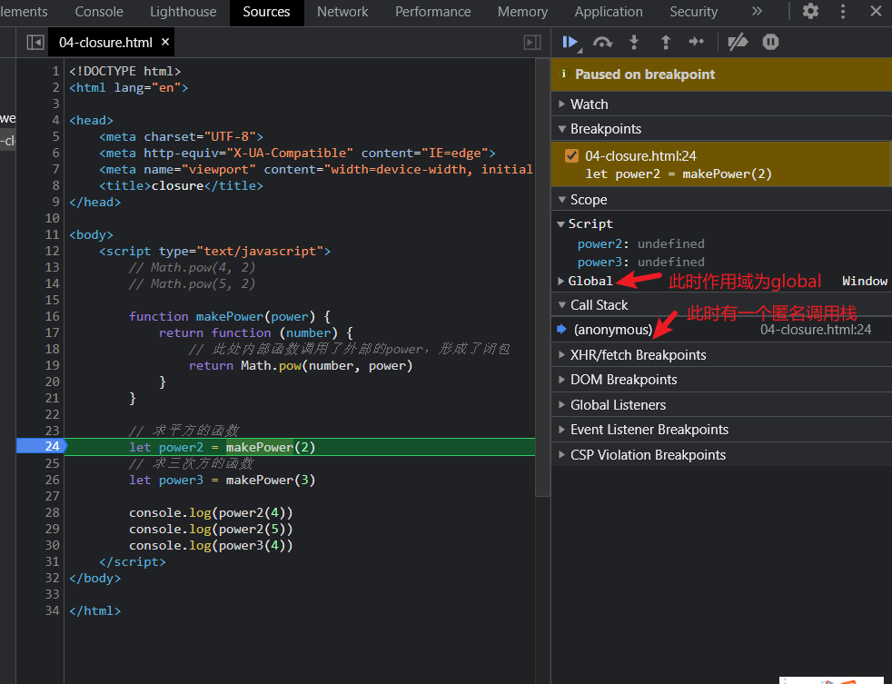
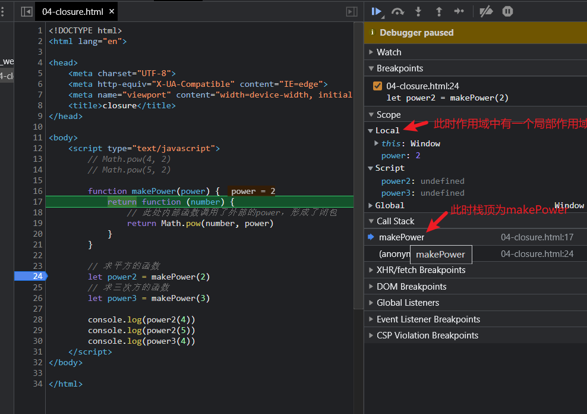
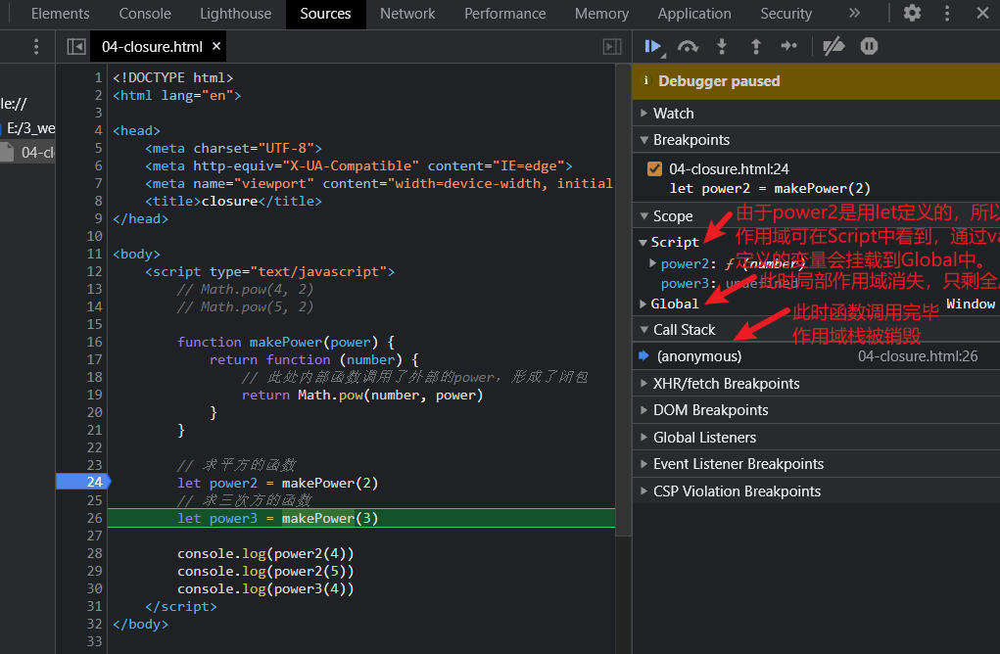
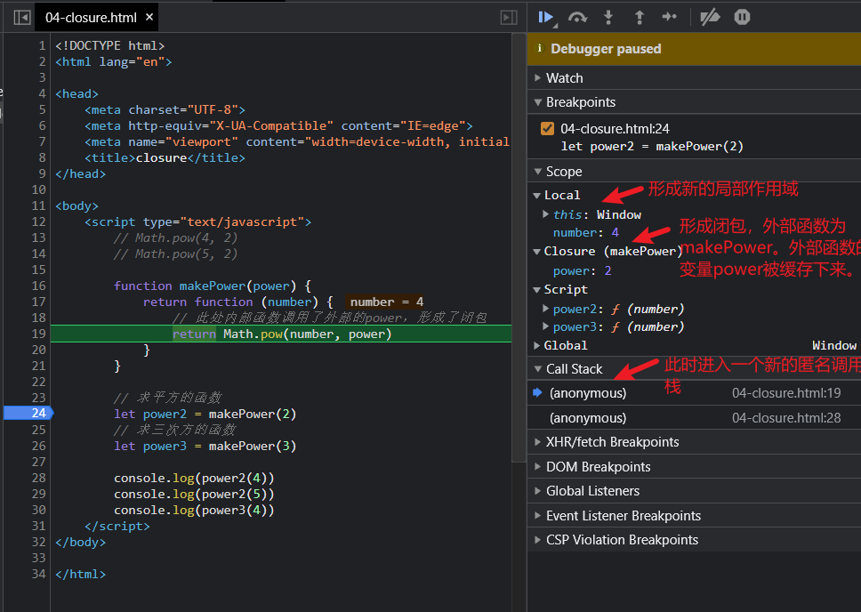

&emsp;函数式编程是非常古老的一个概念，早于第一台计算机的诞生。

> 为何要学习函数式编程

- 函数式编程是随着React的流行受到越来越多的关注
- Vue 3也开始拥抱函数式编程
- 函数式编程可以抛弃this
- 打包过程中可以更好的利用tree shaking 过滤无用代码
- 方便测试，方便并行处理
- 有很多库可以帮助我们进行函数式开发：lodash、underscore、ramada


## 什么是函数式编程

函数式编程(Functional Programming, FP)，FP 是编程范式之一，我们常听说的编程范式还有面向过程编程、面向对象编程。 

- 面向对象编程的思维方式：把现实世界中的事物抽象成程序世界中的类和对象，通过封装、继承和 多态来演示事物事件的联系 
- 函数式编程的思维方式：把现实世界的事物和事物之间的联系抽象到程序世界（对运算过程进行抽 象） 
  - 程序的本质：根据输入通过某种运算获得相应的输出，程序开发过程中会涉及很多有输入和 输出的函数 x -> f(联系、映射) -> y，y=f(x) 
  -    **函数式编程中的函数指的不是程序中的函数（方法）**，而是数学中的函数即映射关系，例如：**y = sin（x）**，x和y的关系 
  - **相同的输入始终要得到相同的输出**(纯函数) 
  - 函数式编程用来描述数据(函数)之间的映射

```javascript
// 非函数式
let num1 = 2
let num2 = 3
let sum = num1 + num2
console.log(sum)

// 函数式
function add (n1, n2) {
	return n1 + n2
}
let sum = add(2, 3)
console.log(sum)
```

## First-class Function（头等函数）

&emsp;&emsp;当一门编程语言的函数可以被当作变量一样用时，则称这门语言拥有**头等函数**。例如，在JS中，函数可以被当作参数传递给其他函数，可以作为另一个函数的返回值，还可以被赋值给一个变量。

&emsp;&emsp;在 JavaScript 中**函数就是一个普通的对象** (可以通过 new Function() )，我们可以把函数存储到变量/ 数组中，它还可以作为另一个函数的参数和返回值，甚至我们可以在程序运行的时候通过 new Function('alert(1)') 来构造一个新的函数。

```javascript
// 把函数赋值给变量
let fn = function () {
	console.log('Hello First-class Function')
}
fn()

// 一个示例
// 此处，index与Views.index返回的结果与参数都是一样的，所以我们可以做成下面的优化形式
const BlogController = {
	index (posts) { return Views.index(posts) },
	show (post) { return Views.show(post) },
	create (attrs) { return Db.create(attrs) },
	update (post, attrs) { return Db.update(post, attrs) },
	destroy (post) { return Db.destroy(post) }
}
// 优化
const BlogController = {
	index: Views.index,
	show: Views.show,
	create: Db.create,
	update: Db.update,
	destroy: Db.destroy
}
```

- 头等函数是高阶函数、柯里化等的基础。

## 高阶函数

- 高阶函数 (Higher-order function) 
  - 可以把函数作为参数传递给另一个函数 
  - 可以把函数作为另一个函数的返回结果

函数作为参数的示例：

```javascript
// 高阶函数-函数作为参数

function forEach(array, fn) {
    for (let i = 0; i < array.length; i++) {
        fn(array[i])
    }
}

// 测试
// let arr = [1, 2, 3, 4, 5]

// forEach(arr, function (item) {
//     console.log(item)
// })

// filter
function filter(arr, fn) {
    let results = []
    for (let i = 0; i < array.length; i++) {
        if (fn(array[i])) {
            result.push(array[i])
        }
    }
    return results
}

// 测试
let arr = [1, 3, 4, 7, 8]
let r = filter(arr, function (item) {
    return item % 2 === 0
})
```

&emsp;&emsp;当函数作为参数时，可以让我们的函数变得更为灵活，且调用时不需要考虑其内部是如何实现的。

函数作为返回值的示例：

```javascript
// 高阶函数-函数作为返回值

function makeFn() {
    let msg = 'Hello Function'
    return function () {
        console.log(msg)
    }
}

// const fn = makeFn()
// fn()

makeFn()()

// once
function once(fn) {
    let done = false
    return function () {
        if (!done) {
            done = true
            return fn.apply(this, arguments)    // apply的第二个参数为数组。此处可以通过此种写法将fn进行调用
            // 也可以写成
            // return fn(...arguments)
        }
    }
}

let pay = once(function (money) {
    console.log(`支付：${money} RMB`)
})

// once中的fn只会执行一次。
pay(5)
pay(5)
pay(5)
pay(5)
```

## 使用高阶函数的意义

- 抽象可以帮我们屏蔽细节，只需要关注与我们的目标
- 高阶函数是用来抽象通用的问题

```js
// 面向过程的方式
let array = [1, 2, 3, 4]
for (let i = 0; i < array.length; i++) {
	console.log(array[i])
}

// 高阶函数的方式
let array = [1, 2, 3, 4]
forEach(array, item => {
	console.log(item)
})
let r = filter(array, item => {
	return item % 2 === 0
})
```

## 常用的高阶函数

- forEach 
- map 
- filter 
- every 
- some 
- find/findIndex 
- reduce 
-  sort
-  ......

```javascript
// 模拟常用高阶函数：map、every、some

// map
const map = (array, fn) => {
    let results = []
    for (let value of array) {
        results.push(fn(value))
    }
    return results
}

// 测试
// let arr = [1, 2, 3, 4]
// arr = map(arr, v => v * v)
// console.log(arr)     // [ 1, 4, 9, 16 ]

// every
const every = (array, fn) => {
    let result = true
    for (let value of array) {
        result = fn(value)
        if (!result) {
            break
        }
    }
    return result
}

// 测试
// let arr = [1, 12, 14]
// let r = every(arr, v => v > 10)
// console.log(r)   //false

// some
const some = (array, fn) => {
    let result = false
    for (let value of array) {
        result = fn(value)
        if (result) {
            break
        }
    }
    return result
}

// 测试
// let arr = [1, 3, 4, 9]
// let r = some(arr, v => v % 2 === 0)
// console.log(r)  // true
```

## 闭包

- 闭包 (Closure)：函数和其周围的状态(词法环境)的引用捆绑在一起形成闭包。
  - 可以在另一个作用域中调用一个函数的内部函数并访问到该函数的作用域中的成员（下方代码的msg）
  - 原本函数执行完后内部数据就会被释放，但是闭包的产生使得函数内部数据的作用范围延长了

```javascript
// 函数作为返回值
function makeFn () {
	let msg = 'Hello function'
	return function () {
		console.log(msg)
	}
}
const fn = makeFn()
fn()
```

- 闭包的本质：函数在执行的时候会放到一个执行栈上，当函数执行完毕之后会从执行栈上移除，但是堆上的作用域成员(msg)因为被外部引用不能释放，因此内部函数(return的函数)依然可以访问外部函数(makeFn)的成员。

## 闭包的案例

### 案例一

```javascript
<!DOCTYPE html>
<html lang="en">

<head>
    <meta charset="UTF-8">
    <meta http-equiv="X-UA-Compatible" content="IE=edge">
    <meta name="viewport" content="width=device-width, initial-scale=1.0">
    <title>closure</title>
</head>

<body>
    <script type="text/javascript">
        // Math.pow(4, 2)
        // Math.pow(5, 2)

        function makePower(power) {
            return function (number) {
                // 此处内部函数调用了外部的power，形成了闭包
                return Math.pow(number, power)
            }
        }

        // 求平方的函数
        let power2 = makePower(2)
        // 求三次方的函数
        let power3 = makePower(3)

        console.log(power2(4))
        console.log(power2(5))
        console.log(power3(4))
    </script>
</body>

</html>
```










### 案例二

```javascript
<!DOCTYPE html>
<html lang="en">

<head>
    <meta charset="UTF-8">
    <meta http-equiv="X-UA-Compatible" content="IE=edge">
    <meta name="viewport" content="width=device-width, initial-scale=1.0">
    <title>closure</title>
</head>

<body>
    <script type="text/javascript">
        /* getSalary函数，第一个参数为基本工资，第二个为绩效工资 */
        // getSalary(12000, 2000)
        // getSalary(15000, 3000)
        // getSalary(15000, 4000)

        function makeSalary(base) {
            return function (performance) {
                return base + performance
            }
        }

        let salaryLevel1 = makeSalary(12000)
        let salaryLevel2 = makeSalary(15000)

        // 此时由于我们已经将基本工资设置好了，故此处只需要传绩效工资即可
        console.log(salaryLevel1(2000))
        console.log(salaryLevel2(3000))
    </script>
</body>

</html>
```

