> 前端开发面临的问题

- 想要使用ES6+ 新特性，但是兼容有问题。
- 想要使用Less/Sass/PostCss增强CSS的编程性，但是运行环境不能直接支持。

- 想要使用模块化的方式提高项目的可维护性，但运行环境不能直接支持
- 部署上线前需要手动压缩代码及资源文件、部署过程需要手动上传代码到服务器
- 多人协作开发，无法硬性统一大家的代码风格，从仓库pull回来的代码质量无法保证
- 部分功能开发时需要等待后端服务接口提前完成

> 工程化表现

- 一切以提高效率、降低成本、质量保证为目的的手段都属于工程化。

- 一切重复的工作都应该被自动化
  - 创建项目：创建项目结构、创建特定类型文件
  - 编码：格式化代码、校验代码风格、编译/构建/打包
  - 预览/测试：Web Server/Mock、Live Reloading/HMR、Source Map
  - 提交：Git Hooks、Lint-staged、持续集成
  - 部署：CI、CD、自动部署

> 工程化 不等于 某个工具

工程化是对项目整体的架构，而工具是实现架构的手段。

一些成熟的工程化集成：

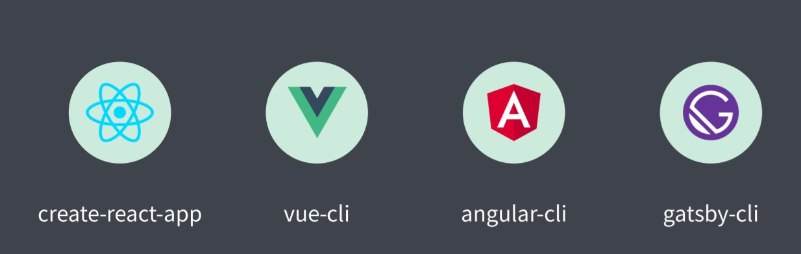

> 工程化与Node.js

Node.js的出现使得前端有了如今的规模，工程化的一切都是基于Node.js。

## 脚手架工具

### 脚手架工具概要

> 脚手架的本质作用

创建项目基础结构、提供项目规范和约定。（相同的组织结构、开发范式、模块依赖、工具配置、基础代码）。

> 前端脚手架

由于前端技术选型比较多样，另外又没有一个统一的标准，所以前端方向的脚手架一般不会集成在某个IDE中，而都是以一个独立的工具存在，且相对会复杂一些。


> 常用的脚手架工具

React -> create-react-app

Vue -> vue-cli

Angular -> angular-cli

这些工具的使用方式大同小异，都是根据信息创建对应的项目基础结构


Yeoman

通用型脚手架工具，可以根据一套模板生成对应的项目结构，比较灵活且容易扩展。


Plop

用来在项目开发过程中创建特定类型的文件，例如创建一个组件、模块所需要的文件


## Yeoman

> 用于创建现代化Web应用的脚手架工具，可以搭配不同类型的generator去创建任何类型的项目（但这同样也是其的缺点）。

### Yeoman的基本使用

1. 安装

```javascript
npm install yo -g
npm install generator-node -g
```

2. 执行命令

```javascript
yo node
```

3. 输入相关内容

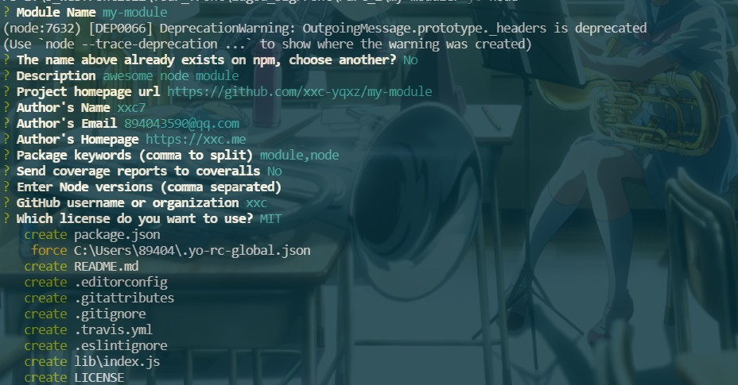

4. 自动生成基础的项目结构

###  Sub Generator

> 有时候我们不需要创建完整的项目结构，而是需要在已有的项目上创建一些特定类型的文件。例如给一个已经存在的项目创造README.md，
>
> 又或者在一个原有的项目之上去添加某些类型的配置文件（esLint或babel），我们可以通过生成器自动生成这些配置文件的基础代码，提高我们的一个效率。此时就可以使用Yeoman提供的**Sub Generator**特性。

> 使用generator-node中提供的一个cli生成器，来生成cli应用所需的配置文件

1. 命令行输入(在原有的generator之上输入sub Generator的名字)

```javascript
yo node:cli
```

提示是否重写package.json文件？选择yes，因为添加cli支持时其会添加一些新的模块和配置。

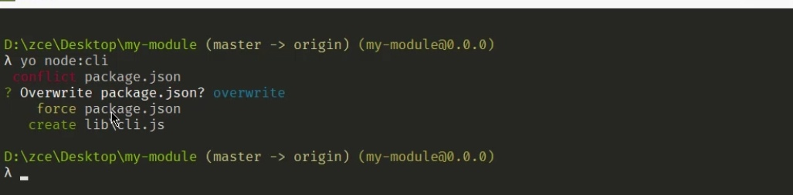

此时，lib下多了cli.js文件（一些cli配置代码），同时package.json中新增了bin选项和meow插件。


安装依赖

```javascript
yarn 
```


2. 使用yarn link将本地模块代理到全局范围，使用模块名加命令来运行当前模块

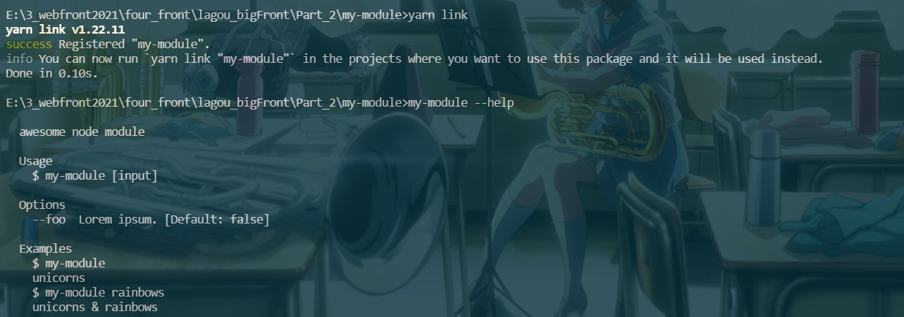

<div class="warning">

> 注意：并不是每一个Generator都提供子集生成器，需要通过所使用的Generator的官方文档来查看是否有某些生成器。

</div>

### Yeomon使用步骤总结

1. 明确你的需求

2. 找到合适的Generator

   [可在此处查看](https://yeoman.io/generators/)

3. 全局范围安装找到的Generator

   ```javascript
   npm i generator-webapp -g
   ```

   

4. 通过Yo运行对应的Generator

   ```javascript
    yo webapp
   ```

   

5. 通过命令行交互填写选项

6. 生成你所需要的项目结构

### 自定义Generator

#### 创建Generator模块

> Generator基本结构

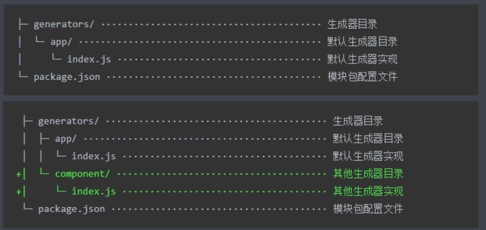

<div class="danger">

> yeoman的generator的模块名称必须是generator-xxx，如果没有提供这样的名称，则Yeoman在后续工作中没有办法找到对应的生成器模块。

</div>

> 创建步骤

1. 执行如下指令：

```javascript
mkdir generator-sample  // 创建一个空目录
yarn init    // 初始化module结构
yarn add yeomon-generator	// 安装yeomon-generator，提供了生成器的基类，提供了一些工具函数，让我们在创建生成器的时候更加便捷
```

2. 创建generators/app/index.js，并写入如下代码

```javascript
// 此文件作为 Generator 的核心入口
// 需要导出一个继承自 Yemon Generator 的类型
// Yeoman Generator 在工作时会自动调用我们在此类型中定义的一些生命周期方法
// 我们在这些方法中可以通过调用父类提供的一些方法实现一些功能，例如文件写入

const Generator = require('yeoman-generator')

module.exports = class extends Generator {
    writing() {
        // Yeoman 自动在生成文件阶段调用此方法
        // 我们这里尝试往项目目录中写入文件
        this.fs.write(
            this.destinationPath('temp.txt'),   // 写入文件的绝对路径，可以借助父类的destinationPath方法生成
            Math.random().toString()    // 文件内容，此处生成随机数代替
        ) // 此处的fs是一个高度封装的fs模块，相对于Node.js中的fs功能更加强大
    }
}
```


3. 使用yarn link将该模块连接到全局范围

4. 新建目录，并在目录下执行命令

```javascript
mkdir my-proj
cd my-proj
yo sample	// 此处的sample为第1步创建的生成器名称generator-sample的后位
```

5. 可以看到如下结果

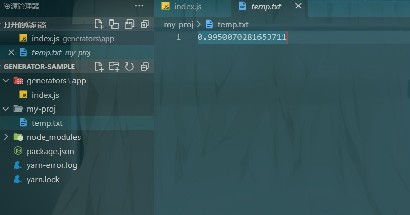

#### 根据模板创建文件

> 相对于手动创建每一个文件，模板的方式大大提高了效率

步骤：

1. 新建一个templates文件，并在其中创建模板文件

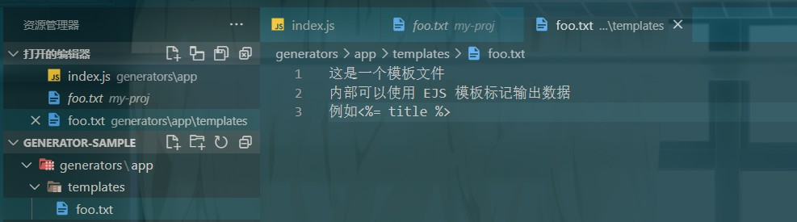

2. 在index.js中输入如下代码

```javascript
// 此文件作为 Generator 的核心入口
// 需要导出一个继承自 Yemon Generator 的类型
// Yeoman Generator 在工作时会自动调用我们在此类型中定义的一些生命周期方法
// 我们在这些方法中可以通过调用父类提供的一些方法实现一些功能，例如文件写入

const Generator = require('yeoman-generator')

module.exports = class extends Generator {
    writing() {
        // 通过模板方式写入文件到目标目录
        const tmpl = this.templatePath('foo.txt')
        // 输出目标路径
        const output = this.destinationPath('foo.txt')
        // 模板数据上下文
        const context = { title: `Hello zce~`, success: false }
        
        this.fs.copyTpl(tmpl,output,context)
    }
}
```

3. 在目标文件夹下执行命令

```javascript
yo sample
```

#### 接收用户输入数据

> 通过Generator中的prompting方法实现命令行交互的提问。

- index.js

```javascript
const Generator = require('yeoman-generator')

module.exports = class extends Generator {
    prompting() {
        // Yeoman 在询问用户环节会自动调用此方法
        // 在此方法中可以调用父类的prompt() 方法发出对用户的命令行询问
        return this.prompt([
            {
                type: 'input',  // 使用用户输入的方式获取用户提交的信息
                name: 'name',   // 得到结果的键
                message: 'Your project name',   // 给用户的提示
                default:this.appname    // appname 为项目生产目录名称
            }
        ])
            .then(answers => {
                // answers => {name:'user input value' }
                this.answers = answers
            })
    }
    writing() {
        // 通过模板方式写入文件到目标目录
        const tmpl = this.templatePath('bar.html')
        // 输出目标路径
        const output = this.destinationPath('bar.html')
        // 模板数据上下文
        const context = this.answers
        
        this.fs.copyTpl(tmpl,output,context)
    }
}
```

- templates/bar.html

```html
<!DOCTYPE html>
<html lang="en">
<head>
  <meta charset="UTF-8">
  <meta name="viewport" content="width=device-width, initial-scale=1.0">
  <meta http-equiv="X-UA-Compatible" content="ie=edge">
  <title><%= name %></title>
</head>
<body>
  <h1><%= name %></h1>
</body>
</html>
```

### Vue Generator案例

1. 执行如下命令

```javascript
mkdir generator-xxc-vue
cd generator-xxc-vue
yarn init
yarn add yeoman-generator
```

2. 新建文件夹templates，并将模板结构移入

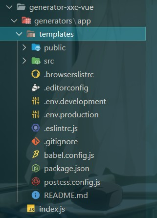

3. 将public/index.html中的favicon.icon改为如下形式（加两个%表示以原样输出）

```javascript
<link rel="icon" href="<%%= BASE_URL %>favicon.ico">
```

4. 修改generators/app/index.js中的代码

```javascript
const Generator = require('yeoman-generator')

module.exports = class extends Generator{
    prompting() {
        return this.prompt([
            {
                type: 'input',
                name: 'name',
                message: 'Your project name',
                default:'this.appname'
            }
        ]).
            then(answers => {
                this.answers = answers
            })
    }

    writing() {
        // 把每一个文件都通过模板转换到目标路径
        const templates = [
            '.browserslistrc',
            '.editorconfig',
            '.env.development',
            '.env.production',
            '.eslintrc.js',
            '.gitignore',
            'babel.config.js',
            'package.json',
            'postcss.config.js',
            'README.md',
            'public/favicon.ico',
            'public/index.html',
            'src/App.vue',
            'src/main.js',
            'src/router.js',
            'src/assets/logo.png',
            'src/components/HelloWorld.vue',
            'src/store/actions.js',
            'src/store/getters.js',
            'src/store/index.js',
            'src/store/mutations.js',
            'src/store/state.js',
            'src/utils/request.js',
            'src/views/About.vue',
            'src/views/Home.vue'
        ]
        
        templates.forEach(item => {
            // item => 每个文件路径
            this.fs.copyTpl(
                this.templatePath(item),
                this.destinationPath(item),
                this.answers
            )
        })
    }
}
```

4. 使用yarn link将该generator暴露到全局
5. 新建一个文件夹并进入该文件夹执行yo "generator-name"

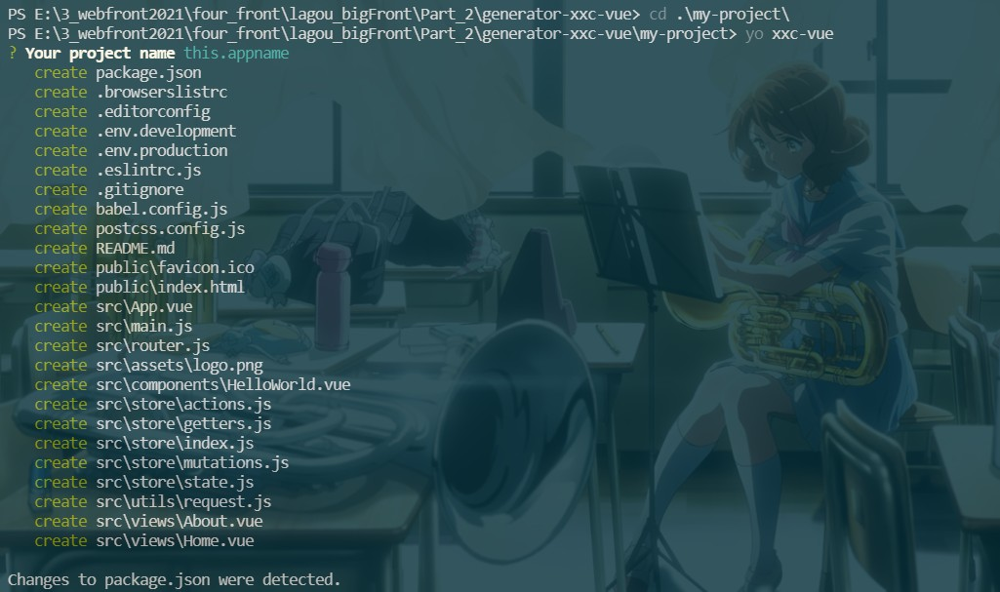

###发布Generator

1. 将项目git初始化并连接远程仓库

```javascript
git remote add origin https://github.com/xxc-yqxz/generator-xxc-vue.git
git branch -M main
git push -u origin main
```

2. 将项目推送到npm(此处要将镜像地址改为官方地址，因为淘宝镜像是只读镜像)

```javascript
yarn publish --registry=https://registry.yarnpkg.com
```

## Plop

> 一个小而美的脚手架工具，用于创建项目中特定类型文件（如React中的组件）的一个小工具，类似于Sub Generator。不过一般不会独立去使用，而是集成到项目中，用来创建同类型的项目文件。

### Plop的基本使用

1. 安装plop

```javascript
yarn add plop --dev
```

2. 在项目根目录下新建一个propfile.js，并填入如下代码

```javascript
// Plop 入口文件，需要导出一个函数
// 此函数接收一个 plop 对象，用于创建生成器任务

module.exports = plop => {
    plop.setGenerator('component', {
        description: 'create a component',
        prompts: [
            {
                type: 'input',
                name: 'name',	// 得到结果的键
                message: 'component name',
                default:'MyComponent'
            }
        ],
        actions: [
            {
                type: 'add', // 代表添加文件
                path: 'src/components/{{name}}/{{name}}.js',	// 此处可以将prompts中得到的数值以模板字符串的形式展现
                templateFile:'plop-templates/component.hbs'		// 模板文件地址
            },
            {
                type: 'add', // 代表添加文件
                path: 'src/components/{{name}}/{{name}}.css',
                templateFile:'plop-templates/component.css.hbs'
            },
            {
                type: 'add', // 代表添加文件
                path: 'src/components/{{name}}/{{name}}.test.js',
                templateFile:'plop-templates/component.test.hbs'
            },
        ]
    })
}
```

3. 新建模板文件，可以用插值表达式来插入prompts中的值

```javascript
import React from 'react';

export default () => {
    <div className="{{name}}">
        <h1>{{name}} Component</h1>
    </div>
}
```

4. 执行yarn plop + setGenerator中第一个参数的名称，然后输入相关问题，即可创建成功


## 脚手架工作原理

> 大部分脚手架工具的工作原理都很简单，无外乎在启动后让你输入一些预设的问题，然后将回答的结果结合配置好的模板文件，生成一个项目的结构

1. 新建一个文件夹并初始化

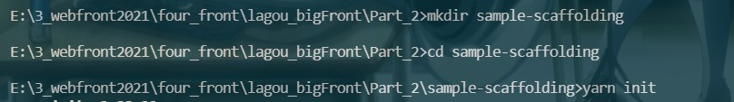

2. 在package.json中添加bin字段，用来指定cli应用的入口文件

```javascript
{
  "name": "sample-scaffolding",
  "version": "1.0.0",
  "main": "index.js",
  "bin":"cli.js",
  "license": "MIT"
}
```

3. 新建cli.js文件，写入测试代码

```javascript
#!/usr/bin/env node

// Node CLI 应用入口文件必须要有这样的文件头
// 如果是 Linux 或者 macOS 系统下还需要修改此文件的读写权限为 755
// 具体就是通过 chmod 755 cli.js 实现修改

console.log(111)
```

4. 执行以下命令

```javascript
yarn link
sample-scaffolding
```

5. 可以看到如下结果

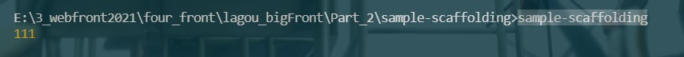

6. 安装inquirer来实现通过命令行交互询问用户问题

7. 在项目根目录新建templates目录，在目录下创建模板文件

- index.html

```html
<!DOCTYPE html>
<html lang="en">
<head>
  <meta charset="UTF-8">
  <meta name="viewport" content="width=device-width, initial-scale=1.0">
  <meta http-equiv="X-UA-Compatible" content="ie=edge">
  <title><%= name %></title>
</head>
<body>
  
</body>
</html>
```

- style.css

```css
body {
  margin: 0;
  background-color: #f8f9fb;
}
```

8. 修改cli.js，安装ejs模板引擎来渲染

```javascript
#!/usr/bin/env node

// Node CLI 应用入口文件必须要有这样的文件头
// 如果是 Linux 或者 macOS 系统下还需要修改此文件的读写权限为 755
// 具体就是通过 chmod 755 cli.js 实现修改

// 脚手架的工作过程：
// 1. 通过命令行交互询问用户问题
// 2. 根据用户回答的结果生成文件

const fs = require('fs')
const path = require('path')
const inquirer = require('inquirer')
const ejs = require('ejs')

inquirer.prompt([
  {
    type: 'input',
    name: 'name',
    message: 'Project name?'
  }
])
.then(anwsers => {
  // console.log(anwsers)
  // 根据用户回答的结果生成文件

  // 模板目录
  const tmplDir = path.join(__dirname, 'templates')		// __dirname 是被执行的js 文件的地址	-- 文件目录
  // 目标目录
  const destDir = process.cwd()	//	process.cwd()返回的是当前Node.js进程执行时的工作目录	-- 工作目录

  // 将模板下的文件全部转换到目标目录
  fs.readdir(tmplDir, (err, files) => {
    if (err) throw err
    files.forEach(file => {
      // 通过模板引擎渲染文件
      ejs.renderFile(path.join(tmplDir, file), anwsers, (err, result) => {
        if (err) throw err

        // 将结果写入目标文件路径
        fs.writeFileSync(path.join(destDir, file), result)
      })
    })
  })
})
```

