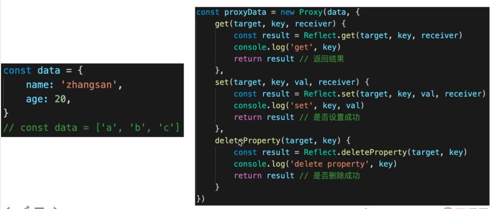

# Vue

**先学 Vue2 再学 Vue3**

- Vue3 不是从0做出来，而是从 Vue2 进化而来
- Vue2 还会被继续使用，面试会继续考察
- Vue2 的语法，绝大部分会被 Vue3 支持

**Vue 和 React 越来越接近**

- Vue3 Options API 对应 React class Component
- Vue3 Composition 对应 React Hooks
- 不要再纠结哪个好、哪个坏

## Vue使用

- 基本使用，组件使用 --- 常用，必须会
- 高级特性 --- 不常用，但体现深度
- Vuex 和 Vue-router 使用

**自己去看文档不行吗？**

- 行，但这是一种最低效的方式
- 文档是一个备忘录，给会用的人查阅，并不是入门教程
- 文档全面冗长且细节过多，不能突出面试考点

### Vue基础使用

**插值、表达式、指令、动态属性的使用**

**v-html ：会有 XSS 风险，会覆盖子组件**

```html
<template>
    <div>
        <p>文本插值 {{message}}</p>
        <p>JS 表达式 {{ flag ? 'yes' : 'no' }} （只能是表达式，不能是 js 语句）</p>

        <p :id="dynamicId">动态属性 id</p>

        <hr/>
        <p v-html="rawHtml">
            <span>有 xss 风险</span>
            <span>【注意】使用 v-html 之后，将会覆盖子元素</span>
        </p>
        <!-- 其他常用指令后面讲 -->
    </div>
</template>

<script>
export default {
    data() {
        return {
            message: 'hello vue',
            flag: true,
            rawHtml: '指令 - 原始 html <b>加粗</b> <i>斜体</i>',
            dynamicId: `id-${Date.now()}`
        }
    }
}
</script>
```

结果：


**computed 和 watch**

- computed 有缓存， data 不变则不会重新计算
- computed 中的值若被绑定到 v-model中，需要 同时写 get、set，否则会报错

```html
<template>
    <div>
        <p>num {{num}}</p>
        <p>double1 {{double1}}</p>
        <!-- 使用 v-model 时 computed 需要同时有 get 和 set -->
        <input v-model="double2"/>
    </div>
</template>

<script>
export default {
    data() {
        return {
            num: 20
        }
    },
    computed: {
        // computed 的计算得出的值若是不变的话，则不会重新计算，而是会缓存
        double1() {
            return this.num * 2
        },
        double2: {
            get() {
                return this.num * 2
            },
            set(val) {
                this.num = val/2
            }
        }
    }
}
</script>
```


- watch 如何深度监听？
- watch 监听引用类型，拿不到 oldVal。

```html
<template>
    <div>
        <input v-model="name"/>
        <input v-model="info.city"/>
    </div>
</template>

<script>
export default {
    data() {
        return {
            name: '双越',
            info: {
                city: '北京'
            }
        }
    },
    watch: {
        name(oldVal, val) {
            // eslint-disable-next-line
            console.log('watch name', oldVal, val) // 值类型，可正常拿到 oldVal 和 val
        },
        info: {
            handler(oldVal, val) {
                // eslint-disable-next-line
                console.log('watch info', oldVal, val) // 引用类型，拿不到 oldVal 。因为指针相同，此时已经指向了新的 val。所以 oldVal和val相同
            },
            deep: true // 深度监听
        }
    }
}
</script>
```

**class 和 style**

- 使用动态属性
- 写style 时要使用 驼峰式写法

```html
<template>
    <div>
        <p :class="{ black: isBlack, yellow: isYellow }">使用 class</p>
        <p :class="[black, yellow]">使用 class （数组）</p>
        <p :style="styleData">使用 style</p>
    </div>
</template>

<script>
export default {
    data() {
        return {
            isBlack: true,
            isYellow: true,

            black: 'black',
            yellow: 'yellow',

            styleData: {
                fontSize: '40px', // 转换为驼峰式
                color: 'red',
                backgroundColor: '#ccc' // 转换为驼峰式
            }
        }
    }
}
</script>

<style scoped>
    .black {
        background-color: #999;
    }
    .yellow {
        color: yellow;
    }
</style>
```

**条件渲染**

- v-if 和 v-else 的用法，可使用变量，也可以使用 === 表达式
- v-if 和 v-show 的区别？
  - v-if ：条件成立则渲染，条件不成立不渲染。
  - v-show：条件成立则渲染，条件不成立使用 `display:none;`进行隐藏。

- v-if 和 v-show 的使用场景？
  - v-if：更新不频繁 或 一次性决定显示隐藏的内容。
  - v-show：频繁切换。

```html
<template>
    <div>
        <p v-if="type === 'a'">A</p>
        <p v-else-if="type === 'b'">B</p>
        <p v-else>other</p>

        <p v-show="type === 'a'">A by v-show</p>
        <p v-show="type === 'b'">B by v-show</p>
    </div>
</template>

<script>
export default {
    data() {
        return {
            type: 'a'
        }
    }
}
</script>
```


**循环(列表)渲染**

- 如何遍历对象？ --- 也可以用 v-for
- key 的重要性。 key不能乱写（如 random 或者 index）。
- v-for 和 v-if 不能一起使用！v-for比 v-if 优先级高。下面代码中，当使用 v-for 时渲染了三次，而此时再判断 v-if，就会造成无用的dom创建与销毁操作。

[v-for和v-if不能一起使用的原因](https://blog.csdn.net/weixin_42211816/article/details/115415287?utm_medium=distribute.pc_relevant.none-task-blog-2~default~baidujs_title~default-0.no_search_link&spm=1001.2101.3001.4242.1)

```html
<template>
    <div>
        <p>遍历数组</p>
        <ul>
            <li v-for="(item, index) in listArr" :key="item.id">
                {{index}} - {{item.id}} - {{item.title}}
            </li>
        </ul>

        <p>遍历对象</p>
        <ul >
            <li v-for="(val, key, index) in listObj" :key="key">
                {{index}} - {{key}} -  {{val.title}}
            </li>
        </ul>
    </div>
</template>

<script>
export default {
    data() {
        return {
            flag: false,
            listArr: [
                { id: 'a', title: '标题1' }, // 数据结构中，最好有 id ，方便使用 key
                { id: 'b', title: '标题2' },
                { id: 'c', title: '标题3' }
            ],
            listObj: {
                a: { title: '标题1' },
                b: { title: '标题2' },
                c: { title: '标题3' },
            }
        }
    }
}
</script>
```

**事件**

- event 参数、自定义参数
- 事件修饰符、按键修饰符
- 【观察】事件被绑定到哪里?

```javascript
<template>
    <div>
        <p>{{num}}</p>
        <!-- 当点击事件不需要传递参数时，会默认传入一个 event 参数 -->
        <button @click="increment1">+1</button>

        <!-- 当点击事件需要传递参数时，此时我们若要获取 event 参数，则需要手动传入 -->
        <button @click="increment2(2, $event)">+2</button>
    </div>
</template>

<script>
export default {
    data() {
        return {
            num: 0
        }
    },
    methods: {
        increment1(event) {
            // eslint-disable-next-line
            console.log('event', event, event.__proto__.constructor) // event是原生的 event 对象
            // eslint-disable-next-line
            console.log(event.target)
            // eslint-disable-next-line
            console.log(event.currentTarget) // 注意，事件是被注册到当前元素的，和 React 不一样
            this.num++

            // 1. event 是原生的
            // 2. 事件被挂载到当前元素
            // 和 DOM 事件一样
        },
        increment2(val, event) {
            // eslint-disable-next-line
            console.log(event.target)
            this.num = this.num + val
        },
        loadHandler() {
            // do some thing
        }
    },
    mounted() {
        window.addEventListener('load', this.loadHandler)
    },
    beforeDestroy() {
        //【注意】用 vue 绑定的事件，组建销毁时会自动被解绑
        // 自己绑定的事件，需要自己销毁！！！
        window.removeEventListener('load', this.loadHandler)
    }
}
</script>
```

**事件修饰符：**


**按键修饰符：**


[按键修饰符补充](https://blog.csdn.net/weixin_40013817/article/details/103067688)

**表单**

- v-model
- 常见表单项 textarea、checkbox、radio、select
- 修饰符 lazy、number、trim

```html
<template>
    <div>
        <p>输入框: {{name}}</p>
        <input type="text" v-model.trim="name"/>
        <!-- .lazy 类似于防抖，保证只有输入结束后才发生值的变化 -->
        <input type="text" v-model.lazy="name"/>
        <!-- .number 将输入内容变为数字 -->
        <input type="text" v-model.number="age"/>

        <p>多行文本: {{desc}}</p>
        <textarea v-model="desc"></textarea>
        <!-- 注意，<textarea>{{desc}}</textarea> 是不允许的！！！ -->

        <p>复选框 {{checked}}</p>
        <input type="checkbox" v-model="checked"/>

        <p>多个复选框 {{checkedNames}}</p>
        <!-- checkedNames 是一个数组，选中了谁，谁就会被放到数组中 -->
        <input type="checkbox" id="jack" value="Jack" v-model="checkedNames">
        <label for="jack">Jack</label>
        <input type="checkbox" id="john" value="John" v-model="checkedNames">
        <label for="john">John</label>
        <input type="checkbox" id="mike" value="Mike" v-model="checkedNames">
        <label for="mike">Mike</label>

        <p>单选 {{gender}}</p>
        <!-- gender 是一个值，选中了谁，谁就会被赋给这个值 -->
        <input type="radio" id="male" value="male" v-model="gender"/>
        <label for="male">男</label>
        <input type="radio" id="female" value="female" v-model="gender"/>
        <label for="female">女</label>

        <p>下拉列表选择 {{selected}}</p>
        <select v-model="selected">
            <option disabled value="">请选择</option>
            <option>A</option>
            <option>B</option>
            <option>C</option>
        </select>

        <p>下拉列表选择（多选） {{selectedList}}</p>
        <select v-model="selectedList" multiple>
            <option disabled value="">请选择</option>
            <option>A</option>
            <option>B</option>
            <option>C</option>
        </select>
    </div>
</template>

<script>
export default {
    data() {
        return {
            name: '双越',
            age: 18,
            desc: '自我介绍',

            checked: true,
            checkedNames: [],

            gender: 'male',

            selected: '',
            selectedList: []
        }
    }
}
</script>
```

### Vue 组件使用

#### 父子组件间通讯方式 - props 和 $emit

父组件通过 动态属性 将值传递给子组件，子组件中通过 this.$emit(事件名,参数) 的形式，将参数传递给 父组件。此时父组件需要在调用子组件的地方绑定对应事件。

**父组件：**

```html
<template>
    <div>
        ...
        <!-- 调用子组件，使用 :list 的形式向子组件传递参数，同时绑定事件@delete，事件需要在子组件中通过 $emit(事件名)触发 -->
		<List :list="list" @delete="deleteHandler"/>
    </div>
</template>
<script>
import List from './List'
export default {
    components: {

    },
    data() {
        return {
            list: [
                {
                    id: 'id-1',
                    title: '标题1'
                },
                {
                    id: 'id-2',
                    title: '标题2'
                }
            ]
        }
    },
    methods: {
        deleteHandler(id) {
            this.list = this.list.filter(item => item.id !== id)
        }
    },
}
</script>
```

**子组件：**

```html
<template>
    <div>
        <ul>
            <li v-for="item in list" :key="item.id">
                {{item.title}}
                <button @click="deleteItem(item.id)">删除</button>
            </li>
        </ul>
    </div>
</template>
<script>
export default {
    // 子组件接收父组件传递来的参数
    // props: ['list']
    props: {
        // prop 类型和默认值
        list: {
            type: Array,
            default() {
                return []
            }
        }
    },
    methods: {
        deleteItem(id) {
            // 子组件通过 this.$emit 触发父组件中绑定的事件。并将 id 作为参数传入
            this.$emit('delete', id)
        },
    },
}
</script>
```

[$emit 接受子组件传递参数的同时使用父组件中定义的参数](https://blog.csdn.net/m0_37816134/article/details/117354357?spm=1001.2101.3001.6650.4&utm_medium=distribute.pc_relevant.none-task-blog-2%7Edefault%7EBlogCommendFromBaidu%7Edefault-4.no_search_link&depth_1-utm_source=distribute.pc_relevant.none-task-blog-2%7Edefault%7EBlogCommendFromBaidu%7Edefault-4.no_search_link)

#### 组件间通讯 - 自定义事件

每个 Vue实例身上都会出现一个事件接口，我们可以通过 `Vue实例.$on()` 注册自定义事件，通过 `Vue实例.$emit()` 触发自定义事件。同时需要注意，需要在 `beforeDestroy` 中通过 `Vue实例.$off()` 解绑自定义事件。

**event.js**

```javascript
import Vue from 'vue'

export default new Vue()
```

通过event.js 导出一个 Vue 实例，然后在兄弟组件 List.vue 和 Input.vue 中通过引入 event.js ，并使用 event.on() 和 event.emit() 来定义和触发自定义事件。

**List.vue**

```html
<script>
import event from './event'
export default {
    methods: {
        addTitleHandler(title) {
            // eslint-disable-next-line
            console.log('on add title', title)
        }
    },
    mounted() {
        // 绑定自定义事件
        event.$on('onAddTitle', this.addTitleHandler)
    },
    beforeDestroy() {
        // 及时销毁，否则可能造成内存泄露
        event.$off('onAddTitle', this.addTitleHandler)
    }
}
</script>
```

**Input.vue**

```html
<script>
import event from './event'
export default {
    methods: {
        ...
        addTitle() {
            // 调用自定义事件
            event.$emit('onAddTitle', this.title)
        }
    }
}
</script>
```

<div class="danger">

> 注意区分 自定义事件 和 this.$emit()，一个是调用 自定义事件，一个是调用父组件中注册的事件。

</div>

[自定义事件](https://blog.csdn.net/qq_40616529/article/details/93652453)

[$off() 参数相关](https://cn.vuejs.org/v2/api/#vm-off)

#### 组件生命周期（必背）

##### **生命周期（单个组件）**

- 挂载阶段
- 更新阶段
- 销毁阶段


- mounted 和 created 的区别？

  在created的时候，视图中的html并没有渲染出来，所以此时如果直接去操作html的dom节点，一定找不到相关的元素。
  而在mounted中，由于此时html已经渲染出来了，所以可以直接操作dom节点。

##### 生命周期（父子组件）

1. 加载渲染过程

同步引入时生命周期顺序为：
       父组件的beforeCreate、created、beforeMount --> 所有子组件的beforeCreate、created、beforeMount --> 所有子组件的mounted --> 父组件的mounted
 总结：父组件先创建，然后子组件创建；子组件先挂载，然后父组件挂载

 若有孙组件呢？
       父组件先beforeCreate => created => beforeMount , 然后子组件开始beforeCreate => created => beforeMount ，然后孙组件beforeCreate => created => beforeMount => mounted，孙组件挂载完成了，子组件mounted，父组件再mounted

 异步引入时生命周期顺序为：
 父组件的beforeCreate、created、beforeMount、mounted --> 子组件的beforeCreate、created、beforeMount、mounted

总结：父组件创建，父组件挂载；子组件创建，子组件挂载。

2. 子组件更新过程
    父beforeUpdate->子beforeUpdate->子updated->父updated

3. 父组件更新过程
    父beforeUpdate->父updated

4. 销毁过程
    父beforeDestroy->子beforeDestroy->子destroyed->父destroyed

#### Vue 高级特性

*不是每个都很常用，但用到的时候必须要知道*

##### 自定义 v-model

**父组件**

```html
<template>
    <div>
        <!-- 自定义 v-model -->
        <p>{{name}}</p>
        <CustomVModel v-model="name"/>
    </div>
</template>

<script>
import CustomVModel from './CustomVModel'
export default {
    components: {
        CustomVModel
    },
    data() {
        return {
            name: '双越'
            ...
        }
    }
}
</script>
```

**子组件**

```html
<template>
    <!-- 例如：vue 颜色选择 -->
    <input type="text"
        :value="text1"
        @input="$emit('change1', $event.target.value)"
    >
    <!--
        1. 上面的 input 使用了 :value 而不是 v-model
        2. 上面的 change1 和 model.event 要对应起来
        3. text1 属性对应起来
    -->
</template>

<script>
export default {
    // 若不指定，则 prop 默认为 value，event默认为 input
    model: {
        prop: 'text1', // 对应 props text1
        event: 'change1'
    },
    props: {
        text1: String,
        default() {
            return ''
        }
    }
}
</script>
```


##### $nextTick

- Vue 是异步渲染。
- data 改变之后，DOM 不会立即渲染。
- $nextTick 会在 DOM 渲染之后被触发，以获取最新 DOM 节点。

```html
<template>
  <div id="app">
    <ul ref="ul1">
        <li v-for="(item, index) in list" :key="index">
            {{item}}
        </li>
    </ul>
    <button @click="addItem">添加一项</button>
  </div>
</template>

<script>
export default {
  name: 'app',
  data() {
      return {
        list: ['a', 'b', 'c']
      }
  },
  methods: {
    addItem() {
        this.list.push(`${Date.now()}`)
        this.list.push(`${Date.now()}`)
        this.list.push(`${Date.now()}`)

        // 1. 异步渲染，$nextTick 待 DOM 渲染完再回调
        // 2. 页面渲染时会将 data 的修改做整合，多次 data 修改只会渲染一次（即便上方修改了三次data，但最终只会渲染一次）
        this.$nextTick(() => {
          // 获取 DOM 元素
          const ulElem = this.$refs.ul1   // this.$refs 若只查出一个元素，返回元素。若查出一个数组，返回数组。
          // eslint-disable-next-line
          console.log( ulElem.childNodes.length )
        })
    }
  }
}
</script>
```


##### slot

- 基本使用
- 作用域插槽
- 具名插槽

###### 基本使用

**父组件**

```html
<template>
    <div>
        <!-- slot -->
        <SlotDemo :url="website.url">
            <!-- 此处的内容将会呈现在子组件的 slot 标签中 -->
            {{website.title}}
        </SlotDemo>
    </div>
</template>
<script>
import SlotDemo from './SlotDemo'
export default {
    components: {
        SlotDemo
    },
    data() {
        return {
            ...
            website: {
                url: 'http://imooc.com/',
                title: 'imooc',
                subTitle: '程序员的梦工厂'
            },
        }
    }
}
</script>
```

**子组件**

```html
<template>
    <a :href="url">
        <slot>
            默认内容，即父组件没设置内容时，这里显示
        </slot>
    </a>
</template>

<script>
export default {
    props: ['url'],
    data() {
        return {}
    }
}
</script>
```

结果：


###### 作用域插槽

子组件中有对应的 data，将 data 提取出让父组件获得。

**子组件**

```html
<template>
    <a :href="url">
        <slot :slotData="website">
            {{website.subTitle}} <!-- 默认值显示 subTitle ，即父组件不传内容时 -->
        </slot>
    </a>
</template>

<script>
export default {
    props: ['url'],
    data() {
        return {
            website: {
                url: 'http://wangEditor.com/',
                title: 'wangEditor',
                subTitle: '轻量级富文本编辑器'
            }
        }
    }
}
</script>
```

**父组件**

```html
<template>
    <div>
        <ScopedSlotDemo :url="website.url">
            <!-- 此处的 slotProps 可以自定义 -->
            <template v-slot="slotProps">
                <!-- 此处的 slotData 需要和子组件中的 slot 标签绑定的值对应 -->
                {{slotProps.slotData.title}}
            </template>
        </ScopedSlotDemo>
    </div>
</template>

<script>
import ScopedSlotDemo from './ScopedSlotDemo'
export default {
    components: {
        ScopedSlotDemo,
    },
}
</script>
```

###### 具名插槽


#####  动态组件


- :is = "component-name"  用法。
- 使用场景：需要根据数据，动态渲染的场景。即组件类型不确定。如下图中新闻详情页，需要什么组件要靠数据来决定。


```html
<template>
    <div>
        <!-- 动态组件 -->
        <!-- 此处必须用动态的 is 加 变量 -->
        <component :is="NextTickName"/>

        <!-- 模拟动态组件实现加载不同新闻详情 -->
        <div v-for="(val,key) in newsData" :key="key">
            <component :is="val.type"/>
        </div>
    </div>
</template>
<script>
import NextTick from './NextTick'
export default {
    components: {
        NextTick
    },
    data() {
        return {
            newsData:{
                1:{
                    type:'text'
                },
                2:{
                    type:'text'
                },
                3:{
                    type:'image'
                }
            }
            NextTickName: "NextTick",
        }
    }
}
</script>
```

##### 异步组件

- import 函数

- 按需加载，异步加载大组件

```html
<template>
    <div>
        <!-- 异步组件 -->
        <FormDemo v-if="showFormDemo"/>
        <button @click="showFormDemo = true">show form demo</button>
    </div>
</template>
<script>
export default {
    components: {
        // 一开始进入页面的时候不会加载这个组件，什么时候用什么时候加载这个组件。
        // 减少加载比较大的组件时的性能消耗
        FormDemo: () => import('../BaseUse/FormDemo'),
    },
    data() {
        return {
            showFormDemo: false
        }
    }
}
</script>
```

> keep-alive

- 缓存组件
- 频繁切换，但不需要重复渲染的时候使用
- 会出现在 **Vue 常见性能优化** 面试题中

**keepAlive.vue**

```html
<template>
    <div>
        <button @click="changeState('A')">A</button>
        <button @click="changeState('B')">B</button>
        <button @click="changeState('C')">C</button>

        <!-- 当我们使用了 keep-alive 包裹下面三个 KeepAliveState 组件后，除了第一次渲染组件会调用组件里的 mounted 生命后期函数外，其余时候再加载都不会触发.同时切换组件时，也不会触发原组件的 destroy 生命周期函数 -->
        <keep-alive> <!-- tab 切换 -->
        <!-- v-if 会根据条件销毁和重新渲染组件 -->
            <KeepAliveStageA v-if="state === 'A'"/>
            <KeepAliveStageB v-if="state === 'B'"/>
            <KeepAliveStageC v-if="state === 'C'"/>
        </keep-alive>
    </div>
</template>

<script>
import KeepAliveStageA from './KeepAliveStateA'
import KeepAliveStageB from './KeepAliveStateB'
import KeepAliveStageC from './KeepAliveStateC'

export default {
    components: {
        KeepAliveStageA,
        KeepAliveStageB,
        KeepAliveStageC
    },
    data() {
        return {
            state: 'A'
        }
    },
    methods: {
        changeState(state) {
            this.state = state
        }
    }
}
</script>
```

**KeepAliveStateA.vue**

```html
<template>
    <p>state A</p>
</template>

<script>
export default {
    mounted() {
        // eslint-disable-next-line
        console.log('A mounted')
    },
    destroyed() {
        // eslint-disable-next-line
        console.log('A destroyed')
    }
}
</script>
```


**KeepAliveStateB.vue**

```html
<template>
    <p>state B</p>
</template>

<script>
export default {
    mounted() {
        // eslint-disable-next-line
        console.log('B mounted')
    },
    destroyed() {
        // eslint-disable-next-line
        console.log('B destroyed')
    }
}
</script>
```


**KeepAliveStateC.vue**

```html
<template>
    <p>state C</p>
</template>

<script>
export default {
    mounted() {
        // eslint-disable-next-line
        console.log('C mounted')
    },
    destroyed() {
        // eslint-disable-next-line
        console.log('C destroyed')
    }
}
</script>
```


> mixin

- 多个组件有相同的逻辑时，将其抽离出来
- mixin 并不是完美的解决方案，会有一些问题
  - 变量来源不明确，不利于阅读
  - 多 mixin 可能会造成命名冲突
  - mixin 和 组件可能出现 多对多 的关系，复杂度较高
- Vue3 提出的 Composition API 旨在解决这些问题

### Vuex 使用

- 面试考点并不多（因为熟悉 Vue之后，vuex 没有难度）
- 但基本概念，基本使用和 API 必须要掌握
- 可能会考察 state 的数据结构设计

[Sunday老师的 Vuex 讲解](http://www.imooc.com/article/80347)

> Vuex 基本概念

- state  getters  action  mutation

> 用于 Vue 组件

- dispatch  commit  mapState  mapGetters  mapActions  mapMutations


<div class="danger">

> Actions 中才能进行异步操作

</div>

### Vue-router 使用

- 面试考点并不多（前提是熟悉 Vue）
- 路由模式（hash、H5 history）
- 路由配置（动态路由、懒加载）

#### Vue-router 路由模式

- hash 模式（默认），如 http://abc.com/#/user/10
- H5 history 模式，如 http://abc.com/user/20
- 后者需要 server 端支持，同时前端需要配置 404 页面。因此无特殊需求可选择前者

```javascript
const router = new VueRouter({
    mode:"history",		// 使用 h5 history 模式
    routes:[...]
})
```


#### Vue-router 路由配置 动态路由

```javascript
const User = {
    // 获取参数如 10 20
    template:'<div>User {{$route.params.id}} </div>'
}

const router = new VueRouter({
    routes:[
        // 动态路径参数 以冒号开头，能命中 `/user/10` `/user/20` 等格式的路由
        {path:'/user/:id',component:User}
    ]
})
```


#### Vue-router 路由配置 懒加载

```javascript
export default new VueRouter({
    routes:[
        {
            path:'/',
            component:()=>import(
            	'./../components/Navigator'
            )
        }
    ]
})
```

## Vue 原理

- 面试为何会考察原理？
  - 知其然知其所以然 --- 各行业通用的道理
  - 了解原理，才能应用的更好（竞争激烈、择优录取）
  - 大厂造轮子（有钱有资源，业务定制，技术 KPI）
  - 考察重点，而不是考察细节。掌握好 2/8 原则
  - 会考察和使用相关联的原理，例如 vdom、模板渲染
  - 会考察整理流程是否全面？热门技术是否有深度？


- 主要原理范围
  - 组件化
  - 响应式
  - vdom 和 diff
  - 模板编译
  - 渲染过程
  - 前端路由

### 如何理解MVVM

#### 组件化基础

- “很久以前”就有组件化

  - asp jsp php 已经有组件化了
  - nodejs 中也有类似的组件化

  

  - 对比 Vue、React 的组件化

    

- 在组件化的基础上产生了 **数据驱动视图**（MVVM，setState）

  - 传统组件，只是静态渲染，更新还要依赖于操作 DOM
  - 有了Vue 和 React 之后，就有了数据驱动视图：Vue-->MVVM  React--> setState。也正是因为这一点，使得我们在做Vue和 React的时候，更加关注于业务逻辑（数据）。

#### MVVM


MVVM就是Model-View-ViewModel
Model就是数据模型（亦指数据层）可以是我们固定死的数据，也可以是来自服务器请求来的数据。
View就是页面DOM（亦指视图层）主要就是向用户展示信息的。
ViewModel 在vue中就是指vue实例（亦指数据模型层）充当View与Model之间通信的桥梁。

首先`ViewModel`通过`Data Bindings`让Model中的数据实时的在View(DOM)中显示。

其次`ViewModel`通过`DOM Listener`来监听DOM事件(点击，滚动等)，并且通过methods中的操作，来改变Model中的数据。

#### 监听 data 变化的核心 API

##### Vue 响应式

- 组件 data 的数据一旦变化，立刻触发视图的更新
- 这是实现数据驱动视图的第一步，同时也是考察 Vue 原理的第一题


- 核心 API - Object.defineProperty

  - Object.defineProperty 基本用法

    ```javascript
    const data = {}
    const name = 'zhangsan'
    Object.defineProperty(data,"name",{
        get:function(){
            console.log('get')
            return name
        },
        set:function(newVal){
            console.log('set')
            name = newVal
        }
    })
    ```

    ```javascript
    // 测试
    console.log(data.name)		// get  zhangsan
    data.name = 'lisi'			// set
    ```

- 监听对象，监听数组

- 复杂对象，深度监听

- 几个缺点

  - 深度监听，需要递归到底，一次计算量大
  - 无法监听新增属性、删除属性（需要使用 Vue.set，Vue.delete）
  - 无法原生监听数组，需要特殊处理

##### 模拟监听对象

```javascript
// 触发更新视图
function updateView() {
    console.log('视图更新')
}
// 重新定义属性，监听起来
function defineReactive(target, key, value) {
    // 核心 API
    Object.defineProperty(target, key, {
        get() {
            return value
        },
        set(newValue) {
            if (newValue !== value) {
                // 设置新值
                // 注意，value 一直在闭包中，此处设置完之后，再 get 时也是会获取最新的值
                value = newValue

                // 触发更新视图
                updateView()
            }
        }
    })
}
// 监听对象属性
function observer(target) {
    if (typeof target !== 'object' || target === null) {
        // 不是对象或数组
        return target
    }
    // 重新定义各个属性（for in 也可以遍历数组）
    for (let key in target) {
        defineReactive(target, key, target[key])
    }
}
// 准备数据
const data = {
    name: 'zhangsan',
    age: 20,
    nums: [10, 20, 30]
}
// 监听数据
observer(data)
// 测试
data.name = 'lisi'
data.age = 21
```

##### 触发深度监听

```javascript
// 重新定义属性，监听起来
function defineReactive(target, key, value) {
    // 深度监听
    observer(value)

    // 核心 API
    Object.defineProperty(target, key, {
        get() {
            return value
        },
        set(newValue) {
            if (newValue !== value) {
                // 深度监听
                observer(newValue)

                // 设置新值
                // 注意，value 一直在闭包中，此处设置完之后，再 get 时也是会获取最新的值
                value = newValue

                // 触发更新视图
                updateView()
            }
        }
    })
}
```

##### 实现数组方法的监听效果

1. 提取出数组原型，将其赋值给一个新的值
2. 通过 Object.create(新值) 来创建一个 新对象，保证其原型为数组原型
3. 为这个 新对象 添加 数组方法，在每一个方法中首先触发视图更新，然后再调用 数组原型 中同名方法。
4. 在进行 数据监听时，判断数据是否为数组，如果是，先将其 隐式原型 变为 我们创建的 新对象 ，然后再通过 defineReactive 实现监听。
5. 这样最终再触发数组方法时，会使用 我们修改过后的方法，而不是数组原先的方法。

```javascript
// 触发更新视图
function updateView() {
    console.log('视图更新')
}

// 重新定义数组原型
const oldArrayProperty = Array.prototype
// 创建新对象，原型指向 oldArrayProperty ，再扩展新的方法不会影响原型
const arrProto = Object.create(oldArrayProperty);

['push', 'pop', 'shift', 'unshift', 'splice'].forEach(methodName => {
    arrProto[methodName] = function () {
        updateView() // 触发视图更新
        oldArrayProperty[methodName].call(this, ...arguments)
        // Array.prototype.push.call(this, ...arguments)
    }
})
}

function defineReactive(target, key, value) {
 	...   
}

// 监听对象属性
function observer(target) {
    if (typeof target !== 'object' || target === null) {
        // 不是对象或数组
        return target
    }

    // 不能直接修改Array.prototype，否则会污染全局的 Array 原型
    // Array.prototype.push = function () {
    //     updateView()
    //     ...
    // }

    if (Array.isArray(target)) {
        target.__proto__ = arrProto
        console.log(target);
    }

    // 重新定义各个属性（for in 也可以遍历数组）
    for (let key in target) {
        defineReactive(target, key, target[key])
    }
}
// 准备数据
const data = {
    name: 'zhangsan',
    age: 20,
    info: {
        address: '北京' // 需要深度监听
    },
    nums: [10, 20, 30]
}

// 监听数据
observer(data)
data.nums.push(4) // 监听数组
```


### 虚拟 DOM（Virtual DOM）和 diff

- vdom 是 实现 Vue 和 React 的重要基石
- diff 算法是 vdom 中最核心、最关键的部分

- vdom 是一个热门话题，也是面试中的热门问题。


#### VDom 的背景

- DOM 操作非常耗费性能
- 以前用 jQuery，可以自行控制 DOM 操作的时机，手动调整
- Vue 和 React 是数据驱动视图，如何有效控制 DOM 操作？
  - vdom

#### 虚拟DOM的意义

操作真实DOM代码很冗余，难以维护，而且每次都频繁操作DOM很耗性能，会出现页面卡死的情况，

使用虚拟DOM能减少对真实DOM的操作，大大提高渲染效率，优化前端性能的必要手段。

 

虚拟DOM是javascript模拟DOM结构的树形结构，也可以理解成是一个对象，把真实DOM转换为js代码，里面有tag、data、children、elm（Node或 void）等字段

虚拟DOM中进行频繁修改，最后一次性根据diff算法比对真实DOM和虚拟DOM的差异，最后再渲染差异部分，减少真实DOM节点的回流和重绘。


#### 解决方案 - vdom

- 有了一定复杂度，想减少计算次数 / 视图更新的次数比较难
- 能不能把计算，更多的转移为 JS 计算？因为 JS 执行速度很快
- vdom - **用 JS 模拟 DOM 结构，计算出最小的变更后，再操作 DOM**


#### 通过 snabbdom 学习 vdom

- 简洁强大的 vdom 库，Vue 参考它实现的 vdom 和 diff
- https://github.com/snabbdom/snabbdom

**snabbdom 使用：**

```javascript
import {
  init,
  classModule,
  propsModule,
  styleModule,
  eventListenersModule,
  h,
} from "snabbdom";

// 通过 init 方法 返回一个 patch 函数
const patch = init([
  classModule,
  propsModule,
  styleModule,
  eventListenersModule,
]);

// 获取 装载虚拟dom 的容器，将来会将虚拟 dom 通过 patch 函数放入其中
const container = document.getElementById("container");

// 通过 h 函数创建虚拟 dom
const vnode = h("div#container.two.classes", { on: { click: someFn } }, [
  h("span", { style: { fontWeight: "bold" } }, "This is bold"),
  " and this is just normal text",
  h("a", { props: { href: "/foo" } }, "I'll take you places!"),
]);

// 通过 patch 函数将 vnode 渲染成真实dom 后挂载到 container容器 中
patch(container, vnode);

// 通过 h 函数创建新的虚拟 dom
const newVnode = h(
  "div#container.two.classes",
  { on: { click: anotherEventHandler } },
  [
    h(
      "span",
      { style: { fontWeight: "normal", fontStyle: "italic" } },
      "This is now italic type"
    ),
    " and this is still just normal text",
    h("a", { props: { href: "/bar" } }, "I'll take you places!"),
  ]
);
// 通过 patch 函数将 旧的虚拟dom 和 新的虚拟dom 进行比较，并在内部使用 diff算法 实现最小化更新 dom
patch(vnode, newVnode); 
```

#### vdom 总结

- 用 JS 模拟 DOM 结构（vnode）
- 新旧 vnode 对比，得出最小的更新范围，最后更新 DOM
- 只有这样才能在数据驱动视图的模式下，有效控制 DOM 操作

#### diff 算法

- diff 算法是 vdom 中最核心、最关键的部分
- diff 算法能在日常使用 Vue React 中体现出来（如 key）


**diff 算法概述**

- **diff 即对比**，是一个广泛的概念，如 linux diff 命令
- 两个 js 对象也可以做 diff，如  https://github.com/cujojs/jiff

- 两棵树之间做 diff，如这里的 vdom diff


- 树 diff 的时间复杂度 O(n^3)
  - 第一，遍历tree1；第二，遍历 tree2
  - 第三，排序
  - 1000 个节点，要计算 1 亿次，算法不可用
- 优化时间复杂度到 O(n)
  - **只比较同一层级**，不跨级比较
  - tag 不相同，则直接删掉重建，不再深度比较
  - tag 和 key，两者都相同，则认为是相同节点，不再深度比较


#### snabbdom - 源码解读

[snabbdom 源码解读](https://xxcijmz.top/blogs/1d7d6fc9/)

#### key的重要性

个人理解：

​       当没使用 key（当然，没使用 key 时会直接提示错误），在 someVnode 比较时，会将两个 `undefined` 的key看做相等，此时只要两个 vnode 的 sel相等，就可以进行 比较，这时由于两个 vnode 内部的内容(text 或 children)不同，就会导致触发很多没有必要的 dom 操作。

​		而若使用 index 作为 key，当子元素有输入框时，若在 子元素前再新增一个类似的具有输入框的子元素，此时由于**原输入框**所在的那一个 vnode 在 sameVnode 中与**新增的vnode** 比较时，key 相同(此时 sel 一般也相同)，然后在比较它们的子元素，由于子元素都是输入框，sel 相同。此时便会将 **原输入框** 的 input 直接渲染给 **新增的vnode**，然后在最后新建一个 vnode。

​		而若使用单独的 id 作为key，当比较新旧节点时，会因为 key 不同而去比较 新节点和旧节点的 最后位置的 vnode。然后发现 新旧节点最后的倒数两个节点都相同，此时 旧节点 中 **结束索引大于开始索引**，便会直接 **将剩余的节点插入到新节点的结束索引所指结点之前**，便能保证渲染不会出现问题。


### 模板编译

- 模板是 Vue 开发中最常用的部分，即与使用相关联的原理
- 它不是 html，有指令、插值、JS表达式，到底是什么？
- 面试时不会直接问，但会通过 "组件渲染和更新过程"考察


#### with 语法


- 改变 {} 内自由变量的查找规则，当做 obj 属性来查找
- 如果找不到匹配的 obj 属性，就会报错
- with 要慎用，它打破了作用域规则，易读性变差

#### vue模板被编译成什么

- html 是标签语言，只有 JS 才能实现判断、循环（图灵完备的）
- 因此，模板一定是转换为某种 JS 代码，即编译模板

```javascript
const compiler = require('vue-template-compiler')

// 插值
const template = `<p>{{message}}</p>`
// 此处 with(this) 中的 this 为 Vue实例
with (this) { return _c('p', [createTextVNode(toString(message))]) }
// h -> vnode
// _c 为 createElement
// createElement -> vnode

// // 表达式
const template = `<p>{{flag ? message : 'no message found'}}</p>`
with (this) { return _c('p', [_v(_s(flag ? message : 'no message found'))]) }

// // 属性和动态属性
const template = `
    <div id="div1" class="container">
        
    </div>
`
with (this) {
    return _c('div',
        { staticClass: "container", attrs: { "id": "div1" } }, // 此处 container 和 div1 都是字符串
    [
    _c('img', { attrs: { "src": imgUrl } })])
} // 注意此处 imgUrl 是一个变量

// // 条件
const template = `
    <div>
        <p v-if="flag === 'a'">A</p>
        <p v-else>B</p>
    </div>
`
with (this) { return _c('div', [(flag === 'a') ? _c('p', [_v("A")]) : _c('p', [_v("B")])]) }

// 循环
const template = `
    <ul>
        <li v-for="item in list" :key="item.id">{{item.title}}</li>
    </ul>
`
with (this) { return _c('ul', _l((list), function (item) { return _c('li', { key: item.id }, [_v(_s(item.title))]) }), 0) }

// 事件
const template = `
    <button @click="clickHandler">submit</button>
`
with (this) { return _c('button', { on: { "click": clickHandler } }, [_v("submit")]) }

// v-model
const template = `<input type="text" v-model="name">`
// 主要看 input 事件
with (this) {
    return
    _c('input',
        {
            directives: [{ name: "model", rawName: "v-model", value: (name), expression: "name" }],
            attrs: { "type": "text" },
            domProps: { "value": (name) },      // input标签的 value 的值为 name

            // 为其绑定一个 input 事件，当触发 input 事件时，将 $event.target.value 赋值给 name
            on: { "input": function ($event) { if ($event.target.composing) return; name = $event.target.value } }
        }
    )
}

// 编译
const res = compiler.compile(template)
console.log(res.render)

// ---------------分割线--------------

// // 从 vue 源码中找到缩写函数的含义
// function installRenderHelpers (target) {
//     target._o = markOnce;
//     target._n = toNumber;
//     target._s = toString;
//     target._l = renderList;
//     target._t = renderSlot;
//     target._q = looseEqual;
//     target._i = looseIndexOf;
//     target._m = renderStatic;
//     target._f = resolveFilter;
//     target._k = checkKeyCodes;
//     target._b = bindObjectProps;
//     target._v = createTextVNode;
//     target._e = createEmptyVNode;
//     target._u = resolveScopedSlots;
//     target._g = bindObjectListeners;
//     target._d = bindDynamicKeys;
//     target._p = prependModifier;
// }

```

- 模板编译为 render 函数，执行 render 函数返回 vnode

  - function() { with (this) { return _c('p', [createTextVNode(toString(message))]) } }
  - 此处 _c 为 createElement

- 基于 vnode 再执行 patch 和 diff

- 使用 webpack vue-loader / vue-cli(内部使用 vue-tamplate-compiler) ，会在开发环境下编译模板（重要），然后在浏览器中执行时就不需要再编译了。

  若平常写 js ，引入 vue的话，则会在浏览器中（运行环境）下编译。

#### vue组件可用render代替template


- 在有些复杂的情况中，不能用 template，可以考虑用render
- React 中一直都用 render(没有模板)，和此处一样

### 组件 渲染/更新 过程

- 一个组件渲染到页面，修改 data 触发更新（数据驱动视图）
- 其背后的原理是什么，需要掌握哪些要点？
- 考察对流程了解的全面程度


#### 初次渲染过程

- 解析模板为 render 函数（或在开发环境已完成，vue-loader）

- 触发响应式，监听 data 属性 getter setter

- 执行 render 函数，生成 vnode，patch(elem，vnode)

  - 执行 render 函数会触发 getter

    


#### 更新过程

- 修改 data ，触发 setter (此前在 getter 中已被监听)
- 重新执行 render 函数，生成 newVnode
- patch(vnode,newVnode)


### 异步渲染

- $nextTick 


- 汇总 data 的修改，一次性更新视图

- 为了减少 DOM 操作次数，提高性能（否则每改一次渲染一次，对浏览器性能消耗较大）

### 前端路由原理

- 稍微复杂一点的 SPA，都需要路由
- vue-router 也是 vue 全家桶的标配之一
- 属于“和日常使用相关联的原理”，面试常考

#### 网页 url 组成部分


#### hash的特点

- hash 变化会触发网页跳转，即浏览器的前进、后退
- hash 变化不会刷新页面， SPA 必备的特点
- hash 永远不会提交到 server 端（前端自生自灭）

```javascript
<!DOCTYPE html>
<html lang="en">
<head>
    <meta charset="UTF-8">
    <meta name="viewport" content="width=device-width, initial-scale=1.0">
    <meta http-equiv="X-UA-Compatible" content="ie=edge">
    <title>hash test</title>
</head>
<body>
    <p>hash test</p>
    <button id="btn1">修改 hash</button>

    <script>
        // hash 变化，包括：
        // a. JS 修改 url
        // b. 手动修改 url 的 hash
        // c. 浏览器前进、后退
        window.onhashchange = (event) => {
            console.log('old url', event.oldURL)
            console.log('new url', event.newURL)

            console.log('hash:', location.hash)
        }

        // 页面初次加载，获取 hash
        document.addEventListener('DOMContentLoaded', () => {
            console.log('hash:', location.hash)
        })

        // JS 修改 url
        document.getElementById('btn1').addEventListener('click', () => {
            location.href = '#/user'
        })
    </script>
</body>
</html>
```

通过location.nref 改变路径（hash 模式），然后通过 onhashchange 来监听改变。

#### H5 history

- 用 url 规范的路由，但跳转时不刷新页面
- history.pushState
- window.onpopstate


**正常页面浏览：**

`https://xxcijmz.top/xxx` 刷新页面

`https://xxcijmz.top/xxx/yyy` 刷新页面

`https://xxcijmz.top/xxx/yyy/zzz` 刷新页面


**改造成 H5 history 模式**

`https://xxcijmz.top/xxx` 刷新页面

`https://xxcijmz.top/xxx/yyy` 前端跳转，不刷新页面

`https://xxcijmz.top/xxx/yyy/zzz` 前端跳转，不刷新页面


```javascript
<!DOCTYPE html>
<html lang="en">
<head>
    <meta charset="UTF-8">
    <meta name="viewport" content="width=device-width, initial-scale=1.0">
    <meta http-equiv="X-UA-Compatible" content="ie=edge">
    <title>history API test</title>
</head>
<body>
    <p>history API test</p>
    <button id="btn1">修改 url</button>

    <script>
        // 页面初次加载，获取 path
        document.addEventListener('DOMContentLoaded', () => {
            console.log('load', location.pathname)
        })

        // 打开一个新的路由
        // 【注意】用 pushState 方式，浏览器不会刷新页面
        document.getElementById('btn1').addEventListener('click', () => {
            const state = { name: 'page1' }
            console.log('切换路由到', 'page1')
            history.pushState(state, '', 'page1') // 重要！！
        })

        // 监听浏览器前进、后退
        window.onpopstate = (event) => { // 重要！！
            console.log('onpopstate', event.state, location.pathname)	// 此处的 state 为切换到目标页面的 state
        }

        // 需要 server 端配合，可参考
        // https://router.vuejs.org/zh/guide/essentials/history-mode.html#%E5%90%8E%E7%AB%AF%E9%85%8D%E7%BD%AE%E4%BE%8B%E5%AD%90
    </script>
</body>
</html>
```

通过 pushState 来触发页面跳转，并设置state参数，然后通过 onpopstate 来监听页面路径的变化，并通过 event.state 获取跳转到的页面名称，渲染组件。


#### 两者选择

- to B 的系统推荐用 hash，简单易用，对 url 规定不敏感
- to C 的系统，可以考虑选择 H5 history，但需要服务端支持
- 能选择简单的，就别用复杂的，要考虑成本和收益

## Vue 面试真题演练

### v-show 和 v-if 的区别

- v-show 通过 CSS display 控制显示和隐藏
- v-if 组件真正的渲染和销毁，而不是显示和隐藏
- 频繁切换显示状态用 v-show，否则用 v-if


### 为何在 v-for 中用 key

- 必须用 key，且不能是 index 和 random
- diff 算法中通过 tag 和 key 来判断，是否是 sameNode
- 减少渲染次数，提升渲染性能


### 描述 Vue 组件生命周期（父子组件）

- 单组件生命周期图
- 父子组件生命周期关系


### Vue 组件如何通讯（常见）

- 父子组件 props 和 this.$emit
- 自定义事件 event.$on event.$off event.$emit
- vuex


### 描述组件渲染和更新的过程


1、vue 组件初次渲染过程

解析模板为 render 函数

触发响应式，监听 data 属性的 getter 和 setter

执行 render 函数， 生成 vnode，patch(elem,vnode)

2、vue 组件更新过程

修改 data， 触发 setter （此前在getter中已被监听）

重新执行 render 函数，生成 newVnode

patch(vnode, newVnode)


### 双向数据绑定 v-model 的实现原理

- input 元素的 value = this.name
- 绑定 input 事件 this.name = $event.target.value
- data 更新触发 re-render


### 对 MVVM 的理解

MVVM就是Model-View-ViewModel
Model就是数据模型（亦指数据层）可以是我们固定死的数据，也可以是来自服务器请求来的数据。
View就是页面DOM（亦指视图层）主要就是向用户展示信息的。
ViewModel 在vue中就是指vue实例（亦指数据模型层）充当View与Model之间通信的桥梁。

首先`ViewModel`通过`Data Bindings`让Model中的数据实时的在View(DOM)中显示。

其次`ViewModel`通过`DOM Listener`来监听DOM事件(点击，滚动等)，并且通过methods中的操作，来改变Model中的数据。


### Computed 有何特点

- 缓存，data 不变不会重新计算
- 提高性能


### 为何组件 data 必须是一个函数？


因为我们定义的 .vue 文件编译后实际上是一个类，当我们使用组件时，实际上是对类的一个实例化，在我们实例化的时候，去执行data时，如果 data 不是函数，就会导致 data 共享。而如果 data 是一个函数，在不同组件中实例化执行函数时，会形成闭包，从而不会受到别处的影响。


### ajax 请求应该放在哪个生命周期

- 在created的时候，视图中的dom并没有渲染出来，所以此时如果直接去操作dom节点，无法找到相关的元素
- 在mounted中，由于此时dom已经渲染出来了，所以可以直接操作dom节点，
  一般情况下都放到mounted中,保证逻辑的统一性,因为生命周期是同步执行的，ajax是异步执行的。


### 如何将组件所有 props 传递给子组件？

- $props
- `<User v-bind="$props">`
- 细节知识点，优先级不高


### 如何自己实现 v-model


### 多个组件有相同的逻辑，如何抽离？

- mixin
- 以及 mixin 的一些缺点


### 何时要使用异步组件？

- 加载大组件
- 路由异步加载


### 何时使用 keep-alive

- 缓存组件，不需要重复渲染
- 如多个 静态 tab 页的切换
- 优化性能


### 何时需要使用 beforeDetroy

- 解绑自定义事件 event.$off
- 清除定时器
- 解绑自定义的 DOM 事件，如 window scroll 等


### 什么是作用域插槽？


### Vuex 中action 和 mutation 有何区别

- action 中处理异步，mutation 不可以
- mutation 做原子操作
- action 可以整合多个 mutation


### Vue-router 常用的路由模式

- hash 默认
- H5 history(需要服务端支持)
- 两者比较


### 如何配置 Vue-router 异步加载


### 请用 vnode 描述一个 DOM 结构


### 监听 data 变化的核心 API 是什么？

- Object.defineProperty
- 以及深度监听、监听数组
- 有何缺点

### Vue 如何监听数组变化？

- Object.defineProperty 不能监听数组变化
- 重新定义原型，重写 push pop 等方法，实现监听

- Proxy 可以原生支持监听数组变化


### 请描述响应式原理

- 监听 data 变化

- 组件渲染和更新的过程


### diff 算法的时间复杂度

- O(n)
- O(n^3) 基础上做了一些调整


### 简述 diff 算法过程

- patch(elem,vnode) 和 path(vnode,newVnode)
- patchVnode 和 addVnodes 和 removeVnodes
- updateChildren（key的重要性）


### Vue 为何是异步渲染，$nexTick 有何用？

- 异步渲染（以及合并 data 修改），以提高渲染性能
- $nextTick 在 DOM 更新完之后，触发回调


### Vue 常见性能优化方式

- 合理使用 v-show 和 v-if
- 合理使用 computed
- v-for 时加 key，以及避免和 v-if 同时使用
- 自定义事件、DOM 事件及时销毁
- 合理使用异步组件
- 合理使用 keep-alive
- data 层级不要太深
- 使用 vue-loader 在开发环境做模板编译（预编译）
- webpack 层面的优化（后面在讲）
- 前端通用的性能优化，如图片懒加载
- 使用 SSR

## Vue3

### Vue3 比 Vue2 有什么优势？

- 性能更好
- 体积更小
- 更好的 ts 支持
- 更好的代码组织
- 更好的逻辑抽离
- 更多新功能

### Options API 生命周期

- beforeDestroy 改为 beforeUnmount
- destroyed 改为 unmounted
- 其他沿用 Vue2 的生命周期

[Vue3生命周期](https://www.jianshu.com/p/d28f7148b25e)

```html
<template>
    <p>生命周期 {{msg}}</p>
</template>

<script>
// compositionAPI 中生命周期的使用
// 1.引入
import { onBeforeMount, onMounted, onBeforeUpdate, onUpdated, onBeforeUnmount, onUnmounted } from 'vue'

export default {
    name: 'LifeCycles',

    props: {
        msg: String
    },

    // compositionAPI 中生命周期的使用
    // 2. 使用
    // setup从生命周期的角度来说 等于 beforeCreate 和 created
    setup() {
        console.log('setup')

        onBeforeMount(() => {
            console.log('onBeforeMount')
        })
        onMounted(() => {
            console.log('onMounted')
        })
        onBeforeUpdate(() => {
            console.log('onBeforeUpdate')
        })
        onUpdated(() => {
            console.log('onUpdated')
        })
        onBeforeUnmount(() => {
            console.log('onBeforeUnmount')
        })
        onUnmounted(() => {
            console.log('onUnmounted')
        })
    },

    // optionsAPI 中生命周期的使用
    beforeCreate() {
        console.log('beforeCreate')
    },
    created() {
        console.log('created')
    },
    beforeMount() {
        console.log('beforeMount')
    },
    mounted() {
        console.log('mounted')
    },
    beforeUpdate() {
        console.log('beforeUpdate')
    },
    updated() {
        console.log('updated')
    },
    // beforeDestroy 改名
    beforeUnmount() {
        console.log('beforeUnmount')
    },
    // destroyed 改名
    unmounted() {
        console.log('unmounted')
    }
}
</script>
```

### Composition API 对比 Options API

#### Composition API 带来了什么

- 更好的代码组织
- 更好的逻辑复用
- 更好的类型推导

**更好的代码组织**


[对 Composition API 的一些理解](https://juejin.cn/post/6875253488017342478)

**更好的类型推导**


在 Vue2 中，我们使用 this.XXX 来获取数据，而根据 js 语法规范，我们应该使用 this.data.xxx 或 this.methods.xxx 来获取数据，很明显这不符合 js 语法规范，因此也不利于类型推导。

而Vue3 中 是直接引用某个函数，获取返回值，然后使用，整体语法符合 js 语法规范，利于类型推导。


#### 如何选择？

- 不建议共用，会引起混乱
- 小型项目、业务逻辑简单，用 options API

- 中大型项目、逻辑复杂，用 Composition API


#### 别误解 Composition API

- Composition API 属于高阶技巧，不是基础必会
- Composition API 是为解决复杂业务逻辑而设计
- Composition API 就像 Hooks 在 React 中的地位


### 如何理解 ref toRef 和 toRefs

#### ref

- 生成值类型的响应式数据
- 可用于模板和 reactive
- 通过 .value 修改值

```html
<template>
    <p>ref demo {{ageRef}} {{state.name}}</p>
</template>

<script>
import { ref, reactive } from 'vue'

export default {
    name: 'Ref',
    setup() {
        const ageRef = ref(20) // 值类型 响应式
        const nameRef = ref('双越')

        const state = reactive({
            name: nameRef
        })

        // 验证响应式
        setTimeout(() => {
            console.log('ageRef', ageRef.value)	// ageRef 20

            ageRef.value = 25 // .value 修改值
            nameRef.value = '双越A'
        }, 1500);

        return {
            ageRef,
            state
        }
    }
}
</script>
```

**使用 ref 获取 dom元素**

```html
<template>
    <p ref="elemRef">我是一行文字</p>
</template>

<script>
import { ref, onMounted } from 'vue'

export default {
    name: 'RefTemplate',
    setup() {
        // 此处的 elemRef 需要与 template 中的 ref 对应
        const elemRef = ref(null)

        // 注意 ref 需要在 onMounted 中才能获取到 dom 元素
        onMounted(() => {
            console.log('ref template', elemRef.value.innerHTML, elemRef.value)
        })

        return {
            elemRef
        }
    }
}
</script>
```

#### toRef

- 针对一个响应式对象（reactive 封装）的 属性
- 创建一个 ref，具有响应式
- 两者保持引用关系

```javascript
<template>
    <p>toRef demo - {{ageRef}} - {{state.name}} {{state.age}}</p>
</template>

<script>
import { ref, toRef, reactive } from 'vue'

export default {
    name: 'ToRef',
    setup() {
        const state = reactive({
            age: 20,
            name: '双越'
        })

        // // toRef 如果用于普通对象（非响应式对象），产出的结果不具备响应式
        // const state = {
        //     age: 20,
        //     name: '双越'
        // }

        const ageRef = toRef(state, 'age')

        setTimeout(() => {
            state.age = 25      // 此处 state.age 改变的话，ageRef 也会跟着改变
        }, 1500)

        setTimeout(() => {
            ageRef.value = 30 // .value 修改值
        }, 3000)

        return {
            state,
            ageRef
        }
    }
}
</script>
```

**总结：**一个对象要是想实现响应式的话，使用 reactive，如果想提取出响应式对象中的某个属性，使用 toRef 。

#### toRefs

- 将响应式对象(reactive 封装)转换为普通对象
- 对象的每个 prop 都是对应的 ref
- 两者保持引用关系


```html
<template>
  <p>toRefs demo {{ age }} {{ name }}</p>
</template>

<script>
import { ref, toRef, toRefs, reactive } from "vue";

export default {
  name: "ToRefs",
  setup() {
    const state = reactive({
      age: 20,
      name: "双越",
    });

    const stateAsRefs = toRefs(state); // 将响应式对象，变成普通对象

    // const { age: ageRef, name: nameRef } = stateAsRefs; // 每个属性，都是 ref 对象

    setTimeout(() => {
      state.age = 25;
    }, 1500);

    // 返回单个属性
    // return {
    //   ageRef,
    //   nameRef,
    // };

    // 直接返回对象
    return stateAsRefs;

    // return state;   // 直接返回 state 的话，模板中就能直接写 age、name，而要写 state.age，state.name

    /* return {       // 若直接解构后返回，虽然可以直接写 age、name，但是页面上的呈现的数据会失去响应式
        ...state
    } */
  },
};
</script>

```


###  ref toRef和toRefs的最佳使用方式

- 用 reactive 做对象的响应式，用 ref 做值类型响应式
- setup 中返回 toRefs(state)，或者 toRef(state,'xxx')
- ref 的变量命名都用 xxxRef

- 合成函数返回响应式对象时，可以使用 toRefs 将定义的 响应式对象转换后再返回。这样就可以在不失去响应性的情况下进行解构取值


### ref、toRef、toRefs 进阶使用

#### 为何需要 ref?

- 返回值类型，会丢失响应式，所以需要 ref 来为值类型添加响应式

- 如在 setup、computed、合成函数，都有可能返回值类型 :

  `const state = reactive({name:'xxc',age:18})     computed(())=>{return state.name}`

  此处 computed 返回一个类似 ref 的对象，也有 .value。

- 如果Vue 不定义 ref，用户将会自造 ref，反而会发生混乱（供小于求，会造成黑市交易）

```html
<template>
  <p>why ref demo {{ state.age }} - {{ age1 }}</p>
</template>

<script>
import { ref, toRef, toRefs, reactive, computed } from "vue";

function useFeatureX() {
  const state = reactive({
    x: 1,
    y: 2,
  });

  return toRefs(state);
}

export default {
  name: "WhyRef",
  setup() {
    const { x, y } = useFeatureX();

    const state = reactive({
      age: 20,
      name: "双越",
    });

    // computed 返回的是一个类似于 ref 的对象，也有 .value
    const age1 = computed(() => {
      return state.age + 1;
    });

    console.log(age1.value); // 21

    setTimeout(() => {
      state.age = 25;
    }, 1500);

    return {
      state,
      age1,
      x,
      y,
    };
  },
};
</script>
```

#### 为何需要 .value?

- ref 是一个对象（为了不丢失响应式），value 存储值
- 通过 .value 属性的 get 和 set 实现响应式
- 用于模板、reactive 时（vue编译时会解析），不需要 .value，其他情况都需要

由于 computed() 返回一个类 ref，此处用其进行解释：

```javascript
// 错误
function computed(getter){
    let value
    setTimeout(()=>{
        value = getter()
    },1500)
    return value
}

a = computed(() => 100)

// 正确
function computed(getter){
    const ref = {
        value:null
    }
    setTimeout(()=>{
        ref.value = getter()
    },1500)
    return ref
}

a = computed(() => 100)
```

可以看到，如果我们用错误的写法，直接返回一个值，此时直接将值赋给a，如果 computed 的返回值发生变化，a 不会发生变化。

而若用正确的写法，返回一个对象，此时 a 接受的是一个引用，此时若修改 computed 的返回值，a 也会跟着变化。


#### 为何需要 toRef 和 toRefs?

- 初衷：不丢失响应式的情况下，把对象数据 **分散/扩散**

- 前提：针对的是响应式对象(reactvie 封装的) 非普通对象
- 注意：toRef 和 toRefs 不创造响应式，而是延续响应式


### Vue3 升级了哪些重要的功能 

#### createApp

```javascript
// vue2.x
const app = new Vue({/* 选项 */})

// vue3
const app = Vue.createApp({ /* 选项 */ })
```

```javascript
// vue2.x
Vue.use(/* ... */)
Vue.mixin(/* ... */)
Vue.component(/* ... */)
Vue.directive(/* ... */)

// vue3
app.use(/* ... */)
app.mixin(/* ... */)
app.component(/* ... */)
app.directive(/* ... */)
```


#### emits 属性

**父组件**

`<HelloWorld :msg="msg" @onSayHello="sayHello">`   **此处绑定事件名要用onXXX的形式**

**子组件**

```javascript
export default{
    name:'HelloWorld',
    props:{
        msg:String
    },
    emits:['onSayHello'],
    
    // setup 中要传 emit
    setup(props,{emit}){
        emit('onSayHello','bbb')
    }
}
```


#### 多事件处理

```html
<!-- 在 methods 里定义one two 两个函数 -->
<button @click="one($event), tow($event)">
    Submit
</button>
```


#### Fragment

在 2.x 中，由于不支持多根节点组件，当其被开发者意外地创建时会发出警告。结果是，为了修复这个问题，许多组件被包裹在了一个 `<div>` 中。

```html
<!-- vue2.x 组件模板 -->
<template>
	<div class="blog-post">
        <h3>
            {{title}}
        </h3>
        <div v-html="content">
        </div>
    </div>
</template>
```

在 3.x 中，组件可以包含多个根节点！但是，这要求开发者显式定义 attribute (用于传递)应该分布在哪里。

[Attribute 继承](https://v3.cn.vuejs.org/guide/component-attrs.html#%E7%A6%81%E7%94%A8-attribute-%E7%BB%A7%E6%89%BF)

```html
<!-- vue3 组件模板 -->
<template>
	<h3>
        {{title}}
    </h3>
    <div v-html="content">
    </div>
</template>
```

#### 移出 .sync

[vue2 中的 .sync](https://www.cnblogs.com/planetwithpig/p/13153172.html)

```html
<!-- vue 2.x -->
<MyComponent v-bind:title.sync="title">

<!-- vue 3.x -->
<MyComponent v-model:title="title">
```


#### 异步组件

**vue2**

```javascript
new Vue({
    // ...
    components:{
        'my-component':() => import('./my-async-component.vue')
    }
})
```

**vue3**

```javascript
import { createApp,defineAsyncComponent } from 'vue'

createApp({
    // ...
    components:{
        AsyncComponent:defineAsyncComponent(()=>
        	import('./components/AsyncComponent.vue')                                   
	    )
    }
})
```

#### 移除 filter

```html
<!-- 以下 filter 在 vue3 中不可用了!!! -->

<!-- 在双花括号中 -->
{{message | captalize}}

<!-- 在 `v-bind` 中 -->
<div v-bind:id="rawId | formatId"></div>
```

#### Teleport

使用 `<teleport to="body"></teleport>` 可以将组件放到 body 中去。

```html
<!-- data 中设置 modalOpen:false -->

<button @click="modalOpen = true">
	Open full screen modal!(With teleport!)
</button>

<teleport to="body">
    <div v-if="modalOpen" class="modal">
        <div>
            telePort 弹窗（父元素是 body）
            <button @click="modalOpen = false">Close</button>
        </div>
    </div>
</teleport>
```


#### Suspense

`<suspense>` 组件有两个插槽。它们都只接收一个直接子节点。`default` 插槽里的节点会尽可能展示出来。如果不能，则展示 `fallback` 插槽里的节点。

重要的是，异步组件不需要作为 `<suspense>` 的直接子节点。它可以出现在组件树任意深度的位置，且不需要出现在和 `<suspense>` 自身相同的模板中。只有所有的后代组件都准备就绪，该内容才会被认为解析完毕。

```html
<Suspense>
	<template #default>
    	<Test1/>		<!-- 是一个异步组件 -->
    </template>
    
    <!-- #fallback 就是一个具名插槽。即 Suspense 组件内部，有两个 slot，其中一个具名为 fallback -->
    <template #fallback>
    	Loading...
    </template>
</Suspense>
```


#### Composition API

- reactive
- ref 相关
- readonly
- watch 和 watchEffect

- setup
- 生命周期钩子函数


### Composition API 实现逻辑复用

- 抽离逻辑代码到一个函数
- 函数命名约定为 useXxxx 格式 （React Hooks 也是）

- 在 setup 中引用 useXxx 函数


**useMousePosition.js**

```javascript
import { reactive, ref, onMounted, onUnmounted } from 'vue'

// 使用 ref 定义的数据返回，可以在父组件中直接 解构获取，并在模板中直接渲染
function useMousePosition() {
    const x = ref(0)
    const y = ref(0)

    function update(e) {
        x.value = e.pageX
        y.value = e.pageY
    }

    onMounted(() => {
        console.log('useMousePosition mounted')
        window.addEventListener('mousemove', update)
    })

    onUnmounted(() => {
        console.log('useMousePosition unMounted')
        window.removeEventListener('mousemove', update)
    })

    return {
        x,
        y
    }
}
export default useMousePosition


// 使用 reactive 形式定义数据并返回，父组件中不可直接解构，否则会失去响应式
function useMousePosition2() {
    const state = reactive({
        x: 0,
        y: 0
    })

    function update(e) {
        state.x = e.pageX
        state.y = e.pageY
    }

    onMounted(() => {
        console.log('useMousePosition mounted')
        window.addEventListener('mousemove', update)
    })

    onUnmounted(() => {
        console.log('useMousePosition unMounted')
        window.removeEventListener('mousemove', update)
    })
	
    return state
}
export default useMousePosition2
```

**index.vue**

```html
<template>
  <!-- <p>mouse position {{ x }} {{ y }}</p> -->
  <p>mouse position {{ state.x }} {{ state.y }}</p>
</template>

<script>
import { reactive } from "vue";
// import useMousePosition from './useMousePosition'
import useMousePosition2 from "./useMousePosition";

export default {
  name: "MousePosition",
  setup() {
    // const { x, y } = useMousePosition();
    // return {
    //   x,
    //   y,
    // };

    const state = useMousePosition2();
    // return state    // 此处不能直接 return state，否则就相当于解构了
    return {
      state,
    };
  },
};
</script>

```


### Vue3 如何实现响应式

#### 回顾 defineProperty 实现响应式

```javascript
// 触发更新视图
function updateView() {
    console.log('视图更新')
}

// 重新定义数组原型
const oldArrayProperty = Array.prototype
// 创建新对象，原型指向 oldArrayProperty ，再扩展新的方法不会影响原型
const arrProto = Object.create(oldArrayProperty);

['push', 'pop', 'shift', 'unshift', 'splice'].forEach(methodName => {
    arrProto[methodName] = function () {
        updateView() // 触发视图更新
        oldArrayProperty[methodName].call(this, ...arguments)
        // Array.prototype.push.call(this, ...arguments)
    }
})

// 重新定义属性，监听起来
function defineReactive(target, key, value) {
    // 深度监听
    observer(value)

    // 核心 API
    Object.defineProperty(target, key, {
        get() {
            return value
        },
        set(newValue) {
            if (newValue !== value) {
                // 深度监听
                observer(newValue)

                // 设置新值
                // 注意，value 一直在闭包中，此处设置完之后，再 get 时也是会获取最新的值
                value = newValue

                // 触发更新视图
                updateView()
            }
        }
    })
}

// 监听对象属性
function observer(target) {
    if (typeof target !== 'object' || target === null) {
        // 不是对象或数组
        return target
    }

    // 不能直接修改Array.prototype，否则会污染全局的 Array 原型
    // Array.prototype.push = function () {
    //     updateView()
    //     ...
    // }

    if (Array.isArray(target)) {
        target.__proto__ = arrProto
        console.log(target);
    }


    // 重新定义各个属性（for in 也可以遍历数组）
    for (let key in target) {
        defineReactive(target, key, target[key])
    }
}

// 准备数据
const data = {
    name: 'zhangsan',
    age: 20,
    info: {
        address: '北京' // 需要深度监听
    },
    nums: [10, 20, 30]
}

// 监听数据
observer(data)

// 测试
// data.name = 'lisi'
// data.age = 21
// // // console.log('age', data.age)
// data.x = '100' // 新增属性，监听不到 —— 所以有 Vue.set
// delete data.name // 删除属性，监听不到 —— 所以有 Vue.delete
// data.info.address = '上海' // 深度监听
data.nums.push(4) // 监听数组
```

**Object.defineProperty 的缺点**

- 深度监听需要一次性递归
- 无法监听新增属性/删除属性（需要使用 Vue.set、Vue.delete）
- 无法原生监听数组，需要特殊处理

#### Proxy 实现响应式



-> target 为 data，key 为要设置的 键，val 为要设置的值，receiver 为 proxyData


**Proxy 使用**

```javascript
const data = {
    name: 'zhangsan',
    age: 20,
}
// const data = ['a', 'b', 'c']

const proxyData = new Proxy(data, {
    get(target, key, receiver) {
        // 只处理本身（非原型的）属性(避免数组使用 push 时会 输出 push)
        const ownKeys = Reflect.ownKeys(target)  // 当data 为 ['a','b','c'] 时，ownKeys 为 ['0','1','2','length']。当 data 为{a:10,b:20} 时， ownKeys 为['a','b']
        if (ownKeys.includes(key)) {
            console.log('get', key) // 监听
        }

        const result = Reflect.get(target, key, receiver)
        return result // 返回结果
    },
    set(target, key, val, receiver) {
        // 重复的数据，不处理(比如：当data 为数组时设置了 3 为 'd'，此时length 已经变为了 4，我们不需要再对其进行设置)
        if (val === target[key]) {
            return true
        }

        const result = Reflect.set(target, key, val, receiver)
        console.log('set', key, val)
        // console.log('result', result) // true
        return result // 是否设置成功
    },
    deleteProperty(target, key) {
        const result = Reflect.deleteProperty(target, key)
        console.log('delete property', key)
        // console.log('result', result) // true
        return result // 是否删除成功
    }
})

console.log(proxyData.age);     // 20
proxyData.age = 50
delete proxyData.age

// proxyData.push(1)
```


**Reflect 作用：**

1. 和 Proxy 能力一一对应
2. 规范化、标准化、函数式

```javascript
const obj = {a:100,b:200}

console.log('a' in obj)		// true
console.log(Reflect.has(obj,'a'))		// true

console.log(delete obj.a)		// true
console.log(Reflect.deleteProperty(obj,'b'))		// true
```

3. 代替掉 Object 上的工具函数(Object 本身是一个 对象)

```javascript
Object.getOwnPropertyNames(obj)		--->    	Reflect.ownKeys(obj)
```


**Proxy 实现响应式**

- 深度监听，性能更好
- 可监听 新增/删除 属性
- 可监听数组变化

```javascript
// 创建响应式
function reactive(target = {}) {
    if (typeof target !== 'object' || target == null) {
        // 不是对象或数组，则返回
        return target
    }

    // 代理配置
    const proxyConf = {
        get(target, key, receiver) {
            // 只处理本身（非原型的）属性
            const ownKeys = Reflect.ownKeys(target)
            if (ownKeys.includes(key)) {
                console.log('get', key) // 监听
            }

            const result = Reflect.get(target, key, receiver)

            // 深度监听
            // 性能如何提升的？
            // - 什么时候 触发 get（获取数据），什么时候才递归
            return reactive(result)
        },
        set(target, key, val, receiver) {
            // 重复的数据，不处理
            if (val === target[key]) {
                return true
            }

            const ownKeys = Reflect.ownKeys(target)
            if (ownKeys.includes(key)) {
                console.log('已有的 key', key)
            } else {
                console.log('新增的 key', key)
            }

            const result = Reflect.set(target, key, val, receiver)
            console.log('set', key, val)
            // console.log('result', result) // true
            return result // 是否设置成功
        },
        deleteProperty(target, key) {
            const result = Reflect.deleteProperty(target, key)
            console.log('delete property', key)
            // console.log('result', result) // true
            return result // 是否删除成功
        }
    }

    // 生成代理对象
    const observed = new Proxy(target, proxyConf)
    return observed
}

// 测试数据
const data = {
    name: 'zhangsan',
    age: 20,
    info: {
        city: 'beijing',
        a: {
            b: {
                c: {
                    d: {
                        e: 100
                    }
                }
            }
        }
    }
}

const proxyData = reactive(data)	// 进行深度监听
```


**总结**

- Proxy 能规避 Object.defineProperty 的问题
- Proxy 无法兼容所有浏览器，无法 polyfill


### v-model参数的用法

Vue3 中废弃了 Vue2 中的 .sync 修饰符，新增了 v-model参数 的用法

[.sync 修饰符](https://cn.vuejs.org/v2/guide/components-custom-events.html#sync-%E4%BF%AE%E9%A5%B0%E7%AC%A6)

[v-model参数](https://v3.cn.vuejs.org/guide/component-custom-events.html#v-model-%E5%8F%82%E6%95%B0)

**v-model 的使用：**

**父组件：**

```html
<template>
  <p>{{ name }} {{ age }}</p>

  <user-info v-model:name="name" v-model:age="age"></user-info>

  <!-- 等同于： -->
  <!-- <user-info :name="name" :age="age" @update:age="age = $event" @update:name="name = $event"></user-info> -->
</template>

<script>
import { reactive, toRefs } from "vue";
import UserInfo from "./UserInfo.vue";

export default {
  name: "VModel",
  components: { UserInfo },
  setup() {
    const state = reactive({
      name: "双越",
      age: "20",
    });

    return toRefs(state);
  },
};
</script>
```

**子组件：**

```html
<template>
  <input :value="name" @input="$emit('update:name', $event.target.value)" />
  <input :value="age" @input="$emit('update:age', $event.target.value)" />
  <!-- 此处默认 $event.target.value 为string类型 -->
</template>

<script>
export default {
  name: "UserInfo",
  props: {
    name: String,
    age: String,
  },
};
</script>
```


### watch 和 watchEffect 的区别

- 两者都可以监听 data 属性变化
- watch 需要明确监听哪个属性
- watchEffect 会根据其中的属性，自动监听其变化

**watch：**

```html
<template>
  <p>watch vs watchEffect</p>
  <p>{{ numberRef }}</p>
  <p>{{ name }} {{ age }}</p>
</template>

<script>
import { reactive, ref, toRefs, watch, watchEffect } from "vue";

export default {
  name: "Watch",
  setup() {
    const numberRef = ref(100);
    const state = reactive({
      name: "双越",
      age: 20,
    });

      
      
    // watch 监听 ref
    watch(
      numberRef,
      (newNumber, oldNumber) => {
        //   watch 中的值不需要使用 .value ，而可以直接打印
        console.log("ref watch", newNumber, oldNumber);
      },
      {
        immediate: true, // 初始化之前就监听，可选
      }
    );

    setTimeout(() => {
      numberRef.value = 200;
    }, 1500);

      
      
    // watch 监听 state
    watch(
      // 第一个参数，确定要监听哪个属性
      () => state.age,

      // 第二个参数，回调函数
      (newAge, oldAge) => {
        console.log("state watch", newAge, oldAge);
      },

      // 第三个参数，配置项
      {
        immediate: true, // 初始化之前就监听，可选
        deep: true, // 深度监听
      }
    );

    setTimeout(() => {
      state.age = 25;
    }, 1500);
    setTimeout(() => {
      state.name = "双越A";
    }, 3000);

    return {
      numberRef,
      ...toRefs(state),
    };
  },
};
</script>
```

**watchEffect：**

```html
<template>
  <p>watch vs watchEffect</p>
  <p>{{ numberRef }}</p>
  <p>{{ name }} {{ age }}</p>
</template>

<script>
import { reactive, ref, toRefs, watch, watchEffect } from "vue";

export default {
  name: "Watch",
  setup() {
    const numberRef = ref(100);
    const state = reactive({
      name: "双越",
      age: 20,
    });

    watchEffect(() => {
      // 初始化时，一定会执行一次（收集要监听的数据）
      console.log("hello watchEffect");
    });

    // watchEffect 一开始会执行一次（收集要监听的数据），然后里面有使用到的数据要是发生了改变，会再执行一次。
    watchEffect(() => {
      console.log("state.name", state.name);
    });
    watchEffect(() => {
      console.log("state.age", state.age);
    });
    watchEffect(() => {
      console.log("state.age", state.age);
      console.log("state.name", state.name);
    });
    setTimeout(() => {
      state.age = 25;
    }, 1500);
    setTimeout(() => {
      state.name = "双越A";
    }, 3000);
      
    return {
      numberRef,
      ...toRefs(state),
    };
      
  },
};
</script>
```


### setup 中如何获取组件实例

- 在 setup 和 其他 Composition API 中没有 this
- 可通过 getCurrentInstance 获取当前实例
- 若使用 Options API 可照常使用 this

```html
<template>
  <p>get instance</p>
</template>

<script>
import { onMounted, getCurrentInstance } from "vue";

export default {
  name: "GetInstance",
  data() {
    return {
      x: 1,
      y: 2,
    };
  },
  setup() {
    console.log("this1", this); // undefined

    onMounted(() => {
      console.log("this in onMounted", this); // undefined
      console.log("x", instance.data.x); // 1
    });

    const instance = getCurrentInstance();
    console.log("instance", instance); // 可以获取到组件实例
    console.log("x", instance.data.x); // undefined，因为 setup 函数相当于 created 和 beforeCreate 生命周期，里面组件还未初始化
  },
  mounted() {
    console.log("this2", this); // 此处为 optionsApi，可以照常获取到 this
    console.log("y", this.y); // 2
  },
};
</script>
```


### Vue3 为何比 Vue2 快

- Proxy 响应式
- PatchFlag
- hoistStatic
- cacheHandler
- SSR 优化
- tree-shaking

#### PatchFlag

- 编译模板时，动态节点做标记
- 标记分为不同的类型，如 TEXT PORPS
- diff 算法时，可以区分静态节点，以及不同类型的动态节点

**在Vue2中,每次更新diff,都是全量对比,Vue3则只对比带有标记的,这样大大减少了非动态内容的对比消耗**


[patchFlag说明](https://blog.csdn.net/weixin_40297452/article/details/121143356)


#### hoistStatic

- 将静态节点的定义，提升到父作用域，缓存起来
- 多个相邻的静态节点，会被合并起来
- 典型的拿空间换时间的优化策略


- vue2中无论元素是否参与更新，每次都会重新创建，然后再渲染。msg每次更新都会创建前两个p节点。

```javascript
import { createVNode as _createVNode, 
    toDisplayString as _toDisplayString, 
    openBlock as _openBlock, 
    createBlock as _createBlock } from "vue";

export function render(_ctx, _cache, $props, $setup, $data, $options) {
  return (_openBlock(), _createBlock("div", null, [
    _createVNode("p", null, "这是段落1"),
    _createVNode("p", null, "这是段落2"),
    _createVNode("p", null, _toDisplayString(_ctx.msg), 1 /* TEXT */)
  ]))
}
```

- vue3中对于不参与更新点元素，会做静态提升、只会被创建一次，在渲染时直接复用即可。

```javascript
import { createVNode as _createVNode, 
    toDisplayString as _toDisplayString, 
    openBlock as _openBlock, 
    createBlock as _createBlock } from "vue";

const _hoisted_1 = /*#__PURE__*/_createVNode("p", null, "这是段落1", -1 /* HOISTED */)
const _hoisted_2 = /*#__PURE__*/_createVNode("p", null, "这是段落2", -1 /* HOISTED */)

export function render(_ctx, _cache, $props, $setup, $data, $options) {
  return (_openBlock(), _createBlock("div", null, [
    _hoisted_1,
    _hoisted_2,
    _createVNode("p", null, _toDisplayString(_ctx.msg), 1 /* TEXT */)
  ]))
}
```

- vue3 中如果有多个相邻的静态节点，会被合并起来

#### CacheHandler

给元素绑定一个事件会被视为一个动态绑定，前面说过动态绑定会给它添加Patchflag，每次DOM比较点时候都会比较这个节点，但是事件绑定点函数都是同一个函数，所以不用追踪变化，直接缓存起来复用即可。

```html
<div>
    <button @click="onClick">提交</button>
</div>
```

没有缓存事件侦听器：

```javascript
export function render(_ctx, _cache, $props, $setup, $data, $options) {
  return (_openBlock(), _createBlock("div", null, [
    _createVNode("button", { onClick: _ctx.onClick }, "提交", 8 /* PROPS */, ["onClick"])
  ]))
}
```

缓存了事件侦听器：

```javascript
export function render(_ctx, _cache, $props, $setup, $data, $options) {
  return (_openBlock(), _createBlock("div", null, [
    _createVNode("button", {
      onClick: _cache[1] || (_cache[1] = (...args) => (_ctx.onClick(...args)))
    }, "提交")
  ]))
}
```

#### SSR 渲染

当有大量静态内容的时候，这些内容会被当作纯字符串推进一个buffer里面，即使存在动态的绑定，会通过模板插值嵌入进去。这样会比通过虚拟DOM来渲染的快上很多。

#### tree shaking 优化

[Vue3 中 tree shaking特性](https://www.cnblogs.com/zhilili/p/14407674.html)

### Vite是什么

- 一个前端打包工具，Vue 作者发起的项目
- 借助 Vue 的影响力，发展较快，和 webpack 竞争
- 优势：开发环境下无需打包，启动块

**Vite 为何启动块？**

- 开发环境使用 ES6 Module，无需打包 --- 非常快
- 开发环境使用 rollup ，并不会快很多

### ESModule 在浏览器中的使用

[深入理解 ES6module](https://zhuanlan.zhihu.com/p/33843378)  **必读！！！**

**基本演示：**

```html
<body>
    <p>基本演示</p>

    <script type="module">
        import add from './src/add.js'
        console.log(add);
        const res = add(1, 2)
        console.log('add res', res)
    </script>

    <script type="module">
        import { add, multi } from './src/math.js'
        console.log('add res', add(10, 20))
        console.log('multi res', multi(10, 20))
    </script>
</body>
```

**外链：**

```html
<body>
    <p>外链</p>

    <script type="module" src="./src/index.js"></script>
</body>
```

**远程引用：**

```html
<body>
    <p>远程引用</p>

    <script type="module">
        import { createStore } from 'https://unpkg.com/redux@latest/es/redux.mjs'
        console.log('createStore', createStore)
    </script>
</body>
```

**动态引用：**

```html
<body>
    <p>动态引入</p>
    <button id="btn1">load1</button>
    <button id="btn2">load2</button>

    <script type="module">
        document.getElementById('btn1').addEventListener('click', async () => {
            const add = await import('./src/add.js')
            const res = add.default(1, 2)   // 由于是动态引入，此处必须使用 add.default() 的形式调用函数，因为 add.js 是依靠 export default 的形式导出的
            console.log('add res', res)
        })
        document.getElementById('btn2').addEventListener('click', async () => {
            const { add, multi } = await import('./src/math.js')
            console.log('add res', add(10, 20))
            console.log('multi res', multi(10, 20))
        })
    </script>
</body>
```

正是因为 esmodule 可以在浏览器实现如上的使用，所以在 vue3 中才可以引用 vite 使用 esmodule 来实现快速打包。

### Composition API 和 React Hooks 对比

- 前者 setup 只会被调用一次，而后者函数会被多次调用。
- 前者无需 useMemo useCallback  (缓存数据，缓存函数)，因为 setup 只调用一次。
- 前者无需顾虑调用顺序，而后者需要保证 hooks 的顺序一致。
- 前者 reactive + ref 比后者 useState ，要难理解


# webpack

- webpack 已是前端打包构建的不二选择
- 每日必用，面试必考

- 成熟的工具，重点在于配置和使用，原理并不高优


## webpack 基本配置

- 拆分配置和 merge
  - 定义一个 **webpack.common.js**，然后再定义两个 **webpack.dev.js** 和 **webpack.prod.js**，然后通过 webpack-merge 将 **webpack.common.js** 引入merge
  - 这样就可以避免 在 **webpack.dev.js** 和 **webpack.prod.js** 中有过多重复的配置

**webpack.common.js**

```javascript
const path = require('path')
const HtmlWebpackPlugin = require('html-webpack-plugin')
const { srcPath, distPath } = require('./paths')

module.exports = {
    entry: path.join(srcPath, 'index'),
    module: {
        rules: [
            {
                test: /\.js$/,
                loader: ['babel-loader'],
                include: srcPath,
                exclude: /node_modules/
            },
            {
                test: /\.css$/,
                // loader 的执行顺序是：从后往前
                loader: ['style-loader', 'css-loader', 'postcss-loader'] // 加了 postcss
            },
            {
                test: /\.less$/,
                // 增加 'less-loader' ，注意顺序
                loader: ['style-loader', 'css-loader', 'less-loader']
            }
        ]
    },
    plugins: [
        new HtmlWebpackPlugin({
            template: path.join(srcPath, 'index.html'),
            filename: 'index.html'
        })
    ]
}
```

**webpack.prod.js**

```javascript
const path = require('path')
const webpack = require('webpack')
const { CleanWebpackPlugin } = require('clean-webpack-plugin')
const webpackCommonConf = require('./webpack.common.js')
const { smart } = require('webpack-merge')
const { srcPath, distPath } = require('./paths')

module.exports = smart(webpackCommonConf, {
    ...
})

```


