拿到一个面试题，第一时间看到 -> 考点。

什么是知识体系？

高效学习三部曲：找准知识体系；刻意训练；及时反馈；

知识体系：**结构化**的知识范围。（CSS知识体系、JS基础语法、JS-Web-API、开发环境、运行环境、HTTP协议）

​				  知识体系也是有层次的，要循序渐进。


## 面试准备

### 面试的环节和流程

什么是面试？

- 经过组织者**精心设计**
- 以交谈和观察为主要手段（能去现场面尽量去现场面，面试过程中要表现出积极、踏实的形象）
- 评价**知识**、能力和经验，综合素质。

如何拿到简历？

- 员工内推（成功率大，若同时存在 hr收集的情况，确保 内推在 hr 收集之前）
- 猎头推荐（成功率较大）
- hr 收集（主动搜索，接收邮件）

面试流程？（面试的本质不是为了难倒你）

- 一面（基本考察基础知识，比较浅，不要求全部了解）
- 二面（交叉面试，可能会有多个人，多轮）（从基础知识开始，框架原理...，到项目经验）（应届毕业生不需要太在意项目经验）
- 三面（项目leader、组织leader。介绍产品跟角色定位，询问产品修改意见等。未来规划等....）
- hr 面试（为人要低调，不能太作，如实回答，表现出积极乐观的态度，谈薪资时要稍微放低姿态）

校招和社招的区别？

- 校招看中基础知识和能力，主要在一面
- 社招看中经验，主要在二面（基础知识要过关）
- 社招，工作时间越长，越偏重经验

### JD分析

JD 是什么？

- JD 是用人单位发布的招聘信息

- 职位描述

- 岗位要求


从 JD 中能看到什么？

- 工作内容
- 技术栈
- 经验要求（工作经验3年：1-5年都可以）


**不要过于在意 JD**，不能因为 JD 而放弃去面试

- JD 是 hr 发布的
- hr 和 技术人员可能会沟通不及时
- 不能完全相信 JD 的要求

### 如何写简历

简历包含的内容（注意顺序）：个人信息、教育经历、专业技能、工作经历（没有可以省略）、项目经历、博客和开源

**没必要写的**：兴趣爱好、个人评价

- 简历内容 - 基本信息
  - 必备：姓名 **性别** 电话 邮箱 籍贯
  - 年龄可不写（能从教育经历评估出来）
  - 头像无所谓
- 简历内容 - 教育经历
  - 写上最高学历即可（尽可能屏蔽掉对竞争力有负面影响的信息）
  - 学校、专业、入学和毕业时间
  - 不要写上高中，会显得很不专业
- 简历内容 - 专业技能
  - 表现出自己的核心竞争力
  - 内容不要太多，3、5 条即可
  - 太基础的不要写，例如：会用 vscode
- 简历内容 - 工作经历
  - 如实写（最好写作一个表格）
  - 写明公司，职位，入职离职时间即可，多写无益
  - 如果有空窗期，如实写明即可
- 简历内容 - 项目经历
  - 写 2-4 个具有说服力的项目（视工作时间）
  - 项目描述，技术栈，个人角色
  - **技巧：可以把别人的项目写上，只要你能 hold 住**
- 简历内容 - 博客或开源
  - 有博客或者开源作品，会让你更有竞争力。
  - 切记：需要真的有内容，不可临时抱佛脚。
  - 可以从现在开始，慢慢积累。

简历中需要注意的问题

- 简历就像高考作文 -- 阅卷时间非常短。
- 内容简洁，界面不要太花哨，简洁明了即可。
- 注意用词：“精通”、“熟练”等词慎用。
- 不可造假，会被拉入黑名单（项目经历那里，不是造假！！！）
- 直击重点，表现出自己的优势。

### 面试前的准备工作

- 看 JD，是否需要临时准备一下。
- 打印纸质简历，带着纸和笔。

- 最好带着自己的电脑，现场可能手写代码。
- 要有时间观念，如果迟到或者推迟，要提前说。
- 衣着适当，不用正装，也不要太随意。
- 为何离职？  ----- 不要吐槽前东家，说自己的原因。
- 能加班吗？  ----- 能！除非你特别自信，能找到其他机会（不用加班的机会）。

- 不要挑战面试官，即便他错了。
- 遇到不会的问题，要表现出自己积极的一面。（思考一两分钟，问一下能不能给个提示。不会的话问能不能给个答案）

[参考](https://www.imooc.com/article/300475)

## HTML CSS 面试题

### HTML面试题

> 如何理解 HTML 语义化？

- 让人更容易读懂（增加代码可读性）
- 让搜索引擎更容易读懂（有利于SEO：和搜索引擎建立良好沟通，有助于爬虫抓取更多的有效信息 ）
- 常见的语义化标签：header、nav、section（区块，有语义化的div）、main（主要区域）、artical（主要内容）、aside、footer

> 默认情况下，哪些 HTML 标签是块级元素、哪些是内联元素？

- 块级元素：display:block/table；有div、h1、h2、table、ul、ol、li、p等
- 内联元素：display:inline/inline-block；有 span、img、input、button 等

### CSS面试题

知识模块：

- 布局
- 定位
- 图文样式
- 响应式
- CSS3

#### 布局

> 盒模型的宽度如何计算？

```html
<!DOCTYPE html>
<html lang="en">
<!-- 如下代码，请问 div1 的 offsetWidth 是多大？ -->
<head>
    <style>
        #div1{
            width: 100px;
            padding: 10px;
            border: 1px solid #ccc;
            margin: 10px;
        }
    </style>
</head>
<body>
        <div id="div1">
    		this is div1
    	</div>
</body>
</html>
```

- offsetWidth = (内容宽度 + 内边距 + 边框)，无外边距

- 因此，答案是 122px

- 补充：如果让 offsetWidth 等于 100px，该如何做？

  使用： `box-sizing:border-box`。使用后，width如果设为100px，则代表 width + padding + border 整体为 100px，实际宽度便会缩小。

> margin 纵向重叠的问题

```html
<!DOCTYPE html>
<html lang="en">
<head>
    <!-- 如下代码，AAA 和 BBB 之间的距离是多少？ -->
    <style>
        p {
            font-size:16px;
            line-height:1;
            margin-top:10px;
            margin-bottom:15px;
        }
    </style>
</head>
<body>
    <p>AAA</p>
    <p></p>
    <p></p>
    <p></p>
    <p>BBB</p>
</body>
</html>
```

- 相邻元素的 margin-top 和 margin-bottom 会发生重叠
- 空白内容的 `<p></p>` 也会重叠
- 答案：15px

> margin 负值的问题

- margin-top 和 margin-left 负值，元素向上、向左移动。
- margin-right 负值，右侧元素左移，自身不受影响。
- margin-bottom 负值，下方元素上移，自身不受影响。

> BFC 理解和应用

- Block format context ，块级格式化上下文
- 一块独立渲染区域，内部元素的渲染不会影响边界以外的元素（容器加了 BFC 后，内部的元素就不会因为浮动跑出容器）
- 形成 BFC 的常见条件
  - float 不是 none
  - position 是 absolute 或 fixed
  - overflow 不是 visible
  - display 是 flex inline-block 等
- BFC 的常见应用
  - 清除浮动

```html
<!DOCTYPE html>
<html>
<head>
    <meta charset="UTF-8">
    <meta name="viewport" content="width=device-width, initial-scale=1.0">
    <meta http-equiv="X-UA-Compatible" content="ie=edge">
    <title>Document</title>
    <style type="text/css">
        .container {
            background-color: #f1f1f1;
        }
        .left {
            float: left;
        }
        .bfc {
            overflow: hidden; /* 触发元素 BFC */
        }
    </style>
</head>
<body>
    <div class="container bfc">
        
        <p class="bfc">某一段文字……</p>
    </div>
</body>
</html>
```

**结果：**

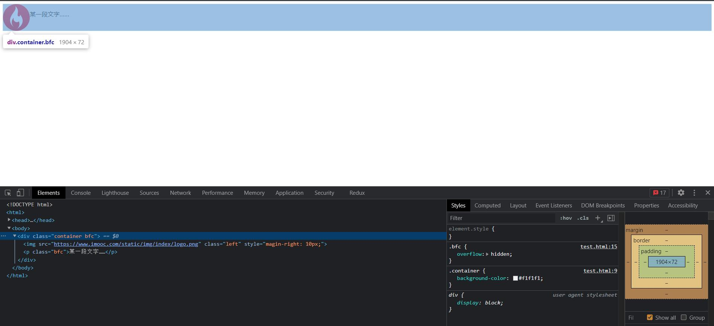

> float布局的问题，以及 clearfix

**圣杯布局和双飞翼布局的目的：**

- 三栏布局，中间一栏最先加载和渲染（内容最重要）

- 两侧内容固定，中间内容随着宽度自适应
- 一般用于 PC 网页

**圣杯布局和双飞翼布局的技术总结：**

- 使用 float 布局
- 两侧使用 margin 负值，以便和中间内容横向重叠
- 防止中间内容被两侧覆盖，一个用 padding，一个用 margin。

**圣杯布局**

```html
<!DOCTYPE html>
<html>
<head>
    <meta charset="UTF-8">
    <meta name="viewport" content="width=device-width, initial-scale=1.0">
    <meta http-equiv="X-UA-Compatible" content="ie=edge">
    <title>圣杯布局</title>
    <style type="text/css">
        body {
            /* 此处的最小宽度要设置为 三个子盒子 宽度之和 */
            min-width: 550px;
        }
        #header {
            text-align: center;
            background-color: #f1f1f1;
        }

        #container {
            padding-left: 200px;
            padding-right: 150px;
        }
        #container .column {
            float: left;
        }

        #center {
            background-color: #ccc;
            width: 100%;
        }
        #left {
            position: relative;
            background-color: yellow;
            width: 200px;
            /* 设置值 margin-left 为 -100% ,则盒子会向左移动至父元素宽度的距离，从而会移动到父元素开头的位置 */
            /* 然后再设置 相对定位，将 right 的值与 父元素 padding-left 的值设为相同值，则会将盒子移动到网页左边 */
            margin-left: -100%;
            right: 200px;
        }
        #right {
            background-color: red;
            width: 150px;
            /* 设置 margin-right 为-150px，及width的值，于是便可以将其看做盒子相对于外界而言没有了宽度，此时就不占地方了，就会上去 */
            margin-right: -150px;
        }

        #footer {
            text-align: center;
            background-color: #f1f1f1;
        }

        /* 手写 clearfix */
        .clearfix:after {
            content: '';
            display: table;
            clear: both;
        }
    </style>
</head>
<body>
    <div id="header">this is header</div>
    <div id="container" class="clearfix">
        <div id="center" class="column">this is center</div>
        <div id="left" class="column">this is left</div>
        <div id="right" class="column">this is right</div>
    </div>
    <div id="footer">this is footer</div>
</body>
</html>
```

**结果：**

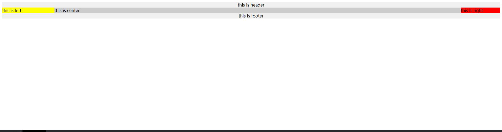

**双飞翼布局**

```html
<!DOCTYPE html>
<html>
<head>
    <meta charset="UTF-8">
    <meta name="viewport" content="width=device-width, initial-scale=1.0">
    <meta http-equiv="X-UA-Compatible" content="ie=edge">
    <title>双飞翼布局</title>
    <!-- 双飞翼布局中 right 要使用 margin-left 的原因：父元素不像圣杯布局那样，有用padding空出一块恰好为 right 宽度的容器 -->
    <style type="text/css">
        body {
            min-width: 550px;
        }
        .col {
            float: left;
        }

        #main {
            width: 100%;
            height: 200px;
            background-color: #ccc;
        }
        #main-wrap {
            margin: 0 190px 0 190px;
        }

        #left {
            width: 190px;
            height: 200px;
            background-color: #0000FF;
            margin-left: -100%;
        }
        #right {
            width: 190px;
            height: 200px;
            background-color: #FF0000;
            margin-left: -190px;
        }
    </style>
</head>
<body>
    <div id="main" class="col">
        <div id="main-wrap">
            this is main
        </div>
    </div>
    <div id="left" class="col">
        this is left
    </div>
    <div id="right" class="col">
        this is right
    </div>
</body>
</html>
```

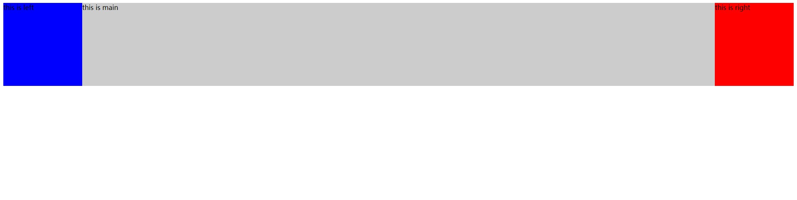

> flex 画色子

常用语法回顾：

- flex-direction
- justify-content
- align-items
- flex-wrap
- align-self

[align-items、align-self、align-content的区别](https://blog.csdn.net/loisandyu/article/details/88120070)

```html
<!DOCTYPE html>
<html>
<head>
    <meta charset="UTF-8">
    <meta name="viewport" content="width=device-width, initial-scale=1.0">
    <meta http-equiv="X-UA-Compatible" content="ie=edge">
    <title>flex 画骰子</title>
    <style type="text/css">
        .box {
            width: 200px;
            height: 200px;
            border: 2px solid #ccc;
            border-radius: 10px;
            padding: 20px;

            display: flex;
            justify-content: space-between;
        }
        .item{
            display: inline-block;
            width: 20px;
            height: 20px;
            border-radius: 50%;
            background-color: rgb(8, 27, 27);
        }
        .item:nth-child(2){
            align-self: center;
        }
        .item:nth-child(3){
            align-self:flex-end;
        }
    </style>
</head>
<body>
    <div class="box">
        <span class="item"></span>
        <span class="item"></span>
        <span class="item"></span>
    </div>
</body>
</html>
```

**结果：**


#### 定位

> absolute 和 relative 分别依据什么定位？

- relative 依据自身定位
- absolute 依据最近一层的定位元素定位
  - 定位元素：absolute、relative、fixed  |  body

> 居中对齐有哪些实现方式？

- 水平居中
  - inline 元素：text-align:center
  - block 元素：margin:auto
  - absolute 元素：left:50% + margin-left 负值

```html
<!DOCTYPE html>
<html>
<head>
    <meta charset="UTF-8">
    <meta name="viewport" content="width=device-width, initial-scale=1.0">
    <meta http-equiv="X-UA-Compatible" content="ie=edge">
    <title>水平对齐</title>
    <style type="text/css">
        .container {
            border: 1px solid #ccc;
            margin: 10px;
            padding: 10px;
        }
        .item {
            background-color: #ccc;
        }

        .container-1 {
            text-align: center;
        }

        .container-2 .item {
            width: 500px;
            margin: auto;
        }

        .container-3 {
            position: relative;
            height: 100px;
        }
        .container-3 .item {
            width: 300px;
            height: 100px;
            position: absolute;
            left: 50%;
            margin-left: -150px;
        }
    </style>
</head>
<body>
    <div class="container container-1">
        <span>一段文字</span>
    </div>

    <div class="container container-2">
        <div class="item">
            this is block item
        </div>
    </div>

    <div class="container container-3">
        <div class="item">
            this is absolute item
        </div>
    </div>
</body>
</html>
```

**结果：**
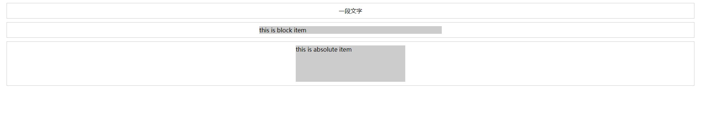

- 垂直居中
  - inline 元素：line-height 的值等于 height 值
  - absolute 元素：top:50% + margin-top 负值
  - absolute 元素：transform(-50%, -50%)
  - absolute 元素：top、left、bottom、right =0 + margin:auto

```html
<!DOCTYPE html>
<html>
<head>
    <meta charset="UTF-8">
    <meta name="viewport" content="width=device-width, initial-scale=1.0">
    <meta http-equiv="X-UA-Compatible" content="ie=edge">
    <title>垂直对齐</title>
    <style type="text/css">
        .container {
            border: 1px solid #ccc;
            margin: 10px;
            padding: 10px;
            height: 200px;
        }
        .item {
            background-color: #ccc;
        }

        .container-1{
            text-align: center;
            line-height: 200px;
            height: 200px;
        }

        .container-2 {
            position: relative;
        }

        /* 此种情况下必须先知道 item 的尺寸 */
        .container-2 .item {
            width: 300px;
            height: 100px;
            position: absolute;
            left: 50%;
            margin-left: -150px;
            top: 50%;
            margin-top: -50px;
        }

        .container-3 {
            position: relative;
        }
        .container-3 .item {
            width: 200px;
            height: 80px;
            position: absolute;
            left: 50%;
            top: 50%;
            transform: translate(-50%, -50%)
        }

        .container-4 {
            position: relative;
        }
        .container-4 .item {
            width: 100px;
            height: 50px;
            position: absolute;
            top: 0;
            left: 0;
            bottom: 0;
            right: 0;
            margin: auto;
        }
    </style>
</head>
<body>
    <div class="container container-1">
        <span>一段文字</span>
    </div>

    <div class="container container-2">
        <div class="item">
            this is item
        </div>
    </div>

    <div class="container container-3">
        <div class="item">
            this is item
        </div>
    </div>

    <div class="container container-4">
        <div class="item">
            this is item
        </div>
    </div>
</body>
</html>
```

**结果：**


#### 图文样式

> line-height 的继承问题

**line-height 如何继承**

- 写具体数值，如 30px，则继承该值（比较好理解）

```html
<!DOCTYPE html>
<html>
<head>
    <meta charset="UTF-8">
    <meta name="viewport" content="width=device-width, initial-scale=1.0">
    <meta http-equiv="X-UA-Compatible" content="ie=edge">
    <title>line-height 继承问题</title>
    <style type="text/css">
        body {
            font-size: 20px;
            line-height: 30px;
        }
        p {
            background-color: #ccc;
            font-size: 16px;
        }
    </style>
</head>
<body>
    <p>这是一行文字</p>
</body>
</html>
```

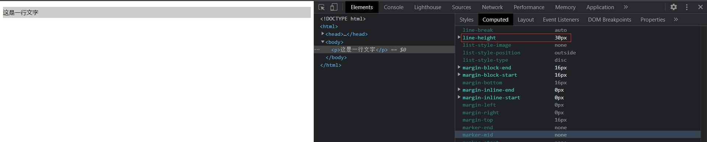

- 写比例，如 2 / 1.5，则继承该比例（比较好理解）

```html
<!DOCTYPE html>
<html>
<head>
    <meta charset="UTF-8">
    <meta name="viewport" content="width=device-width, initial-scale=1.0">
    <meta http-equiv="X-UA-Compatible" content="ie=edge">
    <title>line-height 继承问题</title>
    <style type="text/css">
        body {
            font-size: 20px;
            line-height: 1.5;
        }
        p {
            background-color: #ccc;
            font-size: 16px;
        }
    </style>
</head>
<body>
    <p>这是一行文字</p>
</body>
</html>
```

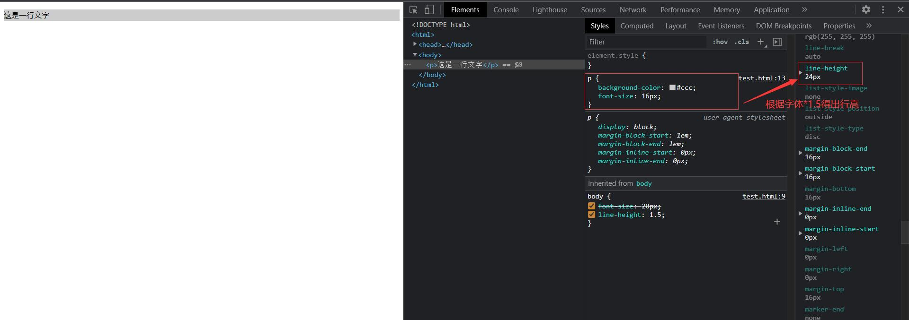

- 写百分比，如 200% ，则继承计算出来的值（**考点**）

```html
<!DOCTYPE html>
<html>
<head>
    <meta charset="UTF-8">
    <meta name="viewport" content="width=device-width, initial-scale=1.0">
    <meta http-equiv="X-UA-Compatible" content="ie=edge">
    <title>line-height 继承问题</title>
    <style type="text/css">
        body {
            font-size: 20px;
            line-height: 200%;
        }
        p {
            background-color: #ccc;
            font-size: 16px;
        }
    </style>
</head>
<body>
    <p>这是一行文字</p>
</body>
</html>
```


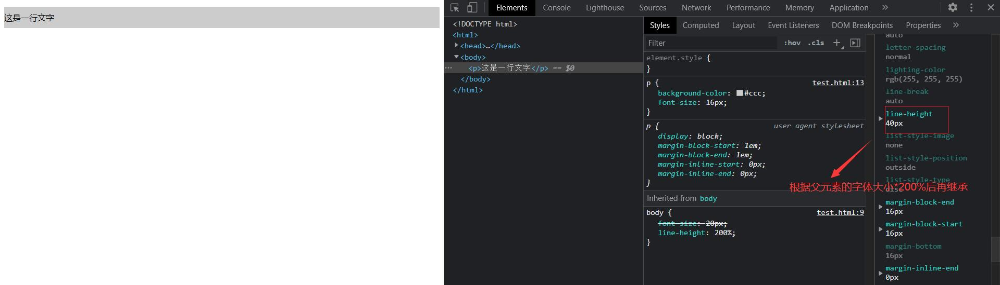

#### 响应式

> rem 是什么？

rem是一个长度单位

- px，绝对长度单位，最常用
- em，相对长度单位，相对于父元素，不常用
- rem，相对长度单位，相对于根元素，常用于响应式布局

> 如何实现响应式？（通过rem）

- media-query，根据不同的屏幕宽度设置根元素 font-size
- rem，基于根元素的相对单位。

```html
<!DOCTYPE html>
<html>
<head>
    <meta charset="UTF-8">
    <meta name="viewport" content="width=device-width, initial-scale=1.0">
    <meta http-equiv="X-UA-Compatible" content="ie=edge">
    <title>响应式布局</title>
    <style type="text/css">
        @media only screen and (max-width: 374px) {
            /* iphone5 或者更小的尺寸，以 iphone5 的宽度（320px）比例设置 font-size */
            html {
                font-size: 86px;    /* 此处的 86px 是通过 100 / (375/320) 得到的 */
            }
        }
        @media only screen and (min-width: 375px) and (max-width: 413px) {
            /* iphone6/7/8 和 iphone x */
            html {
                font-size: 100px;
            }
        }
        @media only screen and (min-width: 414px) {
            /* iphone6p 或者更大的尺寸，以 iphone6p 的宽度（414px）比例设置 font-size */
            html {
                font-size: 110px;
            }
        }

        body {
            font-size: 0.16rem;
        }
        #div1 {
            width: 1rem;
            background-color: #ccc;
        }

    </style>
</head>
<body>
    <div id="div1">
        this is div
    </div>
</body>
</html>
```

> 响应式 -vw/vh

- rem 的弊端

  - “阶梯”性

  字体是按台阶性的一节一节变化，无法精确到界面一变化字体大小就变化。

  ```css
  @media only screen and (max-width: 374px) {
      /* iphone5 或者更小的尺寸，以 iphone5 的宽度（320px）比例设置 font-size */
      html {
          font-size: 86px;    /* 此处的 86px 是通过 100 / (375/320) 得到的 */
      }
  }
  @media only screen and (min-width: 375px) and (max-width: 413px) {
      /* iphone6/7/8 和 iphone x */
      html {
          font-size: 100px;
      }
  }
  @media only screen and (min-width: 414px) {
      /* iphone6p 或者更大的尺寸，以 iphone6p 的宽度（414px）比例设置 font-size */
      html {
          font-size: 110px;
      }
  }
  ```

  

- 网页视口尺寸

  - window.screen.height  // 屏幕高度
  - window.innerHeight    // 网页视口高度(去掉浏览器头尾)，模拟器中 与 window.screen.height 相同
  - document.body.clientHeight    // body 高度

  

- vw/vh

  - vh 网页视口高度的 1 / 100
  - vw 网页视口宽度的 1 / 100
  - vmax 取两者最大值； vmin 取两者最小值

```html
<!DOCTYPE html>
<html lang="en">
<head>
    <meta charset="UTF-8">
    <meta name="viewport" content="width=device-width, initial-scale=1.0">
    <title>vw vh test</title>
    <style>
        body {
            margin: 0;
            padding: 0;
        }

        #container {
            background-color: red;
            width: 10vw;
            height: 10vh;
        }
    </style>
</head>
<body>
    <p>vw vh 测试</p>
    <div id="container">
    </div>
</body>
</html>
```

## JS 面试题

### 变量类型和计算

> typeof 能判断哪些类型

- 识别所有值类型

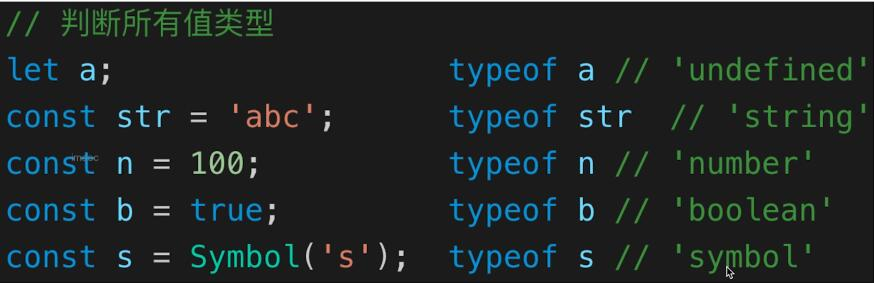

- 识别函数

  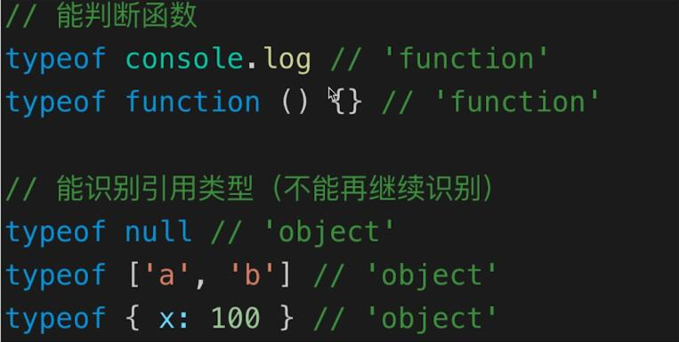

- 判断是否是引用类型（不可再细分）

> 何时使用 === 何时使用 ==

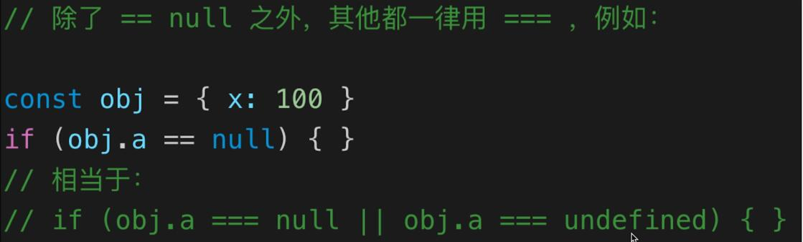

> 值类型和引用类型的区别

```javascript
// 值类型
let a = 100
let b = a
a = 200
console.log(b)  // 100
```

```javascript
// 引用类型
let a = { age: 20 }
let b = a
b.age = 21
console.log(a.age)  // 21
```

考虑到性能问题，值类型只有一个普通的值，不会占用很大的空间，所以可以将其存储到 **栈内存** 中，而引用类型由于可能会有很复杂的值，所以为其在栈中保存一个 地址，而把实际的值存储到 堆中，并将地址指向它。然后通过地址指向的方式，来获取值。

不过这也导致了，当使用引用类型进行赋值的时候，默认是浅拷贝（及只赋值地址）。

**常见值类型:**

undefined、string、number、boolean、symbol

**常见引用类型:**

对象、数组、null（特殊引用类型，指针指向为空地址）、函数（特殊引用类型，但不用于存储数据，所以没有拷贝、复制这一说法）

> 手写深拷贝

- 注意判断值类型和引用类型
- 注意判断是数组还是对象
- 递归

```javascript
const obj1 = {
    age: 20,
    name: 'xxx',
    address: {
        city: 'beijing'
    },
    arr: ['a', 'b', 'c']
}

const obj2 = deepClone(obj1)

obj2.address.city = 'shanghai'
console.log(obj1.address.city)

/**
 * 深拷贝
 * @param {Object} obj 要拷贝的对象
 */
function deepClone(obj = {}) {
    if (typeof obj !== 'object' || obj == null) {
        return obj
    }
    let result
    if (obj instanceof Array) {
        result = []
    } else {
        result = {}
    }
    for (let key in obj) {
        if (obj.hasOwnProperty(key)) {
            result[key] = deepClone(obj[key])
        }
    }
    return result
}
```

> 变量计算 - 类型转换

- 字符串拼接

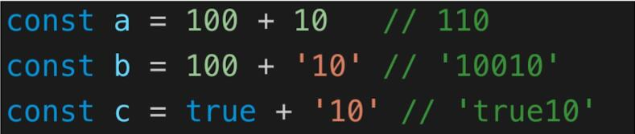

- ==

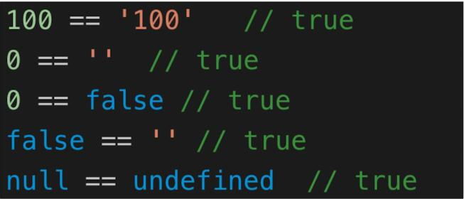

- if 语句 和 逻辑运算

  if 语句 和逻辑运算都是通过判断变量 为 truly 还是 falsely 变量来进行判断的

  - truly 变量： !!a === true 的变量
  - falsely 变量： !!a === false 的变量

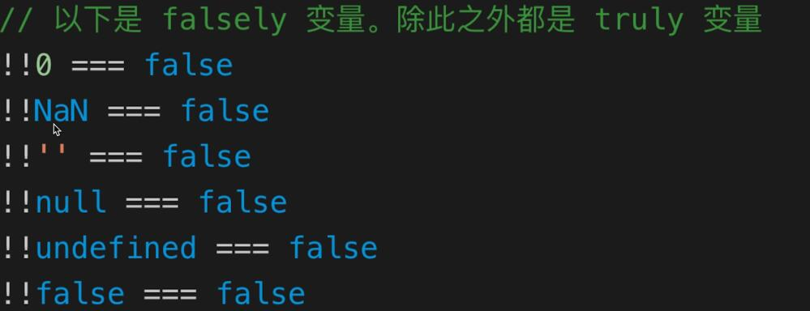

**首先来看if 语句：**

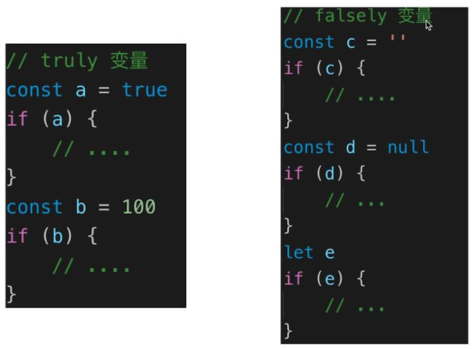

**然后是逻辑判断：**

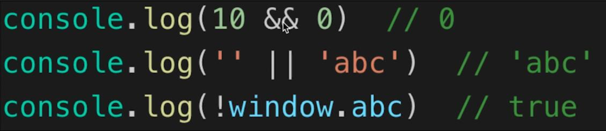

### 原型和原型链

JS本身是基于原型继承的语言

#### 如何用 class 实现继承

- extends
- super
- 扩展或重写方法

```javascript
// 父类
class People {
    constructor(name) {
        this.name = name
    }
    eat() {
        console.log(`${this.name} eat something`)
    }
}

// 子类
class Student extends People {
    constructor(name, number) {
        super(name)
        this.number = number
    }
    sayHi() {
        console.log(`姓名 ${this.name} 学号 ${this.number}`)
    }
}

// 子类
class Teacher extends People {
    constructor(name, major) {
        super(name)
        this.major = major
    }
    teach() {
        console.log(`${this.name} 教授 ${this.major}`)
    }
}

// 实例
const xialuo = new Student('夏洛', 100)
console.log(xialuo.name)
console.log(xialuo.number)
xialuo.sayHi()
xialuo.eat()

// 实例
const wanglaoshi = new Teacher('王老师', '语文')
console.log(wanglaoshi.name)
console.log(wanglaoshi.major)
wanglaoshi.teach()
wanglaoshi.eat()
```

#### instanceof 是基于原型链实现的

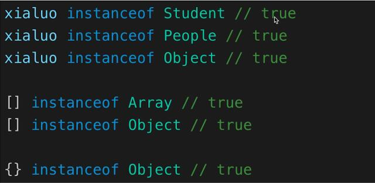

**显示原型与隐式原型：**

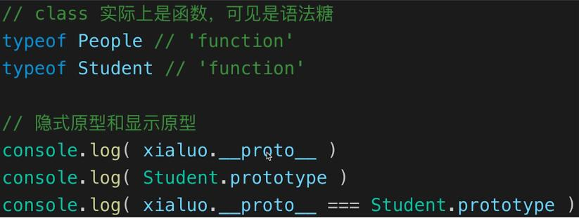

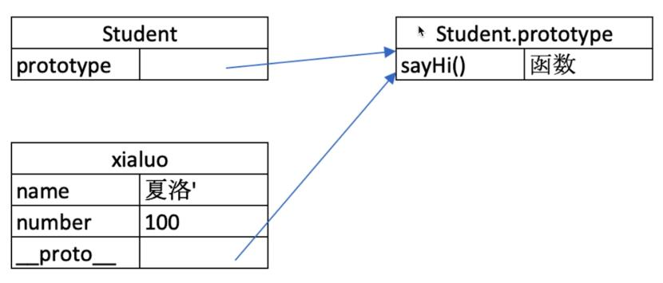

- 每个 class 都有显示原型 prototype
- 每个实例都有隐式原型 `__proto__`
- 实例的 `__proto__` 指向对应 class 的 `prototype`

> 基于原型的执行规则

- 获取属性 xialuo.name 或执行方法 xialuo.sayhi() 时
- 先在自身属性和方法寻找
- 如果找不到则自动去 `__proto__` 中查找，而 `__proto__` 指向了 构造函数/类 的显示原型，类中定义的方法就存储在了其 显示原型中。

**原型链**

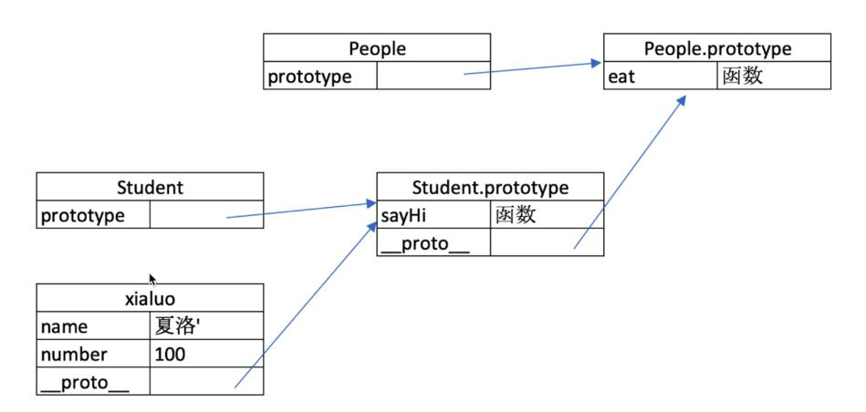

`People.prototype === Student.prototype.__proto__`		=>  true

`xialuo.hasOwnProperty('name')`   => true

`xialuo.hasOwnProperty('sayHi')`   => false  （因为 sayHi 是通过原型链查找到的，而不是其自己的属性）

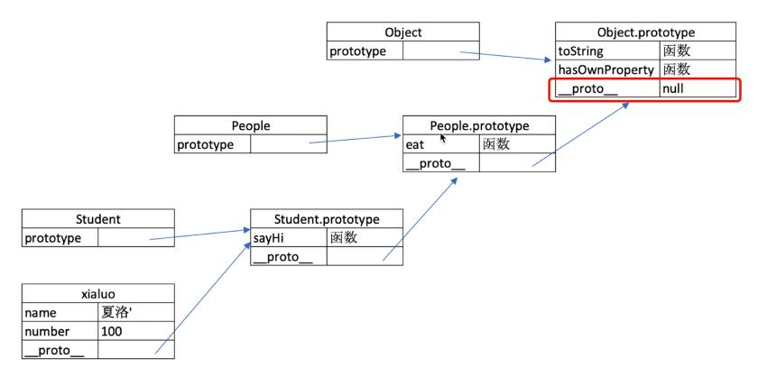

instanceof 的本质是查找 instanceof 后面的对象的显示原型是否在 instanceof 前面的对象的原型链上。


> 如何准确判断一个变量是不是数组？

- a instanceof Array

> 手写一个简易的 jQuery，考虑插件和扩展性

```javascript
class jQuery {
    constructor(selector) {
        const result = document.querySelectorAll(selector)
        const length = result.length
        for (let i = 0; i < length; i++) {
            this[i] = result[i]
        }
        this.length = length
        this.selector = selector
    }
    /*
    	获取第几个 dom 元素
    */
    get(index) {
        return this[index]
    }
    /*
    	遍历 dom 元素，并将其作为参数执行传入的方法
    */
    each(fn) {
        for (let i = 0; i < this.length; i++) {
            const elem = this[i]
            fn(elem)
        }
    }
    /*
    	调用上方的 each 方法，为每一个 dom 元素绑定事件
    */
    on(type, fn) {
        return this.each(elem => {
            elem.addEventListener(type, fn, false)
        })
    }
    // 扩展很多 DOM API
}

// 插件
jQuery.prototype.dialog = function (info) {
    alert(info)
}

// “造轮子”
class myJQuery extends jQuery {
    constructor(selector) {
        super(selector)
    }
    // 扩展自己的方法
    addClass(className) {

    }
    style(data) {
        
    }
}

const $p = new jQuery('p')
$p.get(1)
$p.each((elem) => console.log(elem.nodeName))
$p.on('click', () => alert('clicked'))
```


### 作用域和闭包

####  什么是作用域？什么是自由变量？

**作用域**指 变量能够使用的范围，超出这个范围使用变量就会报错。

**作用域**分为：

- 全局作用域
- 函数作用域
- 块级作用域（ES6新增）

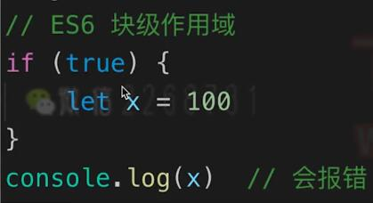

**自由变量**

- 一个变量在当前作用域没有定义，但被使用了。
- 此时会向上级作用域，一层一层依次寻找，直到找到为止。
- 下图中的 a、a1、a2 即为自由变量。

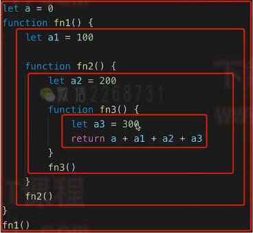

#### 什么是闭包？闭包会用在哪里？

闭包是作用域应用的特殊情况，有两种表现：

- 函数作为参数被传递
- 函数作为返回值被返回

```javascript
function create() {
    const a = 100
    return function () {
        console.log(a)
    }
}

const fn = create()
const a = 200
fn()    // 100
```

```javascript
function print(fn) {
    const a = 200
    fn()
}

const a = 100
function fn() {
    console.log(a)
}
print(fn)   // 100
```

<div class="danger">

> 所有的自由变量的查找，是在函数定义的地方，向上级作用域查找，不是在执行的地方！！

</div>

#### this 有几种赋值情况？

<div class="warning">

> this 取什么值，是在函数执行的时候确定的，不是在函数定义的时候确定的！！

</div>


- 作为 普通函数 去调用	this 指向 window
- 使用 call apply bind 去调用   this 执行 call apply bind 传递的参数
- 作为对象方法被调用     this 指向当前对象
- 在 class 方法中调用     this 指向当前实例
- 箭头函数  this 为外层作用域的 this

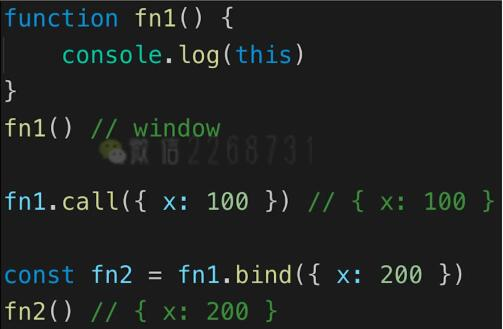

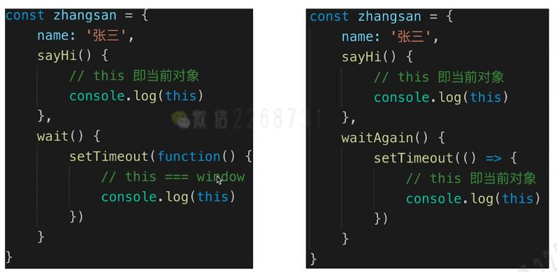

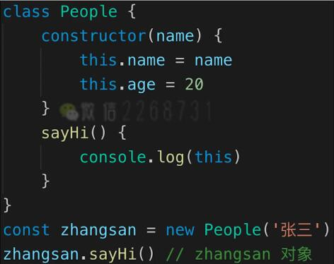

> 手写 bind 函数

```javascript
Function.prototype.bind1 = function () {
    // 将参数拆解为数组
    const args = Array.prototype.slice.call(arguments)

    // 获取 this（数组第一项）
    const t = args.shift()  // shift 会将数组的第一项挖出，使得数组只剩下后面几项（会改变原数组）

    // fn1.bind(...) 中的 fn1
    const self = this

    return function () {
        return self.apply(t, args)
    }
}

function fn1(a, b, c) {
    console.log('this', this)
    console.log(a, b, b)
}

const fn2 = fn1.bind1({ x: 100 }, 10, 20, 30)
const res = fn2()
```

[伪数组转为真数组的几种方式](https://www.cnblogs.com/padding1015/p/10106957.html)

> 实际开发中闭包的应用

```javascript
// 闭包隐藏数据，只提供API
function createCache() {
    const data = {}     // 闭包中的数据，被隐藏，不被外界访问
    return {
        set: function (key, val) {
            data[key] = val
        },
        get: function (key) {
            return data[key]
        }
    }
}

const c = createCache()
c.set('a', 100)
console.log(c.get('a'))
```

> 实现创建 10 个 a标签，点击后弹出对应数字

```javascript
let i, a
for (i = 0; i < 10; i++) {
    a = document.createElement('a')
    a.innerHTML = i + '<br>'
    a.addEventListener('click', function (e) {
        e.preventDefault()
        alert(i)
    })
    document.body.appendChild(a)
}
```

---> 此种情况下，当我们点击 a 标签时，`alert(i)` 得到的都是 10。因为 a 标签添加成功后，事件还未执行，而此时的 i 已经变为了 10。

```javascript
let  a
for (let i = 0; i < 10; i++) {
    a = document.createElement('a')
    a.innerHTML = i + '<br>'
    a.addEventListener('click', function (e) {
        e.preventDefault()
        alert(i)
    })
    document.body.appendChild(a)
}
```

---> 而当我们将 i 定义在 for 循环中时，每次循环会形成一个独立的块级作用域来保存i，一旦点击，获取的 i 为块级作用域里的 i。

### 异步和单线程

- **JS 是单线程语言，只能同时做一件事**

- 浏览器 和 nodejs 以支持 JS 启动 **进程**，如 Web Worker

- JS 和 DOM 渲染共用同一个线程，因为 JS 可修改 DOM 结构

- 遇到等待（网络请求、定时任务）不能卡住，所以需要异步，异步是通过回调 **callback** 函数形式来调用的

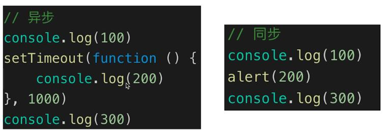

- 异步不会阻塞代码执行，同步会阻塞代码执行

**应用场景**

- 网络请求，如 ajax 图片加载
- 定时任务，如 setTimeout 

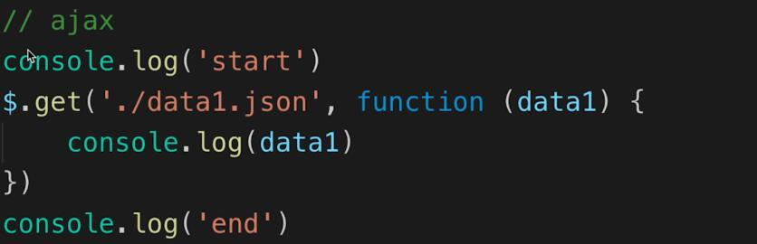

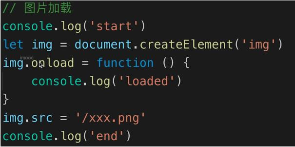

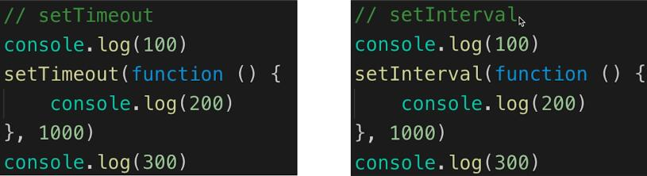

#### Promise 的基本使用

**回调地狱：**

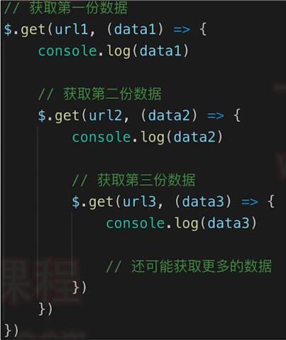

**使用Promise解决回调地狱：**
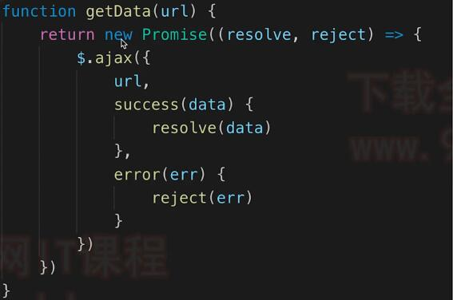

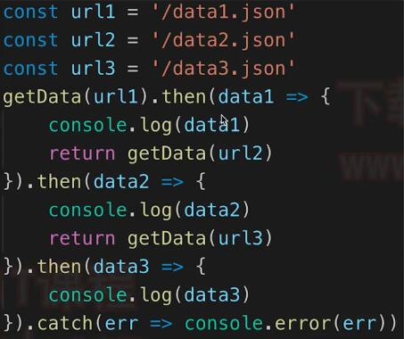

#### JS异步相关面试题

> 手写用 Promise 加载一张图片

```javascript
const url = "https://cdn.jsdelivr.net/gh/xxc-yqxz/xxc-yqxz.github.io/images/avatar.jpg"
const url2 = "https://img4.kuwo.cn/star/starheads/500/78/84/970166557.jpg"

function loadImg(src) {
    return new Promise(
        (resolve, reject) => {
            const img = document.createElement('img')
            img.onload = () => {
                resolve(img)
            }
            img.onerror = () => {
                reject(new Error(`图片加载失败 ${src}`))
            }
            img.src = src
        }
    )
}

loadImg(url).then(img => {
    console.log(img.width)
    return img
}).then(img => {
    console.log(img.height)
    return loadImg(url2)    // 当返回一个 promise 对象时，.then的第一个参数函数 接收到的为 promise 对象中 resolve 的值
}).then(img2 => {
    console.log(img2.width)
    return img2
}).catch(ex => console.error(ex))
```

### JS 异步进阶

#### 什么是event loop

- JS是单线程运行的，异步要基于 回调来实现，而 **event loop** 就是异步回调的实现原理

**JS如何执行？**

- 从前到后，一行一行执行
- 如果某一行执行报错，则停止下面代码的执行
- 先把同步代码执行完，再执行异步

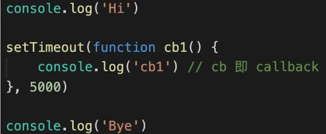

#### event loop 的执行过程

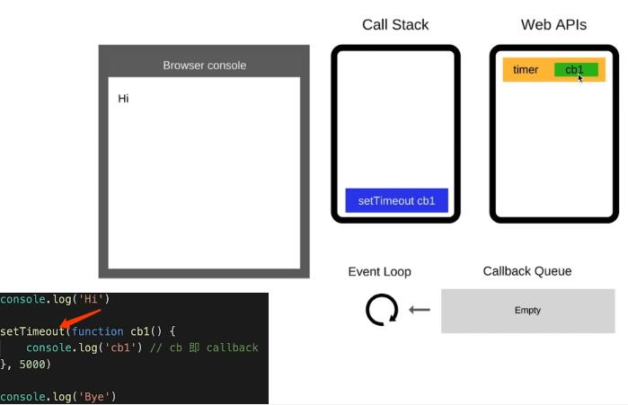

首先输出 Hi，然后运行到 setTimeout，发现其是浏览器Web APIs 定义的，所以将其中的回调函数放到了一个定时器中，时间设为 5s，然后放到 Web APIs 中，等5s 过后将 **cb1** 加入到 回调队列（Callback Queue）中。

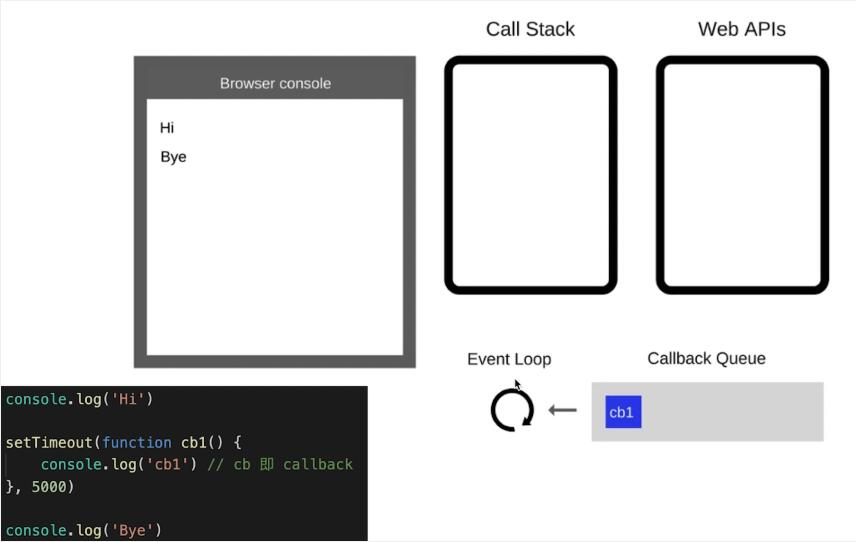

然后输出 Bye，等过了 5s 后，将 cb1 加入到 Callback Queue

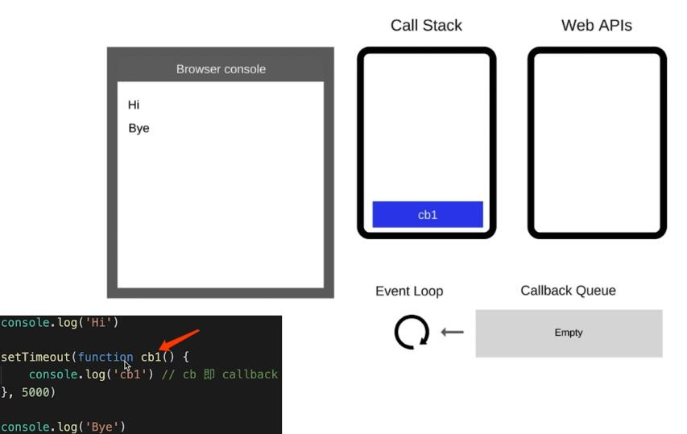

此时 Event Loop 发现 Callback Queue 中有任务，便立即将其加入到 **Call Stack** 中。

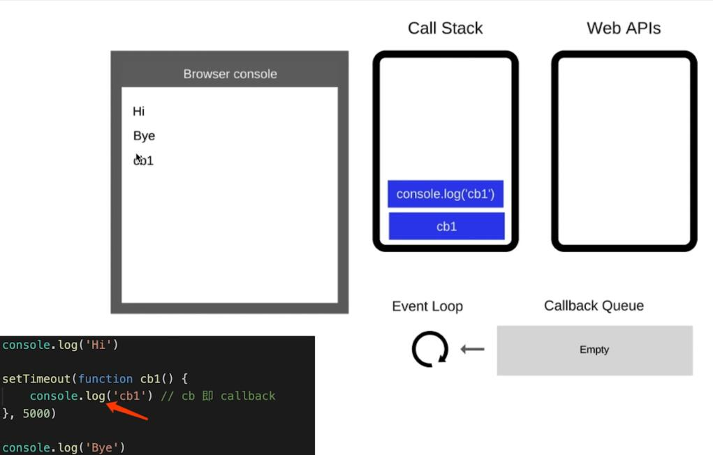

然后cb1 执行，发现其内部有输出语句，将输出语句加入到 Call Stack

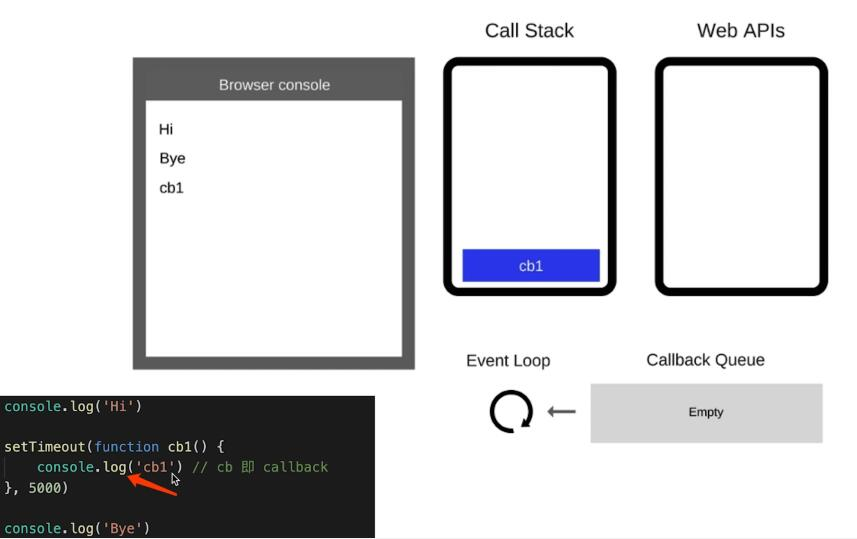

然后执行 console 语句，执行成功后将其从 Call Stack 中清除

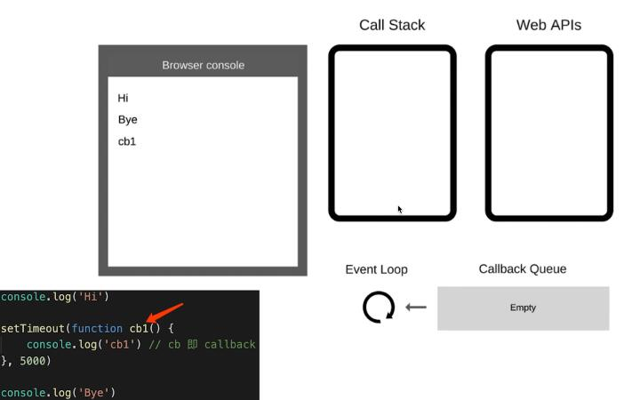

然后发现 cb1() 函数执行完，将其从 Call Stack 中清除。

**总结：**

- 同步代码，一行一行放在 Call Stack 中执行
- 遇到异步，会先 “记录”下，等待时机（定时、网络请求等）
- 时机到了，就移动到 Callback Queue
- 如 Call Stack 为空（即同步代码执行完）Event Loop 开始工作
- 轮询查找 Callback Queue，如有则移动到 Call Stack 执行。
- 然后继续轮询查找。

#### DOM事件和event loop的关系

- DOM 事件也使用回调，基于 event loop。

- 什么时候用户触发了DOM事件了，什么时候触发回调。
- **DOM 事件不是异步**(setTimeout，ajax 等)，只是两者都是基于 event loop 实现的。

#### Promise有哪三种状态

- pending、fullfilled、rejected

- 变化情况：pending -> resolved 或者 pending -> rejected。

- 变化不可逆

```javascript
const p1 = new Promise((resolve, reject) => {

})
console.log('p1', p1)   // pending

const p2 = new Promise((resolve, reject) => {
    setTimeout(() => {
        resolve()
    })
})
console.log('p2', p2)   // 一开始打印时为 pending，点击查看可以看到变为了 fullfilled
setTimeout(() => console.log('p2-setTimeout', p2))  // fullfilled

const p3 = new Promise((resolve, reject) => {
    setTimeout(() => {
        reject()
    })
})
console.log('p3', p3)  // 一开始打印时为 pending，点击查看可以看到变为了 rejected
setTimeout(() => console.log('p3-setTimeout', p3))  // rejected
```

- 状态的表现
  - pending 状态，不会触发 then 和 catch
  - fullfilled 状态，会触发后续的 then 回调函数
  - rejected 状态，会触发后续的 catch 回调函数

```javascript
const p1 = Promise.resolve(100)
console.log('p1', p1)       // fullfilled 
p1.then(data => {
    console.log('data', data)   // 只会触发这个回调
}).catch(err => {
    console.log('err', err)
})

const p2 = Promise.reject('err')
console.log('p2', p2)       // rejected
p2.then(data => {
    console.log('data', data)
}).catch(err => {
    console.log('err', err)     // 只会触发这个回调
})
```

####  Promise的then和catch如何影响状态的变化

- then 正常返回 resolved，里面有报错则返回 rejected

```javascript
const p1 = Promise.resolve().then(() => {
    return 100      // 返回一个 fullfilled 状态的 promise
})
// console.log('p1', p1)   // 由于使用了 .then() ，一开始为 pending，点击查看后，可以看到为 fullfilled
p1.then(() => {
    console.log('123')  // fullfilled 触发后续的 then 回调，所以这行会输出
})


const p2 = Promise.resolve().then(() => {
    throw new Error('then error')   // 返回一个 rejected 状态的 promise
})
p2.then(() => {
    console.log('456')
}).catch(err => {
    console.log('err', err) // rejected 触发后续的 catch 回调，所以只有这行会输出
})
// console.log('p2', p2)   // 由于使用了 .then() ，一开始为 pending，点击查看后，可以看到为 rejected
```


- catch 正常返回 resolved，里面有报错则返回 rejected

```javascript
const p3 = Promise.reject('my error').catch(err => {
    console.log(err)
})

console.log('p3', p3)  // 此处的 p3 是 fullfilled 状态的 Promise，触发 then 回调

p3.then(() => {
    console.log(100)    // 此处输出
})

const p4 = Promise.reject('my error').catch(err => {
    throw new Error('catch err')
})

console.log('p4', p4)   // 此处的 p3 是 rejected 状态的 Promise，触发 catch 回调

const p5 = p4.then(() => {
    console.log(200)
}).catch(() => {
    console.log('some error')       // 此处输出
})

console.log(p5)     // 此处的 p5 为 resolved 状态的Promise
```

#### Promise关于then和catch的面试题 

```javascript
// 第一题
Promise.resolve().then(() => {
    console.log(1)
}).catch(() => {
    console.log(2)
}).then(() => {
    console.log(3)
})
// 1 3

// 第二题
Promise.resolve().then(() => {
    console.log(1)
    throw new Error('erro1')
}).catch(() => {
    console.log(2)
}).then(() => {
    console.log(3)
})
// 1 2 3

// 第三题
Promise.resolve().then(() => {
    console.log(1)
    throw new Error('erro1')
}).catch(() => {
    console.log(2)
}).catch(() => { // 注意这里是 catch
    console.log(3)
})
// 1 2
```

#### async-await语法介绍

- Promise then catch 通过链式调用解决了回调地狱的问题，但基于回调函数
- async/await 是同步语法，彻底消灭了回调函数

```javascript
function loadImg(src) {
    const promise = new Promise((resolve, reject) => {
        const img = document.createElement('img')
        img.onload = () => {
            resolve(img)
        }
        img.onerror = () => {
            reject(new Error(`图片加载失败 ${src}`))
        }
        img.src = src
    })
    return promise
}

async function loadImg1() {
    const src1 = 'http://www.imooc.com/static/img/index/logo_new.png'
    const img1 = await loadImg(src1)
    return img1
}

async function loadImg2() {
    const src2 = 'https://avatars3.githubusercontent.com/u/9583120'
    const img2 = await loadImg(src2)
    return img2
}

!(async function () {
    // 注意：await 必须放在 async 函数中，否则会报错
    try {
        // 加载第一张图片
        const img1 = await loadImg1()	// await 后既可以放 async 函数，也可以放 Promise
        console.log(img1)
        // 加载第二张图片
        const img2 = await loadImg2()
        console.log(img2)
    } catch (ex) {
        console.error(ex)
    }
})()
```

#### async/await和Promise有什么关系

- async/await 是消灭异步回调的终极武器，但和 Promise 并不互斥，反而，两者相辅相成
- 执行 async 函数，返回的是Promise 对象，await 相当于 Promise 的 then

```javascript
async function fn1() {
    // return 100   // 相当于 return Promise.resolve(100)
    return Promise.resolve(200)
}

const res1 = fn1()  // 执行 async 函数，返回的是一个 Promise 对象

console.log('res1', res1)   // Promise 对象
res1.then(data => {
    console.log('data', data)   // 100
})
```

```javascript
async function fn1() {
    // return 100   // 相当于 return Promise.resolve(100)
    return Promise.resolve(200)
}
!(async function () {
    const p1 = Promise.resolve(300)
    const data = await p1   // await 相当于 Promise.then
    console.log('data', data)   // 300
})()

!(async function () {
    const data1 = await 400 // await Promise.resolve(400).then
    console.log('data1', data1)     // 400
})()

!(async function () {
    const data2 = await fn1()
    console.log('data2', data2)
})
```


- try...catch 可捕获异常，代替了 Promise 的catch。

```javascript
!(async function () {
    const p4 = Promise.reject('err1')    // rejected 状态
    try {
        const res = await p4
        console.log(res)
    } catch (error) {
        console.log(error)  // try...catch 相当于 promise catch
    }
})()

!(async function () {
    const p4 = Promise.reject('err1')   // rejected 状态
    const res = await p4    // await 相当于 then
    console.log(res)    // 此处不会执行，而是直接报错
})()
```

#### async-await是语法糖，异步的本质还是回调函数

- async/await 是消灭异步回调的终极武器，但 JS 还是单线程，还是得有异步，还是得基于 event loop
- async/await 只是一个语法糖

```javascript
async function async1() {
    console.log('async1 start') // 2
    await async2()
    // await 的后面，都可以看做是 callback 里的内容，即异步
    // 类似 , event loop ，setTimeout(cb1)
    // setTimeout(function(){console.log('async1 end')})
    // Promise.resolve().then(() => {console.log('async1 end')})
    console.log('async1 end') // 5 关键在这一步，它相当于放在 callback 中，最后执行
}

async function async2() {
    console.log('async2')      // 3
}

console.log('script start')  // 1
async1()
console.log('script end')   // 4
```

```javascript
async function async1() {
    console.log('async1 start')  // 2
    await async2()

    // 下面三行都是异步回调 callback 的内容
    console.log('async1 end')   // 5
    await async3()
    console.log('async1 end 2') // 7
}

async function async2() {
    console.log('async2')  // 3
}

async function async3() {
    console.log('async3')   // 6
}

console.log('script start')  // 1
async1()
console.log('script end')   // 4
```

#### for-of的应用场景

- for ... in （以及 forEach for ） 是常规的同步遍历
- for ... of 常用于异步的遍历

```javascript
function muti(num) {
    return new Promise(resolve => {
        setTimeout(() => {
            resolve(num * num)
        }, 1000);
    })
}

const nums = [1, 2, 3]

// forEach  循环能够达成 过1秒后，将三项同时输出
nums.forEach(async (i) => {
    const res = await muti(i)
    console.log(res)
})

// for of 循环能够达成 过1秒后，先输出第一项，过1秒后输出第二项，再过1秒后输出第三项
!(async function () {
    for (let i of nums) {
        const res = await muti(i)
        console.log(res)
    }
})()
```

#### 什么是宏任务和微任务

- 宏任务：setTimeout、setInterval、Ajax、DOM 事件
- 微任务：Promise、async/await
- **微任务执行时机比宏任务要早**

```javascript
console.log(100)    // 1
// 宏任务
setTimeout(() => {
    console.log(200)    // 4
})
// 微任务
Promise.resolve().then(() => {
    console.log(300)    // 3
})
console.log(400)    // 2
```

####  event-loop和DOM渲染的关系

- JS 是单线程的，而且和 DOM 渲染共用一个线程。JS 执行的时候，得留一些时机供 DOM 渲染
- 下图中，如果 JS 按常理运行，虽然输出了 3，但是输出的时候我们并没看到 dom 被渲染到页面上

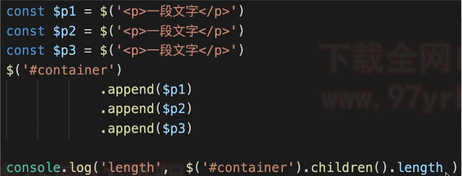

**event-loop 和 DOM渲染的关系**

调用栈空闲 及 每一个 轮询结束之后，都会尝试 DOM 渲染，然后再出触发下一次 Event Loop。

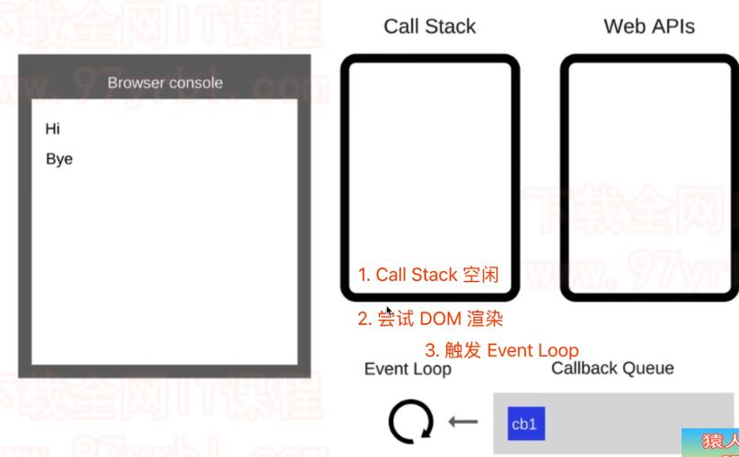

```javascript
const $p1 = $('<p>一段文字</p>')
const $p2 = $('<p>一段文字</p>')
const $p3 = $('<p>一段文字</p>')
$('#container')
    .append($p1)
    .append($p2)
    .append($p3)

console.log('length', $('#container').children().length)
alert('本次 call stack 结束，DOM 结构已更新，但尚未触发渲染')		// alert 可阻断同步代码执行
```

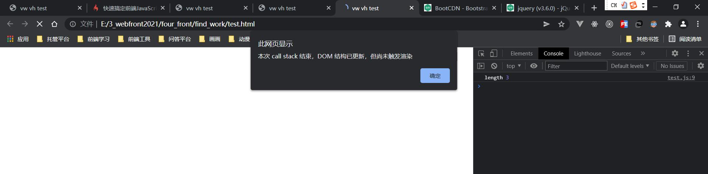

可以看到，当同步代码执行完后，DOM 结构虽然更新，但是尚未渲染到页面上

#### 为什么微任务比宏任务执行更早

**微任务和宏任务的区别：**

- 宏任务：DOM 渲染后触发，如 setTimeout
- 微任务：DOM 渲染前触发，如 Promise

```javascript
const $p1 = $('<p>一段文字</p>')
const $p2 = $('<p>一段文字</p>')
const $p3 = $('<p>一段文字</p>')
$('#container')
    .append($p1)
    .append($p2)
    .append($p3)

// 微任务：DOM 渲染前触发
Promise.resolve().then(() => {
    console.log('length1', $('#container').children().length)
    alert('Promise then')   // DOM渲染了吗？    -- no
})


// 宏任务：DOM 渲染后触发
setTimeout(() => {
    console.log('length2', $('#container').children().length)
    alert('setTimeout')   // DOM渲染了吗？      -- yes
})
```


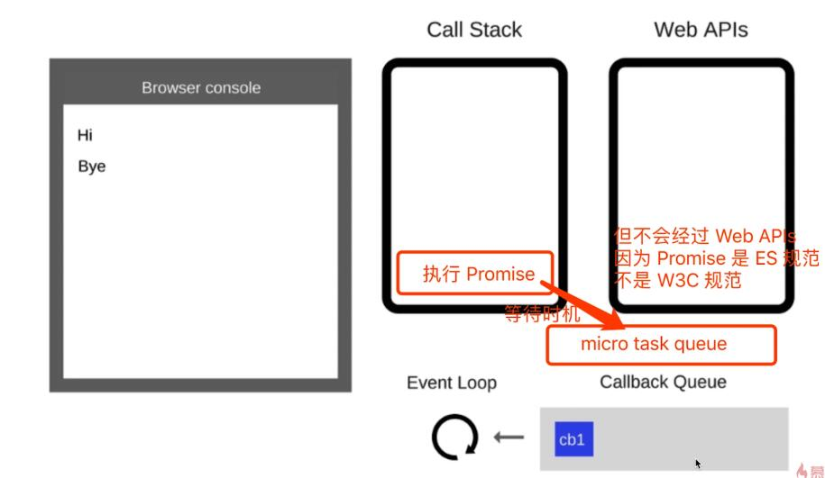

- 微任务是 ES6 语法规定的
- 宏任务是由浏览器规定的
- 所以微任务在执行时会被直接放入 **micro task queue** 中，而不会经过 Web APIS

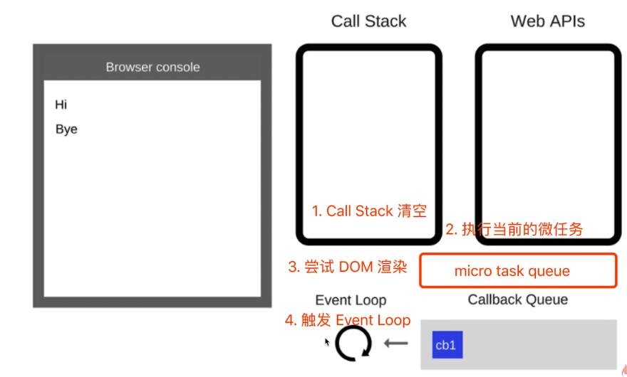

#### 解答JS异步的面试题 

```javascript
async function async1() {
    console.log('async1 start') // 2
    await async2() // 这一句会同步执行，返回 Promise ，其中的 `console.log('async2')` 也会同步执行
    console.log('async1 end') // 上面有 await ，下面就变成了“异步”，类似 cakkback 的功能（微任务）  // 6
}

async function async2() {
    console.log('async2')   // 3
}

console.log('script start') // 1

setTimeout(function () { // 异步，宏任务
    console.log('setTimeout')       // 8
}, 0)

async1()

// 初始化 promise 时，传入的函数会立即被执行
new Promise(function (resolve) { // 返回 Promise 之后，即同步执行完成，then 是异步代码
    console.log('promise1') // Promise 的函数体会立刻执行   // 4
    resolve()
}).then(function () { // 异步，微任务
    console.log('promise2')     // 7
})

console.log('script end')       // 5

// 同步代码执行完之后，屡一下现有的异步未执行的，按照顺序
// 1. async1 函数中 await 后面的内容 —— 微任务
// 2. setTimeout —— 宏任务
// 3. then —— 微任务
```

#### 手写 Promise 

待补....

### JS-Web-API-DOM

- JS 基础知识，规定语法（ECMA 262 标准）
- JS Web API，网页操作的 API （W3C 标准）：DOM、BOM、事件绑定、ajax、存储
- 前者是后者的基础，两者结合才能真正实际应用

#### DOM的本质是什么

**DOM（Document Object Model）**

通过 HTML 语言解析出来的一颗 **树**

#### DOM节点操作

getElementById、getElement**s**ByTagName、getElement**s**ByClassName、querySelector、querySelectorAll

```javascript
const div1 = document.getElementById('div1')
console.log('div1', div1)

const divList = document.getElementsByTagName('div') // 集合
console.log('divList.length', divList.length)
console.log('divList[1]', divList[1])

const containerList = document.getElementsByClassName('container') // 集合
console.log('containerList.length', containerList.length)
console.log('containerList[1]', containerList[1])

const pList = document.querySelectorAll('p')
console.log('pList', pList)
```

**property 和 attribute**

- property：修改对象属性，不会体现到 html 结构中
- attribute：修改 html 属性，会改变 html 结构
- 两者都有可能引起 DOM 重新渲染

```javascript
const pList = document.querySelectorAll('p')
const p1 = pList[0]

// property 形式(用 js 操作标签属性)
p1.style.width = '100px'
console.log(p1.style.width)     // 100px
p1.className = 'red'
console.log(p1.className)   // 注意此处为 className,不是 class
console.log(p1.nodeName)    // P
console.log(p1.nodeType) // 1

// attribute
p1.setAttribute('data-name', 'imooc')
console.log(p1.getAttribute('data-name'))
p1.setAttribute('style', 'font-size: 50px;')
console.log(p1.getAttribute('style'))
```

https://www.cnblogs.com/lmjZone/p/8760232.html


#### DOM结构操作

- 新增/插入结点
- 获取子节点列表，获取父节点
- 删除子节点

```html
<!DOCTYPE html>
<html lang="en">
    <head>
        <meta charset="UTF-8">
        <meta name="viewport" content="width=device-width, initial-scale=1.0">
        <meta http-equiv="X-UA-Compatible" content="ie=edge">
        <title>dom 演示</title>

        <style>
            .container {
                border: 1px solid #ccc;
            }
            .red {
                color: red;
            }
        </style>
    </head>
    <body>
        <div id="div1" class="container">
            <p id="p1">一段文字 1</p>
            <p>一段文字 2</p>
            <p>一段文字 3</p>
        </div>
        <div id="div2">
            
        </div>
        <ul id="list">
        </ul>

        <script src="./test.js"></script>
    </body>
</html>
```


```javascript
const div1 = document.getElementById('div1')
const div2 = document.getElementById('div2')

// 新建节点
const newP = document.createElement('p')
newP.innerHTML = 'this is newP'
// 插入节点
div1.appendChild(newP)

// 移动节点（此时原节点会移动到新的父节点下）
const p1 = document.getElementById('p1')
div2.appendChild(p1)

// 获取父元素
console.log(p1.parentNode)

// 获取子元素列表
const div1ChildNodes = div1.childNodes
console.log(div1.childNodes)
const div1ChildNodesP = Array.prototype.slice.call(div1.childNodes).filter(child => {
    if (child.nodeType === 1) {
        return true
    }
    return false
})
console.log('div1ChildNodesP', div1ChildNodesP)

// 删除子元素
div1.removeChild(div1ChildNodesP[0])
```

#### DOM 性能

- DOM 操作非常“昂贵”，因此要避免频繁的 DOM操作
- 对DOM 查询做缓存

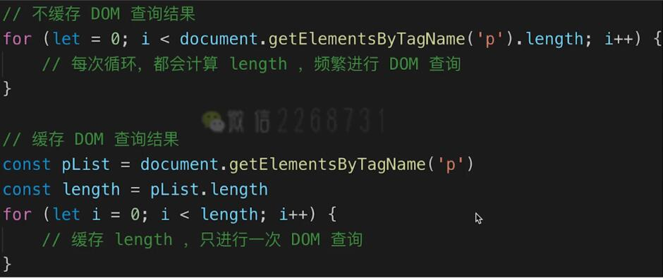

- 将频繁操作改为一次性操作

频繁操作（比较耗性能）：

```javascript
const list = document.getElementById('list')

for (let i = 0; i < 10; i++) {
    const li = document.createElement('li')
    li.innerHTML = `List item ${i}`
    list.appendChild(li)
}
```

一次性操作：

```javascript
const list = document.getElementById('list')

// 创建一个文档片段，此时还没有插入到 DOM 树中
const frag = document.createDocumentFragment()

// 执行插入
for (let i = 0; i < 10; i++) {
    const li = document.createElement('li')
    li.innerHTML = `List item ${i}`
    
    // 先插入到文档片段中
    frag.appendChild(li)
}

// 都完成之后，再插入到 DOM 树中
listNode.appendChild(frag)
```

### JS-Web-API-BOM

- navigator
- screen

```javascript
// navigator
const ua = navigator.userAgent
const isChrome = ua.indexOf('Chrome')
console.log(isChrome)

// screen
console.log(screen.width)
console.log(screen.height)
```


- location

- history

```javascript
// location
console.log(location.href)		// 'https://coding.imooc.com/class/chapter/400.html?a=100&b=200#Anchor'
console.log(location.protocol)	// 'http:' 'https:'
console.log(location.pathname)	// '/class/chapter/400.html'
console.log(location.search)	// '?a=100&b=200'
console.log(location.hash)		// '#Anchor'

// history
history.back()
history.forward()
```

### JS-Web-API-事件

**事件绑定：**

```javascript
const btn = document.getElementById('btn1')

btn.addEventListener('click', event => { 
    console.log('clicked')
})
```

**通用的事件绑定函数:**

```javascript
function bindEvent(elem, type, fn) {
    elem.addEventListener(type, fn)
}

const a = document.getElementById('link1')
bindEvent(a, 'click', e => {
    e.preventDefault();     // 阻止默认行为
    alert('clicked');
})
```

**事件冒泡：**

```javascript
function bindEvent(elem, type, fn) {
    elem.addEventListener(type, fn)
}

const p1 = document.getElementById('p1')
const body = document.body
bindEvent(p1, 'click', e => {
    // e.stopPropagation();    // 阻止事件冒泡
    alert('激活')
    console.log(e.target)
})

bindEvent(body, 'click', e => {
    alert('取消')
    console.log(e.target)   // 此处的 e.target 为实际触发的 e，及如果是通过事件冒泡的方式触发的事件，e.target 为 p1 标签
})
```

**事件代理：**

```javascript
function bindEvent(elem, type, fn) {
    elem.addEventListener(type, fn)
}

const div3 = document.getElementById('div3')
bindEvent(div3, 'click', event => {
    event.preventDefault()
    const target = event.target
    if (target.nodeName === 'A') {
        alert(target.innerHTML)
    }
})
```

```html
<!DOCTYPE html>
<html lang="en">
    <head>
        <meta charset="UTF-8">
        <meta name="viewport" content="width=device-width, initial-scale=1.0">
        <meta http-equiv="X-UA-Compatible" content="ie=edge">
        <title>事件 演示</title>
        <style>
            div {
                border: 1px solid #ccc;
                margin: 10px 0;
                padding: 0 10px;
            }
        </style>
    </head>
    <body>
        <button id="btn1">一个按钮</button>

        <div id="div3">
            <a href="#">a1</a><br>
            <a href="#">a2</a><br>
            <a href="#">a3</a><br>
            <a href="#">a4</a><br>
            <button>加载更多...</button>
        </div>

        <script src="./test.js"></script>
    </body>
</html>
```

- 事件代理代码简洁，减少浏览器内存占用，但是不要滥用

#### 通用的事件监听函数

```javascript
// 通用的事件绑定函数
// function bindEvent(elem, type, fn) {
//     elem.addEventListener(type, fn)
// }
function bindEvent(elem, type, selector, fn) {
    if (fn == null) {   // 注意此处用 ==
        fn = selector
        selector = null
    }
    elem.addEventListener(type, event => {
        const target = event.target
        if (selector) {
            // 代理绑定
            // 有代理的话需要先判断执行元素是否匹配，再考虑是否要执行。
            if (target.matches(selector)) {     // matches 的作用：判断 selector 选择器是否匹配target
                fn.call(target, event)
            }
        } else {
            // 普通绑定
            fn.call(target, event)
        }
    })
}

// 普通绑定
const btn1 = document.getElementById('btn1')
bindEvent(btn1, 'click', function (event) {
    // console.log(event.target) // 获取触发的元素
    event.preventDefault() // 阻止默认行为
    alert(this.innerHTML)
})

// 代理绑定
const div3 = document.getElementById('div3')
bindEvent(div3, 'click', 'a', function (event) {
    event.preventDefault()
    alert(this.innerHTML)
})
```

### JS-Web-API-Ajax

#### XMLHttpRequest

```javascript
const xhr = new XMLHttpRequest()
xhr.open('GET', '/data/test.json', true)   // true 表示请求为异步
xhr.onreadystatechange = function () {
    if (xhr.readyState === 4) {
        if (xhr.status === 200) {
            console.log(JSON.parse(xhr.responseText))
            // alert(xhr.responseText)
        } else {
            console.log('其他情况')
        }
    }
}
xhr.send(null)


const xhr = new XMLHttpRequest()
xhr.open('POST', '/login', true)   // true 表示请求为异步
xhr.onreadystatechange = function () {
    if (xhr.readyState === 4) {
        if (xhr.status === 200) {
            console.log(JSON.parse(xhr.responseText))
        } else {
            console.log('其他情况')
        }
    }
}
const postData = {
    userName: '张三',
    password: 'xxx'
}
xhr.send(JSON.stringify(postData))
```

**xhr.readyState**

- 0 - (未初始化)还没有调用 send() 方法
- 1 - (载入)已调用 send() 方法，正在发送请求
- 2 - (载入完成) send() 方法执行完成，已经接收到全部响应内容
- 3 - (交互) 正在解析响应内容
- 4 - (完成) 响应内容解析完成，可以在客户端调用

**xhr.status**

- 2xx - 表示成功处理请求，如 200
- 3xx - 需要重定向，浏览器直接跳转，如 301(永久重定向) 302(临时重定向) 304(资源未改变，浏览器使用缓存资源)
- 4xx - 客户端请求错误，如 404(请求地址出错) 403(没有权限)
- 5xx - 服务端错误


#### 什么是浏览器的同源策略

**同源策略**

- **ajax 请求**时，**浏览器** 要求当前网页和 server 必须同源（安全）

- 同源：协议、域名、端口，三者必须一致
- 协议、域名、端口都不一致的情况： 前端：`http://a.com:8080/`           server：`https://b.com/api/xxx`

**加载图片 css js 可无视同源策略**

- ``
- `<link href = 跨域的css地址 />`
- `<script src = 跨域的js地址> </script>`


- `` 可用于统计打点，可使用第三方统计服务
- `<link/> <script>` 可使用 CDN，CDN 一般都是外域
- `<script>` 可实现 JSONP


**跨域**

- 所有的跨域，都必须经过 server 端允许和配合
- 未经 server 端允许就实现跨域，说明浏览器有漏洞


#### JSONP

> 访问一个网址时，服务端一定返回一个 html 文件吗？

- 服务端可以任意动态拼接数据返回，只要符合 html 格式要求
- 同理于 `<script src = "https://xxcijmz.com/getData.js">`，由于 `<script>` 可绕过跨域限制，而服务器可以任意动态拼接数据返回，所以，`<script>` 就可以获得跨域的数据，只要服务端愿意返回

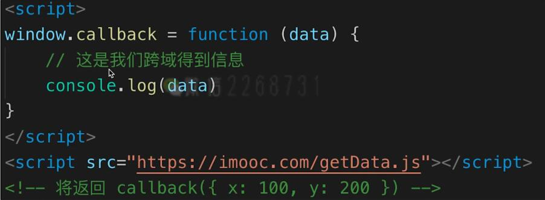


```html
<!DOCTYPE html>
<html lang="en">
    <head>
        <meta charset="UTF-8">
        <meta name="viewport" content="width=device-width, initial-scale=1.0">
        <meta http-equiv="X-UA-Compatible" content="ie=edge">
        <title>jsonp 演示</title>
    </head>
    <body>
        <p>一段文字 1</p>

        <script>
            window.abc = function (data) {
                console.log(data)
            }
        </script>
        <!-- 客户端通过拼接参数的形式，告知服务端要调用的函数名（客户端中已定义），以及一些参数等，然后由服务端调用 -->
        <script src="http://localhost:8002/jsonp.js?username=xxx&callback=abc"></script>
    </body>
</html>
```

Jquery 实现JSONP：

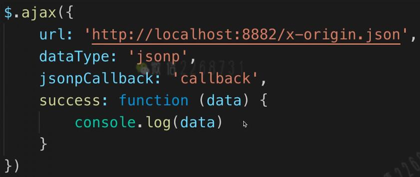

**Cors实现跨域：**

通过由服务器设置 http header

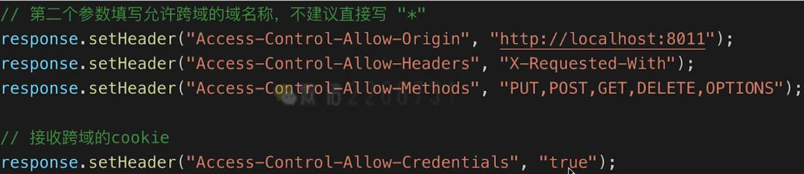

#### ajax 相关面试题

> 手写一个简易的 ajax

```javascript
function ajax(url, successFn) {
    const xhr = new XMLHttpRequest()
    xhr.open('GET', url, true)
    xhr.onreadystatechange = function () {
        if (xhr.readyState === 4) {
            if (xhr.status === 200) {
                successFn(xhr.responseText)
            }
        }
    }
    xhr.send(null)
}
```

**Promise 形式：**

```javascript
function ajax(url) {
    const p = new Promise((resolve, reject) => {
        const xhr = new XMLHttpRequest()
        xhr.open('GET', url, true)
        xhr.onreadystatechange = function () {
            if (xhr.readyState === 4) {
                if (xhr.status === 200) {
                    resolve(
                        JSON.parse(xhr.responseText)
                    )
                } else if (xhr.status === 400) {
                    reject(
                        new Error('404 not found')
                    )
                }
            }
        }
        xhr.send(null)
    })
    return p
}

const url = '/data/test.json'
ajax(url)
    .then(res => console.log(res))
    .catch(err => console.error(err))
```

#### 实际项目中 ajax 的常用插件

jQuery、Fetch、axios

<div class="danger">

> 从fetch() 返回的 Promise 不会被标记为 reject，即使该 HTTP 响应的状态码是 404 或 500，相反，它会将Promise状态标记为 resolve(但是会将 resolve 的返回值的 ok 属性设置为 false），仅当网络故障或请求被阻止时，才会标记为 reject。)

</div>

### JS-Web-API-存储

> 描述 cookie localStorage sessionStorage 区别

#### cookie

- 本身用于浏览器 和 server 通讯
- 被 “**借用**” 到本地存储来
- 可用 document.cookie = '...' 来修改

**缺点：**

- 存储大小，最大 4KB
- http 请求时会自动发送到服务端，增加请求数据量
- 只能用 document.cookie = '...'  来修改，太过简陋

[cookie与 session的区别与联系](https://www.cnblogs.com/l199616j/p/11195667.html)

#### localStorage 和 sessionStorage

- HTML5 专门为存储而设计，最大可存 5M
- API 简单易用 setItem、getItem
- 不会随着 http 请求被发送出去


- localStorage 数据会永久存储，除非代码手动删除
- sessionStorage 数据只存在于当前会话，浏览器关闭则清空
- 一般用 localStorage 会更多一些

## http 面试题

### http常见的状态码

- 状态码分类
  - 1XX 服务器收到请求
  - 2XX 请求成功，如 200
  - 3XX 重定向，如 300
  - 4XX 客户端错误，如 404
  - 5XX 服务端错误，如 500

- 常见状态码
  - 200 成功
  - 301 永久重定向 (配合 location，浏览器自动处理)
  - 302 临时重定向（配合 location，浏览器自动处理，同时因为会有缓存，第一次为302，第二次就变为200）
  - 304 资源未被修改（服务端告知资源未被修改，直接使用本地缓存）
  - 404 资源未找到
  - 403 没有权限
  - 500 服务器错误
  - 504 网关超时

### Restful-API

**传统的 methods**

- get 获取服务器的数据
- post 向服务器提交数据
- 简单的网页功能，就这两个操作

**现在的 methods**

- get 获取数据
- post 新建数据
- patch / put 更新数据   [patch 和 put 的区别](https://blog.csdn.net/varyall/article/details/80895945)
- delete 删除数据

-----

**传统的 API 设计**：把每个 url 当做一个功能

**Restful API 设计：**把每个 url 当做一个唯一的资源（/api/blog 就表示这个资源，然后通过 method 不同表示对资源的不同操作）


**如何设计成一个资源？**

- 尽量不用 url 参数
  - 传统 API 设计： /api/list?pageIndex = 2
  - Restful API 设计：/api/list/2
- 用 method 表示操作类型
  -  传统API 设计（把 url 当做功能设计，可以通过 url 看出）
    - post 请求    /api/create-blog
    - post 请求    /api/update-blog?id=100
    - get 请求      /api/get-blog?id=100
  - Restful API 设计（看到 post 请求知道要创建新数据，patch 请求修改数据，get 请求获取数据）
    - post 请求    /api/blog
    - patch 请求  /api/blog/100
    - get 请求      /api/blog/100

### http headers

- 常见的 Request Headers
  - Accept 浏览器可接收的数据格式
  - Accept-Encoding 浏览器可接收的压缩算法，如 gzip
  - Accept-Language 浏览器可接收的语言，如 zh-CN
  - Connection：keep-alive    一次 TCP 连接重复使用
  - cookie
  - Host 请求的域名
  - User-Agent （简称 UA） 浏览器信息
  - Content-type 发送数据的格式(post 请求)，如 application/json

- 常见的 Response Headers
  - Content-type 返回数据的格式 ，如 application/json
  - Content-length 返回数据的大小，多少字节
  - Content-Encoding 返回数据的压缩算法，如 gzip
  - Set-Cookie 服务端设置 Cookie

**自定义 header**：`headers:{'X-Requested-With':'XMLHttpRequest'},`

**缓存相关的 headers：**Cache-Control、Expires、Last-Modified、If-Modified-Since、Etag、If-None-Match

### http 缓存

> 什么是缓存？

第一次拿浏览器去访问一个新的网站，这种情况下，服务端需要原原本本的将数据发送给客户端。但是第一次访问完后，第二次再访问，有时候就没有必要将所有资源再访问一遍，此时可以通过缓存，将部分资源保存到客户端，从而让页面加载的更快一些。

> 为什么需要缓存?

网络请求的加载相比于CPU的计算是非常慢的东西，而且网络是不稳定的，如果要做性能优化，需要尽量减少网络请求的体积和数量，这样才能让网络请求更快一些，所以需要缓存。

> 哪些资源可以被缓存？ 

静态资源（js css img）

[webpack 构建缓存机制](https://www.cnblogs.com/luckyXcc/p/10839471.html)

### cache-control是什么意思-http强制缓存

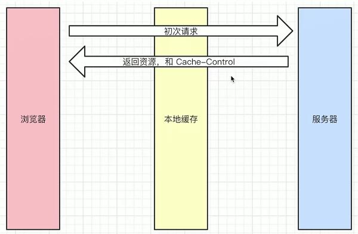

浏览器在初次请求时，服务器返回资源时会进行判断，如果资源适合缓存，将会为其添加 一个 Cache-Control（添加在 Response Headers中），用于控制强制缓存的逻辑，例如：Cache-Control：`max-age=31536000`(单位是秒)。

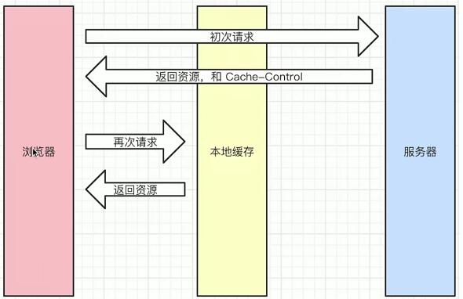

之后当再次请求时，会判断 Cache-Control 的时间是否过期，若未过期，将在 **本地缓存** 中寻找资源并直接返回资源。

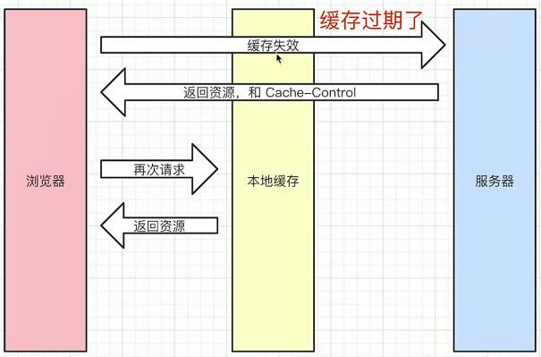

若缓存过期，则会再次请求服务器获取资源，服务器返回资源和 Cache-Control。

> cache-control 的值

- **max-age**：设置本地缓存时间。
- **no-cache**：不用本地缓存，交给服务端处理。
- **no-store**：不用本地缓存，也不让服务端做缓存。
- private：只允许最终用户做缓存
- public：允许中间代理、路由做缓存

> 关于 Expires

- 同在 Response Headers 中
- 同为控制缓存过期
- **已被 Cache-Control 代替**


### Etag 和 Last-Modified是什么意思-http协商缓存（对比缓存）

**http缓存 - 协商缓存**

- 服务器端缓存策略（由服务端判断是否需要缓存，**不是缓存于服务端**。当服务端判断其是可以直接缓存的话，会通知客户端直接去拿其本地缓存的数据）
- 服务器判断客户端资源，是否和服务端资源一样
- **一致则返回 304，否则返回 200 和最新的资源**

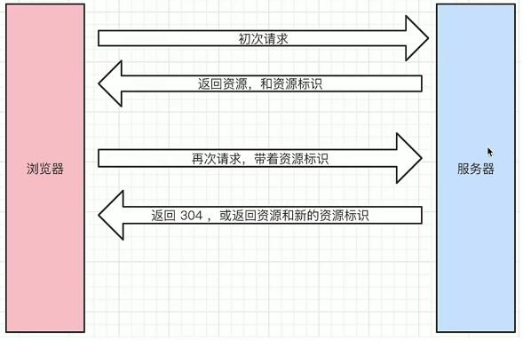

**资源标识**

- 在 Response Headers 中，有两种

  - **Last-Modified** 资源的最后修改时间

  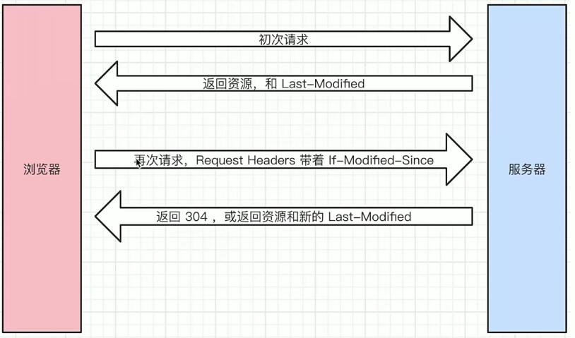

  ​		此处的 **If-Modified-Since** 就是 **Last-Modified** 。浏览器带着 If-Modified-Since，服务器判断 其 与资源的最后修改时间的差别，判断是否要返回 304 还是 返回资源和新的 Last-Modified。

  - **Etag** 资源的唯一标识（一个字符串，类似人类的指纹）

  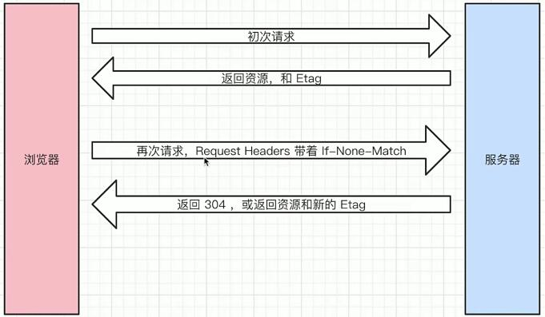

  ​		Etag是根据资源内容计算得出的，如果资源一样则不会更改，如果资源一样，则会发生变化。

**请求实例：**
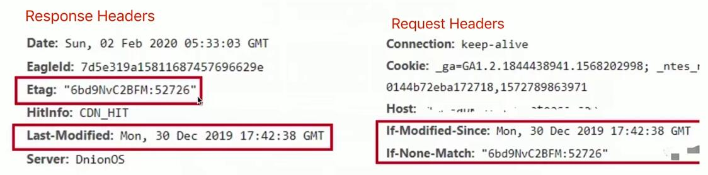

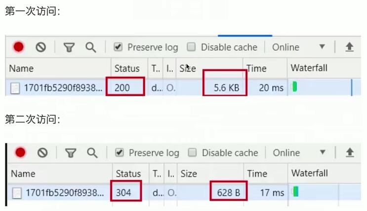

> Last-Modified 和 Etag共存时

- 会优先使用 Etag，因为 Last-Modified 只能精确到秒级。
- 如果资源被重复生成，而内容不变，则 Etag 更精确。


> http 缓存 - 综述

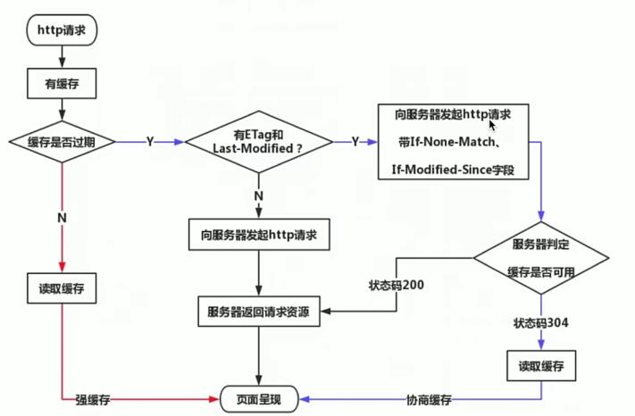

### 刷新页面对http缓存的影响

> 三种刷新操作

- 正常操作：地址栏输入 url，跳转链接，前进后退等
- 手动刷新：F5，点击刷新按钮，右击菜单刷新
- 强制刷新：ctrl + F5


> 不同刷新操作，不同的缓存策略

- 正常操作：强制缓存有效，协商缓存有效
- 手动刷新：强制缓存失效，协商缓存有效
- 强制刷新：强制缓存失效，协商缓存失效


### https 加密方式与过程解析

待补...

## 开发环境

### 关于开发环境

- 面试官想通过开发环境了解候选人的实际工作情况
- 开发环境的工具，能体现工作产出的效率
- 会以聊天形式为主，不会问具体的问题


- git
- 调试工具
- 抓包
- webpack babel
- linux 常用命令

### git

- 最常用的代码版本管理工具
- 大型项目需要多人协作开发，必须熟用 git
- Mac OS 自带 git 命令， windows 可去官网下载安装
- git 服务端常见的有 github coding.net 等
- 大公司会搭建自己的内网 git 服务


> 常用 git 命令

- git add .
- git checkout XXX     切换分支
- git commit -m 'xxx'
- git push origin master
- git pull origin master  拉取远程分支，并合并
- git fetch 拉取远程分支，不合并
- git branch     创建分支
- git checkout -b xxx 创建并切换分支
- git merge xxx 合并分支
- git clone 拉取仓库
- git log 查看提交记录
- git diff 查看修改记录
- git show log中的提交id    查看提交内容
- git checkout 文件名  撤销修改
- git checkout .  撤销所有修改

[git pull 与 git clone 的区别](https://blog.csdn.net/lijing742180/article/details/84636977)

[git diff 与 git diff --cached 的区别](https://www.cnblogs.com/keystone/p/10702399.html)


**发生代码写错分支的情况：**

- git stash  将修改的内容剪切
- git stash pop  将修改的内容粘贴

<div class="danger">

> 当 git commit 后，代码被提交到了某一条分支。此时再使用git checkout切换分支，被提交的代码就无法再另一条分支中存在了。

</div>

### chrome 调试工具

- 一般不会面试时考察
- 但这是前端工程师必备的技能


- Elements、Console、debugger、Network、Application

### 抓包

- 移动端 h5 页，查看网络请求，需要用工具抓包
- windows 一般用 fiddler
- Mac OS 一般用 charles

**步骤：**

- 手机和电脑连同一个局域网
- 将手机代理到电脑上
- 手机浏览网页，即可抓包
- 查看网络请求、网址代理、https

[fiddler 抓包教程](https://blog.csdn.net/sunluyao_/article/details/52157375?utm_medium=distribute.pc_relevant.none-task-blog-2~default~baidujs_baidulandingword~default-0.fixedcolumn&spm=1001.2101.3001.4242.1)

### webpack 和 babel

- ES6 模块化，浏览器暂不支持
- ES6 语法，浏览器并不完全支持
- 压缩代码，整合代码，以让网页加载更快

#### 配置 webpack

1. 新建目录，输入如下命令

```
npm init -y

cnpm install webpack webpack-cli -D
```

2. 在根目录下新建 `src/index.js`，然后新建 webpack.config.js，输入如下配置：

```javascript
const path = require('path')

module.exports = {
    mode: 'development',     // production
    entry: path.join(__dirname, 'src', 'index.js'),
    output: {
        filename: 'bundle.js',
        path: path.join(__dirname, 'dist')
    }
}
```

3. 在 package.json 中配置启动命令：

```json
  "scripts": {
    "test": "echo \"Error: no test specified\" && exit 1",
    "build":"webpack --config webpack.config.js"		--> 相当于 "build":"webpack"
  },
```

4. 在命令行输入 `npm run build`，便可以看到 打包后的代码

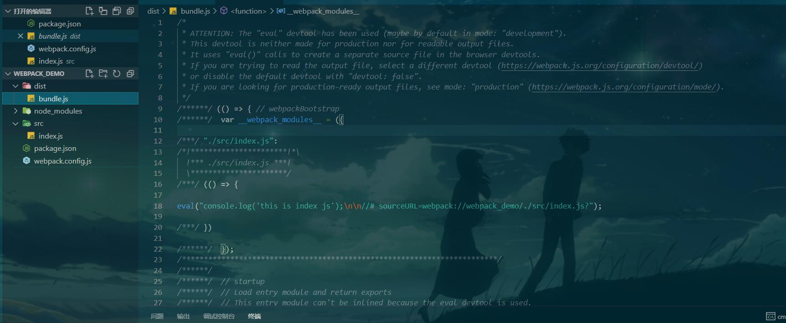

可以看到，由于我们将 `mode` 设置为了 `development`，所以代码没有被压缩。

5. 安装如下两个插件：

```
cnpm install html-webpack-plugin -D		// 用于 编译 html 文件
		
cnpm install webpack-dev-server -D		// 用于启动服务器
```

6. 新建 `src/index.html`

```html
<!DOCTYPE html>
<html lang="en">
<head>
    <meta charset="UTF-8">
    <meta http-equiv="X-UA-Compatible" content="IE=edge">
    <meta name="viewport" content="width=device-width, initial-scale=1.0">
    <title>Document</title>
</head>
<body>
    <h1>webpackDemo</h1>
</body>
</html>
```

7. 配置 webpack.package.js 及 package.json

```js
const path = require('path')
const HtmlWebpackPlugin = require('html-webpack-plugin')

module.exports = {
    mode: 'development',     // production
    entry: path.join(__dirname, 'src', 'index.js'),
    output: {
        filename: 'bundle.js',
        path: path.join(__dirname, 'dist')
    },
    plugins: [
        new HtmlWebpackPlugin({
            template: path.join(__dirname, 'src', 'index.html'),
            filename: 'xxc.html'        // 产出的文件名
        })
    ],
    devServer: {
        port: 3000,
        static: {
            directory: path.join(__dirname, 'dist'),
        }
    }
}
```

```json
  "scripts": {
    ...
    "dev":"webpack-dev-server"
  },
```

8. 在命令行输入 `npm run dev`，即可开启服务器（此时并未生成文件到 dist 目录，只是打包到内存中）

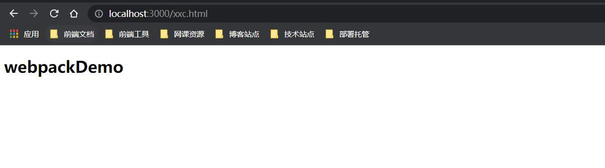

#### webpack 中配置 babel

**webpack 默认将 js 文件以原有语法形式打包**，若需要将其转为 ES5 ，则需要使用 babel 进行打包

1. 安装相关 插件：

```
cnpm install @babel/core @babel/preset-env babel-loader -D
```

2. 新建 `.babelrc` 文件，写入配置

```
{
    "presets":["@babel/preset-env"]
}
```

3. 配置 `webpack.config.js` 文件：

```javascript
const path = require('path')
const HtmlWebpackPlugin = require('html-webpack-plugin')

module.exports = {
    mode: 'development',     // production
    entry: path.join(__dirname, 'src', 'index.js'),
    output: {
        filename: 'bundle.js',
        path: path.join(__dirname, 'dist')
    },
    plugins: [
        new HtmlWebpackPlugin({
            template: path.join(__dirname, 'src', 'index.html'),
            filename: 'xxc.html'        // 产出的文件名
        })
    ],
    module: {
        rules: [
            {
                test: /\.js$/,
                use: {
                    loader: 'babel-loader'
                },
                include: path.join(__dirname, 'src'),
                exclude: /node_modules/
            }
        ]
    },
    devServer: {
        port: 3000,
        static: {
            directory: path.join(__dirname, 'dist'),
        }
    }
}
```

之后再进行打包时， webpack会将 js 文件中的 es6 语法进行编译，变为 es5。

### ES6  模块化

单个导出：

```javascript
export function fn() {
    console.log('fn')
}

export const name = 'a'

export const obj = {
    name: 'zhangsan'
}
```

统一导出：

```javascript
function fn() {
    console.log('fn')
}

const name = 'a'

const obj = {
    name: 'zhangsan'
}

export {
    fn,
    name,
    obj
}
```

导入：

```javascript
import { fn, name, obj } from './b'  // 解构赋值
```


默认导出：

```javascript
const obj = {
    name: 'xxx'
}

export default obj
```

导入：

```javascript
import xxx from './c'
```

### 配置 webpack 生产环境

1. 在项目根目录下新建 `webpack.prod.js`，进行配置代码书写：

```javascript
const path = require('path')
const HtmlWebpackPlugin = require('html-webpack-plugin')

module.exports = {
    mode: 'production',     // production
    entry: path.join(__dirname, 'src', 'index.js'),
    output: {
        filename: 'bundle.[contenthash].js',        // contenthash根据代码的值算出一个不规则的乱码
        path: path.join(__dirname, 'dist')
    },
    plugins: [
        new HtmlWebpackPlugin({
            template: path.join(__dirname, 'src', 'index.html'),
            filename: 'xxc.html'        // 产出的文件名
        })
    ],
    module: {
        rules: [
            {
                test: /\.js$/,
                use: {
                    loader: 'babel-loader'
                },
                include: path.join(__dirname, 'src'),
                exclude: /node_modules/
            }
        ]
    }
}
```

2. 修改 `package.json` 

```json
  "scripts": {
     ...
    "build": "webpack --config webpack.prod.js",
  },
```

3. 执行 `npm run build`，此时 dist 目录下便会生成 对应打包文件

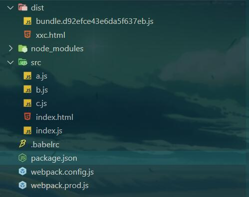

### linux  命令

- 公司的线上机器一般都是 linux (参考阿里云)
- 测试机也需要保持一致，用 linux
- 若测试机或者线上机出了问题，本地又不能复现，需要去排查

```h
ssh 用户名@机器地址   登录
    
ls   	 查看所有文件及文件列表（平铺形式）

ls -a    查看所有文件及文件列表，包括隐藏文件（平铺形式）
    
ll       查看所有文件及文件列表，包括隐藏文件（列表形式）
    
clear    清屏
    
mkdir 文件夹名    创建文件夹
    
rm -rf 文件夹名		删除文件夹及文件夹内所有内容
    
cd 目录名			进入某个目录
    
mv 原文件名  新文件名		修改文件名

mv 原文件名  ../原文件名     移动文件到上级目录
    
cp 原文件名 新文件名	拷贝文件
    
rm 文件名				删除文件
    
touch 文件名			新建文件
    
vi/vim  文件名				新建文件并打开
    
cat 文件名			打印文件的所有内容到控制台中
    
head 文件名		打印文件的前面几行到控制台中
    
tail 文件名		打印文件末尾的几行到控制台中
    
grep "查找内容"  文件名		在文件中查找指定内容
    
    
在 vim 编辑器中，通过 i 键进行写入。通过 esc 关闭写入。 通过 w 进行保存。通过 q 进行退出。通过 q! 进行强制退出。
```


## 运行环境

- 运行环境即浏览器（server 端有 nodejs），用于下载网页代码，渲染出页面，期间会执行若干 JS。
- 要保证代码在浏览器中，稳定且高效。

### 网页加载过程

**资源的形式：**

- html 代码
- 媒体文件，如 图片、视频等
- javascript css

[详细加载过程及渲染过程](https://blog.csdn.net/chenjuan1993/article/details/81712599)

[三次握手](https://baijiahao.baidu.com/s?id=1654225744653405133&wfr=spider&for=pc)

**加载过程：**

1. DNS 解析：域名 -> IP 地址
2. 浏览器根据 IP 地址向服务器 发起 http 请求
3. 服务器处理 http 请求，并返回给浏览器

**渲染过程:**

1. 根据 HTML 代码生成 DOM Tree
2. 根据 CSS 代码生成 CSSOM（CSS代码或 link 放在 header 标签中，可以使得 CSSOM 先渲染）

3. 将 DOM Tree 和 CSSOM 整合形成 Render Tree

4. 根据 Render Tree 渲染页面
5. 遇到 `<script>` 则**暂停渲染**，优先加载并执行 JS 代码，完成再继续
6. 若有 img 标签，会继续渲染 DOM Tree，等到图片加载成功再插入。


> 为什么建议把 CSS 放在 head 中？

css放在body标签尾部时, `DOMTree`构建完成之后便开始构建`RenderTree`, 并计算布局渲染网页, 等加载解析完css之后, 开始构建`CSSOMTree`, 并和`DOMTree`重新构建`RenderTree`, 重新计算布局渲染网页
css放在`head`标签中时, 先加载css, 之后解析css构建`CSSOMTree`, 于此同时构建`DOMTree`, `CSSOMTree`和`DOMTree`都构建完毕之后开始构建`RenderTree`, 计算布局渲染网页
对比两者, `css`放在`head`标签中比`css`放在`body`标签尾部少了一次构建`RenderTree`, 一次计算布局和一次渲染网页, 因此性能会更好; 并且css放在body标签尾部时会在网页中短暂出现"裸奔"的HTML, 这不利于用户体验


> 为什么建议把 JS 放在 body 最后？

保证页面渲染完再 执行 JS代码。否则若放在中间，页面渲染到一半去执行 JS 代码，就会导致页面渲染时间比较长。


**window.onload 和 DOMContentLoaded**

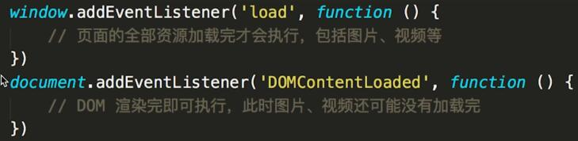

### 性能优化

**性能优化原则：**

- 多使用内存、缓存或其他方法
- 减少 CPU 计算量，减少网络加载耗时
- （适用于所有编程的性能优化 ---- 空间换时间）

**从何入手？**

- 让加载更快
  - 减少资源体积：压缩代码。
  - 减少访问次数：合并代码（将三次访问变为一次访问，包括合并代码到一个 js 文件、雪碧图等）、SSR服务端渲染、缓存。
  - 使用更快的网络：CDN
- 让渲染更快
  - CSS 放在 head，JS 放在 body 最下面
  - 尽早开始执行 JS，用 DOMContentLoaded 触发
  - 懒加载（图片懒加载--什么时候用什么时候加载，上滑加载更多）
  - 对 DOM 查询进行缓存
  - 频繁 DOM 操作，合并到一起插入 DOM 结构
  - 节流 throttle 防抖 debounce

### 性能优化示例

**合并**

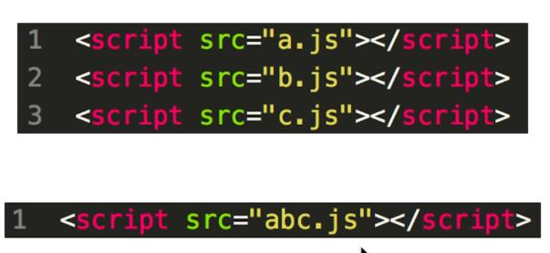

**缓存**

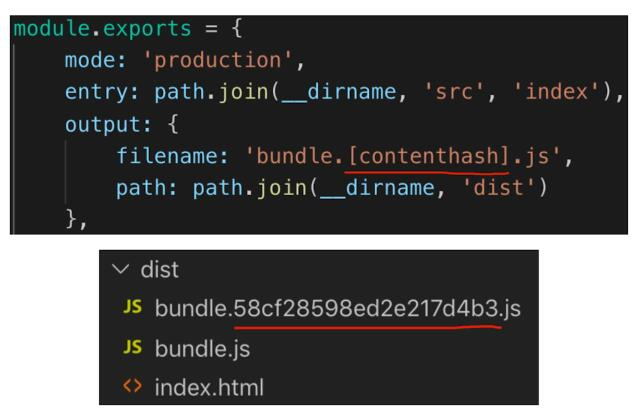

- 静态资源加 hash 后缀，根据文件内容计算 hash
- 文件内容不变，则 hash 不变，则 url 不变
- url 和 文件不变，则会自动触发 http 缓存机制，返回 304

**CDN**

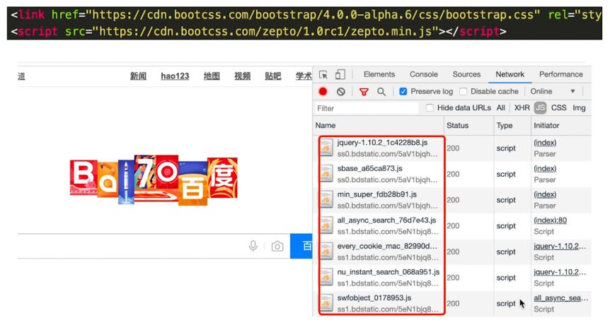

**SSR**

- 服务器端渲染：将网页和数据一起加载，一起渲染
- 非 SSR（前后端分离）:先加载网页，再加载数据，再渲染数据
- 早先的 JSP ASP PHP，现在的 Nuxt.js、Next.js

**懒加载**

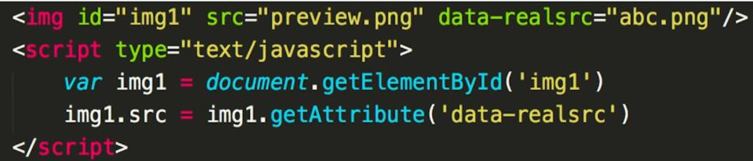

**缓存 DOM 查询**

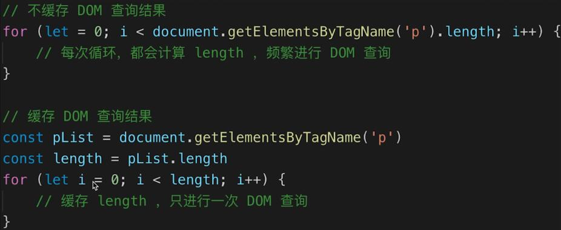

**多个DOM操作一起插入到DOM 结构**

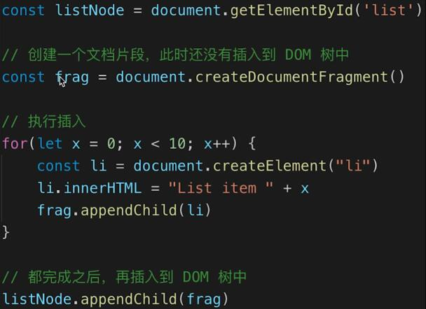

**尽早开始 JS 执行**

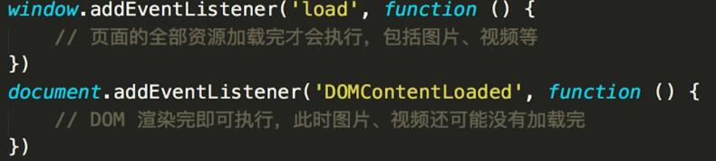

### 防抖 debounce

- 监听一个输入框，文字变化后触发 change 事件
- 直接用 keyup 事件，则会频繁触发 change 事件
- 防抖：用户输入结束或暂停时，才会触发 change 事件

**箭头函数.apply无法改变this指向：**

```javascript
/* const a = (num) => {
    console.log(this, num)  // window
}

a.apply({ name: 'xxc' }, [123]) */

const a = function (num) {
    console.log(this, num)  // {name:'xxc'}
}

a.apply({ name: 'xxc' }, [123])
```

**封装防抖函数：**

```javascript
function debounce(fn, time = 500) {
    let timer = null
    return function () {
        if (timer) {
            clearTimeout(timer)
        }
        timer = setTimeout(() => {
            fn.apply(this, arguments)
            timer = null	// 此处不建议用 clearTimeout ，因为 clearTimeout 只是停止了定时器，而timer 是清空了
        }, time);
    }
}

const input1 = document.getElementById('input1')
input1.addEventListener('keyup', debounce(function () {     // 此处需要使用 function(){}，因为 若使用箭头函数会导致 fn.apply失效
    console.log(this)
}, 1000))
```

[timer=null和clearTimeout(timer)的区别(注意评论)](https://www.jianshu.com/p/2ca821c4d678)

### 节流 throttle

- 拖拽一个元素时，要随时拿到该元素被拖拽的位置
- 直接用 drag 事件，则会频繁触发，很容易导致卡顿
- 节流：无论拖拽速度多快，都会每隔 100ms 触发一次

```javascript
function throttle(fn, time = 500) {
    let timer = null
    return function () {
        if (timer) {
            return
        }
        timer = setTimeout(() => {
            fn.apply(this, arguments)
            timer = null
        }, time)
    }
}

const div1 = document.getElementById('div1')
div1.addEventListener('drag', throttle(function (e) {
    console.log(e.offsetX, e.offsetY)
}))
```

[箭头函数没有自己的 arguments](https://www.cnblogs.com/jiangxiaoxi/p/12590668.html)

### 安全

- XSS 跨站请求攻击
- XSRF/CSRF 跨站请求伪造


**XSS攻击**

- 一个博客网站，我发表了一篇博客，其中嵌入 `<script>` 脚本。脚本内容：获取 cookie，发送到我的服务器（服务器配合跨域）

- 然后我发布这篇博客，只要有人查看它，我就能轻松收割访问者的 cookie。


**XSS预防**

- 替换特殊字符，如 < 变为 `&lt;`，> 变为 `&gt;`。
- `<script>`变为 `&lt;script&gt;`，直接显示，而不会作为脚本执行。
- 前端要替换，后端也要替换，都做总不会有错

[前端XSS预防](https://blog.csdn.net/juewang_love/article/details/89505698)

[node服务器XSS预防](https://www.cnblogs.com/kakayang/p/8242709.html)

[xss插件使用](https://www.npmjs.com/package/xss)


**XSRF攻击**

- 你正在购物，看中了某个商品，商品 id 是100，付费接口是 xxx.com/pay?id=100，但是没有任何验证。
- 我是攻击者，我看中了一个商品，id 是 200。我向你发送一封电子邮件，邮件标题很吸引人，但邮件正文隐藏着 ``。你一查看邮件，就购买了 id 是 200的商品。


**XSRF 预防**

- 使用 Post 接口
- 增加验证，例如 密码、短信验证码、指纹等


