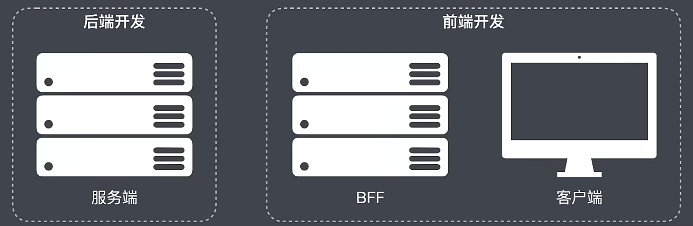
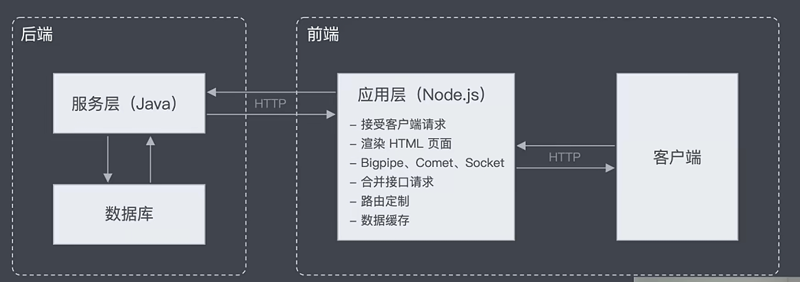
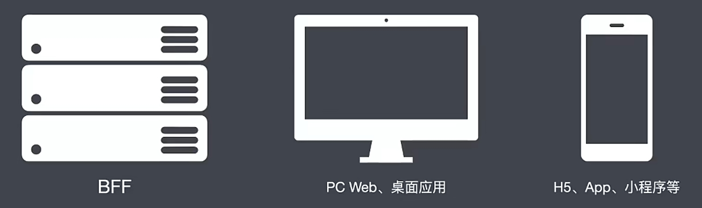

## BFF（中间层）

> BFF(Backend For Frontend) ：为前端用的服务端。

以往前端只需要关注客户端的一些东西，但是现在还需要关注BFF相关的。BFF如今使用Node.js来做。

为了避免做一个功能时调用好几十个接口，便可以借助应用层来对接口进行聚合、路由定制、缓存等。

## 泛客户端

###  移动开发的普及

移动开发的普及使得前端需要掌握的知识量变大。

各种各样的客户端载体。如PC Web、移动端原生App、H5混合App、轻应用(PWA、小程序、快应用等)、桌面应用开发(微信、Electron)

## 传统Web技术深入

传统Web技术的深入使得开发变得更加复杂

