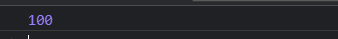
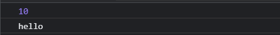
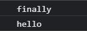

## Promise类核心逻辑实现

- Promise就是一个类  在执行这个类的时候 需要传递一个执行器进去 执行器会立即执行

- Promise中有三种状态 分别为 成功(fulfilled) 失败(rejected) 等待(pending)。

  状态只有以下两种改变形式：

  ​    pending->fulfilled

  ​    pending->rejected

  ​    一旦状态确定，就不可更改

- resolve 和 reject 函数是用来更改状态的

  ​    resolve:fulfilled

  ​    reject:rejected

- then方法内部做的事情就是判断状态，如果状态是成功，调用成功的回调函数 如果状态是失败 调用失败回调函数

     then方法是被定义在原型对象中的

- then成功回调有一个参数 表示成功之后的值 then失败回调有一个参数 表示失败后的原因

```javascript
const PENDING = "pending"   // 等待
const FULFILLED = "fulfilled"   // 成功
const REJECTED = 'rejected' // 失败

class MyPromise {
    // executor代表执行器
    constructor(executor) {
        executor(this.resolve, this.reject)
    }
    // promise 状态
    status = PENDING;
    // 成功之后的值
    value = undefined;
    // 失败的原因
    reason = undefined;

    // 将resolve和reject定义为箭头函数的目的是为了将来直接调用它们的时候，this指向能为类的实例对象
    resolve = value => {
        // 如果状态不是等待 阻止程序向下执行
        if (this.status !== PENDING) return;
        // 将状态更改为成功
        this.status = FULFILLED;
        // 保存成功之后的值
        this.value = value
    }
    reject = reason => {
        // 如果状态不是等待 阻止程序向下执行
        if (this.status !== PENDING) return;
        // 将状态更改为失败
        this.status = REJECTED;
        // 保存失败之后的值
        this.reason = reason;
    }
    then(successCallBack, failCallBack) {
        // 判断状态
        if (this.status === FULFILLED) {
            successCallBack(this.value);
        } else if (this.status === REJECTED) {
            failCallBack(this.reason);
        }
    }
}

module.exports = MyPromise
```

## 在Promise类中加入异步逻辑

> 将成功或失败的回调先暂存起来，因为此时由于异步原因，还未执行resolve和reject，this.status状态仍为pending。当执行了resolve和reject时，再在内部中进行逻辑判断，判断是否拥有回调，若有则执行。

```javascript
const PENDING = "pending"   // 等待
const FULFILLED = "fulfilled"   // 成功
const REJECTED = 'rejected' // 失败

class MyPromise {
    // executor代表执行器
    constructor(executor) {
        executor(this.resolve, this.reject)
    }
    // promise 状态
    status = PENDING;
    // 成功之后的值
    value = undefined;
    // 失败的原因
    reason = undefined;
    // 成功回调
    successCallBack = undefined;
    // 失败回调
    failCallBack = undefined;

    // 将resolve和reject定义为箭头函数的目的是为了将来直接调用它们的时候，this指向能为类的实例对象
    resolve = value => {
        // 如果状态不是等待 阻止程序向下执行
        if (this.status !== PENDING) return;
        // 将状态更改为成功
        this.status = FULFILLED;
        // 保存成功之后的值
        this.value = value;
        // 判断成功回调是否存在 如果存在 调用
        this.successCallBack && this.successCallBack(this.value)
    }
    reject = reason => {
        // 如果状态不是等待 阻止程序向下执行
        if (this.status !== PENDING) return;
        // 将状态更改为失败
        this.status = REJECTED;
        // 保存失败之后的值
        this.reason = reason;
        // 判断失败回调是否存在 如果存在 调用
        this.failCallBack && this.failCallBack(this.value)
    }
    then(successCallBack, failCallBack) {
        // 判断状态
        if (this.status === FULFILLED) {
            successCallBack(this.value);
        } else if (this.status === REJECTED) {
            failCallBack(this.reason);
        } else {
            // 等待
            // 将成功回调和失败回调存储起来
            this.successCallBack = successCallBack;
            this.failCallBack = failCallBack;
        }
    }
}

module.exports = MyPromise
```

- 使用：

```javascript
const myPromise = require('./myPromise')

let promise = new myPromise((resolve, reject) => {
    setTimeout(() => {
        resolve('成功')
    }, 2000);
    // reject('失败')
})

promise.then(value => {
    console.log(value)
}, reason => {
    console.log(reason)
})
```

## 实现then方法多次调用添加多个处理函数

> 此时因为同步执行时，.then()方法会依次执行，即便有多个的情况，也不会影响执行结果。而在异步执行时，若用上方写法会导致暂存的回调覆盖，最终只执行一次。无法达到预期的效果。所以要将暂存的回调类型改为数组，赋值改为push。执行时，循环遍历数组，并使用while+shift依次执行。

```javascript
const PENDING = "pending"   // 等待
const FULFILLED = "fulfilled"   // 成功
const REJECTED = 'rejected' // 失败

class MyPromise {
    // executor代表执行器
    constructor(executor) {
        executor(this.resolve, this.reject)
    }
    // promise 状态
    status = PENDING;
    // 成功之后的值
    value = undefined;
    // 失败的原因
    reason = undefined;
    // 成功回调
    successCallBack = [];
    // 失败回调
    failCallBack = [];

    // 将resolve和reject定义为箭头函数的目的是为了将来直接调用它们的时候，this指向能为类的实例对象
    resolve = value => {
        // 如果状态不是等待 阻止程序向下执行
        if (this.status !== PENDING) return;
        // 将状态更改为成功
        this.status = FULFILLED;
        // 保存成功之后的值
        this.value = value;
        // 判断成功回调是否存在 如果存在 调用
        // this.successCallBack && this.successCallBack(this.value)
        while (this.successCallBack.length) this.successCallBack.shift()(this.value)      // shift方法的返回值即为弹出的内容
    }
    reject = reason => {
        // 如果状态不是等待 阻止程序向下执行
        if (this.status !== PENDING) return;
        // 将状态更改为失败
        this.status = REJECTED;
        // 保存失败之后的值
        this.reason = reason;
        // 判断失败回调是否存在 如果存在 调用
        // this.failCallBack && this.failCallBack(this.value)
        while (this.failCallBack.length) this.failCallBack.shift()(this.reason)
    }
    then(successCallBack, failCallBack) {
        // 判断状态
        if (this.status === FULFILLED) {
            successCallBack(this.value);
        } else if (this.status === REJECTED) {
            failCallBack(this.reason);
        } else {
            // 等待
            // 将成功回调和失败回调存储起来
            this.successCallBack.push(successCallBack);
            this.failCallBack.push(failCallBack);
            // 判断成功回调是否存在 如果存在 调用
        }
    }
}

module.exports = MyPromise
```

- 使用

```javascript
const myPromise = require('./myPromise')

let promise = new myPromise((resolve, reject) => {
    setTimeout(() => {
        resolve('成功....')
    }, 2000);
    // reject('失败')
})

promise.then(value => {
    console.log(value)
}, (reason) => {
    console.log(reason)
})

promise.then(value => {
    console.log(value)
}, (reason) => {
    console.log(reason)
})

promise.then(value => {
    console.log(value)
}, (reason) => {
    console.log(reason)
})
```

## 实现then方法的链式调用

```javascript
const PENDING = "pending"   // 等待
const FULFILLED = "fulfilled"   // 成功
const REJECTED = 'rejected' // 失败

class MyPromise {
    // executor代表执行器
    constructor(executor) {
        executor(this.resolve, this.reject)
    }
    // promise 状态
    status = PENDING;
    // 成功之后的值
    value = undefined;
    // 失败的原因
    reason = undefined;
    // 成功回调
    successCallBack = [];
    // 失败回调
    failCallBack = [];

    // 将resolve和reject定义为箭头函数的目的是为了将来直接调用它们的时候，this指向能为类的实例对象
    resolve = value => {
        // 如果状态不是等待 阻止程序向下执行
        if (this.status !== PENDING) return;
        // 将状态更改为成功
        this.status = FULFILLED;
        // 保存成功之后的值
        this.value = value;
        // 判断成功回调是否存在 如果存在 调用
        // this.successCallBack && this.successCallBack(this.value)
        while (this.successCallBack.length) this.successCallBack.shift()(this.value)      // shift方法的返回值即为弹出的内容
    }
    reject = reason => {
        // 如果状态不是等待 阻止程序向下执行
        if (this.status !== PENDING) return;
        // 将状态更改为失败
        this.status = REJECTED;
        // 保存失败之后的值
        this.reason = reason;
        // 判断失败回调是否存在 如果存在 调用
        // this.failCallBack && this.failCallBack(this.value)
        while (this.failCallBack.length) this.failCallBack.shift()(this.reason)
    }
    then(successCallBack, failCallBack) {
        let promise2 = new MyPromise((resolve, reject) => {
            // 判断状态
            if (this.status === FULFILLED) {
                let x = successCallBack(this.value);
                // 判断 x 的值是普通值还是promise对象
                // 如果是普通值 直接调用 ressolve
                // 如果是promise对象 查看promise对象返回的结果
                // 再根据promise对象返回的结果，决定调用resolve还是reject
                resolvePromise(x, resolve, reject)
            } else if (this.status === REJECTED) {
                failCallBack(this.reason);
            } else {
                // 等待
                // 将成功回调和失败回调存储起来
                this.successCallBack.push(successCallBack);
                this.failCallBack.push(failCallBack);
                // 判断成功回调是否存在 如果存在 调用
            }
        });
        return promise2;
    }
}

function resolvePromise(x, resolve, reject) {
    if (x instanceof MyPromise) {
        // promise对象
        x.then(resolve, reject);    // 调用.then方法，此处的resolve和reject为promise2的resolve和reject,由于x刚被创建时，就已经有了状态，故我们调用.then方法时，便可以根据x的状态(假设为fulfilled)，将x的value作为resolve的参数传入(这一步主要是依靠.then方法中会执行successCallBack(this.value【此处this.value即为x的value】))，此时便可以把promise2的value值变为x的value
    } else {
        // 普通值
        resolve(x);
    }
}

module.exports = MyPromise
```

- 使用

```javascript
const MyPromise = require('./myPromise')

let promise = new MyPromise((resolve, reject) => {
    // setTimeout(() => {
    resolve('成功....')
    // }, 2000);
    // reject('失败')
})

function other() {
    return new MyPromise((resolve, reject) => {
        resolve('other')
    })
}

promise.then(value => {
    console.log(value)
    return other();
}).then(value => {
    console.log(value)
})
```

## then方法链式调用识别Promise对象自身

> promise的then方法不能直接返回调用.then方法的那个Promise对象，否则会报错

```javascript
<!DOCTYPE html>
<html lang="en">

<head>
    <meta charset="UTF-8">
    <meta http-equiv="X-UA-Compatible" content="IE=edge">
    <meta name="viewport" content="width=device-width, initial-scale=1.0">
    <title>Promise 测试</title>
</head>

<body>
    <script type="text/javascript">
        var promise = new Promise(function (resolve, reject) {
            resolve(100)
        })

        var p1 = promise.then(function (value) {
            console.log(value);
            return p1;
        })
    </script>
</body>

</html>
```


源码修改：

```javascript
const PENDING = "pending"   // 等待
const FULFILLED = "fulfilled"   // 成功
const REJECTED = 'rejected' // 失败

class MyPromise {
    // executor代表执行器
    constructor(executor) {
        executor(this.resolve, this.reject)
    }
    // promise 状态
    status = PENDING;
    // 成功之后的值
    value = undefined;
    // 失败的原因
    reason = undefined;
    // 成功回调
    successCallBack = [];
    // 失败回调
    failCallBack = [];

    // 将resolve和reject定义为箭头函数的目的是为了将来直接调用它们的时候，this指向能为类的实例对象
    resolve = value => {
        // 如果状态不是等待 阻止程序向下执行
        if (this.status !== PENDING) return;
        // 将状态更改为成功
        this.status = FULFILLED;
        // 保存成功之后的值
        this.value = value;
        // 判断成功回调是否存在 如果存在 调用
        // this.successCallBack && this.successCallBack(this.value)
        while (this.successCallBack.length) this.successCallBack.shift()(this.value)      // shift方法的返回值即为弹出的内容
    }
    reject = reason => {
        // 如果状态不是等待 阻止程序向下执行
        if (this.status !== PENDING) return;
        // 将状态更改为失败
        this.status = REJECTED;
        // 保存失败之后的值
        this.reason = reason;
        // 判断失败回调是否存在 如果存在 调用
        // this.failCallBack && this.failCallBack(this.value)
        while (this.failCallBack.length) this.failCallBack.shift()(this.reason)
    }
    then(successCallBack, failCallBack) {
        let promise2 = new MyPromise((resolve, reject) => {
            // 判断状态
            if (this.status === FULFILLED) {
                // 此处resolvePromise中无法获取到promise2，所以我们可以将其变为异步代码，这样由于定义promise2为同步代码，此处便可以获取到promise2
                setTimeout(() => {
                    let x = successCallBack(this.value);
                    // 判断 x 的值是普通值还是promise对象
                    // 如果是普通值 直接调用 ressolve
                    // 如果是promise对象 查看promise对象返回的结果
                    // 再根据promise对象返回的结果，决定调用resolve还是reject
                    resolvePromise(promise2, x, resolve, reject)
                }, 0);
            } else if (this.status === REJECTED) {
                failCallBack(this.reason);
            } else {
                // 等待
                // 将成功回调和失败回调存储起来
                this.successCallBack.push(successCallBack);
                this.failCallBack.push(failCallBack);
                // 判断成功回调是否存在 如果存在 调用
            }
        });
        return promise2;
    }
}

function resolvePromise(promise2, x, resolve, reject) {
    if (promise2 === x) {
        return reject(new TypeError('Chaining cycle detected for promise #<Promise>'))
    }
    if (x instanceof MyPromise) {
        // promise对象
        x.then(resolve, reject);    // 调用.then方法，此处的resolve和reject为promise2的resolve和reject,由于x刚被创建时，就已经有了状态，故我们调用.then方法时，便可以根据x的状态(假设为fulfilled)，将x的value作为resolve的参数传入(这一步主要是依靠.then方法中会执行successCallBack(this.value【此处this.value即为x的value】))，此时便可以把promise2的value值变为x的value
    } else {
        // 普通值
        resolve(x);
    }
}

module.exports = MyPromise
```

- 使用

```javascript
const MyPromise = require('./myPromise')

let promise = new MyPromise((resolve, reject) => {
    // setTimeout(() => {
    resolve('成功....')
    // }, 2000);
    // reject('失败')
})

let p1 = promise.then(value => {
    console.log(value)
    return p1;
});		// 此处不可以直接在.then方法后面接.then，否则什么都不会输出。具体原因未知。
p1.then(value => {
    console.log(value)
}, reason => {
    console.log(reason.message)
})
```

## 捕获错误及then链式调用其它状态补充

> 需要进行错误捕获的地方有两点：1. 执行器函数执行时。2. then函数执行时。
>
> 此外还需要在状态为rejected及pending处添加传值操作处理。

```javascript
const PENDING = "pending"   // 等待
const FULFILLED = "fulfilled"   // 成功
const REJECTED = 'rejected' // 失败

class MyPromise {
    // executor代表执行器
    constructor(executor) {
        try {
            executor(this.resolve, this.reject)
        } catch (error) {
            this.reject(error);
        }
    }
    // promise 状态
    status = PENDING;
    // 成功之后的值
    value = undefined;
    // 失败的原因
    reason = undefined;
    // 成功回调
    successCallBack = [];
    // 失败回调
    failCallBack = [];

    // 将resolve和reject定义为箭头函数的目的是为了将来直接调用它们的时候，this指向能为类的实例对象
    resolve = value => {
        // 如果状态不是等待 阻止程序向下执行
        if (this.status !== PENDING) return;
        // 将状态更改为成功
        this.status = FULFILLED;
        // 保存成功之后的值
        this.value = value;
        // 判断成功回调是否存在 如果存在 调用
        // this.successCallBack && this.successCallBack(this.value)
        while (this.successCallBack.length) this.successCallBack.shift()()      // shift方法的返回值即为弹出的内容
    }
    reject = reason => {
        // 如果状态不是等待 阻止程序向下执行
        if (this.status !== PENDING) return;
        // 将状态更改为失败
        this.status = REJECTED;
        // 保存失败之后的值
        this.reason = reason;
        // 判断失败回调是否存在 如果存在 调用
        // this.failCallBack && this.failCallBack(this.value)
        while (this.failCallBack.length) this.failCallBack.shift()()
    }
    then(successCallBack, failCallBack) {
        let promise2 = new MyPromise((resolve, reject) => {
            // 判断状态
            if (this.status === FULFILLED) {
                // 此处resolvePromise中无法获取到promise2，所以我们可以将其变为异步代码，这样由于定义promise2为同步代码，此处便可以获取到promise2
                setTimeout(() => {
                    try {
                        let x = successCallBack(this.value);
                        // 判断 x 的值是普通值还是promise对象
                        // 如果是普通值 直接调用 ressolve
                        // 如果是promise对象 查看promise对象返回的结果
                        // 再根据promise对象返回的结果，决定调用resolve还是reject
                        resolvePromise(promise2, x, resolve, reject)
                    } catch (error) {
                        reject(error);
                    }
                }, 0);
            } else if (this.status === REJECTED) {
                setTimeout(() => {
                    try {
                        let x = failCallBack(this.reason);
                        // 判断 x 的值是普通值还是promise对象
                        // 如果是普通值 直接调用 ressolve
                        // 如果是promise对象 查看promise对象返回的结果
                        // 再根据promise对象返回的结果，决定调用resolve还是reject
                        resolvePromise(promise2, x, resolve, reject)
                    } catch (error) {
                        reject(error);
                    }
                }, 0);
            } else {
                // 等待
                // 将成功回调和失败回调存储起来
                this.successCallBack.push(() => {
                    setTimeout(() => {
                        try {
                            let x = successCallBack(this.value);
                            // 判断 x 的值是普通值还是promise对象
                            // 如果是普通值 直接调用 ressolve
                            // 如果是promise对象 查看promise对象返回的结果
                            // 再根据promise对象返回的结果，决定调用resolve还是reject
                            resolvePromise(promise2, x, resolve, reject)
                        } catch (error) {
                            reject(error);
                        }
                    }, 0);
                })
                this.failCallBack.push(() => {
                    setTimeout(() => {
                        try {
                            let x = failCallBack(this.reason);
                            // 判断 x 的值是普通值还是promise对象
                            // 如果是普通值 直接调用 ressolve
                            // 如果是promise对象 查看promise对象返回的结果
                            // 再根据promise对象返回的结果，决定调用resolve还是reject
                            resolvePromise(promise2, x, resolve, reject)
                        } catch (error) {
                            reject(error);
                        }
                    }, 0);
                });
                // 判断成功回调是否存在 如果存在 调用
            }
        });
        return promise2;
    }
}

function resolvePromise(promise2, x, resolve, reject) {
    if (promise2 === x) {
        return reject(new TypeError('Chaining cycle detected for promise #<Promise>'))
    }
    if (x instanceof MyPromise) {
        // promise对象
        x.then(resolve, reject);    // 调用.then方法，此处的resolve和reject为promise2的resolve和reject,由于x刚被创建时，就已经有了状态，故我们调用.then方法时，便可以根据x的状态(假设为fulfilled)，将x的value作为resolve的参数传入(这一步主要是依靠.then方法中会执行successCallBack(this.value【此处this.value即为x的value】))，此时便可以把promise2的value值变为x的value
    } else {
        // 普通值
        resolve(x);
    }
}

module.exports = MyPromise
```

##  将then方法的参数变成可选参数

> 原生then方法的参数为可选参数，像下方这种调用方式，由于前两个then方法没有参数，所以就会将promise的状态传递给第三个then方法

```javascript
<!DOCTYPE html>
<html lang="en">

<head>
    <meta charset="UTF-8">
    <meta http-equiv="X-UA-Compatible" content="IE=edge">
    <meta name="viewport" content="width=device-width, initial-scale=1.0">
    <title>Promise 测试</title>
</head>

<body>
    <script type="text/javascript">
        var promise = new Promise(function (resolve, reject) {
            resolve(100)
        })

        promise
            .then()
            .then()
            .then(value => console.log(value))
    </script>
</body>

</html>
```



此种写法等价于：

```javascript
promise
    .then(value => value)
    .then(value => value)
    .then(value => console.log(value))
```

> 源码修改：在then方法中做一层判断，若有传回调函数，则赋值给successCallBack或failCallBack，否则 value=>value或throw reason

```javascript
then(successCallBack, failCallBack) {
        successCallBack = successCallBack ? successCallBack : value => value
        failCallBack = failCallBack ? failCallBack : reason => { throw reason }
        ......
    }
```

- 使用

```javascript
let promise = new MyPromise((resolve, reject) => {
    reject('失败')
})

promise.then().then().then(value => console.log(value), reason => console.log(reason))
```


## Promise.all 方法的实现

> Promise.all 方法用于解决异步并发问题，允许我们根据异步代码调用的顺序得到异步代码执行的结果。
>
> 按照正常的调用方式，下方代码会先执行p2再执行p1，而使用Promise.all()的话就可以使得下方代码先得到p1的结果再得到p2的结果。
>
> Promise.all 方法的参数为一个数组，数组中既可以是普通类型的数据，也可以是promise实例。通过.then获取的结果是根据数组的参数顺序得到的一个数组。如果参数数组状态全为成功的，则其返回的状态也是成功的，如果有一个为失败的，则返回状态为失败的。

```javascript
<!DOCTYPE html>
<html lang="en">

<head>
    <meta charset="UTF-8">
    <meta http-equiv="X-UA-Compatible" content="IE=edge">
    <meta name="viewport" content="width=device-width, initial-scale=1.0">
    <title>Promise 测试</title>
</head>

<body>
    <script type="text/javascript">
        function p1() {
            return new Promise(function (resolve, reject) {
                setTimeout(() => {
                    resolve('p1')
                }, 2000);
            })
        }
        function p2() {
            return new Promise(function (resolve, reject) {
                resolve('p2')
            })
        }
        Promise.all(['a', 'b', p1(), p2(), 'c']).then(function (result) {
            // result -> ['a','b','p1','p2','c']
        })
    </script>
</body>

</html>
```

> 源码修改：由于all方法是一个静态方法，所以其前面要有一个static关键字，其参数为一个数组，返回值也是一个MyPromise对象。循环遍历传入的数组，判断各项是普通参数还是MyPromise实例，如果是普通参数，使用addData放入返回的数组中，如果是MyProise实例，则判断其状态，若为成功，则使用addData将其返回的值放入数组中。若为失败，则直接调用reject，将状态变为失败。
>
> 定义addData添加数据而不是直接push进数组是为了避免因为异步操作导致返回数组的参数顺序与传入数组的参数数据不一样的情况发生。
>
> 同时，为了避免异步操作带来的问题，所以要等待全部操作执行完后在执行resolve方法。具体实现为定义一个index，每执行一次addData，便对index++。这样当有异步操作的时候，由于我们之前在.then方法中配置了异步操作相关逻辑，所以当执行到异步操作，调用addData时，addData内部根据判断index是否与传入数组的长度相同，最终再执行resolve()。

```javascript
static all(array) {
        let result = [];
        let index = 0;

        return new MyPromise((resolve, reject) => {
            function addData(key, value) {
                result[key] = value
                index++;
                if (index === array.length) {
                    resolve(result);
                }
            }
            for (let i = 0; i < array.length; i++) {
                let current = array[i];
                if (current instanceof MyPromise) {
                    // Promise对象
                    current.then(value => { addData(i, value) }, (reason) => { reject(reason) })
                } else {
                    // 普通值
                    addData(i, array[i])
                }
            }
        })
    }
```


## Promise.resolve方法的实现

> Promise.resolve方法的作用：将给定的值转换为promise对象，其返回值便是一个promise对象。如果resolve的参数为普通参数，则其会创建一个promise对象，并把普通参数包裹进去后返回；若参数为promise对象，则会将这个promise对象原封不动的返回。

```javascript
<!DOCTYPE html>
<html lang="en">

<head>
    <meta charset="UTF-8">
    <meta http-equiv="X-UA-Compatible" content="IE=edge">
    <meta name="viewport" content="width=device-width, initial-scale=1.0">
    <title>Promise 测试</title>
</head>

<body>
    <script type="text/javascript">
        function p1() {
            return new Promise(function (resolve, reject) {
                resolve('hello')
            })
        }
        Promise.resolve(10).then(value => console.log(value));
        Promise.resolve(p1()).then(value => console.log(value));
    </script>
</body>

</html>
```



> 源码修改：resolve需定义为静态方法，判断其参数是否为MyPromise对象，若是则直接返回，否则新建一个MyPromise对象返回

```javascript
static resolve(value) {
    if (value instanceof MyPromise) return value;
    return new MyPromise(resolve => resolve(value))
}
```

<div type="warning">

> 此处一开始没有搞懂MyPromise传参为何为resolve=>resolve(value)。后来发现，MyPromise定义的构造器中，其传入的参数
>
> (resolve => resolve(value))被视作一个函数，等价于(let executor=function(resolve){return resolve(value)})，
>
> 当执行executor：executor(this.resolve, this.reject)时，相当于将MyPromise内部的resolve方法赋值给了传入的参数的resolve。最终其返回了一个状态为fulfilled的MyPromise。

</div>

- 使用：

```javascript
MyPromise.resolve(p1()).then(value => console.log(value))
```


## finally方法的实现

> finally方法的作用：无论promise返回的结果是成功还是失败，finally方法都会被执行。同时其后面可以链式调用then方法来获取当前promise最终返回的结果。

```javascript
<!DOCTYPE html>
<html lang="en">

<head>
    <meta charset="UTF-8">
    <meta http-equiv="X-UA-Compatible" content="IE=edge">
    <meta name="viewport" content="width=device-width, initial-scale=1.0">
    <title>Promise 测试</title>
</head>

<body>
    <script type="text/javascript">
        function p1() {
            return new Promise(function (resolve, reject) {
                resolve('hello')
            })
        }
        p1().finally(() => {
            console.log('finally')
        }).then(value => console.log(value))
    </script>
</body>

</html>
```



> 源码修改：此种写法可以保证当p1执行结束后再执行.then方法。
>
> 原因：通过MyPromise.resolve可以返回一个状态为resolve的MyPromise对象，当执行callback()时，先输出finally，再返回p1(一个状态为pending的promise对象)，此时resolve的参数为p1，则其会将p1原封不动的返回，然后执行p1.then(()=>value)，此时由于p1的状态为pending(因为其内部改变状态的操作为异步操作)，故其.then返回的promise对象也为pending（因为进入了then()函数的最后一个判断，只是将参数函数作为变量保存，并没有执行resolve或reject），即无法直接执行.then的参数函数。而将一个pending状态的promise对象返回，则finally后面的.then方法返回的promise对象也会为pending，也无法立刻执行“console.log(value)”。
>
> 直到将来p1中resolve('p1')执行了，此时p1的状态变为了fulfilled，则p1.then方法的参数函数()=>value会在p1内部的resolve中得以执行，而参数函数()=>value作为.then的第一个参数，相当于一个successCallBack回调函数，由于此时p1为fulfilled，故.then会进入第一个循环，将finally要返回的那个promise对象（此处的对象与p不是同一个东西，而是一个新的promise）状态变为fulfilled。同理，从而使得finally后面的.then方法的参数函数就得以执行，因为其存储在了finally返回的promise对象的CallBack函数数组中。
>
> 要注意，正是因为执行了.then的参数函数，才能使得返回的新的promise执行了相关的resolve操作，从而使得操作不断延续。

```javascript
finally(callback) {
    return this.then(value => {
        return MyPromise.resolve(callback()).then(() => value)
    }, reason => {
        return MyPromise.resolve(callback()).then(() => { throw reason })
    })
}

static resolve(value) {
    if (value instanceof MyPromise) return value;
    return new MyPromise(resolve => resolve(value))
}
```

- 使用：

```javascript
const MyPromise = require('./myPromise')

function p1() {
    return new MyPromise(function (resolve, reject) {
        setTimeout(() => {
            resolve('p1')
        }, 2000);
    })
}
function p2() {
    return new MyPromise(function (resolve, reject) {
        resolve('p2 resolve')
    })
}

p2().finally(() => {
    console.log('finally');
    return p1();
}).then((value) => {
    console.log(value)
}, (reason) => {
    console.log(reason)
})
```

## catch方法的实现

> catch方法的作用：当调用then方法时，不传递失败回调，则这个失败回调会被catch捕获，从而执行catch的回调函数。

> 源码修改：可直接返回一个第一个参数为undefined，第二个参数为failCallBack的.then方法。
>
> 此处个人认为不用加return，毕竟catch后一般不会再写.then或.catch。但既然写了，此处便可在.catch后添加.then来进行测试

```javascript
catch(failCallBack) {
    return this.then(undefined, failCallBack)
}
```

- 使用

```javascript
function p2() {
    return new MyPromise(function (resolve, reject) {
        reject('失败')
    })
}

p2()
    .then(value => console.log(value))
    .catch(reason => {
        console.log(reason)
        throw "哈哈"
    })
	.then(()=>{},(reason)=>{console.log(reason)})	// 哈哈
```


- 总代码

```javascript
const PENDING = "pending"   // 等待
const FULFILLED = "fulfilled"   // 成功
const REJECTED = 'rejected' // 失败

class MyPromise {
    // executor代表执行器
    constructor(executor) {
        try {
            executor(this.resolve, this.reject)
        } catch (error) {
            this.reject(error);
        }
    }
    // promise 状态
    status = PENDING;
    // 成功之后的值
    value = undefined;
    // 失败的原因
    reason = undefined;
    // 成功回调
    successCallBack = [];
    // 失败回调
    failCallBack = [];

    // 将resolve和reject定义为箭头函数的目的是为了将来直接调用它们的时候，this指向能为类的实例对象
    resolve = value => {
        // 如果状态不是等待 阻止程序向下执行
        if (this.status !== PENDING) return;
        // 将状态更改为成功
        this.status = FULFILLED;
        // 保存成功之后的值
        this.value = value;
        // 判断成功回调是否存在 如果存在 调用
        // this.successCallBack && this.successCallBack(this.value)
        while (this.successCallBack.length) this.successCallBack.shift()()      // shift方法的返回值即为弹出的内容
    }
    reject = reason => {
        // 如果状态不是等待 阻止程序向下执行
        if (this.status !== PENDING) return;
        // 将状态更改为失败
        this.status = REJECTED;
        // 保存失败之后的值
        this.reason = reason;
        // 判断失败回调是否存在 如果存在 调用
        // this.failCallBack && this.failCallBack(this.value)
        while (this.failCallBack.length) this.failCallBack.shift()()
    }
    then(successCallBack, failCallBack) {
        successCallBack = successCallBack ? successCallBack : value => value
        failCallBack = failCallBack ? failCallBack : reason => { throw reason }
        let promise2 = new MyPromise((resolve, reject) => {
            // 判断状态
            if (this.status === FULFILLED) {
                // 此处resolvePromise中无法获取到promise2，所以我们可以将其变为异步代码，这样由于定义promise2为同步代码，此处便可以获取到promise2
                setTimeout(() => {
                    try {
                        let x = successCallBack(this.value);
                        // 判断 x 的值是普通值还是promise对象
                        // 如果是普通值 直接调用 ressolve
                        // 如果是promise对象 查看promise对象返回的结果
                        // 再根据promise对象返回的结果，决定调用resolve还是reject
                        resolvePromise(promise2, x, resolve, reject)
                    } catch (error) {
                        reject(error);
                    }
                }, 0);
            } else if (this.status === REJECTED) {
                setTimeout(() => {
                    try {
                        let x = failCallBack(this.reason);
                        // 判断 x 的值是普通值还是promise对象
                        // 如果是普通值 直接调用 ressolve
                        // 如果是promise对象 查看promise对象返回的结果
                        // 再根据promise对象返回的结果，决定调用resolve还是reject
                        resolvePromise(promise2, x, resolve, reject)
                    } catch (error) {
                        reject(error);
                    }
                }, 0);
            } else {
                // 等待
                // 将成功回调和失败回调存储起来
                this.successCallBack.push(() => {
                    setTimeout(() => {
                        try {
                            let x = successCallBack(this.value);
                            // 判断 x 的值是普通值还是promise对象
                            // 如果是普通值 直接调用 ressolve
                            // 如果是promise对象 查看promise对象返回的结果
                            // 再根据promise对象返回的结果，决定调用resolve还是reject
                            resolvePromise(promise2, x, resolve, reject)
                        } catch (error) {
                            reject(error);
                        }
                    }, 0);
                })
                this.failCallBack.push(() => {
                    setTimeout(() => {
                        try {
                            let x = failCallBack(this.reason);
                            // 判断 x 的值是普通值还是promise对象
                            // 如果是普通值 直接调用 ressolve
                            // 如果是promise对象 查看promise对象返回的结果
                            // 再根据promise对象返回的结果，决定调用resolve还是reject
                            resolvePromise(promise2, x, resolve, reject)
                        } catch (error) {
                            reject(error);
                        }
                    }, 0);
                });
                // 判断成功回调是否存在 如果存在 调用
            }
        });
        return promise2;
    }
    finally(callback) {
        return this.then(value => {
            return MyPromise.resolve(callback()).then(() => value)
        }, reason => {
            return MyPromise.resolve(callback()).then(() => { throw reason })
        })
    }
    catch(failCallBack) {
        return this.then(undefined, failCallBack)
    }
    static all(array) {
        let result = [];
        let index = 0;

        return new MyPromise((resolve, reject) => {
            function addData(key, value) {
                result[key] = value
                index++;
                if (index === array.length) {
                    resolve(result);
                }
            }
            for (let i = 0; i < array.length; i++) {
                let current = array[i];
                if (current instanceof MyPromise) {
                    // Promise对象
                    current.then(value => { addData(i, value) }, (reason) => { reject(reason) })
                } else {
                    // 普通值
                    addData(i, array[i])
                }
            }
        })
    }
    static resolve(value) {
        if (value instanceof MyPromise) return value;
        return new MyPromise(resolve => resolve(value))
    }
}

function resolvePromise(promise2, x, resolve, reject) {
    if (promise2 === x) {
        return reject(new TypeError('Chaining cycle detected for promise #<Promise>'))
    }
    if (x instanceof MyPromise) {
        // promise对象
        x.then(resolve, reject);    // 调用.then方法，此处的resolve和reject为promise2的resolve和reject,由于x刚被创建时，就已经有了状态，故我们调用.then方法时，便可以根据x的状态(假设为fulfilled)，将x的value作为resolve的参数传入(这一步主要是依靠.then方法中会执行successCallBack(this.value【此处this.value即为x的value】))，此时便可以把promise2的value值变为x的value
    } else {
        // 普通值
        resolve(x);
    }
}

module.exports = MyPromise
```

