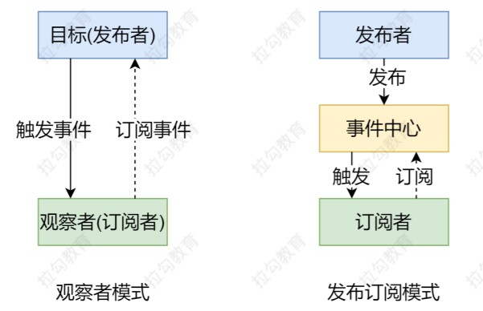
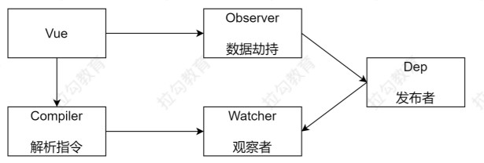
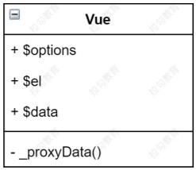
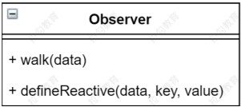
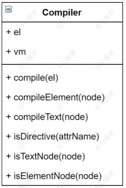
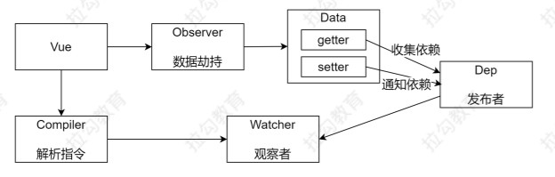
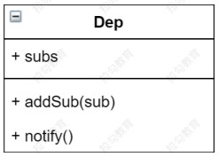
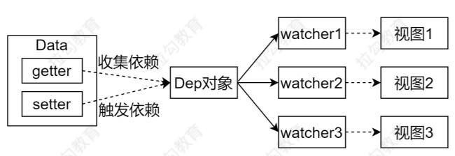
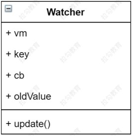
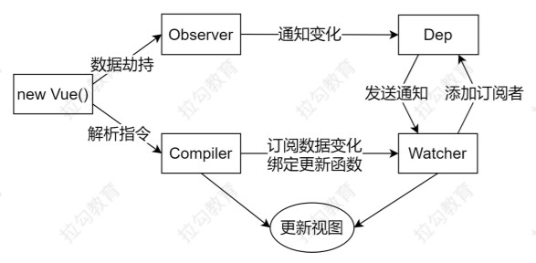

##  数据驱动

- 数据响应式：
  - 数据模型仅仅是普通的JavaScript对象，而当我们修改数据时，视图会进行更新，避免了繁琐的DOM操作，提高开发效率
- 双向绑定：
  - 数据改变，视图改变；视图改变，数据也随之改变
  - 我们可以使用v-model在表单元素上创建双向数据绑定
- 数据驱动
  - Vue最独特的特性之一
  - 开发过程中仅需要关注数据本身，不需要关心数据是如何渲染到视图


## 数据响应式的核心原理

### Vue2

- [Vue 2.x深入响应式原理](https://cn.vuejs.org/v2/guide/reactivity.html)

- [MDN-Object.defineProperty](https://developer.mozilla.org/zh-CN/docs/Web/JavaScript/Reference/Global_Objects/Object/defineProperty)

- 浏览器兼容IE8以上（不兼容IE8）

```javascript
<!DOCTYPE html>
<html lang="cn">
<head>
  <meta charset="UTF-8">
  <meta name="viewport" content="width=device-width, initial-scale=1.0">
  <meta http-equiv="X-UA-Compatible" content="ie=edge">
  <title>defineProperty</title>
</head>
<body>
  <div id="app">
    hello
  </div>
  <script>
    // 模拟 Vue 中的 data 选项
    let data = {
      msg: 'hello'
    }

    // 模拟 Vue 的实例
    let vm = {}

    // 数据劫持：当访问或者设置 vm 中的成员的时候，做一些干预操作
    Object.defineProperty(vm, 'msg', {
      // 可枚举（可遍历）
      enumerable: true,
      // 可配置（可以使用 delete 删除，可以通过 defineProperty 重新定义）
      configurable: true,
      // 当获取值的时候执行
      get () {
        console.log('get: ', data.msg)
        return data.msg
      },
      // 当设置值的时候执行
      set (newValue) {
        console.log('set: ', newValue)
        if (newValue === data.msg) {
          return
        }
        data.msg = newValue
        // 数据更改，更新 DOM 的值
        document.querySelector('#app').textContent = data.msg
      }
    })

    // 测试
    vm.msg = 'Hello World'
    console.log(vm.msg)
  </script>
</body>
</html>
```

当对象中有多个属性要做数据劫持时，可以通过遍历的方法来进行：

```javascript
<!DOCTYPE html>
<html lang="en">
<head>
  <meta charset="UTF-8">
  <meta name="viewport" content="width=device-width, initial-scale=1.0">
  <meta http-equiv="X-UA-Compatible" content="ie=edge">
  <title>defineProperty 多个成员</title>
</head>
<body>
  <div id="app">
    hello
  </div>
  <script>
    // 模拟 Vue 中的 data 选项
    let data = {
      msg: 'hello',
      count: 10
    }

    // 模拟 Vue 的实例
    let vm = {}

    proxyData(data)

    function proxyData(data) {
      // 遍历 data 对象的所有属性
      Object.keys(data).forEach(key => {
        // 把 data 中的属性，转换成 vm 的 setter/setter
        Object.defineProperty(vm, key, {
          enumerable: true,
          configurable: true,
          get () {
            console.log('get: ', key, data[key])
            return data[key]
          },
          set (newValue) {
            console.log('set: ', key, newValue)
            if (newValue === data[key]) {
              return
            }
            data[key] = newValue
            // 数据更改，更新 DOM 的值
            document.querySelector('#app').textContent = data[key]
          }
        })
      })
    }

    // 测试
    vm.msg = 'Hello World'
    console.log(vm.msg)
  </script>
</body>
</html>
```

### Vue3

- [MDN-Proxy](https://developer.mozilla.org/zh-CN/docs/Web/JavaScript/Reference/Global_Objects/Proxy)
- 直接监听对象，而非属性，更为简洁。
- ES6中新增，IE不支持，性能由浏览器优化

```javascript
<!DOCTYPE html>
<html lang="en">
<head>
  <meta charset="UTF-8">
  <meta name="viewport" content="width=device-width, initial-scale=1.0">
  <meta http-equiv="X-UA-Compatible" content="ie=edge">
  <title>Proxy</title>
</head>
<body>
  <div id="app">
    hello
  </div>
  <script>
    // 模拟 Vue 中的 data 选项
    let data = {
      msg: 'hello',
      count: 0
    }

    // 模拟 Vue 实例
    let vm = new Proxy(data, {
      // 执行代理行为的函数
      // 当访问 vm 的成员会执行
      get (target, key) {
        console.log('get, key: ', key, target[key])		// msg Hello World
        return target[key]
      },
      // 当设置 vm 的成员会执行
      set (target, key, newValue) {
        console.log('set, key: ', key, newValue)	// msg Hello World
        if (target[key] === newValue) {
          return
        }
        target[key] = newValue
        document.querySelector('#app').textContent = target[key]
      }
    })

    // 测试
    vm.msg = 'Hello World'
    console.log(vm.msg)
  </script>
</body>
</html>
```

## 发布订阅与观察者模式

### 发布订阅模式

发布/订阅模式 

- 订阅者 
- 发布者 
- 信号中心 

> 我们假定，存在一个"信号中心"，某个任务执行完成，就向信号中心"发布"（publish）一个信号，其他任务可以向信号中心"订阅"（subscribe）这个信号，从而知道什么时候自己可以开始执行。这就叫做"发布/订阅模式"（publish-subscribe pattern）.
>
> 订阅：家长
>
> 发布：老师
>
> 信号中心：班级
>
> 家长通过订阅学生成绩信息，当老师发布了成绩信息后，家长就可以获取到成绩信息。

Vue中的自定义事件

- [Vue的自定义事件](https://cn.vuejs.org/v2/guide/migration.html#dispatch-%E5%92%8C-broadcast-%E6%9B%BF%E6%8D%A2)

```javascript
let vm = new Vue()	// vm相当于信号中心

vm.$on('dataChange', () => {	// 通过$on注册事件，同一个事件可以注册多个事件处理函数，参数：事件名，事件处理函数
console.log('dataChange')
})

vm.$on('dataChange', () => {
console.log('dataChange1')
})

vm.$emit('dataChange')	// 事件注册完毕后，在特定的时间通过$emit来触发事件
```

- 兄弟组件通信过程

```javascript
// eventBus.js
// 事件中心
let eventHub = new Vue()


// ComponentA.vue
// 发布者
addTodo: function () {
	// 发布消息(事件)
	eventHub.$emit('add-todo', { text: this.newTodoText })
	this.newTodoText = ''
}


// ComponentB.vue
// 订阅者
created: function () {
	// 订阅消息(事件)
	eventHub.$on('add-todo', this.addTodo)
}
```

- 发布订阅模式

使用方式：

```html
<!DOCTYPE html>
<html lang="en">

<head>
  <meta charset="UTF-8">
  <meta name="viewport" content="width=device-width, initial-scale=1.0">
  <title>Vue 自定义事件</title>
</head>

<body>
  <script src="./js/vue.js"></script>
  <script>
    // Vue 自定义事件
    let vm = new Vue()

    // vm中存储事件格式：
    // { 'click': [fn1, fn2], 'change': [fn] }

    // 注册事件(订阅消息)
    vm.$on('dataChange', () => {
      console.log('dataChange')
    })

    vm.$on('dataChange', () => {
      console.log('dataChange1')
    })
    // 触发事件(发布消息)
    vm.$emit('dataChange')
  </script>
</body>

</html>
```

原理实现：

```html
<!DOCTYPE html>
<html lang="cn">

<head>
  <meta charset="UTF-8">
  <meta name="viewport" content="width=device-width, initial-scale=1.0">
  <title>发布订阅模式</title>
</head>

<body>
  <script>
    // 事件触发器
    class EventEmitter {
      constructor() {
        // { 'click': [fn1, fn2], 'change': [fn] }
        this.subs = Object.create(null) // 创建一个原型为null的对象。可以提升性能
      }

      // 注册事件
      $on(eventType, handler) {
        this.subs[eventType] = this.subs[eventType] || []
        this.subs[eventType].push(handler)
      }

      // 触发事件
      $emit(eventType) {
        if (this.subs[eventType]) {
          this.subs[eventType].forEach(handler => {
            handler()
          })
        }
      }
    }

    // 测试
    let em = new EventEmitter()
    em.$on('click', () => {
      console.log('click1')
    })
    em.$on('click', () => {
      console.log('click2')
    })

    em.$emit('click')
  </script>
</body>

</html>
```

<div class="warning">

> 此处仅仅体现了信号中心，并没有体现发布者与响应者的关系，而发布者与响应者的关系可以通过兄弟组件传值的方式来实现

</div>


[Object.create](https://developer.mozilla.org/zh-CN/docs/Web/JavaScript/Reference/Global_Objects/Object/create)

### 观察者模式

> 观察者模式与发布订阅模式的区别是其没有事件中心，只有发布者和订阅者，并且发布者需要知道订阅者的存在。其中订阅者又叫观察者。

- 观察者(订阅者) -- Watcher 
  - update()：当事件发生时，具体要做的事情 
- 目标(发布者) -- Dep
  - subs 数组：存储所有的观察者 
  - addSub()：添加观察者 
  - notify()：当事件发生，调用所有观察者的 update() 方法
- 没有事件中心

原理实现：

```html
<!DOCTYPE html>
<html lang="en">

<head>
    <meta charset="UTF-8">
    <meta http-equiv="X-UA-Compatible" content="IE=edge">
    <meta name="viewport" content="width=device-width, initial-scale=1.0">
    <title>观察者模式</title>
</head>

<body>
    <script type="text/javascript">
        // 发布者-目标
        class Dep {
            constructor() {
                // 记录所有的订阅者
                this.subs = []
            }

            addSub(sub) {
                if (sub && sub.update) {
                    this.subs.push(sub)
                }
            }

            notify() {
                this.subs.forEach(sub => {
                    sub.update()
                })
            }
        }

        // 订阅者-观察者
        class Watcher {
            update() {
                console.log('update')
            }
        }

        // 测试
        const dep = new Dep()
        const watcher = new Watcher()
        dep.addSub(watcher)
        dep.notify()
    </script>
</body>

</html>
```

### 总结

- 观察者模式是由具体目标调度，比如当事件触发，Dep 就会去调用观察者的方法，所以观察者模式的订阅者与发布者之间是存在依赖的。 
- 发布/订阅模式由统一调度中心调用，因此发布者和订阅者不需要知道对方的存在。



## Vue响应式原理模拟

整体结构：



### Vue

- 功能

  - 负责接收初始化的参数（选项）
  - 负责把data中的属性注入到Vue实例，转换成getter/setter
  - 负责调用observer监听data所有属性的变化，当属性发生变化的时候更新视图
  - 负责调用compiler解析指令/插值表达式

- 结构

  

```javascript
class Vue {
    constructor(options) {
        // 1.通过属性保存选项的数据
        this.$options = options || {}
        this.$data = options.data || {}
        this.$el = typeof options.el === 'string' ? document.querySelector(options.el) : options.el

        // 2.把data中的成员转换为getter和setter，注入到vue实例中
        this._proxyData(this.$data)

        // 3.调用observer对象，监听数据的变化

        // 4.调用compiler对象，解析插值表达式
    }

    // 让Vue代理data中的属性
    _proxyData(data) {
        // 遍历data中的所有属性
        Object.keys(data).forEach(key => {
            // 把data的属性注入到vue实例中
            Object.defineProperty(this, key, {
                enumerable: true,
                configurable: true,
                get() {
                    return data[key]
                },
                set(newValue) {
                    if (newValue === data[key]) {  //如果数据没有发生变化，直接返回
                        return
                    }
                    data[key] = newValue
                }
            })
        })
    }
}
```

### Observer

- 功能

  - 负责把data选项中的属性转换成响应式数据（上一步Vue.js只是将data的属性注入到vue实例中）
  - data中的某个属性也是对象，需要把该属性也转换成响应式数据
  - 数据变化发送通知
  - 如果未把data中的数据变为响应式，会导致之后修改了data中的属性时，vm中代理的数据无法修改（因为vue.js中修改的是代理的data中的数据，除非给data添加响应式，才能在修改data时，vm中代理的数据也得到修改）。

- 结构

  

```javascript
// 将$data中的属性转为getter和setter
class Observer {

    constructor(data) {
        this.walk(data)
    }

    // 遍历对象的所有属性
    walk(data) {
        // 1.判断data是否是对象
        if (!data || typeof data !== 'object') {
            return
        }
        // 2.遍历data对象的所有属性
        Object.keys(data).forEach(key => {
            this.defineReactive(data, key, data[key])
        })
    }
    // 调用Object.defineProperty把属性转换为getter和setter
    defineReactive(obj, key, value) {
        let that = this
        // 如果value此时是对象，把val内部的属性转换成响应式数据
        this.walk(value)
        Object.defineProperty(obj, key, {
            enumerable: true,
            configurable: true,
            // 按理说，当defineReactive方法调用完成之后，value作为一个局部变量应该被释放掉。但此处由于外部（$data）对这个get函数有引用，而get中使用了value，故发送了闭包。
            get() {
                return value	// 此处不能返回obj[key]，因为一旦写了obj[key]，就会触发这个get函数，导致死递归
            },
            set(newValue) {
                if (newValue === value) {
                    return
                }
                value = newValue
                // 发送通知
                that.walk(newValue)     // 此处的this指向data对象，此处调用walk确保修改后的数据也是响应式的。
            }
        })
    }
}
```

```javascript
class Vue {
    constructor(options) {
        // 1.通过属性保存选项的数据
        this.$options = options || {}
        this.$data = options.data || {}
        this.$el = typeof options.el === 'string' ? document.querySelector(options.el) : options.el

        // 2.把data中的成员转换为getter和setter，注入到vue实例中
        this._proxyData(this.$data)

        // 3.调用observer对象，监听数据的变化
        new Observer(this.$data)

        // 4.调用compiler对象，解析插值表达式
    }

    // 让Vue代理data中的属性
    _proxyData(data) {
        // 遍历data中的所有属性
        Object.keys(data).forEach(key => {
            // 把data的属性注入到vue实例中
            Object.defineProperty(this, key, {
                enumerable: true,
                configurable: true,
                get() {
                    return data[key]
                },
                set(newValue) {
                    if (newValue === data[key]) {  //如果数据没有发生变化，直接返回
                        return
                    }
                    data[key] = newValue
                }
            })
        })
    }
}
```

```html
<!DOCTYPE html>
<html lang="cn">

<head>
  <meta charset="UTF-8">
  <meta name="viewport" content="width=device-width, initial-scale=1.0">
  <meta http-equiv="X-UA-Compatible" content="ie=edge">
  <title>Mini Vue</title>
</head>

<body>
  <div id="app">
    <h1>差值表达式</h1>
    <h3>{{ msg }}</h3>
    <h3>{{ count }}</h3>
    <h1>v-text</h1>
    <div v-text="msg"></div>
    <h1>v-model</h1>
    <input type="text" v-model="msg">
    <input type="text" v-model="count">
  </div>
  <script src="./js/observer.js"></script>
  <script src="./js/vue.js"></script>
  <script>
    let vm = new Vue({
      el: '#app',
      data: {
        msg: 'Hello Vue',
        count: 100,
      }
    })
    console.log(vm.msg)		// 当我们此处调用vm.msg时，会先去找Vue中的msg属性，由于其get返回的是data[key]，所以又会去找$data中的msg(及去找Observer中的get方法，返回val)
  </script>
</body>

</html>
```

### Compiler

- 功能

  - 负责编译模板，解析指令/插值表达式
  - 负责页面的首次渲染
  - 当数据变化后重新渲染视图

- 结构

  

```javascript
class Compiler {
    constructor(vm) {
        this.el = vm.$el
        this.vm = vm
        this.compile(this.el)
    }

    // 编译模板，处理文本节点和元素节点
    compile(el) {
        let childNodes = el.childNodes
        Array.from(childNodes).forEach(node => {    // 此处使用箭头函数，确保compiler
            // 处理文本节点
            if (this.isTextNode(node)) {
                this.compileText(node)
            } else if (this.isElementNode(node)) {
                // 处理元素节点
                this.compileElement(node)
            }

            // 判断node节点，是否有子节点，如果有子节点，要递归调用compile
            if (node.childNodes && node.childNodes.length) {
                this.compile(node)
            }
        })
    }

    // 编译元素节点，处理指令
    compileElement(node) {
        // console.log(node.attributes)     // 此处node.attributes为一个记录元素属性的伪数组
        // 遍历所有的属性节点
        Array.from(node.attributes).forEach(attr => {
            // 判断是否是指令
            let attrName = attr.name
            if (this.isDirective(attrName)) {
                // v-text --> text
                attrName = attrName.substr(2)
                let key = attr.value
                this.update(node, key, attrName)
            }
        })
    }

    update(node, key, attrName) {   // key：属性名，attrName：指令名(不包括v-)
        let updateFn = this[attrName + 'Updater']   // 通过字符串拼接的方式来判断调用哪个方法
        updateFn && updateFn(node, this.vm[key])    // 确保updateFn存在后再调用
    }

    // 处理v-text指令
    textUpdater(node, value) {
        node.textContent = value
    }

    // 处理v-model指令
    modelUpdater(node, value) {
        node.value = value
    }

    // 编译文本节点，处理差值表达式
    compileText(node) {
        // console.dir(node)    // 此处文本节点若为非换行符会被浏览器转换，故可以使用dir方式输出
        // {{ msg }}
        let reg = /\{\{(.+?)\}\}/
        let value = node.textContent
        if (reg.test(value)) {
            let key = RegExp.$1.trim()     // 获取正则表达式第一个()里的内容(变量名)，并去掉空格
            node.textContent = value.replace(reg, this.vm[key])     // 将value中的差值表达式替换为对应变量的值
        }
    }

    // 判断元素属性是否是指令
    isDirective(attrName) {
        return attrName.startsWith('v-')
    }

    // 判断传入的节点是否是文本节点（node.nodeType为3表示是文本节点，为1表示是元素节点）
    isTextNode(node) {
        return node.nodeType === 3
    }

    // 判断节点是否是元素节点
    isElementNode(node) {
        return node.nodeType === 1
    }
}
```

```javascript
class Vue {
    constructor(options) {
        // 1.通过属性保存选项的数据
        this.$options = options || {}
        this.$data = options.data || {}
        this.$el = typeof options.el === 'string' ? document.querySelector(options.el) : options.el

        // 2.把data中的成员转换为getter和setter，注入到vue实例中
        this._proxyData(this.$data)

        // 3.调用observer对象，监听数据的变化
        new Observer(this.$data)

        // 4.调用compiler对象，解析插值表达式
        new Compiler(this)
    }

    // 让Vue代理data中的属性
    _proxyData(data) {
        // 遍历data中的所有属性
        Object.keys(data).forEach(key => {
            // 把data的属性注入到vue实例中
            Object.defineProperty(this, key, {
                enumerable: true,
                configurable: true,
                get() {
                    return data[key]
                },
                set(newValue) {
                    if (newValue === data[key]) {  //如果数据没有发生变化，直接返回
                        return
                    }
                    data[key] = newValue
                }
            })
        })
    }
}
```

### Dep(Dependency)



- 功能

  - 收集依赖，添加观察者(watcher)
  - 通知所有观察者

- 结构

  

```javascript
class Dep {
    constructor() {
        // 存储所有的观察者
        this.subs = []
    }
    // 添加观察者
    addSub(sub) {
        if (sub && sub.update) {
            this.subs.push(sub)
        }
    }
    // 发送通知
    notify() {
        this.subs.forEach(sub => {
            sub.update()
        })
    }
}
```

```javascript
// 将$data中的属性转为getter和setter
class Observer {

    constructor(data) {
        this.walk(data)
    }

    // 遍历对象的所有属性
    walk(data) {
        // 1.判断data是否是对象
        if (!data || typeof data !== 'object') {
            return
        }
        // 2.遍历data对象的所有属性
        Object.keys(data).forEach(key => {
            this.defineReactive(data, key, data[key])
        })
    }
    // 调用Object.defineProperty把属性转换为getter和setter
    defineReactive(obj, key, value) {
        let that = this
        // 负责收集依赖，并发送通知
        let dep = new Dep()
        // 如果value此时是对象，把val内部的属性转换成响应式数据
        this.walk(value)
        Object.defineProperty(obj, key, {
            enumerable: true,
            configurable: true,
            // 按理说，当defineReactive方法调用完成之后，value作为一个局部变量应该被释放掉。但此处由于外部（$data）对这个get函数有引用，而get中使用了value，故发送了闭包。
            get() {
                // 收集依赖
                Dep.target && dep.addSub(Dep.target)
                return value	// 此处不能返回obj[key]，因为一旦写了obj[key]，就会触发这个get函数，导致死递归
            },
            set(newValue) {
                if (newValue === value) {
                    return
                }
                value = newValue
                that.walk(newValue)     // 此处的this指向data对象，此处调用walk确保修改后的数据也是响应式的。
                // 发送通知
                dep.notify()
            }
        })
    }
}
```

### Watcher



- 功能

  - 当数据变化触发依赖，dep 通知所有的Watcher实例更新视图
  - 自身实例化的时候往dep对象中添加自己（dep.sub）

- 结构

  

```javascript
class Watcher {
    constructor(vm, key, cb) {
        this.vm = vm
        // data中的属性名称
        this.key = key
        // 回调函数负责更新视图
        this.cb = cb

        // 把watcher对象记录到Dep类的静态属性target
        Dep.target = this
        // 触发get方法，在get方法中会调用addSub
        this.oldValue = vm[key]     // 当我们访问vm[key]时，就会触发observe中的get方法。把target添加到dep对象中
        Dep.target = null
    }
    // 当数据发生变化的时候更新视图
    update() {
        let newValue = this.vm[this.key]
        if (this.oldValue === newValue) {
            return
        }
        this.cb(newValue)
    }
}
```

### 创建Watcher对象

> 主要是在Compiler中处理差值表达式和处理指令的地方创建

```javascript
class Compiler {
    constructor(vm) {
        this.el = vm.$el
        this.vm = vm
        this.compile(this.el)
    }

    // 编译模板，处理文本节点和元素节点
    compile(el) {
        let childNodes = el.childNodes
        Array.from(childNodes).forEach(node => {    // 此处使用箭头函数，确保compiler
            // 处理文本节点
            if (this.isTextNode(node)) {
                this.compileText(node)
            } else if (this.isElementNode(node)) {
                // 处理元素节点
                this.compileElement(node)
            }

            // 判断node节点，是否有子节点，如果有子节点，要递归调用compile
            if (node.childNodes && node.childNodes.length) {
                this.compile(node)
            }
        })
    }

    // 编译元素节点，处理指令
    compileElement(node) {
        // console.log(node.attributes)     // 此处node.attributes为一个记录元素属性的伪数组
        // 遍历所有的属性节点
        Array.from(node.attributes).forEach(attr => {
            // 判断是否是指令
            let attrName = attr.name
            if (this.isDirective(attrName)) {
                // v-text --> text
                attrName = attrName.substr(2)
                let key = attr.value
                this.update(node, key, attrName)
            }
        })
    }

    update(node, key, attrName) {   // key：属性名，attrName：指令名(不包括v-)
        let updateFn = this[attrName + 'Updater']   // 通过字符串拼接的方式来判断调用哪个方法
        updateFn && updateFn.call(this, node, this.vm[key], key)    // 确保updateFn存在后再调用
    }

    // 处理v-text指令
    textUpdater(node, value, key) {
        node.textContent = value
        new Watcher(this.vm, key, (newValue) => {
            node.textContent = newValue
        })
    }

    // 处理v-model指令
    modelUpdater(node, value, key) {
        node.value = value
        new Watcher(this.vm, key, (newValue) => {
            node.value = newValue
        })
    }

    // 编译文本节点，处理差值表达式
    compileText(node) {
        // console.dir(node)    // 此处文本节点若为非换行符会被浏览器转换，故可以使用dir方式输出
        // {{ msg }}
        let reg = /\{\{(.+?)\}\}/
        let value = node.textContent
        if (reg.test(value)) {
            let key = RegExp.$1.trim()     // 获取正则表达式第一个()里的内容(变量名)，并去掉空格
            node.textContent = value.replace(reg, this.vm[key])     // 将value中的差值表达式替换为对应变量的值

            // 创建watcher对象，当数据改变更新视图。创建时在构造函数处会把这个watcher对象自动添加到dep的subs中
            new Watcher(this.vm, key, (newValue) => {
                node.textContent = newValue
            })
        }
    }

    // 判断元素属性是否是指令
    isDirective(attrName) {
        return attrName.startsWith('v-')
    }

    // 判断传入的节点是否是文本节点（node.nodeType为3表示是文本节点，为1表示是元素节点）
    isTextNode(node) {
        return node.nodeType === 3
    }

    // 判断节点是否是元素节点
    isElementNode(node) {
        return node.nodeType === 1
    }
}
```

### 双向绑定

> 在Compiler中处理v-model的函数中为表单元素添加事件。当数据改变时，会把文本框的值取出来并且重新赋值给vm中的数据，进而触发响应式机制，在响应式机制中，当数据发生改变时，就会重新渲染视图。

```javascript
// 处理v-model指令
modelUpdater(node, value, key) {
    node.value = value
    new Watcher(this.vm, key, (newValue) => {
        node.value = newValue
    })
    // 给表单元素添加input事件，实现双向绑定
    node.addEventListener('input', () => {
        this.vm[key] = node.value
    })
}
```

### 总结

> 问题

- 给属性重新赋值成对象，是否是响应式的？

  是，当重新给其赋值时，会触发set方法，在set方法中会触发walk方法，遍历对象的所有属性，为其添加响应式。

- 给Vue实例新增一个成员是否是响应式的？

  不是，因为为data对象添加响应式是通过在new Vue时调用new Observer才实现的。而之后再为其添加属性，只是给Vue实例上添加了一个普通属性而已。（可以通过Vue.set来实现）。

> 整体流程



```javascript
class Vue {
    constructor(options) {
        // 1.通过属性保存选项的数据
        this.$options = options || {}
        this.$data = options.data || {}
        this.$el = typeof options.el === 'string' ? document.querySelector(options.el) : options.el

        // 2.把data中的成员转换为getter和setter，注入到vue实例中
        this._proxyData(this.$data)

        // 3.调用observer对象，监听数据的变化
        new Observer(this.$data)

        // 4.调用compiler对象，解析插值表达式
        new Compiler(this)
    }

    // 让Vue代理data中的属性
    _proxyData(data) {
        // 遍历data中的所有属性
        Object.keys(data).forEach(key => {
            // 把data的属性注入到vue实例中
            Object.defineProperty(this, key, {
                enumerable: true,
                configurable: true,
                get() {
                    return data[key]
                },
                set(newValue) {
                    if (newValue === data[key]) {  //如果数据没有发生变化，直接返回
                        return
                    }
                    data[key] = newValue
                }
            })
        })
    }
}
```

```javascript
// 将$data中的属性转为getter和setter
class Observer {

    constructor(data) {
        this.walk(data)
    }

    // 遍历对象的所有属性
    walk(data) {
        // 1.判断data是否是对象
        if (!data || typeof data !== 'object') {
            return
        }
        // 2.遍历data对象的所有属性
        Object.keys(data).forEach(key => {
            this.defineReactive(data, key, data[key])
        })
    }
    // 调用Object.defineProperty把属性转换为getter和setter
    defineReactive(obj, key, value) {
        let that = this
        // 负责收集依赖，并发送通知
        let dep = new Dep()
        // 如果value此时是对象，把val内部的属性转换成响应式数据
        this.walk(value)
        Object.defineProperty(obj, key, {
            enumerable: true,
            configurable: true,
            // 按理说，当defineReactive方法调用完成之后，value作为一个局部变量应该被释放掉。但此处由于外部（$data）对这个get函数有引用，而get中使用了value，故发送了闭包。
            get() {
                // 收集依赖
                Dep.target && dep.addSub(Dep.target)
                return value	// 此处不能返回obj[key]，因为一旦写了obj[key]，就会触发这个get函数，导致死递归
            },
            set(newValue) {
                if (newValue === value) {
                    return
                }
                value = newValue
                that.walk(newValue)     // 此处的this指向data对象，此处调用walk确保修改后的数据也是响应式的。
                // 发送通知
                dep.notify()
            }
        })
    }
}
```

```javascript
class Compiler {
    constructor(vm) {
        this.el = vm.$el
        this.vm = vm
        this.compile(this.el)
    }

    // 编译模板，处理文本节点和元素节点
    compile(el) {
        let childNodes = el.childNodes
        Array.from(childNodes).forEach(node => {    // 此处使用箭头函数，确保compiler
            // 处理文本节点
            if (this.isTextNode(node)) {
                this.compileText(node)
            } else if (this.isElementNode(node)) {
                // 处理元素节点
                this.compileElement(node)
            }

            // 判断node节点，是否有子节点，如果有子节点，要递归调用compile
            if (node.childNodes && node.childNodes.length) {
                this.compile(node)
            }
        })
    }

    // 编译元素节点，处理指令
    compileElement(node) {
        // console.log(node.attributes)     // 此处node.attributes为一个记录元素属性的伪数组
        // 遍历所有的属性节点
        Array.from(node.attributes).forEach(attr => {
            // 判断是否是指令
            let attrName = attr.name
            if (this.isDirective(attrName)) {
                // v-text --> text
                attrName = attrName.substr(2)
                let key = attr.value
                this.update(node, key, attrName)
            }
            
            // 判断是否是处理事件的指令
            if (this.isEventDirective(attrName)) {
              this.eventHandler(node, this.vm, attrName, key)
            }
        })
    }
    
    // 判断是否是处理事件的指令
    isEventDirective (attrName) {
        return attrName.indexOf('on') === 0
    }

    eventHandler (node, vm, attrName, fnName) {
        // on:click   on:input
        let eventType = attrName.substr(attrName.indexOf(':') + 1)
        let fn = this.vm.$options.methods && this.vm.$options.methods[fnName]
        fn && node.addEventListener(eventType, fn.bind(this.vm))
    }

    update(node, key, attrName) {   // key：属性名，attrName：指令名(不包括v-)
        let updateFn = this[attrName + 'Updater']   // 通过字符串拼接的方式来判断调用哪个方法
        updateFn && updateFn.call(this, node, this.vm[key], key)    // 确保updateFn存在后再调用
    }

    // 处理v-text指令
    textUpdater(node, value, key) {
        node.textContent = value
        new Watcher(this.vm, key, (newValue) => {
            node.textContent = newValue
        })
    }

    // 处理v-model指令
    modelUpdater(node, value, key) {
        node.value = value
        new Watcher(this.vm, key, (newValue) => {
            node.value = newValue
        })
        // 给表单元素添加input事件，实现双向绑定
        node.addEventListener('input', () => {
            this.vm[key] = node.value
        })
    }

    // 编译文本节点，处理差值表达式
    compileText(node) {
        // console.dir(node)    // 此处文本节点若为非换行符会被浏览器转换，故可以使用dir方式输出
        // {{ msg }}
        let reg = /\{\{(.+?)\}\}/
        let value = node.textContent
        if (reg.test(value)) {
            let key = RegExp.$1.trim()     // 获取正则表达式第一个()里的内容(变量名)，并去掉空格
            node.textContent = value.replace(reg, this.vm[key])     // 将value中的差值表达式替换为对应变量的值

            // 创建watcher对象，当数据改变更新视图。创建时在构造函数处会把这个watcher对象自动添加到dep的subs中
            new Watcher(this.vm, key, (newValue) => {
                node.textContent = newValue
            })
        }
    }

    // 判断元素属性是否是指令
    isDirective(attrName) {
        return attrName.startsWith('v-')
    }

    // 判断传入的节点是否是文本节点（node.nodeType为3表示是文本节点，为1表示是元素节点）
    isTextNode(node) {
        return node.nodeType === 3
    }

    // 判断节点是否是元素节点
    isElementNode(node) {
        return node.nodeType === 1
    }
}
```

```javascript
class Dep {
    constructor() {
        // 存储所有的观察者
        this.subs = []
    }
    // 添加观察者
    addSub(sub) {
        if (sub && sub.update) {
            this.subs.push(sub)
        }
    }
    // 发送通知
    notify() {
        this.subs.forEach(sub => {
            sub.update()
        })
    }
}
```

```javascript
class Watcher {
    constructor(vm, key, cb) {
        this.vm = vm
        // data中的属性名称
        this.key = key
        // 回调函数负责更新视图
        this.cb = cb

        // 把watcher对象记录到Dep类的静态属性target
        Dep.target = this
        // 触发get方法，在get方法中会调用addSub
        this.oldValue = vm[key]     // 当我们访问vm[key]时，就会触发observe中的get方法。把target添加到dep对象中
        Dep.target = null
    }
    // 当数据发生变化的时候更新视图
    // update方法在observer的set中，由dep.notify()调用
    update() {
        let newValue = this.vm[this.key]
        if (this.oldValue === newValue) {
            return
        }
        this.cb(newValue)
    }
}
```

