## 自动化构建

> 一切重复工作本应自动化。
>
> 源代码  ==自动化构建==> 生产代码   （自动化构建工作流）
>
> 作用：尽可能脱离运行环境兼容带来的问题，使得在开发阶段能够使用提高效率的语法、规范和标准，构建转换那些不被支持的【特性】

### 使用NPM Script

首先我们来使用scss工具来将scss文件转换为css文件

1. 新建scss文件

```scss
$body-bg:#f8f9fb;
$body-color:#333;

body{
    margin: 0 auto;
    padding:20px;
    max-width:800px;
    background-color: $body-bg;
    color: $body-color;
}
```

2. 安装scss依赖包

```javascript
yarn add sass --dev
```

3. 运行如下命令

```javascript
.\node_modules\.bin\sass scss/main.scss css/style.css
```

4. 此时可以看见scss的命令行工具帮助我们生成了css与map.css文件

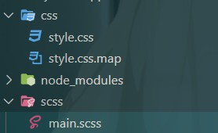

<div class="warning">

> 此种方法每次都要重复的输入这些复杂的命令，而且他人也无法理解如何执行这些命令。所以我们可以使用NPM Scripts。

</div>

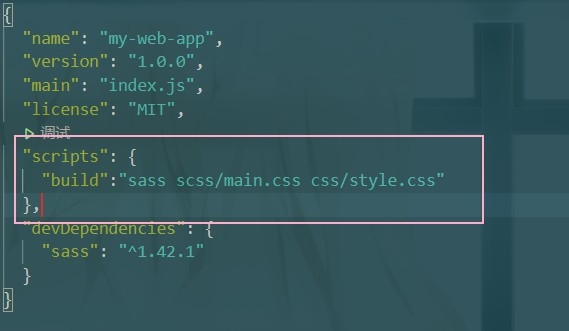

5. 使用 yarn build，可以实现第3步同样的效果。


同时，NPM Scripts也是实现自动化构建工作流的最简方式。

1. 安装browser-sync模块，用于启动测试服务器
2. 修改pakeage.json，使用preserve这种NPM Scripts中的钩子机制，来在serve前自动的进行scss编译转换

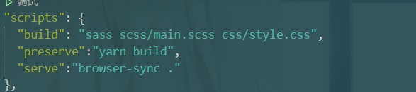

3. 使用 yarn serve，来启动该网页。
4. 此时即可以完成在启动服务器自动的编译scss文件。
5. 为build命令添加 --watch命令，使得scss文件发生改变时会自动重新编译。

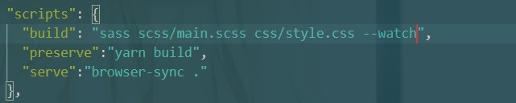

​		但是此种情况会导致执行完build后卡住，无法继续执行serve命令

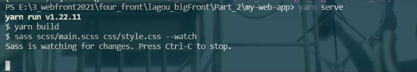

6. 安装npm-run-all 模块

```javascript
yarn add npm-run-all --dev
```

7. 修改scripts

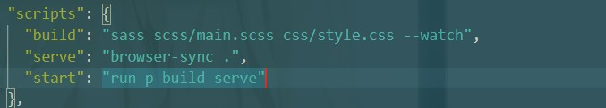

8. 执行 npm run start命令，此时两个命令可以一同执行。且修改scss文件时会重新编译。

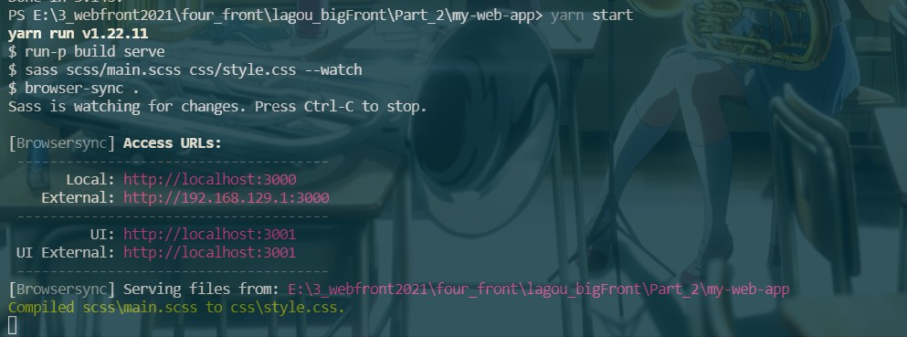

9. 修改scripts，在browser-sync中添加如下参数，使得其可以检测文件变化并随之做出即使刷新

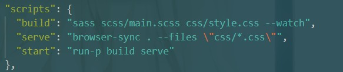

### 常用的自动化构建工具

> 可以看到，NPM Script可以解决一些相对简单的自动化构建工作，但是对于一些复杂的构建工作而言，NPM Script则会显得很吃力。此时就需要更加专业的构建工具。

市面上常用的自动化构建工具：

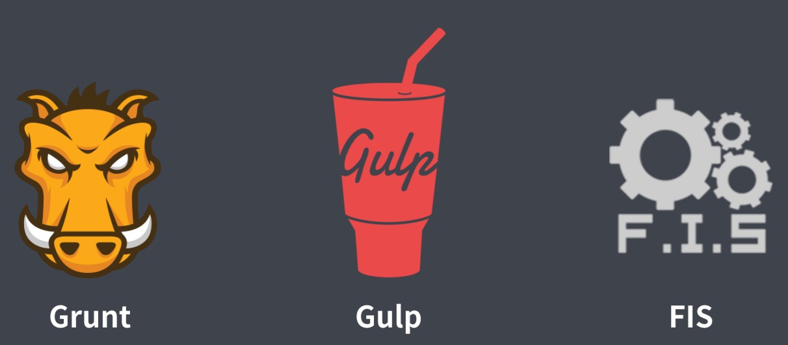

<div class="warning">

> 严格来说，Webpack算是模块打包工具，不算在自动化构建工具内

</div>

Grunt：构建速度慢，因为其工作过程是基于临时文件来实现的（磁盘读写）。

Gulp：解决了Grunt中构建速度慢的问题，因为其是基于内存实现的，支持同时执行多个任务。

FIS：百度团队推出，大而全，相对于前面两种微内核的形式，其更像一种捆绑套餐，将一些典型需求尽可能的集中在内部了。


## Grunt

### 使用步骤

1. 新建目录，初始化，安装grunt

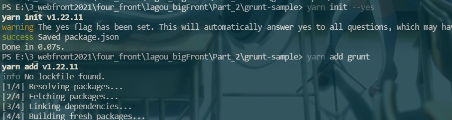

2. 新建gruntfile.js，写入如下代码

```javascript
// Grunt 的入口文件
// 用于定义一些需要 Grunt 自动执行的任务
// 需要导出一个函数
// 此函数接收一个 grunt 的形参，内部提供一些创建任务时可以用到的API

module.exports = grunt => {
    grunt.registerTask('foo', () => {
        console.log('hello grunt~')
    })
}
```

3. 在命令行执行如下命令

```javascript
yarn grunt foo
```

​		此时便可看到如下结果：

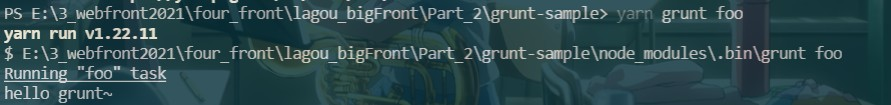

4. 在导出的函数中新建一个任务，并为其添加第二个参数

```javascript
grunt.registerTask('bar', '任务描述', () => {
    console.log('other task~')
})
```

5. 执行yarn grunt --help

   此时可以看到任务描述变为了自定义的任务描述


6. 在导出的函数中新建一个任务，任务名称为default

```javascript
grunt.registerTask('default', () => {
    console.log('default task~')
})
```

7. 此时这个任务会被当做grunt的默认任务，只需要输入yarn grunt即可执行该任务

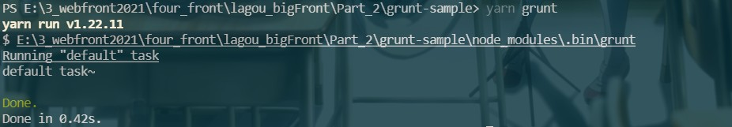

8. 使用default来映射任务

   将gruntfile.js修改为如下形式

```javascript
// Grunt 的入口文件
// 用于定义一些需要 Grunt 自动执行的任务
// 需要导出一个函数
// 此函数接收一个 grunt 的形参，内部提供一些创建任务时可以用到的API

module.exports = grunt => {
    grunt.registerTask('foo', () => {
        console.log('hello grunt~')
    })
    grunt.registerTask('bar', '任务描述', () => {
        console.log('other task~')
    })
    grunt.registerTask('default',['foo','bar'])
}
```

9. 执行yarn grunt，此时会依次执行foo和bar任务。

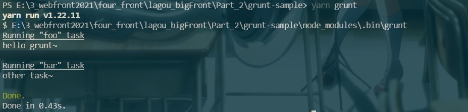

10. 添加如下代码，模拟grunt中的异步任务（grunt中默认支持同步模式，如果需要异步操作，必须使用this.async()来得到一个回调函数，在异步任务完成后调用这个回调函数来表示异步任务完成）

```javascript
grunt.registerTask('async-task', function () {
        const done = this.async()
        setTimeout(() => {
            console.log('async task working~')
            done()
        },5000)
    })
```

### 标记任务失败

> 如果在构建任务的逻辑代码中发生错误，例如需要的文件找不到了，此时便可以将该任务标记为一个失败的任务，具体实现方式为在函数体return false。

1. 任务函数执行过程中如果返回 false，则意味着此任务执行失败

```javascript
module.exports = grunt => {
  // 任务函数执行过程中如果返回 false
  // 则意味着此任务执行失败
  grunt.registerTask('bad', () => {
    console.log('bad working~')
    return false
  })
}
```

执行结果：

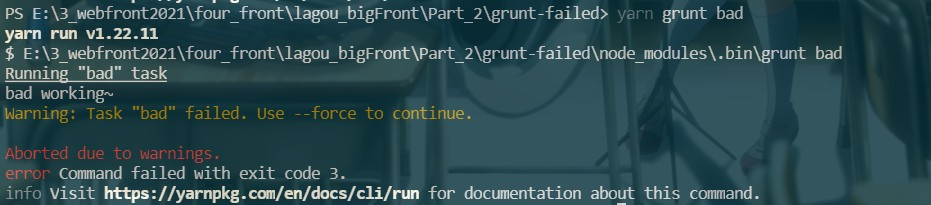

2. 如果一个任务列表中的某个任务执行失败，则后续任务默认不会运行，除非 grunt 运行时指定 --force 参数强制执行

```javascript
module.exports = grunt => {
  grunt.registerTask('bad', () => {
    console.log('bad working~')
    return false
  })

  grunt.registerTask('foo', () => {
    console.log('foo working~')
  })

  grunt.registerTask('bar', () => {
    console.log('bar working~')
  })

  // 如果一个任务列表中的某个任务执行失败
  // 则后续任务默认不会运行
  // 除非 grunt 运行时指定 --force 参数强制执行
  grunt.registerTask('default', ['foo', 'bad', 'bar'])
}
```

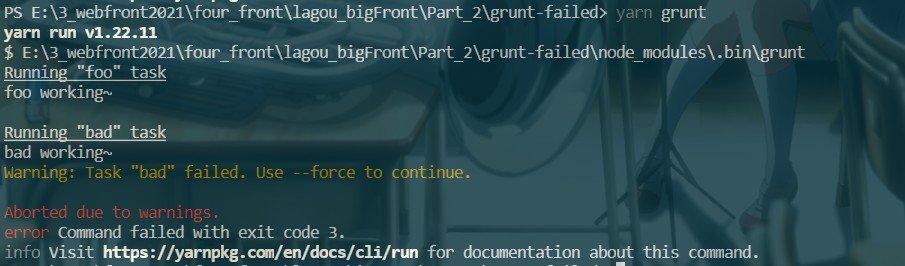

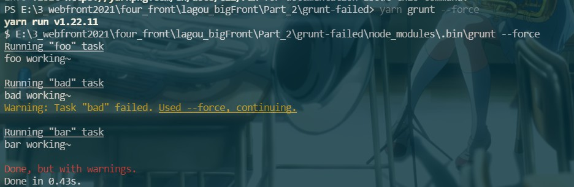

3. 异步函数中标记当前任务执行失败的方式是为回调函数指定一个 false 的实参

```javascript
module.exports = grunt => {
    grunt.registerTask('bad-async', function () {
        const done = this.async()
        setTimeout(() => {
            console.log('async task working~')
            done(false)
        }, 1000)
    })
}
```

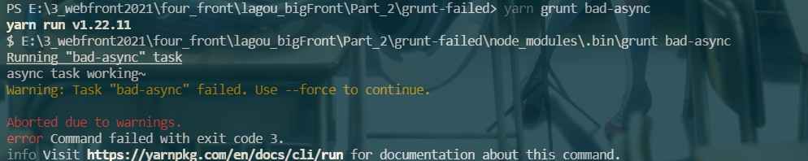

### 配置选项方法

> 除了registerTask方法之外，grunt还提供了一个用于添加配置选项的API：initConfig。

```javascript
module.exports = grunt => {
  // grunt.initConfig() 用于为任务添加一些配置选项
  grunt.initConfig({
    // 键一般对应任务的名称
    // 值可以是任意类型的数据
    foo: {
      bar: 'baz'
    }
  })

  grunt.registerTask('foo', () => {
    // 任务中可以使用 grunt.config() 获取配置
    console.log(grunt.config('foo'))
    // 如果属性值是对象的话，config 中可以使用点的方式定位对象中属性的值
    // 一般不需要.的形式，因为我们可以通过获取grunt.config('foo')先获取对象，再在这个对象上获取属性。22+
    console.log(grunt.config('foo.bar'))
  })
}
```

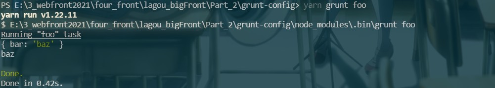

### 多目标任务

> 除了普通的任务形式以外，grunt中还支持一种叫做多目标形式的任务。

1. 写入如下代码，并运行，可以看到其提示未给build任务提供targets

```javascript
module.exports = grunt => {
  // 多目标模式，可以让任务根据配置形成多个子任务

  grunt.registerMultiTask('build', function () {
    console.log(111)
  })
}
```

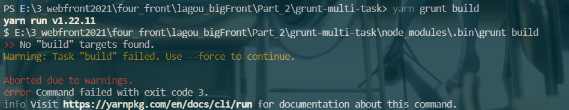

这是因为在写多目标任务时，我们需要为多目标任务配置不同的目标

2. 设置initConfig，并重新执行，可以发现其会同时运行两个目标

```javascript
module.exports = grunt => {
  // 多目标模式，可以让任务根据配置形成多个子任务

  grunt.initConfig({
    build: {
      css: '1',
      js:'2'
    }
  })

  grunt.registerMultiTask('build', function () {
    console.log('build task')
  })
}
```

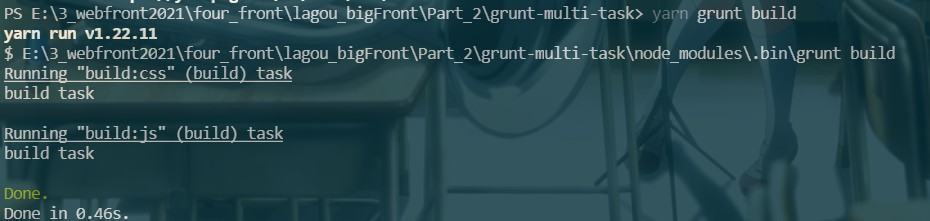

3. 使用build:子目标名称来运行子目标

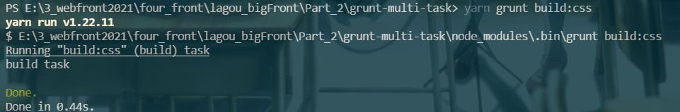

4. 通过this.target获取执行目标，通过this.data获取执行目标数据

```javascript
module.exports = grunt => {
  // 多目标模式，可以让任务根据配置形成多个子任务

  grunt.initConfig({
    build: {
      css: '1',
      js:'2'
    }
  })

  grunt.registerMultiTask('build', function () {
    console.log(`task: build, target: ${this.target}, data: ${this.data}`)
  })
}

```

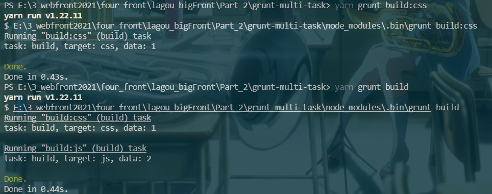

<div class="warning">

> 除了options以外，config中所有的属性的键都会被作为任务的目标。

</div>

5. 添加options选项，并执行，可以看到options并没有被作为任务的子目标，同时我们可以根据this.options()输出options的内容

```javascript
module.exports = grunt => {
  // 多目标模式，可以让任务根据配置形成多个子任务

  grunt.initConfig({
    build: {
      options: {
        foo:'bar'
      },
      css: '1',
      js:'2'
    }
  })

  grunt.registerMultiTask('build', function () {
    console.log(this.options())
    console.log(`task: build, target: ${this.target}, data: ${this.data}`)
  })
}

```

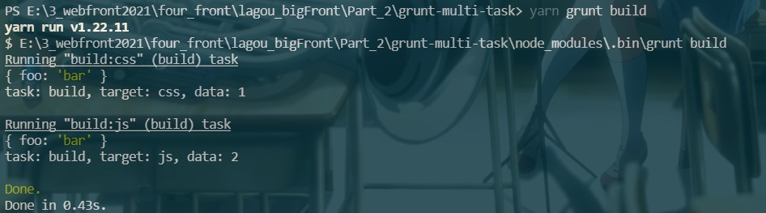

6. 给子目标添加options属性，可以看到此时子目标中的options会覆盖大的options选项

```javascript
module.exports = grunt => {
  // 多目标模式，可以让任务根据配置形成多个子任务

  grunt.initConfig({
    build: {
      options: {
        foo:'bar'
      },
      css: {
        options: {
          foo:'xxc'
        },
      },
      js:'2'
    }
  })

  grunt.registerMultiTask('build', function () {
    console.log(this.options())
    console.log(`task: build, target: ${this.target}, data: ${this.data}`)
  })
}

```

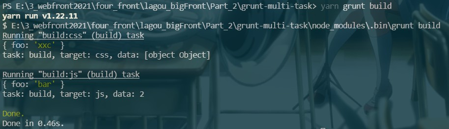

### 插件的使用

> 插件机制是grunt的核心，由于很多构建任务是通用的，所以社区中出现了很多预设的插件，这些插件内部封装了很多通用的构建任务，一般构建过程都是由这些通用的构建任务组成的。

此时使用grunt-contrib-clean做使用过程演示

1. 安装插件

```javascript
yarn add grunt-contrib-clean
```

2. 修改gruntfile.js

```javascript
module.exports = grunt => {
  // 使用clean插件需要配置对应的目标
  grunt.initConfig({
    clean: {
      // temp: 'temp/app.js'
      // 表示删除temp下的所有js文件
      // temp: 'temp/*.js'
      // 删除temp下所有的文件
      temp: 'temp/**'
    }
  })
  
  grunt.loadNpmTasks('grunt-contrib-clean')
}
```

3. 运行插件，此时可以看到temp下的所有文件被删除

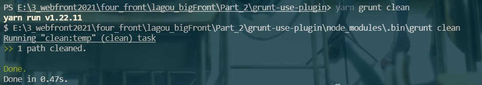

### 常用插件及总结

> grunt-sass：编译sass文件

1. 安装grunt-sass及sass模板支持

```javascript
yarn add grunt-sass sass --dev
```

2. 在gruntfile.js中写入如下代码，并执行sass任务，此时便可以看到该任务编译了sass文件并生成了css文件。

```javascript
const sass = require('sass')

module.exports = grunt => {
  grunt.initConfig({
    sass: {
      options: {
        implementation: sass  // 此处需要配置implementation来表名使用哪个模块来处理sass的编译
      },
      main: {
        files: {
          'dist/css/main.css':'src/scss/main.scss'
        }
      }
    }
  })

  grunt.loadNpmTasks('grunt-sass')
}
```

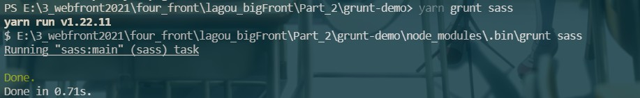

3. 将options改为如下形式，此时执行会生成相应的map文件

```javascript
options: {
    sourceMap: true,
    implementation: sass  // 此处需要配置implementation来表名使用哪个模块来处理sass的编译
},
```

> grunt-babel：编译ES6代码

1. 安装babel相关依赖

```javascript
yarn add grunt-babel @babel/core @babel/preset-env --dev
```

2. 安装loadGruntTask模块，来减少loadNpmTasks的使用复杂度。

```javascript
yarn add load-grunt-tasks --dev
```

3. 在gruntfile.js中添加代码，并执行yarn grunt babel，此时可以看到编译后的js文件生成

```javascript
const sass = require('sass')
const loadGruntTasks = require('load-grunt-tasks')

module.exports = grunt => {
  grunt.initConfig({
    sass: {
      options: {
        sourceMap: true,
        implementation: sass  // 此处需要配置implementation来表名使用哪个模块来处理sass的编译
      },
      main: {
        files: {
          'dist/css/main.css':'src/scss/main.scss'
        }
      }
    },
    babel: {
      options: {
        // 此处设为@babel/preset-env，则会将最新的ECMAScript特性都加载进来
        presets:['@babel/preset-env']
      },
      main: {
        files: {
          'dist/js/app.js':'src/js/app.js'
        }
      }
    }
  })

  // grunt.loadNpmTasks('grunt-sass')	
  loadGruntTasks(grunt)   // 自动加载所有的 grunt 插件中的任务,不需要再使用loadNpmTasks一个个加载任务
}
```

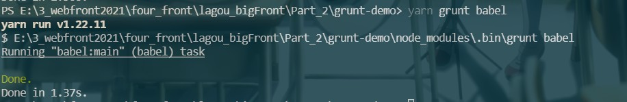

4. 同时babel也支持sourceMap选项。


> grunt-contrib-watch：用于检测文件变化及时刷新

1. 安装模块

```javascript
yarn add grunt-contrib-watch --dev
```

2. 在gruntfile.js中添加代码，并执行yarn grunt watch

```javascript
const sass = require('sass')
const loadGruntTasks = require('load-grunt-tasks')

module.exports = grunt => {
  grunt.initConfig({
    sass: {
      options: {
        sourceMap: true,
        implementation: sass  // 此处需要配置implementation来表名使用哪个模块来处理sass的编译
      },
      main: {
        files: {
          'dist/css/main.css':'src/scss/main.scss'
        }
      }
    },
    babel: {
      options: {
        // 此处设为@babel/preset-env，则会将最新的ECMAScript特性都加载进来
        presets:['@babel/preset-env']
      },
      main: {
        files: {
          'dist/js/app.js':'src/js/app.js'
        }
      }
    },
    watch: {
      js: {
        files: ['src/js/*.js'],
        tasks:['babel']   // tasks表示文件发生改变后要执行哪些任务。
      },
      css: {
        files: ['src/scss/*.scss'],
        tasks: ['sass']
      }
    }
  })

  // grunt.loadNpmTasks('grunt-sass')
  loadGruntTasks(grunt)   // 自动加载所有的 grunt 插件中的任务
}
```

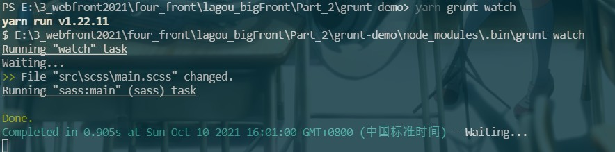

可以看到watch并不能直接执行babel和sass命令，而是要等到改变后才执行

3. 为watch添加映射

```javascript
grunt.registerTask('default',['sass','babel','watch'])
```

4. 运行default任务

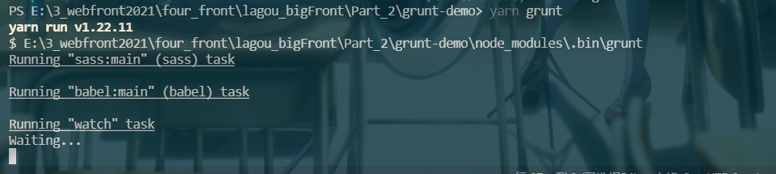

此时可以看到能够会先执行sass和babel再指向watch。


## Gulp

### 基本使用

> Gulp作为当下最流行的前端构建工具，核心的特点就是高效、易用，因为使用gulp的过程非常简单。先在项目中安装gulp开发依赖，然后在根目录中新建gulpfile.js文件来编写需要gulp自动执行的构建任务，然后就可以在命令行终端使用gulp提供的cli去运行这些构建任务。

使用步骤：

1. 初始化项目目录，并安装gulp模块（安装时会自动安装一个gulp-cli的模块）


2. 在项目根目录中新建一个gulpfile.js文件，并添加如下代码，然后运行

```javascript
// gulp 的入口文件

exports.foo = () => {
    console.log('foo task working~~~')
}
```

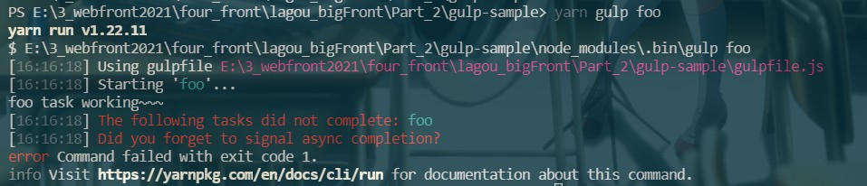

可以看到有一个报错：foo任务执行未完成，是否忘记标识任务的结束

原因：在最新版的gulp中取消了同步代码模式，约定每一个任务都是异步任务，在任务执行完成之后需要调用回调函数或其它的方式标记这个任务已经完成。

3. 修改代码，传入形参done，并在函数体内执行。此时再次执行代码可以看到代码成功执行且未发生错误

```javascript
// gulp 的入口文件

exports.foo = done => {
    console.log('foo task working~~~')

    done()  // 标识任务完成
}
```

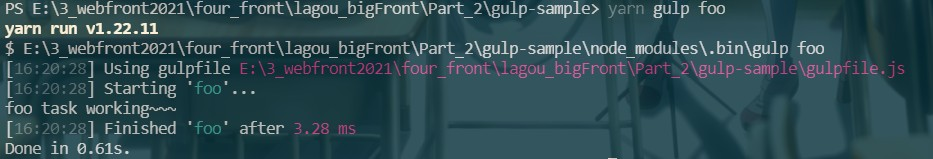

4. 添加default任务，此时运行gulp会默认执行default任务

```javascript
exports.default = done => {
    console.log('default task working~~~')

    done()
}
```

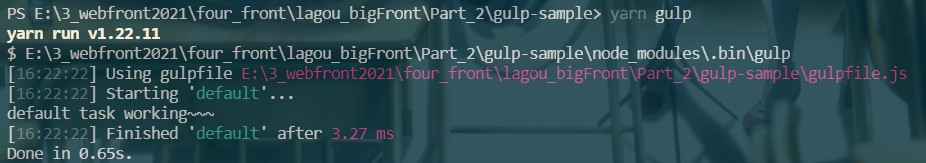

5. 使用gulp4.0以前的api定义任务并执行

```javascript
const gulp = require('gulp')

gulp.task('bar', done => {
    console.log('bar working')
    done()
})
```

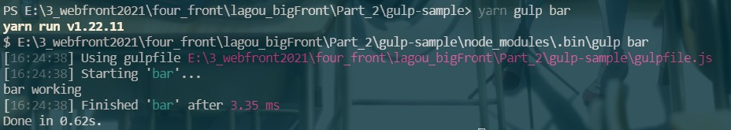

可以看到其能够执行成功，但是这种方式已经不被推荐了。


### 创建组合任务

> 除了创建普通的任务以外，gulp的最新版本还提供了series和parallel这两个用来创建组合任务的api，有了这两个api后就可以很轻松的创建并行任务和串行任务。

```javascript
const { series, parallel } = require('gulp')

const task1 = done => {
  setTimeout(() => {
    console.log('task1 working~')
    done()
  }, 1000)
}

const task2 = done => {
  setTimeout(() => {
    console.log('task2 working~')
    done()
  }, 1000)  
}

const task3 = done => {
  setTimeout(() => {
    console.log('task3 working~')
    done()
  }, 1000)  
}

// 让多个任务按照顺序依次执行
exports.foo = series(task1, task2, task3)

// 让多个任务同时执行
exports.bar = parallel(task1, task2, task3)

```

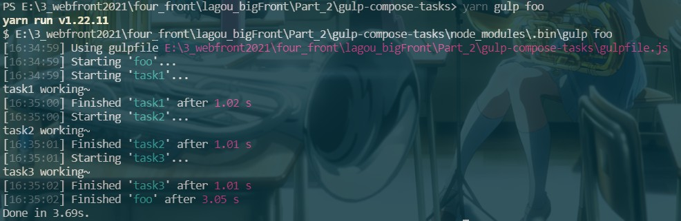

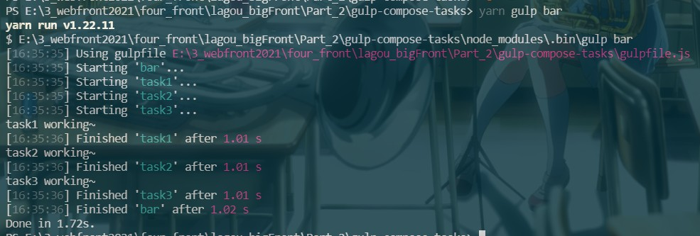

<div class="success">

>我们编译css和js任务，它们由于互不干扰，所以可以使用parallel并行的方式来创建。
>
>部署时需要先编译，此时就需要使用series这种串行的模式来执行任务。


​    </div>


### 异步任务的三种方式

> gulp中的任务都是异步任务，也就相当于异步函数，调用异步函数时使无法明确函数是否完成，都是在函数内部通过回调或事件的方式通知外部这个函数执行完成，那我们如何通知gulp函数执行完成？

方式一：

使用回调函数来通知函数完成

```javascript
exports.callback = done => {
  console.log('callback task')
  done()
}
```

这种回调函数与Node中的回调函数相同，都是错误优先的回调函数

```javascript
exports.callback_error = done => {
  console.log('callback task')
  done(new Error('task failed'))  // 通过给回调函数的第一个参数添加错误对象。
}
```

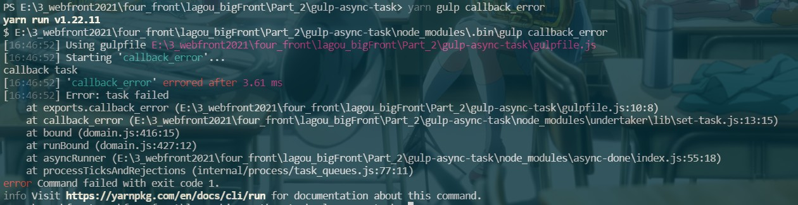

此时会提示错误信息，且若是多个任务同时执行的话，后续的任务也不会继续工作了。

方式二：

使用Promise的方式

```javascript
exports.promise = () => {
  console.log('promise task')
  return Promise.resolve()	// resolve中不需要传值
}

exports.promise_error = () => {
  console.log('promise task')
  return Promise.reject(new Error('task failed'))	// 返回失败的promise时，gulp会认为其是一个失败的任务，并停止后续任务的执行
}
```

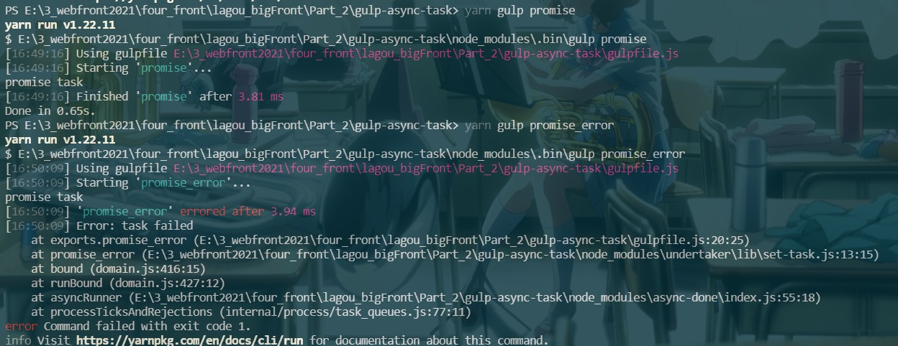

或者使用async/await的形式(注意async函数返回的是一个Promise对象)：

```javascript
const timeout = time => {
  return new Promise(resolve => {
    setTimeout(resolve, time)
  })
}

exports.async = async () => {
  await timeout(1000)
  console.log('async task')
}
```

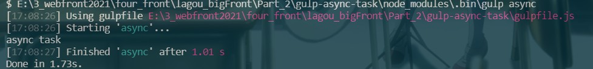

方式三：

使用stream的方式，其结束时间为readStream 执行end事件的时候

```javascript
exports.stream = () => {
  const read = fs.createReadStream('yarn.lock')
  const write = fs.createWriteStream('a.txt')
  read.pipe(write)  // 将read中的文件复制到write中
  return read
}
```

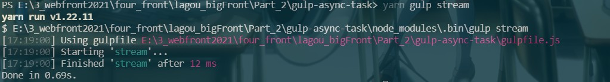

模拟gulp中结束任务的操作：

```javascript
exports.stream = done => {
  const read = fs.createReadStream('yarn.lock')
  const write = fs.createWriteStream('a.txt')
  read.pipe(write)
  read.on('end', () => {
    done()
  })
}
```

### 构建过程核心工作原理

> 构建过程大多数情况下都是将文件读出来，进行一些转换，最后写入到另外一些位置。

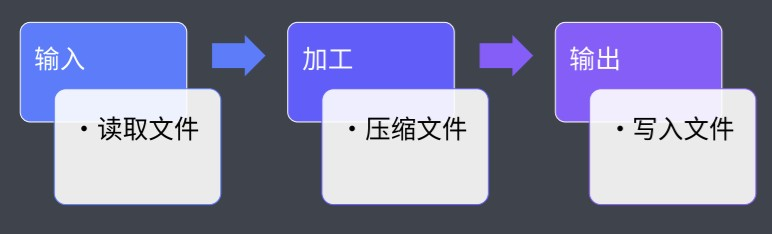

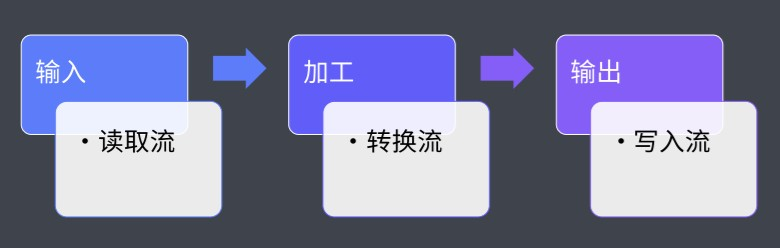

1. 不带加工的读取流与写入流

```javascript
const fs = require('fs')
const { Transform } = require('stream')

exports.default = () => {
  // 文件读取流
  const readStream = fs.createReadStream('normalize.css')

  // 文件写入流
  const writeStream = fs.createWriteStream('normalize.min.css')

  // 把读取出来的文件流导入写入文件流
  readStream.pipe(writeStream)
  return readStream
}

```

2. 带加工的代码

```javascript
const fs = require('fs')
const { Transform } = require('stream')

exports.default = () => {
  // 文件读取流
  const readStream = fs.createReadStream('normalize.css')

  // 文件写入流
  const writeStream = fs.createWriteStream('normalize.min.css')

  // 文件转换流
  const transformStream = new Transform({
    // 核心转换过程
    transform: (chunk, encoding, callback) => {   // 通过chunk获取文件读取流的文件内容
      const input = chunk.toString()  // 通过toString的方式将字节数组变为字符串
      const output = input.replace(/\s+/g, '').replace(/\/\*.+?\*\//g, '')
      callback(null, output)  // 错误优先的回调函数，第一个参数为null代表没有错误，output将最为转换后的结果导出
    }
  })

  return readStream
    .pipe(transformStream) // 转换
   	.pipe(writeStream) // 写入
}

```

<div class="success">

> gulp官方的定义为：The streaming build system（基于流的构建系统），gulp希望实现一个构建管道的概念，这样后期使用插件时就会有一个很统一的方式。

</div>

### 文件操作 API

> gulp中提供了专门用于创建读取流和写入流的API，相比于底层Node的API，gulp的API更强大也更容易使用。而转换流一般是通过独立的插件来提供。

```javascript
const { src, dest } = require('gulp')   // 引入gulp中的读取文件APIsrc与写入文件APIdest
const cleanCSS = require('gulp-clean-css')  // 此插件提供了压缩css代码的转换流
const rename = require('gulp-rename')   // 此插件提供了重命名文件后缀的转换流

exports.default = () => {
  return src('src/*.css')
    .pipe(cleanCSS())
    .pipe(rename({ extname: '.min.css' }))  // extname用于设置重名名文件的扩展名
    .pipe(dest('dist'))
}
```

### Gulp 自动化构建案例

```javascript
const { src, dest, parallel, series, watch } = require('gulp')

const del = require('del')  // 引入删除文件的插件
const browserSync = require('browser-sync')

const loadPlugins = require('gulp-load-plugins')

const plugins = loadPlugins()   // 使用gulp-load-plugins插件后，之后通过其实例.插件名即可自动加载插件，而不需要像下方那样一个个手动引入
// 注意这种方式只能自动引入gulp-开头的插件，且如果出现gulp-aaa-bbb这种名字的插件，使用时要写成 plugins.aaaBbb

// const sass = require('gulp-sass');  // 引入sass转css插件
// const babel = require('gulp-babel');  // 引入gulp-babel，下载这个插件同时还要下载@babel/core和@babel/preset-env（用于转换所有最新特性为ES5）
// const swig = require('gulp-swig');    // 引入模板引擎转换插件
// const imagemin = require('gulp-imagemin') // 引入压缩图片、字体的插件

const bs = browserSync.create()

// 模板引擎的渲染数据
const data = {
  menus: [
    {
      name: 'Home',
      icon: 'aperture',
      link: 'index.html'
    },
    {
      name: 'Features',
      link: 'features.html'
    },
    {
      name: 'About',
      link: 'about.html'
    },
    {
      name: 'Contact',
      link: '#',
      children: [
        {
          name: 'Twitter',
          link: 'https://twitter.com/w_zce'
        },
        {
          name: 'About',
          link: 'https://weibo.com/zceme'
        },
        {
          name: 'divider'
        },
        {
          name: 'About',
          link: 'https://github.com/zce'
        }
      ]
    }
  ],
  pkg: require('./package.json'),
  date: new Date()
}

const clean = () => {
  return del(['dist', 'temp'])  // del返回的是一个promise，此处的temp为一个生成的临时文件
}

const style = () => {
  return src('src/assets/styles/*.scss', { base: 'src' })   // 通过设置基准路径base，使得基准路径后面的文件路径保留下来
    .pipe(plugins.sass({ outputStyle: 'expanded' }))   // 添加sass编译转换流，将sass文件转为css文件，只会转换没有下划线开头的sass文件,设置outputStyle后可以让css选择器的结束括号单独占一行
    .pipe(dest('temp'))   // 输出目标目录，放到临时目录中，以便后续执行useref不会冲突。
  // .pipe(bs.reload({ stream: true }))
}

const script = () => {
  return src('src/assets/scripts/*.js', { base: 'src' })
    .pipe(plugins.babel({ presets: ['@babel/preset-env'] }))   // 若没传presets，可能会导致转换没有效果的问题出现
    .pipe(dest('temp'))
}

const page = () => {
  return src('src/**/*.html', { base: 'src' })             // 此种src写法表示匹配src下任意子目录的html文件
    .pipe(plugins.swig({ data }))   // 传入data
    .pipe(dest('temp'))
}

const image = () => {
  return src('src/assets/images/**', { base: 'src' })
    .pipe(plugins.imagemin())   // 图片压缩，此种压缩是无损的，只是将图片里一些无用的信息去除了。
    .pipe(dest('dist'))
}

const font = () => {
  return src('src/assets/fonts/**', { base: 'src' })
    .pipe(plugins.imagemin())
    .pipe(dest('dist'))
}

// public下的文件
const extra = () => {
  return src('public/**', { base: 'public' })
    .pipe(dest('dist'))
}

const serve = () => {
  // 使用gulp中的watch方法来监视文件并执行命令，而一旦执行命令生成新文件，bs.init就会监测到从而刷新浏览器。
  watch('src/assets/styles/*.scss', style)
  watch('src/assets/scripts/*.js', script)
  watch('src/**/*.html', page)

  // 下面这些文件并非一改变就需要重新执行任务
  // watch('src/assets/images/**', image)
  // watch('src/assets/fonts/**', font)
  // watch('public/**', extra)

  watch([
    'src/assets/images/**',
    'src/assets/fonts/**',
    'public/**'
  ], bs.reload)   // 文件更改后浏览器重新加载，以便拿到最新的文件。而不用重新编译

  bs.init({
    notify: false,    // 关闭右上角的小提示
    port: 2080,   // 设置端口
    // open: false,    // 取消自动打开浏览器
    files: 'temp/**',    // 指定temp下面的所有文件修改时更新浏览器,也可以不写这个参数，而是改为在每一个任务中添加reload，这样watch调用后就可以直接reload。
    server: {
      baseDir: ['temp', 'src', 'public'],   // 浏览器运行目录，此处添加的src和public是为了在开发阶段能够找到src和public下的文件
      routes: {   // routes中的配置优先于baseDir
        '/node_modules': 'node_modules'   // 此项设置之后，若有请求以/node_modules开头的，都会指向根目录下的node_modules文件，避免由于dist目录下没有相应文件而出错的情况发生
      }
    }
  })
}

const useref = () => {    // 把构建注释(compile时自动生成)当中引入的资源全部合并到同一个文件中。并执行压缩
  return src('temp/*.html', { base: 'temp' })   // 读取dist根目录下的所有html文件，并执行接下来的操作
    .pipe(plugins.useref({ searchPath: ['temp', '.'] }))  // searchPath指定要合并文件在哪些目录下找
    .pipe(plugins.if(/\.js$/, plugins.uglify()))  // 判断是否为js文件，若是则执行哪个插件
    .pipe(plugins.if(/\.css$/, plugins.cleanCss()))  // 判断是否为css文件，若是则执行哪个插件
    .pipe(plugins.if(/\.html$/, plugins.htmlmin({
      collapseWhitespace: true,   // 将换行空格压缩
      minifyCSS: true,  // 将css标签中的代码压缩
      minifyJS: true  // 将script标签中的代码压缩
    })))  // 判断是否为html文件，若是则执行哪个插件，此处需要配置相关选项，否则只会压缩一些符号间的空格
    .pipe(dest('dist'))
}

const compile = parallel(style, script, page)   // 将src下的文件编译河滨为一个任务，由于图片和字体不需要在开发阶段构建，所以不需要在此处添加

// 上线前打包任务
const build = series(
  clean,
  parallel(
    series(compile, useref),
    image,
    font,
    extra
  )
) // 将所有文件编译合并为一个任务，并使用series确保clean先执行，然后在执行编译,此处需要加image和font

const develop = series(compile, serve)

module.exports = {
  build,
  clean,
  develop
}
```

修改package.json中的script

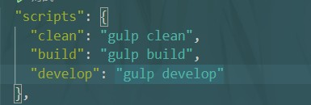

此后根据 yarn clean、yarn build、yarn develop即可执行相应代码。

在.gitignore中添加下面两项

```txt
dist

temp
```


## 封装自动化构建工作流

> 当我们涉及到要去开发多个同类型的项目，那我们的自动化构建工作流应该是一样的，这时我们就需要在多个项目中重复使用构建任务，而这些构建任务绝大多数情况下都是相同的，所以我们就需要解决gulpfile复用的问题。我们可以保存代码段，但是这种方式会导致一旦gulpfile需要修复或升级时，我们需要对每个使用到这个gulpfile的项目做修改，不适合整体项目的维护。此时就需要我们去封装自动化构建工作流。


待补......