## Virtual DOM

### 什么是Virtual DOM

- Virtual DOM(虚拟DOM)，是由普通的JS对象来描述DOM对象

- 真实DOM成员

  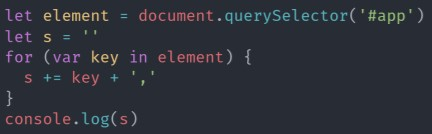

  通过以上代码输出真实DOM成员：

  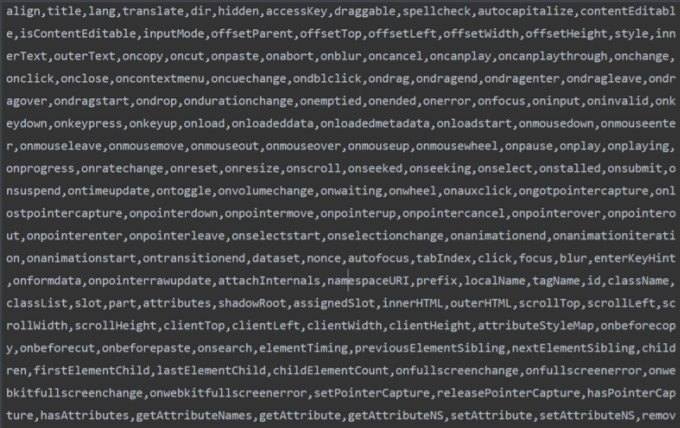

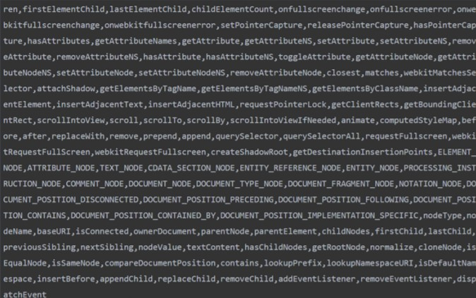

​			可以看到真实DOM中的数据是非常多的

- 使用Virtual DOM来描述真实DOM

  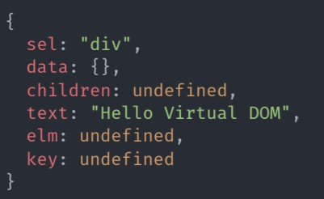

  虚拟DOM的创建比真实DOM的成本要小很多

### 为什么要使用Virtual DOM

- 前端应用开发原先需要手动操作DOM，还需要考虑浏览器兼容性等问题，后来有了jQuery，可以简化DOM操作，但随着应用复杂程度的提升，DOM操作也变得复杂。
- 为了降低开发复杂程度，出现了MVVM框架，解决了视图和状态同步问题。

- 过去模板引擎可以简化视图操作，但是没办法跟踪状态，只好把页面中的视图全部删除再重新创建。
- 为了解决状态跟踪的问题，出现了虚拟DOM，虚拟DOM在状态改变的时候，不需要立即更新DOM，只需要创建一个虚拟DOM树来描述真实的DOM树，虚拟DOM内部会根据diff算法来找到状态的差异，从而弄清如何有效的更新真实的DOM。
- 虚拟DOM可以维护程序的状态，跟踪上一次的状态，通过比较前后两次状态差异更新真实DOM。

### 虚拟DOM的作用和虚拟DOM库

#### 虚拟DOM的作用

- 维护视图和状态的关系
- 复杂视图情况下提升渲染性能，视图比较简单或首次渲染时并不能提高性能
- 跨平台
  - 浏览器平台渲染DOM
  - 服务端渲染SSR（Nuxt.js、Next.js）
  - 原生应用（Weex/React Native）
  - 小程序（mpvue/uni-app等）

#### 虚拟DOM库

- [Snabbdom](https://github.com/snabbdom/snabbdom)
  - Vue.js 2.x 内部使用的虚拟DOM就是改造的Snabbdom
  - 大约200 SLOC（single line of code）
  - 通过模块可扩展
  - 源码使用TS开发
  - 最快的Virtual DOM之一

## Snabbdom 基本使用

### 创建项目

- 初始化项目目录、安装打包工具parcel

  - 输入如下命令行命令

    ```javascript
    md snabbdom-demo
    cd cd .\snabbdom-demo\
    npm init -y
    npm install parcel-bundler -D
    ```

    

- 配置script，打包或者启动项目

  ```json
  {
    "name": "snabbdom-demo",
    "version": "1.0.0",
    "description": "",
    "main": "index.js",
    "scripts": {
      "dev": "parcel index.html --open",
      "build": "parcel build index.html"
    },
    "keywords": [],
    "author": "",
    "license": "ISC",
    "devDependencies": {
      "parcel-bundler": "^1.12.5"
    }
  }
  ```

  

- 初始化项目基本结构

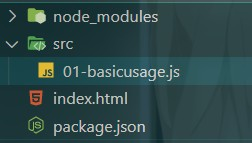

### 导入Snabbdom

[官方地址](https://github.com/snabbdom/snabbdom)

1. 安装

```javascript
yarn add snabbdom@2.1.0
```

2. 导入(此处路径与官网不同，官网的路径写法需要Webpack5.0支持)

```javascript
import { init } from 'snabbdom/build/init'
import { h } from 'snabbdom/build/h'

const patch = init([])
```

### 案例1

```javascript
import { init } from 'snabbdom/build/init'
import { h } from 'snabbdom/build/h'

const patch = init([])

// h函数用于创建虚拟DOM
// 第一个参数：标签+选择器
// 第二个参数：如果是字符串就是标签中的文本内容
let vnode = h('div#container.cls', 'Hello World')

let app = document.querySelector('#app')

// patch函数的作用：对比两个vnode，把两个vnode的差异更新到页面中。（把虚拟dom转换为真实dom，并挂载到dom树上）
// patch函数中，第一个参数：旧的VNode或DOM元素
// 第二个参数：新的VNode
// 返回新的VNode，即第二个参数，作为下一次更新的oldVNode（第一个参数）
let oldVNode = patch(app, vnode)
```

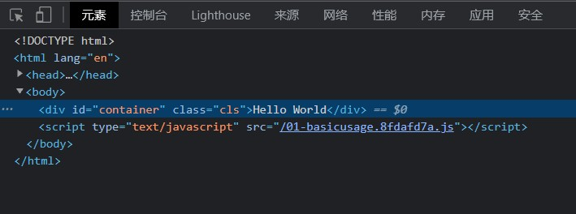

添加如下代码：

```javascript
vnode = h('div#container.xxx', 'Hello Snabbdom')
patch(oldVNode, vnode)  // 将新的vnode覆盖旧的
```

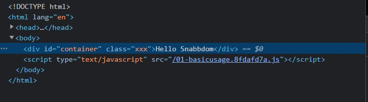

### 案例2

```javascript
import { init } from 'snabbdom/build/init'
import { h } from 'snabbdom/build/h'

const patch = init([])

let vnode = h('div#container', [
    h('h1', 'Hello Snabbdom'),
    h('p', '这是一个p')
])

let app = document.querySelector('#app')
let oldVnode = patch(app, vnode)    // 此处的oldVnode与 vnode是同一个东西

setTimeout(() => {
    // 替换div中的内容
    // vnode = h('div#container', [
    //     h('h1', 'Hello XXC'),
    //     h('p', 'Hello P')
    // ])
    // patch(oldVnode, vnode)

    // 清除div中的内容
    patch(oldVnode, h('!'))  // 在h函数中传入一个'!'，表示生成一个空的节点
}, 2000);
```

清除后的页面效果：

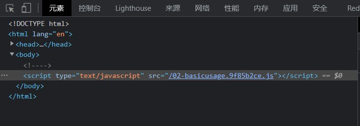

### 模块

> 模块的作用

- Snabbdom的核心库只能对VNode进行操作，并不能处理DOM元素得到属性/样式/事件等，可以通过注册Snabbdom默认提供的模块来实现
- Snabbdom中的模块可以用来扩展Snabbdom的功能
- Snabbdom中的模块的实现是通过注册全局的钩子函数来实现的

> 官方提供的模块

attributes、props、dataset、class、style、eventlisteners

> 模块使用步骤

- 导入需要的模块
- init() 中注册模块
- h() 函数的第二个参数处使用模块

```javascript
import { init } from 'snabbdom/build/init'
import { h } from 'snabbdom/build/h'

// 1.导入模块
import { styleModule } from 'snabbdom/build/modules/style'
import { eventListenersModule } from 'snabbdom/build/modules/eventlisteners'

// 2.注册模块
const patch = init([
    styleModule,
    eventListenersModule
])

// 3.使用h() 函数的第二个参数传入模块中使用的数据（对象）
let vnode = h('div', [
    h('h1', {
        style: { backgroundColor: 'red' },
    },
        'hello world'
    ),
    h('p', {
        on: { click: eventHandler },
    },
        'Hello P'
    )
])

function eventHandler() {
    console.log('别点我，疼')
}

let app = document.querySelector('#app')
patch(app, vnode)
```

## Snabbdom源码解析

> Vue中的虚拟dom是通过改造Snabbdom实现的，看完Snabbdom源码后便可掌握Vue中虚拟dom的实现原理。

### 如何学习源码

- 宏观了解
- 带着目标看源码
- 看源码的过程要不求甚解
- 调试
- 参考资料

> 看源码时需要的几个快捷键

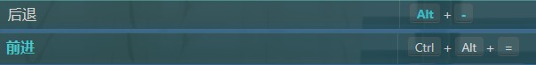

### Snabbdom的核心

- init() 设置模块，创建patch() 函数
- 使用h() 函数创建JavaScript 对象(VNode) 来描述真实DOM
- patch()比较新旧两个Vnode，如果第一个参数是真实DOM会将其转化为Vnode
- 把变化的内容更新到真实DOM树

#### h函数介绍

- 作用：创建VNode对象

- Vue中的h函数

  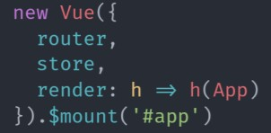

- h函数最早见于hyperscript，使用JavaScript创建超文本

> 函数重载

- 参数个数或参数类型不同的函数。
- JavaScript中没有重载的概念。
- TypeScript中有重载，不过重载的实现还是通过代码调整参数。

> 函数重载-参数个数

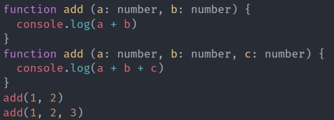

> 函数重载-参数类型

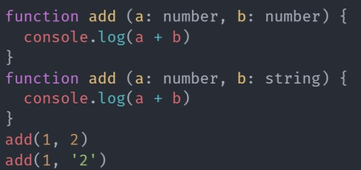


> h函数解析：

```javascript
export function h(sel: string): VNode;
export function h(sel: string, data: VNodeData | null): VNode;
export function h(sel: string, children: VNodeChildren): VNode;
export function h(
  sel: string,
  data: VNodeData | null,
  children: VNodeChildren
): VNode;
export function h(sel: any, b?: any, c?: any): VNode {
  let data: VNodeData = {};
  let children: any;
  let text: any;
  let i: number;
  // 处理参数，实现重载的机制
  if (c !== undefined) {
    // 处理三个参数的情况
    // set data children/text
    if (b !== null) {
      data = b;		// 此处的data是一些模块需要的属性
    }
    if (is.array(c)) {    // 如果是数组，说明是给当前节点设置子元素
      children = c;
    } else if (is.primitive(c)) { // 如果 c 是字符串或者数字，将其转为字符串
      text = c.toString();
    } else if (c && c.sel) {  // 如果c 是VNode，转为数组，存储到children中
      children = [c];
    }
  } else if (b !== undefined && b !== null) {
    if (is.array(b)) {
      children = b;
    } else if (is.primitive(b)) {
      text = b.toString();
    } else if (b && b.sel) {
      children = [b];
    } else {
      data = b;
    }
  }
  if (children !== undefined) {
    for (i = 0; i < children.length; ++i) {
      if (is.primitive(children[i]))  // 正常情况下，children中应该都是vnode对象，如果是字符串或数字，说明用户没有调用h函数，此时会调用vnode函数，将字符串或数字转为vnode
        children[i] = vnode(
          undefined,
          undefined,
          undefined,
          children[i],
          undefined
        );
    }
  }
  if (
    sel[0] === "s" &&
    sel[1] === "v" &&
    sel[2] === "g" &&
    (sel.length === 3 || sel[3] === "." || sel[3] === "#")
  ) {
    // 如果是 svg，添加命名空间
    addNS(data, children, sel);
  }
  // 返回vnode
  return vnode(sel, data, children, text, undefined);
}
```


#### VNode函数介绍

```javascript
import { Hooks } from "./hooks";
import { AttachData } from "./helpers/attachto";
import { VNodeStyle } from "./modules/style";
import { On } from "./modules/eventlisteners";
import { Attrs } from "./modules/attributes";
import { Classes } from "./modules/class";
import { Props } from "./modules/props";
import { Dataset } from "./modules/dataset";

// Key为字符串或数值或Symbol，用于唯一标识当前的VNode对象
export type Key = string | number | symbol;

// VNode接口，用于标识最终创建的VNode对象具有哪些属性
export interface VNode {
  sel: string | undefined;    // 选择器
  data: VNodeData | undefined;  // 模块中的所需要数据
  children: Array<VNode | string> | undefined;    // children：子节点，与text互斥
  elm: Node | undefined;  // VNode转换后的dom元素
  text: string | undefined;   // text：文本节点中的文本内容，与children互斥
  key: Key | undefined;   // 唯一标识一个节点
}

// VNodeData接口，用于约束VNode中data属性。
export interface VNodeData {
  props?: Props;
  attrs?: Attrs;
  class?: Classes;
  style?: VNodeStyle;
  dataset?: Dataset;
  on?: On;
  attachData?: AttachData;
  hook?: Hooks;
  key?: Key;
  ns?: string; // for SVGs
  fn?: () => VNode; // for thunks
  args?: any[]; // for thunks
  is?: string; // for custom elements v1
  [key: string]: any; // for any other 3rd party module
}

export function vnode(
  sel: string | undefined,
  data: any | undefined,
  children: Array<VNode | string> | undefined,
  text: string | undefined,
  elm: Element | Text | undefined
): VNode {
  const key = data === undefined ? undefined : data.key;  // key是通过data来赋值的
  return { sel, data, children, text, elm, key };   // 返回一个普通的对象，具备VNode接口定义的6个属性
}

```

#### patch整体过程分析

- patch(oldVnode,newVnode)
- 把新节点中变化的内容渲染到真实DOM，最后返回新节点作为下一次处理的旧节点
- 对比新旧VNode是否具有相同节点(节点的key和sel相同)
- 如果不是相同节点，删除之前的内容，重新渲染
- 如果是相同节点，再判断新的VNode是否有text，如果有并且和oldVnode的text不同，直接更新文本内容
- 如果新的VNode有children，判断子节点是否有变化（diff算法中最复杂的部分）

#### init函数介绍

> 要调用init函数，才能返回得到一个patch函数

```javascript
......
// init函数的第二个参数用来把vnode对象转换为其它平台下的元素api，没有传递时默认转为dom下的api元素（虚拟DOM实现跨平台）
export function init(modules: Array<Partial<Module>>, domApi?: DOMAPI) {
  const cbs: ModuleHooks = {    // 存储模块中的钩子函数，将来会在合适的时机执行
    create: [],
    update: [],
    remove: [],
    destroy: [],
    pre: [],
    post: [],
  };
    
  const api: DOMAPI = domApi !== undefined ? domApi : htmlDomApi;   // api默认将dom转为浏览器环境下的api对象，此api具有一些操作dom的方法

  for (const hook of hooks) {
    for (const module of modules) {     // 把模块中的钩子函数push到cbs的数组中。
      const currentHook = module[hook];
      if (currentHook !== undefined) {
        // cbs ---->  {create:[fn1,fn2] , update:[fn1,fn2] , .....}
        (cbs[hook] as any[]).push(currentHook);
      }
    }
  }
    
  ......
  // 返回patch函数，使得patch函数调用时传递的参数变少(init函数中加modules和domApi做了缓存，达到高阶函数的效果)
  return function patch(oldVnode: VNode | Element, vnode: VNode): VNode {
   ......
  };
```

#### patch函数介绍

```javascript
function sameVnode(vnode1: VNode, vnode2: VNode): boolean {
  // 判断cnode的key、data中的is，sel是否相同
  const isSameKey = vnode1.key === vnode2.key;
  const isSameIs = vnode1.data?.is === vnode2.data?.is;
  const isSameSel = vnode1.sel === vnode2.sel;

  return isSameSel && isSameKey && isSameIs;
}

function isVnode(vnode: any): vnode is VNode {
  return vnode.sel !== undefined;   // 如果vnode有sel属性，就说起其为vnode对象
} 
    
function emptyNodeAt(elm: Element) {
    const id = elm.id ? "#" + elm.id : "";    // 获取元素id，若存在在其前面加'#'，否则返回空字符串

    // elm.className doesn't return a string when elm is an SVG element inside a shadowRoot.
    // https://stackoverflow.com/questions/29454340/detecting-classname-of-svganimatedstring
    const classes = elm.getAttribute("class");

    const c = classes ? "." + classes.split(" ").join(".") : "";  // 获取类样式，转换为选择器形式
    return vnode(     // 调用vnode函数，创建vnode对象
        api.tagName(elm).toLowerCase() + id + c,    // 将id与类样式拼接起来，作为vnode对象的sel
        {},   // data
        [],   // children
        undefined,  // text
        elm   // dom元素
    );
}

// 返回patch函数，使得patch函数调用时传递的参数变少(init函数中加modules和domApi做了缓存，达到高阶函数的效果)
return function patch(oldVnode: VNode | Element, vnode: VNode): VNode {   // patch函数第一个参数既可以是VNode对象，又可以是普通的DOM对象
    let i: number, elm: Node, parent: Node;
    const insertedVnodeQueue: VNodeQueue = [];    // 存储新插入结点的队列，目的是为了触发节点的insert钩子函数。
    for (i = 0; i < cbs.pre.length; ++i) cbs.pre[i]();    // 触发cbs中所有pre钩子函数，并依次执行。pre钩子函数是处理vnode的钩子函数中的第一个钩子函数

    // 第一次创建 Vnode
    if (!isVnode(oldVnode)) {   // 通过isVnode判断第一个参数是否为Vnode对象
      oldVnode = emptyNodeAt(oldVnode);     // 通过emptyNodeAt函数将dom对象转换为Vnode对象
    }
	
    // 相同的 vnode (key 和 sel 都相等)
    if (sameVnode(oldVnode, vnode)) {   // 判断新旧vnode是否是相同节点，如果相同，进行差异寻找，而不用创建新节点，提高了效率
      patchVnode(oldVnode, vnode, insertedVnodeQueue);    // 找到两个vnode节点的差异，并更新到dom上
    } else {    // 如果节点不同，会创建新的vnode对应的dom元素，并把新创建的dom元素放到dom树上，并把老节点对应的dom元素移出（即删除重建）
      elm = oldVnode.elm!;    // ! 表示当前元素一定是有值的，后续可以直接使用（TS语法）
      parent = api.parentNode(elm) as Node;   // 获取父元素

      createElm(vnode, insertedVnodeQueue);   // 创建vnode节点对应的dom元素，并且把insertedVnodeQueue作为参数传入，同时函数内部会触发一些钩子函数。此处的vnode中的elm为undefined，createElm创建成功后其才有值

      if (parent !== null) {    // 判断parent是否有值，若有则把新的vnode对象对应的dom元素挂载到dom树上。
        api.insertBefore(parent, vnode.elm!, api.nextSibling(elm));   // 此处的nextSibling(elm)用于查看老vnode中下一个兄弟节点。并将新节点插入到其之前（及老节点之后）
        removeVnodes(parent, [oldVnode], 0, 0);   // 将老节点对应的dom元素移除
      }
    }

    for (i = 0; i < insertedVnodeQueue.length; ++i) {     // 触发新的vnode阶段对应的insert钩子函数
      insertedVnodeQueue[i].data!.hook!.insert!(insertedVnodeQueue[i]);   // insertedVnodeQueue中的元素是在createElm中添加的。‘！’用来推断前面的属性是否有指，有值继续，没值停止（代替了if语句）
      // insert钩子函数是从data中获取的（说明是用户传递过来的）
    }
    for (i = 0; i < cbs.post.length; ++i) cbs.post[i]();  // 触发模块中的post钩子函数
    return vnode;   // 返回新的vnode节点
  };
```

#### createElm 函数介绍

```javascript
const emptyNode = vnode("", {}, [], undefined, undefined); 

function createElm(vnode: VNode, insertedVnodeQueue: VNodeQueue): Node {
    let i: any;
    let data = vnode.data;
    // 执行用户设置的init钩子函数
    // 此处的data是h函数执行时的第二个对象参数
    if (data !== undefined) {
      const init = data.hook?.init;  // hook.init是用户传递的。  ? ：判断hook是否有值，有值的返回init，没值返回undefined。
      if (isDef(init)) {    // 判断init是否有定义
        init(vnode);    // 调用init函数，作用：在创建真实dom之前，让用户可以对vnode进行修改。比如更改样式等属性
        data = vnode.data;  // 将更改后的vnode(被init修改的)重新赋值给data。
      }
    }
    const children = vnode.children;
    const sel = vnode.sel;
    // 把 vnode 转换成真实 DOM 对象（没有渲染到页面）
    if (sel === "!") {    // 如果sel的值为！，会创建一个注释节点
      if (isUndef(vnode.text)) {    // 判断传过来的vnode.text是否为undefined，是的话转成空字符串
        vnode.text = "";    // 此处的text为注释节点中的文本内容
      }
      vnode.elm = api.createComment(vnode.text!);   // createComment用于创建注释节点
    } else if (sel !== undefined) {
      // 如果选择器不为空，解析选择器
      const hashIdx = sel.indexOf("#");   // 获取# 和 id的索引
      const dotIdx = sel.indexOf(".", hashIdx);
      const hash = hashIdx > 0 ? hashIdx : sel.length;
      const dot = dotIdx > 0 ? dotIdx : sel.length;
      const tag =
        hashIdx !== -1 || dotIdx !== -1
          ? sel.slice(0, Math.min(hash, dot))
          : sel;    // 从sel中解析出标签名

      // 创建dom元素
      const elm = (vnode.elm =
        isDef(data) && isDef((i = data.ns))   // ns为命名空间，根据是否有命名空间来判断用那个创建方法
          ? api.createElementNS(i, tag, data)
          : api.createElement(tag, data));

      // 为dom元素添加id和类样式
      if (hash < dot) elm.setAttribute("id", sel.slice(hash + 1, dot));
      if (dotIdx > 0)
        elm.setAttribute("class", sel.slice(dot + 1).replace(/\./g, " "));

      // 触发模块中的create钩子函数
      for (i = 0; i < cbs.create.length; ++i) cbs.create[i](emptyNode, vnode);

      // 如果children是数组的话，遍历所有子节点，并递归调用createElm（此处如果有children，则children一定是一个数组，因为h函数中实现了相关逻辑）
      if (is.array(children)) {
        for (i = 0; i < children.length; ++i) {
          const ch = children[i];
          if (ch != null) {
            api.appendChild(elm, createElm(ch as VNode, insertedVnodeQueue));
          }
        }
      } else if (is.primitive(vnode.text)) {    // 如果children不是数组，判断text是否为原始值，及string和number。
        api.appendChild(elm, api.createTextNode(vnode.text));   // 当text时原始值时，才将其放到添加为子节点
      }
      const hook = vnode.data!.hook;      // 获取用户传入的hook函数（hook函数个人理解是一些模块中定义的东西）
      if (isDef(hook)) {
        hook.create?.(emptyNode, vnode);    // 判断hook是否有create,如果有的话就触发
        if (hook.insert) {    // 判断hook中是否有insert，有的话将vnode加入到inserted队列中
          insertedVnodeQueue.push(vnode);
        }
      }
    } else {
      // 如果选择器为空，创建文本节点
      vnode.elm = api.createTextNode(vnode.text!);
    }
    // 返回新创建的 DOM
    return vnode.elm;
  }
```

#### 用户如何定义hook函数

```javascript
import { init } from 'snabbdom/build/init'
import { h } from 'snabbdom/build/h'

const patch = init([])

// h函数用于创建虚拟DOM
// 第一个参数：标签+选择器
// 第二个参数：如果是字符串就是标签中的文本内容
let vnode = h('div#container.cls', {
    hook: {
        init(vnode) {
            console.log(vnode.elm)
        },
        create(emptyNode, vnode) {      // create是dom元素创建完后执行的
            console.log(vnode.elm)
        }
    }
}, 'Hello World')

let app = document.querySelector('#app')

// patch函数的作用：对比两个vnode，把两个vnode的差异更新到页面中。（把虚拟dom转换为真实dom，并挂载到dom树上）
// patch函数中，第一个参数：旧的VNode或DOM元素
// 第二个参数：新的VNode
// 返回新的VNode，即第二个参数，作为下一次更新的oldVNode（第一个参数）
let oldVNode = patch(app, vnode)

vnode = h('div#container.xxx', 'Hello Snabbdom')
patch(oldVNode, vnode)  // 将新的vnode覆盖旧的
```

#### removeVnodes 和 addVnodes

```javascript
  function createRmCb(childElm: Node, listeners: number) {
    return function rmCb() {
      if (--listeners === 0) {    // 此处的listeners在cbs中的所有remove函数执行完后等于1，当最后调用一次rm()函数后，才可进入if判断。
        const parent = api.parentNode(childElm) as Node;
        api.removeChild(parent, childElm);
      }
    };
  }

  function addVnodes(
    parentElm: Node,    // 父元素
    before: Node | null,    // 插入到其前面的元素
    vnodes: VNode[],    // 要插入的元素
    startIdx: number,   // 起始
    endIdx: number,   // 结束
    insertedVnodeQueue: VNodeQueue    // 存储具有insert钩子函数的vnode节点队列
  ) {
    for (; startIdx <= endIdx; ++startIdx) {
      const ch = vnodes[startIdx];
      if (ch != null) {
        api.insertBefore(parentElm, createElm(ch, insertedVnodeQueue), before);
      }
    }
  }

function invokeDestroyHook(vnode: VNode) {
    const data = vnode.data;
    if (data !== undefined) {
      data?.hook?.destroy?.(vnode);   // 判断用户是否传入destory钩子函数，若传入，则调用
      for (let i = 0; i < cbs.destroy.length; ++i) cbs.destroy[i](vnode);   // 调用cbs中的destroy函数
      if (vnode.children !== undefined) {
        for (let j = 0; j < vnode.children.length; ++j) {   // 若存在子节点，则递归调用invokeDestroyHook
          const child = vnode.children[j];
          if (child != null && typeof child !== "string") {
            invokeDestroyHook(child);
          }
        }
      }
    }
  }

  function removeVnodes(    // 参数：父元素，要删除元素，起始位置，结束位置
    parentElm: Node,
    vnodes: VNode[],
    startIdx: number,
    endIdx: number
  ): void {
    for (; startIdx <= endIdx; ++startIdx) {  // 通过开始位置与结束位置遍历vnodes数组
      let listeners: number;
      let rm: () => void;
      const ch = vnodes[startIdx];
      if (ch != null) {   // 如果vnode存在
        if (isDef(ch.sel)) {    // 如果vnode是元素节点
          invokeDestroyHook(ch);    // 触发vnode中destroy钩子函数及cbs中的destroy钩子函数
          listeners = cbs.remove.length + 1;    // 获取cbs中remove钩子函数的个数并加1，listeners用于避免重复删除dom元素，此处+1是保证在remove函数全部执行完后再调用rm函数
          // rm函数的删除节点操作要么在removeHook(ch,rm)中调用，要么在rm()中调用，因为listeners始终比remove.length大1，当所有remove函数执行完后，listeners为1。所以最终通过前面两个函数来删除节点
          rm = createRmCb(ch.elm!, listeners);    // createRmCb 为高阶函数，内部返回真正删除dom元素的函数。
          for (let i = 0; i < cbs.remove.length; ++i) cbs.remove[i](ch, rm);  // 触发cbs中所有的remove构造函数，remove中会调用rm来删除dom元素
          const removeHook = ch?.data?.hook?.remove;    // 判断用户是否传入remove钩子函数
          if (isDef(removeHook)) {
            removeHook(ch, rm);   // 如果传入，则需要手动调用rm删除
          } else {
            rm();   // 没传入则直接调用rm。
          }
        } else {
          // 如果vnode是文本节点
          api.removeChild(parentElm, ch.elm!);    // 直接调用removeChild删除文本节点
        }
      }
    }
  }
```

#### patchVnode

> 作用，对比两个新旧vnode节点，找到它们的差异后更新到真实dom上

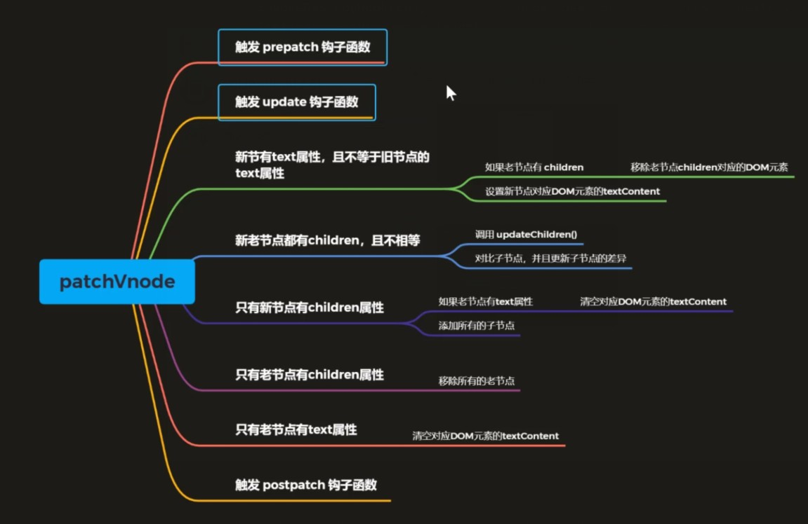

- 此处第3、5步要先移除老节点的children，以便触发remove钩子函数（里面可能有一些动画效果等），而不能直接将新节点的text属性替换掉老节点的children元素。

```javascript
  function patchVnode(
    oldVnode: VNode,
    vnode: VNode,
    insertedVnodeQueue: VNodeQueue
  ) {
    // 第一个过程：触发 prepatch 和 uodate 钩子函数
    const hook = vnode.data?.hook;    // 如果用户传入了prepatch钩子函数，则立即执行。
    hook?.prepatch?.(oldVnode, vnode);
        
    const elm = (vnode.elm = oldVnode.elm)!;    // 将旧节点的elm属性赋值给新节点
    
    const oldCh = oldVnode.children as VNode[];   // 获取新旧节点的子节点
    const ch = vnode.children as VNode[];
        
    if (oldVnode === vnode) return;   // 比较新旧节点是否是相同节点，若是，则直接返回。
        
    if (vnode.data !== undefined) {   // 如果不是相同节点，且新节点的data有值
      for (let i = 0; i < cbs.update.length; ++i)   // 则执行cbs中所有update钩子函数
      cbs.update[i](oldVnode, vnode);
      vnode.data.hook?.update?.(oldVnode, vnode);     // 执行用户传入的update钩子函数，后执行用户传入的update的原因是因为用户传入的update数据可以覆盖模块中的update数据
    }

    // 第二个过程：真正对比新旧 vnode 差异的地方
    /*
    	新无text有children，旧无text有children ->  调用 updateChildren 
    	新无text有children，旧有text无children ->  将旧的 text 清空，调用 addVnodes，将新的vnode 的 children 传入
    	新无text有children，旧无text无children ->  直接将新的 VNode 的 children 传入（与上一种情况合并）
    	
    	新无text无children，旧无text有children ->  调用 removeVnodes 将 旧的Vnode的子节点清除
    	新无text无children，旧有text无children ->  将旧的 text 清空。
    	新无text无children，旧有text无children ->  忽略，不做任何处理
    	
    	新有text无children，旧无text有children ->  将老节点用 removeVnodes 清空，使用 setTextContent 将新的 text 插入
    	新有text无children，旧有text无children ->  两者若不相同，则直接用新的覆盖旧的
    	新有text无children，旧无text无children ->  使用 setTextContent 将新的text插入
    */
    // 新节点不存在 text 的情况
    if (isUndef(vnode.text)) {    // 判断新节点是否具有text属性，没有的话继续比较子节点（text与children互斥）
      if (isDef(oldCh) && isDef(ch)) {    // 如果新旧节点都有子节点且不同，则调用updateChildren（对比新旧节点中所有的子节点并更新dom）
        if (oldCh !== ch) updateChildren(elm, oldCh, ch, insertedVnodeQueue);
      } 
        
      else if (isDef(ch)) {   // 如果新节点有子节点（老节点没有），且老节点有text属性，将text清空，调用addVnodes将新节点的子节点添加到elm中。
        if (isDef(oldVnode.text)) api.setTextContent(elm, "");		// 将旧节点的 text 清空
        addVnodes(elm, null, ch, 0, ch.length - 1, insertedVnodeQueue);		// 添加 children
      }
      
      // 下面两个判断是代表新节点什么都没有，判断旧节点 是否有 子节点 或者有 text(不必判断旧节点什么都没有的情况)
      else if (isDef(oldCh)) {  // 如果老节点有子节点（新节点没有），调用removeVnodes将老节点的子元素从dom树移出
        removeVnodes(elm, oldCh, 0, oldCh.length - 1);
      } 
      
      else if (isDef(oldVnode.text)) {    // 老节点有text属性，清空老节点
        api.setTextContent(elm, "");
      }
    } 
        
    else if (oldVnode.text !== vnode.text) {    // 此时新节点有text属性，再判断如果新旧节点的text不相等
      if (isDef(oldCh)) { // 如果老节点有子节点
        removeVnodes(elm, oldCh, 0, oldCh.length - 1);    // 去除子节点
      }
      api.setTextContent(elm, vnode.text!);   // 将新节点的text渲染到页面上（此处还是使用之前的dom元素，仅仅是更新了元素内容）
    }
    // 第三个过程：触发postpatch钩子函数
    hook?.postpatch?.(oldVnode, vnode);
  }
```

#### updateChildren整体过程

> Diff算法
>
> 渲染真实dom的开销很大，dom操作会引起浏览器的重排和重绘。虚拟dom中diff的核心是当数据变化后不直接操作dom，而是用js对象来描述真实dom，当数据变化后会先比较js对象是否发生变化，找到所有变化的位置，并只去最小化的更新变化位置，从而提高性能。

- 虚拟DOM中的Diff算法

  - 查找两颗树每一个节点的差异

    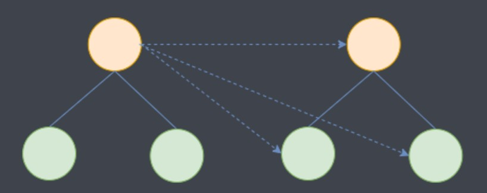

    此种节点比较方式，当有n个节点时，需要比较n^2次，最后还要循环遍历重新渲染。时间复杂度是O(n)^3

- Snabbdom根据DOM的特点对传统的diff算法做了优化

  - DOM操作时很少会跨级别操作节点。

  - 只比较同级别的节点，如果同级别不相同，直接删除，重新创建。

  - 同级别的节点只需要比较一次，从而达到减少节点比较次数的目的。

    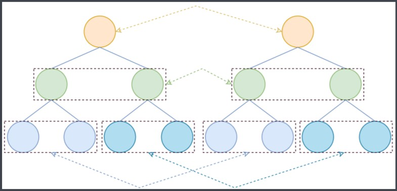

    当有n个节点时，只需要循环n次，循环时同时把找到的节点之间的差异更新到真实dom中。时间复杂度O(n)。

> 执行过程

- 在对开始和结束节点比较的时候，总共有四种情况
  - oldStartVnode/newStartVnode (旧开始节点 / 新开始节点)
  - oldEndVnode / newEndVnode (旧结束节点 / 新结束节点)
  - oldStartVnode / newEndVnode (旧开始节点 / 新结束节点)
  - oldEndVnode / newStartVnode (旧结束节点 / 新开始节点)

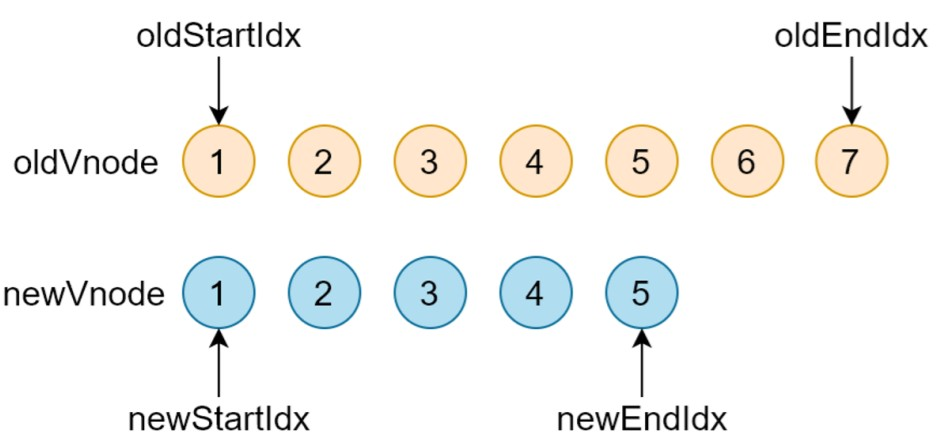

- 如果新旧开始节点是 sameVnode (key和sel相同)

  - 调用 patchVnode() 对比和更新节点
  - 把旧开始和新开始索引往后移动 oldStartIdx++ / oldEndIdx++ 

  

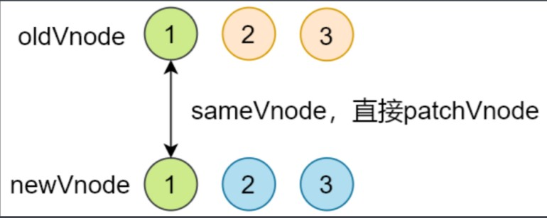

<div class="success">

> 先判断旧开始节点与新开始节点1是否是相同节点，如果是相同节点的话调用patchVnode比较两个节点内部的差异，然后更新到真实dom，比较完成后移动索引到第二个位置，继续比较第二个节点之间的差异。
> 如果开始节点不是sameVnode，则从后往前进行比较，比较3是否是someVnode，是的话调用patchVnode进行差异比较，更新到真实dom，移动索引。
> 如果是sameVnode的话，会重用旧节点的dom元素。在patchVnode中会比较两个节点的差异，然后把差异更新到重用的dom元素上，而当前的dom是不需要重新创建的。如果文本内容或子元素也都相同的话，是不会进行dom操作的。从而提高性能。

</div>

- 比较旧开始节点与新结束节点
  - 如果是相同节点，调用patchVnode()对比和更新节点
  - 把oldStartVnode对应的DOM元素，移动到右边，更新索引，将旧开始节点的索引移动到2，新结束节点的索引移动到6

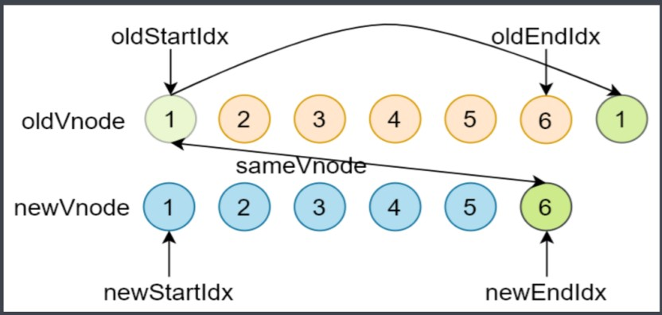

- 比较旧结束节点与新开始节点

  - 如果是相同节点，调用patchVnode() 对比和更新节点
  - 把oldEndVnode 对应的DOM元素，移动到左边，更新索引

  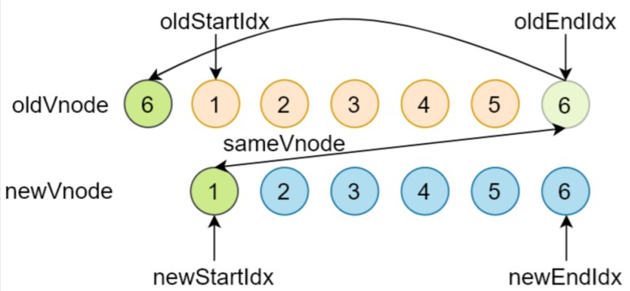

- 非上述四种情况

  - 遍历新的开始节点，在旧的节点数组中查找是否具有相同key值的节点，若没找到，说明此时的开始节点是新的节点，就需要创建新的dom元素并将其插入到最前面的位置

  - 如果找到具有相同key值的节点，继续判断sel是否相同，如果不同，就需要创建新的dom元素并将其插入到最前面的位置
  - 如果key和sel都相同，将elmToMove赋值给这个旧节点，并通过patchVnode比较两个节点的差异并更新，并将elmToMove移动到最前面。

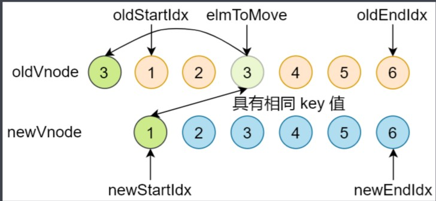

- 循环结束

  - 当老节点的所有子节点先遍历完（oldStartIdx > oldEndIdx）

    - 说明新节点有剩余，把剩余节点批量插入到右边（调用addVnodes）

      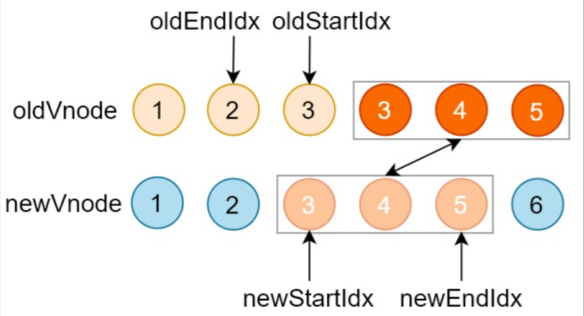

  - 当新节点的数组先遍历完（newStartIdx>newEndIdx）

    - 说明老节点有剩余，把剩余节点批量删除

      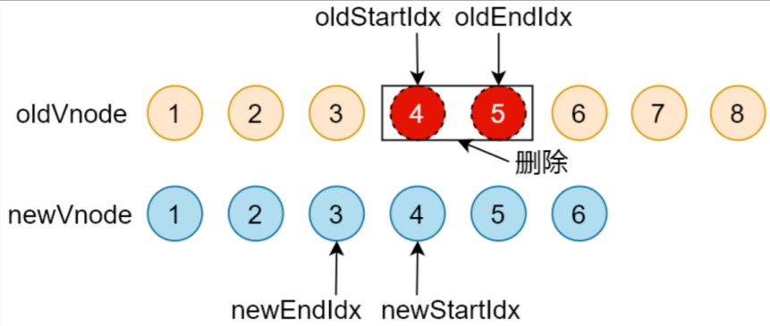

#### updateChildren函数介绍

```javascript
 function updateChildren(
    parentElm: Node,    // 父元素，用来添加新元素或删除旧元素
    oldCh: VNode[],   // 旧节点子节点
    newCh: VNode[],   // 新节点子节点
    insertedVnodeQueue: VNodeQueue
  ) {
    let oldStartIdx = 0;      // 旧开始节点索引
    let newStartIdx = 0;      // 新开始节点索引
    let oldEndIdx = oldCh.length - 1;     // 旧结束节点索引
    let oldStartVnode = oldCh[0];     // 旧开始节点
    let oldEndVnode = oldCh[oldEndIdx];   // 旧结束节点
    let newEndIdx = newCh.length - 1;     // 新结束节点索引
    let newStartVnode = newCh[0];   // 新开始节点
    let newEndVnode = newCh[newEndIdx];   // 新结束节点
    let oldKeyToIdx: KeyToIndexMap | undefined;
    let idxInOld: number;
    let elmToMove: VNode;
    let before: any;

    // 同级别节点比较
    while (oldStartIdx <= oldEndIdx && newStartIdx <= newEndIdx) {    // 循环条件：旧节点开始索引小于旧节点结束索引，新节点开始索引小于新节点结束索引
      // 查看新旧开始、结束节点是否为null，若为null则更新索引，重新赋值
      if (oldStartVnode == null) {
        oldStartVnode = oldCh[++oldStartIdx]; // Vnode might have been moved left
      } else if (oldEndVnode == null) {
        oldEndVnode = oldCh[--oldEndIdx];
      } else if (newStartVnode == null) {
        newStartVnode = newCh[++newStartIdx];
      } else if (newEndVnode == null) {
        newEndVnode = newCh[--newEndIdx];
        // 比较开始和结束的4种情况
      } 
        
        
      // 开始与开始做对比
      else if (sameVnode(oldStartVnode, newStartVnode)) {   // 比较新旧开始节点是否相同
        patchVnode(oldStartVnode, newStartVnode, insertedVnodeQueue);   // 若相同，则重用旧开始节点的dom元素，比较二者差异，更新到真实dom上
        oldStartVnode = oldCh[++oldStartIdx];     // 索引指向下一个节点，并将下一个节点作为新旧开始节点
        newStartVnode = newCh[++newStartIdx];     // 在下一次循环时，比较新旧的开始节点的下一个节点是否是相同节点，若不是，会比较旧的结束节点与新的结束节点是否是相同节点
      } 
      // 结束与结束做对比
      else if (sameVnode(oldEndVnode, newEndVnode)) {   // 如果新旧结束节点是相同节点，则重用旧结束节点的dom元素，比较二者差异，更新到真实dom上
        patchVnode(oldEndVnode, newEndVnode, insertedVnodeQueue);
        oldEndVnode = oldCh[--oldEndIdx]; // 索引指向上一个节点，并将上一个节点作为新旧结束节点
        newEndVnode = newCh[--newEndIdx];
      } 
      // 开始与结束做对比
      else if (sameVnode(oldStartVnode, newEndVnode)) {   // 如果新旧开始和结束节点不相同，则比较旧的开始节点与新的结束节点是否相同
        // Vnode moved right
        patchVnode(oldStartVnode, newEndVnode, insertedVnodeQueue);   // 如果相同，则重用旧开始节点的dom元素，比较二者差异，更新到真实dom上
        api.insertBefore(   // 将旧开始节点对应的dom元素移动到旧的结束节点对应的dom元素之后（使得与新节点的位置对应）
          parentElm,
          oldStartVnode.elm!,
          api.nextSibling(oldEndVnode.elm!)
        );
        oldStartVnode = oldCh[++oldStartIdx];   // 移动对应的索引
        newEndVnode = newCh[--newEndIdx];
      } 
      // 结束与开始做对比  
      else if (sameVnode(oldEndVnode, newStartVnode)) {   // 不满足以上三种情况下，比较旧的结束的节点与新的开始节点是否相同
        // Vnode moved left
        patchVnode(oldEndVnode, newStartVnode, insertedVnodeQueue);   // 执行patchVnode
        api.insertBefore(parentElm, oldEndVnode.elm!, oldStartVnode.elm!);  // 将旧的结束节点对应的dom元素移动到旧的开始节点对应的dom元素之前
        oldEndVnode = oldCh[--oldEndIdx];   // 移动对应的索引
        newStartVnode = newCh[++newStartIdx];
      } 
        
   
      // 以上四个都未命中
      else {
        // 不满足以上4种情况，遍历新节点，通过新节点的key，来老节点数组找相同的key的节点，并移动到对应的位置
        if (oldKeyToIdx === undefined) {    // oldKeyToIdx :{老节点的key,老节点的索引}，根据key来找索引
          oldKeyToIdx = createKeyToOldIdx(oldCh, oldStartIdx, oldEndIdx);   // createKeyToOldIdx有三个参数：老节点数组，老节点开始索引、老节点结束索引
        }
        idxInOld = oldKeyToIdx[newStartVnode.key as string];    // 用新节点的key作为参数来老节点map对象中索取老节点索引
        if (isUndef(idxInOld)) {    // 当新节点在老节点中不存在时，及没对应上
          api.insertBefore(   // 如果是undefined，将新的开始节点转换为真实dom，并插入到老的开始节点之前
            parentElm,
            createElm(newStartVnode, insertedVnodeQueue),
            oldStartVnode.elm!
          );
        } else {
          elmToMove = oldCh[idxInOld];      // 如果在老节点数组中找到了相同key的节点，再比较 sel 是否相等
       
          if (elmToMove.sel !== newStartVnode.sel) {    // 比较新节点的sel与老节点的sel是否相同。若不相同说明这个节点被修改过
            api.insertBefore(   // 创建新的dom元素，并插入到老的开始节点之前
              parentElm,
              createElm(newStartVnode, insertedVnodeQueue),
              oldStartVnode.elm!
            );
          } 
          // sel 相等、key相等    
          else {    // 如果老节点和新节点相同，则使用patchVnode进行新旧节点比较，并将新节点更新到dom元素中
            patchVnode(elmToMove, newStartVnode, insertedVnodeQueue);
            oldCh[idxInOld] = undefined as any;   // 将老节点数组对应位置的老节点设置为null
            api.insertBefore(parentElm, elmToMove.elm!, oldStartVnode.elm!); // 将老节点对应的dom元素移动到老的开始节点之前（使得下次比较不包含这个节点）
          }
        }
        newStartVnode = newCh[++newStartIdx];   // 让新的开始节点索引++，获取下一个节点作为新的开始节点
      }
    }
    // 循环结束的收尾工作
    if (oldStartIdx <= oldEndIdx || newStartIdx <= newEndIdx) {   // 判断新旧节点的开始索引小于结束索引，确保至少有一个数组没有遍历完
      if (oldStartIdx > oldEndIdx) {  // 当老节点数组先遍历完，新节点数组中有剩余
        before = newCh[newEndIdx + 1] == null ? null : newCh[newEndIdx + 1].elm;    // 插入到哪个节点前
        addVnodes(
          parentElm,
          before,
          newCh,
          newStartIdx,
          newEndIdx,
          insertedVnodeQueue
        );
      } else {      // 当新节点数组先遍历完，老节点数组中有剩余
        removeVnodes(parentElm, oldCh, oldStartIdx, oldEndIdx);   // 使用removeVnodes批量移除元素
      }
    }
  }
```

#### Key 的意义

> key用于diff算法中比较新旧Vnode，当不设置key的时候，某些情况下会认为新旧Vnode相同(当sel相同的)，最大程度的重用dom。
>
> 而若设置了key，当key相同时，会移动dom元素，当key不同时，创建新dom元素。
>
> 需要给具有相同父元素的子元素设置唯一的key，否则会造成渲染错误。

```javascript
import { init } from 'snabbdom/build/init'
import { h } from 'snabbdom/build/h'
import { attributesModule } from 'snabbdom/build/modules/attributes'
import { eventListenersModule } from 'snabbdom/build/modules/eventlisteners'

let patch = init([attributesModule, eventListenersModule])

const data = [1, 2, 3, 4]
let oldVnode = null

function view(data) {     // data为要渲染的数据，函数返回新的vnode
  let arr = []
  data.forEach(item => {
    // 不设置 key
    // arr.push(h('li', [h('input', { attrs: { type: 'checkbox' } }), h('span', item)]))
    // 设置key
    arr.push(h('li', { key: item }, [h('input', { attrs: { type: 'checkbox' } }), h('span', item)]))
  })
  let vnode = h('div', [h('button', {
    on: {
      click: function () {
        data.unshift(100)
        vnode = view(data)
        oldVnode = patch(oldVnode, vnode)
      }
    }
  }, '按钮'), h('ul', arr)])
  return vnode
}


let app = document.querySelector('#app')
// 首次渲染
oldVnode = patch(app, view(data))
```

#### key 的作用

https://cn.vuejs.org/v2/api/#key

- 有相同父元素的子元素必须有**独特的 key**。重复的 key 会造成渲染错误。

```html
<ul>
  <li v-for="item in items" :key="item.id">...</li>
</ul>
```

- 它也可以用于强制替换元素/组件而不是重复使用它（比如某些动画要替换才能生效）

```html
<transition>
  <span :key="text">{{ text }}</span>
</transition>
```

#### Diff 过程

```html
<div id="app">
  <button @click="onClick">按钮</button>
<ul>
  <li v-for="item in arr" :key="item">{{ item }}</li>
</ul>
</div>

<script src="../node_modules/vue/dist/vue.js"></script>
<script>
  let vm = new Vue({
    el: '#app',
    data: {
      arr: [1, 2, 3]
    },
    methods: {
      onClick () {
        // 不是响应式的
        // this.arr[0] = 0
        // this.arr.splice(0, 1, 0)
        
        this.arr.reverse()
      }
    }
  })
</script>
```

旧节点 ---> [vnode, vnode, vnode]

新节点 ---> [vnode, vnode, vnode]

- 四种情况演示：
  - 更改第一个元素的值，设置 key 和不设置 key
  - 翻转数组，设置 key 和不设置 key
- 更改第一个元素的值，不设置 key
  - 123
  - 023

```
updateChildren() 的时候比较新旧 VNode 数组中的第一个 VNode   (li)，此时是 sameVnode()
调用 patchVnode() 比较 VNode   (li)，都有子节点（文本节点）继续调用 updateChildren()
文本节点也都是 sameVnode() 调用 patchVnode()，此时有 text 属性，直接更新 li 的 text
继续比较第二个 vnode......最终都是更新文本的操作

最终只更新了一次文本节点
```

---

- 更改第一个元素的值，设置 key
- 123
- 023

```
如果把数组中的当前项，设置为 li 的 key 的话，第一个新的 VNode，和 第一个老的 VNode 不是 sameVnode
于是比较 最后一个新的节点和最后一个老的节点，是sameVnode，节点内容也一样什么都不做
倒数第二个节点也一样
回到比较第一个节点的过程，新的第一个节点，在老节点中找不到相同节点，
这时候创建一个新的 li，插入到第一个老的li之前。
此时新节点遍历完毕，结束循环。
最后再把老的第一个li节点，从界面上移除

只有一次插入的 DOM 操作，和一次移除的 DOM 操作
```

---

- 翻转数组，不设置 key
  - 1  2  3   
  - 3  2  1

```
不设置 key 的情况，对比 第一个旧的开始节点和新的开始节点，是 sameVnode
继续 updateChildren，更新文本节点的内容

继续往后都是相同的操作

二次更新文本的操作
```

---

- 翻转数组，设置 key

  -    1  2  3  

  - 3  2  1

    

```
翻转数组，第一个旧节点和第一个新节点不是 sameVnode
然后比较  最后一个旧节点和最后一个新节点，不是 sameVnode，
这时候继续比较第一个旧节点和最后一个新节点，key和sel相同，因为这两个节点的内容也是一样的，所以不更新，但是要移动位置，把第一个旧节点移动到结束节点之后

继续比较第二个开始节点和倒数第二个结束节点，是 sameVnode（此前会先判断新旧开始和结束节点是否相同，都不同进入此步）
把旧开始节点移动到旧结束节点之后

然后再比较旧的开始节点（3）和新的结束节点（3），此时是 sameVnode 什么都不做。

两次移动的操作（n-1次操作）
```