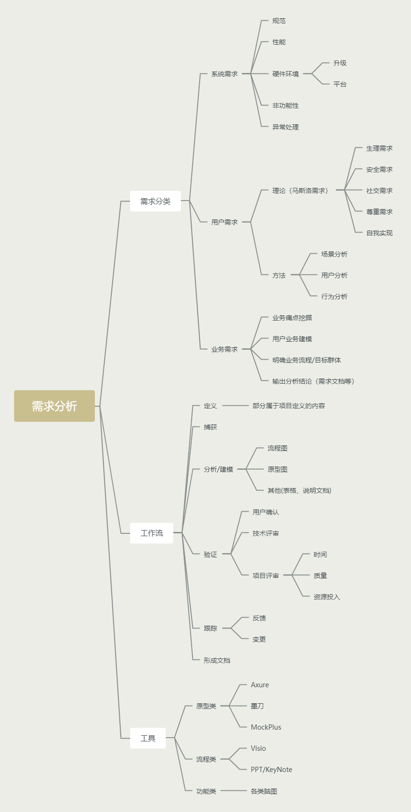
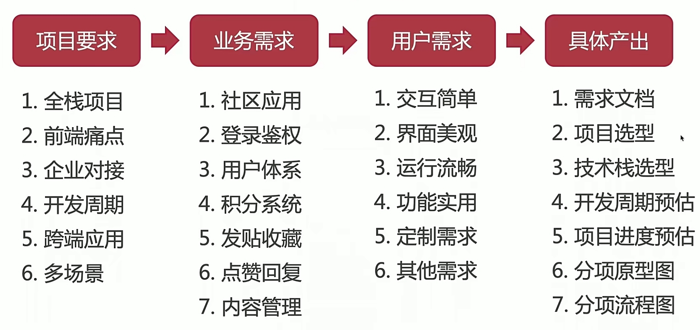

## 概览图：

## 需求分析难点和痛点全解析:

### 痛点

- 不想就做
- 照单全收
- 未沟通/确认（经常发生于开发人员与客户较熟，而忘记沟通）
- 放羊式管理

### 难点

- 除了考虑功能实现，还要考虑时间/成本
- 形成需求文档，用户回馈确认
- **引导用户的需求，创造用户需求**(避免用户需求与投入不成比)

## 需求分析举例：

开发周期预估，项目进度预估的目的：在企业的需求分析中预估的目的是为了分析项目值不值得做，能不能盈利。

由于每个项目的用户需求都不同，所以需求分析内容也会有较大差别。

## 项目需求变更：

在项目需求得到用户确认后，之后用户提出的对逻辑上、交互层面上或功能上的一些要求，都算是需求变更。

> 需求变更的考虑要素：

- 考虑是否合理
- 是否是项目范围内的变更，对主体业务是否有影响
- 明确需求变更的流程，确定需求变更

> 产品需求变更（来自产品经理的需求变更）

- 沟通是王道
- 会哭有奶吃（不要只会抱怨而不去要求）
- 引导需求（将产品经理天花乱缀的想法及时制止，对齐提出的要求进行可行度的解释，适当情况下可要求资源的增加）
- 自我挑战（比较适用于自己对自己有信心的情况）

若产品需求的变更对项目未来的发展有可预见的好处时，我们应当尽可能满足。

## 需求分析工具

- 原型类：Axure、Ps、墨刀、蓝湖

- 思维脑图：Xmind、MindNode(Mac)、MindManager
- 流程图：Visio(win)、OmniGraffle(Mac)、processOn

